# Whole Genome Transformer for Gene Interaction Effects in Microbiome Habitat Specificity

Zhufeng Li1,2,3, Sandeep S Cranganore4,5, Nicholas Youngblut6, Niki Kilbertus1,2,3

1Technical University of Munich, 2Helmholtz Munich, 3Munich Center for Machine Learning (MCML), 4Forschungszentrum Jülich, 5Technical University of Vienna, 6Max Planck Institute for Biology, Tübingen {zhufeng.li,niki.kilbertus}@tum.de

#### **Abstract**

Leveraging the vast genetic diversity within microbiomes offers unparalleled insights into complex phenotypes, yet the task of accurately predicting and understanding such traits from genomic data remains challenging. We propose a framework taking advantage of existing large models for gene vectorization to predict habitat specificity from entire microbial genome sequences. Based on our model, we develop attribution techniques to elucidate gene interaction effects that drive microbial adaptation to diverse environments. We train and validate our approach on a large dataset of high quality microbiome genomes from different habitats. We not only demonstrate solid predictive performance, but also how sequencelevel information of entire genomes allows us to identify gene associations underlying complex phenotypes. Our attribution recovers known important interaction networks and proposes new candidates for experimental follow up.

Code — https://github.com/zhufengli/prokaformer

#### 1 Introduction and related work

Machine learning (ML) on genetic data. Determining how gene-gene interactions influence certain traits, health, and disease has been a longstanding challenge for biologists and medical researchers (Gilbert-Diamond and Moore 2011; Wan et al. 2010). Modern high-throughput sequencing techniques such as massively parallel methods (Ronaghi et al. 1996; Nyren, Pettersson, and Uhlen 1993; Nayfach et al. 2021) or single cell RNA sequencing (Hwang, Lee, and Bang 2018; Jovic et al. 2022) together with recent developments in transformer-based models (Vaswani et al. 2017), which nowadays operate on sequences lengths up to 100,000 (Avsec et al. 2021) or even 1 million (Nguyen et al. 2023) base pairs, allow for modeling highly complex sequence diversity spanning large sections of the genome.

Within this paradigm, Jumper et al. (2021) achieved state of the art in protein folding predictions, Avsec et al. (2021) identified enhancer-promoter interactions with unprecedented accuracy, and Li et al. (2023); Avsec et al. (2021) demonstrate promising results on gene regulatory network inference. The potential impact on human health has also inspired large-scale concerted industry efforts into

Copyright © 2025, Association for the Advancement of Artificial Intelligence (www.aaai.org). All rights reserved.

building large transformer models that can perform multiple relevant tasks at once. For instance, in a sequence of papers (Rives et al. 2019; Rao et al. 2020, 2021; Meier et al. 2021; Hsu et al. 2022; Lin et al. 2022, 2023), a collection of models was released—dubbed Evolutionary Scale Modeling (ESM)—that perform tasks from protein design (beyond natural proteins) and (inverse) protein folding to variant-, function-, and property-prediction. Consens et al. (2023); Choi and Lee (2023) provide detailed overviews of recent deep-learning (in particular transformer) based models for the genome and what they are capable of.

**Importance of the microbiome.** Bacteria and archaea are often heavily underrepresented in deep learning models trained on genetic data (Zhou et al. 2023; Dalla-Torre et al. 2023). While modeling human genetic diversity has many direct implications for human health (Sapoval et al. 2022; Clapp et al. 2017), developing models that incorporate the vast genetic diversity across the microbial tree of life may lead to similar benefits, such as the development of novel microbiome therapeutics, inferring the health benefits of microbe-produced metabolites, and predicting the evolution of antibiotic resistance (Hernández Medina et al. 2022). Unlike the relatively static nature of the human genome, the microbiome is highly dynamic, adapting to environmental changes and interactions with its host or environment (Lloyd-Price et al. 2017; Ducarmon et al. 2023). The plasticity of the microbiome could be harnessed to treat disease more easily via microbiome interventions versus gene- or immuno-therapy (Schupack et al. 2022; Ratiner et al. 2023).

While works like ESM (Lin et al. 2023) and LookingGlass (Hoarfrost et al. 2022) included a large degree of known microbial diversity, these models are limited to single genes or short DNA sequences of 100 to 200 base pairs (Hoarfrost et al. 2022). Moreover, microbial genes are often arranged in operons that are co-regulated and often form protein complexes (Cao et al. 2019). Modeling large segments of the genome can thus incorporate much more genotypic complexity than models trained on single genes or short DNA sequences (Wei et al. 2024; Nguyen et al. 2023; Cheifet 2019).

Predicting phenotype from genotype is quite challenging in the context of the microbiome. First, the majority of microbial genome assemblies are not complete (Parks et al. 2022; Chklovski et al. 2023), and instead comprise 10's to 1000's of genome fragments (contigs). Even among individual genomes belonging to the same species, genomes can differ substantially in genomic content and arrangement [\(Rouli et al.](#page-15-9) [2015;](#page-15-9) [Lapierre and Gogarten](#page-14-10) [2009\)](#page-14-10); thus, the ordering of contigs usually cannot be inferred from closely related, completely assembled genomes. Second, microbial genome databases under-represent microbial diversity, especially microbes that are rare in well-studied environments or microbes only found in understudied environments [\(Brewster et al.](#page-12-5) [2019;](#page-12-5) [Pavlopoulos et al.](#page-15-10) [2023\)](#page-15-10). Third, the cellular functioning of most microbial genes and non-coding elements is unknown, which has led to initiatives to uncover this "microbial dark matter" [\(Hoarfrost et al.](#page-13-7) [2022;](#page-13-7) [Pavlopoulos et al.](#page-15-10) [2023\)](#page-15-10); however, much work is still needed. This work is especially challenging, given that many microbes cannot be cultivated [\(Almeida et al.](#page-11-1) [2021\)](#page-11-1), and genetic tools only exist for a small subset of cultivatable microbes [\(Marsh, Kirk, and Ley](#page-14-11) [2023\)](#page-14-11). Fourth, microbial phenotypes are often difficult to measure, given the challenge to isolate and measure the traits of individual strains. Complex phenotypes, such as microbial habitat, may involve a number of factors, including many cellular processes produced by a multitude of genes and regulatory elements.

Existing 'genotype to phenotype' methods. A number of approaches have been used to determine microbial phenotypes from genomic data. The most prominent are homology-based methods in which the function of a gene (or other genetic element) is inferred by a sequence similarity search to references with characterized functions. This approach is challenged by a lack of characterized references and the often incorrect assumption that sequence similarity predicts functional similarity. A similar approach is genome-wide association (GWAS) of nucleotide-level variations among very closely related organisms to infer phenotype based on how genetic variation correlates to characterized phenotypic variation [\(de Los Campos et al.](#page-13-8) [2018;](#page-13-8) [Collins and Didelot](#page-12-6) [2018;](#page-12-6) [Lees et al.](#page-14-12) [2020;](#page-14-12) [Yang and Jiang](#page-16-3) [2023\)](#page-16-3). Such methods often require many closely related individuals (e.g., intra-species) with matched high quality genome assemblies and characterized phenotypes. Another approach is the use of phylogenies to infer phenotypes of characterized sections of the evolutionary tree based on relatedness to characterized representatives. This approach is challenged by the difficulties of inferring accurate phylogenies, obtaining adequate numbers of phenotypically characterized representatives, and assuming that evolutionary relatedness correlates strongly with phenotypic similarity.

Given the often complex associations between genotype and phenotype, recent work has often leveraged machine learning to produce intricate models trained on empirical data. Traditionally, the focus has been on feature-based approaches, using genetic annotations from which phenotypes are inferred [\(Wood and Salzberg](#page-16-4) [2014;](#page-16-4) [Youngblut](#page-16-5) [et al.](#page-16-5) [2020;](#page-16-5) [Wood, Lu, and Langmead](#page-16-6) [2019\)](#page-16-6). For example, Traitar [\(Weimann et al.](#page-16-7) [2016a\)](#page-16-7) uses support vector machines with a sparsity penalty to predict phenotypes based on Pfam annotations [\(Mistry et al.](#page-14-13) [2021\)](#page-14-13).[1](#page-1-0) Those features can be aggregated over large collections of genes to use as input for machine learning methods [\(Weimann et al.](#page-16-8) [2016b;](#page-16-8) [Barash et al.](#page-11-2) [2018;](#page-11-2) [Wheeler, Gardner, and Barquist](#page-16-9) [2018;](#page-16-9) [Hernandez Medina et al.](#page-13-5) ´ [2022;](#page-13-5) [D'Elia et al.](#page-13-9) [2023\)](#page-13-9). A different approach is to ignore gene-level information and directly work on taxonomic compositional count data [\(Li](#page-14-14) [2015;](#page-14-14) [Calle](#page-12-7) [2019;](#page-12-7) [Knight et al.](#page-14-15) [2018;](#page-14-15) [Zhou and Gallins](#page-16-10) [2019;](#page-16-10) [Huang et al.](#page-13-10) [2023\)](#page-13-10). [Djemiel et al.](#page-13-11) [\(2022\)](#page-13-11) provides a high-level overview of existing work on functional inference from microbiota.

Despite the impressive progress achieved by these efforts, recent advances suggest that incorporating long stretches of genome sequences can enhance our understanding of genotype-phenotype relationships [\(Eraslan et al.](#page-13-12) [2019;](#page-13-12) [Al](#page-11-3)[harbi and Rashid](#page-11-3) [2022;](#page-11-3) [Deschenes et al.](#page-13-13) ˆ [2023;](#page-13-13) [Hammack](#page-13-14) [and Blaby-Haas](#page-13-14) [2023\)](#page-13-14). Deep learning applied to raw DNA data, such as CNNs for taxonomy prediction [\(Rojas-Carulla](#page-15-11) [et al.](#page-15-11) [2019\)](#page-15-11) or unsupervised training of transformers on kmers as tokens [\(Ji et al.](#page-14-16) [2020\)](#page-14-16), has indeed shown promise in this regard, offering a more nuanced view of the genetic underpinnings of complex phenotypes. Recently, several MLbased methods have also offered to prioritize non-coding variants; still, the recognition of disease-associated variants in complex traits, such as cancers, is challenging [\(Alharbi](#page-11-3) [and Rashid](#page-11-3) [2022\)](#page-11-3). On a methodological level, operating on (collections of) entire genomes at the sequence level remains difficult [\(Alharbi and Rashid](#page-11-3) [2022\)](#page-11-3). Even recent approaches to scale transformers to longer sequences via linear attention models [\(Dai et al.](#page-13-15) [2019;](#page-13-15) [Sukhbaatar et al.](#page-15-12) [2019;](#page-15-12) [Rae et al.](#page-15-13) [2019;](#page-15-13) [Child et al.](#page-12-8) [2019;](#page-12-8) [Beltagy, Peters, and Cohan](#page-11-4) [2020;](#page-11-4) [Zaheer et al.](#page-16-11) [2021\)](#page-16-11) or reducing sequence lengths up front by stacked shifted window transformers [\(Liu et al.](#page-14-17) [2021\)](#page-14-17) cannot directly be scaled to entire (collections of) genomes.

Contributions. In this work, we focus on habitat specificity, i.e., predicting and understanding a complex phenotype—where a microbiome sample was collected directly from the collection of genomes of the organisms in the sample. First, we phrase this as a classification task via the following steps: (a) comprehensive gene identification from a sample of genomic sequences, (b) compute fixedsize vector representations for each gene using the multibillion parameter ESM-2 model [\(Lin et al.](#page-14-8) [2023\)](#page-14-8), (c) train our encoder-only transformer on sequences of gene embeddings with a classification head for the habitat.

Next, we develop attribution techniques to extract highly habitat-predictive pairs of genes by: (a) retrieving pairs of genes with high attention scores, (b) clustering pairs by similarity, (c) looking up the genes from pairs within a cluster in existing databases [\(Cantalapiedra et al.](#page-12-9) [2021b\)](#page-12-9), and (d) constructing gene interaction networks for individual genomes. We train our model on a large subset of ProGenomes

putational microbiome research, such as the MGnify platform for microbiome sequence data analysis [\(Richardson et al.](#page-15-14) [2023\)](#page-15-14), SPIRE for searchable database integrating diverse information derived from metagenomes including many modalities [\(Schmidt et al.](#page-15-15) [2024\)](#page-15-15), online analysis platforms [\(Alam et al.](#page-11-5) [2021\)](#page-11-5), and more traditional protein family databases/mappers like NMPFamsDB [\(Bal](#page-11-6)[toumas et al.](#page-11-6) [2024\)](#page-11-6) or eggNOG [\(Cantalapiedra et al.](#page-12-10) [2021a\)](#page-12-10).

1There is a wide array of resources and platforms for com-

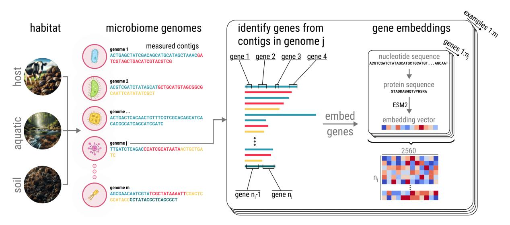

Figure 1: A conceptual overview of our data preprocessing pipeline. Each sample stands for an entire genome, reconstructed from shotgun sequencing in terms of contiguous consensus regions (contigs). We identify all genes within each contig (using Prodigal) and embed the corresponding protein sequences using an existing protein large language model (ESM-2) into a demb-dimensional vector space. A single 'input example', corresponding to an entire genome, is ultimately represented by a (nj × demb)-dimensional tensor.

v3, a dataset of almost 1 million high-quality prokaryotic genomes [\(Mende et al.](#page-14-18) [2020;](#page-14-18) [Fullam et al.](#page-13-16) [2023\)](#page-13-16).

Our empirical evaluations provide multiple insights. (a) Given the complexity of the phenotype, we obtain strong classification performance. (b) Our attribution is among the first to assess the importance of gene co-occurrence across entire genomes for phenotype prediction. It recovers some known interactions, and we hypothesize that it proposes good candidates for experimental follow up. (c) Our findings indicate that exploiting sequence level information is beneficial compared to functional or taxonomic annotations when predicting phenotype from genotype—in line with recently stated conjectures [\(Deschenes et al.](#page-13-13) ˆ [2023;](#page-13-13) [Hammack and](#page-13-14) [Blaby-Haas](#page-13-14) [2023\)](#page-13-14). In summary, studying how interactions among large collections of genes/proteins relate to complex phenotypes (such as habitat) directly from sequence level data holds great promise to advance our understanding of how the microbiome interacts with hosts and environments alike. While we focus on habitat specificity, we highlight that our methodology is not limited to such broad classification tasks from microbial data, but extends to other tasks and domains.

#### 2 Methodology

Microbiome data. Various peculiarities arise from the prevailing sequencing technology [\(Ghurye, Cepeda-](#page-13-17)[Espinoza, and Pop](#page-13-17) [2016\)](#page-13-17) used for large scale microbial DNA sequencing screens as collected by ProGenomes [\(Mende et al.](#page-14-19) [2016,](#page-14-19) [2019;](#page-14-20) [Fullam et al.](#page-13-16) [2023\)](#page-13-16). For example, instead of obtaining entire genomes, one typically only reconstructs so-called 'contigs', i.e., contiguous consensus regions of DNA that have been recovered from the short sequenced snippets. While different chromosomes are expected to produce different contigs, even circular, single-chromosome genomes may lead to multiple contigs. While genes appear in the right order within a contig, we typically cannot determine the order in which contigs appear within the full genome. We limit our attention to coding genes, requiring us to identify individual genes from within each contig. Our tailored data-preprocessing aims at accounting for these task-specific aspects. Figure [1](#page-2-0) provides an overview of the first stage of our framework.

Dataset. We obtain all genomic data from ProGenomes v3, an open-source database comprising over 900,000 consistently annotated bacterial and archaeal genomes from over 40,000 species. Collectively, the genomes contain 4 billion genes; for reference, the human genome contains about 20,000 coding genes. Consistent phenotypic data across all genomes in the database is limited, so we focus on habitat classification in order to comprehensively utilize the available genomic data and assess prediction performance for a complex phenotype. We select the three habitats with the most associated genomic data: *host* (symbiotic or parasitic microbiome, which relies on a host organism, typically collected from animal feces), *soil* (generally free-living microbiome collected from the soil), and *aquatic* (free-living microbiome collected from natural water bodies). In total, our genome dataset comprised m = 29, 089 genomes (soil: 8,248; host: 9,770; aquatic: 11,070) and 3,056,557 contigs with a mean length of 3445 ± 1632 genes.

Gene embeddings. The high variability of contig lengths in our dataset challenges the direct application of existing deep learning approaches. We therefore deploy a multi-gene approach that leverages an existing protein large language model to produce fixed-sized embeddings as input to our

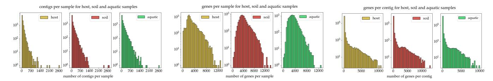

Figure 2: Left: Histogram of the number of contigs per sample (genome). Center: Histogram of the number of genes per sample (genome). Right: Histogram of the number of genes per contig.

model. Our workflow consists of identifying coding genes in each contig with Prodigal [\(Hyatt et al.](#page-13-18) [2010\)](#page-13-18), which results in 33 ± 179 genes per contig. Figure [2\(](#page-3-0)left) shows the distributions of how many contigs are contained in a sample with a clear skew towards few contigs per sample (note the logarithmic y-axis), Figure [2\(](#page-3-0)middle) shows the distribution of the overall number of genes extracted per sample, and Figure [2\(](#page-3-0)right) shows the distributions of genes per contig, which is also heavily skewed towards small contigs. The common peak at around 4,000 genes per sample aligns well with expectations of average gene counts in bacteria and archaea. We then use ESM-2 (3B) [\(Lin et al.](#page-14-8) [2023\)](#page-14-8) to embed each amino acid sequence identified by Prodigal into a fixed-dimensional (demb = 2560) vector space. Ultimately, for each sample j (i.e., each genome) we stack all nj gene embeddings belonging to that sample into a (nj ×demb)-dimensional tensor, where nj still varies across samples and which comprises one 'input example' for our model. For the roughly 8k, 10k, and 11k samples from soil, host, and aquatic habitats (a total of m = 29, 089 training examples), respectively, this yields a total of almost 1TB of pre-computed ESM-2 gene embeddings as the final dataset for our transformer model. Figure [1](#page-2-0) provides a conceptual overview of our data preparation process.

Model architecture and training. Since individual genes are typically shared by many organisms within and across habitats, we hypothesize that habitat specificity heavily depends on the co-presence and interaction effects of multiple genes. For these interactions, the local context is relevant because functionally related genes tend to be clustered in local neighborhoods on the genome [\(Xu et al.](#page-16-12) [2019\)](#page-16-12). The attention mechanism in transformer architectures [\(Vaswani et al.](#page-15-1) [2017\)](#page-15-1) is not only well suited to capture such associations in making predictions but also allows for attribution techniques to extract relevant pair-wise interaction effects (c.f., attribution paragraph in Section [2\)](#page-2-1). Hence, we propose an encoderonly BERT-like architecture [\(Devlin et al.](#page-13-19) [2019\)](#page-13-19) for classification (using the standard cross-entropy loss) with 15 layers, a single attention head, and a hidden dimension of 640. To reduce the memory footprint during training, we feed the original embeddings of dimension demb = 2560 obtained from ESM-2 into a single linear layer to obtain a reduced hidden dimension of 640.

We set the maximum input sequence length to 4096, reaching beyond the average number of genes within a genome. Because some samples in our dataset contain more genes than that (c.f., Figure [2\)](#page-3-0), we truncate them.[2](#page-3-1) Here, we make use of the fact that the order of genes is preserved within contigs, but not across contigs. Specifically, in each epoch, we randomly permute the contigs within every input example before potentially truncating (c.f., Figure [3\)](#page-4-0). Over multiple epochs, this procedure allows the model to learn dependencies between all possible pairs of genes even for the longest examples despite the limited maximum sequence length. Moreover, the permutation may encode our prior knowledge that there is no intrinsic (known) order among the contigs within an example as an invariance in the model. While various techniques for sparse and/or linear attention [\(Tay et al.](#page-15-16) [2021\)](#page-15-16) may allow us to extend the maximum input sequence, it would impede attention-based attribution, as we would not obtain comparable attention scores for all pairs of genes. Similarly, recent techniques scaling transformers to millions of base pairs such as Hyena [\(Nguyen et al.](#page-14-3) [2023\)](#page-14-3) rely on dilated convolutions on the input sequence, rendering attribution to interactions difficult. Therefore, we opted for full attention using FlashAttention [\(Dao et al.](#page-13-20) [2022\)](#page-13-20) during training, which still allows us to extract complete attention scores during attribution/validation.

Overall, our model consists of over 68 million trainable parameters. We used AdamW [\(Loshchilov and Hutter](#page-14-21) [2019\)](#page-14-21) with linear learning rate decay for 16 epochs on 4 NVIDIA A100 (40GB) GPUs until convergence of the out-of-sample performance on the validation set.

Attribution techniques. During training, we hold out nval = 1453 samples for validation and our attribution analysis. The goal of our attribution technique is to extract genepairs or even larger collections of genes whose co-presence in a given sample is predictive of the habitat. While genes within a pair need not necessarily physically interact as in protein complexes, we posit that they 'interact' in being jointly specific to the habitat. We propose the following procedure for attribution, which we depict in Figure [3.](#page-4-0)

1. For each sample in the validation set (each consisting of a collection of fixed-size gene embeddings grouped into contigs; c.f., Figure [3\)](#page-4-0) that was classified correctly with certain confidence (top softmax value above 0.85), compute all last-layer attention maps and extract the positions (indices) of the top-k scores for a fixed k ∈ N. Following common practice in the literature (starting with [Vaswani](#page-15-1)

2[Note that each of these 4096 'tokens' represents an entire gene,](#page-15-1) [each of which can consist of thousands of base-pairs. Therefore, the](#page-15-1) ['effective' context window approaches](#page-15-1) 107 base-pairs.

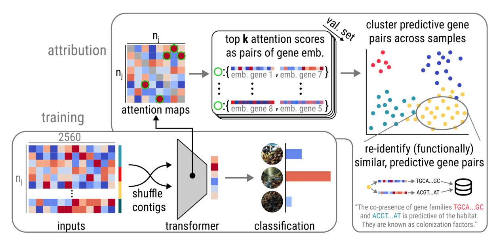

Figure 3: A conceptual overview of our training and attribution pipelines. **Training:** We feed the  $(n_j \times d_{\rm emb})$ -dimensional inputs to our transformer, interpreted as a sequence of  $n_j$  'tokens', each already represented by a fixed  $d_{\rm emb}$ -dimensional embedding. We randomly shuffle the contigs within each sample, since the 'correct' order is unknown. Our model is then trained with the cross-entropy loss for classification. **Attribution:** After training, we extract the last-layer attention maps for all validation samples. We find the indices of the top-k attention scores in each map, i.e., which gene embedding attends strongly to which other gene embedding. We cluster these pairs and visualize the clustering via non-linear dimensionality reduction. Within each cluster, we then re-identify the nucleotide sequences of all genes within all pairs and match them against gene annotation databases.

et al. (2017)), we interpret high attention scores as relevant to the prediction task. Each of the extracted  $n_{\mathrm{val}} \cdot k$  indices corresponds to a pair of input gene embeddings  $\{p_i := (x_i^1, x_i^2)\}_{i=1}^{n_{\mathrm{val}} \cdot k}$  for  $x_i^j \in \mathbb{R}^{d_{\mathrm{emb}}}$ .

2. In this step, we use DBSCAN (Ester et al. 1996) as a clustering algorithm, which has the advantage of inferring the number of clusters by itself, and cluster via the following custom distance function

$$dist(p_i, p_j) = min\{2 - S_c(x_i^1, x_j^1) - S_c(x_i^2, x_j^2), 2 - S_c(x_i^1, x_j^2) - S_c(x_i^2, x_j^1)\},$$

where  $S_c$  is the cosine similarity and we are agnostic about the order of the genes within the pair.

- 3. For each point  $p_i$  in each cluster, we recover the two gene sequences that produced the gene embeddings  $x_i^1, x_i^2$ . We then perform sequence similarity search on all these genes in the databases EggNOG (Cantalapiedra et al. 2021a), KEGG orthologs (Kanehisa et al. 2015), and NCBI Blast (Altschul et al. 1990; Boratyn et al. 2019; Camacho et al. 2023) to extract functional and taxonomic annotations.
- 4. We propose gene interaction networks loosely inspired by gene pathways. If a certain gene appears in more than one of the pairs *within a sample*, we use these overlaps in the extracted *k* pairs of genes to construct a gene network. Genes that are hubs in these networks have many highly predictive interactions with other genes and may thus be of particular functional importance.

#### 3 Results

Why habitat classification? The reason we focus on the seemingly 'simple' three-way classification of habitats (host, soil, and aquatic) is three-fold. First, habitat is a broad and highly complex phenotype, which is difficult to predict directly from genotype. Hence, strong performance on this task indicates that our general framework may apply equally to other phenotypes. Second, it is straightforward to compare feature attributions among all three classes in order to help validate our approach. Third, habitat annotations are typically reliable and widely available for microbiome samples. In the remainder of this section, we particularly focus on extensive internal and external validation results demonstrating that our modeling approach manages to pick up on the importance of the co-presence of genes.

We conjecture that gene pairs (or collections/networks) found by our attribution technique are of biological interest in various ways. For example, when predicting host-related habitats, such gene clusters may shed light not only on specific genes but also on gene interaction networks that may be involved in colonization (Stephens et al. 2015; Powell et al. 2016a; Kemis et al. 2019). When the identified gene pairs are found in gene annotation databases and have known functional annotations, we can directly point to interactions of functional aspects associated with the predicted phenotype and potential colonization properties. On the contrary, when the found genes are part of the "microbial functional dark matter", we hypothesize they are good candidates to follow up on experimentally. For example, one could knock out the

Table 1: One-vs-rest performance of our model.

| class   | samples | precision recall |      | F1   |
|---------|---------|------------------|------|------|
|         |         | test set         |      |      |
| host    | 488     | 0.84             | 0.80 | 0.82 |
| soil    | 412     | 0.63             | 0.43 | 0.51 |
| aquatic | 553     | 0.66             | 0.84 | 0.74 |
|         |         | pseudo-samples   |      |      |
| host    | 488     | 0.58             | 0.82 | 0.68 |
| soil    | 412     | 0.58             | 0.16 | 0.24 |
| aquatic | 553     | 0.58             | 0.69 | 0.63 |

predicted genes and measure the abundance of the mutant versus wild type in a model habitat [\(Powell et al.](#page-15-19) [2016b;](#page-15-19) [El](#page-13-22)[lison et al.](#page-13-22) [2011;](#page-13-22) [Brouwer et al.](#page-12-13) [2020\)](#page-12-13).

Classification performance. We evaluate our model on nval = 1453 held out samples from the ProGenomes v3 dataset. It achieves an overall accuracy of 71% (Table [2\)](#page-7-0). Given the complexity of the task (see Section [1\)](#page-0-0), this is a strong performance for our 3-way classification task. For more detailed comparisons with the baselines, we refer reader to the Appendix [A.](#page-7-1) Table [1\(](#page-5-0)top) shows how performance varies across habitats: while host samples are identified well, samples from the soil are often misclassified as aquatic. Biologically, host microbiomes are mostly symbiotic or parasitic, where they tend to lose unneeded portions of their genome due to deletional bias in bacterial genomes [\(McCutcheon and Moran](#page-14-24) [2012;](#page-14-24) [Boscaro et al.](#page-12-14) [2017\)](#page-12-14). This arguably leads to substantial genomic differences from freeliving microbiomes in soil or aquatic environments, which conversely can have strong adaptability due to their versatile metabolic pathway and, therefore, can survive in a variety of environments [\(Shu and Huang](#page-15-20) [2022;](#page-15-20) [Moreno-Gamez](#page-14-25) ´ [2022\)](#page-14-25). There is likely also a more direct mixing of microbiomes inhabiting soil and aquatic environments, rendering distinguishing soil from aquatic examples incredibly difficult. Finally, the sample imbalance in our training set is slightly skewed towards aquatic examples. Appendix [D](#page-7-2) provides an ablation of how the number of layers, size of feedforward layers, and embedding dimension affect model performance.

Internal validation. To provide some internal validation of the effectiveness of our attribution technique, we construct 'pseudo-examples', inputs to our model that consist only of genes that were identified by the attribution to be part of highly-predictive pairs for k = 100. We randomly concatenate the respective gene embeddings from each validation example (without repetitions) to form 'pseudoexamples' which consist on average of only about 100 genes. These pseudo-examples (a) present only about 3% of the original genomes, and (b) only serve as a bag of genes in that the true order of genes on the genome (or within contigs) is lost—typically crucial information [\(Salaverria et al.](#page-15-21) [2011\)](#page-15-21). Given those limitations, we would expect classification performance to drop to essentially random guessing unless the genes contained in the 'pseudo-examples' are highly predictive for the habitat. Our model still achieves an overall accuracy of 58%, substantially better than random guessing. Table [1\(](#page-5-0)bottom) shows that the model can still extract useful information from host and aquatic 'pseudo-examples'. This provides strong evidence that gene pairs identified by our attribution, indeed contain a significant number (and important combinations) of habitat-specific genes.

Clustering. The purpose of running gene pair clustering is two-fold: it serves as additional validation that allows us to judge the consistency of gene pair prediction across all genomes from the same environment. At the same time, it can provide us with new perspectives on understanding the function of genes and the relationship between genotype and phenotype. We expect gene pairs within the same cluster to have similar functions, and that a cluster reflects common gene families shared by microbes from a given habitat.

In Figure [4](#page-6-0) we illustrate the gene pair clusters using UMAP [\(McInnes, Healy, and Melville](#page-14-26) [2018\)](#page-14-26).[3](#page-5-1) The pairs of genes cluster well, indicating that gene pairs within a cluster are functionally similar as measured by the distance of their ESM-2 embeddings. Further, different clusters are well-separated, indicating that we have identified different 'hubs' of gene interactions that are individually predictive of the habitat. For completeness, we provide similar plots using t-SNE [\(van der Maaten and Hinton](#page-15-22) [2008\)](#page-15-22) instead of UMAP in Figure [7](#page-8-0) in Appendix [C,](#page-7-3) showing that the clear separation of clusters is not specific to the choice of dimensionality reduction technique.

We further verified that within most found clusters, gene families are quite uniform. From the extracted functional and taxonomic annotations, we found that the clusters recover biologically plausible 'functional factors'. For example, in the largest (blue) cluster from host samples, most of the pairs share the KEGG orthologs [\(Kanehisa et al.](#page-14-22) [2015\)](#page-14-22) K01992 and K11051. The latter is known as multidrug/hemolysin transport system permease, a protein that plays an important role in bacterial infection of animal hosts. In the largest (blue) cluster from aquatic samples, most gene pairs share the K08226 functional ortholog. Genes from this ortholog code chlorophyll transporter. This matches our knowledge that most photosynthetic bacteria, such as Cyanobacteria and Chlorobi, live in water. In the largest (blue) cluster from soil samples, we found the following frequent orthologs: K01535, K01531, K17686, K01533, and K17686. These gene families are all involved in ion transport. For completeness, we provide all found orthologs in all of the clusters for the three classes in Appendix [F.](#page-8-1) Great care must be taken when associating biochemical functions of single-gene coded proteins with complex phenotypes. However, we believe that surfacing interpretable pointers toward potentially relevant interactions from full genome data is a promising tool to guide hypothesis formation for experimental colonization studies.

Gene interaction networks. We present an example of one of the gene interaction networks constructed by our attri-

3We omit 'outliers', i.e., points that did not belong to any cluster after DBSCAN finished for a clearer illustration. These outliers are bound to exist due to the breadth of habitat as a phenotype.

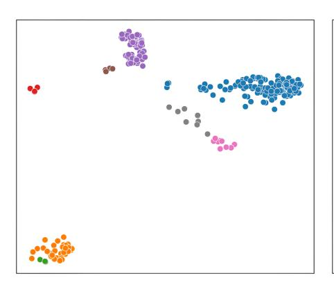

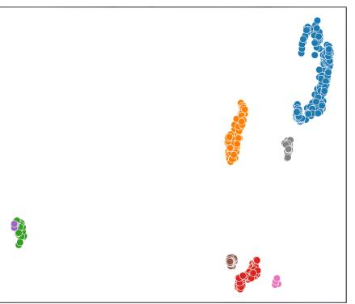

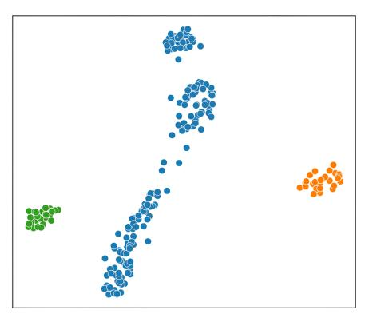

Figure 4: Two-dimensional visualization of the clusters for aquatic (left), host (middle), and soil (right) samples via UMAP [\(McInnes, Healy, and Melville](#page-14-26) [2018\)](#page-14-26), omitting points not belonging to any cluster.

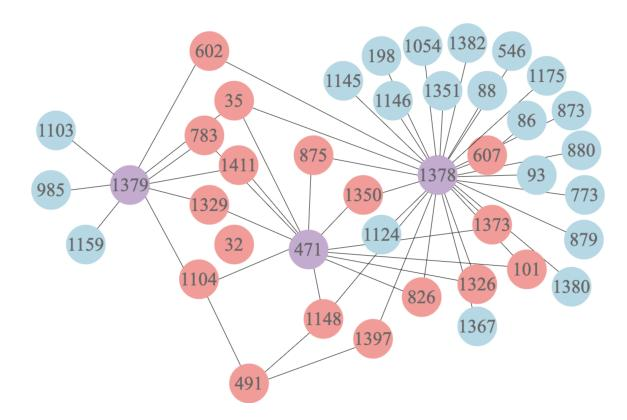

Figure 5: Gene interaction network for the sample 1311.SAMN14644158; coral/violet: genes with more than one neighbor (hubs); blue: genes with one neighbor (peripheral); Purple hubs are described in the text. Numbers are in order of appearance on the genome.

bution technique in Figure [5.](#page-6-1) The genome from which this network was constructed belongs to Streptococcus agalactiae, a commensal bacterium. Although it colonizes the gastrointestinal and genitourinary tract of up to 30% of healthy human adults, it is still poorly understood. We could only find functional annotations for 14 of the 41 genes in the network. The rest of the genes have no annotation via our methodology. In particular, the gene with the most connections, gene 1378, is identified as a peptidoglycan bound protein that can have various functions, including roles in cell wall synthesis, cell division, and interaction with the environment. In the context of bacterial colonization, peptidoglycan-bound proteins can contribute to the adherence of bacteria to host tissues, evasion of the host immune response, and establishment of infection [\(Dorr et al.](#page-13-23) ¨ [2014\)](#page-13-23). Further, gene 1379, another highly connected hub in our network, is involved in dextransucrase activity. Dextransucrase is an enzyme that catalyzes the formation of dextran, which can contribute to the formation of biofilms, which are communities of bacteria that adhere to surfaces. Biofilms play a crucial role in bacterial colonization, as they can protect bacteria from environmental stresses and enhance their survival and growth [\(Besrour-Aouam et al.](#page-11-8) [2019;](#page-11-8) [Lee and Park](#page-14-27) [2015\)](#page-14-27). Finally, gene 471, yet another highly connected hub, belongs to peptidase S8 family 5, also known as subtilases. This enzyme plays important roles in colonization, including the degradation of host tissues and evasion of the host immune system [\(Cui et al.](#page-13-24) [2023\)](#page-13-24).

These examples of gene annotations demonstrate our model's capability to predict not only habitat-specific genes but also how and with which other genes interact to become highly predictive of the habitat. We hope to demonstrate with this example how our framework could be used by biologists to investigate concrete scientific questions around the relevance of gene interactions in complex phenotypes. Further, we highlight that besides confirmatory evidence, our model can also be used to extract highly connected hubs across a large number of samples that are not found in existing databases, i.e., that are part of the 'functional microbial dark matter'. Such genes may be particularly well suited for experimental study in the quest of uncovering microbial dark matter. In Appendix [G,](#page-8-2) we also present examples of gene interaction networks for the other two habitats.

## 4 Discussion and outlook

Summary. We introduced a model predicting complex phenotypes, such as habitat, from entire genomes on the sequence level of microbial sequencing data. Our attribution technique extracts pairs (and collections) of genes whose co-presence is highly predictive of the phenotype. We train our model on high-quality prokaryotic genomes from ProGenomes v3 and demonstrate state of the art classification performance. Internal and external validations evidence the usefulness of our method in uncovering habitat-specific gene pairs and generating interpretable gene interaction networks that can serve as powerful hypothesis generators.

Limitations and future work. Our method handles large effective context lengths while preserving genes as meaningful input units. However, the context length is ultimately still memory limited due to full attention computations. Moreover, in line with our attribution goals, our analysis is limited to the coding regions of genomes. Assessing how noncoding regions affect classification and attribution is an interesting direction for future work. ESM-2 has primarily been trained on eukaryote proteins. While our results indicate that ESM-2 still provides informative embeddings for prokaryotes, further analysis is required to assess whether existing models are "general purpose" enough to capture microbial diversity. We believe that training similar foundation models specifically for microbiome research is a worthwhile endeavor. Finally, we only used habitat as a phenotype.

Other directions for future work include applying our general framework to more fine-grained classification tasks such as predicting host range [\(Ji et al.](#page-14-28) [2023\)](#page-14-28), geographic distributions, virulence, or industrially important metabolic products. For example, when predicting antimicrobial resistance, our attribution may uncover gene networks involved in developing certain types of antimicrobial resistance. Ultimately, experimental follow ups are required to confirm the potential impact of our hypothesis generator on biological practice. Finally, while not necessarily novel, we believe the broader framework of representing variable length collections of variable length sequences by replacing inner sequences via fixed-size embeddings from large sequence models holds great promise for future multi-omics data analysis. Due to the potential ramifications of computational health research, we describe the broader potential impact of this work in Appendix [H.](#page-10-0)

## A Baselines

Since our modeling approach is the only of its type, there exist large gaps in terms of data types, capability, and interoperability between existing works and ours. Table [4](#page-9-0) in Appendix [E](#page-8-3) provides a detailed comparison to existing methods, highlighting in which way most of them fall short in our problem setting. To compare raw predictive performance, we put together a strong baseline using k-mer counts as features with traditional machine learning classifiers. This is a widely popular and typically highly effective approach to supervised ML on sequence data [\(Dubinkina et al.](#page-13-25) [2016;](#page-13-25) [Benoit et al.](#page-11-9) [2016;](#page-11-9) [Wood and Salzberg](#page-16-4) [2014\)](#page-16-4). It avoids the necessity of annotations (highly incomplete for prokaryotes) and scales well to entire genomes. The best performing traditional ML models in the literature on k-mer counts and in bioinformatics more broadly are often random forests [\(Bi](#page-12-15) [et al.](#page-12-15) [2023;](#page-12-15) [Wheeler, Gardner, and Barquist](#page-16-9) [2018\)](#page-16-9) and SVMs [\(Weimann et al.](#page-16-8) [2016b;](#page-16-8) [Bi et al.](#page-12-15) [2023;](#page-12-15) [Barash et al.](#page-11-2) [2018\)](#page-11-2). Table [2](#page-7-0) shows that our method achieves higher accuracy than these algorithms trained on k-mer counts for different typical values of k. Finally, we highlight that by design (using k-mer counts as features), these methods cannot be interpreted in terms of a single gene or gene interaction importance.

## B Validation on the STRING database

To further validate the biological relevance of our attribution technique, we turn to the STRING database [\(Szklarczyk](#page-15-23) [et al.](#page-15-23) [2023\)](#page-15-23). It systematically collects and integrates proteinprotein interactions that contain both physical and functional associations. Unfortunately, a majority of prokaryotic genes in our dataset are not found in the STRING database. Hence,

Table 2: Accuracy for random forests (RF) and SVMs using linear and RBF kernels.

|       |    | RF |    |    | SVM linear |    |    | SVM rbf |    | ours |
|-------|----|----|----|----|------------|----|----|---------|----|------|
| k-mer | 3  | 5  | 8  | 3  | 5          | 8  | 3  | 5       | 8  | –    |
| acc   | 57 | 58 | 59 | 57 | 62         | 56 | 63 | 67      | 68 | 71   |

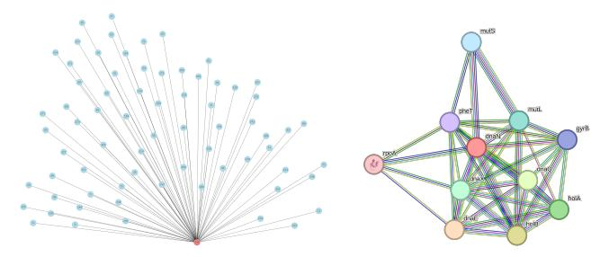

Figure 6: Left: Gene interaction network constructed for the sample 91844.SAMEA2820670. Coral color indicates genes with more than one neighbor (hub), while blue indicates genes with only one connection (peripheral). Genes are numbered by the order of their appearance on the genome. Right: Protein-protein interactions extracted from the STRING database [\(Szklarczyk et al.](#page-15-23) [2023\)](#page-15-23) around dnaN. Only edges in magenta color are experimentally verified. Edges in other colors are predictions from the database.

we validate our attribution on overlapping genes in our validation set and the STRING database. We found an overlap for genes related to the survival of prokaryotes, such as DNA replication. In sample 91844.SAMEA2820670, which is identified as Candidatus Portiera, our model identifies gene 249 as a hub. This gene is annotated as DNA polymerase III beta subunit (dnaN), which is correctly found to interact with genes annotated as DNA polymerase III delta' subunit (gene 36, holB), DNA polymerase III epsilon subunit (gene 54, dnaQ) and type IIA topoisomerase (DNA gyrase/topo II, topoisomerase IV) B subunit (gene 250, gyrB), see Figure [6\(](#page-7-4)left). The final DNA polymerase III is a result of pairwise interactions of the subunits. In comparison, the similar (albeit more difficult to interpret) complex shown in Figure [6\(](#page-7-4)right) is obtained from the STRING database.

## C Additional visualizations

Moreover, Figure [7](#page-8-0) provides a visualization akin to the one in Figure [4,](#page-6-0) using t-SNE [\(van der Maaten and Hinton](#page-15-22) [2008\)](#page-15-22) for non-linear dimensionality reduction instead of UMAP [\(McInnes, Healy, and Melville](#page-14-26) [2018\)](#page-14-26). In both visualizations, the same clusters are clearly visible and separated, indicating the robustness of the found clusters to the specific dimensionality reduction technique.

#### D Ablation study

We now show ablations of varying the number of attention layers, feedforward layer size, and embedding dimension separately to understand their individual contribution to

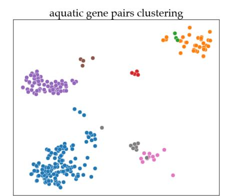

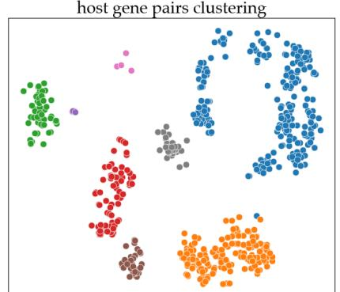

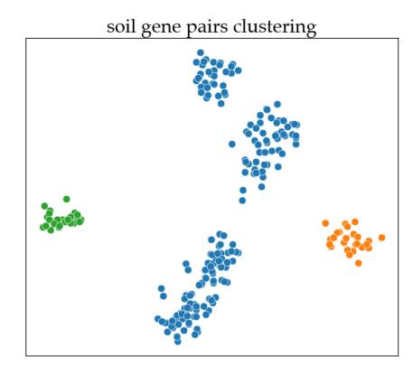

Figure 7: Two-dimensional visualization of the clusters for each of the three habitats aquatic (left), host (middle), and soil (right) separately via t-SNE [\(van der Maaten and Hinton](#page-15-22) [2008\)](#page-15-22), where do not show points not belonging to any cluster.

our model's performance. Table [3](#page-9-1) compares different models in terms of overall accuracy as well as one-vs-rest classification metrics for each class. These results highlight that downsizing the model in any way (10 instead of 15 layers, halving the feedforward layer size, or halving the embedding dimension using ESM2-650M instead of ESM-3B) drastically reduces performance roughly to the level of the baselines shown in Table [2.](#page-7-0) We highlight that the third and most impactful ablation of reducing the embedding dimension implies using a weaker embedding model, i.e., one may still achieve better performance by optimally compressing ESM-3B embeddings. Overall, these results may indicate that our model is not yet "larger than necessary", i.e., one may still obtain moderate performance improvements by using an even larger model.

#### E Overview of existing methods

We compiled Table [4](#page-9-0) summarizing the capabilities of most of the other potentially competing existing methods that we described in the related work. We assess them along the key requirements we set for our method, namely a) whether functional or taxonomic annotations/matches in existing databases are needed (often scarce for microbial life), b) whether they make use of full (coding) sequence information and scale to the full (coding) genome, and c) whether they allow for gene (interaction) attribution (requiring some sort of assessment of the influence or importance of all possible gene pairs on the prediction).

In essence, existing approaches primarily fall short in at least one of the following two ways: a) They do not take into account the full sequence information but only highly abstracted annotations of individual genes. In this work, we consider all coding regions of a genome to qualify as "full sequence" as well. These approaches typically do not have enough information for strong prediction performance, especially for prokaryotes where much less is known about a much larger fraction of organisms, c.f. "microbial dark matter". b) They do not allow for pair-wise attribution, either because they have an excessively fine-grained granularity [\(Nguyen et al.](#page-14-3) [2023;](#page-14-3) [Rojas-Carulla et al.](#page-15-11) [2019\)](#page-15-11), which makes gene-level identification intractable, or they accommodate large sequences via "incomplete" attention computations [\(Zaheer et al.](#page-16-11) [2021;](#page-16-11) [Beltagy, Peters, and Cohan](#page-11-4) [2020\)](#page-11-4). Most approaches to increase the maximally allowed input sequence length of transformers is by reducing the attention computation such that the quadratic cost is reduced (typically) to scale roughly linearly in the sequence length. This inevitably means that we do not get all pairwise attention scores within any given sample, which is what our attribution method is built on. If we relied on one of the linear attention methods, we would have to work with approximate/incomplete attributions as well—leading to missing relevant interactions only present in a subset of examples. Another way of reducing the computational cost is by compressing the input sequences in the first place, e.g., via strided convolutions or other techniques to compress sequences [\(Avsec et al.](#page-11-0) [2021;](#page-11-0) [Benegas, Batra, and Song](#page-11-10) [2023;](#page-11-10) [Linder et al.](#page-14-29) [2023\)](#page-14-29). Instead of concatenating all gene sequences and compressing them jointly (thereby typically losing information about gene boundaries), our approach leverages existing large protein models to preserve genes as individual entities (but in a fixed-size vector representation instead of the base pair sequence).

## F Cluster ortholog annotations

In Tables [5](#page-10-1) to [7](#page-11-11) we list all found orthologs from all the clusters in the three different habitats shown in Figure [4.](#page-6-0) We provide this list as it demonstrates how our method can produce compact results that can be used by domain experts to inform their experiments and provide hypotheses for relevant interactions. For concrete instances, one can swiftly look up these orthologs in databases (with usable online tools available) to get an idea of which genes have been clustered and which are important hubs within our gene interaction networks.

## G Gene interaction networks

We provide two additional examples of gene interaction networks from the aquatic and soil habitats. The network in Figure [8](#page-10-2) is from an aquatic genome sample of Prochlorococcus

Table 3: Comparison of model configurations with different layers, layer sizes, and embedding dimension ( $d_{\rm emb}$ ). The first model configuration has been used in this paper.

| layers | layer size | $d_{\mathrm{emb}}$ | acc (%) | class                   | precision            | recall               | <b>F</b> 1           |
|--------|------------|--------------------|---------|-------------------------|----------------------|----------------------|----------------------|
| 15     | 2048       | 2560               | 71.2    | host soil            | 0.84 0.63         | 0.80 0.43         | 0.82 0.51         |
|        | 2010       | 2500               | / 1.2   | aquatic                 | 0.66                 | 0.84                 | 0.74                 |
| 15     | 1024       | 2560               | 66.2    | host soil aquatic | 0.77 0.49 0.65 | 0.80 0.45 0.67 | 0.78 0.47 0.66 |
| 10     | 2048       | 2560               | 65.5    | host soil aquatic | 0.77 0.51 0.67 | 0.81 0.54 0.61 | 0.79 0.52 0.64 |
| 15     | 2048       | 1280               | 64.8    | host soil aquatic | 0.79 0.50 0.64 | 0.78 0.53 0.62 | 0.78 0.51 0.63 |

Table 4: Comparison of existing models in the literature with respect to the relevant aspects in our problem setting. The "partial" symbol ( ) refers to the following. *using full sequence*: HyenaDNA up to 1m bps; Borzoi up to 524k bps. *attribution*: only for fragments of genes that cannot be pre-selected; *classification*: adaptations to the original model are required; *Using full sequence* means working with sequence level information directly and includes both the full genome as well as all coding regions.

| model               | annotations required | using full sequence | gene attribution | reference                     |
|---------------------|-------------------------|------------------------|---------------------|-------------------------------|
| ours                | Х                       | <b>√</b>               | ✓                   | _                             |
| baselines           | ×                       | ✓                      | X                   | described in Section 3        |
| HyenaDNA            | ×                       | (✔)                    | <b>(✓</b> )         | (Nguyen et al. 2023)          |
| Enformer            | ×                       | X                      | ( <b>✓</b> )        | (Avsec et al. 2021)           |
| Genomic Interpreter | ×                       | ×                      | $(\checkmark)$      | (Li et al. 2023)              |
| Kraken 2            | ✓                       | ✓                      | X                   | (Wood, Lu, and Langmead 2019) |
| Traitar             | ✓                       | ×                      | ✓                   | (Weimann et al. 2016a)        |
| BacPaCS             | ✓                       | ×                      | ✓                   | (Barash et al. 2018)          |
| Genet               | X                       | X                      | <b>(✓</b> )         | (Rojas-Carulla et al. 2019)   |
| DNABERT             | ×                       | ×                      | X                   | (Ji et al. 2020)              |
| Geneformer          | ×                       | ×                      | X                   | (Theodoris et al. 2023)       |
| Borzoi              | ×                       | <b>(✓</b> )            | <b>( ✓</b> )        | (Linder et al. 2023)          |

Table 5: Host cluster gene orthologs.

| cluster |                |                        | KEGG orthologs                                                                                                                                                                                                 |  |
|---------|----------------|------------------------|----------------------------------------------------------------------------------------------------------------------------------------------------------------------------------------------------------------|--|
| blue    |                |                        | K01992, K11051, K01095, K02950, K02887, K03628, K02992, K02952, K03438, K02986, K02874, K02358, K03686, K06168, K02913, K02988, K06217, K04077, K01338, K03544                                     |  |
| orange  | K18929, K03621 |                        | K01537, K03043, K01624, K02945, K03553, K00611, K03496, K00088, K02976, K14623, K07254, K00549,                                                                                                          |  |
| green   |                |                        | K02913, K02945, K03665, K06958                                                                                                                                                                                 |  |
| red     |                | K02935, K00817, K02950 |                                                                                                                                                                                                                |  |
| purple  | K00773, K00640 |                        | K06898, K01937, K01677, K04565, K03628, K01939, K00052 ,K07246, K00097, K22024, K06334, K00937, K02996, K03816, K00533, K03070, K02431, K18843, K01571, K09124, K01892, K00335, K03658, K03086, |  |
| brown   |                |                        | K04751, K04752, K03628, K00573                                                                                                                                                                                 |  |
| pink    |                | K02886, K07448, K03106 |                                                                                                                                                                                                                |  |
| grey    | K06996, K03856 |                        |                                                                                                                                                                                                                |  |

marinus. The network in Figure [9](#page-11-12) is from a soil genome sample of class Acidimicrobiia (unknown species). Comparably, little can be said about the precise meaning and function of the key hubs in these networks, which highlights the fact that much less is known about free-living bacteria compared to the ones living in a host as they are comparably more relevant for human health and disease. We thus leave these as two examples of relatively understudied and potentially interesting hypotheses to be followed up on experimentally.

#### H Impact statement

This work presents methodological advances in the use of machine learning for predicting complex phenotypes from microbial genomic data, with potentially far-reaching implications for both the field of computational biology and society at large. By enabling more accurate predictions of habitat specificity from the genetic makeup of microbiomes and especially understanding the underlying drivers in terms of gene interactions, our research may aid innovative applications in environmental conservation, sustainable agriculture, and personalized medicine. The ability to understand and predict the interactions between microbial genes and their environments could lead to breakthroughs in the development of new biomarkers for health conditions, the creation of targeted microbiome therapies, and the enhancement of biodiversity conservation strategies.

Ethically, while the potential for positive impact is vast, we recognize the importance of considering potential downsides, especially in applications related to human and plan-

Table 6: Aquatic cluster gene orthologs.

| cluster | KEGG orthologs                  |  |
|---------|---------------------------------|--|
| blue    | K08226, K02200, K07712, K01578, |  |
|         | K00937, K10716, K06916, K17226, |  |
|         | K00567, K00873, K07304, K07313, |  |
|         | K01947, K03525, K02045, K11712, |  |
|         | K10943, K01104, K02844, K14335, |  |
|         | K03628, K06929, K03684, K00570, |  |
|         | K03753, K04096, K01430, K01939, |  |
|         | K08483, K09984, K01259, K03825, |  |
|         | K07068, K10912, K08311, K03806, |  |
|         | K08929, K05982, K18092, K17227, |  |
|         | K01772, K00077, K02498, K00052, |  |
|         | K02313, K08963, K07636, K00097, |  |
|         | K22024, K00147, K01972, K07667, |  |
|         | K09888, K01525                  |  |
| orange  | K01537, K03644, K03665, K00937, |  |
|         | K01533K17686, K06916, K12297,   |  |
|         | K01626, K03695, K02017, K10763, |  |
|         | K01578, K00254, K00931, K01534, |  |
|         | K00574, K00773, K00325, K06921, |  |
|         | K06954, K03723, K03466, K03786, |  |
|         | K03655, K03656, K03694, K03555, |  |
|         | K02669, K14682, K13821          |  |
| green   | K00548,K01533, K17686, K01534,  |  |
|         | K01649                          |  |
| red     | no annotation                   |  |
| purple  | K03321, K14518, K02711, K00627, |  |
|         | K00645, K01572, K02160, K09966  |  |
| brown   | K01535, K01537, K01537          |  |
| pink    | K15012, K02112, K01561, K01626, |  |
|         | K06861, K02010, K02017, K00554, |  |
|         | K03644, K06217, K00937, K01996  |  |
| grey    | no annotation                   |  |

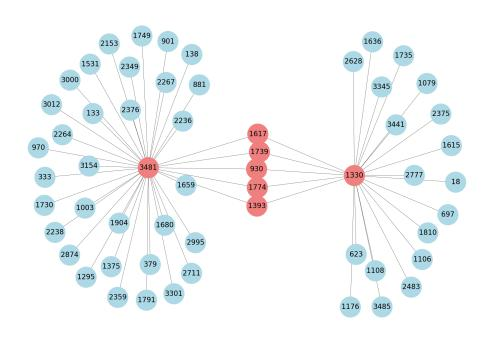

Figure 8: Gene interaction network constructed for the sample 159733.SAMEA6070310. Coral color indicates genes with more than one neighbor (hub), while blue indicates genes with only one connection (peripheral). Genes are numbered by the order of their appearance on the genome.

Table 7: Soil cluster gene orthologs.

| cluster |                | KEGG orthologs                  |  |
|---------|----------------|---------------------------------|--|
| blue    |                | K01535, K01531, K17686, K01533, |  |
|         |                | K17686, K00937, K03644, K00567, |  |
|         |                | K22319, K00873, K16329, K07568, |  |
|         |                | K14415, K03657, K03750, K07219, |  |
|         |                | K13599, K07146, K02428, K03495, |  |
|         |                | K12132, K11212, K00574, K08256, |  |
|         |                | K00226, K00254, K01006, K01921, |  |
|         |                | K01588, K15371, K06442, K00641, |  |
|         |                | K07020, K14414, K03183, K01939, |  |
|         |                | K07646, K01812, K01835, K01840, |  |
|         |                | K07566, K14652, K00260, K00261, |  |
|         |                | K01972, K00471, K00955, K05838, |  |
|         |                | K06949, K00794, K14941, K01903, |  |
|         |                | K03526, K07738, K00548, K01338  |  |
| orange  |                | K21020, K01768, K07712, K07713, |  |
|         |                | K07588, K02584, K06714, K07659, |  |
|         | K05962         |                                 |  |
| green   | K04750, K01246 |                                 |  |

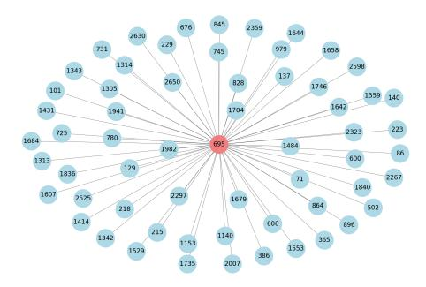

Figure 9: Gene interaction network constructed for the sample 2024894.SAMN08179843. Coral color indicates genes with more than one neighbor (hub), while blue indicates genes with only one connection (peripheral). Genes are numbered by the order of their appearance on the genome.

etary health. The same understanding that may be leveraged for improved treatments, may also be used to discover or engineer particularly resistant pathological organisms. Generally, the adoption of advanced machine learning techniques in genomics must be accompanied by efforts to prevent misuse and ensure equitable access to the benefits they bring. We advocate for a continued democratic dialogue to address these challenges and ensure that the advancements in computational biology contribute positively to society and the environment.

## I Resources

Our project heavily relies on available open source software packages and data sources which we list in Table [8.](#page-12-16)

## References

Alam, I.; Kamau, A. A.; Ngugi, D. K.; Gojobori, T.; Duarte, C. M.; and Bajic, V. B. 2021. KAUST Metagenomic Analysis Platform (KMAP), enabling access to massive analytics of re-annotated metagenomic data. *Scientific reports*, 11(1): 11511. [2](#page-1-1)

Alharbi, W. S.; and Rashid, M. 2022. A review of deep learning applications in human genomics using next-generation sequencing data. *Human Genomics*, 16(1): 1–20. [2](#page-1-1)

Almeida, A.; Nayfach, S.; Boland, M.; Strozzi, F.; Beracochea, M.; Shi, Z. J.; Pollard, K. S.; Sakharova, E.; Parks, D. H.; Hugenholtz, P.; et al. 2021. A unified catalog of 204,938 reference genomes from the human gut microbiome. *Nature biotechnology*, 39(1): 105–114. [2](#page-1-1)

Altschul, S. F.; Gish, W.; Miller, W.; Myers, E. W.; and Lipman, D. J. 1990. Basic local alignment search tool. *J Mol Biol*, 215(3): 403–410. [5](#page-4-2)

Avsec, Z.; Agarwal, V.; Visentin, D.; Ledsam, J. R.; Grabska- ˇ Barwinska, A.; Taylor, K. R.; Assael, Y.; Jumper, J.; Kohli, P.; and Kelley, D. R. 2021. Effective gene expression prediction from sequence by integrating long-range interactions. *Nature Methods*, 18(10): 1196–1203. [1,](#page-0-1) [9,](#page-8-4) [10](#page-9-2)

Baltoumas, F. A.; Karatzas, E.; Liu, S.; Ovchinnikov, S.; Sofianatos, Y.; Chen, I.-M.; Kyrpides, N. C.; and Pavlopoulos, G. A. 2024. NMPFamsDB: a database of novel protein families from microbial metagenomes and metatranscriptomes. *Nucleic Acids Research*, 52(D1): D502–D512. [2](#page-1-1)

Barash, E.; Sal-Man, N.; Sabato, S.; and Ziv-Ukelson, M. 2018. BacPaCS—Bacterial Pathogenicity Classification via Sparse-SVM. *Bioinformatics*, 35(12): 2001–2008. [2,](#page-1-1) [8,](#page-7-5) [10](#page-9-2)

Beltagy, I.; Peters, M. E.; and Cohan, A. 2020. Longformer: The Long-Document Transformer. arXiv:2004.05150. [2,](#page-1-1) [9](#page-8-4)

Benegas, G.; Batra, S. S.; and Song, Y. S. 2023. DNA language models are powerful predictors of genome-wide variant effects. *Proceedings of the National Academy of Sciences*, 120(44): e2311219120. [9](#page-8-4)

Benoit, G.; Peterlongo, P.; Mariadassou, M.; Drezen, E.; Schbath, S.; Lavenier, D.; and Lemaitre, C. 2016. Multiple Comparative Metagenomics using Multiset k-mer Counting. arXiv:1604.02412. [8](#page-7-5)

Besrour-Aouam, N.; Mohedano, M. L.; Fhoula, I.; Zarour, K.; Najjari, A.; Aznar, R.; Prieto, A.; Ouzari, H.-I.; and Lopez, P. 2019. ´ Different Modes of Regulation of the Expression of Dextransucrase in Leuconostoc lactis AV1n and Lactobacillus sakei MN1. *Frontiers in Microbiology*, 10. [7](#page-6-2)

Table 8: Overview of resources used in our work.

| Name          | Reference                                                                                                  | License                       |
|---------------|------------------------------------------------------------------------------------------------------------|-------------------------------|
| ProGenomes v3 | (Fullam et al. 2023)                                                                                       | [none found]                  |
| Python        | (van Rossum and Drake 2009)                                                                                | PSF License                   |
| PyTorch       | (Paszke et al. 2019)                                                                                       | BSD-style license             |
| Numpy         | (Harris et al. 2020)                                                                                       | BSD-style license             |
| Pandas        | (pandas development team 2020; Wes McKinney 2010)                                                          | BSD-style license             |
| Jupyter       | (Kluyver et al. 2016)                                                                                      | BSD-style license             |
| Matplotlib    | (Hunter 2007)                                                                                              | modified PSF (BSD compatible) |
| Scikit-learn  | (Pedregosa et al. 2011)                                                                                    | BSD 3-Clause                  |
| SciPy         | (Virtanen et al. 2020)                                                                                     | BSD 3-Clause                  |
| HuggingFace   | (Wolf et al. 2020)                                                                                         | Apache 2.0 (BERT models)      |
| ESM           | (Lin et al. 2023)                                                                                          | MIT license                   |
| SLURM         | (Yoo, Jette, and Grondona 2003)                                                                            | modified GNU GPL v2           |
| Biopython     | (Cock et al. 2009)                                                                                         | modified BSD 3-Clause         |
| networkx      | (Hagberg, Schult, and Swart 2008)                                                                          | BSD 3-Clause                  |
| umap          | (McInnes, Healy, and Melville 2018)                                                                        | BSD 3-Clause                  |
| PyFasta       | –                                                                                                          | MIT license                   |
| Prodigal      | (Hyatt et al. 2010)                                                                                        | GNU GPL v3.0                  |
| EggNog-mapper | (Steinegger and Soding ¨ 2017; Buchfink, Reuter, and Drost 2021; Eddy 2011; Cantalapiedra et al. 2021a; | GNU AGPL v3.0                 |
| DeepSpeed     | Huerta-Cepas et al. 2019) deepspeed.ai                                                                  | Apache 2.0 License            |

Bi, X.; Liang, W.; Zhao, Q.; and Wang, J. 2023. SSLpheno: a selfsupervised learning approach for gene–phenotype association prediction using protein–protein interactions and gene ontology data. *Bioinformatics*, 39(11): btad662. [8](#page-7-5)

Boratyn, G. M.; Thierry-Mieg, J.; Thierry-Mieg, D.; Busby, B.; and Madden, T. L. 2019. Magic-BLAST, an accurate RNA-seq aligner for long and short reads. *BMC Bioinformatics*, 20(1): 405. [5](#page-4-2)

Boscaro, V.; Kolisko, M.; Felletti, M.; Vannini, C.; Lynn, D. H.; and Keeling, P. J. 2017. Parallel genome reduction in symbionts descended from closely related free-living bacteria. *Nature Ecology & Evolution*, 1(8): 1160–1167. [6](#page-5-2)

Brewster, R.; Tamburini, F. B.; Asiimwe, E.; Oduaran, O.; Hazelhurst, S.; and Bhatt, A. S. 2019. Surveying gut microbiome research in Africans: toward improved diversity and representation. *Trends in microbiology*, 27(10): 824–835. [2](#page-1-1)

Brouwer, S.; Barnett, T. C.; Ly, D.; Kasper, K. J.; De Oliveira, D. M. P.; Rivera-Hernandez, T.; Cork, A. J.; McIntyre, L.; Jespersen, M. G.; Richter, J.; Schulz, B. L.; Dougan, G.; Nizet, V.; Yuen, K.- Y.; You, Y.; McCormick, J. K.; Sanderson-Smith, M. L.; Davies, M. R.; and Walker, M. J. 2020. Prophage exotoxins enhance colonization fitness in epidemic scarlet fever-causing Streptococcus pyogenes. *Nature Communications*, 11(1): 5018. [6](#page-5-2)

Buchfink, B.; Reuter, K.; and Drost, H.-G. 2021. Sensitive protein alignments at tree-of-life scale using DIAMOND. *Nature methods*, 18(4): 366–368. [13](#page-12-19)

Calle, M. L. 2019. Statistical analysis of metagenomics data. *Genomics & informatics*, 17(1). [2](#page-1-1)

Camacho, C.; Boratyn, G. M.; Joukov, V.; Vera Alvarez, R.; and Madden, T. L. 2023. ElasticBLAST: accelerating sequence search via cloud computing. *BMC Bioinformatics*, 24(1): 117. [5](#page-4-2)

Cantalapiedra, C. P.; Hernandez-Plaza, A.; Letunic, I.; Bork, P.; and ´ Huerta-Cepas, J. 2021a. eggNOG-mapper v2: functional annotation, orthology assignments, and domain prediction at the metagenomic scale. *Molecular biology and evolution*, 38(12): 5825–5829. [2,](#page-1-1) [5,](#page-4-2) [13](#page-12-19)

Cantalapiedra, C. P.; Hernandez-Plaza, A.; Letunic, I.; Bork, P.; ´ and Huerta-Cepas, J. 2021b. eggNOG-mapper v2: Functional Annotation, Orthology Assignments, and Domain Prediction at the Metagenomic Scale. *Molecular Biology and Evolution*, 38(12): 5825–5829. [2](#page-1-1)

Cao, H.; Ma, Q.; Chen, X.; and Xu, Y. 2019. DOOR: a prokaryotic operon database for genome analyses and functional inference. *Briefings in bioinformatics*, 20(4): 1568–1577. [1](#page-0-1)

Cheifet, B. 2019. Where is genomics going next? [1](#page-0-1)

Child, R.; Gray, S.; Radford, A.; and Sutskever, I. 2019. Generating Long Sequences with Sparse Transformers. arXiv:1904.10509. [2](#page-1-1)

Chklovski, A.; Parks, D. H.; Woodcroft, B. J.; and Tyson, G. W. 2023. CheckM2: a rapid, scalable and accurate tool for assessing microbial genome quality using machine learning. *Nature Methods*, 20(8): 1203–1212. [1](#page-0-1)

Choi, S. R.; and Lee, M. 2023. Transformer architecture and attention mechanisms in genome data analysis: a comprehensive review. *Biology*, 12(7): 1033. [1](#page-0-1)

Clapp, M.; Aurora, N.; Herrera, L.; Bhatia, M.; Wilen, E.; and Wakefield, S. 2017. Gut microbiota's effect on mental health: The gut-brain axis. *Clinics and practice*, 7(4): 987. [1](#page-0-1)

Cock, P. J.; Antao, T.; Chang, J. T.; Chapman, B. A.; Cox, C. J.; Dalke, A.; Friedberg, I.; Hamelryck, T.; Kauff, F.; Wilczynski, B.; et al. 2009. Biopython: freely available Python tools for computational molecular biology and bioinformatics. *Bioinformatics*, 25(11): 1422. [13](#page-12-19)

Collins, C.; and Didelot, X. 2018. A phylogenetic method to perform genome-wide association studies in microbes that accounts for population structure and recombination. *PLoS computational biology*, 14(2): e1005958. [2](#page-1-1)

- Consens, M. E.; Dufault, C.; Wainberg, M.; Forster, D.; Karimzadeh, M.; Goodarzi, H.; Theis, F. J.; Moses, A.; and Wang, B. 2023. To Transformers and Beyond: Large Language Models for the Genome. *arXiv preprint arXiv:2311.07621*. [1](#page-0-1)
- Cui, H.; Zhou, G.; Ruan, H.; Zhao, J.; Hasi, A.; and Zong, N. 2023. Genome-Wide Identification and Analysis of the Maize Serine Peptidase S8 Family Genes in Response to Drought at Seedling Stage. *Plants*, 12(2). [7](#page-6-2)
- Dai, Z.; Yang, Z.; Yang, Y.; Carbonell, J.; Le, Q. V.; and Salakhutdinov, R. 2019. Transformer-XL: Attentive Language Models Beyond a Fixed-Length Context. arXiv:1901.02860. [2](#page-1-1)
- Dalla-Torre, H.; Gonzalez, L.; Mendoza-Revilla, J.; Carranza, N. L.; Grzywaczewski, A. H.; Oteri, F.; Dallago, C.; Trop, E.; de Almeida, B. P.; Sirelkhatim, H.; et al. 2023. The nucleotide transformer: Building and evaluating robust foundation models for human genomics. *bioRxiv*, 2023–01. [1](#page-0-1)
- Dao, T.; Fu, D.; Ermon, S.; Rudra, A.; and Re, C. 2022. Flashatten- ´ tion: Fast and memory-efficient exact attention with io-awareness. *Advances in Neural Information Processing Systems*, 35: 16344– 16359. [4](#page-3-2)
- de Los Campos, G.; Vazquez, A. I.; Hsu, S.; and Lello, L. 2018. Complex-trait prediction in the era of big data. *Trends in Genetics*, 34(10): 746–754. [2](#page-1-1)
- Deschenes, T.; Tohoundjona, F. W. E.; Plante, P.-L.; Di Marzo, V.; ˆ and Raymond, F. 2023. Gene-based microbiome representation enhances host phenotype classification. *Msystems*, 8(4): e00531– 23. [2,](#page-1-1) [3](#page-2-2)
- Devlin, J.; Chang, M.-W.; Lee, K.; and Toutanova, K. 2019. BERT: Pre-training of Deep Bidirectional Transformers for Language Understanding. arXiv:1810.04805. [4](#page-3-2)
- Djemiel, C.; Maron, P.-A.; Terrat, S.; Dequiedt, S.; Cottin, A.; and Ranjard, L. 2022. Inferring microbiota functions from taxonomic genes: a review. *Gigascience*, 11: giab090. [2](#page-1-1)
- Dubinkina, V. B.; Ischenko, D. S.; Ulyantsev, V. I.; Tyakht, A. V.; and Alexeev, D. G. 2016. Assessment of k-mer spectrum applicability for metagenomic dissimilarity analysis. *BMC Bioinformatics*, 17(1): 38. [8](#page-7-5)
- Ducarmon, Q. R.; Grundler, F.; Le Maho, Y.; de Toledo, F. W.; Zeller, G.; Habold, C.; and Mesnage, R. 2023. Remodelling of the intestinal ecosystem during caloric restriction and fasting. *Trends in Microbiology*. [1](#page-0-1)
- Dorr, T.; Lam, H.; Alvarez, L.; Cava, F.; Davis, B. M.; and Waldor, ¨ M. K. 2014. A Novel Peptidoglycan Binding Protein Crucial for PBP1A-Mediated Cell Wall Biogenesis in Vibrio cholerae. *PLOS Genetics*, 10(6): 1–14. [7](#page-6-2)
- D'Elia, D.; Truu, J.; Lahti, L.; Berland, M.; Papoutsoglou, G.; Ceci, M.; Zomer, A.; Lopes, M. B.; Ibrahimi, E.; Gruca, A.; et al. 2023. Advancing microbiome research with machine learning: key findings from the ML4Microbiome COST action. *Frontiers in Microbiology*, 14. [2](#page-1-1)
- Eddy, S. R. 2011. Accelerated profile HMM searches. *PLoS computational biology*, 7(10): e1002195. [13](#page-12-19)
- Ellison, C. E.; Hall, C.; Kowbel, D.; Welch, J.; Brem, R. B.; Glass, N. L.; and Taylor, J. W. 2011. Population genomics and local adaptation in wild isolates of a model microbial eukaryote. *Proceedings of the National Academy of Sciences*, 108(7): 2831–2836. [6](#page-5-2)
- Eraslan, G.; Avsec, Z.; Gagneur, J.; and Theis, F. J. 2019. Deep ˇ learning: new computational modelling techniques for genomics. *Nature Reviews Genetics*, 20(7): 389–403. [2](#page-1-1)

- Ester, M.; Kriegel, H.-P.; Sander, J.; and Xu, X. 1996. A densitybased algorithm for discovering clusters in large spatial databases with noise. In *Proceedings of the Second International Conference on Knowledge Discovery and Data Mining*, KDD'96, 226–231. AAAI Press. [5](#page-4-2)
- Fullam, A.; Letunic, I.; Schmidt, T. S.; Ducarmon, Q. R.; Karcher, N.; Khedkar, S.; Kuhn, M.; Larralde, M.; Maistrenko, O. M.; Malfertheiner, L.; et al. 2023. proGenomes3: approaching one million accurately and consistently annotated high-quality prokaryotic genomes. *Nucleic acids research*, 51(D1): D760–D766. [3,](#page-2-2) [13](#page-12-19)
- Ghurye, J. S.; Cepeda-Espinoza, V.; and Pop, M. 2016. Metagenomic Assembly: Overview, Challenges and Applications. *Yale J Biol Med*, 89(3): 353–362. [3](#page-2-2)
- Gilbert-Diamond, D.; and Moore, J. H. 2011. Analysis of genegene interactions. *Curr Protoc Hum Genet*, Chapter 1: Unit1.14. [1](#page-0-1)
- Hagberg, A. A.; Schult, D. A.; and Swart, P. J. 2008. Exploring Network Structure, Dynamics, and Function using NetworkX. In Varoquaux, G.; Vaught, T.; and Millman, J., eds., *Proceedings of the 7th Python in Science Conference*, 11 – 15. Pasadena, CA USA. [13](#page-12-19)
- Hammack, A. T.; and Blaby-Haas, C. E. 2023. Machine learning sheds light on microbial dark proteins. *Nature Reviews Microbiology*, 1–1. [2,](#page-1-1) [3](#page-2-2)
- Harris, C. R.; Millman, K. J.; van der Walt, S. J.; Gommers, R.; Virtanen, P.; Cournapeau, D.; Wieser, E.; Taylor, J.; Berg, S.; Smith, N. J.; Kern, R.; Picus, M.; Hoyer, S.; van Kerkwijk, M. H.; Brett, M.; Haldane, A.; del R´ıo, J. F.; Wiebe, M.; Peterson, P.; Gerard- ´ Marchant, P.; Sheppard, K.; Reddy, T.; Weckesser, W.; Abbasi, H.; Gohlke, C.; and Oliphant, T. E. 2020. Array programming with NumPy. *Nature*. [13](#page-12-19)
- Hernandez Medina, R.; Kutuzova, S.; Nielsen, K. N.; Johansen, J.; ´ Hansen, L. H.; Nielsen, M.; and Rasmussen, S. 2022. Machine learning and deep learning applications in microbiome research. *ISME Communications*, 2(1): 98. [1,](#page-0-1) [2](#page-1-1)
- Hoarfrost, A.; Aptekmann, A.; Farfanuk, G.; and Bromberg, Y. ˜ 2022. Deep learning of a bacterial and archaeal universal language of life enables transfer learning and illuminates microbial dark matter. *Nature communications*, 13(1): 2606. [1,](#page-0-1) [2](#page-1-1)
- Hsu, C.; Verkuil, R.; Liu, J.; Lin, Z.; Hie, B.; Sercu, T.; Lerer, A.; and Rives, A. 2022. Learning inverse folding from millions of predicted structures. *ICML*. [1](#page-0-1)
- Huang, S.; Ailer, E.; Kilbertus, N.; and Pfister, N. 2023. Supervised learning and model analysis with compositional data. *PLOS Computational Biology*, 19(6): e1011240. [2](#page-1-1)
- Huerta-Cepas, J.; Szklarczyk, D.; Heller, D.; Hernandez-Plaza, A.; ´ Forslund, S. K.; Cook, H.; Mende, D. R.; Letunic, I.; Rattei, T.; Jensen, L. J.; et al. 2019. eggNOG 5.0: a hierarchical, functionally and phylogenetically annotated orthology resource based on 5090 organisms and 2502 viruses. *Nucleic acids research*, 47(D1): D309–D314. [13](#page-12-19)
- Hunter, J. D. 2007. Matplotlib: A 2D graphics environment. *Computing in Science & Engineering*. [13](#page-12-19)
- Hwang, B.; Lee, J. H.; and Bang, D. 2018. Single-cell RNA sequencing technologies and bioinformatics pipelines. *Experimental & molecular medicine*, 50(8): 1–14. [1](#page-0-1)
- Hyatt, D.; Chen, G.-L.; LoCascio, P. F.; Land, M. L.; Larimer, F. W.; and Hauser, L. J. 2010. Prodigal: prokaryotic gene recognition and translation initiation site identification. *BMC Bioinformatics*, 11(1): 119. [4,](#page-3-2) [13](#page-12-19)

- Ji, Y.; Shang, J.; Tang, X.; and Sun, Y. 2023. HOTSPOT: hierarchical host prediction for assembled plasmid contigs with transformer. *Bioinformatics*, 39(5): btad283. [8](#page-7-5)
- Ji, Y.; Zhou, Z.; Liu, H.; and Davuluri, R. V. 2020. DNABERT: pretrained Bidirectional Encoder Representations from Transformers model for DNA-language in genome. *bioRxiv*. [2,](#page-1-1) [10](#page-9-2)
- Jovic, D.; Liang, X.; Zeng, H.; Lin, L.; Xu, F.; and Luo, Y. 2022. Single-cell RNA sequencing technologies and applications: A brief overview. *Clinical and Translational Medicine*, 12(3): e694. [1](#page-0-1)
- Jumper, J.; Evans, R.; Pritzel, A.; Green, T.; Figurnov, M.; Ronneberger, O.; Tunyasuvunakool, K.; Bates, R.; Zˇ´ıdek, A.; Potapenko, A.; Bridgland, A.; Meyer, C.; Kohl, S. A. A.; Ballard, A. J.; Cowie, A.; Romera-Paredes, B.; Nikolov, S.; Jain, R.; Adler, J.; Back, T.; Petersen, S.; Reiman, D.; Clancy, E.; Zielinski, M.; Steinegger, M.; Pacholska, M.; Berghammer, T.; Bodenstein, S.; Silver, D.; Vinyals, O.; Senior, A. W.; Kavukcuoglu, K.; Kohli, P.; and Hassabis, D. 2021. Highly accurate protein structure prediction with AlphaFold. *Nature*, 596(7873): 583–589. [1](#page-0-1)
- Kanehisa, M.; Sato, Y.; Kawashima, M.; Furumichi, M.; and Tanabe, M. 2015. KEGG as a reference resource for gene and protein annotation. *Nucleic Acids Research*, 44(D1): D457–D462. [5,](#page-4-2) [6](#page-5-2)
- Kemis, J. H.; Linke, V.; Barrett, K. L.; Boehm, F. J.; Traeger, L. L.; Keller, M. P.; Rabaglia, M. E.; Schueler, K. L.; Stapleton, D. S.; Gatti, D. M.; et al. 2019. Genetic determinants of gut microbiota composition and bile acid profiles in mice. *PLoS Genetics*, 15(8): e1008073. [5](#page-4-2)
- Kluyver, T.; Ragan-Kelley, B.; Perez, F.; Granger, B.; Bussonnier, ´ M.; Frederic, J.; Kelley, K.; Hamrick, J.; Grout, J.; Corlay, S.; Ivanov, P.; Avila, D.; Abdalla, S.; Willing, C.; and Jupyter development team. 2016. Jupyter Notebooks - a publishing format for reproducible computational workflows. In *Positioning and Power in Academic Publishing: Players, Agents and Agendas*. [13](#page-12-19)
- Knight, R.; Vrbanac, A.; Taylor, B. C.; Aksenov, A.; Callewaert, C.; Debelius, J.; Gonzalez, A.; Kosciolek, T.; McCall, L.-I.; Mc-Donald, D.; et al. 2018. Best practices for analysing microbiomes. *Nature Reviews Microbiology*, 16(7): 410–422. [2](#page-1-1)
- Lapierre, P.; and Gogarten, J. P. 2009. Estimating the size of the bacterial pan-genome. *Trends in genetics*, 25(3): 107–110. [2](#page-1-1)
- Lee, C. G.; and Park, J. K. 2015. Comparison of inhibitory activity of bioactive molecules on the dextransucrase from Streptococcus mutans. *Applied Microbiology and Biotechnology*, 99(18): 7495– 7503. [7](#page-6-2)
- Lees, J. A.; Mai, T. T.; Galardini, M.; Wheeler, N. E.; Horsfield, S. T.; Parkhill, J.; and Corander, J. 2020. Improved prediction of bacterial genotype-phenotype associations using interpretable pangenome-spanning regressions. *MBio*, 11(4): 10–1128. [2](#page-1-1)
- Li, H. 2015. Microbiome, metagenomics, and high-dimensional compositional data analysis. *Annual Review of Statistics and Its Application*, 2: 73–94. [2](#page-1-1)
- Li, Z.; Das, A.; Beardall, W. A. V.; Zhao, Y.; and Stan, G.-B. 2023. Genomic Interpreter: A Hierarchical Genomic Deep Neural Network with 1D Shifted Window Transformer. arXiv:2306.05143. [1,](#page-0-1) [10](#page-9-2)
- Lin, Z.; Akin, H.; Rao, R.; Hie, B.; Zhu, Z.; Lu, W.; Smetanin, N.; dos Santos Costa, A.; Fazel-Zarandi, M.; Sercu, T.; Candido, S.; et al. 2022. Language models of protein sequences at the scale of evolution enable accurate structure prediction. *bioRxiv*. [1](#page-0-1)
- Lin, Z.; Akin, H.; Rao, R.; Hie, B.; Zhu, Z.; Lu, W.; Smetanin, N.; Verkuil, R.; Kabeli, O.; Shmueli, Y.; et al. 2023. Evolutionary-scale prediction of atomic-level protein structure with a language model. *Science*, 379(6637): 1123–1130. [1,](#page-0-1) [2,](#page-1-1) [4,](#page-3-2) [13](#page-12-19)

- Linder, J.; Srivastava, D.; Yuan, H.; Agarwal, V.; and Kelley, D. R. 2023. Predicting RNA-seq coverage from DNA sequence as a unifying model of gene regulation. *bioRxiv*. [9,](#page-8-4) [10](#page-9-2)
- Liu, Z.; Lin, Y.; Cao, Y.; Hu, H.; Wei, Y.; Zhang, Z.; Lin, S.; and Guo, B. 2021. Swin Transformer: Hierarchical Vision Transformer using Shifted Windows. arXiv:2103.14030. [2](#page-1-1)
- Lloyd-Price, J.; Mahurkar, A.; Rahnavard, G.; Crabtree, J.; Orvis, J.; Hall, A. B.; Brady, A.; Creasy, H. H.; McCracken, C.; Giglio, M. G.; et al. 2017. Strains, functions and dynamics in the expanded Human Microbiome Project. *Nature*, 550(7674): 61–66. [1](#page-0-1)
- Loshchilov, I.; and Hutter, F. 2019. Decoupled Weight Decay Regularization. arXiv:1711.05101. [4](#page-3-2)
- Marsh, J. W.; Kirk, C.; and Ley, R. E. 2023. Toward Microbiome Engineering: Expanding the Repertoire of Genetically Tractable Members of the Human Gut Microbiome. *Annual Review of Microbiology*, 77. [2](#page-1-1)
- McCutcheon, J. P.; and Moran, N. A. 2012. Extreme genome reduction in symbiotic bacteria. *Nature Reviews Microbiology*, 10(1): 13–26. [6](#page-5-2)
- McInnes, L.; Healy, J.; and Melville, J. 2018. Umap: Uniform manifold approximation and projection for dimension reduction. *arXiv preprint arXiv:1802.03426*. [6,](#page-5-2) [7,](#page-6-2) [8,](#page-7-5) [13](#page-12-19)
- Meier, J.; Rao, R.; Verkuil, R.; Liu, J.; Sercu, T.; and Rives, A. 2021. Language models enable zero-shot prediction of the effects of mutations on protein function. *bioRxiv*. [1](#page-0-1)
- Mende, D. R.; Letunic, I.; Huerta-Cepas, J.; Li, S. S.; Forslund, K.; Sunagawa, S.; and Bork, P. 2016. proGenomes: a resource for consistent functional and taxonomic annotations of prokaryotic genomes. *Nucleic Acids Res*, 45(D1): D529–D534. [3](#page-2-2)
- Mende, D. R.; Letunic, I.; Maistrenko, O. M.; Schmidt, T. S.; Milanese, A.; Paoli, L.; Hernandez-Plaza, A.; Orakov, A. N.; ´ Forslund, S. K.; Sunagawa, S.; et al. 2020. proGenomes2: an improved database for accurate and consistent habitat, taxonomic and functional annotations of prokaryotic genomes. *Nucleic acids research*, 48(D1): D621–D625. [3](#page-2-2)
- Mende, D. R.; Letunic, I.; Maistrenko, O. M.; Schmidt, T. S. B.; Milanese, A.; Paoli, L.; Hernandez-Plaza, A.; Orakov, A. N.; ´ Forslund, S. K.; Sunagawa, S.; Zeller, G.; Huerta-Cepas, J.; Coelho, L. P.; and Bork, P. 2019. proGenomes2: an improved database for accurate and consistent habitat, taxonomic and functional annotations of prokaryotic genomes. *Nucleic Acids Research*, 48(D1): D621–D625. [3](#page-2-2)
- Mistry, J.; Chuguransky, S.; Williams, L.; Qureshi, M.; Salazar, G. A.; Sonnhammer, E. L.; Tosatto, S. C.; Paladin, L.; Raj, S.; Richardson, L. J.; et al. 2021. Pfam: The protein families database in 2021. *Nucleic acids research*, 49(D1): D412–D419. [2](#page-1-1)
- Moreno-Gamez, S. 2022. How bacteria navigate varying environ- ´ ments. *Science*, 378(6622): 845–845. [6](#page-5-2)
- Nayfach, S.; Roux, S.; Seshadri, R.; Udwary, D.; Varghese, N.; Schulz, F.; Wu, D.; Paez-Espino, D.; Chen, I.-M.; Huntemann, M.; et al. 2021. A genomic catalog of Earth's microbiomes. *Nature biotechnology*, 39(4): 499–509. [1](#page-0-1)
- Nguyen, E.; Poli, M.; Faizi, M.; Thomas, A.; Birch-Sykes, C.; Wornow, M.; Patel, A.; Rabideau, C.; Massaroli, S.; Bengio, Y.; et al. 2023. Hyenadna: Long-range genomic sequence modeling at single nucleotide resolution. *arXiv preprint arXiv:2306.15794*. [1,](#page-0-1) [4,](#page-3-2) [9,](#page-8-4) [10](#page-9-2)
- Nyren, P.; Pettersson, B.; and Uhlen, M. 1993. Solid Phase DNA Minisequencing by an Enzymatic Luminometric Inorganic Pyrophosphate Detection Assay. *Analytical Biochemistry*, 208(1): 171–175. [1](#page-0-1)

- pandas development team, T. 2020. pandas-dev/pandas: Pandas. [13](#page-12-19)
- Parks, D. H.; Chuvochina, M.; Rinke, C.; Mussig, A. J.; Chaumeil, P.-A.; and Hugenholtz, P. 2022. GTDB: an ongoing census of bacterial and archaeal diversity through a phylogenetically consistent, rank normalized and complete genome-based taxonomy. *Nucleic acids research*, 50(D1): D785–D794. [1](#page-0-1)
- Paszke, A.; Gross, S.; Massa, F.; Lerer, A.; Bradbury, J.; Chanan, G.; Killeen, T.; Lin, Z.; Gimelshein, N.; Antiga, L.; Desmaison, A.; Kopf, A.; Yang, E.; DeVito, Z.; Raison, M.; Tejani, A.; Chilamkurthy, S.; Steiner, B.; Fang, L.; Bai, J.; and Chintala, S. 2019. PyTorch: An Imperative Style, High-Performance Deep Learning Library. In *NeurIPS*. [13](#page-12-19)
- Pavlopoulos, G. A.; Baltoumas, F. A.; Liu, S.; Selvitopi, O.; Camargo, A. P.; Nayfach, S.; Azad, A.; Roux, S.; Call, L.; Ivanova, N. N.; et al. 2023. Unraveling the functional dark matter through global metagenomics. *Nature*, 622(7983): 594–602. [2](#page-1-1)
- Pedregosa, F.; Varoquaux, G.; Gramfort, A.; Michel, V.; Thirion, B.; Grisel, O.; Blondel, M.; Prettenhofer, P.; Weiss, R.; Dubourg, V.; Vanderplas, J.; Passos, A.; Cournapeau, D.; Brucher, M.; Perrot, M.; and Duchesnay, E. 2011. Scikit-learn: Machine Learning in ´ Python. *JMLR*. [13](#page-12-19)
- Powell, J. E.; Leonard, S. P.; Kwong, W. K.; Engel, P.; and Moran, N. A. 2016a. Genome-wide screen identifies host colonization determinants in a bacterial gut symbiont. *Proceedings of the National Academy of Sciences*, 113(48): 13887–13892. [5](#page-4-2)
- Powell, J. E.; Leonard, S. P.; Kwong, W. K.; Engel, P.; and Moran, N. A. 2016b. Genome-wide screen identifies host colonization determinants in a bacterial gut symbiont. *Proceedings of the National Academy of Sciences*, 113(48): 13887–13892. [6](#page-5-2)
- Rae, J. W.; Potapenko, A.; Jayakumar, S. M.; and Lillicrap, T. P. 2019. Compressive Transformers for Long-Range Sequence Modelling. arXiv:1911.05507. [2](#page-1-1)
- Rao, R.; Liu, J.; Verkuil, R.; Meier, J.; Canny, J. F.; Abbeel, P.; Sercu, T.; and Rives, A. 2021. MSA Transformer. *bioRxiv*. [1](#page-0-1)
- Rao, R. M.; Meier, J.; Sercu, T.; Ovchinnikov, S.; and Rives, A. 2020. Transformer protein language models are unsupervised structure learners. *bioRxiv*. [1](#page-0-1)
- Ratiner, K.; Ciocan, D.; Abdeen, S. K.; and Elinav, E. 2023. Utilization of the microbiome in personalized medicine. *Nature Reviews Microbiology*, 1–18. [1](#page-0-1)
- Richardson, L.; Allen, B.; Baldi, G.; Beracochea, M.; Bileschi, M. L.; Burdett, T.; Burgin, J.; Caballero-Perez, J.; Cochrane, G.; ´ Colwell, L. J.; et al. 2023. MGnify: the microbiome sequence data analysis resource in 2023. *Nucleic Acids Research*, 51(D1): D753– D759. [2](#page-1-1)
- Rives, A.; Meier, J.; Sercu, T.; Goyal, S.; Lin, Z.; Liu, J.; Guo, D.; Ott, M.; Zitnick, C. L.; Ma, J.; and Fergus, R. 2019. Biological Structure and Function Emerge from Scaling Unsupervised Learning to 250 Million Protein Sequences. *PNAS*. [1](#page-0-1)
- Rojas-Carulla, M.; Tolstikhin, I.; Luque, G.; Youngblut, N.; Ley, R.; and Scholkopf, B. 2019. GeNet: Deep Representations for ¨ Metagenomics. arXiv:1901.11015. [2,](#page-1-1) [9,](#page-8-4) [10](#page-9-2)
- Ronaghi, M.; Karamohamed, S.; Pettersson, B.; Uhlen, M.; and ´ Nyren, P. 1996. Real-time DNA sequencing using detection of py- ´ rophosphate release. *Anal Biochem*, 242(1): 84–89. [1](#page-0-1)
- Rouli, L.; Merhej, V.; Fournier, P.-E.; and Raoult, D. 2015. The bacterial pangenome as a new tool for analysing pathogenic bacteria. *New microbes and new infections*, 7: 72–85. [2](#page-1-1)

- Salaverria, I.; Philipp, C.; Oschlies, I.; Kohler, C. W.; Kreuz, M.; Szczepanowski, M.; Burkhardt, B.; Trautmann, H.; Gesk, S.; Andrusiewicz, M.; Berger, H.; Fey, M.; Harder, L.; Hasenclever, D.; Hummel, M.; Loeffler, M.; Mahn, F.; Martin-Guerrero, I.; Pellissery, S.; Pott, C.; Pfreundschuh, M.; Reiter, A.; Richter, J.; Rosolowski, M.; Schwaenen, C.; Stein, H.; Trumper, L.; ¨ Wessendorf, S.; Spang, R.; Kuppers, R.; Klapper, W.; Siebert, ¨ R.; Molecular Mechanisms in Malignant Lymphomas Network Project of the Deutsche Krebshilfe; German High-Grade Lymphoma Study Group; and Berlin-Frankfurt-Munster-NHL trial ¨ group. 2011. Translocations activating IRF4 identify a subtype of germinal center-derived B-cell lymphoma affecting predominantly children and young adults. *Blood*, 118(1): 139–147. [6](#page-5-2)
- Sapoval, N.; Aghazadeh, A.; Nute, M. G.; Antunes, D. A.; Balaji, A.; Baraniuk, R.; Barberan, C.; Dannenfelser, R.; Dun, C.; Edrisi, M.; et al. 2022. Current progress and open challenges for applying deep learning across the biosciences. *Nature Communications*, 13(1): 1728. [1](#page-0-1)
- Schmidt, T. S.; Fullam, A.; Ferretti, P.; Orakov, A.; Maistrenko, O. M.; Ruscheweyh, H.-J.; Letunic, I.; Duan, Y.; Van Rossum, T.; Sunagawa, S.; et al. 2024. SPIRE: a Searchable, Planetary-scale mIcrobiome REsource. *Nucleic Acids Research*, 52(D1): D777– D783. [2](#page-1-1)
- Schupack, D. A.; Mars, R. A.; Voelker, D. H.; Abeykoon, J. P.; and Kashyap, P. C. 2022. The promise of the gut microbiome as part of individualized treatment strategies. *Nature Reviews Gastroenterology & Hepatology*, 19(1): 7–25. [1](#page-0-1)
- Shu, W.-S.; and Huang, L.-N. 2022. Microbial diversity in extreme environments. *Nature Reviews Microbiology*, 20(4): 219–235. [6](#page-5-2)
- Steinegger, M.; and Soding, J. 2017. MMseqs2 enables sensitive ¨ protein sequence searching for the analysis of massive data sets. *Nature biotechnology*, 35(11): 1026–1028. [13](#page-12-19)
- Stephens, W. Z.; Wiles, T. J.; Martinez, E. S.; Jemielita, M.; Burns, A. R.; Parthasarathy, R.; Bohannan, B. J.; and Guillemin, K. 2015. Identification of population bottlenecks and colonization factors during assembly of bacterial communities within the zebrafish intestine. *MBio*, 6(6): 10–1128. [5](#page-4-2)
- Sukhbaatar, S.; Grave, E.; Bojanowski, P.; and Joulin, A. 2019. Adaptive Attention Span in Transformers. arXiv:1905.07799. [2](#page-1-1)
- Szklarczyk, D.; Kirsch, R.; Koutrouli, M.; Nastou, K.; Mehryary, F.; Hachilif, R.; Gable, A. L.; Fang, T.; Doncheva, N. T.; Pyysalo, S.; Bork, P.; Jensen, L. J.; and von Mering, C. 2023. The STRING database in 2023: protein-protein association networks and functional enrichment analyses for any sequenced genome of interest. *Nucleic Acids Res*, 51(D1): D638–D646. [8](#page-7-5)
- Tay, Y.; Dehghani, M.; Abnar, S.; Shen, Y.; Bahri, D.; Pham, P.; Rao, J.; Yang, L.; Ruder, S.; and Metzler, D. 2021. Long Range Arena : A Benchmark for Efficient Transformers. In *International Conference on Learning Representations*. [4](#page-3-2)
- Theodoris, C. V.; Xiao, L.; Chopra, A.; Chaffin, M. D.; Al Sayed, Z. R.; Hill, M. C.; Mantineo, H.; Brydon, E. M.; Zeng, Z.; Liu, X. S.; and Ellinor, P. T. 2023. Transfer learning enables predictions in network biology. *Nature*, 618(7965): 616–624. [10](#page-9-2)
- van der Maaten, L.; and Hinton, G. 2008. Visualizing Data using t-SNE. *Journal of Machine Learning Research*, 9(86): 2579–2605. [6,](#page-5-2) [8,](#page-7-5) [9](#page-8-4)
- van Rossum, G.; and Drake, F. L. 2009. *Python 3 Reference Manual*. CreateSpace. [13](#page-12-19)
- Vaswani, A.; Shazeer, N.; Parmar, N.; Uszkoreit, J.; Jones, L.; Gomez, A. N.; Kaiser, Ł.; and Polosukhin, I. 2017. Attention is all you need. *Advances in neural information processing systems*, 30. [1,](#page-0-1) [4](#page-3-2)

- Virtanen, P.; Gommers, R.; Oliphant, T. E.; Haberland, M.; Reddy, T.; Cournapeau, D.; Burovski, E.; Peterson, P.; Weckesser, W.; Bright, J.; van der Walt, S. J.; Brett, M.; Wilson, J.; Millman, K. J.; Mayorov, N.; Nelson, A. R. J.; Jones, E.; Kern, R.; Larson, E.; Carey, C. J.; Polat, ˙I.; Feng, Y.; Moore, E. W.; VanderPlas, J.; Laxalde, D.; Perktold, J.; Cimrman, R.; Henriksen, I.; Quintero, E. A.; Harris, C. R.; Archibald, A. M.; Ribeiro, A. H.; Pedregosa, F.; van Mulbregt, P.; and SciPy 1.0 Contributors. 2020. SciPy 1.0: Fundamental Algorithms for Scientific Computing in Python. *Nature Methods*. [13](#page-12-19)
- Wan, X.; Yang, C.; Yang, Q.; Xue, H.; Fan, X.; Tang, N. L.; and Yu, W. 2010. BOOST: A Fast Approach to Detecting Gene-Gene Interactions in Genome-wide Case-Control Studies. *The American Journal of Human Genetics*, 87(3): 325–340. [1](#page-0-1)
- Wei, X.; Tan, H.; Lobb, B.; Zhen, W.; Wu, Z.; Parks, D. H.; Neufeld, J. D.; Moreno-Hagelsieb, G.; and Doxey, A. C. 2024. AnnoView enables large-scale analysis, comparison, and visualization of microbial gene neighborhoods. *bioRxiv*, 2024–01. [1](#page-0-1)
- Weimann, A.; Mooren, K.; Frank, J.; Pope, P. B.; Bremges, A.; and McHardy, A. C. 2016a. From genomes to phenotypes: Traitar, the microbial trait analyzer. *MSystems*, 1(6): e00101–16. [2,](#page-1-1) [10](#page-9-2)
- Weimann, A.; Mooren, K.; Frank, J.; Pope, P. B.; Bremges, A.; and McHardy, A. C. 2016b. From Genomes to Phenotypes: Traitar, the Microbial Trait Analyzer. *mSystems*, 1(6): 10.1128/msystems.00101–16. [2,](#page-1-1) [8](#page-7-5)
- Wes McKinney. 2010. Data Structures for Statistical Computing in Python. In Stefan van der Walt; and Jarrod Millman, eds., ´ *Proceedings of the 9th Python in Science Conference*, 56 – 61. [13](#page-12-19)
- Wheeler, N. E.; Gardner, P. P.; and Barquist, L. 2018. Machine learning identifies signatures of host adaptation in the bacterial pathogen Salmonella enterica. *PLOS Genetics*, 14(5): 1–20. [2,](#page-1-1) [8](#page-7-5)
- Wolf, T.; Debut, L.; Sanh, V.; Chaumond, J.; Delangue, C.; Moi, A.; Cistac, P.; Rault, T.; Louf, R.; Funtowicz, M.; Davison, J.; Shleifer, S.; von Platen, P.; Ma, C.; Jernite, Y.; Plu, J.; Xu, C.; Scao, T. L.; Gugger, S.; Drame, M.; Lhoest, Q.; and Rush, A. M. 2020. Transformers: State-of-the-Art Natural Language Processing. In *EMNLP*. [13](#page-12-19)
- Wood, D. E.; Lu, J.; and Langmead, B. 2019. Improved metagenomic analysis with Kraken 2. *Genome biology*, 20: 1–13. [2,](#page-1-1) [10](#page-9-2)
- Wood, D. E.; and Salzberg, S. L. 2014. Kraken: ultrafast metagenomic sequence classification using exact alignments. *Genome Biology*, 15(3): R46. [2,](#page-1-1) [8](#page-7-5)
- Xu, H.; Liu, J.-J.; Liu, Z.; Li, Y.; Jin, Y.-S.; and Zhang, J. 2019. Synchronization of stochastic expressions drives the clustering of functionally related genes. *Science Advances*, 5(10): eaax6525. [4](#page-3-2)
- Yang, Y.; and Jiang, X. 2023. Evolink: a phylogenetic approach for rapid identification of genotype–phenotype associations in largescale microbial multispecies data. *Bioinformatics*, 39(5): btad215. [2](#page-1-1)
- Yoo, A. B.; Jette, M. A.; and Grondona, M. 2003. Slurm: Simple linux utility for resource management. In *Workshop on job scheduling strategies for parallel processing*, 44–60. Springer. [13](#page-12-19)
- Youngblut, N. D.; de la Cuesta-Zuluaga, J.; Reischer, G. H.; Dauser, S.; Schuster, N.; Walzer, C.; Stalder, G.; Farnleitner, A. H.; and Ley, R. E. 2020. Large-Scale Metagenome Assembly Reveals Novel Animal-Associated Microbial Genomes, Biosynthetic Gene Clusters, and Other Genetic Diversity. *mSystems*, 5(6): 10.1128/msystems.01045–20. [2](#page-1-1)
- Zaheer, M.; Guruganesh, G.; Dubey, A.; Ainslie, J.; Alberti, C.; Ontanon, S.; Pham, P.; Ravula, A.; Wang, Q.; Yang, L.; and

- Ahmed, A. 2021. Big Bird: Transformers for Longer Sequences. arXiv:2007.14062. [2,](#page-1-1) [9](#page-8-4)
- Zhou, Y.-H.; and Gallins, P. 2019. A review and tutorial of machine learning methods for microbiome host trait prediction. *Frontiers in genetics*, 10: 579. [2](#page-1-1)
- Zhou, Z.; Ji, Y.; Li, W.; Dutta, P.; Davuluri, R.; and Liu, H. 2023. Dnabert-2: Efficient foundation model and benchmark for multispecies genome. *arXiv preprint arXiv:2306.15006*. [1](#page-0-1)