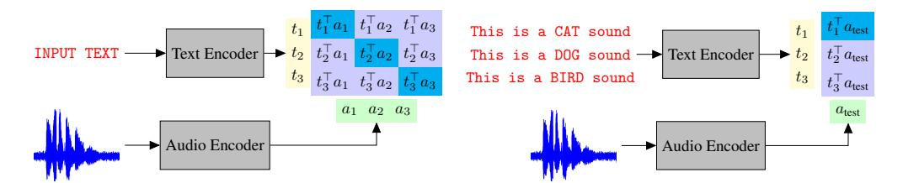
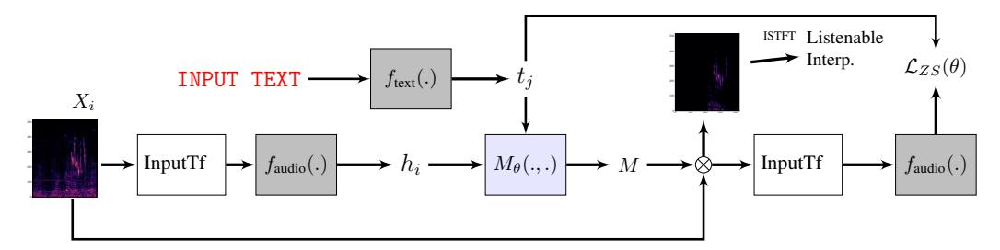
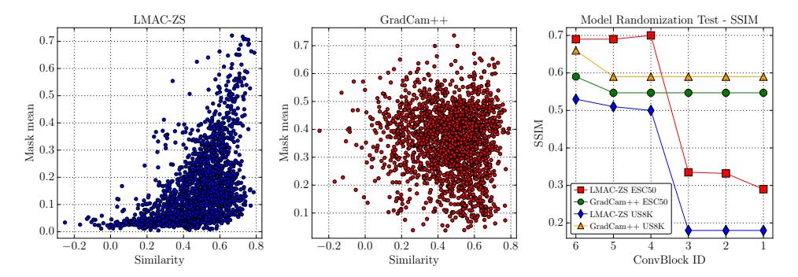
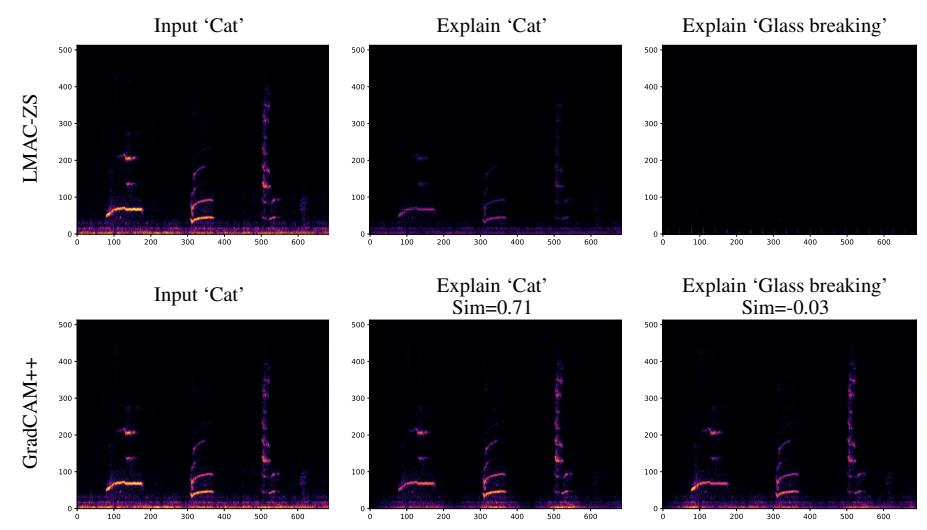
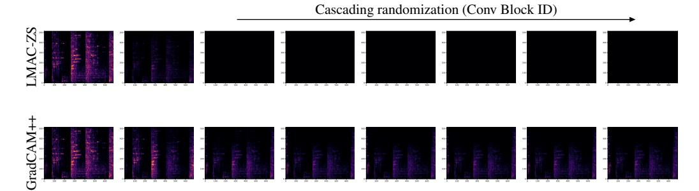
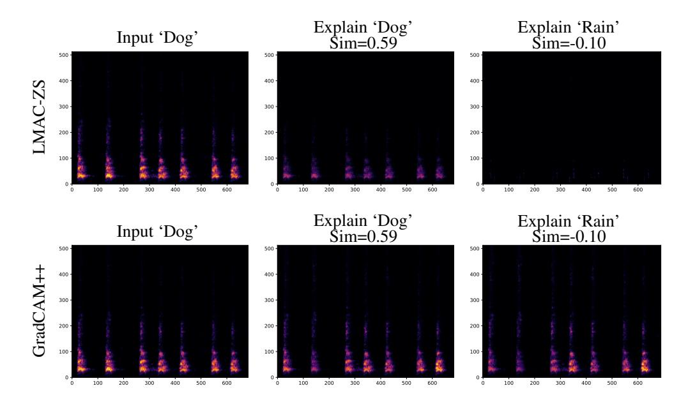
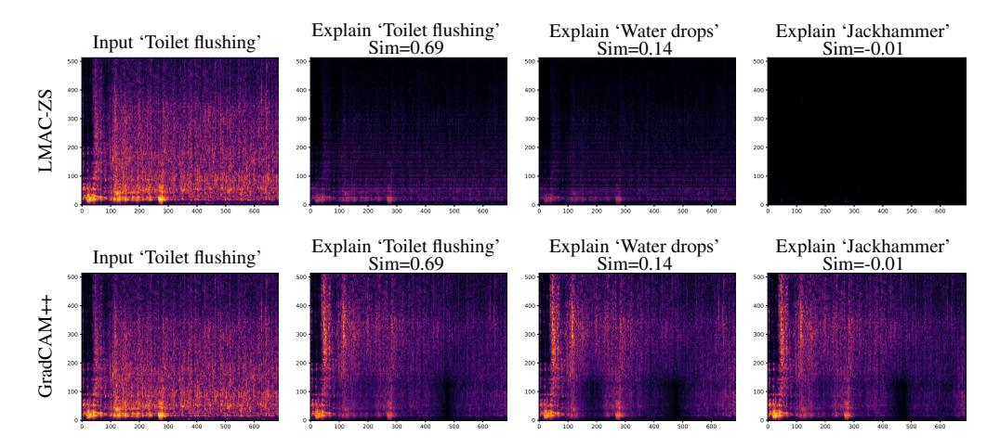

# Listenable Maps for Zero-Shot Audio Classifiers

Francesco Paissan∗1,2 , Luca Della Libera2,3 , Mirco Ravanelli2,3 , Cem Subakan2,3,4 1Fondazione Bruno Kessler, 2Mila, Québec AI Institute, 3Concordia University, 4Université Laval

# Abstract

Interpreting the decisions of deep learning models, including audio classifiers, is crucial for ensuring the transparency and trustworthiness of this technology. In this paper, we introduce LMAC-ZS (Listenable Maps for Audio Classifiers in the Zero-Shot context), which, to the best of our knowledge, is the first decoder-based post-hoc interpretation method for explaining the decisions of zero-shot audio classifiers. The proposed method utilizes a novel loss function that maximizes the faithfulness to the original similarity between a given text-and-audio pair. We provide an extensive evaluation using the Contrastive Language-Audio Pretraining (CLAP) model to showcase that our interpreter remains faithful to the decisions in a zero-shot classification context. Moreover, we qualitatively show that our method produces meaningful explanations that correlate well with different text prompts.

# 1 Introduction

The widespread adoption of AI in critical decision-making processes makes interpreting the decisions of deep learning models crucial for ensuring transparency and trustworthiness. Recently, significant research has been devoted to explainable machine learning [Molnar](#page-10-0) [\[2022\]](#page-10-0). These efforts aim to either employ interpretable models or explain the decisions of black-box models using posthoc explanation methods. In the audio domain, however, only a few works exist on interpretable audio classifiers [Zinemanas et al.](#page-11-0) [\[2021\]](#page-11-0), [Alonso-Jiménez et al.](#page-9-0) [\[2024\]](#page-9-0), [Libera et al.](#page-10-1) [\[2024\]](#page-10-1) as well as on posthoc explanation methods [Parekh et al.](#page-11-1) [\[2022\]](#page-11-1), [Haunschmid et al.](#page-10-2) [\[2020\]](#page-10-2), [Paissan et al.](#page-10-3) [\[2023,](#page-10-3) [2024\]](#page-10-4). The latter contributions are limited to standard closed-set classification and do not explore the challenging topic of interpreting zero-shot classifiers. Zero-shot classifiers, on the other hand, are gaining popularity for their exceptional adaptability, as they define audio classes based on a set of textual prompts [Radford et al.](#page-11-2) [\[2019\]](#page-11-2). The class labels are not necessarily predefined but can be generated dynamically during inference via natural language. The increased flexibility of zero-shot classifiers comes with a drawback: their predictions are challenging to interpret. This difficulty arises from their multi-modal nature, as learning an interpreter in the joint representation space between text and audio is required. A notable example of a zero-shot classifier is Contrastive Language Audio Pretraining (CLAP) [Elizalde et al.](#page-9-1) [\[2023\]](#page-9-1), which jointly trains audio and text representations using contrastive learning, that we also work with in this paper.

This paper addresses the problem of posthoc explanations for zero-shot audio classifiers. To the best of our knowledge, this has never been attempted before in the literature. We propose LMAC-ZS (Listenable Maps for Audio Classifiers in the Zero-Shot context), which consists of a decoder (the interpreter) that outputs a saliency map capable of highlighting the regions within the input audio that trigger the zero-shot classification. We introduce a novel loss function that incentives faithfully following the similarity between the original audio and the corresponding text prompt. Our method provides listenable interpretations for linear and non-linear frequency-scale short-time Fourier transform (STFT) representations of audio waveforms. It can also operate on the raw audio domain directly. We applied our interpretation method on top of a pretrained version of the popular

∗Correspondance to fpaissan@fbk.eu

Figure 1: (**left**) The training of the CLAP model for learning cross-modal representations. (**right**) Zero-shot classification with the CLAP model.

CLAP Elizalde et al. [2023] by considering different zero-shot classification datasets, including the ESC50 Piczak [2015], UrbanSound8K Salamon et al. [2014], as well as versions of ESC50 and UrbanSound8K where different types of contaminations are applied. We show extensive experimental results suggesting that the produced saliency maps correlate well with the corresponding text prompts and faithfully follow the original zero-shot classifier. In particular, our evaluation using various faithfulness metrics highlights that LMAC-ZS is able to provide explanations that are highly relevant to the decisions made by the CLAP model in the zero-shot context. Our method significantly outperforms traditional approaches such as GradCAM++ Chattopadhay et al. [2018], highlighting their inefficiency in challenging tasks such as zero-shot audio classification.

In summary, our contributions are the following:

- We propose a new method, LMAC-ZS, to explain zero-shot audio classifiers.
- We show that LMAC-ZS maintains faithfulness to the CLAP predictions across diverse zero-shot scenarios.
- We qualitatively show that LMAC-ZS produces meaningful explanations for different text prompts.

#### 1.1 Related Work

Posthoc interpretation methods aim to explain the decisions of pretrained neural networks. Several works exist on producing posthoc interpretations with gradient-based approaches in the computer vision literature. These include the standard saliency method Simonyan et al. [2014], GradCAM Selvaraju et al. [2019], GradCAM++ Chattopadhay et al. [2018], SmoothGrad Smilkov et al. [2017], Integrated Gradients (IG) Sundararajan et al. [2017], and several others. However, as suggested in Adebayo et al. [2018], these methods often fail to follow the classifier very faithfully and tend to be insensitive even to random model weights. Another category of post-hoc interpretation methods in computer vision generates explanations by applying masks to the input data. Key approaches in this category include Fong and Vedaldi [2017, 2018], Petsiuk et al. [2018], Chang et al. [2019], which use optimization-based techniques to learn and generate these masks. There also exists a series of works that are most closely related to this paper, where a decoder is trained to produce explanations. Notable attempts in this vein include Dabkowski and Gal (2017) Dabkowski and Gal [2017], Fan et al. (2017) Fan et al. [2017], Zolna et al. (2020) Zolna et al. [2019], and Phang et al. (2020).

In the audio domain, several post-hoc explanation methods exist. These methods employ various techniques such as layer-wise relevance propagation Becker et al. [2024], guided backpropagation Muckenhirn et al. [2019], and LIME Mishra et al. [2017, 2020], Haunschmid et al. [2020], Chowdhury et al. [2021]. More recent posthoc interpretation methods that use a decoder to produce masks on spectrograms include Listen-to-Interpret Parekh et al. [2022], which uses a Non-Negative Matrix Factorization Lee and Seung [1999] based decoder to produce non-negative saliency maps. Other examples include Posthoc Interpretation via Quantization Paissan et al. [2023], which trains a VQ-VAE Van den Oord et al. [2017]-based decoder as an explanation module, and Listenable Maps for Audio Classifiers Paissan et al. [2024], which trains a decoder using a classification loss to promote faithfulness. These works are not directly applicable to zero-shot classification as they require a predefined set of labels to train the interpreter. In this paper, our goal is to produce explanations in a true zero-shot fashion. To achieve that, we train our decoder on the same data as the CLAP model (without using class labels that we will later test on). Subsequently, LMAC-ZS can produce explanations for arbitrary labels, encoded as natural language. This includes labels not previously seen during the training of the interpreter.

Figure 2: LMAC-ZS architecture. The input spectrogram (linear frequency)  $X_i$  (the i-th audio in the batch) first of all passes through the transformations (InputTf block) to make it compatible with the input domain (e.g. Mel Spectra) of the audio encoder  $f_{\rm audio}(.)$ , which yields the latent representations  $h_i$ . These representations along with the text representation  $t_j$  (the j-th text prompt within the batch) are then fed to the decoder  $M_{\theta}(.\,,.)$ . The resulting mask is then element-wise multiplied with the input spectrogram  $X_i$ . The masked spectrogram  $M \odot X_i$  is then converted back to the input domain of the audio encoder, and the similarity score  $t_i^{\top} f_{\rm audio} \left( M_{\theta}(t_i, h_j) \odot X_{\rm audio, j} \right)$  is calculated, which is used in the overall training objective  $\mathcal{L}_{ZS}(\theta)$ .

### 2 Methodology

We first present the learning methodology for audio-text cross-modal representations in Section 2.1. Then, we introduce masking based posthoc explanations in Section 2.2, and finally we introduce our method LMAC-ZS for creating saliency maps for zero-shot audio classifiers in Section 2.3.

#### 2.1 Contrastive Learning of Audio-Text Cross-Modal Representations

The goal of learning audio-text cross-modal representations is to create a joint latent space between text and audio. CLAP (Contrastive Language-Audio Pretraining) Elizalde et al. [2023], achieves this via contrastive learning. That is, the similarity between the latent representations of a text and audio signal is maximized if they form a pair, otherwise this similarity is minimized. More specifically, consider  $X_t$  and  $X_a$  as batches of text and audio data, respectively. Within the CLAP model, the latent representation is derived by passing the text and audio through their respective encoders, denoted as  $g_t(.)$  and  $g_a(.)$ . This process produces the text and audio latent representations, denoted as  $L_{\text{text}} = g_{\text{text}}(X_{\text{text}})$  and  $L_{\text{audio}} = g_{\text{audio}}(X_{\text{audio}})$ , respectively. Here,  $L_{\text{text}}$  is a matrix of dimensions  $\mathbb{R}^{N \times T}$ , where N is the batch size and T represents the latent dimensionality of text. Similarly,  $L_{\text{audio}}$  is a matrix of dimensions  $\mathbb{R}^{N \times A}$ , where A denotes the latent dimensionality of audio. CLAP trains a joint latent space by passing  $L_{\text{text}}$  and  $L_{\text{audio}}$  through fully-connected layers such that,

$$t = \mathbf{MLP}_{\text{text}}(L_{\text{text}}), \ a = \mathbf{MLP}_{\text{audio}}(L_{\text{audio}}),$$
 (1)

where  $\mathbf{MLP}(.)$  denotes the multi-layer perceptron transformation layers. The matrix  $t \in \mathbb{R}^{N \times d}$  and  $a \in \mathbb{R}^{N \times d}$  respectively denote the text and audio latent variables with the same latent dimensionality d. As a shorthand for the rest of the paper we will denote the combination of encoders and the  $\mathbf{MLP}$  with  $f_{\text{text}}(.) := \mathbf{MLP}_{\text{text}}(g_{\text{text}}(.))$  and  $f_{\text{audio}}(.) := \mathbf{MLP}_{\text{audio}}(g_{\text{audio}}(.))$  for text and audio, respectively. The model aims to maximize the diagonal entries on the matrix  $C = ta^{\top}$ . The matrix  $C \in \mathbb{R}^{N \times N}$  represents audio-text pairings. The diagonal elements  $C_{i,i}$  correspond to positive samples, while other elements are negative samples. This translates into the following training loss function:

$$\mathcal{L}(C) = -\frac{1}{2} \sum_{i=1}^{N} \left( \log \mathbf{Softmax}_{t}(C/\tau)_{i,i} + \log \mathbf{Softmax}_{a}(C/\tau)_{i,i} \right), \tag{2}$$

where  $\mathbf{Softmax}_t(.)$  and  $\mathbf{Softmax}_a(.)$  respectively denote Softmax functions along text and audio dimensions,  $\tau$  is a temperature scaling parameter, and the  $C_{i,i}$  denotes the diagonal elements of the C matrix. We show the training forward pass pipeline in the left panel of Figure 1.

We would like to note that with this framework the zero-shot classification amounts to calculating the similarity of the representation of a given audio with a set of text prompts, each corresponding to a class labels. Namely, the classification decision is taken as:

$$\widehat{c} = \arg\max_{j} t_{j}^{\top} a_{\text{test}} = \arg\max_{j} f_{\text{text}}(\texttt{prompt}_{j})^{\top} f_{\text{audio}}(X_{\text{audio}}^{\text{test}}), \tag{3}$$

where  $\hat{c}$  is the zero-shot classification decision,  $a_{\text{test}}$  is the embedding for the test audio, and  $t_j$  is the text embedding corresponding to the label of class j (promptj). We show the pipeline of zero-shot classification in the right panel of Figure 1.

#### 2.2 Saliency Maps For Standard Audio Classifiers

In this work, we adopt a posthoc interpretation method that uses a learnable decoder. Before we delve into how to generate a saliency map for a zero-shot classifier, we first explain how to produce a saliency map within the context of a standard classification setup. The loss function that is minimized during training in Paissan et al. [2024] to obtain faithful saliency maps is defined as follows:

$$\mathcal{L}(\theta) = \text{CrossEntropy}(\widehat{y}; f(M_{\theta}(h) \odot X)) + \lambda ||M_{\theta}(h)||_{1}. \tag{4}$$

This loss function aims to maximally align the classifier prediction  $\widehat{y} = \arg\max_c f_c(X)$ , with the classifier output obtained after masking the input, i.e. the logit  $f\left(M_{\theta}(h)\odot X\right) \in \mathbb{R}^{N_C}$ , where  $N_C$  is the number of classes. The decoder network  $M_{\theta}(h)$  takes in the classifier representations h (which can consist of representations of several layers) and produces a mask (with values in [0,1] and same size as the input) that is element-wise multiplied with the input X. A regularization term that consists of an  $L_1$  loss is also used to prevent trivial solutions, such as a mask with all values set to 1. Lastly, we would like to note that in the L-MAC paper, also a mask-out term —CrossEntropy( $\widehat{y}$ ,  $f\left((1-M_{\theta}(h))\odot X\right)$ ) is included. This term minimizes the relevance of the mask-out portion to the predicted class  $\widehat{y}$ . We have omitted it from Equation (4) for the sake of brevity. In the next section, we introduce our framework, which applies similar ideas to faithfully explain zero-shot classifiers that we have defined in Section 2.1.

#### 2.3 Saliency Maps for Zero-Shot Audio Classifiers

Similarly to the methodology introduced in the previous section, our goal is to generate interpretations that faithfully follow the model. However, in the context of zero-shot classifiers, we do not have a model that outputs a fixed number of logits. Hence, we need a different loss function that promotes faithfulness between the explanations and the zero-shot audio classifier, which relies on similarities to make its decisions. We denote the similarity between the i-th text prompt and j-th audio recording with  $C_{i,j}$  as

$$C_{i,j} = t_i^{\top} a_j = t_i^{\top} f_{\text{audio}}(X_{\text{audio},j}). \tag{5}$$

Our methodology is based on obtaining a saliency map such that the text-audio cross-modal similarity matrix C is maximally preserved after masking the important parts of the spectrogram. In other words, we learn a decoder such that, after masking the audio, the similarity with text prompts within the batch is maximally preserved. To this end, we define the loss function as follows:

$$\mathcal{L}_{ZS}(\theta) = \sum_{i,j} \left\| C_{i,j} - t_i^{\top} f_{\text{audio}} \left( M_{\theta}(t_i, h_j) \odot X_{\text{audio},j} \right) \right\| + \lambda_1 \left\| M_{\theta}(t_i, h_j) \right\|_1 + \lambda_2 \sum_i D(X_{\text{audio},i}).$$
(6)

Here, the first term aims to minimize the discrepancy between the original similarities  $C_{i,j}$  and the similarities after masking the input audio  $X_{\mathrm{audio},j} \in \mathbb{R}^{T \times F}$  using the decoder  $M_{\theta}(t_i,h_j)$ , which outputs a mask of shape  $T \times F$ . Importantly, the decoder is conditioned on both the text representation  $t_i = f_{\mathrm{text}}(X_{\mathrm{text},i})$  that corresponds to the i-th text prompt in the batch, and the representations  $h_j$ , which includes the last 4 representations obtained from the audio encoder  $f_{\mathrm{audio}}(X_{\mathrm{audio},j})$ .  $\lambda_1,\lambda_2$  are tradeoff parameters.

The second term in Equation 6 promotes sparsity in the generated mask to avoid trivial solutions. Finally, the last term D(.) aims to increase the diversity of masks generated for a given audio when conditioned on different text prompts. It is defined as:

$$D(X_{\text{audio},i}) = \sum_{j:j\neq i} \left\| t_i^\top t_j - f_{\text{audio}} \left( X_{\text{audio},i} \odot M_{\theta}(t_i, h_i) \right)^\top f_{\text{audio}} \left( X_{\text{audio},i} \odot M_{\theta}(t_j, h_i) \right) \right\|. \tag{7}$$

The goal of this term is to align the uni-modal similarity between text embeddings  $t_i$ ,  $t_j$  with the uni-modal similarity between the corresponding audio embeddings  $f_{\text{audio}}(X_{\text{audio},i} \odot M_{\theta}(t_i, h_i))$ ,

 $f_{\text{audio}}(X_{\text{audio},i}\odot M_{\theta}(t_j,h_i))$ , obtained from the corresponding masked spectrograms. The intuition is that the similarity between two text prompts should be reflected in the similarity of the audio embeddings from the corresponding masked spectrograms: the farther the text prompts, the farther apart should be the corresponding audio embeddings from masked spectrograms, and thus, the more different the masks. The overall pipeline is shown in Figure 2.

**Producing Listenable Interpretations:** Our framework can operate both the time and frequency domains. In the Short-Time Fourier Transform (STFT) domain, we generate interpretable audio by applying the inverse STFT (ISTFT) operation on the masked spectrogram, such that  $x_{\text{int}} = \text{ISTFT}(X \odot M)$ , where both the interpretation mask M and the input audio X are in the linear-scale STFT domain. This operation is shown in Figure 2.

### 3 Experiments

#### 3.1 Metrics

To evaluate our method, we employ faithfulness metrics previously used in the audio interpretability literature for standard classification setups. We adapt such metrics to the zero-shot scenario by using the class prediction probabilities defined by audio-text similarities such that

$$p(c=j) = \frac{\exp(t_j^\top a_{\text{test}})}{\sum_{k=1}^{N_c} \exp(t_k^\top a_{\text{test}})},$$
(8)

where p(c=j) is the probability of predicting the class that corresponds to the j-th text prompt and  $N_c$  is the total number of text prompts used in the zero-shot setting. Analogously to CLAP Elizalde et al. [2023], to create prompts that correspond to the predefined classes in ESC50 Piczak [2015] and UrbanSound8K Salamon et al. [2014], we augment the class labels with the prefix "this is the sound of", obtaining prompts such as "this is the sound of baby crying", "this is the sound of cat". When computing all the metrics for LMAC-ZS, we conditioned the decoder on the text prompt that corresponds to the model prediction  $\widehat{c} = \arg\max t_j^{\top} a_{\text{test}}$ .

**Faithfulness on Spectra (FF):** Introduced in Parekh et al. [2022], it assesses the importance of the provided explanation for the classifier. The metric is calculated by measuring how much does a class-specific prediction probability drops after removing the interpretation signal from the original. It is defined as

$$FF_n = p_{\widehat{c}}(X_n) - p_{\widehat{c}}(X_n - X_{int}),$$

where  $\widehat{c}$  is the class prediction given by the classifier. High faithfulness values mean that the masked-in portion of the input spectrogram X is highly influential for the classifier decision of the predicted class  $\widehat{c}$ . We report the average faithfulness over all examples by reporting the average quantity  $FF = \sum_{n} \frac{1}{N} FF_n$ . Larger is better.

**Average Increase (AI):** Introduced in Chattopadhay et al. [2018], it measures the increase in confidence for the masked-in portion of the interpretation, and it is calculated as follows:

$$AI = \frac{1}{N} \sum_{n=1}^{N} [p_{\widehat{c}}(X_n \odot M) > p_{\widehat{c}}(X_n)] \cdot 100,$$

where [.], is the indicator function, which is one if the argument is true, and zero otherwise. For this metric, larger is better.

**Average Drop (AD):** Introduced in Chattopadhay et al. [2018], it measures the decrease in model confidence when the input image is masked, and it is calculated as follows:

$$AD = \frac{1}{N} \sum_{n=1}^{N} \frac{\max(0, p_{\widehat{c}}(X_n) - p_{\widehat{c}}(X_n \odot M))}{p_{\widehat{c}}(X_n)} \cdot 100.$$

For this metric, smaller is better.

**Average Gain (AG):** Introduced in Zhang et al. [2023], it measures the increase in confidence after masking the input image. It is calculated as follows (larger is better):

$$AG = \frac{1}{N} \sum_{n=1}^{N} \frac{\max(0, p_{\widehat{c}}(X_n \odot M) - p_{\widehat{c}}(X_n))}{1 - p_{\widehat{c}}(X_n)} \cdot 100.$$

Figure 3: (left) Mask-Mean vs Similarity for LMAC-ZS, (middle) Mask-Mean vs Similarity for GradCam++, (right) Model Randomization Test for LMAC-ZS and GradCam++.

**Input Fidelity** (**Fid-In**): Introduced in Paissan et al. [2023], it measures whether the classifier outputs the same class prediction on the masked-in portion of the input image. It is defined as the following and the larger is better,

$$\operatorname{Fid-In} = \frac{1}{N} \sum_{n=1}^{N} \left[ \arg \max_{c} p_{c}(X_{n}) = \arg \max_{c'} f_{c'}(X_{n} \odot M) \right].$$

**Sparseness (SPS):** Introduced in Chalasani et al. [2020], it measures whether only values with large predicted saliency contribute to the prediction of the neural network. Larger values indicate more sparse/concise saliency maps. We use the implementation from the Quantus library Hedström et al. [2023].

**Complexity** (**COMP**): Introduced in Bhatt et al. [2020], it measures the entropy of the distribution of contributions from each feature to the attribution. Smaller values indicate less complex interpretations. We again use the implementation from the Quantus library.

#### 3.2 Experimental Setup

We use official pretrained CLAP Elizalde et al. [2023] weights2 to perform zero-shot classification on ESC50 Piczak [2015] and UrbanSound8K Salamon et al. [2014] datasets. We train LMAC-ZS on the datasets on which CLAP had been trained (namely, Clotho Drossos et al. [2019], FSD50K Fonseca et al. [2022], AudioCaps Kim et al. [2019], and MACS Martín-Morató and Mesaros [2021] which are publicly available). We also explored training LMAC-ZS only on Clotho to simulate the case where the computational budget is limited. The models were trained on a single NVIDIA RTX 3090 GPU. For the LMAC-ZS model that is trained on the Clotho dataset, we did 2 epochs on the complete dataset, for which an epoch approximately takes an hour. For the Full CLAP data we did 2 epochs as well, and an epoch takes around 4 hours. We quantitatively test whether LMAC-ZS follows the zero-shot classifier on In-Domain (ID) and Out-of-Domain (OOD) settings. For the In-Domain setting, we perform zero-shot classification on clean audio from ESC50 and UrbanSound8k and then produce explanations for the classifications using LMAC-ZS. We would like to emphasize that LMAC-ZS has only been trained on the training datasets for CLAP, and has not been fine-tuned on ESC50 or UrbanSound. For the Out-of-Domain setting, we contaminate the audio with various noise sources at 3dB Signal-to-Noise Ratio (other audio from the same dataset, white-noise, and human speech from the LJ-Speech Ito and Johnson [2017] dataset).

We explore masking in the Mel-domain to explore the case where we produce explanations directly in the feature space on which CLAP operates. For Mel-domain we used 44.1kHz data on which the CLAP model is trained. We also explore masking in the linear frequency-scale log power-STFT domain to be able to provide listenable explanations. For STFT domain filtering we worked with 16kHz data. We would like to note that this results in slight changes in zero-shot classification accuracies, which are reported in the Tables 1, 2, 3. We trained LMAC-ZS with a batch size of 2 using the Adam optimizer Kingma and Ba [2015] with a learning rate of 1e–5. The decoder consists of a

&lt;sup>2https://zenodo.org/records/8378278

Table 1: In-Domain quantitative evaluation for the ESC50 and UrbanSound8K Datasets. Two versions of LMAC-ZS are compared: (CT) trained on the Clotho dataset only and (Full) trained on all CLAP datasets. MM denotes the Mask-Mean, the average value for the obtained masks.

| Metric         | AI (†)                                                   | AD (↓) | AG (†) | FF ( <b>↑</b> ) | Fid-In (†) | SPS (†) | COMP (↓) | MM     |  |
|----------------|----------------------------------------------------------|--------|--------|-----------------|------------|---------|----------|--------|--|
|                | ZS classification on ESC50, Mel-Masking, 80.7% accuracy  |        |        |                 |            |         |          |        |  |
| Gradcam        | 2.90                                                     | 45.85  | 1.01   | 0.28            | 0.19       | 0.71    | 9.52     | 0.15   |  |
| GradCam++      | 8.45                                                     | 35.07  | 3.19   | 0.50            | 0.39       | 0.41    | 10.32    | 0.35   |  |
| SmoothGrad     | 0.50                                                     | 52.76  | 0.12   | 0.024           | 0.036      | 0.301   | 10.52    | 0.039  |  |
| IG             | 0.25                                                     | 53.47  | 0.054  | 0.064           | 0.022      | 0.57    | 10.09    | 0.037  |  |
| LMAC-ZS (CT)   | 29.00                                                    | 12.25  | 12.93  | 0.49            | 0.80       | 0.78    | 9.40     | 0.14   |  |
| LMAC-ZS (Full) | 23.45                                                    | 17.12  | 10.31  | 0.51            | 0.68       | 0.80    | 9.12     | 0.17   |  |
|                | ZS classification on ESC50, STFT-Masking, 78.9% accuracy |        |        |                 |            |         |          |        |  |
| GradCam        | 20.30                                                    | 23.75  | 7.77   | 0.78            | 0.58       | 0.72    | 11.54    | 0.14   |  |
| GradCam++      | 32.50                                                    | 8.97   | 7.95   | 0.79            | 0.84       | 0.41    | 12.41    | 0.35   |  |
| SmoothGrad     | 6.95                                                     | 32.75  | 2.85   | 0.78            | 0.47       | 0.53    | 11.98    | 0.0001 |  |
| IG             | 16.10                                                    | 21.51  | 6.05   | 0.79            | 0.65       | 0.74    | 11.58    | 0.0095 |  |
| LMAC-ZS (CT)   | 37.40                                                    | 7.43   | 11.26  | 0.78            | 0.86       | 0.50    | 12.29    | 0.11   |  |
| LMAC-ZS (Full) | 43.35                                                    | 4.29   | 10.57  | 0.78            | 0.9        | 0.65    | 11.86    | 0.1    |  |
|                | ZS classification on US8K, Mel-Masking, 71.7% accuracy   |        |        |                 |            |         |          |        |  |
| GradCam        | 2.34                                                     | 47.55  | 1.09   | 0.26            | 0.16       | 0.78    | 9.32     | 0.12   |  |
| GradCam++      | 7.21                                                     | 33.4   | 3.33   | 0.56            | 0.44       | 0.41    | 10.27    | 0.39   |  |
| SmoothGrad     | 1.21                                                     | 49.68  | 0.43   | 0.04            | 0.11       | 0.33    | 10.49    | 0.04   |  |
| IG             | 0.98                                                     | 50.77  | 0.35   | 0.15            | 0.09       | 0.60    | 10.02    | 0.03   |  |
| LMAC-ZS (CT)   | 23.41                                                    | 20.58  | 12.88  | 0.51            | 0.65       | 0.85    | 9.01     | 0.08   |  |
| LMAC-ZS (Full) | 35.69                                                    | 15.65  | 18.19  | 0.48            | 0.72       | 0.79    | 8.95     | 0.17   |  |
|                | ZS classification on US8K, STFT-Masking, 68.9% accuracy  |        |        |                 |            |         |          |        |  |
| GradCam        | 18.67                                                    | 26.1   | 11.18  | 0.79            | 0.53       | 0.77    | 11.41    | 0.12   |  |
| GradCam++      | 32.85                                                    | 8.84   | 13.16  | 0.81            | 0.83       | 0.41    | 12.34    | 0.39   |  |
| SmoothGrad     | 15.31                                                    | 23.56  | 7.67   | 0.81            | 0.61       | 0.54    | 11.97    | 0.0001 |  |
| IG             | 22.65                                                    | 19.53  | 12.31  | 0.77            | 0.66       | 0.79    | 11.36    | 0.01   |  |
| LMAC-ZS (CT)   | 32.71                                                    | 14.57  | 14.69  | 0.75            | 0.72       | 0.55    | 12.12    | 0.08   |  |
| LMAC-ZS (Full) | 40.85                                                    | 7.79   | 15.52  | 0.78            | 0.85       | 0.76    | 11.34    | 0.07   |  |

series of transposed convolutions to upsample from CNN14 Kong et al. [2020] CLAP representations and incorporates text conditioning by using cross-attention similar to that used in Stable Diffusion Rombach et al. [2021]. The implementation is done using the SpeechBrain toolkit Ravanelli et al. [2021] and it can be accessed through 3.

#### 3.3 Quantitative Comparison

We compare LMAC-ZS with popular gradient-based saliency map methods including GradCam Selvaraju et al. [2019], GradCam++ Chattopadhay et al. [2018], SmoothGradSmilkov et al. [2017], and Integrated Gradients (IG) Sundararajan et al. [2017]. We apply these saliency map methods using only the CNN14 audio representations. The class logit with respect to which the class activation map for these methods is calculated is picked by using the zero-shot classification decision  $\hat{c} = \arg\max_j t_j^{\mathsf{T}} a_{\text{test}}$ .

In Table 1, we compare the faithfulness of the explanations obtained on In-Domain data, where we performed zero-shot classification on clean ESC50 and US8k recordings. We observe that on ESC50 with Mel-Domain masking, LMAC-ZS obtains better AI, AD, AG, FF, and Fid-In values. We observe a similar trend for AI, AD, and AG with STFT-domain masking also, while FF values are comparable. On the UrbanSound8K dataset, we also observe that in terms of AI, AD, and AG the best results are obtained with LMAC-ZS trained with the Full CLAP training datasets. In terms of mask sparseness (SPS) and Complexity (COMP) in most cases, the best results are obtained with the proposed model.

In Table 2, we compare the faithfulness of the explanations obtained on ESC50 samples contaminated with three different types of background noises. We observe that with Mel-Masking, LMAC-ZS reaches better performance in terms of AI, AD, AG, and very comparable numbers in terms of Fid-In. We also observe that in terms of Sparsity and Complexity LMAC-ZS yields better masks in the

3https://anonymous.4open.science/w/n2024-BD26/

Table 2: Out-of-Domain quantitative evaluation for the ESC50 Dataset.

| Metric         | <b>AI</b> (↑)                                                                       | AD (↓)      | AG (↑)   | FF ( <b>↑</b> ) | Fid-In (†)                | SPS (↑)    | $COMP\left(\downarrow\right)$ | MM          |  |  |
|----------------|-------------------------------------------------------------------------------------|-------------|----------|-----------------|---------------------------|------------|-------------------------------|-------------|--|--|
|                | ZS classification on ESC50, Mel-Masking, ESC50 contamination, 57.2% accuracy        |             |          |                 |                           |            |                               |             |  |  |
| GradCam        | 6.78                                                                                | 40.71       | 3.13     | 0.29            | 0.19                      | 0.69       | 9.66                          | 0.18        |  |  |
| GradCam++      | 9.82                                                                                | 35.81       | 4.53     | 0.42            | 0.29                      | 0.39       | 10.40                         | 0.35        |  |  |
| SmoothGrad     | 0.62                                                                                | 48.55       | 0.13     | 0.024           | 0.022                     | 0.29       | 10.54                         | 0.039       |  |  |
| IG             | 0.55                                                                                | 48.88       | 0.091    | 0.073           | 0.020                     | 0.56       | 10.13                         | 0.039       |  |  |
| LMAC-ZS (CT)   | 19.25                                                                               | 24.30       | 8.83     | 0.40            | 0.49                      | 0.81       | 9.18                          | 0.13        |  |  |
| LMAC-ZS (Full) | 20.43                                                                               | 21.57       | 9.71     | 0.42            | 0.54                      | 0.82       | 9.08                          | 0.15        |  |  |
|                | ZS classification on ESC50, STFT-Masking, ESC50 contamination, 58.6% accuracy       |             |          |                 |                           |            |                               |             |  |  |
| GradCam        | 23.77                                                                               | 25.25       | 12.24    | 0.69            | 0.49                      | 0.69       | 11.73                         | 0.17        |  |  |
| GradCam++      | 29.52                                                                               | 14.84       | 10.17    | 0.70            | 0.70                      | 0.39       | 12.48                         | 0.35        |  |  |
| SmoothGrad     | 11.80                                                                               | 30.63       | 5.15     | 0.70            | 0.42                      | 0.52       | 12.06                         | 0.0002      |  |  |
| IG             | 16.37                                                                               | 25.67       | 7.21     | 0.70            | 0.51                      | 0.71       | 11.73                         | 0.011       |  |  |
| LMAC-ZS (CT)   | 35.65                                                                               | 12.23       | 13.04    | 0.69            | 0.74                      | 0.53       | 12.18                         | 0.09        |  |  |
| LMAC-ZS (Full) | 39.4                                                                                | 8.28        | 11.81    | 0.69            | 0.80                      | 0.67       | 11.79                         | 0.09        |  |  |
|                | ZS clas                                                                             | sification  | on ESC50 | , Mel-Ma        | sking, White              | Noise cont | tamination, 65.               | 2% accuracy |  |  |
| GradCam        | 3.65                                                                                | 43.79       | 1.43     | 0.34            | 0.12                      | 0.75       | 9.41                          | 0.14        |  |  |
| GradCam++      | 7.12                                                                                | 37.03       | 2.97     | 0.52            | 0.26                      | 0.43       | 10.33                         | 0.335       |  |  |
| SmoothGrad     | 1.72                                                                                | 47.93       | 0.56     | 0.040           | 0.040                     | 0.28       | 10.54                         | 0.035       |  |  |
| IG             | 1.57                                                                                | 47.97       | 0.55     | 0.084           | 0.039                     | 0.54       | 10.16                         | 0.034       |  |  |
| LMAC-ZS (CT)   | 28.52                                                                               | 17.72       | 12.78    | 0.42            | 0.64                      | 0.82       | 9.18                          | 0.19        |  |  |
| LMAC-ZS (Full) | 14.25                                                                               | 27.92       | 6.62     | 0.41            | 0.42                      | 0.86       | 8.86                          | 0.11        |  |  |
|                | ZS classification on ESC50, STFT-Masking, White Noise contamination, 57.4% accuracy |             |          |                 |                           |            |                               |             |  |  |
| GradCam        | 14.92                                                                               | 31.89       | 5.95     | 0.66            | 0.32                      | 0.77       | 11.40                         | 0.12        |  |  |
| GradCam++      | 19.50                                                                               | 24.01       | 8.04     | 0.66            | 0.50                      | 0.42       | 12.42                         | 0.33        |  |  |
| SmoothGrad     | 7.10                                                                                | 36.53       | 2.66     | 0.66            | 0.25                      | 0.52       | 12.15                         | 0.0004      |  |  |
| IG             | 10.17                                                                               | 34.35       | 4.89     | 0.66            | 0.30                      | 0.69       | 11.80                         | 0.011       |  |  |
| LMAC-ZS (CT)   | 19.85                                                                               | 21.51       | 7.13     | 0.63            | 0.53                      | 0.52       | 12.24                         | 0.08        |  |  |
| LMAC-ZS (Full) | 32.97                                                                               | 11.86       | 10.63    | 0.64            | 0.70                      | 0.65       | 11.85                         | 0.09        |  |  |
|                | ZS cla                                                                              | ssification | on ESC5  | 0, Mel-M        | asking, LJ-S I | eech conto | umination, 64.8               | % accuracy  |  |  |
| GradCam        | 6.50                                                                                | 39.05       | 3.06     | 0.33            | 0.20                      | 0.70       | 9.66                          | 0.18        |  |  |
| GradCam++      | 12.85                                                                               | 32.81       | 6.50     | 0.47            | 0.32                      | 0.41       | 10.36                         | 0.35        |  |  |
| SmoothGrad     | 0.63                                                                                | 47.40       | 0.17     | 0.03            | 0.02                      | 0.28       | 10.55                         | 0.04        |  |  |
| IG             | 0.53                                                                                | 47.70       | 0.10     | 0.10            | 0.01                      | 0.56       | 10.12                         | 0.04        |  |  |
| LMAC-ZS (CT)   | 24.38                                                                               | 20.69       | 11.29    | 0.43            | 0.56                      | 0.80       | 9.26                          | 0.11        |  |  |
| LMAC-ZS (Full) | 8.95                                                                                | 30.55       | 3.69     | 0.38            | 0.35                      | 0.86       | 8.79                          | 0.10        |  |  |
|                | ZS classification on ESC50, STFT-Masking, LJ-Speech contamination, 64% accuracy     |             |          |                 |                           |            |                               |             |  |  |
| GradCam        | 24.93                                                                               | 22.91       | 12.78    | 0.67            | 0.50                      | 0.70       | 11.72                         | 0.18        |  |  |
| GradCam++      | 34.13                                                                               | 12.24       | 10.84    | 0.67            | 0.72                      | 0.41       | 12.44                         | 0.34        |  |  |
| SmoothGrad     | 9.18                                                                                | 29.60       | 3.91     | 0.67            | 0.40                      | 0.53       | 12.05                         | 0.00        |  |  |
| IG             | 15.55                                                                               | 27.15       | 6.51     | 0.66            | 0.46                      | 0.73       | 11.67                         | 0.01        |  |  |
| LMAC-ZS (CT)   | 25.77                                                                               | 17.79       | 9.67     | 0.63            | 0.63                      | 0.61       | 11.96                         | 0.04        |  |  |
| LMAC-ZS (Full) | 25.73                                                                               | 15.90       | 7.23     | 0.66            | 0.62                      | 0.72       | 11.47                         | 0.05        |  |  |

Mel Domain. In the STFT domain except for LJ-Speech contamination, we observe that LMAC-ZS obtains better performance in terms of AI, AD, and AG. We would like to note that GradCAM++ obtains better FF numbers in general, but we note that GradCAM++ mask areas are larger as shown in the last column with MM. We also observe similar trends for the explanations obtained on US8K samples contaminated with various background noises shown in Table 3. Another point to note is that in general LMAC-ZS trained on the full CLAP training set yields better performance. However, we observe that training LMAC-ZS only on the Clotho dataset yields to comparable or better performance (e.g. ESC50, Mel, white noise contamination). This shows that, in situations where there is limited access to computational resources, training only on Clotho can produce faithful explanations.

#### 3.4 Qualitative Comparison and Sanity Checks

We provide some qualitative examples of generated explanations in Figure 4, and compare with GradCAM++ which seems to provide the most faithful explanations among the baselines according to the Tables 1, 2, and 3. We see that LMAC-ZS generates interpretations that are much more sensitive to the similarity between the text prompt and the input audio. For instance in LMAC-ZS interpretations we see that if there exists a large similarity between the text prompt and the input

Figure 4: Qualitative Comparisons of Explanations given by LMAC-ZS, and GradCAM++, for two different classes. We see that LMAC-ZS shuts-off the explanation depending on the similarity of the given prompt with the input audio, whereas GradCAM++ remains insensitive to the class label.

audio, the mask correctly highlights relevant portions of the input spectrogram. Also, we see that if the similarity between the input and the text prompt is small then the mask tends not to highlight any areas as expected. For instance in Figure [4,](#page-8-0) we see for the input recordings that corresponds to a 'Cat', both LMAC-ZS and GradCAM++ return reasonable explanations. However, when we prompt LMAC-ZS for an unrelated prompt (e.g. 'Glass Breaking' in this case), it correctly returns an empty explanation mask, as it is impossible to explain. On the contrary, when GradCAM++ returns a class activation map corresponding to the class "Glass Breaking," we observe that the explanation remains unchanged.

To measure the correlation between the mask mean and similarity, Figure [3](#page-5-1) presents a scatter plot depicting the relationship between the similarity of the input text prompt and audio. For LMAC-ZS, we observe that explanations are appropriately returned as empty (indicating small Mask-Means) when the similarity score, estimated using CLAP embeddings, is low. Whereas for GradCAM++, the mask mean and similarity appear to be independent of each other.

Finally, we conduct a cascading model randomization sanity check [Adebayo et al.](#page-9-3) [\[2018\]](#page-9-3) to assess the sensitivity of explanations returned by LMAC-ZS to the CLAP weights. As illustrated in Figure [3,](#page-5-1) after three layers of randomization, the similarity drastically decreases for LMAC-ZS, while it remains constant for GradCAM++. We visualize these interpretations in Figure [5](#page-13-0) and provide additional samples in Appendix [A.2.](#page-12-1) For more samples, please visit our companion website[4](#page-8-1) .

### 4 Limitations and Societal Impact

Limitations: Our current implementation focuses on fixed-length audio for simplicity. However, the core concept of LMAC-ZS can be extended to handle variable-length inputs. Additionally, while this work employs standard faithfulness metrics that analyze the dominant class contribution, LMAC-ZS allows for investigating contributions from the top k classes. Studying the top k contributions to faithfulness could provide further insights into the model's decision-making process. Lastly, our study is limited to the CLAP model, primarily selected for its widespread adoption within the field. It is worth mentioning that there is limited availability of alternatives. For instance, most alternative models such as LAION CLAP [Wu et al.](#page-11-15) [\[2023\]](#page-11-15) are still variations of CLAP, offering minimal differences in their core architecture.

Societal Impact: We believe this research has the potential for societal benefits, particularly in healthcare applications. While this work does not directly target medical diagnosis, improved explainability of audio classifiers for speech pathologies could make them more trustworthy and accepted by doctors. We plan to target medical applications directly as future work. We do not see direct negative societal impacts from this research.

4 <https://anonymous.4open.science/w/n2024-BD26/>

# 5 Conclusions

This paper, to the best of our knowledge, represents the first attempt to develop a model specifically designed for interpreting the decisions of pre-trained zero-shot audio classifiers. In particular, we introduce LMAC-ZS, a novel post-hoc explanation method employing a specialized decoder that generates saliency maps highlighting the regions of the audio input that most contribute to the model predictions. Extensive evaluations highlighted that LMAC-ZS effectively generates explanations that closely align with the decisions made by the CLAP model in zero-shot settings. Our quantitative and qualitative comparisons show that LMAC-ZS outperforms or is comparable to the most popular baseline saliency methods on most quantitative faithfulness metrics. Additionally, LMAC-ZS offers the possibility of being prompted for an explanation. This ability is missing in traditional methods and allows users to gain further insights into the decision-making processes conducted by the model.

## References

- Julius Adebayo, Justin Gilmer, Michael Muelly, Ian Goodfellow, Moritz Hardt, and Been Kim. Sanity checks for saliency maps. In *International Conference on Neural Information Processing Systems (NeurIPS)*, volume 31, 2018.
- Pablo Alonso-Jiménez, Leonardo Pepino, Roser Batlle-Roca, Pablo Zinemanas, Dmitry Bogdanov, Xavier Serra, and Martín Rocamora. Leveraging pre-trained autoencoders for interpretable prototype learning of music audio. In *ICASSP Workshop on Explainable AI for Speech and Audio (XAI-SA)*, pages 1–5, 2024.
- Sören Becker, Johanna Vielhaben, Marcel Ackermann, Klaus-Robert Müller, Sebastian Lapuschkin, and Wojciech Samek. AudioMNIST: Exploring explainable artificial intelligence for audio analysis on a simple benchmark. *Journal of the Franklin Institute*, 361:418–428, 2024.
- Umang Bhatt, Adrian Weller, and José M. F. Moura. Evaluating and aggregating feature-based model explanations. In *International Joint Conference on Artificial Intelligence (IJCAI)*, 2020.
- Prasad Chalasani, Jiefeng Chen, Amrita Roy Chowdhury, Xi Wu, and Somesh Jha. Concise explanations of neural networks using adversarial training. In *International Conference on Machine Learning (ICML)*, volume 119, pages 1383–1391, 2020.
- Chun-Hao Chang, Elliot Creager, Anna Goldenberg, and David Duvenaud. Explaining image classifiers by counterfactual generation. In *International Conference on Learning Representations (ICLR)*, 2019.
- Aditya Chattopadhay, Anirban Sarkar, Prantik Howlader, and Vineeth N Balasubramanian. Grad-CAM++: Generalized gradient-based visual explanations for deep convolutional networks. In *IEEE Winter Conference on Applications of Computer Vision (WACV)*, 2018.
- Shreyan Chowdhury, Verena Praher, and Gerhard Widmer. Tracing back music emotion predictions to sound sources and intuitive perceptual qualities. In *Sound and Music Computing Conference (SMC)*, 2021.
- Piotr Dabkowski and Yarin Gal. Real time image saliency for black box classifiers. In *International Conference on Neural Information Processing Systems (NeurIPS)*, pages 6970–6979, 2017.
- Konstantinos Drossos, Samuel Lipping, and Tuomas Virtanen. Clotho: an audio captioning dataset. In *IEEE International Conference on Acoustics, Speech and Signal Processing (ICASSP)*, pages 736–740, 2019.
- Benjamin Elizalde, Soham Deshmukh, Mahmoud Al Ismail, and Huaming Wang. CLAP: Learning audio concepts from natural language supervision. In *IEEE International Conference on Acoustics, Speech and Signal Processing (ICASSP)*, pages 1–5, 2023.
- Lijie Fan, Shengjia Zhao, and Stefano Ermon. Adversarial localization network. In *Learning with limited labeled data: weak supervision and beyond, NeurIPS Workshop*, 2017.

- Ruth Fong and Andrea Vedaldi. Net2Vec: Quantifying and explaining how concepts are encoded by filters in deep neural networks. In *IEEE/CVF Conference on Computer Vision and Pattern Recognition*, pages 8730–8738, 2018.
- Ruth C. Fong and Andrea Vedaldi. Interpretable explanations of black boxes by meaningful perturbation. In *IEEE International Conference on Computer Vision (ICCV)*, 2017. doi: 10.1109/iccv.2017.371. URL <http://dx.doi.org/10.1109/ICCV.2017.371>.
- Eduardo Fonseca, Xavier Favory, Jordi Pons, Frederic Font, and Xavier Serra. FSD50K: an open dataset of human-labeled sound events. *IEEE/ACM Transactions on Audio, Speech, and Language Processing*, 30:829–852, 2022.
- Verena Haunschmid, Ethan Manilow, and Gerhard Widmer. audioLIME: Listenable explanations using source separation. In *International Workshop on Machine Learning and Music*, 2020.
- Anna Hedström, Leander Weber, Daniel Krakowczyk, Dilyara Bareeva, Franz Motzkus, Wojciech Samek, Sebastian Lapuschkin, and Marina Marina M.-C. Höhne. Quantus: An explainable ai toolkit for responsible evaluation of neural network explanations and beyond. *Journal of Machine Learning Research*, 24(34):1–11, 2023. URL <http://jmlr.org/papers/v24/22-0142.html>.
- Keith Ito and Linda Johnson. The LJ speech dataset. [https://keithito.com/](https://keithito.com/LJ-Speech-Dataset/) [LJ-Speech-Dataset/](https://keithito.com/LJ-Speech-Dataset/), 2017.
- Chris Dongjoo Kim, Byeongchang Kim, Hyunmin Lee, and Gunhee Kim. AudioCaps: Generating captions for audios in the wild. In *Conference of the North American Chapter of the Association for Computational Linguistics: Human Language Technologies, Volume 1 (Long and Short Papers)*, pages 119–132, 2019.
- Diederik P. Kingma and Jimmy Ba. Adam: A method for stochastic optimization. In *International Conference on Learning Representations (ICLR)*, 2015.
- Qiuqiang Kong, Yin Cao, Turab Iqbal, Yuxuan Wang, Wenwu Wang, and Mark D. Plumbley. PANNs: Large-scale pretrained audio neural networks for audio pattern recognition. *IEEE/ACM Transactions on Audio, Speech, and Language Processing*, pages 2880–2894, 2020.
- Daniel D. Lee and H. Sebastian Seung. Learning the parts of objects by non-negative matrix factorization. *Nature*, 401:788–791, 1999.
- Luca Della Libera, Cem Subakan, and Mirco Ravanelli. Focal modulation networks for interpretable sound classification. In *ICASSP Workshop on Explainable AI for Speech and Audio (XAI-SA)*, pages 1–5, 2024.
- Irene Martín-Morató and Annamaria Mesaros. What is the ground truth? reliability of multi-annotator data for audio tagging. In *European Signal Processing Conference (EUSIPCO)*, pages 76–80, 2021.
- Saumitra Mishra, Bob L. Sturm, and Simon Dixon. Local interpretable model-agnostic explanations for music content analysis. In *International Society for Music Information Retrieval Conference (IS-MIR)*, pages 537–543, 2017. URL <https://api.semanticscholar.org/CorpusID:795766>.
- Saumitra Mishra, Emmanouil Benetos, Bob L. Sturm, and Simon Dixon. Reliable local explanations for machine listening. In *International Joint Conference on Neural Networks (IJCNN)*, 2020.
- Christoph Molnar. Interpretable machine learning, 2022. URL [https://christophm.github.](https://christophm.github.io/interpretable-ml-book) [io/interpretable-ml-book](https://christophm.github.io/interpretable-ml-book).
- Hannah Muckenhirn, Vinayak Abrol, Mathew Magimai-Doss, and Sébastien Marcel. Understanding and Visualizing Raw Waveform-Based CNNs. In *Proc. Interspeech*, pages 2345–2349, 2019. doi: 10.21437/Interspeech.2019-2341.
- Francesco Paissan, Cem Subakan, and Mirco Ravanelli. Posthoc interpretation via quantization. *arXiv preprint arXiv:2303.12659*, 2023.
- Francesco Paissan, Mirco Ravanelli, and Cem Subakan. Listenable Maps for Audio Classifiers. In *International Conference on Machine Learning (ICML)*, 2024.

- Jayneel Parekh, Sanjeel Parekh, Pavlo Mozharovskyi, Florence d'Alché-Buc, and Gaël Richard. Listen to interpret: Post-hoc interpretability for audio networks with NMF. In *International Conference on Neural Information Processing Systems (NeurIPS)*, volume 35, pages 35270–35283, 2022.
- Vitali Petsiuk, Abir Das, and Kate Saenko. RISE: Randomized input sampling for explanation of black-box models. In *British Machine Vision Conference (BMVC)*, 2018.
- Karol J. Piczak. ESC: Dataset for environmental sound classification. In *Annual ACM Conference on Multimedia*, pages 1015–1018, 2015.
- Alec Radford, Jeff Wu, Rewon Child, David Luan, Dario Amodei, and Ilya Sutskever. Language models are unsupervised multitask learners, 2019. URL [https://api.semanticscholar.org/](https://api.semanticscholar.org/CorpusID:160025533) [CorpusID:160025533](https://api.semanticscholar.org/CorpusID:160025533).
- Mirco Ravanelli, Titouan Parcollet, Peter Plantinga, Aku Rouhe, Samuele Cornell, Loren Lugosch, Cem Subakan, Nauman Dawalatabad, Abdelwahab Heba, Jianyuan Zhong, Ju-Chieh Chou, Sung-Lin Yeh, Szu-Wei Fu, Chien-Feng Liao, Elena Rastorgueva, François Grondin, William Aris, Hwidong Na, Yan Gao, Renato De Mori, and Yoshua Bengio. SpeechBrain: A general-purpose speech toolkit. *arXiv preprint arXiv:2106.04624*, 2021.
- Robin Rombach, A. Blattmann, Dominik Lorenz, Patrick Esser, and Björn Ommer. High-resolution image synthesis with latent diffusion models. In *IEEE/CVF Conference on Computer Vision and Pattern Recognition (CVPR)*, pages 10674–10685, 2021.
- J. Salamon, C. Jacoby, and J. P. Bello. A dataset and taxonomy for urban sound research. In *ACM International Conference on Multimedia*, 2014.
- Ramprasaath R. Selvaraju, Michael Cogswell, Abhishek Das, Ramakrishna Vedantam, Devi Parikh, and Dhruv Batra. Grad-CAM: Visual explanations from deep networks via gradient-based localization. *International Journal of Computer Vision*, pages 336–359, 2019.
- Karen Simonyan, Andrea Vedaldi, and Andrew Zisserman. Deep inside convolutional networks: Visualising image classification models and saliency maps. In *ICLR Workshop Track*, 2014.
- Daniel Smilkov, Nikhil Thorat, Been Kim, Fernanda Viégas, and Martin Wattenberg. SmoothGrad: removing noise by adding noise. In *ICML Workshop on Visualization for Deep Learning*, 2017.
- Mukund Sundararajan, Ankur Taly, and Qiqi Yan. Axiomatic attribution for deep networks. In *International Conference on Machine Learning (ICML)*, pages 3319–3328, 2017.
- Aaron Van den Oord, Oriol Vinyals, and Koray Kavukcuoglu. Neural discrete representation learning. In *International Conference on Neural Information Processing Systems (NeurIPS)*, 2017.
- Yusong Wu, Ke Chen, Tianyu Zhang, Yuchen Hui, Taylor Berg-Kirkpatrick, and Shlomo Dubnov. Large-scale contrastive language-audio pretraining with feature fusion and keyword-to-caption augmentation. In *IEEE International Conference on Acoustics, Speech and Signal Processing, ICASSP*, 2023.
- Hanwei Zhang, Felipe Torres, Ronan Sicre, Yannis Avrithis, and Stephane Ayache. Opti-CAM: Optimizing saliency maps for interpretability. *arXiv preprint arXiv:2301.07002*, 2023.
- Pablo Zinemanas, Martín Rocamora, Marius Miron, Frederic Font, and Xavier Serra. An interpretable deep learning model for automatic sound classification. *Electronics*, 10, 2021. ISSN 2079-9292. doi: 10.3390/electronics10070850. URL <https://www.mdpi.com/2079-9292/10/7/850>.
- Konrad Zolna, Krzysztof J. Geras, and Kyunghyun Cho. Classifier-agnostic saliency map extraction. In *AAAI Conference on Artificial Intelligence*, volume 33, pages 10087–10088, 2019.

# A Appendix / supplemental material

### A.1 Results on UrbanSound8K Dataset with Contaminations

Table 3: Out-of-Domain quantitative evaluation for the UrbanSound8K Dataset.

| Metric                                                                           | AI (†)                                                                          | AD (↓)         | AG (†)                | FF ( <b>↑</b> )  | Fid-In (†)   | SPS (†)      | COMP (↓)       | MM           |  |  |
|----------------------------------------------------------------------------------|---------------------------------------------------------------------------------|----------------|-----------------------|------------------|--------------|--------------|----------------|--------------|--|--|
|                                                                                  | ZS classification on US8K, Mel-Masking, US8K contamination, 57% accuracy        |                |                       |                  |              |              |                |              |  |  |
| GradCam                                                                          | 2.64                                                                            | 48.43          | 1.43                  | 0.27             | 0.12         | 0.77         | 9.42           | 0.13         |  |  |
| GradCam++                                                                        | 7.58                                                                            | 37.89          | 3.91                  | 0.56             | 0.33         | 0.37         | 10.39          | 0.40         |  |  |
| SmoothGrad                                                                       | 2.16                                                                            | 50.12          | 1.14                  | 0.05             | 0.08         | 0.32         | 10.51          | 0.04         |  |  |
| IG                                                                               | 1.82                                                                            | 49.79          | 0.82                  | 0.18             | 0.07         | 0.59         | 10.06          | 0.03         |  |  |
| LMAC-ZS (CT)                                                                     | 17.74                                                                           | 25.57          | 9.87                  | 0.48             | 0.55         | 0.86         | 8.95           | 0.07         |  |  |
| LMAC-ZS (Full)                                                                   | 36.08                                                                           | 16.98          | 19.23                 | 0.47             | 0.69         | 0.77         | 9.00           | 0.19         |  |  |
|                                                                                  | ZS classification on US8K, STFT-Masking, ESC50 contamination, 57% Accuracy      |                |                       |                  |              |              |                |              |  |  |
| GradCam                                                                          | 17.83                                                                           | 31.78          | 12.05                 | 0.78             | 0.42         | 0.76         | 11.51          | 0.13         |  |  |
| GradCam++                                                                        | 28.81                                                                           | 14.56          | 14.42                 | 0.78             | 0.73         | 0.37         | 12.48          | 0.39         |  |  |
| SmoothGrad                                                                       | 23.13                                                                           | 20.58          | 13.73                 | 0.79             | 0.64         | 0.52         | 12.12          | 0.0002       |  |  |
| IG                                                                               | 21.53                                                                           | 22.41          | 12.76                 | 0.74             | 0.60         | 0.77         | 11.53          | 0.01         |  |  |
| LMAC-ZS (CT)                                                                     | 31.09                                                                           | 17.69          | 15.29                 | 0.72             | 0.66         | 0.55         | 12.12          | 0.08         |  |  |
| LMAC-ZS (Full)                                                                   | 39.42                                                                           | 11.53          | 17.51                 | 0.75             | 0.78         | 0.78         | 11.23          | 0.06         |  |  |
|                                                                                  | ZS classification on US8K, Mel-Masking, White Noise contamination, 62% accuracy |                |                       |                  |              |              |                |              |  |  |
| GradCam                                                                          | 6.77                                                                            | 44.01          | 3.91                  | 0.35             | 0.21         | 0.73         | 9.46           | 0.16         |  |  |
| GradCam++                                                                        | 12.51                                                                           | 37.77          | 8.49                  | 0.60             | 0.31         | 0.38         | 10.38          | 0.39         |  |  |
| SmoothGrad                                                                       | 3.55                                                                            | 49.01          | 1.60                  | 0.04             | 0.11         | 0.31         | 10.52          | 0.03         |  |  |
| IG                                                                               | 2.51                                                                            | 48.43          | 0.94                  | 0.08             | 0.13         | 0.56         | 10.11          | 0.03         |  |  |
| LMAC-ZS (CT)                                                                     | 42.70                                                                           | 12.02          | 25.78                 | 0.42             | 0.76         | 0.87         | 8.91           | 0.07         |  |  |
| LMAC-ZS (Full)                                                                   | 34.53                                                                           | 14.13          | 20.32                 | 0.39             | 0.80         | 0.88         | 8.72           | 0.08         |  |  |
|                                                                                  | ZS class                                                                        | sification o   | on US8K, i            | STFT-Ma          | sking, White | Noise cont   | amination, 61. | 1% accuracy  |  |  |
| GradCam                                                                          | 18.24                                                                           | 35.12          | 12.24                 | 0.76             | 0.34         | 0.74         | 11.48          | 0.15         |  |  |
| GradCam++                                                                        | 20.16                                                                           | 27.33          | 13.21                 | 0.76             | 0.49         | 0.38         | 12.48          | 0.38         |  |  |
| SmoothGrad                                                                       | 21.36                                                                           | 27.98          | 14.25                 | 0.76             | 0.47         | 0.52         | 12.21          | 0.0004       |  |  |
| IG                                                                               | 19.91                                                                           | 33.36          | 13.74                 | 0.72             | 0.36         | 0.69         | 11.79          | 0.01         |  |  |
| LMAC-ZS (CT)                                                                     | 27.78                                                                           | 17.64          | 13.44                 | 0.69             | 0.66         | 0.59         | 12.05          | 0.07         |  |  |
| LMAC-ZS (Full)                                                                   | 46.51                                                                           | 9.95           | 25.28                 | 0.69             | 0.81         | 0.70         | 11.60          | 0.06         |  |  |
|                                                                                  | ZS classification on US8K, Mel-Masking, LJ-Speech contamination, 44.9% accuracy |                |                       |                  |              |              |                |              |  |  |
| GradCam                                                                          | 3.49                                                                            | 46.48          | 1.69                  | 0.28             | 0.14         | 0.68         | 9.68           | 0.19         |  |  |
| GradCam++                                                                        | 10.86                                                                           | 36.61          | 6.28                  | 0.45             | 0.32         | 0.37         | 10.39          | 0.41         |  |  |
| SmoothGrad                                                                       | 2.04                                                                            | 50.09          | 1.10                  | 0.03             | 0.05         | 0.31         | 10.35          | 0.04         |  |  |
| IG                                                                               | 1.69                                                                            | 49.80          | 0.74                  | 0.12             | 0.05         | 0.60         | 10.03          | 0.03         |  |  |
| LMAC-ZS (CT)                                                                     | 25.78                                                                           | 23.54          | 17.43                 | 0.37             | 0.55         | 0.86         | 8.93           | 0.07         |  |  |
| LMAC-ZS (Full)                                                                   | 36.24                                                                           | 13.90          | 20.47                 | 0.41             | 0.73         | 0.86         | 8.79           | 0.10         |  |  |
| ZS classification on US8K, STFT-Masking, LJ-Speech contamination, 46.1% accuracy |                                                                                 |                |                       |                  |              |              |                |              |  |  |
| GradCam                                                                          | 21.48                                                                           | 28.71          | 14.13                 | 0.76             | 0.45         | 0.69         | 11.74          | 0.19         |  |  |
|                                                                                  |                                                                                 | 11 50          | 17.95                 | 0.76             | 0.76         | 0.37         | 12.47          | 0.40         |  |  |
| GradCam++                                                                        | 38.74                                                                           | 11.53          |                       |                  |              |              |                |              |  |  |
| SmoothGrad                                                                       | 34.35                                                                           | 19.43          | 24.32                 | 0.76             | 0.62         | 0.52         | 12.11          | 0.00         |  |  |
| SmoothGrad IG                                                                 | 34.35 34.57                                                                  | 19.43 20.43 | 24.32 <b>26.10</b> | <b>0.76</b> 0.69 | 0.62 0.60 | 0.52 0.74 | 12.11 11.59 | 0.00 0.01 |  |  |
| SmoothGrad                                                                       | 34.35                                                                           | 19.43          | 24.32                 | 0.76             | 0.62         | 0.52         | 12.11          | 0.00         |  |  |

### A.2 Qualitative Analysis of Model Randomization Test

Figure 5 presents a qualitative visualization of Model Randomization Test results for GradCAM++ and LMAC-ZS.

### A.3 Qualitative Comparison with GradCAM++

Figures 6, 7 show an additional sample for the quality of the explanations on spectra.

Figure 5: Visualization of Interpretations after Cascading Model Randomization. Left column is the input, second column is the original interpretation, and more we go towards the right more layers are randomized. Top row is for LMAC-ZS, and the bottom row is for GradCAM++.

Figure 6: Qualitative Comparisons

Figure 7: Qualitative Comparisons 2