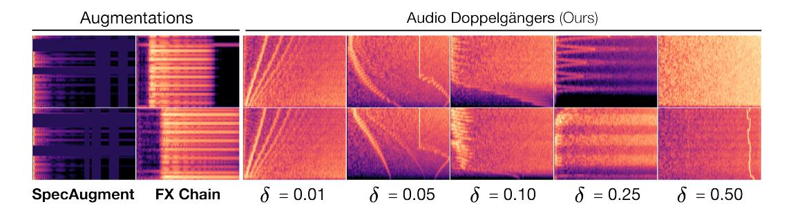
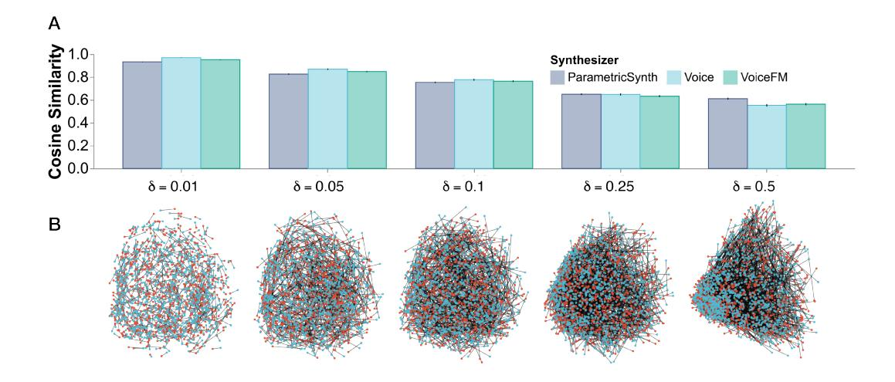
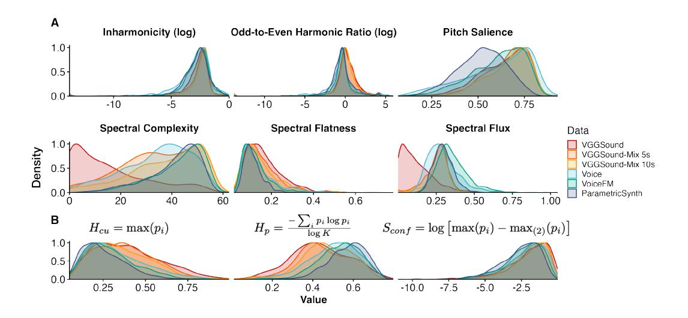
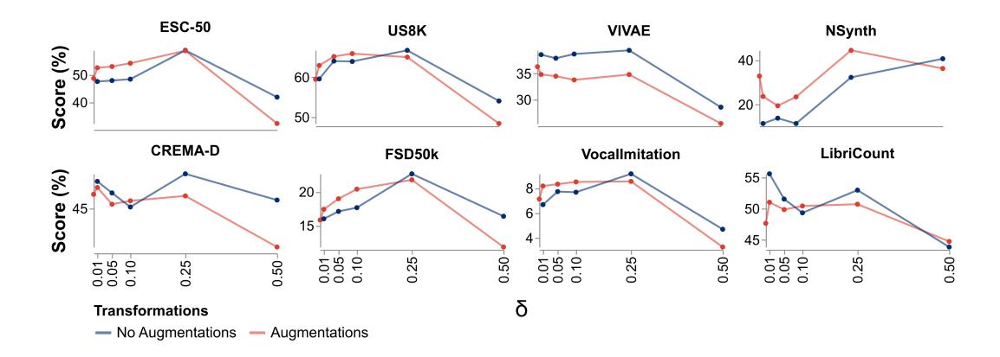
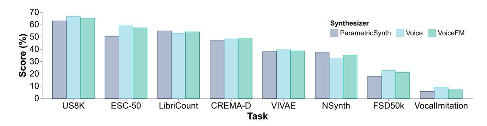
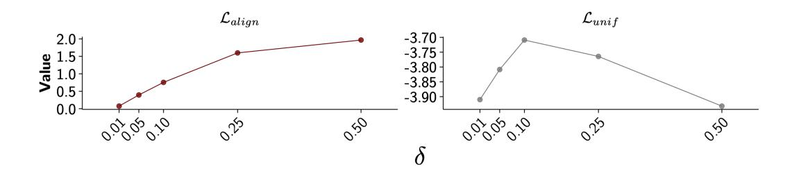

# CONTRASTIVE LEARNING FROM SYNTHETIC AUDIO DOPPELGANGERS ¨

Manuel Cherep<sup>∗</sup> Massachusetts Institute of Technology mcherep@mit.edu

Nikhil Singh<sup>∗</sup> Dartmouth College nikhil.u.singh@dartmouth.edu

#### [doppelgangers.media.mit.edu](https://doppelgangers.media.mit.edu/)



Figure 1: (Left) Standard data augmentation techniques for contrastive learning applied to audio spectrograms (Right) *Audio Doppelgangers ¨* , our approach synthesizing sounds that are controllably different using perturbed synthesis parameters, shown for different factors δ. These sounds can vary in causally controllable ways beyond what data augmentations can achieve.

## <span id="page-0-0"></span>ABSTRACT

Learning robust audio representations currently demands extensive datasets of real-world sound recordings. By applying artificial transformations to these recordings, models can learn to recognize similarities despite subtle variations through techniques like contrastive learning. However, these transformations are only approximations of the true diversity found in real-world sounds, which are generated by complex interactions of physical processes, from vocal cord vibrations to the resonance of musical instruments. We propose a solution to both the data scale and transformation limitations, leveraging synthetic audio. By randomly perturbing the parameters of a sound synthesizer, we generate *audio doppelgangers ¨* —synthetic positive pairs with causally manipulated variations in timbre, pitch, and temporal envelopes. These variations, difficult to achieve through augmentations of existing audio, provide a rich source of contrastive information. Despite the shift to randomly generated synthetic data, our method produces strong representations, outperforming real data on several standard audio classification tasks. Notably, our approach is lightweight, requires no data storage, and has only a single hyperparameter, which we extensively analyze. We offer this method as a complement to existing strategies for contrastive learning in audio, using synthesized sounds to reduce the data burden on practitioners.

# 1 INTRODUCTION

*"Noises have generally been thought of as indistinct, but this is not true."*

— Pierre Schaeffer, *1986*

The success of modern machine learning algorithms for tasks like audio understanding often hinges on both the quality and quantity of available data. Self-supervised learning methods, like contrastive

<sup>∗</sup>Equal contribution.

learning, have even been able to leverage unlabeled data, enabling more human-like learning from patterns without needing explicit supervision. However, human perceptual processing is remarkably robust beyond this: for example, the human auditory system can easily recognize sounds across a wide range of variations, such as changes in pitch, timbre, or background noise. Moreover, humans can quickly learn to recognize novel sounds that they encounter in their environment. Replicating this ability to learn from a diverse array of sounds—or "noises," as we might call them—could significantly enhance the efficiency, scalability, and adaptability of machine learning models.

Contrastive learning, which operates by recognizing similarities in the data among negative distractors, often relies on augmentations: transformations of input data that preserve content semantics. This method has been influential in audio representation learning, with specific implementations ranging from spectral masking to temporal jitter to cropping and other methods [\(Huang et al., 2022;](#page-12-0) [Saeed](#page-14-0) [et al., 2021;](#page-14-0) [Spijkervet & Burgoyne, 2021;](#page-14-1) [Wang & Oord, 2021;](#page-15-0) [Al-Tahan & Mohsenzadeh, 2021;](#page-10-0) [Niizumi et al., 2021;](#page-13-0) [Manocha et al., 2021\)](#page-13-1). Data augmentations, though demonstrably useful, operate at the level of the observed data, not the underlying data-generating process as would be observed in real-world variation. They statistically alter data without directly manipulating the causal mechanisms that produced it, resulting in high correlation between augmented samples, as well as limited control and interpretability.

In our work, we propose a different strategy: using a synthesizer to overcome this barrier, in addition to providing the scalability required for modern pretraining regimes through virtually unlimited data synthesis. A synthesizer can be understood as a system where parameters (relating to psychophysical attributes like pitch, timbre, and loudness) causally influence the generated sound. Modifying these parameters allows us to intervene in the data-generating process in a controllable way to generate positive pairs that vary in terms of their underlying synthesis parameters. Unlike traditional data augmentation techniques, our method generates entirely synthetic audio data from scratch. This approach allows us to control the underlying data-generating process directly, offering a perspective distinct from augmentation of real data.

We formulate an approach in which we randomly synthesize sounds, and then slightly perturb their parameters to generate positive pairs. We call these *audio doppelgangers ¨* (examples in Figure [1\)](#page-0-0); they share a resemblance but are in fact distinct enough to learn from the variation between them. In a way, this approach uses an artificial data source effectively consisting of random synthetic noises but more "natural" differences akin to variation in similar sounds; as Pierre Schaeffer put it, noises are not indistinct. Through a comprehensive set of experiments, we show that models trained this way can yield strong performance on a wide range of downstream tasks, competitive with real audio.

Overall, this work contributes:

- 1. An approach to synthesizing paired audio examples with a continuously controllable degree of dissimilarity, specified by a simple and interpretable hyperparameter δ.
- 2. The first study, to our knowledge, of synthetic data methods for audio representation learning.
- 3. Comprehensive experiments in which we train and compare over 20 model variants across 8 downstream tasks to provide evidence that training with our approach can yield strong results on a wide range of audio processing tasks.
- 4. An analysis of how these synthetic datasets differ from realistic audio datasets in terms of their auditory features, and how this might contribute to learning effective representations.

# 2 RELATED WORK

## 2.1 LEARNING FROM SYNTHETIC DATA

Synthetic data, artificially generated information rather than collected from real-world sources, has emerged as a valuable tool for learning across various domains [\(Liu et al., 2023;](#page-12-1) [Silver et al., 2017;](#page-14-2) [Kumar et al., 2020;](#page-12-2) [Meng et al., 2022\)](#page-13-2). By addressing data scarcity, privacy concerns [\(Tucker et al.,](#page-15-1) [2020;](#page-15-1) [DuMont Schutte et al., 2021\)](#page-11-0), or removing biases [\(Tan et al., 2020;](#page-14-3) [Ramaswamy et al., 2021\)](#page-13-3), ¨ synthetic data offers a promising avenue to complement scarce [Longpre et al.](#page-12-3) [\(2024\)](#page-12-3) real-world data and further drive progress in machine learning research.

Audio presents unique challenges due to the complexity of waveforms and temporal dependencies. Synthetic data has found applications in subareas like speech recognition [\(Rosenberg et al., 2019;](#page-13-4) [Rossenbach et al., 2020;](#page-14-4) [Laptev et al., 2020;](#page-12-4) [Fazel et al., 2021;](#page-11-1) [Hu et al., 2022;](#page-12-5) [Gao et al.\)](#page-11-2) leveraging text-to-speech systems for detecting unspoken punctuation [\(Soboleva et al., 2021\)](#page-14-5), recognizing low-resource languages [\(Bartelds et al., 2023\)](#page-10-1), increasing acoustic diversity [\(Chen et al., 2020b\)](#page-10-2) or detecting out-of-vocabulary words [\(Zheng et al., 2021\)](#page-15-2). However, non-speech audio domains can be highly diverse, requiring more complex approaches to data synthesis. In this domain, synthetic data has been used for specific tasks like timbre-text alignment [\(Jonason & Sturm, 2022\)](#page-12-6) and vocoding [\(Wang et al., 2023\)](#page-15-3). The partially synthetic NSynth [\(Engel et al., 2017\)](#page-11-3) dataset has also been used for pitch estimation and instrument classification. In our work, we tackle the general audio domain, proposing a synthetic data approach that can produce diverse sounds for general-purpose audio representation learning.

In computer vision, synthetic data is more popular and has been employed in different tasks to improve performance [\(Chen et al., 2019;](#page-10-3) [Ros et al., 2016;](#page-13-5) [Varol et al., 2017;](#page-15-4) [Ionescu et al., 2013;](#page-12-7) [Shakhnarovich](#page-14-6) [et al., 2003;](#page-14-6) [Mayer et al., 2016;](#page-13-6) [Dosovitskiy et al., 2015;](#page-11-4) [Ren & Lee, 2018\)](#page-13-7). While initially focused on using graphics engines to generate photorealistic scenes, recent work has investigated sampling synthetic data from deep generative models [\(Besnier et al., 2020;](#page-10-4) [Ravuri & Vinyals, 2019;](#page-13-8) [Jahanian](#page-12-8) [et al., 2021;](#page-12-8) [Zhang et al., 2021;](#page-15-5) [Tritrong et al., 2021;](#page-15-6) [Li et al., 2021;](#page-12-9) [Shrivastava et al., 2017;](#page-14-7) [Hoffman](#page-11-5) [et al., 2018;](#page-11-5) [Tian et al., 2024;](#page-14-8) [2023;](#page-14-9) [Trabucco et al., 2023;](#page-15-7) [Yang et al., 2021;](#page-15-8) [Jeong & Shin, 2021\)](#page-12-10). However, these models aim to produce realistic images and still depend on real image datasets for training or synthesis. Thus, recent work has pushed away from realism, generating synthetic data such as fractals [\(Kataoka et al., 2020\)](#page-12-11), or through other procedural noise models [\(Baradad Jurjo](#page-10-5) [et al., 2021;](#page-10-5) [Baradad et al., 2022\)](#page-10-6) to use as training data for visual representation learners. In our work, we also abandon realism and leverage randomly generated synthetic sounds to learn audio representations for downstream tasks.

#### 2.2 CONTRASTIVE LEARNING

A common strategy for learning from unlabeled data is *contrastive* learning. In this technique, we seek representations that are *invariant* to minor differences, i.e. they encode a space in which similar objects are closer together, and dissimilar objects are further. A classic strategy for this is to use data *augmentations*, transformations which noticeably alter a datapoint (for example, randomly cropping an image) without changing its essential content (e.g. what the image is of, such as a cat). These transformed versions then become a *positive pair*, while other examples (e.g. an image of a dog) become *negatives*. In audio, contrastive learning has been used extensively to produce high-quality representations for downstream tasks [\(Al-Tahan & Mohsenzadeh, 2021;](#page-10-0) [Saeed et al.,](#page-14-0) [2021;](#page-14-0) [Ravanelli & Bengio, 2019;](#page-13-9) [Wang & Oord, 2021;](#page-15-0) [Fonseca et al., 2021b\)](#page-11-6). Our approach differs fundamentally from data augmentation strategies commonly used in contrastive learning. Instead of applying transformations to existing audio samples, we generate synthetic audio pairs by perturbing synthesizer parameters, creating positive pairs with causal variations that are difficult to achieve through augmentations. This represents a novel application of synthetic data in the context of general-purpose audio representation learning.

## 2.3 SOUND SYNTHESIS

The toolkit of sound synthesis has evolved to include a variety of hardware and software [\(Mathews](#page-13-10) [et al., 1969;](#page-13-10) [Pinch & Trocco, 2004;](#page-13-11) [Theberge, 1997\)](#page-14-10). Synthesizers, abstractions of sound synthesis ´ and processing methods often designed to act as musical instruments, are key to this: they expose control parameters that let sound designers guide them to produce desirable sounds for music, film, and many other applications. Accelerated synthesizers [\(Turian et al., 2021;](#page-15-9) [Cherep & Singh, 2023\)](#page-10-7) have recently allowed much faster-than-realtime sound generation, offering the ability to iteratively tweak parameters to reconstruct sounds [\(Hagiwara et al., 2022;](#page-11-7) [Shier, 2021\)](#page-14-11) and even match textual descriptions [\(Cherep et al., 2024\)](#page-10-8). Such approaches highlight the practical utility of synthesizers: lightweight architectures controlled by a limited number of interpretable parameters are capable of producing a diverse array of sounds, often corresponding to well-known categories and concepts (e.g. the sound of waves can often be modeled with time-varying filtered noise). In our work, we leverage SYNTHAX [\(Cherep & Singh, 2023\)](#page-10-7), to rapidly produce diverse training data with controllable similarity between examples.

# 3 METHODS

## 3.1 DATA GENERATION

Our data generation pipeline uses virtual modular synthesizers implemented by SYNTHAX [\(Cherep](#page-10-7) [& Singh, 2023\)](#page-10-7) in JAX. By default, we use the *Voice* synthesizer architecture [\(Turian et al., 2021\)](#page-15-9), which can generate perceptually diverse sounds. Our synthesizer consists of several common modules (with parameter-counts in parenthesis):

- Keyboard (2x): Controls the sound's fundamental frequency (f0) and duration.
- Low-Frequency Oscillators (LFOs; 8x each): Two LFOs modulate various aspects of the sound, each with parameters for frequency, modulation depth, initial phase, and amplitude weights across waveforms.
- ADSR Envelopes (5x each): Six envelopes shape the amplitude and modulation signals, each defined by attack, decay, sustain, release, and curvature (α).
- Voltage-Controlled Oscillators (VCOs): Includes a sine VCO (3x) with tuning, modulation depth, initial phase, and a square-saw VCO (4x) adding waveform shape.
- Noise Generator: Provides broadband noise without additional parameters.
- Modulations (20x): Weight matrix controlling how modulation sources affect destinations.
- Audio Mixer (3x): Combines outputs of oscillators and noise generator.

In total, the *Voice* synthesizer has 78 parameters. Perturbing these parameters allows us to generate a wide variety of sounds with controlled variations, such as slightly lower or higher pitch, a slightly longer onset or release, or a little more or less noise. In our experiments, we investigate two further architectures: *VoiceFM* has 130 parameters and includes a frequency modulation (FM) operator, and *ParametricSynth* has 2 sine and 2 square-saw oscillators, 1 sine FM and 1 square-saw FM operator, 340 in total. Varying the architecture allows us to investigate whether architectural complexity could affect the quality of representations learned. We generate 1-second sounds by default, for compatibility with most encoders (e.g. VGGish [\(Hershey et al., 2017\)](#page-11-8)). However, this practice can be extended to longer sounds.

Synthesis perturbation factor (δ) A key contribution of our work is synthesizing paired positive samples that sound alike, but are dissimilar due to their synthesis parameters and not only post-hoc effects (e.g. augmentations). This draws on the canonical definition from contrastive learning of positives that are sampled from the same *latent class* [\(Saunshi et al., 2019\)](#page-14-12).

For a single positive pair, we first sample a parameter vector uniformly randomly θ ∈ [0, 1]m<sup>S</sup> ∼ U(0, 1) from the normalized synthesis parameter space, where m<sup>S</sup> is the number of control parameters in the given synthesizer. Then, we independently sample two isotropic Gaussian noise vectors z1, z<sup>2</sup> ∼ N (0, ImS×m<sup>S</sup> ). We define a parameter δ that scales this noise, and then produce two perturbed parameter vectors θ<sup>i</sup> = θ + δz<sup>i</sup> ∀<sup>i</sup> ∈ {1, 2}. From these, we clip values back into [0, 1] to synthesize two corresponding sounds which serve as positives in the contrastive learning setup.

In principle, δ controls the distance between the positive pairs and therefore the hardness of the contrastive learning task. Practically, we expect there to be a sweet-spot for δ, considering prior work on mutual information and redundancy in contrastive learning problems [\(Tian et al., 2020;](#page-14-13) [Tosh](#page-15-10) [et al., 2021\)](#page-15-10) as with very high δ, the parameter vectors may become dominated by noise, resulting in difficulty effectively aligning their representations. Given this, we extensively study the effect of δ on downstream results.

## 3.2 REAL DATA

To compare to real audio data, we use sounds from VGGSound [\(Chen et al., 2020a\)](#page-10-9), a well-known dataset taken from YouTube videos (we only use audio). We use a random sample of 100,000 10-second files and select a random 1-second segment from each file at each iteration to augment. This allows us to fairly compare to our synthetic sounds by keeping duration constant, while still sampling from a variety of real sounds by randomizing the 1-second segments. Though VGGSound has labels included, we do not use them in training these models to keep the self-supervised constraint. Note that VGGSound is currently one of the largest publicly released audio datasets for pretraining, unlike AudioSet (which only releases URLs, not the content itself).

#### 3.3 Preprocessing, Data Augmentations, and Audio Encoder

In our experiments, we use VGGish frontend representations (Hershey et al., 2017). We resample audio to 16kHz and obtain mel spectrograms with 64 mel bands and 96 time steps. We use a chain of effects as augmentations (implemented in torch-audiomentations<sup>1</sup>): a high-pass filter (cutoff frequency range 20–800Hz), a low-pass filter (1.2–8kHz), pitch shift (-2 to 2 semitones), time shift (-25% to 25%, rollover enabled), and finally reverberation for which we sample randomly from a set of impulse responses. All augmentations are applied with probability 0.5. We found that this yielded far stronger results than SpecAugment (Park et al., 2019), and so we use this as a comparison point in all our experiments. More details on the augmentation are given in Appendix B. We also test temporal jitter, wherein different 1-second segments are sampled from within the same source clip and treated as positives (Saeed et al., 2021; Spijkervet & Burgoyne, 2021). Our audio encoder is a ResNet18 (He et al., 2016), where we replace the initial layer with a 1-channel convolution to account for the effectively 1-channel spectrogram.

#### 3.4 Contrastive Learning

We train for 200 epochs, generating (or sampling) 100,000 sounds per epoch, with a 90%-10% trainvalidation split. We use a batch size of 768 per GPU with two V100s. The training uses the alignment and uniformity objectives (Wang & Isola, 2020) used in prior work on learning with synthetic data (Baradad Jurjo et al., 2021). We adopt the default parameters for these: unif  $_t=2$ , align  $_\alpha=2$ , and equal weights  $\lambda_1=\lambda_2=1$  for both terms. Following this work, we use stochastic gradient descent for optimization, with a maximum learning rate of 0.72 (calculated as  $0.12\times\frac{\text{total batch size}}{256}$ ) and weight decay  $10^{-6}$ . The learning rate follows a multi-step schedule with  $\gamma=0.1$ , and milestones at 77.5%, 85%, and 92.5% of the total learning epochs. Detailed steps are provided in Algorithm 1. Training with our synthetic data takes approx. 1-2 hours, as the data is generated on the fly in batches, whereas using on-disk datasets with effect chain augmentations can extend training time up to 6-8+

#### 3.5 EVALUATION TASKS

To obtain a broad picture of the quality of our learned representations, we conduct experiments on a range of audio classification tasks from the HEAR (Turian et al., 2022) and ARCH (La Quatra et al., 2024) benchmarks. We use evaluation tasks that focus on general audio understanding, rather than tasks that are highly specialized or domain-specific (e.g., tasks exclusively related to speech or music). Our method aims to learn general-purpose audio representations from synthetic data; therefore, we implement tasks which encompass a broad range of everyday sounds. This aligns with our goal of demonstrating the effectiveness of our representations in diverse real-world scenarios.

These tasks cover a wide range of capabilities including sound classification tasks like ESC-50 (Piczak, 2015), FSD-50k (Fonseca et al., 2021a), and UrbanSound8K (Salamon et al., 2014), vocal affect tasks with and without speech like VIVAE (Holz et al., 2022) and CREMA-D (Cao et al., 2014), musical pitch recognition via NSynth Pitch (5h) (Engel et al., 2017), vocal sound imitation recognition using Vocal Imitations (Kim et al., 2018), and LibriCount (Stöter et al., 2018) for a "cocktail party" style speaker count estimation task. We conduct linear probing experiments using the Adam optimizer for the benchmark-specified epochs with the default learning rate of 0.001 and a batch size of 32.

#### 4 RESULTS

#### 4.1 BENCHMARK RESULTS

In Table 1, we show results across 8 tasks. The top section features external baselines from the HEAR (Turian et al., 2022) leaderboard and ARCH (La Quatra et al., 2024) benchmark results, first the strongest overall and then only self-supervised. It also includes results from MS-CLAP (Elizalde et al., 2023) linear probing experiments, GURA (Wu et al., 2022) (strongest overall model on HEAR), and finally the original ResNet18 trained on VGGSound (supervised) (Chen et al., 2020a). Note that

<span id="page-4-0"></span><sup>&</sup>lt;sup>1</sup>https://github.com/asteroid-team/torch-audiomentations

**Algorithm 1** Our contrastive learning procedure with *audio doppelgängers*. In the training loop, we drop the batch index i for simplicity. We also show the pairwise distance in  $\ell_{\text{nuif}}$ , though the implementation (via torch.pdist) uses a condensed representation.

```
Require: Batch size k
Require: Perturbation factor \delta
Require: Virtual synthesizer S with m_S parameters
Require: Embedding model M with embedding size m_M (512 in our case)
Require: Total number of training batches N_{\text{batches}}
Require: \ell_{\text{unif}}(\mathbf{X} \in \mathbb{R}^{k \times m_M}) \leftarrow \log \left[ \frac{1}{k^2} \sum_{j=1}^k \sum_{l=1}^k \exp\left(-t \|\mathbf{X}[j] - \mathbf{X}[l]\|_2^2\right) \right] where t = 2
    \begin{aligned} & \textbf{for } i = 1 \textbf{ to } N_{\text{batches}} \textbf{ do} \\ & \boldsymbol{\Theta} \in [0,1]^{k \times m_S} \sim \mathcal{U}(0,1) \\ & \mathbf{Z}_1, \mathbf{Z}_2 \in \mathbb{R}^{k \times m_S} \sim \mathcal{N}(0,\mathbf{I}) \end{aligned}
                                                                                                                                   {Random batch of parameters}
                                                                                                                  {Isotropic Gaussian perturbation noise}
         \hat{\mathbf{\Theta}}_1 \leftarrow \max(0, \min(\mathbf{\Theta} + \delta \mathbf{Z}_1, 1))
                                                                                                                                 {Clipped perturbed parameters}
         \hat{\boldsymbol{\Theta}}_2 \leftarrow \max(0, \min(\boldsymbol{\Theta} + \delta \mathbf{Z}_2, 1))
         \mathbf{A}_1 \leftarrow S(\hat{\mathbf{\Theta}}_1), \mathbf{A}_2 \leftarrow S(\hat{\mathbf{\Theta}}_2)
                                                                                                                          {Synthesize audio from parameters}
         \mathbf{E}_1 \leftarrow M(\mathbf{A_1}), \mathbf{E}_2 \leftarrow M(\mathbf{A_2})
                                                                                                                                              {Embedding from model}
         \mathcal{L}_{align} \leftarrow \frac{1}{k} \sum\limits_{j=1}^k \|\mathbf{E}_1[j] - \mathbf{E}_2[j]\|_2^{\alpha} \text{ where } \alpha = 2
                                                                                                                                                             {Alignment cost}
         \mathcal{L}_{uniform} \leftarrow \frac{1}{2} \left[ \ell_{unif}(\mathbf{E}_1) + \ell_{unif}(\mathbf{E}_2) \right]
                                                                                                                                                            {Uniformity cost}
                                                                                                                             {By default, we set \lambda_1 = \lambda_2 = 1}
         \mathcal{L}_{total} \leftarrow \lambda_1 \mathcal{L}_{align} + \lambda_2 \mathcal{L}_{uniform}
         Update model M using \mathcal{L}_{total}
     end for
```

<span id="page-5-0"></span>HEAR leaderboard results may use MLP probes, whereas ours are linear. We add additional internal baselines, including random weights, synthetic data trained without  $\delta$  but with augmentations, and variants of ResNet18 we trained on VGGSound (with augmentations, and alternately with temporal jitter). Finally, we include a selection of our results; the best overall score we achieve using our synthetic approach (first row), followed by the best-performing model trained on data from each of the synthesizer architectures (including *Voice* with augmentations). In Appendix A.3, we provide a full set of results from all model variants: all synthetic datasets for all values of  $\delta$ , and further baselines less performant than those we present here.

Overall, our best scores uniformly outperform training on VGGSound with augmentations, and outperform training with temporal jitter (the strongest internal baseline) in 6/8 cases. In some cases, these results are also competitive with strong baselines, such as beating the supervised ResNet18 result on 3/8 tasks, CLAP on 2/5, and GURA on 1/6. Additionally, adding further augmentations to our *audio doppelgänger*-based training does not seem to hold significant benefits, despite being highly beneficial when training with synthetic sounds with no  $\delta$ , suggesting the  $\delta$ -based perturbations are already sufficiently strong. All this is accomplished without these models seeing any real sounds during pretraining. Finally, *Voice* with  $\delta=0.25$  is the strongest synthetic-trained model overall, being the top performer on 5/8 tasks, but we note that there is some inter-task variability in the best synthesizer and delta.

#### 4.2 Characterizing the Data Distribution

Here, we focus on understanding the distribution of synthetic sounds and how they differ from natural sound properties. We primarily use our alternate training set, VGGSound (Chen et al., 2020a), for these measures. Unless specified otherwise, we use a randomly sampled (for VGGSound) or generated (for synthetic) set of 1000 sounds for each given dataset used for these characterizations. Our goal is to help understand what properties of the synthetic data make it useful for representation learning, given its strong performance.

<span id="page-6-0"></span>

| Data/Model                      | ESC   | US8K  | VIV   | NSyn  | C-D   | FSD   | VI    | LCount |  |
|---------------------------------|-------|-------|-------|-------|-------|-------|-------|--------|--|
| External Baselines              |       |       |       |       |       |       |       |        |  |
| HEAR/ARCH Top                   | 96.65 | 79.09 | 44.28 | 87.80 | 75.21 | 65.48 | 22.69 | 78.53  |  |
| HEAR/ARCH SSL                   | 80.50 | 79.09 | 44.28 | 52.40 | 75.21 | 50.88 | 18.48 | 78.53  |  |
| MS-CLAP Linear                  | 89.95 | 82.29 | –     | –     | 23.15 | 50.24 | –     | 54.51  |  |
| GURA (HEAR)                     | 74.35 | –     | –     | 38.20 | 75.21 | 41.32 | 18.48 | 68.34  |  |
| VGGSound Sup.                   | 87.45 | 77.57 | 39.38 | 43.80 | 54.36 | 43.76 | 14.06 | 56.10  |  |
| Internal Baselines              |       |       |       |       |       |       |       |        |  |
| Random Init.                    | 22.45 | 55.03 | 33.81 | 36.20 | 38.91 | 9.03  | 2.43  | 44.91  |  |
| Voice (Ours, No-δ, Aug.)        | 48.65 | 59.46 | 36.31 | 32.80 | 46.32 | 16.88 | 7.12  | 47.64  |  |
| VGGSound SSL (Aug.)             | 48.85 | 61.91 | 32.67 | 39.60 | 47.86 | 19.63 | 6.03  | 53.46  |  |
| VGGSound SSL (Jitter)           | 52.95 | 63.82 | 38.12 | 14.20 | 50.03 | 24.02 | 3.43  | 69.77  |  |
| ¨<br>Audio Doppelgangers (Ours) |       |       |       |       |       |       |       |        |  |
| Best Synthetic                  | 58.90 | 66.71 | 39.45 | 44.40 | 48.43 | 24.12 | 9.15  | 58.60  |  |
| Voice (δ = 0.25)                | 58.90 | 66.71 | 39.45 | 32.20 | 48.24 | 24.12 | 9.15  | 52.95  |  |
| Voice (δ = 0.25, Aug.)          | 58.75 | 65.01 | 34.81 | 44.40 | 46.17 | 21.76 | 8.54  | 50.70  |  |
| VoiceFM (δ = 0.25)              | 57.20 | 65.11 | 38.48 | 35.20 | 48.43 | 22.15 | 6.96  | 54.00  |  |
| Parametric (δ = 0.25)           | 50.55 | 62.83 | 37.91 | 37.60 | 46.77 | 18.68 | 5.70  | 54.72  |  |

Table 1: Evaluation results on a suite of tasks including (from left to right) ESC-50 [\(Piczak, 2015\)](#page-13-13), UrbanSound8k [\(Salamon et al., 2014\)](#page-14-14), VIVAE [\(Holz et al., 2022\)](#page-11-11), NSynth Pitch 5h [\(Engel et al., 2017\)](#page-11-3), CREMA-D [\(Cao et al., 2014\)](#page-10-10), FSD50k [\(Fonseca et al., 2021a\)](#page-11-10), Vocal Imitation [\(Kim et al., 2018\)](#page-12-13), and LibriCount [\(Stoter et al., 2018\)](#page-14-15). For internal baselines, we only bold tasks where the baseline ¨ beats the best synthetically trained result. Results for all synthetic variants are in Appendix [A.3.](#page-17-1)

#### 4.2.1 EMBEDDING SIMILARITY

First, we look at the distribution of synthetic sound pairs and establish that δ meaningfully controls (a proxy for) perceptual or semantic dissimilarity. We operationalize this using LAION-CLAP embeddings [\(Wu et al., 2023\)](#page-15-14), since they are trained on a large variety of sounds with semantic descriptions associated. Figure [2A](#page-7-0) shows how the average cosine similarity decreases monotonically with increasing δ for all 3 synthesizers. Figure [2B](#page-7-0) provides a view of how δ affects the geometry of the embedding space. Here, we plot the first two principal components of the CLAP embeddings along with the path length for each positive pair of synthesized samples from a *Voice* synthesizer. As δ increases, the path lengths increase and overlap more resulting in less clear separation of positive pairs from negatives. We view this as a signal that we can effectively control the hardness of the contrastive task using δ, the perturbation factor.

## 4.2.2 SIMILARITIES AND DIFFERENCES FROM REAL DATA

Next, we compare the synthetic data distribution to VGGSound [\(Chen et al., 2020a\)](#page-10-9) data. Figure [3A](#page-7-1) compares a selection of features' distributions between several dataset variants. For synthetic datasets, we have *Voice*, *VoiceFM*, and *ParametricSynth* variants. For real datasets, we have VGGSound. We first compare to randomly sampled 1-second chunks. Here, the synthetic sounds match several feature distributions well, such as Inharmonicity [\(Peeters, 2004\)](#page-13-14), Odd-to-Even Harmonic Ratio [\(Martin](#page-13-15) [& Kim, 1998\)](#page-13-15), Pitch Salience [\(Ricard, 2004\)](#page-13-16), and, to a lesser extent, Spectral Flatness [\(Peeters,](#page-13-14) [2004\)](#page-13-14). However, the synthetic sounds have higher Spectral Flux [\(Tzanetakis & Cook, 1999\)](#page-15-15) and Complexity [\(Laurier et al., 2010\)](#page-12-14). Note that *ParametricSynth* also has lower pitch salience. We believe this is due to its larger mixture of sound generators which reduce salience of particular pitches.

Based on these results, we hypothesize that one potential reason the synthetic sounds could be useful for training is the informativeness of the samples. The larger amount of spectral change and higher complexity in terms of peaks could expose the model to more different kinds of sounds rapidly. To try to match these attributes, we produce mixtures of VGGSound, since mixed sounds may have more peaks and variation than individual samples. In VGGSound-Mix 5s, we take 5 arbitrary seconds from each sound and layer them into a 1-second sample. In VGGSound-Mix 10s, we do the same with all 10 seconds available. We show (Figure [3\)](#page-7-1) that these get closer to the synthetic distributions on these



<span id="page-7-0"></span>Figure 2: (A: Top) Average CLAP [\(Wu et al., 2023\)](#page-15-14) embedding cosine similarity between positive pairs for different architectures and different values of δ. (B: Bottom) PCA of CLAP embeddings for sounds generated with the *Voice* architecture, with line segments showing distances between paired examples. Red and blue points are paired positive instances. Across both plots, as δ increases, the positive pairs systematically become more perceptually dissimilar (via the CLAP embedding proxy).



<span id="page-7-1"></span>Figure 3: Comparisons of synthetic and real sound data (VGGSound [\(Chen et al., 2020a\)](#page-10-9)) on (A: Top) spectral features and (B: Bottom) causal uncertainty. Spectral features of synthetic sounds partially replicate real sounds, but exhibit differences in complexity and flux. Synthetic sounds are also more causally ambiguous, indicating a distribution shift. Using dense mixtures of real sounds partially closes these gaps, suggesting the synthetic sounds are different in part due to their density of auditory information.

features, without deviating on other features. These data distributions allow us to assess whether the benefits of synthetic data are largely driven by the change and informativeness of the signals. In Appendix [A.3,](#page-17-1) we present results from models trained on these mixture distributions, and obtained mixed results, suggesting other factors of the synthesized sounds may also be important beyond this.

## 4.2.3 CAUSAL UNCERTAINTY

We also consider causal uncertainty [\(Ballas & Sliwinski, 1986;](#page-10-11) [Ananthabhotla et al., 2019;](#page-10-12) [Boger et al.,](#page-10-13) [2021\)](#page-10-13), a factor that we intuitively expect to be different for the synthetic sounds. Helmholtz famously discussed perception in terms of unconscious causal inference from sensory input [\(Helmholtz,](#page-11-13) [1867\)](#page-11-13), but the synthetic sounds have no physical causes and do not come from well-understood categories. In Figure [3B](#page-7-1), we plot 3 proxies for causal uncertainty derived from probabilities of an AST classifier [\(Gong et al., 2021\)](#page-11-14) trained on AudioSet. We use the formulation from prior work of Hcu, the maximum predicted probability [\(Ananthabhotla et al., 2019;](#page-10-12) [Boger et al., 2021\)](#page-10-13). We also propose two simple metrics to corroborate this: H<sup>p</sup> the (normalized) entropy of the output probability distribution, and a confidence score Sconf , the difference in probability between the most and second-most probable classes (log-scaled for the plot). Across all, the synthetic sounds are more causally uncertain than the real sounds. However, as with the spectral feature distributions, using mixtures of VGGSound [\(Chen et al., 2020a\)](#page-10-9) clips moves the real distribution slightly closer to the synthetic distribution per Hcu and Hp. We speculate that exposure to more causally uncertain sounds might be subtly helpful for representation learning; for example, they may contain diverse features that aid generalization to more ambiguous sounds present in downstream tasks. We characterize this as another important distributional difference between the synthetic sounds and realistic sounds from datasets such as VGGSound.

## 4.2.4 SIMILARITY TO TARGET DISTRIBUTIONS

Another lens we can use to understand the effectiveness of training on synthetic data is in terms of the distribution of sounds in the target downstream tasks. A common metric to compare sound distributions is the Frechet Audio Distance (FAD) [\(Kilgour et al., 2018\)](#page-12-15). For simplicity, we use the ´ canonical formulation based on VGGish embeddings, though there are some limitations of this [\(Gui](#page-11-15) [et al., 2024;](#page-11-15) [Tailleur et al., 2024\)](#page-14-16), and we use either the validation sets or first multi-fold splits of the target task audio. Table [2](#page-8-0) shows that for ESC-50 [\(Piczak, 2015\)](#page-13-13), VGGSound is closer in distribution to the target sounds, likely due to ESC-50's focus on environmental sounds. For all other tasks, however, the synthetic sounds achieve a lower FAD, suggesting they may better capture task-relevant features for these tasks' sounds. This finding echoes a study of MMDs in torchsynth [\(Turian et al.,](#page-15-9) [2021\)](#page-15-9), where the *Voice* architecture shows higher-than-expected similarity to FSD50k sounds. We hypothesize that the synthetic training allows the model to see a wide variety of spectral behavior rapidly, in a way that supports an array of tasks.

<span id="page-8-0"></span>

| Dataset          | ESC-50 | FSD50k | LibriCount | NSynth | CREMA-D | Vocal Imitation |
|------------------|--------|--------|------------|--------|---------|-----------------|
| Voice            | 17.39  | 13.37  | 16.67      | 12.83  | 18.55   | 11.64           |
| VoiceFM          | 18.48  | 15.91  | 17.67      | 14.49  | 21.24   | 13.66           |
| ParametricSynth  | 18.75  | 19.44  | 21.04      | 17.42  | 25.33   | 17.32           |
| VGGSound         | 6.71   | 25.33  | 29.09      | 27.67  | 33.83   | 27.75           |
| VGGSound-Mix 5s  | 8.81   | 26.17  | 30.02      | 28.70  | 34.35   | 29.05           |
| VGGSound-Mix 10s | 9.30   | 26.09  | 30.15      | 28.88  | 34.06   | 29.16           |

Table 2: FAD [\(Kilgour et al., 2018\)](#page-12-15) scores between different synthetic/real datasets and target downstream task data distributions, computed using either validation sets or the first fold (for multifold datasets). For 5/6 tasks, *Voice* achieves the lowest FAD despite containing synthetic sounds. On ESC-50, however, the VGGSound distribution appears to be closest.

## 4.3 ABLATIONS AND SENSITIVITY ANALYSIS

In Figure [4,](#page-9-0) we study the effect of the perturbation factor δ on downstream task performance across all tasks for the strongest (*Voice*) architecture with and without additional (FX chain based) augmentations. Overall, we found in early experiments that δ = 0.25 gives the best results. This is observed on the full suite of tasks (with notable exceptions like NSynth without augmentations, and LibriCount overall). In Appendix [A.2,](#page-16-0) we discuss why this value might be strongest from the perspective of alignment and uniformity results.



<span id="page-9-0"></span>Figure 4: Scores with the *Voice* architecture and different values of δ for evaluation tasks in Table [1](#page-6-0) with and without augmentations. δ = 0.25 tends to give the best results overall.

## 5 LIMITATIONS

Our study demonstrates the efficacy of our approach using established architectures like ResNets, balancing computational efficiency with the goal of producing generalizable results. While we focused on these architectures, our findings lay the groundwork for future investigations with larger encoders such as AST [\(Gong et al., 2021\)](#page-11-14); this is a straightforward extension. Our research also focused on a clear comparison between synthetic and real data, which allowed us to rigorously evaluate our method's effectiveness. The potential for hybrid approaches, combining synthetic and real data, has a wide range of possibilities in mixing strategies and fine-tuning techniques. These can all be explored without changing our method itself.

The isometric Gaussian noise perturbation proved highly effective, despite its simplicity, since it changes identifiable attributes (e.g. pitch) subtly. This success points to the robustness of our method, while also highlighting opportunities for more sophisticated perturbation strategies to further enhance it. Future work could explore anisotropic perturbations that account for parameter relationships. Adaptive or learned perturbation strategies could also offer significant advancements. Additionally, our evaluation centered on widely used classification benchmarks to create a foundational assessment of the method's performance. Expanding this evaluation to include metrics such as representation disentanglement could offer additional insights into the quality and utility of the synthetic data.

On a broader note, we believe it's important to examine synthetic data-generating procedures for possible biases, similar to the scrutiny applied to real datasets. Though we think this procedure can mitigate some of the biases in real datasets, different synthesizer architectures, values of δ, and other decisions might inadvertently produce performance gaps for different tasks, applications, and downstream populations of use. We evaluated on a wide range of tasks in part to explore this possibility, but further evaluations would be helpful to assess these impacts.

# 6 CONCLUSION

Further improvements in auditory understanding depend greatly on the data underlying new models. In this work, we examined the value of synthetic data for learning representations of sound. We presented a method that perturbs the parameters of random synthetic sounds to generate *audio doppelgangers ¨* , distinct yet similar sounds that provide a strong signal for contrastive learning. Through a comprehensive set of experiments, we showed how this approach can yield strong results on a wide range of tasks. We will release our code and models to enable the community to experiment with synthetic data sources for audio understanding, and hope this approach will help expand the machine learning toolkit for audio processing.

## ACKNOWLEDGEMENTS

Manuel received the support of a fellowship from "la Caixa" Foundation (ID 100010434). The fellowship code is LCF/BQ/EU23/12010079. The authors acknowledge the MIT SuperCloud and Lincoln Laboratory Supercomputing Center for providing resources that have contributed to the research results reported within this paper. We extend our heartfelt thanks to all participants in the listening study.

## REFERENCES

- <span id="page-10-0"></span>Haider Al-Tahan and Yalda Mohsenzadeh. Clar: Contrastive learning of auditory representations. In *International Conference on Artificial Intelligence and Statistics*, pp. 2530–2538. PMLR, 2021.
- <span id="page-10-12"></span>Ishwarya Ananthabhotla, David B Ramsay, and Joseph A Paradiso. Hcu400: An annotated dataset for exploring aural phenomenology through causal uncertainty. In *ICASSP 2019-2019 IEEE International Conference on Acoustics, Speech and Signal Processing (ICASSP)*, pp. 920–924. IEEE, 2019.
- <span id="page-10-11"></span>JA Ballas and MJ Sliwinski. Causal uncertainty in the identification of environmental sounds. *Georgetown University, Washington, DC*, 1986.
- <span id="page-10-6"></span>Manel Baradad, Richard Chen, Jonas Wulff, Tongzhou Wang, Rogerio Feris, Antonio Torralba, and Phillip Isola. Procedural image programs for representation learning. *Advances in Neural Information Processing Systems*, 35:6450–6462, 2022.
- <span id="page-10-5"></span>Manel Baradad Jurjo, Jonas Wulff, Tongzhou Wang, Phillip Isola, and Antonio Torralba. Learning to see by looking at noise. *Advances in Neural Information Processing Systems*, 34:2556–2569, 2021.
- <span id="page-10-1"></span>Martijn Bartelds, Nay San, Bradley McDonnell, Dan Jurafsky, and Martijn Wieling. Making more of little data: Improving low-resource automatic speech recognition using data augmentation. *arXiv preprint arXiv:2305.10951*, 2023.
- <span id="page-10-4"></span>Victor Besnier, Himalaya Jain, Andrei Bursuc, Matthieu Cord, and Patrick Perez. This dataset does ´ not exist: training models from generated images. In *ICASSP 2020-2020 IEEE International Conference on Acoustics, Speech and Signal Processing (ICASSP)*, pp. 1–5. IEEE, 2020.
- <span id="page-10-13"></span>Tal Boger, Ishwarya Ananthabhotla, and Joseph Paradiso. Manipulating causal uncertainty in sound objects. In *Proceedings of the 16th International Audio Mostly Conference*, pp. 9–15, 2021.
- <span id="page-10-10"></span>Houwei Cao, David G Cooper, Michael K Keutmann, Ruben C Gur, Ani Nenkova, and Ragini Verma. Crema-d: Crowd-sourced emotional multimodal actors dataset. *IEEE transactions on affective computing*, 5(4):377–390, 2014.
- <span id="page-10-9"></span>Honglie Chen, Weidi Xie, Andrea Vedaldi, and Andrew Zisserman. Vggsound: A large-scale audiovisual dataset. In *ICASSP 2020-2020 IEEE International Conference on Acoustics, Speech and Signal Processing (ICASSP)*, pp. 721–725. IEEE, 2020a.
- <span id="page-10-3"></span>Yuhua Chen, Wen Li, Xiaoran Chen, and Luc Van Gool. Learning semantic segmentation from synthetic data: A geometrically guided input-output adaptation approach. In *Proceedings of the IEEE/CVF conference on computer vision and pattern recognition*, pp. 1841–1850, 2019.
- <span id="page-10-2"></span>Zhehuai Chen, Andrew Rosenberg, Yu Zhang, Gary Wang, Bhuvana Ramabhadran, and Pedro J Moreno. Improving speech recognition using gan-based speech synthesis and contrastive unspoken text selection. In *Interspeech*, pp. 556–560, 2020b.
- <span id="page-10-7"></span>Manuel Cherep and Nikhil Singh. Synthax: A fast modular synthesizer in jax. In *Audio Engineering Society Convention 155*. Audio Engineering Society, 2023.
- <span id="page-10-8"></span>Manuel Cherep, Nikhil Singh, and Jessica Shand. Creative text-to-audio generation via synthesizer programming. In *Forty-first International Conference on Machine Learning*, 2024.

- <span id="page-11-4"></span>Alexey Dosovitskiy, Philipp Fischer, Eddy Ilg, Philip Hausser, Caner Hazirbas, Vladimir Golkov, Patrick Van Der Smagt, Daniel Cremers, and Thomas Brox. Flownet: Learning optical flow with convolutional networks. In *Proceedings of the IEEE international conference on computer vision*, pp. 2758–2766, 2015.
- <span id="page-11-0"></span>August DuMont Schutte, J ¨ urgen Hetzel, Sergios Gatidis, Tobias Hepp, Benedikt Dietz, Stefan Bauer, ¨ and Patrick Schwab. Overcoming barriers to data sharing with medical image generation: a comprehensive evaluation. *NPJ digital medicine*, 4(1):141, 2021.
- <span id="page-11-12"></span>Benjamin Elizalde, Soham Deshmukh, Mahmoud Al Ismail, and Huaming Wang. Clap learning audio concepts from natural language supervision. In *ICASSP 2023-2023 IEEE International Conference on Acoustics, Speech and Signal Processing (ICASSP)*, pp. 1–5. IEEE, 2023.
- <span id="page-11-3"></span>Jesse Engel, Cinjon Resnick, Adam Roberts, Sander Dieleman, Mohammad Norouzi, Douglas Eck, and Karen Simonyan. Neural audio synthesis of musical notes with wavenet autoencoders. In *International Conference on Machine Learning*, pp. 1068–1077. PMLR, 2017.
- <span id="page-11-1"></span>Amin Fazel, Wei Yang, Yulan Liu, Roberto Barra-Chicote, Yixiong Meng, Roland Maas, and Jasha Droppo. Synthasr: Unlocking synthetic data for speech recognition. *arXiv preprint arXiv:2106.07803*, 2021.
- <span id="page-11-10"></span>Eduardo Fonseca, Xavier Favory, Jordi Pons, Frederic Font, and Xavier Serra. Fsd50k: an open dataset of human-labeled sound events. *IEEE/ACM Transactions on Audio, Speech, and Language Processing*, 30:829–852, 2021a.
- <span id="page-11-6"></span>Eduardo Fonseca, Diego Ortego, Kevin McGuinness, Noel E O'Connor, and Xavier Serra. Unsupervised contrastive learning of sound event representations. In *ICASSP 2021-2021 IEEE International Conference on Acoustics, Speech and Signal Processing (ICASSP)*, pp. 371–375. IEEE, 2021b.
- <span id="page-11-2"></span>Heting Gao, Kaizhi Qian, Junrui Ni, Chuang Gan, Mark A Hasegawa-Johnson, Shiyu Chang, and Yang Zhang. Speech self-supervised learning using diffusion model synthetic data. In *Forty-first International Conference on Machine Learning*.
- <span id="page-11-14"></span>Yuan Gong, Yu-An Chung, and James Glass. Ast: Audio spectrogram transformer. *arXiv preprint arXiv:2104.01778*, 2021.
- <span id="page-11-15"></span>Azalea Gui, Hannes Gamper, Sebastian Braun, and Dimitra Emmanouilidou. Adapting frechet audio distance for generative music evaluation. In *ICASSP 2024-2024 IEEE International Conference on Acoustics, Speech and Signal Processing (ICASSP)*, pp. 1331–1335. IEEE, 2024.
- <span id="page-11-7"></span>Masato Hagiwara, Maddie Cusimano, and Jen-Yu Liu. Modeling animal vocalizations through synthesizers. *arXiv preprint arXiv:2210.10857*, 2022.
- <span id="page-11-9"></span>Kaiming He, Xiangyu Zhang, Shaoqing Ren, and Jian Sun. Deep residual learning for image recognition. In *Proceedings of the IEEE conference on computer vision and pattern recognition*, pp. 770–778, 2016.
- <span id="page-11-13"></span>Hermann von Helmholtz. Concerning the perceptions in general. 1867.
- <span id="page-11-8"></span>Shawn Hershey, Sourish Chaudhuri, Daniel PW Ellis, Jort F Gemmeke, Aren Jansen, R Channing Moore, Manoj Plakal, Devin Platt, Rif A Saurous, Bryan Seybold, et al. Cnn architectures for large-scale audio classification. In *2017 ieee international conference on acoustics, speech and signal processing (icassp)*, pp. 131–135. IEEE, 2017.
- <span id="page-11-5"></span>Judy Hoffman, Eric Tzeng, Taesung Park, Jun-Yan Zhu, Phillip Isola, Kate Saenko, Alexei Efros, and Trevor Darrell. Cycada: Cycle-consistent adversarial domain adaptation. In *International conference on machine learning*, pp. 1989–1998. Pmlr, 2018.
- <span id="page-11-11"></span>Natalie Holz, Pauline Larrouy-Maestri, and David Poeppel. The variably intense vocalizations of affect and emotion (vivae) corpus prompts new perspective on nonspeech perception. *Emotion*, 22 (1):213, 2022.

- <span id="page-12-5"></span>Ting-Yao Hu, Mohammadreza Armandpour, Ashish Shrivastava, Jen-Hao Rick Chang, Hema Koppula, and Oncel Tuzel. Synt++: Utilizing imperfect synthetic data to improve speech recognition. In *ICASSP 2022-2022 IEEE International Conference on Acoustics, Speech and Signal Processing (ICASSP)*, pp. 7682–7686. IEEE, 2022.
- <span id="page-12-0"></span>Qingqing Huang, Aren Jansen, Joonseok Lee, Ravi Ganti, Judith Yue Li, and Daniel PW Ellis. Mulan: A joint embedding of music audio and natural language. *arXiv preprint arXiv:2208.12415*, 2022.
- <span id="page-12-7"></span>Catalin Ionescu, Dragos Papava, Vlad Olaru, and Cristian Sminchisescu. Human3. 6m: Large scale datasets and predictive methods for 3d human sensing in natural environments. *IEEE transactions on pattern analysis and machine intelligence*, 36(7):1325–1339, 2013.
- <span id="page-12-8"></span>Ali Jahanian, Xavier Puig, Yonglong Tian, and Phillip Isola. Generative models as a data source for multiview representation learning. *arXiv preprint arXiv:2106.05258*, 2021.
- <span id="page-12-10"></span>Jongheon Jeong and Jinwoo Shin. Training gans with stronger augmentations via contrastive discriminator. *arXiv preprint arXiv:2103.09742*, 2021.
- <span id="page-12-6"></span>Nicolas Jonason and Bob LT Sturm. Timbreclip: Connecting timbre to text and images. *arXiv preprint arXiv:2211.11225*, 2022.
- <span id="page-12-11"></span>Hirokatsu Kataoka, Kazushige Okayasu, Asato Matsumoto, Eisuke Yamagata, Ryosuke Yamada, Nakamasa Inoue, Akio Nakamura, and Yutaka Satoh. Pre-training without natural images. In *Proceedings of the Asian Conference on Computer Vision*, 2020.
- <span id="page-12-15"></span>Kevin Kilgour, Mauricio Zuluaga, Dominik Roblek, and Matthew Sharifi. Fr\'echet audio distance: A metric for evaluating music enhancement algorithms. *arXiv preprint arXiv:1812.08466*, 2018.
- <span id="page-12-13"></span>Bongjun Kim, Madhav Ghei, Bryan Pardo, and Zhiyao Duan. Vocal imitation set: a dataset of vocally imitated sound events using the audioset ontology. In *DCASE*, pp. 148–152, 2018.
- <span id="page-12-2"></span>Varun Kumar, Ashutosh Choudhary, and Eunah Cho. Data augmentation using pre-trained transformer models. *arXiv preprint arXiv:2003.02245*, 2020.
- <span id="page-12-12"></span>Moreno La Quatra, Alkis Koudounas, Lorenzo Vaiani, Elena Baralis, Paolo Garza, Luca Cagliero, and Sabato Marco Siniscalchi. Benchmarking representations for speech, music, and acoustic events. In *2024 IEEE International Conference on Acoustics, Speech, and Signal Processing Workshops (ICASSPW)*, 2024.
- <span id="page-12-4"></span>Aleksandr Laptev, Roman Korostik, Aleksey Svischev, Andrei Andrusenko, Ivan Medennikov, and Sergey Rybin. You do not need more data: Improving end-to-end speech recognition by text-tospeech data augmentation. In *2020 13th International Congress on Image and Signal Processing, BioMedical Engineering and Informatics (CISP-BMEI)*, pp. 439–444. IEEE, 2020.
- <span id="page-12-14"></span>Cyril Laurier, Owen Meyers, Joan Serra, Martin Blech, Perfecto Herrera, and Xavier Serra. Indexing music by mood: design and integration of an automatic content-based annotator. *Multimedia Tools and Applications*, 48:161–184, 2010.
- <span id="page-12-9"></span>Daiqing Li, Junlin Yang, Karsten Kreis, Antonio Torralba, and Sanja Fidler. Semantic segmentation with generative models: Semi-supervised learning and strong out-of-domain generalization. In *Proceedings of the IEEE/CVF Conference on Computer Vision and Pattern Recognition*, pp. 8300–8311, 2021.
- <span id="page-12-1"></span>Xubo Liu, Egor Lakomkin, Konstantinos Vougioukas, Pingchuan Ma, Honglie Chen, Ruiming Xie, Morrie Doulaty, Niko Moritz, Jachym Kolar, Stavros Petridis, et al. Synthvsr: Scaling up visual speech recognition with synthetic supervision. In *Proceedings of the IEEE/CVF Conference on Computer Vision and Pattern Recognition*, pp. 18806–18815, 2023.
- <span id="page-12-3"></span>Shayne Longpre, Robert Mahari, Ariel Lee, Campbell Lund, Hamidah Oderinwale, William Brannon, Nayan Saxena, Naana Obeng-Marnu, Tobin South, Cole Hunter, et al. Consent in crisis: The rapid decline of the ai data commons. *arXiv preprint arXiv:2407.14933*, 2024.

- <span id="page-13-1"></span>Pranay Manocha, Zeyu Jin, Richard Zhang, and Adam Finkelstein. Cdpam: Contrastive learning for perceptual audio similarity. In *ICASSP 2021-2021 IEEE International Conference on Acoustics, Speech and Signal Processing (ICASSP)*, pp. 196–200. IEEE, 2021.
- <span id="page-13-15"></span>Keith D Martin and Youngmoo E Kim. 2pmu9. musical instrument identification: A patternrecognition approach. In *Presented at the 136th meeting of the Acoustical Society of America*, 1998.
- <span id="page-13-10"></span>Max V Mathews, Joan E Miller, F Richard Moore, John R Pierce, and Jean-Claude Risset. *The technology of computer music*, volume 5. MIT press Cambridge, MA, 1969.
- <span id="page-13-6"></span>Nikolaus Mayer, Eddy Ilg, Philip Hausser, Philipp Fischer, Daniel Cremers, Alexey Dosovitskiy, and Thomas Brox. A large dataset to train convolutional networks for disparity, optical flow, and scene flow estimation. In *Proceedings of the IEEE conference on computer vision and pattern recognition*, pp. 4040–4048, 2016.
- <span id="page-13-2"></span>Yu Meng, Jiaxin Huang, Yu Zhang, and Jiawei Han. Generating training data with language models: Towards zero-shot language understanding. *Advances in Neural Information Processing Systems*, 35:462–477, 2022.
- <span id="page-13-0"></span>Daisuke Niizumi, Daiki Takeuchi, Yasunori Ohishi, Noboru Harada, and Kunio Kashino. Byol for audio: Self-supervised learning for general-purpose audio representation. In *2021 International Joint Conference on Neural Networks (IJCNN)*, pp. 1–8. IEEE, 2021.
- <span id="page-13-12"></span>Daniel S Park, William Chan, Yu Zhang, Chung-Cheng Chiu, Barret Zoph, Ekin D Cubuk, and Quoc V Le. Specaugment: A simple data augmentation method for automatic speech recognition. *arXiv preprint arXiv:1904.08779*, 2019.
- <span id="page-13-14"></span>Geoffroy Peeters. A large set of audio features for sound description (similarity and classification) in the cuidado project. *CUIDADO Ist Project Report*, 54(0):1–25, 2004.
- <span id="page-13-13"></span>Karol J Piczak. Esc: Dataset for environmental sound classification. In *Proceedings of the 23rd ACM international conference on Multimedia*, pp. 1015–1018, 2015.
- <span id="page-13-11"></span>Trevor Pinch and Frank Trocco. *Analog days: The invention and impact of the Moog synthesizer*. Harvard University Press, 2004.
- <span id="page-13-3"></span>Vikram V Ramaswamy, Sunnie SY Kim, and Olga Russakovsky. Fair attribute classification through latent space de-biasing. In *Proceedings of the IEEE/CVF conference on computer vision and pattern recognition*, pp. 9301–9310, 2021.
- <span id="page-13-9"></span>Mirco Ravanelli and Yoshua Bengio. Learning speaker representations with mutual information. In *Interspeech*, pp. 1153–1157, 2019.
- <span id="page-13-8"></span>Suman Ravuri and Oriol Vinyals. Classification accuracy score for conditional generative models. *Advances in neural information processing systems*, 32, 2019.
- <span id="page-13-7"></span>Zhongzheng Ren and Yong Jae Lee. Cross-domain self-supervised multi-task feature learning using synthetic imagery. In *Proceedings of the IEEE conference on computer vision and pattern recognition*, pp. 762–771, 2018.
- <span id="page-13-16"></span>Julien Ricard. Towards computational morphological description of sound. *DEA pre-thesis research work, Universitat Pompeu Fabra, Barcelona*, 2004.
- <span id="page-13-5"></span>German Ros, Laura Sellart, Joanna Materzynska, David Vazquez, and Antonio M Lopez. The synthia dataset: A large collection of synthetic images for semantic segmentation of urban scenes. In *Proceedings of the IEEE conference on computer vision and pattern recognition*, pp. 3234–3243, 2016.
- <span id="page-13-4"></span>Andrew Rosenberg, Yu Zhang, Bhuvana Ramabhadran, Ye Jia, Pedro Moreno, Yonghui Wu, and Zelin Wu. Speech recognition with augmented synthesized speech. In *2019 IEEE automatic speech recognition and understanding workshop (ASRU)*, pp. 996–1002. IEEE, 2019.

- <span id="page-14-4"></span>Nick Rossenbach, Albert Zeyer, Ralf Schluter, and Hermann Ney. Generating synthetic audio data for ¨ attention-based speech recognition systems. In *ICASSP 2020-2020 IEEE International Conference on Acoustics, Speech and Signal Processing (ICASSP)*, pp. 7069–7073. IEEE, 2020.
- <span id="page-14-0"></span>Aaqib Saeed, David Grangier, and Neil Zeghidour. Contrastive learning of general-purpose audio representations. In *ICASSP 2021-2021 IEEE International Conference on Acoustics, Speech and Signal Processing (ICASSP)*, pp. 3875–3879. IEEE, 2021.
- <span id="page-14-14"></span>Justin Salamon, Christopher Jacoby, and Juan Pablo Bello. A dataset and taxonomy for urban sound research. In *Proceedings of the 22nd ACM international conference on Multimedia*, pp. 1041–1044, 2014.
- <span id="page-14-12"></span>Nikunj Saunshi, Orestis Plevrakis, Sanjeev Arora, Mikhail Khodak, and Hrishikesh Khandeparkar. A theoretical analysis of contrastive unsupervised representation learning. In *International Conference on Machine Learning*, pp. 5628–5637. PMLR, 2019.
- <span id="page-14-6"></span>Shakhnarovich, Viola, and Darrell. Fast pose estimation with parameter-sensitive hashing. In *Proceedings Ninth IEEE International Conference on Computer Vision*, pp. 750–757. IEEE, 2003.
- <span id="page-14-11"></span>Jordie Shier. The synthesizer programming problem: improving the usability of sound synthesizers, 2021.
- <span id="page-14-7"></span>Ashish Shrivastava, Tomas Pfister, Oncel Tuzel, Joshua Susskind, Wenda Wang, and Russell Webb. Learning from simulated and unsupervised images through adversarial training. In *Proceedings of the IEEE conference on computer vision and pattern recognition*, pp. 2107–2116, 2017.
- <span id="page-14-2"></span>David Silver, Julian Schrittwieser, Karen Simonyan, Ioannis Antonoglou, Aja Huang, Arthur Guez, Thomas Hubert, Lucas Baker, Matthew Lai, Adrian Bolton, et al. Mastering the game of go without human knowledge. *nature*, 550(7676):354–359, 2017.
- <span id="page-14-5"></span>Daria Soboleva, Ondrej Skopek, Marius ´ Sajgal ˇ ´ık, Victor Carbune, Felix Weissenberger, Julia Proskur- ˘ nia, Bogdan Prisacari, Daniel Valcarce, Justin Lu, Rohit Prabhavalkar, et al. Replacing human audio with synthetic audio for on-device unspoken punctuation prediction. In *ICASSP 2021-2021 IEEE International Conference on Acoustics, Speech and Signal Processing (ICASSP)*, pp. 7653–7657. IEEE, 2021.
- <span id="page-14-1"></span>Janne Spijkervet and John Ashley Burgoyne. Contrastive learning of musical representations. *arXiv preprint arXiv:2103.09410*, 2021.
- <span id="page-14-15"></span>Fabian-Robert Stoter, Soumitro Chakrabarty, Emanu ¨ el Habets, and Bernd Edler. Libricount, a dataset ¨ for speaker count estimation, 2018. URL [https://zenodo.org/record/1216072#](https://zenodo.org/record/1216072#.Y2KuUezMJ6c) [.Y2KuUezMJ6c](https://zenodo.org/record/1216072#.Y2KuUezMJ6c).
- <span id="page-14-16"></span>Modan Tailleur, Junwon Lee, Mathieu Lagrange, Keunwoo Choi, Laurie M Heller, Keisuke Imoto, and Yuki Okamoto. Correlation of fr\'echet audio distance with human perception of environmental audio is embedding dependant. *arXiv preprint arXiv:2403.17508*, 2024.
- <span id="page-14-3"></span>Shuhan Tan, Yujun Shen, and Bolei Zhou. Improving the fairness of deep generative models without retraining. *arXiv preprint arXiv:2012.04842*, 2020.
- <span id="page-14-10"></span>Paul Theberge. ´ *Any sound you can imagine: Making music/consuming technology*. Wesleyan University Press, 1997.
- <span id="page-14-13"></span>Yonglong Tian, Chen Sun, Ben Poole, Dilip Krishnan, Cordelia Schmid, and Phillip Isola. What makes for good views for contrastive learning? *Advances in neural information processing systems*, 33:6827–6839, 2020.
- <span id="page-14-9"></span>Yonglong Tian, Lijie Fan, Kaifeng Chen, Dina Katabi, Dilip Krishnan, and Phillip Isola. Learning vision from models rivals learning vision from data. *arXiv preprint arXiv:2312.17742*, 2023.
- <span id="page-14-8"></span>Yonglong Tian, Lijie Fan, Phillip Isola, Huiwen Chang, and Dilip Krishnan. Stablerep: Synthetic images from text-to-image models make strong visual representation learners. *Advances in Neural Information Processing Systems*, 36, 2024.

- <span id="page-15-10"></span>Christopher Tosh, Akshay Krishnamurthy, and Daniel Hsu. Contrastive learning, multi-view redundancy, and linear models. In *Algorithmic Learning Theory*, pp. 1179–1206. PMLR, 2021.
- <span id="page-15-7"></span>Brandon Trabucco, Kyle Doherty, Max Gurinas, and Ruslan Salakhutdinov. Effective data augmentation with diffusion models. *arXiv preprint arXiv:2302.07944*, 2023.
- <span id="page-15-6"></span>Nontawat Tritrong, Pitchaporn Rewatbowornwong, and Supasorn Suwajanakorn. Repurposing gans for one-shot semantic part segmentation. In *Proceedings of the IEEE/CVF conference on computer vision and pattern recognition*, pp. 4475–4485, 2021.
- <span id="page-15-1"></span>Allan Tucker, Zhenchen Wang, Ylenia Rotalinti, and Puja Myles. Generating high-fidelity synthetic patient data for assessing machine learning healthcare software. *NPJ digital medicine*, 3(1):1–13, 2020.
- <span id="page-15-9"></span>Joseph Turian, Jordie Shier, George Tzanetakis, Kirk McNally, and Max Henry. One billion audio sounds from gpu-enabled modular synthesis. In *2021 24th International Conference on Digital Audio Effects (DAFx)*, pp. 222–229. IEEE, 2021.
- <span id="page-15-12"></span>Joseph Turian, Jordie Shier, Humair Raj Khan, Bhiksha Raj, Bjorn W Schuller, Christian J Steinmetz, ¨ Colin Malloy, George Tzanetakis, Gissel Velarde, Kirk McNally, et al. Hear: Holistic evaluation of audio representations. In *NeurIPS 2021 Competitions and Demonstrations Track*, pp. 125–145. PMLR, 2022.
- <span id="page-15-15"></span>George Tzanetakis and Perry Cook. Multifeature audio segmentation for browsing and annotation. In *Proceedings of the 1999 IEEE Workshop on Applications of Signal Processing to Audio and Acoustics. WASPAA'99 (Cat. No. 99TH8452)*, pp. 103–106. IEEE, 1999.
- <span id="page-15-4"></span>Gul Varol, Javier Romero, Xavier Martin, Naureen Mahmood, Michael J Black, Ivan Laptev, and Cordelia Schmid. Learning from synthetic humans. In *Proceedings of the IEEE conference on computer vision and pattern recognition*, pp. 109–117, 2017.
- <span id="page-15-0"></span>Luyu Wang and Aaron van den Oord. Multi-format contrastive learning of audio representations. *arXiv preprint arXiv:2103.06508*, 2021.
- <span id="page-15-11"></span>Tongzhou Wang and Phillip Isola. Understanding contrastive representation learning through alignment and uniformity on the hypersphere. In *International conference on machine learning*, pp. 9929–9939. PMLR, 2020.
- <span id="page-15-3"></span>Zilin Wang, Peng Liu, Jun Chen, Sipan Li, Jinfeng Bai, Gang He, Zhiyong Wu, and Helen Meng. A synthetic corpus generation method for neural vocoder training. In *ICASSP 2023-2023 IEEE International Conference on Acoustics, Speech and Signal Processing (ICASSP)*, pp. 1–5. IEEE, 2023.
- <span id="page-15-13"></span>Tung-Yu Wu, Tsu-Yuan Hsu, Chen-An Li, Tzu-Han Lin, and Hung-yi Lee. The efficacy of selfsupervised speech models for audio representations. In *HEAR: Holistic Evaluation of Audio Representations*, pp. 90–110. PMLR, 2022.
- <span id="page-15-14"></span>Yusong Wu, Ke Chen, Tianyu Zhang, Yuchen Hui, Taylor Berg-Kirkpatrick, and Shlomo Dubnov. Large-scale contrastive language-audio pretraining with feature fusion and keyword-to-caption augmentation. In *ICASSP 2023-2023 IEEE International Conference on Acoustics, Speech and Signal Processing (ICASSP)*, pp. 1–5. IEEE, 2023.
- <span id="page-15-8"></span>Ceyuan Yang, Yujun Shen, Yinghao Xu, and Bolei Zhou. Data-efficient instance generation from instance discrimination. *Advances in Neural Information Processing Systems*, 34:9378–9390, 2021.
- <span id="page-15-5"></span>Yuxuan Zhang, Huan Ling, Jun Gao, Kangxue Yin, Jean-Francois Lafleche, Adela Barriuso, Antonio Torralba, and Sanja Fidler. Datasetgan: Efficient labeled data factory with minimal human effort. In *Proceedings of the IEEE/CVF Conference on Computer Vision and Pattern Recognition*, pp. 10145–10155, 2021.
- <span id="page-15-2"></span>Xianrui Zheng, Yulan Liu, Deniz Gunceler, and Daniel Willett. Using synthetic audio to improve the recognition of out-of-vocabulary words in end-to-end asr systems. In *ICASSP 2021-2021 IEEE International Conference on Acoustics, Speech and Signal Processing (ICASSP)*, pp. 5674–5678. IEEE, 2021.

# A ADDITIONAL RESULTS

#### A.1 COMPARISON OF DIFFERENT ARCHITECTURES ACROSS TASKS

In Figure [5](#page-16-1) we show the relative performance of models trained with data from different synthesizer architectures with δ = 0.25. These results illustrate that, though *Voice*-generated sounds appear strongest overall, there is some task specialization of these different synthesis approaches. For example, on LibriCount and NSynth, *Voice* is the lowest performer here.



<span id="page-16-1"></span>Figure 5: Scores with a fixed δ = 0.25 and different synthesizer architectures for a suite of tasks including (from left to right) UrbanSound8k [\(Salamon et al., 2014\)](#page-14-14), ESC-50 [\(Piczak, 2015\)](#page-13-13), Libri-Count [\(Stoter et al., 2018\)](#page-14-15), CREMA-D [\(Cao et al., 2014\)](#page-10-10), VIVAE [\(Holz et al., 2022\)](#page-11-11), NSynth Pitch ¨ 5h [\(Engel et al., 2017\)](#page-11-3), FSD50k [\(Fonseca et al., 2021a\)](#page-11-10), and Vocal Imitation [\(Kim et al., 2018\)](#page-12-13)

#### <span id="page-16-0"></span>A.2 EFFECTS OF INCREASING PERTURBATION FACTOR δ ON TRAINING

We seek to understand how increasing δ impacts the training dynamics. In particular, the alignment and uniformity objectives are in tension [\(Wang & Isola, 2020\)](#page-15-11). A small δ leads to easy positive pairs (high similarity), resulting in low alignment cost but potentially poor generalization. Conversely, too large δ produces hard positive pairs (low similarity), increasing the alignment cost but potentially hindering optimization. The optimal δ should balance this trade-off, however the complexity of the synthesizer function and the embedding function make deriving a closed-form solution for this infeasible. As such, we must explore the effect empirically.

Figure [6](#page-16-2) shows the impact of different δ on the final validation value of the alignment and uniformity costs respectively. Alignment cost increases monotonically with δ, which shows the increased difficulty of aligning increasingly distant pairs. Uniformity has an inverted-U-shaped relationship with δ, suggesting that as the model struggles to align positives with moderate noise driven variation, it incurs a cost in uniformity in order to do so (e.g. creating clusters). With large δ, the amount of noise present is significant, alignment is difficult, and the representations can be more spread out. The theoretically optimal value of Lunif is −2t = 4, which all values of δ remain close to. In Figure



<span id="page-16-2"></span>Figure 6: Final validation scores showing the effect of δ on Lalign and Lunif . Lalign increases monotonically with δ, since the difficulty of aligning more distinct samples goes up. Lunif , on the other hand, shows an inverse-U-shaped relationship with δ.

8 of [Wang & Isola](#page-15-11) [\(2020\)](#page-15-11), the best performance with a more complex task and encoder (review classification) is observed when alignment is on the higher side (but not the maximum), and uniform is low (close to the optimal value). In our experiments, δ = 0.25 gets closest to this, and we observe it to be the strongest as well.

## <span id="page-17-1"></span>A.3 RESULTS FOR ALL VARIANTS

We give results for all synthetic model variants below, in Table [3.](#page-17-2)

| Data/Model                      | ESC   | US8K  | VIV   | NSyn  | C-D   | FSD   | VI    | LCount |  |
|---------------------------------|-------|-------|-------|-------|-------|-------|-------|--------|--|
| External Baselines              |       |       |       |       |       |       |       |        |  |
| HEAR/ARCH Top                   | 96.65 | 79.09 | 44.28 | 87.80 | 75.21 | 65.48 | 22.69 | 78.53  |  |
| HEAR/ARCH SSL                   | 80.50 | 79.09 | 44.28 | 52.40 | 75.21 | 50.88 | 18.48 | 78.53  |  |
| MS-CLAP Linear                  | 89.95 | 82.29 | –     | –     | 23.15 | 50.24 | –     | 54.51  |  |
| GURA (HEAR)                     | 74.35 | –     | –     | 38.20 | 75.21 | 41.32 | 18.48 | 68.34  |  |
| VGGSound Sup.                   | 87.45 | 77.57 | 39.38 | 43.80 | 54.36 | 43.76 | 14.06 | 56.10  |  |
| Internal Baselines              |       |       |       |       |       |       |       |        |  |
| Random Init.                    | 22.45 | 55.03 | 33.81 | 36.20 | 38.91 | 9.03  | 2.43  | 44.91  |  |
| Voice (Ours, No-δ, Aug.)        | 48.65 | 59.46 | 36.31 | 32.80 | 46.32 | 16.88 | 7.12  | 47.64  |  |
| VGGSound SSL (Aug.)             | 48.85 | 61.91 | 32.67 | 39.60 | 47.86 | 19.63 | 6.03  | 53.46  |  |
| VGGSound SSL (Jitter)           | 52.95 | 63.82 | 38.12 | 14.20 | 50.03 | 24.02 | 3.43  | 69.77  |  |
| VGGSound-Mix 5s                 | 43.95 | 59.69 | 33.31 | 40.80 | 46.10 | 14.71 | 5.95  | 52.57  |  |
| VGGSound-Mix 10s                | 42.95 | 57.40 | 32.03 | 40.20 | 46.57 | 15.77 | 6.43  | 51.07  |  |
| Audio Doppelgangers (Ours)<br>¨ |       |       |       |       |       |       |       |        |  |
| Best Synthetic                  | 58.90 | 66.71 | 39.45 | 44.40 | 48.43 | 24.12 | 9.15  | 58.60  |  |
| Voice (δ = 0.01)                | 47.55 | 59.56 | 38.62 | 11.40 | 47.53 | 17.15 | 6.67  | 55.56  |  |
| Voice (δ = 0.05)                | 47.90 | 64.02 | 37.93 | 13.80 | 46.45 | 17.77 | 7.72  | 51.52  |  |
| Voice (δ = 0.10)                | 48.40 | 63.92 | 38.74 | 11.40 | 45.13 | 18.40 | 7.67  | 49.32  |  |
| Voice (δ = 0.25)                | 58.90 | 66.71 | 39.45 | 32.20 | 48.24 | 24.12 | 9.15  | 52.95  |  |
| Voice (δ = 0.50)                | 41.85 | 54.03 | 28.54 | 40.60 | 45.78 | 17.14 | 4.69  | 43.85  |  |
| VoiceFM (δ = 0.01)              | 42.40 | 59.89 | 36.58 | 9.20  | 44.31 | 15.34 | 5.15  | 57.13  |  |
| VoiceFM (δ = 0.05)              | 42.90 | 62.96 | 36.54 | 14.20 | 44.93 | 15.64 | 5.79  | 50.61  |  |
| VoiceFM (δ = 0.10)              | 44.80 | 62.03 | 35.73 | 14.80 | 43.99 | 15.67 | 5.60  | 50.56  |  |
| VoiceFM (δ = 0.25)              | 57.20 | 65.11 | 38.48 | 35.20 | 48.43 | 22.15 | 6.96  | 54.00  |  |
| VoiceFM (δ = 0.50)              | 43.50 | 60.98 | 39.04 | 12.20 | 44.17 | 15.25 | 6.06  | 51.07  |  |
| Parametric (δ = 0.01)           | 39.50 | 58.95 | 36.87 | 12.20 | 42.16 | 13.92 | 4.53  | 58.60  |  |
| Parametric (δ = 0.05)           | 40.15 | 57.22 | 35.11 | 14.60 | 42.65 | 12.87 | 4.78  | 55.37  |  |
| Parametric (δ = 0.10)           | 42.50 | 59.65 | 34.12 | 14.20 | 43.01 | 13.41 | 4.97  | 53.43  |  |
| Parametric (δ = 0.25)           | 50.55 | 62.83 | 37.91 | 37.60 | 46.77 | 18.68 | 5.70  | 54.72  |  |
| Parametric (δ = 0.50)           | 41.15 | 56.86 | 35.41 | 10.40 | 41.73 | 12.76 | 4.48  | 54.27  |  |
| Voice (δ = 0.01, Aug.)          | 52.55 | 62.92 | 34.82 | 23.60 | 46.96 | 18.18 | 8.17  | 51.01  |  |
| Voice (δ = 0.05, Aug.)          | 53.00 | 65.17 | 34.49 | 19.40 | 45.39 | 19.79 | 8.32  | 49.84  |  |
| Voice (δ = 0.10, Aug.)          | 54.20 | 65.89 | 33.78 | 23.40 | 45.71 | 20.38 | 8.50  | 50.42  |  |
| Voice (δ = 0.25, Aug.)          | 58.75 | 65.01 | 34.81 | 44.40 | 46.17 | 21.76 | 8.54  | 50.70  |  |
| Voice (δ = 0.50, Aug.)          | 32.25 | 48.40 | 25.41 | 36.20 | 41.38 | 11.82 | 3.26  | 44.74  |  |

<span id="page-17-2"></span>Table 3: Complete results for all model variants.

## <span id="page-17-0"></span>B ADDITIONAL DETAILS ON TRAINING

## B.1 AUGMENTATION BATCHING

Due to practical considerations in batching and memory management, augmentations are applied differently for real and synthetic data. In real data, augmentations are applied per-example within distributed data-loading workers. Synthetic data is batch-generated within the main process to avoid concurrency issues between JAX's multithreading and PyTorch's data loading. Individually augmenting examples in this synthetic data environment is prohibitively slow. As a solution, we minibatched augmentations with a default size ≤ 100. This allows us to memory-efficiently leverage GPU

processing and introduces variation within each training batch. While per-example augmentations might further enhance performance of synthetic data with augmentations, we believe our current approach is a conservative yet effective option and expect minimal impact.