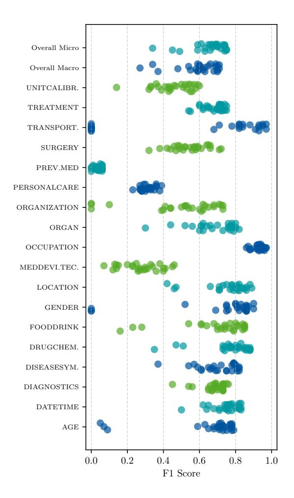
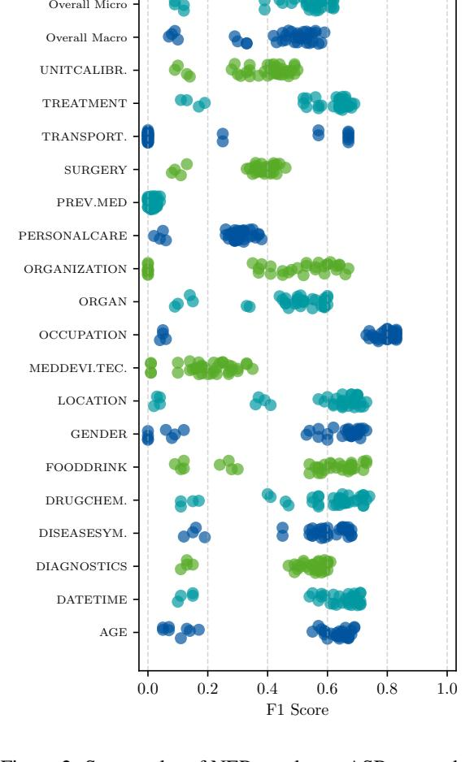

# **Medical Spoken Named Entity Recognition**

**Khai Le-Duc**<sup>1</sup>,<sup>2</sup> **, David Thulke**<sup>4</sup>,<sup>5</sup> **, Hung-Phong Tran**<sup>3</sup> **, Long Vo-Dang**<sup>7</sup> **, Khai-Nguyen Nguyen**<sup>8</sup> **, Truong-Son Hy**<sup>6</sup> **, Ralf Schluter ¨** 4,5

University of Toronto, Canada <sup>2</sup>University Health Network, Canada Hanoi University of Science and Technology, Vietnam Machine Learning and Human Language Technology Group, RWTH Aachen University, Germany

<sup>5</sup>AppTek GmbH, Germany <sup>6</sup>University of Alabama at Birmingham, United States <sup>7</sup>University of Cincinnati, United States <sup>8</sup>College of William and Mary, United States duckhai.le@mail.utoronto.ca

thy@uab.edu, {thulke,schlueter}@hltpr.rwth-aachen.de

# **Abstract**

Spoken Named Entity Recognition (NER) aims to extract named entities from speech and categorise them into types like person, location, organization, etc. In this work, we present *VietMed-NER* - the first spoken NER dataset in the medical domain. To our knowledge, our Vietnamese real-world dataset is the largest spoken NER dataset in the world regarding the number of entity types, featuring 18 distinct types. Furthermore, we present baseline results using various state-of-the-art pre-trained models: encoder-only and sequence-to-sequence; and conduct quantitative and qualitative error analysis. We found that pre-trained multilingual models generally outperform monolingual models on reference text and ASR output and encoders outperform sequence-to-sequence models in NER tasks. By translating the transcripts, the dataset can also be utilised for text NER in the medical domain in other languages than Vietnamese. All code, data and models are publicly available[1](#page-0-0) .

# <span id="page-0-1"></span>**1 Introduction**

Named Entity Recognition (NER) targets extracting named entities (NE) from text and categorizing them into types like person, location, organization, etc. Initially studied in written language, recent attention has turned to study spoken NER [\(Cohn](#page-6-0) [et al.,](#page-6-0) [2019;](#page-6-0) [Shon et al.,](#page-8-0) [2022\)](#page-8-0), which aims to extract semantic information from speech. However, spoken NER has limited literature compared to NER on written text data [\(Yadav et al.,](#page-9-0) [2020\)](#page-9-0).

Spoken NER is particularly challenging, firstly due to the impact of word segmentation on results. The medical vocabulary poses difficulties with numerous confused monosyllabic and polysyllabic words. For instance, the word "đường" alone could denote "sugar" (chemical), "street" (location), or be part of a compound word like "đường tiêu hóa" - "gastrointestinal" (anatomy). This confusion has also been reported in Chinese spoken NER by [Chen](#page-6-1) [et al.](#page-6-1) [\(2022\)](#page-6-1). Further, data quality control and annotation consistency have been problematic, with some entities tagged in one sentence but not in others, and full NEs inconsistently tagged as multiple sub-NEs [\(Huyen and Luong,](#page-7-0) [2016;](#page-7-0) [Nguyen et al.,](#page-8-1) [2018,](#page-8-1) [2020;](#page-8-2) [Truong et al.,](#page-8-3) [2021\)](#page-8-3). Finally, obtaining accurate medical NER from natural speech is challenging due to the lack of punctuation [\(Ertopc¸u](#page-7-1) [et al.,](#page-7-1) [2017\)](#page-7-1), speech disfluencies [\(Kim and Wood](#page-7-2)[land,](#page-7-2) [2000\)](#page-7-2), context, and the complexity of medical terms.

As for the medical domain, to the best of our knowledge, there is no dataset available for medical spoken NER. The only related work we found, [\(Cohn et al.,](#page-6-0) [2019\)](#page-6-0), published a NER evaluation benchmark using an English general-domain conversational dataset, Switchboard [\(Godfrey et al.,](#page-7-3) [1992\)](#page-7-3) and Fisher [\(Cieri et al.,](#page-6-2) [2004\)](#page-6-2), for the task of audio de-identification specifically targeting Personal Health Identifiers.

To address this gap, we introduce *VietMed-NER*, a medical spoken NER dataset built on the real-world medical Automatic Speech Recognition (ASR) dataset *VietMed* [\(Le-Duc,](#page-7-4) [2024\)](#page-7-4), featuring 18 medically-defined entity types. In the era of the advanced in-context learning capabilities of Large Language Models (LLMs) and human-level text-to-speech technologies, the dataset, with entity positional labels maintained during translation, is applicable not only to Vietnamese but also to other languages (see Appendix [C\)](#page-16-0). This enables various real-world applications, including: search engines [\(Rud et al.](#page-8-4) ¨ , [2011\)](#page-8-4), content classification for news providers [\(Kumaran and Allan,](#page-7-5) [2004\)](#page-7-5), medical ASR error correction [\(Mani et al.,](#page-8-5) [2020\)](#page-8-5), audio

<span id="page-0-0"></span><sup>1</sup>[https://github.com/leduckhai/MultiMed/tree/](https://github.com/leduckhai/MultiMed/tree/master/VietMed-NER) [master/VietMed-NER](https://github.com/leduckhai/MultiMed/tree/master/VietMed-NER)

de-identification [\(Cohn et al.,](#page-6-0) [2019\)](#page-6-0) and content recommendation systems [\(Koperski et al.,](#page-7-6) [2017\)](#page-7-6).

Our contributions are as follows:

- We present *VietMed-NER* the first publiclyavailable medical spoken NER dataset.
- We present baselines on several state-of-theart pre-trained models
- We conduct quantitative and qualitative error analysis for medical spoken NER in Vietnamese

All code, data and models are published online<sup>1</sup> .

# <span id="page-1-1"></span>**2 Related Works**

Traditionally, spoken NER has been done using a pipeline methodology, also known as cascaded approach, starting with an ASR stage, followed by NER applied to the generated transcriptions [\(Jannet](#page-7-7) [et al.,](#page-7-7) [2017;](#page-7-7) [Benaicha et al.,](#page-6-3) [2024\)](#page-6-3). Another variant of the cascaded approach involves embedding specific entity expressions into the lexicon, thereby improving the language model's ability to accurately recognize these expressions [\(Hatmi et al.,](#page-7-8) [2013\)](#page-7-8).

Besides, end-to-end NER has recently garnered some attention within the research community. This approach seeks to optimize ASR and NER processes simultaneously, offering a potentially more efficient alternative to traditional pipeline methods by harnessing the ability of trainable acoustic features. However, its accuracy advantage over the cascaded approach remains a subject of debate, and the end-to-end training setup introduces additional complexity [\(Tomashenko et al.,](#page-8-6) [2019;](#page-8-6) [Yadav et al.,](#page-9-0) [2020\)](#page-9-0).

# <span id="page-1-2"></span>**3 Data**

## <span id="page-1-3"></span>**3.1 Data Collection**

We chose the *VietMed* dataset [\(Le-Duc,](#page-7-4) [2024\)](#page-7-4), the world's largest publicly available medical ASR dataset, for annotating NEs.

The original dataset is in Vietnamese. We annotate the Vietnamese version with the methodology described in Section [3.2](#page-1-0) and automatically translate the transcripts to English together with transferring the NE annotation.

#### <span id="page-1-0"></span>**3.2 Annotation Process**

The annotation of medical NEs from real-world speech is challenging because of the missing punctuation, special characters and capitalized words in ASR transcripts, disfluencies and required medical knowledge. Entirely manual annotation of NEs like in VLSP dataset [\(Huyen and Luong,](#page-7-0) [2016;](#page-7-0) [Nguyen et al.,](#page-8-1) [2018,](#page-8-1) [2020\)](#page-8-2) and PhoNER\_COVID19 [\(Truong et al.,](#page-8-3) [2021\)](#page-8-3) requires a large number of working hours, not to mention the difficulties in quality control and inconsistency as we found in their corpora. These inconsistencies include: i) Some entities tagged in one sentence are not tagged in another sentence, and ii) Full NEs are inconsistently tagged as multiple sub-NEs. The best approach to tag nested NEs is the subject of ongoing debate [\(Muis and Lu,](#page-8-7) [2017;](#page-8-7) [Li et al.,](#page-7-9) [2021a\)](#page-7-9). For simplicity, higher consistency and to reduce the annotation effort, we only annotate the largest and outermost full entity span.

Moreover, using fine-tuned models for pretagging doesn't apply to specific medical entity types. Similarly, using prompt engineering with large language models like GPT-4 for pre-tagging did not achieve acceptable accuracy. Training a seed model with a gazetteer list requires initial training time, subsequent repetitive training schedules, and may prove unreliable due to its statistical reliance on a small amount of low-resource data [\(Kozareva,](#page-7-10) [2006\)](#page-7-10).

To tackle these problems, we conduct a humanmachine annotation approach, as described below:

- 1. Annotate and categorize a set of initial entities, then add them to a gazetteer list.
- 2. Sort entities by character length from highest to lowest, to distinguish between sub-NEs and full NEs, ensuring full NEs are mapped before sub-NEs. Time complexity = O(k · log(k)) where k is the number of NEs. For example, "tooth pain" should be mapped before "pain".
- 3. Automatically map entities from the gazetteer list to the transcript. Time complexity = O(m· n), where m is the number of NEs in gazeeter list, n is the number of sentences. Pseudo code:

```
f o r NE i n g a z e t t e e r _ l i s t :
f o r sen i n s e n t e n c e s :
      i f NE i n sen :
             ann o t a te (NE, sen )
```

<span id="page-2-0"></span>

|                    | Definition                                          | Tra   | in   | Dev   |      | Test  |      | All   |      |
|--------------------|-----------------------------------------------------|-------|------|-------|------|-------|------|-------|------|
|                    | Definition                                          | Total | Uni. | Total | Uni. | Total | Uni. | Total | Uni. |
| AGE                | Age of a person                                     | 447   | 43   | 108   | 25   | 611   | 83   | 1166  | 151  |
| GENDER             | Gender of a person                                  | 202   | 30   | 46    | 15   | 451   | 33   | 699   | 78   |
| JOB                | Job of a person                                     | 543   | 32   | 133   | 16   | 562   | 43   | 1238  | 91   |
| LOCATION           | Locations and places                                | 284   | 66   | 76    | 31   | 317   | 75   | 677   | 172  |
| ORGANIZATION       | Organizations                                       | 19    | 14   | 2     | 2    | 58    | 23   | 79    | 39   |
| DISEASESYMTOM      | Symptoms and diseases                               | 2699  | 518  | 683   | 209  | 1334  | 357  | 4716  | 1084 |
| DRUGCHEMICAL       | Bio-chemical substances and drugs                   | 1054  | 255  | 263   | 104  | 684   | 136  | 2001  | 495  |
| FOODDRINK          | Food and beverage                                   | 243   | 77   | 48    | 26   | 247   | 43   | 538   | 146  |
| ORGAN              | Anatomical features, e.g. organs, cells             | 1827  | 252  | 444   | 122  | 1190  | 172  | 3461  | 546  |
| PERSONALCARE       | Personal care, e.g. hygiene routines, skin care     | 353   | 114  | 82    | 38   | 95    | 10   | 530   | 162  |
| DIAGNOSTICS        | Diagnostic procedures, e.g. lab tests, imaging      | 371   | 53   | 91    | 25   | 292   | 36   | 754   | 114  |
| TREATMENT          | Non-surgical treatment, e.g. rehab., injection      | 726   | 69   | 174   | 25   | 230   | 17   | 1130  | 111  |
| SURGERY            | Surgical procedures, e.g. implants, neurosurgery    | 197   | 29   | 55    | 13   | 270   | 37   | 522   | 79   |
| PREVENTIVEMED      | Preventive medicine                                 | 341   | 53   | 80    | 25   | 18    | 6    | 439   | 84   |
| MEDDEVICETECHNIQUE | Medical devices, instruments, and techniques        | 324   | 84   | 67    | 30   | 603   | 144  | 994   | 258  |
| UNITCALIBRATOR     | Medical calibration, e.g. number of doses, calories | 800   | 155  | 215   | 75   | 251   | 106  | 1266  | 336  |
| TRANSPORTATION     | Means of transportation                             | 5     | 2    | 3     | 3    | 27    | 10   | 35    | 15   |
| DATETIME           | Date and time                                       | 674   | 155  | 159   | 65   | 657   | 133  | 1490  | 353  |
| #Entities in total |                                                     | 11109 | 2001 | 2729  | 849  | 7897  | 1464 | 21735 | 4314 |
| #Sentences         |                                                     | 462   | 20   | 11:   | 50   | 35    | 00   | 927   | 70   |

Table 1: Entity definition and its statistics in our dataset. "Uni." means the number of unique entities.

- Annotators review each sentence to include correctly labeled NEs and ignore mislabeled NEs
- 5. Annotators add new NEs not in the gazetteer list during manual annotation. Steps 2 and 3 generate pre-tagged labels in the next sentences. Annotators repeat Steps 4 and 5 until the entire corpus is annotated.

We experience faster annotation by allowing annotators to foresee possible NEs in upcoming utterances based on previously annotated ones. Annotators can accept or reject these suggestions, saving time with correct suggestions and easily ignoring incorrect ones. Unlike training a seed model with a gazetteer, which requires initial training time and may be unreliable for low-to-mid resource languages, our method avoids these issues and eliminates the need to correct incorrect NEs.

#### <span id="page-2-1"></span>3.3 Data Quality Control

We created initial annotation guidelines (see Appendix A) and began annotating the corpus. Two developers, one with a medical background, independently annotated the corpus. Then, we held a discussion session to resolve conflicts, address complex cases, and refine the guidelines. Two other developers perform quality control using the guidelines and the annotated corpus. We consistently revisited each sentence in the entire corpus multiple times. This data quality control process is inspired by Tran et al. (2022).

#### <span id="page-2-2"></span>3.4 Data Splitting

Most NER datasets have a very small number of entities in their test sets compared to train and dev set (Huyen and Luong, 2016; Truong et al., 2021; Chen et al., 2022). However, we want to leverage the capabilities of large pre-trained models which are trained on vast amounts of unlabeled text data, resulting in good representations. Therefore, we focus on creating a large test set to obtain more statistically significant evaluation results and keep the training set relatively small in comparison.

#### <span id="page-2-3"></span>3.5 Data Statistics

Table 1 shows the statistics of our dataset. Our *VietMed-NER* contains 18 entity types across 9000 sentences, split into train-dev-test as 8-2-6 hours. To the best of our knowledge, compared to all other public spoken NER datasets, ours has the largest number of entity types.

#### <span id="page-2-4"></span>4 Experimental Setups

We employ the cascaded (two-stage) pipeline for spoken NER: A hybrid ASR model transcribes audio into text and then the transcribed text is fed into a text NER model.

#### <span id="page-2-5"></span>4.1 Evaluation Metrics

We employed the F1 score metric as it is commonly used for spoken NER (Shon et al., 2022; Benaicha et al., 2024), which evaluates an unordered list of NE phrases and tag pairs predicted for each sentence. We used 3 toolkits for a more comprehensive comparison, as described in Appendix D.

<span id="page-3-0"></span>

| Model           | #Params | #Data |
|-----------------|---------|-------|
| PhoBERT_base    | 135M    |       |
| PhoBERT_large   | 370M    | 20GB  |
| PhoBERT_base-v2 | 135M    | 140GB |
| ViDeBERTa_base  | 86M     | 298GB |
| XLM-R_base      | 270M    | 2.5TB |
| XLM-R_large     | 550M    | 2.5TB |
| mBART-50        | 611M    | 3.9TB |
| ViT5_base       | 310M    | 888GB |
| BARTpho         | 396M    | 20GB  |

Table 2: Statistics of state-of-the-art pre-trained language models which we used for NER task.

# <span id="page-3-2"></span>**4.2 ASR Models**

We employed two baseline models fine-tuned for ASR on *VietMed* published by [Le-Duc](#page-7-4) [\(2024\)](#page-7-4): an acoustic monolingual pre-trained w2v2-Viet and an acoustic multilingual pre-trained XLSR-53-Viet model. w2v2-Viet model was pre-trained from scratch on 1204h of Vietnamese data. For the XLSR-53-Viet model, continued pre-training on 1204h of Vietnamese starting with XLSR-53 [\(Con](#page-6-4)[neau et al.,](#page-6-4) [2021\)](#page-6-4) was performed. Both have the same number of parameters (118M) and were finetuned on the same training set. Their WERs on the test set are 29.0% and 28.8% respectively.

# <span id="page-3-3"></span>**4.3 NER Models**

Table [2](#page-3-0) shows the statistics of various pre-trained monolingual and multilingual models we consider to fine-tune on our dataset. To our knowledge, these are the best pre-trained models that achieved state-of-the-art results on various downstream tasks in the Vietnamese language, including NER.

**Monolingual encoder models**: PhoBERT\_base, PhoBERT\_large, PhoBERT\_base-v2 [\(Nguyen and](#page-8-9) [Tuan Nguyen,](#page-8-9) [2020\)](#page-8-9), ViDeBERTa\_base [\(Tran](#page-8-10) [et al.,](#page-8-10) [2023\)](#page-8-10).

**Monolingual sequence-to-sequence (seq2seq) models**: BARTpho [\(Tran et al.,](#page-8-8) [2022\)](#page-8-8), ViT5 [\(Phan](#page-8-11) [et al.,](#page-8-11) [2022\)](#page-8-11),

**Multilingual encoder models**: XML-R\_base, XML-R\_large [\(Conneau et al.,](#page-7-11) [2020\)](#page-7-11).

**Multilingual seq2seq models**: mBART-50 [\(Tang et al.,](#page-8-12) [2020\)](#page-8-12).

### <span id="page-3-4"></span>**4.3.1 Seq2seq Training for NER Task**

Following the approach proposed by [Phan et al.](#page-8-13) [\(2021\)](#page-8-13) and later adopted by ViT5 [\(Phan et al.,](#page-8-11) [2022\)](#page-8-11), we formulated the sequence tagging task as

<span id="page-3-1"></span>

| NER Model       | Prec. | Rec. | F1   |
|-----------------|-------|------|------|
| BARTpho         | 0.64  | 0.73 | 0.68 |
| mBART-50        | 0.64  | 0.66 | 0.65 |
| PhoBERT_base    | 0.67  | 0.78 | 0.72 |
| PhoBERT_base-v2 | 0.68  | 0.79 | 0.74 |
| PhoBERT_large   | 0.69  | 0.77 | 0.73 |
| ViDeBERTa_base  | 0.50  | 0.41 | 0.45 |
| ViT5_base       | 0.64  | 0.74 | 0.69 |
| XLM-R_base      | 0.64  | 0.73 | 0.69 |
| XLM-R_large     | 0.71  | 0.77 | 0.74 |

Table 3: NER results on reference text of test set. The metrics shown are Precision, Recall, and overall micro F1 score. Results by entity types are shown in Tables [5](#page-20-0)[-24](#page-39-0) in the Appendix.

a sequence-to-sequence task by training the models to generate tags of labels before and after an entity token. In cases where the models fail to follow the mentioned format for an entity token, we use an "exception" tag, which will be later ignored during metric calculation, as the label.

### <span id="page-3-5"></span>**4.3.2 Training Hyperparameters**

We used HuggingFace Transformers [\(Wolf et al.,](#page-9-1) [2019\)](#page-9-1) for fine-tuning pre-trained models for the NER task. Vietnamese input sentences can be represented in either syllable or word level as described by [Truong et al.](#page-8-3) [\(2021\)](#page-8-3). However, we only employed word-level settings to train NER models. All our NER experiments were done by using the default hyperparameters by HuggingFace.

The default hyperparameters are as follows: Learning rate of 2e-5, linear learning rate scheduler, training batch size of 64, 50 training epochs, weight decay of 0.01, AdamW optimizer [\(Loshchilov and Hutter,](#page-8-14) [2019\)](#page-8-14), Beta1 of 0.9, Beta2 of 0.999, and epsilon of 1e-8.

### <span id="page-3-6"></span>**5 Experimental Results**

Table [3](#page-3-1) and [4](#page-4-0) show results of NER using various pre-trained models. We observe that there was a performance drop in all models when evaluated on ASR transcripts, as expected due to the noisy nature of ASR output.

**1. Pre-trained multilingual models outperformed monolingual models, if multilingual models overcome the capacity dilution**: The pre-trained monolingual model PhoBERT\_basev2 outperformed other monolingual models, at 0.74 of F1 score on reference text, and 0.57 on ASR output. Despite having fewer parameters than

<span id="page-4-0"></span>

| NER             | ASR          | Prec. | Rec. | F1   |
|-----------------|--------------|-------|------|------|
| ViDeBERTa_base  | XLSR-53-Viet | 0.45  | 0.34 | 0.39 |
|                 | w2v2-Viet    | 0.45  | 0.34 | 0.39 |
| ViT5_base       | XLSR-53-Viet | 0.52  | 0.46 | 0.48 |
|                 | w2v2-Viet    | 0.53  | 0.46 | 0.49 |
| mBART-50        | XLSR-53-Viet | 0.35  | 0.05 | 0.09 |
|                 | w2v2-Viet    | 0.35  | 0.05 | 0.09 |
| BARTpho         | XLSR-53-Viet | 0.56  | 0.50 | 0.53 |
|                 | w2v2-Viet    | 0.55  | 0.50 | 0.52 |
| PhoBERT_base_v2 | XLSR-53-Viet | 0.57  | 0.57 | 0.57 |
|                 | w2v2-Viet    | 0.58  | 0.56 | 0.57 |
| PhoBERT_base    | XLSR-53-Viet | 0.56  | 0.56 | 0.56 |
|                 | w2v2-Viet    | 0.56  | 0.56 | 0.56 |
| PhoBERT_large   | XLSR-53-Viet | 0.57  | 0.55 | 0.56 |
|                 | w2v2-Viet    | 0.58  | 0.55 | 0.56 |
| XLM-R_base      | XLSR-53-Viet | 0.54  | 0.52 | 0.53 |
|                 | w2v2-Viet    | 0.54  | 0.52 | 0.53 |
| XLM-R_large     | XLSR-53-Viet | 0.60  | 0.56 | 0.58 |
|                 | w2v2-Viet    | 0.60  | 0.56 | 0.58 |

Table 4: NER results on ASR output of test set for different NER and ASR models. Metrics shown are Precision, Recall, and overall micro F1 score. Results by entity types are shown in Tables [25](#page-40-0)[-44](#page-59-0) in the Appendix.

PhoBERT\_large, it performed similarly, likely due to more pre-training data. The pre-trained multilingual model XLM-R\_large achieved the best performance with an F1 score of 0.74 on reference text and 0.58 on ASR output, while XLM-R\_base performed worse than PhoBERT\_base-v2. This gap is explained by the larger pre-training data (2.5TB multilingual data for XLM-R vs. 140GB monolingual data for PhoBERT\_base-v2). Our results with PhoBERT\_base-v2 and XLM-R\_large confirmed that pre-trained multilingual representations improve performance on medical spoken NER tasks, similar to other language-specific downstream tasks by [Conneau et al.](#page-7-11) [\(2020\)](#page-7-11); [Liu](#page-7-12) [et al.](#page-7-12) [\(2020\)](#page-7-12). However, multilingual models may face a *Transfer-dilution Trade-off* [\(Conneau et al.,](#page-7-11) [2020\)](#page-7-11), where they lack the capacity to learn effective multilingual representations. In other words, for a fixed sized model, the per-language performance decreases as we increase the number of languages [\(Gurgurov et al.,](#page-7-13) [2024\)](#page-7-13). To address this trade-off, multilingual models should possess sufficient capacity, necessitating an adequately large model size [\(Chen and Chen,](#page-6-5) [2024\)](#page-6-5). This is evident in the performance comparison between PhoBERT\_base-v2 and XLM-R\_base, as seen in other language-specific downstream tasks by [Con](#page-7-11)[neau et al.](#page-7-11) [\(2020\)](#page-7-11); [Arivazhagan et al.](#page-6-6) [\(2019\)](#page-6-6).

#### **2. Encoder-based models outperform seq2seq**

**models**: The best seq2seq model, BARTpho, achieved F1 scores of 0.68 on reference text and 0.53 on ASR output. Encoders generally performed better than seq2seq models, possibly because seq2seq's generative nature is less suited for classification tasks like NER.

**3. Multi-lingual pre-training of the acoustic model does not affect cascaded NER performance** As expected by the similar WERs for the acoustic pre-trained monolingual model w2v2- Viet and the multilingual model XLSR-53-Viet, all NER models show comparable F1 scores, precision, and recall. This indicates that in addition to overall WER the models do not differ significantly in the recognition accuracy of medical NEs. Noncascaded models might have advantages in utilising the additional pre-training data for the downstream task.

# <span id="page-4-1"></span>**6 Error Analysis**

We performed an error analysis using the bestperforming models.

### <span id="page-4-2"></span>**6.1 Quantitative**

We provide a detailed error analysis for each entity type across best models, utilizing three evaluation toolkits. The results are summarized in Tables [5-](#page-20-0) [24](#page-39-0) and Tables [25](#page-40-0)[-44,](#page-59-0) with corresponding visual representations in the scatter plots shown in Figure [1](#page-5-0) and Figure [2.](#page-5-1)

The top NER models showed high accuracy in recognizing OCCUPATION and TRANSPORTA-TION entities in both reference text and ASR output. Despite TRANSPORTATION having only 35 total and 15 unique samples, the best models performed well, likely due to the semantic clarity and predictable spans of these entities.

In contrast, PREVENTIVEMED showed higher misrecognition rates, despite sufficient sample size mitigating class imbalance. This may stem from two factors. First, preventive medicine terms often overlap with general medical terminology, making it difficult for the model to distinguish them from DRUGCHEMICAL or TREATMENT concepts. For example, "vaccination" is frequently misclassified as a therapeutic intervention (TREATMENT) in sentences that describe its role in disease prevention (PREVENTIVEMED). Also, models frequently struggle to differentiate between "vaccination" and "vaccine" (DRUGCHEMICAL). Second, preventive medicine involves long-term health

<span id="page-5-0"></span>

<span id="page-5-1"></span>

Figure 1: Scatter plot of NER results on reference text by entity types using various pre-trained language models and evaluation variants, created by Tables [5](#page-20-0)[-24.](#page-39-0)

Figure 2: Scatter plot of NER results on ASR output by entity types using various pre-trained language models and evaluation variants, created by Tables [25-](#page-40-0)[44.](#page-59-0)

strategies often expressed in non-clinical or nonstandardized language, complicating entity recognition.

#### <span id="page-5-2"></span>**6.2 Qualitative**

A common error was confusion between LOCA-TION and ORGANIZATION, due to the inherent ambiguity where the same entity can function as either depending on context. An organization-related entity may be labelled as LOCATION if it implies a patient visited there, but this inference requires external knowledge about the entity. Another confusion involved DRUGCHEMICAL and FOOD-DRINK. Both categories share similar names, descriptors, and consumption contexts (e.g., caffeine, alcohol, sugar). Insufficient context length often causes errors, especially with ambiguous terms like "vitamin," "cordyceps," or "sea daffodils," which can refer to both supplements and nutrients depending on context. Another case is DIAGNOSTICS, TREATMENT, and SURGERY. For example, a "biopsy" can be both a diagnostic and treatment, while "radiation therapy" may be linked to surgery.

A common error in NER involves incorrect entity spans, which fall into two types: (1) correct label but wrong span, and (2) wrong label but correct span. The first type often occurs with multi-word entities in the medical domain, like OR-GANIZATION, LOCATION, or DISEASESYMP-TOM. For example, "high blood pressure" (B-DISEASESYMPTOM, I-DISEASESYMPTOM, I-DISEASESYMPTOM) may be misrecognized as "high blood" (B-DISEASESYMPTOM, I-DISEASESYMPTOM, O), keeping the meaning but shortening the span. The second type occurs when compound-word entities are split, such as "vagina cells" (B-ORGAN, I-ORGAN) being misrecognized as "vagina" and "cells" (B-ORGAN, B-ORGAN).

# <span id="page-6-7"></span>**7 Conclusion**

In this work, we present *VietMed-NER* - the first spoken NER dataset in the medical domain. Our dataset contains 18 entity types, including both conventional and newly defined entity types for real-world medical conversations. Our results show that pre-trained multilingual models typically outperform monolingual models on both reference text and ASR output if the multilingual models are sufficiently large to learn multilingual representations. Additionally, encoders generally demonstrate better performance than seq2seq models in the NER task. Finally, while pre-trained audio data impacts ASR output, it does not significantly impact NER performance in the cascaded setting.

# <span id="page-6-8"></span>**8 Limitations**

**Our annotation approach**: Our annotation approach has some advantages over the fully manual approach. First, it allows annotators to not spend extra time tagging the entities that have been tagged in previous sentences. Second, it prevents that annotators miss entities that have been tagged in previous sentences, improving the consistency of the entire dataset. During our work, we experienced a faster annotation by using our approach compared to fully manual annotation. However, in the scope of this paper, we have not done extensive experiments to give a quantitative number of how much time has been saved and the method's impact on annotation quality.

**Evaluation metrics for medical terms**: ASR system performance is commonly evaluated using WER, which quantifies the ratio of word insertion, substitution, and deletion errors in a transcript relative to the total number of spoken words. However, various spoken language understanding tasks, such as spoken NER, rely on accurately identifying key terms within transcripts. In medical ASR, it is critical to account for the disproportionate importance of medical terms in doctor-patient interactions, as they hold significantly more weight than general vocabulary, as discussed in Section [B](#page-15-0) in the Appendix. We believe that other domainspecific spoken NER tasks follow a similar pattern. Consequently, future comprehensive investigations into evaluation metrics are needed to determine the most appropriate metric for spoken NER in the medical and other domains.

# **References**

<span id="page-6-6"></span>Naveen Arivazhagan, Ankur Bapna, Orhan Firat, Dmitry Lepikhin, Melvin Johnson, Maxim Krikun, Mia Xu Chen, Yuan Cao, George Foster, Colin Cherry, et al. 2019. [Massively multilingual neu](https://arxiv.org/abs/1907.05019)[ral machine translation in the wild: Findings and](https://arxiv.org/abs/1907.05019) [challenges.](https://arxiv.org/abs/1907.05019) *ArXiv preprint*, abs/1907.05019.

<span id="page-6-3"></span>Moncef Benaicha, David Thulke, and Mehmet Ali Tugtekin Turan. 2024. ˘ [Leveraging cross-lingual](https://aclanthology.org/2024.konvens-main.11/) [transfer learning in spoken named entity recogni](https://aclanthology.org/2024.konvens-main.11/)[tion systems.](https://aclanthology.org/2024.konvens-main.11/) In *Proceedings of the 20th Conference on Natural Language Processing (KONVENS 2024)*, pages 98–105, Vienna, Austria. Association for Computational Linguistics.

<span id="page-6-1"></span>Boli Chen, Guangwei Xu, Xiaobin Wang, Pengjun Xie, Meishan Zhang, and Fei Huang. 2022. [AISHELL-](https://doi.org/10.1109/ICASSP43922.2022.9746955)[NER: named entity recognition from chinese speech.](https://doi.org/10.1109/ICASSP43922.2022.9746955) In *IEEE International Conference on Acoustics, Speech and Signal Processing, ICASSP 2022, Virtual and Singapore, 23-27 May 2022*, pages 8352–8356. IEEE.

<span id="page-6-9"></span>Li-Wei Chen, Shinji Watanabe, and Alexander Rudnicky. 2023. [A vector quantized approach for text to](https://doi.org/10.1609/AAAI.V37I11.26488) [speech synthesis on real-world spontaneous speech.](https://doi.org/10.1609/AAAI.V37I11.26488) In *Thirty-Seventh AAAI Conference on Artificial Intelligence, AAAI 2023, Thirty-Fifth Conference on Innovative Applications of Artificial Intelligence, IAAI 2023, Thirteenth Symposium on Educational Advances in Artificial Intelligence, EAAI 2023, Washington, DC, USA, February 7-14, 2023*, pages 12644– 12652. AAAI Press.

<span id="page-6-5"></span>Po-Heng Chen and Yun-Nung Chen. 2024. [Efficient un](https://doi.org/10.18653/v1/2024.emnlp-main.1057)[seen language adaptation for multilingual pre-trained](https://doi.org/10.18653/v1/2024.emnlp-main.1057) [language models.](https://doi.org/10.18653/v1/2024.emnlp-main.1057) In *Proceedings of the 2024 Conference on Empirical Methods in Natural Language Processing*, pages 18983–18994, Miami, Florida, USA. Association for Computational Linguistics.

<span id="page-6-2"></span>Christopher Cieri, David Miller, and Kevin Walker. 2004. [The fisher corpus: a resource for the next](http://www.lrec-conf.org/proceedings/lrec2004/pdf/767.pdf) [generations of speech-to-text.](http://www.lrec-conf.org/proceedings/lrec2004/pdf/767.pdf) In *Proceedings of the Fourth International Conference on Language Resources and Evaluation (LREC'04)*, Lisbon, Portugal. European Language Resources Association (ELRA).

<span id="page-6-0"></span>Ido Cohn, Itay Laish, Genady Beryozkin, Gang Li, Izhak Shafran, Idan Szpektor, Tzvika Hartman, Avinatan Hassidim, and Yossi Matias. 2019. [Au](https://doi.org/10.18653/v1/N19-2025)[dio de-identification - a new entity recognition task.](https://doi.org/10.18653/v1/N19-2025) In *Proceedings of the 2019 Conference of the North American Chapter of the Association for Computational Linguistics: Human Language Technologies, Volume 2 (Industry Papers)*, pages 197–204, Minneapolis, Minnesota. Association for Computational Linguistics.

<span id="page-6-4"></span>Alexis Conneau, Alexei Baevski, Ronan Collobert, Abdelrahman Mohamed, and Michael Auli. 2021. [Un](https://doi.org/10.21437/Interspeech.2021-329)[supervised cross-lingual representation learning for](https://doi.org/10.21437/Interspeech.2021-329)

- [speech recognition.](https://doi.org/10.21437/Interspeech.2021-329) In *Interspeech 2021, 22nd Annual Conference of the International Speech Communication Association, Brno, Czechia, 30 August - 3 September 2021*, pages 2426–2430. ISCA.
- <span id="page-7-11"></span>Alexis Conneau, Kartikay Khandelwal, Naman Goyal, Vishrav Chaudhary, Guillaume Wenzek, Francisco Guzmán, Edouard Grave, Myle Ott, Luke Zettlemoyer, and Veselin Stoyanov. 2020. [Unsupervised](https://doi.org/10.18653/v1/2020.acl-main.747) [cross-lingual representation learning at scale.](https://doi.org/10.18653/v1/2020.acl-main.747) In *Proceedings of the 58th Annual Meeting of the Association for Computational Linguistics*, pages 8440– 8451, Online. Association for Computational Linguistics.
- <span id="page-7-14"></span>Shaoyang Duan, Ruifang He, and Wenli Zhao. 2017. [Exploiting document level information to improve](https://aclanthology.org/I17-1036) [event detection via recurrent neural networks.](https://aclanthology.org/I17-1036) In *Proceedings of the Eighth International Joint Conference on Natural Language Processing (Volume 1: Long Papers)*, pages 352–361, Taipei, Taiwan. Asian Federation of Natural Language Processing.
- <span id="page-7-1"></span>Burak Ertopc¸u, Ali Bugra Kanburo ˘ glu, Ozan Topsakal, ˘ Onur Ac¸ıkgoz, Ali Tunca G ¨ urkan, Berke ¨ Ozen ¨ c¸, ˙Ilker C¸ am, Begum Avar, G ¨ okhan Ercan, and Olcay Taner ¨ Yıldız. 2017. A new approach for named entity recognition. In *2017 International Conference on Computer Science and Engineering (UBMK)*, pages 474–479. IEEE.
- <span id="page-7-3"></span>John J Godfrey, Edward C Holliman, and Jane Mc-Daniel. 1992. Switchboard: Telephone speech corpus for research and development. In *Proceedings of the 1992 IEEE International Conference on Acoustics, Speech and Signal Processing*.
- <span id="page-7-13"></span>Daniil Gurgurov, Tanja Baumel, and Tatiana Anikina. ¨ 2024. [Multilingual large language models and curse](https://arxiv.org/abs/2406.10602) [of multilinguality.](https://arxiv.org/abs/2406.10602) *ArXiv preprint*, abs/2406.10602.
- <span id="page-7-8"></span>Mohamed Hatmi, Christine Jacquin, Emmanuel Morin, and Sylvain Meigner. 2013. Incorporating named entity recognition into the speech transcription process. In *Proceedings of the 14th Annual Conference of the International Speech Communication Association (Interspeech'13)*, pages 3732–3736.
- <span id="page-7-0"></span>Nguyen Thi Minh Huyen and Vu Xuan Luong. 2016. Vlsp 2016 shared task: Named entity recognition. *Proceedings of Vietnamese Speech and Language Processing (VLSP)*.
- <span id="page-7-7"></span>Mohamed Ameur Ben Jannet, Olivier Galibert, Martine Adda-Decker, and Sophie Rosset. 2017. [Investigating](http://www.isca-speech.org/archive/Interspeech_2017/abstracts/1482.html) [the effect of ASR tuning on named entity recognition.](http://www.isca-speech.org/archive/Interspeech_2017/abstracts/1482.html) In *Interspeech 2017, 18th Annual Conference of the International Speech Communication Association, Stockholm, Sweden, August 20-24, 2017*, pages 2486– 2490. ISCA.
- <span id="page-7-2"></span>Ji-Hwan Kim and Philip C Woodland. 2000. A rulebased named entity recognition system for speech input. In *Sixth International Conference on Spoken Language Processing*.

- <span id="page-7-6"></span>Krzysztof Koperski, Jisheng Liang, and Neil Roseman. 2017. Content recommendation based on collections of entities. US Patent 9,710,556.
- <span id="page-7-10"></span>Zornitsa Kozareva. 2006. [Bootstrapping named entity](https://aclanthology.org/E06-3004) [recognition with automatically generated gazetteer](https://aclanthology.org/E06-3004) [lists.](https://aclanthology.org/E06-3004) In *Student Research Workshop*, pages 15–22.
- <span id="page-7-5"></span>Giridhar Kumaran and James Allan. 2004. [Text classifi](https://doi.org/10.1145/1008992.1009044)[cation and named entities for new event detection.](https://doi.org/10.1145/1008992.1009044) In *Proceedings of the 27th Annual International ACM SIGIR Conference on Research and Development in Information Retrieval*, SIGIR '04, page 297–304, New York, NY, USA. Association for Computing Machinery.
- <span id="page-7-4"></span>Khai Le-Duc. 2024. [VietMed: A dataset and benchmark](https://aclanthology.org/2024.lrec-main.1509) [for automatic speech recognition of Vietnamese in](https://aclanthology.org/2024.lrec-main.1509) [the medical domain.](https://aclanthology.org/2024.lrec-main.1509) In *Proceedings of the 2024 Joint International Conference on Computational Linguistics, Language Resources and Evaluation (LREC-COLING 2024)*, pages 17365–17370, Torino, Italia. ELRA and ICCL.
- <span id="page-7-16"></span>Vladimir I Levenshtein et al. 1966. Binary codes capable of correcting deletions, insertions, and reversals. In *Soviet physics doklady*, volume 10, pages 707–710. Soviet Union.
- <span id="page-7-9"></span>Fei Li, ZhiChao Lin, Meishan Zhang, and Donghong Ji. 2021a. [A span-based model for joint overlapped and](https://doi.org/10.18653/v1/2021.acl-long.372) [discontinuous named entity recognition.](https://doi.org/10.18653/v1/2021.acl-long.372) In *Proceedings of the 59th Annual Meeting of the Association for Computational Linguistics and the 11th International Joint Conference on Natural Language Processing (Volume 1: Long Papers)*, pages 4814–4828, Online. Association for Computational Linguistics.
- <span id="page-7-15"></span>Fei Li, ZhiChao Lin, Meishan Zhang, and Donghong Ji. 2021b. [A span-based model for joint overlapped and](https://doi.org/10.18653/v1/2021.acl-long.372) [discontinuous named entity recognition.](https://doi.org/10.18653/v1/2021.acl-long.372) In *Proceedings of the 59th Annual Meeting of the Association for Computational Linguistics and the 11th International Joint Conference on Natural Language Processing (Volume 1: Long Papers)*, pages 4814–4828, Online. Association for Computational Linguistics.
- <span id="page-7-17"></span>Yinghao Aaron Li, Cong Han, Vinay S. Raghavan, Gavin Mischler, and Nima Mesgarani. 2023. [Styletts](http://papers.nips.cc/paper_files/paper/2023/hash/3eaad2a0b62b5ed7a2e66c2188bb1449-Abstract-Conference.html) [2: Towards human-level text-to-speech through style](http://papers.nips.cc/paper_files/paper/2023/hash/3eaad2a0b62b5ed7a2e66c2188bb1449-Abstract-Conference.html) [diffusion and adversarial training with large speech](http://papers.nips.cc/paper_files/paper/2023/hash/3eaad2a0b62b5ed7a2e66c2188bb1449-Abstract-Conference.html) [language models.](http://papers.nips.cc/paper_files/paper/2023/hash/3eaad2a0b62b5ed7a2e66c2188bb1449-Abstract-Conference.html) In *Advances in Neural Information Processing Systems 36: Annual Conference on Neural Information Processing Systems 2023, NeurIPS 2023, New Orleans, LA, USA, December 10 - 16, 2023*.
- <span id="page-7-12"></span>Yinhan Liu, Jiatao Gu, Naman Goyal, Xian Li, Sergey Edunov, Marjan Ghazvininejad, Mike Lewis, and Luke Zettlemoyer. 2020. [Multilingual denoising pre](https://doi.org/10.1162/tacl_a_00343)[training for neural machine translation.](https://doi.org/10.1162/tacl_a_00343) *Transactions of the Association for Computational Linguistics*, 8:726–742.

- <span id="page-8-14"></span>Ilya Loshchilov and Frank Hutter. 2019. [Decou](https://openreview.net/forum?id=Bkg6RiCqY7)[pled weight decay regularization.](https://openreview.net/forum?id=Bkg6RiCqY7) In *7th International Conference on Learning Representations, ICLR 2019, New Orleans, LA, USA, May 6-9, 2019*. OpenReview.net.
- <span id="page-8-5"></span>Anirudh Mani, Shruti Palaskar, and Sandeep Konam. 2020. [Towards understanding ASR error correction](https://doi.org/10.18653/v1/2020.nlpmc-1.2) [for medical conversations.](https://doi.org/10.18653/v1/2020.nlpmc-1.2) In *Proceedings of the First Workshop on Natural Language Processing for Medical Conversations*, pages 7–11, Online. Association for Computational Linguistics.
- <span id="page-8-7"></span>Aldrian Obaja Muis and Wei Lu. 2017. [Labeling gaps](https://doi.org/10.18653/v1/D17-1276) [between words: Recognizing overlapping mentions](https://doi.org/10.18653/v1/D17-1276) [with mention separators.](https://doi.org/10.18653/v1/D17-1276) In *Proceedings of the 2017 Conference on Empirical Methods in Natural Language Processing*, pages 2608–2618, Copenhagen, Denmark. Association for Computational Linguistics.
- <span id="page-8-9"></span>Dat Quoc Nguyen and Anh Tuan Nguyen. 2020. [PhoBERT: Pre-trained language models for Viet](https://doi.org/10.18653/v1/2020.findings-emnlp.92)[namese.](https://doi.org/10.18653/v1/2020.findings-emnlp.92) In *Findings of the Association for Computational Linguistics: EMNLP 2020*, pages 1037–1042, Online. Association for Computational Linguistics.
- <span id="page-8-1"></span>Huyen TM Nguyen, Quyen T Ngo, Luong X Vu, Vu M Tran, and Hien TT Nguyen. 2018. Vlsp shared task: Named entity recognition. *Journal of Computer Science and Cybernetics*.
- <span id="page-8-2"></span>Thai Binh Nguyen, Quang Minh Nguyen, Hien Nguyen Thi Thu, Quoc Truong Do, and Luong Chi Mai. 2020. [Improving vietnamese named entity](https://doi.org/10.21437/Interspeech.2020-1896) [recognition from speech using word capitalization](https://doi.org/10.21437/Interspeech.2020-1896) [and punctuation recovery models.](https://doi.org/10.21437/Interspeech.2020-1896) In *Interspeech 2020, 21st Annual Conference of the International Speech Communication Association, Virtual Event, Shanghai, China, 25-29 October 2020*, pages 4263– 4267. ISCA.
- <span id="page-8-11"></span>Long Phan, Hieu Tran, Hieu Nguyen, and Trieu H. Trinh. 2022. [ViT5: Pretrained text-to-text trans](https://doi.org/10.18653/v1/2022.naacl-srw.18)[former for Vietnamese language generation.](https://doi.org/10.18653/v1/2022.naacl-srw.18) In *Proceedings of the 2022 Conference of the North American Chapter of the Association for Computational Linguistics: Human Language Technologies: Student Research Workshop*, pages 136–142, Hybrid: Seattle, Washington + Online. Association for Computational Linguistics.
- <span id="page-8-13"></span>Long N. Phan, James T. Anibal, Hieu Tran, Shaurya Chanana, Erol Bahadroglu, Alec Peltekian, and Grégoire Altan-Bonnet. 2021. [Scifive: a text-to-text](http://arxiv.org/abs/2106.03598) [transformer model for biomedical literature.](http://arxiv.org/abs/2106.03598)
- <span id="page-8-4"></span>Stefan Rud, Massimiliano Ciaramita, Jens M ¨ uller, and ¨ Hinrich Schutze. 2011. ¨ [Piggyback: Using search](https://aclanthology.org/P11-1097) [engines for robust cross-domain named entity recog](https://aclanthology.org/P11-1097)[nition.](https://aclanthology.org/P11-1097) In *Proceedings of the 49th Annual Meeting of the Association for Computational Linguistics: Human Language Technologies*, pages 965–975, Portland, Oregon, USA. Association for Computational Linguistics.

- <span id="page-8-17"></span>Suwon Shon, Siddhant Arora, Chyi-Jiunn Lin, Ankita Pasad, Felix Wu, Roshan S Sharma, Wei-Lun Wu, Hung-yi Lee, Karen Livescu, and Shinji Watanabe. 2023. [SLUE phase-2: A benchmark suite of diverse](https://doi.org/10.18653/v1/2023.acl-long.496) [spoken language understanding tasks.](https://doi.org/10.18653/v1/2023.acl-long.496) In *Proceedings of the 61st Annual Meeting of the Association for Computational Linguistics (Volume 1: Long Papers)*, pages 8906–8937, Toronto, Canada. Association for Computational Linguistics.
- <span id="page-8-0"></span>Suwon Shon, Ankita Pasad, Felix Wu, Pablo Brusco, Yoav Artzi, Karen Livescu, and Kyu Jeong Han. 2022. [SLUE: new benchmark tasks for spoken lan](https://doi.org/10.1109/ICASSP43922.2022.9746137)[guage understanding evaluation on natural speech.](https://doi.org/10.1109/ICASSP43922.2022.9746137) In *IEEE International Conference on Acoustics, Speech and Signal Processing, ICASSP 2022, Virtual and Singapore, 23-27 May 2022*, pages 7927–7931. IEEE.
- <span id="page-8-15"></span>Jana Straková, Milan Straka, and Jan Hajic. 2019. [Neu](https://doi.org/10.18653/v1/P19-1527)[ral architectures for nested NER through lineariza](https://doi.org/10.18653/v1/P19-1527)[tion.](https://doi.org/10.18653/v1/P19-1527) In *Proceedings of the 57th Annual Meeting of the Association for Computational Linguistics*, pages 5326–5331, Florence, Italy. Association for Computational Linguistics.
- <span id="page-8-16"></span>Xu Tan, Jiawei Chen, Haohe Liu, Jian Cong, Chen Zhang, Yanqing Liu, Xi Wang, Yichong Leng, Yuanhao Yi, Lei He, et al. 2024. Naturalspeech: End-toend text-to-speech synthesis with human-level quality. *IEEE Transactions on Pattern Analysis and Machine Intelligence*.
- <span id="page-8-12"></span>Yuqing Tang, Chau Tran, Xian Li, Peng-Jen Chen, Naman Goyal, Vishrav Chaudhary, Jiatao Gu, and Angela Fan. 2020. [Multilingual translation with exten](http://arxiv.org/abs/2008.00401)[sible multilingual pretraining and finetuning.](http://arxiv.org/abs/2008.00401)
- <span id="page-8-6"></span>Natalia Tomashenko, Antoine Caubrière, Yannick Estève, Antoine Laurent, and Emmanuel Morin. 2019. Recent advances in end-to-end spoken language understanding. In *Statistical Language and Speech Processing: 7th International Conference, SLSP 2019, Ljubljana, Slovenia, October 14–16, 2019, Proceedings 7*, pages 44–55. Springer.
- <span id="page-8-10"></span>Cong Dao Tran, Nhut Huy Pham, Anh Tuan Nguyen, Truong Son Hy, and Tu Vu. 2023. [ViDeBERTa: A](https://doi.org/10.18653/v1/2023.findings-eacl.79) [powerful pre-trained language model for Vietnamese.](https://doi.org/10.18653/v1/2023.findings-eacl.79) In *Findings of the Association for Computational Linguistics: EACL 2023*, pages 1071–1078, Dubrovnik, Croatia. Association for Computational Linguistics.
- <span id="page-8-8"></span>Nguyen Luong Tran, Duong Minh Le, and Dat Quoc Nguyen. 2022. [Bartpho: Pre-trained sequence-to](https://doi.org/10.21437/INTERSPEECH.2022-10177)[sequence models for vietnamese.](https://doi.org/10.21437/INTERSPEECH.2022-10177) In *23rd Annual Conference of the International Speech Communication Association, Interspeech 2022, Incheon, Korea, September 18-22, 2022*, pages 1751–1755. ISCA.
- <span id="page-8-3"></span>Thinh Hung Truong, Mai Hoang Dao, and Dat Quoc Nguyen. 2021. [COVID-19 named entity recogni](https://doi.org/10.18653/v1/2021.naacl-main.173)[tion for Vietnamese.](https://doi.org/10.18653/v1/2021.naacl-main.173) In *Proceedings of the 2021 Conference of the North American Chapter of the Association for Computational Linguistics: Human*

*Language Technologies*, pages 2146–2153, Online. Association for Computational Linguistics.

<span id="page-9-1"></span>Thomas Wolf, Lysandre Debut, Victor Sanh, Julien Chaumond, Clement Delangue, Anthony Moi, Pierric Cistac, Tim Rault, Rémi Louf, Morgan Funtowicz, et al. 2019. [Huggingface's transformers: State-of](https://arxiv.org/abs/1910.03771)[the-art natural language processing.](https://arxiv.org/abs/1910.03771) *ArXiv preprint*, abs/1910.03771.

<span id="page-9-0"></span>Hemant Yadav, Sreyan Ghosh, Yi Yu, and Rajiv Ratn Shah. 2020. [End-to-end named entity recogni](https://doi.org/10.21437/Interspeech.2020-2482)[tion from english speech.](https://doi.org/10.21437/Interspeech.2020-2482) In *Interspeech 2020, 21st Annual Conference of the International Speech Communication Association, Virtual Event, Shanghai, China, 25-29 October 2020*, pages 4268–4272. ISCA.

# **Contents**

| 1           | Introduction                                                                                                                                                                                                   | 1                                |
|-------------|----------------------------------------------------------------------------------------------------------------------------------------------------------------------------------------------------------------|----------------------------------|
| 2           | Related Works                                                                                                                                                                                                  | 2                                |
| 3           | Data<br>3.1<br>Data Collection<br><br>3.2<br>Annotation Process<br><br>3.3<br>Data Quality Control<br><br>3.4<br>Data Splitting<br><br>3.5<br>Data Statistics                                                  | 2<br>2<br>2<br>3<br>3<br>3       |
| 4           | Experimental Setups<br>4.1<br>Evaluation Metrics<br><br>4.2<br>ASR Models<br>4.3<br>NER Models<br><br>4.3.1<br>Seq2seq Training for NER Task<br><br>4.3.2<br>Training Hyperparameters<br>                      | 3<br>3<br>4<br>4<br>4<br>4       |
| 5           | Experimental Results                                                                                                                                                                                           | 4                                |
| 6<br>7<br>8 | Error Analysis<br>6.1<br>Quantitative<br>6.2<br>Qualitative<br>Conclusion<br>Limitations                                                                                                                       | 5<br>5<br>6<br>7<br>7            |
| A           | Annotation Guidelines                                                                                                                                                                                          | 12                               |
| B           | Discussion about Named-Entity-Error-Rate (NEER)<br>B.1<br>Motivation of NEER<br><br>B.2<br>Definition of WER<br><br>B.3<br>Definition of KER<br><br>B.4<br>Definition of NEER<br>B.5<br>Open questions on NEER | 16<br>16<br>16<br>16<br>16<br>16 |
| C           | Possible Applications                                                                                                                                                                                          | 17                               |
| D           | Details about Experimental Setups<br>D.1<br>Evaluation Toolkit<br>D.2<br>Modified Evaluation of SLUE toolkit<br>                                                                                               | 19<br>19<br>19                   |
| E           | NER Results by Entity Types                                                                                                                                                                                    | 20                               |

# <span id="page-11-0"></span>**A Annotation Guidelines**

This section describes annotation guidelines for annotators to follow in an attempt to have a unified and consistent gold-standard NER transcript.

## **General rules**:

- If 2 or more entities overlap, label the resulting entity as the longest, including overlapping component entities. In other words, a full NE might contain 2 or more sub-NEs. A full NE should be tagged instead of multiple sub-NEs. For example: "bác sĩ xương khớp" (orthopedic doctor) should be tagged as a whole instead of 2 distinct NEs "bác sĩ " (doctor) and "xương khớp" (orthopedic).
- We adhere to the conventional approach of annotating overlapping NE components as a whole, utilizing the BIO encoding scheme. In recent years, research on overlapping and discontinuous NER has introduced alternative annotation frameworks to solve NE overlapping, such as BILOU encoding, which represents "Beginning, Inside, and Last tokens of multi-token chunks, Unit-length chunks, and Outside" [\(Straková et al.,](#page-8-15) [2019;](#page-8-15) [Duan et al.,](#page-7-14) [2017\)](#page-7-14). Another approach by [Li et al.](#page-7-15) [\(2021b\)](#page-7-15) introduces a novel span-based model capable of jointly recognizing both overlapping and discontinuous entities. The model operates in two primary stages. First, entity fragments are identified by systematically traversing all possible text spans, enabling the detection of overlapping entities. Second, a relation classification step determines whether a given pair of entity fragments exhibits an overlapping or successive relationship. This approach facilitates the recognition of discontinuous entities while simultaneously verifying overlapping entities.
- Do not assign spaces at the beginning and at the end of entities.
- All words in the ASR transcript are lowercase, without punctuations and special characters. Treat every word as lowercase or uppercase, with or without punctuations and special characters based on the context of each utterance.
- Each utterance should be treated as an independent utterance. The additional context given by other utterances should not influence the annotation of each utterance.

## **AGE**:

This entity type describes the age of a person.

- Label the word "tuổi" (age) if applicable. For example: "tuổi trưởng thành" (mature age), "hai bảy tuổi" (twenty-seven years old).
- List a range of ages if applicable For example: "hai mươi đến ba lăm tuổi" (twenty to thirtyfive years old), "dưới sáu tháng tuổi" (under six months old).
- Include adjectives and nouns that might describe how old a person is but don't explicitly describe gender or gender is neutral. For example: "chưa trưởng thành" (immature), "người già" (old person), "cụ" (sir, old).

### **GENDER**:

This entity type describes the gender of a person.

- Include typical entities that are widely understood to describe the gender of a person. For example: "nam" (male), "đàn ông" (gentleman), "phụ nữ" (woman).
- Include the titles and pronouns that explicitly describe a gender instead of age. For example: "ông" (grandfather), "bà" (grandmother), "cô" (aunt), "chú" (uncle).

# **OCCUPATION**:

This entity type describes the job of a person.

- Include all jobs that might be both in medical fields and non-medical fields. For example: "khán thính giả" (audience), "bệnh nhân" (patient), "người dân" (citizen), "chuyên gia" (expert).
- Include academic titles and degrees. For example: "thạc sĩ" (master degree holder), "tiến sĩ" (doctorate), "trưởng khoa" (dean), "chủ tịch" (president).
- Include a cluster of words that might describe the specializations of doctors. For example: "bác sĩ chuyên về rối loạn vận động" (doctor who specializes in movement disorders) instead of two distinct entities "bác sĩ" (doctor) and "rối loạn vận động" (movement disorders), "bác sĩ về parkinson" (parkinson's doctor) instead of two distinct entities "bác sĩ" (doctor) and "parkinson", "bác sĩ chuyên khoa tim mạch" (cardiovascular specialist) instead of two distinct entities "bác sĩ" (doctor) and "chuyên khoa tim mạch" (cardiovascular).

## **LOCATION**:

This entity type describes a location.

- Include continents, countries, regions, cities, and geographical administrative units. For example: "châu âu" (europe), "hoa kỳ" (usa), "tây tạng" (tibet), "thành phố hồ chí minh" (ho chi minh city), "tỉnh vĩnh long" (vinh long province).
- Label words that mean geographical administrative units if applicable. For example: "huyện" (rural district), "quận" (urban district), "đường phố" (street), "thành phố" (city).
- Include words that might describe public and private sites. For example: "tại nhà" (at home), "đồng ruộng" (farm), "tiệm thuốc" (drugstore), "nhà máy" (factory), "cửa hiệu quần áo" (clothing store), "toilet" (toilet).
- Include words that might describe ambient environments. For example: "tại khu phố" (in the neighborhood), "tại địa phương" (in local area), "nước ngoài" (in foreign countries), "địa bàn" (area), "ngoài trời" (outside).
- Include words that might describe medical facilities. For example: "chuyên khoa tiêu hóa" (gastrointestinal room) , "icu" (intensive care unit), "trạm xá" (clinics), "phòng thí nghiệm" (laboratory).
- Each level of the administrative unit is a separate entity.
- Do not assign nationality as an entity.
- Locations might be misrecognized as organizations. Do not label places that are not clearly identified or controversial.

# **DISEASESYMPTOM**:

This entity type describes a symptom or disease.

- Include the complements of the disease. For example: "biến chứng" (side-effect), "chấn thương" (damaged), "bẩm sinh" (congenital), "di chứng" (sequelae), "bị tổn thương" (damaged), "tái phát" (relapse), "dương tính" (positive), "bệnh lý mãn tính" (chronic disease), "hội chứng" (syndrome).
- Include a cluster of words that might describe the severity of a disease. For example: "phỏng cấp độ ba" (third-degree burn), "sức đề kháng kém" (poor immune system).

- Mental state might also describe mental diseases or their symptoms. For example: "tự ti" (self-deprecation), "tình trạng lo âu" (state of anxiety), "mệt mỏi về tinh thần" (mental fatigue).
- Skin conditions might describe dermatosis or its symptoms. For example: "nám" (melasma), "da đổ dầu" (oily skin), "da khô" (dry skin), "sạm da" (dark skin).
- Genital conditions might describe genital diseases or their symptoms. For example: "có kinh" (menstruation), "có thai" (pregnant), "dậy thì sớm" (early puberty).
- Healthy conditions might help doctors diagnose. For example: "kinh nguyệt đều" (regular menstruation).
- Words describing physical status might also speak of symptoms or diseases. For example: "buồn ngủ" (sleepy), "rụng tóc" (hair loss), "còi cọc" (stunted).
- Words describing children's activities might also speak of pediatric symptoms or diseases. For example: "quấy khóc" (fussy), "không thể giao tiếp" (unable to speak), "chậm đi" (delay walking).
- Medical techniques or devices might make symptoms and diseases happen. For example: "phẫu thuật thẩm mỹ" (cosmetic surgery).

### **DRUGCHEMICAL**:

This entity type describes a bio-chemical substance or medicament.

- Extraction of human or animal bodies to serve medical treatment might be referred to as a biochemical substance. For example: "vắcxin" (vaccine), "huyết thanh" (blood serum)
- Cosmetics might be referred to as chemical substances. For example: "kem chống nắng" (sunscreen), "kem dưỡng ẩm" (moisturizer).
- Food or drink serving medical treatment purposes or as a part of a chemical compound might be referred to as chemical substances. For example: "nấm đông trùng hạ thảo" (cordyceps), "nhân sâm" (ginseng), "nhung hươu" (deer antler).

- Substances extracted from cells or bodies not serving medical purposes might be referred to as bio-chemical substances. For example: "dịch tiêu hóa" (digestive fluids), "chất nội sinh" (endogenous substances), "mồ hôi" (sweat), "bã nhờn" (sebum).
- Air might be referred to as chemical substances. For example: "dưỡng khí" (breath air), "oxy" (oxygen).

### **FOODDRINK**:

This entity type describes food and beverage.

- Include food and drink that might serve nutrient purposes. For example: "sữa" (milk), "ngũ cốc" (cereal).
- Include food and drink that might be harmful to health. For example: "thuốc lá" (cigarette), "rượu bia" (alcohol).
- Include words that generally describe food and beverage. For example: "thực phẩm" (aliment), "thức ăn" (food).

### **ORGAN**:

This entity type describes an anatomical feature, e.g. human organs, biological cells, etc. Annotators should follow general rules.

### **PERSONALCARE**:

This entity type describes a personal care procedure, e.g. hygiene routines, skin care, daily habits, etc.

- Activities serving the improvement of physical, aesthetic and mental health instead of medical treatment purposes might be referred to as personal care procedures. For example: "ăn kiêng" (diet), "chăm sóc da" (skin care), "chăm sóc răng" (dental care).
- Methods serving self-improvement of speech ability in speech-language pathology might be referred to as personal care. For example: "tương tác ngôn ngữ" (language interaction), "huấn luyện ngôn ngữ" (language training).

#### **DIAGNOSTICS**:

This entity type describes a diagnostic procedure, e.g. lab tests, imaging, blood measurement, etc.

• General words describing diagnostic procedures without explicitly mentioning surgery

- might be referred to as diagnostic produces. For example: "chẩn đoán" (diagnosis), "xét nghiệm" (test).
- Imaging methods might be referred to as diagnostic procedures instead of medical devices or techniques. For example: "mri" (magnetic resonance imaging), "ct" (computed tomography).

### **TREATMENT**:

This entity type describes a non-surgical treatment method for diseases, e.g. physical rehabilitation, injection, psychology, etc.

- Words describing methods of using biochemical substances as non-surgical treatment methods might be referred to as treatment methods. For example: "liệu pháp hoocmon" (hormone therapy), "điều trị hoocmon" (hormone treatment), "điều trị tế bào gốc" (stem cell treatment).
- Words describing methods of using invasive techniques as treatment methods might be referred to as treatment methods. For example: "hóa trị" (chemotherapy), "xạ trị" (radiotherapy).
- Words describing methods to improve skin conditions for treatment purposes rather than aesthetics might be referred to as treatment methods. For example: "phục hồi da" (skin recovery), "ức chế sự xuất sắc tố" (inhibit pigmentation).

### **SURGERY**:

This entity type describes a surgical treatment method for diseases, e.g. implants, neurosurgery, invasion, etc.

- Include pre-surgery procedures that might be integral parts of surgeries. For example: "gây mê" (anesthesia), "gây tê" (anesthetize).
- Include intervention procedures that might be integral parts of dental care. For example: "nhổ răng" (tooth extraction), "implant" (dental implant).
- Include intervention procedures that might be integral parts of pregnancy or genitals. For example: "sinh mổ" (caesarean), "cấy tránh thai" (contraceptive implant).

- Include intervention procedures on arteries even though they might be not integral parts of surgery. For example: "truyền máu" (blood transfusion), "truyền nước biển" (seawater infusion).
- Include neurosurgical procedures that work with brain waves even though they might be minimally invasive. For example: "kích thích não sâu" (dbs or deep brain stimulation).

# **MEDDEVICETECHNIQUE**:

This entity type describes a medical device, instrument, bio-material and technique.

• Medical devices and techniques might be confusing. Annotators are strongly recommended to fully annotate CHEM., FnB, ANAT., PC, DX, TX, and SX before engaging TECH.

### **UNITCALIBRATOR**:

This entity type describes a medical calibration, e.g. number of doses, calories, length, volume, etc.

- Include a cluster of words that both describe the quantity and its unit. Measurements including length, distance, area, weight, heat, velocity, temperature, etc., should be explicitly tagged. For example: "năm milimet" (five millimeters) instead of "năm" (five) or "milimet" (millimeter).
- Complements to the actual quantity describing its approximation should be included. For example: "khoảng mười lăm phần trăm" (about fifteen percent) instead of "mười lăm phần trăm" (fifteen percent).
- Include words that generally describe the quantity. For example: "gần đủ" (close enough), "cao" (high), "rất là lớn" (very large).
- Include words that describe trends of quantity. For example: "giảm được ít nhất" (reduce at least), "mức độ gia tăng" (level increases).

## **TRANSPORTATION**:

This entity type describes means of transportation or vehicles.

# **DATETIME**:

This entity type describes the date and time.

• Include words describing day, week, month, certain named period, season, year, etc.

- Include words describing a time frame. For example: "bây giờ" (now), "về lâu về dài" (in the long run).
- Include words describing the approximate time. For example: "nhanh nhất có thể" (as fast as possible), "càng sớm" (as soon as possible), "từ từ" (gradually).
- Include words describing repetitions. For example: "định kỳ" (periodically).
- Include a cluster of words that both describe time and its complements. For example: "từ tháng ba trở đi" (from march onwards) instead of 3 distinct entities "từ" (from), "tháng ba" (march), and "trở đi" (onwards).

# <span id="page-15-0"></span>**B Discussion about Named-Entity-Error-Rate (NEER)**

### <span id="page-15-1"></span>**B.1 Motivation of NEER**

ASR system performance is typically assessed using WER, which represents the ratio of word insertion, substitution, and deletion errors in a transcript to the total number of spoken words. However, various spoken language understanding tasks, such as spoken NER, depend on identifying keywords in transcripts. Moreover, it's essential to recognize that in medical ASR, medical terms carry much higher significance in doctor-patient conversations and should not be treated equally to regular words. KER is often used to evaluate on keywords but is not a directly comparable metric with WER.

The purpose to introduce NEER aims to bridge the gap between WER and KER. However, it is not intended to replace WER or KER as a standard metric for evaluating domain-specific ASR performance. Instead, NEER serves as a complementary metric, facilitating a more in-depth analysis of ASR errors in specific domains, such as the medical field.

# <span id="page-15-2"></span>**B.2 Definition of WER**

WER is calculated based on the Levenshtein distance [\(Levenshtein et al.,](#page-7-16) [1966\)](#page-7-16), which represents the smallest count of individual edits (insertions, deletions, or substitutions) needed to transform one word into another.

$$WER = \frac{S+D+I}{N} = \frac{S+D+I}{S+D+C}$$
 (1)

where S is the number of substitutions, D is the number of deletions, I is the number of insertions, C is the number of correct words, and N is the number of words in the reference data (N = S + D + C).

In other words, S is the number of replaced words. D is the number of missed words that are not in ASR hypothesis but are in reference data. I is the number of added words that are in ASR hypothesis but are not in reference data. The alignment between ASR hypothesis and reference data goes from left to right.

## <span id="page-15-3"></span>**B.3 Definition of KER**

Like WER, KER is computed using the Levenshtein distance. Each ASR hypothesis is aligned with its corresponding reference data and KER is calculated based on the keyword set.

$$KER = \frac{F+M}{N} \tag{2}$$

where N is the number of keywords in the reference data, F is the number of falsely recognized keywords, M is the number of missed keywords.

The ASR hypothesis often exceeds the length of all keywords in the reference data, and the insertion errors caused by non-keywords may lead to a skewed result in KER. Therefore, no insertion errors are considered while calculating KER.

#### <span id="page-15-4"></span>**B.4 Definition of NEER**

In KER metric, N is the number of keywords in the reference data. KER could be characterized as the average number of errors per keyword. Nevertheless, the length of keywords may range from 1 to L (where L equals 5 in certain instances such as NER), making the average number of errors per keyword obscure.

In NEER metric, we want to evaluate on keyword-only like KER metric, while also analyzing errors per word like WER metric. Therefore, we change N into the length of keywords (entities), which characterizes the average number of errors per word of keywords.

### <span id="page-15-5"></span>**B.5 Open questions on NEER**

We still leave some questions open for future work. First, the analysis of how each type of word error (substitutions, insertions, deletions) influences NER on top of ASR has not been conducted yet. Second, the empirical relationship between WER, KER, NEER, and F1 score - meaning how KER, NEER, and F1 score are affected by a varying range of WERs — has not been analyzed either.

# <span id="page-16-0"></span>**C Possible Applications**

In the context of advanced in-context learning capabilities of LLMs and human-level text-to-speech technologies, the dataset, which preserves entity positional labels throughout the translation process, is applicable not only to Vietnamese but also to other languages.

To facilitate dataset translation using LLMs, we employed a concise, brief contextual instruction via GPT-3.5 Turbo, as illustrated below.

In this example, we utilized a straightforward one-shot in-context learning approach, which successfully produced a high-quality translation while preserving all entity positional labels. We hypothesize that employing many-shot learning, extending the context length of instructions, and more advanced LLMs (e.g. GPT-4, GPT-4o) could yield even more enhanced results.

Recent research in text-to-speech (TTS) technology has achieved human-level performance in aspects such as naturalness and emotional expressiveness [\(Tan et al.,](#page-8-16) [2024;](#page-8-16) [Li et al.,](#page-7-17) [2023;](#page-7-17) [Chen](#page-6-9) [et al.,](#page-6-9) [2023\)](#page-6-9). Consequently, the application of TTS to translated NER transcripts could generate realistic audio data, facilitating further research in additional languages.

#### gpt-3.5-turbo

#### Instruction:

Given the text:

"thì cũng giống như ba má mình đã từng bị béo phì rồi bị bệnh này bệnh kia những người thân quen của mình mình biết bị"

Its coressponding named entity position is:

[ "0", "0", "0", "0", "B-GENDER", "B-GENDER", "0", "0", "0", "0", "B-DISEASESYMTOM", "I-DISEASESYMTOM", "0", "B-DISEASESYMTOM", "I-DISEASESYMTOM", "0", "0", "0", "0", "0", "0", "0", "0", "0", "0", "0", "0" ],

where "0" is none-entity. Translate to English and give the corresponding named entities.

### LLM response:

The given Vietnamese text translates to:

"[it is just like my mom and dad who were once obese and got this disease or that disease, people close to me, I know, have been]".

The corresponding named entities, based on the positions provided, are:

- "B-GENDER", "B-GENDER"
- → \*\*"mom" and "dad"\*\* (Gender entities)
- "B-DISEASESYMTOM", "I-DISEASESYMTOM"
- → \*\*"obese"\*\* (Disease/Symptom)
- "B-DISEASESYMTOM", "I-DISEASESYMTOM"
- → \*\*"disease"\*\* (Disease/Symptom)

So, the translation with the named entities marked would be:

"[it is just like \*\*mom\*\* and \*\*dad\*\* who were once \*\*obese\*\* and got this \*\*disease\*\* or that \*\*disease\*\*, people close to me, I know, have been]".

# <span id="page-18-0"></span>**D Details about Experimental Setups**

#### <span id="page-18-1"></span>**D.1 Evaluation Toolkit**

We employed seqeval[2](#page-18-3) framework commonly used as a default evaluation framework by HuggingFace. However, this framework only works for NER on reference text. Therefore, we also employed the F1 score calculation by [Shon et al.](#page-8-17) [\(2023\)](#page-8-17) by using the SLUE toolkit[3](#page-18-4) . This F1 score evaluates an unordered list of NE phrase and tag pairs predicted for each sentence. Our proposed modification of SLUE toolkit was also used and presented below.

#### <span id="page-18-2"></span>**D.2 Modified Evaluation of SLUE toolkit**

Following pre-processing, we calculate the evaluation metrics for the ASR-NER SLUE task. This involves computing precision, recall, and F1-score, which provide insights into the model performance at both an individual label level (per entity) and across all labels (overall).

We introduce a "dummy" token strategy to replace the actual NEs. This approach upholds the focus on the classification of entities rather than the extraction of verbatim phrases, which is suitable for cases where ASR errors might skew the recognition of entities in spoken transcripts.

Let's take an example:

- Reference text: "I have a tooth pain"
- BIO encoding of reference text: [0, 0, 0, B-DISEASESYMTOM, I-DISEASESYMTOM]
- ASR output: "Has teeth pain"
- BIO encoding of ASR output: [0, B-DISEASESYMTOM, I-DISEASESYMTOM]

In the SLUE toolkit, the format (NE type, NE) is used to compare reference text and ASR output, e.g. (DISEASESYMTOM, "tooth pain") and (DISEASESYMTOM, "teeth pain"). This format gives an F1 score of 0.0 although entity type is correctly recognized. In our "dummy" token strategy, we modify the format as (NE type, "dummy"), turning reference text and ASR output to (DIS-EASESYMTOM, "dummy") and (DISEASESYM-TOM, "dummy") respectively. The modified format gives a correct F1 score of 1.0.

We compute two types of overall metrics: micro and macro averages. The micro average metrics aggregate the contributions of all classes to compute the average metric, while the macro average computes per-entity type metrics and averages them, without considering the frequency of each entity type. The micro average is therefore influenced by the class distribution and will be dominated by the performance on more frequent entity types. In contrast, macro averages treat all entity types equally, providing a measure of the system's performance across different types of NEs, regardless of their frequency in the dataset.

<span id="page-18-3"></span><sup>2</sup> https://github.com/chakki-works/seqeval

<span id="page-18-4"></span><sup>3</sup> https://github.com/asappresearch/slue-toolkit

# <span id="page-19-0"></span>**E NER Results by Entity Types**

Tables [5-](#page-20-0)[24](#page-39-0) show the results of NER on reference text by entity types using various pre-trained language models. Tables [25-](#page-40-0)[44](#page-59-0) show the results of NER on ASR output by entity types using various pre-trained language models and ASR models.

Figure [1](#page-5-0) shows the scatter plot of NER results on reference text by entity types using various pretrained language models, created by Tables [5-](#page-20-0)[24.](#page-39-0) Figure [2](#page-5-1) shows the scatter plot of NER results on ASR output by entity types using various pretrained language models, created by Tables [25-](#page-40-0)[44.](#page-59-0)

<span id="page-20-0"></span>

| Entity Type | NER             | Eval. Toolkit | Prec. | Rec. | F1   |
|-------------|-----------------|---------------|-------|------|------|
|             | BARTpho         | Mod. SLUE     | 0.70  | 0.79 | 0.74 |
|             | BARTpho         | seqeval       | 0.69  | 0.61 | 0.65 |
|             | BARTpho         | SLUE          | 0.69  | 0.78 | 0.73 |
|             | mBART-50        | Mod. SLUE     | 0.64  | 0.81 | 0.71 |
|             | mBART-50        | seqeval       | 0.66  | 0.53 | 0.59 |
|             | mBART-50        | SLUE          | 0.62  | 0.79 | 0.70 |
|             | PhoBERT_base    | Mod. SLUE     | 0.75  | 0.81 | 0.78 |
|             | PhoBERT_base    | seqeval       | 0.76  | 0.62 | 0.68 |
|             | PhoBERT_base    | SLUE          | 0.74  | 0.80 | 0.77 |
|             | PhoBERT_base-v2 | Mod. SLUE     | 0.78  | 0.78 | 0.78 |
|             | PhoBERT_base-v2 | seqeval       | 0.76  | 0.66 | 0.71 |
|             | PhoBERT_base-v2 | SLUE          | 0.77  | 0.77 | 0.77 |
|             | PhoBERT_large   | Mod. SLUE     | 0.77  | 0.81 | 0.79 |
| AGE         | PhoBERT_large   | seqeval       | 0.77  | 0.66 | 0.71 |
|             | PhoBERT_large   | SLUE          | 0.76  | 0.80 | 0.78 |
|             | ViDeBERTa_base  | Mod. SLUE     | 0.59  | 0.05 | 0.09 |
|             | ViDeBERTa_base  | seqeval       | 0.03  | 0.29 | 0.05 |
|             | ViDeBERTa_base  | SLUE          | 0.50  | 0.04 | 0.07 |
|             | ViT5_base       | Mod. SLUE     | 0.71  | 0.79 | 0.75 |
|             | ViT5_base       | seqeval       | 0.73  | 0.63 | 0.68 |
|             | ViT5_base       | SLUE          | 0.69  | 0.77 | 0.73 |
|             | XLM-R_base      | Mod. SLUE     | 0.69  | 0.79 | 0.73 |
|             | XLM-R_base      | seqeval       | 0.71  | 0.56 | 0.63 |
|             | XLM-R_base      | SLUE          | 0.68  | 0.77 | 0.72 |
|             | XLM-R_large     | Mod. SLUE     | 0.78  | 0.77 | 0.78 |
|             | XLM-R_large     | seqeval       | 0.75  | 0.67 | 0.71 |
|             | XLM-R_large     | SLUE          | 0.78  | 0.77 | 0.77 |

Table 5: NER results of **AGE** entity type (in percent) on **reference text** of test set using various pre-trained language models. Metrics shown are Precision, Recall, and overall micro/macro F1 score. Evaluation toolkits used are: seqeval, SLUE and our modified SLUE.

| Entity Type | NER             | Eval. Toolkit | Prec. | Rec. | F1   |
|-------------|-----------------|---------------|-------|------|------|
|             | BARTpho         | Mod. SLUE     | 0.76  | 0.76 | 0.76 |
|             | BARTpho         | seqeval       | 0.62  | 0.66 | 0.64 |
|             | BARTpho         | SLUE          | 0.74  | 0.75 | 0.75 |
|             | mBART-50        | Mod. SLUE     | 0.83  | 0.74 | 0.78 |
|             | mBART-50        | seqeval       | 0.67  | 0.75 | 0.71 |
|             | mBART-50        | SLUE          | 0.82  | 0.73 | 0.77 |
|             | PhoBERT_base    | Mod. SLUE     | 0.80  | 0.83 | 0.82 |
|             | PhoBERT_base    | seqeval       | 0.77  | 0.70 | 0.74 |
|             | PhoBERT_base    | SLUE          | 0.80  | 0.82 | 0.81 |
|             | PhoBERT_base-v2 | Mod. SLUE     | 0.81  | 0.84 | 0.83 |
|             | PhoBERT_base-v2 | seqeval       | 0.78  | 0.73 | 0.75 |
|             | PhoBERT_base-v2 | SLUE          | 0.81  | 0.83 | 0.82 |
|             | PhoBERT_large   | Mod. SLUE     | 0.83  | 0.82 | 0.83 |
| DATETIME    | PhoBERT_large   | seqeval       | 0.76  | 0.75 | 0.76 |
|             | PhoBERT_large   | SLUE          | 0.83  | 0.81 | 0.82 |
|             | ViDeBERTa_base  | Mod. SLUE     | 0.62  | 0.68 | 0.65 |
|             | ViDeBERTa_base  | seqeval       | 0.58  | 0.43 | 0.50 |
|             | ViDeBERTa_base  | SLUE          | 0.60  | 0.65 | 0.62 |
|             | ViT5_base       | Mod. SLUE     | 0.74  | 0.77 | 0.75 |
|             | ViT5_base       | seqeval       | 0.69  | 0.67 | 0.68 |
|             | ViT5_base       | SLUE          | 0.72  | 0.75 | 0.74 |
|             | XLM-R_base      | Mod. SLUE     | 0.81  | 0.78 | 0.80 |
|             | XLM-R_base      | seqeval       | 0.72  | 0.70 | 0.71 |
|             | XLM-R_base      | SLUE          | 0.80  | 0.77 | 0.78 |
|             | XLM-R_large     | Mod. SLUE     | 0.85  | 0.82 | 0.83 |
|             | XLM-R_large     | seqeval       | 0.76  | 0.77 | 0.77 |
|             | XLM-R_large     | SLUE          | 0.84  | 0.81 | 0.82 |

Table 6: NER results of **DATETIME** entity type (in percent) on **reference text** of test set using various pre-trained language models. Metrics shown are Precision, Recall, and overall micro/macro F1 score. Evaluation toolkits used are: seqeval, SLUE and our modified SLUE.

| Entity Type | NER             | Eval. Toolkit | Prec. | Rec. | F1   |
|-------------|-----------------|---------------|-------|------|------|
|             | BARTpho         | Mod. SLUE     | 0.66  | 0.82 | 0.73 |
|             | BARTpho         | seqeval       | 0.72  | 0.65 | 0.68 |
|             | BARTpho         | SLUE          | 0.65  | 0.82 | 0.73 |
|             | mBART-50        | Mod. SLUE     | 0.58  | 0.81 | 0.68 |
|             | mBART-50        | seqeval       | 0.71  | 0.59 | 0.65 |
|             | mBART-50        | SLUE          | 0.57  | 0.80 | 0.66 |
|             | PhoBERT_base    | Mod. SLUE     | 0.66  | 0.81 | 0.73 |
|             | PhoBERT_base    | seqeval       | 0.75  | 0.64 | 0.69 |
|             | PhoBERT_base    | SLUE          | 0.66  | 0.80 | 0.72 |
|             | PhoBERT_base-v2 | Mod. SLUE     | 0.66  | 0.82 | 0.73 |
|             | PhoBERT_base-v2 | seqeval       | 0.77  | 0.65 | 0.70 |
|             | PhoBERT_base-v2 | SLUE          | 0.66  | 0.82 | 0.73 |
|             | PhoBERT_large   | Mod. SLUE     | 0.70  | 0.83 | 0.76 |
| DIAGNOSTICS | PhoBERT_large   | seqeval       | 0.78  | 0.69 | 0.73 |
|             | PhoBERT_large   | SLUE          | 0.69  | 0.83 | 0.75 |
|             | ViDeBERTa_base  | Mod. SLUE     | 0.53  | 0.60 | 0.56 |
|             | ViDeBERTa_base  | seqeval       | 0.55  | 0.39 | 0.45 |
|             | ViDeBERTa_base  | SLUE          | 0.51  | 0.58 | 0.54 |
|             | ViT5_base       | Mod. SLUE     | 0.60  | 0.80 | 0.69 |
|             | ViT5_base       | seqeval       | 0.71  | 0.62 | 0.67 |
|             | ViT5_base       | SLUE          | 0.59  | 0.78 | 0.67 |
|             | XLM-R_base      | Mod. SLUE     | 0.61  | 0.82 | 0.70 |
|             | XLM-R_base      | seqeval       | 0.75  | 0.58 | 0.65 |
|             | XLM-R_base      | SLUE          | 0.60  | 0.82 | 0.69 |
|             | XLM-R_large     | Mod. SLUE     | 0.69  | 0.78 | 0.73 |
|             | XLM-R_large     | seqeval       | 0.78  | 0.69 | 0.73 |
|             | XLM-R_large     | SLUE          | 0.69  | 0.78 | 0.73 |

Table 7: NER results of **DIAGNOSTICS** entity type (in percent) on **reference text** of test set using various pre-trained language models. Metrics shown are Precision, Recall, and overall micro/macro F1 score. Evaluation toolkits used are: seqeval, SLUE and our modified SLUE.

| Entity Type   | NER             | Eval. Toolkit | Prec. | Rec. | F1   |
|---------------|-----------------|---------------|-------|------|------|
|               | BARTpho         | Mod. SLUE     | 0.75  | 0.81 | 0.78 |
|               | BARTpho         | seqeval       | 0.63  | 0.60 | 0.61 |
|               | BARTpho         | SLUE          | 0.73  | 0.78 | 0.75 |
|               | mBART-50        | Mod. SLUE     | 0.71  | 0.73 | 0.72 |
|               | mBART-50        | seqeval       | 0.57  | 0.56 | 0.57 |
|               | mBART-50        | SLUE          | 0.68  | 0.69 | 0.69 |
|               | PhoBERT_base    | Mod. SLUE     | 0.79  | 0.83 | 0.81 |
|               | PhoBERT_base    | seqeval       | 0.70  | 0.60 | 0.65 |
|               | PhoBERT_base    | SLUE          | 0.77  | 0.80 | 0.78 |
|               | PhoBERT_base-v2 | Mod. SLUE     | 0.79  | 0.85 | 0.82 |
|               | PhoBERT_base-v2 | seqeval       | 0.73  | 0.61 | 0.66 |
|               | PhoBERT_base-v2 | SLUE          | 0.77  | 0.82 | 0.79 |
|               | PhoBERT_large   | Mod. SLUE     | 0.82  | 0.81 | 0.82 |
| DISEASESYMTOM | PhoBERT_large   | seqeval       | 0.71  | 0.64 | 0.67 |
|               | PhoBERT_large   | SLUE          | 0.79  | 0.79 | 0.79 |
|               | ViDeBERTa_base  | Mod. SLUE     | 0.68  | 0.52 | 0.59 |
|               | ViDeBERTa_base  | seqeval       | 0.35  | 0.38 | 0.37 |
|               | ViDeBERTa_base  | SLUE          | 0.62  | 0.47 | 0.54 |
|               | ViT5_base       | Mod. SLUE     | 0.78  | 0.84 | 0.81 |
|               | ViT5_base       | seqeval       | 0.73  | 0.67 | 0.70 |
|               | ViT5_base       | SLUE          | 0.77  | 0.82 | 0.79 |
|               | XLM-R_base      | Mod. SLUE     | 0.75  | 0.83 | 0.79 |
|               | XLM-R_base      | seqeval       | 0.69  | 0.56 | 0.61 |
|               | XLM-R_base      | SLUE          | 0.72  | 0.79 | 0.75 |
|               | XLM-R_large     | Mod. SLUE     | 0.83  | 0.81 | 0.82 |
|               | XLM-R_large     | seqeval       | 0.70  | 0.66 | 0.68 |
|               | XLM-R_large     | SLUE          | 0.81  | 0.79 | 0.80 |

Table 8: NER results of **DISEASESYMTOM** entity type (in percent) on **reference text** of test set using various pre-trained language models. Metrics shown are Precision, Recall, and overall micro/macro F1 score. Evaluation toolkits used are: seqeval, SLUE and our modified SLUE.

| Entity Type  | NER             | Eval. Toolkit | Prec. | Rec. | F1   |
|--------------|-----------------|---------------|-------|------|------|
|              | BARTpho         | Mod. SLUE     | 0.73  | 0.82 | 0.77 |
|              | BARTpho         | seqeval       | 0.75  | 0.70 | 0.73 |
|              | BARTpho         | SLUE          | 0.73  | 0.81 | 0.77 |
|              | mBART-50        | Mod. SLUE     | 0.79  | 0.69 | 0.74 |
|              | mBART-50        | seqeval       | 0.71  | 0.76 | 0.73 |
|              | mBART-50        | SLUE          | 0.79  | 0.69 | 0.74 |
|              | PhoBERT_base    | Mod. SLUE     | 0.80  | 0.93 | 0.86 |
|              | PhoBERT_base    | seqeval       | 0.91  | 0.77 | 0.83 |
|              | PhoBERT_base    | SLUE          | 0.79  | 0.93 | 0.86 |
|              | PhoBERT_base-v2 | Mod. SLUE     | 0.83  | 0.93 | 0.88 |
|              | PhoBERT_base-v2 | seqeval       | 0.91  | 0.80 | 0.85 |
|              | PhoBERT_base-v2 | SLUE          | 0.83  | 0.93 | 0.88 |
|              | PhoBERT_large   | Mod. SLUE     | 0.74  | 0.93 | 0.82 |
| DRUGCHEMICAL | PhoBERT_large   | seqeval       | 0.93  | 0.72 | 0.81 |
|              | PhoBERT_large   | SLUE          | 0.74  | 0.93 | 0.82 |
|              | ViDeBERTa_base  | Mod. SLUE     | 0.65  | 0.41 | 0.51 |
|              | ViDeBERTa_base  | seqeval       | 0.31  | 0.41 | 0.35 |
|              | ViDeBERTa_base  | SLUE          | 0.60  | 0.38 | 0.47 |
|              | ViT5_base       | Mod. SLUE     | 0.75  | 0.87 | 0.80 |
|              | ViT5_base       | seqeval       | 0.83  | 0.74 | 0.78 |
|              | ViT5_base       | SLUE          | 0.75  | 0.86 | 0.80 |
|              | XLM-R_base      | Mod. SLUE     | 0.81  | 0.74 | 0.77 |
|              | XLM-R_base      | seqeval       | 0.76  | 0.76 | 0.76 |
|              | XLM-R_base      | SLUE          | 0.80  | 0.74 | 0.77 |
|              | XLM-R_large     | Mod. SLUE     | 0.85  | 0.92 | 0.88 |
|              | XLM-R_large     | seqeval       | 0.91  | 0.79 | 0.85 |
|              | XLM-R_large     | SLUE          | 0.85  | 0.92 | 0.88 |

Table 9: NER results of **DRUGCHEMICAL** entity type (in percent) on **reference text** of test set using various pre-trained language models. Metrics shown are Precision, Recall, and overall micro/macro F1 score. Evaluation toolkits used are: seqeval, SLUE and our modified SLUE.

| Entity Type | NER             | Eval. Toolkit | Prec. | Rec. | F1   |
|-------------|-----------------|---------------|-------|------|------|
|             | BARTpho         | Mod. SLUE     | 0.67  | 0.83 | 0.74 |
|             | BARTpho         | seqeval       | 0.69  | 0.59 | 0.64 |
|             | BARTpho         | SLUE          | 0.67  | 0.83 | 0.74 |
|             | mBART-50        | Mod. SLUE     | 0.56  | 0.67 | 0.61 |
|             | mBART-50        | seqeval       | 0.57  | 0.52 | 0.54 |
|             | mBART-50        | SLUE          | 0.56  | 0.67 | 0.61 |
|             | PhoBERT_base    | Mod. SLUE     | 0.78  | 0.84 | 0.81 |
|             | PhoBERT_base    | seqeval       | 0.74  | 0.67 | 0.70 |
|             | PhoBERT_base    | SLUE          | 0.78  | 0.84 | 0.81 |
|             | PhoBERT_base-v2 | Mod. SLUE     | 0.82  | 0.89 | 0.85 |
|             | PhoBERT_base-v2 | seqeval       | 0.83  | 0.76 | 0.79 |
|             | PhoBERT_base-v2 | SLUE          | 0.82  | 0.89 | 0.85 |
|             | PhoBERT_large   | Mod. SLUE     | 0.80  | 0.91 | 0.85 |
| FOODDRINK   | PhoBERT_large   | seqeval       | 0.85  | 0.75 | 0.80 |
|             | PhoBERT_large   | SLUE          | 0.80  | 0.91 | 0.85 |
|             | ViDeBERTa_base  | Mod. SLUE     | 0.22  | 0.38 | 0.28 |
|             | ViDeBERTa_base  | seqeval       | 0.24  | 0.12 | 0.16 |
|             | ViDeBERTa_base  | SLUE          | 0.19  | 0.32 | 0.23 |
|             | ViT5_base       | Mod. SLUE     | 0.70  | 0.86 | 0.77 |
|             | ViT5_base       | seqeval       | 0.75  | 0.66 | 0.70 |
|             | ViT5_base       | SLUE          | 0.70  | 0.86 | 0.77 |
|             | XLM-R_base      | Mod. SLUE     | 0.64  | 0.88 | 0.74 |
|             | XLM-R_base      | seqeval       | 0.82  | 0.58 | 0.68 |
|             | XLM-R_base      | SLUE          | 0.62  | 0.85 | 0.72 |
|             | XLM-R_large     | Mod. SLUE     | 0.88  | 0.81 | 0.84 |
|             | XLM-R_large     | seqeval       | 0.75  | 0.83 | 0.79 |
|             | XLM-R_large     | SLUE          | 0.88  | 0.81 | 0.84 |

Table 10: NER results of **FOODDRINK** entity type (in percent) on **reference text** of test set using various pre-trained language models. Metrics shown are Precision, Recall, and overall micro/macro F1 score. Evaluation toolkits used are: seqeval, SLUE and our modified SLUE.

| Entity Type | NER             | Eval. Toolkit | Prec. | Rec. | F1   |
|-------------|-----------------|---------------|-------|------|------|
|             | BARTpho         | Mod. SLUE     | 0.83  | 0.90 | 0.86 |
|             | BARTpho         | seqeval       | 0.85  | 0.78 | 0.81 |
|             | BARTpho         | SLUE          | 0.82  | 0.90 | 0.86 |
|             | mBART-50        | Mod. SLUE     | 0.83  | 0.87 | 0.85 |
|             | mBART-50        | seqeval       | 0.77  | 0.75 | 0.76 |
|             | mBART-50        | SLUE          | 0.82  | 0.86 | 0.84 |
|             | PhoBERT_base    | Mod. SLUE     | 0.83  | 0.90 | 0.86 |
|             | PhoBERT_base    | seqeval       | 0.76  | 0.74 | 0.75 |
|             | PhoBERT_base    | SLUE          | 0.83  | 0.90 | 0.86 |
|             | PhoBERT_base-v2 | Mod. SLUE     | 0.84  | 0.89 | 0.86 |
|             | PhoBERT_base-v2 | seqeval       | 0.83  | 0.77 | 0.80 |
|             | PhoBERT_base-v2 | SLUE          | 0.84  | 0.89 | 0.86 |
|             | PhoBERT_large   | Mod. SLUE     | 0.83  | 0.90 | 0.87 |
| GENDER      | PhoBERT_large   | seqeval       | 0.87  | 0.79 | 0.83 |
|             | PhoBERT_large   | SLUE          | 0.83  | 0.90 | 0.86 |
|             | ViDeBERTa_base  | Mod. SLUE     | 0.00  | 0.00 | 0.00 |
|             | ViDeBERTa_base  | seqeval       | 0.00  | 0.00 | 0.00 |
|             | ViDeBERTa_base  | SLUE          | 0.00  | 0.00 | 0.00 |
|             | ViT5_base       | Mod. SLUE     | 0.81  | 0.82 | 0.82 |
|             | ViT5_base       | seqeval       | 0.67  | 0.71 | 0.69 |
|             | ViT5_base       | SLUE          | 0.81  | 0.82 | 0.81 |
|             | XLM-R_base      | Mod. SLUE     | 0.79  | 0.72 | 0.75 |
|             | XLM-R_base      | seqeval       | 0.56  | 0.49 | 0.52 |
|             | XLM-R_base      | SLUE          | 0.78  | 0.71 | 0.75 |
|             | XLM-R_large     | Mod. SLUE     | 0.91  | 0.90 | 0.90 |
|             | XLM-R_large     | seqeval       | 0.82  | 0.79 | 0.80 |
|             | XLM-R_large     | SLUE          | 0.91  | 0.89 | 0.90 |

Table 11: NER results of **GENDER** entity type (in percent) on **reference text** of test set using various pre-trained language models. Metrics shown are Precision, Recall, and overall micro/macro F1 score. Evaluation toolkits used are: seqeval, SLUE and our modified SLUE.

| Entity Type | NER             | Eval. Toolkit | Prec. | Rec. | F1   |
|-------------|-----------------|---------------|-------|------|------|
|             | BARTpho         | Mod. SLUE     | 0.77  | 0.88 | 0.82 |
|             | BARTpho         | seqeval       | 0.75  | 0.68 | 0.71 |
|             | BARTpho         | SLUE          | 0.76  | 0.87 | 0.81 |
|             | mBART-50        | Mod. SLUE     | 0.74  | 0.83 | 0.78 |
|             | mBART-50        | seqeval       | 0.73  | 0.68 | 0.71 |
|             | mBART-50        | SLUE          | 0.74  | 0.82 | 0.78 |
|             | PhoBERT_base    | Mod. SLUE     | 0.75  | 0.92 | 0.82 |
|             | PhoBERT_base    | seqeval       | 0.81  | 0.63 | 0.71 |
|             | PhoBERT_base    | SLUE          | 0.74  | 0.91 | 0.81 |
|             | PhoBERT_base-v2 | Mod. SLUE     | 0.78  | 0.95 | 0.86 |
|             | PhoBERT_base-v2 | seqeval       | 0.86  | 0.69 | 0.77 |
|             | PhoBERT_base-v2 | SLUE          | 0.78  | 0.94 | 0.86 |
|             | PhoBERT_large   | Mod. SLUE     | 0.80  | 0.91 | 0.85 |
| LOCATION    | PhoBERT_large   | seqeval       | 0.82  | 0.69 | 0.75 |
|             | PhoBERT_large   | SLUE          | 0.80  | 0.90 | 0.84 |
|             | ViDeBERTa_base  | Mod. SLUE     | 0.78  | 0.33 | 0.47 |
|             | ViDeBERTa_base  | seqeval       | 0.32  | 0.60 | 0.42 |
|             | ViDeBERTa_base  | SLUE          | 0.77  | 0.33 | 0.46 |
|             | ViT5_base       | Mod. SLUE     | 0.74  | 0.92 | 0.82 |
|             | ViT5_base       | seqeval       | 0.83  | 0.65 | 0.73 |
|             | ViT5_base       | SLUE          | 0.73  | 0.92 | 0.81 |
|             | XLM-R_base      | Mod. SLUE     | 0.75  | 0.84 | 0.79 |
|             | XLM-R_base      | seqeval       | 0.75  | 0.59 | 0.66 |
|             | XLM-R_base      | SLUE          | 0.74  | 0.82 | 0.78 |
|             | XLM-R_large     | Mod. SLUE     | 0.85  | 0.93 | 0.89 |
|             | XLM-R_large     | seqeval       | 0.87  | 0.75 | 0.81 |
|             | XLM-R_large     | SLUE          | 0.85  | 0.93 | 0.88 |

Table 12: NER results of **LOCATION** entity type (in percent) on **reference text** of test set using various pre-trained language models. Metrics shown are Precision, Recall, and overall micro/macro F1 score. Evaluation toolkits used are: seqeval, SLUE and our modified SLUE.

| Entity Type | NER             | Eval. Toolkit | Prec. | Rec. | F1   |
|-------------|-----------------|---------------|-------|------|------|
|             | BARTpho         | Mod. SLUE     | 0.54  | 0.21 | 0.30 |
|             | BARTpho         | seqeval       | 0.16  | 0.39 | 0.23 |
|             | BARTpho         | SLUE          | 0.48  | 0.18 | 0.26 |
|             | mBART-50        | Mod. SLUE     | 0.45  | 0.09 | 0.15 |
|             | mBART-50        | seqeval       | 0.08  | 0.35 | 0.13 |
|             | mBART-50        | SLUE          | 0.36  | 0.07 | 0.12 |
|             | PhoBERT_base    | Mod. SLUE     | 0.55  | 0.38 | 0.45 |
|             | PhoBERT_base    | seqeval       | 0.24  | 0.27 | 0.26 |
|             | PhoBERT_base    | SLUE          | 0.49  | 0.34 | 0.40 |
|             | PhoBERT_base-v2 | Mod. SLUE     | 0.59  | 0.38 | 0.46 |
|             | PhoBERT_base-v2 | seqeval       | 0.27  | 0.35 | 0.31 |
|             | PhoBERT_base-v2 | SLUE          | 0.53  | 0.34 | 0.41 |
|             | PhoBERT_large   | Mod. SLUE     | 0.61  | 0.30 | 0.40 |
| LOCATION    | PhoBERT_large   | seqeval       | 0.22  | 0.35 | 0.27 |
|             | PhoBERT_large   | SLUE          | 0.55  | 0.27 | 0.36 |
|             | ViDeBERTa_base  | Mod. SLUE     | 0.34  | 0.14 | 0.20 |
|             | ViDeBERTa_base  | seqeval       | 0.06  | 0.09 | 0.07 |
|             | ViDeBERTa_base  | SLUE          | 0.24  | 0.10 | 0.14 |
|             | ViT5_base       | Mod. SLUE     | 0.52  | 0.21 | 0.30 |
|             | ViT5_base       | seqeval       | 0.16  | 0.37 | 0.23 |
|             | ViT5_base       | SLUE          | 0.47  | 0.19 | 0.27 |
|             | XLM-R_base      | Mod. SLUE     | 0.48  | 0.27 | 0.34 |
|             | XLM-R_base      | seqeval       | 0.12  | 0.18 | 0.14 |
|             | XLM-R_base      | SLUE          | 0.41  | 0.23 | 0.29 |
|             | XLM-R_large     | Mod. SLUE     | 0.58  | 0.28 | 0.38 |
|             | XLM-R_large     | seqeval       | 0.20  | 0.32 | 0.25 |
|             | XLM-R_large     | SLUE          | 0.51  | 0.25 | 0.33 |

Table 13: NER results of **MEDDEVICETECHNIQUE** entity type (in percent) on **reference text** of test set using various pre-trained language models. Metrics shown are Precision, Recall, and overall micro/macro F1 score. Evaluation toolkits used are: seqeval, SLUE and our modified SLUE.

| Entity Type | NER                   | Eval. Toolkit | Prec. | Rec. | F1   |
|-------------|-----------------------|---------------|-------|------|------|
|             | BARTpho               | Mod. SLUE     | 0.91  | 0.93 | 0.92 |
|             | BARTpho               | seqeval       | 0.87  | 0.87 | 0.87 |
|             | BARTpho               | SLUE          | 0.91  | 0.92 | 0.92 |
|             | mBART-50              | Mod. SLUE     | 0.97  | 0.93 | 0.95 |
|             | mBART-50              | seqeval       | 0.91  | 0.95 | 0.93 |
|             | mBART-50              | SLUE          | 0.97  | 0.93 | 0.95 |
|             | PhoBERT_base          | Mod. SLUE     | 0.95  | 0.96 | 0.95 |
|             | PhoBERT_base          | seqeval       | 0.94  | 0.92 | 0.93 |
|             | PhoBERT_base          | SLUE          | 0.95  | 0.96 | 0.95 |
|             | PhoBERT_base-v2       | Mod. SLUE     | 0.96  | 0.96 | 0.96 |
|             | PhoBERT_base-v2       | seqeval       | 0.95  | 0.93 | 0.94 |
|             | PhoBERT_base-v2       | SLUE          | 0.96  | 0.96 | 0.96 |
|             | PhoBERT_large         | Mod. SLUE     | 0.97  | 0.95 | 0.96 |
| OCCUPATION  | PhoBERT_large         | seqeval       | 0.93  | 0.94 | 0.94 |
|             | PhoBERT_large<br>SLUE |               | 0.97  | 0.95 | 0.96 |
|             | ViDeBERTa_base        | Mod. SLUE     | 0.96  | 0.82 | 0.89 |
|             | ViDeBERTa_base        | seqeval       | 0.81  | 0.91 | 0.86 |
|             | ViDeBERTa_base        | SLUE          | 0.96  | 0.81 | 0.88 |
|             | ViT5_base             | Mod. SLUE     | 0.95  | 0.93 | 0.94 |
|             | ViT5_base             | seqeval       | 0.92  | 0.94 | 0.93 |
|             | ViT5_base             | SLUE          | 0.95  | 0.93 | 0.94 |
|             | XLM-R_base            | Mod. SLUE     | 0.88  | 0.96 | 0.92 |
|             | XLM-R_base            | seqeval       | 0.93  | 0.83 | 0.88 |
|             | XLM-R_base            | SLUE          | 0.88  | 0.96 | 0.92 |
|             | XLM-R_large           | Mod. SLUE     | 0.97  | 0.97 | 0.97 |
|             | XLM-R_large           | seqeval       | 0.95  | 0.95 | 0.95 |
|             | XLM-R_large           | SLUE          | 0.97  | 0.97 | 0.97 |

Table 14: NER results of **OCCUPATION** entity type (in percent) on **reference text** of test set using various pre-trained language models. Metrics shown are Precision, Recall, and overall micro/macro F1 score. Evaluation toolkits used are: seqeval, SLUE and our modified SLUE.

| Entity Type | NER             | Eval. Toolkit | Prec. | Rec. | F1   |
|-------------|-----------------|---------------|-------|------|------|
|             | BARTpho         | Mod. SLUE     | 0.72  | 0.80 | 0.76 |
|             | BARTpho         | seqeval       | 0.63  | 0.56 | 0.60 |
|             | BARTpho         | SLUE          | 0.70  | 0.77 | 0.73 |
|             | mBART-50        | Mod. SLUE     | 0.67  | 0.74 | 0.70 |
|             | mBART-50        | seqeval       | 0.61  | 0.51 | 0.56 |
|             | mBART-50        | SLUE          | 0.64  | 0.71 | 0.67 |
|             | PhoBERT_base    | Mod. SLUE     | 0.74  | 0.86 | 0.79 |
|             | PhoBERT_base    | seqeval       | 0.69  | 0.55 | 0.61 |
|             | PhoBERT_base    | SLUE          | 0.71  | 0.83 | 0.77 |
|             | PhoBERT_base-v2 | Mod. SLUE     | 0.74  | 0.88 | 0.80 |
|             | PhoBERT_base-v2 | seqeval       | 0.70  | 0.55 | 0.62 |
|             | PhoBERT_base-v2 | SLUE          | 0.72  | 0.86 | 0.78 |
|             | PhoBERT_large   | Mod. SLUE     | 0.73  | 0.87 | 0.80 |
| ORGAN       | PhoBERT_large   | seqeval       | 0.71  | 0.55 | 0.62 |
|             | PhoBERT_large   | SLUE          | 0.71  | 0.85 | 0.77 |
|             | ViDeBERTa_base  | Mod. SLUE     | 0.53  | 0.51 | 0.52 |
|             | ViDeBERTa_base  | seqeval       | 0.32  | 0.27 | 0.30 |
|             | ViDeBERTa_base  | SLUE          | 0.45  | 0.44 | 0.44 |
|             | ViT5_base       | Mod. SLUE     | 0.71  | 0.85 | 0.78 |
|             | ViT5_base       | seqeval       | 0.70  | 0.58 | 0.64 |
|             | ViT5_base       | SLUE          | 0.70  | 0.84 | 0.76 |
|             | XLM-R_base      | Mod. SLUE     | 0.71  | 0.87 | 0.78 |
|             | XLM-R_base      | seqeval       | 0.70  | 0.55 | 0.61 |
|             | XLM-R_base      | SLUE          | 0.69  | 0.85 | 0.76 |
|             | XLM-R_large     | Mod. SLUE     | 0.77  | 0.87 | 0.82 |
|             | XLM-R_large     | seqeval       | 0.75  | 0.60 | 0.66 |
|             | XLM-R_large     | SLUE          | 0.75  | 0.85 | 0.80 |

Table 15: NER results of **ORGAN** entity type (in percent) on **reference text** of test set using various pre-trained language models. Metrics shown are Precision, Recall, and overall micro/macro F1 score. Evaluation toolkits used are: seqeval, SLUE and our modified SLUE.

| Entity Type  | NER             | Eval. Toolkit | Prec. | Rec. | F1   |
|--------------|-----------------|---------------|-------|------|------|
|              | BARTpho         | Mod. SLUE     | 0.73  | 0.54 | 0.62 |
|              | BARTpho         | seqeval       | 0.47  | 0.68 | 0.56 |
|              | BARTpho         | SLUE          | 0.71  | 0.53 | 0.61 |
|              | mBART-50        | Mod. SLUE     | 0.77  | 0.31 | 0.44 |
|              | mBART-50        | seqeval       | 0.28  | 0.70 | 0.40 |
|              | mBART-50        | SLUE          | 0.77  | 0.31 | 0.44 |
|              | PhoBERT_base    | Mod. SLUE     | 0.71  | 0.57 | 0.63 |
|              | PhoBERT_base    | seqeval       | 0.51  | 0.56 | 0.53 |
|              | PhoBERT_base    | SLUE          | 0.70  | 0.56 | 0.62 |
|              | PhoBERT_base-v2 | Mod. SLUE     | 0.76  | 0.71 | 0.73 |
|              | PhoBERT_base-v2 | seqeval       | 0.59  | 0.60 | 0.60 |
|              | PhoBERT_base-v2 | SLUE          | 0.74  | 0.70 | 0.72 |
|              | PhoBERT_large   | Mod. SLUE     | 0.71  | 0.65 | 0.68 |
| ORGANIZATION | PhoBERT_large   | seqeval       | 0.59  | 0.50 | 0.54 |
|              | PhoBERT_large   | SLUE          | 0.71  | 0.65 | 0.68 |
|              | ViDeBERTa_base  | Mod. SLUE     | 0.00  | 0.00 | 0.00 |
|              | ViDeBERTa_base  | seqeval       | 0.00  | 0.00 | 0.00 |
|              | ViDeBERTa_base  | SLUE          | 0.00  | 0.00 | 0.00 |
|              | ViT5_base       | Mod. SLUE     | 0.94  | 0.36 | 0.52 |
|              | ViT5_base       | seqeval       | 0.34  | 0.91 | 0.50 |
|              | ViT5_base       | SLUE          | 0.94  | 0.36 | 0.52 |
|              | XLM-R_base      | Mod. SLUE     | 0.59  | 0.31 | 0.41 |
|              | XLM-R_base      | seqeval       | 0.08  | 0.12 | 0.10 |
|              | XLM-R_base      | SLUE          | 0.56  | 0.29 | 0.39 |
|              | XLM-R_large     | Mod. SLUE     | 0.82  | 0.66 | 0.73 |
|              | XLM-R_large     | seqeval       | 0.61  | 0.70 | 0.65 |
|              | XLM-R_large     | SLUE          | 0.80  | 0.64 | 0.71 |

Table 16: NER results of **ORGANIZATION** entity type (in percent) on **reference text** of test set using various pre-trained language models. Metrics shown are Precision, Recall, and overall micro/macro F1 score. Evaluation toolkits used are: seqeval, SLUE and our modified SLUE.

| Entity Type  | NER             | Eval. Toolkit | Prec. | Rec. | F1   |
|--------------|-----------------|---------------|-------|------|------|
|              | BARTpho         | Mod. SLUE     | 0.17  | 0.77 | 0.28 |
|              | BARTpho         | seqeval       | 0.75  | 0.21 | 0.32 |
|              | BARTpho         | SLUE          | 0.17  | 0.77 | 0.28 |
|              | mBART-50        | Mod. SLUE     | 0.23  | 0.80 | 0.36 |
|              | mBART-50        | seqeval       | 0.76  | 0.26 | 0.39 |
|              | mBART-50        | SLUE          | 0.23  | 0.80 | 0.36 |
|              | PhoBERT_base    | Mod. SLUE     | 0.18  | 0.87 | 0.30 |
|              | PhoBERT_base    | seqeval       | 0.85  | 0.20 | 0.33 |
|              | PhoBERT_base    | SLUE          | 0.18  | 0.85 | 0.30 |
|              | PhoBERT_base-v2 | Mod. SLUE     | 0.16  | 0.85 | 0.27 |
|              | PhoBERT_base-v2 | seqeval       | 0.85  | 0.18 | 0.30 |
|              | PhoBERT_base-v2 | SLUE          |       | 0.84 | 0.27 |
|              | PhoBERT_large   | Mod. SLUE     | 0.19  | 0.83 | 0.31 |
| PERSONALCARE | PhoBERT_large   | seqeval       | 0.80  | 0.21 | 0.33 |
|              | PhoBERT_large   | SLUE          | 0.19  | 0.82 | 0.31 |
|              | ViDeBERTa_base  | Mod. SLUE     | 0.17  | 0.76 | 0.28 |
|              | ViDeBERTa_base  | seqeval       | 0.68  | 0.14 | 0.23 |
|              | ViDeBERTa_base  | SLUE          | 0.17  | 0.75 | 0.28 |
|              | ViT5_base       | Mod. SLUE     | 0.17  | 0.79 | 0.28 |
|              | ViT5_base       | seqeval       | 0.75  | 0.18 | 0.29 |
|              | ViT5_base       | SLUE          | 0.17  | 0.78 | 0.27 |
|              | XLM-R_base      | Mod. SLUE     | 0.21  | 0.83 | 0.33 |
|              | XLM-R_base      | seqeval       | 0.77  | 0.21 | 0.33 |
|              | XLM-R_base      | SLUE          | 0.20  | 0.81 | 0.32 |
|              | XLM-R_large     | Mod. SLUE     | 0.22  | 0.87 | 0.36 |
|              | XLM-R_large     | seqeval       | 0.84  | 0.24 | 0.38 |
|              | XLM-R_large     | SLUE          | 0.22  | 0.86 | 0.35 |

Table 17: NER results of **PERSONALCARE** entity type (in percent) on **reference text** of test set using various pre-trained language models. Metrics shown are Precision, Recall, and overall micro/macro F1 score. Evaluation toolkits used are: seqeval, SLUE and our modified SLUE.

| Entity Type   | NER             | Eval. Toolkit | Prec. | Rec. | F1   |
|---------------|-----------------|---------------|-------|------|------|
|               | BARTpho         | Mod. SLUE     | 0.01  | 0.15 | 0.01 |
|               | BARTpho         | seqeval       | 0.21  | 0.01 | 0.02 |
|               | BARTpho         | SLUE          | 0.01  | 0.15 | 0.01 |
|               | mBART-50        | Mod. SLUE     | 0.02  | 0.45 | 0.04 |
|               | mBART-50        | seqeval       | 0.42  | 0.02 | 0.04 |
|               | mBART-50        | SLUE          | 0.02  | 0.45 | 0.04 |
|               | PhoBERT_base    | Mod. SLUE     | 0.03  | 0.75 | 0.06 |
|               | PhoBERT_base    | seqeval       | 0.56  | 0.02 | 0.05 |
|               | PhoBERT_base    | SLUE          | 0.03  | 0.69 | 0.06 |
|               | PhoBERT_base-v2 | Mod. SLUE     | 0.02  | 0.44 | 0.04 |
|               | PhoBERT_base-v2 | seqeval       | 0.33  | 0.02 | 0.03 |
|               | PhoBERT_base-v2 | SLUE          | 0.02  | 0.39 | 0.03 |
|               | PhoBERT_large   | Mod. SLUE     | 0.03  | 0.78 | 0.06 |
| PREVENTIVEMED | PhoBERT_large   | seqeval       | 0.72  | 0.03 | 0.06 |
|               | PhoBERT_large   | SLUE          | 0.03  | 0.75 | 0.06 |
|               | ViDeBERTa_base  | Mod. SLUE     | 0.00  | 0.06 | 0.01 |
|               | ViDeBERTa_base  | seqeval       | 0.00  | 0.00 | 0.00 |
|               | ViDeBERTa_base  | SLUE          | 0.00  | 0.00 | 0.00 |
|               | ViT5_base       | Mod. SLUE     | 0.02  | 0.39 | 0.04 |
|               | ViT5_base       | seqeval       | 0.39  | 0.03 | 0.05 |
|               | ViT5_base       | SLUE          | 0.02  | 0.35 | 0.04 |
|               | XLM-R_base      | Mod. SLUE     | 0.01  | 0.14 | 0.02 |
|               | XLM-R_base      | seqeval       | 0.00  | 0.00 | 0.00 |
|               | XLM-R_base      | SLUE          | 0.01  | 0.08 | 0.01 |
|               | XLM-R_large     | Mod. SLUE     | 0.03  | 0.78 | 0.06 |
|               | XLM-R_large     | seqeval       | 0.72  | 0.03 | 0.05 |
|               | XLM-R_large     | SLUE          | 0.03  | 0.78 | 0.06 |

Table 18: NER results of **PREVENTIVEMED** entity type (in percent) on **reference text** of test set using various pre-trained language models. Metrics shown are Precision, Recall, and overall micro/macro F1 score. Evaluation toolkits used are: seqeval, SLUE and our modified SLUE.

| Entity Type | NER             | Eval. Toolkit | Prec. | Rec. | F1   |
|-------------|-----------------|---------------|-------|------|------|
|             | BARTpho         | Mod. SLUE     | 0.57  | 0.57 | 0.57 |
|             | BARTpho         | seqeval       | 0.48  | 0.55 | 0.51 |
|             | BARTpho         | SLUE          | 0.57  | 0.56 | 0.57 |
|             | mBART-50        | Mod. SLUE     | 0.67  | 0.38 | 0.48 |
|             | mBART-50        | seqeval       | 0.29  | 0.55 | 0.38 |
|             | mBART-50        | SLUE          | 0.64  | 0.37 | 0.47 |
|             | PhoBERT_base    | Mod. SLUE     | 0.70  | 0.48 | 0.56 |
|             | PhoBERT_base    | seqeval       | 0.36  | 0.50 | 0.42 |
|             | PhoBERT_base    | SLUE          | 0.68  | 0.46 | 0.55 |
|             | PhoBERT_base-v2 | Mod. SLUE     | 0.79  | 0.66 | 0.72 |
|             | PhoBERT_base-v2 | seqeval       | 0.62  | 0.59 | 0.61 |
|             | PhoBERT_base-v2 | SLUE          | 0.78  | 0.65 | 0.71 |
|             | PhoBERT_large   | Mod. SLUE     | 0.85  | 0.46 | 0.59 |
| SURGERY     | PhoBERT_large   | seqeval       | 0.38  | 0.66 | 0.49 |
|             | PhoBERT_large   | SLUE          | 0.85  | 0.45 | 0.59 |
|             | ViDeBERTa_base  | Mod. SLUE     | 0.78  | 0.32 | 0.46 |
|             | ViDeBERTa_base  | seqeval       | 0.24  | 0.45 | 0.32 |
|             | ViDeBERTa_base  | SLUE          | 0.76  | 0.31 | 0.44 |
|             | ViT5_base       | Mod. SLUE     | 0.61  | 0.69 | 0.65 |
|             | ViT5_base       | seqeval       | 0.55  | 0.51 | 0.52 |
|             | ViT5_base       | SLUE          | 0.60  | 0.69 | 0.64 |
|             | XLM-R_base      | Mod. SLUE     | 0.66  | 0.67 | 0.66 |
|             | XLM-R_base      | seqeval       | 0.59  | 0.46 | 0.52 |
|             | XLM-R_base      | SLUE          | 0.66  | 0.66 | 0.66 |
|             | XLM-R_large     | Mod. SLUE     | 0.80  | 0.46 | 0.59 |
|             | XLM-R_large     | seqeval       | 0.39  | 0.65 | 0.49 |
|             | XLM-R_large     | SLUE          | 0.80  | 0.46 | 0.58 |

Table 19: NER results of **SURGERY** entity type (in percent) on **reference text** of test set using various pre-trained language models. Metrics shown are Precision, Recall, and overall micro/macro F1 score. Evaluation toolkits used are: seqeval, SLUE and our modified SLUE.

| Entity Type    | NER             | Eval. Toolkit | Prec. | Rec. | F1   |
|----------------|-----------------|---------------|-------|------|------|
|                | BARTpho         | Mod. SLUE     | 0.98  | 0.96 | 0.97 |
|                | BARTpho         | seqeval       | 0.93  | 0.93 | 0.93 |
|                | BARTpho         | SLUE          | 0.98  | 0.96 | 0.97 |
|                | mBART-50        | Mod. SLUE     | 1,00  | 0.70 | 0.82 |
|                | mBART-50        | seqeval       | 0.67  | 0.95 | 0.78 |
|                | mBART-50        | SLUE          | 1,00  | 0.70 | 0.82 |
|                | PhoBERT_base    | Mod. SLUE     | 1,00  | 0.90 | 0.95 |
|                | PhoBERT_base    | seqeval       | 0.85  | 0.92 | 0.88 |
|                | PhoBERT_base    | SLUE          | 1,00  | 0.90 | 0.95 |
|                | PhoBERT_base-v2 | Mod. SLUE     | 1,00  | 0.69 | 0.82 |
|                | PhoBERT_base-v2 | seqeval       | 0.59  | 0.80 | 0.68 |
|                | PhoBERT_base-v2 | SLUE          | 1,00  | 0.69 | 0.82 |
|                | PhoBERT_large   | Mod. SLUE     | 0.95  | 0.91 | 0.93 |
| TRANSPORTATION | PhoBERT_large   | seqeval       | 0.89  | 0.92 | 0.91 |
|                | PhoBERT_large   | SLUE          | 0.95  | 0.91 | 0.93 |
|                | ViDeBERTa_base  | Mod. SLUE     | 0.00  | 0.00 | 0.00 |
|                | ViDeBERTa_base  | seqeval       | 0.00  | 0.00 | 0.00 |
|                | ViDeBERTa_base  | SLUE          | 0.00  | 0.00 | 0.00 |
|                | ViT5_base       | Mod. SLUE     | 0.00  | 0.00 | 0.00 |
|                | ViT5_base       | seqeval       | 0.00  | 0.00 | 0.00 |
|                | ViT5_base       | SLUE          | 0.00  | 0.00 | 0.00 |
|                | XLM-R_base      | Mod. SLUE     | 0.00  | 0.00 | 0.00 |
|                | XLM-R_base      | seqeval       | 0.00  | 0.00 | 0.00 |
|                | XLM-R_base      | SLUE          | 0.00  | 0.00 | 0.00 |
|                | XLM-R_large     | Mod. SLUE     | 1,00  | 0.72 | 0.84 |
|                | XLM-R_large     | seqeval       | 0.63  | 0.81 | 0.71 |
|                | XLM-R_large     | SLUE          | 1,00  | 0.72 | 0.84 |

Table 20: NER results of **TRANSPORTATION** entity type (in percent) on **reference text** of test set using various pre-trained language models. Metrics shown are Precision, Recall, and overall micro/macro F1 score. Evaluation toolkits used are: seqeval, SLUE and our modified SLUE.

| Entity Type | NER                     | Eval. Toolkit | Prec. | Rec. | F1   |
|-------------|-------------------------|---------------|-------|------|------|
|             | BARTpho                 | Mod. SLUE     | 0.63  | 0.82 | 0.71 |
|             | BARTpho                 | seqeval       | 0.75  | 0.57 | 0.65 |
|             | BARTpho                 | SLUE          | 0.63  | 0.82 | 0.71 |
|             | mBART-50                | Mod. SLUE     |       | 0.83 | 0.74 |
|             | mBART-50                | seqeval       | 0.81  | 0.61 | 0.70 |
|             | mBART-50                | SLUE          | 0.66  | 0.83 | 0.74 |
|             | PhoBERT_base            | Mod. SLUE     | 0.66  | 0.88 | 0.75 |
|             | PhoBERT_base            | seqeval       | 0.86  | 0.60 | 0.71 |
|             | PhoBERT_base            | SLUE          | 0.66  | 0.88 | 0.75 |
|             | PhoBERT_base-v2         | Mod. SLUE     | 0.62  | 0.88 | 0.73 |
|             | PhoBERT_base-v2         | seqeval       |       | 0.56 | 0.68 |
|             | PhoBERT_base-v2<br>SLUE |               | 0.62  | 0.88 | 0.72 |
|             | PhoBERT_large           | Mod. SLUE     | 0.59  | 0.87 | 0.70 |
| TREATMENT   | PhoBERT_large           | seqeval       | 0.86  | 0.53 | 0.65 |
|             | PhoBERT_large           | SLUE          |       | 0.87 | 0.70 |
|             | ViDeBERTa_base          | Mod. SLUE     | 0.62  | 0.86 | 0.72 |
|             | ViDeBERTa_base          | seqeval       | 0.84  | 0.52 | 0.64 |
|             | ViDeBERTa_base          | SLUE          | 0.62  | 0.86 | 0.72 |
|             | ViT5_base               | Mod. SLUE     | 0.46  | 0.84 | 0.60 |
|             | ViT5_base               | seqeval       | 0.81  | 0.41 | 0.55 |
|             | ViT5_base               | SLUE          | 0.46  | 0.84 | 0.60 |
|             | XLM-R_base              | Mod. SLUE     | 0.48  | 0.86 | 0.62 |
|             | XLM-R_base              | seqeval       | 0.84  | 0.40 | 0.54 |
|             | XLM-R_base              | SLUE          | 0.48  | 0.86 | 0.62 |
|             | XLM-R_large             | Mod. SLUE     | 0.59  | 0.89 | 0.71 |
|             | XLM-R_large             | seqeval       | 0.89  | 0.54 | 0.67 |
|             | XLM-R_large             | SLUE          | 0.59  | 0.89 | 0.71 |

Table 21: NER results of **TREATMENT** entity type (in percent) on **reference text** of test set using various pre-trained language models. Metrics shown are Precision, Recall, and overall micro/macro F1 score. Evaluation toolkits used are: seqeval, SLUE and our modified SLUE.

| Entity Type    | NER             | Eval. Toolkit | Prec. | Rec. | F1   |
|----------------|-----------------|---------------|-------|------|------|
|                | BARTpho         | Mod. SLUE     | 0.42  | 0.65 | 0.51 |
|                | BARTpho         | seqeval       | 0.52  | 0.31 | 0.39 |
|                | BARTpho         | SLUE          | 0.41  | 0.63 | 0.50 |
|                | mBART-50        | Mod. SLUE     | 0.38  | 0.58 | 0.46 |
|                | mBART-50        | seqeval       | 0.45  | 0.26 | 0.33 |
|                | mBART-50        | SLUE          | 0.37  | 0.56 | 0.44 |
|                | PhoBERT_base    | Mod. SLUE     | 0.44  | 0.73 | 0.55 |
|                | PhoBERT_base    | seqeval       | 0.61  | 0.30 | 0.41 |
|                | PhoBERT_base    | SLUE          | 0.43  | 0.71 | 0.53 |
|                | PhoBERT_base-v2 | Mod. SLUE     | 0.46  | 0.74 | 0.57 |
|                | PhoBERT_base-v2 | seqeval       | 0.61  | 0.33 | 0.43 |
|                | PhoBERT_base-v2 | SLUE          | 0.45  | 0.72 | 0.55 |
|                | PhoBERT_large   | Mod. SLUE     | 0.48  | 0.73 | 0.58 |
| UNITCALIBRATOR | PhoBERT_large   | seqeval       | 0.60  | 0.34 | 0.43 |
|                | PhoBERT_large   | SLUE          | 0.47  | 0.71 | 0.56 |
|                | ViDeBERTa_base  | Mod. SLUE     | 0.32  | 0.44 | 0.37 |
|                | ViDeBERTa_base  | seqeval       | 0.20  | 0.10 | 0.14 |
|                | ViDeBERTa_base  | SLUE          | 0.28  | 0.39 | 0.33 |
|                | ViT5_base       | Mod. SLUE     | 0.34  | 0.63 | 0.44 |
|                | ViT5_base       | seqeval       | 0.50  | 0.24 | 0.32 |
|                | ViT5_base       | SLUE          | 0.33  | 0.62 | 0.43 |
|                | XLM-R_base      | Mod. SLUE     | 0.44  | 0.72 | 0.54 |
|                | XLM-R_base      | seqeval       | 0.54  | 0.27 | 0.36 |
|                | XLM-R_base      | SLUE          | 0.42  | 0.69 | 0.52 |
|                | XLM-R_large     | Mod. SLUE     | 0.50  | 0.75 | 0.60 |
|                | XLM-R_large     | seqeval       | 0.65  | 0.37 | 0.47 |
|                | XLM-R_large     | SLUE          | 0.49  | 0.74 | 0.59 |

Table 22: NER results of **UNITCALIBRATOR** entity type (in percent) on **reference text** of test set using various pre-trained language models. Metrics shown are Precision, Recall, and overall micro/macro F1 score. Evaluation toolkits used are: seqeval, SLUE and our modified SLUE.

| Entity Type   | NER                     | Eval. Toolkit | Prec. | Rec. | F1   |
|---------------|-------------------------|---------------|-------|------|------|
|               | BARTpho                 | Mod. SLUE     | 0.64  | 0.72 | 0.66 |
|               | BARTpho                 | seqeval       | 0.64  | 0.58 | 0.59 |
|               | BARTpho                 | SLUE          | 0.63  | 0.71 | 0.65 |
|               | mBART-50                | Mod. SLUE     | 0.64  | 0.66 | 0.61 |
|               | mBART-50                | seqeval       | 0.59  | 0.57 | 0.55 |
|               | mBART-50                | SLUE          | 0.63  | 0.65 | 0.60 |
|               | PhoBERT_base            | Mod. SLUE     | 0.67  | 0.79 | 0.69 |
|               | PhoBERT_base            | seqeval       | 0.70  | 0.57 | 0.60 |
|               | PhoBERT_base            | SLUE          | 0.66  | 0.78 | 0.68 |
|               | PhoBERT_base-v2         | Mod. SLUE     | 0.69  | 0.79 | 0.71 |
|               | PhoBERT_base-v2         | seqeval       |       | 0.59 | 0.62 |
|               | PhoBERT_base-v2<br>SLUE |               | 0.68  | 0.77 | 0.70 |
|               | PhoBERT_large           | Mod. SLUE     | 0.69  | 0.79 | 0.70 |
| Overall Macro | PhoBERT_large           | seqeval       | 0.73  | 0.60 | 0.63 |
|               | PhoBERT_large           | SLUE          |       | 0.78 | 0.69 |
|               | ViDeBERTa_base          | Mod. SLUE     | 0.43  | 0.38 | 0.37 |
|               | ViDeBERTa_base          | seqeval       | 0.31  | 0.28 | 0.27 |
|               | ViDeBERTa_base          | SLUE          | 0.40  | 0.36 | 0.34 |
|               | ViT5_base               | Mod. SLUE     | 0.59  | 0.69 | 0.60 |
|               | ViT5_base               | seqeval       | 0.61  | 0.53 | 0.54 |
|               | ViT5_base               | SLUE          | 0.58  | 0.68 | 0.59 |
|               | XLM-R_base              | Mod. SLUE     | 0.57  | 0.67 | 0.59 |
|               | XLM-R_base              | seqeval       | 0.57  | 0.44 | 0.48 |
|               | XLM-R_base              | SLUE          | 0.56  | 0.65 | 0.58 |
|               | XLM-R_large             | Mod. SLUE     | 0.72  | 0.78 | 0.71 |
|               | XLM-R_large             | seqeval       | 0.72  | 0.62 | 0.63 |
|               | XLM-R_large             | SLUE          | 0.71  | 0.77 | 0.70 |

Table 23: NER results of **Overall Macro** (in percent) on **reference text** of test set using various pre-trained language models. Metrics shown are Precision, Recall, and overall micro/macro F1 score. Evaluation toolkits used are: seqeval, SLUE and our modified SLUE.

<span id="page-39-0"></span>

| Entity Type   | NER             | Eval. Toolkit | Prec. | Rec. | F1   |
|---------------|-----------------|---------------|-------|------|------|
|               | BARTpho         | Mod. SLUE     | 0.66  | 0.74 | 0.70 |
|               | BARTpho         | seqeval       | 0.64  | 0.58 | 0.61 |
|               | BARTpho         | SLUE          | 0.64  | 0.73 | 0.68 |
|               | mBART-50        | Mod. SLUE     | 0.65  | 0.68 | 0.67 |
|               | mBART-50        | seqeval       | 0.60  | 0.57 | 0.59 |
|               | mBART-50        | SLUE          | 0.64  | 0.66 | 0.65 |
|               | PhoBERT_base    | Mod. SLUE     | 0.69  | 0.79 | 0.74 |
|               | PhoBERT_base    | seqeval       | 0.71  | 0.57 | 0.63 |
|               | PhoBERT_base    | SLUE          | 0.67  | 0.78 | 0.72 |
|               | PhoBERT_base-v2 | Mod. SLUE     | 0.70  | 0.81 | 0.75 |
|               | PhoBERT_base-v2 | seqeval       |       | 0.59 | 0.66 |
|               | PhoBERT_base-v2 | SLUE          | 0.68  | 0.79 | 0.74 |
|               | PhoBERT_large   | Mod. SLUE     | 0.70  | 0.79 | 0.74 |
| Overall Micro | PhoBERT_large   | seqeval       | 0.73  | 0.60 | 0.66 |
|               | PhoBERT_large   | SLUE          | 0.69  | 0.77 | 0.73 |
|               | ViDeBERTa_base  | Mod. SLUE     | 0.55  | 0.45 | 0.49 |
|               | ViDeBERTa_base  | seqeval       | 0.33  | 0.34 | 0.34 |
|               | ViDeBERTa_base  | SLUE          | 0.50  | 0.41 | 0.45 |
|               | ViT5_base       | Mod. SLUE     | 0.65  | 0.76 | 0.70 |
|               | ViT5_base       | seqeval       | 0.68  | 0.59 | 0.63 |
|               | ViT5_base       | SLUE          | 0.64  | 0.74 | 0.69 |
|               | XLM-R_base      | Mod. SLUE     | 0.66  | 0.75 | 0.70 |
|               | XLM-R_base      | seqeval       | 0.66  | 0.53 | 0.59 |
|               | XLM-R_base      | SLUE          | 0.64  | 0.73 | 0.69 |
|               | XLM-R_large     | Mod. SLUE     | 0.72  | 0.78 | 0.75 |
|               | XLM-R_large     | seqeval       | 0.72  | 0.63 | 0.67 |
|               | XLM-R_large     | SLUE          | 0.71  | 0.77 | 0.74 |

Table 24: NER results of **Overall Micro** (in percent) on **reference text** of test set using various pre-trained language models. Metrics shown are Precision, Recall, and overall micro/macro F1 score. Evaluation toolkits used are: seqeval, SLUE and our modified SLUE.

<span id="page-40-0"></span>

| Entity Type | NER             | ASR          | Eval. Toolkit | Prec. | Rec. | F1   |
|-------------|-----------------|--------------|---------------|-------|------|------|
|             | ViDeBERTa_base  | XLSR-53-Viet | SLUE          | 0.24  | 0.03 | 0.05 |
|             | ViDeBERTa_base  | XLSR-53-Viet | Mod. SLUE     | 0.32  | 0.04 | 0.07 |
|             | ViDeBERTa_base  | w2v2-Viet    | SLUE          | 0.24  | 0.03 | 0.05 |
|             | ViDeBERTa_base  | w2v2-Viet    | Mod. SLUE     | 0.33  | 0.04 | 0.07 |
|             | ViT5_base       | XLSR-53-Viet | SLUE          | 0.63  | 0.49 | 0.55 |
|             | ViT5_base       | XLSR-53-Viet | Mod. SLUE     | 0.68  | 0.53 | 0.59 |
|             | ViT5_base       | w2v2-Viet    | SLUE          | 0.63  | 0.52 | 0.57 |
|             | ViT5_base       | w2v2-Viet    | Mod. SLUE     | 0.68  | 0.56 | 0.61 |
|             | mBART-50        | XLSR-53-Viet | SLUE          | 0.44  | 0.06 | 0.11 |
|             | mBART-50        | XLSR-53-Viet | Mod. SLUE     | 0.55  | 0.08 | 0.14 |
|             | mBART-50        | w2v2-Viet    | SLUE          | 0.44  | 0.08 | 0.13 |
|             | mBART-50        | w2v2-Viet    | Mod. SLUE     | 0.58  | 0.10 | 0.17 |
|             | BARTpho         | XLSR-53-Viet | SLUE          | 0.62  | 0.57 | 0.59 |
|             | BARTpho         | XLSR-53-Viet | Mod. SLUE     | 0.68  | 0.62 | 0.65 |
|             | BARTpho         | w2v2-Viet    | SLUE          | 0.59  | 0.58 | 0.58 |
|             | BARTpho         | w2v2-Viet    | Mod. SLUE     | 0.64  | 0.63 | 0.63 |
|             | PhoBERT_base-v2 | XLSR-53-Viet | SLUE          | 0.72  | 0.58 | 0.64 |
| AGE         | PhoBERT_base-v2 | XLSR-53-Viet | Mod. SLUE     | 0.75  | 0.61 | 0.67 |
|             | PhoBERT_base-v2 | w2v2-Viet    | SLUE          | 0.70  | 0.58 | 0.64 |
|             | PhoBERT_base-v2 | w2v2-Viet    | Mod. SLUE     | 0.74  | 0.61 | 0.67 |
|             | PhoBERT_base    | XLSR-53-Viet | SLUE          | 0.69  | 0.60 | 0.64 |
|             | PhoBERT_base    | XLSR-53-Viet | Mod. SLUE     | 0.74  | 0.64 | 0.68 |
|             | PhoBERT_base    | w2v2-Viet    | SLUE          | 0.67  | 0.61 | 0.64 |
|             | PhoBERT_base    | w2v2-Viet    | Mod. SLUE     | 0.70  | 0.64 | 0.67 |
|             | PhoBERT_large   | XLSR-53-Viet | SLUE          | 0.71  | 0.59 | 0.65 |
|             | PhoBERT_large   | XLSR-53-Viet | Mod. SLUE     | 0.75  | 0.62 | 0.68 |
|             | PhoBERT_large   | w2v2-Viet    | SLUE          | 0.69  | 0.60 | 0.64 |
|             | PhoBERT_large   | w2v2-Viet    | Mod. SLUE     | 0.72  | 0.63 | 0.67 |
|             | XLM-R_base      | XLSR-53-Viet | SLUE          | 0.61  | 0.58 | 0.60 |
|             | XLM-R_base      | XLSR-53-Viet | Mod. SLUE     | 0.65  | 0.62 | 0.63 |
|             | XLM-R_base      | w2v2-Viet    | SLUE          | 0.59  | 0.59 | 0.59 |
|             | XLM-R_base      | w2v2-Viet    | Mod. SLUE     | 0.63  | 0.63 | 0.63 |
|             | XLM-R_large     | XLSR-53-Viet | SLUE          | 0.72  | 0.61 | 0.66 |
|             | XLM-R_large     | XLSR-53-Viet | Mod. SLUE     | 0.76  | 0.64 | 0.69 |
|             | XLM-R_large     | w2v2-Viet    | SLUE          | 0.70  | 0.62 | 0.66 |
|             | XLM-R_large     | w2v2-Viet    | Mod. SLUE     | 0.73  | 0.65 | 0.69 |

Table 25: NER results of **AGE** entity type (in percent) on **ASR output** of test set using various pre-trained language models and ASR models. Metrics shown are Precision, Recall, and overall micro/macro F1 score. Evaluation toolkits used are: SLUE and our modified SLUE.

| Entity Type | NER             | ASR          | Eval. Toolkit | Prec. | Rec. | F1   |
|-------------|-----------------|--------------|---------------|-------|------|------|
|             | ViDeBERTa_base  | XLSR-53-Viet | SLUE          | 0.52  | 0.56 | 0.54 |
|             | ViDeBERTa_base  | XLSR-53-Viet | Mod. SLUE     | 0.56  | 0.60 | 0.58 |
|             | ViDeBERTa_base  | w2v2-Viet    | SLUE          | 0.53  | 0.57 | 0.55 |
|             | ViDeBERTa_base  | w2v2-Viet    | Mod. SLUE     | 0.57  | 0.60 | 0.59 |
|             | ViT5_base       | XLSR-53-Viet | SLUE          | 0.57  | 0.57 | 0.57 |
|             | ViT5_base       | XLSR-53-Viet | Mod. SLUE     | 0.63  | 0.62 | 0.62 |
|             | ViT5_base       | w2v2-Viet    | SLUE          | 0.60  | 0.56 | 0.58 |
|             | ViT5_base       | w2v2-Viet    | Mod. SLUE     | 0.63  | 0.59 | 0.61 |
|             | mBART-50        | XLSR-53-Viet | SLUE          | 0.42  | 0.06 | 0.11 |
|             | mBART-50        | XLSR-53-Viet | Mod. SLUE     | 0.57  | 0.09 | 0.15 |
|             | mBART-50        | w2v2-Viet    | SLUE          | 0.40  | 0.06 | 0.10 |
|             | mBART-50        | w2v2-Viet    | Mod. SLUE     | 0.61  | 0.09 | 0.15 |
|             | BARTpho         | XLSR-53-Viet | SLUE          | 0.64  | 0.62 | 0.63 |
|             | BARTpho         | XLSR-53-Viet | Mod. SLUE     | 0.68  | 0.66 | 0.67 |
|             | BARTpho         | w2v2-Viet    | SLUE          | 0.65  | 0.60 | 0.62 |
|             | BARTpho         | w2v2-Viet    | Mod. SLUE     | 0.69  | 0.64 | 0.66 |
|             | PhoBERT_base-v2 | XLSR-53-Viet | SLUE          | 0.67  | 0.69 | 0.68 |
| DATETIME    | PhoBERT_base-v2 | XLSR-53-Viet | Mod. SLUE     | 0.70  | 0.72 | 0.71 |
|             | PhoBERT_base-v2 | w2v2-Viet    | SLUE          | 0.69  | 0.69 | 0.69 |
|             | PhoBERT_base-v2 | w2v2-Viet    | Mod. SLUE     | 0.71  | 0.71 | 0.71 |
|             | PhoBERT_base    | XLSR-53-Viet | SLUE          | 0.66  | 0.68 | 0.67 |
|             | PhoBERT_base    | XLSR-53-Viet | Mod. SLUE     | 0.69  | 0.72 | 0.70 |
|             | PhoBERT_base    | w2v2-Viet    | SLUE          | 0.68  | 0.67 | 0.68 |
|             | PhoBERT_base    | w2v2-Viet    | Mod. SLUE     | 0.71  | 0.70 | 0.70 |
|             | PhoBERT_large   | XLSR-53-Viet | SLUE          | 0.67  | 0.68 | 0.68 |
|             | PhoBERT_large   | XLSR-53-Viet | Mod. SLUE     | 0.70  | 0.71 | 0.71 |
|             | PhoBERT_large   | w2v2-Viet    | SLUE          | 0.70  | 0.66 | 0.68 |
|             | PhoBERT_large   | w2v2-Viet    | Mod. SLUE     | 0.72  | 0.69 | 0.70 |
|             | XLM-R_base      | XLSR-53-Viet | SLUE          | 0.64  | 0.65 | 0.64 |
|             | XLM-R_base      | XLSR-53-Viet | Mod. SLUE     | 0.67  | 0.68 | 0.68 |
|             | XLM-R_base      | w2v2-Viet    | SLUE          | 0.66  | 0.64 | 0.65 |
|             | XLM-R_base      | w2v2-Viet    | Mod. SLUE     | 0.69  | 0.66 | 0.67 |
|             | XLM-R_large     | XLSR-53-Viet | SLUE          | 0.69  | 0.67 | 0.68 |
|             | XLM-R_large     | XLSR-53-Viet | Mod. SLUE     | 0.72  | 0.70 | 0.71 |
|             | XLM-R_large     | w2v2-Viet    | SLUE          | 0.72  | 0.66 | 0.69 |
|             | XLM-R_large     | w2v2-Viet    | Mod. SLUE     | 0.74  | 0.69 | 0.71 |

Table 26: NER results of **DATETIME** entity type (in percent) on **ASR output** of test set using various pre-trained language models and ASR models. Metrics shown are Precision, Recall, and overall micro/macro F1 score. Evaluation toolkits used are: SLUE and our modified SLUE.

| Entity Type | NER             | ASR          | Eval. Toolkit | Prec. | Rec. | F1   |
|-------------|-----------------|--------------|---------------|-------|------|------|
|             | ViDeBERTa_base  | XLSR-53-Viet | SLUE          | 0.53  | 0.47 | 0.50 |
|             | ViDeBERTa_base  | XLSR-53-Viet | Mod. SLUE     | 0.55  | 0.49 | 0.52 |
|             | ViDeBERTa_base  | w2v2-Viet    | SLUE          | 0.51  | 0.44 | 0.47 |
|             | ViDeBERTa_base  | w2v2-Viet    | Mod. SLUE     | 0.53  | 0.46 | 0.49 |
|             | ViT5_base       | XLSR-53-Viet | SLUE          | 0.52  | 0.47 | 0.50 |
|             | ViT5_base       | XLSR-53-Viet | Mod. SLUE     | 0.54  | 0.49 | 0.51 |
|             | ViT5_base       | w2v2-Viet    | SLUE          | 0.53  | 0.46 | 0.49 |
|             | ViT5_base       | w2v2-Viet    | Mod. SLUE     | 0.56  | 0.49 | 0.52 |
|             | mBART-50        | XLSR-53-Viet | SLUE          | 0.30  | 0.08 | 0.13 |
|             | mBART-50        | XLSR-53-Viet | Mod. SLUE     | 0.34  | 0.10 | 0.15 |
|             | mBART-50        | w2v2-Viet    | SLUE          | 0.41  | 0.06 | 0.11 |
|             | mBART-50        | w2v2-Viet    | Mod. SLUE     | 0.48  | 0.08 | 0.13 |
|             | BARTpho         | XLSR-53-Viet | SLUE          | 0.59  | 0.56 | 0.58 |
|             | BARTpho         | XLSR-53-Viet | Mod. SLUE     | 0.62  | 0.59 | 0.60 |
|             | BARTpho         | w2v2-Viet    | SLUE          | 0.60  | 0.53 | 0.56 |
|             | BARTpho         | w2v2-Viet    | Mod. SLUE     | 0.63  | 0.56 | 0.59 |
|             | PhoBERT_base-v2 | XLSR-53-Viet | SLUE          | 0.56  | 0.57 | 0.57 |
|             | PhoBERT_base-v2 | XLSR-53-Viet | Mod. SLUE     | 0.58  | 0.59 | 0.58 |
| DIAGNOSTICS | PhoBERT_base-v2 | w2v2-Viet    | SLUE          | 0.56  | 0.56 | 0.56 |
|             | PhoBERT_base-v2 | w2v2-Viet    | Mod. SLUE     | 0.59  | 0.59 | 0.59 |
|             | PhoBERT_base    | XLSR-53-Viet | SLUE          | 0.57  | 0.57 | 0.57 |
|             | PhoBERT_base    | XLSR-53-Viet | Mod. SLUE     | 0.59  | 0.59 | 0.59 |
|             | PhoBERT_base    | w2v2-Viet    | SLUE          | 0.55  | 0.56 | 0.55 |
|             | PhoBERT_base    | w2v2-Viet    | Mod. SLUE     | 0.57  | 0.58 | 0.57 |
|             | PhoBERT_large   | XLSR-53-Viet | SLUE          | 0.61  | 0.58 | 0.59 |
|             | PhoBERT_large   | XLSR-53-Viet | Mod. SLUE     | 0.62  | 0.59 | 0.61 |
|             | PhoBERT_large   | w2v2-Viet    | SLUE          | 0.58  | 0.57 | 0.57 |
|             | PhoBERT_large   | w2v2-Viet    | Mod. SLUE     | 0.61  | 0.59 | 0.60 |
|             | XLM-R_base      | XLSR-53-Viet | SLUE          | 0.51  | 0.58 | 0.54 |
|             | XLM-R_base      | XLSR-53-Viet | Mod. SLUE     | 0.52  | 0.59 | 0.55 |
|             | XLM-R_base      | w2v2-Viet    | SLUE          | 0.50  | 0.57 | 0.53 |
|             | XLM-R_base      | w2v2-Viet    | Mod. SLUE     | 0.52  | 0.59 | 0.55 |
|             | XLM-R_large     | XLSR-53-Viet | SLUE          | 0.59  | 0.58 | 0.59 |
|             | XLM-R_large     | XLSR-53-Viet | Mod. SLUE     | 0.61  | 0.59 | 0.60 |
|             | XLM-R_large     | w2v2-Viet    | SLUE          | 0.58  | 0.57 | 0.57 |
|             | XLM-R_large     | w2v2-Viet    | Mod. SLUE     | 0.60  | 0.59 | 0.60 |

Table 27: NER results of **DIAGNOSTICS** entity type (in percent) on **ASR output** of test set using various pre-trained language models and ASR models. Metrics shown are Precision, Recall, and overall micro/macro F1 score. Evaluation toolkits used are: SLUE and our modified SLUE.

| Entity Type   | NER             | ASR          | Eval. Toolkit | Prec. | Rec. | F1   |
|---------------|-----------------|--------------|---------------|-------|------|------|
|               | ViDeBERTa_base  | XLSR-53-Viet | SLUE          | 0.53  | 0.39 | 0.45 |
|               | ViDeBERTa_base  | XLSR-53-Viet | Mod. SLUE     | 0.65  | 0.48 | 0.55 |
|               | ViDeBERTa_base  | w2v2-Viet    | SLUE          | 0.53  | 0.39 | 0.45 |
|               | ViDeBERTa_base  | w2v2-Viet    | Mod. SLUE     | 0.64  | 0.48 | 0.55 |
|               | ViT5_base       | XLSR-53-Viet | SLUE          | 0.59  | 0.49 | 0.54 |
|               | ViT5_base       | XLSR-53-Viet | Mod. SLUE     | 0.69  | 0.58 | 0.63 |
|               | ViT5_base       | w2v2-Viet    | SLUE          | 0.59  | 0.49 | 0.54 |
|               | ViT5_base       | w2v2-Viet    | Mod. SLUE     | 0.70  | 0.58 | 0.64 |
|               | mBART-50        | XLSR-53-Viet | SLUE          | 0.51  | 0.09 | 0.15 |
|               | mBART-50        | XLSR-53-Viet | Mod. SLUE     | 0.64  | 0.11 | 0.19 |
|               | mBART-50        | w2v2-Viet    | SLUE          | 0.48  | 0.07 | 0.12 |
|               | mBART-50        | w2v2-Viet    | Mod. SLUE     | 0.65  | 0.09 | 0.16 |
|               | BARTpho         | XLSR-53-Viet | SLUE          | 0.61  | 0.53 | 0.57 |
|               | BARTpho         | XLSR-53-Viet | Mod. SLUE     | 0.71  | 0.62 | 0.66 |
|               | BARTpho         | w2v2-Viet    | SLUE          | 0.58  | 0.53 | 0.55 |
|               | BARTpho         | w2v2-Viet    | Mod. SLUE     | 0.69  | 0.62 | 0.65 |
|               | PhoBERT_base-v2 | XLSR-53-Viet | SLUE          | 0.63  | 0.57 | 0.60 |
| DISEASESYMTOM | PhoBERT_base-v2 | XLSR-53-Viet | Mod. SLUE     | 0.71  | 0.65 | 0.68 |
|               | PhoBERT_base-v2 | w2v2-Viet    | SLUE          | 0.61  | 0.57 | 0.59 |
|               | PhoBERT_base-v2 | w2v2-Viet    | Mod. SLUE     | 0.71  | 0.66 | 0.68 |
|               | PhoBERT_base    | XLSR-53-Viet | SLUE          | 0.62  | 0.56 | 0.59 |
|               | PhoBERT_base    | XLSR-53-Viet | Mod. SLUE     | 0.71  | 0.64 | 0.67 |
|               | PhoBERT_base    | w2v2-Viet    | SLUE          | 0.61  | 0.55 | 0.58 |
|               | PhoBERT_base    | w2v2-Viet    | Mod. SLUE     | 0.71  | 0.64 | 0.67 |
|               | PhoBERT_large   | XLSR-53-Viet | SLUE          | 0.63  | 0.56 | 0.59 |
|               | PhoBERT_large   | XLSR-53-Viet | Mod. SLUE     | 0.71  | 0.63 | 0.67 |
|               | PhoBERT_large   | w2v2-Viet    | SLUE          | 0.62  | 0.54 | 0.58 |
|               | PhoBERT_large   | w2v2-Viet    | Mod. SLUE     | 0.71  | 0.62 | 0.66 |
|               | XLM-R_base      | XLSR-53-Viet | SLUE          | 0.58  | 0.55 | 0.57 |
|               | XLM-R_base      | XLSR-53-Viet | Mod. SLUE     | 0.67  | 0.64 | 0.65 |
|               | XLM-R_base      | w2v2-Viet    | SLUE          | 0.57  | 0.54 | 0.56 |
|               | XLM-R_base      | w2v2-Viet    | Mod. SLUE     | 0.67  | 0.64 | 0.65 |
|               | XLM-R_large     | XLSR-53-Viet | SLUE          | 0.64  | 0.57 | 0.60 |
|               | XLM-R_large     | XLSR-53-Viet | Mod. SLUE     | 0.72  | 0.64 | 0.68 |
|               | XLM-R_large     | w2v2-Viet    | SLUE          | 0.64  | 0.56 | 0.60 |
|               | XLM-R_large     | w2v2-Viet    | Mod. SLUE     | 0.72  | 0.63 | 0.67 |

Table 28: NER results of **DISEASESYMTOM** entity type (in percent) on **ASR output** of test set using various pre-trained language models and ASR models. Metrics shown are Precision, Recall, and overall micro/macro F1 score. Evaluation toolkits used are: SLUE and our modified SLUE.

| Entity Type  | NER             | ASR          | Eval. Toolkit | Prec. | Rec. | F1   |
|--------------|-----------------|--------------|---------------|-------|------|------|
|              | ViDeBERTa_base  | XLSR-53-Viet | SLUE          | 0.51  | 0.34 | 0.41 |
|              | ViDeBERTa_base  | XLSR-53-Viet | Mod. SLUE     | 0.59  | 0.40 | 0.47 |
|              | ViDeBERTa_base  | w2v2-Viet    | SLUE          | 0.49  | 0.34 | 0.40 |
|              | ViDeBERTa_base  | w2v2-Viet    | Mod. SLUE     | 0.56  | 0.39 | 0.46 |
|              | ViT5_base       | XLSR-53-Viet | SLUE          | 0.58  | 0.52 | 0.55 |
|              | ViT5_base       | XLSR-53-Viet | Mod. SLUE     | 0.66  | 0.59 | 0.62 |
|              | ViT5_base       | w2v2-Viet    | SLUE          | 0.60  | 0.51 | 0.55 |
|              | ViT5_base       | w2v2-Viet    | Mod. SLUE     | 0.68  | 0.58 | 0.62 |
|              | mBART-50        | XLSR-53-Viet | SLUE          | 0.32  | 0.06 | 0.11 |
|              | mBART-50        | XLSR-53-Viet | Mod. SLUE     | 0.46  | 0.09 | 0.15 |
|              | mBART-50        | w2v2-Viet    | SLUE          | 0.35  | 0.07 | 0.11 |
|              | mBART-50        | w2v2-Viet    | Mod. SLUE     | 0.54  | 0.10 | 0.17 |
|              | BARTpho         | XLSR-53-Viet | SLUE          | 0.60  | 0.55 | 0.57 |
|              | BARTpho         | XLSR-53-Viet | Mod. SLUE     | 0.67  | 0.62 | 0.64 |
|              | BARTpho         | w2v2-Viet    | SLUE          | 0.60  | 0.55 | 0.57 |
|              | BARTpho         | w2v2-Viet    | Mod. SLUE     | 0.66  | 0.61 | 0.64 |
|              | PhoBERT_base-v2 | XLSR-53-Viet | SLUE          | 0.67  | 0.66 | 0.67 |
|              | PhoBERT_base-v2 | XLSR-53-Viet | Mod. SLUE     | 0.73  | 0.72 | 0.72 |
| DRUGCHEMICAL | PhoBERT_base-v2 | w2v2-Viet    | SLUE          | 0.66  | 0.66 | 0.66 |
|              | PhoBERT_base-v2 | w2v2-Viet    | Mod. SLUE     | 0.72  | 0.72 | 0.72 |
|              | PhoBERT_base    | XLSR-53-Viet | SLUE          | 0.66  | 0.66 | 0.66 |
|              | PhoBERT_base    | XLSR-53-Viet | Mod. SLUE     | 0.72  | 0.72 | 0.72 |
|              | PhoBERT_base    | w2v2-Viet    | SLUE          | 0.64  | 0.66 | 0.65 |
|              | PhoBERT_base    | w2v2-Viet    | Mod. SLUE     | 0.71  | 0.72 | 0.72 |
|              | PhoBERT_large   | XLSR-53-Viet | SLUE          | 0.63  | 0.67 | 0.65 |
|              | PhoBERT_large   | XLSR-53-Viet | Mod. SLUE     | 0.69  | 0.72 | 0.71 |
|              | PhoBERT_large   | w2v2-Viet    | SLUE          | 0.64  | 0.66 | 0.65 |
|              | PhoBERT_large   | w2v2-Viet    | Mod. SLUE     | 0.70  | 0.71 | 0.70 |
|              | XLM-R_base      | XLSR-53-Viet | SLUE          | 0.63  | 0.52 | 0.57 |
|              | XLM-R_base      | XLSR-53-Viet | Mod. SLUE     | 0.71  | 0.57 | 0.63 |
|              | XLM-R_base      | w2v2-Viet    | SLUE          | 0.64  | 0.52 | 0.57 |
|              | XLM-R_base      | w2v2-Viet    | Mod. SLUE     | 0.71  | 0.57 | 0.64 |
|              | XLM-R_large     | XLSR-53-Viet | SLUE          | 0.70  | 0.68 | 0.69 |
|              | XLM-R_large     | XLSR-53-Viet | Mod. SLUE     | 0.76  | 0.73 | 0.74 |
|              | XLM-R_large     | w2v2-Viet    | SLUE          | 0.69  | 0.66 | 0.67 |
|              | XLM-R_large     | w2v2-Viet    | Mod. SLUE     | 0.75  | 0.71 | 0.73 |

Table 29: NER results of **DRUGCHEMICAL** entity type (in percent) on **ASR output** of test set using various pre-trained language models and ASR models. Metrics shown are Precision, Recall, and overall micro/macro F1 score. Evaluation toolkits used are: SLUE and our modified SLUE.

| Entity Type | NER             | ASR          | Eval. Toolkit | Prec. | Rec. | F1   |
|-------------|-----------------|--------------|---------------|-------|------|------|
|             | ViDeBERTa_base  | XLSR-53-Viet | SLUE          | 0.25  | 0.29 | 0.27 |
|             | ViDeBERTa_base  | XLSR-53-Viet | Mod. SLUE     | 0.28  | 0.33 | 0.30 |
|             | ViDeBERTa_base  | w2v2-Viet    | SLUE          | 0.22  | 0.27 | 0.24 |
|             | ViDeBERTa_base  | w2v2-Viet    | Mod. SLUE     | 0.25  | 0.31 | 0.28 |
|             | ViT5_base       | XLSR-53-Viet | SLUE          | 0.54  | 0.53 | 0.54 |
|             | ViT5_base       | XLSR-53-Viet | Mod. SLUE     | 0.58  | 0.56 | 0.57 |
|             | ViT5_base       | w2v2-Viet    | SLUE          | 0.55  | 0.53 | 0.54 |
|             | ViT5_base       | w2v2-Viet    | Mod. SLUE     | 0.59  | 0.58 | 0.59 |
|             | mBART-50        | XLSR-53-Viet | SLUE          | 0.59  | 0.06 | 0.12 |
|             | mBART-50        | XLSR-53-Viet | Mod. SLUE     | 0.61  | 0.07 | 0.12 |
|             | mBART-50        | w2v2-Viet    | SLUE          | 0.54  | 0.05 | 0.09 |
|             | mBART-50        | w2v2-Viet    | Mod. SLUE     | 0.63  | 0.06 | 0.11 |
|             | BARTpho         | XLSR-53-Viet | SLUE          | 0.65  | 0.49 | 0.56 |
|             | BARTpho         | XLSR-53-Viet | Mod. SLUE     | 0.68  | 0.51 | 0.58 |
|             | BARTpho         | w2v2-Viet    | SLUE          | 0.68  | 0.52 | 0.59 |
|             | BARTpho         | w2v2-Viet    | Mod. SLUE     | 0.71  | 0.54 | 0.61 |
|             | PhoBERT_base-v2 | XLSR-53-Viet | SLUE          | 0.68  | 0.68 | 0.68 |
|             | PhoBERT_base-v2 | XLSR-53-Viet | Mod. SLUE     | 0.69  | 0.68 | 0.68 |
| FOODDRINK   | PhoBERT_base-v2 | w2v2-Viet    | SLUE          | 0.69  | 0.66 | 0.67 |
|             | PhoBERT_base-v2 | w2v2-Viet    | Mod. SLUE     | 0.69  | 0.67 | 0.68 |
|             | PhoBERT_base    | XLSR-53-Viet | SLUE          | 0.63  | 0.65 | 0.64 |
|             | PhoBERT_base    | XLSR-53-Viet | Mod. SLUE     | 0.64  | 0.66 | 0.65 |
|             | PhoBERT_base    | w2v2-Viet    | SLUE          | 0.64  | 0.62 | 0.63 |
|             | PhoBERT_base    | w2v2-Viet    | Mod. SLUE     | 0.66  | 0.64 | 0.65 |
|             | PhoBERT_large   | XLSR-53-Viet | SLUE          | 0.68  | 0.69 | 0.68 |
|             | PhoBERT_large   | XLSR-53-Viet | Mod. SLUE     | 0.69  | 0.70 | 0.69 |
|             | PhoBERT_large   | w2v2-Viet    | SLUE          | 0.67  | 0.67 | 0.67 |
|             | PhoBERT_large   | w2v2-Viet    | Mod. SLUE     | 0.68  | 0.68 | 0.68 |
|             | XLM-R_base      | XLSR-53-Viet | SLUE          | 0.52  | 0.63 | 0.57 |
|             | XLM-R_base      | XLSR-53-Viet | Mod. SLUE     | 0.55  | 0.67 | 0.61 |
|             | XLM-R_base      | w2v2-Viet    | SLUE          | 0.53  | 0.63 | 0.57 |
|             | XLM-R_base      | w2v2-Viet    | Mod. SLUE     | 0.56  | 0.67 | 0.61 |
|             | XLM-R_large     | XLSR-53-Viet | SLUE          | 0.75  | 0.69 | 0.72 |
|             | XLM-R_large     | XLSR-53-Viet | Mod. SLUE     | 0.76  | 0.70 | 0.73 |
|             | XLM-R_large     | w2v2-Viet    | SLUE          | 0.76  | 0.68 | 0.72 |
|             | XLM-R_large     | w2v2-Viet    | Mod. SLUE     | 0.77  | 0.69 | 0.73 |

Table 30: NER results of **FOODDRINK** entity type (in percent) on **ASR output** of test set using various pretrained language models and ASR models. Metrics shown are Precision, Recall, and overall micro/macro F1 score. Evaluation toolkits used are: SLUE and our modified SLUE.

| Entity Type | NER             | ASR          | Eval. Toolkit | Prec. | Rec. | F1   |
|-------------|-----------------|--------------|---------------|-------|------|------|
|             | ViDeBERTa_base  | XLSR-53-Viet | SLUE          | 0.00  | 0.00 | 0.00 |
|             | ViDeBERTa_base  | XLSR-53-Viet | Mod. SLUE     | 0.00  | 0.00 | 0.00 |
|             | ViDeBERTa_base  | w2v2-Viet    | SLUE          | 1,00  | 0.00 | 0.00 |
|             | ViDeBERTa_base  | w2v2-Viet    | Mod. SLUE     | 1,00  | 0.00 | 0.00 |
|             | ViT5_base       | XLSR-53-Viet | SLUE          | 0.74  | 0.51 | 0.60 |
|             | ViT5_base       | XLSR-53-Viet | Mod. SLUE     | 0.79  | 0.54 | 0.65 |
|             | ViT5_base       | w2v2-Viet    | SLUE          | 0.74  | 0.51 | 0.60 |
|             | ViT5_base       | w2v2-Viet    | Mod. SLUE     | 0.76  | 0.53 | 0.62 |
|             | mBART-50        | XLSR-53-Viet | SLUE          | 0.39  | 0.03 | 0.06 |
|             | mBART-50        | XLSR-53-Viet | Mod. SLUE     | 0.50  | 0.04 | 0.08 |
|             | mBART-50        | w2v2-Viet    | SLUE          | 0.40  | 0.05 | 0.09 |
|             | mBART-50        | w2v2-Viet    | Mod. SLUE     | 0.53  | 0.07 | 0.12 |
|             | BARTpho         | XLSR-53-Viet | SLUE          | 0.78  | 0.59 | 0.67 |
|             | BARTpho         | XLSR-53-Viet | Mod. SLUE     | 0.82  | 0.61 | 0.70 |
|             | BARTpho         | w2v2-Viet    | SLUE          | 0.78  | 0.58 | 0.66 |
|             | BARTpho         | w2v2-Viet    | Mod. SLUE     | 0.80  | 0.59 | 0.68 |
|             | PhoBERT_base-v2 | XLSR-53-Viet | SLUE          | 0.78  | 0.60 | 0.68 |
|             | PhoBERT_base-v2 | XLSR-53-Viet | Mod. SLUE     | 0.82  | 0.63 | 0.71 |
| GENDER      | PhoBERT_base-v2 | w2v2-Viet    | SLUE          | 0.78  | 0.60 | 0.68 |
|             | PhoBERT_base-v2 | w2v2-Viet    | Mod. SLUE     | 0.80  | 0.62 | 0.70 |
|             | PhoBERT_base    | XLSR-53-Viet | SLUE          | 0.78  | 0.61 | 0.68 |
|             | PhoBERT_base    | XLSR-53-Viet | Mod. SLUE     | 0.81  | 0.63 | 0.71 |
|             | PhoBERT_base    | w2v2-Viet    | SLUE          | 0.77  | 0.61 | 0.68 |
|             | PhoBERT_base    | w2v2-Viet    | Mod. SLUE     | 0.80  | 0.62 | 0.70 |
|             | PhoBERT_large   | XLSR-53-Viet | SLUE          | 0.75  | 0.60 | 0.67 |
|             | PhoBERT_large   | XLSR-53-Viet | Mod. SLUE     | 0.78  | 0.63 | 0.70 |
|             | PhoBERT_large   | w2v2-Viet    | SLUE          | 0.76  | 0.60 | 0.67 |
|             | PhoBERT_large   | w2v2-Viet    | Mod. SLUE     | 0.78  | 0.62 | 0.69 |
|             | XLM-R_base      | XLSR-53-Viet | SLUE          | 0.72  | 0.42 | 0.53 |
|             | XLM-R_base      | XLSR-53-Viet | Mod. SLUE     | 0.78  | 0.45 | 0.57 |
|             | XLM-R_base      | w2v2-Viet    | SLUE          | 0.70  | 0.44 | 0.54 |
|             | XLM-R_base      | w2v2-Viet    | Mod. SLUE     | 0.74  | 0.47 | 0.57 |
|             | XLM-R_large     | XLSR-53-Viet | SLUE          | 0.79  | 0.63 | 0.70 |
|             | XLM-R_large     | XLSR-53-Viet | Mod. SLUE     | 0.82  | 0.66 | 0.73 |
|             | XLM-R_large     | w2v2-Viet    | SLUE          | 0.79  | 0.64 | 0.71 |
|             | XLM-R_large     | w2v2-Viet    | Mod. SLUE     | 0.81  | 0.65 | 0.72 |

Table 31: NER results of **GENDER** entity type (in percent) on **ASR output** of test set using various pre-trained language models and ASR models. Metrics shown are Precision, Recall, and overall micro/macro F1 score. Evaluation toolkits used are: SLUE and our modified SLUE.

| Entity Type | NER             | ASR          | Eval. Toolkit | Prec. | Rec. | F1   |
|-------------|-----------------|--------------|---------------|-------|------|------|
|             | ViDeBERTa_base  | XLSR-53-Viet | SLUE          | 0.63  | 0.28 | 0.39 |
|             | ViDeBERTa_base  | XLSR-53-Viet | Mod. SLUE     | 0.67  | 0.29 | 0.41 |
|             | ViDeBERTa_base  | w2v2-Viet    | SLUE          | 0.59  | 0.26 | 0.36 |
|             | ViDeBERTa_base  | w2v2-Viet    | Mod. SLUE     | 0.60  | 0.26 | 0.37 |
|             | ViT5_base       | XLSR-53-Viet | SLUE          | 0.62  | 0.57 | 0.59 |
|             | ViT5_base       | XLSR-53-Viet | Mod. SLUE     | 0.65  | 0.60 | 0.63 |
|             | ViT5_base       | w2v2-Viet    | SLUE          | 0.61  | 0.53 | 0.57 |
|             | ViT5_base       | w2v2-Viet    | Mod. SLUE     | 0.64  | 0.56 | 0.60 |
|             | mBART-50        | XLSR-53-Viet | SLUE          | 0.18  | 0.01 | 0.02 |
|             | mBART-50        | XLSR-53-Viet | Mod. SLUE     | 0.41  | 0.02 | 0.04 |
|             | mBART-50        | w2v2-Viet    | SLUE          | 0.26  | 0.01 | 0.03 |
|             | mBART-50        | w2v2-Viet    | Mod. SLUE     | 0.33  | 0.02 | 0.04 |
|             | BARTpho         | XLSR-53-Viet | SLUE          | 0.65  | 0.66 | 0.65 |
|             | BARTpho         | XLSR-53-Viet | Mod. SLUE     | 0.68  | 0.69 | 0.69 |
|             | BARTpho         | w2v2-Viet    | SLUE          | 0.65  | 0.65 | 0.65 |
|             | BARTpho         | w2v2-Viet    | Mod. SLUE     | 0.69  | 0.68 | 0.68 |
|             | PhoBERT_base-v2 | XLSR-53-Viet | SLUE          | 0.66  | 0.71 | 0.69 |
|             | PhoBERT_base-v2 | XLSR-53-Viet | Mod. SLUE     | 0.69  | 0.74 | 0.71 |
| LOCATION    | PhoBERT_base-v2 | w2v2-Viet    | SLUE          | 0.67  | 0.69 | 0.68 |
|             | PhoBERT_base-v2 | w2v2-Viet    | Mod. SLUE     | 0.70  | 0.72 | 0.71 |
|             | PhoBERT_base    | XLSR-53-Viet | SLUE          | 0.62  | 0.68 | 0.65 |
|             | PhoBERT_base    | XLSR-53-Viet | Mod. SLUE     | 0.66  | 0.72 | 0.69 |
|             | PhoBERT_base    | w2v2-Viet    | SLUE          | 0.64  | 0.67 | 0.65 |
|             | PhoBERT_base    | w2v2-Viet    | Mod. SLUE     | 0.67  | 0.71 | 0.69 |
|             | PhoBERT_large   | XLSR-53-Viet | SLUE          | 0.67  | 0.68 | 0.67 |
|             | PhoBERT_large   | XLSR-53-Viet | Mod. SLUE     | 0.69  | 0.70 | 0.70 |
|             | PhoBERT_large   | w2v2-Viet    | SLUE          | 0.70  | 0.66 | 0.68 |
|             | PhoBERT_large   | w2v2-Viet    | Mod. SLUE     | 0.72  | 0.68 | 0.70 |
|             | XLM-R_base      | XLSR-53-Viet | SLUE          | 0.64  | 0.61 | 0.62 |
|             | XLM-R_base      | XLSR-53-Viet | Mod. SLUE     | 0.67  | 0.64 | 0.65 |
|             | XLM-R_base      | w2v2-Viet    | SLUE          | 0.65  | 0.59 | 0.62 |
|             | XLM-R_base      | w2v2-Viet    | Mod. SLUE     | 0.68  | 0.62 | 0.65 |
|             | XLM-R_large     | XLSR-53-Viet | SLUE          | 0.71  | 0.69 | 0.70 |
|             | XLM-R_large     | XLSR-53-Viet | Mod. SLUE     | 0.74  | 0.72 | 0.73 |
|             | XLM-R_large     | w2v2-Viet    | SLUE          | 0.72  | 0.67 | 0.69 |
|             | XLM-R_large     | w2v2-Viet    | Mod. SLUE     | 0.74  | 0.70 | 0.72 |

Table 32: NER results of **LOCATION** entity type (in percent) on **ASR output** of test set using various pre-trained language models and ASR models. Metrics shown are Precision, Recall, and overall micro/macro F1 score. Evaluation toolkits used are: SLUE and our modified SLUE.

| Entity Type        | NER             | ASR          | Eval. Toolkit | Prec. | Rec. | F1   |
|--------------------|-----------------|--------------|---------------|-------|------|------|
|                    | ViDeBERTa_base  | XLSR-53-Viet | SLUE          | 0.22  | 0.07 | 0.10 |
|                    | ViDeBERTa_base  | XLSR-53-Viet | Mod. SLUE     | 0.33  | 0.10 | 0.16 |
|                    | ViDeBERTa_base  | w2v2-Viet    | SLUE          | 0.20  | 0.06 | 0.10 |
|                    | ViDeBERTa_base  | w2v2-Viet    | Mod. SLUE     | 0.33  | 0.11 | 0.16 |
|                    | ViT5_base       | XLSR-53-Viet | SLUE          | 0.39  | 0.09 | 0.14 |
|                    | ViT5_base       | XLSR-53-Viet | Mod. SLUE     | 0.48  | 0.11 | 0.18 |
|                    | ViT5_base       | w2v2-Viet    | SLUE          | 0.44  | 0.11 | 0.17 |
|                    | ViT5_base       | w2v2-Viet    | Mod. SLUE     | 0.53  | 0.13 | 0.21 |
|                    | mBART-50        | XLSR-53-Viet | SLUE          | 0.31  | 0.01 | 0.01 |
|                    | mBART-50        | XLSR-53-Viet | Mod. SLUE     | 0.38  | 0.01 | 0.01 |
|                    | mBART-50        | w2v2-Viet    | SLUE          | 0.26  | 0.01 | 0.01 |
|                    | mBART-50        | w2v2-Viet    | Mod. SLUE     | 0.32  | 0.01 | 0.01 |
|                    | BARTpho         | XLSR-53-Viet | SLUE          | 0.42  | 0.09 | 0.15 |
|                    | BARTpho         | XLSR-53-Viet | Mod. SLUE     | 0.51  | 0.11 | 0.18 |
|                    | BARTpho         | w2v2-Viet    | SLUE          | 0.38  | 0.09 | 0.14 |
|                    | BARTpho         | w2v2-Viet    | Mod. SLUE     | 0.49  | 0.11 | 0.18 |
|                    | PhoBERT_base-v2 | XLSR-53-Viet | SLUE          | 0.46  | 0.20 | 0.28 |
|                    | PhoBERT_base-v2 | XLSR-53-Viet | Mod. SLUE     | 0.56  | 0.24 | 0.33 |
| MEDDEVICETECHNIQUE | PhoBERT_base-v2 | w2v2-Viet    | SLUE          | 0.43  | 0.18 | 0.25 |
|                    | PhoBERT_base-v2 | w2v2-Viet    | Mod. SLUE     | 0.52  | 0.22 | 0.30 |
|                    | PhoBERT_base    | XLSR-53-Viet | SLUE          | 0.48  | 0.22 | 0.30 |
|                    | PhoBERT_base    | XLSR-53-Viet | Mod. SLUE     | 0.56  | 0.26 | 0.35 |
|                    | PhoBERT_base    | w2v2-Viet    | SLUE          | 0.44  | 0.20 | 0.28 |
|                    | PhoBERT_base    | w2v2-Viet    | Mod. SLUE     | 0.52  | 0.24 | 0.33 |
|                    | PhoBERT_large   | XLSR-53-Viet | SLUE          | 0.46  | 0.15 | 0.23 |
|                    | PhoBERT_large   | XLSR-53-Viet | Mod. SLUE     | 0.55  | 0.18 | 0.27 |
|                    | PhoBERT_large   | w2v2-Viet    | SLUE          | 0.45  | 0.15 | 0.22 |
|                    | PhoBERT_large   | w2v2-Viet    | Mod. SLUE     | 0.55  | 0.18 | 0.27 |
|                    | XLM-R_base      | XLSR-53-Viet | SLUE          | 0.38  | 0.13 | 0.19 |
|                    | XLM-R_base      | XLSR-53-Viet | Mod. SLUE     | 0.47  | 0.16 | 0.24 |
|                    | XLM-R_base      | w2v2-Viet    | SLUE          | 0.34  | 0.12 | 0.17 |
|                    | XLM-R_base      | w2v2-Viet    | Mod. SLUE     | 0.44  | 0.15 | 0.22 |
|                    | XLM-R_large     | XLSR-53-Viet | SLUE          | 0.47  | 0.15 | 0.23 |
|                    | XLM-R_large     | XLSR-53-Viet | Mod. SLUE     | 0.55  | 0.18 | 0.27 |
|                    | XLM-R_large     | w2v2-Viet    | SLUE          | 0.43  | 0.13 | 0.20 |
|                    | XLM-R_large     | w2v2-Viet    | Mod. SLUE     | 0.53  | 0.16 | 0.25 |

Table 33: NER results of **MEDDEVICETECHNIQUE** entity type (in percent) on **ASR output** of test set using various pre-trained language models and ASR models. Metrics shown are Precision, Recall, and overall micro/macro F1 score. Evaluation toolkits used are: SLUE and our modified SLUE.

| Entity Type | NER             | ASR          | Eval. Toolkit | Prec. | Rec. | F1   |
|-------------|-----------------|--------------|---------------|-------|------|------|
|             | ViDeBERTa_base  | XLSR-53-Viet | SLUE          | 0.76  | 0.75 | 0.76 |
|             | ViDeBERTa_base  | XLSR-53-Viet | Mod. SLUE     | 0.78  | 0.76 | 0.77 |
|             | ViDeBERTa_base  | w2v2-Viet    | SLUE          | 0.77  | 0.74 | 0.76 |
|             | ViDeBERTa_base  | w2v2-Viet    | Mod. SLUE     | 0.79  | 0.75 | 0.77 |
|             | ViT5_base       | XLSR-53-Viet | SLUE          | 0.78  | 0.68 | 0.73 |
|             | ViT5_base       | XLSR-53-Viet | Mod. SLUE     | 0.79  | 0.70 | 0.74 |
|             | ViT5_base       | w2v2-Viet    | SLUE          | 0.79  | 0.69 | 0.74 |
|             | ViT5_base       | w2v2-Viet    | Mod. SLUE     | 0.80  | 0.70 | 0.75 |
|             | mBART-50        | XLSR-53-Viet | SLUE          | 0.52  | 0.02 | 0.04 |
|             | mBART-50        | XLSR-53-Viet | Mod. SLUE     | 0.54  | 0.02 | 0.05 |
|             | mBART-50        | w2v2-Viet    | SLUE          | 0.57  | 0.03 | 0.05 |
|             | mBART-50        | w2v2-Viet    | Mod. SLUE     | 0.60  | 0.03 | 0.06 |
|             | BARTpho         | XLSR-53-Viet | SLUE          | 0.79  | 0.78 | 0.79 |
|             | BARTpho         | XLSR-53-Viet | Mod. SLUE     | 0.80  | 0.79 | 0.80 |
|             | BARTpho         | w2v2-Viet    | SLUE          | 0.79  | 0.77 | 0.78 |
|             | BARTpho         | w2v2-Viet    | Mod. SLUE     | 0.81  | 0.79 | 0.80 |
|             | PhoBERT_base-v2 | XLSR-53-Viet | SLUE          | 0.79  | 0.84 | 0.81 |
|             | PhoBERT_base-v2 | XLSR-53-Viet | Mod. SLUE     | 0.80  | 0.85 | 0.82 |
| OCCUPATION  | PhoBERT_base-v2 | w2v2-Viet    | SLUE          | 0.81  | 0.84 | 0.82 |
|             | PhoBERT_base-v2 | w2v2-Viet    | Mod. SLUE     | 0.82  | 0.84 | 0.83 |
|             | PhoBERT_base    | XLSR-53-Viet | SLUE          | 0.79  | 0.84 | 0.81 |
|             | PhoBERT_base    | XLSR-53-Viet | Mod. SLUE     | 0.79  | 0.85 | 0.82 |
|             | PhoBERT_base    | w2v2-Viet    | SLUE          | 0.80  | 0.84 | 0.82 |
|             | PhoBERT_base    | w2v2-Viet    | Mod. SLUE     | 0.81  | 0.85 | 0.83 |
|             | PhoBERT_large   | XLSR-53-Viet | SLUE          | 0.80  | 0.84 | 0.82 |
|             | PhoBERT_large   | XLSR-53-Viet | Mod. SLUE     | 0.81  | 0.85 | 0.83 |
|             | PhoBERT_large   | w2v2-Viet    | SLUE          | 0.82  | 0.84 | 0.83 |
|             | PhoBERT_large   | w2v2-Viet    | Mod. SLUE     | 0.82  | 0.85 | 0.83 |
|             | XLM-R_base      | XLSR-53-Viet | SLUE          | 0.74  | 0.83 | 0.79 |
|             | XLM-R_base      | XLSR-53-Viet | Mod. SLUE     | 0.75  | 0.85 | 0.80 |
|             | XLM-R_base      | w2v2-Viet    | SLUE          | 0.76  | 0.83 | 0.79 |
|             | XLM-R_base      | w2v2-Viet    | Mod. SLUE     | 0.77  | 0.83 | 0.80 |
|             | XLM-R_large     | XLSR-53-Viet | SLUE          | 0.81  | 0.84 | 0.82 |
|             | XLM-R_large     | XLSR-53-Viet | Mod. SLUE     | 0.81  | 0.85 | 0.83 |
|             | XLM-R_large     | w2v2-Viet    | SLUE          | 0.82  | 0.84 | 0.83 |
|             | XLM-R_large     | w2v2-Viet    | Mod. SLUE     | 0.82  | 0.84 | 0.83 |

Table 34: NER results of **OCCUPATION** entity type (in percent) on **ASR output** of test set using various pretrained language models and ASR models. Metrics shown are Precision, Recall, and overall micro/macro F1 score. Evaluation toolkits used are: SLUE and our modified SLUE.

| Entity Type | NER             | ASR          | Eval. Toolkit | Prec. | Rec. | F1   |
|-------------|-----------------|--------------|---------------|-------|------|------|
|             | ViDeBERTa_base  | XLSR-53-Viet | SLUE          | 0.36  | 0.31 | 0.33 |
|             | ViDeBERTa_base  | XLSR-53-Viet | Mod. SLUE     | 0.49  | 0.41 | 0.45 |
|             | ViDeBERTa_base  | w2v2-Viet    | SLUE          | 0.37  | 0.31 | 0.34 |
|             | ViDeBERTa_base  | w2v2-Viet    | Mod. SLUE     | 0.50  | 0.42 | 0.46 |
|             | ViT5_base       | XLSR-53-Viet | SLUE          | 0.50  | 0.39 | 0.44 |
|             | ViT5_base       | XLSR-53-Viet | Mod. SLUE     | 0.59  | 0.46 | 0.52 |
|             | ViT5_base       | w2v2-Viet    | SLUE          | 0.53  | 0.40 | 0.46 |
|             | ViT5_base       | w2v2-Viet    | Mod. SLUE     | 0.64  | 0.48 | 0.55 |
|             | mBART-50        | XLSR-53-Viet | SLUE          | 0.29  | 0.06 | 0.09 |
|             | mBART-50        | XLSR-53-Viet | Mod. SLUE     | 0.46  | 0.09 | 0.15 |
|             | mBART-50        | w2v2-Viet    | SLUE          | 0.30  | 0.06 | 0.10 |
|             | mBART-50        | w2v2-Viet    | Mod. SLUE     | 0.42  | 0.08 | 0.14 |
|             | BARTpho         | XLSR-53-Viet | SLUE          | 0.52  | 0.42 | 0.46 |
|             | BARTpho         | XLSR-53-Viet | Mod. SLUE     | 0.62  | 0.50 | 0.55 |
|             | BARTpho         | w2v2-Viet    | SLUE          | 0.53  | 0.42 | 0.47 |
|             | BARTpho         | w2v2-Viet    | Mod. SLUE     | 0.63  | 0.50 | 0.56 |
|             | PhoBERT_base-v2 | XLSR-53-Viet | SLUE          | 0.53  | 0.48 | 0.50 |
|             | PhoBERT_base-v2 | XLSR-53-Viet | Mod. SLUE     | 0.62  | 0.56 | 0.59 |
| ORGAN       | PhoBERT_base-v2 | w2v2-Viet    | SLUE          | 0.55  | 0.49 | 0.52 |
|             | PhoBERT_base-v2 | w2v2-Viet    | Mod. SLUE     | 0.64  | 0.57 | 0.60 |
|             | PhoBERT_base    | XLSR-53-Viet | SLUE          | 0.53  | 0.47 | 0.50 |
|             | PhoBERT_base    | XLSR-53-Viet | Mod. SLUE     | 0.63  | 0.56 | 0.59 |
|             | PhoBERT_base    | w2v2-Viet    | SLUE          | 0.54  | 0.48 | 0.51 |
|             | PhoBERT_base    | w2v2-Viet    | Mod. SLUE     | 0.63  | 0.56 | 0.59 |
|             | PhoBERT_large   | XLSR-53-Viet | SLUE          | 0.52  | 0.46 | 0.49 |
|             | PhoBERT_large   | XLSR-53-Viet | Mod. SLUE     | 0.62  | 0.55 | 0.58 |
|             | PhoBERT_large   | w2v2-Viet    | SLUE          | 0.53  | 0.48 | 0.50 |
|             | PhoBERT_large   | w2v2-Viet    | Mod. SLUE     | 0.63  | 0.57 | 0.59 |
|             | XLM-R_base      | XLSR-53-Viet | SLUE          | 0.52  | 0.48 | 0.50 |
|             | XLM-R_base      | XLSR-53-Viet | Mod. SLUE     | 0.61  | 0.56 | 0.59 |
|             | XLM-R_base      | w2v2-Viet    | SLUE          | 0.53  | 0.50 | 0.51 |
|             | XLM-R_base      | w2v2-Viet    | Mod. SLUE     | 0.62  | 0.58 | 0.60 |
|             | XLM-R_large     | XLSR-53-Viet | SLUE          | 0.55  | 0.47 | 0.50 |
|             | XLM-R_large     | XLSR-53-Viet | Mod. SLUE     | 0.64  | 0.55 | 0.59 |
|             | XLM-R_large     | w2v2-Viet    | SLUE          | 0.56  | 0.48 | 0.52 |
|             | XLM-R_large     | w2v2-Viet    | Mod. SLUE     | 0.65  | 0.56 | 0.60 |

Table 35: NER results of **ORGAN** entity type (in percent) on **ASR output** of test set using various pre-trained language models and ASR models. Metrics shown are Precision, Recall, and overall micro/macro F1 score. Evaluation toolkits used are: SLUE and our modified SLUE.

| Entity Type  | NER             | ASR          | Eval. Toolkit | Prec. | Rec. | F1   |
|--------------|-----------------|--------------|---------------|-------|------|------|
|              | ViDeBERTa_base  | XLSR-53-Viet | SLUE          | 0.00  | 0.00 | 0.00 |
|              | ViDeBERTa_base  | XLSR-53-Viet | Mod. SLUE     | 0.00  | 0.00 | 0.00 |
|              | ViDeBERTa_base  | w2v2-Viet    | SLUE          | 0.00  | 0.00 | 0.00 |
|              | ViDeBERTa_base  | w2v2-Viet    | Mod. SLUE     | 0.00  | 0.00 | 0.00 |
|              | ViT5_base       | XLSR-53-Viet | SLUE          | 0.88  | 0.30 | 0.45 |
|              | ViT5_base       | XLSR-53-Viet | Mod. SLUE     | 0.88  | 0.30 | 0.45 |
|              | ViT5_base       | w2v2-Viet    | SLUE          | 0.81  | 0.27 | 0.41 |
|              | ViT5_base       | w2v2-Viet    | Mod. SLUE     | 0.81  | 0.27 | 0.41 |
|              | mBART-50        | XLSR-53-Viet | SLUE          | 0.00  | 0.00 | 0.00 |
|              | mBART-50        | XLSR-53-Viet | Mod. SLUE     | 0.00  | 0.00 | 0.00 |
|              | mBART-50        | w2v2-Viet    | SLUE          | 0.00  | 0.00 | 0.00 |
|              | mBART-50        | w2v2-Viet    | Mod. SLUE     | 0.00  | 0.00 | 0.00 |
|              | BARTpho         | XLSR-53-Viet | SLUE          | 0.78  | 0.34 | 0.47 |
|              | BARTpho         | XLSR-53-Viet | Mod. SLUE     | 0.82  | 0.36 | 0.50 |
|              | BARTpho         | w2v2-Viet    | SLUE          | 0.76  | 0.36 | 0.48 |
|              | BARTpho         | w2v2-Viet    | Mod. SLUE     | 0.82  | 0.39 | 0.53 |
|              | PhoBERT_base-v2 | XLSR-53-Viet | SLUE          | 0.75  | 0.56 | 0.64 |
|              | PhoBERT_base-v2 | XLSR-53-Viet | Mod. SLUE     | 0.78  | 0.59 | 0.67 |
| ORGANIZATION | PhoBERT_base-v2 | w2v2-Viet    | SLUE          | 0.76  | 0.55 | 0.64 |
|              | PhoBERT_base-v2 | w2v2-Viet    | Mod. SLUE     | 0.79  | 0.57 | 0.66 |
|              | PhoBERT_base    | XLSR-53-Viet | SLUE          | 0.65  | 0.49 | 0.56 |
|              | PhoBERT_base    | XLSR-53-Viet | Mod. SLUE     | 0.66  | 0.49 | 0.56 |
|              | PhoBERT_base    | w2v2-Viet    | SLUE          | 0.62  | 0.45 | 0.52 |
|              | PhoBERT_base    | w2v2-Viet    | Mod. SLUE     | 0.63  | 0.46 | 0.53 |
|              | PhoBERT_large   | XLSR-53-Viet | SLUE          | 0.73  | 0.50 | 0.59 |
|              | PhoBERT_large   | XLSR-53-Viet | Mod. SLUE     | 0.73  | 0.50 | 0.60 |
|              | PhoBERT_large   | w2v2-Viet    | SLUE          | 0.69  | 0.49 | 0.57 |
|              | PhoBERT_large   | w2v2-Viet    | Mod. SLUE     | 0.71  | 0.50 | 0.59 |
|              | XLM-R_base      | XLSR-53-Viet | SLUE          | 0.62  | 0.26 | 0.37 |
|              | XLM-R_base      | XLSR-53-Viet | Mod. SLUE     | 0.64  | 0.27 | 0.38 |
|              | XLM-R_base      | w2v2-Viet    | SLUE          | 0.57  | 0.26 | 0.35 |
|              | XLM-R_base      | w2v2-Viet    | Mod. SLUE     | 0.59  | 0.27 | 0.37 |
|              | XLM-R_large     | XLSR-53-Viet | SLUE          | 0.66  | 0.56 | 0.61 |
|              | XLM-R_large     | XLSR-53-Viet | Mod. SLUE     | 0.68  | 0.58 | 0.63 |
|              | XLM-R_large     | w2v2-Viet    | SLUE          | 0.65  | 0.55 | 0.60 |
|              | XLM-R_large     | w2v2-Viet    | Mod. SLUE     | 0.69  | 0.58 | 0.63 |

Table 36: NER results of **ORGANIZATION** entity type (in percent) on **ASR output** of test set using various pre-trained language models and ASR models. Metrics shown are Precision, Recall, and overall micro/macro F1 score. Evaluation toolkits used are: SLUE and our modified SLUE.

| Entity Type  | NER             | ASR          | Eval. Toolkit | Prec. | Rec. | F1   |
|--------------|-----------------|--------------|---------------|-------|------|------|
|              | ViDeBERTa_base  | XLSR-53-Viet | SLUE          | 0.20  | 0.67 | 0.30 |
|              | ViDeBERTa_base  | XLSR-53-Viet | Mod. SLUE     | 0.20  | 0.70 | 0.32 |
|              | ViDeBERTa_base  | w2v2-Viet    | SLUE          | 0.20  | 0.67 | 0.31 |
|              | ViDeBERTa_base  | w2v2-Viet    | Mod. SLUE     | 0.20  | 0.69 | 0.31 |
|              | ViT5_base       | XLSR-53-Viet | SLUE          | 0.17  | 0.54 | 0.26 |
|              | ViT5_base       | XLSR-53-Viet | Mod. SLUE     | 0.17  | 0.57 | 0.27 |
|              | ViT5_base       | w2v2-Viet    | SLUE          | 0.17  | 0.53 | 0.26 |
|              | ViT5_base       | w2v2-Viet    | Mod. SLUE     | 0.18  | 0.57 | 0.27 |
|              | mBART-50        | XLSR-53-Viet | SLUE          | 0.03  | 0.02 | 0.02 |
|              | mBART-50        | XLSR-53-Viet | Mod. SLUE     | 0.06  | 0.05 | 0.06 |
|              | mBART-50        | w2v2-Viet    | SLUE          | 0.05  | 0.04 | 0.04 |
|              | mBART-50        | w2v2-Viet    | Mod. SLUE     | 0.05  | 0.05 | 0.05 |
|              | BARTpho         | XLSR-53-Viet | SLUE          | 0.19  | 0.63 | 0.29 |
|              | BARTpho         | XLSR-53-Viet | Mod. SLUE     | 0.19  | 0.65 | 0.30 |
|              | BARTpho         | w2v2-Viet    | SLUE          | 0.18  | 0.63 | 0.28 |
|              | BARTpho         | w2v2-Viet    | Mod. SLUE     | 0.19  | 0.64 | 0.29 |
|              | PhoBERT_base-v2 | XLSR-53-Viet | SLUE          | 0.18  | 0.71 | 0.29 |
|              | PhoBERT_base-v2 | XLSR-53-Viet | Mod. SLUE     | 0.19  | 0.73 | 0.30 |
| PERSONALCARE | PhoBERT_base-v2 | w2v2-Viet    | SLUE          | 0.18  | 0.70 | 0.29 |
|              | PhoBERT_base-v2 | w2v2-Viet    | Mod. SLUE     | 0.18  | 0.71 | 0.29 |
|              | PhoBERT_base    | XLSR-53-Viet | SLUE          | 0.19  | 0.69 | 0.30 |
|              | PhoBERT_base    | XLSR-53-Viet | Mod. SLUE     | 0.20  | 0.71 | 0.31 |
|              | PhoBERT_base    | w2v2-Viet    | SLUE          | 0.20  | 0.69 | 0.31 |
|              | PhoBERT_base    | w2v2-Viet    | Mod. SLUE     | 0.20  | 0.70 | 0.32 |
|              | PhoBERT_large   | XLSR-53-Viet | SLUE          | 0.20  | 0.70 | 0.32 |
|              | PhoBERT_large   | XLSR-53-Viet | Mod. SLUE     | 0.21  | 0.71 | 0.32 |
|              | PhoBERT_large   | w2v2-Viet    | SLUE          | 0.20  | 0.68 | 0.31 |
|              | PhoBERT_large   | w2v2-Viet    | Mod. SLUE     | 0.21  | 0.69 | 0.32 |
|              | XLM-R_base      | XLSR-53-Viet | SLUE          | 0.22  | 0.70 | 0.34 |
|              | XLM-R_base      | XLSR-53-Viet | Mod. SLUE     | 0.23  | 0.73 | 0.35 |
|              | XLM-R_base      | w2v2-Viet    | SLUE          | 0.23  | 0.70 | 0.34 |
|              | XLM-R_base      | w2v2-Viet    | Mod. SLUE     | 0.23  | 0.72 | 0.35 |
|              | XLM-R_large     | XLSR-53-Viet | SLUE          | 0.24  | 0.70 | 0.36 |
|              | XLM-R_large     | XLSR-53-Viet | Mod. SLUE     | 0.25  | 0.71 | 0.37 |
|              | XLM-R_large     | w2v2-Viet    | SLUE          | 0.25  | 0.69 | 0.37 |
|              | XLM-R_large     | w2v2-Viet    | Mod. SLUE     | 0.26  | 0.70 | 0.38 |

Table 37: NER results of **PERSONALCARE** entity type (in percent) on **ASR output** of test set using various pre-trained language models and ASR models. Metrics shown are Precision, Recall, and overall micro/macro F1 score. Evaluation toolkits used are: SLUE and our modified SLUE.

| Entity Type   | NER             | ASR          | Eval. Toolkit | Prec. | Rec. | F1   |
|---------------|-----------------|--------------|---------------|-------|------|------|
|               | ViDeBERTa_base  | XLSR-53-Viet | SLUE          | 0.00  | 0.00 | 0.00 |
|               | ViDeBERTa_base  | XLSR-53-Viet | Mod. SLUE     | 0.00  | 0.06 | 0.01 |
|               | ViDeBERTa_base  | w2v2-Viet    | SLUE          | 0.00  | 0.00 | 0.00 |
|               | ViDeBERTa_base  | w2v2-Viet    | Mod. SLUE     | 0.00  | 0.06 | 0.01 |
|               | ViT5_base       | XLSR-53-Viet | SLUE          | 0.01  | 0.11 | 0.01 |
|               | ViT5_base       | XLSR-53-Viet | Mod. SLUE     | 0.01  | 0.14 | 0.02 |
|               | ViT5_base       | w2v2-Viet    | SLUE          | 0.01  | 0.19 | 0.03 |
|               | ViT5_base       | w2v2-Viet    | Mod. SLUE     | 0.02  | 0.22 | 0.03 |
|               | mBART-50        | XLSR-53-Viet | SLUE          | 0.00  | 0.00 | 0.00 |
|               | mBART-50        | XLSR-53-Viet | Mod. SLUE     | 0.00  | 0.00 | 0.00 |
|               | mBART-50        | w2v2-Viet    | SLUE          | 0.00  | 0.00 | 0.00 |
|               | mBART-50        | w2v2-Viet    | Mod. SLUE     | 0.00  | 0.00 | 0.00 |
|               | BARTpho         | XLSR-53-Viet | SLUE          | 0.00  | 0.06 | 0.01 |
|               | BARTpho         | XLSR-53-Viet | Mod. SLUE     | 0.01  | 0.19 | 0.02 |
|               | BARTpho         | w2v2-Viet    | SLUE          | 0.00  | 0.06 | 0.01 |
|               | BARTpho         | w2v2-Viet    | Mod. SLUE     | 0.01  | 0.19 | 0.02 |
|               | PhoBERT_base-v2 | XLSR-53-Viet | SLUE          | 0.01  | 0.14 | 0.01 |
|               | PhoBERT_base-v2 | XLSR-53-Viet | Mod. SLUE     | 0.01  | 0.22 | 0.02 |
| PREVENTIVEMED | PhoBERT_base-v2 | w2v2-Viet    | SLUE          | 0.01  | 0.19 | 0.02 |
|               | PhoBERT_base-v2 | w2v2-Viet    | Mod. SLUE     | 0.01  | 0.28 | 0.03 |
|               | PhoBERT_base    | XLSR-53-Viet | SLUE          | 0.01  | 0.22 | 0.02 |
|               | PhoBERT_base    | XLSR-53-Viet | Mod. SLUE     | 0.01  | 0.31 | 0.03 |
|               | PhoBERT_base    | w2v2-Viet    | SLUE          | 0.01  | 0.28 | 0.03 |
|               | PhoBERT_base    | w2v2-Viet    | Mod. SLUE     | 0.02  | 0.39 | 0.04 |
|               | PhoBERT_large   | XLSR-53-Viet | SLUE          | 0.01  | 0.22 | 0.02 |
|               | PhoBERT_large   | XLSR-53-Viet | Mod. SLUE     | 0.02  | 0.31 | 0.03 |
|               | PhoBERT_large   | w2v2-Viet    | SLUE          | 0.01  | 0.28 | 0.03 |
|               | PhoBERT_large   | w2v2-Viet    | Mod. SLUE     | 0.02  | 0.36 | 0.04 |
|               | XLM-R_base      | XLSR-53-Viet | SLUE          | 0.00  | 0.00 | 0.00 |
|               | XLM-R_base      | XLSR-53-Viet | Mod. SLUE     | 0.00  | 0.06 | 0.01 |
|               | XLM-R_base      | w2v2-Viet    | SLUE          | 0.00  | 0.00 | 0.00 |
|               | XLM-R_base      | w2v2-Viet    | Mod. SLUE     | 0.00  | 0.06 | 0.01 |
|               | XLM-R_large     | XLSR-53-Viet | SLUE          | 0.01  | 0.11 | 0.01 |
|               | XLM-R_large     | XLSR-53-Viet | Mod. SLUE     | 0.01  | 0.19 | 0.02 |
|               | XLM-R_large     | w2v2-Viet    | SLUE          | 0.01  | 0.14 | 0.01 |
|               | XLM-R_large     | w2v2-Viet    | Mod. SLUE     | 0.01  | 0.22 | 0.02 |

Table 38: NER results of **PREVENTIVEMED** entity type (in percent) on **ASR output** of test set using various pre-trained language models and ASR models. Metrics shown are Precision, Recall, and overall micro/macro F1 score. Evaluation toolkits used are: SLUE and our modified SLUE.

| Entity Type | NER             | ASR          | Eval. Toolkit | Prec. | Rec. | F1   |
|-------------|-----------------|--------------|---------------|-------|------|------|
|             | ViDeBERTa_base  | XLSR-53-Viet | SLUE          | 0.56  | 0.24 | 0.33 |
|             | ViDeBERTa_base  | XLSR-53-Viet | Mod. SLUE     | 0.61  | 0.26 | 0.36 |
|             | ViDeBERTa_base  | w2v2-Viet    | SLUE          | 0.57  | 0.24 | 0.34 |
|             | ViDeBERTa_base  | w2v2-Viet    | Mod. SLUE     | 0.62  | 0.26 | 0.36 |
|             | ViT5_base       | XLSR-53-Viet | SLUE          | 0.46  | 0.29 | 0.36 |
|             | ViT5_base       | XLSR-53-Viet | Mod. SLUE     | 0.51  | 0.32 | 0.39 |
|             | ViT5_base       | w2v2-Viet    | SLUE          | 0.51  | 0.28 | 0.36 |
|             | ViT5_base       | w2v2-Viet    | Mod. SLUE     | 0.57  | 0.32 | 0.41 |
|             | mBART-50        | XLSR-53-Viet | SLUE          | 0.22  | 0.05 | 0.08 |
|             | mBART-50        | XLSR-53-Viet | Mod. SLUE     | 0.32  | 0.07 | 0.11 |
|             | mBART-50        | w2v2-Viet    | SLUE          | 0.22  | 0.06 | 0.09 |
|             | mBART-50        | w2v2-Viet    | Mod. SLUE     | 0.31  | 0.08 | 0.13 |
|             | BARTpho         | XLSR-53-Viet | SLUE          | 0.52  | 0.29 | 0.37 |
|             | BARTpho         | XLSR-53-Viet | Mod. SLUE     | 0.59  | 0.33 | 0.42 |
|             | BARTpho         | w2v2-Viet    | SLUE          | 0.54  | 0.29 | 0.38 |
|             | BARTpho         | w2v2-Viet    | Mod. SLUE     | 0.61  | 0.33 | 0.43 |
|             | PhoBERT_base-v2 | XLSR-53-Viet | SLUE          | 0.57  | 0.29 | 0.39 |
| SURGERY     | PhoBERT_base-v2 | XLSR-53-Viet | Mod. SLUE     | 0.62  | 0.32 | 0.42 |
|             | PhoBERT_base-v2 | w2v2-Viet    | SLUE          | 0.60  | 0.32 | 0.42 |
|             | PhoBERT_base-v2 | w2v2-Viet    | Mod. SLUE     | 0.65  | 0.35 | 0.46 |
|             | PhoBERT_base    | XLSR-53-Viet | SLUE          | 0.53  | 0.26 | 0.35 |
|             | PhoBERT_base    | XLSR-53-Viet | Mod. SLUE     | 0.56  | 0.27 | 0.37 |
|             | PhoBERT_base    | w2v2-Viet    | SLUE          | 0.56  | 0.27 | 0.37 |
|             | PhoBERT_base    | w2v2-Viet    | Mod. SLUE     | 0.61  | 0.30 | 0.40 |
|             | PhoBERT_large   | XLSR-53-Viet | SLUE          | 0.57  | 0.28 | 0.38 |
|             | PhoBERT_large   | XLSR-53-Viet | Mod. SLUE     | 0.61  | 0.31 | 0.41 |
|             | PhoBERT_large   | w2v2-Viet    | SLUE          | 0.61  | 0.28 | 0.39 |
|             | PhoBERT_large   | w2v2-Viet    | Mod. SLUE     | 0.66  | 0.31 | 0.42 |
|             | XLM-R_base      | XLSR-53-Viet | SLUE          | 0.50  | 0.32 | 0.39 |
|             | XLM-R_base      | XLSR-53-Viet | Mod. SLUE     | 0.54  | 0.35 | 0.42 |
|             | XLM-R_base      | w2v2-Viet    | SLUE          | 0.54  | 0.33 | 0.41 |
|             | XLM-R_base      | w2v2-Viet    | Mod. SLUE     | 0.58  | 0.35 | 0.44 |
|             | XLM-R_large     | XLSR-53-Viet | SLUE          | 0.58  | 0.28 | 0.38 |
|             | XLM-R_large     | XLSR-53-Viet | Mod. SLUE     | 0.62  | 0.30 | 0.41 |
|             | XLM-R_large     | w2v2-Viet    | SLUE          | 0.62  | 0.30 | 0.40 |
|             | XLM-R_large     | w2v2-Viet    | Mod. SLUE     | 0.65  | 0.32 | 0.43 |

Table 39: NER results of **SURGERY** entity type (in percent) on **ASR output** of test set using various pre-trained language models and ASR models. Metrics shown are Precision, Recall, and overall micro/macro F1 score. Evaluation toolkits used are: SLUE and our modified SLUE.

| Entity Type    | NER             | ASR          | Eval. Toolkit | Prec. | Rec. | F1   |
|----------------|-----------------|--------------|---------------|-------|------|------|
|                | ViDeBERTa_base  | XLSR-53-Viet | SLUE          | 0.00  | 0.00 | 0.00 |
|                | ViDeBERTa_base  | XLSR-53-Viet | Mod. SLUE     | 0.00  | 0.00 | 0.00 |
|                | ViDeBERTa_base  | w2v2-Viet    | SLUE          | 0.00  | 0.00 | 0.00 |
|                | ViDeBERTa_base  | w2v2-Viet    | Mod. SLUE     | 0.00  | 0.00 | 0.00 |
|                | ViT5_base       | XLSR-53-Viet | SLUE          | 0.00  | 0.00 | 0.00 |
|                | ViT5_base       | XLSR-53-Viet | Mod. SLUE     | 0.00  | 0.00 | 0.00 |
|                | ViT5_base       | w2v2-Viet    | SLUE          | 0.00  | 0.00 | 0.00 |
|                | ViT5_base       | w2v2-Viet    | Mod. SLUE     | 0.00  | 0.00 | 0.00 |
|                | mBART-50        | XLSR-53-Viet | SLUE          | 0.00  | 0.00 | 0.00 |
|                | mBART-50        | XLSR-53-Viet | Mod. SLUE     | 0.00  | 0.00 | 0.00 |
|                | mBART-50        | w2v2-Viet    | SLUE          | 0.00  | 0.00 | 0.00 |
|                | mBART-50        | w2v2-Viet    | Mod. SLUE     | 0.00  | 0.00 | 0.00 |
|                | BARTpho         | XLSR-53-Viet | SLUE          | 0.17  | 0.50 | 0.25 |
|                | BARTpho         | XLSR-53-Viet | Mod. SLUE     | 0.17  | 0.50 | 0.25 |
|                | BARTpho         | w2v2-Viet    | SLUE          | 0.00  | 0.00 | 0.00 |
|                | BARTpho         | w2v2-Viet    | Mod. SLUE     | 0.00  | 0.00 | 0.00 |
|                | PhoBERT_base-v2 | XLSR-53-Viet | SLUE          | 0.50  | 1,00 | 0.67 |
| TRANSPORTATION | PhoBERT_base-v2 | XLSR-53-Viet | Mod. SLUE     | 0.50  | 1,00 | 0.67 |
|                | PhoBERT_base-v2 | w2v2-Viet    | SLUE          | 0.00  | 0.00 | 0.00 |
|                | PhoBERT_base-v2 | w2v2-Viet    | Mod. SLUE     | 0.00  | 0.00 | 0.00 |
|                | PhoBERT_base    | XLSR-53-Viet | SLUE          | 0.40  | 1,00 | 0.57 |
|                | PhoBERT_base    | XLSR-53-Viet | Mod. SLUE     | 0.40  | 1,00 | 0.57 |
|                | PhoBERT_base    | w2v2-Viet    | SLUE          | 0.00  | 0.00 | 0.00 |
|                | PhoBERT_base    | w2v2-Viet    | Mod. SLUE     | 0.00  | 0.00 | 0.00 |
|                | PhoBERT_large   | XLSR-53-Viet | SLUE          | 0.50  | 1,00 | 0.67 |
|                | PhoBERT_large   | XLSR-53-Viet | Mod. SLUE     | 0.50  | 1,00 | 0.67 |
|                | PhoBERT_large   | w2v2-Viet    | SLUE          | 0.00  | 0.00 | 0.00 |
|                | PhoBERT_large   | w2v2-Viet    | Mod. SLUE     | 0.00  | 0.00 | 0.00 |
|                | XLM-R_base      | XLSR-53-Viet | SLUE          | 0.00  | 0.00 | 0.00 |
|                | XLM-R_base      | XLSR-53-Viet | Mod. SLUE     | 0.00  | 0.00 | 0.00 |
|                | XLM-R_base      | w2v2-Viet    | SLUE          | 0.00  | 0.00 | 0.00 |
|                | XLM-R_base      | w2v2-Viet    | Mod. SLUE     | 0.00  | 0.00 | 0.00 |
|                | XLM-R_large     | XLSR-53-Viet | SLUE          | 0.50  | 1,00 | 0.67 |
|                | XLM-R_large     | XLSR-53-Viet | Mod. SLUE     | 0.50  | 1,00 | 0.67 |
|                | XLM-R_large     | w2v2-Viet    | SLUE          | 0.00  | 0.00 | 0.00 |
|                | XLM-R_large     | w2v2-Viet    | Mod. SLUE     | 0.00  | 0.00 | 0.00 |

Table 40: NER results of **TRANSPORTATION** entity type (in percent) on **ASR output** of test set using various pre-trained language models and ASR models. Metrics shown are Precision, Recall, and overall micro/macro F1 score. Evaluation toolkits used are: SLUE and our modified SLUE.

| Entity Type | NER             | ASR          | Eval. Toolkit | Prec. | Rec. | F1   |
|-------------|-----------------|--------------|---------------|-------|------|------|
|             | ViDeBERTa_base  | XLSR-53-Viet | SLUE          | 0.56  | 0.77 | 0.65 |
|             | ViDeBERTa_base  | XLSR-53-Viet | Mod. SLUE     | 0.57  | 0.78 | 0.66 |
|             | ViDeBERTa_base  | w2v2-Viet    | SLUE          | 0.58  | 0.75 | 0.65 |
|             | ViDeBERTa_base  | w2v2-Viet    | Mod. SLUE     | 0.58  | 0.76 | 0.66 |
|             | ViT5_base       | XLSR-53-Viet | SLUE          | 0.45  | 0.62 | 0.52 |
|             | ViT5_base       | XLSR-53-Viet | Mod. SLUE     | 0.46  | 0.63 | 0.53 |
|             | ViT5_base       | w2v2-Viet    | SLUE          | 0.44  | 0.62 | 0.52 |
|             | ViT5_base       | w2v2-Viet    | Mod. SLUE     | 0.45  | 0.64 | 0.53 |
|             | mBART-50        | XLSR-53-Viet | SLUE          | 0.19  | 0.08 | 0.11 |
|             | mBART-50        | XLSR-53-Viet | Mod. SLUE     | 0.23  | 0.09 | 0.13 |
|             | mBART-50        | w2v2-Viet    | SLUE          | 0.30  | 0.12 | 0.17 |
|             | mBART-50        | w2v2-Viet    | Mod. SLUE     | 0.34  | 0.13 | 0.19 |
|             | BARTpho         | XLSR-53-Viet | SLUE          | 0.56  | 0.71 | 0.62 |
|             | BARTpho         | XLSR-53-Viet | Mod. SLUE     | 0.57  | 0.72 | 0.64 |
|             | BARTpho         | w2v2-Viet    | SLUE          | 0.58  | 0.71 | 0.64 |
|             | BARTpho         | w2v2-Viet    | Mod. SLUE     | 0.60  | 0.73 | 0.66 |
|             | PhoBERT_base-v2 | XLSR-53-Viet | SLUE          | 0.54  | 0.77 | 0.64 |
|             | PhoBERT_base-v2 | XLSR-53-Viet | Mod. SLUE     | 0.55  | 0.78 | 0.65 |
| TREATMENT   | PhoBERT_base-v2 | w2v2-Viet    | SLUE          | 0.55  | 0.76 | 0.64 |
|             | PhoBERT_base-v2 | w2v2-Viet    | Mod. SLUE     | 0.56  | 0.77 | 0.65 |
|             | PhoBERT_base    | XLSR-53-Viet | SLUE          | 0.56  | 0.77 | 0.65 |
|             | PhoBERT_base    | XLSR-53-Viet | Mod. SLUE     | 0.58  | 0.79 | 0.67 |
|             | PhoBERT_base    | w2v2-Viet    | SLUE          | 0.57  | 0.77 | 0.65 |
|             | PhoBERT_base    | w2v2-Viet    | Mod. SLUE     | 0.58  | 0.78 | 0.66 |
|             | PhoBERT_large   | XLSR-53-Viet | SLUE          | 0.54  | 0.77 | 0.64 |
|             | PhoBERT_large   | XLSR-53-Viet | Mod. SLUE     | 0.55  | 0.79 | 0.65 |
|             | PhoBERT_large   | w2v2-Viet    | SLUE          | 0.54  | 0.76 | 0.63 |
|             | PhoBERT_large   | w2v2-Viet    | Mod. SLUE     | 0.55  | 0.77 | 0.64 |
|             | XLM-R_base      | XLSR-53-Viet | SLUE          | 0.46  | 0.76 | 0.57 |
|             | XLM-R_base      | XLSR-53-Viet | Mod. SLUE     | 0.47  | 0.78 | 0.58 |
|             | XLM-R_base      | w2v2-Viet    | SLUE          | 0.45  | 0.76 | 0.56 |
|             | XLM-R_base      | w2v2-Viet    | Mod. SLUE     | 0.46  | 0.77 | 0.57 |
|             | XLM-R_large     | XLSR-53-Viet | SLUE          | 0.60  | 0.77 | 0.68 |
|             | XLM-R_large     | XLSR-53-Viet | Mod. SLUE     | 0.61  | 0.78 | 0.69 |
|             | XLM-R_large     | w2v2-Viet    | SLUE          | 0.60  | 0.76 | 0.67 |
|             | XLM-R_large     | w2v2-Viet    | Mod. SLUE     | 0.61  | 0.77 | 0.68 |

Table 41: NER results of **TREATMENT** entity type (in percent) on **ASR output** of test set using various pretrained language models and ASR models. Metrics shown are Precision, Recall, and overall micro/macro F1 score. Evaluation toolkits used are: SLUE and our modified SLUE.

| Entity Type    | NER             | ASR          | Eval. Toolkit | Prec. | Rec. | F1   |
|----------------|-----------------|--------------|---------------|-------|------|------|
|                | ViDeBERTa_base  | XLSR-53-Viet | SLUE          | 0.24  | 0.34 | 0.28 |
|                | ViDeBERTa_base  | XLSR-53-Viet | Mod. SLUE     | 0.29  | 0.42 | 0.34 |
|                | ViDeBERTa_base  | w2v2-Viet    | SLUE          | 0.25  | 0.34 | 0.29 |
|                | ViDeBERTa_base  | w2v2-Viet    | Mod. SLUE     | 0.29  | 0.40 | 0.34 |
|                | ViT5_base       | XLSR-53-Viet | SLUE          | 0.25  | 0.38 | 0.30 |
|                | ViT5_base       | XLSR-53-Viet | Mod. SLUE     | 0.28  | 0.42 | 0.33 |
|                | ViT5_base       | w2v2-Viet    | SLUE          | 0.26  | 0.38 | 0.31 |
|                | ViT5_base       | w2v2-Viet    | Mod. SLUE     | 0.28  | 0.42 | 0.34 |
|                | mBART-50        | XLSR-53-Viet | SLUE          | 0.26  | 0.05 | 0.09 |
|                | mBART-50        | XLSR-53-Viet | Mod. SLUE     | 0.41  | 0.08 | 0.14 |
|                | mBART-50        | w2v2-Viet    | SLUE          | 0.28  | 0.06 | 0.10 |
|                | mBART-50        | w2v2-Viet    | Mod. SLUE     | 0.36  | 0.08 | 0.13 |
|                | BARTpho         | XLSR-53-Viet | SLUE          | 0.34  | 0.41 | 0.37 |
|                | BARTpho         | XLSR-53-Viet | Mod. SLUE     | 0.37  | 0.44 | 0.40 |
|                | BARTpho         | w2v2-Viet    | SLUE          | 0.35  | 0.42 | 0.39 |
|                | BARTpho         | w2v2-Viet    | Mod. SLUE     | 0.38  | 0.45 | 0.41 |
|                | PhoBERT_base-v2 | XLSR-53-Viet | SLUE          | 0.35  | 0.55 | 0.43 |
|                | PhoBERT_base-v2 | XLSR-53-Viet | Mod. SLUE     | 0.40  | 0.63 | 0.49 |
| UNITCALIBRATOR | PhoBERT_base-v2 | w2v2-Viet    | SLUE          | 0.39  | 0.55 | 0.45 |
|                | PhoBERT_base-v2 | w2v2-Viet    | Mod. SLUE     | 0.42  | 0.60 | 0.50 |
|                | PhoBERT_base    | XLSR-53-Viet | SLUE          | 0.34  | 0.52 | 0.41 |
|                | PhoBERT_base    | XLSR-53-Viet | Mod. SLUE     | 0.39  | 0.59 | 0.47 |
|                | PhoBERT_base    | w2v2-Viet    | SLUE          | 0.36  | 0.53 | 0.43 |
|                | PhoBERT_base    | w2v2-Viet    | Mod. SLUE     | 0.40  | 0.59 | 0.47 |
|                | PhoBERT_large   | XLSR-53-Viet | SLUE          | 0.36  | 0.54 | 0.43 |
|                | PhoBERT_large   | XLSR-53-Viet | Mod. SLUE     | 0.40  | 0.60 | 0.48 |
|                | PhoBERT_large   | w2v2-Viet    | SLUE          | 0.38  | 0.55 | 0.45 |
|                | PhoBERT_large   | w2v2-Viet    | Mod. SLUE     | 0.41  | 0.59 | 0.49 |
|                | XLM-R_base      | XLSR-53-Viet | SLUE          | 0.32  | 0.51 | 0.40 |
|                | XLM-R_base      | XLSR-53-Viet | Mod. SLUE     | 0.36  | 0.57 | 0.44 |
|                | XLM-R_base      | w2v2-Viet    | SLUE          | 0.34  | 0.51 | 0.41 |
|                | XLM-R_base      | w2v2-Viet    | Mod. SLUE     | 0.37  | 0.55 | 0.44 |
|                | XLM-R_large     | XLSR-53-Viet | SLUE          | 0.36  | 0.52 | 0.42 |
|                | XLM-R_large     | XLSR-53-Viet | Mod. SLUE     | 0.40  | 0.58 | 0.47 |
|                | XLM-R_large     | w2v2-Viet    | SLUE          | 0.40  | 0.55 | 0.46 |
|                | XLM-R_large     | w2v2-Viet    | Mod. SLUE     | 0.42  | 0.58 | 0.49 |

Table 42: NER results of **UNITCALIBRATOR** entity type (in percent) on **ASR output** of test set using various pre-trained language models and ASR models. Metrics shown are Precision, Recall, and overall micro/macro F1 score. Evaluation toolkits used are: SLUE and our modified SLUE.

| Entity Type   | NER             | ASR          | Eval. Toolkit | Prec. | Rec. | F1   |
|---------------|-----------------|--------------|---------------|-------|------|------|
|               | ViDeBERTa_base  | XLSR-53-Viet | SLUE          | 0.34  | 0.31 | 0.30 |
|               | ViDeBERTa_base  | XLSR-53-Viet | Mod. SLUE     | 0.38  | 0.34 | 0.33 |
|               | ViDeBERTa_base  | w2v2-Viet    | SLUE          | 0.39  | 0.30 | 0.29 |
|               | ViDeBERTa_base  | w2v2-Viet    | Mod. SLUE     | 0.43  | 0.33 | 0.33 |
|               | ViT5_base       | XLSR-53-Viet | SLUE          | 0.48  | 0.42 | 0.42 |
|               | ViT5_base       | XLSR-53-Viet | Mod. SLUE     | 0.52  | 0.45 | 0.46 |
|               | ViT5_base       | w2v2-Viet    | SLUE          | 0.49  | 0.42 | 0.43 |
|               | ViT5_base       | w2v2-Viet    | Mod. SLUE     | 0.53  | 0.46 | 0.46 |
|               | mBART-50        | XLSR-53-Viet | SLUE          | 0.28  | 0.04 | 0.07 |
|               | mBART-50        | XLSR-53-Viet | Mod. SLUE     | 0.36  | 0.06 | 0.09 |
|               | mBART-50        | w2v2-Viet    | SLUE          | 0.29  | 0.05 | 0.08 |
|               | mBART-50        | w2v2-Viet    | Mod. SLUE     | 0.38  | 0.06 | 0.10 |
|               | BARTpho         | XLSR-53-Viet | SLUE          | 0.52  | 0.49 | 0.48 |
|               | BARTpho         | XLSR-53-Viet | Mod. SLUE     | 0.57  | 0.53 | 0.51 |
|               | BARTpho         | w2v2-Viet    | SLUE          | 0.51  | 0.46 | 0.47 |
|               | BARTpho         | w2v2-Viet    | Mod. SLUE     | 0.56  | 0.50 | 0.50 |
|               | PhoBERT_base-v2 | XLSR-53-Viet | SLUE          | 0.56  | 0.59 | 0.55 |
|               | PhoBERT_base-v2 | XLSR-53-Viet | Mod. SLUE     | 0.59  | 0.63 | 0.58 |
| Overall Macro | PhoBERT_base-v2 | w2v2-Viet    | SLUE          | 0.54  | 0.53 | 0.51 |
|               | PhoBERT_base-v2 | w2v2-Viet    | Mod. SLUE     | 0.57  | 0.57 | 0.54 |
|               | PhoBERT_base    | XLSR-53-Viet | SLUE          | 0.54  | 0.58 | 0.53 |
|               | PhoBERT_base    | XLSR-53-Viet | Mod. SLUE     | 0.57  | 0.62 | 0.56 |
|               | PhoBERT_base    | w2v2-Viet    | SLUE          | 0.52  | 0.52 | 0.50 |
|               | PhoBERT_base    | w2v2-Viet    | Mod. SLUE     | 0.55  | 0.56 | 0.53 |
|               | PhoBERT_large   | XLSR-53-Viet | SLUE          | 0.56  | 0.58 | 0.54 |
|               | PhoBERT_large   | XLSR-53-Viet | Mod. SLUE     | 0.59  | 0.62 | 0.57 |
|               | PhoBERT_large   | w2v2-Viet    | SLUE          | 0.53  | 0.53 | 0.50 |
|               | PhoBERT_large   | w2v2-Viet    | Mod. SLUE     | 0.57  | 0.56 | 0.53 |
|               | XLM-R_base      | XLSR-53-Viet | SLUE          | 0.48  | 0.47 | 0.45 |
|               | XLM-R_base      | XLSR-53-Viet | Mod. SLUE     | 0.52  | 0.51 | 0.49 |
|               | XLM-R_base      | w2v2-Viet    | SLUE          | 0.48  | 0.47 | 0.45 |
|               | XLM-R_base      | w2v2-Viet    | Mod. SLUE     | 0.51  | 0.51 | 0.49 |
|               | XLM-R_large     | XLSR-53-Viet | SLUE          | 0.58  | 0.59 | 0.56 |
|               | XLM-R_large     | XLSR-53-Viet | Mod. SLUE     | 0.61  | 0.62 | 0.59 |
|               | XLM-R_large     | w2v2-Viet    | SLUE          | 0.55  | 0.53 | 0.52 |
|               | XLM-R_large     | w2v2-Viet    | Mod. SLUE     | 0.58  | 0.56 | 0.55 |

Table 43: NER results of **Overall Macro** entity type (in percent) on **ASR output** of test set using various pretrained language models and ASR models. Metrics shown are Precision, Recall, and overall micro/macro F1 score. Evaluation toolkits used are: SLUE and our modified SLUE.

<span id="page-59-0"></span>

| Entity Type   | NER             | ASR          | Eval. Toolkit | Prec. | Rec. | F1   |
|---------------|-----------------|--------------|---------------|-------|------|------|
|               | ViDeBERTa_base  | XLSR-53-Viet | SLUE          | 0.45  | 0.34 | 0.39 |
|               | ViDeBERTa_base  | XLSR-53-Viet | Mod. SLUE     | 0.51  | 0.39 | 0.45 |
|               | ViDeBERTa_base  | w2v2-Viet    | SLUE          | 0.45  | 0.34 | 0.39 |
|               | ViDeBERTa_base  | w2v2-Viet    | Mod. SLUE     | 0.51  | 0.39 | 0.44 |
|               | ViT5_base       | XLSR-53-Viet | SLUE          | 0.52  | 0.46 | 0.48 |
|               | ViT5_base       | XLSR-53-Viet | Mod. SLUE     | 0.58  | 0.50 | 0.54 |
|               | ViT5_base       | w2v2-Viet    | SLUE          | 0.53  | 0.46 | 0.49 |
|               | ViT5_base       | w2v2-Viet    | Mod. SLUE     | 0.59  | 0.51 | 0.54 |
|               | mBART-50        | XLSR-53-Viet | SLUE          | 0.35  | 0.05 | 0.09 |
|               | mBART-50        | XLSR-53-Viet | Mod. SLUE     | 0.46  | 0.07 | 0.12 |
|               | mBART-50        | w2v2-Viet    | SLUE          | 0.35  | 0.05 | 0.09 |
|               | mBART-50        | w2v2-Viet    | Mod. SLUE     | 0.47  | 0.07 | 0.12 |
|               | BARTpho         | XLSR-53-Viet | SLUE          | 0.56  | 0.50 | 0.53 |
|               | BARTpho         | XLSR-53-Viet | Mod. SLUE     | 0.61  | 0.55 | 0.58 |
|               | BARTpho         | w2v2-Viet    | SLUE          | 0.55  | 0.50 | 0.52 |
|               | BARTpho         | w2v2-Viet    | Mod. SLUE     | 0.61  | 0.55 | 0.58 |
|               | PhoBERT_base-v2 | XLSR-53-Viet | SLUE          | 0.57  | 0.57 | 0.57 |
|               | PhoBERT_base-v2 | XLSR-53-Viet | Mod. SLUE     | 0.62  | 0.61 | 0.62 |
| Overall Micro | PhoBERT_base-v2 | w2v2-Viet    | SLUE          | 0.58  | 0.56 | 0.57 |
|               | PhoBERT_base-v2 | w2v2-Viet    | Mod. SLUE     | 0.62  | 0.61 | 0.62 |
|               | PhoBERT_base    | XLSR-53-Viet | SLUE          | 0.56  | 0.56 | 0.56 |
|               | PhoBERT_base    | XLSR-53-Viet | Mod. SLUE     | 0.61  | 0.61 | 0.61 |
|               | PhoBERT_base    | w2v2-Viet    | SLUE          | 0.56  | 0.56 | 0.56 |
|               | PhoBERT_base    | w2v2-Viet    | Mod. SLUE     | 0.61  | 0.60 | 0.61 |
|               | PhoBERT_large   | XLSR-53-Viet | SLUE          | 0.57  | 0.55 | 0.56 |
|               | PhoBERT_large   | XLSR-53-Viet | Mod. SLUE     | 0.62  | 0.60 | 0.61 |
|               | PhoBERT_large   | w2v2-Viet    | SLUE          | 0.58  | 0.55 | 0.56 |
|               | PhoBERT_large   | w2v2-Viet    | Mod. SLUE     | 0.62  | 0.59 | 0.61 |
|               | XLM-R_base      | XLSR-53-Viet | SLUE          | 0.54  | 0.52 | 0.53 |
|               | XLM-R_base      | XLSR-53-Viet | Mod. SLUE     | 0.59  | 0.57 | 0.58 |
|               | XLM-R_base      | w2v2-Viet    | SLUE          | 0.54  | 0.52 | 0.53 |
|               | XLM-R_base      | w2v2-Viet    | Mod. SLUE     | 0.59  | 0.57 | 0.58 |
|               | XLM-R_large     | XLSR-53-Viet | SLUE          | 0.60  | 0.56 | 0.58 |
|               | XLM-R_large     | XLSR-53-Viet | Mod. SLUE     | 0.64  | 0.60 | 0.62 |
|               | XLM-R_large     | w2v2-Viet    | SLUE          | 0.60  | 0.56 | 0.58 |
|               | XLM-R_large     | w2v2-Viet    | Mod. SLUE     | 0.64  | 0.60 | 0.62 |

Table 44: NER results of **Overall Micro** entity type (in percent) on **ASR output** of test set using various pretrained language models and ASR models. Metrics shown are Precision, Recall, and overall micro/macro F1 score. Evaluation toolkits used are: SLUE and our modified SLUE.