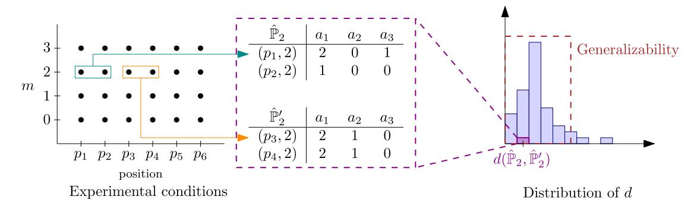
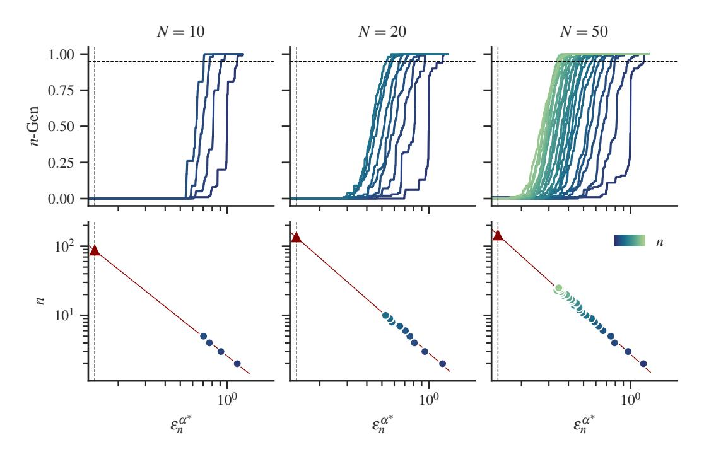
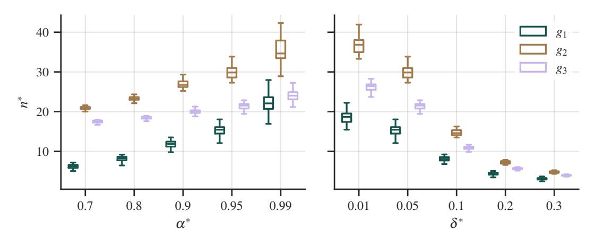
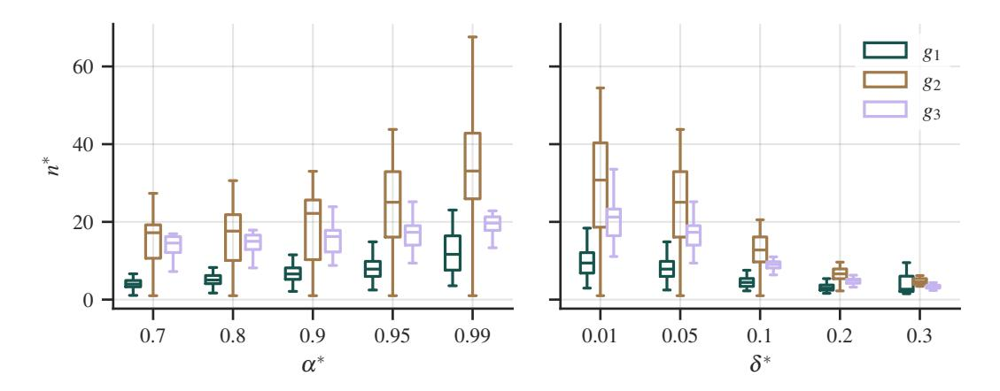
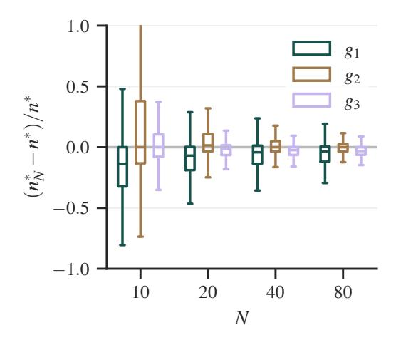
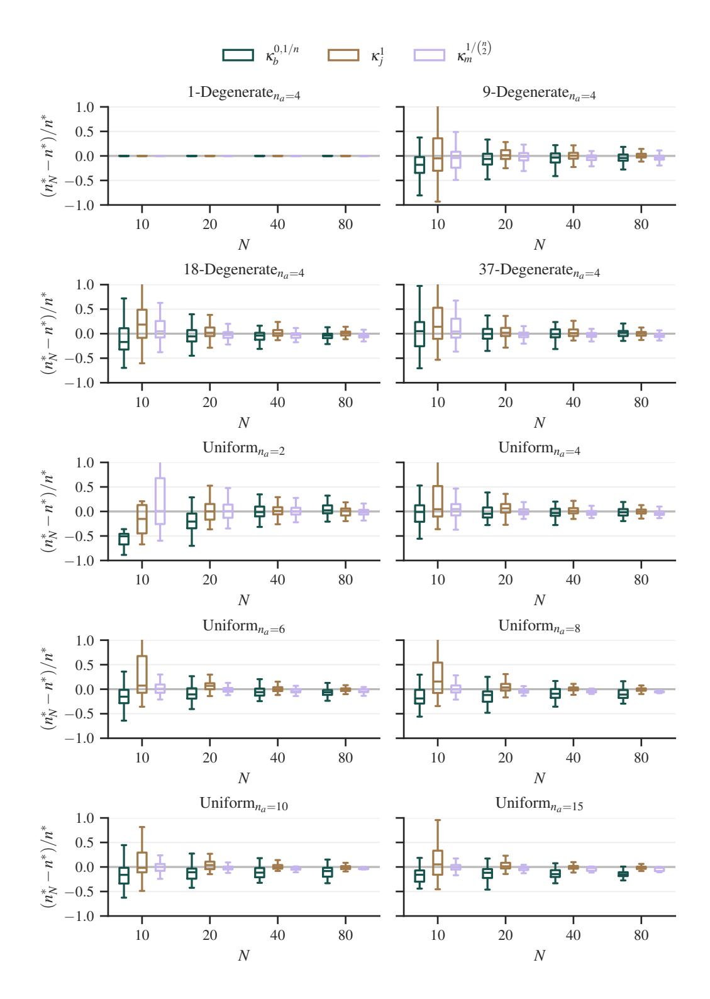
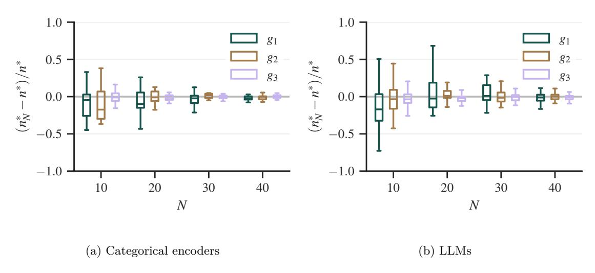

# **Can you trust your experiments? Generalizability of Experimental Studies**

**Federico Matteucci** *federico.matteucci@kit.edu*

*Karlsruhe Institute of Technology*

**Vadim Arzamasov** *vadim.arzamasov@gmail.com*

*Karlsruhe Institute of Technology*

**Jose Cribeiro-Ramallo** *jose.cribeiro@kit.edu*

*Karlsruhe Institute of Technology*

**Marco Heyden** *marco.heyden@kit.edu*

*Karlsruhe Institute of Technology*

**Kostantin Ntounas**

*Karlsruhe Institute of Technology*

**Klemens Böhm** *klemens.boehm@kit.edu*

*Karlsruhe Institute of Technology*

# **Abstract**

Experimental studies are a cornerstone of Machine Learning (ML) research. A common and often implicit assumption is that the study's results will generalize beyond the study itself, e.g., to new data. That is, repeating the same study under different conditions will likely yield similar results. Existing frameworks to measure generalizability, borrowed from the casual inference literature, cannot capture the complexity of the results and the goals of an ML study. The problem of measuring generalizability in the more general ML setting is thus still open, also due to the lack of a mathematical formalization of experimental studies. In this paper, we propose such a formalization, use it to develop a framework to quantify generalizability, and propose an instantiation based on rankings and the Maximum Mean Discrepancy. We show how this latter offers insights into the desirable number of experiments for a study. Finally, we investigate the generalizability of two recently published experimental studies.

# **1 Introduction**

Experimental studies are a cornerstone of Machine Learning (ML) research. Due to their importance, the community advocates for high methodological standards when performing, evaluating, and sharing studies [\(Hothorn et al., 2005;](#page-13-0) [Huppler, 2009;](#page-13-1) [Montgomery, 2017\)](#page-13-2).

The quality of an experimental study depends on multiple aspects. First, the experimenter should properly define the *scope* and the *goals* of the study. Particular attention must be given to the choice of benchmarked methods and experimental conditions [\(Boulesteix et al., 2015;](#page-12-0) [Bouthillier et al., 2021;](#page-12-1) [Dehghani et al., 2021\)](#page-12-2). Second, the study should be *reproducible* by independent parties and hence contain the necessary documentation. This aspect has recently drawn much attention due to the so-called reproducibility crisis [\(Baker,](#page-12-3) [2016;](#page-12-3) [Gundersen et al., 2023;](#page-13-3) [Peng, 2011;](#page-14-0) [Raff, 2023;](#page-14-1) [2021\)](#page-14-2). Third, the results of the study should be sensibly analyzed to draw conclusions regarding, for instance, the *significance* of the findings [\(Benavoli et al., 2017;](#page-12-4) [Corani et al., 2017;](#page-12-5) [Demsar, 2006\)](#page-12-6). Finally, the *generalizability* of a study concerns how well its results are replicated under unseen experimental conditions, such as datasets not considered in the study [\(National](#page-14-3) [Academies of Science \(2019\);](#page-14-3) [Findley et al., 2021;](#page-13-4) [Pineau et al., 2021\)](#page-14-4). The latter two aspects are also known as the internal and external validity of a study. Generalizability and significance, although sometimes confused, are two independent aspects of a study [\(Findley et al., 2021\)](#page-13-4). On the one hand, significant findings may not generalize to other conditions; on the other hand, results might consistently be not significant.

Generalizability captures how close the results are *between* two different samples of experiments. Generalizability is, conceptually, closely related to model replicability. A model is *ρ*-replicable if, given i.i.d. samples from the same data distribution, the trained models are the same with probability 1 − *ρ* [\(Impagliazzo et al.,](#page-13-5) [2022\)](#page-13-5). An experimental study is generalizable if, when repeated under different experimental conditions, the results are similar with high probability [\(National Academies of Science \(2019\)\)](#page-14-3). A quantifiable notion of generalizability thus requires a formalization of experimental studies, of their results, and of similarity between results.

Significance, instead, captures how strong the findings are *within* the specific sample of experiments performed. Multiple publications have shown how different choices of experimental conditions can lead to very different results [\(Benavoli et al., 2017;](#page-12-4) [Boulesteix et al., 2017;](#page-12-7) [Bouthillier et al., 2021;](#page-12-1) [Dehghani et al., 2021;](#page-12-2) [Gundersen et al., 2022;](#page-13-6) [Mechelen et al., 2023\)](#page-13-7). Some recent experimental studies have also reported this phenomenon. [Matteucci et al.](#page-13-8) [\(2023\)](#page-13-8) discuss how previous studies on categorical encoders disagree on the best-performing ones, even when the results are significant. Similarly, [Lu et al.](#page-13-9) [\(2023\)](#page-13-9) re-evaluated coreset learning methods and found that all of the methods they considered did not beat a naïve baseline.

Quantifying generalizability can also help determine the appropriate size of experimental studies. While one dataset is intuitively not enough to draw generalizable conclusions (unless all experiments have the same outcome), 10<sup>6</sup> datasets likely are. Of course, such large studies are usually not practical: it is crucial to determine the minimum amount of data needed to achieve generalizability. This principle also applies to other experimental factors, such as initialization seed, task, or quality metric.

Our contributions are the following:

- 1. We introduce a novel measure-theoretic formalization of experimental studies.
- 2. We propose a quantifiable definition of the generalizability of experimental studies.
- 3. We develop an algorithm to estimate the size of a study to obtain generalizable results.
- 4. We analyze two recent experimental studies, [Matteucci et al.](#page-13-8) [\(2023\)](#page-13-8); [Srivastava et al.](#page-14-5) [\(2023\)](#page-14-5), and show how well their results generalize.
- 5. We publish the genexpy[1](#page-1-0)[2](#page-1-1) Python module to repeat our analysis in other studies.

Paper outline: Section [2](#page-1-2) discusses the related work, Section [3](#page-2-0) formalizes experimental studies, Section [4](#page-4-0) defines generalizability and provides the algorithm to estimate the required size of a study for generalizability, Section [5](#page-7-0) contains the case studies, and Section [6](#page-11-0) describes the limitations and concludes.

# <span id="page-1-2"></span>**2 Related work**

We first discuss the literature related to the problem we are tackling, i.e., why experimental studies may not generalize. Second, we overview the existing concept of model replicability, closely related to our work. Finally, we show other meanings that these words can assume in other domains.

**Non-generalizable results.** It is well known that experimental results can significantly vary based on design choices [\(Lu et al., 2023;](#page-13-9) [Matteucci et al., 2023;](#page-13-8) [Qin et al., 2023;](#page-14-6) [McElfresh et al., 2022\)](#page-13-10). Possible reasons include an insufficient number of datasets [\(Dehghani et al., 2021;](#page-12-2) [Matteucci et al., 2023;](#page-13-8) [Alvarez](#page-11-1) [et al., 2022;](#page-11-1) [Boulesteix et al., 2015\)](#page-12-0) as well as differences in hyperparameter tuning [\(Bouthillier et al., 2021;](#page-12-1) [Matteucci et al., 2023\)](#page-13-8), initialization seed [\(Gundersen et al., 2023\)](#page-13-3), and hardware [\(Zhuang et al., 2022\)](#page-14-7). As a result, the statistical benchmarking literature advocates for experimenters to motivate their design choices [\(Bartz-Beielstein et al., 2020;](#page-12-8) [Mechelen et al., 2023;](#page-13-7) [Boulesteix et al., 2017;](#page-12-7) [Bouthillier et al., 2021;](#page-12-1)

<span id="page-1-0"></span><sup>1</sup><https://anonymous.4open.science/r/genexpy-B94D>

<span id="page-1-1"></span><sup>2</sup>The module will be published on PyPI after acceptance.

<span id="page-2-2"></span>

Figure 1: Generalizability of the "checkmate-in-one" task (Example [3.1\)](#page-2-1), as the probability that two substudies yield similar results. A result is a distribution of rankings. Note that the design factor (*m*) is fixed, while the generalizability factor (position) varies.

[Montgomery, 2017\)](#page-13-2) and clearly state the hypotheses they are attempting to test with their study [\(Bartz-](#page-12-8)[Beielstein et al., 2020;](#page-12-8) [Moran et al., 2023\)](#page-14-8).

**Replicability and generalizability in ML.** Our work formalizes and extends the definitions of replicability and generalizability given in [Pineau et al.](#page-14-4) [\(2021\)](#page-14-4) and [National Academies of Science \(2019\).](#page-14-3) Intuitively, replicable work consists of repeating an experiment on different data, while generalizable work varies other factors as well—e.g., task, seed. In ML, these terms are usually associated to learning algorithms rather than experimental studies. A generalizable model has small generalization error on unseen data [\(McElfresh](#page-13-10) [et al., 2022\)](#page-13-10), while a replicable model learns the same parameters from different i.i.d. samples [\(Impagliazzo](#page-13-5) [et al., 2022\)](#page-13-5). Model replicability is also linked to model stability, differential privacy, generalization error, and global stability [\(Bun et al., 2023;](#page-12-9) [Chase et al., 2023;](#page-12-10) [Ghazi et al., 2023;](#page-13-11) [Moran et al., 2023;](#page-14-8) [Dixon et al.,](#page-13-12) [2023\)](#page-13-12).

**External validity.** The external validity of a study is a well-studied concept in the context of causal inference, its main applications being in the social and political sciences [\(Campbell, 1957\)](#page-12-11). In general, the external validity of a study performed concerns whether repeating a study on different samples affects the validity of its findings. Generalizability, opposed to transportability, concerns the external validity of results when the samples come from the same population [\(Findley et al., 2021\)](#page-13-4). Existing methods assess the signand effect-generalization of the treatment on some response variable [\(Egami & Hartman, 2023\)](#page-13-13). They are thus not applicable to our use-case of ML experimental studies, for which there is—arguably—no treatment and no response variable.

# <span id="page-2-0"></span>**3 Experiments and experimental studies**

An *experimental study* is a collection of *experiments* comparing the same *alternatives* under different *experimental conditions*. An experimental condition is a tuple of *levels* of *experimental factors*, the parameters defining the experiments. The study aims at answering a *research question*, which defines its *scope* and *goals*.

<span id="page-2-1"></span>*Example* 3.1*.* (The "checkmate-in-one" task, cf. Figure [1\)](#page-2-2) An experimenter wants to compare three Large Language Models (LLMs), the *alternatives*, on the "checkmate-in-one" task [\(Srivastava et al., 2023;](#page-14-5) [Am](#page-12-12)[manabrolu et al., 2019;](#page-12-12) [2020;](#page-12-13) [Dambekodi et al., 2020\)](#page-12-14). The assignment is to find the unique checkmating move from a position of pieces on a chessboard: an LLM succeeds if and only if it outputs the correct move. The experimenter considers two *experimental factors*: the number of shots, *m*, and the initial position on the chessboard, *p<sup>l</sup>* .

The experimenter wants to find if LLM *a*<sup>1</sup> ranks consistently (in the same position) against the other two LLMs when changing the initial position, for a fixed number of shots.

## <span id="page-3-0"></span>3.1 Experiments

An experiment evaluates all the *alternatives* under a valid experimental condition. The result of an experiment is an element of some result space.

**Alternatives.** An alternative  $a \in A$  is an object evaluated in the study, like an LLM in Example 3.1. We call A the finite set of alternatives considered in the study, with cardinality  $n_a$ .

**Experimental factors.** An experimental factor is anything that may affect the result of an experiment. We use i to denote a factor,  $C_i$  the (possibly infinite) set of levels that i can take,  $c \in C_i$  a level of i, and I the set of all factors.

We adapt Montgomery's classification of experimental factors (Montgomery, 2017, Chapter 1) and distinguish between the *held-constant*, *design*, and *generalizability* factors of a study.

- *Held-constant factors* are presumed not to significantly impact the results, they are hence out of the study's scope and are fixed to a single level; examples are "programming language" or "number of cross-validated folds".
- Design factors are expected to significantly impact the results and have a relatively small set of levels; examples are "quality metric" or "number of shots".
- Generalizability factors  $(I_{\rm gen})$  have a larger number of levels. The experimenter wants to obtain results that generalize to unseen levels of these factors; examples are "dataset" or "chessboard position".

The same factor may play different roles in different studies, according to the studies' objectives (Montgomery, 2017, Chapter 1). For instance, "seed" is a generalizability factor in reinforcement learning studies such as Nauman et al. (2024), as it typically plays a large role in determining the performance of such algorithms. On the other hand, "seed" is a held-constant factor in Matteucci et al. (2023), as the effect of changing the seed is not of interest for the experimenters.

**Experimental conditions.** An experimental condition  $\mathbf{c}$  is a tuple of levels of all experimental factors,  $\mathbf{c} = (c_i)_{i \in I} \in C \subseteq \prod_{i \in I} C_i$ .

We endow C with the product probability measure  $\mu^C = \bigotimes_{i \in I} \mu_i$ , where  $\mu_i$  is a probability measure on  $C_i$ .

For instance, if i is "dataset" and  $C_i \subseteq \mathbb{R}^{k \times d}$  for some  $k, d \in \mathbb{N}$ , then  $\mu_i$  measures the probability of subsets of  $\mathbb{R}^{k \times d}$ .

If, instead, i is a held-constant factor with  $C_i = \{c\}$ , then  $\mu_i$  is  $\mu_i : \{c\} \mapsto 1$ . The probability space  $(C, \mathcal{F}_C, \mu^C)$  is the universe of valid experimental conditions. In our formalization, it plays the role of the sample space for the experiment function  $E^Q$  (Section 3.2).

We finally assume that one can fix the levels of the experimental factors independently, as long as the resulting experimental condition is in C.

Example 3.1 (Continued).  $C = \{(p_l, m)\}_{l,m}$ , where  $p_l$  is a legal configuration of pieces on a chessboard and m is the non-negative number of shots.

**Experimental results.** We define the *result space* as  $(\mathcal{X}, \mathcal{B}_{\mathcal{X}})$ , where  $\mathcal{X}$  is a separable topological space and  $\mathcal{B}_{\mathcal{X}}$  is the Borel  $\sigma$ -algebra on  $\mathcal{X}$ . For instance, if the experimenter is interested in the raw performances of the alternatives on some learning task,  $(\mathcal{X}, \mathcal{B}_{\mathcal{X}}) = (\mathbb{R}^{n_a}, \mathcal{B}_{\mathbb{R}^{n_a}})$ .

Example 3.1 (Continued). As the goal of the experiment involves ranking the LLMs, the experimenter defines the result of an experiment on  $(p_l, m)$  as a ranking of the three LLMs, according to whether or not they output the checkmating move. Suppose that only  $a_1$  and  $a_2$  output the correct move. Then, the result is (0, 0, 1), where  $a_1$  and  $a_2$  are tied best.

## <span id="page-4-1"></span>3.2 Experimental studies

A study is defined by its research question Q, i.e., its scope and goals. The scope consists of the alternatives A, the valid experimental conditions C, the generalizability factors  $I_{\text{gen}}$ , and the result space  $\mathcal{X}$ . The goal specifies the kind of conclusion one is attempting to draw from the study. We propose a model of the goals in Section 4.2.

**Definition 3.1** (Research question). The research question is a tuple  $Q = (A, C, I_{gen}, \mathcal{X}, goals)$ .

Example 3.1 (Continued). The research question of the "checkmate-in-one" study is as follows. The scope is given by  $A = \{a_1, a_2, a_3\}$ ,  $C = \{(p_l, m)\}_{l,m}$ ,  $I_{\text{gen}} = \{\text{"position"}\}$ , and  $\mathcal{X}$  the set of rankings of 3 alternatives. The goal is "Is  $a_1$  consistently in the same position of the ranking?"

To model the results, we introduce the experiment function  $E^Q:(C,\mathcal{F}_C,\mu^C)\to(\mathcal{X},\mathcal{B}_{\mathcal{X}})$ , which evaluates all of the alternatives in A under a valid experimental condition. We also assume that  $E^Q$  is a measurable function or, equivalently, a random variable with sample space C. We can thus sample from  $E^Q$ . The result of the study on a research question Q is then the distribution of  $E^Q$ : since  $E^Q$  is not necessarily injective, we assign higher probability to those results that appear more often.

**Definition 3.2** (Result of a study). The result of the study on Q is the pushforward probability induced by the experiment function  $E^Q$ ,

$$\begin{split} \mathbb{P}^Q &:= E^Q_* \mu^C : \mathcal{B}_{\mathcal{X}} \to [0,1] \\ Y &\mapsto \mu^C \left( E^{Q^{-1}}(Y) \right), \end{split}$$

where  $E^{Q^{-1}}(Y) = \{\mathbf{c} : E^Q(\mathbf{c}) \in Y\} \in \mathcal{F}_C$  is the preimage of Y.

In practice, as C might be infinite or too large, one can only run experiments under n experimental conditions and obtain a sample  $\hat{E}_n^Q \sim \mathbb{P}^Q$  of size n. We call this an *empirical study of size* n on Q and denote the empirical distribution of  $\hat{E}_n^Q$  with  $\hat{\mathbb{P}}_n^Q$ . To keep the notation clean and unless necessary, we omit Q.

#### <span id="page-4-0"></span>4 Generalizability of experimental studies

The currently accepted definition of generalizability is the property of two independent studies with the same research question to yield similar results, see National Academies of Science (2019) and Pineau et al. (2021). Although intuitive, this notion is not practically useful as it cannot be assessed objectively.

We thus propose the following quantifiable definition of generalizability based on our framework (cf. Section 3.1)

<span id="page-4-2"></span>**Definition 4.1** (Generalizability). Let  $Q = (A, C, I_{\text{gen}}, \mathcal{X}, \text{goals})$  be a research question, let  $\mathbb{P}$  be the result of the corresponding study, and let d be a distance between probability distributions. The n-generalizability of the study on Q is

<span id="page-4-3"></span>
$$n\text{-Gen}(Q;\varepsilon) := \mathbb{P}^n \otimes \mathbb{P}^n \left( (X_j)_{j=1}^n, (Y_j)_{j=1}^n : d(X,Y) \le \varepsilon \right), \tag{1}$$

where  $\varepsilon \in \mathbb{R}^+$  is a dissimilarity threshold.

Intuitively, the *n*-generalizability is the probability for any two empirical studies of size n on Q to yield "similar" results, as defined by d and  $\varepsilon$ . We discuss in Section 4.4 how to interpretably choose a value for  $\varepsilon$ .

Definition 4.1 is very flexible and allows for different choices of the result space  $\mathcal{X}$ , the goals, and the distance d. The rest of this section proposes a particular instantiation, base on the Maximum Mean Discrepancy (Gretton et al., 2006), which allows for different choices of the experimental space  $\mathcal{X}$  and goals.

## 4.1 Experimental results: Rankings with ties

Experimental results can be formalized in different ways, such as raw performance metrics, time series, or rankings. Among these, rankings are arguably one of the most natural forms:

- Rankings are already widely used for non-parametric tests such as Friedman, Nemenyi, and Conover-Iman (Demsar, 2006; Conover & Iman, 1982).
- (ii) Rankings do not suffer from experimental-condition-fixed effects, such as a dataset being inherently easier to solve than another one. Even though there are multiple ways to deal with these effects, there is no preferred one in the literature. See, for instance, the consensus ranking problem (Matteucci et al., 2023; Nießl et al., 2022).
- (iii) Rankings allow the definition of interpretable kernels to formalize different goals of a study, as we illustrate in Section 4.2.

We define rankings (with ties) in the following way.

**Definition 4.2** (Ranking). A ranking r on A is a transitive and reflexive binary endorelation on A. Equivalently, r is a totally ordered partition of A into *tiers* of equivalent alternatives. r(a) denotes the rank of  $a \in A$ , i.e., the position of the tier of a in the ordering. W.l.o.g., we use  $\mathcal{R}_{n_a}$  for the space of rankings of  $n_a$  alternatives.

#### <span id="page-5-0"></span>4.2 Goals: Kernels

Goals act as lenses, focusing on specific aspects of the results that are of interest for the experimenter. For instance, consider the goal in Example 3.1:

"Is  $a_1$  consistently in the same position of the ranking?". In this case, the goal solely focuses on  $a_1$ 's position in the rankings, ignoring the positions of  $a_2$  and  $a_3$ . Changing the goal of a study can thus heavily impact how the results are analyzed. Within our framework, we formalize for goals as kernels on the result space, i.e., positive definite symmetric functions. In the following, we describe three kernels for rankings, covering three representative goals.

**Borda kernel.** The Borda kernel is suitable for goals in the form "Is alternative  $a^*$  consistently ranked the same?".

It uses the Borda count, defined as the number of alternatives (weakly) dominated by a given one (Borda, 1781). For a pair of rankings, we compute the Borda counts of  $a^*$  and then take their difference.

$$\kappa_b^{a^*,\nu}(r_1,r_2) = e^{-\nu|b_1-b_2|},$$

where  $b_l = |\{a \in A : r_l(a) > r_l(a^*)\}|$ 

is the number of alternatives dominated by  $a^*$  in  $r_l$  and  $\nu \in \mathbb{R}^+$ . The Borda kernel takes values in  $[e^{-\nu n_a}, 1]$ . If  $\nu$  is too large compared to  $1/|b_1-b_2|$ ,

the kernel is oversensitive and will heavily penalize even small differences. On the contrary, if  $\nu$  is too small, the kernel is undersensitive and will not penalize deviations unless they are very large. As  $|b_1 - b_2| \in [0, n_a]$ , we recommend  $\nu = 1/n_a$ .

**Jaccard kernel.** The Jaccard kernel is suitable for goals in the form "Are the best alternatives consistently the same ones?". As it measures the similarity between sets (Gärtner et al., 2006; Bouchard et al., 2013), we use it to compare the top-k tiers of two rankings.

$$\kappa_j^k\left(r_1,r_2\right) = \frac{\left|r_1^{-1}([k]) \cap r_2^{-1}([k])\right|}{\left|r_1^{-1}([k]) \cup r_2^{-1}([k])\right|},$$

where  $r^{-1}([k]) = \{a \in A : r(a) \le k\}$  is the set of alternatives with rank lower than or equal to k. The Jaccard kernel takes values in [0,1].

Mallows kernel. The Mallows kernel is suitable for goals in the form "Are the alternatives ranked consistently?". It measures the overall similarity between rankings (Jiao & Vert, 2018; Mania et al., 2018; Mallows, 1957). We adapt the original definition in (Mallows, 1957) for ties,

$$\kappa_m^{\nu}(r_1, r_2) = e^{-\nu n_d},$$

where  $n_d = \sum_{a_1,a_2 \in A} |\operatorname{sign}(r_1(a_1) - r_1(a_2)) - \operatorname{sign}(r_2(a_1) - r_2(a_2))|$  is the number of discordant pairs and  $\nu \in \mathbb{R}^+$ . If a pair is tied in one ranking but not in the other, one counts it as half a discordant pair. The Mallows kernel takes values in  $\left[\exp\left(-2\nu\binom{n_a}{2}\right), 1\right]$ . If  $\nu$  is too large compared to  $1/n_d$ , the kernel is oversensitive and it will heavily penalize even small differences. On the contrary, if  $\nu$  is too small, the kernel is undersensitive and will not penalize deviations unless they are very large. As  $n_d \in \left[0, \binom{n_a}{2}\right]$ , we recommend  $\nu = 1/\binom{n_a}{2}$ .

The following example illustrates the three kernels.

Example 4.1. Consider two rankings  $\mathbf{r} = (0, 0, 0)$  and  $\mathbf{s} = (0, 1, 1)$ , where  $x_j$  is the rank of the j-th alternative. To understand their impact on generalizability, consider a study whose result is a distribution assigning both  $\mathbf{r}$  and  $\mathbf{s}$  probability 1/2.

For the goal corresponding to the Borda kernel,  $\mathbf{r}$  and  $\mathbf{s}$  answer the research question consistently as  $a_1$  weakly dominates all alternatives in both rankings. Hence, the Borda kernel takes a value of 1 and the study is perfectly generalizable. For the Jaccard and Mallows goals, instead, the two rankings are either very different ( $\kappa_j^1(r_1, r_2) \approx 0.33$ ) or slightly different ( $\kappa_m^{1/n_a^2}(r_1, r_2) \approx 0.72$ ). Thus, we conclude that the study is more generalizable w.r.t. the Mallows kernel than the Jaccard kernel.

# <span id="page-6-2"></span>4.3 Distance between experimental results: Maximum Mean Discrepancy

In the previous sections, we have formalized an experimental study, its results, and its goals. The last open point before applying (1) in practice is a definition of d, a distance between probability distributions. Such a distance should satisfy the following requirements. First, it should take into consideration the goal of a study. Second, it should handle sparse distributions well: empirical studies are typically very small compared to the number of all possible rankings, which grows super-exponentially in the number of alternatives.<sup>3</sup> Third, it should provide a way to indicate the amount of experiments needed to achieve n-generalizable results. A distance satisfying the above requirements is the Maximum Mean Discrepancy (MMD) (Gretton et al., 2006; 2012).

**Definition 4.3** (MMD). Let  $\mathcal{X}$  be a set with a kernel  $\kappa$ , and let  $\mathbb{Q}_1$  and  $\mathbb{Q}_2$  be two probability distributions on  $\mathcal{X}$ . Let  $\mathbf{x} = (x_i)_{i=1}^n \sim \mathbb{Q}_1$ ,  $\mathbf{y} = (y_i)_{i=1}^m \sim \mathbb{Q}_2$ .

$$MMD(\mathbf{x}, \mathbf{y})^{2} := \frac{1}{n^{2}} \sum_{i,j=1}^{n} \kappa(x_{i}, x_{j}) + \frac{1}{m^{2}} \sum_{i,j=1}^{m} \kappa(y_{i}, y_{j}) - \frac{2}{mn} \sum_{\substack{i=1...n\\j=1...m}} \kappa(x_{i}, y_{j}).$$

Finally, there remains the choice of an appropriate  $\varepsilon^*$  to use in (1), which is hardly interpretable. The following result relates the range of the MMD and the infimum and supremum of the kernel.

**Proposition 4.1.** The MMD takes values in  $\left[0, \sqrt{2 \cdot (\kappa_{sup} - \kappa_{inf})}\right]$ , where  $\kappa_{sup} = \sup_{x,y \in X} \kappa(x,y)$  and  $\kappa_{inf} = \inf_{x,y \in X} \kappa(x,y)$ .

Using a similar approach, we propose to replace  $\varepsilon^*$  with a condition on the desired minimum expected value of the kernel:

<span id="page-6-1"></span>
$$\varepsilon^*(\delta^*) = \sqrt{2(\kappa_{\text{sup}} - f_{\kappa}(\delta^*))},\tag{2}$$

where  $f_{\kappa}$  is a kernel-specific function and  $\delta^*$  is an interpretable parameter. We now discuss them for the three kernels discussed in Section 4.2 with their recommended parameters.

<span id="page-6-0"></span><sup>&</sup>lt;sup>3</sup>Fubini or ordered Bell numbers, https://oeis.org/A000670.

- Borda kernel.  $\delta^*$  is the difference between the fraction of dominated alternatives between two rankings;  $f_{\kappa_h}(x) = e^{-x}$ .
- Jaccard kernel.  $\delta^*$  is the Jaccard coefficient between the top-k tiers of two rankings;  $f_{\kappa_i}(x) = 1 x$ .
- Mallows kernel.  $\delta^*$  is the fraction of discordant pairs;  $f_{\kappa_m}(x) = e^{-x}$ .

As a concrete example, achieving ( $\alpha^* = 0.90, \delta^* = 0.05$ )-generalizable results for the Jaccard kernel means that, w.p. 0.90, the average Jaccard coefficient between two rankings drawn from the results is at least 0.95.

#### <span id="page-7-1"></span>4.4 How many experiments ensure generalizability?

When designing a study, the experimenter has to decide how many experiments to run in order to obtain generalizable results. In other words, they need to choose a (minimum) sample size  $n^*$  that achieves the desired generalizability  $\alpha^*$  for a given threshold  $\varepsilon^*$ .

$$n^* = \min \left\{ n \in \mathbb{N} : n\text{-Gen}(Q; \varepsilon^*) \ge \alpha^* \right\}. \tag{3}$$

Example 4.2. The experimenter wants to obtain results in which, with probability 0.99,  $a_1$  dominates the same number of alternatives up to a difference of 1. They therefore choose the Borda kernel with  $\nu = 1/n_a$ ,  $\delta^* = 1/3$ , and  $\varepsilon^* = \sqrt{2}\sqrt{1 - e^{-0.33}}$  as in (2). How many experiments are enough?

Let now  $\varepsilon_n^{\alpha^*}$  be the  $\alpha^*$ -quantile of the MMD. To estimate  $n^*$ , we use a linear dependency between  $\log(n)$  and  $\log(\varepsilon_n^{\alpha^*})$ , which we have observed in our experiments; see, for instance, Figure 2. In particular, for any distribution  $\mathbb P$  and choice of  $\alpha^* \in [0,1]$ , there exist  $\beta_0, \beta_1 \in \mathbb R$ ,  $\beta_i = \beta_i(\alpha^*, \mathbb P)$ , s.t.

<span id="page-7-3"></span><span id="page-7-2"></span>
$$\log(n) = \beta_1 \log\left(\varepsilon_n^{\alpha^*}\right) + \beta_0. \tag{4}$$

Appendix A.3.1 provides a proof for the distribution-free case. Equation (4) suggests that one can use a small set of N preliminary experiments to estimate  $n^*$ . The estimate can then be improved by adding more experiments. On this result is based Algorithm 1, whose working is illustrated in Figure 2.

# <span id="page-7-0"></span>5 Case studies

#### 5.1 Case Study 1: A benchmark of categorical encoders

We now evaluate the generalizability of a recent study (Matteucci et al., 2023) that analyzes the performance of encoders for categorical data. The performance of an encoder is approximated by the quality of a model trained on the encoded data.

The design factors are the model, the tuning strategy for the pipeline, and the quality metric for the model, while the only generalizability factor is the dataset.

We impute missing values in the results of the study by assigning the worst rank.

We evaluate how well the results of the study generalize w.r.t. three goals:

- $(g_1)$  Find out if the one-hot encoder (a popular encoder) ranks consistently amongst its competitors, using the Borda kernel with  $\nu = 1/n_a$ .
- $(g_2)$  Investigate if some encoders outperform all the others using the Jaccard kernel with k=1.
- $(g_3)$  Evaluate whether the encoders are ranked in a similar order, using the Mallows kernel with  $\nu = 1/\binom{n_2}{2}$ .

Figure 3 shows the predicted  $n^*$  for different choices of  $\alpha^*$  and  $\delta^*$ , the other one fixed at 0.95 and 0.05 respectively. The variance in the boxes comes from variance in the design factors. For example, the results for the design factors "decision tree, full tuning, accuracy" have a different  $(\alpha^*, \delta^*)$ -generalizability than the results for "SVM, no tuning, accuracy". We observe on the left that—as expected—obtaining generalizable results requires more experiments as the desired generalizability  $\alpha^*$  increases. We can also see that the

### <span id="page-8-0"></span>Algorithm 1 Run the necessary amount of experiments

```
Require: \alpha^*

▷ desired generalizability

Require: \delta^*
                                                                                                                ▷ similarity threshold on rankings
Require: Q
                                                                                                         \triangleright research question, Q = (A, C, I_{gen}, \kappa)
Require: N
                                                                                                                    > number of initial experiments
                                                                                                             \triangleright number of additional experiments
Require: N_{\text{step}}
Require: n_{\text{rep}}
                                                                ▷ number of repetitions to estimate the distribution of the MMD
   procedure EstimateNstar(\alpha^*, \delta^*, Q, N, n_{\text{max}}, n_{\text{rep}})
        n_N^* \leftarrow \infty
        while N < n_N^* do
             Run N experiments and get their results \hat{\mathbb{P}}_N
             \varepsilon^* \leftarrow f_{\kappa}(\delta^*)
                                                                                                                                           ▷ cf. Section 4.4
             n_{\text{max}} \leftarrow \lfloor N/2 \rfloor
                                                                                   \triangleright we need two disjoint samples of size n_{\max} from \hat{\mathbb{P}}_N
              for n = 1 \dots n_{\text{max}} do
                   mmds \leftarrow empty list
                   for n = 1 \dots n_{\text{rep}} do
                        sample without replacement (x_j)_{j=1}^{2n} \sim \hat{\mathbb{P}}_N
                       \mathbf{x} \leftarrow (x_j)_{j=1}^n \\ \mathbf{y} \leftarrow (x_j)_{j=n+1}^{2n}
                                                                                                                          ▶ split into disjoint samples
                        append MMD(\mathbf{x}, \mathbf{y}) to mmds
                   \varepsilon_n^{\alpha^*} \leftarrow \alpha^*-quantile of mmds
              end for
              fit a linear regression \log(n) = \beta_1 \log(\varepsilon_n^{\alpha^*}) + \beta_0
             n_N^* \leftarrow \beta_1 \log(\varepsilon^*) + \beta_0
              N \leftarrow N + N_{\text{step}}
        end while
        return n_N^*
   end procedure
```

variance of the boxes increases with  $\alpha^*$ , meaning that the choice of the design factors has a larger influence on the achieved generalizability. This is also possibly due to tail effects in the estimation of the MMD.

We observe the same when decreasing  $\delta^*$ , as it corresponds to a stricter similarity condition on the rankings. In the rather extreme cases of  $\alpha^* = 0.7$  or  $\delta^* = 0.3$ ,

even less than 10 datasets are enough to achieve  $(\alpha^*, \delta^*)$ -generalizability.

Consider now goal  $g_2$  for two different choices of design factors: (A): "decision tree, full tuning, accuracy" and (B): "SVM, full tuning, balanced accuracy". Furthermore, let  $(\alpha^*, \delta^*) = (0.95, 0.05)$ : we estimate  $n^* = 28$  for (A) and  $n^* = 34$  for (B), corresponding to the bottom and top whiskers of the corresponding box in Figure 3. As both (A) and (B) were evaluated using n = 30 experiments, we conclude that the results of (A) are (barely) (0.95, 0.05)-generalizable, while those of (B) are not. Hence, one should run more experiments with fixed factors (B) to make the study generalizable.

#### 5.2 Case study 2: BIG-bench — A benchmark of Large Language Models

We now evaluate the generalizability of BIG-bench (Srivastava et al., 2023), a collaborative benchmark of Large Language Models (LLMs). The benchmark compares LLMs on different tasks, such as the "checkmate-in-one" task (cf. Example 3.1), and for different numbers of shots. Task and number of shots are the *design factors*. Every task has a number of subtasks, which is the *generalizability factor*. We stick to the preferred scoring for each subtask.

<span id="page-9-0"></span>

Figure 2: Estimation of the required number of experiments *n* ∗ (marked with ▲) from different amounts *N* of preliminary experiments. The dashed lines represent *α* <sup>∗</sup> = 0*.*9 (horizontal) and *ε* <sup>∗</sup> = √ <sup>2</sup>*/*<sup>10</sup> (vertical). We used real data from [Matteucci et al.](#page-13-8) [\(2023\)](#page-13-8) and the Jaccard kernel (Section [4.2\)](#page-5-0).

<span id="page-9-1"></span>

Figure 3: Number of necessary experiments *n* ∗ to achieve generalizability for categorical encoders, for different desired generalizability *α* ∗ , similarity threshold *δ* ∗ , goals *g<sup>i</sup>* . The variation in the plot is due to the combinations of design factors.

As the results have too many missing values to impute them, we only consider the experimental conditions where at least 80% of the LLMs had results, and to the LLMs whose results cover at least 80% of the conditions.

As before, we define three goals:

- (*g*1) Find out if GPT3 (to date, one of the most popular LLMs) ranks consistently amongst its competitors, using the Borda kernel with *ν* = <sup>1</sup>*/<sup>n</sup>a*.
- (*g*2) Investigate if some encoders outperform all the others using the Jaccard kernel with *k* = 1.
- (*g*3) Evaluate whether the LLMs are ranked in a similar order, using the Mallows kernel with *ν* = <sup>1</sup>*/*( *na* <sup>2</sup> ).

<span id="page-10-0"></span>

Figure 4: Number of necessary experiments  $n^*$  to achieve generalizability for LLMs, for different desired generalizability  $\alpha^*$ , similarity threshold  $\delta^*$ , goals  $g_i$ . The variation in the plot is due to the combinations of design factors.

Figure 4 shows the predicted  $n^*$  for different choices of  $\alpha^*$  and  $\delta^*$ , the other one fixed at 0.95 and 0.05 respectively. Again, the variance in the boxes comes from variance in the design factors, i.e., the task and the number of shots. As before, increasing  $\alpha^*$  or decreasing  $\delta^*$  leads to higher  $n^*$ . Unlike in the previous section,  $n^*$  for  $g_2$  greatly depends on the combination of fixed factors, as we now detail.

Consider now goal  $g_2$  for two different choices of design factors: (A): "conlang\_translation, 0 shots", and (B): "arithmetic, 2 shots". Furthermore, let  $(\alpha^*, \delta^*) = (0.95, 0.05)$ . For this choice of parameters, we estimate  $n^* = 44$  for (A), corresponding to the top whisker of the corresponding box in Figure 3. As the study evaluates (A) on 10 subtasks, it is therefore not (0.95, 0.05)-generalizable. In fact, we estimate that this would require 34 more subtasks. For (B), on the other hand, we estimate  $n^* = 1$ : the best 2-shot LLM for the observed subtasks is always PALM 535B. Hence, the result of a single experiment is enough to achieve (0.95, 0.05)-generalizability.

Note that, although we correctly estimated  $n^* = 1$  for (B), this estimate relies on 10 preliminary experiments. In other words, our algorithm was able to quantify in hindsight that a single experiment would have been enough to obtain generalizable results. Of course, however, one cannot trust an estimate of  $n^*$  based on only one experiment. The next section thus investigates how the number of preliminary experiments influences the estimate of  $n^*$ .

#### <span id="page-10-1"></span>5.3 How many preliminary experiments?

We assess the accuracy of our method (cf. Section 4.4) for estimating  $n^*$  from N independent experiments. Our procedure is as follows. First, we select a probability distribution  $\mathbb{P}$  on the set of rankings  $\mathcal{R}_{n_a}$ , representing the true distribution of outcomes. Second, for various values of n, we bootstrap the distribution of MMD( $\mathbb{P}^n$ ,  $\mathbb{P}^n$ ) by repeatedly sampling independently from  $\mathbb{P}$ . We compute  $n^*$  with its definition in (3). To evaluate our estimate, we generate  $N \in \{10, 20, 40, 80\}$  samples and we estimate  $n^*$  from  $\mathbb{P}_N$ , calling it  $n_N^*$ . This procedure is repeated across multiple distributions, with 100 repetitions per distribution.

Figure 5 displays the relative error  $(n_N^*-n^*)/n^*$ : when greater (lower) than zero, it indicates the overestimation (underestimation) of  $n^*$ . Although the specific results vary with the target objective (with goal  $g_2$ , corresponding to the Jaccard kernel, being particularly challenging to estimate), in general,  $n_N^*$  approximates  $n^*$  within 50% in more than 75% of cases, even when N=10. Consequently, our method provides a reliable estimate of  $n^*$  (or at least of its order of magnitude) from as few as 10 preliminary experiments. Appendix B.1 contains additional details regarding the distributions and the results, as well as an application to real data.

<span id="page-11-2"></span>

Figure 5: Relative error of the prediction of  $n^*$  from N preliminary experiments  $(n_N^*)$  for the goals  $g_i$ .

#### <span id="page-11-0"></span>6 Conclusion

**Limitations.** We only investigated the instantiation of our framework based on the MMD, rankings, and kernels for rankings. Keeping the MMD as the cornerstone of an instantation allows different result spaces and goals while potentially maintaining crucial properties such as (4). In this regard, a close formula for the coefficients in (4) would greatly benefit the computational efficiency and the theoretical understanding of our framework.

Future work. First, incorporating information about the experimental conditions into the framework. This would allow to study other aspects of external validity, such as transportability, as well as allow for active learning to choose the next experiments to run. Second, based on our experiments in Section 5.3, we intend to provide guarantees and confidence intervals on the convergence of  $n_N^*$  to  $n^*$ . Third, we dealt with missing evaluations by imputing them. Having kernels that can handle missing evaluations might be beneficial. Fourth, rankings, despite their advantages, do not consider the raw performance difference between alternatives. On the other hand, kernels for raw performances (i.e., for vectors in  $\mathbb{R}^{n_a}$ ) lack an obvious interpretation as the goals of a study. Fuzzy rankings may bridge this gap: performance differences are incorporated into the ranking and the existing kernels for rankings might be adapted to them.

Conclusions. An experimental study is generalizable if, with high probability, its findings will hold under different experimental conditions, e.g., with unseen datasets. Non-generalizable studies might be of limited use or even misleading. This paper is, to our knowledge, the first to develop a quantifiable notion for the generalizability of experimental studies. To achieve this, we formalize experiments, experimental studies, and their results, as well as define an instantiation—rankings and distributions over rankings. Our approach allows us to estimate the number of experiments needed to achieve a desired level of generalizability in new experimental studies. We demonstrate its utility showing generalizable and non-generalizable results in two recent experimental studies.

#### **Acknowledgments**

. . .

#### References

<span id="page-11-1"></span>Maxime Alvarez, Jean-Charles Verdier, D'Jeff K. Nkashama, Marc Frappier, Pierre-Martin Tardif, and Froduald Kabanza. A revealing large-scale evaluation of unsupervised anomaly detection algorithms. CoRR, abs/2204.09825, 2022.

- <span id="page-12-12"></span>Prithviraj Ammanabrolu, William Broniec, Alex Mueller, Jeremy Paul, and Mark O Riedl. Toward automated quest generation in text-adventure games. *arXiv preprint arXiv:1909.06283*, 2019.
- <span id="page-12-13"></span>Prithviraj Ammanabrolu, Wesley Cheung, Dan Tu, William Broniec, and Mark Riedl. Bringing stories alive: Generating interactive fiction worlds. In *Proceedings of the AAAI Conference on Artificial Intelligence and Interactive Digital Entertainment*, 2020.
- <span id="page-12-3"></span>Monya Baker. 1,500 scientists lift the lid on reproducibility. *Nature*, 533(7604), 2016.
- <span id="page-12-8"></span>Thomas Bartz-Beielstein, Carola Doerr, Jakob Bossek, Sowmya Chandrasekaran, Tome Eftimov, Andreas Fischbach, Pascal Kerschke, Manuel López-Ibáñez, Katherine M. Malan, Jason H. Moore, Boris Naujoks, Patryk Orzechowski, Vanessa Volz, Markus Wagner, and Thomas Weise. Benchmarking in optimization: Best practice and open issues. *CoRR*, abs/2007.03488, 2020.
- <span id="page-12-4"></span>Alessio Benavoli, Giorgio Corani, Janez Demsar, and Marco Zaffalon. Time for a change: a tutorial for comparing multiple classifiers through bayesian analysis. *J. Mach. Learn. Res.*, 18:77:1–77:36, 2017.
- <span id="page-12-16"></span>Jean-Charles de Borda. Memoire sur les elections au scrutin. *Histoire de l'Academie Royale des Sciences*, 1781.
- <span id="page-12-17"></span>Mathieu Bouchard, Anne-Laure Jousselme, and Pierre-Emmanuel Doré. A proof for the positive definiteness of the jaccard index matrix. *International Journal of Approximate Reasoning*, 54(5):615–626, 2013.
- <span id="page-12-0"></span>Anne-Laure Boulesteix, Robert Hable, Sabine Lauer, and Manuel JA Eugster. A statistical framework for hypothesis testing in real data comparison studies. *The American Statistician*, 69(3):201–212, 2015.
- <span id="page-12-7"></span>Anne-Laure Boulesteix, Rory Wilson, and Alexander Hapfelmeier. Towards evidence-based computational statistics: lessons from clinical research on the role and design of real-data benchmark studies. *BMC Medical Research Methodology*, 17:1–12, 2017.
- <span id="page-12-1"></span>Xavier Bouthillier, Pierre Delaunay, Mirko Bronzi, Assya Trofimov, Brennan Nichyporuk, Justin Szeto, Nazanin Mohammadi Sepahvand, Edward Raff, Kanika Madan, Vikram Voleti, Samira Ebrahimi Kahou, Vincent Michalski, Tal Arbel, Chris Pal, Gaël Varoquaux, and Pascal Vincent. Accounting for variance in machine learning benchmarks. In *MLSys*. mlsys.org, 2021.
- <span id="page-12-9"></span>Mark Bun, Marco Gaboardi, Max Hopkins, Russell Impagliazzo, Rex Lei, Toniann Pitassi, Satchit Sivakumar, and Jessica Sorrell. Stability is stable: Connections between replicability, privacy, and adaptive generalization. In *STOC*, pp. 520–527. ACM, 2023.
- <span id="page-12-11"></span>Donald T Campbell. Factors relevant to the validity of experiments in social settings. *Psychological Bulletin*, 1957.
- <span id="page-12-10"></span>Zachary Chase, Shay Moran, and Amir Yehudayoff. Stability and replicability in learning. In *FOCS*, pp. 2430–2439. IEEE, 2023.
- <span id="page-12-15"></span>William J Conover and Ronald L Iman. Analysis of covariance using the rank transformation. *Biometrics*, 1982.
- <span id="page-12-5"></span>Giorgio Corani, Alessio Benavoli, Janez Demsar, Francesca Mangili, and Marco Zaffalon. Statistical comparison of classifiers through bayesian hierarchical modelling. *Mach. Learn.*, 106(11):1817–1837, 2017.
- <span id="page-12-14"></span>Sahith Dambekodi, Spencer Frazier, Prithviraj Ammanabrolu, and Mark O Riedl. Playing text-based games with common sense. *arXiv preprint arXiv:2012.02757*, 2020.
- <span id="page-12-2"></span>Mostafa Dehghani, Yi Tay, Alexey A. Gritsenko, Zhe Zhao, Neil Houlsby, Fernando Diaz, Donald Metzler, and Oriol Vinyals. The benchmark lottery. *CoRR*, abs/2107.07002, 2021.
- <span id="page-12-6"></span>Janez Demsar. Statistical comparisons of classifiers over multiple data sets. *J. Mach. Learn. Res.*, 7:1–30, 2006.

- <span id="page-13-12"></span>Peter Dixon, Aduri Pavan, Jason Vander Woude, and N. V. Vinodchandran. List and certificate complexities in replicable learning. In *NeurIPS*, 2023.
- <span id="page-13-13"></span>Naoki Egami and Erin Hartman. Elements of external validity: Framework, design, and analysis. *American Political Science Review*, 2023.
- <span id="page-13-4"></span>Michael G Findley, Kyosuke Kikuta, and Michael Denly. External validity. *Annual Review of Political Science*, 2021.
- <span id="page-13-15"></span>Thomas Gärtner, Quoc Viet Le, and Alex J Smola. A short tour of kernel methods for graphs. *Under Preparation*, 2006.
- <span id="page-13-11"></span>Badih Ghazi, Pritish Kamath, Ravi Kumar, Pasin Manurangsi, Raghu Meka, and Chiyuan Zhang. On userlevel private convex optimization. In *ICML*, volume 202 of *Proceedings of Machine Learning Research*, pp. 11283–11299. PMLR, 2023.
- <span id="page-13-14"></span>Arthur Gretton, Karsten M. Borgwardt, Malte J. Rasch, Bernhard Schölkopf, and Alexander J. Smola. A kernel method for the two-sample-problem. In *NIPS*, pp. 513–520. MIT Press, 2006.
- <span id="page-13-19"></span>Arthur Gretton, Karsten M. Borgwardt, Malte J. Rasch, Bernhard Schölkopf, and Alexander J. Smola. A kernel two-sample test. *J. Mach. Learn. Res.*, 13:723–773, 2012.
- <span id="page-13-6"></span>Odd Erik Gundersen, Kevin L. Coakley, and Christine R. Kirkpatrick. Sources of irreproducibility in machine learning: A review. *CoRR*, abs/2204.07610, 2022.
- <span id="page-13-3"></span>Odd Erik Gundersen, Saeid Shamsaliei, Håkon Sletten Kjærnli, and Helge Langseth. On reporting robust and trustworthy conclusions from model comparison studies involving neural networks and randomness. In *ACM-REP*, pp. 37–61. ACM, 2023.
- <span id="page-13-0"></span>Torsten Hothorn, Friedrich Leisch, Achim Zeileis, and Kurt Hornik. The design and analysis of benchmark experiments. *Journal of Computational and Graphical Statistics*, 14(3):675–699, 2005.
- <span id="page-13-1"></span>Karl Huppler. The art of building a good benchmark. In *TPCTC*, volume 5895 of *Lecture Notes in Computer Science*, pp. 18–30. Springer, 2009.
- <span id="page-13-5"></span>Russell Impagliazzo, Rex Lei, Toniann Pitassi, and Jessica Sorrell. Reproducibility in learning. In *STOC*, pp. 818–831. ACM, 2022.
- <span id="page-13-16"></span>Yunlong Jiao and Jean-Philippe Vert. The kendall and mallows kernels for permutations. *IEEE Trans. Pattern Anal. Mach. Intell.*, 40(7):1755–1769, 2018.
- <span id="page-13-9"></span>Fred Lu, Edward Raff, and James Holt. A coreset learning reality check. In *AAAI*, pp. 8940–8948. AAAI Press, 2023.
- <span id="page-13-18"></span>Colin L Mallows. Non-null ranking models. i. *Biometrika*, 44(1/2):114–130, 1957.
- <span id="page-13-17"></span>Horia Mania, Aaditya Ramdas, Martin J Wainwright, Michael I Jordan, and Benjamin Recht. On kernel methods for covariates that are rankings. *Electron. J. Statist.*, 2018.
- <span id="page-13-8"></span>Federico Matteucci, Vadim Arzamasov, and Klemens Böhm. A benchmark of categorical encoders for binary classification. In *NeurIPS*, 2023.
- <span id="page-13-10"></span>Duncan C. McElfresh, Sujay Khandagale, Jonathan Valverde, John Dickerson, and Colin White. On the generalizability and predictability of recommender systems. In *NeurIPS*, 2022.
- <span id="page-13-7"></span>Iven Van Mechelen, Anne-Laure Boulesteix, Rainer Dangl, Nema Dean, Christian Hennig, Friedrich Leisch, Douglas L. Steinley, and Matthijs J. Warrens. A white paper on good research practices in benchmarking: The case of cluster analysis. *WIREs Data. Mining. Knowl. Discov.*, 13(6), 2023.
- <span id="page-13-2"></span>Douglas C Montgomery. *Design and analysis of experiments*. John wiley & sons, 2017.

- <span id="page-14-8"></span>Shay Moran, Hilla Schefler, and Jonathan Shafer. The bayesian stability zoo. In *NeurIPS*, 2023.
- <span id="page-14-9"></span>Michal Nauman, Mateusz Ostaszewski, Krzysztof Jankowski, Piotr Miłoś, and Marek Cygan. Bigger, regularized, optimistic: scaling for compute and sample-efficient continuous control. *arXiv preprint arXiv:2405.16158*, 2024.
- <span id="page-14-10"></span>Christina Nießl, Moritz Herrmann, Chiara Wiedemann, Giuseppe Casalicchio, and Anne-Laure Boulesteix. Over-optimism in benchmark studies and the multiplicity of design and analysis options when interpreting their results. *WIREs Data Mining Knowl. Discov.*, 12(2), 2022.
- <span id="page-14-3"></span>National Academies of Science. *Reproducibility and replicability in science*. National Academies Press, 2019.
- <span id="page-14-0"></span>Roger D Peng. Reproducible research in computational science. *Science*, 334(6060):1226–1227, 2011.
- <span id="page-14-4"></span>Joelle Pineau, Philippe Vincent-Lamarre, Koustuv Sinha, Vincent Larivière, Alina Beygelzimer, Florence d'Alché-Buc, Emily B. Fox, and Hugo Larochelle. Improving reproducibility in machine learning research(a report from the neurips 2019 reproducibility program). *J. Mach. Learn. Res.*, 22:164:1–164:20, 2021.
- <span id="page-14-6"></span>Zhen Qin, Rolf Jagerman, Rama Kumar Pasumarthi, Honglei Zhuang, He Zhang, Aijun Bai, Kai Hui, Le Yan, and Xuanhui Wang. Rd-suite: A benchmark for ranking distillation. In *NeurIPS*, 2023.
- <span id="page-14-2"></span>Edward Raff. Research reproducibility as a survival analysis. In *AAAI*, pp. 469–478. AAAI Press, 2021.
- <span id="page-14-1"></span>Edward Raff. Does the market of citations reward reproducible work? In *ACM-REP*, pp. 89–96. ACM, 2023.
- <span id="page-14-11"></span>Isaac J Schoenberg. Metric spaces and positive definite functions. *Transactions of the American Mathematical Society*, 44(3):522–536, 1938.
- <span id="page-14-12"></span>Bernhard Schölkopf. The kernel trick for distances. *Advances in neural information processing systems*, 13, 2000.
- <span id="page-14-13"></span>J Laurie Snell and John G Kemeny. *Mathematical models in the social sciences*. MIT Press, Cambridge, Massachusetts, 1962.
- <span id="page-14-5"></span>Aarohi Srivastava, Abhinav Rastogi, Abhishek Rao, Abu Awal Md Shoeb, and et al. Beyond the imitation game: Quantifying and extrapolating the capabilities of language models. *Transactions on Machine Learning Research*, 2023.
- <span id="page-14-7"></span>Donglin Zhuang, Xingyao Zhang, Shuaiwen Song, and Sara Hooker. Randomness in neural network training: Characterizing the impact of tooling. In *MLSys*. mlsys.org, 2022.

# A Details for Section 4

#### A.1 Details for Section 4.2

This section contains the proofs to show that the functions introduced in Section 4.2 are kernels, i.e., symmetric and positive definite. As symmetry is a clear property of all of them, we only discuss their positive definiteness. Our proofs for the Borda and Mallows kernels follow Jiao & Vert (2018): we define a distance d on the set of rankings  $\mathcal{R}_{n_a}$  and show that  $(\mathcal{R}_{n_a}, d)$  is isometric to an  $L_2$  space. This ensures that d is a conditionally positive definite (c.p.d.) function and, thus, that  $e^{-\nu d}$  is positive definite (Schoenberg, 1938; Schölkopf, 2000). Our proof for the Jaccard kernel, instead, follows without much effort from previous results. For ease of reading, we restate the definitions as well.

**Definition A.1** (Borda kernel).

<span id="page-15-0"></span>
$$\kappa_b^{a^*,\nu}(r_1, r_2) = e^{-\nu|b_1 - b_2|},\tag{5}$$

where  $b_l = \# \{ a \in A : r_l(a) \ge r_l(a^*) \}$  is the number of alternatives dominated by  $a^*$  in  $r_l$  and  $\nu \in \mathbb{R}$ .

**Proposition A.1.** The Borda kernel as defined in (5) is a kernel.

*Proof.* Define a distance

$$d: \mathcal{R}_{n_a} \times \mathcal{R}_{n_a} \to \mathbb{R}^+$$
$$(r_1, r_2) \mapsto \|b_1 - b_2\|,$$

where  $b_l = \{a \in A : r_l(a) \ge r_l(a^*)\}$  is the number of alternatives dominated by  $a^*$  in  $r_l$ . Now,  $(\mathcal{R}_{n_a}, d)$  is isometric to  $(\mathbb{R}, \|\cdot\|_2)$  via the map  $r_l \mapsto b_l$ . Hence, d is c.p.d. and  $\kappa_b$  is a kernel.

**Definition A.2** (Jaccard kernel).

$$\kappa_j^k(r_1, r_2) = \frac{\left| r_1^{-1}([k]) \cap r_2^{-1}([k]) \right|}{\left| r_1^{-1}([k]) \cup r_2^{-1}([k]) \right|},\tag{6}$$

where  $r^{-1}([k]) = \{a \in A : r(a) \le k\}$  is the set of alternatives whose rank is better than or equal to k.

**Proposition A.2.** The Jaccard kernel as defined in (6) is a kernel.

*Proof.* It is already know that the Jaccard coefficients for sets is a kernel (Gärtner et al., 2006; Bouchard et al., 2013). As the Jaccard kernel for rankings is equivalent to the Jaccard coefficient for the k-best tiers of said rankings, the former is also a kernel.

**Definition A.3** (Mallows kernel).

<span id="page-15-2"></span><span id="page-15-1"></span>
$$\kappa_m^{\nu}(r_1, r_2) = e^{-\nu n_d},\tag{7}$$

where  $n_d = \sum_{a_1, a_2 \in A} |\operatorname{sign}(r_1(a_1) - r_1(a_2)) - \operatorname{sign}(r_2(a_1) - r_2(a_2))|$  is the number of discordant pairs and  $\nu \in \mathbb{R}$ .

**Proposition A.3.** The Mallows kernel as defined in (7) is a kernel.

*Proof.* The number of discordant pairs  $n_d$  is a distance on  $\mathcal{R}_{n_a}$  (Snell & Kemeny, 1962). Consider now the mapping of a ranking into its adjacency matrix,

$$\Phi: \mathcal{R}_{n_a} \to \left\{0, 1\right\}^{n_a \times n_a}$$
$$r \mapsto \left(\mathbf{1}\left(r(i) \le r(j)\right)\right)_{i, j=1}^{n_a},$$

where 1 is the indicator function. Then,

$$n_d = \|\Phi(r_1) - \Phi(r_2)\|_1 = \|\Phi(r_1) - \Phi(r_2)\|_2^2$$

where  $\|\cdot\|_p$  indicates the entry-wise matrix p-norm and the equality holds because the entries of the matrices are either 0 or 1. As a consequence,  $(\mathcal{R}_{n_a}, n_d)$  is isometric to  $(\mathbb{R}^{n_a \times n_a}, \|\cdot\|_2)$  via  $\Phi$ . Hence,  $n_d$  is c.p.d. and  $\kappa_m$  is a kernel.

#### A.2 Details for Section 4.3

**Proposition 4.1.** The MMD takes values in  $\left[0, \sqrt{2 \cdot (\kappa_{sup} - \kappa_{inf})}\right]$ , where  $\kappa_{sup} = \sup_{x,y \in X} \kappa(x,y)$  and  $\kappa_{inf} = \inf_{x,y \in X} \kappa(x,y)$ .

Proof.

$$0 \leq \text{MMD}_{\kappa}(\mathbf{x}, \mathbf{y})^{2} = \frac{1}{n^{2}} \sum_{i,j=1}^{n} \kappa(x_{i}, x_{j}) + \frac{1}{m^{2}} \sum_{i,j=1}^{m} \kappa(y_{i}, y_{j}) - \frac{2}{mn} \sum_{\substack{i=1...n\\j=1...m}} \kappa(x_{i}, y_{j})$$
$$\leq \frac{1}{n^{2}} \sum_{i,j=1}^{n} \kappa_{\text{sup}} + \frac{1}{m^{2}} \sum_{i,j=1}^{n} \kappa_{\text{sup}} - \frac{2}{mn} \sum_{\substack{i=1...n\\j=1...m}} \kappa_{\text{inf}} = 2(\kappa_{\text{sup}} - \kappa_{\text{inf}})$$

# A.3 Details for Section 4.4

#### <span id="page-16-0"></span>A.3.1 Distribution-free linear relation

<span id="page-16-1"></span>**Proposition A.4.** Let  $\varepsilon_n^{\alpha}$  be the  $\alpha$ -quantile of the distribution of the MMD for samples of size n. For any  $\alpha \in [0,1]$ , there exist  $\beta_0, \beta_1 \in \mathbb{R}$ ,  $\beta_i = \beta_i(\alpha)$ , s.t., for any distribution  $\mathbb{P}$ ,

$$\log(n) = \beta_1 \log \left( \varepsilon_n^{\alpha} \right) + \beta_0.$$

*Proof.* We use the distribution-free upper bound on the MMD defined in Gretton et al. (2012, Theorem 8). Let X and Y be samples of size n from  $\mathbb{P}$  and define  $\text{MMD}_n = \text{MMD}(X, Y)$ .

$$\mathbb{P}^{n} \otimes \mathbb{P}^{n} \left( \operatorname{MMD}_{n} - \sqrt{\frac{2\kappa_{\operatorname{sup}}}{n}} > \varepsilon \right) < \exp\left( -\frac{n\varepsilon^{2}}{4\kappa_{\operatorname{sup}}} \right)$$

$$\xrightarrow{(1)} \mathbb{P}^{n} \otimes \mathbb{P}^{n} \left( \operatorname{MMD}_{n} > \varepsilon' \right) < \exp\left( -\frac{n\left(\varepsilon' - \sqrt{\frac{2\kappa_{\operatorname{sup}}}{n}}\right)^{2}}{4\kappa_{\operatorname{sup}}} \right)$$

$$\xrightarrow{(2)} \mathbb{P}^{n} \otimes \mathbb{P}^{n} \left( \operatorname{MMD}_{n} > n^{-\frac{1}{2}} \left( \sqrt{-\log\left(1 - \alpha\right) 4\kappa_{\operatorname{sup}}} \right) + \sqrt{2\kappa_{\operatorname{sup}}} \right) < 1 - \alpha$$

$$\xrightarrow{(3)} \mathbb{P}^{n} \otimes \mathbb{P}^{n} \left( \operatorname{MMD}_{n} \le n^{-\frac{1}{2}} \left( \sqrt{-\log\left(1 - \alpha\right) 4\kappa_{\operatorname{sup}}} \right) + \sqrt{2\kappa_{\operatorname{sup}}} \right) \ge \alpha$$

where:

(1) Define  $\varepsilon' = \varepsilon + \sqrt{2\kappa_{\sup}/n}$ .

(2) Define 
$$1 - \alpha = \exp\left(-\frac{n\left(\varepsilon' - \left(\frac{2\kappa_{\text{sup}}}{n}\right)\right)^2}{4\kappa_{\text{sup}}}\right)$$
 and  $\varepsilon' = n^{-\frac{1}{2}}\left(\sqrt{-\log\left(1 - \alpha\right)4\kappa_{\text{sup}}} + \sqrt{2\kappa_{\text{sup}}}\right)$ .

(3) Take the complementary event.

Now, let

$$\begin{split} & \varepsilon_n^\alpha = n^{-\frac{1}{2}} \left( \sqrt{-\log\left(1 - \alpha\right) 4 \kappa_{\sup}} \right) + \sqrt{2\kappa_{\sup}} \\ \Rightarrow & n = \left( \varepsilon_n^\alpha \right)^{-2} \left( \sqrt{-4\kappa_{\sup} \log\left(1 - \alpha\right)} + \sqrt{2\kappa_{\sup}} \right)^2 \\ \Rightarrow & \log(n) = -2 \log(\varepsilon_n^\alpha) + 2 \log\left( \sqrt{-4\kappa_{\sup} \log\left(1 - \alpha\right)} + \sqrt{2\kappa_{\sup}} \right). \end{split}$$

The proof is conclude by defining

$$\beta_0 = \log(2\kappa_{\sup}) + \log\left(\sqrt{-2\log(1-\alpha)} + 1\right)$$
  
$$\beta_1 = -2.$$

Remark. Proposition A.4 leads to overconservative estimates of  $n^*$ , usually one or two orders of magnitude greater than the empirical estimate.

# B Details for Section 5

## <span id="page-17-0"></span>**B.1** Estimation of $n^*$ from N preliminary experiments

In this section, we discuss how accurately our method estimates  $n^*$  from N independent experiments (cf. Section 4.4). Recall that, for a research question Q with corresponding results  $\mathbb{P}$ ,

$$n^* = \min \left\{ n \in \mathbb{N} : \mathbb{P}^n \otimes \mathbb{P}^n \left( (X_j)_{j=1}^n \,, (Y_j)_{j=1}^n : \mathrm{MMD}(X,Y) \leq \varepsilon \right) \geq \alpha^* \right\},$$

where  $\alpha^*$  and  $\varepsilon^*$  are the desired generalizability and dissimilarity respectively. We estimate  $n^*$  by running N preliminary experiments and using their results  $\hat{\mathbb{P}}_N$  as an approximation for  $\mathbb{P}$  (cf. Algorithm 1). We call the obtained estimate  $n_N^*$ .

We evaluate our approach with the relative error  $(n^* - n_N^*)/n^*$ . A relative error greater (lower) than 0 means that we are overestimating (underestimating)  $n^*$ .

#### B.1.1 Synthetic data

We experimented with two families of distributions.

 $\mathbf{Uniform}_{n_a}$  The uniform distribution assigns the same probability to every ranking in  $\mathcal{R}_{n_a}$ . In our experiments, we varied  $n_a$  from 2 to 15. Perhaps surprisingly, our estimate improved with the number of alternatives, despite the distribution becoming more "complex".

m-Degenerate<sub> $n_a$ </sub> The degenerate distribution assigns the same probability to m rankings in  $\mathcal{R}_{n_a}$ . As m approaches  $|\mathcal{R}_{n_a}|$ , the m-degenerate distribution becomes closer to a uniform. In our experiments, we fixed  $n_a = 4$  ( $|\mathcal{R}_{n_a}| = 75$ ) and experimented with m ranging from  $^{75}/8 \approx 9$  to  $^{75}/2 \approx 37$ . This parameter doesn't seem to affect the results.

Figure 6 shows that there are no major discrepancies in the behavior of our estimate.

#### B.1.2 Real data

This section evaluates the influence of the number of preliminary experiments N on  $n^*$ . We consider, for both case studies (cf. Section 5), the design factor combinations for which we have at least 50 experiments. This results in 23 out of 48 combinations for the categorical encoders and 9 out of 24 combinations for the

<span id="page-18-0"></span>

Figure 6: Relative error of the prediction of  $n^*$  from N preliminary experiments  $(n_N^*)$  for multiple synthetic distributions and the three kernels introduced in Section 4.2.

<span id="page-19-0"></span>

Figure 7: Relative error between the estimate of  $n^*$  from N preliminary experiments and  $n_{50}^*$ .

LLMs. For each of those combinations and as we do not have access to the true value  $n^*$ , we consider the estimate  $n^*_{50}$  as the ground truth and observe how the estimates of  $n^*$  for N < 50 differ. Figure 7 shows that even N = 10 preliminary experiments provide an estimate within of 50% of  $n^*_{50}$ , validating the fact that our method can return reasonably good estimates even for very small sample size.