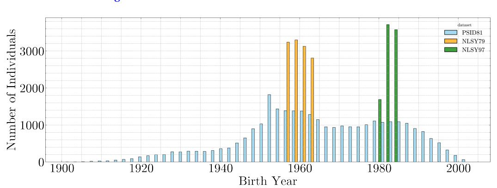
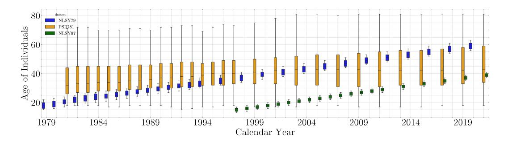
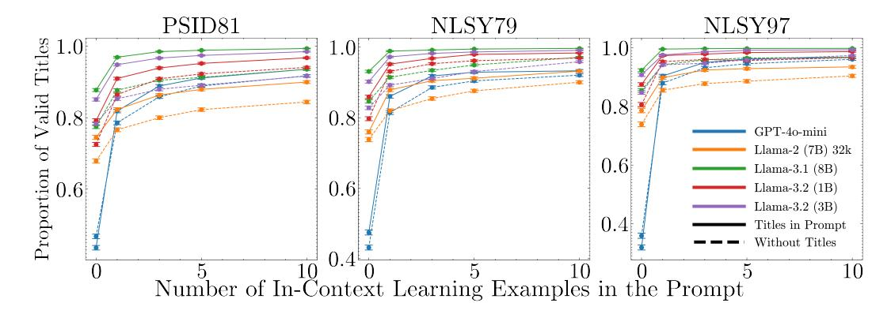
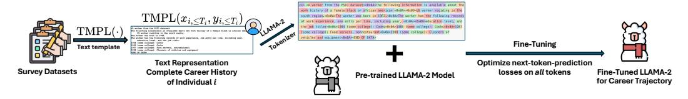
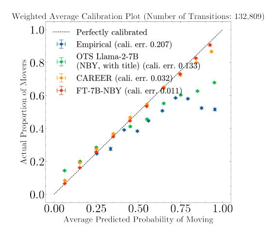
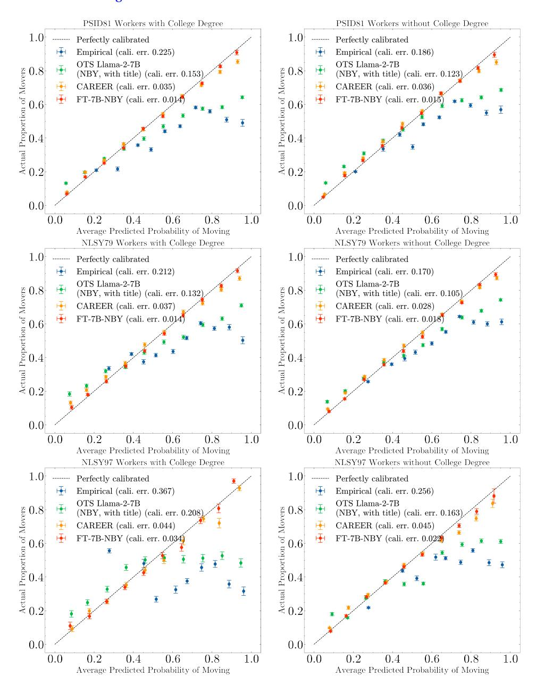

# <span id="page-0-0"></span>**LABOR-LLM: Language-Based Occupational Representations with Large Language Models**

SUSAN ATHEY Graduate School of Business, Stanford University

#### HERMAN BRUNBORG

Institute for Computational and Mathematical Engineering, Stanford University

### TIANYU DU

Institute for Computational and Mathematical Engineering, Stanford University

### AYUSH KANODIA Independent Researcher

#### KEYON VAFA

Harvard Data Science Initiative, Harvard University

[Vafa et al.](#page-64-0) [\(2024\)](#page-64-0) introduced a transformer-based econometric model, CAREER, that predicts a worker's next job as a function of career history (an "occupation model"). CAREER was initially estimated ("pre-trained") using a large, unrepresentative resume dataset, which served as a "foundation model," and parameter estimation was continued ("fine-tuned") using data from a representative survey. CAREER had better predictive performance than benchmarks. This paper considers an alternative where the resume-based foundation model is replaced by a large language model (LLM). We convert tabular data from the survey into text files that resemble resumes and fine-tune the LLMs using these text files with the objective to predict the next token (word). The resulting fine-tuned LLM is used as an input to an occupation model. Its predictive performance surpasses all prior models. We demonstrate the value of fine-tuning and further show that by adding more career data from a different population, fine-tuning smaller LLMs surpasses the performance of fine-tuning larger models.

KEYWORDS. Occupation Transitions, Large Language Model, Foundation Model. JEL CLASSIFICATION. J24, J62, C55.

Susan Athey: [athey@stanford.edu](mailto:athey@stanford.edu)

Herman Brunborg: [brunborg@stanford.edu](mailto:brunborg@stanford.edu) Tianyu Du: [tianyudu@stanford.edu](mailto:tianyudu@stanford.edu) Ayush Kanodia: [akanodia@stanford.edu](mailto:akanodia@stanford.edu) Keyon Vafa: [kvafa@g.harvard.edu](mailto:kvafa@g.harvard.edu)

We gratefully acknowledge financial support from the Golub Capital Social Impact Lab, the Stanford Institute for Human-Centered Artificial Intelligence, and the Business, Governance, and Society Initiative at Stanford's Graduate School of Business. Herman Brunborg thanks Aker Scholarship Foundation for financial support. Author order is alphabetical. Tianyu Du was the student leading the project and would be considered first author in the engineering tradition.

## 1. INTRODUCTION

<span id="page-1-1"></span>This paper introduces a new approach to making predictions about the evolution of worker careers that builds on the "foundation model" approach recently popularized in generative artificial intelligence. The application we focus on is the problem of predicting a worker's next job as a function of the worker's prior history. This problem is challenging because of the high dimensionality of the feature space: When there are 335 possible occupations, there are 335<sup>t</sup> possible sequences of occupations in t periods of observation. In addition, the prediction space is large. Given a history of jobs, a predictive model produces 335 probabilities corresponding to the possible next jobs.

Historically, the economics literature has addressed these challenges in a few ways. In terms of simplifying the outcomes, the literature has typically collapsed the space of occupations into a much smaller number of high level categories [\(Boskin](#page-61-0) [\(1974\)](#page-61-0)), or it has taken a "hedonic" approach, describing jobs by their characteristics, such as skills requirements (e.g., [Cortes](#page-62-0) [\(2016\)](#page-62-0)).[1](#page-1-0) In terms of reducing the dimensionality of the covariates, economic models typically use heuristic approaches such as focusing on the most recent previous job and summary statistics that describe the rest of history, such as years of experience (e.g., [Hall et al.](#page-62-1) [\(1972\)](#page-62-1)). However, we will show in this paper that these approaches have limitations: using heuristics to reduce dimensionality limits the set of applications of the model and hurts predictive power. For example, we might wish to characterize job transitions granularly in order to identify those that have become less common over time, or transitions that are particularly likely after layoffs; an occupation model that incorporates career history may also contribute to analyses of transitions in and out of the labor force, or in and out of poverty (e.g., [Stevens](#page-64-1) [\(1994\)](#page-64-1)). Accurate predictions often play a supporting role in answering causal economic questions; predictive models are used to estimate counterfactual outcomes that would occur in the absence of treatment, and predictive models must account for covariates (here, history) that may be correlated with treatment assignment to avoid omitted variable bias. Predictive models also play a supporting role in estimating treatment effect heterogeneity [\(Athey et al.](#page-60-0) [\(2023\)](#page-60-0)). In the context of recommendation systems or automated job advice [\(de Ruijt](#page-62-2) [and Bhulai](#page-62-2) [\(2021\)](#page-62-2)), accurate estimates of conditional transition probabilities may be a key building block.

In this paper, we develop a novel approach to this problem where dimensionality reduction of outcomes (the next job) and career history is data-driven. Our approach improves upon previous approaches in terms of predictive power in held-out data. We start from the observation that the problem of predicting the next job in a worker's career is analogous to the problem of predicting the next word in a sequence of text, suggesting that approaches that have recently been highly successful for predicting the next word may also be applicable here. Previous research [\(Vafa et al.](#page-64-0) [\(2024\)](#page-64-0)) took language modeling as an inspiration and built a custom model for occupation prediction; in this paper, we introduce an approach that directly uses the next-word probability models associated with popular open source Large Language Models (LLMs).

<span id="page-1-0"></span><sup>1</sup>The hedonic approach has also been used in related literature in industrial organization where consumers select among many products.

<span id="page-2-0"></span>To understand how we use LLMs for the discrete choice problem of predicting job transitions, consider how LLMs are commonly developed and used today. The empirical model (most commonly, a transformer neural network) reduces the dimensionality of covariates through the use of "embeddings" or "representations" which are lowerdimensional latent variables estimated from data. In the case of text, an embedding function is an (estimated) mapping from a sequence of words into a real-valued vector. Estimation of the model makes use of variants of stochastic gradient descent, where each observation (instance of a next-word prediction) is ordered randomly and then observations are processed sequentially. The parameters of the model are updated in the direction of the gradient of the objective function evaluated at the relevant observation. Stochastic gradient descent is applied to two distinct datasets in sequence. The first dataset is usually very large and may not be representative of the population of interest, and estimation of model parameters on this dataset is referred to as "pre-training," while the resulting estimated model is referred to as a "foundation model" [\(Bommasani et al.](#page-60-1) [\(2022\)](#page-60-1)). For some applications, the foundation model is used "off-the-shelf" and estimation ends at this step, but in other applications a second dataset is used. The second dataset is usually a randomly selected "training" subsample of the dataset of primary interest, and it is usually much smaller than the first dataset. Estimation of model parameters using stochastic gradient descent picks up where the pre-training left off, processing only observations from the training dataset.

Several observations about the approach of pre-training and fine-tuning shed light on why it can be effective. First, the pre-training step may identify structure in the prediction problem (in the case of language, the meaning of words, grammar, and facts) that may be relevant across different contexts. With a very large pre-training corpus, it is possible to estimate a large number of parameters (generally billions or more), enabling a substantial amount of information to be encoded in the model. Second, it is not necessary to have access to the pre-training dataset in order to carry out the fine-tuning step. All that is needed is access to the model parameters and an understanding of the functional form of the embedding function. A third advantage that we will not fully exploit in this paper is that the objective can be modified (e.g., predict a different outcome variable) in fine-tuning. See, e.g., [Bommasani et al.](#page-60-1) [\(2022\)](#page-60-1) for further discussion.

An open question about the fine-tuning approach is whether the fact that the pretraining dataset is not representative of the target implies that the final estimated model will exhibit bias relative to the true conditional transition probabilities in the population of interest. There may be a tradeoff between using a large, non-representative dataset to better learn underlying structure (e.g. meaning of language), and getting a model that makes conditional predictions that are representative of a target dataset of interest. In this paper, we show that if such biases are important, the advantages of the foundation model approach outweigh them in our application.

The foundation model approach has been applied in many settings beyond text [\(Savcisens et al.](#page-63-0) [\(2024\)](#page-63-0), [Wu et al.](#page-65-0) [\(2021\)](#page-65-0), [Radford et al.](#page-63-1) [\(2021\)](#page-63-1)). For the problem of nextjob prediction, [Vafa et al.](#page-64-0) [\(2024\)](#page-64-0) built CAREER. CAREER relies on a "custom" econometric model based on the same transformer architecture popular in LLMs, but modified so that the vocabulary of the transformer is limited to the space of jobs, and customized <span id="page-3-0"></span>to give special treatment to staying in a job. The pre-training data was a set of about 23 million resumes of U.S. workers acquired from Zippia, Inc., where the resumes are not representative of the U.S. population. [Vafa et al.](#page-64-0) [\(2024\)](#page-64-0) then fine-tuned the model using data from U.S. government surveys (the Panel Study of Income Dynamics (PSID) [\(Sur](#page-64-2)[vey Research Center, Institute for Social Research, University of Michigan](#page-64-2) [\(2024\)](#page-64-2)) and two cohorts from the National Longitudinal Survey of Youth (NLSY79 and NLSY97) [\(Bu](#page-61-1)[reau of Labor Statistics, U.S. Department of Labor](#page-61-1) [\(2023,](#page-61-1) [2024\)](#page-61-2)), showing that predictive performance was significantly better than existing benchmarks from the literature. Further, the paper shows that the underlying structure identified by the foundation model has predictive power for related tasks; when the model is fine-tuned to predict wages, which are not available in the pre-training resume dataset, it improves the predictive power for wages above popular regression models relied upon in labor economics. CA-REER used an embedding space of 768 dimensions, and the model had about 5.6 million parameters.

In this paper, we propose an alternative to CAREER, which we refer to as the **LA**nguage-**B**ased **O**ccupational **R**epresentations with **L**arge **L**anguage **M**odels (LABOR-LLM) framework. This framework incorporates several approaches to leveraging LLMs for modeling labor market data and producing representative predictions. LABOR-LLM uses a similar approach to CAREER with several modifications. Most importantly, the foundation model we use is an LLM, so it is trained on natural language. We focus on Llama-2, the open-weight model provided by Meta. Second, in our preferred LABOR-LLM approach, which we call Fine-Tuned LABOR-LLM or FT-LABOR-LLM, instead of fine-tuning the model on tabular data as constructed from government surveys, we finetune it on a textual version of the government survey (or combinations of government surveys). In particular, we transform the survey data into what we call a "text template" that looks similar to the text of a resume, and fine-tune the language model on a dataset consisting of one document (sequence of words resembling a resume) for each worker in a government survey dataset. The objective of the fine-tuning is next-word prediction for the text resume.

The fine-tuned model can, in principle, be used in a variety of ways. One approach would be to use it to create data-driven low-dimensional embeddings of history, and use those embeddings as if they were observed covariates in a predictive model such as a multinomial logistic regression. We explore such an approach in the paper, but we show that it does not work as well as FT-LABOR-LLM.

The FT-LABOR-LLM approach involves adapting an LLM that generates an estimate of the probability of the next word (conditional on that word being preceded by a particular sequence of words) to an occupation model that predicts the job in a particular year as a function of career history. To do so, we use the probability model associated with the fine-tuned LLM to evaluate the probability that the next text in our text template is the text corresponding to a particular job, conditional on the preceding text being equal to the text of the text template truncated at the year of interest, recalling that the text template was automatically generated from the worker's history recorded in the tabular survey data.

<span id="page-4-1"></span>We show that the performance of FT-LABOR-LLM is better than that of CAREER, despite CAREER being custom-designed for the problem and pre-trained on a very relevant corpus of documents, resumes of U.S. workers. Recalling that CAREER in turn substantially outperformed alternatives from the literature, FT-LABOR-LLM is established to be the state of the art in terms of predictive performance. We highlight the importance of the fine-tuning step by showing that, without fine-tuning, off-the-shelf Llama-2 makes plausible-sounding predictions of jobs, but it is not as accurate in terms of the next job probability distributions conditional on history, and it "hallucinates" invalid job titles because it is not fine-tuned exclusively on labor sequence data. The latest LLM available from OpenAI has similar challenges.

In the remainder of the paper, we assess the sources of the performance benefits. We begin by assessing the role of model size (number of parameters) and the volume of data. We show that using a larger LLM as the foundation model, in particular the version of Llama-2 with 13 billion parameters rather than the version with 7 billion parameters, improves predictive performance. However, we show that adding in data from different government surveys (even though they are drawn from different time periods) quickly improves the performance of the smaller model, matching and then surpassing the performance of the larger model. Thus, data is a substitute for model size.[2](#page-4-0) Since smaller models are less expensive to estimate, and especially cheaper to make predictions from, working with a smaller model has distinct advantages.

We next assess whether FT-LABOR-LLM is making use of information embedded in the text of the job title. To do so, we replace the job titles with numeric codes in the training data and show that this approach degrades predictive performance substantially. We further establish that demographics, most notably gender, but also the interaction of gender, ethnicity, and region, play an important role in predicting job transitions. Finally, we show that predictive performance is degraded unless at least 10 periods of worker history is included; truncating the history degrades performance.

Overall, the success of FT-LABOR-LLM provides an example of how LLMs can be used as foundation models for an economic problem that was traditionally studied using categorical, discrete-choice prediction models. In addition to providing superior predictive performance, the LABOR-LLM approach has some advantages because the pre-training step does not have to be carried out by the individual researcher; rather open, general purpose LLMs can be used (or closed models can be used through paid API access, although with less control on the part of the analyst).

### 2. RELATED WORK

*Career Trajectory Modeling and Next Job Prediction* In the economics literature, when studies of worker transitions analyze the relationship between worker characteristics and career histories to career transitions, they have traditionally relied on fairly simple predictive models and considered only a few occupation categories. For example,

<span id="page-4-0"></span><sup>2</sup>Other papers have shown that more data improves model performance for both pre-training [\(Vafa et al.](#page-64-0) [\(2024\)](#page-64-0), [Kaplan et al.](#page-62-3) [\(2020\)](#page-62-3)) and fine-tuning [\(Dong et al.](#page-62-4) [\(2023\)](#page-62-4), [Bucher and Martini](#page-61-3) [\(2024\)](#page-61-3)) data.

<span id="page-5-0"></span>[Boskin](#page-61-0) [\(1974\)](#page-61-0) use a conditional logistic regression model to analyze the factors affecting workers' transitions among 11 occupational groups, where the factors included estimated earnings, training expenses, and costs due to unemployment. [Schmidt and](#page-64-3) [Strauss](#page-64-3) [\(1975\)](#page-64-3) use a multinomial logistic regression to analyze the impact of race, sex, educational attainment, and labor market experience on the probability that individuals transition into one of five different occupational categories, revealing significant effects of these variables on occupational outcomes. [Hall et al.](#page-62-1) [\(1972\)](#page-62-1) examine the dynamics of labor force turnover in the U.S., analyzing the influences of demographic factors, labor demand fluctuations, and job stability on unemployment. To study turnover, the authors consider factors such as race, counts and ages of children, estimated wage, income, age, marital status, location, and employment category (including private wage or salary, government roles, self-employment, and unpaid family work). [Blau and Riphahn](#page-60-2) [\(1999\)](#page-60-2) model labor force transitions among older married couples, showing that one spouse's employment status significantly impacts the employment status of the other, with financial incentives and preferences for shared leisure influencing these transitions. In addition to demographic characteristics, the authors incorporate human capital and education variables, including the tenure on the current job and retirement benefits in their models.

*Machine Learning Methods for Next Job Prediction* For the problem of predicting worker job transitions, our paper is the first to use LLMs as a foundation model. As discussed in the introduction, the most closely related paper to ours is [Vafa et al.](#page-64-0) [\(2024\)](#page-64-0), which builds CAREER, a custom foundation model that is a modified version of the transformer models used in language models, and restricts attention to predicting numerically encoded jobs. CAREER has fewer parameters than FT-LABOR-LLM, and the pre-training dataset, while highly relevant, is much smaller than the corpus used for Llama-2. CAREER does not make use of the textual descriptions of job titles.

Prior to CAREER, other authors (e.g., [Li et al.](#page-63-2) [\(2017\)](#page-63-2), [Meng et al.](#page-63-3) [\(2019\)](#page-63-3), [Zhang et al.](#page-65-1) [\(2021\)](#page-65-1)) made use of various versions of neural networks for the next job prediction problem, sometimes training on large datasets. For example, [Li et al.](#page-63-2) [\(2017\)](#page-63-2) use a Long Short-Term Memory (LSTM) neural network to predict job transitions, where the embedding dimension is 200, and the training set incorporates more than a million individuals. [He](#page-62-5) [et al.](#page-62-5) [\(2021\)](#page-62-5) build a model to predict the next job position out of 32 frequent position names, as well as job salary and firm size for that position, using a dataset of 70,000 resumes. These papers do not make use of foundation models.

Another approach taken by [Zhang et al.](#page-65-2) [\(2019\)](#page-65-2) seeks to predict aggregate transition probabilities between pairs of job titles within the same firm. Their approach, which generates embeddings for each job title, does not attempt to condition on individual worker history.

*Adapting LLMs to Build Domain-Specific Models* Adapting pre-trained models to specific domains via fine-tuning has become a prevalent approach for improving the performance of LLMs for specific tasks. The (full parameter) fine-tuning approach involves further updating all weights of a pre-trained model using domain-specific data and optimization techniques such as gradient descent [\(Wei et al.](#page-65-3) [\(2022\)](#page-65-3)). The pre-training and <span id="page-6-0"></span>fine-tuning paradigm has produced state-of-the-art models for dialogue systems [\(Yi](#page-65-4) [et al.](#page-65-4) [\(2024\)](#page-65-4)), code generation [\(Chen et al.](#page-61-4) [\(2021\)](#page-61-4)), music generation [\(Agostinelli et al.](#page-60-3) [\(2023\)](#page-60-3)), scientific knowledge [\(Taylor et al.](#page-64-4) [\(2022\)](#page-64-4)), protein structure prediction [\(Rives](#page-63-4) [et al.](#page-63-4) [\(2021\)](#page-63-4)), chemistry [\(Zhang et al.](#page-65-5) [\(2024\)](#page-65-5)), medicine [\(Singhal et al.](#page-64-5) [\(2022\)](#page-64-5)), and other settings. The literature on the adaptation of LLMs for recommendation systems is also closely related. [Geng et al.](#page-62-6) [\(2022\)](#page-62-6) introduce a general paradigm to adapt the recommendation task to language processing.

Our paper compares our fine-tuning approach to one where LLM embeddings are extracted and treated as covariates in a multinomial logistic regression. This type of approach has been popular in language analysis for a long time; for example, it is used by sentiment classifiers [\(Reimers and Gurevych](#page-63-5) [\(2019\)](#page-63-5)).

Finally, prompt engineering and in-context learning are alternative approaches to fine-tuning LLMs that require minimal computation and avoid the need for direct model access [\(Brown et al.](#page-61-5) [\(2020\)](#page-61-5)). Prompt engineering involves designing specific queries, instructions, or examples within the prompt to direct the model's response. By tuning the language and structure of prompts, researchers can shape the model's output for different applications [\(Maharjan et al.](#page-63-6) [\(2024\)](#page-63-6)). Researchers can also use in-context learning by providing relevant example data within the prompt itself, priming the model to continue the pattern and apply similar logic to new inputs [\(Yin et al.](#page-65-6) [\(2024\)](#page-65-6), [Bao et al.](#page-60-4) [\(2023\)](#page-60-4)). In this paper, we consider an approach in which we prompt off-the-shelf LLMs for a prediction of the next job using a textual representation of worker career history as the prompt. We show that including example resumes in the prompt helps improve performance of off-the-shelf pre-trained LLMs, although performance is still worse than FT-LABOR-LLM.

*Other Applications of LLMs to Sequential Prediction Problems in Economics* LLMs have also been used to model time series data [\(Jin et al.](#page-62-7) [\(2024\)](#page-62-7)) and in forecasting. For instance, [Faria-e Castro and Leibovici](#page-62-8) [\(2024\)](#page-62-8) investigate the ability of LLMs to produce in-sample conditional inflation forecasts during the 2019–2023 period.

*The Biases and Representativeness of LLMs* A recent literature has emerged that aims to assess whether the outputs of foundation models are representative of larger populations, for example, whether the answers to opinion survey questions are representative of the population [\(Santurkar et al.](#page-63-7) [\(2023\)](#page-63-7), [Argyle et al.](#page-60-5) [\(2023\)](#page-60-5)). One proposed approach is to query LLMs with survey responses from long-standing opinion surveys and see how aligned their responses are with the survey average. Our question differs in that we want to know whether the (fine-tuned) LLM can make predictions about job transitions that are representative of real-world transitions, conditional on history, which is a more complicated question to answer, as the population conditional probabilities are unknown due to the high dimensional space of potential histories.

### 3. OCCUPATION MODELS

#### 3.1 *Notation for Occupation Models.*

We refer to a model that predicts an individual's next occupation as a function of career history and other individual characteristics as an **occupation model**. Our paper focuses <span id="page-7-0"></span>on a specific type of occupation model, which predicts the occupation in the next time period conditional on the previous occupations and covariates.

In this section, we develop notation for occupation models. Let t ∈ {1, .., Ti} correspond to a year in which an individual i was surveyed and otherwise met our filtering requirements, where T<sup>i</sup> denotes the total number of individual-year observations of this individual. Note that our cleaned survey datasets do not, in general, have observations in every calendar year. We refer to an observation of an individual's occupation as a "transition," with some abuse of terminology since we use the term for the first observation and also even when the individual stays in the same occupation. Let yeari,t denote the calendar year corresponding to transition t for individual i. We represent occupations as discrete variables, in particular following the occ1990dd, a variant of the OCC occupational classification system of [Autor and Dorn](#page-60-6) [\(2013\)](#page-60-6), as described in Appendix [N.](#page-51-0) Let Y denote the set of all occupations, and let yi,t ∈ Y represent the occupation that an individual i has at transition index t. We let yi,<t = (yi,1, . . ., yi,t−1) denote an individual's job sequence prior to their t'th observation (for t = 1, define yi,<t = ∅). Let Xinv be the support of time-invariant covariates (in our application, gender, race/ethnicity, region, and sometimes birth year, denoted by xi), while Xvar is the support of timevarying covariates (in our application, education and calendar year, denoted by xi,t). Let xi,≤<sup>t</sup> = (x<sup>i</sup> , xi,1, . . ., xi,t) ∈ Xinv × X <sup>t</sup> var denote the time-invariant covariates and timevarying covariates up to and including t. We refer to (xi,≤<sup>t</sup> , yi,<t,) as the worker's career history at transition t.

The probability that the worker's next job is yi,t, conditional on the worker's history, is written P(yi,t | xi,≤<sup>t</sup> , yi,<t).

#### 3.2 *Assessing Predictive Performance of Occupation Models*

We evaluate an occupation model's performance by comparing its predictions of an individual's next job to their actual next job. Specifically, we evaluate models by computing their perplexity, a commonly used metric in Natural Language Processing (NLP). The perplexity is a negative monotonic transformation of the sample log-likelihood, with lower perplexity indicating that a model's predictions are more accurate. Formally, the perplexity of an occupation model Pˆ on a set of transitions (individual-year observations) for units i = 1, .., I is given by

$$\text{perplexity} = \exp \left\{ -\frac{1}{\sum_{i}^{I} \sum_{i=1}^{I} \sum_{t=1}^{T_i} w_{it} \left[ \log \hat{P}(y_{i,t} \mid x_{i, \leq t}, y_{i, < t}) \right] \right\},$$

where wit denotes the sampling weight for the individual relative to a population of interest. In this paper, for simplicity, we set wit = 1. Note that a completely uninformative model that assigns uniform mass to each possible occupation would achieve a perplexity of |Y|. We consider additional evaluation metrics (such as calibration) in Section [10.](#page-28-0)

#### 3.3 Quantifying Uncertainty in Performance Metrics

<span id="page-8-2"></span>When comparing the performance of alternative occupation models, we wish to quantify the uncertainty about estimates of performance. The randomness in measured perplexity for a given model arises from several sources: sampling variation in the training data, randomness in the fine-tuning pipeline (e.g., data shuffling for a stochastic gradient descent optimizer), and sampling variation of the test data.

To estimate the uncertainty arising from the first two sources, we bootstrap the training set used for fine-tuning (sampling at the individual level) and estimate the variation in measures of the performance of models across bootstrap samples. We refer to the resulting standard errors as "training-set-bootstrapped." To capture sampling variation of the training set, we sample with replacement.

According to the support team of Together AI, the platform we use to fine-tune LLMs, the randomness in their fine-tuning process arises mainly from randomizing the order of observations in the process of optimizing via stochastic gradient descent; each instance of re-tuning a bootstrap sample will include randomization of this type.<sup>3</sup> Because fine-tuning is very expensive to carry out, we conduct an experiment for three of the models, as described below in Section 8.2 and Appendix A.

To estimate the uncertainty arising from sampling variation in the test set, we bootstrap the test set and refer to the resulting standard errors as "test-set-bootstrap." We sample at the individual level with replacement and, in the analysis we report below, use 100 bootstrap replications.

We employ a similar bootstrapping approach to calculate the test-set-bootstrap standard errors for the differences in perplexities between the two models. We select bootstrap samples at the individual level, compute the perplexities for both models on the bootstrap sample, and calculate the standard deviation of the difference in perplexities. See Appendix A for more details on both the training- and test-set-bootstrap standard errors.

#### 4. Large Language Models as Foundation Models

#### 4.1 LLM Notation

<span id="page-8-1"></span>The LLMs we use in this paper are trained to perform next-word prediction. Let  $\mathcal{W}$  be the allowable set of words and punctuation, while  $\cup_{i=1}^{\infty} \mathcal{W}^j$  is the set of sequences of words.

In practice LLMs work in the space of "tokens," where words can be transformed into a sequence of tokens using a process called "tokenization." We let  $\mathcal{V}_{LLM}$  be the set of all possible tokens (also known as the vocabulary set) for a particular LLM. Popular commercial-scale LLMs typically use vocabulary sets with 10,000 to 100,000 tokens; for example,  $|\mathcal{V}_{\text{Llama-2}}| = 32,000$ . Let Tok:  $\bigcup_{j=1}^{\infty} \mathcal{W}^j \to \bigcup_{j=1}^{\infty} \mathcal{V}^j$  denote the function mapping a sequence of words to a sequence of tokens.

<span id="page-8-0"></span><sup>&</sup>lt;sup>3</sup>Unfortunately, at the time of this writing, there is no way to specify the random seed for reproducibility. The support team also mentioned "adapter weight initialization" as another source of randomness in the fine-tuning pipeline, which is only relevant if one is fine-tuning using the Low-Rank Adaptation (LoRA) technique. We are doing full-parameter fine-tuning instead.

The LLMs we consider can be viewed as estimating the probability that the next to-ken equals  $v_{k+1}$ , conditional on a sequence of k tokens (i.e., the prompt). LLMs also impose restrictions on the "context length," or the maximum length of a sequence that can be conditioned on, which we denote C, with particular values  $C_{\text{LLM}}$  imposed by different LLMs. Then, we let  $\hat{P}_{\text{LLM}}^{\mathcal{V}}: \mathcal{V}_{\text{LLM}} \times \cup_{k \leq C_{\text{LLM}}} \mathcal{V}_{\text{LLM}}^k \to [0,1]$  denote the LLM's estimate of the probability of the next token conditional on the input sequence, which for particular values of  $v_1, \ldots, v_{k+1}$  is written  $\hat{P}_{\text{LLM}}^{\mathcal{V}}(v_{k+1} \mid v_1, \ldots, v_k)$ .

The conditional probability  $\hat{P}_{\text{LLM}}^{\mathcal{V}}(v_{k+1},\ldots,v_{k+k'}\mid v_1,\ldots,v_k)$  for  $k+k'\leq C_{\text{LLM}}+1$  can be derived from individual next-token predictions using the chain rule.

### 4.2 Text Templates

<span id="page-9-2"></span>In this section, we describe the **text template** function we use to convert a worker's history of jobs and covariates into a sequence of words and punctuation. This text template can be combined with a tokenizer and an LLM to make next job predictions, as described in the next section.

We let  $\mathrm{TiTLE}: \mathcal{Y} \to \cup_{j=1}^\infty \mathcal{W}^j$  denote the mapping from an occupation to its English-language title. Note that this mapping should be bijective (one-to-one). For example, the title of the occupation with <code>occ1990dd</code> code 95 is "nurse practitioners." The number of tokens needed to represent a job title depends on the tokenizer; using the Llama-2 tokenizer, the number ranges from 2 to 28 in the survey datasets we analyze, with an average length of 8.3 tokens (and a standard deviation of 4.8).

To represent covariates as text, we express an individual's educational status using values such as graduate degree. Online Appendix A provides the full mapping between occ1990dd codes and their job titles.

Building on this strategy, we define a **text template** function,  $\mathsf{TMPL}(x_{i,\leq t},y_{i,< t})$ , that transforms an individual's career history into a textual summary. The text template incorporates additional punctuation, line breaks, and meta-data, as detailed in Appendix C, and illustrated in the following example.

```
<A worker from the PSID dataset>
The following information is available about the work history of a female black
    or african american US worker residing in the south region.
The worker was born in 1963.
The worker has the following records of work experience, one entry per line,
    including year, education level, and the job title:
1984 (some college): Cooks
1985 (some college): Cooks
1987 (some college): Food servers, nonrestaurant
1989 (some college): Cleaners of vehicles and equipment
<END OF DATA>
```

<span id="page-9-0"></span><sup>&</sup>lt;sup>4</sup>Even though the occ1990dd system does not include job titles directly, one can cross-walk it to, for example, the Standard Occupational Classification (SOC) system, and use the list of job titles attached to each SOC code provided by the Bureau of Labor Statistics (https://www.bls.gov/OES/CURRENT/oes\_stru.htm).

<span id="page-9-1"></span><sup>&</sup>lt;sup>5</sup>"Grinding, Lapping, Polishing, and Buffing Machine Tool Setters, Operators, and Tenders, Metal and Plastic" (28 tokens) and "Cutting, punching, and press machine setters, operators, and tenders, metal and plastic" (24 tokens) are the two longest job titles. The shortest job tiles include "Cooks", "Bakers", "Tellers", and "Designers".

The example above is defined as the text representation of the **complete career history** of the individual, denoted TMPL(xi,≤<sup>t</sup> , yi,≤T<sup>i</sup> ), where T<sup>i</sup> represents the number of transitions for individual i. These complete career histories are used for model finetuning, as discussed in Section [8.](#page-22-1)

Note that the individual can stay in the same job for multiple records (e.g., 1984 and 1985 in the example); the text representation explicitly reflects this information. Additionally, the dataset could miss an individual for certain years in her career trajectory; in this case, the text template will skip those years (e.g., 1987 and 1995 in the example).

We also create the text representation of the **career history** of the same individual prior to the t th job, denoted TMPL(xi,≤<sup>t</sup> , yi,<t), by truncating the complete career history. For example, to obtain an LLM's predictions of an individual's job in 1989 given the covariates and job history, we would use as input the text above, removing the text "Cleaners of vehicles and equipment" and everything afterward (i.e., the underlined part in the example). That is, we apply the text template function to all previous job and covariate information, and conclude with a partial row for the occupation to be predicted.

On average in the survey datasets we consider, the text representation of workers' complete career histories contains around 250 to 500 tokens using the Llama-2 tokenizer, which fits well within the context window of Llama-2 models for finetuning. For inference tasks, the prompt encoding of an individual's career history, i.e., TOK(TMPL(xi,≤<sup>t</sup> , yi,<t)), consists of 200 to 300 tokens on average. Detailed summary statistics on the number of tokens can be found in Online Appendix [B.](#page-36-0)

## 4.3 *Using LLMs for Occupation Modeling*

<span id="page-10-1"></span>In this paper, we use LLMs in three ways. First, we use an LLM to directly produce a "predicted job" in response to a "prompt." More precisely, if we first map job codes to text (the English language job title) using the text template function described in the previous subsection, and then use a tokenizer to translate the resulting sequences of past jobs into a sequence of tokens, an LLM will produce a textual "response" that is a sequence of tokens. That sequence may or may not correspond to a valid occupation, but we can, in principle, further transform the output in various ways to interpret it as an occupation. Of course, a textual response or a single predicted occupation is not an estimate of the probability of a sequence of tokens. Some commercial LLMs allow the user to set a "temperature" parameter when submitting a prompt, where a particular setting is designed to approximate sampling from the distribution of responses. Probabilities can then be estimated by repeatedly prompting the LLM. We do not follow this approach in this paper; instead, we restrict attention to LLMs where probabilities (or, where relevant, embeddings) can be directly obtained by the analyst.

Second, for those LLMs for which it is possible, we directly obtain the probability assigned to a given token. This functionality may be enabled in the setup of an open model such as Llama-2, or it may be exposed through an API in the case of a closed model such as ChatGPT-4.[6](#page-10-0) For example, for the LLM Llama-2 7 billion param-

<span id="page-10-0"></span><sup>6</sup>For example, [https://cookbook.openai.com/examples/using\\_logprobs](https://cookbook.openai.com/examples/using_logprobs) explains how to use the logprobs parameter in OpenAI API requests to evaluate token probabilities, allowing analysis of model confidence and alternative predictions for improved understanding of text generation.

eter model, denoted Llama-2-7B, the estimated probability that "Engineer" follows the single-token sequence "Software" is written  $\hat{P}^{\mathcal{V}}_{\text{Llama-2-7B}}$  ("Engineer"|"Software"). To obtain the probability of the next job given a sequence of prior jobs, we first use the text template function and the tokenizer to translate the job history into a sequence of tokens; similarly, we translate the title of a particular next job  $y_{i,t+1}$  into a sequence of tokens. The estimated next-token probability model associated with the LLM, denoted by  $\hat{P}^{\mathcal{V}}_{\text{LLM}}(\cdot \mid v_1, \ldots, v_k): \mathcal{V}_{\text{LLM}} \rightarrow [0,1]$ , can be applied several times to determine (using the chain rule of probability) an estimate of the probability that the sequence of tokens induced by  $y_{i,t+1}$  follows the sequence of tokens induced by  $(y_{i,1},\ldots,y_{i,t})$ . A language-based next-token prediction model thus induces an associated occupation model, as follows:

<span id="page-11-1"></span>
$$\hat{P}_{\text{LLM}}(y_{i,t} \mid x_{i,\leq t}, y_{i,< t}) \\
\stackrel{\text{def}}{=} \hat{P}_{\text{LLM}}^{\mathcal{V}}(\text{Tok}(\text{Title}(y_{i,t})) \mid \text{Tok}(\text{TMPL}(x_{i,< t}, y_{i,< t}))).$$
(1)

More details are discussed in Appendix D.

Third, some LLMs make it possible to extract a lower-dimensional "embedding" or "representation" of text, where any sequence of tokens is associated with a real-valued vector. For example, for the Llama-2-7BLLM that we use in this paper, input text is represented as a vector of 4,096 floating point numbers. Formally, we let  $\mathcal{E}_{\text{LLM}}$ :  $\cup_{j \leq C_{\text{LLM}}} \mathcal{V}_{\text{LLM}}^j \to \mathbb{R}^{d_{\text{LLM}}}$  be the "embedding function", where  $d_{\text{LLM}}$  denotes embedding dimension. The composite function  $\mathcal{E}_{\text{LLM}} \circ \text{Tok}$  generates the embedding of any input string of words (i.e., the "prompt").

#### 5. BENCHMARK OCCUPATION MODELS

#### 5.1 Empirical Transition Frequencies

<span id="page-11-2"></span>The empirical transition frequency is a simple baseline. Let  $\#^{(\text{train})}\{y\}$  denote the number of times occupation y appears in the training data, and  $\#^{(\text{train})}\{y \to y'\}$  denote the number of times the transition from occupation y to y' appears in the training data. In order to avoid the challenge of dividing by 0, we add a constant (here, 1) to each occupation and each transition. The model then estimates the probability of transitioning from occupation y to y' (where all individuals are in the "null" occupation when t=0) as

$$\hat{P}_{\text{Empirical}}(y_{i,t} \mid x_{i, \leq t}, y_{i, < t}) = \frac{\#^{(\text{train})}\{y_{i,t-1} \to y_{i,t}\} + 1}{\#^{(\text{train})}\{y_{i,t-1}\} + 1}.$$

The empirical model does not use any covariates or other information beyond the immediately preceding occupation to make predictions.

### 5.2 Multinomial Logistic Regression

<span id="page-11-0"></span>Another natural approach to occupational modeling is to build a multinomial logistic regression model, where  $\mathcal{Y}$  is the set of alternatives. Researchers often use a fixed number of covariates summarizing information in  $(x_{i, < t}, y_{i, < t})$  as features. Formally, we let

<span id="page-12-1"></span> $z_{i,t} = g(x_{i, < t}, y_{i, < t})$  be the vector of covariates for predicting  $y_{i,t}$ , where the length of  $z_{i,t}$ is fixed for all (i,t). For example, g might map history into a set of indicator variables for whether the previous occupation  $y_{i,t-1}$  is equal to each possible occupation, and then build a multinomial logistic regression model on top of that; in this case,  $z_{i,t}$  is a vector of length  $|\mathcal{Y}|$  with a single non-zero entry. With such a specification, the multinomial logistic regression model reduces to the model using empirical transition frequencies. For each occupation  $y \in \mathcal{Y}$ , the logistic regression model estimates a parameter  $\beta_y$  with the same length as  $z_{i,t}$ , and the conditional distribution of next occupation is given by

$$\hat{P}_{\text{MNL}}(y_{i,t} \mid x_{i,\leq t}, y_{i,< t}) = \frac{\exp(z_{i,t}^{\top} \beta_{y_{i,t}})}{\sum_{y' \in \mathcal{Y}} \exp(z_{i,t}^{\top} \beta_{y'})}.$$
(2)

The set of parameters  $\{\beta_u\}_{u\in\mathcal{Y}}$  is estimated using maximum likelihood estimation, with optional regularization.

In our paper, we use LLMs to build an embedding vector of the career history  $x_{i, < t}, y_{i, < t}$  and use it as the vector of covariates in the logistic regression. We discuss more details in Section 7.1.

#### 5.3 CAREER

<span id="page-12-0"></span>Researchers have also proposed using transformer-based models to predict the next occupation of an individual given their covariates and history (Vafa et al. (2024)). CAREER by Vafa et al. (2024) is a transformer-based model that is trained to predict the next occupation of an individual given their covariates and history; that is, the prediction space is Y. Compared to empirical transition frequency models and multinomial logistic regression, the CAREER model has two key differences. First, it builds a much richer functional form mapping history to predictions, making use of a custom-designed transformer neural network. Second, the model is estimated sequentially on two data sets, following the foundation model and fine-tuning approach described in the introduction. That is, first the model is pre-trained on large-scale resume data, and subsequently it is fine-tuned using representative survey data.

Consider the  $t^{th}$  record of worker i with  $(x_{i, < t}, y_{i, < t})$  as predictors and  $y_{i, t}$  as the ground truth next occupation. CAREER estimates an embedding function  $\mathcal{E}_{CAREER}$  :  $\mathcal{X}_{\text{inv}} \times \mathcal{X}_{\text{var}}^t \times \mathcal{Y}^{t-1} \to \mathbb{R}^{d_{\text{CAREER}}}$ , where the value of the embedding is denoted  $h_{i,t}$  and  $d_{\mathrm{CAREER}}$  denotes the embedding dimension. The embedding function is parameterized by an L-layer transformer neural network, where each layer processes the previous one to generate increasingly complex representations. Here, we provide a slightly simplified description of the transformer architecture; see Vafa et al. (2024) for more details. The first layer embedding, denoted by  $h_{i,t}^{(1)} \in \mathbb{R}^{d_{\mathrm{CAREER}}}$ , only incorporates an individual's most recent job and covariates:

$$h_{i,t}^{(1)} = e_{\text{occupation}}\left(y_{i,t-1}\right) + e_{\text{static}}(x_i) + e_{\text{dynamic}}(x_{i,t}) + e_{\text{time}}(t),$$

where each e is an embedding function with output in  $\mathbb{R}^{d_{\text{CAREER}}}$ . Then, CAREER constructs subsequent layers  $h_{i,t}^{(\ell)}$  as described in Equation (3); for simplicity, the notation omits the dependencies on covariates and previous occupations in  $h_{i,t}$ .

<span id="page-13-0"></span>
$$\pi_{i,t,t'}^{(\ell)} \propto \exp\left\{ \left( h_{i,t}^{(\ell)} \right)^{\top} W^{(\ell)} h_{i,t'}^{(\ell)} \right\} \quad \text{for all } t' \leq t$$

$$\tilde{h}_{i,t}^{(\ell)} = h_{i,t}^{(\ell)} + \sum_{t'=1}^{t} \pi_{i,t,t'}^{(\ell)} * h_{i,t'}^{(\ell)}$$

$$h_{i,t}^{(\ell+1)} = \text{FFN}^{(\ell)} \left( \tilde{h}_{i,t}^{(\ell)} \right), \tag{3}$$

where  $W^\ell \in \mathbb{R}^{d_{\mathrm{CAREER}} \times d_{\mathrm{CAREER}}}$  is a trainable model parameter and  $\mathrm{FFN}^{(\ell)} : \mathbb{R}^{d_{\mathrm{CAREER}}} \to \mathbb{R}^{d_{\mathrm{CAREER}}}$  is a two-layer feed-forward network specific to the  $\ell^{\mathrm{th}}$  layer. The final layer  $h_{i,t}^{(L)}(x_{i,\leq t},y_{i,< t}) \in \mathbb{R}^{d_{\mathrm{CAREER}}}$  is a fixed-length representation summarizing the individual's career history up to the  $t^{\mathrm{th}}$  observation.

Because many individuals do not change their occupation from time t to t+1, CAREER is designed as a two-stage model that first predicts whether an individual will switch occupations and, if so, the probability that they will switch to each occupation. It uses the representation  $h_{i,t}^{(L)}$  to make this two-stage prediction:

Stage 1. Letting  $\eta \in \mathbb{R}^{d_{\text{CAREER}}}$  be a vector of regression coefficients:

$$\hat{P}_{\text{CAREER}}(\text{move}_{i,t} \mid x_{i, \leq t}, y_{i, < t}) = \frac{1}{1 + \exp(-\eta \cdot h_{i,t}^{(L)}(x_{i, \leq t}, y_{i, < t}))},$$

**Stage 2.** Letting  $\beta \in \mathbb{R}^{d_{\text{CAREER}}}$  be a matrix of regression coefficients:

$$\hat{P}_{\text{CAREER}}(y_{i,t} \mid x_{i,\leq t}, y_{i,< t}, \text{move}_{i,t} = 1) = \frac{\exp\{\beta_{y_{i,t}} \cdot h_{i,t}^{(L)}(x_{i,\leq t}, y_{i,< t}))\}}{\sum_{y' \neq y_{i,t-1}} \exp\{\beta_{y'} \cdot h_{i,t}^{(L)}(x_{i,\leq t}, y_{i,< t}))\}},$$

$$\hat{P}_{CAREER}(y \mid x_{i, < t}, y_{i, < t}, move_{i, t} = 0) = \mathbf{1}\{y = y_{i, t-1}\}.$$

Finally, the  $\hat{P}_{CAREER}(y \mid x_{i, < t}, y_{i, < t})$  can be computed using quantities above.

$$\begin{split} \hat{P}_{\text{CAREER}}(y \mid x_{i, \leq t}, y_{i, < t}) = \\ \begin{cases} 1 - \hat{P}_{\text{CAREER}}(\text{move}_{i, t} \mid x_{i, \leq t}, y_{i, < t}) & \text{if } y = y_{i, t-1} \\ \hat{P}_{\text{CAREER}}(\text{move}_{i, t} \mid x_{i, \leq t}, y_{i, < t}) \hat{P}_{\text{CAREER}}(y \mid x_{i, \leq t}, y_{i, < t}, \text{move}_{i, t} = 1) & \text{if } y \neq y_{i, t-1} \end{cases} \end{split}$$

In practice, the CAREER model makes predictions by marginalizing over the latent variable in the first stage.

To estimate the parameters of the model, the CAREER model is first pre-trained using 24 million career trajectories from a large dataset of resumes. Then, the pre-trained model weights are further updated in the fine-tuning step, but the gradient is computed

<span id="page-14-1"></span>using career trajectories from survey datasets of interest. Additional details on the CA-REER model are provided in Appendix [B.](#page-36-0)

### 6. DATA

### 6.1 *Representative Survey Datasets.*

<span id="page-14-0"></span>In this paper, our primary sources of data are three surveys of workers in the U.S. population. These surveys follow samples of individual workers, where workers are interviewed at regular intervals. The survey samples are constructed to be representative of the U.S. population at particular points in time.

The first dataset we consider is the Panel Study of Income Dynamics (PSID), which began in 1968. The sample of this dataset is intended to be representative of the United States as a whole, and new participants are added to the sample over time. Occupation information is consistently available starting in 1981, so we restrict our attention to survey years starting then. We further analyze data from two waves of the National Longitudinal Survey of Youth (NLSY). The NLSY 1979 follows a cohort of people aged 14-22 in 1979 throughout these workers' careers. The NLSY 1997 began in 1997 and followed a cohort of individuals aged 12-16 at that time throughout their careers. We use extracts from these surveys to build longitudinal datasets for individual workers. Details of our dataset construction are reported in Appendix [N.](#page-51-0)

We encode occupations using the occ1990dd system [\(Autor and Dorn](#page-60-6) [\(2013\)](#page-60-6)) to map different versions of Census OCC occupational codes to a harmonized set of codes. In addition to the 331 occupations from the occ1990dd taxonomy, we include three special categories: "education," "out of labor force," and "unemployed." We extract demographic characteristics, specifically gender, ethnicity, region of the country, and sometimes birth year. To simplify our analysis, we assign each worker a single, unchanging value for each demographic characteristic, typically the first valid value, and we do not allow it to change even if the original survey specifies different values in different survey years. We do not impute occupations for years without survey responses and focus on a single main occupation reported by the subject.

We refer to the cleaned versions of the three survey datasets as PSID81, NLSY79, and NLSY97. Table [1](#page-15-0) summarizes the total number of workers and transitions (individualyear survey observations, denoted by P i Ti) in each survey dataset. The PSID81 dataset has 10.1 transitions per individual on average (median is 8 and maximum is 29), and the NLSY79 and NLSY97 track relatively fewer workers but have more transitions per individual, with 20.82 (median is 25 and maximum is 29) and 16.56 (median is 19 and maximum is 20), respectively, observations per worker on average.

As previously discussed, we convert individuals' complete career trajectories into natural language paragraphs using a text template. The total number of tokens ranges from 3.1 million to 7.9 million. The average length of career history TMPL(xi,≤<sup>t</sup> , yi,<t) ranges from 210 to 280 tokens depending on the dataset, while the average length of complete career history TMPL(xi,≤T<sup>i</sup> , yi,≤T<sup>i</sup> ) ranges from 250 tokens to 430 tokens; all of these templates fit well within Llama-2 model's context window of 4,096 tokens.

<span id="page-15-1"></span>

|                                                                                                                                                                                                                                                                    | PSID81     | NLSY79     | NLSY97     |
|--------------------------------------------------------------------------------------------------------------------------------------------------------------------------------------------------------------------------------------------------------------------|------------|------------|------------|
| Number of Individuals $ \begin{array}{l} \text{Tokens in} \cup_i \text{TMPL}(x_{i, \leq T_i}, y_{i, \leq T_i}) \\ \text{Number of Transitions} \sum_i T_i \\ \text{Tokens in} \cup_i \cup_{1 \leq t \leq T_i} \text{TMPL}(x_{i, \leq t}, y_{i, < t}) \end{array} $ | 31,056     | 12,479     | 8,984      |
|                                                                                                                                                                                                                                                                    | 7,902,511  | 5,406,412  | 3,135,367  |
|                                                                                                                                                                                                                                                                    | 313,622    | 259,778    | 148,795    |
|                                                                                                                                                                                                                                                                    | 69,139,450 | 72,639,496 | 32,368,253 |
| "First observation" transitions $t=1$ "Moving" transitions with $y_{i,t-1} \neq y_{i,t}$ "Staying" transitions with $y_{i,t-1} = y_{i,t}$                                                                                                                          | 9.9%       | 4.8%       | 6.0%       |
|                                                                                                                                                                                                                                                                    | 38.5%      | 44.5%      | 37.0%      |
|                                                                                                                                                                                                                                                                    | 51.6%      | 50.6%      | 57.0%      |

<span id="page-15-0"></span>TABLE 1. Description of datasets.

Note: The top panel reports counts of individuals, transitions, and tokens. Token counts are reported separately for text representations used in fine-tuning  $\text{TMPL}(x_{i, \leq T_i}, y_{i, \leq T_i})$  and text representations used for inference  $\text{TMPL}(x_{i, \leq t}, y_{i, < t})$ . The bottom panel reports the proportion of transitions corresponding to three transition types: first observation, moving, and staying.

Transitions between two observations can be categorized into three types: *first observation, moving* (i.e., the current occupation is different from the occupation reported in the previous observation), and *staying* (i.e., the current occupation is the same as the occupation reported in the previous observation). Table 1 shows the number of transitions by transition type, highlighting that between 50% and 60% of transitions involve staying in the same occupation.

We divide each of the three survey datasets into training (70%), validation (10%), and test (20%) samples, where the allocation is performed at the individual level so that all of an individual's transitions are in the same set. All results in this paper about the performance of models are presented for the test set. Online Appendix C provides more details about each dataset, while Appendix Table N.1 provides summary statistics by dataset for the demographic variables we consider.

Birth cohort is an important factor affecting workers' career trajectories (Wachter (2020), Lersch et al. (2020)); however, neither birth year nor age information was used in the CAREER model. When comparing our models to CAREER, we present results about models trained without incorporating birth year, but we include this valuable information when training models for comparisons that do not involve CAREER. Figure 1 shows distributions of individuals' birth years in each of the three survey datasets. While birth years of PSID81 individuals span the range covered by NLSY79 and NLSY97, birth years of NLSY individuals are clustered within a small range due to the design of NLSY surveys.

Table 2 presents the top ten occupations in each dataset, highlighting commonalities and variations across datasets. Notable trends include "Not in labor force" ranking highest in all datasets, while occupations like "In education" show substantial variation, ranking  $9^{th}$  in PSID but  $2^{nd}$  and  $1^{st}$  in NLSY79 and NLSY97, respectively.

Figure 2 illustrates the distribution of individual ages across calendar years for each dataset. In the NLSY datasets, the age distribution increases steadily over time, reflecting the longitudinal design that follows the same cohort of individuals. In contrast, the PSID dataset allows for dynamic changes in its subject pool, with individuals entering (e.g., upon becoming the head of a household) and exiting the study. Consequently, the PSID81 dataset exhibits a broader but more temporally stable age distribution. This fig-



FIGURE 1. Distributions of individuals' birth years by survey dataset.

<span id="page-16-1"></span><span id="page-16-0"></span>TABLE 2. Top occupations by dataset.

|                                                              | PSID81     |      | NLSY79     |      | NLSY97     |      |
|--------------------------------------------------------------|------------|------|------------|------|------------|------|
| Occupation                                                   | Proportion | Rank | Proportion | Rank | Proportion | Rank |
| Not in labor force                                           | 0.192      | 1    | 0.177      | 1    | 0.122      | 2    |
| Unemployed                                                   | 0.067      | 2    | 0.040      | 4    | 0.034      | 3    |
| Postmasters and mail superintendents                         | 0.058      | 3    | 0.045      | 3    | 0.019      | 5    |
| Coin, vending, and amusement machine servicers and repairers | 0.025      | 4    | 0.025      | 5    | 0.013      | 9    |
| Secretaries and administrative assistants                    | 0.022      | 5    | 0.020      | 6    | 0.008      | 16   |
| Phlebotomists                                                | 0.021      | 6    | 0.017      | 8    | 0.020      | 4    |
| Telemarketers                                                | 0.016      | 7    | 0.005      | 41   | 0.016      | 7    |
| Maids and housekeeping cleaners                              | 0.014      | 8    | 0.011      | 13   | 0.004      | 31   |
| In education                                                 | 0.013      | 9    | 0.136      | 2    | 0.343      | 1    |
| Elementary and middle school teachers                        | 0.013      | 10   | 0.008      | 25   | 0.007      | 19   |
| Painting workers                                             | 0.013      | 11   | 0.015      | 10   | 0.005      | 28   |
| Sales Representatives Services All Other                     | 0.011      | 13   | 0.017      | 9    | 0.006      | 25   |
| Septic tank servicers and sewer pipe cleaners                | 0.010      | 15   | 0.018      | 7    | 0.012      | 10   |
| Cashiers                                                     | 0.009      | 21   | 0.011      | 11   | 0.018      | 6    |
| First-line supervisors/managers of retail sales workers      | 0.008      | 28   | 0.005      | 40   | 0.014      | 8    |

*Note*: We take the union of the top ten occupations from each dataset separately (15 occupations in total) and report the proportion of transitions to each occupation in each dataset, as well as the rank of the proportion compared to other occupations in the same dataset. Readers can refer to Appendix Figure [N.1](#page-59-1) for a word cloud of job titles.

ure highlights the degree of overlap in age distributions across the three datasets, suggesting potential opportunities for transfer learning between them.



<span id="page-16-2"></span>FIGURE 2. Distribution of individuals' ages by calendar year of observation.

## 6.2 *Large-Scale Resume Data*

<span id="page-17-3"></span>In this paper, we re-implement the full pre-training and fine-tuning pipeline of the CA-REER model so that we can carry out the fine-tuning step on identical survey datasets. Pre-training CAREER involves using a proprietary resume dataset of 23.7 million resumes acquired from Zippa Inc.[7](#page-17-1) As described in Appendix [B,](#page-36-0) we follow the approach of [Vafa et al.](#page-64-0) [\(2024\)](#page-64-0) to prepare and clean the data from Zippia Inc. This pre-training resume data represents resumes from the Zippia data as annual sequences of occ1990dd occupations, with tie-breaking rules for multiple jobs per year. Covariates include the year of each job, last educational degree, and location, standardized following the approach we use for cleaning the survey datasets. Missing covariates are replaced by a special token, and missing occupational years are dropped. The final dataset comprises 245 million transitions (that is, individual-year observations).

#### 7. COMPARING PERFORMANCE OF OCCUPATION MODELS

In this section, we explore different approaches to leveraging LLMs to build occupation models, comparing the performance of each to CAREER.

## 7.1 *LLM Embeddings as Features in Multinomial Logistic Regression Models*

<span id="page-17-0"></span>This section implements and evaluates the embedding-based approach introduced in Section [4.3](#page-10-1) to exploit LLMs for occupational modeling.. To predict an individual's next job from their embedding, we train a multinomial logistic regression model, where the outcome is the occupation codes, as described in Section [5.2.](#page-11-0)

We first convert the career history (xi,≤<sup>t</sup> , yi,<t) to natural language using the text template described in Section [4.2.](#page-9-2) We then pass the text to an LLM and extract the model's embedding, ELLM(TMPL(xi,≤<sup>t</sup> , yi,<t)) ∈ R <sup>d</sup>LLM . This approach requires that the researcher has access to the embeddings from the LLM either through an API or by using an open-weight model. We consider a wide range of off-the-shelf models to embed career histories into embedding vectors, including Llama-2-7B/13B, Llama-3.1-8B, Llama-3.2-1B/3B, as well as the latest text-embedding-3-large text embedding model provided by OpenAI. We then train a multinomial logistic regression on top of these embeddings for the next occupation prediction task.[8](#page-17-2) Appendix [E](#page-40-0) provides additional technical details on our embeddings-based approach.

<span id="page-17-1"></span><sup>7</sup>Zippia is a data-driven career intelligence platform that leverages analytics to provide personalized job recommendations, salary insights, and career development resources. The company aggregates labor market data to offer tailored guidance for job seekers, aiming to optimize their career decisions and employability. Other vendors providing similar data include Kaggle [https://www.kaggle.com/datasets/](https://www.kaggle.com/datasets/snehaanbhawal/resume-dataset) [snehaanbhawal/resume-dataset](https://www.kaggle.com/datasets/snehaanbhawal/resume-dataset) and Revelio [https://www.data-dictionary.reveliolabs.com/index.html.](https://www.data-dictionary.reveliolabs.com/index.html)

<span id="page-17-2"></span><sup>8</sup>Note that the embedding-based approach cannot predict occupations that are not in the training set; therefore, we drop transitions of occupations that are present in the test set, but not the training set in Table [3.](#page-18-0) The train/test split that we use to report results in this paper has 13 transitions in the test set for PSID81 and two for NLSY97 that are dropped due to having occupation codes that are not in the training set. These few observations have a negligible impact on our perplexity metric, as it is inherently robust to individual data points. The language model-based approach addresses this issue by producing predictive probabilities that are inherently valid for all job titles, including those not represented in the training set. In later tables, there will be 13 more transitions in the PSID81 and two more transitions in NLSY97.

<span id="page-18-3"></span>Table [3](#page-18-0) compares performance across models. The previous state-of-the-art CA-REER model outperforms the embedding-based multinomial logistic regression approach.[9](#page-18-1) The embeddings in Table [3](#page-18-0) are constructed using text templates that incorporate birth year information, whereas the CAREER model does not utilize birth year information, meaning that the CAREER model outperformed these embedding-based approaches in predictive performance despite relying on less information.

|                             | Dataset                                  | PSID81         | NLSY79         | NLSY97        |
|-----------------------------|------------------------------------------|----------------|----------------|---------------|
|                             | Number of Transitions P<br><br>i∈test Ti | 61,759         | 51,593         | 29,949        |
| Model                       | Embedding Dimension dLLM                 |                |                |               |
| OpenAI Text Embedding       | 3,072                                    | 11.176 (0.191) | 12.065 (0.245) | 9.278 (0.189) |
| OTS Llama-2-7B              | 4,096                                    | 10.184 (0.169) | 10.764 (0.216) | 8.216 (0.164) |
| OTS Llama-2-13B             | 5,120                                    | 10.167 (0.169) | 10.704 (0.203) | 7.995 (0.152) |
| OTS Llama-3.1-8B            | 4,096                                    | 9.916 (0.162)  | 10.517 (0.203) | 7.890 (0.151) |
| OTS Llama-3.2-1B            | 2,048                                    | 9.919 (0.164)  | 10.378 (0.200) | 7.875 (0.146) |
| OTS Llama-3.2-3B            | 3,072                                    | 9.789 (0.156)  | 10.283 (0.199) | 7.663 (0.141) |
| CAREER (Vafa et al. (2024)) | –                                        | 8.617 (0.132)  | 8.609 (0.157)  | 6.393 (0.099) |

<span id="page-18-0"></span>TABLE 3. Test set perplexity for embedding-based approaches vs. CAREER.

*Note*: Test-set-bootstrap standard errors are reported in parentheses.

## 7.2 *Using Off-The-Shelf Large Language Models as Occupation Models*

In this section, we report results about the performance of occupation models based on off-the-shelf LLMs, applying Equation [\(1\)](#page-11-1) to estimate Pˆ LLM for several alternative LLMs.[10](#page-18-2) Because evaluating perplexity requires accessing a model's assigned probabilities, we restrict attention to open-source LLMs where it is possible to obtain predicted probabilities directly, with the exception of Section [7.4,](#page-20-0) where we evaluate the ability of OpenAI gpt-4o-mini to produce valid job titles in response to a prompt.

In particular, we study open-source LLMs from the Llama family of models: Llama-2, Llama-3.1, and Llama-3.2. For example, Llama-2 models were trained by Meta on approximately 2 trillion tokens of text, much of it from the Internet, and are among the most capable open-source LLMs currently available [\(Touvron et al.](#page-64-6) [\(2023\)](#page-64-6)). We do not study bigger models such as Llama-2-70B and Llama-3.1-405B because fine-tuning and evaluating this model across many variations requires substantial cost and computational resources.

Table [4](#page-19-0) contains the perplexity of off-the-shelf LLMs. As a comparison, we also include the perplexity of CAREER by [Vafa et al.](#page-64-0) [\(2024\)](#page-64-0), a non-language model developed solely to predict nationally representative occupational trajectories. For a fair comparison to CAREER, we do not include the birth year information in LLMs' prompt

<span id="page-18-1"></span><sup>9</sup>For CAREER, predictions were made directly; we do **not** use CAREER as an embedding engine and build multinominal logistic regression on top of the embeddings.

<span id="page-18-2"></span><sup>10</sup>To improve computational efficiency for prediction, we quantize all LLMs in this paper to 8-bit precision while running model inference. We perform full-precision inference on a subset of our experiments, and the difference in performance was small. See Appendix [F](#page-41-0) for more details on full-precision versus quantized model experiments.

<span id="page-19-3"></span>

| Dataset<br>Number of Transitions P<br><br>i∈test Ti | PSID81<br>61,772 | NLSY79<br>51,593 | NLSY97<br>29,951 |
|-----------------------------------------------------|------------------|------------------|------------------|
| Model                                               |                  |                  |                  |
| OTS Llama-2-7B                                      | 361.742 (12.615) | 292.345 (9.179)  | 219.562 (6.686)  |
| OTS Llama-2-13B                                     | 149.859 (5.333)  | 133.321 (4.738)  | 113.771 (3.539)  |
| OTS Llama-3.1-8B                                    | 140.087 (5.083)  | 116.448 (4.227)  | 93.726 (2.913)   |
| OTS Llama-3.2-1B                                    | 475.255 (22.660) | 404.735 (19.807) | 258.654 (11.283) |
| OTS Llama-3.2-3B                                    | 180.554 (7.067)  | 145.594 (5.607)  | 115.994 (3.856)  |
| CAREER (Vafa et al. (2024))                         | 8.616 (0.132)    | 8.609 (0.157)    | 6.397 (0.099)    |

<span id="page-19-0"></span>TABLE 4. Test-set perplexity for off-the-shelf LLMs vs. CAREER.

*Note*: Test-set-bootstrap standard errors are reported in parentheses.

TMPL(xi,≤<sup>t</sup> , yi,<t) because CAREER does not use birth year or age information either. The LLMs consistently make predictions with higher levels of perplexity.[11](#page-19-1)

The unsatisfactory performance of off-the-shelf LLMs can be attributed to two factors: off-the-shelf LLMs are not adapted to the career trajectory distributions in our survey dataset, and these LLMs do not know the set of valid job titles to predict. To better understand the poor performance of the model based on off-the-shelf LLMs, we assess the responses that the LLMs provide when prompted with examples of tokenized text templates. Online Appendix [D](#page-39-0) provides some examples. While the responses appear plausible, the LLMs also assign mass to strings that are not valid job titles. In the next section, we explore alternative prompting strategies designed to encourage the LLMs to consider only valid occupations when estimating the probability of a given occupation.

#### 7.3 *Improving Off-the-Shelf LLMs using Prompting Strategies*

<span id="page-19-2"></span>Table [4](#page-19-0) shows that off-the-shelf pre-trained LLMs perform worse at predicting next occupations compared to the state-of-the-art CAREER model. In this section, we show that we can improve their performance by adding additional information into the prompt to facilitate in-context learning. We explore two types of information: (1) the list of job titles and (2) additional resume examples from other workers. A limiting factor in our ability to use such prompting strategies is the maximum context length of the models. For most models, we cannot include both the full list of job titles and example resumes. See Appendix [G](#page-41-1) for details on the constraints and more granular results.

*Job Titles in the Prompt* We prepend the list of all 335 job titles, one per line, to the text representation of career history TMPL(xi,≤<sup>t</sup> , yi,<t), which informs the off-the-shelf model about the prediction space. With this modification, the prompt passed into the LLM becomes [List of Job Titles] ⊕ TMPL(xi,≤<sup>t</sup> , yi,<t), where ⊕ denotes string concatenation.

<span id="page-19-1"></span><sup>11</sup>For reference, a completely uninformative model that assigns uniform mass to each possible occupation would achieve a perplexity of |Y|, which is 335.

Example Resumes in the Prompt We prepend example resumes randomly sampled (without replacement) from workers in the training set to the text representation of career history  $\mathsf{TMPL}(x_{i,\leq t},y_{i,< t})$ , which informs the off-the-shelf model about our data structure. The prompt fed into the model becomes  $\mathsf{TMPL}(x_{j_1,\leq T_{j_1}},y_{j_1,\leq T_{j_1}})\oplus\cdots\oplus \mathsf{TMPL}(x_{j_K,\leq T_{j_K}},y_{j_K,\leq T_{j_K}})\oplus\mathsf{TMPL}(x_{i,\leq t},y_{i,< t}) \text{ if we add }K \text{ individuals } j_1,\cdots,j_K \text{ where }\mathsf{TMPL}(x_{j,< T_{i}},y_{j,< T_{i}}) \text{ means the complete resume for individual } j.$ 

Since the main models we study in this paper, Llama-2-7B and Llama-2-13B, only have enough context length for either job titles or a few examples resumes (both have 4k context length), we study the open-sourced Llama-2-7B-32k model provided by Together AI, the Llama-3.1-8B model (with a 128k context window), and the Llama-3.2-1B/3B model (with a 128k context window) to assess the benefits of combining the two prompting approaches. These models with longer context windows allow us to fit significantly more example resumes in our prompt. The average length of prompts in our experiments is much longer than the TMPL representation of career history we use in the previous section, leading to a significant increase in the computational cost of processing each prompt. As a result, we randomly sample 10% of workers from the test set of each survey dataset in this exercise.

Table 5 shows that when we use ten example resumes and job titles at the same time, the best-performing model reduces perplexity by a factor of 10 to 20, depending on the dataset. However, this approach to occupation modeling is still substantially worse than that of CAREER. We also observe that adding ten example resumes to the prompt reduces perplexity more than adding job titles for all models in Table 5. Appendix G provides results for including one, three, or five example resumes that show adding job titles to the prompt outperforms adding up to three to five example resumes.

#### <span id="page-20-1"></span>7.4 Likelihood of Generating Valid Job Titles

<span id="page-20-0"></span>As mentioned in Section 4, we can feed a LLM with a prompt and repeatedly sample from the LLM's output distribution to generate a sequence of tokens as the continuation of the prompt. Specifically, in the settings considered in the last subsection, we assess whether the model generates a continuation that starts with a valid job title:

$$\exists y \in \mathcal{Y} \text{ s.t., LLM.generate(prompt).startswith}(\text{TITLE}(y))$$
 (4)

Figure 3 summarizes the empirical probability that off-the-shelf Llama models generate valid job titles (i.e., the event in Equation (4) occurs) on a 10% sub-sample of the test set, where the figure illustrates how the results vary with different prompting strategies. We find that the probabilities range from 0.68 to greater than 0.99, the latter performance obtained from combining job titles and example resumes in the prompt.

We then conduct the same exercise using the gpt-4o-mini-2024-07-18 model provided by OpenAI. 12 As illustrated in Figure 3, the OpenAI patterns and results are

<span id="page-20-2"></span> $<sup>^{12}</sup>$ We use OpenAI's chat completion batch API to generate those continuations. We set the temperature to be 1, the seed to be 42, the maximum number of generated tokens to be 20, and the stop word to be the new line symbol (i.e., "\n") for these generations.

<span id="page-21-0"></span>TABLE 5. Test-set perplexity for off-the-shelf models with in-context learning examples (resumes) and/or job titles.

|                                     | Dataset       | PSID81           | NLSY79           | NLSY97           |
|-------------------------------------|---------------|------------------|------------------|------------------|
| Number of Transitions P             | <br>i∈test Ti | 6,177            | 5,159            | 2,995            |
| Models Without Job Titles in Prompt | # Resumes     |                  |                  |                  |
| OTS Llama-2-7b-32k                  | 0             | 241.044 (22.812) | 182.748 (16.373) | 173.942 (22.880) |
| OTS Llama-2-7b-32k                  | 10            | 36.533 (2.131)   | 26.203 (1.495)   | 17.518 (1.510)   |
| OTS Llama-3.1-8B                    | 0             | 127.788 (10.564) | 110.871 (8.973)  | 99.156 (11.408)  |
| OTS Llama-3.1-8B                    | 10            | 25.083 (1.385)   | 19.409 (1.009)   | 13.675 (1.034)   |
| OTS Llama-3.2-1B                    | 0             | 456.088 (51.012) | 371.333 (38.769) | 277.735 (40.961) |
| OTS Llama-3.2-1B                    | 10            | 52.904 (3.740)   | 36.043 (2.409)   | 24.988 (2.631)   |
| OTS Llama-3.2-3B                    | 0             | 165.109 (14.493) | 134.391 (11.186) | 122.578 (14.671) |
| OTS Llama-3.2-3B                    | 10            | 29.925 (1.726)   | 22.953 (1.306)   | 16.213 (1.334)   |
| Models With Job Titles in Prompt    | # Resumes     |                  |                  |                  |
| OTS Llama-2-7b-32k                  | 0             | 42.005 (2.522)   | 45.718 (2.678)   | 47.952 (4.127)   |
| OTS Llama-2-7b-32k                  | 10            | 20.735 (0.918)   | 18.038 (0.732)   | 11.741 (0.736)   |
| OTS Llama-3.1-8B                    | 0             | 30.850 (1.633)   | 26.984 (1.309)   | 21.910 (1.394)   |
| OTS Llama-3.1-8B                    | 10            | 16.445 (0.763)   | 15.202 (0.631)   | 10.494 (0.672)   |
| OTS Llama-3.2-1B                    | 0             | 62.234 (3.885)   | 53.313 (3.068)   | 45.252 (3.518)   |
| OTS Llama-3.2-1B                    | 10            | 22.947 (1.130)   | 20.254 (0.913)   | 14.019 (0.990)   |
| OTS Llama-3.2-3B                    | 0             | 39.811 (2.199)   | 39.236 (2.227)   | 35.443 (2.700)   |
| OTS Llama-3.2-3B                    | 10            | 17.806 (0.824)   | 16.391 (0.683)   | 11.516 (0.749)   |

*Note*: Perplexity on a 10% random sample of the test set, with test-set-bootstrap standard errors in parentheses.

similar to those of the Llama models, with slightly larger probabilities of correct job titles and a maximum of 0.97 on the NLSY97 dataset with both job titles and ten sample resumes included in the prompt.



<span id="page-21-1"></span>FIGURE 3. Likelihoods of generating valid job titles given different numbers of in-context learning examples (resumes) and job titles in the prompt for off-the-shelf LLMs.

#### <span id="page-22-1"></span>8. Fine-Tuning LLMs to Improve Predictive Performance on Surveys

### 8.1 Occupation Models Derived From Fine-Tuned Language Models

In this section, we analyze the performance of occupational models based on LLMs that have been fine-tuned on text templates created from our survey datasets. We use the term FT-LABOR-LLM to refer to the combination of a base model (either Llama-2-7B or Llama-2-13B) and fine-tuning data, as well as to refer to the union of the fine-tuned models we evaluate in this paper.

The fine-tuning process proceeds in several steps. For each individual i, we use the text template discussed in Section 4.2 to build a text representation of their entire career, denoted as TMPL $(x_{i, < T_i}, y_{i, < T_i})$ . We then fine-tune the two Llama-2 models (7B and 13B) separately on each of the three training set text templates, resulting in three sets of fine-tuned models. We refer to the occupation models derived from these fine-tuned models as FT-7B and FT-13B, dropping the "Llama-2" nomenclature because we only fine-tune Llama-2 models. Since LLMs make predictions at the token level, we fine-tune models to predict each token of a textual summary of worker careers, including punctuation and meta-data, so that the FT-LABOR-LLM learns the structure of the text template as well as the conditional probabilities of tokens corresponding to jobs. The fine-tuning procedure is illustrated in Figure 4. The resulting FT-LABOR-LLMs are themselves LLMs, and we create estimates of  $\hat{P}_{LLM}$  based on each of them.

The fine-tuning process itself is carried out by maximizing the log-likelihood of nexttoken prediction model using a form of stochastic gradient descent. Note that Section 5.3 provides an overview of the functional form of a transformer model, recalling that the "vocabulary" of that model is the set of 335 occupations rather than the set of text tokens used by language models, and that CAREER adds a few additional features to a standard transformer model. Appendix H provides details of the estimation, which we carry out using a hosted service provided by Together AI.

#### Large Language Model Fine-Tuning



<span id="page-22-2"></span>FIGURE 4. Illustration of the model fine-tuning procedure.

#### <span id="page-22-0"></span>8.2 Comparing Performance Across Foundation Models: LLM Models versus CAREER

Table 6 reports the test set perplexity of the FT-LABOR-LLM occupation models along with the baselines described in Section 5. For a fair comparison, we explore the performance difference between CAREER (which does not use any birth year information) and the Llama-2-7B model fine-tuned and evaluated using prompts without the birth year information. We refer to these models as FT-7B-NBY and FT-13B-NBY to indicate the

<span id="page-23-1"></span>omission of birth year. We see that the perplexities are substantially lower than those based on the off-the-shelf LLMs reported in Table [4.](#page-19-0) FT-7B-NBY and FT-13B-NBY also achieve higher predictive accuracy than CAREER, which was pre-trained on 23.7 million resumes and fine-tuned for occupation modeling on survey data. The differences between CAREER and FT-7B-NBY are about ten times larger than the test-set-bootstrap standard errors (defined in Section [3.3\)](#page-8-2) for PSID81 and NLSY79, while they are similar in size to the standard error for NLSY97, a substantially smaller dataset. FT-13B-NBY exhibits even larger performance improvements. Appendix [I](#page-44-0) shows that both FT-7B-NBY and FT-13B-NBY also have similar or better performance than CAREER within subgroups defined by education.

As previewed in Section [3.3,](#page-8-2) one question that naturally arises is whether sampling variation in the training set and randomness in the fine-tuning estimation algorithm lead to substantial variation in estimates of performance difference. In Appendix [A,](#page-35-0) we carry out a small experiment with training-set-bootstrapping. The training-setbootstrap standard errors for perplexity of FT-7B are 0.051, 0.058, and 0.020 for PSID81, NLSY79, and NLSY97, respectively (where to facilitate other comparisons, we included birth year in the estimation and these models are fine-tuned using pooled training set). These standard errors are smaller than those reported in Table [6.](#page-23-0) We calculate the training-set-bootstrap standard error for the difference between FT-7B and FT-13B only for PSID81, and found a standard error of 0.029, larger than that corresponding test set standard error. This exercise suggests that variation due to training is not negligible, and small performance differences that appear to be statistically distinguishable from zero using test-set-bootstrap standard errors could in fact arise due to training uncertainty. Due to the large cost of training-set-bootstrapping, we report test-set-bootstrap standard errors in the rest of the paper, but we are cautious in interpreting marginally significant results.

TABLE 6. Test-set perplexity and perplexity improvement for fine-tuned vs. baseline models.

<span id="page-23-0"></span>

| Dataset<br>Number of Transitions P<br><br>i∈test Ti                                         | PSID81<br>61,772                                                  | NLSY79<br>51,593                                                  | NLSY97<br>29,951                                                  |
|---------------------------------------------------------------------------------------------|-------------------------------------------------------------------|-------------------------------------------------------------------|-------------------------------------------------------------------|
| Perplexity                                                                                  |                                                                   |                                                                   |                                                                   |
| Empirical Transition Frequency<br>CAREER (Vafa et al. (2024))<br>FT-7B-NBY<br>FT-13B-NBY    | 14.647 (0.224)<br>8.616 (0.132)<br>8.359 (0.129)<br>8.313 (0.127) | 14.264 (0.271)<br>8.609 (0.157)<br>8.390 (0.148)<br>8.352 (0.146) | 10.050 (0.169)<br>6.397 (0.099)<br>6.397 (0.102)<br>6.341 (0.100) |
| Perplexity Improvement                                                                      |                                                                   |                                                                   |                                                                   |
| PPL(CAREER)-PPL(FT-7B-NBY)<br>PPL(CAREER)-PPL(FT-13B-NBY)<br>PPL(FT-7B-NBY)-PPL(FT-13B-NBY) | 0.258 (0.019)<br>0.303 (0.020)<br>0.045 (0.012)                   | 0.218 (0.021)<br>0.256 (0.022)<br>0.038 (0.013)                   | 0.000 (0.018)<br>0.056 (0.016)<br>0.056 (0.011)                   |

*Note*: Test-set-bootstrap standard errors are in parentheses.

Next, we compare performance for the task of predicting the binary outcome of whether workers move to a different job movei,t = 1{yi,t ̸= yi,t−1}; and separately, we analyze performance conditional on a transition involving a move.

A standard way to evaluate the performance of alternative prediction models for binary outcomes is to compare the area under the ROC curve (AUC-ROC) in the test set, which ranges from 0 (the worst possible model) to 1 (the best possible model). Table 7 shows that the FT-7B-NBY model has AUC-ROC of 0.781, slightly greater than CAREER at 0.776. The empirical transition frequency benchmark has AUC-ROC of 0.639.

|        | `                                 |                                                                                     |                                                                                                                              |
|--------|-----------------------------------|-------------------------------------------------------------------------------------|------------------------------------------------------------------------------------------------------------------------------|
| PSID81 | NLSY79                            | NLSY97                                                                              | Aggregated                                                                                                                   |
| 55,560 | 49,096                            | 28,153                                                                              | 132,809                                                                                                                      |
| 0.653  | 0.636                             | 0.604                                                                               | 0.639                                                                                                                        |
| 0.713  | 0.714                             | 0.677                                                                               | 0.708                                                                                                                        |
| 0.778  | 0.779                             | 0.760                                                                               | 0.776                                                                                                                        |
| 0.784  | 0.786                             | 0.758                                                                               | 0.781                                                                                                                        |
|        | 55,560<br>0.653<br>0.713<br>0.778 | 55,560     49,096       0.653     0.636       0.713     0.714       0.778     0.779 | 55,560     49,096     28,153       0.653     0.636     0.604       0.713     0.714     0.677       0.778     0.779     0.760 |

<span id="page-24-0"></span>TABLE 7. Area Under the ROC Curve (AUC-ROC).

Note: For the off-the-shelf model, we use the Llama-2-7B model with the list of job titles included in the prompt.

To assess how well-calibrated each model is, we split observations into ten groups based on deciles of predicted probability of changing jobs  $\hat{P}(\text{move}_{i,t})$  (i.e., the next occupation  $y_{i,t}$  is different from the previous one  $y_{i,t-1}$ ), denoted as  $G_1, G_2, \dots, G_{10}$ . Then, for each group, we compute the empirical percentage of movers. If a model is well-calibrated, the average predicted  $\hat{P}(\text{move}_{i,t})$  should match the actual proportion of movers within the corresponding group in the test set. We further calculate the average (over deciles) of the calibration error  $\sqrt{\frac{1}{10}\sum_{i=j}^{10}\left[\left(\sum_{(i,t)\in G_i}1\{\mathsf{move}_{i,t}\}\right)-\left(\sum_{(i,t)\in G_i}\hat{P}_{\mathsf{model}}(\mathsf{move}_{i,t})\right)\right]^2}$ .

Figure 5 illustrates calibration plots of the empirical transition frequency baseline, CAREER model, FT-7B-NBY model, as well as their corresponding calibration errors. The diagonal line in the plot represents a perfectly calibrated model.

We observe that our FT-7B-NBY model is better calibrated in predicting staying versus moving than the CAREER model, which underestimates moving in some groups and overestimates it in others. The CAREER model has a two-stage prediction design (i.e., predict staying versus moving, then next occupation sequentially), and the training process of CAREER pays special attention to enforcing the model calibration. In contrast, our LLM fine-tuning does not give special treatment to matching the empirical probability of staying, so it is somewhat surprising that it is better calibrated in this dimension than CAREER; with its extremely large parameter space, the FT-7B-NBY model appear to learn these probabilities without special treatment in the model.

Table 8 reports perplexity conditional on moving for alternative models, while the bottom panel reports differences between FT-LABOR-LLM models and CAREER. We see that the FT-7B-NBY and FT-13B-NBY models outperform all other models. Note that job transitions conditional on moving are inherently harder to predict.



<span id="page-25-0"></span>FIGURE 5. Calibration plots of baseline and fine-tuned models on the task of predicting staying in a job vs. moving jobs.

TABLE 8. Test-set perplexity and perplexity improvement for fine-tuned vs. baseline models, conditional on moving.

<span id="page-25-1"></span>

| Dataset<br>Number of Transitions P<br><br>i∈test Ti                                         | PSID81<br>24,030                                                     | NLSY79<br>23,023                                                     | NLSY97<br>10,960                                                     |
|---------------------------------------------------------------------------------------------|----------------------------------------------------------------------|----------------------------------------------------------------------|----------------------------------------------------------------------|
| Perplexity                                                                                  |                                                                      |                                                                      |                                                                      |
| Empirical Transition Frequency<br>CAREER<br>FT-7B-NBY<br>FT-13B-NBY                         | 59.982 (0.925)<br>24.455 (0.411)<br>23.267 (0.402)<br>22.973 (0.401) | 66.149 (0.800)<br>30.384 (0.425)<br>29.381 (0.432)<br>29.019 (0.427) | 72.311 (1.498)<br>36.209 (0.759)<br>36.442 (0.814)<br>35.879 (0.800) |
| Perplexity Improvement                                                                      |                                                                      |                                                                      |                                                                      |
| PPL(CAREER)-PPL(FT-7B-NBY)<br>PPL(CAREER)-PPL(FT-13B-NBY)<br>PPL(FT-7B-NBY)-PPL(FT-13B-NBY) | 1.188 (0.119)<br>1.482 (0.118)<br>0.294 (0.073)                      | 1.003 (0.127)<br>1.365 (0.128)<br>0.361 (0.097)                      | -0.232 (0.219)<br>0.330 (0.196)<br>0.563 (0.138)                     |

*Note*: Estimated conditional probabilities are calculated using Bayes' rule. Test sets are restricted to include individual-year observations that satisfy yi,t ̸= yi,t−1. Test-set-bootstrap standard errors are in parentheses.

Because the surveys we study were typically conducted every other year, our model typically needs to make predictions about transitions separated in time by two years. However, it is possible to use FT-LABOR-LLM to make predictions about transitions for years that we did not directly observe, including the years between surveys. A potential limitation of FT-LABOR-LLM is that it may not be internally consistent when predicting transitions when survey observations are separated in time; the prediction that comes out of the LLM is not constrained to be equal to the result if we were to make sequential predictions for each year and combine them via Bayes' rule. In particular, the probability FT-LABOR-LLM models assign to yi,t when yeari,t = yeari,t−<sup>1</sup> + 2 is not necessarily equal to the estimated probability by applying the model year-by-year, composing its predictions about yeari,t = yeari,t−<sup>1</sup> + 1 and predictions about yeari,t conditional on

potential jobs in yeari,t−<sup>1</sup> + 1. In Appendix [J,](#page-45-0) we compare the model's direct predictions about a transition across two years with those constructed based on a sequence of two one-year-ahead predictions and show that the correlation between the two predictions is 0.93, meaning that the model appears to correctly account for the gap in calendar time when making predictions. We leave further exploration of this issue for future work.

## 9. VALUE OF DATA AND MODEL SIZE

In this section, we analyze the roles of model complexity (number of parameters) and of quantity of data in determining performance. As discussed in the introduction, analysts using fine-tuned LLMs will need to consider costs of computation in the fine-tuning process, as well as when making predictions from the model, costs which increase with model complexity. These costs may be traded off against improved accuracy from more complex models. Another tradeoff arises when acquiring more data: more data may be available that is from a different context and thus may correspond to a different data generating process. Incorporating non-representative data in fine-tuning may or may not improve performance.

In this section, we empirically evaluate these tradeoffs by varying the datasets used for fine-tuning, for example, by combining datasets, while holding the three test sets fixed. To facilitate our discussion, we use D (split) data to denote a particular split of the dataset ω, for example, D (train) PSID81 represents the training split of the PSID81 dataset. We explore the consequences of fine-tuning based on a different survey dataset, or combinations of survey datasets, than the survey from which the test set is drawn. Recall that all three of the survey datasets we analyze are approximately representative of the U.S. population, but as shown in Section [6.1,](#page-14-0) they incorporate different distributions of calendar year, as well as different conditional distributions of birth year for each calendar year, where we include both of these variables in the text templates for the analyses in this section.

In our first exercise, reported in Table [9,](#page-27-0) we evaluate models fine-tuned using the training split of one survey data, D(train) <sup>ω</sup> , and the test split from another dataset, D (test) ω′ , with ω ̸= ω ′ . This exercise shows how training from data with very different distributions of birth year and calendar year affects performance; since FT-7B and FT-13B are trained using information about both of these variables and the transformer neural network allows for rich interactions, in principle, the model could be flexible enough to predict well across distributions. In particular, the PSID81 dataset has overlap in terms of calendar year and birth year with both NLSY datasets, and it is substantially larger overall. However, the results illustrate significantly degraded predictive performance when the training data and test data are from different survey datasets.

| Evaluation Dataset Number of Transitions $\left(\sum_{i \in \mathbf{test}} T_i\right)$ |                     | PSID81         | NLSY79         | NLSY97         |
|----------------------------------------------------------------------------------------|---------------------|----------------|----------------|----------------|
|                                                                                        |                     | 61,772         | 51,593         | 29,951         |
| Foundation Model                                                                       | Fine-tuning Dataset |                |                |                |
| FT-7B                                                                                  | PSID81              | 8.184 (0.126)  | 10.705 (0.198) | 10.523 (0.154) |
| FT-7B                                                                                  | NLSY79              | 9.929 (0.154)  | 8.329 (0.147)  | 7.965 (0.123)  |
| FT-7B                                                                                  | NLSY97              | 12.638 (0.213) | 11.274 (0.228) | 6.350 (0.101)  |
| FT-13B                                                                                 | PSID81              | 8.140 (0.126)  | 10.165 (0.190) | 9.246 (0.135)  |
| FT-13B                                                                                 | NLSY79              | 10.069 (0.154) | 8.282 (0.145)  | 7.603 (0.114)  |
| FT-13B                                                                                 | NLSY97              | 12.849 (0.211) | 10.929 (0.217) | 6.326 (0.100)  |

<span id="page-27-0"></span>TABLE 9. Fine-tuning on training set of dataset  $\omega$  and evaluating on test split of dataset  $\omega'$ .

Note: Test-set-bootstrap standard errors in parentheses.

Next, we evaluate the value of data by first pooling all training data from survey datasets together, so that  $\mathcal{D}_{\text{all}}^{(\text{train})} = \bigcup_{\omega \in \{\text{PSID81, NLSY79, NLSY97}\}} \mathcal{D}_{\omega}^{(\text{train})}$ . Then, we sample P% of individuals from  $\mathcal{D}_{\text{all}}^{(\text{train})}$  and use the sample to fine-tune a Llama-2-7B model. Finally, we evaluate the FT-LABOR-LLM on the test split of each survey dataset separately.

Table 10 summarizes the performance of these models. The model's performance improves as we increase the amount of training data (i.e., raise the value of P), and the returns to data are diminishing. On the test split of dataset  $\omega$ , models fine-tuned on the aggregated dataset eventually outperform the model fine-tuned on the corresponding training set  $\mathcal{D}_{\omega}^{(\text{train})}$ , when  $P \geq 80$ . In addition, the models fine-tuned on the pooled data with FT-7B eventually outperform FT-13B trained on the individual baseline training sets, showing that adding data, even data from different distributions, can substitute for model complexity. Note, however, that the improvement on PSID81 is small enough (0.06) relative to the test-set-bootstrap standard error that the uncertainty derived from training may be large enough to overturn the statistical significance of the result. Indeed, in Appendix A we find a training-set-bootstrap standard error of 0.055 for this improvement, which together with test-set uncertainty would render the improvement not statistically significant.

<span id="page-28-1"></span>TABLE 10. Fine-tuning on P % of the mixture of training splits of three datasets.

| Evaluation Dataset<br>Number of Transitions P<br><br>i∈test Ti | PSID81<br>61,772 | NLSY79<br>51,593 | NLSY97<br>29,951 |
|----------------------------------------------------------------|------------------|------------------|------------------|
| Perplexity                                                     |                  |                  |                  |
| FT-7B with Corresponding Training Set                          | 8.184 (0.126)    | 8.329 (0.147)    | 6.350 (0.101)    |
| FT-13B with Corresponding Training Set                         | 8.140 (0.126)    | 8.282 (0.145)    | 6.326 (0.100)    |
| FT-7B with 20% of Pooled Data                                  | 8.774 (0.137)    | 8.831 (0.162)    | 6.526 (0.103)    |
| FT-7B with 40% of Pooled Data                                  | 8.386 (0.130)    | 8.480 (0.152)    | 6.342 (0.100)    |
| FT-7B with 60% of Pooled Data                                  | 8.256 (0.127)    | 8.335 (0.149)    | 6.256 (0.098)    |
| FT-7B with 80% of Pooled Data                                  | 8.151 (0.126)    | 8.258 (0.147)    | 6.214 (0.097)    |
| FT-7B with 100% of Pooled Data                                 | 8.082 (0.124)    | 8.207 (0.146)    | 6.194 (0.097)    |
| Perplexity Improvement                                         |                  |                  |                  |
| PPL(FT-13B)-PPL(FT-7B-20%)                                     | -0.635 (0.024)   | -0.549 (0.026)   | -0.200 (0.016)   |
| PPL(FT-13B)-PPL(FT-7B-40%)                                     | -0.246 (0.017)   | -0.198 (0.016)   | -0.016 (0.013)   |
| PPL(FT-13B)-PPL(FT-7B-60%)                                     | -0.116 (0.014)   | -0.053 (0.015)   | 0.070 (0.012)    |
| PPL(FT-13B)-PPL(FT-7B-80%)                                     | -0.011 (0.013)   | 0.024 (0.014)    | 0.112 (0.012)    |
| PPL(FT-13B)-PPL(FT-7B-100%)                                    | 0.057 (0.014)    | 0.075 (0.015)    | 0.132 (0.013)    |

*Note*: Test-set-bootstrap standard errors in parentheses.

In Appendix [K,](#page-47-0) we consider another variation of the analysis, incrementally adding pooled data to the full baseline training set for a given survey. We find that adding the data from other surveys to the full baseline training set immediately improves performance, and increasing the training set size by 30% allows FT-7B to match or surpass the performance of FT-13B.

### 10. SOURCES OF PERFORMANCE GAINS

<span id="page-28-0"></span>Our experiments demonstrate that our best-performing approach, directly predicting jobs through text tokens using FT-LABOR-LLM, achieves superior perplexity scores compared to the previous state-of-the-art CAREER model. This section delves deeper into the sources of performance differences.

#### 10.1 *Language Models using Numeric Job Titles*

One key difference between LLMs and baseline models, besides the number of parameters, is that the LLMs have an understanding of textual data. This section examines whether LLMs' performance is driven by their rich, deep neural network architecture or their advanced understanding of the meaning of jobs based on textual data. To do so, we create an alternative prediction space with "numeric job titles" only. We assign each occupation y ∈ Y a randomly chosen numeric job titles (in contrast to their original literal job title) from job\_000, job\_001, ....(e.g., Cashiers is mapped to job\_045); all numeric job titles have three digits. Then, we replace all original literal job titles in the text representation with their corresponding numeric job titles, denoted as TMPL(numeric)(xi,≤<sup>t</sup> , yi,<t). Appendix [C.1](#page-39-1) provides an example of career history text representations with numeric job titles.

For each survey dataset, we fine-tune the Llama-2-7B model using the training corpus with numeric job titles only, and denote that fine-tuned model as FT-7B-NUMERIC; then, we compare FT-7B-NUMERIC to FT-7B fine-tuned on corresponding training split of a single survey data. While evaluating performance, we use the conditional probability of numeric job titles assigned by the LLM. For example, the predicted conditional probability of the next job being cashier is PLLM(job\_045 | TMPL(numeric)(xi,≤<sup>t</sup> , yi,<t)) instead of PLLM(Cashier | TMPL(xi,≤<sup>t</sup> , yi,<t)), where historical jobs are also replaced with job titles.

Table [11](#page-29-0) shows the performance of FT-7B-NUMERIC, which performed much worse than the FT-7B model using literal job titles. Our results indicate that an important contributor to the LLM's performance comes from LLM's prior knowledge about occupations; using numeric job titles disassociates this knowledge from the prediction task and hurts performance significantly.

<span id="page-29-0"></span>

| Evaluation Dataset<br>Number of Transitions P<br><br>i∈test Ti | PSID81<br>61,772 | NLSY79<br>51,593 | NLSY97<br>29,951 |
|----------------------------------------------------------------|------------------|------------------|------------------|
|                                                                |                  |                  |                  |
| Perplexity                                                     |                  |                  |                  |
| PPL(FT-7B)                                                     | 8.184 (0.126)    | 8.329 (0.147)    | 6.350 (0.101)    |
| PPL(FT-7B-NUMERIC)                                             | 8.830 (0.141)    | 9.129 (0.168)    | 6.720 (0.105)    |
| Perplexity Improvement                                         |                  |                  |                  |
| PPL(FT-7B-NUMERIC)-PPL(FT-7B)                                  | 0.647 (0.027)    | 0.800 (0.031)    | 0.370 (0.021)    |
|                                                                |                  |                  |                  |

*Note*: Test-set-bootstrap standard errors are in parentheses.

#### 10.2 *Sensitivity to Input Features*

In this section, we evaluate the importance of demographic variables for predictive performance. This exercise is not straightforward for complex, nonlinear models. If we find that including a covariate in the estimation of a model improves predictive quality on a test set, that implies that the covariate both matters in the true (unknown) data generating process, and that the predictive model makes use of the covariate in prediction. However, if excluding a covariate does not affect predictive quality, we cannot be sure whether something in the estimation process failed to capture a relationship that is present in the true data generating process (e.g., mis-specification or noise), or whether the covariate is simply not important once other covariates are incorporated. Although it is straightforward to assess whether an individual covariate has predictive power in isolation using very simple models, understanding whether it has predictive power conditional on other covariates relies on modeling. Thus, negative results about the importance of a covariate require additional analysis to confirm whether, in fact, that covariate has predictive power. Here, we do not explore the latter question.

We evaluate the importance of demographic variables for FT-7B fine-tuned on each survey dataset. We apply an approach common in the machine learning literature, which entails holding fixed the estimated model, and replacing covariates with randomly assigned values in the test set, then assessing the impact on predictive performance of the model when the model is applied to the modified test set. [13](#page-30-0)

We explore the importance of three static variables in our text representations: gender, ethnicity, and indicators for four regions of the country. To implement the randomization of the test set demographics, we create an alternative version of the test set in which, for each unit, we replace the vector of demographics with a randomly drawn vector of demographics from units in the validation set and assign the unit those demographics. We repeat this exercise with alternative combinations of variables.

Table [12](#page-31-0) presents the results. Randomly modifying gender hurts the performance of FT-LABOR-LLM significantly. For PSID81, randomizing gender labels increases perplexity by 1 (about 12% above baseline), while ethnicity has about a quarter of the effect. For NLSY79 and NLSY97 test sets, gender has a similar impact, but ethnicity has a much lower effect. For PSID81, there is substantial additional degradation in performance from the interaction of gender and ethnicity, while NLSY79 sees ethnicity and region having larger effects when randomized jointly rather than individually. For all three survey datasets, the three-way interaction of gender, ethnicity, and region results in the largest impact, with the incremental effect of including all three covariates over two of them is substantial for PSID81 and NLSY79. These findings should be interpreted in light of the historical trends in the labor market participation relevant to the time periods covered by the different survey. Overall, these results suggest that complex interactions are important to consider when building predictive models of occupation, suggesting that simple, additive regressions of the type commonly used in labor market applications may omit important predictors.

#### 10.3 *The Value of Longer Career Histories*

<span id="page-30-1"></span>In this section, we assess the predictive value of observing a worker's full history as recorded in the survey, relative to trucating the history to include only more recent observations. This question helps shed light on the sources of model performance with respect to the ability of the transformer model to capture relevant information from long histories; it also informs survey design, since following individuals over long time periods is expensive.

We proceed by evaluating how the predictive quality of FT-7B fine-tuned on D (train) all , our best-performing predictive model, changes when we make predictions about yi,t using time-invariant covariates, x<sup>i</sup> , time-varying covariates and jobs reported in the k *most recent* observations of {xi,τ } t τ=t−k , {yi,τ } t−1 τ=t−k , reporting

$$\hat{P}_{\text{LLM}}\left(y_{i,t} \mid x_i, \{x_{i,\tau}\}_{\tau=t-k}^t, \{y_{i,\tau}\}_{\tau=t-k}^{t-1}\right).$$

<span id="page-30-0"></span><sup>13</sup>Note that this exercise is imperfect; an alternative would be to re-estimate the model omitting a covariate, since a model might increase the loadings on correlated covariates when a particular covariate is omitted. However, re-estimating the model comes with computational cost. Thus, we focus here on exercises that can be carried out without re-estimation.

<span id="page-31-0"></span>TABLE 12. Test-set perplexity and perplexity improvement on actual vs. randomized demographic characteristics.

| PSID81<br>61.772                                | NLSY79<br>51,593                                                                                                                                                                                                                                     | NLSY97<br>29,951                                                                                                                                                                                                                                                                                                                                                                                                                                                                                                                                                                                                                |
|-------------------------------------------------|------------------------------------------------------------------------------------------------------------------------------------------------------------------------------------------------------------------------------------------------------|---------------------------------------------------------------------------------------------------------------------------------------------------------------------------------------------------------------------------------------------------------------------------------------------------------------------------------------------------------------------------------------------------------------------------------------------------------------------------------------------------------------------------------------------------------------------------------------------------------------------------------|
|                                                 |                                                                                                                                                                                                                                                      |                                                                                                                                                                                                                                                                                                                                                                                                                                                                                                                                                                                                                                 |
| 8.184 (0.126)                                   | 8.330 (0.147)                                                                                                                                                                                                                                        | 6.349 (0.101)                                                                                                                                                                                                                                                                                                                                                                                                                                                                                                                                                                                                                   |
| 8.450 (0.130)<br>9.223 (0.151)<br>8.202 (0.126) | 8.400 (0.148)<br>9.179 (0.167)<br>8.378 (0.148)                                                                                                                                                                                                      | 6.385 (0.100)<br>6.896 (0.117)<br>6.356 (0.101)                                                                                                                                                                                                                                                                                                                                                                                                                                                                                                                                                                                 |
| 9.373 (0.152)<br>9.295 (0.152)<br>8.434 (0.129) | 9.226 (0.167)<br>9.280 (0.169)<br>8.437 (0.149)                                                                                                                                                                                                      | 6.936 (0.117)<br>6.901 (0.117)<br>6.388 (0.100)                                                                                                                                                                                                                                                                                                                                                                                                                                                                                                                                                                                 |
| 9.438 (0.153)                                   | 9.329 (0.170)                                                                                                                                                                                                                                        | 6.935 (0.117)                                                                                                                                                                                                                                                                                                                                                                                                                                                                                                                                                                                                                   |
|                                                 |                                                                                                                                                                                                                                                      |                                                                                                                                                                                                                                                                                                                                                                                                                                                                                                                                                                                                                                 |
| 0.267 (0.012)<br>1.039 (0.033)<br>0.018 (0.004) | 0.070 (0.007)<br>0.849 (0.032)<br>0.048 (0.005)                                                                                                                                                                                                      | 0.036 (0.006)<br>0.547 (0.027)<br>0.007 (0.002)                                                                                                                                                                                                                                                                                                                                                                                                                                                                                                                                                                                 |
| 1.190 (0.034)<br>1.111 (0.034)<br>0.251 (0.011) | 0.896 (0.034)<br>0.950 (0.036)<br>0.107 (0.008)                                                                                                                                                                                                      | 0.587 (0.027)<br>0.551 (0.027)<br>0.039 (0.006)                                                                                                                                                                                                                                                                                                                                                                                                                                                                                                                                                                                 |
| 1.254 (0.036)                                   | 0.999 (0.037)                                                                                                                                                                                                                                        | 0.585 (0.027)                                                                                                                                                                                                                                                                                                                                                                                                                                                                                                                                                                                                                   |
|                                                 | 61,772<br>8.184 (0.126)<br>8.450 (0.130)<br>9.223 (0.151)<br>8.202 (0.126)<br>9.373 (0.152)<br>9.295 (0.152)<br>8.434 (0.129)<br>9.438 (0.153)<br>0.267 (0.012)<br>1.039 (0.033)<br>0.018 (0.004)<br>1.190 (0.034)<br>1.111 (0.034)<br>0.251 (0.011) | 61,772       51,593         8.184 (0.126)       8.330 (0.147)         8.450 (0.130)       8.400 (0.148)         9.223 (0.151)       9.179 (0.167)         8.202 (0.126)       8.378 (0.148)         9.373 (0.152)       9.226 (0.167)         9.295 (0.152)       9.280 (0.169)         8.434 (0.129)       8.437 (0.149)         9.438 (0.153)       9.329 (0.170)         0.267 (0.012)       0.070 (0.007)         1.039 (0.033)       0.849 (0.032)         0.018 (0.004)       0.048 (0.005)         1.190 (0.034)       0.896 (0.034)         1.111 (0.034)       0.950 (0.036)         0.251 (0.011)       0.107 (0.008) |

*Note*: The foundation model is FT-7B fine-tuned on the union of the training sets of the surveys without any modification of demographic features. Test-set-bootstrap standard errors are in parentheses.

With k=t-1, the model has access to all available history. We first create different subsets of individual-year observations from the test set of each dataset, defining the following non-overlapping subsets of individual-year observations  $S_{t_{\min} < t \le t_{\min} + 5}^{(test)} = \{(i,t) \in \mathcal{D}^{(test)} \mid t_{\min} < t \le \min + 5\}$  for  $t_{\min} \in \{5,10,15,20,25\}$ . The NLSY97 dataset covers a shorter time span, therefore,  $S_{20 < t \le 25}^{(test)}$  and  $S_{25 < t \le 30}^{(test)}$  are defined as empty sets for NLSY97. Given a  $S_{t_{\min} < t \le \min + 5}^{(test)}$ , for each observation  $(i,t) \in S_{t_{\min} < t \le \min + 5}^{(test)}$ , we create text templates consisting of only the k most recent observations of individual i prior to her  $t^{\text{th}}$  observation:  $\text{TMPL}(x_i, \{x_{i,\tau}\}_{\tau=t-k}^t, \{y_{i,\tau}\}_{\tau=t-k}^{t-1})$ . For values of k, we consider multiples of five such that  $k \le t_{\min}$  (e.g.,  $k \in \{5,10,15,20\}$  if  $t_{\min} = 20$ ). A greater value of k exposes the model to more information about the individual's career history and should lead to an improved prediction accuracy.

We then assess perplexity in the test set for different subsets of constructed test data defined by values of  $(k, t_{min})$ :

$$\tilde{S}_{t_{\min} < t \leq t_{\min} + 5, k}^{(\text{test})} = \left\{ \left( \text{TMPL}(x_i, \{x_{i,\tau}\}_{\tau = t - k}^t, \{y_{i,\tau}\}_{\tau = t - k}^{t - 1}), y_{i,t} \right) \right\}_{(i,t) \in S_{t_{\min} < t \leq t_{\min} + 5}^{(\text{test})}}$$

where each element of  $\tilde{S}_{t_{\min} < t \le t_{\min} + 5, k}^{(\text{test})}$  is a pair of (1) a prompt containing k past observations prior to the  $t^{\text{th}}$  record of individual i and (2) the ground truth occupation individual i has in her  $t^{\text{th}}$  record.

TABLE 13. Test-set perplexity improvement from increasing number of historical periods used for prediction.

<span id="page-32-0"></span>

| PSID81           | $\sum_{i \in \text{test}} T_i$ | k = 10        | 15            | 20            | 25            |
|------------------|--------------------------------|---------------|---------------|---------------|---------------|
| $t \in (10, 15]$ | 9,180                          | 0.182 (0.020) | -             | -             | -             |
| $t \in (15, 20]$ | 5,288                          | 0.193 (0.026) | 0.237 (0.032) | -             | -             |
| $t \in (20, 25]$ | 3,214                          | 0.075 (0.015) | 0.086 (0.018) | 0.099 (0.019) | -             |
| $t\in(25,30]$    | 1,008                          | 0.050 (0.015) | 0.046 (0.017) | 0.054 (0.019) | 0.049 (0.019) |
| NLSY79           | $\sum_{i \in \text{test}} T_i$ | k = 10        | 15            | 20            | 25            |
| $t \in (10, 15]$ | 9,078                          | 0.306 (0.035) | -             | -             | -             |
| $t \in (15, 20]$ | 8,051                          | 0.370 (0.035) | 0.442 (0.042) | -             | -             |
| $t \in (20, 25]$ | 6,719                          | 0.131 (0.017) | 0.166 (0.018) | 0.184 (0.020) | -             |
| $t\in(25,30]$    | 2,617                          | 0.079 (0.026) | 0.116 (0.028) | 0.132 (0.029) | 0.132 (0.028) |
| NLSY97           | $\sum_{i \in \text{test}} T_i$ | k = 10        | 15            |               |               |
| $t \in (10, 15]$ | 7,151                          | 0.187 (0.031) | -             | -             | -             |
| $t \in (15, 20]$ | 4,112                          | 0.116 (0.030) | 0.179 (0.039) | -             | -             |

Note: Each row corresponds to a group of individual-year observations  $S_{\min < t \leq \min + 5}^{(\text{test})}$ , each column corresponds to a value of k, and each cell corresponds to the perplexity improvement due to increasing the number of past observations from 5 to k. Test-set-bootstrap standard errors are in parentheses.

We evaluate our models using the prompt-label pair in each  $\tilde{S}_{t_{\min} < t \leq t_{\min} + 5, k}^{(\text{test})}$  separately. Within each  $\tilde{S}$  group, we query the likelihood that the language model assigns to the ground truth job title as the continuation of the text prompt,  $\hat{P}_{\text{LLM}}(\text{TITLE}(y_{i,t}) \mid$  $\text{TMPL}(x_i, \{x_{i,\tau}\}_{\tau=t-k}^t, \{y_{i,\tau}\}_{\tau=t-k}^{t-1}))$ , and compute the perplexity using all predictions within that  $\tilde{S}$ . Readers can refer to Appendix L for more details and examples.

Finally, we build a matrix of perplexity metrics assessing model's performance under different levels of exposure to past information. Table 13 summarizes model performance when it only has access to a limited number of past observations while predicting the next occupation. To better illustrate the result, we compute the perplexity difference between predictions made using prompts with  $k \in \{10, 15, 20, 25\}$  and the baseline predictions made using prompts with k = 5. For example, for PSID81, the data in row  $t \in (15, 20]$  and column k = 10 indicates that predictions made on those observations using k = 10 past observations in prompts for transitions indexed between 15 and 20 achieve a perplexity that is 0.193 (with a test-set-bootstrap standard error of 0.026) lower than the perplexity of predictions using k=5 past observations. Truncating the career history thus leads to a significant decrease in predictive performance, although for transitions at the end of a worker's career, most of the predictive benefit is achieved with 10 or 15 years of history.

#### 10.4 Additional Analyses

<span id="page-32-1"></span>In this section, we describe several additional analyses that shed light on the sources of performance improvements. First, Appendix Table M.1 shows the extent to which the embeddings created by FT-7B fine-tuned using PSID81, the largest dataset, incorporate more information about the meaning of job titles. One way to approach this analysis

is to assess the predictive power of these embeddings on a task that relates to the interpretation of the titles. We consider a particular task that requires such an understanding: predicting which part of the occupation code hierarchy a particular occupation falls into (this information was not used in LABOR-LLM, although it may have been one part of the enormous pre-training corpus for the original Llama models). We compare the predictions derived from a multinomial logistic regression using as features embeddings extracted from each of the following: FT-7B, off-the-shelf Llama-2-7B, and CAREER. We show that the embeddings from FT-7B have a test-set accuracy of 78% for predicting the correct SOC group for an occupation, which is somewhat larger than that from off-theshelf Llama-2-7B and CAREER (76%).

In a second exercise detailed in Appendix [M,](#page-50-1) we characterize the types of transitions in which FT-13B performs better than CAREER for "mover" transitions in the test split of the PSID81 dataset by using features of a transition to predict the gap in the test-set difference in log-likelihood between FT-13B and CAREER. We find that, relative to the quintile of transitions with the smallest performance gain of FT-13B over CAREER, the quintile of transitions with the highest performance gain has the following characteristics: (i) less likely to be a transition within the same SOC group; (ii) more likely to be a transition between jobs that are different according to skill descriptions given by O\*NET; (iii) more likely to have textually different job titles; (iv) and have a larger average transition index (implying the transition probabilities are conditioned on a longer history).

### 11. CONCLUSION

This paper proposes a novel approach, LABOR-LLM, to the problem of predicting a worker's next job conditional on history. The best-performing version of this approach, FT-LABOR-LLM, translates the tabular data about a worker's history from publicly available U.S. surveys (PSID and NLSY) into text files that resemble resumes, and then finetunes the Llama-2 open-weight foundation models on that corpus. Then, to estimate the probability that the next job is a particular job, say "engineer," given worker history, the approach prompts the fine-tuned LLM with the textual version of the worker's history, and extracts the probability that the LLM assigns to the text "engineer" as the next word. We show that off-the-shelf, without fine-tuning, this approach performs poorly even when OpenAI's API is used. However, the fine-tuning leads this approach to outperform all existing benchmarks. The fine-tuning eliminates the problem of occupation title "hallucinations," but more importantly, it leads the model to make accurate predictions about conditional probabilities in held-out test data. Accurate, fine-grained predictions enable economists to ask and answer more nuanced questions, and to improve the quality of causal inference analyses that rely on accurate predictions.

The paper explores some of the sources of the strong performance of FT-LABOR-LLM, showing that representative data is important, but that adding more data (even non-representative data) can lead a smaller model (in terms of number of parameters) to outperform a larger one. The paper also shows that FT-LABOR-LLM makes use of many years of history, even a worker's early career history, to improve prediction quality. Our results illustrate that the approach can be effective in datasets of moderate size (tens of thousands of transitions), leveraging the general information about jobs embedded in the open-weight LLM's representations of the text of job titles and resumes.

An advantage of the FT-LABOR-LLM approach is that all data and software necessary to apply this approach is available publicly, including the weights of the LLM, so that the main cost in practice is the cost of the computing for fine-tuning and making predictions. Low-cost cloud-based services are available (we used the service provided by Together AI) that enable fine-tuning by simply uploading documents; with these services, no coding is required for the training step, and minimal original coding is required to obtain predictions from the fine-tuned LLM. Thus, researchers can focus on analyzing the results and performing downstream empirical exercises. However, a limitation to this approach is that fine-tuning can become expensive as the dataset size grows, and repeatedly fine-tuning (for example, to bootstrap standard errors) can be prohibitively expensive.

An approach based on publicly available foundation models may also be useful in other settings, for example, any economic prediction problems that involve discrete outcomes with many alternatives and where the alternatives may be associated with meaningful textual descriptions. A sequence of purchases made by a consumer may have a similar structure. Our paper also illustrates the importance of fine-tuning: off-the-shelf LLMs may make plausible sounding predictions, but without fine-tuning they are unlikely to give accurate conditional probabilities for any particular dataset of interest.

## <span id="page-35-0"></span>APPENDIX A: DETAILS FOR QUANTIFYING UNCERTAINTY IN PERFORMANCE METRICS

In this appendix, we provide the details of the bootstrapping procedures to create the test-set-bootstrap and the training-set-bootstrap discussed in Section [3.3.](#page-8-2)

### A.1 *Test Set Bootstrap for Test Set Variations*

The purpose of our bootstrapping approach for the test set is to estimate the sensitivities of our metrics (e.g., perplexities and differences in perplexities) to changes in the test set distribution. In the main paper, we first report the metric (e.g., perplexity) computed using all observations in our test set. Then, we create B bootstrap samples of the test set, sampled on the individual level, to estimate the standard error of the metric. For each bootstrap iteration b, we sample individuals in the test set with replacement, then we collect all individual-year observations associated with these sampled individuals and the log-likelihood values assigned to these observations by the model. We use these loglikelihood values to compute the b th bootstrap value of the metric (e.g., perplexity). After repeating the process above B times, we estimate the standard error using the standard deviation of the B bootstrap values.

We call this procedure the test-set-bootstrap, and report the standard error estimation from the test-set-bootstrap along with our metrics in this paper.

## A.2 *Training Set Bootstrap for Uncertainty Training Set and Training Pipeline*

Similarly, the purpose of our bootstrapping approach for the training set is to quantify the uncertainty in model performance due to training set variation and randomness in the training pipeline, primarily due to data shuffling (according to the support team at Together AI). We create 12 bootstrapped training sets by sampling the pooled training set (i.e., the union of the training splits of PSID81, NLSY79, and NLSY97) with replacement. Let D (train, s) mixture denote the bootstrapped training data of the mixture dataset (sampled with replacement), generated using the random seed s ∈ {0, 1, ..., 11}. We fine-tune 12 versions of the Llama-2-7B models using these mixture dataset bootstrapped training sets and evaluate their performance using the *complete* test split of each dataset. We call this procedure the training-set-bootstrap.

To better understand how uncertainty from the training set impacts the comparisons we make in this paper, we also fine-tune 12 versions each of our Llama-2-7B and Llama-2-13B models using the PSID81, our largest survey dataset, subset of each D (train, s) mixture , denoted by D (train, s) PSID81 . [14](#page-35-1) We fine-tune these additional models to make two comparisons. First, we compare the FT-7B fine-tuned on the mixed data to the same model fine-tuned on only one dataset to understand how the training-set-bootstrap impacts our value of information analysis. Second, we compare the Llama-2-7B model finetuned on PSID81 to the Llama-2-13B model fine-tuned on the same data to learn how our analysis of smaller versus larger models is impacted by the training-set-bootstrap. The results for all three models and the two comparisons are shown in Table [A.1.](#page-36-1)

<span id="page-35-1"></span><sup>14</sup>We did not perform the same exercise for NLSY79 and NLSY97 due to the computational cost.

<span id="page-36-3"></span>We observe that uncertainty from the training-set-bootstrap is lower than the uncertainty from the test-set-bootstrap for perplexity; however, the training-set-bootstrap uncertainty is relatively higher than the test-set-bootstrap uncertainty when it comes to the perplexity differences. Because the computational cost is prohibitive since it involves multiple rounds of large language model fine-tuning, we did not perform the training-set-bootstrap in the main paper.

<span id="page-36-1"></span>TABLE A.1. Test-set perplexity for models fine-tuned 12 times, with training-set-bootstrap standard errors.

| Evaluation Dataset Number of Transitions $\left(\sum_{i \in test} T_i\right)$                                 | PSID81<br>61,772 | NLSY79<br>51,593 | NLSY97<br>29,951 |
|---------------------------------------------------------------------------------------------------------------|------------------|------------------|------------------|
| Perplexity                                                                                                    |                  |                  |                  |
| FT-7B with $\mathcal{D}_{\text{mixture}}^{(\text{train, s})}$                                                 | 8.373 (0.051)    | 8.486 (0.058)    | 6.358 (0.020)    |
| FT-7B with $\mathcal{D}_{PSID81}^{(train, s)}$                                                                | 8.492 (0.034)    | -                | -                |
| FT-13B with $\mathcal{D}_{PSID81}^{O(train, s)}$                                                              | 8.458 (0.021)    | -                | -                |
| Perplexity Improvement                                                                                        |                  |                  |                  |
| PPL(FT-13B with $\mathcal{D}_{PSID81}^{(train, s)}$ ) - PPL(FT-7B with $\mathcal{D}_{mixture}^{(train, s)}$ ) | 0.085 (0.055)    | -                | -                |
| PPL(FT-7B with $\mathcal{D}_{PSID81}^{(train, s)}$ ) - PPL(FT-13B with $\mathcal{D}_{PSID81}^{(train, s)}$ )  | 0.034 (0.029)    | -                | -                |

Note: Numbers in parentheses show the standard deviation of metrics (i.e., perplexity or perplexity difference) computed using 12 random seeds, i.e., the training-set-bootstrap standard error. These standard deviations measure solely uncertainties due to training set variation and randomness in the training pipeline.

#### APPENDIX B: DETAILS OF THE CAREER MODEL

<span id="page-36-0"></span>The CAREER model leverages a large-scale dataset of online resumes, which covers 24 million workers. The data is passively collected from online resume platforms, ensuring a broad and diverse representation of career paths across various industries and job roles.

Resume Dataset for Pre-training We use the exact same data processing as Vafa et al. (2024) to construct the resume dataset for pre-training CAREER.<sup>15</sup> First, we convert each resume in the dataset into a chronological sequence of entries with the occupation (Standard Occupational Code, or SOC), starting year, and ending year. If an individual worked in multiple occupations in a single year (i.e., there are overlapping records on the resume), we select the one in which they spent the most time; in cases of equal time spent, we choose the occupation that started earlier in their career. We convert the SOC codes to occ1990dd codes using a crosswalk from Destin Royer to match the occupation codes in our survey datasets. The survey datasets also distinguish between non-employed categories (unemployed, out of labor force, or student), but these categories were absent in the resumes data. When the year associated with an occupation was missing, we exclude it from the dataset as we cannot determine its position in an individual's career timeline. We link each occupation to the individual's most recent educational degree, categorized into one of eight groups: high school diploma, some college, bachelor's degree, graduate degree, certificate, license, and diploma.

<span id="page-36-2"></span><sup>&</sup>lt;sup>15</sup>Readers can refer to Appendix F in Vafa et al. (2024) for additional details on dataste construction.

<span id="page-37-0"></span>In addition to the dynamic variables, we use two static variables imputed based off other data in the resume: gender and location. Locations are classified into the 50 U.S. states, Puerto Rico, Washington D.C., and an "unknown" category for cases where the location could not be imputed; however, we grouped states into four regions (northeast, north central, south, west), with a fifth "other" region for Puerto Rico and missing states, to match the survey datasets. We replaced any missing values for these static variables with a special "missing" token.

This pre-processing results in a dataset containing 23.7 million resumes and 245 million individual-year observations (i.e., transitions).

*Survey Datasets for Fine-Tuning* We construct our own copies of the survey datasets to fine-tune CAREER models in this paper. Appendix [N](#page-51-0) provides the details on how we process our survey datasets. We do not use birth year information in survey datasets while fine-tuning the CAREER model because the CAREER model was not designed to handle continuous variables.

*Model Architecture* Following [Vafa et al.](#page-64-0) [\(2024\)](#page-64-0), we deploy a CAREER transformer model with 12 layers, 192 embedding dimensions, 3 attention heads, and 768 hidden units in this paper. In total, this resulted in 5,553,984 parameters for the full CAREER model.

*Model Estimation* The estimation procedure of CAREER consists of two stages: (1) pretraining using resume datasets, and (2) fine-tuning using survey datasets. We use [CA-](https://github.com/keyonvafa/career-code)[REER's official repository](https://github.com/keyonvafa/career-code) for model estimation; a copy of the repository has been included in our replication material.

The pre-training uses the Adam optimizer with β parameters (0.9, 0.98), weight decay of 0.01, and no gradient clipping. The learning rate starts at 10−<sup>7</sup> with a scheduler that follows an inverse square root decay, warming up over 4,000 updates to a peak of 0.0005. Training samples have a maximum token length of 512, using end-of-sequence (EOS) tokens to define breaks. Each batch contains up to 16,000 tokens, with updates performed every batch, targeting 85,000 updates in total. Model checkpoints are saved every 1,000 updates to a specified directory, and the model checkpoint with the best validation loss is recorded. We fine-tune the pre-trained model checkpoints with the lowest validation loss using a survey dataset. The Adam optimizer is used with β parameters (0.9, 0.98), a weight decay of 0.01, and no gradient clipping. The learning rate starts at 10−<sup>7</sup> and warms up over 500 updates to 0.0001, following an inverse square root decay scheduler. Each sample contains a maximum of 512 tokens, with end-of-sequence (EOS) tokens used for defining breaks, and each batch can include up to 16,000 tokens. When fine-tuning the survey dataset, we train the model until it overfits according to the validation loss. Finally, we evaluate the model performance using the checkpoint with the best validation performance. Both the pre-training and fine-tuning use mixed precision (FP16) for computational efficiency.

The model estimation pipeline is performed for each survey dataset separately with the random seed fixed.

## APPENDIX C: DETAILS FOR TEXT TEMPLATE

<span id="page-38-0"></span>This appendix describes the text template in more detail. The text template starts with a preamble that describes the individual's static covariates, then lists the individual's education level and occupation for each calendar year. Specifically:

- 1. The first line describes the source of the data, e.g., <A worker from the PSID dataset>.
- 2. The second line describes the individual's demographic characteristics, e.g., The following information is available about the work history of a female black or african american US worker residing in the south region.
- 3. The third line describes the individual's birth year, e.g., The worker was born in 1963. Recall that the original CAREER model does not incorporate age or birth year information. Therefore, we do not include this line of information in the text template while comparing it to the CAREER model.
- 4. The fourth line describes the structure of the resume, i.e., The worker has the following records of work experience, one entry per line, including year, education level, and the job title:. This line is constant for all individuals and is useful for the LLM to understand the format of the subsequent rows of work experience.
- 5. Starting from the fifth line, each line summarizes the information of the worker from a wave of the survey she participated in, including the calendar year, education level, and title of her main occupation reported in that survey year. Specifically, it is in the format YEAR (EDUCATION): JOB TITLE, e.g., 1984 (some college): Cooks.
- 6. The template ends with the line <END OF DATA>.

The following example shows a complete text template of an individual worker. For more examples, see Online Appendix [E.](#page-40-0)

```
<A worker from the PSID dataset>
The following information is available about the work history of a female black
,→ or african american US worker residing in the south region.
The worker was born in 1963.
The worker has the following records of work experience, one entry per line,
,→ including year, education level, and the job title:
1984 (some college): Cooks
1985 (some college): Food servers, nonrestaurant
1986 (some college): Cleaners of vehicles and equipment
1988 (some college): Food servers, nonrestaurant
1989 (some college): Bus drivers
1990 (some college): Food servers, nonrestaurant
1991 (some college): Unemployed
1992 (some college): Painting workers
1993 (some college): Painting workers
```

```
1994 (some college): Court, municipal, and license clerks
1996 (some college): Septic tank servicers and sewer pipe cleaners
<END OF DATA>
```

The survey dataset may have missing data for certain individuals in some years, as described in Appendix N. This missingness can occur if a worker did not respond to a particular wave of the survey but participated in later waves. Additionally, some surveys, such as the NLSY and PSID, have transitioned from annual to biennial surveys in recent years, resulting in gaps for certain years.

The text template only has rows corresponding to the years when the individual was observed.

#### C.1 Template with Numerical Job Titles

<span id="page-39-1"></span>In Section C.1, we use a version of the text template that represents career trajectories with numerical job titles. Instead of using the actual job title such as Cashiers, the numerical template uses job titles like job\_144. Here is an example:

```
<A worker from the PSID dataset>
The following information is available about the work history of a female white
    US worker residing in the west region.
The worker was born in 1985.
The worker has the following records of work experience, one entry per line,
    including year, education level, and the job title:
2007 (college): job_144
2009 (college): job_169
2011 (college): job_089
2013 (college): job_304
2015 (college): job_304
2017 (college): job_304
2021 (college): job_169
<END OF DATA>
```

<span id="page-39-0"></span>APPENDIX D: DETAILS FOR OBTAINING THE PROBABILITY ASSIGNED TO A TOKEN

In this appendix, we explain the details of to directly leverage LLMs' next token prediction capabilities to predict future occupations using job titles described in Section 4.3. To obtain the predicted probability of the next occupation, we first tokenize each job title, title $_y$ , into a sequence of tokens. Suppose the string title $_y$  is tokenized into n tokens  $\{\operatorname{token}_y^{(1)}, \operatorname{token}_y^{(2)}, \dots, \operatorname{token}_y^{(n)}\}$ . Then, the unnormalized probability of predicting y is the likelihood the language model assigns to the token sequence  $\{\operatorname{token}_y^{(1)}, \operatorname{token}_y^{(2)}, \dots, \operatorname{token}_y^{(n)}\}$  as the continuation of the text representation  $\operatorname{TMPL}(x_{i,\leq t},y_{i,< t})$ . The predicted probability can further be expanded using the chain rule of probability, as shown in Equation (5).

<span id="page-39-2"></span>
$$\hat{P}_{\text{LLM}}^{\mathcal{V}}(\text{Tok}(\text{Title}(y)) \mid \text{TMPL}(x_{i,\leq t}, y_{i,< t}))$$

$$= \hat{P}_{\text{LLM}}^{\mathcal{V}}(\{\text{token}_{y}^{(1)}, \text{token}_{y}^{(2)}, \dots, \text{token}_{y}^{(n)}\} \mid \text{TMPL}(x_{i,\leq t}, y_{i,< t}))$$

$$= \prod_{j=1}^{n} \hat{P}_{\text{LLM}}^{\mathcal{V}}(\text{token}_{y}^{(j)} \mid \text{TMPL}(x_{i,\leq t}, y_{i,< t}), \text{token}_{y}^{(1)}, \text{token}_{y}^{(2)}, \dots, \text{token}_{y}^{(j-1)})$$
(5)

The  $\hat{P}^{\mathcal{V}}_{\mathrm{LLM}}(\mathsf{token}^{(j)}_y \mid \mathsf{TMPL}(x_{i,\leq t},y_{i,< t}), \mathsf{token}^{(1)}_y, \mathsf{token}^{(2)}_y, \ldots, \mathsf{token}^{(j-1)}_y)$  is operationalized by (1) appending all tokens  $\mathsf{token}^{(1)}_y, \mathsf{token}^{(2)}_y, \ldots, \mathsf{token}^{(j-1)}_y$  to the text representation  $\mathsf{TMPL}(x_{i,\leq t},y_{i,< t})$  and (2) querying the likelihood the language model assigned to  $\mathsf{token}^{(j)}_y$  as the next token conditioned on all the previous tokens.

For example, the title "software engineer" may be tokenized into two tokens, one for "software"  $\in \mathcal{V}_{LLM}$  and one for "engineer"  $\in \mathcal{V}_{LLM}$ . Equation (6) illustrates how to obtain the conditional probability assigned to "software engineer".

<span id="page-40-2"></span>
$$\hat{P}_{\text{LLM}}^{\mathcal{V}}(\text{"software engineer"} \mid \text{prompt tokens}) \\ = \hat{P}_{\text{LLM}}^{\mathcal{V}}(\text{"software"} \mid \text{prompt tokens})\hat{P}_{\text{LLM}}^{\mathcal{V}}(\text{"engineer"} \mid \text{prompt tokens, "software"})$$
 (6)

It is worth noting that we cannot guarantee that the model only assigns positive probabilities to valid job titles. In fact, given the presence of the softmax function in our language model,  $\hat{P}_{\mathrm{LLM}}^{\mathcal{V}}(\cdot \mid \mathrm{TMPL}(x_{i,\leq t},y_{i,< t}))$  is strictly positive for any sequence of tokens of any length. Therefore, the sum of all possible job titles' probabilities is not necessarily one. We would need the following normalization to calculate the probability of predicting  $y_t$  so that predicted probabilities on all job titles sum to one.

$$\hat{P}_{\text{LLM}}^{\text{normalized}}(y_{i,t} \mid x_{i,\leq t}, y_{i,< t}) = \frac{\hat{P}_{\text{LLM}}^{\mathcal{V}}(\text{Tok}(\text{Title}(y)) \mid \text{TMPL}(x_{i,\leq t}, y_{i,< t}))}{\sum_{y' \in \mathcal{Y}} \hat{P}_{\text{LLM}}^{\mathcal{V}}(\text{Tok}(\text{Title}(y') \mid \text{TMPL}(x_{i,\leq t}, y_{i,< t})))}$$
(7)

The normalization operation in Equation (7) is computationally expensive, since we need to perform LLM inference  $|\mathcal{Y}|$  times. In this paper, we do not perform this normalization and we use the predicted probability from Equation (5) directly. It is worth noting that since the denominator in Equation (7) is less than one (since the total probability mass on the subset of job title tokens is less than the total probability mass on all tokens),  $\hat{P}_{\text{LLM}}^{\mathcal{V}} \leq \hat{P}_{\text{LLM}}^{\text{normalized}}$ . As a result, test perplexity for LLMs reported in the paper under-estimates the performance of these LLMs.

#### <span id="page-40-3"></span>APPENDIX E: DETAILS ON EMBEDDING-BASED APPROACH

<span id="page-40-0"></span>This appendix provides the details of the embedding-based approach reported on in Section 7.1. To extract embeddings from the Llama models (fine-tuned and off-the-shelf), we use the final-layer model representation of each model. For OpenAI embeddings, we used the latest text-embedding-3-large model at the time the analysis was conducted (November 12<sup>th</sup>, 2024); details are available at https://platform.openai.com/docs/guides/embeddings.

We estimate the multinomial logistic regression using Bayesian Optimization to find the optimal learning rate in the log-uniform space  $[10^{-6}, 10^{-2}]$ . The embeddings are high-dimensional with thousands of dimensions. We also explore using embeddings of 16, 64, or 256 dimensions, using PCA to reduce our embeddings, in addition to the

<span id="page-40-1"></span> $<sup>^{16}</sup>$ This is for illustration purposes only, how the LLM's tokenizer splits the phrase "software engineer" depends on the exact LLM used.

<span id="page-41-4"></span>full-dimensional embeddings, and pick the best-performing model from our validation set.[17](#page-41-2)

## APPENDIX F: DETAILS ON FULL-PRECISION VERSUS QUANTIZATIZED MODELS

<span id="page-41-0"></span>Model quantization is a technique for improving models' computational efficiency and decreasing memory usage by reducing the numerical precision of model parameters (e.g., from 32-bit to 8-bit or 4-bit). Existing research has shown that LLMs with quantization can achieve similar performance to full-precision models [Dettmers et al.](#page-62-9) [\(2023\)](#page-62-9). We fine-tune the Llama-2-7B model under full precision using Together AI's platform, but we quantize model weights to 8-bit before conducting experiments for LLM inference in the main paper to save computational resources.

In this appendix, we compare the performance of the full-precision and 8-bit quantization versions of the FT-7B. Specifically, we take the FT-7B that was fine-tuned under full precision; then, we query predicted probabilities of future job titles using the two variants of the fine-tuned model, one in full precision and the other quantized to 8-bit. Table [F.1](#page-41-3) compares models' performance on different datasets. These results suggest no significant difference between the full-precision and quantized models in terms of predictive performance.

It is extremely challenging for an individual researcher to obtain the hardware for full-precision fine-tuning (e.g., >112GiB of GPU memory for 7B). Fine-tuning on quantized models would require additional tricks like LoRA because one cannot run backpropogation on quantized parameters directly. Different LoRA techniques lead to different model performance, but exploration of these techniques is beyond the scope of this paper. We highly recommend researchers to out-source the model fine-tuning part to a third-party due to the engineering complexity (e.g., training on multiple GPUs). We quantize the model during inference to speed up the inference and save GPU memory.

| Evaluation Dataset                       | PSID81 | NLSY79 | NLSY97 |
|------------------------------------------|--------|--------|--------|
| Number of Transitions P<br><br>i∈test Ti | 61,772 | 51,593 | 29,951 |
|                                          |        |        |        |

<span id="page-41-3"></span>TABLE F.1. Test-set perplexity of full-precision versus quantized (8-bit) FT-7B.

FT-7B Full Precision Inference 8.161 (0.126) 8.309 (0.147) 6.337 (0.100) *Note*: FT-7B was fine-tuned using full precision. Test-set-bootstrap standard errors are in parentheses. Prompts of LLMs include birth year information in this table.

FT-7B 8-bit Quantized Inference 8.184 (0.126) 8.329 (0.147) 6.350 (0.101)

## <span id="page-41-1"></span>APPENDIX G: ADDITIONAL RESULTS FOR IMPROVING OFF-THE-SHELF LLMS USING PROMPT ENGINEERING

As described in Section [7.3,](#page-19-2) we evaluate the value of adding example resumes (i.e., incontext learning examples) versus job titles to inform the off-the-shelf LLM model of either our data structure or the prediction space, respectively. Because the Llama-2 model

<span id="page-41-2"></span><sup>17</sup>We explore random forest with 50 Bayesian Optimization calls and uniform parameters [20, 400] estimators, [5, 50] maximum depth, [0.01, 0.9] minimum samples split, [0.01, 0.9] minimum samples leaf. Performance is significantly worse than multinomial logistic regression.

family has a context length of 4,096, meaning the model can only effectively process prompts shorter than 4,096 tokens, there is a limit to how many example resumes can be included in our enriched prompts with in-context learning information. In our dataset, one resume is up to 900 tokens, and the list of job titles is more than 3,200 tokens long, so we cannot include even one resume in combination with all job titles for some models (Llama-2-7B and Llama-2-13B). To evaluate the performance of the job titles combined with example resumes, we additionally deploy a variant of the Llama-2 model with a 32k context length, Llama-3.1 with a 128k context length, and Llama-3.2 models with a 128k context length. Online Appendix [B](#page-36-0) provides more details on the token counts of prompts in our datasets.

We expand the results in Table [5](#page-21-0) by showing the results from including one, three, and five example resumes, either with or without job titles, in addition to the results for zero and ten example resumes, in Table [G.1.](#page-43-0) Prompts in this table include birth year information to help pre-trained models better understand the population of workers in our survey datasets. The inclusion of job titles in the prompt performs as well or better than the inclusion of up to three to five resumes for all models.

## APPENDIX H: DETAILS ON FINE-TUNING

<span id="page-42-0"></span>This section discusses the details of fine-tuning LLMs in this paper and additional results showing how the number of epochs, i.e., complete passes through the entire training dataset during the training process, impacts model performance.

For each individual i in the training split, we construct a text representation of her complete career history TMPL(xi,≤T<sup>i</sup> , yi,≤T<sup>i</sup> ) as described in Section [4.2.](#page-9-2) We use these text representations as the corpus to fine-tune the language models. During the fine-tuning process, the model is trained to predict the next token in each TMPL(xi,≤T<sup>i</sup> , yi,≤T<sup>i</sup> ) in the training corpus conditioned on the previous tokens. The loss function not only considers the model's prediction on tokens corresponding to job titles, but also on tokens corresponding to everything else in the text representation to improve models' understanding of our text template data structure. We use TMPL(xi,≤T<sup>i</sup> , yi,≤T<sup>i</sup> ) from individuals in the validation split to evaluate the performance of the fine-tuned models after each fine-tuning epoch.

For each model reported in the paper, we deploy two different training strategies: full-parameter automated mixed precision fine-tuning for three epochs (where in the context of fine-tuning, an epoch is a single complete pass through a dataset) and the same for five epochs. During the fine-tuning, we evaluate the model's validation loss after each training epoch, and keep the model checkpoint (saved snapshot of a model's parameters) that attains the lowest validation loss for evaluation.

All models in this paper were fine-tuned using the two strategies mentioned, and we always report the model from the better-performing strategy.

Consider now some additional details about fine-tuning, which mirrors the pretraining process. First, note that our description of CAREER in Section [5.3](#page-12-0) gives a highlevel overview of the functional form of a transformer model, where the "vocabulary"

Table G.1. Test-set perplexity for off-the-shelf models with in-context learning examples and/or job titles - expanded.

<span id="page-43-0"></span>

| Evalua<br>Number of Transitions                                                                                                                                                                                                                                                                                                                                                                                                                   | tion Dataset $(\sum_{i} T_i)$                                                                                                                                                 | PSID81<br>6,177                                                                                                                                                                                                                                                               | NLSY79<br>5,159                                                                                                                                                                                                                                                                              | NLSY97<br>2,995                                                                                                                                                                                                                                                               |
|---------------------------------------------------------------------------------------------------------------------------------------------------------------------------------------------------------------------------------------------------------------------------------------------------------------------------------------------------------------------------------------------------------------------------------------------------|-------------------------------------------------------------------------------------------------------------------------------------------------------------------------------|-------------------------------------------------------------------------------------------------------------------------------------------------------------------------------------------------------------------------------------------------------------------------------|----------------------------------------------------------------------------------------------------------------------------------------------------------------------------------------------------------------------------------------------------------------------------------------------|-------------------------------------------------------------------------------------------------------------------------------------------------------------------------------------------------------------------------------------------------------------------------------|
| Models Without Job Titles in Prompt                                                                                                                                                                                                                                                                                                                                                                                                               | # Resumes                                                                                                                                                                     | 5,111                                                                                                                                                                                                                                                                         | 0,100                                                                                                                                                                                                                                                                                        | 2,000                                                                                                                                                                                                                                                                         |
| OTS Llama-2-13b                                                                                                                                                                                                                                                                                                                                                                                                                                   | 0                                                                                                                                                                             | 137.685 (10.699)                                                                                                                                                                                                                                                              | 122.732 (9.676)                                                                                                                                                                                                                                                                              | 107.080 (10.788)                                                                                                                                                                                                                                                              |
| OTS Llama-2-13b                                                                                                                                                                                                                                                                                                                                                                                                                                   | 1                                                                                                                                                                             | 49.297 (3.430)                                                                                                                                                                                                                                                                | 44.805 (3.352)                                                                                                                                                                                                                                                                               | 25.168 (2.480)                                                                                                                                                                                                                                                                |
| OTS Llama-2-13b                                                                                                                                                                                                                                                                                                                                                                                                                                   | 3                                                                                                                                                                             |                                                                                                                                                                                                                                                                               |                                                                                                                                                                                                                                                                                              |                                                                                                                                                                                                                                                                               |
|                                                                                                                                                                                                                                                                                                                                                                                                                                                   |                                                                                                                                                                               | 35.988 (2.267)                                                                                                                                                                                                                                                                | 27.697 (1.785)                                                                                                                                                                                                                                                                               | 18.907 (1.772)                                                                                                                                                                                                                                                                |
| OTS Llama-2-7b-32k                                                                                                                                                                                                                                                                                                                                                                                                                                | 0                                                                                                                                                                             | 241.044 (22.812)                                                                                                                                                                                                                                                              | 182.748 (16.373)                                                                                                                                                                                                                                                                             | 173.942 (22.880                                                                                                                                                                                                                                                               |
| OTS Llama-2-7b-32k                                                                                                                                                                                                                                                                                                                                                                                                                                | 1                                                                                                                                                                             | 81.780 (6.048)                                                                                                                                                                                                                                                                | 65.448 (4.990)                                                                                                                                                                                                                                                                               | 34.827 (3.844)                                                                                                                                                                                                                                                                |
| OTS Llama-2-7b-32k                                                                                                                                                                                                                                                                                                                                                                                                                                | 3                                                                                                                                                                             | 53.498 (3.561)                                                                                                                                                                                                                                                                | 38.249 (2.539)                                                                                                                                                                                                                                                                               | 24.857 (2.634)                                                                                                                                                                                                                                                                |
| OTS Llama-2-7b-32k                                                                                                                                                                                                                                                                                                                                                                                                                                | 5                                                                                                                                                                             | 45.269 (2.753)                                                                                                                                                                                                                                                                | 31.642 (1.993)                                                                                                                                                                                                                                                                               | 21.876 (2.153)                                                                                                                                                                                                                                                                |
| OTS Llama-2-7b-32k                                                                                                                                                                                                                                                                                                                                                                                                                                | 10                                                                                                                                                                            | 36.533 (2.131)                                                                                                                                                                                                                                                                | 26.203 (1.495)                                                                                                                                                                                                                                                                               | 17.518 (1.510)                                                                                                                                                                                                                                                                |
| OTS Llama-2-7b                                                                                                                                                                                                                                                                                                                                                                                                                                    | 0                                                                                                                                                                             | 356.329 (27.380)                                                                                                                                                                                                                                                              | 293.284 (21.387)                                                                                                                                                                                                                                                                             | 252.700 (27.979                                                                                                                                                                                                                                                               |
| OTS Llama-2-7b                                                                                                                                                                                                                                                                                                                                                                                                                                    | 1                                                                                                                                                                             | 60.961 (4.290)                                                                                                                                                                                                                                                                | 48.847 (3.467)                                                                                                                                                                                                                                                                               | 28.134 (2.924)                                                                                                                                                                                                                                                                |
| OTS Llama-2-7b                                                                                                                                                                                                                                                                                                                                                                                                                                    | 3                                                                                                                                                                             | 40.197 (2.532)                                                                                                                                                                                                                                                                | 29.365 (1.818)                                                                                                                                                                                                                                                                               | 20.178 (2.016)                                                                                                                                                                                                                                                                |
| OTS Llama-3.1-8B                                                                                                                                                                                                                                                                                                                                                                                                                                  | 0                                                                                                                                                                             | 127.788 (10.564)                                                                                                                                                                                                                                                              | 110.871 (8.973)                                                                                                                                                                                                                                                                              | 99.156 (11.408)                                                                                                                                                                                                                                                               |
| OTS Llama-3.1-8B                                                                                                                                                                                                                                                                                                                                                                                                                                  | 1                                                                                                                                                                             | 53.386 (3.744)                                                                                                                                                                                                                                                                | 43.275 (3.013)                                                                                                                                                                                                                                                                               | 25.438 (2.346)                                                                                                                                                                                                                                                                |
| OTS Llama-3.1-8B                                                                                                                                                                                                                                                                                                                                                                                                                                  | 3                                                                                                                                                                             | 35.287 (2.173)                                                                                                                                                                                                                                                                | 26.445 (1.567)                                                                                                                                                                                                                                                                               | 17.935 (1.569)                                                                                                                                                                                                                                                                |
| OTS Llama-3.1-8B                                                                                                                                                                                                                                                                                                                                                                                                                                  | 5                                                                                                                                                                             | 30.073 (1.725)                                                                                                                                                                                                                                                                | 22.435 (1.246)                                                                                                                                                                                                                                                                               | 16.107 (1.324)                                                                                                                                                                                                                                                                |
| OTS Llama-3.1-8B                                                                                                                                                                                                                                                                                                                                                                                                                                  | 10                                                                                                                                                                            | 25.083 (1.385)                                                                                                                                                                                                                                                                | 19.409 (1.009)                                                                                                                                                                                                                                                                               | 13.675 (1.034)                                                                                                                                                                                                                                                                |
| OTS Llama-3.2-1B                                                                                                                                                                                                                                                                                                                                                                                                                                  | 0                                                                                                                                                                             | 456.088 (51.012)                                                                                                                                                                                                                                                              | 371.333 (38.769)                                                                                                                                                                                                                                                                             | 277.735 (40.961                                                                                                                                                                                                                                                               |
| OTS Llama-3.2-1B                                                                                                                                                                                                                                                                                                                                                                                                                                  | 1                                                                                                                                                                             | 165.556 (15.246)                                                                                                                                                                                                                                                              | 133.295 (12.842)                                                                                                                                                                                                                                                                             | 72.933 (10.011)                                                                                                                                                                                                                                                               |
| OTS Llama-3.2-1B                                                                                                                                                                                                                                                                                                                                                                                                                                  | 3                                                                                                                                                                             | 92.494 (7.515)                                                                                                                                                                                                                                                                | 62.271 (5.065)                                                                                                                                                                                                                                                                               | 41.714 (5.218)                                                                                                                                                                                                                                                                |
| OTS Llama-3.2-1B                                                                                                                                                                                                                                                                                                                                                                                                                                  | 5                                                                                                                                                                             | 71.802 (5.350)                                                                                                                                                                                                                                                                | 47.563 (3.620)                                                                                                                                                                                                                                                                               | 34.383 (4.023)                                                                                                                                                                                                                                                                |
| OTS Llama-3.2-1B                                                                                                                                                                                                                                                                                                                                                                                                                                  | 10                                                                                                                                                                            | 52.904 (3.740)                                                                                                                                                                                                                                                                | 36.043 (2.409)                                                                                                                                                                                                                                                                               | 24.988 (2.631)                                                                                                                                                                                                                                                                |
| OTS Llama-3.2-3B                                                                                                                                                                                                                                                                                                                                                                                                                                  | 0                                                                                                                                                                             | 165.109 (14.493)                                                                                                                                                                                                                                                              | 134.391 (11.186)                                                                                                                                                                                                                                                                             | 122.578 (14.671                                                                                                                                                                                                                                                               |
| OTS Llama-3.2-3B                                                                                                                                                                                                                                                                                                                                                                                                                                  | 1                                                                                                                                                                             | 64.356 (4.575)                                                                                                                                                                                                                                                                | 54.938 (3.970)                                                                                                                                                                                                                                                                               | 31.223 (3.152)                                                                                                                                                                                                                                                                |
| OTS Llama-3.2-3B                                                                                                                                                                                                                                                                                                                                                                                                                                  | 3                                                                                                                                                                             | 44.058 (2.808)                                                                                                                                                                                                                                                                | 33.635 (2.156)                                                                                                                                                                                                                                                                               | 22.268 (2.125)                                                                                                                                                                                                                                                                |
| OTS Llama-3.2-3B                                                                                                                                                                                                                                                                                                                                                                                                                                  | 5                                                                                                                                                                             | 37.316 (2.236)                                                                                                                                                                                                                                                                | 28.049 (1.729)                                                                                                                                                                                                                                                                               | 19.891 (1.815)                                                                                                                                                                                                                                                                |
| OTS Llama-3.2-3B                                                                                                                                                                                                                                                                                                                                                                                                                                  | 10                                                                                                                                                                            | 29.925 (1.726)                                                                                                                                                                                                                                                                | 22.953 (1.306)                                                                                                                                                                                                                                                                               | 16.213 (1.334)                                                                                                                                                                                                                                                                |
|                                                                                                                                                                                                                                                                                                                                                                                                                                                   |                                                                                                                                                                               |                                                                                                                                                                                                                                                                               |                                                                                                                                                                                                                                                                                              |                                                                                                                                                                                                                                                                               |
| Models With Job Titles in Prompt                                                                                                                                                                                                                                                                                                                                                                                                                  | # Resumes                                                                                                                                                                     |                                                                                                                                                                                                                                                                               |                                                                                                                                                                                                                                                                                              |                                                                                                                                                                                                                                                                               |
| Models With Job Titles in Prompt OTS Llama-2-13b                                                                                                                                                                                                                                                                                                                                                                                                  | # Resumes                                                                                                                                                                     | 33.354 (1.913)                                                                                                                                                                                                                                                                | 33.779 (1.935)                                                                                                                                                                                                                                                                               | 28.345 (1.987)                                                                                                                                                                                                                                                                |
| · · · · · · · · · · · · · · · · · · ·                                                                                                                                                                                                                                                                                                                                                                                                             |                                                                                                                                                                               | 33.354 (1.913)<br>42.005 (2.522)                                                                                                                                                                                                                                              | 33.779 (1.935)<br>45.718 (2.678)                                                                                                                                                                                                                                                             | 28.345 (1.987)<br>47.952 (4.127)                                                                                                                                                                                                                                              |
| OTS Llama-2-13b                                                                                                                                                                                                                                                                                                                                                                                                                                   | 0                                                                                                                                                                             |                                                                                                                                                                                                                                                                               |                                                                                                                                                                                                                                                                                              |                                                                                                                                                                                                                                                                               |
| OTS Llama-2-13b<br>OTS Llama-2-7b-32k                                                                                                                                                                                                                                                                                                                                                                                                             | 0                                                                                                                                                                             | 42.005 (2.522)                                                                                                                                                                                                                                                                | 45.718 (2.678)                                                                                                                                                                                                                                                                               | 47.952 (4.127)                                                                                                                                                                                                                                                                |
| OTS Llama-2-13b<br>OTS Llama-2-7b-32k<br>OTS Llama-2-7b-32k                                                                                                                                                                                                                                                                                                                                                                                       | 0<br>0<br>1                                                                                                                                                                   | 42.005 (2.522)<br>28.276 (1.459)                                                                                                                                                                                                                                              | 45.718 (2.678)<br>26.037 (1.225)                                                                                                                                                                                                                                                             | 47.952 (4.127)<br>16.247 (1.118)                                                                                                                                                                                                                                              |
| OTS Llama-2-13b<br>OTS Llama-2-7b-32k<br>OTS Llama-2-7b-32k<br>OTS Llama-2-7b-32k                                                                                                                                                                                                                                                                                                                                                                 | 0<br>0<br>1<br>3                                                                                                                                                              | 42.005 (2.522)<br>28.276 (1.459)<br>24.001 (1.128)                                                                                                                                                                                                                            | 45.718 (2.678)<br>26.037 (1.225)<br>20.784 (0.868)                                                                                                                                                                                                                                           | 47.952 (4.127)<br>16.247 (1.118)<br>13.522 (0.897)                                                                                                                                                                                                                            |
| OTS Llama-2-13b<br>OTS Llama-2-7b-32k<br>OTS Llama-2-7b-32k<br>OTS Llama-2-7b-32k<br>OTS Llama-2-7b-32k                                                                                                                                                                                                                                                                                                                                           | 0<br>0<br>1<br>3<br>5                                                                                                                                                         | 42.005 (2.522)<br>28.276 (1.459)<br>24.001 (1.128)<br>22.570 (1.046)                                                                                                                                                                                                          | 45.718 (2.678)<br>26.037 (1.225)<br>20.784 (0.868)<br>19.579 (0.822)                                                                                                                                                                                                                         | 47.952 (4.127)<br>16.247 (1.118)<br>13.522 (0.897)<br>12.737 (0.839)                                                                                                                                                                                                          |
| OTS Llama-2-13b<br>OTS Llama-2-7b-32k<br>OTS Llama-2-7b-32k<br>OTS Llama-2-7b-32k<br>OTS Llama-2-7b-32k<br>OTS Llama-2-7b-32k                                                                                                                                                                                                                                                                                                                     | 0<br>0<br>1<br>3<br>5                                                                                                                                                         | 42.005 (2.522)<br>28.276 (1.459)<br>24.001 (1.128)<br>22.570 (1.046)<br>20.735 (0.918)<br>36.909 (2.135)                                                                                                                                                                      | 45.718 (2.678)<br>26.037 (1.225)<br>20.784 (0.868)<br>19.579 (0.822)<br>18.038 (0.732)<br>33.138 (1.760)                                                                                                                                                                                     | 47.952 (4.127)<br>16.247 (1.118)<br>13.522 (0.897)<br>12.737 (0.839)<br>11.741 (0.736)<br>31.456 (2.400)                                                                                                                                                                      |
| OTS Llama-2-13b OTS Llama-2-7b-32k OTS Llama-2-7b-32k OTS Llama-2-7b-32k OTS Llama-2-7b-32k OTS Llama-2-7b-32k OTS Llama-2-7b-32k                                                                                                                                                                                                                                                                                                                 | 0<br>0<br>1<br>3<br>5<br>10                                                                                                                                                   | 42.005 (2.522)<br>28.276 (1.459)<br>24.001 (1.128)<br>22.570 (1.046)<br>20.735 (0.918)<br>36.909 (2.135)<br>30.850 (1.633)                                                                                                                                                    | 45.718 (2.678)<br>26.037 (1.225)<br>20.784 (0.868)<br>19.579 (0.822)<br>18.038 (0.732)<br>33.138 (1.760)<br>26.984 (1.309)                                                                                                                                                                   | 47.952 (4.127)<br>16.247 (1.118)<br>13.522 (0.897)<br>12.737 (0.839)<br>11.741 (0.736)<br>31.456 (2.400)<br>21.910 (1.394)                                                                                                                                                    |
| OTS Llama-2-13b OTS Llama-2-7b-32k OTS Llama-2-7b-32k OTS Llama-2-7b-32k OTS Llama-2-7b-32k OTS Llama-2-7b-32k OTS Llama-2-7b OTS Llama-3.1-8B                                                                                                                                                                                                                                                                                                    | 0<br>0<br>1<br>3<br>5<br>10<br>0                                                                                                                                              | 42.005 (2.522)<br>28.276 (1.459)<br>24.001 (1.128)<br>22.570 (1.046)<br>20.735 (0.918)<br>36.909 (2.135)                                                                                                                                                                      | 45.718 (2.678)<br>26.037 (1.225)<br>20.784 (0.868)<br>19.579 (0.822)<br>18.038 (0.732)<br>33.138 (1.760)<br>26.984 (1.309)<br>20.426 (0.921)                                                                                                                                                 | 47.952 (4.127)<br>16.247 (1.118)<br>13.522 (0.897)<br>12.737 (0.839)<br>11.741 (0.736)<br>31.456 (2.400)<br>21.910 (1.394)<br>13.897 (0.912)                                                                                                                                  |
| OTS Llama-2-13b OTS Llama-2-7b-32k OTS Llama-2-7b-32k OTS Llama-2-7b-32k OTS Llama-2-7b-32k OTS Llama-2-7b-32k OTS Llama-2-7b-32k OTS Llama-2-7b OTS Llama-3.1-8B OTS Llama-3.1-8B OTS Llama-3.1-8B                                                                                                                                                                                                                                               | 0<br>0<br>1<br>3<br>5<br>10<br>0<br>0                                                                                                                                         | 42.005 (2.522) 28.276 (1.459) 24.001 (1.128) 22.570 (1.046) 20.735 (0.918) 36.909 (2.135) 30.850 (1.633) 22.120 (1.102) 19.167 (0.912)                                                                                                                                        | 45.718 (2.678)<br>26.037 (1.225)<br>20.784 (0.868)<br>19.579 (0.822)<br>18.038 (0.732)<br>33.138 (1.760)<br>26.984 (1.309)<br>20.426 (0.921)<br>16.954 (0.726)                                                                                                                               | 47.952 (4.127)<br>16.247 (1.118)<br>13.522 (0.897)<br>12.737 (0.839)<br>11.741 (0.736)<br>31.456 (2.400)<br>21.910 (1.394)<br>13.897 (0.912)<br>11.858 (0.769)                                                                                                                |
| OTS Llama-2-13b OTS Llama-2-7b-32k OTS Llama-2-7b-32k OTS Llama-2-7b-32k OTS Llama-2-7b-32k OTS Llama-2-7b-32k OTS Llama-2-7b-32k OTS Llama-2-7b OTS Llama-3-1-8B OTS Llama-3.1-8B OTS Llama-3.1-8B OTS Llama-3.1-8B                                                                                                                                                                                                                              | 0<br>0<br>1<br>3<br>5<br>10<br>0<br>0<br>1<br>3                                                                                                                               | 42.005 (2.522) 28.276 (1.459) 24.001 (1.128) 22.570 (1.046) 20.735 (0.918) 36.909 (2.135) 30.850 (1.633) 22.120 (1.102) 19.167 (0.912) 17.863 (0.828)                                                                                                                         | 45.718 (2.678)<br>26.037 (1.225)<br>20.784 (0.868)<br>19.579 (0.822)<br>18.038 (0.732)<br>33.138 (1.760)<br>26.984 (1.309)<br>20.426 (0.921)<br>16.954 (0.726)<br>16.022 (0.676)                                                                                                             | 47.952 (4.127)<br>16.247 (1.118)<br>13.522 (0.897)<br>12.737 (0.839)<br>11.741 (0.736)<br>31.456 (2.400)<br>21.910 (1.394)<br>13.897 (0.912)<br>11.858 (0.769)<br>11.349 (0.742)                                                                                              |
| OTS Llama-2-13b OTS Llama-2-7b-32k OTS Llama-2-7b-32k OTS Llama-2-7b-32k OTS Llama-2-7b-32k OTS Llama-2-7b-32k OTS Llama-2-7b-32k OTS Llama-2-7b OTS Llama-3.1-8B OTS Llama-3.1-8B OTS Llama-3.1-8B                                                                                                                                                                                                                                               | 0<br>0<br>1<br>3<br>5<br>10<br>0<br>0<br>1<br>3<br>5                                                                                                                          | 42.005 (2.522) 28.276 (1.459) 24.001 (1.128) 22.570 (1.046) 20.735 (0.918) 36.909 (2.135) 30.850 (1.633) 22.120 (1.102) 19.167 (0.912) 17.863 (0.828) 16.445 (0.763)                                                                                                          | 45.718 (2.678)<br>26.037 (1.225)<br>20.784 (0.868)<br>19.579 (0.822)<br>18.038 (0.732)<br>33.138 (1.760)<br>26.984 (1.309)<br>20.426 (0.921)<br>16.954 (0.726)<br>16.022 (0.676)<br>15.202 (0.631)                                                                                           | 47.952 (4.127) 16.247 (1.118) 13.522 (0.897) 12.737 (0.839) 11.741 (0.736) 31.456 (2.400) 21.910 (1.394) 13.897 (0.912) 11.858 (0.769) 11.349 (0.742) 10.494 (0.672)                                                                                                          |
| OTS Llama-2-13b OTS Llama-2-7b-32k OTS Llama-2-7b-32k OTS Llama-2-7b-32k OTS Llama-2-7b-32k OTS Llama-2-7b-32k OTS Llama-2-7b OTS Llama-2-7b OTS Llama-3-1-8B OTS Llama-3.1-8B OTS Llama-3.1-8B OTS Llama-3.1-8B OTS Llama-3.1-8B OTS Llama-3.1-8B OTS Llama-3.1-8B OTS Llama-3.1-8B                                                                                                                                                              | 0<br>0<br>1<br>3<br>5<br>10<br>0<br>0<br>1<br>3<br>5<br>10                                                                                                                    | 42.005 (2.522) 28.276 (1.459) 24.001 (1.128) 22.570 (1.046) 20.735 (0.918) 36.909 (2.135) 30.850 (1.633) 22.120 (1.102) 19.167 (0.912) 17.863 (0.828) 16.445 (0.763) 62.234 (3.885)                                                                                           | 45.718 (2.678)<br>26.037 (1.225)<br>20.784 (0.868)<br>19.579 (0.822)<br>18.038 (0.732)<br>33.138 (1.760)<br>26.984 (1.309)<br>20.426 (0.921)<br>16.954 (0.726)<br>16.022 (0.676)<br>15.202 (0.631)<br>53.313 (3.068)                                                                         | 47.952 (4.127)<br>16.247 (1.118)<br>13.522 (0.897)<br>12.737 (0.839)<br>11.741 (0.736)<br>31.456 (2.400)<br>21.910 (1.394)<br>13.897 (0.912)<br>11.858 (0.769)<br>11.349 (0.742)<br>45.252 (3.518)                                                                            |
| OTS Llama-2-13b OTS Llama-2-7b-32k OTS Llama-2-7b-32k OTS Llama-2-7b-32k OTS Llama-2-7b-32k OTS Llama-2-7b-32k OTS Llama-2-7b-32k OTS Llama-2-7b OTS Llama-3.1-8B OTS Llama-3.1-8B OTS Llama-3.1-8B OTS Llama-3.1-8B OTS Llama-3.1-8B OTS Llama-3.1-8B OTS Llama-3.1-8B OTS Llama-3.1-8B OTS Llama-3.1-8B OTS Llama-3.1-8B OTS Llama-3.1-8B OTS Llama-3.1-8B                                                                                      | 0<br>0<br>1<br>3<br>5<br>10<br>0<br>0<br>1<br>3<br>5<br>10<br>0<br>0                                                                                                          | 42.005 (2.522) 28.276 (1.459) 24.001 (1.128) 22.570 (1.046) 20.735 (0.918) 36.909 (2.135) 30.850 (1.633) 22.120 (1.102) 19.167 (0.912) 17.863 (0.828) 16.445 (0.763) 62.234 (3.885) 35.440 (1.880)                                                                            | 45.718 (2.678)<br>26.037 (1.225)<br>20.784 (0.868)<br>19.579 (0.822)<br>18.038 (0.732)<br>33.138 (1.760)<br>26.984 (1.309)<br>20.426 (0.921)<br>16.954 (0.726)<br>16.022 (0.676)<br>15.202 (0.631)<br>53.313 (3.068)<br>31.672 (1.663)                                                       | 47.952 (4.127) 16.247 (1.118) 13.522 (0.897) 12.737 (0.839) 11.741 (0.736) 31.456 (2.400) 21.910 (1.394) 13.897 (0.912) 11.858 (0.769) 11.349 (0.742) 10.494 (0.672) 45.252 (3.518) 20.850 (1.630)                                                                            |
| OTS Llama-2-13b OTS Llama-2-7b-32k OTS Llama-2-7b-32k OTS Llama-2-7b-32k OTS Llama-2-7b-32k OTS Llama-2-7b-32k OTS Llama-2-7b OTS Llama-3.1-8B OTS Llama-3.1-8B OTS Llama-3.1-8B OTS Llama-3.1-8B OTS Llama-3.1-8B OTS Llama-3.1-8B OTS Llama-3.1-8B OTS Llama-3.1-8B OTS Llama-3.1-8B OTS Llama-3.1-8B OTS Llama-3.1-8B OTS Llama-3.2-1B OTS Llama-3.2-1B                                                                                        | 0<br>0<br>1<br>3<br>5<br>10<br>0<br>0<br>1<br>3<br>5<br>10<br>0<br>0<br>1<br>3<br>5                                                                                           | 42.005 (2.522) 28.276 (1.459) 24.001 (1.128) 22.570 (1.046) 20.735 (0.918) 36.909 (2.135) 30.850 (1.633) 22.120 (1.102) 19.167 (0.912) 17.863 (0.828) 16.445 (0.763) 62.234 (3.885) 35.440 (1.880) 28.715 (1.431)                                                             | 45.718 (2.678)<br>26.037 (1.225)<br>20.784 (0.868)<br>19.579 (0.822)<br>18.038 (0.732)<br>33.138 (1.760)<br>26.984 (1.309)<br>20.426 (0.921)<br>16.954 (0.726)<br>16.022 (0.676)<br>15.202 (0.631)<br>53.313 (3.068)<br>31.672 (1.663)<br>24.561 (1.163)                                     | 47.952 (4.127) 16.247 (1.118) 13.522 (0.897) 12.737 (0.839) 11.741 (0.736) 31.456 (2.400) 21.910 (1.394) 13.897 (0.912) 11.858 (0.769) 11.349 (0.742) 10.494 (0.672) 45.252 (3.518) 20.850 (1.630) 17.001 (1.248)                                                             |
| OTS Llama-2-13b OTS Llama-2-7b-32k OTS Llama-2-7b-32k OTS Llama-2-7b-32k OTS Llama-2-7b-32k OTS Llama-2-7b-32k OTS Llama-2-7b-32k OTS Llama-3-1-8B OTS Llama-3.1-8B OTS Llama-3.1-8B OTS Llama-3.1-8B OTS Llama-3.1-8B OTS Llama-3.1-8B OTS Llama-3.1-8B OTS Llama-3.1-8B OTS Llama-3.1-8B OTS Llama-3.1-8B OTS Llama-3.1-8B OTS Llama-3.2-1B OTS Llama-3.2-1B OTS Llama-3.2-1B                                                                   | 0<br>0<br>1<br>3<br>5<br>10<br>0<br>0<br>1<br>3<br>5<br>10<br>0<br>0<br>1<br>3<br>5                                                                                           | 42.005 (2.522) 28.276 (1.459) 24.001 (1.128) 22.570 (1.046) 20.735 (0.918) 36.909 (2.135) 30.850 (1.633) 22.120 (1.102) 19.167 (0.912) 17.863 (0.828) 16.445 (0.763) 62.234 (3.885) 35.440 (1.880) 28.715 (1.431) 26.034 (1.280)                                              | 45.718 (2.678)<br>26.037 (1.225)<br>20.784 (0.868)<br>19.579 (0.822)<br>18.038 (0.732)<br>33.138 (1.760)<br>26.984 (1.309)<br>20.426 (0.921)<br>16.954 (0.726)<br>16.022 (0.676)<br>15.202 (0.631)<br>53.313 (3.068)<br>31.672 (1.663)<br>24.561 (1.163)<br>22.695 (1.057)                   | 47.952 (4.127) 16.247 (1.118) 13.522 (0.897) 12.737 (0.839) 11.741 (0.736) 31.456 (2.400) 21.910 (1.394) 13.897 (0.912) 11.858 (0.769) 11.349 (0.742) 10.494 (0.672) 45.252 (3.518) 20.850 (1.630) 17.001 (1.248) 15.980 (1.155)                                              |
| OTS Llama-2-13b OTS Llama-2-7b-32k OTS Llama-2-7b-32k OTS Llama-2-7b-32k OTS Llama-2-7b-32k OTS Llama-2-7b-32k OTS Llama-2-7b-32k OTS Llama-2-7b OTS Llama-3.1-8B OTS Llama-3.1-8B OTS Llama-3.1-8B OTS Llama-3.1-8B OTS Llama-3.1-8B OTS Llama-3.2-1B OTS Llama-3.2-1B OTS Llama-3.2-1B OTS Llama-3.2-1B OTS Llama-3.2-1B OTS Llama-3.2-1B                                                                                                       | 0<br>0<br>1<br>3<br>5<br>10<br>0<br>0<br>1<br>3<br>5<br>10<br>0<br>0<br>1<br>3<br>5<br>10                                                                                     | 42.005 (2.522) 28.276 (1.459) 24.001 (1.128) 22.570 (1.046) 20.735 (0.918) 36.909 (2.135) 30.850 (1.633) 22.120 (1.102) 19.167 (0.912) 17.863 (0.828) 16.445 (0.763) 62.234 (3.885) 35.440 (1.880) 28.715 (1.431) 26.034 (1.280) 22.947 (1.130)                               | 45.718 (2.678)<br>26.037 (1.225)<br>20.784 (0.868)<br>19.579 (0.822)<br>18.038 (0.732)<br>33.138 (1.760)<br>26.984 (1.309)<br>20.426 (0.921)<br>16.954 (0.726)<br>16.022 (0.676)<br>15.202 (0.631)<br>53.313 (3.068)<br>31.672 (1.663)<br>24.561 (1.163)<br>22.695 (1.057)<br>20.254 (0.913) | 47.952 (4.127) 16.247 (1.118) 13.522 (0.897) 12.737 (0.839) 11.741 (0.736) 31.456 (2.400) 21.910 (1.394) 13.897 (0.912) 11.858 (0.769) 11.349 (0.742) 10.494 (0.672) 45.252 (3.518) 20.850 (1.630) 17.001 (1.248) 15.980 (1.155) 14.019 (0.990)                               |
| OTS Llama-2-13b OTS Llama-2-7b-32k OTS Llama-2-7b-32k OTS Llama-2-7b-32k OTS Llama-2-7b-32k OTS Llama-2-7b-32k OTS Llama-2-7b-32k OTS Llama-2-7b OTS Llama-3.1-8B OTS Llama-3.1-8B OTS Llama-3.1-8B OTS Llama-3.1-8B OTS Llama-3.1-8B OTS Llama-3.1-8B OTS Llama-3.2-1B OTS Llama-3.2-1B OTS Llama-3.2-1B OTS Llama-3.2-1B OTS Llama-3.2-1B OTS Llama-3.2-1B OTS Llama-3.2-1B                                                                     | 0<br>0<br>1<br>3<br>5<br>10<br>0<br>0<br>1<br>3<br>5<br>10<br>0<br>0<br>1<br>3<br>5<br>10<br>0<br>0                                                                           | 42.005 (2.522) 28.276 (1.459) 24.001 (1.128) 22.570 (1.046) 20.735 (0.918) 36.909 (2.135) 30.850 (1.633) 22.120 (1.102) 19.167 (0.912) 17.863 (0.828) 16.445 (0.763) 62.234 (3.885) 35.440 (1.880) 28.715 (1.431) 26.034 (1.280) 22.947 (1.130) 39.811 (2.199)                | 45.718 (2.678) 26.037 (1.225) 20.784 (0.868) 19.579 (0.822) 18.038 (0.732) 33.138 (1.760) 26.984 (1.309) 20.426 (0.921) 16.954 (0.726) 16.022 (0.676) 15.202 (0.631) 53.313 (3.068) 31.672 (1.663) 24.561 (1.163) 22.695 (1.057) 20.254 (0.913) 39.236 (2.227)                               | 47.952 (4.127) 16.247 (1.118) 13.522 (0.897) 12.737 (0.839) 11.741 (0.736) 31.456 (2.400) 21.910 (1.394) 13.897 (0.912) 11.858 (0.769) 11.349 (0.742) 10.494 (0.672) 45.252 (3.518) 20.850 (1.630) 17.001 (1.248) 15.980 (1.155) 14.019 (0.990) 35.443 (2.700)                |
| OTS Llama-2-13b OTS Llama-2-7b-32k OTS Llama-2-7b-32k OTS Llama-2-7b-32k OTS Llama-2-7b-32k OTS Llama-2-7b-32k OTS Llama-2-7b-32k OTS Llama-2-7b OTS Llama-3.1-8B OTS Llama-3.1-8B OTS Llama-3.1-8B OTS Llama-3.1-8B OTS Llama-3.1-8B OTS Llama-3.2-1B OTS Llama-3.2-1B OTS Llama-3.2-1B OTS Llama-3.2-1B OTS Llama-3.2-1B OTS Llama-3.2-1B OTS Llama-3.2-1B OTS Llama-3.2-1B OTS Llama-3.2-1B OTS Llama-3.2-1B OTS Llama-3.2-1B OTS Llama-3.2-1B | 0<br>0<br>1<br>1<br>3<br>5<br>10<br>0<br>0<br>1<br>3<br>5<br>10<br>0<br>0<br>1<br>3<br>5<br>10<br>0<br>1<br>0<br>1<br>10<br>0<br>10<br>10<br>10<br>10<br>10<br>10<br>10<br>10 | 42.005 (2.522) 28.276 (1.459) 24.001 (1.128) 22.570 (1.046) 20.735 (0.918) 36.909 (2.135) 30.850 (1.633) 22.120 (1.102) 19.167 (0.912) 17.863 (0.828) 16.445 (0.763) 62.234 (3.885) 35.440 (1.880) 28.715 (1.431) 26.034 (1.280) 22.947 (1.130) 39.811 (2.199) 24.777 (1.204) | 45.718 (2.678) 26.037 (1.225) 20.784 (0.868) 19.579 (0.822) 18.038 (0.732) 33.138 (1.760) 26.984 (1.309) 20.426 (0.921) 16.954 (0.726) 16.022 (0.676) 15.202 (0.631) 53.313 (3.068) 31.672 (1.663) 24.561 (1.163) 22.695 (1.057) 20.254 (0.913) 39.236 (2.227) 23.276 (1.091)                | 47.952 (4.127) 16.247 (1.118) 13.522 (0.897) 12.737 (0.839) 11.741 (0.736) 31.456 (2.400) 21.910 (1.394) 13.897 (0.912) 11.858 (0.769) 11.349 (0.742) 10.494 (0.672) 45.252 (3.518) 20.850 (1.630) 17.001 (1.248) 15.980 (1.155) 14.019 (0.990) 35.443 (2.700) 14.840 (0.987) |
| OTS Llama-2-13b OTS Llama-2-7b-32k OTS Llama-2-7b-32k OTS Llama-2-7b-32k OTS Llama-2-7b-32k OTS Llama-2-7b-32k OTS Llama-2-7b-32k OTS Llama-2-7b OTS Llama-3.1-8B OTS Llama-3.1-8B OTS Llama-3.1-8B OTS Llama-3.1-8B OTS Llama-3.1-8B OTS Llama-3.1-8B OTS Llama-3.2-1B OTS Llama-3.2-1B OTS Llama-3.2-1B OTS Llama-3.2-1B OTS Llama-3.2-1B OTS Llama-3.2-1B OTS Llama-3.2-1B                                                                     | 0<br>0<br>1<br>3<br>5<br>10<br>0<br>0<br>1<br>3<br>5<br>10<br>0<br>0<br>1<br>3<br>5<br>10<br>0<br>0                                                                           | 42.005 (2.522) 28.276 (1.459) 24.001 (1.128) 22.570 (1.046) 20.735 (0.918) 36.909 (2.135) 30.850 (1.633) 22.120 (1.102) 19.167 (0.912) 17.863 (0.828) 16.445 (0.763) 62.234 (3.885) 35.440 (1.880) 28.715 (1.431) 26.034 (1.280) 22.947 (1.130) 39.811 (2.199)                | 45.718 (2.678) 26.037 (1.225) 20.784 (0.868) 19.579 (0.822) 18.038 (0.732) 33.138 (1.760) 26.984 (1.309) 20.426 (0.921) 16.954 (0.726) 16.022 (0.676) 15.202 (0.631) 53.313 (3.068) 31.672 (1.663) 24.561 (1.163) 22.695 (1.057) 20.254 (0.913) 39.236 (2.227)                               | 47.952 (4.127) 16.247 (1.118) 13.522 (0.897) 12.737 (0.839) 11.741 (0.736) 31.456 (2.400) 21.910 (1.394) 13.897 (0.912) 11.858 (0.769) 11.349 (0.742) 10.494 (0.672) 45.252 (3.518) 20.850 (1.630) 17.001 (1.248) 15.980 (1.155) 14.019 (0.990) 35.443 (2.700)                |

 $\it Note$ : Perplexity on a 10% random sample of the test set, with test-set-bootstrap standard errors in parentheses.

<span id="page-44-2"></span>of CAREER is jobs instead of tokens from English words. Now consider estimation details. In current practice, LLMs are usually trained so that the parameters of the transformer neural network maximize log-likelihood, which in the case of language models, where outcomes are encoded as indicator variables for tokens, is equivalent to minimizing cross-entropy loss [\(Touvron et al.](#page-64-6) [\(2023\)](#page-64-6)). In stochastic gradient descent, observations are grouped into small batches. Given parameter estimates from prior batches, within each new batch, the gradient of the loss with respect to the parameters is evaluated for each observation in the batch (where the gradient is evaluated at the previous parameter estimates). The parameters are then updated using an adaptive version of stochastic gradient descent where updates are made using moving averages; see [Tou](#page-64-6)[vron et al.](#page-64-6) [\(2023\)](#page-64-6) for details.

In our fine tuning, we use a batch size of 32, the initial learning rate of 10−<sup>5</sup> (which determines the step size for each update of model parameters), and a linear learning rate decay (which determines how the learning rate changes across epochs, see e.g., [Jin et al.](#page-62-10) [\(2023\)](#page-62-10)) from the initial learning rate to zero learning rate. Such learning rate scheduling of linear decaying is enforced by Together AI, and we do not have control over it at the time of fine-tuning. It is worth noting that given the linear learning rate decay, the checkpoints corresponding to the first three epochs in the three epoch settings are different from the first three epochs in the five epoch settings.

We also experiment with fine-tuning the model for more epochs while taking the checkpoint corresponding to the lowest validation loss. We observed escalating validation loss (i.e., over-fitting) after four to five epochs. Due to the prohibitive computational cost, we only fine-tuned Llama-2-7B models using the pooled training data for five (reported in the main paper), six, eight, and ten epochs. Table [H.1](#page-44-1) summarizes the perplexities of the best model checkpoint, according to the validation loss, in these settings. We do not observe significant improvement in model performance, if any, while fine-tuning the model for more epochs.

| Evaluation Dataset                       | PSID81        | NLSY79        | NLSY97        |
|------------------------------------------|---------------|---------------|---------------|
| Number of Transitions P<br><br>i∈test Ti | 61,772        | 51,593        | 29,951        |
| FT-7B Best Checkpoint of 5 Epochs        | 8.083 (0.124) | 8.208 (0.146) | 6.194 (0.097) |
| FT-7B Best Checkpoint of 6 Epochs        | 8.122 (0.125) | 8.223 (0.147) | 6.214 (0.096) |
| FT-7B Best Checkpoint of 8 Epochs        | 8.098 (0.124) | 8.190 (0.145) | 6.191 (0.098) |
| FT-7B Best Checkpoint of 10 Epochs       | 8.143 (0.124) | 8.240 (0.147) | 6.217 (0.098) |

<span id="page-44-1"></span>TABLE H.1. Test-set perplexity of FT-7B fine-tuned for 5, 6, 8, or 10 epochs.

*Note*: FT-7B model is trained on the union of the three survey datasets. Test-set-bootstrap standard errors are in parentheses.

### APPENDIX I: MODEL PERFORMANCE BY DIFFERENT EDUCATION GROUPS

<span id="page-44-0"></span>In this appendix, we explore how models perform on different subgroups defined by educational backgrounds to evaluate whether the main results of our paper are consistent across subpopulations. First, Table [I.1](#page-45-1) presents the perplexity differences between FT-7B-NBY, FT-13B-NBY, and CAREER on different subgroups and datasets. Specifically, we group individual-year observations (i,t) based on education level, then compare perplexities of FT-LABOR-LLM and CAREER on these subsets of observations separately. Note that education level can change throughout an individual's career history so different observations of the same individual can belong to different education subgroups. Table I.1 indicates that our language-based approach consistently outperforms the previous state-of-the-art model for different subpopulations.

| Dataset                                                   | PSID81                                  | NLSY79                                  | NLSY97                                  |
|-----------------------------------------------------------|-----------------------------------------|-----------------------------------------|-----------------------------------------|
| Subgroup with College Degree                              | $\sum_{i \in \text{test}} T_i = 30,920$ | $\sum_{i \in \text{test}} T_i = 19,204$ | $\sum_{i \in \text{test}} T_i = 5,898$  |
| PPL(CAREER)-PPL(FT-7B-NBY)<br>PPL(CAREER)-PPL(FT-13B-NBY) | 0.276 (0.027)<br>0.313 (0.028)          | 0.307 (0.044)<br>0.366 (0.042)          | -0.146 (0.080)<br>-0.038 (0.079)        |
| Subgroup without College Degree                           | $\sum_{i \in \text{test}} T_i = 30,852$ | $\sum_{i \in \text{test}} T_i = 32,389$ | $\sum_{i \in \text{test}} T_i = 24,053$ |
| PPL(CAREER)-PPL(FT-7B-NBY)<br>PPL(CAREER)-PPL(FT-13B-NBY) | 0.240 (0.025)<br>0.293 (0.024)          | 0.170 (0.024)<br>0.196 (0.024)          | 0.023 (0.015)<br>0.070 (0.014)          |

<span id="page-45-1"></span>TABLE I.1. Test-set perplexity by different education groups.

Note: Test-set-bootstrap standard errors are in parentheses.

Next, we consider measures of performance based on the problem of predicting whether a worker changes occupations. Figure I.1 depicts the calibration plots for FT-7B-NBY, OTS-7B-NBY, CAREER, and empirical transition probability of predicting moving from different education subgroups and datasets. Our experiment results indicate that FT-LABOR-LLM is consistently better calibrated than CAREER across subpopulations.

Finally, Table I.2 presents the AUC-ROC performance metric for the empirical transitions frequency model, off-the-shelf Llama-2-7B-NBY with job titles included in the prompt, FT-7B-NBY model, and CAREER model from predicting moving in different education subgroups and datasets. Again, our results indicate that FT-LABOR-LLM consistently outperforms or achieves comparable performance to CAREER across subpopulations.

|                                      | PSI   | D81   | NLS   | SY79  | NLS   | SY97  | Aggre | gated |
|--------------------------------------|-------|-------|-------|-------|-------|-------|-------|-------|
| Has College Degree                   | Yes   | No    | Yes   | No    | Yes   | No    | Yes   | No    |
| Empirical                            | 0.640 | 0.667 | 0.588 | 0.662 | 0.441 | 0.648 | 0.599 | 0.663 |
| OTS Llama-2-7B-NBY (with job titles) | 0.709 | 0.719 | 0.689 | 0.729 | 0.617 | 0.694 | 0.693 | 0.717 |
| CAREER                               | 0.777 | 0.778 | 0.763 | 0.789 | 0.749 | 0.761 | 0.770 | 0.780 |
| FT-7B-NBY                            | 0.783 | 0.784 | 0.772 | 0.794 | 0.741 | 0.762 | 0.776 | 0.784 |

<span id="page-45-2"></span>TABLE I.2. Area under the ROC Curve (AUC-ROC) by different education groups.

#### APPENDIX J: ADDITIONAL RESULTS ON GAP YEAR PREDICTION

<span id="page-45-0"></span>This section provides additional analyses of FT-LABOR-LLM's prediction behavior when there is a gap between the calendar years of the current job and the previous job in a



<span id="page-46-0"></span>FIGURE I.1. Calibration plots for predicting moving by different education groups.

transition. Let yeari,t denote the calendar year of the t th transition of individual i, where yeari,t−<sup>1</sup> is the calendar year of the previous transition (only defined for t > 1). Specifically, we focus on transitions with t > 1 such that yeari,t = yeari,t−<sup>1</sup> + 2, i.e., the gap size is exactly one calendar year, to reduce computational resource requirements. To create the dataset, we randomly sample 500 transitions from the test split of each survey dataset, resulting in a total of 1,500 transitions.

Using the FT-LABOR-LLM model fine-tuned on the mixture training data, we compute the predicted probability of landing at job  $y_{i,t}$  in calendar year year, t as:

$$\hat{P}(y_{i,t} \text{ in year}_{i,t} \mid y_{i,t-1} \text{ in year}_{i,t} - 2),$$

where covariates  $x_{i, \leq t}$  and past jobs  $y_{i, < t-1}$  are omitted in the conditional part for simplicity. This is referred to as the **direct prediction**. We also compute the **compound prediction** as:

$$\sum_{y' \in \mathcal{Y}} \hat{P}(y_{i,t} \text{ in } \text{year}_{i,t} \mid y' \text{ in } \text{year}_{i,t} - 1 \land y_{i,t-1} \text{ in } \text{year}_{i,t} - 2) \times \hat{P}(y' \text{ in } \text{year}_{i,t} - 1 \mid y_{i,t-1} \text{ in } \text{year}_{i,t} - 2).$$

Computing the compound prediction for a single transition requires approximately  $2 \times |\mathcal{Y}| \approx 700$  model inferences, making this experiment computationally expensive.

Finally, we compare the agreement between the direct prediction and the compound prediction using the 1,500 transitions; the log probabilities are found to be highly correlated, with a correlation coefficient of 0.93.

#### APPENDIX K: ADDITIONAL RESULTS FOR THE VALUE OF INFORMATION

<span id="page-47-0"></span>In this section, we report on a complementary exercise to that conducted in Table 9 of the main paper. Instead of either fine-tuning on a single dataset or the union of all datasets, we start from each baseline survey training dataset and create new training datasets that mix in additional data from the other two surveys. Specifically, we take the training split of dataset  $\omega$ ,  $\mathcal{D}_{\omega}^{(\text{train})}$  and mix it with  $P\% \times |\mathcal{D}_{\omega}^{(\text{train})}|$  additional training samples from training splits of the other two datasets  $\mathcal{D}_{\omega'}^{(\text{train})} \cup \mathcal{D}_{\omega''}^{(\text{train})}$ . We fine-tune Llama-2-7B models using the merged training data, and then evaluate the model's performance on the test split  $\mathcal{D}_{\omega}^{(\text{test})}$ .

Table K.1 summarizes the performance of these models fine-tuned with additional training data; adding sufficient non-representative data leads to improvements over the models fine-tuned with only data representative of the test set.

TABLE K.1. Test-set perplexity of fine-tuning model on full training split plus P% training data from other sources.

<span id="page-48-1"></span>

| Evaluation Dataset Number of Transitions $(\sum_{i \in test} T_i)$                                                                                                                                                           | PSID81         | NLSY79         | NLSY97         |
|------------------------------------------------------------------------------------------------------------------------------------------------------------------------------------------------------------------------------|----------------|----------------|----------------|
|                                                                                                                                                                                                                              | 61,772         | 51,593         | 29,951         |
| Perplexity                                                                                                                                                                                                                   |                |                |                |
| FT-7B with $P = 0$                                                                                                                                                                                                           | 8.184 (0.126)  | 8.329 (0.147)  | 6.350 (0.101)  |
| FT-13B with $P = 0$                                                                                                                                                                                                          | 8.140 (0.126)  | 8.282 (0.145)  | 6.326 (0.100)  |
| FT-7B with $P = 10$                                                                                                                                                                                                          | 8.179 (0.127)  | 8.315 (0.147)  | 6.333 (0.099)  |
| FT-7B with $P = 30$                                                                                                                                                                                                          | 8.109 (0.124)  | 8.293 (0.147)  | 6.293 (0.099)  |
| FT-7B with $P = 50$                                                                                                                                                                                                          | 8.094 (0.123)  | 8.281 (0.148)  | 6.278 (0.098)  |
| FT-7B with $P = 70$                                                                                                                                                                                                          | 8.087 (0.124)  | 8.266 (0.146)  | 6.260 (0.099)  |
| Perplexity Improvement                                                                                                                                                                                                       |                |                |                |
| $\begin{aligned} & \text{PPL(FT-13B)-PPL(FT-7B with } P = 10) \\ & \text{PPL(FT-13B)-PPL(FT-7B with } P = 30) \\ & \text{PPL(FT-13B)-PPL(FT-7B with } P = 50) \\ & \text{PPL(FT-13B)-PPL(FT-7B with } P = 70) \end{aligned}$ | -0.039 (0.014) | -0.033 (0.013) | -0.007 (0.010) |
|                                                                                                                                                                                                                              | 0.030 (0.014)  | -0.011 (0.012) | 0.033 (0.010)  |
|                                                                                                                                                                                                                              | 0.045 (0.013)  | 0.001 (0.013)  | 0.047 (0.010)  |
|                                                                                                                                                                                                                              | 0.053 (0.014)  | 0.017 (0.013)  | 0.065 (0.010)  |

*Note*: Test-set-bootstrap standard errors are in parentheses.

#### APPENDIX L: DETAILS ON THE VALUE OF LONGER CAREER HISTORIES

<span id="page-48-0"></span>In this appendix, we provide additional details on our experiment evaluating the value of longer career histories in Section 10.3.

For this experiment, we limit the length of career history to the k most recent observations of  $\{x_{i,\tau}\}_{\tau=t-k}^t$ , which includes both time-varying and time-invariant covariates, and  $\{y_{i,\tau}\}_{\tau=t-k}^{t-1}$ ,  $P(y_{i,t} | \{x_{i,\tau}\}_{\tau=t-k}^t, \{y_{i,\tau}\}_{\tau=t-k}^{t-1})$ . When  $k=\infty$  (equivalently, k=t-1) the model has access to all previous observations. Consider the following prompt that would be fed into the LLM to predict the fifth occupation using the first four observations.

```
<A worker from the PSID dataset>
The following information is available about the work history of a female white
\hookrightarrow US worker residing in the west region.
The worker was born in 1985.
The worker has the following records of work experience, one entry per line,

→ including year, education level, and the job title:
2007 (college): Postmasters and mail superintendents
2009 (college): Athletes, coaches, umpires, and related workers
2011 (college): Education administrators
2013 (college): Child care workers
2015 (college):
```

If we set k=2 most recent previous observations, we would drop the first two observations in the years 2007 and 2009 and feed the following prompt into the LLM to predict the fifth occupation using only the two most recent observations instead of the full prompt above.

```
<A worker from the PSID dataset>
The following information is available about the work history of a female white
\hookrightarrow US worker residing in the west region.
The worker was born in 1985.
```

```
The worker has the following records of work experience, one entry per line,

→ including year, eaducation level, and the job title:

2011 (college): Education administrators

2013 (college): Child care workers

2015 (college):
```

Formally, define the following non-overlapping subsets of individual-year observations from the test set:

- $S_{5 < t < 10}^{(\text{test})} = \{(i, t) \in \mathcal{D}^{(\text{test})} \mid 5 < t \le 10\}$ ,
- $\bullet \ \ S_{10 < t \leq 15}^{(\text{test})} = \{(i,t) \in \mathcal{D}^{(\text{test})} \ | \ 10 < t \leq 15\},$
- $\bullet \ \ S_{15 < t < 20}^{(\text{test})} = \{(i,t) \in \mathcal{D}^{(\text{test})} \ | \ 15 < t \leq 20\},$
- $\bullet \ \ S_{20 < t \leq 25}^{(\text{test})} = \{(i,t) \in \mathcal{D}^{(\text{test})} \ | \ 20 < t \leq 25\},$
- $\bullet \ S_{25 < t \leq 30}^{(\text{test})} = \{(i,t) \in \mathcal{D}^{(\text{test})} \ | \ 25 < t \leq 30 \}.$

The NLSY97 dataset covers a shorter time span, therefore,  $S_{20 < t \le 25}^{(\text{test})}$  and  $S_{25 < t \le 30}^{(\text{test})}$  are defined as empty sets for NLSY97.

Given a  $S_{t_{\min} < t \leq \min + 5}^{(\text{test})}$ , for each observation  $(i, t) \in S_{t_{\min} < t \leq \min + 5}^{(\text{test})}$ , we create a text templates consisting of only k most recent observations of individual i prior to her  $t^{\text{th}}$  observation:  $\text{TMPL}(x_i, \{x_{i,\tau}\}_{\tau=t-k}^t, \{y_{i,\tau}\}_{\tau=t-k}^{t-1})$  for various values of k. Specifically,

- $k \in \{5\}$  if  $t_{\min} = 5$ .
- $k \in \{5, 10\}$  if  $t_{\min} = 10$ .
- $k \in \{5, 10, 15\}$  if  $t_{min} = 15$ .
- $k \in \{5, 10, 15, 20\}$  if  $t_{\min} = 20$ .
- $k \in \{5, 10, 15, 20, 25\}$  if  $t_{\min} = 25$ .

After this procedure, we create an array of prediction tasks (i.e., pairs of text prompt and ground truth job) with different combinations of  $t_{min}$  and k:

$$\tilde{S}_{t_{\min} < t \leq t_{\min} + 5, k}^{(\text{test})} = \{ \text{TMPL} \left( (x_i, \{x_{i,\tau}\}_{\tau = t - k}^t, \{y_{i,\tau}\}_{\tau = t - k}^{t - 1}), y_{i,t} \right) \}_{(i,t) \in S_{t_{\min} < t \leq \min + 5}^{(\text{test})}}$$

where each element of  $\tilde{S}_{t_{\min} < t \leq t_{\min} + 5, k}^{(\text{test})}$  is an pair of (1) a prompt containing k past observations prior to the  $t^{\text{th}}$  record of individual i and (2) the ground truth occupation individual i has in her  $t^{\text{th}}$  record (i.e., the label).

We evaluate our models using the prompt-label pair in  $each\ \tilde{S}^{(test)}_{t_{min} < t \le t_{min} + 5, k}$  separately. Within each  $\tilde{S}$  group, we query the likelihood that the language model assigns to the ground truth job title as the continuation of the text prompt,  $\hat{P}_{\text{LLM}}(\text{TITLE}(y_{i,t}) \mid \text{TMPL}(x_i, \{x_{i,\tau}\}_{\tau=t-k}^t, \{y_{i,\tau}\}_{\tau=t-k}^{t-1}))$ , and compute the perplexity using all predictions within that  $\tilde{S}$ . Finally, we build a matrix of perplexity metrics assessing model's performance under different levels of exposure to past information, the results of which are reported in Table 13 in the main text.

#### APPENDIX M: DETAILS FOR ADDITIONAL ANALYSES

<span id="page-50-1"></span>In this appendix, we provide additional details on the two exercises we perform in Section 10.4. First, we report the details of our analysis to learn the extent to which the embeddings created by FT-7B incorporate information about the meaning of job titles by assessing the predictive power of these embeddings on a task related to the interpretation of job titles.

Specifically, we use different transformer models to generate embedding vectors for all occupations  $y \in \mathcal{Y}$ , and set up a prediction task to explore how much SOC occupational hierarchy these embeddings encode. Since we only have around 300 occupations and embedding dimensions are much higher (e.g., 4,096), we apply PCA dimension reduction to reduce all embeddings to 32 dimensions. Then, we build a multinomial logistic regression (with an elastic-net regularization) to predict which of the following six SOC groups an occupation belongs to: "Alternate aggregations", "Management, Business, Science, and Arts Occupations", "Service Occupations", "Sales and Office Occupations", "Natural Resources, Construction, and Maintenance Occupations Production, Transportation, and Material Moving Occupations", and "Military Specific Occupations". We regularize the multinomial regression using a convex combination of L1 and L2 regularization (i.e., the elastic-net,  $\frac{\alpha||\beta||_1 + (1-\alpha)||\beta||_2}{C}$ ); and we use five-fold cross-validation to choose the best regularization strength C and weight  $\alpha$ .

Table M.1 shows that LLM embeddings can capture meaningful patterns in occupational hierarchies, highlighting the importance of prior knowledge in the predictions.

TABLE M.1. Test-set accuracy of predicting correct SOC-group given embeddings.

<span id="page-50-0"></span>

| <b>Embedding Method</b> | Test Set Accuracy |
|-------------------------|-------------------|
| FT-7B                   | 78.21% (0.066)    |
| CAREER                  | 76.32% (0.038)    |
| OTS Llama-2-7B          | 75.82% (0.049)    |

Note: Test-set-bootstrap standard errors are in parentheses. All models are PCA-ed to 32 dimensions.

Second, we report the details of our analysis to learn for which types of transitions FT-13B outperforms CAREER in predicting whether an individual "moves" jobs.

Specifically, we ask the question: for what kind of mover observations (i,t) with characteristics  $(y_{i,t},x_{i,\leq t},y_{i,< t})$  do language models outperform the previous specialized transformer? We focus on "mover" transitions in the test split of the PSID81 dataset since it is our largest dataset.

To begin, we define our prediction target as the difference in the log-likelihood of the ground truth between predictions from FT-13B and CAREER, as follows:

$$\Delta \hat{P}_{job} = \log \hat{P}_{LLM}(y_{i,t} \mid y_{i,t} \neq y_{i-1,t}, x_{i, \leq t}, y_{i, < t}) - \log \hat{P}_{CAREER}(y_{i,t} \mid y_{i,t} \neq y_{i-1,t}, x_{i, \leq t}, y_{i, < t})$$
(8)

where  $\Delta \hat{P}_{\text{job}}$  quantifies the improvement of FT-13B over the CAREER model for a particular transition (i,t) (i.e., individual-year observation).

<span id="page-51-2"></span>We build a predictive generalized random forest (which embeds sample splitting to avoid overfitting as described in Athey et al. (2018)) to predict this difference using as covariates the variables in Table M.2. We assign each realization of covariates to a quintile based on the resulting estimates of the difference between the models (i.e.,  $\Delta \hat{P}_{\text{job}}$ ). The presence of heterogeneity in the quintile-level test set mean differences in log-likelihood indicates that the intensity of differences in performance between FT-13B and CAREER vary as a function of the features of the individual-year observation, denoted  $\Phi_{i,t}(y_{i,t},x_{i,\leq t},y_{i,< t})$ . Note that logged variables are computed as  $\log(x+1)$  to avoid  $\log(0)$ .

<span id="page-51-1"></span>TABLE M.2. Description of features used in the heterogeneous advantage analysis.

| Feature                                                    | Description                                                                                                                                                                                                  |
|------------------------------------------------------------|--------------------------------------------------------------------------------------------------------------------------------------------------------------------------------------------------------------|
| Transition index                                           | The transition index $t$ of the job $y_{i,t}$ , which is the number of prior observations in the dataset. With a higher $t$ , the models have access to a longer career history while making the prediction. |
| (Logged) job frequency                                     | The number of occurrences of occupation $y_{i,t}$ in the dataset.                                                                                                                                            |
| (Logged) previous job frequency                            | The number of occurrences of occupation $y_{i,t-1}$ in the dataset.                                                                                                                                          |
| (Logged) empirical transition frequency                    | The empirical number of transitions $y_{i,t-1} \to y_{i,t}$ , calculated as $\#^{(\text{train})}\{y_{i,t-1} \to y_{i,t}\}$ .                                                                                 |
| (Logged) empirical transition probability                  | The empirical probability of transition $y_{i,t-1} \to y_{i,t}$ , calculated as $\frac{\#^{(\text{train})}\{y_{i,t-1} \to y_{i,t}\}}{\#^{(\text{train})}\{y_{i,t-1}\}}$ .                                    |
| (Logged) number of tokens in job title                     | The number of tokens in the job title of occupation $y_{i,t}$ .                                                                                                                                              |
| (Logged) number of tokens in previous job title            | The number of tokens in the previous job title $y_{i,t-1}$ .                                                                                                                                                 |
| Same SOC group                                             | Using the SOC hierarchy to cluster $y_{i,t-1}$ and $y_{i,t}$ into SOC-group $(y_{i,t-1})$                                                                                                                    |
|                                                            | and SOC-group $(y_{i,t})$ . Indicators measure the magnitude of job transition:                                                                                                                              |
|                                                            | $1\{\mathrm{SOC\text{-}group}(y_{i,t-1}) = \mathrm{SOC\text{-}group}(y_{i,t})\}.$                                                                                                                            |
| Same detailed SOC group                                    | Using the SOC hierarchy to cluster $y_{i,t-1}$ and $y_{i,t}$ into SOC-detailed-group $(y_{i,t-1})$                                                                                                           |
|                                                            | and SOC-detailed-group $(y_{i,t})$ . Indicators measure the magnitude of job transition:                                                                                                                     |
|                                                            | $1\{SOC\text{-}detailed\text{-}group(y_{i,t-1}) = SOC\text{-}detailed\text{-}group(y_{i,t})\}.$                                                                                                              |
| Occupational Similarity based on O*NET                     | We compute cosine similarities between job $y_{i,t-1}$ and $y_{i,t}$ on eight aspects in the O*NET                                                                                                           |
|                                                            | dataset: "Abilities", "Composite Attributes", "Interests", "Knowledge", "Skills", "Work Activi-                                                                                                              |
|                                                            | ties", "Work Styles", and "Work Values", separately; then, include the average cosine similar-                                                                                                               |
|                                                            | ity.                                                                                                                                                                                                         |
| Similarity between job titles                              | Cosine similarity of embeddings for job titles $y_{i,t-1}$ and $y_{i,t}$ , generated using the off-the-                                                                                                      |
|                                                            | shelf Llama-2-7B.                                                                                                                                                                                            |
| Embedding of career history $TMPL(x_{i,\leq t},y_{i,< t})$ | Embedding of text representation $\text{TMPL}(x_{i,\leq t},y_{i,< t})$ generated using the off-the-shelf                                                                                                     |
|                                                            | Llama-2-13B model. The embedding space is reduced from 5,120 to 32 dimensions via PCA                                                                                                                        |
|                                                            | for faster GRF estimation.                                                                                                                                                                                   |

Then, we show the values of several features in each quintile, allowing us to understand the factors that vary systematically between higher and lower quintiles. The corresponding heat map is shown in Figure M; for example, Figure M shows that fine-tuned Llama-2-13B performs better for movers as the transition index increases and the similarity between  $y_{i,t-1}$  and  $y_{i,t}$  decreases. This improvement can again be attributed to the attention mechanism and pre-training.

#### APPENDIX N: DATA APPENDIX

<span id="page-51-0"></span>The paper uses three nationally representative survey datasets from the United States to assess the performance of occupation models in predicting career trajectories: the Panel Study of Income Dynamics (PSID81), the National Longitudinal Survey of Youth 1979 (NLSY79), and the National Longitudinal Survey of Youth 1997 (NLSY97). In addition, the paper uses occupational information from O\*Net to create a job similarity feature in the data. This data appendix details each data source, how it was retrieved, and the data

<span id="page-52-0"></span>FIGURE M.1. Average covariate values within each quintile as defined by the predicted difference in log-likelihood on conditional prediction.

|                                                                                                                                                                                       | Same SOC Group                                                |                       | $0.322 \\ (0.00674)$  | 0.285 $(0.00651)$    | 0.285 $(0.00652)$                                    | 0.251 $(0.00625)$      |  |
|---------------------------------------------------------------------------------------------------------------------------------------------------------------------------------------|---------------------------------------------------------------|-----------------------|-----------------------|----------------------|------------------------------------------------------|------------------------|--|
| ion                                                                                                                                                                                   | Same Detailed SOC Group                                       | $0.243 \\ (0.00619)$  | $0.204 \\ (0.00582)$  | 0.181 $(0.00556)$    | 0.172 $(0.00545)$                                    | 0.168 $(0.00539)$      |  |
| Transition                                                                                                                                                                            | Job Similarity (O*NET)                                        | $0.691 \\ (0.006)$    | 0.584 $(0.00662)$     | 0.557 $(0.00669)$    | 0.543 $(0.0067)$                                     | 0.438<br>(0.00678)     |  |
| and T                                                                                                                                                                                 | ${\rm Log}({\rm Empirical\ Transition\ Frequency})$           | $2.66 \ (0.0319)$     | $3.45 \ (0.0277)$     | 3.56 $(0.0258)$      | 3.46 $(0.0255)$                                      | 3.21<br>(0.0266)       |  |
| istory                                                                                                                                                                                | $Log(Empirical\ Transition\ Probability)$                     | $0.0215 \ (0.000475)$ | $0.0278 \ (0.000518)$ | 0.0299 $(0.00055)$   | $\begin{pmatrix} 0.0316 \\ (0.000565) \end{pmatrix}$ | $0.0302 \\ (0.000507)$ |  |
| Characteristics of Career History                                                                                                                                                     | $Log(Job\ Frequency)$                                         | 7.15 $(0.0218)$       | 7.7 $(0.0207)$        | 7.87 $(0.0214)$      | $8.02 \ (0.0243)$                                    | 8.18 $(0.0327)$        |  |
| of Ca                                                                                                                                                                                 | Log(Num. Tokens in Label)                                     | 1.98 $(0.00699)$      | 1.96 $(0.00706)$      | 1.95 $(0.00716)$     | $ \begin{array}{c} 1.98 \\ (0.00733) \end{array} $   | 1.93<br>(0.00695)      |  |
| istics                                                                                                                                                                                | $Log(Num.\ Tokens\ in\ Previous\ Label)$                      | 1.96<br>(0.00699)     | 1.96 $(0.00705)$      | 1.95 $(0.00723)$     | 1.94 $(0.00723)$                                     | $2.01 \ (0.00713)$     |  |
| ıracteı                                                                                                                                                                               | $\operatorname{Log}(\operatorname{Previous\ Job\ Frequency})$ | 7.58 $(0.0238)$       | 7.88 $(0.0235)$       | 7.89 $(0.0233)$      | 7.72 $(0.0237)$                                      | 7.39<br>(0.0243)       |  |
| Ch                                                                                                                                                                                    | Job Similarity (Job Title)                                    | 0.507 $(0.0032)$      | $0.465 \\ (0.00316)$  | $0.455 \\ (0.00303)$ | $0.46 \\ (0.00297)$                                  | 0.446 $(0.00283)$      |  |
|                                                                                                                                                                                       | Transition Index                                              | 6.11<br>(0.0817)      | 6.6<br>(0.0803)       | 7.58 $(0.0861)$      | 8.81<br>(0.0916)                                     | 9.88 $(0.0973)$        |  |
| Q1 Value Q2 Value Q3 Value Q4 Value Q5 Value (Smallest Improvement of (Largest Improvement of FT-LABOR-LLM over CAREER) FT-LABOR-LLM over CAR Improvement of FT-LABOR-LLM over CAREER |                                                               |                       |                       |                      |                                                      |                        |  |
| -1.5 $-1.0$ $-0.5$ $0.0$ $0.5$ $1.0$ $1.5$ Normalized Value (Values are row-wise normalized)                                                                                          |                                                               |                       |                       |                      |                                                      |                        |  |

*Note*: Each cell depicts the corresponding feature's values for each quintile by the estimated difference. Standard errors of feature values are shown in parentheses.

pre-processing steps we took for each dataset. We also provide descriptive statistics on the static variables in this appendix, and describe the process of combining the datasets.

For each survey dataset, we construct a group of static and dynamic variables. Static variables that remain consistent over time are "personal id," "gender," "birth year," "race/ethnicity," and "region." We also construct two dynamic variables for each survey year, "occupation" and "education level," that employ two input variables "education enrollment status" (for NLSY datasets only) and "employment status." The sections below describe how the listed variables are constructed using each dataset.

### N.1 *The Panel Study of Income Dynamics (PSID81)*

The Panel Study of Income Dynamics (PSID) is a longitudinal U.S. household survey tracking families and their individual members [\(Survey Research Center, Institute for](#page-64-2) [Social Research, University of Michigan](#page-64-2) [\(2024\)](#page-64-2)). The first annual wave from 1968 included approximately 4,800 households. Since then, the PSID has traced all individuals from those households and their descendants, collecting information on individuals and their co-residents on an annual basis through 1997, then biennially starting in 1999. Each member of the original PSID study and their descendants continue to be surveyed, even after leaving the household of origin. This is true for children, other adult members, and ex-spouses forming new family units. The original PSID study was focused on the dynamics of poverty, so the 1968 wave oversampled low-income households and had a relatively large sub-sample of Black respondents. A representative sample of 2,043 Latino households (of Mexican, Cuban and Puerto Rican origin) was added in 1990, but was dropped by the PSID in 1995, so we drop this sample from our final dataset.

To replicate the results in our study, researchers can download the data file that we used from the PSID data center at [https://simba.isr.umich.edu/DC/c.aspx.](https://simba.isr.umich.edu/DC/c.aspx) After creating an account, the researcher can use the "Previous Cart" option, search for the email [tianyudu@stanford.edu,](tianyudu@stanford.edu) and select Job "339649" The raw data file used for the analysis in this paper was created and downloaded on November 2 nd, 2024 at 10:52:52 PM. If the above dataset cannot be successfully retrieved, our replication notebook also provides a complete list of variables we used and the instruction to obtain these data from the PSID data server at [https://simba.isr.umich.edu/DC/l.aspx.](https://simba.isr.umich.edu/DC/l.aspx)

In this project, we restrict our attention to survey years between 1981 and 2021 (inclusive) because occupation code was originally recorded with only one or two digits in 1979 and 1980, and retrospective updating to three-digit codes was missing for many individuals. We also restrict our sample to individual-year observations that are household heads or spouses because we observe occupation and race/ethnicity information only for these family members. After the pre-processing described below, our resulting final dataset, which we refer to as PSID81, has 31,056 individuals and 313,622 total individual-year observations of occupations.

We use five static covariates for each individual, dropping individuals for whom this information is missing: personal id, gender, race/ethnicity, region, and birth year. We construct each individual's personal id by combining the PSID identifiers for family and individual. We use the main PSID variable for gender, classifying individuals as "male" or "female." Race/ethnicity is recorded each survey year by the PSID, with definitions varying slightly from year to year.[18](#page-53-0) We collapse all definitions into either "white" (consistent category across years), "black," or "other/unknown." Then, we take the first nonother/unknown observation of race/ethnicity for our static variable, or classify the individual as other/unknown if their race/ethnicity is never classified as white or black. We base the region variable on the state in which a family lives, which is recorded each survey year by the PSID. First, we construct region as a 4-category variable that takes the values "northeast," "south," "west," and "northcentral" based on state. Then, we take the first non-missing observation as our static variable.

We construct birth year based on the age variable recorded each survey year by the PSID. To compute birth year, we take the mode of the difference between the survey year and the individual's age for each individual-year observation. When there is more than one mode, we take the average of the two most frequent birth years. Two modes, which we observe for 1,702 individuals, are likely the result of variation in the timing of

<span id="page-53-0"></span><sup>18</sup>Race/ethnicity for spouse was collected by the PSID starting in 1985.

<span id="page-54-0"></span>a survey within the calendar year. Three and four modes, which we observe for 32 and 3 individuals, respectively, are likely due to measurement error.

We construct two dynamic variables for each individual-year observation in addition to the calendar year of survey: education level and occupation. We construct education level based on the years of education recorded each survey year in the PSID81. We categorize years of education into "less than high school," "high school," "some college," "college," and "any graduate" each year, then forward-fill education to replace missing values and impose the restriction that education level be non-decreasing.

We construct our main variable of interest, occupation, using the same pre-processing steps applied by [Vafa et al.](#page-64-0) [\(2024\)](#page-64-0) to facilitate comparisons, combining information from multiple variables recorded each survey year by the PSID81. First, we crosswalk individual-year observations of occupation that are recorded as either 1970 or 2000 census codes to the occ1990dd scheme for uniformity throughout the dataset [\(Autor and](#page-60-6) [Dorn](#page-60-6) [\(2013\)](#page-60-6)).

We then collapse the employment status variable into four categories: "employed," "out of labor force" (defined as "Retired," "Permanently disabled," or "Housewife"), "unemployed" (defined as "Only temporarily laid off" or "Looking for work, unemployed"), and "student." All other original values that do not fit into these categories are treated as missing for employment status. Lastly, we replace individual-year observations of occupation with employment status when employment status is non-employed (out-oflabor-force, unemployed, or student). So employment status replaces missing values of occupation, but it also replaces valid occupation codes when employment status is one of the three non-employed statuses, meaning that non-employed statuses take priority over occupation.

After constructing our dynamic variables of interest, we filter individuals and individual-year observations with invalid values for these variables. Our data filtering process starts with 35,516 individuals with 360,373 individual-year observations after the 1981 survey (inclusive), when the individual was either the household head or the spouse of the head.

We start with restricting our dataset to individual-year observations that have "sequence number" values between 1 and 20, meaning the individual lives in the household, leading to 35,298 individuals and 352,191 individual-year observations. We then restrict individual-year observations with age between 18 and 80 (inclusive), resulting in 344,682 individual-year observations from 35,068 unique individuals. Then, we drop 2,999 individuals whose occupation status is not in the labor force across all years, resulted in 32,069 unique individuals and 323,420 individual-year observations. After combining occupation and employment status into our final occupation variable, we drop 5,037 individual-year observations with missing or invalid values for occupation, leading to 31,795 individuals and 318,383 individual-year observations. We drop 632 individuals with 4,512 individual-year observations with missing educational information even after the forward filling, which corresponds to individuals whom we never observe years of education and individual-year observations that occur before the first nonmissing observation of years of education. The filtering on educational level leads to 31,163 individuals and 313,871 individual-year observations. Finally, 107 individual (249 individual-year observations) with no observation of family state (for the region variable), resulted in 31,056 individuals and 313,622 individual-year observations. After the processing above, we have no missing values for personal id or gender, or birth year, and race/ethnicity has no missing values by construction (other/unknown category). The sequential filtering steps lead to the final PSID81 dataset used in this study.

## N.2 *National Longitudinal Survey of Youth (NLSY)*

The National Longitudinal Survey of Youth of 1979 (NLSY79) and 1997 (NLSY97) are two cohort-based surveys sponsored by the U.S. Bureau of Labor Statistics that follow individuals born in the United States.

*NLSY79* The NLSY79 includes individuals born between 1957 and 1964 who were between 14 and 22 years old at the time data collection started in 1979. The original cohort contained 12,686 respondents. These individuals were interviewed annually from 1979 through 1994, and biennially thereafter. We use data from surveys conducted 1979 through 2020.

To replicate the results in our study, researchers can download the NLSY79 data file at [https://www.nlsinfo.org/investigator/pages/search.](https://www.nlsinfo.org/investigator/pages/search) After creating an account, the researcher can search and select the variables listed, and download the data file. After the pre-processing described below, our resulting dataset, which we refer to as NLSY79, has 12,479 individuals and 259,778 total individual-year observations of occupations.

As in the PSID81 dataset, we use five static covariates for each individual, dropping individuals for whom this information is missing: personal id, gender, race/ethnicity, region, and birth year. Personal id requires no processing. We use the main NLSY variables for gender, race/ethnicity, and birth year. There are no missing values for these variables and the only processing is descriptive labeling. Gender has two values: "male" or "female." Race/ethnicity has three values: "Hispanic," "black," or "non-Hispanic/nonblack." Birth year has eight values from "1959" to "1964."

The region variable is recorded each survey year by the NLSY as one of four values: "northeast," "south," "west," and "northcentral." We take the first non-missing observation as our static variable. We drop 2 individuals with no region information in any year.

We construct two dynamic variables for each individual-year observation, dropping observations for which either variable is missing: education level and occupation. We construct education level based on the years of education recorded each survey year in the NLSY through 2016.[19](#page-55-0) For 2018 and 2020, we use the same educational level as in 2016. When we compare the highest degree obtained in 2016 to the highest degree ever obtained, we have a 99.59% match.

We categorize years of education into "less than high school," "high school," "some college," "college," and "any graduate" each year, then forward-fill education to replace missing values and impose the restriction that education level be non-decreasing. We

<span id="page-55-0"></span><sup>19</sup>This variable is labeled "highest degree obtained" by NLSY, but captures years of education rather than just completed degrees.

<span id="page-56-0"></span>drop 12 individual-year observations because of invalid skip and 12 individual-year observations because of non-interview that occur prior to the first valid observation of education for an individual. We also dropped x individuals for whom we never observe years of education.

We again construct our main variable of interest, occupation, using similar preprocessing steps applied by [Vafa et al.](#page-64-0) [\(2024\)](#page-64-0) to facilitate comparisons, combining information from multiple variables recorded each survey year by the NLSY. For the occupation variable, we crosswalk individual-year observations, which are recorded as either 1970 or 2000 census codes, to 1990 census codes for consistency across datasets [\(Autor](#page-60-6) [and Dorn](#page-60-6) [\(2013\)](#page-60-6)). The educational enrollment status variable requires no processing beyond descriptive labels and has two values: "yes" or "no," where yes means the individual is a student that year.

Employment status is recorded on a weekly basis, with retrospective updating. To create employment status at the year level, we take the most frequent informative response (i.e., not the "no information" or "not working" status, where the latter does not differentiate unemployed from out of labor force, or other missing values). We then collapse the employment status variable into three categories: "employed" (defined as "active miliary service," "associated with employment," or any value that corresponds to a "job number"), "out of labor force" (defined as "not associated with employment" or "out of labor force") and "unemployed." All other original values that do not fit into these categories are treated as missing for employment status.

To combine the occupation, educational enrollment status, and employment status variables into our final processed occupation variable, we do the following for each individual-year observation: We use "student" when educational enrollment status is yes. If not, we use "out of labor force" or "unemployed" if employment status is one of those values. If the occupation is still undecided, we use occupational code if it is specified. After combining occupation, educational enrollment status and employment status into our final occupation variable, we drop 108,034 individual-year observations with missing or invalid values for occupation.

*NLSY97* The NLSY97 includes individuals born between 1980 and 1984 who were between 12 and 17 years old at the time data collection started in 1997. The original cohort contained 8,984 respondents. These individuals were interviewed annually from 1997 through 2011, and biennially thereafter. We use data from surveys conducted 1997 through 2021. To replicate the results in our study, researchers can download the the NLSY97 data file at [https://www.nlsinfo.org/investigator/pages/search.](https://www.nlsinfo.org/investigator/pages/search) After creating an account, the researcher can search and select the variables listed, and download the data file. One can find official tutorials of accessing NLSY data at [https://www.nlsinfo.org/content/getting-started/introduction-to-the-nls/tutorials](https://www.nlsinfo.org/content/getting-started/introduction-to-the-nls/tutorials-and-videos)[and-videos.](https://www.nlsinfo.org/content/getting-started/introduction-to-the-nls/tutorials-and-videos) After the pre-processing described below, our resulting dataset, which we refer to as NLSY97, has 8,984 individuals and 148,795 total individual-year observations of occupations.

As in the other two datasets, we use five static covariates for each individual, dropping individuals for whom this information is missing: personal id, gender, race/ethnicity, <span id="page-57-1"></span>region, and birth year. Personal id requires no processing. We use the main NLSY variables for gender, race/ethnicity, and birth year. There are no missing values for these variables and the only processing is descriptive labeling. Gender has two values: "male" or "female." Differing from NLSY79, race/ethnicity has four values: "Hispanic or Latino," "black or African-American," "mixed race non-Hispanic," or "non-Hispanic/non-black." Birth year has five values from "1980" to "1984."

As in the NLSY79, the region variable is recorded each survey year as one of four values: "northeast," "south," "west," and "northcentral;" however, there are no missing values for the first year 1997, so we download only the variable for 1997 and use it as our static variable.

The construction of the two dynamic variables, education level and occupation, for each individual-year observation also follows our process for NLSY79. Unlike the NLSY79, the education variable we use records highest *degree* achieved each survey year, so we do not need to convert years of education to degree. We do some aggregation to achieve the same levels as other datasets: "less than high school" (defined as "none" or "GED"), "high school," "some college," "college," and "any graduate" (defined as "Master's," "PhD," or "Professional Degree"). As in the other datasets, we forward-fill education to replace missing values and impose the restriction that education level be non-decreasing. There are no individual-year observations that occur before the first non-missing observation of years of education and no individuals for whom we never observe years of education.

We again construct our main variable of interest, occupation, using the same preprocessing steps applied by [Vafa et al.](#page-64-0) [\(2024\)](#page-64-0) to facilitate comparisons, combining information from multiple variables recorded each survey year by the NLSY. For the occupation variable, we crosswalk individual-year observations from the 2000 census codes to 1990 census codes for consistency across datasets [\(Autor and Dorn](#page-60-6) [\(2013\)](#page-60-6)).[20](#page-57-0) There are many "non enrolled" and "enrolled" values for the educational enrollment status variables, which we aggregate.

As in the NLSY79, employment status is recorded on a weekly basis, with retrospective updating. To create employment status at the year level, we take the most frequent informative response (i.e., not the "no information" or "not working" status). We then collapse the employment status variable into three categories: "employed" (defined as "active miliary service," "associated with employment," or any value that corresponds to a "job number"), "out of labor force" (defined as "not associated with employment" or "out of labor force") and "unemployed." All other original values that do not fit into these categories are treated as missing for employment status.

To combine the occupation, educational enrollment status, and employment status variables into our final processed occupation variable, we do the following for each individual-year observation: We use "student" when educational enrollment status is enrolled. If not, we use "out of labor force" or "unemployed" if employment status is one of those values. If the occupation is still undecided, we use occupational code if it is specified. After combining occupation, educational enrollment status and employment

<span id="page-57-0"></span><sup>20</sup>To have the right number of digits for the cross-walk, we divide each occupation code by ten.

status into our final occupation variable, we drop 30,885 individual-year observations with missing or invalid values for occupation.

## N.3 *O\*NET*

The O\*NET dataset is the main occupational information database in the United States, developed by the U.S. Department of Labor. For each occupation, it includes the following occupational characteristics, encoded as text: Tasks, Technology Skills, Tools Used, Work Activities, Detailed Work Activities, Work Context, Job Zone, Skills, Knowledge, Abilities, Interests, Work Values, Work Styles, Related Occupations. The O\*NET data is publicly available and can be accessed at [online.](https://www.onetonline.org/link/details/onet_code)

We match O\*NET data for 335 job titles from career trajectories we built on survey data to further train LABOR-LLM models. O\*NET variables included in this matching process are Skills, Knowledge, Abilities, Tasks, Interests, Work Styles, Work Activities, Work Values, and Related Job Titles. We use these variables to build textual representations based on the job description (which includes up to five descriptions from the closest matching SOC codes), categorical data (Skills through Work Values, calculating the average importance score for each variable across all matching SOC and selecting the top five), and Related Job Titles (sample up to five specific job titles from the closest matching SOC codes). We generate one text file for each job title in our dataset.

#### N.4 *Summary Statistics*

Table [N.1](#page-59-0) provides summary statistics by dataset for the demographic variables we use in our analysis. Recall that the demographics are assigned to be constant within our cleaned dataset even if they changed over time in the original survey data. Note further that the ethnicity encoding across datasets are slightly different.

Figure [N.1](#page-59-1) presents example job titles in a word cloud, weighted by their popularity. Each job title's font size is scaled proportionally to its frequency in the test sets of the three datasets (PSID81, NLSY79, NLSY97) combined, measured by the number of individual-year observations; thus, more prevalent occupations appear larger, highlighting their distribution within our labor market data.

<span id="page-59-2"></span>

|                           |            | PSID81     |            | NLSY79     |            | NLSY97     |
|---------------------------|------------|------------|------------|------------|------------|------------|
|                           | Individual | Transition | Individual | Transition | Individual | Transition |
| Gender                    |            |            |            |            |            |            |
| Female                    | 50.5%      | 54.2%      | 49.7%      | 51.6%      | 48.8%      | 50.3%      |
| Male                      | 49.5%      | 45.8%      | 50.3%      | 48.4%      | 51.2%      | 49.7%      |
| Ethnicity                 |            |            |            |            |            |            |
| Black                     | -          | -          | 25.1%      | 28.1%      | -          | -          |
| Black or African-American | 34.5%      | 32.1%      | -          | -          | 26.0%      | 26.9%      |
| Hispanic                  | -          | -          | 16.0%      | 17.9%      | -          | -          |
| Hispanic or Latino        | -          | -          | -          | -          | 21.2%      | 21.3%      |
| Mixed-Race Non-Hispanic   | -          | -          | -          | -          | 0.9%       | 0.9%       |
| Non-Black Non-Hispanic    | -          | -          | 58.9%      | 54.1%      | 51.9%      | 50.9%      |
| Other or Unknown          | 6.1%       | 3.1%       | -          | -          | -          | -          |
| White                     | 59.4%      | 64.7%      | -          | -          | -          | -          |
| Region                    |            |            |            |            |            |            |
| Northcentral              | 24.2%      | 25.8%      | 23.8%      | 25.2%      | 22.8%      | 22.8%      |
| Northeast                 | 13.7%      | 15.4%      | 20.4%      | 19.2%      | 17.6%      | 17.3%      |
| South                     | 43.9%      | 41.8%      | 36.7%      | 37.0%      | 37.4%      | 37.8%      |
| West                      | 18.2%      | 17.1%      | 19.1%      | 18.6%      | 22.2%      | 22.1%      |

<span id="page-59-0"></span>TABLE N.1. Share of observations with different demographic characteristics.


FIGURE N.1. Word cloud of job titles, scaled by title popularity.

## <span id="page-59-1"></span>N.5 *Combined data sources*

Once pre-processed, the PSID81, NLSY79, and NLSY97 datasets are used to construct the input files to fine-tune all predictive models included in this project on their career trajectory data and covariates. For this purpose, each dataset is divided into three subdatasets: training, validation and test. The construction of the datasets for this stage follows [Vafa et al.](#page-64-0) [\(2024\)](#page-64-0). The resumes or sequences of jobs are prepared into individual data files for the split they correspond to. That is, the resume data resulting from PSID81, NLSY79, and NLSY97 is structured as "train.job," "valid.job," and "test.job." In each file, each row corresponds to one individual in the sample, and jobs are designated using a classification code, such as O\*NET or occ1990dd. Each covariate included in the dataset follows the same structure, and it should have the same number of rows as the job file associated, corresponding to the same group of individuals. Note that the covariate "birth years" is not included to fine-tune the CAREER-LLM model.

### REFERENCES

<span id="page-60-3"></span>Agostinelli, Andrea, Timo I. Denk, Zalán Borsos, Jesse Engel, Mauro Verzetti, Antoine Caillon, Qingqing Huang, Aren Jansen, Adam Roberts, Marco Tagliasacchi, Matt Sharifi, Neil Zeghidour, and Christian Frank (2023), "MusicLM: Generating Music From Text." URL [http://arxiv.org/abs/2301.11325.](http://arxiv.org/abs/2301.11325) ArXiv:2301.11325 [cs, eess]. [\[7\]](#page-6-0)

<span id="page-60-5"></span>Argyle, Lisa P., Ethan C. Busby, Nancy Fulda, Joshua R. Gubler, Christopher Rytting, and David Wingate (2023), "Out of One, Many: Using Language Models to Simulate Human Samples." *Political Analysis*, 31 (3), 337–351, URL [https://www.cambridge.org/](https://www.cambridge.org/core/product/identifier/S1047198723000025/type/journal_article) [core/product/identifier/S1047198723000025/type/journal\\_article.](https://www.cambridge.org/core/product/identifier/S1047198723000025/type/journal_article) [\[7\]](#page-6-0)

<span id="page-60-0"></span>Athey, Susan, Niall Keleher, and Jann Spiess (2023), "Machine learning who to nudge: causal vs predictive targeting in a field experiment on student financial aid renewal." *arXiv preprint arXiv:2310.08672*. [\[2\]](#page-1-1)

<span id="page-60-7"></span>Athey, Susan, Julie Tibshirani, and Stefan Wager (2018), "Generalized Random Forests." URL [http://arxiv.org/abs/1610.01271.](http://arxiv.org/abs/1610.01271) ArXiv:1610.01271 [econ, stat]. [\[52\]](#page-51-2)

<span id="page-60-6"></span>Autor, David H and David Dorn (2013), "The growth of low-skill service jobs and the polarization of the us labor market." *American economic review*, 103 (5), 1553–1597. [\[8,](#page-7-0) [15,](#page-14-1) [55,](#page-54-0) [57,](#page-56-0) [58\]](#page-57-1)

<span id="page-60-4"></span>Bao, Keqin, Jizhi Zhang, Yang Zhang, Wenjie Wang, Fuli Feng, and Xiangnan He (2023), "Tallrec: An effective and efficient tuning framework to align large language model with recommendation." In *Proceedings of the 17th ACM Conference on Recommender Systems*, 1007–1014. [\[7\]](#page-6-0)

<span id="page-60-2"></span>Blau, David M. and Regina T. Riphahn (1999), "Labor force transitions of older married couples in Germany." *Labour Economics*, 6 (2), 229–252, URL [https://www.](https://www.sciencedirect.com/science/article/pii/S0927537199000172) [sciencedirect.com/science/article/pii/S0927537199000172.](https://www.sciencedirect.com/science/article/pii/S0927537199000172) [\[6\]](#page-5-0)

<span id="page-60-1"></span>Bommasani, Rishi, Drew A. Hudson, Ehsan Adeli, Russ Altman, Simran Arora, Sydney von Arx, Michael S. Bernstein, Jeannette Bohg, Antoine Bosselut, Emma Brunskill, Erik Brynjolfsson, Shyamal Buch, Dallas Card, Rodrigo Castellon, Niladri Chatterji, Annie Chen, Kathleen Creel, Jared Quincy Davis, Dora Demszky, Chris Donahue, Moussa Doumbouya, Esin Durmus, Stefano Ermon, John Etchemendy, Kawin Ethayarajh, Li Fei-Fei, Chelsea Finn, Trevor Gale, Lauren Gillespie, Karan Goel, Noah Goodman, Shelby Grossman, Neel Guha, Tatsunori Hashimoto, Peter Henderson, John Hewitt, Daniel E. Ho, Jenny Hong, Kyle Hsu, Jing Huang, Thomas Icard, Saahil Jain, Dan Jurafsky, Pratyusha Kalluri, Siddharth Karamcheti, Geoff Keeling, Fereshte Khani, Omar Khattab, Pang Wei Koh, Mark Krass, Ranjay Krishna, Rohith Kuditipudi, Ananya Kumar, Faisal Ladhak, Mina Lee, Tony Lee, Jure Leskovec, Isabelle Levent, Xiang Lisa Li, Xuechen Li, Tengyu Ma, Ali Malik, Christopher D. Manning, Suvir Mirchandani, Eric Mitchell, Zanele Munyikwa, Suraj Nair, Avanika Narayan, Deepak Narayanan, Ben Newman, Allen Nie, Juan Carlos Niebles, Hamed Nilforoshan, Julian Nyarko, Giray Ogut, Laurel Orr, Isabel Papadimitriou, Joon Sung Park, Chris Piech, Eva Portelance, Christopher Potts, Aditi Raghunathan, Rob Reich, Hongyu Ren, Frieda Rong, Yusuf Roohani, Camilo Ruiz, Jack Ryan, Christopher Ré, Dorsa Sadigh, Shiori Sagawa, Keshav Santhanam, Andy Shih, Krishnan Srinivasan, Alex Tamkin, Rohan Taori, Armin W. Thomas, Florian Tramèr, Rose E. Wang, William Wang, Bohan Wu, Jiajun Wu, Yuhuai Wu, Sang Michael Xie, Michihiro Yasunaga, Jiaxuan You, Matei Zaharia, Michael Zhang, Tianyi Zhang, Xikun Zhang, Yuhui Zhang, Lucia Zheng, Kaitlyn Zhou, and Percy Liang (2022), "On the Opportunities and Risks of Foundation Models." URL [http://arxiv.org/abs/2108.07258.](http://arxiv.org/abs/2108.07258) ArXiv:2108.07258 [cs]. [\[3\]](#page-2-0)

<span id="page-61-0"></span>Boskin, Michael J. (1974), "A Conditional Logit Model of Occupational Choice." *Journal of Political Economy*, 82 (2, Part 1), 389–398, URL [https://www.journals.uchicago.edu/](https://www.journals.uchicago.edu/doi/abs/10.1086/260198) [doi/abs/10.1086/260198.](https://www.journals.uchicago.edu/doi/abs/10.1086/260198) Publisher: The University of Chicago Press. [\[2,](#page-1-1) [6\]](#page-5-0)

<span id="page-61-5"></span>Brown, Tom B., Benjamin Mann, Nick Ryder, Melanie Subbiah, Jared Kaplan, Prafulla Dhariwal, Arvind Neelakantan, Pranav Shyam, Girish Sastry, Amanda Askell, Sandhini Agarwal, Ariel Herbert-Voss, Gretchen Krueger, Tom Henighan, Rewon Child, Aditya Ramesh, Daniel M. Ziegler, Jeffrey Wu, Clemens Winter, Christopher Hesse, Mark Chen, Eric Sigler, Mateusz Litwin, Scott Gray, Benjamin Chess, Jack Clark, Christopher Berner, Sam McCandlish, Alec Radford, Ilya Sutskever, and Dario Amodei (2020), "Language models are few-shot learners." URL [https://arxiv.org/abs/2005.14165.](https://arxiv.org/abs/2005.14165) [\[7\]](#page-6-0)

<span id="page-61-3"></span>Bucher, Martin Juan José and Marco Martini (2024), "Fine-tuned'small'llms (still) significantly outperform zero-shot generative ai models in text classification." *arXiv preprint arXiv:2406.08660*. [\[5\]](#page-4-1)

<span id="page-61-1"></span>Bureau of Labor Statistics, U.S. Department of Labor (2023), "National longitudinal survey of youth 1979 cohort, 1979-2020 (rounds 1-29)." [\[4\]](#page-3-0)

<span id="page-61-2"></span>Bureau of Labor Statistics, U.S. Department of Labor (2024), "National longitudinal survey of youth 1997 cohort, 1997-2021 (rounds 1-20)." [\[4\]](#page-3-0)

<span id="page-61-4"></span>Chen, Mark, Jerry Tworek, Heewoo Jun, Qiming Yuan, Henrique Ponde de Oliveira Pinto, Jared Kaplan, Harri Edwards, Yuri Burda, Nicholas Joseph, Greg Brockman, Alex Ray, Raul Puri, Gretchen Krueger, Michael Petrov, Heidy Khlaaf, Girish Sastry, Pamela Mishkin, Brooke Chan, Scott Gray, Nick Ryder, Mikhail Pavlov, Alethea Power, Lukasz Kaiser, Mohammad Bavarian, Clemens Winter, Philippe Tillet, Felipe Petroski Such, Dave Cummings, Matthias Plappert, Fotios Chantzis, Elizabeth Barnes, Ariel Herbert-Voss, William Hebgen Guss, Alex Nichol, Alex Paino, Nikolas Tezak, Jie Tang, Igor Babuschkin, Suchir Balaji, Shantanu Jain, William Saunders, Christopher Hesse, Andrew N. Carr, Jan Leike, Josh Achiam, Vedant Misra, Evan Morikawa, Alec Radford, Matthew Knight, Miles Brundage, Mira Murati, Katie Mayer, Peter Welinder, Bob Mc-Grew, Dario Amodei, Sam McCandlish, Ilya Sutskever, and Wojciech Zaremba (2021), "Evaluating Large Language Models Trained on Code." URL [http://arxiv.org/abs/2107.](http://arxiv.org/abs/2107.03374) [03374.](http://arxiv.org/abs/2107.03374) ArXiv:2107.03374 [cs]. [\[7\]](#page-6-0)

<span id="page-62-0"></span>Cortes, Guido Matias (2016), "Where have the middle-wage workers gone? a study of polarization using panel data." *Journal of Labor Economics*, 34 (1), 63–105. [\[2\]](#page-1-1)

<span id="page-62-2"></span>de Ruijt, Corné and Sandjai Bhulai (2021), "Job Recommender Systems: A Review." URL [http://arxiv.org/abs/2111.13576.](http://arxiv.org/abs/2111.13576) ArXiv:2111.13576 [cs]. [\[2\]](#page-1-1)

<span id="page-62-9"></span>Dettmers, Tim, Artidoro Pagnoni, Ari Holtzman, and Luke Zettlemoyer (2023), "QLoRA: Efficient Finetuning of Quantized LLMs." URL [http://arxiv.org/abs/2305.](http://arxiv.org/abs/2305.14314) [14314.](http://arxiv.org/abs/2305.14314) ArXiv:2305.14314 [cs]. [\[42\]](#page-41-4)

<span id="page-62-4"></span>Dong, Guanting, Hongyi Yuan, Keming Lu, Chengpeng Li, Mingfeng Xue, Dayiheng Liu, Wei Wang, Zheng Yuan, Chang Zhou, and Jingren Zhou (2023), "How abilities in large language models are affected by supervised fine-tuning data composition." *arXiv preprint arXiv:2310.05492*. [\[5\]](#page-4-1)

<span id="page-62-8"></span>Faria-e Castro, Miguel and Fernando Leibovici (2024), "Artificial intelligence and inflation forecasts." *Federal Reserve Bank of St. Louis Working Paper 2023*, 15. [\[7\]](#page-6-0)

<span id="page-62-6"></span>Geng, Shijie, Shuchang Liu, Zuohui Fu, Yingqiang Ge, and Yongfeng Zhang (2022), "Recommendation as Language Processing (RLP): A Unified Pretrain, Personalized Prompt & Predict Paradigm (P5)." In *Proceedings of the 16th ACM Conference on Recommender Systems*, RecSys '22, 299–315, Association for Computing Machinery, New York, NY, USA, URL [https://dl.acm.org/doi/10.1145/3523227.3546767.](https://dl.acm.org/doi/10.1145/3523227.3546767) [\[7\]](#page-6-0)

<span id="page-62-1"></span>Hall, Robert E., Aaron Gordon, and Charles Holt (1972), "Turnover in the Labor Force." *Brookings Papers on Economic Activity*, 1972 (3), 709, URL [https://www.jstor.org/stable/](https://www.jstor.org/stable/2534130?origin=crossref) [2534130?origin=crossref.](https://www.jstor.org/stable/2534130?origin=crossref) [\[2,](#page-1-1) [6\]](#page-5-0)

<span id="page-62-5"></span>He, Miao, Xiaoming Zhan, Dayong Shen, Yuanyuan Zhu, Hua Zhao, and Renjie He (2021), "What about your next job? predicting professional career trajectory using neural networks." In *Proceedings of the 2021 4th International Conference on Machine Learning and Machine Intelligence*, 184–189. [\[6\]](#page-5-0)

<span id="page-62-10"></span>Jin, Hongpeng, Wenqi Wei, Xuyu Wang, Wenbin Zhang, and Yanzhao Wu (2023), "Rethinking learning rate tuning in the era of large language models." In *2023 IEEE 5th International Conference on Cognitive Machine Intelligence (CogMI)*, 112–121, IEEE. [\[45\]](#page-44-2)

<span id="page-62-7"></span>Jin, Ming, Shiyu Wang, Lintao Ma, Zhixuan Chu, James Y Zhang, Xiaoming Shi, Pin-Yu Chen, Yuxuan Liang, Yuan-Fang Li, Shirui Pan, and Qingsong Wen (2024), "TIME-LLM: TIME SERIES FORECASTING BY REPROGRAMMING LARGE LANGUAGE MODELS." [\[7\]](#page-6-0)

<span id="page-62-3"></span>Kaplan, Jared, Sam McCandlish, Tom Henighan, Tom B Brown, Benjamin Chess, Rewon Child, Scott Gray, Alec Radford, Jeffrey Wu, and Dario Amodei (2020), "Scaling laws for neural language models." *arXiv preprint arXiv:2001.08361*. [\[5\]](#page-4-1)

<span id="page-63-8"></span>Lersch, Philipp M., Wiebke Schulz, and George Leckie (2020), "The variability of occupational attainment: How prestige trajectories diversified within birth cohorts over the twentieth century." *American Sociological Review*, 85 (6), 1084–1116, URL [https:](https://doi.org/10.1177/0003122420966324) [//doi.org/10.1177/0003122420966324.](https://doi.org/10.1177/0003122420966324) [\[16\]](#page-15-1)

<span id="page-63-2"></span>Li, Liangyue, How Jing, Hanghang Tong, Jaewon Yang, Qi He, and Bee-Chung Chen (2017), "NEMO: Next Career Move Prediction with Contextual Embedding." In *Proceedings of the 26th International Conference on World Wide Web Companion*, WWW '17 Companion, 505–513, International World Wide Web Conferences Steering Committee, Republic and Canton of Geneva, CHE, URL [https://dl.acm.org/doi/10.1145/3041021.](https://dl.acm.org/doi/10.1145/3041021.3054200) [3054200.](https://dl.acm.org/doi/10.1145/3041021.3054200) [\[6\]](#page-5-0)

<span id="page-63-6"></span>Maharjan, Jenish, Anurag Garikipati, Navan Preet Singh, Leo Cyrus, Mayank Sharma, Madalina Ciobanu, Gina Barnes, Rahul Thapa, Qingqing Mao, and Ritankar Das (2024), "Openmedlm: prompt engineering can out-perform fine-tuning in medical questionanswering with open-source large language models." *Scientific Reports*, 14 (1), 14156. [\[7\]](#page-6-0)

<span id="page-63-3"></span>Meng, Qingxin, Hengshu Zhu, Keli Xiao, Le Zhang, and Hui Xiong (2019), "A Hierarchical Career-Path-Aware Neural Network for Job Mobility Prediction." In *Proceedings of the 25th ACM SIGKDD International Conference on Knowledge Discovery & Data Mining*, KDD '19, 14–24, Association for Computing Machinery, New York, NY, USA, URL [https://dl.acm.org/doi/10.1145/3292500.3330969.](https://dl.acm.org/doi/10.1145/3292500.3330969) [\[6\]](#page-5-0)

<span id="page-63-1"></span>Radford, Alec, Jong Wook Kim, Chris Hallacy, Aditya Ramesh, Gabriel Goh, Sandhini Agarwal, Girish Sastry, Amanda Askell, Pamela Mishkin, Jack Clark, et al. (2021), "Learning transferable visual models from natural language supervision." In *International conference on machine learning*, 8748–8763, PMLR. [\[3\]](#page-2-0)

<span id="page-63-5"></span>Reimers, Nils and Iryna Gurevych (2019), "Sentence-BERT: Sentence embeddings using Siamese BERT-networks." In *Proceedings of the 2019 Conference on Empirical Methods in Natural Language Processing and the 9th International Joint Conference on Natural Language Processing (EMNLP-IJCNLP)* (Kentaro Inui, Jing Jiang, Vincent Ng, and Xiaojun Wan, eds.), 3982–3992, Association for Computational Linguistics, Hong Kong, China, URL [https://aclanthology.org/D19-1410.](https://aclanthology.org/D19-1410) [\[7\]](#page-6-0)

<span id="page-63-4"></span>Rives, Alexander, Joshua Meier, Tom Sercu, Siddharth Goyal, Zeming Lin, Jason Liu, Demi Guo, Myle Ott, C. Lawrence Zitnick, Jerry Ma, and Rob Fergus (2021), "Biological structure and function emerge from scaling unsupervised learning to 250 million protein sequences." *Proceedings of the National Academy of Sciences of the United States of America*, 118 (15), e2016239118. [\[7\]](#page-6-0)

<span id="page-63-7"></span>Santurkar, Shibani, Esin Durmus, Faisal Ladhak, Cinoo Lee, Percy Liang, and Tatsunori Hashimoto (2023), "Whose Opinions Do Language Models Reflect?" URL [http://arxiv.](http://arxiv.org/abs/2303.17548) [org/abs/2303.17548.](http://arxiv.org/abs/2303.17548) ArXiv:2303.17548 [cs]. [\[7\]](#page-6-0)

<span id="page-63-0"></span>Savcisens, Germans, Tina Eliassi-Rad, Lars Kai Hansen, Laust Hvas Mortensen, Lau Lilleholt, Anna Rogers, Ingo Zettler, and Sune Lehmann (2024), "Using sequences of lifeevents to predict human lives." *Nature Computational Science*, 4 (1), 43–56. [\[3\]](#page-2-0)

<span id="page-64-3"></span>Schmidt, Peter and Robert P. Strauss (1975), "The Prediction of Occupation Using Multiple Logit Models." *International Economic Review*, 16 (2), 471–486, URL [https://www.](https://www.jstor.org/stable/2525826) [jstor.org/stable/2525826.](https://www.jstor.org/stable/2525826) Publisher: [Economics Department of the University of Pennsylvania, Wiley, Institute of Social and Economic Research, Osaka University]. [\[6\]](#page-5-0)

<span id="page-64-5"></span>Singhal, Karan, Shekoofeh Azizi, Tao Tu, S. Sara Mahdavi, Jason Wei, Hyung Won Chung, Nathan Scales, Ajay Tanwani, Heather Cole-Lewis, Stephen Pfohl, Perry Payne, Martin Seneviratne, Paul Gamble, Chris Kelly, Nathaneal Scharli, Aakanksha Chowdhery, Philip Mansfield, Blaise Aguera y Arcas, Dale Webster, Greg S. Corrado, Yossi Matias, Katherine Chou, Juraj Gottweis, Nenad Tomasev, Yun Liu, Alvin Rajkomar, Joelle Barral, Christopher Semturs, Alan Karthikesalingam, and Vivek Natarajan (2022), "Large Language Models Encode Clinical Knowledge." URL [http://arxiv.org/abs/2212.13138.](http://arxiv.org/abs/2212.13138) ArXiv:2212.13138 [cs]. [\[7\]](#page-6-0)

<span id="page-64-1"></span>Stevens, Ann Huff (1994), "The dynamics of poverty spells: Updating bane and ellwood." *The American Economic Review*, 84 (2), 34–37. [\[2\]](#page-1-1)

<span id="page-64-2"></span>Survey Research Center, Institute for Social Research, University of Michigan (2024), "Panel study of income dynamics, public use dataset." Produced and distributed by the Survey Research Center, Institute for Social Research, University of Michigan, Ann Arbor, MI. [\[4,](#page-3-0) [53\]](#page-52-0)

<span id="page-64-4"></span>Taylor, Ross, Marcin Kardas, Guillem Cucurull, Thomas Scialom, Anthony Hartshorn, Elvis Saravia, Andrew Poulton, Viktor Kerkez, and Robert Stojnic (2022), "Galactica: A Large Language Model for Science." URL [http://arxiv.org/abs/2211.09085.](http://arxiv.org/abs/2211.09085) ArXiv:2211.09085 [cs, stat]. [\[7\]](#page-6-0)

<span id="page-64-6"></span>Touvron, Hugo, Louis Martin, Kevin Stone, Peter Albert, Amjad Almahairi, Yasmine Babaei, Nikolay Bashlykov, Soumya Batra, Prajjwal Bhargava, Shruti Bhosale, Dan Bikel, Lukas Blecher, Cristian Canton Ferrer, Moya Chen, Guillem Cucurull, David Esiobu, Jude Fernandes, Jeremy Fu, Wenyin Fu, Brian Fuller, Cynthia Gao, Vedanuj Goswami, Naman Goyal, Anthony Hartshorn, Saghar Hosseini, Rui Hou, Hakan Inan, Marcin Kardas, Viktor Kerkez, Madian Khabsa, Isabel Kloumann, Artem Korenev, Punit Singh Koura, Marie-Anne Lachaux, Thibaut Lavril, Jenya Lee, Diana Liskovich, Yinghai Lu, Yuning Mao, Xavier Martinet, Todor Mihaylov, Pushkar Mishra, Igor Molybog, Yixin Nie, Andrew Poulton, Jeremy Reizenstein, Rashi Rungta, Kalyan Saladi, Alan Schelten, Ruan Silva, Eric Michael Smith, Ranjan Subramanian, Xiaoqing Ellen Tan, Binh Tang, Ross Taylor, Adina Williams, Jian Xiang Kuan, Puxin Xu, Zheng Yan, Iliyan Zarov, Yuchen Zhang, Angela Fan, Melanie Kambadur, Sharan Narang, Aurelien Rodriguez, Robert Stojnic, Sergey Edunov, and Thomas Scialom (2023), "Llama 2: Open Foundation and Fine-Tuned Chat Models." URL [http://arxiv.org/abs/2307.09288.](http://arxiv.org/abs/2307.09288) ArXiv:2307.09288 [cs]. [\[19,](#page-18-3) [45\]](#page-44-2)

<span id="page-64-0"></span>Vafa, Keyon, Emil Palikot, Tianyu Du, Ayush Kanodia, Susan Athey, and David M. Blei (2024), "CAREER: A Foundation Model for Labor Sequence Data." URL [http://arxiv.org/](http://arxiv.org/abs/2202.08370) [abs/2202.08370.](http://arxiv.org/abs/2202.08370) ArXiv:2202.08370 [cs, econ]. [\[1,](#page-0-0) [2,](#page-1-1) [3,](#page-2-0) [4,](#page-3-0) [5,](#page-4-1) [6,](#page-5-0) [13,](#page-12-1) [18,](#page-17-3) [19,](#page-18-3) [20,](#page-19-3) [24,](#page-23-1) [37,](#page-36-3) [38,](#page-37-0) [55,](#page-54-0) [57,](#page-56-0) [58,](#page-57-1) [60\]](#page-59-2)

<span id="page-65-7"></span>Wachter, Till Von (2020), "The persistent effects of initial labor market conditions for young adults and their sources." *Journal of Economic Perspectives*, 34 (4), 168–194. [\[16\]](#page-15-1)

<span id="page-65-3"></span>Wei, Jason, Maarten Bosma, Vincent Y. Zhao, Kelvin Guu, Adams Wei Yu, Brian Lester, Nan Du, Andrew M. Dai, and Quoc V. Le (2022), "Finetuned Language Models Are Zero-Shot Learners." URL [http://arxiv.org/abs/2109.01652.](http://arxiv.org/abs/2109.01652) ArXiv:2109.01652 [cs]. [\[6\]](#page-5-0)

<span id="page-65-0"></span>Wu, Mike, Noah Goodman, Chris Piech, and Chelsea Finn (2021), "Prototransformer: A meta-learning approach to providing student feedback." *arXiv preprint arXiv:2107.14035*. [\[3\]](#page-2-0)

<span id="page-65-4"></span>Yi, Zihao, Jiarui Ouyang, Yuwen Liu, Tianhao Liao, Zhe Xu, and Ying Shen (2024), "A Survey on Recent Advances in LLM-Based Multi-turn Dialogue Systems." URL [http:](http://arxiv.org/abs/2402.18013) [//arxiv.org/abs/2402.18013.](http://arxiv.org/abs/2402.18013) ArXiv:2402.18013 [cs]. [\[7\]](#page-6-0)

<span id="page-65-6"></span>Yin, Qingyu, Xuzheng He, Luoao Deng, Chak Tou Leong, Fan Wang, Yanzhao Yan, Xiaoyu Shen, and Qiang Zhang (2024), "Deeper insights without updates: The power of in-context learning over fine-tuning." *arXiv preprint arXiv:2410.04691*. [\[7\]](#page-6-0)

<span id="page-65-2"></span>Zhang, Denghui, Junming Liu, Hengshu Zhu, Yanchi Liu, Lichen Wang, Pengyang Wang, and Hui Xiong (2019), "Job2vec: Job title benchmarking with collective multi-view representation learning." In *Proceedings of the 28th ACM International Conference on Information and Knowledge Management*, 2763–2771. [\[6\]](#page-5-0)

<span id="page-65-5"></span>Zhang, Di, Wei Liu, Qian Tan, Jingdan Chen, Hang Yan, Yuliang Yan, Jiatong Li, Weiran Huang, Xiangyu Yue, Wanli Ouyang, Dongzhan Zhou, Shufei Zhang, Mao Su, Han-Sen Zhong, and Yuqiang Li (2024), "ChemLLM: A Chemical Large Language Model." URL [http://arxiv.org/abs/2402.06852.](http://arxiv.org/abs/2402.06852) ArXiv:2402.06852 [cs]. [\[7\]](#page-6-0)

<span id="page-65-1"></span>Zhang, Le, Ding Zhou, Hengshu Zhu, Tong Xu, Rui Zha, Enhong Chen, and Hui Xiong (2021), "Attentive Heterogeneous Graph Embedding for Job Mobility Prediction." In *Proceedings of the 27th ACM SIGKDD Conference on Knowledge Discovery & Data Mining*, 2192–2201, ACM, Virtual Event Singapore, URL [https://dl.acm.org/doi/10.1145/](https://dl.acm.org/doi/10.1145/3447548.3467388) [3447548.3467388.](https://dl.acm.org/doi/10.1145/3447548.3467388) [\[6\]](#page-5-0)

## ONLINE APPENDICES

## APPENDIX A: OCCUPATION TITLE TABLES

Table [A.1](#page-36-1) provides a mapping from the occupation codes in the occ1990dd scheme, as well as the employment statuses "unemployed", "out-of-labor-force", and "in education", to the job titles used in our paper.

Table A.1.: List of occ1990dd codes and their corresponding job titles.

| occ1990dd | Job Title                                                                 |
|-----------|---------------------------------------------------------------------------|
| 103       | Physical therapists                                                       |
| 104       | Audiologists                                                              |
| 105       | Recreational therapists                                                   |
| 106       | Physician assistants                                                      |
| 13        | Public relations managers                                                 |
| 14        | Education administrators                                                  |
| 15        | Medical and health services managers                                      |
| 154       | Business Teachers Postsecondary                                           |
| 155       | Preschool and kindergarten teachers                                       |
| 156       | Elementary and middle school teachers                                     |
| 157       | Secondary school teachers                                                 |
| 158       | Special education teachers                                                |
| 159       | Adult Basic and Secondary Education and Literacy Teachers and Instructors |
| 163       | Counselors                                                                |
| 164       | Librarians                                                                |
| 165       | Archivists, curators, and museum technicians                              |
| 166       | Market research analysts and marketing specialists                        |
| 167       | Psychologists                                                             |
| 169       | Sociologists                                                              |
| 173       | Urban and regional planners                                               |
| 174       | Social workers                                                            |
| 176       | Clergy                                                                    |
| 177       | Probation Officers and Correctional Treatment Specialists                 |
| 178       | Lawyers, Judges, magistrates, and other judicial workers                  |
| 18        | Property, real estate, and community association managers                 |
| 183       | Writers and authors                                                       |
| 184       | Technical writers                                                         |
| 185       | Designers                                                                 |
| 186       | Musicians, singers, and related workers                                   |
| 187       | Producers and directors                                                   |
| 188       | Artists and related workers                                               |
| 189       | Photographers                                                             |
| 19        | Morticians, Undertakers, and Funeral Directors                            |
| 193       | Dancers and choreographers                                                |
| 194       | Miscellaneous media and communication workers                             |
| 195       | Television, video, and motion picture camera operators and editors        |
| 198       | Announcers                                                                |
| 199       | Athletes, coaches, umpires, and related workers                           |
| 203       | Clinical laboratory technologists and technicians                         |
| 204       | Dental hygienists                                                         |

Table A.1.: List of occ1990dd codes and their corresponding job titles (continued)

| occ1990dd | Job Title                                                                    |
|-----------|------------------------------------------------------------------------------|
| 205       | Medical records and health information technicians                           |
| 206       | Diagnostic related technologists and technicians                             |
| 207       | Licensed practical and licensed vocational nurses                            |
| 208       | Miscellaneous Health Technologists and Technicians                           |
| 214       | Engineering technicians, except drafters                                     |
| 217       | Drafters                                                                     |
| 218       | Surveyors, cartographers, and photogrammetrists                              |
| 22        | Postmasters and mail superintendents                                         |
| 223       | Agricultural and food science technicians                                    |
| 224       | Chemical technicians                                                         |
| 225       | Geological and petroleum technicians                                         |
| 226       | Aircraft pilots and flight engineers                                         |
| 227       | Air traffic controllers and airfield operations specialists                  |
| 228       | Broadcast and sound engineering technicians and radio operators              |
| 229       | Computer programmers                                                         |
| 23        | Accountants and auditors                                                     |
| 233       | Computer control programmers and operators                                   |
| 234       | Miscellaneous Legal Support Workers                                          |
| 235       | Nuclear technicians                                                          |
| 24        | Insurance underwriters                                                       |
| 243       | First-line supervisors/managers of retail sales workers                      |
| 25        | Credit analysts                                                              |
| 253       | Insurance sales agents                                                       |
| 254       | Real estate brokers and sales agents                                         |
| 255       | Securities, commodities, and financial services sales agents                 |
| 256       | Advertising sales agents                                                     |
| 258       | Sales engineers                                                              |
| 26        | Management analysts                                                          |
| 27        | Training and development specialists                                         |
| 274       | Sales Representatives Services All Other                                     |
| 275       | Telemarketers                                                                |
| 276       | Cashiers                                                                     |
| 277       | Door-to-door sales workers, news and street vendors, and related workers     |
| 28        | Purchasing agents and buyers, farm products                                  |
| 283       | Models, demonstrators, and product promoters                                 |
| 29        | Wholesale and retail buyers, except farm products                            |
| 303       | First-line supervisors/managers of office and administrative support workers |
| 308       | Computer operators                                                           |
| 313       | Secretaries and administrative assistants                                    |
| 315       | Desktop publishers                                                           |
| 316       | Credit authorizers, checkers, and clerks                                     |
| 317       | Hotel, motel, and resort desk clerks                                         |
| 318       | Reservation and transportation ticket agents and travel clerks               |
| 319       | Receptionists and information clerks                                         |
| 326       | Correspondence clerks                                                        |
| 328       | Human resources assistants, except payroll and timekeeping                   |
| 329       | Library assistants, clerical                                                 |
| 33        | Purchasing agents, except wholesale, retail, and farm products               |

Table A.1.: List of occ1990dd codes and their corresponding job titles (continued)

| occ1990dd | Job Title                                                                 |
|-----------|---------------------------------------------------------------------------|
| 335       | File Clerks                                                               |
| 336       | Brokerage clerks                                                          |
| 337       | Bookkeeping, accounting, and auditing clerks                              |
| 338       | Payroll and timekeeping clerks                                            |
| 34        | Agents and business managers of artists, performers, and athletes         |
| 344       | Billing and posting clerks and machine operators                          |
| 346       | Postal service mail sorters, processors, and processing machine operators |
| 347       | Office machine operators, except computer                                 |
| 348       | Switchboard operators, including answering service                        |
| 349       | Communications Equipment Operators All Other                              |
| 35        | Construction and building inspectors                                      |
| 354       | Postal service clerks                                                     |
| 355       | Postal service mail carriers                                              |
| 356       | Mail clerks and mail machine operators, except postal service             |
| 357       | Couriers and messengers                                                   |
| 359       | Dispatchers                                                               |
| 36        | Compliance Officers                                                       |
| 364       | Cargo and freight agents                                                  |
| 365       | Stock clerks and order fillers                                            |
| 366       | Meter readers, utilities                                                  |
|           |                                                                           |
| 368       | Weighers, measurers, checkers, and samplers, recordkeeping                |
| 37        | Emergency Management Directors                                            |
| 373       | Transportation, storage, and distribution managers                        |
| 375       | Claims adjusters, appraisers, examiners, and investigators                |
| 376       | Loan interviewers and clerks                                              |
| 377       | Eligibility interviewers, government programs                             |
| 378       | Bill and account collectors                                               |
| 379       | Office clerks, general                                                    |
| 383       | Tellers                                                                   |
| 384       | Proofreaders and copy markers                                             |
| 385       | Data entry keyers                                                         |
| 386       | Statistical assistants                                                    |
| 387       | Teacher assistants                                                        |
| 389       | Court, municipal, and license clerks                                      |
| 4         | Legislators                                                               |
| 405       | Maids and housekeeping cleaners                                           |
| 408       | Laundry and dry-cleaning workers                                          |
| 415       | First-Line Supervisors of Protective Service Workers (All Other)          |
| 417       | Fire inspectors                                                           |
| 418       | Private detectives and investigators                                      |
| 423       | First-line supervisors/managers of correctional officers                  |
| 425       | Crossing guards                                                           |
| 426       | Security Guards and Gaming Surveillance Officers                          |
| 427       | Animal control workers                                                    |
| 43        | Architects, except naval                                                  |
| 433       | First-line supervisors/managers of food preparation and serving workers   |
| 434       | Bartenders                                                                |
| 435       | Waiters and waitresses                                                    |

Table A.1.: List of occ1990dd codes and their corresponding job titles (continued)

| occ1990dd | Job Title                                                                             |
|-----------|---------------------------------------------------------------------------------------|
| 436       | Cooks                                                                                 |
| 439       | Combined food preparation and serving workers, including fast food                    |
| 44        | Aerospace engineers                                                                   |
| 444       | Food servers, nonrestaurant                                                           |
| 445       | Dental assistants                                                                     |
| 447       | Phlebotomists                                                                         |
| 448       | First-line supervisors/managers of housekeeping and janitorial workers                |
| 45        | Materials engineers                                                                   |
| 450       | First-Line Supervisors of Landscaping and Lawn Service and Groundskeeping Work<br>ers |
| 451       | Grounds maintenance workers                                                           |
| 453       | Janitors and Cleaners Except Maids and Housekeeping Cleaners                          |
| 455       | Pest control workers                                                                  |
| 457       | Barbers                                                                               |
| 458       | Miscellaneous personal appearance workers                                             |
| 459       | Miscellaneous entertainment attendants and related workers                            |
| 461       | Tour and travel guides                                                                |
| 462       | Ushers, lobby attendants, and ticket takers                                           |
| 464       | Baggage porters, bellhops, and concierges                                             |
| 466       | Recreation and fitness workers                                                        |
| 467       | Motion picture projectionists                                                         |
| 468       | Child care workers                                                                    |
| 469       | Hosts and hostesses, restaurant, lounge, and coffee shop                              |
| 47        | Petroleum engineers                                                                   |
| 470       | First-line supervisors/managers of personal service workers                           |
| 471       | Transportation inspectors                                                             |
| 472       | Nonfarm animal caretakers                                                             |
| 473       | Farmers, Ranchers, and other Agricultural Managers                                    |
| 475       | Animal breeders                                                                       |
| 479       | Miscellaneous agricultural workers                                                    |
| 48        | Chemical engineers                                                                    |
| 488       | Graders and sorters, agricultural products                                            |
| 489       | Agricultural inspectors                                                               |
| 496       | Forest and conservation workers                                                       |
| 498       | Fishers and related fishing workers                                                   |
| 503       | First-line supervisors/managers of mechanics, installers, and repairers               |
| 505       | Automotive service technicians and mechanics                                          |
| 507       | Bus and truck mechanics and diesel engine specialists                                 |
| 508       | Aircraft mechanics and service technicians                                            |
| 509       | Small engine mechanics                                                                |
| 514       | Automotive glass installers and repairers                                             |
| 516       | Heavy vehicle and mobile equipment service technicians and mechanics                  |
| 518       | Industrial and refractory machinery mechanics                                         |
| 519       | Maintenance workers, machinery                                                        |
| 523       | Electronic home entertainment equipment installers and repairers                      |
| 525       | Computer, automated teller, and office machine repairers                              |
| 526       | Home appliance repairers                                                              |
| 527       | Radio and telecommunications equipment installers and repairers                       |

Table A.1.: List of occ1990dd codes and their corresponding job titles (continued)

| occ1990dd | Job Title                                                                     |
|-----------|-------------------------------------------------------------------------------|
| 53        | Civil engineers                                                               |
| 533       | Electronic equipment installers and repairers, motor vehicles                 |
| 534       | Heating, air conditioning, and refrigeration mechanics and installers         |
| 535       | Precision instrument and equipment repairers                                  |
| 536       | Locksmiths and safe repairers                                                 |
| 539       | Control and valve installers and repairers                                    |
| 543       | Elevator installers and repairers                                             |
| 544       | Millwrights                                                                   |
| 549       | Maintenance and repair workers, general                                       |
| 55        | Electrical and electronic engineers                                           |
| 558       | First-line supervisors/managers of construction trades and extraction workers |
| 56        | Industrial engineers, including health and safety                             |
| 563       | Carpet, floor, and tile installers and finishers                              |
| 567       | Carpenters                                                                    |
| 57        | Mechanical engineers                                                          |
| 573       | Drywall installers, ceiling tile installers, and tapers                       |
| 575       | Electricians                                                                  |
| 577       | Electric motor, power tool, and related repairers                             |
| 579       | Painters, construction and maintenance                                        |
| 583       | Paperhangers                                                                  |
| 584       | Plasterers and stucco masons                                                  |
| 585       | Pipelayers, plumbers, pipefitters, and steamfitters                           |
| 588       | Cement masons, concrete finishers, and terrazzo workers                       |
| 589       | Glaziers                                                                      |
| 59        | Biomedical engineers                                                          |
| 593       | Insulation workers                                                            |
| 594       | Paving, surfacing, and tamping equipment operators                            |
| 595       | Roofers                                                                       |
| 597       | Structural metal fabricators and fitters                                      |
| 598       | Earth drillers, except oil and gas                                            |
| 599       | Sheet metal workers                                                           |
| 614       | Derrick, rotary drill, and service unit operators, oil, gas, and mining       |
| 615       | Explosives workers, ordnance handling experts, and blasters                   |
| 616       | Mining machine operators                                                      |
| 617       | Roof bolters, mining                                                          |
| 628       | First-line supervisors/managers of production and operating workers           |
| 634       | Tool and die makers                                                           |
| 637       | Machinists                                                                    |
| 64        | Web developers                                                                |
| 643       | Boilermakers                                                                  |
| 644       | Tool grinders, filers, and sharpeners                                         |
| 645       | Model makers and patternmakers, metal and plastic                             |
| 649       | Etchers and engravers                                                         |
| 65        | Logisticians                                                                  |
| 653       | Lay-out workers, metal and plastic                                            |
| 657       | Cabinetmakers and bench carpenters                                            |
| 658       | Furniture finishers                                                           |
| 66        | Actuaries                                                                     |

Table A.1.: List of occ1990dd codes and their corresponding job titles (continued)

| occ1990dd | Job Title                                                                                                     |
|-----------|---------------------------------------------------------------------------------------------------------------|
| 666       | Tailors, dressmakers, and sewers                                                                              |
| 668       | Upholsterers                                                                                                  |
| 669       | Shoe and leather workers and repairers                                                                        |
| 675       | Molders, shapers, and casters, except metal and plastic                                                       |
| 677       | Opticians, dispensing                                                                                         |
| 678       | Health Practitioner Support Technologists and Technicians                                                     |
| 679       | Print Binding and Finishing Workers                                                                           |
| 68        | Statisticians                                                                                                 |
| 684       | Multiple machine tool setters, operators, and tenders, metal and plastic                                      |
| 686       | Butchers and other meat, poultry, and fish processing workers                                                 |
| 687       | Bakers                                                                                                        |
| 688       | Food batchmakers                                                                                              |
| 69        | Astronomers and physicists                                                                                    |
| 694       | Water and liquid waste treatment plant and system operators                                                   |
| 695       | Power plant operators, distributors, and dispatchers                                                          |
| 696       | Stationary engineers and boiler operators                                                                     |
| 699       | Miscellaneous plant and system operators                                                                      |
| 7         | Financial managers                                                                                            |
| 703       | Lathe and turning machine tool setters, operators, and tenders, metal and plastic                             |
| 706       | Cutting, punching, and press machine setters, operators, and tenders, metal and plas<br>tic                   |
| 707       | Rolling machine setters, operators, and tenders, metal and plastic                                            |
| 708       | Drilling and boring machine tool setters, operators, and tenders, metal and plastic                           |
| 709       | Grinding, Lapping, Polishing, and Buffing Machine Tool Setters, Operators, and Ten<br>ders, Metal and Plastic |
| 713       | Forging machine setters, operators, and tenders, metal and plastic                                            |
| 719       | Molders and molding machine setters, operators, and tenders, metal and plastic                                |
| 723       | Plating and coating machine setters, operators, and tenders, metal and plastic                                |
| 724       | Heat treating equipment setters, operators, and tenders, metal and plastic                                    |
| 727       | Sawing machine setters, operators, and tenders, wood                                                          |
| 729       | Woodworking machine setters, operators, and tenders, except sawing                                            |
| 73        | Chemists and materials scientists                                                                             |
| 733       | Woodworkers (All Other)                                                                                       |
| 734       | Printing Press Operators                                                                                      |
| 736       | Prepress technicians and workers                                                                              |
| 738       | Textile winding, twisting, and drawing out machine setters, operators, and tenders                            |
| 739       | Textile knitting and weaving machine setters, operators, and tenders                                          |
| 74        | Atmospheric and space scientists                                                                              |
| 743       | Textile cutting machine setters, operators, and tenders                                                       |
| 744       | Sewing machine operators                                                                                      |
| 745       | Shoe machine operators and tenders                                                                            |
| 747       | Pressers, textile, garment, and related materials                                                             |
| 749       | Textile bleaching and dyeing machine operators and tenders                                                    |
| 75        | Environmental scientists and geoscientists                                                                    |
| 753       | Cementing and gluing machine operators and tenders                                                            |
| 754       | Packaging and filling machine operators and tenders                                                           |
| 755       | Extruding and drawing machine setters, operators, and tenders, metal and plastic                              |
| 756       | Crushing, grinding, polishing, mixing, and blending workers                                                   |

Table A.1.: List of occ1990dd codes and their corresponding job titles (continued)

| occ1990dd | Job Title                                                                        |
|-----------|----------------------------------------------------------------------------------|
| 757       | Chemical processing machine setters, operators, and tenders                      |
| 76        | Physical scientists, all other                                                   |
| 763       | Food and tobacco roasting, baking, and drying machine operators and tenders      |
| 764       | Cleaning, washing, and metal pickling equipment operators and tenders            |
| 765       | Paper goods machine setters, operators, and tenders                              |
| 766       | Metal furnace and kiln operators and tenders                                     |
| 769       | Cutting workers                                                                  |
| 77        | Agricultural and food scientists                                                 |
| 774       | Photographic process workers and processing machine operators                    |
| 779       | Painting workers                                                                 |
| 78        | Biological scientists                                                            |
| 783       | Welding, soldering, and brazing workers                                          |
| 785       | Miscellaneous assemblers and fabricators                                         |
| 789       | Painters, Transportation Equipment                                               |
| 79        | Conservation scientists and foresters                                            |
| 799       | Inspectors, testers, sorters, samplers, and weighers                             |
| 8         | Human Resources Managers                                                         |
| 803       | First-Line Supervisors of Transportation and Material-Moving Machine and Vehicle |
|           | Operators                                                                        |
| 804       | Coin, vending, and amusement machine servicers and repairers                     |
| 808       | Bus drivers                                                                      |
| 809       | Taxi drivers and chauffeurs                                                      |
| 813       | Parking lot attendants                                                           |
| 823       | Railroad conductors and yardmasters                                              |
| 824       | Locomotive engineers and operators                                               |
| 825       | Railroad brake, signal, and switch operators                                     |
| 829       | Ship and boat captains and operators                                             |
| 83        | Medical scientists                                                               |
| 834       | Bridge and lock tenders                                                          |
| 84        | Physicians and surgeons                                                          |
| 844       | Operating engineers and other construction equipment operators                   |
| 848       | Crane and tower operators                                                        |
| 85        | Dentists                                                                         |
| 853       | Dredge, excavating, and loading machine operators                                |
| 859       | Shuttle car operators                                                            |
| 86        | Veterinarians                                                                    |
| 865       | Helpers–installation, maintenance, and repair workers                            |
| 866       | Helpers, construction trades                                                     |
| 869       | Construction laborers                                                            |
| 87        | Optometrists                                                                     |
| 873       | Helpers–production workers                                                       |
| 875       | Refuse and recyclable material collectors                                        |
| 878       | Machine feeders and offbearers                                                   |
| 88        | Podiatrists                                                                      |
| 885       | Service station attendants                                                       |
| 887       | Cleaners of vehicles and equipment                                               |
| 888       | Packers and packagers, hand                                                      |
| 889       | Septic tank servicers and sewer pipe cleaners                                    |

Table A.1.: List of occ1990dd codes and their corresponding job titles (continued)

| occ1990dd          | Job Title                                               |  |  |  |  |
|--------------------|---------------------------------------------------------|--|--|--|--|
| 89                 | Health diagnosing and treating practitioners, all other |  |  |  |  |
| 905                | Air Crew Officers                                       |  |  |  |  |
| 95                 | Nurse Practitioners                                     |  |  |  |  |
| 96                 | Pharmacists                                             |  |  |  |  |
| 97                 | Dietitians and nutritionists                            |  |  |  |  |
| 98                 | Respiratory therapists                                  |  |  |  |  |
| 99                 | Occupational therapist assistants and aides             |  |  |  |  |
| 999                | Special Code (occ1990dd=999)                            |  |  |  |  |
| education          | In education                                            |  |  |  |  |
| not_in_labor_force | Not in labor force                                      |  |  |  |  |
| unemployed         | Unemployed                                              |  |  |  |  |

We create a set of numeric job titles in this paper to assess the impact of literal job titles on FT-LABOR-LLM's performance. Specifically, we first randomly permute the list of all job titles, then translate each literal job title into a numeric one ranging from job\_001 to job\_334. Table [A.2](#page-73-0) lists the complete mapping from literal job titles to the numeric ones.

Table A.2.: List of numeric job titles and their corresponding English language job titles.

<span id="page-73-0"></span>

| Job Title                                                        | Numerical Job Title |
|------------------------------------------------------------------|---------------------|
| Transportation inspectors                                        | job_000             |
| In education                                                     | job_001             |
| Bill and account collectors                                      | job_002             |
| Audiologists                                                     | job_003             |
| Credit analysts                                                  | job_004             |
| Web developers                                                   | job_005             |
| Model makers and patternmakers, metal and plastic                | job_006             |
| Inspectors, testers, sorters, samplers, and weighers             | job_007             |
| Laundry and dry-cleaning workers                                 | job_008             |
| Radio and telecommunications equipment installers and repairers  | job_009             |
| Dancers and choreographers                                       | job_010             |
| Plasterers and stucco masons                                     | job_011             |
| Power plant operators, distributors, and dispatchers             | job_012             |
| Helpers–production workers                                       | job_013             |
| Electronic home entertainment equipment installers and repairers | job_014             |
| Secondary school teachers                                        | job_015             |
| Structural metal fabricators and fitters                         | job_016             |
| Civil engineers                                                  | job_017             |
| Tool and die makers                                              | job_018             |
| Painting workers                                                 | job_019             |
| Welding, soldering, and brazing workers                          | job_020             |
| Nurse Practitioners                                              | job_021             |
| Agricultural and food science technicians                        | job_022             |

Table A.2.: List of numeric job titles and their corresponding English language job titles. (continued)

| Job Title                                                                   | Numerical Job Title |
|-----------------------------------------------------------------------------|---------------------|
| Carpenters                                                                  | job_023             |
| Air Crew Officers                                                           | job_024             |
| Roof bolters, mining                                                        | job_025             |
| Dental hygienists                                                           | job_026             |
| Maids and housekeeping cleaners                                             | job_027             |
| Miscellaneous Legal Support Workers                                         | job_028             |
| Biomedical engineers                                                        | job_029             |
| Communications Equipment Operators All Other                                | job_030             |
| Combined food preparation and serving workers, including fast food          | job_031             |
| Textile cutting machine setters, operators, and tenders                     | job_032             |
| Chemists and materials scientists                                           | job_033             |
| Heat treating equipment setters, operators, and tenders, metal and plastic  | job_034             |
| Pipelayers, plumbers, pipefitters, and steamfitters                         | job_035             |
| Food and tobacco roasting, baking, and drying machine operators and tenders | job_036             |
| Physical therapists                                                         | job_037             |
| Pest control workers                                                        | job_038             |
| Brokerage clerks                                                            | job_039             |
| Astronomers and physicists                                                  | job_040             |
| Derrick, rotary drill, and service unit operators, oil, gas, and mining     | job_041             |
| Miscellaneous assemblers and fabricators                                    | job_042             |
| Private detectives and investigators                                        | job_043             |
|                                                                             |                     |
| First-line supervisors/managers of housekeeping and janitorial workers      | job_044             |
| Cashiers                                                                    | job_045             |
| Surveyors, cartographers, and photogrammetrists                             | job_046             |
| Emergency Management Directors                                              | job_047             |
| Food servers, nonrestaurant                                                 | job_048             |
| Animal breeders                                                             | job_049             |
| Septic tank servicers and sewer pipe cleaners                               | job_050             |
| Receptionists and information clerks                                        | job_051             |
| Proofreaders and copy markers                                               | job_052             |
| Recreational therapists                                                     | job_053             |
| Transportation, storage, and distribution managers                          | job_054             |
| Agents and business managers of artists, performers, and athletes           | job_055             |
| Couriers and messengers                                                     | job_056             |
| Packaging and filling machine operators and tenders                         | job_057             |
| Security Guards and Gaming Surveillance Officers                            | job_058             |
| Electronic equipment installers and repairers, motor vehicles               | job_059             |
| Sociologists                                                                | job_060             |
| Miscellaneous plant and system operators                                    | job_061             |
| Preschool and kindergarten teachers                                         | job_062             |
| Weighers, measurers, checkers, and samplers, recordkeeping                  | job_063             |
| Ship and boat captains and operators                                        | job_064             |
| Writers and authors                                                         | job_065             |
| Electric motor, power tool, and related repairers                           | job_066             |
| Paper goods machine setters, operators, and tenders                         | job_067             |
| Cleaning, washing, and metal pickling equipment operators and tenders       | job_068             |
| Payroll and timekeeping clerks                                              | job_069             |
| Archivists, curators, and museum technicians                                | job_070             |

Table A.2.: List of numeric job titles and their corresponding English language job titles. (continued)

| Job Title                                                                                                     | Numerical Job Title |
|---------------------------------------------------------------------------------------------------------------|---------------------|
| Machinists                                                                                                    | job_071             |
| Dispatchers                                                                                                   | job_072             |
| Cement masons, concrete finishers, and terrazzo workers                                                       | job_073             |
| Pressers, textile, garment, and related materials                                                             | job_074             |
| Furniture finishers                                                                                           | job_075             |
| Agricultural and food scientists                                                                              | job_076             |
| Purchasing agents, except wholesale, retail, and farm products                                                | job_077             |
| Billing and posting clerks and machine operators                                                              | job_078             |
| Wholesale and retail buyers, except farm products                                                             | job_079             |
| Locksmiths and safe repairers                                                                                 | job_080             |
| Bus and truck mechanics and diesel engine specialists                                                         | job_081             |
| Aircraft pilots and flight engineers                                                                          | job_082             |
| Human resources assistants, except payroll and timekeeping                                                    | job_083             |
| Helpers, construction trades                                                                                  | job_084             |
| Credit authorizers, checkers, and clerks                                                                      | job_085             |
| First-line supervisors/managers of mechanics, installers, and repairers                                       | job_086             |
| Medical records and health information technicians                                                            | job_087             |
| Computer control programmers and operators                                                                    | job_088             |
| Education administrators                                                                                      | job_089             |
| Earth drillers, except oil and gas                                                                            | job_090             |
| Materials engineers                                                                                           | job_091             |
| Environmental scientists and geoscientists                                                                    | job_092             |
| Sales engineers                                                                                               | job_093             |
| Prepress technicians and workers                                                                              | job_094             |
| Millwrights                                                                                                   | job_095             |
| Woodworkers (All Other)                                                                                       | job_096             |
| First-Line Supervisors of Transportation and Material-Moving Machine and Vehicle<br>Operators                 | job_097             |
| Licensed practical and licensed vocational nurses                                                             | job_098             |
| Pharmacists                                                                                                   | job_099             |
| Operating engineers and other construction equipment operators                                                | job_100             |
| Shoe machine operators and tenders                                                                            | job_101             |
| Counselors                                                                                                    | job_102             |
| Bakers                                                                                                        | job_103             |
| Tour and travel guides                                                                                        | job_104             |
| Refuse and recyclable material collectors                                                                     | job_105             |
| Forging machine setters, operators, and tenders, metal and plastic                                            | job_106             |
| Chemical processing machine setters, operators, and tenders                                                   | job_107             |
| Bridge and lock tenders                                                                                       | job_108             |
| Producers and directors                                                                                       | job_109             |
| Grinding, Lapping, Polishing, and Buffing Machine Tool Setters, Operators, and Ten<br>ders, Metal and Plastic | job_110             |
| Sales Representatives Services All Other                                                                      | job_111             |
| Psychologists                                                                                                 | job_112             |
| First-Line Supervisors of Protective Service Workers (All Other)                                              | job_113             |
| First-line supervisors/managers of personal service workers                                                   | job_114             |
| Atmospheric and space scientists                                                                              | job_115             |
| Respiratory therapists                                                                                        | job_116             |

Table A.2.: List of numeric job titles and their corresponding English language job titles. (continued)

| Job Title                                                                         | Numerical Job Title |
|-----------------------------------------------------------------------------------|---------------------|
| Health Practitioner Support Technologists and Technicians                         | job_117             |
| Lathe and turning machine tool setters, operators, and tenders, metal and plastic | job_118             |
| Purchasing agents and buyers, farm products                                       | job_119             |
| Crushing, grinding, polishing, mixing, and blending workers                       | job_120             |
| Insurance underwriters                                                            | job_121             |
| Real estate brokers and sales agents                                              | job_122             |
| Optometrists                                                                      | job_123             |
| Tool grinders, filers, and sharpeners                                             | job_124             |
| Urban and regional planners                                                       | job_125             |
| Technical writers                                                                 | job_126             |
| Heating, air conditioning, and refrigeration mechanics and installers             | job_127             |
| Bus drivers                                                                       | job_128             |
| Home appliance repairers                                                          | job_129             |
| Cooks                                                                             | job_130             |
| Electrical and electronic engineers                                               | job_131             |
| Statisticians                                                                     | job_132             |
| Door-to-door sales workers, news and street vendors, and related workers          | job_133             |
| Office clerks, general                                                            | job_134             |
| Financial managers                                                                | job_135             |
| Molders and molding machine setters, operators, and tenders, metal and plastic    | job_136             |
| Grounds maintenance workers                                                       | job_137             |
| Engineering technicians, except drafters                                          | job_138             |
| Maintenance and repair workers, general                                           | job_139             |
| Advertising sales agents                                                          | job_140             |
| Multiple machine tool setters, operators, and tenders, metal and plastic          | job_141             |
| Precision instrument and equipment repairers                                      | job_142             |
| Electricians                                                                      | job_143             |
| Postmasters and mail superintendents                                              | job_144             |
| Barbers                                                                           | job_145             |
| Computer, automated teller, and office machine repairers                          | job_146             |
| Clinical laboratory technologists and technicians                                 | job_147             |
|                                                                                   |                     |
| Tellers                                                                           | job_148             |
| Paperhangers                                                                      | job_149             |
| Correspondence clerks                                                             | job_150             |
| Physical scientists, all other                                                    | job_151             |
| Cementing and gluing machine operators and tenders                                | job_152             |
| Bartenders                                                                        | job_153             |
| Miscellaneous Health Technologists and Technicians                                | job_154             |
| Data entry keyers                                                                 | job_155             |
| Reservation and transportation ticket agents and travel clerks                    | job_156             |
| Mechanical engineers                                                              | job_157             |
| Special education teachers                                                        | job_158             |
| Computer programmers                                                              | job_159             |
| Securities, commodities, and financial services sales agents                      | job_160             |
| Coin, vending, and amusement machine servicers and repairers                      | job_161             |
| First-line supervisors/managers of production and operating workers               | job_162             |
| Loan interviewers and clerks                                                      | job_163             |
| Automotive service technicians and mechanics                                      | job_164             |

Table A.2.: List of numeric job titles and their corresponding English language job titles. (continued)

| Job Title                                                                            | Numerical Job Title |
|--------------------------------------------------------------------------------------|---------------------|
| Railroad brake, signal, and switch operators                                         | job_165             |
| Graders and sorters, agricultural products                                           | job_166             |
| Property, real estate, and community association managers                            | job_167             |
| Farmers, Ranchers, and other Agricultural Managers                                   | job_168             |
| Athletes, coaches, umpires, and related workers                                      | job_169             |
| Cutting workers                                                                      | job_170             |
| Sheet metal workers                                                                  | job_171             |
| Forest and conservation workers                                                      | job_172             |
| Lay-out workers, metal and plastic                                                   | job_173             |
| Logisticians                                                                         | job_174             |
| Control and valve installers and repairers                                           | job_175             |
| Animal control workers                                                               | job_176             |
| Medical and health services managers                                                 | job_177             |
| Cutting, punching, and press machine setters, operators, and tenders, metal and plas | job_178             |
| tic                                                                                  |                     |
| Stationary engineers and boiler operators                                            | job_179             |
| Small engine mechanics                                                               | job_180             |
| Stock clerks and order fillers                                                       | job_181             |
| Industrial and refractory machinery mechanics                                        | job_182             |
| Conservation scientists and foresters                                                | job_183             |
| Cargo and freight agents                                                             | job_184             |
| Desktop publishers                                                                   | job_185             |
| Photographers                                                                        | job_186             |
| Carpet, floor, and tile installers and finishers                                     | job_187             |
| Physicians and surgeons                                                              | job_188             |
| Public relations managers                                                            | job_189             |
| Print Binding and Finishing Workers                                                  | job_190             |
| Construction laborers                                                                | job_191             |
| Secretaries and administrative assistants                                            | job_192             |
| Human Resources Managers                                                             | job_193             |
| Postal service mail carriers                                                         | job_194             |
| Crossing guards                                                                      | job_195             |
| Heavy vehicle and mobile equipment service technicians and mechanics                 | job_196             |
| Maintenance workers, machinery                                                       | job_197             |
| Woodworking machine setters, operators, and tenders, except sawing                   | job_198             |
| First-line supervisors/managers of retail sales workers                              | job_199             |
| Occupational therapist assistants and aides                                          | job_200             |
| Computer operators                                                                   | job_201             |
| Recreation and fitness workers                                                       | job_202             |
| Probation Officers and Correctional Treatment Specialists                            | job_203             |
| Metal furnace and kiln operators and tenders                                         | job_204             |
| Drywall installers, ceiling tile installers, and tapers                              | job_205             |
| Nonfarm animal caretakers                                                            | job_206             |
| Adult Basic and Secondary Education and Literacy Teachers and Instructors            | job_207             |
| Butchers and other meat, poultry, and fish processing workers                        | job_208             |
| Miscellaneous agricultural workers                                                   | job_209             |
| Statistical assistants                                                               | job_210             |
| Painters, construction and maintenance                                               | job_211             |

Table A.2.: List of numeric job titles and their corresponding English language job titles. (continued)

| Job Title                                                                           | Numerical Job Title |
|-------------------------------------------------------------------------------------|---------------------|
| Rolling machine setters, operators, and tenders, metal and plastic                  | job_212             |
| Office machine operators, except computer                                           | job_213             |
| First-line supervisors/managers of office and administrative support workers        | job_214             |
| Aerospace engineers                                                                 | job_215             |
| Morticians, Undertakers, and Funeral Directors                                      | job_216             |
| Drilling and boring machine tool setters, operators, and tenders, metal and plastic | job_217             |
| Parking lot attendants                                                              | job_218             |
| Elevator installers and repairers                                                   | job_219             |
| Bookkeeping, accounting, and auditing clerks                                        | job_220             |
| Teacher assistants                                                                  | job_221             |
| Industrial engineers, including health and safety                                   | job_222             |
| Explosives workers, ordnance handling experts, and blasters                         | job_223             |
| Sawing machine setters, operators, and tenders, wood                                | job_224             |
| Waiters and waitresses                                                              | job_225             |
| First-line supervisors/managers of food preparation and serving workers             | job_226             |
| Automotive glass installers and repairers                                           | job_227             |
| Phlebotomists                                                                       | job_228             |
| Crane and tower operators                                                           | job_229             |
| First-line supervisors/managers of construction trades and extraction workers       | job_230             |
| Textile winding, twisting, and drawing out machine setters, operators, and tenders  | job_231             |
| Opticians, dispensing                                                               | job_232             |
| Paving, surfacing, and tamping equipment operators                                  | job_233             |
| Miscellaneous entertainment attendants and related workers                          | job_234             |
| Not in labor force                                                                  | job_235             |
| Hotel, motel, and resort desk clerks                                                | job_236             |
| Medical scientists                                                                  | job_237             |
| Baggage porters, bellhops, and concierges                                           | job_238             |
| Miscellaneous media and communication workers                                       | job_239             |
| Plating and coating machine setters, operators, and tenders, metal and plastic      | job_240             |
| Painters, Transportation Equipment                                                  | job_241             |
| Printing Press Operators                                                            | job_242             |
| Janitors and Cleaners Except Maids and Housekeeping Cleaners                        | job_243             |
| Motion picture projectionists                                                       | job_244             |
| Dietitians and nutritionists                                                        | job_245             |
| Photographic process workers and processing machine operators                       | job_246             |
| Television, video, and motion picture camera operators and editors                  | job_247             |
| Roofers                                                                             | job_248             |
| Artists and related workers                                                         | job_249             |
| Air traffic controllers and airfield operations specialists                         | job_250             |
| Insurance sales agents                                                              | job_251             |
| Etchers and engravers                                                               | job_252             |
| Management analysts                                                                 | job_253             |
| Social workers                                                                      | job_254             |
| Geological and petroleum technicians                                                | job_255             |
| First-line supervisors/managers of correctional officers                            | job_256             |
| Accountants and auditors                                                            | job_257             |
| Textile bleaching and dyeing machine operators and tenders                          | job_258             |
|                                                                                     |                     |

Table A.2.: List of numeric job titles and their corresponding English language job titles. (continued)

| Job Title                                                                        | Numerical Job Title |
|----------------------------------------------------------------------------------|---------------------|
| Construction and building inspectors                                             | job_260             |
| Locomotive engineers and operators                                               | job_261             |
| Cleaners of vehicles and equipment                                               | job_262             |
| Actuaries                                                                        | job_263             |
| Sewing machine operators                                                         | job_264             |
| Hosts and hostesses, restaurant, lounge, and coffee shop                         | job_265             |
| Nuclear technicians                                                              | job_266             |
| Extruding and drawing machine setters, operators, and tenders, metal and plastic | job_267             |
| Packers and packagers, hand                                                      | job_268             |
| Fire inspectors                                                                  | job_269             |
| Fishers and related fishing workers                                              | job_270             |
| Diagnostic related technologists and technicians                                 | job_271             |
| Librarians                                                                       | job_272             |
| Helpers–installation, maintenance, and repair workers                            | job_273             |
| Water and liquid waste treatment plant and system operators                      | job_274             |
| Podiatrists                                                                      | job_275             |
| Market research analysts and marketing specialists                               | job_276             |
| Veterinarians                                                                    | job_277             |
| Glaziers                                                                         | job_278             |
| Service station attendants                                                       | job_279             |
| Machine feeders and offbearers                                                   | job_280             |
| Railroad conductors and yardmasters                                              | job_281             |
| Boilermakers                                                                     | job_282             |
| File Clerks                                                                      | job_283             |
| Eligibility interviewers, government programs                                    | job_284             |
| Dental assistants                                                                | job_285             |
| Announcers                                                                       | job_286             |
| Lawyers, Judges, magistrates, and other judicial workers                         | job_287             |
| Aircraft mechanics and service technicians                                       | job_288             |
| Insulation workers                                                               | job_289             |
| Shuttle car operators                                                            | job_290             |
| Compliance Officers                                                              | job_291             |
| Claims adjusters, appraisers, examiners, and investigators                       | job_292             |
| Meter readers, utilities                                                         | job_293             |
| Physician assistants                                                             | job_294             |
| Court, municipal, and license clerks                                             | job_295             |
| Postal service mail sorters, processors, and processing machine operators        | job_296             |
| Ushers, lobby attendants, and ticket takers                                      | job_297             |
| Unemployed                                                                       | job_298             |
| Business Teachers Postsecondary                                                  | job_299             |
| Postal service clerks                                                            | job_300             |
| Dredge, excavating, and loading machine operators                                | job_301             |
| Drafters                                                                         | job_302             |
| Molders, shapers, and casters, except metal and plastic                          | job_303             |
| Child care workers                                                               | job_304             |
| Models, demonstrators, and product promoters                                     | job_305             |
| Textile knitting and weaving machine setters, operators, and tenders             | job_306             |
| Taxi drivers and chauffeurs                                                      | job_307             |

Table A.2.: List of numeric job titles and their corresponding English language job titles. (continued)

| Job Title                                                                             | Numerical Job Title |
|---------------------------------------------------------------------------------------|---------------------|
| Elementary and middle school teachers                                                 | job_308             |
| Chemical engineers                                                                    | job_309             |
| Library assistants, clerical                                                          | job_310             |
| Telemarketers                                                                         | job_311             |
| Designers                                                                             | job_312             |
| Biological scientists                                                                 | job_313             |
| Mining machine operators                                                              | job_314             |
| Clergy                                                                                | job_315             |
| Agricultural inspectors                                                               | job_316             |
| Architects, except naval                                                              | job_317             |
| Special Code (occ1990dd=999)                                                          | job_318             |
| Legislators                                                                           | job_319             |
| Mail clerks and mail machine operators, except postal service                         | job_320             |
| Tailors, dressmakers, and sewers                                                      | job_321             |
| Miscellaneous personal appearance workers                                             | job_322             |
| Cabinetmakers and bench carpenters                                                    | job_323             |
| Switchboard operators, including answering service                                    | job_324             |
| Training and development specialists                                                  | job_325             |
| Upholsterers                                                                          | job_326             |
| Dentists                                                                              | job_327             |
| Broadcast and sound engineering technicians and radio operators                       | job_328             |
| Musicians, singers, and related workers                                               | job_329             |
| Chemical technicians                                                                  | job_330             |
| First-Line Supervisors of Landscaping and Lawn Service and Groundskeeping Work<br>ers | job_331             |
| Health diagnosing and treating practitioners, all other                               | job_332             |
| Shoe and leather workers and repairers                                                | job_333             |
| Food batchmakers                                                                      | job_334             |

*Note*: Job titles are randomly permuted and we assign "numeric job titles" from job\_000 to job\_334 to them following the random order.

### APPENDIX B: SUMMARY OF TOKENIZED DATASETS

This section provides a summary of tokenized text templates in various datasets. Different tokenizers could parse the same text into different numbers of tokens; all token counts reported in this section are from the Llama-2 tokenizer. We ignore the "start of sentence" token Llama-2 tokenizer adds to every paragraph.

### B.1 *Training and Validation Splits*

We use the training and validation splits of our dataset to fine-tune large language models. To fine-tune the model, we use the text representations of workers' complete career histories TMPL(xi,≤T<sup>i</sup> , yi,≤T<sup>i</sup> )as the training and validation corpus, where each worker contributes a single paragraph of text in the corpus. Table [B.1](#page-81-0) summarizes the number of individuals, total number of tokens, and average number of tokens per individual in the training and validation splits for each data file in our replication material. Test splits are only used for inference and are reported in the next subsection.

<span id="page-81-0"></span>TABLE B.1. Number of tokens in the training and validation splits for fine-tuning using the Llama-2 tokenizer.

| Split                                 | Training | Number of Individuals<br>Validation | Training   | Total Number of Tokens<br>Validation | Training | Avg. Number of Tokens per Individual<br>Validation |
|---------------------------------------|----------|-------------------------------------|------------|--------------------------------------|----------|----------------------------------------------------|
| NLSY79                                | 8,735    | 1,247                               | 3,683,964  | 524,489                              | 421.75   | 420.60                                             |
| NLSY79 w/numerical job titles         | 8,735    | 1,247                               | 3,560,493  | 509,219                              | 407.61   | 408.36                                             |
| NLSY79 w/birth years                  | 8,735    | 1,247                               | 3,788,784  | 539,453                              | 433.75   | 432.60                                             |
| NLSY97                                | 6,288    | 898                                 | 2,114,497  | 302,331                              | 336.27   | 336.67                                             |
| NLSY97 w/numerical job titles         | 6,288    | 898                                 | 2,176,948  | 309,988                              | 346.21   | 345.20                                             |
| NLSY97 w/birth years                  | 6,288    | 898                                 | 2,189,953  | 313,107                              | 348.27   | 348.67                                             |
| PSID81                                | 21,739   | 3,105                               | 5,279,276  | 760,521                              | 242.85   | 244.93                                             |
| PSID81 w/numerical job titles         | 21,739   | 3,105                               | 5,132,422  | 737,382                              | 236.09   | 237.48                                             |
| PSID81 w/birth years                  | 21,739   | 3,105                               | 5,540,144  | 797,781                              | 254.85   | 256.93                                             |
| Mixture NLSY79, 10% of other datasets | 9,608    | 1,247                               | 4,032,323  | 539,453                              | 419.68   | 432.60                                             |
| Mixture NLSY79, 20% of other datasets | 10,482   | 1,247                               | 4,273,244  | 539,453                              | 407.67   | 432.60                                             |
| Mixture NLSY79, 30% of other datasets | 11,355   | 1,247                               | 4,511,019  | 539,453                              | 397.27   | 432.60                                             |
| Mixture NLSY79, 40% of other datasets | 12,229   | 1,247                               | 4,759,164  | 539,453                              | 389.17   | 432.60                                             |
| Mixture NLSY79, 50% of other datasets | 13,102   | 1,247                               | 4,999,403  | 539,453                              | 381.58   | 432.60                                             |
| Mixture NLSY79, 60% of other datasets | 13,976   | 1,247                               | 5,235,267  | 539,453                              | 374.59   | 432.60                                             |
| Mixture NLSY79, 70% of other datasets | 14,849   | 1,247                               | 5,475,725  | 539,453                              | 368.76   | 432.60                                             |
| Mixture NLSY97, 10% of other datasets | 6,916    | 898                                 | 2,388,943  | 313,107                              | 345.42   | 348.67                                             |
| Mixture NLSY97, 20% of other datasets | 7,545    | 898                                 | 2,582,108  | 313,107                              | 342.23   | 348.67                                             |
| Mixture NLSY97, 30% of other datasets | 8,174    | 898                                 | 2,774,250  | 313,107                              | 339.40   | 348.67                                             |
| Mixture NLSY97, 40% of other datasets | 8,803    | 898                                 | 2,959,053  | 313,107                              | 336.14   | 348.67                                             |
| Mixture NLSY97, 50% of other datasets | 9,432    | 898                                 | 3,151,501  | 313,107                              | 334.13   | 348.67                                             |
| Mixture NLSY97, 60% of other datasets | 10,060   | 898                                 | 3,345,202  | 313,107                              | 332.53   | 348.67                                             |
| Mixture NLSY97, 70% of other datasets | 10,689   | 898                                 | 3,534,251  | 313,107                              | 330.64   | 348.67                                             |
| Mixture PSID81, 10% of other datasets | 23,912   | 3,105                               | 6,397,322  | 797,781                              | 267.54   | 256.93                                             |
| Mixture PSID81, 20% of other datasets | 26,086   | 3,105                               | 7,262,723  | 797,781                              | 278.41   | 256.93                                             |
| Mixture PSID81, 30% of other datasets | 28,260   | 3,105                               | 8,125,846  | 797,781                              | 287.54   | 256.93                                             |
| Mixture PSID81, 40% of other datasets | 30,434   | 3,105                               | 8,994,806  | 797,781                              | 295.55   | 256.93                                             |
| Mixture PSID81, 50% of other datasets | 32,608   | 3,105                               | 9,867,246  | 797,781                              | 302.60   | 256.93                                             |
| Mixture PSID81, 60% of other datasets | 34,782   | 3,105                               | 10,728,379 | 797,781                              | 308.45   | 256.93                                             |
| Mixture PSID81, 70% of other datasets | 36,762   | 3,105                               | 11,518,881 | 797,781                              | 313.34   | 256.93                                             |
| Mixture 10% of each dataset           | 3,676    | 525                                 | 1,163,405  | 159,834                              | 316.49   | 304.45                                             |
| Mixture 20% of each dataset           | 7,352    | 1,050                               | 2,316,043  | 325,984                              | 315.02   | 310.46                                             |
| Mixture 30% of each dataset           | 11,028   | 1,575                               | 3,443,564  | 489,417                              | 312.26   | 310.74                                             |
| Mixture 40% of each dataset           | 14,704   | 2,100                               | 4,591,417  | 651,185                              | 312.26   | 310.09                                             |
| Mixture 50% of each dataset           | 18,381   | 2,625                               | 5,745,202  | 820,063                              | 312.56   | 312.40                                             |
| Mixture 60% of each dataset           | 22,057   | 3,150                               | 6,901,631  | 984,610                              | 312.90   | 312.57                                             |
| Mixture 70% of each dataset           | 25,733   | 3,675                               | 8,060,265  | 1,148,317                            | 313.23   | 312.47                                             |
| Mixture 80% of each dataset           | 29,409   | 4,200                               | 9,215,066  | 1,313,050                            | 313.34   | 312.63                                             |
| Mixture 90% of each dataset           | 33,085   | 4,725                               | 10,357,526 | 1,482,894                            | 313.06   | 313.84                                             |
| Mixture 100% of each dataset          | 36,762   | 5,250                               | 11,518,881 | 1,650,341                            | 313.34   | 314.35                                             |

*Note*: This table summarizes data files in our replication package used for fine-tuning FT-LABOR-LLM. Each row corresponds to two CSV files for the training and validation splits. For example, the second row reports the summary statistics of the training and validation splits of the NLSY79 dataset with numeric job titles, the file NLSY79 w/numerical job titles includes the training split of this data for fine-tuning FT-LABOR-LLMs.

#### B.2 *Test Splits*

The test splits of our dataset are used to evaluate the performance of the fine-tuned language models. Each worker contributes multiple individual-year observations to the test set, where each observation is a data point in the test set. For each data point (i.e., each individual-year observation), Table [B.2](#page-82-0) provides the number of tokens in the test set, the number of workers, and the average number of tokens per worker for each data file. Please note that these numbers of tokens are counted by the Llama-2 tokenizer; using different tokenizers will result in different token counts. These files contain different variants of prompts of career histories, TMPL(xi,≤<sup>t</sup> , yi,<t).

<span id="page-82-0"></span>TABLE B.2. Summary statistics for the number of tokens in prompts from the test splits by data file.

|                                   | Num<br>Transitions | Total Tokens | Mean<br>Tokens | Std<br>Tokens | Min<br>Tokens | 1%<br>Tokens | 50%<br>Tokens | 99%<br>Tokens | Max<br>Tokens |
|-----------------------------------|--------------------|--------------|----------------|---------------|---------------|--------------|---------------|---------------|---------------|
| NLSY79                            | 51,593             | 13,869,963   | 268.83         | 140.85        | 71            | 74           | 247           | 614           | 832           |
| NLSY79 w/numerical job titles     | 51,593             | 13,947,376   | 270.33         | 124.12        | 83            | 86           | 255           | 537           | 568           |
| NLSY79 w/job titles               | 51,593             | 181,340,841  | 3514.83        | 140.85        | 3,317         | 3,320        | 3,493         | 3,860         | 4,078         |
| NLSY79 w/birth years              | 51,593             | 14,489,079   | 280.83         | 140.85        | 83            | 86           | 259           | 626           | 844           |
| NLSY79 w/birth years & job titles | 51,593             | 181,959,957  | 3526.83        | 140.85        | 3,329         | 3,332        | 3,505         | 3,872         | 4,090         |
| NLSY97                            | 29,951             | 6,180,357    | 206.35         | 91.88         | 77            | 77           | 195           | 426           | 579           |
| NLSY97 w/numerical job titles     | 29,951             | 6,703,708    | 223.82         | 87.60         | 89            | 89           | 219           | 401           | 414           |
| NLSY97 w/job titles               | 29,951             | 103,401,303  | 3452.35        | 91.88         | 3,323         | 3,323        | 3,441         | 3,672         | 3,825         |
| NLSY97 w/birth years              | 29,951             | 6,539,769    | 218.35         | 91.88         | 89            | 89           | 207           | 438           | 591           |
| NLSY97 w/birth years & job titles | 29,951             | 103,760,715  | 3464.35        | 91.88         | 3,335         | 3,335        | 3,453         | 3,684         | 3,837         |
| PSID81                            | 61,772             | 12,837,276   | 207.82         | 122.73        | 68            | 68           | 174           | 566           | 831           |
| PSID81 w/numerical job titles     | 61,772             | 12,645,942   | 204.72         | 106.17        | 80            | 80           | 177           | 497           | 566           |
| PSID81 w/job titles               | 61,772             | 213,349,188  | 3453.82        | 122.73        | 3,314         | 3,314        | 3,420         | 3,812         | 4,077         |
| PSID81 w/birth years              | 61,772             | 13,578,540   | 219.82         | 122.73        | 80            | 80           | 186           | 578           | 843           |
| PSID81 w/birth years & job titles | 61,772             | 214,090,452  | 3465.82        | 122.73        | 3,326         | 3,326        | 3,432         | 3,824         | 4,089         |

*Note*: This table summarizes data files in our replication package used for evaluating FT-LABOR-LLM, which consists of the test split of each dataset. For example, the first row reports the summary statistics of test split of the NLSY79 dataset with numeric job titles, the file NLSY79 w/numerical job titles includes the test split of this dataset for evaluating langauge models.

#### APPENDIX C: DATASET SPLIT DETAILS FOR FINE-TUNING

This appendix reports the details of the training, validation, and test splits of each survey dataset used for fine-tuning. The training set consists of 70% randomly selected individuals, the validation set consists of 20% randomly selected individuals and the test set consists of 10% randomly selected individuals. These three splits of individuals are non-overlapping. If an individual is selected into a specific split (e.g., the training set), all individual-year observations of this individual belong to that split.

Table [C.1](#page-83-0) shows the number of individual and individual-year observations in the training, validation, and test splits of each survey dataset. Table [C.2](#page-83-1) reports the number of individual-year observations in the training, validation, and test splits of each survey dataset that are the "First Observation" of an individual, an observation in which the individual transitions occupation ("Moving"), or an observation in which the individual stays in the same occupation ("Staying").

<span id="page-83-0"></span>

| Dataset                | PSID81  | NLSY79  | NLSY97  |
|------------------------|---------|---------|---------|
| Train Split (70%)      | 21,739  | 8,735   | 6,288   |
|                        | 220,223 | 182,145 | 104,043 |
| Validation Split (20%) | 3,105   | 1,247   | 898     |
|                        | 31,627  | 26,040  | 14,801  |
| Test Split (10%)       | 6,212   | 2,497   | 1,798   |
|                        | 61,772  | 51,593  | 29,951  |
| Total Individuals      | 31,056  | 12,479  | 8,984   |
| Transitions            | 313,622 | 259,778 | 148,795 |

TABLE C.1. The number of individuals (the top number) and individual-year observations (the bottom number) in training, validation, and test splits of each survey dataset.

<span id="page-83-1"></span>TABLE C.2. The number of individual-year observations by transition type in training, validation, and test splits of each survey dataset.

| Dataset<br>Split  | PSID81<br>Validation<br>Test<br>Train |        |        | NLSY79<br>Train<br>Validation<br>Test |        |        | NLSY97<br>Train<br>Validation<br>Test |       |        |
|-------------------|---------------------------------------|--------|--------|---------------------------------------|--------|--------|---------------------------------------|-------|--------|
| First Observation | 21,739                                | 3,105  | 6,212  | 8,735                                 | 1,247  | 2,497  | 6,288                                 | 898   | 1,798  |
| Moving            | 84,627                                | 12,172 | 24,030 | 81,072                                | 11,636 | 23,023 | 38,509                                | 5,597 | 10,960 |
| Staying           | 113,857                               | 16,350 | 31,530 | 92,338                                | 13,157 | 26,073 | 59,246                                | 8,306 | 17,193 |

## APPENDIX D: EXAMPLES OF CAREER TRAJECTORIES GENERATED BY OFF-THE-SHELF LLMS

LLMs gain knowledge about the labor market and hierarchy among different occupations from the pre-training data. Therefore, off-the-shelf LLMs can generate plausible sequences of future occupations conditional on one's job history via appropriate prompt engineering. These sections demonstrate a few examples of career trajectories generated by the off-the-shelf pre-trained Llama-2-7B model without fine-tuning. In each example, we provide the model with the worker's career history and specify the desired data format through a prompt. We use the Llama-2 model with full precision inference and top\_k = 50, top\_p=0.6, temperature=1.0 to generate texts; we limit the maximum number of new tokens generated to be 50.

#### D.1 *Examples on an Individual with Low Education Level*

We use the following text as the prompt summarizing the individual's career history.

```
<A worker from the PSID dataset>
```

The following information is available about the work history of a female black ,→ or african american US worker residing in the south region.

The worker was born in 1963.

The worker has the following records of work experience, one entry per line,

,→ including year, education level, and the job title:

1979 (high school diploma): Cashiers

1980 (high school diploma): Not in labor force

1984 (high school diploma):

```
1981 (high school diploma): Food servers, nonrestaurant
1982 (high school diploma): Food servers, nonrestaurant
1983 (high school diploma): Food servers, nonrestaurant
```

The following shows three examples of completions given by the LLM. Note that the last line of generation is incomplete because we limit the number of new tokens gener-

```
ated to be 50.
===============================================================
LLM Generation 0
===============================================================
<A worker from the PSID dataset>
The following information is available about the work history of a female black
,→ or african american US worker residing in the south region.
The worker was born in 1963.
The worker has the following records of work experience, one entry per line,
,→ including year, education level, and the job title:
1979 (high school diploma): Cashiers
1980 (high school diploma): Not in labor force
1981 (high school diploma): Food servers, nonrestaurant
1982 (high school diploma): Food servers, nonrestaurant
1983 (high school diploma): Food servers, nonrestaurant
1984 (high school diploma): Food servers, nonrestaurant
1985 (high school diploma): Food servers, nonrestaurant
1986 (high school diploma): Food servers, nonrestaurant
1987
===============================================================
LLM Generation 1
===============================================================
<A worker from the PSID dataset>
The following information is available about the work history of a female black
,→ or african american US worker residing in the south region.
The worker was born in 1963.
The worker has the following records of work experience, one entry per line,
,→ including year, education level, and the job title:
1979 (high school diploma): Cashiers
1980 (high school diploma): Not in labor force
1981 (high school diploma): Food servers, nonrestaurant
1982 (high school diploma): Food servers, nonrestaurant
1983 (high school diploma): Food servers, nonrestaurant
1984 (high school diploma): Food servers, nonrestaurant
1985 (high school diploma): Food servers, nonrestaurant
1986 (high school diploma): Cashiers
1987 (high school di
===============================================================
LLM Generation 2
===============================================================
<A worker from the PSID dataset>
The following information is available about the work history of a female black
,→ or african american US worker residing in the south region.
The worker was born in 1963.
The worker has the following records of work experience, one entry per line,
,→ including year, education level, and the job title:
1979 (high school diploma): Cashiers
```

```
1980 (high school diploma): Not in labor force
1981 (high school diploma): Food servers, nonrestaurant
1982 (high school diploma): Food servers, nonrestaurant
1983 (high school diploma): Food servers, nonrestaurant
1984 (high school diploma): Cashiers
1985 (high school diploma): Food servers, nonrestaurant
1986 (high school diploma): Food servers, nonrestaurant
1987 (high school di
```

### D.2 *Examples on an Individual with High Education Level*

The second example illustrates the model's capability on the high-education group. We use the following prompt text in this example:

```
<A worker from the PSID dataset>
The following information is available about the work history of a female black
,→ or african american US worker residing in the south region.
The worker was born in 1963.
The worker has the following records of work experience, one entry per line,
,→ including year, education level, and the job title:
1984 (college): Business Teachers Postsecondary
1985 (college): Postmasters and mail superintendents
1986 (graduate degree): Sales Representatives Services All Other
1987 (graduate degree): Wholesale and retail buyers, except farm products
1988 (graduate degree): Elementary and middle school teachers
1989 (graduate degree): Elementary and middle school teachers
1990 (graduate degree):
```

The following shows three completion generated by the LLM following the prompt above. Note that the last line of generation is incomplete because we limit the number of new tokens generated to be 50.

```
===============================================================
LLM Generation 0
===============================================================
<A worker from the PSID dataset>
The following information is available about the work history of a female black
,→ or african american US worker residing in the south region.
The worker was born in 1963.
The worker has the following records of work experience, one entry per line,
,→ including year, education level, and the job title:
1984 (college): Business Teachers Postsecondary
1985 (college): Postmasters and mail superintendents
1986 (graduate degree): Sales Representatives Services All Other
1987 (graduate degree): Wholesale and retail buyers, except farm products
1988 (graduate degree): Elementary and middle school teachers
1989 (graduate degree): Elementary and middle school teachers
1990 (graduate degree): Postsecondary teachers
1991 (graduate degree): Computer and information systems managers
1992 (graduate degree): Postsecondary teachers
1993 (graduate degree): First-line supervisors
===============================================================
LLM Generation 1
===============================================================
```

<A worker from the PSID dataset>

```
The following information is available about the work history of a female black
,→ or african american US worker residing in the south region.
The worker was born in 1963.
The worker has the following records of work experience, one entry per line,
,→ including year, education level, and the job title:
1984 (college): Business Teachers Postsecondary
1985 (college): Postmasters and mail superintendents
1986 (graduate degree): Sales Representatives Services All Other
1987 (graduate degree): Wholesale and retail buyers, except farm products
1988 (graduate degree): Elementary and middle school teachers
1989 (graduate degree): Elementary and middle school teachers
1990 (graduate degree): Elementary and middle school teachers
1991 (graduate degree): Secondary school teachers
1992 (graduate degree): Elementary and middle school teachers
1993 (graduate degree): Elementary and middle
===============================================================
LLM Generation 2
===============================================================
<A worker from the PSID dataset>
The following information is available about the work history of a female black
,→ or african american US worker residing in the south region.
The worker was born in 1963.
The worker has the following records of work experience, one entry per line,
,→ including year, education level, and the job title:
1984 (college): Business Teachers Postsecondary
1985 (college): Postmasters and mail superintendents
1986 (graduate degree): Sales Representatives Services All Other
1987 (graduate degree): Wholesale and retail buyers, except farm products
1988 (graduate degree): Elementary and middle school teachers
1989 (graduate degree): Elementary and middle school teachers
1990 (graduate degree): Secondary school teachers
1991 (graduate degree): Secondary school teachers
1992 (graduate degree): Postsecondary teachers
1993 (graduate degree): Business Teachers Postsecondary
```

APPENDIX E: EXAMPLE OF CAREER TEXT TEMPLATE CONSTRUCTION

This section provides an example of how we construct the text templates from the CA-REER format dataset. For example, the following is the information of a sample individual in the PSID dataset.

```
{'education': ['college', 'college', 'college', 'college', 'college',
,→ 'college',
               'college'],
 'ethnicity': ['white'],
 'gender': ['male'],
 'state': ['west'],
 'tok': ['56', '57', '274', 'unemployed', '57', '376', '376'],
 'year': ['2009', '2011', '2013', '2015', '2017', '2019', '2021'],
 'year_of_birth': ['1984']}
```

The individual is a male, white, born in 1984, and living in the west region. The individual holds a college degree throughout the period of observation.

The example individual above has seven years of observations (i.e., transitions) in 2009, 2011, 2013, 2015, 2017, 2019, and 2021, respectively. The individual started with occupation 56 (corresponding to "Industrial engineers, including health and safety") with a college degree in 2009.

The individual switched to occupation 57 (corresponding to "Mechanical engineers") in 2011. The individual switched to occupation 274 ("Sales Representatives Services All Other") in 2013. Then, the individual became unemployed in 2015.

The text template for this individual is constructed as follows, where the first line indicates the survey dataset the individual came from. The second line shows the demographic information of this individual. The third line indicates the birth year of the individual. The following seven lines show the work experience and education level of the individual, one for each transition. Finally, the text representation concludes with <END OF DATA>.

```
<A worker from the PSID dataset>
The following information is available about the work history of a male white
,→ US worker residing in the west region.
The worker was born in 1984.
The worker has the following records of work experience, one entry per line,
,→ including year, education level, and the job title:
2009 (college): Industrial engineers, including health and safety
2011 (college): Mechanical engineers
2013 (college): Sales Representatives Services All Other
2015 (college): Unemployed
2017 (college): Mechanical engineers
2019 (college): Loan interviewers and clerks
2021 (college): Loan interviewers and clerks
<END OF DATA>
```

If the individual belongs to the trainig split, we will use the text representation above to fine-tune the language model. Otherwise, if the individual is in the test split, the subject contributes five individual-year observations (i.e., predictions) to the test set. The following is the prompt for each individual-year observation and the ground label for the prediction.

```
>>>>>>>>>> Prompt of Transition 1 (i.e., individual-year observation):
<A worker from the PSID dataset>
The following information is available about the work history of a male white
,→ US worker residing in the west region.
The worker was born in 1984.
The worker has the following records of work experience, one entry per line,
,→ including year, education level, and the job title:
2009 (college):
>>>>>>>>>> Label of Transition 1 (i.e., individual-year observation):
Industrial engineers, including health and safety
>>>>>>>>>> Prompt of Transition 2 (i.e., individual-year observation):
<A worker from the PSID dataset>
The following information is available about the work history of a male white
,→ US worker residing in the west region.
The worker was born in 1984.
The worker has the following records of work experience, one entry per line,
,→ including year, education level, and the job title:
2009 (college): Industrial engineers, including health and safety
2011 (college):
>>>>>>>>>> Label of Transition 2 (i.e., individual-year observation):
```

```
Mechanical engineers
>>>>>>>>>> Prompt of Transition 3 (i.e., individual-year observation):
<A worker from the PSID dataset>
The following information is available about the work history of a male white
,→ US worker residing in the west region.
The worker was born in 1984.
The worker has the following records of work experience, one entry per line,
,→ including year, education level, and the job title:
2009 (college): Industrial engineers, including health and safety
2011 (college): Mechanical engineers
2013 (college):
>>>>>>>>>> Label of Transition 3 (i.e., individual-year observation):
Sales Representatives Services All Other
>>>>>>>>>> Prompt of Transition 4 (i.e., individual-year observation):
<A worker from the PSID dataset>
The following information is available about the work history of a male white
,→ US worker residing in the west region.
The worker was born in 1984.
The worker has the following records of work experience, one entry per line,
,→ including year, education level, and the job title:
2009 (college): Industrial engineers, including health and safety
2011 (college): Mechanical engineers
2013 (college): Sales Representatives Services All Other
2015 (college):
>>>>>>>>>> Label of Transition 4 (i.e., individual-year observation):
Unemployed
>>>>>>>>>> Prompt of Transition 5 (i.e., individual-year observation):
<A worker from the PSID dataset>
The following information is available about the work history of a male white
,→ US worker residing in the west region.
The worker was born in 1984.
The worker has the following records of work experience, one entry per line,
,→ including year, education level, and the job title:
2009 (college): Industrial engineers, including health and safety
2011 (college): Mechanical engineers
2013 (college): Sales Representatives Services All Other
2015 (college): Unemployed
2017 (college):
>>>>>>>>>> Label of Transition 5 (i.e., individual-year observation):
Mechanical engineers
>>>>>>>>>> Prompt of Transition 6 (i.e., individual-year observation):
<A worker from the PSID dataset>
The following information is available about the work history of a male white
,→ US worker residing in the west region.
The worker was born in 1984.
The worker has the following records of work experience, one entry per line,
,→ including year, education level, and the job title:
2009 (college): Industrial engineers, including health and safety
2011 (college): Mechanical engineers
2013 (college): Sales Representatives Services All Other
2015 (college): Unemployed
2017 (college): Mechanical engineers
2019 (college):
```

```
>>>>>>>>>> Label of Transition 6 (i.e., individual-year observation):
Loan interviewers and clerks
>>>>>>>>>> Prompt of Transition 7 (i.e., individual-year observation):
<A worker from the PSID dataset>
The following information is available about the work history of a male white
,→ US worker residing in the west region.
The worker was born in 1984.
The worker has the following records of work experience, one entry per line,
,→ including year, education level, and the job title:
2009 (college): Industrial engineers, including health and safety
2011 (college): Mechanical engineers
2013 (college): Sales Representatives Services All Other
2015 (college): Unemployed
2017 (college): Mechanical engineers
2019 (college): Loan interviewers and clerks
2021 (college):
>>>>>>>>>> Label of Transition 7 (i.e., individual-year observation):
Loan interviewers and clerks
```

Readers can refer to our summary\_statistics.ipynb notebook in the replication package to explore more examples.