# POODLE : POOLED AND DENSE SELF-SUPERVISED LEARNING FROM NATURALISTIC VIDEOS

Alex N. Wang1∗ , Christopher Hoang1∗ , Yuwen Xiong, Yann LeCun12, Mengye Ren1 1New York University, 2Meta

{anw2067, ch3451, mengye}@nyu.edu <https://agenticlearning.ai/poodle/>

### ABSTRACT

Self-supervised learning has driven significant progress in learning from singlesubject, *iconic* images. However, there are still unanswered questions about the use of minimally-curated, naturalistic video data, which contain *dense* scenes with many independent objects, imbalanced class distributions, and varying object sizes. In this paper, we propose PooDLe, a self-supervised learning method that combines an invariance-based objective on pooled representations with a dense SSL objective that enforces equivariance to optical flow warping. Our results show that a unified objective applied at multiple feature scales is essential for learning effective image representations from naturalistic videos. We validate our method with experiments on the BDD100K driving video dataset and the Walking Tours first-person video dataset, demonstrating its ability to capture spatial understanding from a dense objective and semantic understanding via a pooled representation objective.

# 1 INTRODUCTION

Humans and other animals learn visual understanding from a continuous stream of inputs with little explicit supervision. Self-supervised learning (SSL) [\(Chen et al.,](#page-10-0) [2020;](#page-10-0) [Grill et al.,](#page-11-0) [2020;](#page-11-0) [Chen &](#page-10-1) [He,](#page-10-1) [2021;](#page-10-1) [Caron et al.,](#page-10-2) [2021;](#page-10-2) [Bardes et al.,](#page-10-3) [2021;](#page-10-3) [He et al.,](#page-11-1) [2022;](#page-11-1) [Assran et al.,](#page-10-4) [2023;](#page-10-4) [Bardes et al.,](#page-10-5) [2023a;](#page-10-5) [He et al.,](#page-11-2) [2020\)](#page-11-2) has made great strides in learning without human annotations, becoming competitive with supervised learning. However, many methods still revolve around ImageNet [\(Deng](#page-11-3) [et al.,](#page-11-3) [2009\)](#page-11-3), which is implicitly supervised through *iconic* images that contain a single, clear subject and a balanced class distribution. In contrast, naturalistic data like egocentric videos contain cluttered scenes, imbalanced classes, and objects of varying sizes, making them ill-suited for iconic methods.

Nevertheless, these naturalistic videos are still valuable for their information density and ease of collection, while also mimicking the real-life perspective of humans. Unfortunately, iconic methods, which pool global image representations, may perform poorly as dense scenes produce views containing independent subjects that are semantically incompatible (Figure [1b,](#page-1-0) red boxes). Recent works have attempted to address this weakness by introducing 1) cropping [\(Selvaraju et al.,](#page-12-0) [2021\)](#page-12-0) or attention [\(Venkataramanan et al.,](#page-12-1) [2024\)](#page-12-1) mechanisms to account for multiple subjects, and 2) "dense SSL" objectives [\(Xiong et al.,](#page-13-0) [2021;](#page-13-0) [Wang et al.,](#page-12-2) [2021b\)](#page-12-2) with losses defined over regions of unpooled image representations.

While dense SSL methods avoid semantic mismatches, we discover that they are susceptible to spatial imbalance where larger background classes like the sky dominate the representation, while smaller classes like pedestrians are underrepresented. This is undesirable because smaller foreground objects should be prioritized over low-detail, repetitive background classes. Furthermore, this can be dangerous in applications like self-driving [\(Yu et al.,](#page-13-1) [2020\)](#page-13-1) where critical objects like pedestrians occupy less than 0.3% of a video frame (Figure [1b,](#page-1-0) green boxes and [1c\)](#page-1-0). This contrasts with ImageNet [\(Deng et al.,](#page-11-3) [2009\)](#page-11-3) training, where models can easily learn semantics from iconic images with clear, single-subject views and a balanced class distribution. Surprisingly, dense methods like FlowE [\(Xiong et al.,](#page-13-0) [2021\)](#page-13-0) and supervised ImageNet pretraining achieve similar downstream performance while converging to very different solutions; the former prioritizes large background classes while the latter captures many small and rare classes, but with relatively poor specificity.

∗Equal contribution

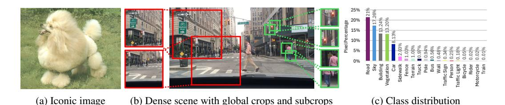

Figure 1: Challenges of SSL on dense, naturalistic video include training on crowded scenes with many objects of varying scale and class imbalance. (a) Iconic image from ImageNet. (b) Dense scene from BDD100K. Global crops (red boxes) used for iconic data contain multiple, disjoint sets of objects. Subcrops (green boxes) provide pseudo-iconic views of a single subject. (c) Naturalistic video like BDD100K have a long-tailed class distribution of class sizes and frequency; classes ordered by percentage of pixels. Example subcrops capture smaller classes like "Traffic Light" and "Person."

Some dense SSL methods (Wang et al., 2021b; Parthasarathy et al., 2023; Venkataramanan et al., 2024) include losses that optimize a global, pooled representation to learn semantic information from dense scenes, but do not explore how to integrate these two objectives through means of architecture and augmentation strategies.

To address the challenges of cluttered scenes and spatial imbalance, we propose a joint **Poo**led and **D**ense **L**earning (PooDLe) method that optimizes a dense SSL objective over full images and a pooled objective on smaller, semantically-aligned views. The combination of objectives captures both high-level semantics and fine-grained details, effectively representing both small objects and scene-level understanding. Our dense objective is adopted from FlowE, using optical flow warping to align dense feature maps. To adapt the pooled objective to dense scene data, we introduce a flow-informed cropping procedure that generates pairs of smaller "subcrops" with high alignment. These subcrops serve as pseudo-iconic views of foreground objects, functionally increasing the prevalence of smaller objects (Figure 1). Finally, we introduce a lightweight spatial decoder module (SDM) with top-down layers and UNet-like lateral connections (Ronneberger et al., 2015) to upsample high-level semantic representations and preserve smaller objects in the dense objective. We show that both objectives, combined with the SDM, is essential for capturing the semantics of smaller objects and achieving strong downstream task performance.

We pretrain on BDD100K, a dataset of dashcam driving videos as well as Walking Tours, a dataset of first-person walking videos (Venkataramanan et al., 2024). PooDLe achieves state-of-the-art performance on semantic segmentation and object detection benchmarks, with a notable gain on recognizing small objects. We also introduce Walking Tours Semantic (WT-Sem) as a new indistribution semantic segmentation evaluation for Walking Tours. In our ablations, we show that our joint objective formulation and the SDM are critical for success. Finally, we study the effect of crop area, input resolution, number of subcrops and temporal stride.

In summary, our contributions are as follows:

- 1. We introduce PooDLe, a new SSL method which overcomes the challenges of spatial imbalance and cluttered scenes by unifying a flow equivariance, dense SSL objective and a pooled objective over pseudo-iconic subcrops alongside a spatial decoder module to effectively learn from naturalistic video. PooDLe achieves state-of-the-art performance on BDD100K (Yu et al., 2020) and Cityscapes (Cordts et al., 2016) semantic segmentation and BDD object detection. It also obtains the highest mIoU on ADE20K (Zhou et al., 2017), and on WT-Sem, our new, in-distribution semantic segmentation task for Walking Tours.
- 2. We deconstruct the BDD100K semantic segmentation task, identifying class categories by frequency and size within the dataset. We show that existing dense SSL methods and supervised ImageNet training produce different results across these categories, while PooDLe learns a balanced semantic and spatial representation to achieve strong, consistent performance.
- 3. We study the effects of global and subcrop area, input resolution and temporal stride between paired frames. We show the importance of maintaining pixel density by adjusting crop area when training with larger resolutions for learning visual representations. We also verified that smaller subcrop areas are able to better capture smaller classes. We believe these observations will be helpful in guiding future work on dense, naturalistic data.

# 2 RELATED WORK

Self-supervised learning with iconic images. Representation learning on iconic image datasets has a long history, from denoising autoencoders [\(Vincent et al.,](#page-12-5) [2010\)](#page-12-5) to joint embedding methods [\(Chen](#page-10-0) [et al.,](#page-10-0) [2020;](#page-10-0) [He et al.,](#page-11-2) [2020;](#page-11-2) [Grill et al.,](#page-11-0) [2020;](#page-11-0) [Zbontar et al.,](#page-13-3) [2021;](#page-13-3) [Bardes et al.,](#page-10-3) [2021;](#page-10-3) [Caron et al.,](#page-10-2) [2021\)](#page-10-2) to joint-embedding predictive architectures [\(Assran et al.,](#page-10-4) [2023;](#page-10-4) [Bardes et al.,](#page-10-7) [2023b\)](#page-10-7). Joint embedding methods learn representation invariance to visual changes produced by augmentations using contrastive [\(Chen et al.,](#page-10-0) [2020;](#page-10-0) [Oord et al.,](#page-12-6) [2018\)](#page-12-6), mean squared error [\(Grill et al.,](#page-11-0) [2020\)](#page-11-0), or classification [\(Caron et al.,](#page-10-2) [2021;](#page-10-2) [2020\)](#page-10-8) losses between corresponding pairs, pushing SSL to new heights on ImageNet classification. Later works extend these methods to curated, internet-scale data [\(Oquab et al.,](#page-12-7) [2023\)](#page-12-7) and include other modalities like text [\(Radford et al.,](#page-12-8) [2021\)](#page-12-8). Separately, MAE [\(He et al.,](#page-11-1) [2022\)](#page-11-1) learns via reconstruction of masked image regions. iBOT [\(Zhou et al.,](#page-13-4) [2021\)](#page-13-4) combines joint embedding methods with token reconstruction to achieve impressive results on ImageNet classification. The methods above have been primarily designed for iconic images and contain assumptions that may not transfer well to uncurated datasets, e.g. dense scenes. Methods leveraging multi-crop [\(Caron et al.,](#page-10-8) [2020;](#page-10-8) [2021;](#page-10-2) [Oquab et al.,](#page-12-7) [2023;](#page-12-7) [Zhou et al.,](#page-13-4) [2021\)](#page-13-4) generate small crops optimized to predict the representations of global crops for training on iconic images with little additional compute. In contrast, our subcrop strategy yields small, aligned crops as pseudo-iconic, paired views from otherwise dense scenes.

Training using dense multi-subject images. Following the success of SSL on ImageNet, other works seek to learn from dense, multi-subject images where augmented views may not contain corresponding subjects for invariance learning. [Wang et al.](#page-12-2) [\(2021b\)](#page-12-2); [Xie et al.](#page-13-5) [\(2021\)](#page-13-5); [Chen et al.](#page-10-9) [\(2021\)](#page-10-9) extend joint embedding methods by leveraging feature similarity bootstrapped from standard invariance learning to identify positive pairs across dense, unpooled feature maps. [Hénaff et al.](#page-11-4) [\(2021\)](#page-11-4); [Wang et al.](#page-12-9) [\(2021a\)](#page-12-9) optimize dense losses, contrasting pixels belonging to different semantic classes; these methods require off-the-shelf segmentation modules. [Ziegler & Asano](#page-13-6) [\(2022\)](#page-13-6); [Guo et al.](#page-11-5) [\(2023\)](#page-11-5) utilize DINO [\(Caron et al.,](#page-10-2) [2021\)](#page-10-2) attention maps to identify training pairs, while ADCLR [\(Zhang et al.,](#page-13-7) [2023b\)](#page-13-7) identifies pairs using small "query" crops and the patches that attend to them. These methods advance the ability to learn from dense images with multiple objects, but still have limitations. Some rely on learning objectives that make assumptions about iconic data, while others struggle with the spatial imbalance problem that is especially prevalent in naturalistic data.

Learning image representations from video data. Extending beyond images, other works have sought to capture the variance of objects through time by training on pairs of video frames. [Gordon](#page-11-6) [et al.](#page-11-6) [\(2020\)](#page-11-6) adapts contrastive learning to use correlated frames as positive examples, while [Jabri et al.](#page-11-7) [\(2020\)](#page-11-7); [Parthasarathy et al.](#page-12-3) [\(2023\)](#page-12-3) identify positive pairs based on high similarity in representation space. FlowE [\(Xiong et al.,](#page-13-0) [2021\)](#page-13-0) builds on BYOL [\(Grill et al.,](#page-11-0) [2020\)](#page-11-0) and identifies positive spatial regions between frames using off-the-shelf flow. MC-JEPA [\(Bardes et al.,](#page-10-7) [2023b\)](#page-10-7) learns motion using video data by aligning latent representations throughout the feature pyramid while performing representation learning on ImageNet. Most recently, DoRA [\(Venkataramanan et al.,](#page-12-1) [2024\)](#page-12-1) proposes a new dense video dataset and extends DINO by clustering over many frames to identify and track objects for representation learning. In the MAE paradigm, [Tong et al.](#page-12-10) [\(2022\)](#page-12-10); [Feichtenhofer et al.](#page-11-8) [\(2022\)](#page-11-8) directly reconstruct sequences of frames while [Weinzaepfel et al.](#page-12-11) [\(2022\)](#page-12-11); [Gupta et al.](#page-11-9) [\(2023\)](#page-11-9) perform reconstruction given a corresponding overlapping frame. While PooDLe learns a rich image representation from video data similar to these existing methods, it distinguishes itself by leveraging a unified dense and pooled objective architecture, specifically designed to tackle the challenges posed by naturalistic data.

# 3 POODLE : POOLED AND DENSE LEARNING FROM NATURALISTIC VIDEOS

We present PooDLe, a self-supervised method for learning visual representations using paired frames from naturalistic, first-person videos. PooDLe combines two SSL objectives: a *dense* objective for learning representations of dense, crowded scenes; and a *pooled* objective on small subcrops sampled using flow-aware cropping augmentations. We also propose a lightweight spatial decoder module (SDM) that uses top-down decoder layers and UNet-like *lateral* connections to earlier encoder representations to both upsample the high-level representations and resurface fine-grained details and small objects that may get lost in downsampling operations. For a high-level overview of PooDLe, see Figure [2.](#page-3-0)

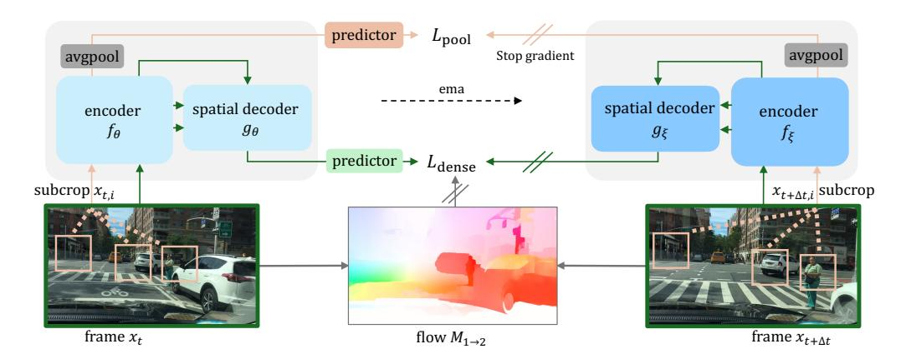

Figure 2: PooDLe, a self-supervised learning method that combines pooled and dense objectives. Green path: dense objective performing flow-equivariance learning on the output of the decoder  $g(\cdot)$ . Orange path: pooled objective encoding K subcrops sampled with flow-informed cropping. Projector modules are not shown. Offline weights  $\xi$  are the exponential moving average of online weights  $\theta$ .

**Preliminaries.** Inputs to the model are video frame pairs  $x_t, x_{t+\Delta t}$  with dimensions  $H \times W$ , and dense optical flow  $M_{t\to t+\Delta t}$ . Randomly sampled augmentations  $A_1$  and  $A_2$  are applied to each example to create positive training pairs. In a similar setup to BYOL, the encoder and projector are denoted as a function p = f(x) using either online weights  $\theta$  or offline, EMA-updated weights  $\xi$ . The predictor module  $q_{\theta}(\cdot)$  only has online weights  $\theta$ . Separate projector and predictor modules are used for the pooled and dense objectives, but are not annotated for simplicity. We use a ResNet-50 backbone, as well as projectors and predictors following FlowE (Xiong et al., 2021) and BYOL (Grill et al., 2020), that are discarded after pretraining.

**Dense SSL with flow equivariance.** The dense objective follows FlowE (Xiong et al., 2021) by using optical flow  $M_{t\to t+\Delta t}$  to align paired feature projections  $p_t$  and  $p_{t+\Delta t}$ . At a high-level, this objective minimizes differences in representation between corresponding regions. More specifically, the inverse augmentation functions  $A^{-1}$  and optical flow are used to align the representations p and after upsampling to input resolution  $H\times W$ , the objective is the squared error:

$$\mathcal{L}_{\text{dense}} = \frac{1}{HW} \| q_{\theta}(A_1^{-1}(\boldsymbol{p}_t)) - (M_{t \to t + \Delta t} \circ A_2^{-1})(\boldsymbol{p}_{t + \Delta t}) \|_2^2,$$
(1)

where normalization is applied after the predictor and flow warping.

**Pooled objective with flow-informed subcrops.** First, we identify K pseudo-iconic subcrop pairs. Unlike for iconic data, random crops from paired frames are unlikely to contain a common subject. To mitigate this problem, we once again use optical flow in a *flow-informed* cropping procedure to identify aligned training pairs. For each subcrop pair, we sample a random point (u, v) in the target frame  $\boldsymbol{x}_{t+\Delta t}$  to serve as the crop center. It is then warped into the earlier frame  $\boldsymbol{x}_t$  using flow  $M_{t\to t+\Delta t}$  plus random jitter  $(\delta_u, \delta_t)$  for paired center (u', v'). A crop is made around each center, with an area sampled from  $U[s_{\min}, s_{\max}]$  of the global crop for subcrops  $\boldsymbol{x}_{t,i}$  and  $\boldsymbol{x}_{t+\Delta t,i}$ .

As we require both crop centers to land within the bounds of the image, subcrops tend to be centerbiased (Peng et al., 2022) and lack diversity. To remedy this, we employ a grid-sampling procedure for selecting the initial crop center (u,v). Each global crop  $\boldsymbol{x}$  is divided into a grid with cells of side length  $d_{\rm grid} = \min(H,W) \times \sqrt{(s_{\rm min} + s_{\rm max})/2}$  for a  $H/d_{\rm grid} \times W/d_{\rm grid}$  grid. Each cell is selected without replacement, and a center (u,v) is then uniformly sampled within the cell.

After K pairs  $(x_{t,k}, x_{t+\Delta t,k})$  are generated, they are encoded by the backbone and the pooled objective projector. Unlike the dense objective, no alignment or upsampling is performed, and each projection p is averaged-pooled over its spatial dimensions before computing the loss:

$$\mathcal{L}_{\text{pool}} = \frac{1}{K} \sum_{t}^{K} \| q_{\theta}(\bar{p}_{t,k}) - \bar{p}_{t+\Delta t,k} \|_{2}^{2},$$
 (2)

where - denotes average pooling over spatial dimensions followed by normalization. Our objective has each subcrop to predict its corresponding pair, which contains the same object in a different frame.

This differs from multi-crop [\(Caron et al.,](#page-10-8) [2020\)](#page-10-8), where local crops predict global crops, which would be less effective for dense scenes as local crops only capture a subset of the objects in a frame.

Spatial Decoder Module (SDM). We introduce the SDM (Figure [3b\)](#page-4-0) to upsample high-level encoder features and preserve information from lower layers, particularly smaller foreground objects that may be lost during pooling operations. Its design draws inspiration from a convolutional UNet [\(Ronneberger](#page-12-4) [et al.,](#page-12-4) [2015\)](#page-12-4) and FPN [\(Lin et al.,](#page-11-10) [2017\)](#page-11-10) and improves upon FlowE's use of dilated convolutions to replace pooling by efficiently maintaining high-resolution representations while reducing activations and memory usage.

The SDM utilizes decoder blocks, each consisting of an *upsample* operation, a computation block of processing layers g(·), and a UNet-like *lateral* connection. The output of each block is computed as:

$$\boldsymbol{z}^{l+1} = g(\operatorname{upsample}(\boldsymbol{z}^{(l)})) + \operatorname{lateral}(\boldsymbol{z}^{j}), \tag{3}$$

where z (l) is the representation after the l th encoder stage and z (j) is an earlier feature map of the same spatial dimensions as z (l+1). The use of computation blocks and lateral connections is ablated in Table [4.](#page-7-0) Figure [3](#page-4-0) contrasts a naive implementation that places both objectives at the top encoder level and Poo-DLe, which uses the SDM to integrate the two objectives in a complementary fashion.

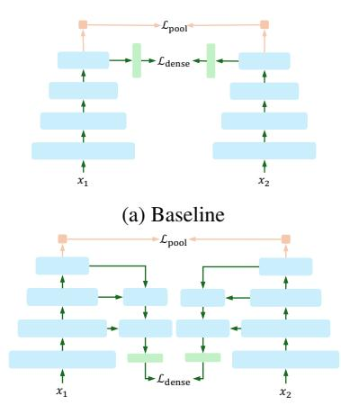

(b) PooDLe using SDM

Figure 3: a) Baseline: both losses combined at final encoder layer; b)PooDLe: SDM incorporates earlier feature maps, upsampling for Ldense.

### 4 EXPERIMENTS

We pretrain PooDLe on raw videos from BDD100K [\(Yu et al.,](#page-13-1) [2020\)](#page-13-1) and Walking Tours (WT) [\(Venkataramanan et al.,](#page-12-1) [2024\)](#page-12-1) and evaluate them on semantic segmentation and object detection benchmarks. The BDD100K pretrained model is evaluated on in-distribution tasks as well as Cityscapes [\(Cordts et al.,](#page-10-6) [2016\)](#page-10-6), and the Walking Tours model on ADE20K [\(Agrawal et al.,](#page-10-10) [2015\)](#page-10-10) and our newly proposed Walking Tours Semantic benchmark. We also ablate our combination of loss functions and decoder components, as well as the effects of crop area and input resolutions.

#### 4.1 EXPERIMENT SETUP

Pretraining datasets. 1) BDD [\(Yu et al.,](#page-13-1) [2020\)](#page-13-1) consists of 100,000 dashcam driving videos collected in various weather conditions and times of day from New York and the San Francisco Bay Area. Each video is ~40 seconds long at 720p and 30 fps. We pretrain with the 70,000 videos in the training split and evaluate on the dataset's semantic segmentation and object detection tasks. 2) Walking Tours (WT) [\(Venkataramanan et al.,](#page-12-1) [2024\)](#page-12-1) is a dataset of first-person YouTube videos of a continuous walkaround through various cities of Europe, Asia, and a wildlife safari. There are 10 videos, ranging from 59 minutes to 2 hours 55 minutes, at 720p and 30 fps. Each video contains large numbers of unique objects per frame and natural transitions in lighting and location. We use either the Venice video (WTVenice) or all 10 videos (WTall) following DoRA [\(Venkataramanan et al.,](#page-12-1) [2024\)](#page-12-1).

Technical details. We use ResNet-50 (R50) [\(He et al.,](#page-11-11) [2016a\)](#page-11-11) as our feature encoder, with the dense projector and predictor networks following FlowE [\(Xiong et al.,](#page-13-0) [2021\)](#page-13-0) and pooled counterparts following BYOL [\(Grill et al.,](#page-11-0) [2020\)](#page-11-0). For SDM, we use two decoder stages, with each consisting of a 2× upsample, a ResNet Bottleneck Block [\(He et al.,](#page-11-11) [2016a\)](#page-11-11), and a 2-layer convolutional MLP for the lateral connection. When training on BDD, we sample two frames that are 0.5 ∼ 1 seconds apart (∆t ∈ {15...30}) from each video. We then take two large crops from the same image coordinates of area [0.16, 0.45] of the original image and resize them to 512 × 1024 pixels before applying augmentations. For each training epoch on WT, we divide each video into 10-second clips and randomly sample two frames 0.5 seconds apart from each clip, and use crop area range [0.65, 1.0]. For both datasets, we apply color distortion and Gaussian blurring independently to each frame following BYOL [\(Grill et al.,](#page-11-0) [2020\)](#page-11-0). For the dense objective, we also apply random reversible affine transformations similar to FlowE [\(Xiong et al.,](#page-13-0) [2021\)](#page-13-0): random scaling of 0.9–1.1× and rotation of -10–10 degrees. For the local objective, we sample K = 6 subcrop pairs with a crop area of

Table 1: BDD and CityScapes semantic segmentation (SemSeg) and object detection (Det) readout evaluations. All settings are conducted with a frozen backbone. \*Pretrained on BDD, initialized with supervised IN1K weights.

|                                    |       |     |          | BD           | D100K      | Sem. Se             | g.         | BDD100K       | Obj. Det.  | Cit          | yscapes    | Sem. Se      | g.         |
|------------------------------------|-------|-----|----------|--------------|------------|---------------------|------------|---------------|------------|--------------|------------|--------------|------------|
| Method                             | Arch  | Ep. | Pretrain | Line mIoU | ear Acc | <b>Uper</b> mIoU | Net Acc | Det C4 mAP | FPN mAP | Line mIoU | ear Acc | Uper mIoU | Net Acc |
| Scratch                            | R50   | -   | -        | 9.7          | 55.0       | 26.1                | 81.2       | 0.0           | 7.7        | 9.8          | 58.0       | 30.7         | 84.1       |
| DINO (Caron et al., 2021)          | ViT-S | 300 | BDD      | 29.6         | 86.8       | 41.1                | 90.1       | -             | -          | 35.1         | 87.9       | 51.5         | 91.9       |
| iBOT (Zhou et al., 2021)           | ViT-S | 800 | BDD      | 27.2         | 85.4       | 35.5                | 88.7       | -             | -          | 32.0         | 86.2       | 44.0         | 90.3       |
| DoRA (Venkataramanan et al., 2024) | ViT-S | 200 | BDD      | 33.2         | 88.1       | 43.3                | 90.7       | -             | -          | 37.4         | 88.7       | 50.8         | 92.0       |
| DINO (Caron et al., 2021)          | R50   | 100 | BDD      | 13.1         | 64.7       | 25.6                | 80.3       | 0.3           | 11.9       | 14.9         | 69.4       | 29.2         | 81.4       |
| PixPro (Xie et al., 2021)          | R50   | 100 | BDD      | 21.8         | 80.0       | 37.3                | 88.0       | 0.7           | 18.4       | 25.5         | 81.0       | 44.3         | 89.5       |
| DenseCL (Wang et al., 2021b)       | R50   | 100 | BDD      | 24.2         | 84.9       | 41.8                | 90.0       | 0.7           | 20.3       | 26.6         | 85.6       | 53.2         | 91.9       |
| FlowE (Xiong et al., 2021)         | R50   | 100 | BDD      | 35.7         | 88.5       | 47.3                | 91.5       | 3.2           | 23.8       | 43.1         | 89.5       | 57.7         | 93.1       |
| PooDLe                             | R50   | 100 | BDD      | 39.2         | 89.2       | 49.9                | 91.8       | 4.9           | 25.2       | 47.2         | 90.2       | 60.7         | 93.5       |
| Supervised                         | R50   | 600 | IN1K     | 36.7         | 84.7       | 55.2                | 92.0       | 3.6           | 24.9       | 46.8         | 87.4       | 63.4         | 93.7       |
| PooDLe                             | R50   | 100 | BDD*     | 44.7         | 90.7       | 54.1                | 92.7       | 3.9           | 28.0       | 52.0         | 91.5       | 65.1         | 94.4       |

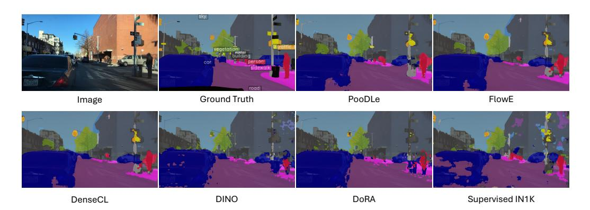

Figure 4: Visualization of BDD semantic segmentation linear readout. PooDLe is able to identify smaller objects and generate cleaner object boundaries.

[0.05, 0.3] of the initial crop, resized to  $192 \times 192$  for both BDD and WT. For subcrops, random spatial jitter is applied as  $\pm 10\%$  of the initial crops' height and width.

**Baselines.** We use official implementations of DenseCL, PixPro, DINO, iBOT, and DoRA, and our own implementation of FlowE for pretraining on BDD. We use torchvision for supervised ImageNet (IN1K) and weights released online for ImageNet-pretrained DINO. We obtain weights from the authors of DoRA for iBOT, DINO-ViT, and DoRA pretrained on WT and use official implementations of DINO-R50, MAE, and PixPro for pretraining on WT. For PixPro, we use either its FPN decoder or high-resolution crops for pretraining and report results from the best-performing setting. We use  $512 \times 1024$  crops to train all R50 baselines for more accurate comparisons.

**Evaluation.** We adopt the evaluation protocol from FlowE (Xiong et al., 2021) for BDD and Cityscapes. We use DeepLab v1 (Chen et al., 2018) as the "linear" readout header and UperNet (Xiao et al., 2018) as the heavier readout head for semantic segmentation and Faster R-CNN with ResNet-C4 and Faster R-CNN with FPN (He et al., 2016b) as the standard and heavier readout headers for object detection. We do not include ViT object detection due to the lack of an established recipe. For semantic segmentation on ADE20K, we perform both linear readout following BDD and UperNet finetuning as described in iBOT (Zhou et al., 2021). We retain the SDM when evaluating PooDLe on semantic segmentation with linear readouts but discard it when using UperNet. We report mean intersection-over-union (mIoU), pixel-level accuracy (Acc), and mean average precision (mAP) as our evaluation metrics. Additional details on implementation and hyperparameters are provided in Appendix A.

#### 4.2 MAIN RESULTS

**BDD100K-pretrained models.** We report our results on semantic segmentation and object detection on the BDD100K benchmark in Table 1. PooDLe achieves superior performance on all readout tasks compared to prior methods, outperforming the strongest baseline FlowE by 3.5% mIoU on linear

Table 2: ADE20K and WT-Sem semantic segmentation linear readout and finetuning evaluations. Linear readout is performed with a frozen backbone while in finetuning, backbone parameters are trainable. † DINO-ViT and iBOT results are taken from DoRA (Venkataramanan et al., 2024).

|                                        |       |       |               |                | DE20K S       |               |      |                | T-Sem S       |               |             |
|----------------------------------------|-------|-------|---------------|----------------|---------------|---------------|------|----------------|---------------|---------------|-------------|
| Method                                 | Arch  | Epoch | Pretrain      | SemSeg mIoU | Linear Acc | Finet mIoU | Acc  | SemSeg mIoU | Linear Acc | Finet mIoU | tune Acc |
| DINO (Caron et al., 2021)              | R50   | 800   | IN1K          | 15.7           | 61.5          | 43.0          | 80.5 | 8.8            | 76.7          | 17.8          | 87.6        |
| DINO (Caron et al., 2021) † | ViT-S | 100   | IN1K          | -              | -             | 33.9          | -    | -              | -             | -             | -           |
| DINO (Caron et al., 2021)              | ViT-S | 100   | $WT_{Venice}$ | 7.8            | 57.7          | 29.2          | 74.7 | 4.6            | 73.7          | 11.0          | 83.0        |
| iBOT (Zhou et al., 2021) †  | ViT-S | 100   | $WT_{Venice}$ | -              | -             | 33.9          | -    | -              | -             | -             | -           |
| MAE (He et al., 2022)                  | ViT-S | 100   | $WT_{Venice}$ | 7.4            | 55.1          | 24.1          | 71.4 | 4.3            | 72.6          | 8.9           | 81.5        |
| DoRA (Venkataramanan et al., 2024)     | ViT-S | 100   | $WT_{Venice}$ | 14.1           | 63.5          | 35.2          | 77.7 | 6.2            | 76.9          | 13.6          | 85.7        |
| DINO (Caron et al., 2021)              | R50   | 100   | $WT_{Venice}$ | 6.9            | 48.2          | 35.7          | 77.4 | 4.2            | 69.0          | 12.3          | 84.7        |
| PixPro (Xie et al., 2021)              | R50   | 100   | $WT_{Venice}$ | 4.6            | 48.6          | 36.0          | 77.6 | 3.7            | 69.3          | 11.5          | 84.2        |
| PooDLe                                 | R50   | 20    | $WT_{Venice}$ | 14.6           | 59.0          | 36.6          | 77.9 | 6.4            | 75.7          | 13.7          | 85.4        |
| DINO (Caron et al., 2021) † | ViT-S | 100   | $WT_{all}$    | -              | -             | 34.1          | -    | -              | -             | -             | -           |
| MAE (He et al., 2022)                  | ViT-S | 100   | $WT_{all}$    | 10.6           | 60.4          | 31.4          | 75.9 | 6.6            | 77.7          | 12.7          | 85.2        |
| DoRA (Venkataramanan et al., 2024)     | ViT-S | 100   | $WT_{all}$    | 13.9           | 64.4          | 38.3          | 79.3 | 7.8            | 79.4          | 15.9          | 87.5        |
| PooDLe                                 | R50   | 20    | $WT_{all}$    | 16.5           | 63.9          | 41.0          | 79.6 | 11.2           | 81.3          | 17.0          | 86.9        |

Table 3: Breakdowns of mIoU over different class groupings. Linear readout mIoU is computed over various groupings of the 19 classes in BDD semantic segmentation. \*Pretrained on BDD, initialized with supervised ImageNet weights.

| Method     | Pretrain | All  | Small | Large | Rare | Common |
|------------|----------|------|-------|-------|------|--------|
| DINO       | BDD      | 29.6 | 8.4   | 42.0  | 1.0  | 42.8   |
| DenseCL    | BDD      | 24.2 | 1.6   | 37.4  | 0.0  | 35.4   |
| DoRA       | BDD      | 33.2 | 11.9  | 45.6  | 2.8  | 47.3   |
| FlowE      | BDD      | 35.7 | 12.2  | 49.3  | 10.7 | 47.2   |
| PooDLe     | BDD      | 39.2 | 18.3  | 51.4  | 12.0 | 51.8   |
| Supervised | IN1K     | 36.7 | 27.2  | 42.2  | 16.1 | 46.2   |
| PooDLe     | BDD*     | 44.7 | 25.2  | 56.1  | 17.9 | 57.1   |

and 2.6% mIoU on UperNet for semantic segmentation, and 1.7% mAP on C4 and 1.4% mAP on FPN for object detection. We find that that PooDLe's improved performance (Table 3) is attributed to better recognition of small and rare object classes. We also evaluate the transfer of PooDLe representations to new tasks by evaluating on the Cityscapes benchmark, where PooDLe outperforms all baselines. Figure 4 shows predicted segmentation masks, and Figure 14 and Figure 15 show additional evaluation results.

PooDLe also outperforms supervised IN1K pretraining, despite the latter's advantage in learning small and rare classes present in BDD100K (spatial imbalance shown in Figure 1) due to ImageNet being a class-balanced dataset with iconic views of objects. In addition, we pretrain PooDLe on BDD100K with weights initialized from the supervised IN1K checkpoint, improving mIoU by 8% and Acc by 6% over the initialization weights on linear semantic segmentation. In Appendix G, we show PooDLe remains competitive against IN1K-pretrained baselines despite being trained in the challenging naturalistic video setting.

WT-pretrained models. We also train PooDLe on WTVenice and WTall. Table 2 shows results on ADE20K (Zhou et al., 2017) semantic segmentation using linear readout and finetuning following (Venkataramanan et al., 2024). Notably, when pretrained on WTall, PooDLe obtains 2.6% higher mIoU than DoRA on ADE20K linear readout, and 2.7% mIoU on UperNet finetuning. PooDLe also performs better on WTVenice, with a gain of 1.4% mIoU over DoRA and 0.6% mIoU over PixPro on ADE20K UperNet finetuning. We note that PooDLe uses a smaller ResNet-50 backbone and is trained for fewer epochs than DoRA, the strongest baseline. Despite these differences, these results show that PooDLe learns strong representations from naturalistic video captured in the open world. Figure 16 shows predicted segmentation masks for ADE20K.

**Walking Tours Semantic benchmark.** While ADE20K is a challenging benchmark, it contains a mixture of indoor and outdoor scenes that can be out-of-distribution from scenes in Walking Tours. Therefore, we introduce Walking Tours Semantic (WT-Sem) to provide a more in-distribution bench-

Table 4: Ablation studies on PooDLe components, reporting mIoU on BDD100K semantic segmentation linear readout. Rows without top-down follow FlowE (Xiong et al., 2021), replacing pooling with dilated convolutions to maintain spatial extent. †Flow model trained without supervised labels.

| Variant   | Dense    | Pool | Top-Down | Lateral | Flow  | All  | Small | Large | Rare | Common |
|-----------|----------|------|----------|---------|-------|------|-------|-------|------|--------|
| 1 FlowE   | <b>/</b> |      |          |         | RAFT  | 28.8 | 8.7   | 40.5  | 1.8  | 29.2   |
| 2         | 1        | /    |          |         | RAFT  | 28.9 | 7.2   | 41.6  | 2.2  | 28.7   |
| 3         | 1        | 1    | ✓        |         | RAFT  | 30.3 | 6.8   | 44.0  | 4.3  | 30.2   |
| 4         | 1        | 1    |          | /       | RAFT  | 30.3 | 10.9  | 41.7  | 2.4  | 31.1   |
| 5         | 1        |      | ✓        | ✓       | RAFT  | 31.8 | 12.8  | 42.8  | 8.3  | 31.7   |
| 6 PooDLe† | 1        | /    | ✓        | ✓       | UFlow | 33.7 | 14.1  | 45.1  | 8.9  | 33.8   |
| 7 PooDLe  | 1        | 1    | ✓        | ✓       | RAFT  | 34.2 | 15.0  | 45.5  | 9.0  | 34.5   |

| Subcrop area                                             |                              | classes large           | all                        | 36 34 34 39                                                                                           |
|----------------------------------------------------------|------------------------------|----------------------------|----------------------------|-------------------------------------------------------------------------------------------------------|
| 0.04 - 0.18 0.18 - 0.36 0.36 - 0.54 0.54 - 1.00 | 16.0 14.2 13.6 12.3 | <b>41.6</b> 41.2 39.5 38.8 | <b>34.6</b> 33.7 32.4 31.5 | 28 128x256 256x512 512x1024 82 128x256 256x512 512x1024                                               |
|                                                          |                              |                            |                            | 0.05 0.125 0.2 0.275 0.425 0.725 0.05 0.125 0.2 0.275 0.425 0.725 mean crop area 0.725 mean crop area |

Table 5: Choice of **subcrop area** on small, large and all classes.

Figure 5: Varying **input resolution** and **global crop area** as a fraction of the full frame. Large resolutions prefer larger crops.

mark to accompany the WT dataset. We find that when pretrained on  $WT_{all}$ , PooDLe outperforms DoRA (Venkataramanan et al., 2024) by 3.4% and 1.1% mIoU on linear readout and UperNet finetuning, respectively. To generate the dataset, we use OpenSeeD (Zhang et al., 2023a), a strong open-vocabulary segmentation model, to generate semantic segmentation masks for all videos in  $WT_{all}$  as well as 3 new walkaround videos. We use the Swin-L (Liu et al., 2021) variant of OpenSeeD finetuned on ADE20K semantic segmentation with a vocabulary of the 150 class labels from ADE20K to generate masks. See Appendix D for visualizations and details of WT-Sem.

Class-based performance and IN1K initialization. Naturalistic videos have imbalanced class representation and object sizes (Figure 1c; e.g., "road" occupies 21% of pixels while "bicycle" only occupies 0.05% of pixels). Capturing information on these underrepresented classes is very challenging. To further demonstrate this phenomenon, we categorize BDD classes as "small" if they occupy <1% of pixels and "large" for those that occupy >1%. Separately, we define "rare" as classes that appear in <20% of images and "common" as those that appear in >20%. Table 3 shows linear readout mIoU for different class groupings, highlighting the impact of class and spatial imbalance. Full class-level statistics and designations are in Appendix H. We observe that FlowE performs well on large and common classes due to its dense loss, but struggles on small or rare classes. Meanwhile, supervised IN1K, benefiting from balanced pretraining data, effectively learns about smaller classes. PooDLe, with its unified objectives and spatial decoder module, significantly outperforms other BDD-pretrained models across all class groupings, particularly on small and rare classes. PooDLe, initialized from supervised IN1K weights, significantly improves upon supervised IN1K on large classes, from 42.2% to 56.1%, due to the dense objective, while remaining competitive with supervised IN1K on small classes.

#### 4.3 ABLATION STUDIES

Table 4 shows ablation experiments, testing each of our contributions beginning from FlowE. Models trained without the decoder use dilated convolutions in place of pooling operations, as in FlowE (Xiong et al., 2021). Figure 3 shows how the dense and pooled objectives are composed with and without the decoder. For the ablations, models are trained for 40 epochs on BDD and use a reduced  $256 \times 512$  resolution and [0.04, 0.11] area for the initial crops; we evaluate on BDD semantic segmentation using linear readout.

We observe that adding  $\mathcal{L}_{pool}$  alone has little benefit (row 2) and including either the decoder as a spatial upsampler (row 3) or only the UNet-style lateral connections (row 4) also does not yield much benefit. Row 5 achieves +3% mIoU, showing that the top-down decoder is only effective when

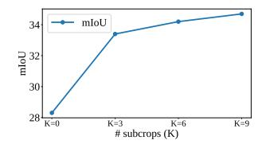

Figure 6: Varying initial crop area as a percent of the full frame. As Figure 7: mIoU when varying crop area decreases, the views transition from global views of a dense number of subcrops K. scene to pseudo-iconic views, sometimes depicting singular subjects.

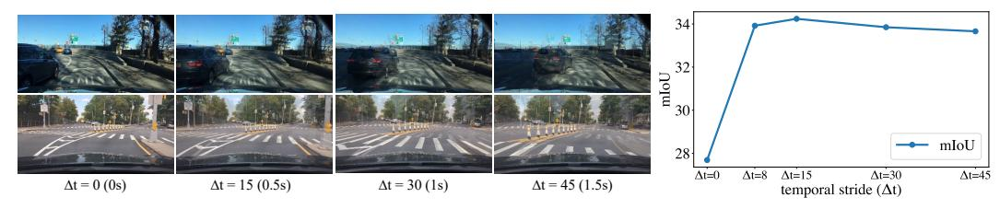

Figure 8: Overlaid frames with varying  $\Delta t$ .

Figure 9: mIoU when varying  $\Delta t$ .

combined with the lateral connections for the full SDM, suggesting that preserving high-resolution information as well as including some capacity for feature processing are both important. However, when re-adding the pooled loss in addition to the decoder with lateral connections (row 7), we see a substantial 5.4% mIoU improvement. While the dense objective benefits from the full SDM, it has an even greater synergistic effect with the pooled loss. This may be because the pooled objective with subcrops can effectively learn about small objects while the full decoder helps propagate the semantic representations through to the dense loss.

We also demonstrate that PooDLe is able to perform well even with self-supervised flow. We train UFlow (Jonschkowski et al., 2020) model on KITTI (Geiger et al., 2013) and finetune it on BDD resulting in only a 0.5% mIoU loss compared to pretraining with RAFT. See Appendix A and J for details and visualizations.

#### 4.4 SPATIAL AND TEMPORAL CROPPING IN SELF-SUPERVISED VIDEO LEARNING

In this section, we study the effect of frame intervals and image cropping parameters used in data augmentation. Without a 1:1 image-to-concept relationship like in iconic data, the visible area of each frame can greatly affect representation learning. To study this, we perform 4 experiments varying: (1) subcrop area, (2) global crop area, (3) number of subcrops, (4) temporal stride  $\Delta t$ . Crop and subcrop area refer to the fraction of the frame taken during random-resized cropping. Figure 6 depicts how crops transition from global to pseudo-iconic with decreasing crop area. Training recipe follows the ablations in section 4.3 and results should be compared to row 7 in Table 4.

Varying subcrop area. First, we study how subcrop area affects our learned representations. We train 4 PooDLes using different subcrop ranges and a fixed global crop area of [0.125, 0.25] at resolution  $256 \times 512$ . Results are shown in Table 5 for all classes, as well as small and large class subgroupings. We observe that larger subcrop areas result in worse performance, with a larger relative drop for smaller classes. This is likely because larger crops contain multiple, smaller objects which breaks the pseudo-iconic assumption and produces false invariances.

Varying global crop area Next, we vary both the global crop area from the raw video frame along with the input resolution to study their effects on self-supervised pretraining. We select 3 different resolutions, and sample the crop area from a Gaussian truncated to [0,1], with varying mean and  $\sigma = 0.1$ . All three resolutions are trained with  $\mu = 0.125, 0.275, 0.425, 0.725$  with the 2 smaller resolutions also trained at  $\mu = 0.05, 0.20$  for higher granularity. Our results in Figure 5 show that larger crop areas and higher input resolutions, together, are important for maximizing performance. The largest model ( $512 \times 1024$ ) produces the best results and peaks at  $\mu = 0.425$  while the other two peak at smaller crop areas. The  $256 \times 512$  model degrades more slowly in performance as crop area increases in comparison to the  $128 \times 256$  model.

**Varying number of subcrops.** We also study how varying the number of subcrops affects performance. We train 4 PooDLes using K=0,3,6,9 subcrops on BDD100K and evaluate using linear readout, with results shown in Figure 7. Using 3 subcrops gives an initially large performance jump, and using additional subcrops provides more modest gains. We decide to use K=6 as our default option to balance between performance and computational efficiency.

Effect of temporal stride during frame sampling. We study the effect of temporal stride by training PooDLe with  $\Delta t=0,8,15,30,45$  on BDD100K, evaluated using linear readout (Figure 9). Performance peaks at  $\Delta t=15$  and degrades only slightly at 8 and, 30 while dropping further at values 0 and 45. When it is small, there is limited variance in object appearance, diminishing the value of video data, and when it is too large, correspondence between frames decreases and optical flow becomes unreliable. Note that for  $\Delta t=0$ , we add jitter to the initial large crop by up to 10% of the image size. Figure 8 shows frame sequences from 2 different videos, highlighting the high variability of motion in BDD100K.

#### 4.5 SUBCROPS AS PSEUDO-ICONIC TRAINING IMAGES

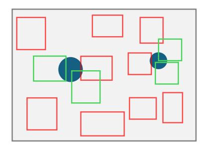

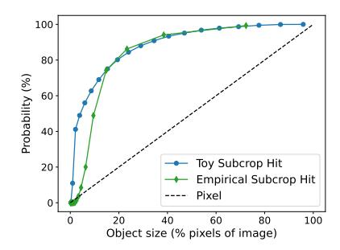

(a) Toy simulation of the probability of subcrop acting hitting a circular object. Subcrop hits are green and non-hits are red.

(b) Subcrop and pixel probabilities for foreground objects of varying size from toy and empirical simulation

Figure 10: Analysis of subcrops as pseudo-iconic views.

To understand the impact of pseudo-iconic subcrops on PooDLe's performance, particularly on small objects, we analyze their effect on object prevalence in the pooled objective. Using a simulated circular object (Figure 10a), we calculate the probability of a subcrop capturing it as a pseudo-iconic view, i.e. subcrop "hit", and compare this to the probability of a pixel landing on the object, emulating a pixel-level dense SSL objective. We count a subcrop hit if it reaches at least 5% object coverage, which we justify as background classes generally have little visual variation and consequently, minimal impact on the pooled representations. We extend this analysis to the BDD100K semantic segmentation dataset, empirically simulating subcrops, and computing subcrop hit and pixel probabilities for varying object sizes. The simulation results, illustrated in Figure 10b, show a greater relative difference between subcrop hit and pixel probabilities for smaller objects, indicating pseudo-iconic subcrops increase their prevalence in the pooled objective. This likely contributes towards PooDLe's improved performance on small object classes compared to dense SSL methods. Further details of the analysis can be found in Appendix C.

#### 5 CONCLUSION

Self-supervised learning on naturalistic videos presents many unsolved challenges, especially due to the presence of high-resolution, multi-object crowded scenes with severe spatial imbalance. Iconic methods rely on single-subject images, and dense methods struggle with the scale imbalance of objects. We propose PooDLe that combines pooled region-invariance learning and dense flow-equivariance learning objectives in a unified framework. PooDLe achieves state-of-the-art performance on downstream semantic segmentation and object detection evaluations compared to prior methods pretrained on the same video datasets, particularly on recognizing small objects. Our study on the effects of crop area, input resolution, and temporal stride also offers key insights on the design choices for video self-supervised learning.

### ACKNOWLEDGEMENTS

We thank Jenny Zhu for her assistance in generating semantic segmentation labels for the WT-Sem dataset. The work is supported in part by the Institute of Information & Communications Technology Planning & Evaluation (IITP) under grant RS-2024-00469482, funded by the Ministry of Science and ICT (MSIT) of the Republic of Korea in connection with the Global AI Frontier Lab International Collaborative Research. AW is supported by the NSERC PGS-D Scholarship. CH is supported by the DoD NDSEG Fellowship. The compute is supported in part through the Microsoft Accelerating Foundation Model Research (AFMR) program, a Google Cloud Platform (GCP) award, and NYU IT's High Performance Computing resources, services, and staff expertise.

# REFERENCES

- Pulkit Agrawal, Joao Carreira, and Jitendra Malik. Learning to see by moving. In *Proceedings of the IEEE International Conference on Computer Vision*, 2015.
- Mahmoud Assran, Quentin Duval, Ishan Misra, Piotr Bojanowski, Pascal Vincent, Michael Rabbat, Yann LeCun, and Nicolas Ballas. Self-supervised learning from images with a joint-embedding predictive architecture. In *Proceedings of the IEEE/CVF Conference on Computer Vision and Pattern Recognition*, 2023.
- Adrien Bardes, Jean Ponce, and Yann LeCun. Vicreg: Variance-invariance-covariance regularization for self-supervised learning. In *International Conference on Learning Representations*, 2021.
- Adrien Bardes, Quentin Garrido, Jean Ponce, Xinlei Chen, Michael Rabbat, Yann LeCun, Mido Assran, and Nicolas Ballas. V-jepa: Latent video prediction for visual representation learning. *arXiv preprint arXiv:2404.08471*, 2023a.
- Adrien Bardes, Jean Ponce, and Yann LeCun. Mc-jepa: A joint-embedding predictive architecture for self-supervised learning of motion and content features. *arXiv preprint arXiv:2307.12698*, 2023b.
- Mathilde Caron, Ishan Misra, Julien Mairal, Priya Goyal, Piotr Bojanowski, and Armand Joulin. Unsupervised learning of visual features by contrasting cluster assignments. In *Advances in Neural Information Processing Systems*, 2020.
- Mathilde Caron, Hugo Touvron, Ishan Misra, Hervé Jégou, Julien Mairal, and Armand Joulin. Emerging properties in self-supervised vision transformers. In *IEEE/CVF International Conference on Computer Vision*, 2021.
- Kai Chen, Lanqing Hong, Hang Xu, Zhenguo Li, and Dit-Yan Yeung. Multisiam: Self-supervised multi-instance siamese representation learning for autonomous driving. In *Proceedings of the IEEE/CVF International Conference on Computer Vision*, 2021.
- Liang-Chieh Chen, George Papandreou, Florian Schroff, and Hartwig Adam. Rethinking atrous convolution for semantic image segmentation. *arXiv preprint arXiv:1706.05587*, 2017.
- Liang-Chieh Chen, George Papandreou, Iasonas Kokkinos, Kevin Murphy, and Alan L. Yuille. Deeplab: Semantic image segmentation with deep convolutional nets, atrous convolution, and fully connected crfs. *IEEE Transactions on Pattern Analysis and Machine Intelligence*, 2018.
- Ting Chen, Simon Kornblith, Mohammad Norouzi, and Geoffrey Hinton. A simple framework for contrastive learning of visual representations. In *International Conference on Machine Learning*, 2020.
- Xinlei Chen and Kaiming He. Exploring simple siamese representation learning. In *Proceedings of the IEEE/CVF Conference on Computer Vision and Pattern Recognition*, 2021.
- Marius Cordts, Mohamed Omran, Sebastian Ramos, Timo Rehfeld, Markus Enzweiler, Rodrigo Benenson, Uwe Franke, Stefan Roth, and Bernt Schiele. The cityscapes dataset for semantic urban scene understanding. In *Proceedings of the IEEE/CVF Conference on Computer Vision and Pattern Recognition*, 2016.

- Jia Deng, Wei Dong, Richard Socher, Li-Jia Li, Kai Li, and Li Fei-Fei. Imagenet: A large-scale hierarchical image database. In *Proceedings of the IEEE/CVF Conference on Computer Vision and Pattern Recognition*, 2009.
- Christoph Feichtenhofer, Yanghao Li, Kaiming He, et al. Masked autoencoders as spatiotemporal learners. In *Advances in Neural Information Processing Systems*, 2022.
- Andreas Geiger, Philip Lenz, Christoph Stiller, and Raquel Urtasun. Vision meets robotics: The kitti dataset. *International Journal of Robotics Research*, 2013.
- Daniel Gordon, Kiana Ehsani, Dieter Fox, and Ali Farhadi. Watching the world go by: Representation learning from unlabeled videos. *arXiv preprint arXiv:2003.07990*, 2020.
- Jean-Bastien Grill, Florian Strub, Florent Altché, Corentin Tallec, Pierre H. Richemond, Elena Buchatskaya, Carl Doersch, Bernardo Ávila Pires, Zhaohan Daniel Guo, Mohammad Gheshlaghi Azar, Bilal Piot, Koray Kavukcuoglu, Rémi Munos, and Michal Valko. Bootstrap your own latent: A new approach to self-supervised learning. In *Advances in Neural Information Processing Systems*, 2020.
- Qiushan Guo, Yizhou Yu, Yi Jiang, Jiannan Wu, Zehuan Yuan, and Ping Luo. Multi-level contrastive learning for dense prediction task. *arXiv preprint arXiv:2304.02010*, 2023.
- Agrim Gupta, Jiajun Wu, Jia Deng, and Fei-Fei Li. Siamese masked autoencoders. In A. Oh, T. Naumann, A. Globerson, K. Saenko, M. Hardt, and S. Levine (eds.), *Advances in Neural Information Processing Systems*, volume 36, pp. 40676–40693. Curran Associates, Inc., 2023.
- Kaiming He, Xiangyu Zhang, Shaoqing Ren, and Jian Sun. Deep residual learning for image recognition. In *Proceedings of the IEEE/CVF Conference on Computer Vision and Pattern Recognition*, 2016a.
- Kaiming He, Xiangyu Zhang, Shaoqing Ren, and Jian Sun. Deep residual learning for image recognition. In *Proceedings of the IEEE/CVF Conference on Computer Vision and Pattern Recognition*, 2016b.
- Kaiming He, Haoqi Fan, Yuxin Wu, Saining Xie, and Ross Girshick. Momentum contrast for unsupervised visual representation learning. In *Proceedings of the IEEE/CVF Conference on Computer Vision and Pattern Recognition*, 2020.
- Kaiming He, Xinlei Chen, Saining Xie, Yanghao Li, Piotr Dollár, and Ross Girshick. Masked autoencoders are scalable vision learners. In *Proceedings of the IEEE/CVF Conference on Computer Vision and Pattern Recognition*, 2022.
- Olivier J Hénaff, Skanda Koppula, Jean-Baptiste Alayrac, Aaron Van den Oord, Oriol Vinyals, and Joao Carreira. Efficient visual pretraining with contrastive detection. In *Proceedings of the IEEE/CVF International Conference on Computer Vision*, 2021.
- Allan Jabri, Andrew Owens, and Alexei Efros. Space-time correspondence as a contrastive random walk. *Advances in Neural Information Processing Systems*, 2020.
- Rico Jonschkowski, Austin Stone, Jonathan Barron, Ariel Gordon, Kurt Konolige, and Anelia Angelova. What matters in unsupervised optical flow. In *European Conference on Computer Vision*, 2020.
- Tsung-Yi Lin, Michael Maire, Serge J. Belongie, James Hays, Pietro Perona, Deva Ramanan, Piotr Dollár, and C. Lawrence Zitnick. Microsoft coco: Common objects in context. In *European Conference on Computer Vision*, 2014.
- Tsung-Yi Lin, Piotr Dollár, Ross Girshick, Kaiming He, Bharath Hariharan, and Serge Belongie. Feature pyramid networks for object detection. In *Proceedings of the IEEE/CVF Conference on Computer Vision and Pattern Recognition*, 2017.
- Pengpeng Liu, Irwin King, Michael R Lyu, and Jia Xu. Ddflow: Learning optical flow with unlabeled data distillation. In *Proceedings of the AAAI Conference on Artificial Intelligence*, 2019.

- Ze Liu, Yutong Lin, Yue Cao, Han Hu, Yixuan Wei, Zheng Zhang, Stephen Lin, and Baining Guo. Swin transformer: Hierarchical vision transformer using shifted windows. In *2021 IEEE/CVF International Conference on Computer Vision*, 2021.
- Aaron van den Oord, Yazhe Li, and Oriol Vinyals. Representation learning with contrastive predictive coding. *arXiv preprint arXiv:1807.03748*, 2018.
- Maxime Oquab, Timothée Darcet, Théo Moutakanni, Huy Vo, Marc Szafraniec, Vasil Khalidov, Pierre Fernandez, Daniel Haziza, Francisco Massa, Alaaeldin El-Nouby, et al. Dinov2: Learning robust visual features without supervision. *Transactions on Machine Learning Research*, 2023.
- Nikhil Parthasarathy, SM Eslami, Joao Carreira, and Olivier Henaff. Self-supervised video pretraining yields robust and more human-aligned visual representations. *Advances in Neural Information Processing Systems*, 2023.
- Xiangyu Peng, Kai Wang, Zheng Zhu, Mang Wang, and Yang You. Crafting better contrastive views for siamese representation learning. In *Proceedings of the IEEE/CVF Conference on Computer Vision and Pattern Recognition*, 2022.
- Alec Radford, Jong Wook Kim, Chris Hallacy, Aditya Ramesh, Gabriel Goh, Sandhini Agarwal, Girish Sastry, Amanda Askell, Pamela Mishkin, Jack Clark, et al. Learning transferable visual models from natural language supervision. In *International Conference on Machine Learning*, 2021.
- Olaf Ronneberger, Philipp Fischer, and Thomas Brox. U-net: Convolutional networks for biomedical image segmentation. In *Medical Image Computing and Computer-Assisted Intervention International Conference*, 2015.
- Ramprasaath R. Selvaraju, Karan Desai, Justin Johnson, and Nikhil Naik. Casting your model: Learning to localize improves self-supervised representations. In *Proceedings of the IEEE/CVF Conference on Computer Vision and Pattern Recognition*, 2021.
- Shuai Shao, Zeming Li, Tianyuan Zhang, Chao Peng, Gang Yu, Xiangyu Zhang, Jing Li, and Jian Sun. Objects365: A large-scale, high-quality dataset for object detection. In *2019 IEEE/CVF International Conference on Computer Vision*, 2019.
- Zachary Teed and Jia Deng. Raft: Recurrent all-pairs field transforms for optical flow. In *European Conference on Computer Vision*, 2020.
- Zhan Tong, Yibing Song, Jue Wang, and Limin Wang. Videomae: Masked autoencoders are data-efficient learners for self-supervised video pre-training. In *Advances in Neural Information Processing Systems*, 2022.
- Shashanka Venkataramanan, Mamshad Nayeem Rizve, João Carreira, Yuki M Asano, and Yannis Avrithis. Is imagenet worth 1 video? learning strong image encoders from 1 long unlabelled video. In *International Conference on Learning Representations*, 2024.
- Pascal Vincent, Hugo Larochelle, Isabelle Lajoie, Yoshua Bengio, and Pierre-Antoine Manzagol. Stacked denoising autoencoders: Learning useful representations in a deep network with a local denoising criterion. *Journal of Machine Learning Research*, 2010.
- Wenguan Wang, Tianfei Zhou, Fisher Yu, Jifeng Dai, Ender Konukoglu, and Luc Van Gool. Exploring cross-image pixel contrast for semantic segmentation. In *Proceedings of the IEEE/CVF International Conference on Computer Vision*, 2021a.
- Xinlong Wang, Rufeng Zhang, Chunhua Shen, Tao Kong, and Lei Li. Dense contrastive learning for self-supervised visual pre-training. In *Proceedings of the IEEE/CVF Conference on Computer Vision and Pattern Recognition*, 2021b.
- Philippe Weinzaepfel, Vincent Leroy, Thomas Lucas, Romain Brégier, Yohann Cabon, Vaibhav Arora, Leonid Antsfeld, Boris Chidlovskii, Gabriela Csurka, and Jérôme Revaud. Croco: Self-supervised pre-training for 3d vision tasks by cross-view completion. *Advances in Neural Information Processing Systems*, 2022.

- Tete Xiao, Yingcheng Liu, Bolei Zhou, Yuning Jiang, and Jian Sun. Unified perceptual parsing for scene understanding. In *Proceedings of the European Conference on Computer Vision*, 2018.
- Zhenda Xie, Yutong Lin, Zheng Zhang, Yue Cao, Stephen Lin, and Han Hu. Propagate yourself: Exploring pixel-level consistency for unsupervised visual representation learning. In *Proceedings of the IEEE/CVF Conference on Computer Vision and Pattern Recognition*, 2021.
- Yuwen Xiong, Mengye Ren, Wenyuan Zeng, and Raquel Urtasun. Self-supervised representation learning from flow equivariance. In *Proceedings of the IEEE/CVF International Conference on Computer Vision*, 2021.
- Fisher Yu, Haofeng Chen, Xin Wang, Wenqi Xian, Yingying Chen, Fangchen Liu, Vashisht Madhavan, and Trevor Darrell. Bdd100k: A diverse driving dataset for heterogeneous multitask learning. In *Proceedings of the IEEE/CVF Conference on Computer Vision and Pattern Recognition*, 2020.
- Jure Zbontar, Li Jing, Ishan Misra, Yann LeCun, and Stéphane Deny. Barlow twins: Self-supervised learning via redundancy reduction. In *International Conference on Machine Learning*, 2021.
- Hao Zhang, Feng Li, Xueyan Zou, Shilong Liu, Chunyuan Li, Jianwei Yang, and Lei Zhang. A simple framework for open-vocabulary segmentation and detection. In *Proceedings of the IEEE/CVF International Conference on Computer Vision*, 2023a.
- Shaofeng Zhang, Feng Zhu, Rui Zhao, and Junchi Yan. Patch-level contrasting without patch correspondence for accurate and dense contrastive representation learning. In *International Conference on Learning Representations*, 2023b.
- Bolei Zhou, Hang Zhao, Xavier Puig, Sanja Fidler, Adela Barriuso, and Antonio Torralba. Scene parsing through ade20k dataset. In *Proceedings of the IEEE/CVF Conference on Computer Vision and Pattern Recognition*, 2017.
- Jinghao Zhou, Chen Wei, Huiyu Wang, Wei Shen, Cihang Xie, Alan Yuille, and Tao Kong. ibot: Image bert pre-training with online tokenizer. In *International Conference on Learning Representations*, 2021.
- Adrian Ziegler and Yuki M Asano. Self-supervised learning of object parts for semantic segmentation. In *Proceedings of the IEEE/CVF Conference on Computer Vision and Pattern Recognition*, 2022.

### APPENDIX

### A IMPLEMENTATION DETAILS

Backbone. As discussed in the pretraining details, we use a Resnet-50 [\(He et al.,](#page-11-11) [2016a\)](#page-11-11) as our backbone architecture. The projector model is a non-linear, 2-layer MLP (linear for pooled, 1 × 1 convolutions for dense) that has a 4096 hidden dimension and projects down to 256 dimensions. The predictor is the same network with 256 − 4096 − 256 channels. We follow BYOL [\(Grill et al.,](#page-11-0) [2020\)](#page-11-0) with a momentum starting at 0.996 and increasing to 1 throughout training.

Decoder details. The decoder uses a single Bottleneck block from the ResNet architecture with a 8× downsampling ratio in the number of channels. Upsampling in the decoder is 2× and the lateral connection is a single linear convolutional layer that up-projects the input latent to match the decoder channels (1024 → 2048 in the first decoder block and 512 → 2048 for the second block). As mentioned, 2 decoder blocks are used to achieve a total of 4× upsampling.

Supervised and self-supervised flow prediction. Flow is predicted using a supervised off-the-shelf RAFT model or an unsupervised UFlow [\(Jonschkowski et al.,](#page-11-13) [2020\)](#page-11-13) model that we train ourselves. For unsupervised training, we exactly follow UFlow and train on the KITTI [\(Geiger et al.,](#page-11-14) [2013\)](#page-11-14) dataset before finetuning on BDD100k [\(Yu et al.,](#page-13-1) [2020\)](#page-13-1) for 100,000 steps on daytime-only videos. The training and inference resolutions were set to 256 × 512 to better match the inference setting. KITTI used adjacent frames (10Hz video) while BDD frames were sampled with a temporal stride of 10 (30Hz video).

Local cropping details. K = 6 paired local crops are sampled using the methods described. Cropping is performed using RandomResizedCrop with an output resolution of 192 × 192. Jitter is 10% of the input image size and a standard aspect ratio range of [3/4, 4/3] is used.

Loss details. We sum our 2 loss functions directly and give them equal weight. The loss computation and warping function were applied to representations after reversing the affine transform and resizing to the input image resolution. This is to take full advantage of high resolution flow like in FlowE [\(Xiong et al.,](#page-13-0) [2021\)](#page-13-0). We also use flow-based occlusion to prevent misaligning occluded regions without correspondence. We use the same occlusion formulation as DDFlow [\(Liu et al.,](#page-11-15) [2019\)](#page-11-15) and parameters α1 = 0.1, α2 = 0.5. We also mask out regions that are not visible after affine transformations for Ldense.

Our loss is symmetrical: we reverse the xt and xt+∆ so that both are encoded by the online weights and used for optimization at each training step.

Optimization details. AdamW is used as the optimizer and a weight decay value of 0.01. A learning rate of 5e − 4 is used with 32 GPUs and 4 image pairs per GPU for a batch size total of 128. Cosine learning rate decay is used with a schedule for 300 epochs, despite early termination due to compute limitations. LR warmup is used for 2 training epochs. Full float32 precision is used during training.

Evaluation settings. For all BDD and Cityscapes semantic segmentation and object detection readout tasks, we follow the setup described in FlowE [\(Xiong et al.,](#page-13-0) [2021\)](#page-13-0) for ResNet-based methods. For ViT-based methods, we adopt those settings, but use AdamW for the optimizer with a learning rate of 3e − 5 and weight decay of 0.05, and a crop size of 512 × 512 rather than the normal 512 × 1024 to accommodate the square aspect ratio used in ViT pretraining, following the semantic segmentation linear readout setup described in iBOT [\(Zhou et al.,](#page-13-4) [2021\)](#page-13-4). In addition, ViT-based methods require sliding window inference in order to achieve performance that is competitive with convolution-based methods.

For ADE20K and WT-Sem linear readout, we simply use the respective BDD linear readout settings for ResNet and ViT methods. For ADE20K and WT-Sem UperNet finetuning, we follow the procedure described in iBOT [\(Zhou et al.,](#page-13-4) [2021\)](#page-13-4) except we use a batch size of 4 for WT-Sem finetuning.

Ablation data sampling. For all ablation experiments, we employ repeated sampling like in MAEst [\(Feichtenhofer et al.,](#page-11-8) [2022\)](#page-11-8) which samples R frames each time a video is encountered for faster data loading. Therefore, each pass through every video in the dataset counts as R epochs.

#### B COMPUTE RESOURCES

The full model is trained on 16 A100s and takes about 30h for 100 epochs on BDD100K or 18min per epoch. Walking Tours takes longer at 40min per epoch, as the number of training samples per epoch is larger.

Ablation-sized experiments were run on 2 or 4 H100/A100 GPUs for a total of 40 epochs, taking 20–40h depending on the configuration.

#### C SUBCROP ANALYSIS

For the toy simulation of subcrops, we place a foreground object as a centered circle of varying size within a  $256 \times 512$  frame. We then simulate all possible subcrops of area  $A \in [0.02, 0.04, 0.06, 0.08]$ . For each subcrop area, we compute subcrop hits, i.e. whether at least 5% of the subcrop contains the object, using numerical grid-based integration. We compute the subcrop hit probability, or subcrop hits over valid subcrops, averaged across subcrop areas, as well as the pixel probability, or object pixels over total image pixels.

We also emulate our training procedure for our empirical simulation of subcrops. For each of the 7,000 images in the BDD100K semantic segmentation training dataset, we sample two global crops with area sampled from U[0.16, 0.45] and for each global crop, 4096 subcrops with area sampled from U[0.02, 0.03]. We compute subcrop probability and pixel probability independently for the pixels of each foreground class: pole, traffic light, traffic sign, person, rider, car, truck, bus, train, motorcycle, bicycle. We then group the results into 10% quantile bins by object size (i.e. pixel proportions) and average the subcrop and pixel probabilities. We utilize a slightly different subcrop area range in the empirical simulation because our two-step global crop and subcrop procedure results in a logarithmic-like distribution.

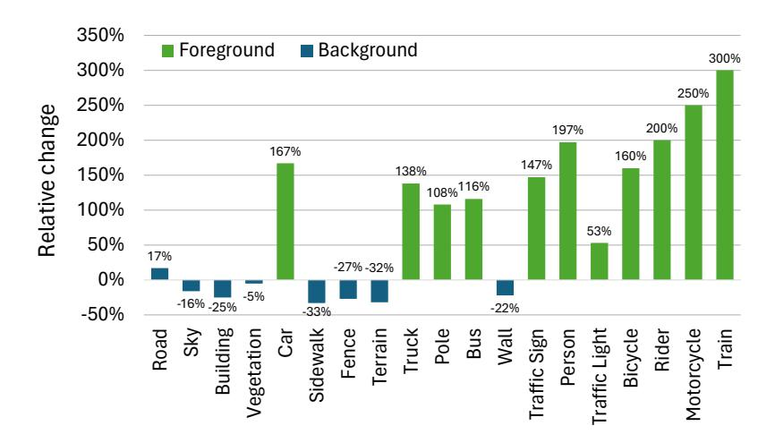

Figure 11: Relative change in local crop region class assignments relative to per-pixel class distribution.

We hypothesize that PooDLe's improvement on spatially underrepresented classes, as shown in Table 10, is due to this subcrop effect. To quantify this effect on real data, we perform a similar exercise as above on the BDD100K semantic segmentation training set. We sample subcrops following our method and assign a class label to each subcrop. If over 10% of the subcrop is a foreground class (not road, sky, building, vegetation, sidewalk, fence, terrain), then we label the subcrop as the majority foreground class. Otherwise, the majority background class label is assigned. In Figure 11, we show the relative change in class distribution when using this subcrop class assignment. Foreground classes (green) increase in occurrence while background classes (blue) decrease in frequency, besides road.

#### D WALKING TOURS SEMANTIC BENCHMARK

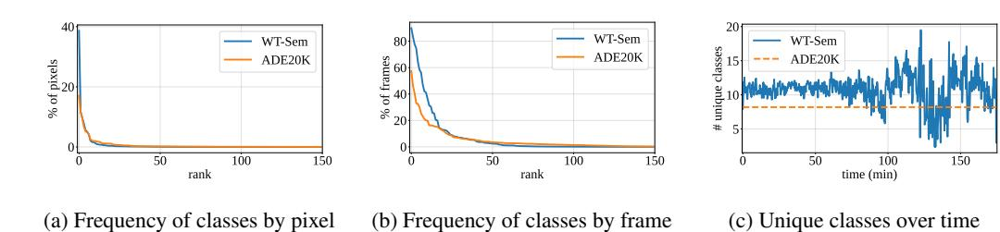

Figure 12: Analysis of WT-Sem in comparison to ADE20K (Zhou et al., 2017) by frequency of each class by pixels occupied (a) or frames present (b) and number of unique classes in each frame (c).

We create the WT-Sem benchmark by sampling a frame every 2 seconds from each of the 10 videos in WTall as well as 3 new walkaround videos. The new walkaround videos are filmed in Rome, Torun, and Poznan, sourced from the same YouTube channel as WT (Venkataramanan et al., 2024) under the Creative Commons (CC-BY) license. The Swin-L variant of OpenSeed (Zhang et al., 2023a), pretrained on COCO (Lin et al., 2014) and Objects365 (Shao et al., 2019) and finetuned on ADE20K, is used to generate semantic segmentation masks. We utilize the 25,910 frames sourced from WTall as the training set and the 6,170 frames sourced from the 3 new videos as the validation set. Figure 12 shows our analysis of WT-Sem in comparison to ADE20K (Zhou et al., 2017), where we observe that both datasets have long-tailed class distributions and WT-Sem has slightly higher number of unique classes per frame. We also visualize examples from the WT-Sem benchmark in Figure 13.

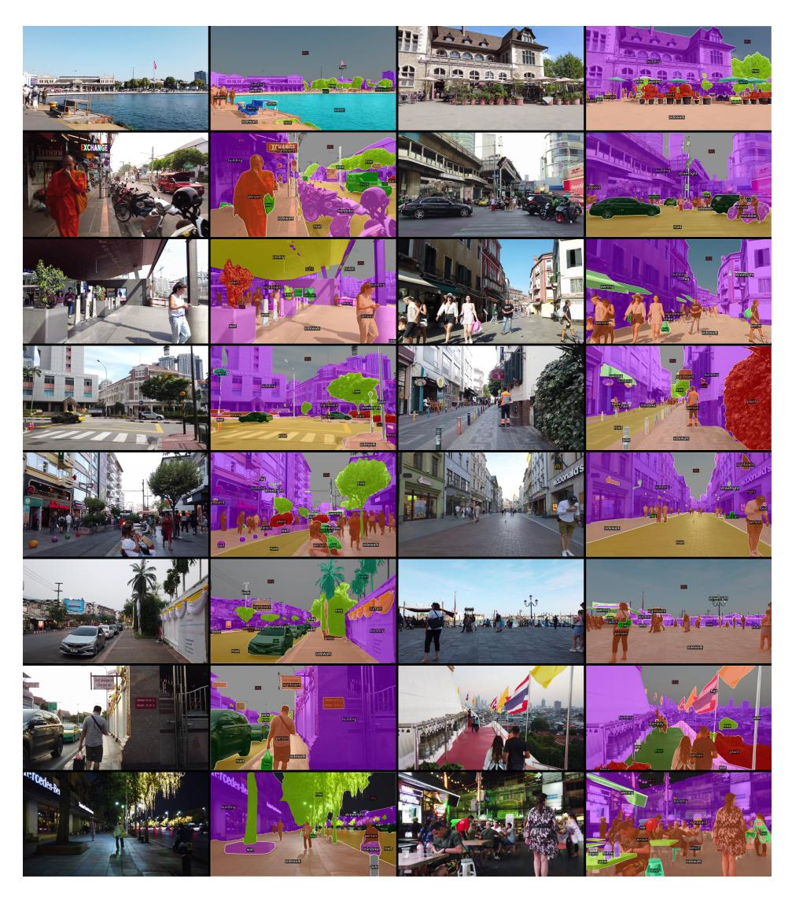

Figure 13: Visualizations of images and associated semantic segmentation masks from the WT-Sem benchmark.

## E ADDITIONAL VISUALIZATIONS

We provide additional visualizations of results on our evaluated benchmarks: BDD100K [\(Yu et al.,](#page-13-1) [2020\)](#page-13-1) semantic segmentation (Figure [14\)](#page-18-0), object detection (Figure [15\)](#page-19-0) and ADE20K semantic segmentation (Figure [16\)](#page-19-1). Once again, we note that PooDLe produces segmentation maps with clearer boundaries while also effectively capturing small objects.

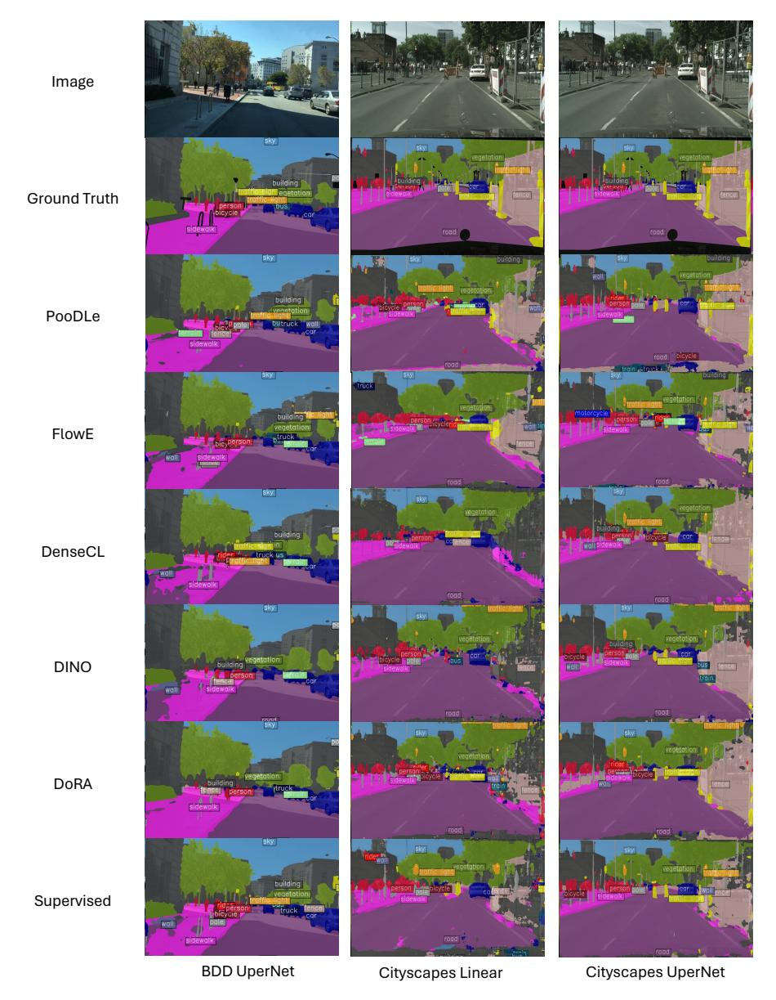

Figure 14: Visualizations of semantic segmentation masks for BDD linear readout, Cityscapes linear readout, and Cityscapes UperNet readout.

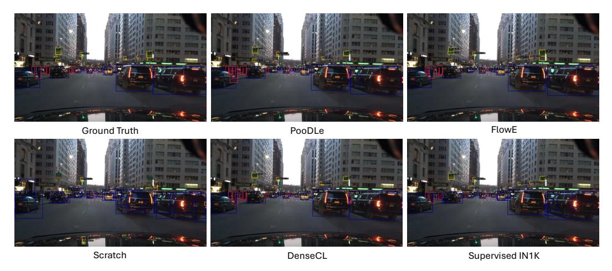

Figure 15: Visualizations of object detection bounding boxes for BDD FPN readout.

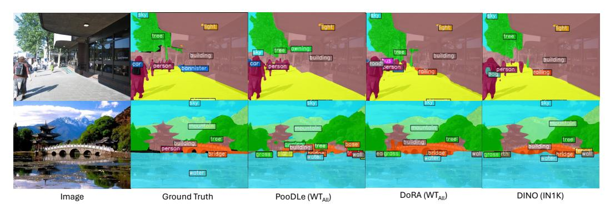

Figure 16: Visualizations of semantic segmentation masks for ADE UperNet finetuning.

### F ACCURACY VALUES FOR CLASS BREAKDOWN AND ABLATIONS

Table 6: Accuracy values for Table 3, class breakdowns

| Method     | Pretrain | All  | Small | Large | Rare | Common |
|------------|----------|------|-------|-------|------|--------|
| DINO       | BDD      | 86.8 | 12.3  | 88.3  | 2.3  | 87.8   |
| DenseCL    | BDD      | 84.9 | 2.0   | 86.6  | 0.0  | 86.0   |
| DoRA       | BDD      | 88.1 | 19.3  | 89.5  | 7.2  | 89.1   |
| FlowE      | BDD      | 88.5 | 18.2  | 89.9  | 32.0 | 89.2   |
| PooDLe     | BDD      | 89.2 | 33.6  | 90.3  | 34.2 | 89.9   |
| Supervised | IN1K     | 84.7 | 36.9  | 85.3  | 23.8 | 85.1   |
| PooDLe     | BDD*     | 90.7 | 35.6  | 91.2  | 46.9 | 91.2   |

Table 7: Accuray values for Table 4, ablations

| Variant   | Dense    | Pool | Top-Down | Lateral | Flow  | All  | Small | Large | Rare | Common |
|-----------|----------|------|----------|---------|-------|------|-------|-------|------|--------|
| 1 FlowE   | <b>/</b> |      |          |         | RAFT  | 85.0 | 22.8  | 86.3  | 6.1  | 86.0   |
| 2         | 1        | 1    |          |         | RAFT  | 86.2 | 14.2  | 87.6  | 6.3  | 87.1   |
| 3         | 1        | ✓    | ✓        |         | RAFT  | 86.8 | 11.9  | 87.7  | 13.6 | 87.7   |
| 4         | 1        | ✓    |          | /       | RAFT  | 86.6 | 22.1  | 87.9  | 16.9 | 87.5   |
| 5         | 1        |      | ✓        | ✓       | RAFT  | 84.2 | 25.5  | 85.3  | 28.2 | 84.9   |
| 6 PooDLe† | 1        | ✓    | ✓        | ✓       | UFlow | 86.0 | 26.4  | 87.2  | 29.6 | 86.7   |
| 7 PooDLe  | ✓        | ✓    | ✓        | ✓       | RAFT  | 86.5 | 26.6  | 87.7  | 28.5 | 87.1   |

#### G ADDITIONAL EVALUATION RESULTS

Table 8: Additional BDD semantic segmentation (SemSeg) and object detection (Det) readout evaluations. All settings are conducted with a frozen backbone. ‡ BYOL results are taken from FlowE (Xiong et al., 2021) and used DeepLab v3 (Chen et al., 2017) in-place of Upernet (Xiao et al., 2018). \*Pretrained on BDD, initialized with supervised ImageNet weights.

|                                        |       |      |          | BDD100K Sem. Seg. |            |              | g.         | BDD100K       | Obj. Det.  | Cityscapes Sem. Seg |            |              |            |  |
|----------------------------------------|-------|------|----------|-------------------|------------|--------------|------------|---------------|------------|---------------------|------------|--------------|------------|--|
| Method                                 | Arch  | Ep.  | Pretrain | Line mIoU      | ear Acc | Uper mIoU | Net Acc | Det C4 mAP | FPN mAP | Line mIoU        | ear Acc | Uper mIoU | Net Acc |  |
| Scratch                                | R50   | -    | -        | 9.7               | 55.0       | 26.1         | 81.2       | 0.0           | 7.7        | 9.8                 | 58.0       | 30.7         | 84.1       |  |
| PooDLe                                 | R50   | 100  | BDD      | 39.2              | 89.2       | 49.9         | 91.8       | 4.9           | 25.2       | 47.2                | 90.2       | 60.7         | 93.5       |  |
| Supervised                             | R50   | 600  | IN1K     | 36.7              | 84.7       | 55.2         | 92.0       | 3.6           | 24.9       | 46.8                | 87.4       | 63.4         | 93.7       |  |
| BYOL (Grill et al., 2020) ‡ | R50   | 1000 | IN1K     | 28.3              | -          | 52.4         | -          | 2.8           | 26.0       | 39.9                | -          | 60.3         | -          |  |
| DenseCL (Wang et al., 2021b)           | R50   | 200  | IN1K     | 21.3              | 82.7       | 52.8         | 91.6       | 0.3           | 25.0       | 27.3                | 84.0       | 63.7         | 93.7       |  |
| Supervised                             | ViT-S | 300  | IN1K     | 41.9              | 88.5       | 50.9         | 91.4       | -             | -          | 46.8                | 87.4       | 63.4         | 93.7       |  |
| DINO (Caron et al., 2021)              | ViT-S | 800  | IN1K     | 38.5              | 88.1       | 52.3         | 92.0       | -             | -          | 47.1                | 90.3       | 63.6         | 94.0       |  |
| iBOT (Zhou et al., 2021)               | ViT-S | 800  | IN1K     | 44.4              | 89.6       | 54.2         | 92.2       | -             | -          | 52.1                | 91.5       | 65.3         | 94.3       |  |
| PooDLe                                 | R50   | 100  | BDD*     | 44.7              | 90.7       | 54.1         | 92.7       | 3.9           | 28.0       | 52.0                | 91.5       | 65.1         | 94.4       |  |

We compare PooDLe against ImageNet-pretrained baselines in Table 8 and observe that PooDLe outperforms most baselines except iBOT and ImageNet supervised ViT. This result is encouraging, as pretraining on naturalistic video is more challenging due to spatial and class imbalance, yet is also a more realistic setting that enables the use of broader sets of usable data. Furthermore, we note that pretraining on class-balanced data such as ImageNet particularly benefits mIoU, which weighs all classes equally despite some classes only appearing in a tiny proportion of pixels in evaluation. Finally, PooDLe pretrained on BDD with weights initialized from the ImageNet supervised checkpoint surpasses all ImageNet-pretrained baselines on linear semantic segmentation.

#### H PER-CLASS EVALUATION RESULTS

Table 9: IoU per class on BDD semantic segmentation linear readout. \*Pretrained on BDD, initialized with supervised ImageNet weights.

| Method  | Pretrain | Rd   | Sky  | Bldg | Veg  | Car  | Bus  | Fence | Truck | Wall | S-walk | Terrain | Train | Pole | Bicycle | Person | M-cycle | Tr. Sign | Rider | Tr. Light |
|---------|----------|------|------|------|------|------|------|-------|-------|------|--------|---------|-------|------|---------|--------|---------|----------|-------|-----------|
| DINO    | BDD      | 88.6 | 93.0 | 72.3 | 77.3 | 73.7 | 0.8  | 11.7  | 5.3   | 5.1  | 38.5   | 37.5    | 0     | 8.1  | 0       | 19.6   | 0       | 13.4     | 0     | 17.7      |
| DenseCL | BDD      | 82.0 | 88.2 | 68.3 | 72.6 | 63.0 | 0    | 1.5   | 0.5   | 0    | 17.7   | 7.2     | 0     | 0.3  | 0       | 0.1    | 0       | 1.1      | 0     | 9.4       |
| DoRA    | BDD      | 89.9 | 93.6 | 75.4 | 79.9 | 76.6 | 5.1  | 17.9  | 11.0  | 10.8 | 44.6   | 42.7    | 0     | 13.3 | 0.7     | 25.2   | 0       | 20.5     | 0     | 23.9      |
| FlowE   | BDD      | 90.6 | 92.9 | 75.8 | 79.6 | 80.8 | 32.9 | 23.5  | 22.7  | 15.3 | 45.7   | 32.4    | 0     | 12.9 | 11.8    | 28.7   | 4.1     | 15.9     | 0     | 12.1      |
| PooDLe  | BDD      | 91.3 | 93.5 | 77.0 | 80.4 | 81.7 | 34.0 | 29.4  | 24.3  | 17.2 | 49.6   | 38.1    | 0     | 24.3 | 18.0    | 35.2   | 2.9     | 26.6     | 0     | 21.2      |
| Supv.   | IN       | 79.8 | 88.8 | 70.0 | 77.2 | 72.6 | 24.9 | 21.8  | 14.4  | 7.2  | 18.4   | 31.8    | 0     | 22.8 | 36.8    | 40.2   | 19.5    | 31.8     | 8.2   | 31.2      |
| PooDLe  | BDD*     | 92.6 | 94.0 | 80.3 | 82.2 | 84.8 | 54.7 | 34.9  | 33.4  | 17.8 | 56.3   | 42.2    | 0     | 25.7 | 27.1    | 41.5   | 7.7     | 39.0     | 0.1   | 35.2      |

Table 10: Defined groupings and statistics of classes in the BDD semantic segmentation dataset. L=Large, S=Small, C=Common, R=Rare.

|                  | Rd   | Sky  | Bldg | Veg  | Car  | Bus  | Fence | Truck | Wall | S-walk | Terrain | Train | Pole | Bicycle | Person | M-cycle | Tr. Sign | Rider | Tr. Light |
|------------------|------|------|------|------|------|------|-------|-------|------|--------|---------|-------|------|---------|--------|---------|----------|-------|-----------|
| Avg Pix. % / Im. | 22.0 | 18.2 | 15.0 | 14.4 | 8.4  | 3.7  | 3.4   | 3.2   | 3.1  | 3.1    | 2.8     | 2.1   | 1.0  | 0.8     | 0.7    | 0.6     | 0.5      | 0.4   | 0.4       |
| Total % of Pix.  | 21.3 | 17.3 | 13.2 | 13.2 | 8.1  | 0.6  | 1.0   | 1.0   | 0.5  | 2.0    | 1.0     | 0.0   | 0.9  | 0.1     | 0.3    | 0.0     | 0.3      | 0.0   | 0.2       |
| Total % of Im.   | 96.5 | 94.8 | 88.4 | 91.7 | 97.3 | 15.0 | 30.6  | 30.5  | 15.4 | 66.7   | 36.7    | 0.7   | 95.0 | 6.4     | 34.7   | 3.8     | 75.3     | 5.2   | 47.1      |
| Size Grp.        | L    | L    | L    | L    | L    | L    | L     | L     | L    | L      | L       | L     | S    | S       | S      | S       | S        | S     | S         |
| Freq. Grp.       | C    | C    | C    | C    | C    | R    | C     | C     | R    | C      | C       | R     | C    | R       | C      | R       | C        | R     | C         |

We provide a breakdown of IoU per class on BDD semantic segmentation linear readout in Table 9. In Table 10, we also provide dataset-level statistics for each class computed over the training split of 7,000 images in the BDD semantic segmentation dataset, namely average pixel percentage per image, total percentage of pixels over the dataset and total percentage of images that they appear in over the dataset. Size and frequency groupings are then independently defined using these statistics and used in Table 3. A class is considered 'Large' (L) if its average pixel percentage per image is > 1% and 'Small' (S) otherwise. Separately, we define a class as 'Common' (C) if the total percentage of images it appears in is > 20% and 'Rare' (R) otherwise. Notably, PooDLe achieves significant gains on small classes such as 'Pole', 'Bicycle', 'Traffic Sign', 'Traffic Light'. Methods trained on BDD underperform supervised IN1K on classes rare in BDD such as 'Rider', likely because IN1K offers both abundant and iconic images of these object categories.

## I BACKBONE COMPUTATION COST

We provide a table detailing the number of FLOPs associated with various SSL methods and backbones. We note that our SDM is by far the most efficient upsampling approach for dense representation learning methods.

| Architecture                     | Associated Methods    | GFLOPs |
|----------------------------------|-----------------------|--------|
| ResNet-50                        | DINO-R50              | 43.3   |
| ResNet-50 + SDM                  | PooDLe                | 60.5   |
| ResNet-50 + FPN decoder          | PixPro                | 124.4  |
| ResNet-50 + dilated convolutions | FlowE, DINO, DenseCL  | 200.7  |
| ViT-S/16                         | DINO, iBOT, DoRA, MAE | 82.9   |

Table 11: Comparison of different backbones, their associated methods, and computational requirements in GFLOPs.

## J FLOW VISUALIZATIONS

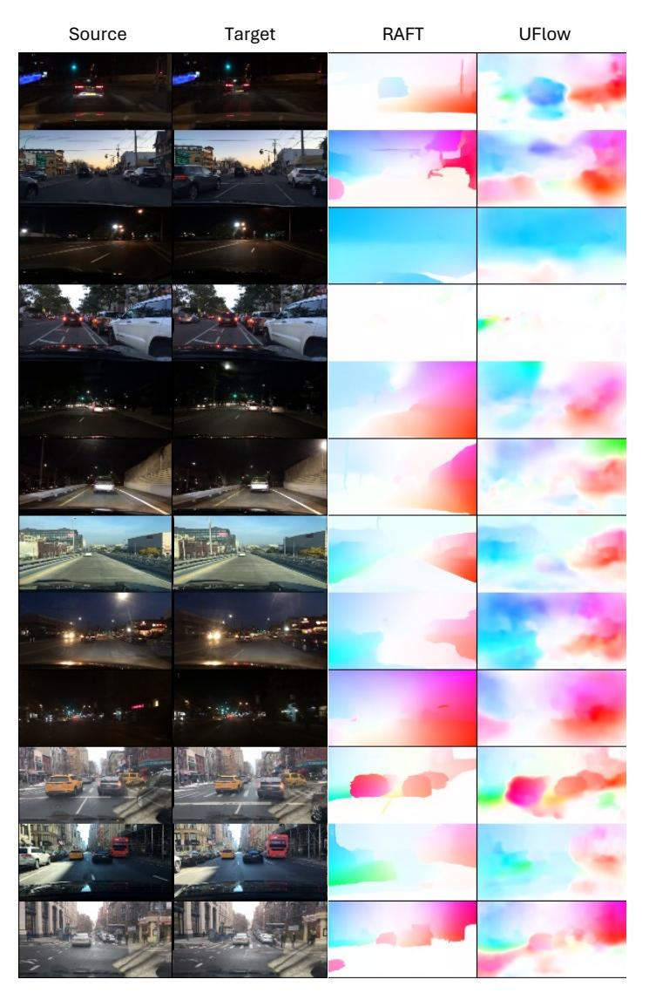

Figure 17: Comparison of predicted optical flow from RAFT (supervised) and UFlow (unsupervised).

In Figure [17,](#page-22-1) we compare the predicted flow maps generated from RAFT [\(Teed & Deng,](#page-12-15) [2020\)](#page-12-15), an off-the-shelf supervised model, and our own unsupervised UFlow [\(Jonschkowski et al.,](#page-11-13) [2020\)](#page-11-13) model. The frame pairs are randomly sampled with ∆t ∈ [15, 30]. We do note that self-supervised flow, particularly on BDD100K, may exhibit noisy or splotchy results. This is possibly due to the inconsistent motion and large dark regions that do not offer sufficient photometric supervisory signal. This is in contrast to RAFT [\(Teed & Deng,](#page-12-15) [2020\)](#page-12-15) which learns sharp edges like from supervised labels. Nevertheless, we find that this self-supervised flow is sufficient for training PooDLe.