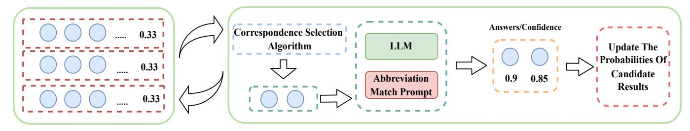
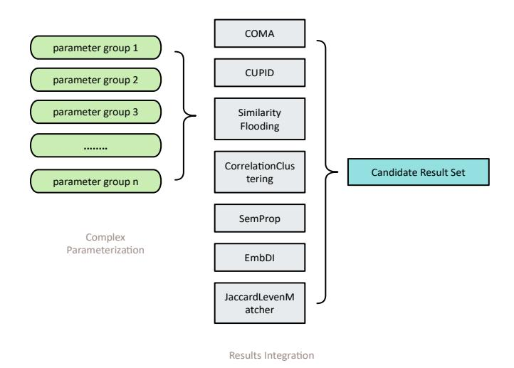
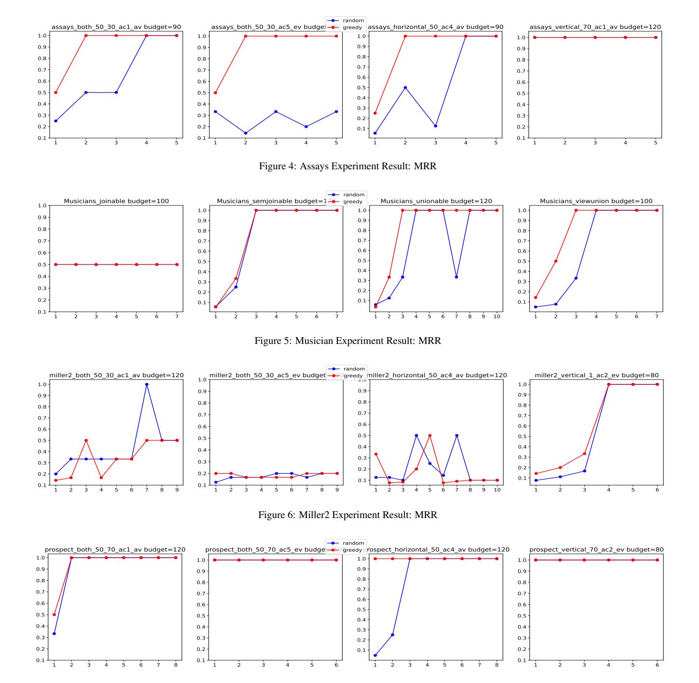
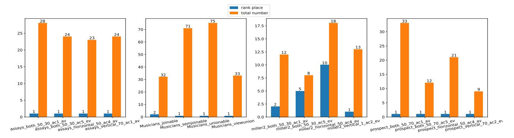
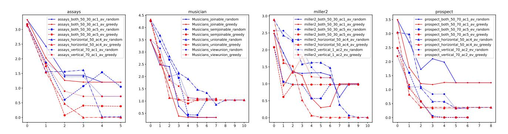

# Prompt-Matcher: Leveraging Large Models to Reduce Uncertainty in Schema Matching Results

Longyu Feng<sup>a</sup>, Li Huahang<sup>a</sup>, Chen Jason Zhang<sup>a</sup>

<sup>a</sup>The Hong Kong Polytechnic University, , Hong kong, China

#### **Abstract**

Schema matching is the process of identifying correspondences between the elements of two given schemata, essential for database management systems, data integration, and data warehousing. For datasets across different scenarios, the optimal schema matching algorithm is different. For single algorithm, hyperparameter tuning also cases multiple results. All results assigned equal probabilities are stored in probabilistic databases to facilitate uncertainty management. The substantial degree of uncertainty diminishes the efficiency and reliability of data processing, thereby precluding the provision of more accurate information for decision-makers. To address this problem, we introduce a new approach based on fine-grained correspondence verification with specific prompt of Large Language Model.

Our approach is an iterative loop that consists of three main components: (1) the correspondence selection algorithm, (2) correspondence verification, and (3) the update of probability distribution. The core idea is that correspondences intersect across multiple results, thereby linking the verification of correspondences to the reduction of uncertary an optimal correspondence set to maximize the anticipated uncertainty reduction with as an NP-hard problem. We propose a novel (1 - 1/e)-approximation algorithm to in terms of computational efficiency. To enhance correspondence verification, we have able GPT-4 to achieve state-of-the-art performance across two established benchman evaluation demonstrates the superior effectiveness and robustness of the proposed application, data quality.

1. Introduction

1.1. Background and Motivation

Schema matching is crucial for identifying equivalent elements across diverse schemata in heterogeneous data repositories. This technique underpins numerous applications, including database management systems, data migration, warehousing, mining, and knowledge discovery. The rise of data science has further intensified the need for advanced data integration and management solutions.

Over the years, a substantial number of semi-automated and fully automated schema matching algorithms have been developed and extensively investigated Bonifati and Velegrakis (2011); Bernstein et al. (2011); Rahm and Bernstein (2001); results, thereby linking the verification of correspondences to the reduction of uncertainty in candidate results. The task of selecting an optimal correspondence set to maximize the anticipated uncertainty reduction within a fixed budgetary framework is established as an NP-hard problem. We propose a novel (1 - 1/e)-approximation algorithm that significantly outperforms brute algorithm in terms of computational efficiency. To enhance correspondence verification, we have developed two prompt templates that enable GPT-4 to achieve state-of-the-art performance across two established benchmark datasets. Our comprehensive experimental evaluation demonstrates the superior effectiveness and robustness of the proposed approach.

(2011); Bernstein et al. (2011); Rahm and Bernstein (2001); Shvaiko and Euzenat (2005). Schema matching tools exhibit diverse focus areas, encompassing linguistic, structural, and instance-based features. While these tools demonstrate satisfactory performance on specific datasets, each schema matching approach presents distinct strengths and limitations. No single schema matching methodology has been established to consistently outperform alternative approaches across various scenariosKoutras et al. (2021). Most schema matching algorithms de-

Table 1: Example of Candidate Result Set

<span id="page-0-0"></span>

| Candidate Result                                                   | Confidence  |  |
|--------------------------------------------------------------------|-------------|--|
| s <sub>1</sub> =(Employee, EmployeeInfo):[(ID, EmployeeID),        |             |  |
| (Name, (First Name, Last Name)),                                   | 0.55        |  |
| (Email, Email Address), (Address, Home Address),                   | 0.55        |  |
| (Gender, Sex)]                                                     |             |  |
| <i>s</i> <sub>2</sub> =(Employee, EmployeeInfo):[(ID, EmployeeID), |             |  |
| ,(Age, Years of Experience),(Email, Email Address)                 | 0.25        |  |
| (Address, Home Address)m(Gender, Sex)]                             | 0.23        |  |
| $s_3$ =(Employee, EmployeeInfo):[(ID,EmployeeID),                  |             |  |
| (Name, (First Name, Last Name )),(Email, Email Address),           | 0.20        |  |
| (Gender, Sex)]                                                     |             |  |
| Correspondences                                                    | Probability |  |
| $c_1$ = [ID, EmployeeID]                                           | 1.0         |  |
| $c_2$ = [Name, [First Name, Last Name]]                            | 0.80        |  |
| $c_3$ = [Email, Email Address]                                     | 0.75        |  |
| $c_4$ = [Address, Home Address]                                    | 0.80        |  |
| $c_5$ = [Age, Years of Experience]                                 | 0.25        |  |
| $c_6$ = [Gender, Sex]                                              | 1.0         |  |

Email addresses: fly\_fenglongyu@outlook.com (Longyu Feng),

huahang.li@polyu.edu.hk (Li Huahang),

jason-c.zhang@polyu.edu.hk (Chen Jason Zhang)

## **Three Stages In Our Iterative Approach**

## **Candidate Result Set**

<span id="page-1-0"></span>

Figure 1: Prompt-Matcher: The total budget is split the budget into k budget shares. At each iteration, correspondence selection algorithm try to selection the correspondence subset that maximize the expectation of uncertainty reduction. Then, LLM proposes the answers and their confidence of correspondence verification. Finally, the probabilities of candidate results are updated with the answers and the confidences.

pend on complex parameter configurations to achieve optimal performance; however, in real-world applications, their effectiveness is often compromised due to the practical challenges of maintaining precise parameter tuning, resulting in suboptimal matching accurac[yKoutras et al.](#page-10-4) [\(2021\)](#page-10-4). Furthermore, certain schema matching tools generate a set of candidate results for user[sDong et al.](#page-10-5) [\(2009a\)](#page-10-5); [Radwan et al.](#page-10-6) [\(2009\)](#page-10-6); [Gal et al.](#page-10-7) [\(2005\)](#page-10-7). Consequently, these schema matching tools can effectively mitigate the risk of omitting potential results. Some researchers have proposed algorithms that not only generate a candidate result set but also establish a search space in uncertain scenarios, as well as allocate probabilities in the context of probabilistic schema matching [Roitman et al.](#page-10-8) [\(2008\)](#page-10-8); [Dong](#page-10-9) [et al.](#page-10-9) [\(2009b\)](#page-10-9) ,as illustrated in the top section of Table [1.](#page-0-0)

As previously discussed, candidate result sets are both useful and prevalent in schema matching applications. They enable users to achieve more accurate and comprehensive schema matching outcomes. However, the effective utilization of candidate result sets necessitates seamless integration with databases and systems capable of accommodating probabilistic querie[sDetwiler et al.](#page-10-10) [\(2009\)](#page-10-10); [Huang et al.](#page-10-11) [\(2009\)](#page-10-11). This requirement introduces additional complexity to the querying process and can result in increased storage costs. Our goal is to make informed decisions at the earliest stages possible, aiming to mitigate or eliminate the propagation of uncertainty. As highlighted by [Popa et al.](#page-10-12) [\(2002\)](#page-10-12), human insights play a significant role in reducing uncertainty in schema matching. A common strategy to address this uncertainty is through the involvement of human experts who provide a curated list of top-k results. [Zhang et al.](#page-10-13) [\(2020\)](#page-10-13) employs crowd-sourcing techniques to alleviate uncertainty. [Gal et al.](#page-10-14) [\(2018,](#page-10-14) [2021\)](#page-10-15) have explored the use of learnto-rank methods to reprioritize the candidate result sets. Their work represents a significant advancement in the field by potentially obviating the need for human experts as the ultimate decision-makers in schema matching. However, the efficacy of these learn-to-rank approaches relies heavily on the availability of sufficient labeled data for model training—a requirement that can be difficult to fulfill in certain practical scenarios.

We observe that large language models have yet to be extensively employed in the context of uncertainty reduction for schema matching. In [Pan et al.](#page-10-16) [\(2023\)](#page-10-16), it was discovered that GPT-4, when paired with tailored prompts, achieved superior performance compared to elite crowd-sourcing workers. Consequently, this application saved a research team an estimated \$500,000 and \$20,000 hours of labor. [Gilardi et al.](#page-10-17) [\(2023\)](#page-10-17) demonstrate that ChatGPT outperforms crowd-workers in multiple annotation tasks, emerging as a cost-effective alternative at approximately one-fifth the expense of Amazon Mechanical Turk (MTurk), a well-known crowd-sourcing platform. [Tornberg](#page-10-18) [\(2023\)](#page-10-18) further presents evidence that GPT-4 achieves ¨ more accurate performance than both experts and crowd workers in the textual analysis task of discerning the political leanings of Twitter users. Large Language Models (LLMs) have increasingly replaced the work of crowd-sourcing workers across various tasks. As illustrated above, LLMs possess substantial capabilities to automate the functions traditionally performed by crowd-sourcing workers across various domains. However, there remain several challenges that need to be addressed to optimize the application of LLMs. Our paper is dedicated to leveraging LLMs to reduce uncertainty of schema matching, a domain that remains largely unexplored.

## *1.2. Challenges and Contributions*

Large Language Models require appropriately designed prompts to effectively activate their capabilities. The design of a specific prompt tailored for the schema matching task is a crucial aspect of using LLMs. While Large Language Models are generally more cost-effective than crowd-sourcing, the expense associated with their deployment at massive scales warrants careful consideration. Mitigating the impact of incorrect answers from large models is also a concern.

## 1. Prompt Engineering

Proper Prompt can significantly improve the performance of LLMs in many tasks. Relevant research on the prompt design of LLMs in schema matching is rare, especially on the correspondence verification task.

## 2. Noisy Answers

Incorporating the confidence estimation of LLMs responses into our methodology presents a significant research challenge that requires careful consideration.

## 3. Budget Constraint

The usage of LLMs is relatively expensive. LLM API Service Providers set the price based on the tokens in usage. In applications involving multiple calls to large language models, achieving the best results within a fixed budget is a key issue.

To address the aforementioned challenges, we have developed two specialized prompts for the correspondence verification task. The Semantic-Match Prompt is designed for correspondences with clear semantics. It is characterized by its simplicity and low computational cost. In contrast, the Abbreviation-Match Prompt is more complex and computationally expensive. However, it outperforms the Semantic-Match Prompt in handling abbreviations, which often lack explicit semantic information. The confidence scores of verification answers have been incorporated into the updating process, thereby mitigating the impact of noisy answers. We formulate an NPhard problem: how to select a set of correspondences that maximizes the uncertainty reduction of candidate results within a fixed budget. A greedy selection algorithm is established to enhance the solution efficiency.

The reasons for the candidate results of schema matching in practical applications.

- 1. Complex Parameterization Numerous schema match algorithms require complex parameterization for optimal performance posing challenges for practitioner[sKoutras](#page-10-4) [et al.](#page-10-4) [\(2021\)](#page-10-4).
- 2. The Integration Of Results Schema matching algorithms exhibit significantly different performance across various datasets and scenarios. In [Koutras et al.](#page-10-4) [\(2021\)](#page-10-4), the evaluation across fabricated dataset pairs as well as real-world data indicates that no single schema matching method consistently outperforms the rest. For the methods of LLMs, LLMs generate different results with different prompts and hyper-parameters. Ultimately, the integration of diverse results can enhance the overall performance of schema matching.

Our contributions are summarized as follows.

First To the best of our knowledge, this is the first work to use LLMs to reduce the uncertainty of schema matching results. Instead of using LLM to verify the result directly, our paper proposes an iterative approach based on fine-grained correspondence verification.

Second To obtain more accurate verification answers, we have crafted two specific prompts for the correspondence verification task, achieving state-of-the-art results on two benchmark datasets. To achieve the maximum reduction in uncertainty, we formulate the correspondence selection problem, which is an NP-hard problem. We further propose a greedy selection algorithm to address this challenge.

Third We conducted a comprehensive experimental evaluation on the datasets, where the abbreviated attribute names were derived from real-world datasets. The results of these experiments demonstrate the effectiveness of our approach.

## 2. Related Work

## *2.1. Uncertain Schema Match*

Uncertainty is common and significant in data integration systems. As we have mentioned, complex parameterization and the integration of results generate multiple results. [Dong](#page-10-9) [et al.](#page-10-9) [\(2009b\)](#page-10-9); [Magnani et al.](#page-10-19) [\(2005a\)](#page-10-19); [Zhang et al.](#page-10-13) [\(2020\)](#page-10-13); [Gal](#page-10-20) [\(2006\)](#page-10-20) have researched on the uncertainty of schema match over the past 20 years. In [Gal](#page-10-21) [\(2011\)](#page-10-21), authors thought that schema matchers are inherently uncertain and it is unrealistic to expect a single matcher to identify the correct mapping for any possible concept in a set. In effort to increase the robustness of individual matchers in the face of matching uncertainty, researchers have turned to schema matcher ensemble[sDo](#page-10-22) [\(2002\)](#page-10-22); [Gal and Sagi](#page-10-23) [\(2010\)](#page-10-23); [Magnani et al.](#page-10-24) [\(2005b\)](#page-10-24); [Mork](#page-10-25) [et al.](#page-10-25) [\(2006\)](#page-10-25).

In [Dong et al.](#page-10-9) [\(2009b\)](#page-10-9), authors assume that a schema match system will be built on a probabilistic data model and introduce the concept of probabilistic schema mappings and analyze their formal foundations. In [Zhang et al.](#page-10-13) [\(2020\)](#page-10-13), crowd-sourcing platform is used as a basic fact provider, where workers determine whether a correspondence should exist in the schema match result or not. In [Gal et al.](#page-10-15) [\(2021,](#page-10-15) [2018\)](#page-10-14), learn-to-rank methods are introduced to re-rank the top-K results.

## *2.2. Data Matching and Schema Matching*

Data matching, the process of determining the equivalence of two data elements, plays a pivotal role in data integration. Unicor[nTu et al.](#page-10-26) align matching semantics of multiple tasks, including entity matching, entity linking, entity alignment, column type annotation, string matching, schema matching, and ontology matching. Unicorn gets multiple SOTA results in the most of 20 datasets. In the two datasets of schema matching, it both achieve the SOTA ,DeepMDatasets 100% and Fabricateddatasets 89.6% recall.

In [Koutras et al.](#page-10-4) [\(2021\)](#page-10-4), schema matchers are classified into Attribute Overlap Matcher, Value Overlap Matcher, Semantic Overlap Matcher, Data Type Matcher, Distribution Matcher and Embeddings Matcher. Different matchers have their own considerations on fuzzy matching. Most of schema match tools use not only one Matcher. The results of experiments also prove that there is not a single matcher which is always better than others. Therefore, ensemble algorithm is useful in schema match area. [Zhang et al.](#page-10-27) combines Word Embedding Featurizer, Lexical Featurizer with Bert Featurizer to generate top-K matchings suggestions for each unmapped source attribute. Then, users would select one as the label of candidate pairs, which will be used to train the Bert model.

There are some works about inference-only methods of LLMs on data matching task. Agent-O[MQiang et al.](#page-10-28) [\(2024\)](#page-10-28) is a novel agent-powered large language model (LLM)-based design paradigm for ontology matching(OM). It leverages two Siamese agents for retrieval and matching, along with simple prompt-based OM tools, to address the challenges in using LLMs for OM. ReMatc[hSheetrit et al.](#page-10-29) [\(2024\)](#page-10-29) is a novel schema matching method that leverages retrieval-enhanced large language models (LLMs) to address the challenges of textual and semantic heterogeneity, as well as schema size differences, without requiring predefined mappings, model training, or access to source schema data. ReMatch represents schema elements as structured documents and retrieves semantically relevant matches, creating prompts for LLMs to generate ranked lists of potential matches.

Although large language models have been increasingly utilized in schema matching tasks, the uncertainty of schema matching results remains a significant challenge. Despite their potential, the application of LLMs to reduce this uncertainty has not been fully explored. Recent studies have shown that LLMs, such as GPT-4, can outperform human crowd workers in terms of accuracy and efficiency. However, leveraging LLMs to systematically reduce the uncertainty in schema matching results is still an underexplored area

#### 3. Preliminaries

We formally define the relevant concepts of our approach. Let CRS denote a candidate result set. Table 1 illustrates an example of a candidate result set, displaying a single schema matching result along with its corresponding probability per row. Let c represents a correspondence.

#### Definition 1. Single Candidate Result

Single Candidate Result  $S_i = \{c_1, c_2, ..., c_j\}$  denotes a set of correspondences that satisfy the constraint that no attribute is associated with more than one correspondence.

#### Definition 2. Candidate Result Set

Candidate Result Set is denoted by  $CRS = \{S_1, ..., S_n\}$ , a set of single candidate results. The probability distribution of CRS is  $\{\mathbb{P}(S_1), ..., \mathbb{P}(S_n)\}$ , generated by its probability assignment function  $\mathbb{P}$ .

**Definition 3.** Correspondence Set and Probability The set of correspondences, denoted as  $C = \{c_1, ..., c_{|C|}\}$ , is defined as a set of all the correspondences in CRS. Let  $\mathbb{P}(S_i)$  and  $\mathbb{P}(c_i)$  denote the probabilities of  $S_i$  and  $c_i$ , respectively. We have

$$C = \{c_i | S_i \in CRS \text{ and } c_i \in S_i\}$$

$$\mathbb{P}(c_i) = \sum_{S_i \in CRS} \mathbb{P}(S_i), \text{ if } c_i \in S_i$$
(1)

**Definition 4.** Correspondence Verification Task Let c represent a single correspondence in CRS. The correspondence verification task is to utilize the GPT-4 to verify the correctness of c and response in the range of {True, False}.

<span id="page-3-1"></span>**Definition 5.** View A View V is a truth-valued form of CRS. Single Candidate Result can be looked as a group of truth-valued answers or named a view  $v_i$ , for all the Correspondence Verification Tasks of Correspondence Set in CRS.

As illustrated in Table 2, an example of  $View\ V$  is presented. This View is derived from CRS in Table 1, in accordance with Definition 5. Transforming CRS into View make

Table 2: Example Of View

<span id="page-3-0"></span>

|                  | $c_1$ | $c_2$ | <i>c</i> <sub>3</sub> | <i>c</i> <sub>4</sub> | <i>C</i> 5 | <i>c</i> <sub>6</sub> | $\mathbb{P}(s)$ |
|------------------|-------|-------|-----------------------|-----------------------|------------|-----------------------|-----------------|
| $\overline{v_1}$ | True  | True  | True                  | True                  | False      | True                  | 0.55            |
| $v_2$            | True  | True  | False                 | True                  | True       | True                  | 0.25            |
| $v_3$            | False | True  | True                  | False                 | False      | True                  | 0.20            |

it easier to understand the relationship between CRS and Correspondence Verification Task. For n Correspondence Verification Tasks, there are  $2^n$  possible truth-value answer groups or *views*. For  $v_i \in V$ , the probability of  $v_i$  being the ground truth is represented as  $P(gt(V) = v_i)$ . We denote the probability  $P(gt(V) = v_i)$  as  $P(v_i)$  for the abbreviation. If a correspondence c is 'true' in one v, we say that v is a positive model of c, which is denoted as  $v \models c$ . Otherwise, if v is a negative model for c, then v does not satisfy c, denoted as  $v \not\models c$ . Moreover, the following assertions hold for each  $c \in C$ , and one example is demonstrated in Table 1.

$$P(c) = \sum_{c \in C \land v \models c} P(v)$$

$$P(\neg c) = 1 - \sum_{c \in C \land v \models c} P(v) = \sum_{v \in V \land v \not\models c} P(v)$$
(2)

Note that, the following equation is not necessarily true for  $v \in V$ ,

<span id="page-3-2"></span>
$$P(c) = \prod_{v, \in V} P(l_i) \tag{3}$$

where

$$l_i = \begin{cases} c_i & \text{if } v \models c_i, \\ \neg c_i & \text{otherwise.} \end{cases}$$
 (4)

Equation 3 above may not hold true, as the views in V are independent. In the example of Table 2, it can be observed that the probability  $P(v_1)$  does not satisfy Equation 3.

**Definition 6.** Uncertainty Metric of Candidate Result Set Given a CRS and its correspondence set C, Let the View of CRS is V, the uncertainty of CRS can be represented by Shannon Entropy of V, denoted by H(V)

$$H(V) = -\sum_{v \in V} P(v) \log P(v), \tag{5}$$

## 4. METHOD

In this section, we present a three-stage iterative cycle algorithm to maximize the reduction of uncertainty within a fixed budget. The three stages are correspondence selection, correspondence verification, and probabilities update. As the figure 1 shows, the approach runs iteratively until the budget is out. At each step, the correspondence selection algorithm identifies the correspondences that maximize the expected reduction in uncertainty. The selected correspondences are filled into the

prompt template as input for the LLM. The LLM generates answers and their associated confidences. The candidate results of schema matching update their probability distributions based on these answers and confidences.

#### 4.1. Correspondence Selection Problem

To fully leverage the potential of LLMs to reduce uncertainty, we formalize the correspondence selection problem. The proposed optimization model seeks to maximize the expected uncertainty reduction across the correspondence set subject to budget constraints, with a rigorous theoretical analysis confirming the NP-Hard nature of the correspondence selection problem. Furthermore, we introduce a greedy selection algorithm designed to optimize computational efficiency. We proceed to establish precise definitions and offer thorough explanations of all essential components in the subsequent discussion.

#### 4.1.1. Problem Formulation

To calculate the expected uncertainty reduction of candidate results, we need to clarify the concepts of the family of answers and the probability of answers. **Possible Answer Families** Given a correspondence set  $\mathcal{T}$ , we denote the set of all the possible answer families by  $AS^{\mathcal{T}}$ . One possible answer is denoted by  $A^{\mathcal{T}}$ .

**Definition 7.** Entropy of the answer Families For a given correspondence set C, a selected correspondence set T, the entropy of the answer families  $H(AS^T)$  is

$$H(AS^{\mathcal{T}}) = -\sum_{A^{\mathcal{T}} \in AS^{\mathcal{T}}} P(A^{\mathcal{T}}) \log P(A^{\mathcal{T}})$$
(6)

**Definition 8.** Uncertainty Reduction Expectation For a correspondence set C and its View V, a selected correspondence set T, the expected uncertainty of V after getting answers from LLM for T is

$$\Delta \mathbb{H}(V) = H(V) - \mathbb{H}(V|AS^{\mathcal{T}})$$

$$= H(V) + \sum_{A^{\mathcal{T}} \in AS^{\mathcal{T}}} P(A^{\mathcal{T}}) H(V|A^{\mathcal{T}})$$
(7)

where the  $H(V|A^T)$  is the conditional uncertainty expectation with the answer  $A^T$ . To maximize the uncertainty reduction of a correspondence set, we use the uncertainty reduction expectation as our objective function. We remove the constant term and further derive the opjective function.

Table 3: GPT-4 Price

<span id="page-4-0"></span>

| Model       | Input            | Output           |
|-------------|------------------|------------------|
| 8k content  | \$0.03/1k tokens | \$0.06/1k tokens |
| 32k content | \$0.06/1k tokens | \$0.12/1k tokens |

**Lemma 1.** Objective Function. For one View V, the selected correspondence set is  $\mathcal{T}$ . The answer families is  $AS^{\mathcal{T}}$ . The Objective Function is

$$-\mathbb{H}(V|AS^{\mathcal{T}}) = \sum_{A^{\mathcal{T}} \in AS^{\mathcal{T}}} \sum_{v \in V} P(A^{\mathcal{T}}) P(v|A^{\mathcal{T}}) \log P(v|A^{\mathcal{T}})$$
(8)

*Proof.* For a selected correspondence set  $\mathcal{T}$ , the expected uncertainty reduction of the View is  $\Delta \mathbb{H}(V|AS^{\mathcal{T}})$ . We have

$$\Delta \mathbb{H}(V) = H(V) - \mathbb{H}(V|AS^{\mathcal{T}}) \tag{9}$$

Since H(V) is constant at each round, the Objective Function can be simplified to  $-\mathbb{H}(V|AS^{\mathcal{T}})$ . Then.

$$-\mathbb{H}(V|AS^{\mathcal{T}}) = \sum_{A^{\mathcal{T}} \in AS^{\mathcal{T}}} P(A^{\mathcal{T}}) H(V|A^{\mathcal{T}})$$

$$= \sum_{A^{\mathcal{T}} \in AS^{\mathcal{T}}} \sum_{v \in V} P(A^{\mathcal{T}}) P(v|A^{\mathcal{T}}) \log P(v|A^{\mathcal{T}})$$
(10)

Proof ends.

Cost Metric For all LLMs API providers, tokens are their price unit. As Table 3 shows, OpenAI provides the prices of GPT-4 and ChatGPT on the website. In the context of same prompt template and output format, we select the correspondence tokens as our cost metric. Then w will be denoted as the cost metric function.

**Definition 9.** Correspondence Selection Problem. Given a View V, a budget B, and a correspondence set C with its cost function w, our objective is to maximize  $-\mathbb{H}(V|AS^T)$  by selecting a selected correspondence set  $T^*$  while ensuring that the cost of  $T^*$  does not exceed B.

$$\mathcal{T}^* = \max_{\mathcal{T} \subseteq V, w(\mathcal{T}) \le B} -\mathbb{H}(V|AS^{\mathcal{T}})$$
(11)

After defining the Correspondence Selection Problem, we prove that this problem is NP-hard.

**Theorem 1.** Computation Hardness To solve the correspondence selection problem is an NP-hard problem.

*Proof.* To establish the NP-hardness of the Correspondence Selection problem, it is sufficient to prove the NP-completeness of its decision version. We designate the decision version as DCS (Decision Correspondence Selection). In the context of DCS, there exists a view set denoted as V, along with a correspondence set denoted as C. These sets are associated with the correspondence cost function w() and the correspondence value function value(). Given a budget B and a value B, the objective of DCS is to determine the existence of a subset C from a set C that satisfies the conditions  $value(C) \ge H$  and  $w(C) \le B$ .

To establish the NP-completeness of the DCS problem, it is sufficient to prove the NP-completeness of a specific instance of DCS. Initially, the accuracy rate is set to 1.0. For a subset  $\mathcal{T}$  of C, we let  $w(\mathcal{T}) = value(\mathcal{T})$ , and  $B = H = \frac{1}{2} \sum_{c \in C} w(c)$ . If we set  $X = \{w(c), \forall c \in C\}$ , we can deduce that the answer to the set partitioning problem of X is "yes" if and only if the answer to the DCS is "yes". Since the set partitioning problem has been proven to be NP-complete by Balas and Padberg (1976), it is

reasonable to infer that the DCS problem is also NP-complete. Given that the decision version is less challenging, it can be inferred that the correspondence selection problem is an NP-hard problem.

### <span id="page-5-0"></span>Greedy Selection with Partial Enumeration

```
1: \mathcal{T}_1 \leftarrow \emptyset, \mathcal{T}_2 \leftarrow \emptyset
2: Initialize Correspondence Set C, Budget B,
     Cost Function w()
3: \mathcal{T}_1 \leftarrow \arg\max_{\mathcal{T}_1 \subseteq C, w(\mathcal{T}_1) \leq B, |\mathcal{T}_1| \leq 2} - \mathbb{H}(V|AS^{\mathcal{T}_1})
4: for all \mathcal{T} \subseteq C, |\mathcal{T}| = 3, w(\mathcal{T}) \leq B do
5:
           C' \leftarrow C \setminus \mathcal{T}
6:
           \mathcal{T}_{\varrho} \leftarrow \mathcal{T}
           while C' \neq \emptyset and w(\mathcal{T}_g) < B do
7:
                \text{Select } c^* = \text{arg max}_{c \in C'} \left\{ \frac{-\mathbb{H}(V \mid AS^{(T_g \cup c)}) + \mathbb{H}(V \mid AS^{T_g})}{w(c)} \right\}
8:
                 if w(\mathcal{T}_{\varrho} \cup c^*) \leq B then
9:
                   \mathcal{T}_g \leftarrow \mathcal{T}_g \cup \{c^*\}
10:
11:
                    end if
                    C' \leftarrow C' \backslash c^*
12:
              if -\mathbb{H}(V|AS^{\mathcal{T}_g}) > -\mathbb{H}(V|AS^{\mathcal{T}_2}) then
13:
14:
                    \mathcal{T}_2 \leftarrow \mathcal{T}_g
15: return arg max{w(\mathcal{T}_1), w(\mathcal{T}_2)}
```

Table 4: Greedy Selection Algorithm

#### Prompt-Matcher

```
1: Initialize cost function w(), Queue q, and Budget
  B = \text{total\_budget}/k.
2: while k > 0 do
     Greedy Selection \mathcal{T} and push \mathcal{T} into q.
3:
4:
     for each c in q do
        Ask LLM and get answer a and its confidence Pr.
5:
6:
        Update the probabilities of V with P(V|a).
7:
     end for
8:
     k = k - 1.
9: end while
```

Table 5: Prompt-Matcher Algorithm

## 4.1.2. Greedy Selection Algorithm

The challenge of the correspondence selection problem stems from its NP-hard nature, which necessitates an exponential complexity to obtain the optimal solution. The time complexity of brute solution becomes impractical when dealing with large-scale data. Based on the **monotone submodularity of the Objective Function**, we use Algorithm 4 of Horel (2015) as base to establish an greedy algorithm with partial enumeration. This kind of approximate algorithm was first proposed by Khuller et al. (1999).

**Partial Enumeration** algorithm visits all the correspondence set  $\mathcal{T}$ , whose size is  $|\mathcal{T}| \leq 2$  and find the set  $\mathcal{T}_1$  maximizing the objective function  $\mathbb{H}(V|AS^{\mathcal{T}})$ .

**Greedy Strategy** The algorithm systematically enumerates all possible subsets of the correspondence set with a cardinality of |T| = 3, utilizing each subset as an initial starting point. Subsequently, it applies a greedy selection strategy to iteratively

expand the subset until the allocated budget is fully exhausted. The greedy strategy iteratively selects the most cost-effective correspondence at each step, as defined by the optimization criterion in line 8 of Table 4.

#### 4.2. Correspondence Verification

In this section, we introduce two tailored prompt strategies: the Semantic-Match Prompt, designed for datasets with semantically meaningful attribute names, and the Abbreviation-Match Prompt, optimized for datasets featuring abbreviated attribute names. While the Semantic-Match Prompt offers a simpler and more straightforward approach, it exhibits limitations when applied to datasets with abbreviations. In contrast, the Abbreviation-Match Prompt demonstrates superior capability in handling such cases, albeit at the cost of increased complexity and computational expense.

#### **Semantic-Match Prompt**

We design Semantic-Match prompt for datasets having clear semantics, as Figure 2 shows. The Semantic-Match Prompt is composed of three distinct parts: task description instruction, input data, and output Indicator. By testing multiple prompt variations on the DeepMDatasets, we empirically determine that the Semantic-Match Prompt is highly effective for datasets with characteristics similar to DeepMDatasets.

- 1. **task description instruction**, is "Determine whether the two attributes match with each other in schema match". The goal is to describe the task instructions clearly.
- 2. **input data**, the attributes of DeepMDatasets own clear semantics. Therefore, we take the names of target schema attributes and sources schema attributes as input.
- 3. **output indicator**, The goal is to instruct the output format of LLM.

The structure of Semantic-Match Prompt is simple and costeffective. When the attribute names have clear semantics in schema matching datasets, GPT-4 with Semantic-Match Prompt template has good performances.

### **Abbreviation-Match Prompt**

In real-world datasets, abbreviation is the core challenge. The Semantic-Match Prompt exhibits limited effectiveness in verifying abbreviated correspondences. To address this limitation, we designed the Abbreviation-Match Prompt, which is grounded in the core principles of classic schema matching algorithms. As illustrated in Figure 2, Tip (1) incorporates domain-specific information into the LLM to enhance context awareness. Tips (2) and (3) are inspired by the COMA algorithm Do and Rahm (2002), guiding the LLM to recognize and apply rules for abbreviation generation. Furthermore, Tip (4) draws on the design philosophy of the "Value Overlap Matcher," which evaluates attribute similarity based on value overlap. Specifically, we instruct the LLM to exchange attribute values and assess their similarity, thereby improving matching accuracy.

As the figure 2 shows, the Abbreviation-Match Prompt template has five blue placeholders, **schema\_name** is filled with the

#### <span id="page-6-0"></span>Semantic-match Prompt

Determine whether the two attributes match with each other in schema match. Input:

First Attribute Name: {attribute\_name\_1}
Second Attribute\_Name: {attribute\_name\_2}

Please answer with [yes or no], and provide your confidence level on a scale from 0 to 1

#### Abbreviation-match Prompt

Determine whether the two attributes match with each other in schema match. Remember some tips.

Tips

- (1) These two schemas are used to store (schema name) information
- (2) Some letters are extracted from the full names and merged into an abbreviation word.
- (3) Schema information sometimes is also added as the prefix of abbreviation.
- (4) Values exchange verification: match would be likely correct, if the second value instances are also suitable for the first attribute name.

Input:

First Attribute Name: {attribute\_name\_1}

Its value instances: {values\_1}

Second Attribute Name: {attribute\_name\_2}

Its value instances: {values 2}

Please answer with [yes or no], and provide your confidence level on a scale from 0 to 1.

Figure 2: two prompt templates, we show the prompt templates are suitable for schema matching tasks. The blue placeholders are filled with the attribute names and their values in the correspondences, schema\_name is filled with the dataset name or domain information.

domain name of datasets or the name schema matching. The subset attribute names of correspondence are filled into the **attribute\_name** placeholders seperately. And, we directly fill the **values** placeholder with the first three values of the attribute.

## 4.3. Probability Update

In this section, we formulate the method to update the probabilities of candidate results to reduce uncertainty. We take the candidate result set in Table 1 as an example. Initially, the correspondence set  $c_2 = [Email, EmailAddress]$  is selected. We make an assumption that the statement "I:in EmployeeInfo and Employee  $c_2$ =[Email, Email Address] is right correspondence" is a response from LLM with a confidence of 80%. Then, the confidence of the View will be updated using the following equation:

$$Pr(v_1|e: I \ from \ LLM) = Pr(v_1)Pr(e|v_1)/Pr(e)$$

$$= \frac{Pr(v_1)Pr(LLM \ is \ correct)}{Pr(I)Pr(C \ is \ correct) + (\neg Pr(I))Pr(C \ is \ incorrect)}$$
(12)
$$= \frac{0.55 * 0.80}{0.80 * 0.80 + 0.20 * 0.20} = 0.647$$

Similarly,  $Pr(v_2|e) = 0.294$  and  $Pr(v_3|e) = 0.059$ . The uncertainty H(V) has been reduced from 0.997 to 0.351. In the subsequent parts, we

**Computation of answer set probability** Given a correspondence set C, a selected correspondence set  $\mathcal{T} \subset C$ , the confidences of the  $A^{\mathcal{T}}$  is  $\{Pr_1, Pr_2, ..., Pr_{|A^{\mathcal{T}}|}\}$  and a view is v, the conditional probability of receiving  $A^{\mathcal{T}}$  given a view v is

$$P(A^{\mathcal{T}}|v) = \{P(a_1|v), P(a_2|v), ..., P(a_{|A^{\mathcal{T}}|}|v)\}$$
(13)

where,

$$P(a_i|v) = \begin{cases} Pr_i * P(v) + (1 - Pr_i) * (1 - P(v)) & \text{if } v \models a_i \\ Pr_i * (1 - P(v)) + (1 - Pr_i) * P(v) & \text{if } v \not\models a_i \end{cases}$$
(14)

and the probability of  $A^{\mathcal{T}}$  is

$$P(A^{\mathcal{T}}) = \{P(a_1), P(a_2), ..., P(a_i)\}$$
 (15)

where.

$$P(a_i) = P(a_i|v) * P(v)$$
(16)

**Updating Probability Distribution** Supposing that GPT-4 has confidence Pr of the correspondence verification task in V. For a selected correspondence set  $\mathcal{T}$ , suppose the answer set is  $A^{\mathcal{T}}$ , the probability of view  $v \in V$  will be updated to

$$P(v|A^{\mathcal{T}}) = \{P(v|a_1), P(v|a_2), ..., P(v|a_i), ..., P(v|a_{|A^{\mathcal{T}}|})\}$$
(17)

Where.

$$P(v|a_i) = \frac{P(v) \cdot P(a_i|v)}{P(a_i)}$$
(18)

### 4.4. Prompt-Matcher

Prompt-Matcher is a framework that helps people to reduce the uncertainty of candidate result set and rank the best result to the front too. Prompt-Matcher is established on the loop of correspondence selection, the verification of LLM with prompt and the probability distribution updating of View. At each iteration, prompt-matcher get the more reliable verified answers from LLM to reassign the probabilities to various schema match results.

**Initialization** B is initialized by  $total\_budget/k$ , which is used as the budget of each round. k is the number of rounds in the loop, which is a parameter decided by users. To test the performance of prompt-matcher, we choose one budget larger than the cost of all correspondences and larger than three times of the mean cost. In fact, the budget can be set at any value. Due to greedy algorithm with partial enumeration will brutely search when the number of the selected correspondence set is less than 3, we recommend to avoid setting a large budget at each round. The large budget at one round will result in a quite high time cost.

**Note that** greedy algorithm with partial enumeration can provide a (1 - 1/e) approximate solution at each round. Then, the solution of k rounds will also be (1 - 1/e). In fact, if there are some remaining budget at each round, it will passed to next round. So the solution of our greedy selection will have higher ratio than (1 - 1/e).

<span id="page-7-2"></span>

Figure 3: Candidate Result Set, We systematically demonstrate the procedural workflow for candidate result set generation.

## 5. Experiment Results

#### 5.1. Datasets Information

Fabricated-Dataset Koutras et al. (2021) is composed of many real-world datasets across multiple domains, having abbreviation attribute names. This dataset is designed to evaluate the performance and effectiveness of data discovery algorithms and schema matching algorithms.

The DeepMDatasetMudgal et al. (2018) includes the following seven real-world datasets from diverse industries: Amazon-Google: A software product dataset with 11,460 labeled tuple pairs. BeerAdvocate-RateBeer: A beer dataset with 450 labeled tuple pairs. DBLP-ACM: A citation dataset with 12,363 labeled tuple pairs. DBLP-Scholar: A citation dataset with 28,707 labeled tuple pairs. Fodors-Zagats: A restaurant dataset with 946 labeled tuple pairs. iTunes-Amazon: A music dataset with 539 labeled tuple pairs. Walmart-Amazon: An electronics dataset with 10,242 labeled tuple pairs. These datasets cover a wide range of domains, including e-commerce, academic citations, music, and restaurants, and are widely used to evaluate schema matching algorithms. **Note that** We conducted our experiments on the test dataset of above datasets.

## 5.2. The Experiment of Correspondence Verification

As the table 7 shows, we conduct compratative experiments on the models which are used in the classification task. With Semantic-Match Prompt, GPT-4 get 100% accuracy on the test dataset of DeepMDataset, which is equal to the SOTA performance. However, it gets just 73% recall rate on Fabricated-Datasets. It shows that the limit of Semantic-Match Prompt on abbreviation attribute names. The Abbreviation-Match Prompt with GPT-4 get 91.8% accuracy in Fabricated-Dataset, which is a new SOTA result. Abbreviation-Match Prompt also get 99.35% accuracy on DeepMDataset. Although Abbreviation-Match Prompt is more complex and expensive than Semantic-Match Prompt, it has more robust performances in our experiments.

Table 6: Fabricated-Dataset Prompt Ablation Experiments

<span id="page-7-1"></span>

| Prompt                                  | Accuracy |
|-----------------------------------------|----------|
| Semantic-match Prompt                   | 70%      |
| Semantic-match Prompt+(4) tips          | 79.3%    |
| Semantic-match Prompt+(1)(2)(3) tip     | 90.9%    |
| Semantic-match Prompt+(1)(2)(3)(4) tips | 91.8%    |

<span id="page-7-0"></span>Table 7: The Results (Accuracy) on Fabricated-Datasets and DeepMDatasets

|                    | DeepMDatasets | Fabricated-Dataset |
|--------------------|---------------|--------------------|
| BERT               | 88.89         | 77.85              |
| RoBERTa            | 88.89         | 77.72              |
| DistilBERT         | 92.59         | 42.96              |
| DistilRoBERTa      | 92.59         | 77.48              |
| XLNet              | 100           | 70.99              |
| MPNet              | 88.89         | 70.62              |
| DeBERTa            | 96.3          | 89.6               |
| Unicorn            | 96.3          | 89.6               |
| Unicorn++          | 96.3          | 89.35              |
| Previous-SOTA      | 100           | 89.6               |
| Semantic-match     | 100           | 70.0               |
| Abbreviation-match | 99.35         | 91.8               |

We also carry out ablation experiments on Abbreviation-Match Prompt to explore the effect of each tip. As table 6 shows, tips (1)(2)(3) passing the regulation of bring large increase at accuracy. Each tip has good effect on the correspondence verification.

### 5.3. The Experiments On Prompt-Matcher

#### 5.3.1. Settings

To more comprehensively test our algorithm, we choose 16 datasets from Fabricated-Dataset, which are fabricated from 4 real-world datasets (musician, assays, prospect, miller2). As Figure 3 shows, we collect candidate result set from 7 schema matching algorithms with multiple groups of parameters. We do contrast experiments between random algorithm and greedy selection. Our codes and the details of experiment can be found at flyingwaters (2023). we take **MRR**(Mean Reciprocal Rank) as the evaluation metric. **MRR** can represent the location of optimal result. The equation of computation is  $MRR = \frac{1}{rank}$ , where rank is the location of the optimal result. We take the F1-score of the correspondences in one candidate result as its metric.

The effect of Prompt-Matcher In figure 4, 5, 6, 7, we can find that Prompt-Matcher with random selection or greedy selection can rank the best schema match result to the first place in the 12/16 (75%) experiments. Further, 14/16 (87.5%) experiments can rank the best result to the second place. The final ranking place is highly related to the accuracy of GPT-4. Although we achieve the SOTA result, 91.8% accuracy and recall in the fabricated datasets, it can not ensure Prompt-Matcher can rank the best schema match result to the first place. As figure 8 shows, the experiment of miller2\_both\_50\_30\_ac5\_ev dataset has a bad result. We check the accuracy of GPT-4 on

<span id="page-8-2"></span><span id="page-8-1"></span><span id="page-8-0"></span>

Figure 7: Prospect Experiment Result: MRR

<span id="page-8-3"></span>this dataset. The result is 21/37 (56.7%), which is far less than 91.8%. GPT-4 with Abbreviation-match prompt has poor performance on this dataset. So it is quite necessary to evaluate the accuracy of GPT-4 on the dataset. If the evaluation result of GPT-4 on your dataset is quite good, top-3 or 5 can cover the best schema match result. Another bad case is the miller2\_horizontal\_50\_ac4\_av. We find that the accuracy of GPT-4 on this dataset is quite high, 54/55 (98.1%). However,the f1 scores of the candidate results in *CRS* are really low. The highest one is 0.169, which is a bad performance. When the results in *CRS* are all far from the ground truth, prompt-matcher

can not get a good result.

Greedy selection is more effective than random selection within the same budget As depicted in Figures 4, 5, 6, and 7, the MRR metric for random selection exhibits a slower rate of increase compared to our greedy selection algorithm as the budget expands. The results show that our greedy selection can work better than random selection when the budget is not enough. With the exception of the first three line charts in Figure 6, the performance of the greedy selection approach is at least as good as that of random selection. Moreover, the optimal outcome of the greedy selection experiment is closer to

<span id="page-9-0"></span>

Figure 8: Rank Place vs Total number

<span id="page-9-1"></span>

Figure 9: uncertainty reduction

the top-performing result at equivalent budget costs. Prompt-Matcher, integrated with a greedy selection strategy for the Correspondence Selection Problem (CSP), proves to be effective. It expedites the ranking of the optimal schema match result by reducing uncertainty within the Candidate Result Set. As illustrated in Figure 9, greedy selection facilitates a more rapid reduction in uncertainty compared to random selection across the majority of the 16 experiments. This phenomenon is consistent with the phenomenon in figure 4, 6, 7, 5. Prompt-Matcher with greedy selection can make a faster uncertainty reduction of CRS, and rank the best schema match result to the front faster. The brute algorithm is capable of obtaining an optimal solution to the Correspondence Selection Problem (CSP). However, when compared to the brute force algorithm, the advantages of greedy selection merit consideration, particularly in terms of efficiency.

#### Greedy selection need less time cost than brute algorithm

We conducted a comparative analysis of the time complexity between our "greedy selection with partial enumeration" algorithm and the brute force approach. As depicted in Table 8, the brute force algorithm is significantly more time-consuming than our proposed method. Moreover, the time complexity of the brute force algorithm exhibits a rapid increase as the budget expands, as illustrated in the table. This is attributable to its exponential time complexity. Consequently, as the scale increases, the time cost of the brute force algorithm escalates, surpassing that of greedy selection with partial enumeration.

In most cases, prompt-matcher is quite effective to rank the best schema match result to the front of candidate result set.

<span id="page-9-2"></span>

| Budget | Brute Algorithm | Greedy Selection |
|--------|-----------------|------------------|
| 120    | 6.81s           | 2.2s             |
| 150    | 43.11s          | 5.26s            |
| 180    | 188.39s         | 12.16            |
| 210    | 690.86s         | 30.11s           |

Table 8: Time Cost of Musician\_unionable dataset, The computational advantage of greedy selection over brute-force algorithms becomes increasingly pronounced with expanding budget sizes. (The computational cost depends exclusively on the budget scale, while exhibiting complete independence from the data domain.).

When the budget can not cover all correspondences, Greedy selection can result in a better uncertainty reduction and ranking effect than random selection. When time cost is not concerned and budget is insufficient, brute algorithm is suitable.

#### 6. Conclusion and future work

In this paper, we introduce Prompt-Matcher, a novel approach that leverages Large Language Models to reduce uncertainty in candidate result sets. Under a fixed budget constraint, we formulate the Correspondence Selection Problem, aiming to maximize uncertainty reduction within the given budget. We demonstrate that the Correspondence Selection Problem is NP-hard and propose an efficient approximation algorithm with a guaranteed approximation ratio of (1 - 1/e).

Uncertainty is a pervasive challenge in various components of modern data integration systems, such as entity resolution, schema matching, truth discovery, and name disambiguation. We argue that integrating LLMs into these systems can significantly mitigate uncertainty and enhance decision-making processes. Looking ahead, we plan to further optimize the efficiency of our correspondence selection algorithm and incorporate self-consistency inference mechanisms from LLMs to improve the accuracy of correspondence verification.

## References

- <span id="page-10-30"></span>Balas, E., Padberg, M.W., 1976. Set partitioning: A survey. SIAM Review 18, 710–760. URL: <http://dx.doi.org/10.1137/1018115>, doi:[10.1137/](http://dx.doi.org/10.1137/1018115) [1018115](http://dx.doi.org/10.1137/1018115).
- <span id="page-10-1"></span>Bernstein, P.A., Madhavan, J., Rahm, E., 2011. Generic schema matching, ten years later. Proceedings of the VLDB Endowment 4, 695–701.
- <span id="page-10-0"></span>Bonifati, A., Velegrakis, Y., 2011. Schema matching and mapping: from usage to evaluation, in: Proceedings of the 14th International Conference on Extending Database Technology. doi:[10.1145/1951365.1951431](http://dx.doi.org/10.1145/1951365.1951431).
- <span id="page-10-10"></span>Detwiler, L., Gatterbauer, W., Louie, B., Suciu, D., Tarczy-Hornoch, P., 2009. Integrating and ranking uncertain scientific data, in: 2009 IEEE 25th International Conference on Data Engineering. URL: [http://dx.doi.org/](http://dx.doi.org/10.1109/icde.2009.209) [10.1109/icde.2009.209](http://dx.doi.org/10.1109/icde.2009.209), doi:[10.1109/icde.2009.209](http://dx.doi.org/10.1109/icde.2009.209).
- <span id="page-10-22"></span>Do, H.H., 2002. Vldb '02: Proceedings of the 28th international conference on very large databases —— coma — a system for flexible combination of schema matching approaches , 610–621.
- <span id="page-10-33"></span>Do, H.H., Rahm, E., 2002. COMA: a system for flexible combination of schema matching approaches. p. 610–621. URL: <http://dx.doi.org/10.1016/b978-155860869-6/50060-3>, doi:[10.1016/b978-155860869-6/50060-3](http://dx.doi.org/10.1016/b978-155860869-6/50060-3).
- <span id="page-10-5"></span>Dong, X.L., Halevy, A., Yu, C., 2009a. Data integration with uncertainty. The VLDB Journal 18, 469–500. URL: [http://dx.doi.org/10.1007/](http://dx.doi.org/10.1007/s00778-008-0119-9) [s00778-008-0119-9](http://dx.doi.org/10.1007/s00778-008-0119-9), doi:[10.1007/s00778-008-0119-9](http://dx.doi.org/10.1007/s00778-008-0119-9).
- <span id="page-10-9"></span>Dong, X.L., Halevy, A., Yu, C., 2009b. Data integration with uncertainty. The VLDB Journal 18, 469–500.
- <span id="page-10-35"></span>flyingwaters, 2023. prompt matcher.
- <span id="page-10-20"></span>Gal, A., 2006. Managing uncertainty in schema matching with top-k schema mappings. p. 90–114. doi:[10.1007/118030345](http://dx.doi.org/10.1007/118030345).
- <span id="page-10-21"></span>Gal, A., 2011. Uncertain schema matching: the power of not knowing, in: Proceedings of the 20th ACM international conference on Information and knowledge management. doi:[10.1145/2063576.2064039](http://dx.doi.org/10.1145/2063576.2064039).
- <span id="page-10-7"></span>Gal, A., Anaby-Tavor, A., Trombetta, A., Montesi, D., 2005. A framework for modeling and evaluating automatic semantic reconciliation. The VLDB Journal 14, 50–67. URL: [http://dx.doi.org/10.1007/](http://dx.doi.org/10.1007/s00778-003-0115-z) [s00778-003-0115-z](http://dx.doi.org/10.1007/s00778-003-0115-z), doi:[10.1007/s00778-003-0115-z](http://dx.doi.org/10.1007/s00778-003-0115-z).
- <span id="page-10-14"></span>Gal, A., Roitman, H., Shraga, R., 2018. Heterogeneous data integration by learning to rerank schema matches. Industrial Conference on Data Mining doi:[10.1109/icdm.2018.00118](http://dx.doi.org/10.1109/icdm.2018.00118).
- <span id="page-10-15"></span>Gal, A., Roitman, H., Shraga, R., 2021. Learning to rerank schema matches. IEEE Transactions on Knowledge & Data Engineering 33, 3104–3116.
- <span id="page-10-23"></span>Gal, A., Sagi, T., 2010. Tuning the ensemble selection process of schema matchers. Information Systems 35, 845–859. doi:[10.1016/j.is.2010.](http://dx.doi.org/10.1016/j.is.2010.04.003) [04.003](http://dx.doi.org/10.1016/j.is.2010.04.003).
- <span id="page-10-17"></span>Gilardi, F., Alizadeh, M., Kubli, M., 2023. Chatgpt outperforms crowd-workers for text-annotation tasks .
- <span id="page-10-31"></span>Horel, T., 2015. Notes on greedy algorithms for submodular maximization. Lecture Notes, Available at https://thibaut. horel. org/submodularity/notes/02-12. pdf .
- <span id="page-10-11"></span>Huang, J., Antova, L., Koch, C., Olteanu, D., 2009. Maybms: a probabilistic database management system, in: Proceedings of the 2009 ACM SIGMOD International Conference on Management of data, pp. 1071–1074.
- <span id="page-10-32"></span>Khuller, S., Moss, A., Naor, J.S., 1999. The budgeted maximum coverage problem. Information processing letters 70, 39–45.
- <span id="page-10-4"></span>Koutras, C., Siachamis, G., Ionescu, A., Psarakis, K., Brons, J., Fragkoulis, M., Lofi, C., Bonifati, A., Katsifodimos, A., 2021. Valentine: Evaluating matching techniques for dataset discovery, in: 2021 IEEE 37th International Conference on Data Engineering (ICDE). URL: [http://dx.doi.org/10.1109/icde51399.2021.](http://dx.doi.org/10.1109/icde51399.2021.00047) [00047](http://dx.doi.org/10.1109/icde51399.2021.00047), doi:[10.1109/icde51399.2021.00047](http://dx.doi.org/10.1109/icde51399.2021.00047).

- <span id="page-10-19"></span>Magnani, M., Rizopoulos, N., McBrien, P., Montesi, D., 2005a. Schema integration based on uncertain semantic mappings. Lecture Notes in Computer Science,Lecture Notes in Computer Science .
- <span id="page-10-24"></span>Magnani, M., Rizopoulos, N., Mc.Brien, P., Montesi, D., 2005b. Schema Integration Based on Uncertain Semantic Mappings. p. 31–46. doi:[10.1007/](http://dx.doi.org/10.1007/115683223) [115683223](http://dx.doi.org/10.1007/115683223).
- <span id="page-10-25"></span>Mork, P., Rosenthal, A., Korb, J., Samuel, K., 2006. Integration workbench: Integrating schema integration tools, in: 22nd International Conference on Data Engineering Workshops (ICDEW'06). URL: [http://dx.doi.org/](http://dx.doi.org/10.1109/icdew.2006.69) [10.1109/icdew.2006.69](http://dx.doi.org/10.1109/icdew.2006.69), doi:[10.1109/icdew.2006.69](http://dx.doi.org/10.1109/icdew.2006.69).
- <span id="page-10-34"></span>Mudgal, S., Li, H., Rekatsinas, T., Doan, A., Park, Y., Krishnan, G., Deep, R., Arcaute, E., Raghavendra, V., 2018. Deep learning for entity matching, in: Proceedings of the 2018 International Conference on Management of Data. URL: <http://dx.doi.org/10.1145/3183713.3196926>, doi:[10.](http://dx.doi.org/10.1145/3183713.3196926) [1145/3183713.3196926](http://dx.doi.org/10.1145/3183713.3196926).
- <span id="page-10-16"></span>Pan, A., Chan, J.S., Zou, A., Li, N., Basart, S., Woodside, T., Ng, J., Zhang, H., Emmons, S., Hendrycks, D., 2023. Do the rewards justify the means? measuring trade-offs between rewards and ethical behavior in the machiavelli benchmark. [arXiv:2304.03279](http://arxiv.org/abs/2304.03279).
- <span id="page-10-12"></span>Popa, L., Velegrakis, Y., Miller, R.J., Hernandez, M.A., Fa- ´ gin, R., 2002. Translating Web Data. p. 598–609. URL: <http://dx.doi.org/10.1016/b978-155860869-6/50059-7>, doi:[10.1016/b978-155860869-6/50059-7](http://dx.doi.org/10.1016/b978-155860869-6/50059-7).
- <span id="page-10-28"></span>Qiang, Z., Wang, W., Taylor, K., 2024. Agent-om: Leveraging llm agents for ontology matching .
- <span id="page-10-6"></span>Radwan, A., Popa, L., Stanoi, I.R., Younis, A., 2009. Top-k generation of integrated schemas based on directed and weighted correspondences, in: Proceedings of the 2009 ACM SIGMOD International Conference on Management of data, pp. 641–654.
- <span id="page-10-2"></span>Rahm, E., Bernstein, P.A., 2001. A survey of approaches to automatic schema matching. the VLDB Journal 10, 334–350.
- <span id="page-10-8"></span>Roitman, H., Gal, A., Domshlak, C., 2008. Providing Top-K Alternative Schema Matchings with Onto Matcher. Conceptual Modeling - ER 2008.
- <span id="page-10-29"></span>Sheetrit, E., Brief, M., Mishaeli, M., Elisha, O., 2024. Rematch: Retrieval enhanced schema matching with llms. arXiv preprint arXiv:2403.01567 .
- <span id="page-10-3"></span>Shvaiko, P., Euzenat, J., 2005. A survey of schema-based matching approaches. p. 146–171. doi:[10.1007/116034125](http://dx.doi.org/10.1007/116034125).
- <span id="page-10-18"></span>Tornberg, P., 2023. Chatgpt-4 outperforms experts and crowd workers in anno- ¨ tating political twitter messages with zero-shot learning .
- <span id="page-10-26"></span>Tu, J., Fan, J., Tang, N., Wang, C., Du, X., Wang, P., . Unicorn: A unified multi-tasking model for supporting matching tasks in data integration .
- <span id="page-10-13"></span>Zhang, C.J., Chen, L., Jagadish, H., Zhang, M., Tong, Y., 2020. Reducing uncertainty of schema matching via crowdsourcing with accuracy rates. IEEE Transactions on Knowledge & Data Engineering 32, 135–151.
- <span id="page-10-27"></span>Zhang, Y., Floratou, A., Cahoon, J., Krishnan, S., Muller, A., Banda, D., Psal- ¨ lidas, F., Patel, J., . Schema matching using pre-trained language models .

11