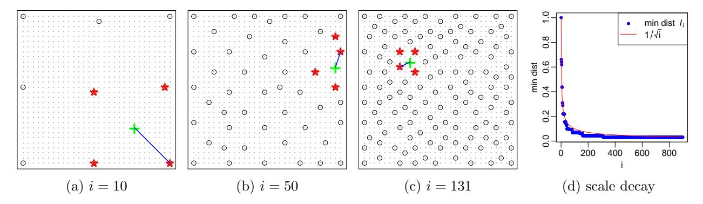
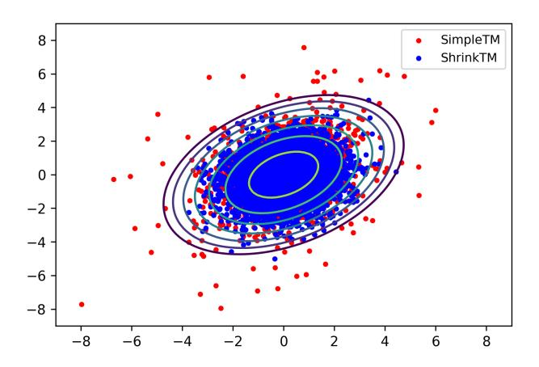
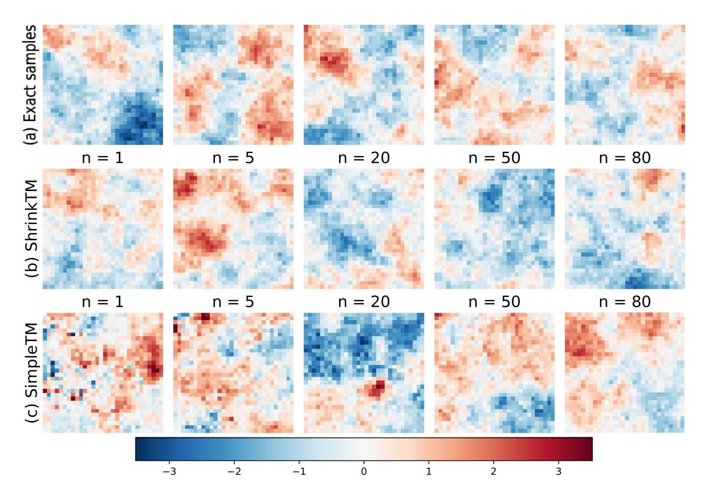
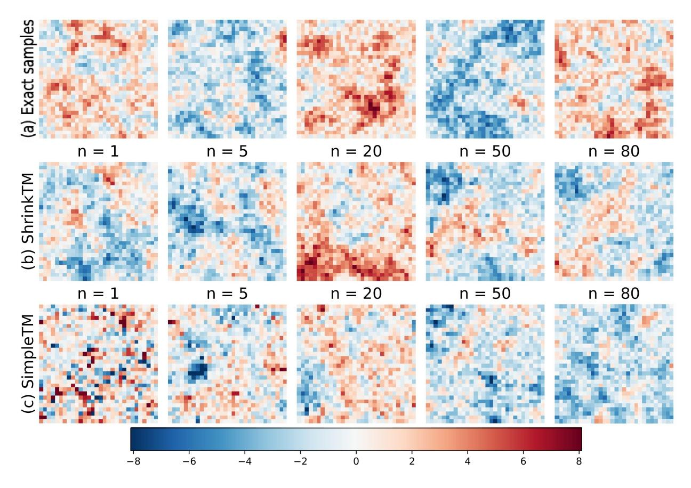
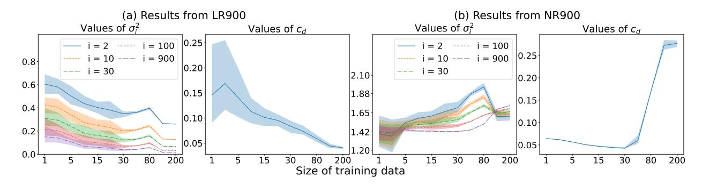
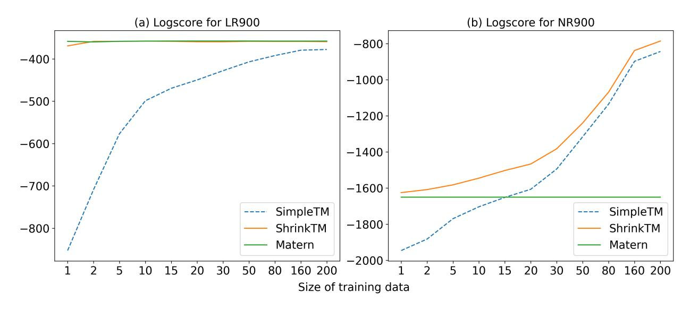
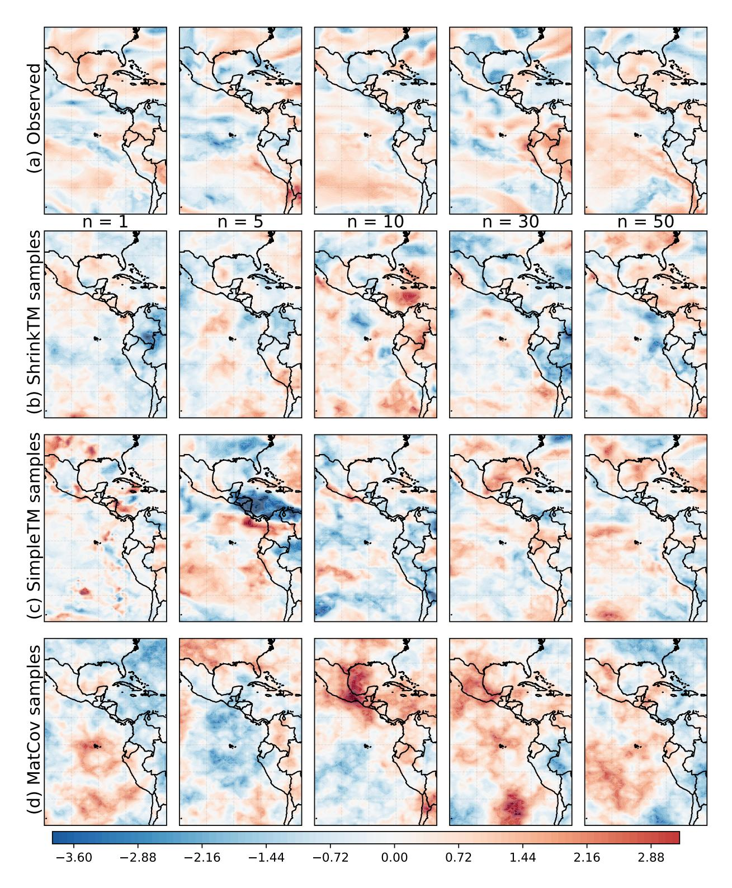
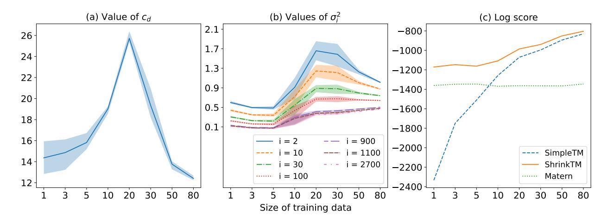
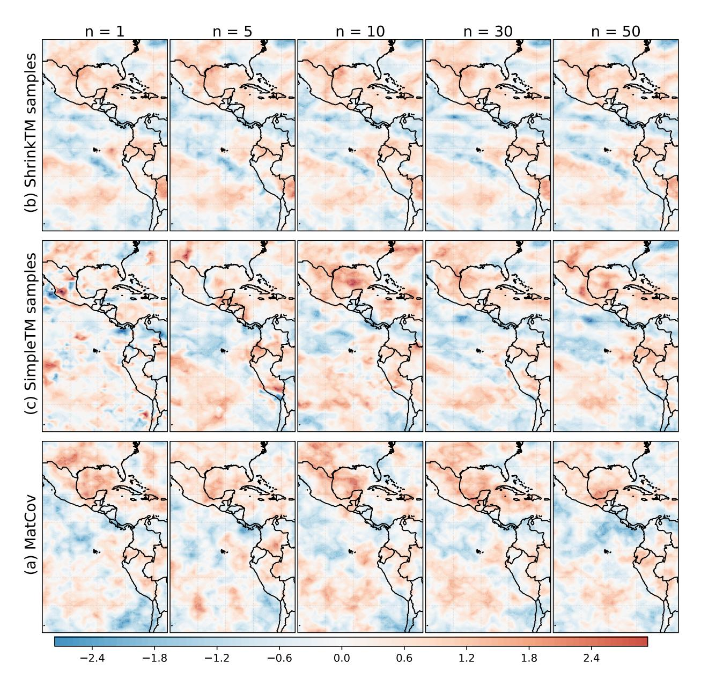
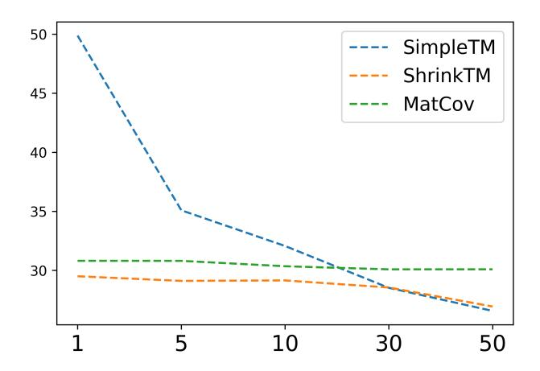

# Learning non-Gaussian spatial distributions via Bayesian transport maps with parametric shrinkage

Anirban Chakraborty∗ Matthias Katzfuss†

#### Abstract

Many applications, including climate-model analysis and stochastic weather generators, require learning or emulating the distribution of a high-dimensional and non-Gaussian spatial field based on relatively few training samples. To address this challenge, a recently proposed Bayesian transport map (BTM) approach consists of a triangular transport map with nonparametric Gaussian-process (GP) components, which is trained to transform the distribution of interest to a Gaussian reference distribution. To improve the performance of this existing BTM, we propose to shrink the map components toward a "base" parametric Gaussian family combined with a Vecchia approximation for scalability. The resulting ShrinkTM approach is more accurate than the existing BTM, especially for small numbers of training samples. It can even outperform the "base" family when trained on a single sample of the spatial field. We demonstrate the advantage of ShrinkTM through numerical experiments on simulated data and on climate-model output.

Keywords: Climate-model emulation; transport maps; autoregressive Gaussian processes; Vecchia approximation; generative modeling; maximin ordering; covariance estimation.

# 1 Introduction

Statistical inference in several practical applications, including climate-model emulation (e.g., [Castruccio et al., 2014;](#page-16-0) [Nychka et al., 2018;](#page-17-0) [Haugen et al., 2019\)](#page-17-1) and ensemble-based data assimilation (e.g., [Houtekamer and Zhang, 2016;](#page-17-2) [Katzfuss et al., 2016\)](#page-17-3), requires generative modeling of high-dimensional spatial distributions based on small number of replicates that are expensive to produce. Several methods are available for spatial inference with a small number of training replicates, including Gaussian processes (GP) with simple parametric covariance functions (e.g., [Cressie, 1993;](#page-17-4) [Banerjee et al., 2004\)](#page-16-1), locally anisotropic Mat´ern covariances (e.g., [Nychka et al., 2018;](#page-17-0) [Wiens et al., 2020\)](#page-18-0), and copulas (e.g., [Gr¨aler, 2014\)](#page-17-5). However, many of these methods assume Gaussianity implicitly or explicitly in the model and do not scale to large datasets (see [Katzfuss and Sch¨afer, 2024,](#page-17-6) for a review).

∗Department of Bioinformatics and Computational Biology, University of Texas MD Anderson Cancer Center

†Department of Statistics, University of Wisconsin–Madison. Corresponding author: katzfuss@gmail.com.

Generative machine-learning based approaches such as variational auto encoders, generative adversarial networks (e.g., [Goodfellow et al., 2016\)](#page-17-7), and normalizing flows (e.g., [Kobyzev](#page-17-8) [et al., 2021\)](#page-17-8) on the other hand typically require massive training data, and are often highly sensitive to tuning-parameter and network-architecture choices (e.g., [Arjovsky and Bottou,](#page-16-2) [2017;](#page-16-2) [Hestness et al., 2017;](#page-17-9) [Mescheder et al., 2018\)](#page-17-10), and hence not directly applicable to lowdata applications without additional application-specific techniques (e.g., [Kashinath et al.,](#page-17-11) [2021\)](#page-17-11).

Transport maps constitute another approach for modeling continuous multivariate non-Gaussian distributions. Specifically, a triangular transport map can characterize the dependence structure of any continuous multivariate distribution by transforming the target distribution to a reference distribution (e.g., standard Gaussian) (e.g., [Marzouk et al., 2016;](#page-17-12) [Katzfuss and Sch¨afer, 2024\)](#page-17-6). Recently, [Katzfuss and Sch¨afer \(2024\)](#page-17-6) introduced a Bayesian transport map (BTM), in which the components of the transport map are nonparametrically modeled as GPs. [Wiemann and Katzfuss \(2023\)](#page-18-1) extended this approach to model multivariate non-Gaussian spatial fields. The BTM approach results in closed-form inference that quantifies uncertainty and avoids under- and over-fitting even when the number of training samples is small. For target distributions corresponding to spatial fields, [Katzfuss](#page-17-6) [and Sch¨afer \(2024\)](#page-17-6) proposed priors that exploit the screening effect via suitable conditionalindependence assumptions that guarantee computational scalability for very large datasets. The resulting sparse non-linear transport maps can be seen as a non-parametric and non-Gaussian generalization of Vecchia approximations (e.g., [Vecchia, 1988;](#page-18-2) [Stein et al., 2004;](#page-18-3) [Datta et al., 2016;](#page-17-13) [Katzfuss and Guinness, 2021;](#page-17-14) [Sch¨afer et al., 2021a\)](#page-18-4), which implicitly utilize a linear transport map given by a sparse inverse Cholesky factor. The BTM approach, however, still requires O(10) training samples to accurately estimate meaningful dependencies, and hence can be prohibitive in applications where obtaining even a moderate number of training ensembles can become quite expensive.

We propose a novel extension of the BTM approach of [Katzfuss and Sch¨afer \(2024\)](#page-17-6) that is specifically tailored for learning the distributions of large spatial fields when very limited training samples (often, only one) are available. This extension builds on [Kidd and Katzfuss](#page-17-15) [\(2022\)](#page-17-15), who proposed Bayesian nonparametric inference on the inverse Cholesky factors of the GP covariance matrices and empirically studied their parametric regularization. The major contribution lies in defining a new set of prior distributions for the map components that first centers the mean and variance of each of the components toward the conditional means and variances of a parametric GP (e.g., with a Mat´ern covariance). Next, it introduces some regularization factors in the prior distributions, which can be optimized to actively learn the amount of shrinkage towards the GP family. We approximate the conditional means and variances by leveraging Vecchia approximation [\(Vecchia, 1988\)](#page-18-2). The resulting regularized BTM approach, which we call ShrinkTM, is fast and produces accurate inference for large spatial non-Gaussian fields even when trained with only n = 1 sample. Consequently, it expands the application of the BTM approach introduced by [Katzfuss and Sch¨afer \(2024\)](#page-17-6) in many realistic applications.

The remainder of the paper is organized as follows. In Section [2,](#page-2-0) we review the Bayesian spatial transport map of [Katzfuss and Sch¨afer \(2024\)](#page-17-6). In Section [3,](#page-4-0) we introduce our regularization for the BTM approach, including the use of the Vecchia approximation for computing conditional means and variances of the base GP family. In Section [4,](#page-8-0) we provide numerical comparisons of our methods to the existing BTM approach using simulated data and climate-model output. We conclude in Section 5. Proofs are provided in Appendix A.

# 2 Review of Bayesian spatial transport maps

#### 2.1 Transport maps and regression

Our goal is to learn the joint probability distribution  $p(\mathbf{y})$  of a centered spatial field  $\mathbf{y} = (y_1, \dots, y_N)^{\mathsf{T}}$ , where  $y_i = y(\mathbf{s}_i)$  is observed at location  $\mathbf{s}_i$ . A transport map  $\mathcal{T} : \mathbb{R}^N \to \mathbb{R}^N$  characterizes  $p(\mathbf{y})$  through a nonlinear transformation  $\mathcal{T}$  of  $\mathbf{y}$ , such that  $\mathcal{T}(\mathbf{y})$  follows a simple reference distribution:  $\mathcal{T}(\mathbf{y}) \sim \mathcal{N}_N(\mathbf{0}, \mathbf{I}_N)$ , where  $\mathcal{N}_N$  denotes an N-variate Gaussian distribution. Without loss of generality,  $\mathcal{T}$  can have a lower triangular form (Rosenblatt, 1952; Carlier et al., 2009) such that

$$\mathcal{T}(\mathbf{y}) = \begin{bmatrix} \mathcal{T}_1(y_1) \ \mathcal{T}_2(y_1, y_2) \ \vdots \ \mathcal{T}_N(y_1, y_2, \dots, y_N) \end{bmatrix},$$

with  $\mathcal{T}_i$  being strictly monotone in the *i*-th argument. Katzfuss and Schäfer (2024) have used this transport-map idea for generative modeling of high-dimensional spatial fields. Specifically, they assume map components  $\mathcal{T}_i$  of the form,

$$\mathcal{T}_i(\mathbf{y}_{1:i}) = (y_i - f_i(\mathbf{y}_{1:i-1}))/d_i, \qquad i = 1, \dots, N,$$

for some  $d_i \in \mathbb{R}^+$ ,  $f_i : \mathbb{R}^{i-1} \to \mathbb{R}$  for i = 2, ..., N, and  $f_i(\mathbf{y}_{1:i-1}) \equiv 0$  for i = 1. Consequently, the implied joint density  $p(\mathbf{y})$  can be factorized as  $p(\mathbf{y}) = \prod_{i=1}^{N} \mathcal{N}(y_i | f_i(\mathbf{y}_{1:i-1}), d_i)$ , and so the transport-map approach converts the problem of inferring the N-variate distribution of  $\mathbf{y}$  into N independent regressions of  $y_i$  on  $\mathbf{y}_{1:i-1}$  of the form

$$y_i = f_i(\mathbf{y}_{1:i-1}) + \epsilon_i, \quad \epsilon_i \sim \mathcal{N}(0, d_i^2), \qquad i = 1, \dots, N.$$
 (1)

#### 2.2 Prior distributions

In contrast to previous transport map literature (e.g., Marzouk et al., 2016), which assumes known parametric forms for  $\mathcal{T}$ , Katzfuss and Schäfer (2024) assume a flexible, nonparametric prior on the map  $\mathcal{T}$  by specifying independent conjugate Gaussian-process-inverse-Gamma priors for the  $f_i$  and  $d_i^2$ . Specifically, for the conditional variances  $d_i^2$ , they assume inverse-Gamma distributions,

$$d_i^2 \stackrel{ind.}{\sim} \mathcal{IG}(\alpha_i, \beta_i), \quad \text{with } \alpha_i > 1, \ \beta_i > 0, \quad i = 1, \dots, N.$$
 (2)

Conditional on  $d_i^2$ , each function  $f_i$  is modeled as a Gaussian process (GP) with inputs  $\mathbf{y}_{1:i-1}$ ,

$$f_i|d_i \stackrel{ind.}{\sim} \mathcal{GP}(0, d_i^2 K_i), \qquad i = 1, \dots, N,$$
 (3)

Figure 1: Maximin ordering of locations on a grid (small gray points) of size  $N = 30 \times 30 = 900$  on  $[0, 1]^2$ . (a)-(c): The *i*th ordered location (+), the previous i-1 locations ( $\circ$ ), including the nearest m=4 neighbors (\* and the distance  $\ell_i$  to the nearest neighbor (—). (d): For  $i=1,\ldots,N$ , the length scales (i.e., minimum distances) decay as  $\ell_i = i^{-1/\dim}$ , where dim denotes the dimension of the spatial domain. This figure closely follows Figure 2 in Katzfuss and Schäfer (2024).

with 
$$K_i(\cdot, \cdot) = C_i(\cdot, \cdot)/E(d_i^2)$$
,  $E(d_i^2) = \beta_i/(\alpha_i - 1)$ ,  

$$C_i(\mathbf{y}_{1:i-1}, \mathbf{y}'_{1:i-1}) = \mathbf{y}_{1:i-1}^{\top} \mathbf{Q}_i \mathbf{y}'_{1:i-1} + \sigma_i^2 \rho(h_i(\mathbf{y}_{1:i-1}^{\top}, \mathbf{y}'_{1:i-1})/\gamma), \qquad i = 2, \dots, N,$$
(4)

where  $\sigma_i \in \mathbb{R}_0^+$ ,  $\gamma = \exp(\theta_{\gamma})$  is a range parameter,  $h_i^2(\mathbf{y}_{1:i-1}, \mathbf{y}'_{1:i-1}) = (\mathbf{y}_{1:i-1} - \mathbf{y}'_{1:i-1})^{\top} \mathbf{Q}_i(\mathbf{y}_{1:i-1} - \mathbf{y}'_{1:i-1})$  and  $\rho$  is an isotropic correlation function such that  $\rho(h_i(\mathbf{y}_{1:i-1}, \mathbf{y}_{1:i-1})) = 1$ . The expression of prior covariance function  $C_i(\cdot, \cdot)$  in (4) takes into account variance from both linear and nonlinear components from the regression function  $f_i$ . The degree of nonlinearity of  $f_i$  is determined by  $\sigma_i^2$ , and indicates linear dependency of  $f_i$  on  $\mathbf{y}_{1:i-1}$  when  $\sigma_i^2 = 0$ .

## 2.3 Maximin ordering for large spatial fields

Katzfuss and Schäfer (2024) assume a maximum-minimum-distance (maximin) ordering of the locations  $\mathbf{s}_1, \ldots, \mathbf{s}_N$ , which is obtained by sequentially choosing each location to maximize the minimum distance to all previously ordered locations. Specifically, the first index  $i_1$  is chosen arbitrarily (e.g.,  $i_1 = 1$ ), and then the subsequent indices are selected as  $i_j = \arg\max_{i \notin \mathcal{I}_j} \min_{j \in \mathcal{I}_j} \|\mathbf{s}_i - \mathbf{s}_j\|$  for  $j = 2, \ldots, N$ , where  $\mathcal{I}_j = \{i_1, \ldots, i_{j-1}\}$ . Define  $c_i(k)$  as the index of the kth nearest (previously ordered) neighbor of the ith location (and so  $\mathbf{s}_{c_i(1)}, \ldots, \mathbf{s}_{c_i(4)}$  are indicated by \* in Figure 1). The maximin ordering can be interpreted as a multiresolution decomposition into coarse scales early in the ordering and fine scales later in the ordering. In particular, the minimal pairwise distance  $\ell_i = \|\mathbf{s}_i - \mathbf{s}_{c_i(1)}\|$  among the first i locations of the ordering decays roughly as  $\ell_i \propto i^{-1/\dim}$ , where dim here is the dimension of the spatial domain (see Figure 1d).

Assuming that the entries of  $\mathbf{y}$  ordered according to maximin ordering, the *i*th regression in (1) can be viewed as a spatial prediction at location  $\mathbf{s}_i$  based on data at locations  $\mathbf{s}_1, \ldots, \mathbf{s}_{i-1}$  that lie roughly on a regular grid with distance (i.e., scale)  $\ell_i$ .

When the variables  $y_1, \ldots, y_N$  are not associated with spatial locations or when Euclidean distance between the locations is not meaningful (e.g., nonstationary, multivariate, spatio-temporal, or functional data), the maximin and neighbor ordering can be carried out based on other distance metrics, such as  $(1 - |\text{correlation}|)^{1/2}$  based on some guess or estimate of the correlation between variables (Kidd and Katzfuss, 2022; Kang and Katzfuss, 2023).

#### 2.4 Computation and inference for large spatial fields

Inference based on (1) – (4) is computationally and statistically challenging for large N, as it requires inferring nonlinear functions  $f_i$  in  $\mathcal{O}(N)$  dimensions. Hence, Katzfuss and Schäfer (2024) first assumed a maximin ordering of the spatial locations  $s_1, \ldots, s_N$ , and parameterized the relevance matrix  $\mathbf{Q}_i = diag(q_{i,1}^2, \ldots, q_{i,i-1}^2)$  to decay exponentially with neighbor number k, as

$$q_{i,c_i(k)} = \begin{cases} \exp(-e^{\theta_q}k), & k \le m', \\ 0, & k > m'. \end{cases}$$
 (5)

The sparsity parameter  $m' = \max\{k : \exp(-e^{\theta_q}k) \ge \varepsilon\}$  is determined by the data through the hyperparameter  $\theta_q$ , where  $\varepsilon$  is a small fixed threshold (e.g.,  $\varepsilon = 0.01$ ). The parametrization of  $q_{i,c_i(k)}$  has been primarily considered by Katzfuss and Schäfer (2024) and is motivated by exponential rates of screening for Gaussian processes derived from elliptic boundary-value problems (Schäfer et al., 2021b,a; Kang et al., 2024). Consequently,  $f_i(\mathbf{y}_{1:i-1}) = f_i(\mathbf{y}_{g_{m'}(i)})$  and its covariance kernel can be expressed as

$$C_{i}(\mathbf{y}_{g_{m'}(i)}, \mathbf{y}'_{g_{m'}(i)}) = \mathbf{y}_{g_{m'}(i)}^{\top} \mathbf{Q}_{i} \mathbf{y}'_{g_{m'}(i)} + \sigma_{i}^{2} \rho(h_{i}(\mathbf{y}_{g_{m'}(i)}^{\top}, \mathbf{y}'_{g_{m'}(i)})/\gamma), \qquad i = 2, \dots, N,$$
 (6)

where  $g_{m'}(i) = \{c_i(1), \ldots, c_i(m')\} \subset \{1, \ldots, i-1\}$  denotes the m' nearest previously ordered neighbors. This results in a sparse  $\mathcal{GP}$  regression of  $f_i$  in (1) on  $\mathbf{y}_{g_{m'}(i)}$ , which is easier to compute.

The prior distributions in equations (2)-(3) and (6) depend on the hyperparameter vector  $\boldsymbol{\psi} = (\alpha_1, \dots, \alpha_N, \beta_1, \dots, \beta_N, \boldsymbol{\kappa}_1, \dots, \boldsymbol{\kappa}_N)$ , where  $\boldsymbol{\kappa}_i$  are hyperparameters of the covariance matrices  $\mathbf{K}$ 's for the  $\mathcal{GP}$ 's on  $f_i$ 's. Katzfuss and Schäfer (2024) have employed an empirical Bayes (EB) technique to estimate these hyperparameters. Specifically, they have shown that the screening effect (e.g., Stein, 2011) and near-Gaussianity (e.g., Schäfer et al., 2021; Katzfuss and Schäfer, 2024) along with the maximin ordering described in Section 2.3 can be judiciously employed in the estimation process to simultaneously reduce the number of hyperparameters (see Wiemann and Katzfuss, 2023, Sect. 2.1.1, for a review) and decrease the computation time for large spatial fields. We will revisit relevant details discussing our methodology in Section 3.

# 3 Methodology: Shrinkage toward parametric covariances

# 3.1 Vecchia approximation of Gaussian distributions

Assume temporarily that  $\mathbf{y} \sim \mathcal{N}_N(\mathbf{0}, \mathbf{\Sigma})$  with known (spatial) covariance  $\mathbf{\Sigma}$ . In this setting, Vecchia (1988) proposed to approximate the joint distribution  $p(\mathbf{y}) = \prod_{i=1}^N p(y_i|\mathbf{y}_{1:i-1})$  by

$$\hat{p}(\mathbf{y}) = \prod_{i=1}^{N} p(y_i | \mathbf{y}_{g_m(i)}), \tag{7}$$

where  $g_m(i) \subset \{1, \ldots, i-1\}$  is a subset of m nearest neighbors ordered prior to i. The Vecchia approximation under maximin ordering has been shown to be highly accurate even for large

N (e.g., N = 105 ) and relatively small m (e.g., m = 30) both numerically and theoretically in a variety of settings (e.g., [Datta et al., 2016;](#page-17-13) [Katzfuss and Guinness, 2021;](#page-17-14) [Katzfuss et al.,](#page-17-18) [2020;](#page-17-18) [Zilber and Katzfuss, 2021;](#page-18-9) [Jurek and Katzfuss, 2022;](#page-17-19) [Zhang and Katzfuss, 2022;](#page-18-10) [Kang](#page-17-17) [et al., 2024\)](#page-17-17), due to the screening effect (e.g., [Stein, 2011\)](#page-18-7).

Due to the Gaussian assumption, the conditional distributions in [\(7\)](#page-4-2) can be analytically expressed as:

$$p(y_i|\mathbf{y}_{g_m(i)}) = \mathcal{N}(y_i|\boldsymbol{\xi}_i^{\mathsf{T}}\mathbf{y}_{g_m(i)}, \tau_i^2), \tag{8}$$

where ξ ⊤ i = Σi,gm(i)Σ −1 gm(i),gm(i) , τ 2 i = Σi,i − Σi,gm(i)Σ −1 gm(i),gm(i)Σgm(i),i, and Σj,k denotes the submatrix of Σ with entries from row indices j and column indices k (with j, k ⊂ {1, 2, . . . , N}).

Comparing [\(8\)](#page-5-0) to the expressions in Section [2.1,](#page-2-4) we can see that if y ∼ N (0, Σ), both fi and d 2 i can be expressed in closed form as fi(y1:i−1) = ξ ⊤ i ygm(i) and d 2 i = τ 2 i , after applying a Vecchia approximation to NN (0, Σ).

## 3.2 Nonlinear prior distributions

Given the motivation in Section [3.1,](#page-4-3) we now propose a methodology for learning the joint distribution p(y) with nonlinear and nonparametric dependence based on a small number of training samples by shrinking p(y) toward NN (0, Σ) by shrinking fi(y1:i−1) toward the implied ξ ⊤ i ygm(i) and d 2 i toward τ 2 i , where Σ (and hence ξi and τ 2 i ) are based on a parametric "base" covariance (e.g., Mat´ern) that depends on parameters θp. We suppress this dependence for now to ease notation and describe inference on θp in Section [3.4.](#page-7-0)

Specifically, for [\(2\)](#page-2-2), we now assume E(d 2 i ) = τ 2 i and sd(d 2 i ) = cdE(d 2 i ), where cd determines how much d 2 i is shrunk toward τ 2 i . Solving the inverse-Gamma moments E(d 2 i ) = βi/(αi − 1) and sd(d 2 i ) = βi/(αi − 1)p (αi − 2) for αi and βi , we obtain

$$\alpha_i = (2 + 1/c_d^2), \qquad \beta_i = (1 + 1/c_d^2)\tau_i^2, \qquad i = 1, \dots, N.$$

Conditional on the variance component d 2 i , we model each function fi using a GP:

$$f_i|d_i \stackrel{ind.}{\sim} \mathcal{GP}(\boldsymbol{\xi}_i^{\top} \mathbf{y}_{g_m(i)}, d_i^2 K_i), \qquad i = 1, \dots, N,$$
 (9)

where Ki(·, ·) = Ci(·, ·)/E(d 2 i ). In contrast to [\(3\)](#page-2-3), where the regression function fi 's are centered at zero, here we center our new prior distribution for fi at the conditional means ξ ⊤ i ygm(i) obtained through the Vecchia approximation of Σ. We write Ci(·, ·) as,

$$C_{i}(\mathbf{y}_{g_{m'}(i)}, \mathbf{y}'_{g_{m'}(i)}) = \sigma_{0}^{2} \mathbf{y}_{g_{m'}(i)}^{\mathsf{T}} \mathbf{Q}_{i} \mathbf{y}'_{g_{m'}(i)} + \sigma_{i}^{2} \rho(h_{i}(\mathbf{y}_{g_{m'}(i)}^{\mathsf{T}}, \mathbf{y}'_{g_{m'}(i)})/\gamma), \qquad i = 2, \dots, N, \quad (10)$$

where γ, hi and ρ follow similar parameterization as in [\(6\)](#page-4-1). To obtain the sparsity parameter m′ in [\(5\)](#page-4-4), we used ε = 0.01 for our numerical examples, which produced highly accurate inference and usually resulted in m′ < 10. In contrast to [\(6\)](#page-4-1), we introduce a shrinkage parameter σ 2 0 in [\(10\)](#page-5-1) that determines the level of shrinkage towards a linear regression.

It is important to note that we induce sparsity in the transport map through both assumptions [\(8\)](#page-5-0) and [\(5\)](#page-4-4). While m′ , the maximum number of nearest number for the nonlinear covariance kernel in [\(10\)](#page-5-1), is determined from the data via θq, we want the nearest-neighbor

Figure 2: For two locations at distance 0.3 in the Gaussian simulation example in Figure 3, the true bivariate Gaussian distribution (contour lines), along with 5,000 samples each from the fitted existing Bayesian transport map (SimpleTM) outlined in Section 2 (red) and our proposed ShrinkTM (blue), both trained on a single (n = 1) sample.

number m in (8) to be large enough for accurate Vecchia approximation of  $\Sigma$  but without jeopardizing computational efficiency, and so we use a fixed m = 30.

In addition, we also consider the same parameterization of  $\sigma_i^2$  given by the former authors, i.e.,  $\sigma_i^2 = e^{\theta_{\sigma,1}} \ell_i^{\theta_{\sigma,2}}$ , with  $\ell_i$  as in Section 2.3, which allows the conditional distributions of  $\mathbf{y}_{i:N}$  given  $\mathbf{y}_{g_{m'}(i)}$  to be increasingly Gaussian as i increases, as a function of hyperparameters  $\theta_{\sigma,1}, \theta_{\sigma,2}$ . This prior assumption is motivated by the behavior of stochastic processes with quasiquadratic loglikelihoods (Katzfuss and Schäfer, 2024).

Equations (8)–(10) imply a transport-map model that we call ShrinkTM, which can accurately learn the joint distribution even when trained with small number of samples. For example, Figure 2 shows that if we train both ShrinkTM and the existing transport-map approach (SimpleTM) outlined in Section 2 on single simulated sample, ShrinkTM's parametric shrinkage allows it to capture the true distribution among two arbitrarily selected locations much more accurately than SimpleTM, which produces overly heavy tails.

# 3.3 The posterior map

Now assume that we have observed n independent training samples  $\mathbf{y}^{(1)}, \ldots, \mathbf{y}^{(n)}$  from the distribution in Section 2 conditional on  $\mathbf{f} = (f_1, \ldots, f_N)$  and  $\mathbf{d} = (d_1, \ldots, d_N)$ , such that  $\mathbf{y}^{(j)} \stackrel{i.i.d.}{\sim} p(\mathbf{y}|\mathbf{f},\mathbf{d})$  with  $\mathcal{T}(\mathbf{y}^{(j)}) | \mathbf{f}, \mathbf{d} \sim \mathcal{N}_N(\mathbf{0}, \mathbf{I}_N), j = 1, \ldots, n$ . We assume that the samples are ordered according to the maximin ordering described in Section 2.3 and combine the samples into an  $n \times N$  data matrix  $\mathbf{Y}$  whose jth row is given by  $\mathbf{y}^{(j)}$ . Then, for the regression in (1), the responses  $\mathbf{y}_i$  and the covariates  $\mathbf{Y}_{g_m(i)}$  (and  $\mathbf{Y}_{g_{m'}(i)}$ ) are given by the ith and the  $g_m(i)$  (and  $g_{m'}(i)$ ) columns of  $\mathbf{Y}$ , respectively. Below, let  $\mathbf{y}^*$  denote a new observation sampled from the same distribution,  $\mathbf{y}^* \sim p(\mathbf{y}|\mathbf{f},\mathbf{d})$ , independently of  $\mathbf{Y}$ .

Based on the prior distribution for  $\mathbf{f}$  and  $\mathbf{d}$  in Section 3.2, we can now determine the posterior map  $\widetilde{\mathcal{T}}$  learned from the training data  $\mathbf{Y}$ , with  $\mathbf{f}$  and  $\mathbf{d}$  integrated out. This map is available in closed form and invertible:

#### **Algorithm 1:** Estimation of the spatial transport map

Input: Data matrix  $\mathbf{Y}^{n\times N} = (\mathbf{y}^{(1)}, \dots, \mathbf{y}^{(n)})^{\top}$ .

**Result:** Trained transport map  $\widetilde{\mathcal{T}}_{\hat{\boldsymbol{\theta}}}$ .

- 1: Order  $y_1, \ldots, y_N$  in maximin ordering and compute scales  $\ell_i$  and nearest-neighbor indices  $c_i(1), \ldots, c_i(m_{\text{max}})$  (e.g.,  $m_{\text{max}} = 30$ ) for each  $i = 1, \ldots, N$  (see Section 2.3)
- 2: Compute  $\hat{\boldsymbol{\theta}} = \arg \max_{\boldsymbol{\theta}} \log p_{\boldsymbol{\theta}}(\mathbf{Y})$  via stochastic gradient ascent, where  $p_{\boldsymbol{\theta}}(\mathbf{Y})$  is given in (12).
- 3: Use fitted map to generate new samples or to find score of an observation. A new sample can be generated using  $\mathbf{y}^{\star} = \widetilde{\mathcal{T}}_{\hat{\boldsymbol{\theta}}}^{-1}(\mathbf{z}^{\star})$  using (11) based on  $\mathbf{z}^{\star} \sim \mathcal{N}_{N}(\mathbf{0}, \mathbf{I}_{N})$ . Score can be calculated using (15).

PROPOSITION 1. The transport map  $\widetilde{\mathcal{T}}$  from  $\mathbf{y}^* \sim p(\mathbf{y}|\mathbf{Y})$  to  $\mathbf{z}^* = \widetilde{\mathcal{T}}(\mathbf{y}^*) \sim \mathcal{N}_N(\mathbf{0}, \mathbf{I}_N)$  is a triangular map with components

$$z_i^{\star} = \widetilde{\mathcal{T}}_i(y_1^{\star}, \dots, y_i^{\star}) = \Phi^{-1}(F_{2\tilde{\alpha}_i}(\hat{d}_i^{-1}(v_i(\mathbf{y}_{1:i-1}^{\star}) + 1)^{-1/2}(y_i^{\star} - \hat{f}_i(\mathbf{y}_{1:i-1}^{\star})))), \quad i = 1, \dots, N,$$

where  $\tilde{\alpha}_i = \alpha_i + n/2$ ,  $\tilde{\beta}_i = \beta_i + (\mathbf{y}_i - \mathbf{Y}_{g_m(i)} \boldsymbol{\xi}_i)^{\top} \mathbf{G}_i^{-1} (\mathbf{y}_i - \mathbf{Y}_{g_m(i)} \boldsymbol{\xi}_i)/2$ ,  $\hat{d}_i^2 = \tilde{\beta}_i / \tilde{\alpha}_i$ ,  $\mathbf{G}_i = \mathbf{K}_i + \mathbf{I}_n$ ,  $\mathbf{K}_i = K_i (\mathbf{Y}_{g_{m'}(i)}, \mathbf{Y}_{g_{m'}(i)}) = (K_i (\mathbf{y}_{g_{m'}(i)}^{(j)}, \mathbf{y}_{g_{m'}(i)}^{(l)}))_{j,l=1,\dots,n}$ ,

$$\hat{f}_{i}(\mathbf{y}_{1:i-1}^{\star}) = \mathbf{G}_{i}^{-1} \mathbf{Y}_{g_{m}(i)} \boldsymbol{\xi}_{i} + K_{i}(\mathbf{y}_{g_{m'}(i)}^{\star}, \mathbf{Y}_{g_{m'}(i)}) \mathbf{G}_{i}^{-1} \mathbf{y}_{i}, v_{i}(\mathbf{y}_{1:i-1}^{\star}) = K_{i}(\mathbf{y}_{g_{m'}(i)}^{\star}, \mathbf{y}_{g_{m'}(i)}^{\star}) - K_{i}(\mathbf{y}_{g_{m'}(i)}^{\star}, \mathbf{Y}_{g_{m'}(i)}) \mathbf{G}_{i}^{-1} K_{i}(\mathbf{Y}_{g_{m'}(i)}, \mathbf{y}_{g_{m'}(i)}^{\star}),$$

for  $i=2,\ldots,N$ ,  $\hat{f}_1=v_1=0$  for i=1, and  $\Phi$  and  $F_{\kappa}$  denote the cumulative distribution functions of the standard normal and the t distribution with  $\kappa$  degrees of freedom, respectively. The inverse map  $\widetilde{\mathcal{T}}^{-1}$  can be evaluated at a given  $\mathbf{z}^*$  by solving the nonlinear triangular system  $\widetilde{\mathcal{T}}(\mathbf{y}^*)=\mathbf{z}^*$  for  $\mathbf{y}^*$ , which can be expressed recursively as:

$$y_i^{\star} = \hat{f}_i(\mathbf{y}_{1:i-1}^{\star}) + F_{2\tilde{\alpha}_i}^{-1}(\Phi(z_i^{\star})) \, \hat{d}_i(v_i(\mathbf{y}_{1:i-1}^{\star}) + 1)^{1/2}, \quad i = 1, \dots, N.$$
 (11)

Propositions 1 and 2 (see below) closely follow Katzfuss and Schäfer (2024), but due to our newly designed prior distributions in Section 3.2, we obtain posterior maps with different parameters, as detailed in the proofs in Appendix A.

Computation of  $\mathcal{T}_i$  requires  $\mathcal{O}(n^3 + m'n^2)$  time for computing and decomposing the  $n \times n$  matrix  $\mathbf{G}_i$  and  $\mathcal{O}(m^3)$  time for computing the Vecchia approximation, for each  $i = 1, \ldots, N$ . The N components of  $\widetilde{\mathcal{T}}$  can be computed completely in parallel.

# 3.4 Hyperparameters

In the prior distributions of  $f_i$  and  $d_i$  in Section 3.2,  $\alpha_i$ ,  $\beta_i$ , m,  $K_i$  depend on a vector  $\boldsymbol{\theta} = (\boldsymbol{\theta}_p, c_d, \theta_{\sigma,1}, \theta_{\sigma,2}, \theta_q)$  of hyperparameters, where  $\boldsymbol{\theta}_p$  are parameters determining the parametric covariance  $\boldsymbol{\Sigma}$ ,  $\theta_q$  determines decay and m', and  $c_d$ ,  $\theta_{\sigma,1}$ ,  $\theta_{\sigma,2}$  determine the strength of shrinkage toward (a Vecchia approximation with conditioning-set size m of)  $\mathcal{N}(\mathbf{0}, \boldsymbol{\Sigma})$ . We can write in closed form the integrated likelihood  $p_{\boldsymbol{\theta}}(\mathbf{Y})$ , where  $\mathbf{f}$  and  $\mathbf{d}$  have been integrated out.

Proposition 2. The integrated likelihood is

$$p_{\theta}(\mathbf{Y}) \propto \prod_{i=1}^{N} \left( |\mathbf{G}_{i}|^{-1/2} \times (\beta_{i}^{\alpha_{i}}/\tilde{\beta}_{i}^{\tilde{\alpha}_{i}}) \times \Gamma(\tilde{\alpha}_{i})/\Gamma(\alpha_{i}) \right),$$
 (12)

where Γ(·) denotes the gamma function, and α˜i, β˜ i, Gi are defined in Proposition [1.](#page-7-2)

For our numerical results, we have followed the strategy of [Katzfuss and Sch¨afer \(2024\)](#page-17-6) and have employed the empirical Bayesian approach, because it is fast and preserves the closed-form map properties in Section [3.3.](#page-6-1) Once optimized, the resulting posterior transport map can be used to draw inference on the training data by drawing new samples or calculating the score function (as in Algorithm [1\)](#page-7-3).

Figure 3: Exact samples from LR900 (top) and (independent) samples from ShrinkTM (middle) and SimpleTM (bottom) trained on n samples from LR900

# 4 Numerical results

# 4.1 Simulation experiments

For our numerical experiments, we consider two separate simulation scenarios on a regular spatial grid of N = 30 × 30 = 900 locations in a unit square that were previously considered by [Katzfuss and Sch¨afer \(2024\)](#page-17-6).

**LR900:**  $\mathbf{y} \sim \mathcal{N}_{900}(0, \mathbf{V})$ , where  $\mathbf{V}$  is an exponential covariance with unit variance and range parameter 0.3 (as in Figure 3(a)). This data generating mechanism can also be described as a linear map  $f_L(\mathbf{y}_{1:i-1}) = \sum_{k=1}^{i-1} b_{i,k} y_{c_i(k)}$ , where the  $b_{i,k} y_{c_i(k)}$  are coefficients of the conditional means (as in (8)) computed from the covariance matrix  $\mathbf{V}$ .

**NR900:** A sine function is added to the map components  $f_i^{\text{NL}}(\mathbf{y}_{1:i-1}) = f_i^{\text{L}}(\mathbf{y}_{1:i-1}) + 2\sin(4(b_{i,1}y_{c_i(1)} + b_{i,2}y_{c_i(2)}))$ , where the  $b_{i,k}y_{c_i(k)}$ s are coefficients of the conditional means computed from  $\Sigma$  used in LR900 (as in Figure 4(a)).

We consider both the existing BTM approach of Katzfuss and Schäfer (2024) (which we name **SimpleTM**) and our new version (i.e., **ShrinkTM**). For each of the two simulation settings, we randomly sample n training samples and train both SimpleTM and ShrinkTM. We vary the value of n and repeat this experiment 10 times for each value of n. For all the training tasks, we use default initial values  $\boldsymbol{\theta} = (\boldsymbol{\theta}_p, c_d, \theta_{\sigma,1}, \theta_{\sigma,2}, \theta_q) = (2.0, 0.0, 0.0, 0.0, -1.0)$ . We perform the training of both SimpleTM and ShrinkTM in Python using the stochastic-gradient-descent-based Adam optimization algorithm from the PyTorch 2.5.1 library. We set the initial learning rate of the Adam optimizer to be 0.01 and adjust it using the cosine annealing rule in the PyTorch library. The remaining tuning parameters of the optimizer are fixed at their default values. We also compare to a **MatCov** approach that refers to a Gaussian process with an isotropic Matérn covariance (which is also used as the base covariance in ShrinkTM), with the three hyperparameters inferred via maximum likelihood estimation.

Figures 3 and 4 show samples generated from SimpleTM and ShrinkTM for different training sizes for LR900 and NR900, respectively. We can see that even for n=1 training samples, ShrinkTM excels in capturing the long- and short-range dependencies due to better regularization through the conditional means and variances, whereas SimpleTM struggles. We can furthermore see in Figure 5(a) that for LR900, the shrinkage factor  $c_d$  lies between 0.1 and 0.25 for n=1 with the average value of  $c_d$  around 0.15, indicating the efficiency of ShrinkTM. As  $c_d < 1$  means  $sd(d_i) < E(d_i)$ , this suggests a moderately strong shrinkage of the variance components  $d_i$  toward the corresponding values  $\tau_i(\hat{\theta}_p)$ 's (as discussed in Section 3.2). The average of  $c_d$  decreases for large training sample sizes, indicating a stronger shrinkage. On the other hand, since NR900 has a modified dependence structure relative to an exponential covariance, we can see that  $c_d$  varies for different sample sizes and automatically decides the amount of shrinkage from the training data.

To further assess the accuracy of these two methods, we generate test samples from the two simulation scenarios, and we compare average logarithmic score (higher is better) of SimpleTM, ShrinkTM, and MatCov in Figure 6. The log-score (e.g., ?) approximates the negative Kullback-Leibler divergence between the true and approximated distribution up to an additive constant. For LR900, the log-score of ShrinkTM is much higher than that of SimpleTM for very small numbers of training samples n (as seen in Figure 6(a)), and despite its flexible nonparametric structure, it matches the accuracy of the correctly specified parametric "base" MatCov (which only needs to estimate three parameters) when trained on only n = 2 training samples. Even when data is being generated from NR900, ShrinkTM consistently outperforms SimpleTM (as seen in Figure 6(b)). Average training time of ShrinkTM was also comparable with that of SimpleTM: On the uniform grid of N = 900 points, on average, ShrinkTM took 49 seconds and SimpleTM took 7 seconds to train on n = 1 replicate, but ShrinkTM and SimpleTM took 15 and 13.5 minutes, respectively,

Figure 4: Exact samples from NR900 (top) and (independent) samples from ShrinkTM (middle) and SimpleTM (bottom) trained on n samples from NR900

when training on n = 200 samples. This is in line with the time complexities of O(Nm3 ) for the Vecchia approximation (only in ShrinkTM) and O(N(n 3 + m′n 2 )) for computing and decomposing the Gi (for both ShrinkTM and SimpleTM), where the latter increases and starts to dominate for increasing n.

Figure 5: Results of several parameters from simulation experiments described in Section [4.1.](#page-8-4) First two columns represent values of σ 2 i and cd for the LR900 experiment, while the second two columns represent values of the σ 2 i and cd for NR900 experiment.

Figure 6: Logarithmic scores for LR900 (left) and NR900 (right) for varying sample sizes.

### 4.2 Climate data application

We consider log-transformed total precipitation rate (in m/s) on a roughly 1◦ longitudelatitude global grid of size N = 37 × 74 = 2738 in the middle of the Northern summer(July 1) in 98 consecutive years, starting in the year 402, from the Community Earth System Model (CESM) Large Ensemble Project [\(Kay et al., 2015\)](#page-17-20). This dataset was also analyzed in [Katzfuss and Sch¨afer \(2024\)](#page-17-6). CESM belongs to a broader class of climate models, which are large sets of computer code describing the behavior of the Earth system (e.g., the atmosphere) via systems of differential equations. Enormous computational power is required to produce even a single ensemble of these models on fine latitude-longitude grids from these computer codes. Due to the massive cost of obtaining a single sample from these climate models, it is important to build a stochastic generative model based on few training samples from the climate model, in order to produce relevant summaries and even draw more samples at much cheaper cost.

We consider a subsection of the western hemisphere (39.1◦N to 29.6◦S and 110◦W to 65◦W) containing parts of land including North, Central and South America, and a subsection of Atlantic and Pacific ocean. We obtain precipitation anomalies by standardizing the data at each grid location to mean zero and variance 1 (as shown in Figure [7\(](#page-12-0)a)), and used them as training ensembles.

Figure [7](#page-12-0) displays a set of samples obtained from SimpleTM, ShrinkTM, and MatCov for several training ensemble sizes. It is evident that with a low number of training samples (i.e., n = 1), ShrinkTM is able to capture non-Gaussian features and long-range characteristics, while SimpleTM requires 10 or more training samples to exhibit such features. When trained on n = 1, 5, 10, 30, 50 training samples, ShrinkTM selects m′ = 3, 3, 4, 16, 20 nearest neighbors to learn non-Gaussian distribution, respectively. On average, training of ShrinkTM takes 39 seconds, in comparison to 3 seconds taken by SimpleTM for n = 1. The average training time increases to 9, 18, 82 seconds for SimpleTM, and 46, 53, 123 seconds for ShrinkTM when training on n = 10, 20, 50 samples, respectively. Figure [8\(](#page-13-1)a)

Figure 7: Observed and fitted samples for the climate model experiment outlined in Section [4.1.](#page-8-4) Row (a) represents 5 observed samples from the climate model run described in Section [4.2.](#page-11-1) Row (b), (c) and (d) represent samples from ShrinkTM, SimpleTM and MatCov for varying training ensemble size, denoted by n.

Figure 8: Shrinkage metrics and logarithmic scores at varying training ensembles of log-precipitation data outlined in Section [4.2.](#page-11-1)

shows that for small n, the shrinkage factor cd has an extremely high value, suggesting non-Gaussianity in the samples. The level of non-Gaussianity is better learned with increase in training-ensemble size.

We quantitatively compare the performance of ShrinkTM and SimpleTM using average log-score. Figure [8\(](#page-13-1)c) shows the average log-score for these three methods with varying number of training ensembles. ShrinkTM outperforms both SimpleTM and MatCov for all training-sample sizes, including providing higher accuracy than the "base" MatCov approach even for a single training sample.

We consider conditional simulation to sample precipitation anomalies when a sample is partially observed. To do this, we consider the precipitation anomalies in the top-left panel of Figure [7](#page-12-0) (which were not part of the training data) and assume that we have observed only the first 100 ordered locations of this test field. Figure [9](#page-14-0) displays the conditional samples for different methods for varying training ensembles conditional on this partially observed field. It can be seen (Figure [9\(](#page-14-0)b)) that with only a few number of training ensembles, ShrinkTM is able to capture most of the long range dependencies that are seen in Figure [7](#page-12-0) (topleft panel) as well. SimpleTM needs around 30 samples to capture these dependencies, while MatCov is not able to capture them at all. Figure [10](#page-15-1) shows root mean square error (RMSE) of predicting the held-out locations when repeating this experiment 10 times.

# 5 Conclusion

We proposed an improved version of the BTM [\(Katzfuss and Sch¨afer, 2024\)](#page-17-6) by centering the mean and variance functions of its map components around the conditional means and variances obtained from a Gaussian process (GP) with a parametric covariance, whose parameters are estimated from the training data. We also employ a Vecchia approximation in the calculation of conditional means and variances of the GP. This new BTM version, which we call ShrinkTM, preserves the scalability and flexibility of BTM. A notable advantage of ShrinkTM is that it can cheaply produce realistic samples even when the transport map is trained with only a single training ensemble, and it is thus especially useful

Figure 9: Partially observed samples generated from MatCov, ShrinkTM and SimpleTM for varying training ensembles. For each of these samples, the output at first 100 ordered locations have been fixed at the values from the figure in the first column of Figure [7\(](#page-12-0)a).

when few or even only a single training sample is available. ShrinkTM is nonparametric and largely automated, in that it does not require specifying the form or extent of non-Gaussianity or nonstationarity. We have demonstrated these crucial advantages using simulated datasets and log-precipitation datasets obtained from the CESM climate model. A Python implementation of our methods, along with code to reproduce all results, is available at <https://github.com/katzfuss-group/batram/tree/ShrinkTM>. Our work can be further extended to multivariate transport maps (e.g., [Wiemann and Katzfuss \(2023\)](#page-18-1)). Moreover, we can vary the hyperparameters of the Gaussian process over a covariate space and

Figure 10: In the partially observed setting of Figure 9, root mean square error at held-out locations for conditional samples from three generative models: SimpleTM, ShrinkTM, and GP with Matern kernel.

thus produce a covariate-dependent shrinkage of the heteroscedastic transport map (Drennan et al., prep), which can be applicable to a wider range of applications. We plan to tackle these problems in future work.

# Acknowledgments

This work was supported by NASA's Advanced Information Systems Technology Program (AIST-21). MK's research was also partially supported by National Science Foundation (NSF) Grants DMS-1953005 and DMS-2433548 and by the Office of the Vice Chancellor for Research and Graduate Education at the University of Wisconsin-Madison with funding from the Wisconsin Alumni Research Foundation. We would like to thank Daniel Drennan for helpful comments on the PyTorch implementation.

## A Proofs

Similar to the propositions, the proofs also closely follow Katzfuss and Schäfer (2024).

Proof of Proposition 1. Combining (1) with the conditional independence of  $\mathbf{y}^{(1)}, \dots, \mathbf{y}^{(n)}$ , we have

$$p(\mathbf{Y}|\mathbf{f}, \mathbf{d}) = \prod_{i=1}^{N} \prod_{j=1}^{n} \mathcal{N}(y_i^{(j)}|f_i(\mathbf{y}_{1:i-1}^{(j)}), d_i^2) = \prod_{i=1}^{N} \mathcal{N}_n(\mathbf{y}_i|\mathbf{f}_i, d_i^2 \mathbf{I}_n),$$
(13)

where  $\mathbf{f}_i = f_i(\mathbf{Y}_{1:i-1}) = \left(f_i(\mathbf{y}_{1:i-1}^{(1)}), \dots, f_i(\mathbf{y}_{1:i-1}^{(n)})\right)^{\top}$  is distributed as  $\mathbf{f}_i|d_i, \mathbf{Y}_{1:i-1} \sim \mathcal{N}(\mathbf{Y}_{g_m(i)}\xi_i^{\top}, d_i^2\mathbf{K}_i)$ . Combined with (2), we see that  $\mathbf{f}_i, d_i$  (conditional on  $\mathbf{Y}_{1:i-1}$ ) jointly follow a (multivariate) normal-inverse-gamma (NIG) distribution, independently for each  $\mathbf{f}_i, d_i$ . Given the data  $\mathbf{Y}$  as in (13), well-known conjugacy results imply that the posterior of  $\mathbf{F} = (\mathbf{f}_1, \dots, \mathbf{f}_N)$  and  $\mathbf{d} = (d_1, \dots, d_N)$  also consists of independent NIG distributions:

$$p(\mathbf{F}, \mathbf{d}|\mathbf{Y}) \propto \prod_{i=1}^{N} p(\mathbf{y}_{i}|\mathbf{f}_{i}, d_{i}) p(\mathbf{f}_{i}|d_{i}, \mathbf{Y}_{1:i-1}) p(d_{i}) \propto \prod_{i=1}^{N} \mathcal{N}(\mathbf{f}_{i}|\hat{\mathbf{f}}_{i}, d_{i}^{2}\tilde{\mathbf{K}}_{i}) \mathcal{IG}(d_{i}^{2}|\tilde{\alpha}_{i}, \tilde{\beta}_{i}),$$
(14)

where  $\tilde{\mathbf{K}}_i = \mathbf{K}_i - \mathbf{K}_i \mathbf{G}_i^{-1} \mathbf{K}_i$  and  $\hat{\mathbf{f}}_i = \mathbf{G}_i^{-1} \mathbf{Y}_{1:i-1} \boldsymbol{\Lambda}_i^{\top} + \mathbf{K}_i \mathbf{G}_i^{-1} \mathbf{y}_i$ .

We have  $p(\mathbf{y}^{\star}|\mathbf{f},\mathbf{d}) = \prod_{i=1}^{N} \mathcal{N}(y_i^{\star}|f_i(\mathbf{y}_{1:i-1}^*),d_i^2)$  using (1). Combining this with (14) and the conditional-independence assumption in (3), the posterior predictive distribution can be shown to be

$$p(\mathbf{y}^{\star}|\mathbf{Y}) = \prod_{i=1}^{N} \int p(y_i^{\star}|\mathbf{y}_{1:i-1}^{\star}, \mathbf{Y}, d_i) p(d_i|\mathbf{Y}) dd_i,$$

where basic GP regression implies

$$y_i^{\star}|\mathbf{y}_{1:i-1}^{\star}, \mathbf{Y}, d_i \sim \mathcal{N}(\hat{f}_i(\mathbf{y}_{1:i-1}^{\star}), d_i^2(v_i(\mathbf{y}_{1:i-1}^{\star}) + 1)), \qquad i = 1, \dots, N.$$

Combining this with  $d_i^2 | \mathbf{Y} \sim \mathcal{IG}(\tilde{\alpha}_i, \tilde{\beta}_i)$  from (14), we obtain the posterior predictive distribution as a product of t densities,

$$p(\mathbf{y}^{\star}|\mathbf{Y}) = \prod_{i=1}^{N} t_{2\tilde{\alpha}_{i}}(y_{i}^{\star}|\hat{f}_{i}(\mathbf{y}_{1:i-1}^{\star}), \hat{d}_{i}^{2}(v_{i}(\mathbf{y}_{1:i-1}^{\star}) + 1)), \tag{15}$$

where our notation is such that  $w \sim t_{\kappa}(\mu, \sigma^2)$  implies that  $(w - \mu)/\sigma$  follows a "standard" t with  $\kappa$  degrees of freedom. Hence,  $\hat{d}_i^{-1}(v_i(\mathbf{y}_{1:i-1}^{\star})+1)^{-1/2}(y_i-\hat{f}_i(\mathbf{y}_{1:i-1}^{\star}))$  follows a  $t_{2\tilde{\alpha}_i}$  distribution. Using the fact that we can map from a distribution to the standard uniform using its cumulative distribution, the transformation  $\mathbf{z}^{\star} = \widetilde{\mathcal{T}}(\mathbf{y}^{\star}) \sim \mathcal{N}_N(\mathbf{0}, \mathbf{I}_N)$  to a standard normal can be described using a triangular map with components

$$z_i^{\star} = \widetilde{\mathcal{T}}_i(y_1^{\star}, \dots, y_i^{\star}) = \Phi^{-1} \left( F_{2\tilde{\alpha}_i} \left( \hat{d}_i^{-1} (v_i(\mathbf{y}_{1:i-1}^{\star}) + 1)^{-1/2} (y_i^{\star} - \hat{f}_i(\mathbf{y}_{1:i-1}^{\star})) \right) \right). \tag{16}$$

The solution  $\mathbf{y}^*$  to the nonlinear triangular system  $\widetilde{\mathcal{T}}(\mathbf{y}^*) = \mathbf{z}^*$  is found recursively by solving (16) for  $y_i^*$ :

$$y_i^\star = F_{2\tilde{\alpha}_i}^{-1}(\Phi(z_i^\star))\,\hat{d}_i(v_i(\mathbf{y}_{1:i-1}^\star)+1)^{1/2} + \hat{f}_i(\mathbf{y}_{1:i-1}^\star).$$

Proof of Proposition 2. From (9), we have that  $\mathbf{f}_i|d_i \overset{ind.}{\sim} \mathcal{N}_n(\boldsymbol{\xi}_i^{\top}\mathbf{y}_{g_m(i)}, d_i^2\mathbf{K}_i)$ ; together with (13), this implies that  $\mathbf{y}_i|d_i, \mathbf{Y}_{1:i-1} \overset{ind.}{\sim} \mathcal{N}_n(\mathbf{Y}_{g_m(i)}\boldsymbol{\xi}_i, d_i^2\mathbf{G}_i)$ . Combining this with (2), it is well known that  $\mathbf{y}_i|\mathbf{Y}_{1:i-1} \overset{ind.}{\sim} t_{2\alpha_i}(\mathbf{Y}_{g_m(i)}\boldsymbol{\xi}_i, \frac{\beta_i}{\alpha_i}\mathbf{G}_i)$ , where we define a multivariate t distribution such that  $\mathbf{w} \sim t_{\kappa}(\boldsymbol{\mu}, \boldsymbol{\Sigma})$  implies that the entries of  $\mathbf{\Sigma}^{-1/2}(\mathbf{w} - \boldsymbol{\mu})$  are i.i.d. standard t with  $\kappa$  degrees of freedom. Plugging in the t densities and simplifying using  $\tilde{\alpha}_i = \alpha_i + n/2$ ,  $\tilde{\beta}_i = \beta_i + (\mathbf{y}_i - \mathbf{Y}_{g_m(i)}\boldsymbol{\xi}_i)^{\top}\mathbf{G}_i^{-1}(\mathbf{y}_i - \mathbf{Y}_{g_m(i)}\boldsymbol{\xi}_i)/2$ , we can obtain

$$p(\mathbf{Y}) = \prod_{i=1}^{N} t_{2\alpha_i}(\mathbf{y}_i | \mathbf{0}, \frac{\beta_i}{\alpha_i} \mathbf{G}_i)$$

$$\propto \prod_{i=1}^{N} \Gamma(\tilde{\alpha}_i) \left( \Gamma(\alpha_i) (\alpha_i \beta_i / \alpha_i)^{n/2} | \mathbf{G}_i |^{1/2} \right)^{-1} \left( 1 + \alpha_i / (\beta_i 2\alpha_i) \mathbf{y}_i^{\mathsf{T}} \mathbf{G}_i^{-1} \mathbf{y}_i \right)^{-\tilde{\alpha}_i}$$

$$\propto \prod_{i=1}^{N} \left( |\mathbf{G}_i|^{-1/2} \times (\beta_i^{\alpha_i} / \tilde{\beta}_i^{\tilde{\alpha}_i}) \times \Gamma(\tilde{\alpha}_i) / \Gamma(\alpha_i) \right),$$

where  $\Gamma(\cdot)$  denotes the gamma function.

# Acknowledgments

This work was supported by NASA's Advanced Information Systems Technology Program (AIST-21). MK's research was also partially supported by National Science Foundation (NSF) Grants DMS-1953005 and DMS-2433548 and by the Office of the Vice Chancellor for Research and Graduate Education at the University of Wisconsin-Madison with funding from the Wisconsin Alumni Research Foundation. We would like to thank Daniel Drennan for helpful comments on the PyTorch implementation.

# References

Arjovsky, M. and Bottou, L. (2017). Towards principled methods for training generative adversarial networks. In *International Conference on Learning Representations*.

Banerjee, S., Carlin, B. P., and Gelfand, A. E. (2004). *Hierarchical Modeling and Analysis for Spatial Data*. Chapman & Hall.

Carlier, G., Galichon, A., and Santambrogio, F. (2009). From Knothe's transport to Brenier's map and a continuation method for optimal transport. SIAM Journal on Mathematical Analysis, 41(6):2554–2576.

Castruccio, S., McInerney, D. J., Stein, M. L., Crouch, F. L., Jacob, R. L., and Moyer, E. J. (2014). Statistical emulation of climate model projections based on precomputed GCM runs. *Journal of Climate*, 27(5):1829–1844.

- Cressie, N. (1993). Statistics for Spatial Data, revised edition. John Wiley & Sons, New York, NY.
- Datta, A., Banerjee, S., Finley, A. O., and Gelfand, A. E. (2016). Hierarchical nearest-neighbor Gaussian process models for large geostatistical datasets. Journal of the American Statistical Association, 111(514):800–812.
- Drennan, D., Wiemann, P., and Katzfuss, M. (in prep). Generative modeling of conditional spatial distributions via autoregressive Gaussian processes. In preparation.
- Goodfellow, I., Bengio, Y., and Courville, A. (2016). Deep Learning. MIT Press.
- Gr¨aler, B. (2014). Modelling skewed spatial random fields through the spatial vine copula. Spatial Statistics, 10:87–102.
- Haugen, M. A., Stein, M. L., Sriver, R. L., and Moyer, E. J. (2019). Future climate emulations using quantile regressions on large ensembles. Advances in Statistical Climatology, Meteorology, and Oceanography, 5:37– 55.
- Hestness, J., Narang, S., Ardalani, N., Diamos, G., Jun, H., Kianinejad, H., Patwary, M. M. A., Yang, Y., and Zhou, Y. (2017). Deep learning scaling is predictable, empirically. arXiv:1712.00409.
- Houtekamer, P. L. and Zhang, F. (2016). Review of the ensemble Kalman filter for atmospheric data assimilation. Monthly Weather Review, 144(12):4489–4532.
- Jurek, M. and Katzfuss, M. (2022). Hierarchical sparse Cholesky decomposition with applications to highdimensional spatio-temporal filtering. Statistics and Computing, 32:15.
- Kang, M. and Katzfuss, M. (2023). Correlation-based sparse inverse Cholesky factorization for fast Gaussianprocess inference. Statistics and Computing, 33(56):1–17.
- Kang, M., Sch¨afer, F., Guinness, J., and Katzfuss, M. (2024). Asymptotic properties of Vecchia approximation for Gaussian processes. arXiv:2401.15813.
- Kashinath, K., Mustafa, M., Albert, A., Wu, J. L., Jiang, C., Esmaeilzadeh, S., Azizzadenesheli, K., Wang, R., Chattopadhyay, A., Singh, A., Manepalli, A., Chirila, D., Yu, R., Walters, R., White, B., Xiao, H., Tchelepi, H. A., Marcus, P., Anandkumar, A., Hassanzadeh, P., and Prabhat (2021). Physics-informed machine learning: Case studies for weather and climate modelling. Philosophical Transactions of the Royal Society A, 379(20200093).
- Katzfuss, M. and Guinness, J. (2021). A General Framework for Vecchia Approximations of Gaussian Processes. Statistical Science, 36(1):124–141.
- Katzfuss, M., Guinness, J., Gong, W., and Zilber, D. (2020). Vecchia approximations of Gaussian-process predictions. Journal of Agricultural, Biological, and Environmental Statistics, 25(3):383–414.
- Katzfuss, M. and Sch¨afer, F. (2024). Scalable Bayesian transport maps for high-dimensional non-Gaussian spatial fields. Journal of the American Statistical Association, 119(546):1409–1423.
- Katzfuss, M., Stroud, J. R., and Wikle, C. K. (2016). Understanding the ensemble Kalman filter. The American Statistician, 70(4):350–357.
- Kay, J. E., Deser, C., Phillips, A., Mai, A., Hannay, C., Strand, G., Arblaster, J. M., Bates, S. C., Danabasoglu, G., Edwards, J., Holland, M., Kushner, P., Lamarque, J. F., Lawrence, D., Lindsay, K., Middleton, A., Munoz, E., Neale, R., Oleson, K., Polvani, L., and Vertenstein, M. (2015). The Community Earth System Model (CESM) Large Ensemble Project: A community resource for studying climate change in the presence of internal climate variability. Bulletin of the American Meteorological Society, 96(8):1333–1349.
- Kidd, B. and Katzfuss, M. (2022). Bayesian nonstationary and nonparametric covariance estimation for large spatial data (with discussion). Bayesian Analysis, 17(1):291–351.
- Kobyzev, I., Prince, S. J., and Brubaker, M. A. (2021). Normalizing flows: An introduction and review of current methods. IEEE Transactions on Pattern Analysis and Machine Intelligence, 43(11):3964–3979.
- Marzouk, Y. M., Moselhy, T., Parno, M., and Spantini, A. (2016). Sampling via measure transport: An introduction. In Ghanem, R., Higdon, D., and Owhadi, H., editors, Handbook of Uncertainty Quantification. Springer.
- Mescheder, L., Geiger, A., and Nowozin, S. (2018). Which training methods for GANs do actually converge? In International Conference on Machine Learning, pages 3481–3490.
- Nychka, D. W., Hammerling, D. M., Krock, M., and Wiens, A. (2018). Modeling and emulation of nonsta-

- tionary Gaussian fields. Spatial Statistics, 28:21–38.
- Rosenblatt, M. (1952). Remarks on a multivariate transformation. The Annals of Mathematical Statistics, 23(3):470–472.
- Sch¨afer, F., Katzfuss, M., and Owhadi, H. (2021a). Sparse Cholesky factorization by Kullback-Leibler minimization. SIAM Journal on Scientific Computing, 43(3):A2019–A2046.
- Sch¨afer, F., Sullivan, T. J., and Owhadi, H. (2021b). Compression, inversion, and approximate PCA of dense kernel matrices at near-linear computational complexity. Multiscale Modeling & Simulation, 19(2):688– 730.
- Sch¨afer, F., Sullivan, T. J., and Owhadi, H. (2021). Compression, inversion, and approximate pca of dense kernel matrices at near-linear computational complexity. Multiscale Modeling & Simulation, 19(2):688– 730.
- Stein, M. L. (2011). When does the screening effect hold? Annals of Statistics, 39(6):2795–2819.
- Stein, M. L., Chi, Z., and Welty, L. (2004). Approximating likelihoods for large spatial data sets. Journal of the Royal Statistical Society: Series B, 66(2):275–296.
- Vecchia, A. (1988). Estimation and model identification for continuous spatial processes. Journal of the Royal Statistical Society, Series B, 50(2):297–312.
- Wiemann, P. F. V. and Katzfuss, M. (2023). Bayesian nonparametric generative modeling of large multivariate non-Gaussian spatial fields. Journal of Agricultural, Biological and Environmental Statistics, 28(4):597–617.
- Wiens, A., Nychka, D. W., and Kleiber, W. (2020). Modeling spatial data using local likelihood estimation and a Mat´ern to spatial autoregressive translation. Environmetrics, 31(6):1–15.
- Zhang, J. and Katzfuss, M. (2022). Multi-scale Vecchia approximations of Gaussian processes. Journal of Agricultural, Biological and Environmental Statistics, 27:440–460.
- Zilber, D. and Katzfuss, M. (2021). Vecchia-Laplace approximations of generalized Gaussian processes for big non-Gaussian spatial data. Computational Statistics & Data Analysis, 153:107081.