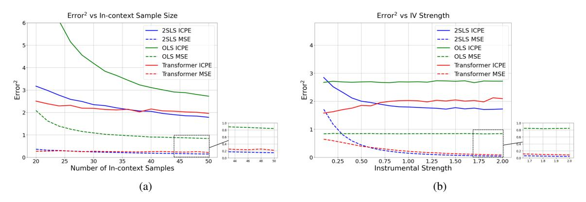
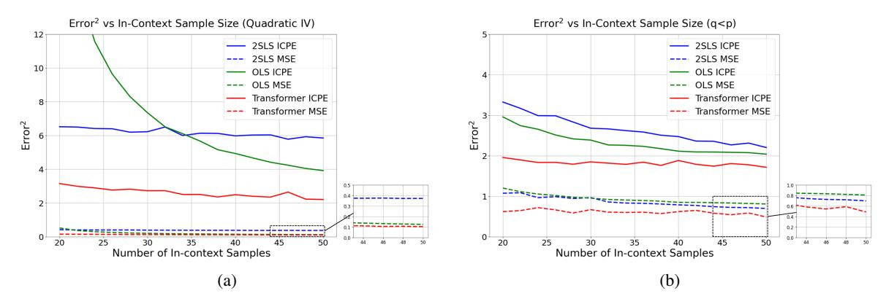
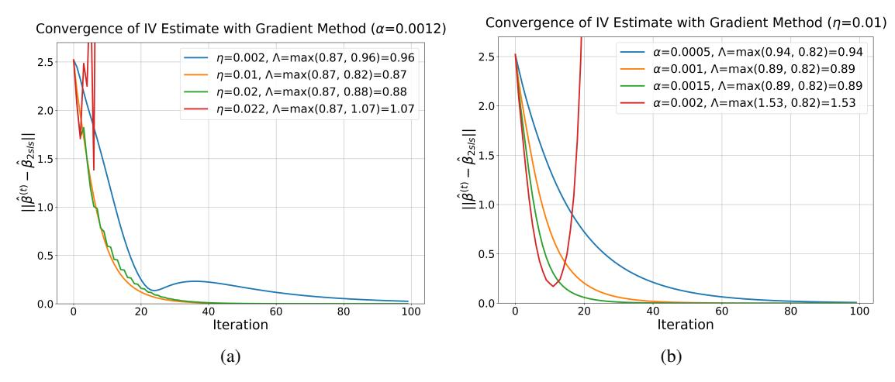
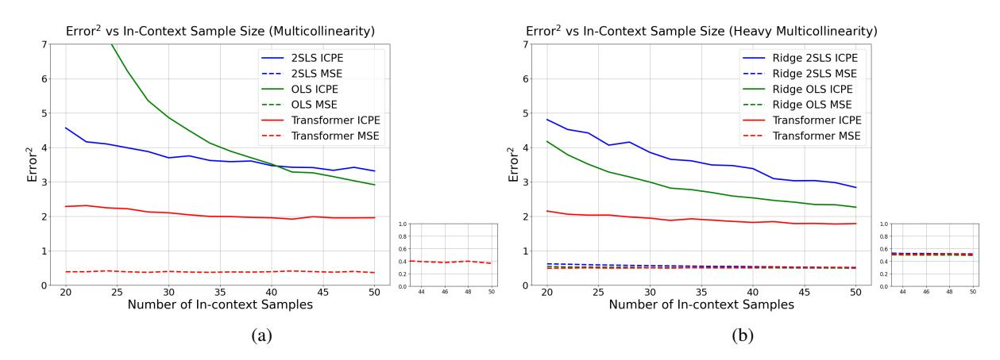
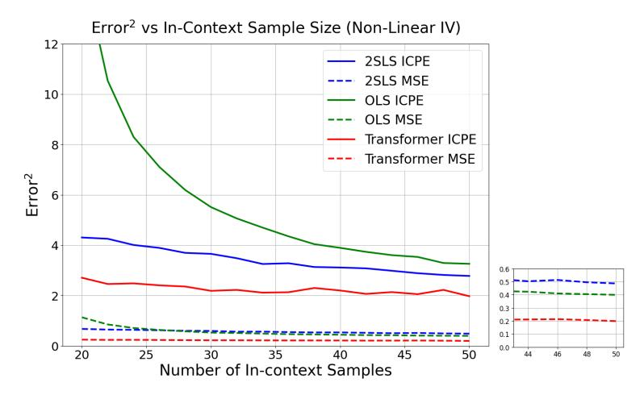
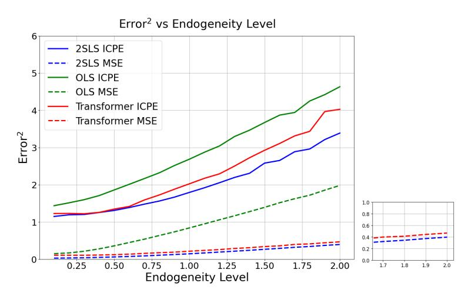
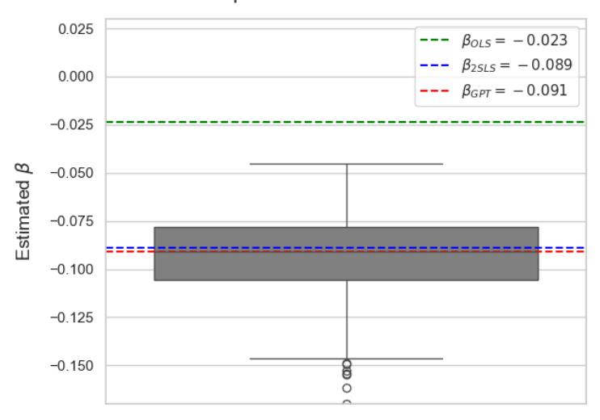

# TRANSFORMERS HANDLE ENDOGENEITY IN IN-CONTEXT LINEAR REGRESSION

Haodong Liang UC Davis hdliang@ucdavis.edu

Krishnakumar Balasubramanian UC Davis kbala@ucdavis.edu

Lifeng Lai UC Davis lflai@ucdavis.edu

February 28, 2025

# ABSTRACT

We explore the capability of transformers to address endogeneity in in-context linear regression. Our main finding is that transformers inherently possess a mechanism to handle endogeneity effectively using instrumental variables (IV). First, we demonstrate that the transformer architecture can emulate a gradient-based bi-level optimization procedure that converges to the widely used two-stage least squares (2SLS) solution at an exponential rate. Next, we propose an in-context pretraining scheme and provide theoretical guarantees showing that the global minimizer of the pre-training loss achieves a small excess loss. Our extensive experiments validate these theoretical findings, showing that the trained transformer provides more robust and reliable in-context predictions and coefficient estimates than the 2SLS method, in the presence of endogeneity.

# 1 Introduction

The transformer architecture [\[Vaswani et al., 2017\]](#page-9-0) has demonstrated remarkable in-context learning (ICL) capabilities across various domains, such as natural language processing [\[Devlin et al., 2019,](#page-9-1) [Radford et al., 2019,](#page-9-2) [Brown et al.,](#page-9-3) [2020\]](#page-9-3), computer vision [\[Dosovitskiy et al., 2021,](#page-10-0) [Carion et al., 2020\]](#page-10-1), and reinforcement learning [\[Lee et al., 2022,](#page-10-2) [Parisotto et al., 2020\]](#page-10-3). Self-attention mechanism, a core component of transformers, allows these models to capture long-range dependencies in data, which is critical for success in these tasks. Despite their impressive performance, the theoretical understanding of transformers remains limited, leaving important questions unanswered about their true capabilities and the underlying mechanisms driving their exceptional results.

Recent efforts to theoretically understand transformers' ICL capabilities have focused on their performance in fundamental statistical tasks. Focusing on simple function classes, [Garg et al.](#page-10-4) [\[2022\]](#page-10-4) highlighted that transformers, when trained on sufficiently large and diverse data from a specific function class, can generalize across most functions of that class without task-specific fine-tuning. Building on this, subsequent work by [Bai et al.](#page-10-5) [\[2023\]](#page-10-5) established that attention layers enable transformers to perform gradient descent, implementing algorithms like linear regression, logistic regression, and LASSO; see also [Akyürek et al.](#page-10-6) [\[2023\]](#page-10-6), [Von Oswald et al.](#page-10-7) [\[2023\]](#page-10-7), [Li et al.](#page-10-8) [\[2023\]](#page-10-8), [Fu et al.](#page-10-9) [\[2023\]](#page-10-9), [Ahn](#page-10-10) [et al.](#page-10-10) [\[2023\]](#page-10-10), [Jin et al.](#page-10-11) [\[2025\]](#page-10-11). The learning dynamics of transformer trained via gradient descent for in-context learning linear function classes was analyzed in [Huang et al.](#page-10-12) [\[2024\]](#page-10-12). Furthermore [Zhang et al.](#page-10-13) [\[2024a,](#page-10-13)[b\]](#page-10-14) showed that *trained* transformers' ICL abilities for linear regression tasks are theoretically robust under certain distributional shifts and characterized the corresponding sample complexities.

Existing works on analyzing the ICL ability of transformers for linear regression tasks, however, ignore *endogeneity* and have mainly focused on the *exogenous* setup where the additive noise is uncorrelated with the explanatory variables. Ignoring *endogeneity* in linear regression leads to biased and inconsistent estimates, resulting from issues like omitted variable bias, simultaneity, and measurement error, which can distort causal inferences and lead to incorrect policy conclusions [\[Hausman, 2001,](#page-10-15) [Wooldridge, 2015,](#page-10-16) [Angrist and Pischke, 2009,](#page-11-0) [Greene, 2018\]](#page-11-1). Instrumental variable (IV) regression is a widely adopted method to handle endogeneity by utilizing instruments that are correlated with the endogenous variables but uncorrelated with the error term [\[Angrist and Krueger, 2001\]](#page-11-2). A naturally intriguing question that therefore arises is:

Can transformers leverage instrumental variables and provide reliable predictions and coefficient estimates, in the presence of endogeneity?

In this work, we aim to answer this question and offer new insights on in-context linear regression tasks. Our key contributions include:

- We demonstrate that looped transformers can address endogeneity in linear regression by leveraging instrumental variables. Specifically, we show that transformers can implement two-stage least squares (2SLS) regression through a bi-level gradient descent procedure, where each iteration is executed by a two-layer transformer block. Moreover, the convergence rate to the 2SLS estimator is exponential with respect to the number of blocks.
- We propose an ICL training scheme for transformers to efficiently handle endogeneity. Under this scheme, we show
  that the global minimizer of the in-context pre-training loss achieves a small excess loss compared to the global
  optimal expected loss.
- We evaluate the performance of the trained transformer model through extensive experiments, finding that it not
  only matches the performance of the 2SLS estimator on standard IV tasks but also generalizes effectively to more
  complex scenarios, including the challenging cases of weak instruments, non-linear IV, and underdetermined IV
  problems.
- As part of our analysis, we derive the first non-asymptotic bound for the 2SLS estimator under random design, providing valuable insights for future theoretical work.

### 1.1 Related works

**In-context Learning.** Initial works by Garg et al. [2022] and Bai et al. [2023] adopted the standard multi-layer transformer architecture to conduct the experiments. Later, Giannou et al. [2023] and Yang et al. [2024] showed that a looped architecture reduces the required depth of transformers and exhibits better efficiency in learning algorithms. Gao et al. [2024] illustrated that the looped transformer architecture with extra pre-processing and post-processing layers can achieve higher expressive power than a standard transformer with the same number of parameters. Apart from works concerning the implementability of first-order gradient descent algorithms by transformers, other works have also examined higher-order and non-parametric optimization methods. Specifically, Giannou et al. [2024] showed that transformers can emulate Newton's method for logistic regression. Cheng et al. [2024] showed that transformers can implement functional gradient descent and hence enable them to learn non-linear functions in-context. Relationship between in-context learning and Bayesian inference is also studied in Ye et al. [2024], Falck et al. [2024].

Nichani et al. [2024] illustrated how the transformers can learn the causal structure by encoding the latent causal graph in the first attention layer. Goel and Bartlett [2024] explored the representational power of transformer for learning linear dynamical systems. Makkuva et al. [2024a,b], Rajaraman et al. [2024], Edelman et al. [2024] considered ICL Markov chains with transformers, including both landscape and training dynamics analyses. To the best of our knowledge, we are not aware of prior works on handling endogeniety with transformers.

**Instrumental Variable Regression.** IV regression has been widely studied in econometrics [Angrist and Krueger, 2001, Angrist and Pischke, 2009]. Recent works in machine learning explored the optimization based approaches for the IV regression problem. Singh et al. [2019] proposed the kernel IV regression to model non-linear relationship between variables. Muandet et al. [2020] proposed that a non-linear IV regression problem can be formulated as a convex-concave saddle point problem. Della Vecchia and Basu [2023], Chen et al. [2024], Fonseca et al. [2024] proposed a stochastic optimization algorithm for IV regression.

Notation: Throughout this paper, unless otherwise specified, lower-case letters denote random variables or samples, while upper-case letters represent datasets (collections of samples). Bolded letters indicate vectors or matrices, whereas unbolded letters indicate scalars. The notation  $\boldsymbol{X}_{:,i}$  refers to the i-th column, and  $\boldsymbol{X}_{i,:}$  refers to the i-th row of matrix  $\boldsymbol{X}$ .  $\lambda_{\min}(\cdot)$  denotes the minimum eigenvalue, and  $\sigma_{\min}(\cdot)$  denotes the minimum singular value of a matrix. By default,  $\|\cdot\|$  denotes the Euclidean norm for a vector, or the spectral norm for a matrix.

### <span id="page-1-1"></span>2 Endogeneity and Instrumental Variable Regression

Suppose we are interested in estimating the relationship between response variable  $y \in \mathbb{R}$  and predictor variable  $x \in \mathbb{R}^p$  with endogeneity. Given instruments  $z \in \mathbb{R}^q$ , we consider the model

<span id="page-1-0"></span>
$$y = \boldsymbol{\beta}^{\mathsf{T}} \boldsymbol{x} + \epsilon_1, \quad \text{and} \quad \boldsymbol{x} = \boldsymbol{\Theta}^{\mathsf{T}} \boldsymbol{z} + \epsilon_2,$$
 (1)

where  $\beta \in \mathbb{R}^p$ , and  $\Theta \in \mathbb{R}^{q \times p}$  are the true model parameters,  $\epsilon_1 \in \mathbb{R}$  and  $\epsilon_2 \in \mathbb{R}^p$  are (centered) random noise terms with variance  $\sigma_1^2$  and covariance matrix  $\Sigma_2$ , respectively. Further,  $\epsilon_2$  is an unobserved noise correlated with  $\epsilon_1$ , leading

to the correlation between x and  $\epsilon_1$ , which introduces confounding in the model between x and y. Under this setting, the standard ordinary least squares (OLS) estimator is a biased and inconsistent estimator of  $\beta$  (see Wooldridge [2015], Chapter 9). To address this issue, instrumental variable (IV) regression is a widely used method to provide a consistent estimate for  $\beta$ .

<span id="page-2-4"></span>**Definition 2.1** (2SLS estimator). IV regression is a regression model to provide consistent estimate on the causal effect  $\beta$  for the endogeneity problem (1), by utilizing the instrument z. Given observational values  $(Z, X, Y) = \{(z_i, x_i, y_i)\}_{i=1}^n$ , the standard approach to estimate the IV regression model is 2SLS; see, for example, Wooldridge [2015], Chapter 15.

i. First stage: Regress X on Z to obtain  $\hat{\Theta}$ 

<span id="page-2-5"></span>
$$\hat{\boldsymbol{\Theta}} = (\boldsymbol{Z}^{\top} \boldsymbol{Z})^{-1} \boldsymbol{Z}^{\top} \boldsymbol{X}.$$

ii. Second stage: Regress Y on  $Z\hat{\Theta}$  to obtain:

$$\hat{\boldsymbol{\beta}}_{2SLS} = (\hat{\boldsymbol{\Theta}}^{\top} \boldsymbol{Z}^{\top} \boldsymbol{Z} \hat{\boldsymbol{\Theta}})^{-1} \hat{\boldsymbol{\Theta}}^{\top} \boldsymbol{Z}^{\top} \boldsymbol{Y}. \tag{2}$$

We introduce the standard assumptions required to show the convergence rate of the above estimator.

<span id="page-2-0"></span>**Assumption 1** (Instrumental variable). A random variable  $z \in \mathbb{R}^q$  is a valid IV, if it satisfies the following conditions:

- i. Fully identification:  $q \ge p$  (without loss of generality, we assume data Z, X are full rank).
- ii. Correlated to x:  $Corr(z, x) \neq 0$ .
- iii. Conditional uncorrelated to y:  $Corr(z, \epsilon_1) = 0$ .

In particular, condition (i) above ensures the existence of unique solution for  $\hat{\beta}_{2SLS}$ . We refer to Stock and Watson [2011, Chapter 12] for additional elaborate discussions on the above conditions. To derive non-asymptotic convergence rates, we further assume the following regularity conditions.

<span id="page-2-1"></span>**Assumption 2** (Regularity conditions). Suppose instrument z is a centered random variable. We assume the following conditions hold:

- i. Bounded parameters:  $\|\boldsymbol{\beta}\| \leq B_{\beta}$ ,  $\|\boldsymbol{\Theta}\| \leq B_{\Theta}$ .
- ii. Bounded variables:  $\|z\| \le B_z$ ,  $\|x\| \le B_x$ ,  $|\epsilon_1| \le B_{\epsilon_1}$ ,  $\|\epsilon_2\| \le B_{\epsilon_2}$ .
- iii. Linear instrument:  $\mathbb{E}[x_k|\mathbf{z}] = \langle \mathbf{\Theta}_k, \mathbf{z} \rangle$ .

The boundedness condition in (ii) is required to invoke matrix Bernstein inequalities [Tropp, 2015] in the analysis. We anticipate that this condition may be relaxed to subgaussian or moment conditions by using more sophisticated matrix concentration results.

<span id="page-2-3"></span>**Theorem 2.1** (MSE of 2SLS estimator). Given Assumptions 1 and 2, consider clipping operation

<span id="page-2-2"></span>
$$\mathit{clip}_{B_\beta}(\hat{\pmb{\beta}}) := \begin{cases} \hat{\pmb{\beta}} & \mathit{if} \ \|\hat{\pmb{\beta}}\| \leq B_\beta \\ \frac{B_\beta}{\|\hat{\pmb{\beta}}\|} \hat{\pmb{\beta}} & \mathit{if} \ \|\hat{\pmb{\beta}}\| > B_\beta \end{cases}.$$

When

$$n \geq \max \left\{ 4c^2 B_z^4 \left( q + \log \left( \frac{4c^2 B_z^4 K}{q^2} \right) - \frac{3}{2} \right), \frac{q^2 e^{\frac{3}{2}}}{K}, \frac{p^2 (q+1)^2 K}{q^2 K_0^2} \right\},$$

where  $K:=\frac{\lambda_{\min}(\mathbf{\Sigma}_z)\mathbb{E}[\|\mathbf{\Sigma}_z^{-\frac{1}{2}}\mathbf{z}\|^2]}{6B_z^2}$  and  $K_0:=\frac{\lambda_{\min}(\mathbf{\Sigma}_z)\sigma_{\min}^2(\mathbf{\Theta})}{2B_{\epsilon_2}^2}$ , the mean squared error of the 2SLS estimate is bounded by:

$$\mathbb{E}\left[\|\operatorname{clip}_{B_{\beta}}(\hat{\boldsymbol{\beta}}_{2SLS}) - \boldsymbol{\beta}\|^{2}\right] \leq \mathcal{O}\left(\frac{q^{2}}{n}\left(\frac{B_{\beta}^{2}}{K} + \frac{C^{2}(n)\sigma_{1}^{2}}{q}\right)\right),\tag{3}$$

where

$$C(n) := \frac{\left(B_{\Theta} + \sqrt{\frac{2p(q+1)B_{e_2}^2 \log\left(\frac{K}{q^2}n\right)}{\lambda_{\min}(\mathbf{\Sigma}_z)n}}\right)B_z}{\lambda_{\min}(\mathbf{\Sigma}_z) \left(1 - \frac{cB_z^2\left(\sqrt{q} + \sqrt{\log\left(\frac{K}{q^2}n\right) - \frac{1}{2}}\right)}{\sqrt{n}}\right)^2 \left(\sigma_{\min}(\mathbf{\Theta}) - \sqrt{\frac{2p(q+1)B_{e_2}^2 \log\left(\frac{K}{q^2}n\right)}{\lambda_{\min}(\mathbf{\Sigma}_z)n}}\right)^2},$$

 $\Sigma_z := \mathbb{E}[zz^{\top}]$ , and c is an absolute constant.

**Remark 2.1.** We keep the slightly complicated form (3) so that the  $\mathcal{O}$  notation only hides some absolute constant multipliers that are independent of problem-related constants. Note that when n is large enough, we have  $C(n) \to \frac{B_{\Theta}B_z}{\lambda_{\min}(\mathbf{\Sigma}_z)\sigma_{\min}^2(\mathbf{\Theta})}$ , so C(n) is also bounded. Thus the error bound (3) decays with rate  $\mathcal{O}(\frac{1}{n})$ .

We note that although the consistency of the 2SLS estimator is a standard result in econometrics, most existing works focus on the asymptotic properties of the estimator. Theorem 2.1 provides the first non-asymptotic bound for estimation error  $\|\hat{\beta}_{2SLS} - \beta\|^2$ , under random design. The detailed proof is provided in Appendix A.1.

## <span id="page-3-1"></span>3 Transformers Handle Endogeniety

### 3.1 Transformer Architecture

Denote the input matrix as  $H = [h_1, \dots, h_n] \in \mathbb{R}^{D \times n}$ , where each column corresponds to one sample vector.

**Definition 3.1** (Attention layer). A self-attention layer with M heads is denoted as  $\mathsf{ATTN}_{\theta}(\cdot)$ , with parameters  $\theta = \{(\boldsymbol{Q}_m, \boldsymbol{K}_m, \boldsymbol{V}_m)\}_{m \in [M]} \subseteq \mathbb{R}^{D \times D}$ . Given input  $\boldsymbol{H}$ ,

$$\tilde{\boldsymbol{H}} = \mathsf{ATTN}_{\boldsymbol{\theta}}(\boldsymbol{H}) := \boldsymbol{H} + \frac{1}{n} \sum_{m=1}^{M} (\boldsymbol{V}_{m} \boldsymbol{H}) \times \sigma((\boldsymbol{Q}_{m} \boldsymbol{H})^{\top} (\boldsymbol{K}_{m} \boldsymbol{H})) \in \mathbb{R}^{D \times n}, \tag{4}$$

or element-wise:

$$\tilde{\boldsymbol{h}}_{i} = [\mathsf{ATTN}_{\boldsymbol{\theta}}(\boldsymbol{H})]_{i} := \boldsymbol{h}_{i} + \sum_{m=1}^{M} \frac{1}{n} \sum_{j=1}^{n} \sigma(\langle \boldsymbol{Q}_{m} \boldsymbol{h}_{i}, \boldsymbol{K}_{m} \boldsymbol{h}_{j} \rangle) \cdot \boldsymbol{V}_{m} \boldsymbol{h}_{j} \in \mathbb{R}^{D},$$
 (5)

where  $\sigma(\cdot)$  is the ReLU function.

**Definition 3.2** (MLP layer). An MLP layer is denoted as  $\mathsf{MLP}_{\boldsymbol{\theta}}(\cdot)$ , with parameters  $\boldsymbol{\theta} = (\boldsymbol{W}_1, \boldsymbol{W}_2) \in \mathbb{R}^{D' \times D \times D \times D'}$ . Given input  $\boldsymbol{H}$ ,

<span id="page-3-3"></span><span id="page-3-2"></span>
$$\tilde{\boldsymbol{H}} = \mathsf{MLP}_{\boldsymbol{\theta}}(\boldsymbol{H}) := \boldsymbol{H} + \boldsymbol{W}_{2}\sigma(\boldsymbol{W}_{1}\boldsymbol{H}).$$

or element-wise:

$$\tilde{\boldsymbol{h}}_i = [\mathsf{MLP}_{\boldsymbol{\theta}}(\boldsymbol{H})]_i := \boldsymbol{h}_i + \boldsymbol{W}_2 \sigma(\boldsymbol{W}_1 \boldsymbol{h}_i).$$

**Definition 3.3** (Transformer). An L-layer transformer is denoted as  $\mathsf{TF}_{\theta}(\cdot)$ , with parameters  $\theta = (\theta_{\mathsf{ATTN}}^{(1:L)}, \theta_{\mathsf{MLP}}^{(1:L)})$ . Given input  $H = H^{(0)}$ ,

$$\boldsymbol{H}^{(l)} = \mathsf{MLP}_{\boldsymbol{\theta}_{\mathsf{MIP}}^{(l)}}(\mathsf{ATTN}_{\boldsymbol{\theta}_{\mathsf{ATTN}}^{(l)}}(\boldsymbol{H}^{(l-1)})), \quad l = 1, \dots, L.$$

The output of this transformer is the final layer output:  $\tilde{\boldsymbol{H}} := \boldsymbol{H}^{(L)} = \mathsf{TF}_{\boldsymbol{\theta}}(\boldsymbol{H}^{(0)}).$ 

<span id="page-3-0"></span>**Definition 3.4** (Looped transformer). An  $\bar{L}$ -looped transformer is a special transformer architecture, denoted as  $\mathsf{LTF}_{\bar{\theta},\bar{L}}(\cdot)$ , with parameters  $\bar{\theta} = (\bar{\theta}_{\mathsf{ATTN}}^{(1:L_0)}, \bar{\theta}_{\mathsf{MLP}}^{(1:L_0)})$ . Given input  $\mathbf{H} = \mathbf{H}^{(0)}$ ,

$$\boldsymbol{H}^{(l)} = \mathsf{TF}_{\bar{\boldsymbol{\theta}}}(\boldsymbol{H}^{(l-1)}), \quad l = 1, \dots, \bar{L}.$$

The output of this looped transformer is the final loop output:  $\tilde{\boldsymbol{H}}:=\boldsymbol{H}^{(\bar{L})}=\mathsf{LTF}_{\bar{\boldsymbol{\theta}},\bar{L}}(\boldsymbol{H}^{(0)}).$ 

Previous works (e.g., Bai et al. [2023], Zhang et al. [2024a]) have shown that transformers can perform in-context linear regression by emulating gradient descent (GD) with in-context pretraining. However, these studies have two key limitations. First, their analysis is based on single-level optimization algorithms, which is insufficient to demonstrate that transformers can efficiently learn more complex algorithms like 2SLS (Definition 2.1). Second, most ICL-related research focuses on the predictive performance of transformers, paying little attention to their ability to provide accurate coefficient estimates. We extend the current ICL framework by showing that transformers can implement a bi-level GD procedure (see Section 3.2) with looped transformer architecture (Definition 3.4), allowing them to efficiently emulate 2SLS and provide coefficient estimates that are at least as accurate as 2SLS in the presence of endogeneity (as in (1)).

### <span id="page-4-0"></span>3.2 Gradient descent based IV regression

We first introduce a gradient-based bi-level optimization procedure to obtain the 2SLS estimator in (2). Given the dataset  $(\mathbf{Z}, \mathbf{X}, \mathbf{Y}) = \{(\mathbf{z}_i, \mathbf{x}_i, y_i)\}_{i=1}^n$ , the objective function of IV regression can be formulated as the following bi-level optimization problem:

$$\min_{\boldsymbol{\beta}} \quad \mathcal{L}(\boldsymbol{\beta}) = \frac{1}{n} \sum_{i=1}^{n} (y_i - \boldsymbol{z}_i^{\top} \hat{\boldsymbol{\Theta}} \boldsymbol{\beta})^2, \quad \text{where} \quad \hat{\boldsymbol{\Theta}} := \underset{\boldsymbol{\Theta}}{\text{arg min}} \quad \frac{1}{n} \sum_{j=1}^{n} (\boldsymbol{x}_j - \boldsymbol{z}_j^{\top} \boldsymbol{\Theta})^2.$$
 (6)

Consider the following gradient updates with learning rates  $\alpha$ ,  $\eta$ :

<span id="page-4-2"></span><span id="page-4-1"></span>
$$\mathbf{\Theta}^{(t+1)} = \mathbf{\Theta}^{(t)} - \eta \mathbf{Z}^{\top} (\mathbf{Z}\mathbf{\Theta}^{(t)} - \mathbf{X}), \tag{7a}$$

<span id="page-4-7"></span>
$$\boldsymbol{\beta}^{(t+1)} = \boldsymbol{\beta}^{(t)} - \alpha \boldsymbol{\Theta}^{(t)\top} \boldsymbol{Z}^{\top} (\boldsymbol{Z} \boldsymbol{\Theta}^{(t)} \boldsymbol{\beta}^{(t)} - \boldsymbol{Y}). \tag{7b}$$

Note that the GD-2SLS updates in (7) are designed to solve (6). We now show that regardless the convergence of  $\Theta^{(t)}$ , the GD estimator  $\beta^{(t)}$  will always converge to the 2SLS estimator in (2) with exponential rate.

<span id="page-4-3"></span>**Theorem 3.1** (Implementing 2SLS with gradient-based method). *Given training data*  $(Z, X, Y) = \{(z_i, x_i, y_i)\}_{i=1}^n$ . *Suppose the learning rates*  $\alpha$ ,  $\eta$  *satisfy the following conditions:* 

$$0 < \alpha < \frac{2}{\sigma_{\text{max}}^2(\boldsymbol{Z}\hat{\boldsymbol{\Theta}})} \quad \text{and} \quad 0 < \eta < \frac{2}{\sigma_{\text{max}}^2(\boldsymbol{Z})},$$

where  $\sigma_{\max}(\cdot)$  denotes the largest singular value of a matrix. Then, the GD updates in (7) converge to the 2SLS estimator at an exponential rate:

<span id="page-4-8"></span><span id="page-4-5"></span>
$$\|\boldsymbol{\beta}^{(t)} - \hat{\boldsymbol{\beta}}_{2SLS}\| \leq \mathcal{O}\left(\Lambda^{t}\right),$$

where, with  $\rho(\cdot)$  denoting the spectral radius of the matrix,

$$\Lambda := \max\{\gamma(\alpha), \kappa(\eta)\}, \qquad \gamma(\alpha) := \rho(\mathbf{I} - \alpha\hat{\mathbf{\Theta}}^{\mathsf{T}} \mathbf{Z}^{\mathsf{T}} \mathbf{Z}\hat{\mathbf{\Theta}}), \quad \kappa(\eta) := \rho(\mathbf{I} - \eta \mathbf{Z}^{\mathsf{T}} \mathbf{Z}). \tag{8}$$

To the best of our knowledge, Theorem 3.1 provides the first theoretical result demonstrating that 2SLS can be efficiently implemented using a gradient-based method, with an exponential convergence rate. We provide the proof in Appendix B.1 and present simulation results in Appendix C.1 to examine the convergence behavior of the optimization process.

### 3.3 Transformers Can Efficiently Implement GD-2SLS

The looped transformer architecture (Definition 3.4), as proposed by Giannou et al. [2023], introduces an efficient approach to learn iterative algorithms by cascading the same transformer block for multiple times. With the GD updates in (7), we will show that there exists a looped transformer architecture that can efficiently learn the 2SLS estimator. We emphasize here that although we can implement 2SLS by sequentially attaching two separate GD iterates (each handling OLS for one stage), the overall convergence depends heavily on the convergence of the first stage estimate  $\hat{\Theta}$ . Hence, significantly more number of layers are needed to ensure convergence. In addition, the advantage of looped transformer architecture cannot be fully exploited with this approach.

<span id="page-4-4"></span>**Theorem 3.2** (Implement a step of GD-2SLS with a transformer block). *Suppose the embedded input matrix takes the form:* 

<span id="page-4-6"></span>
$$\boldsymbol{H}^{(2l)} = \begin{bmatrix} \boldsymbol{z}_{1} & \cdots & \boldsymbol{z}_{n} & \boldsymbol{z}_{n+1} \\ \boldsymbol{x}_{1} & \cdots & \boldsymbol{x}_{n} & \boldsymbol{x}_{n+1} \\ \boldsymbol{y}_{1} & \cdots & \boldsymbol{y}_{n} & t \\ \boldsymbol{\Theta}_{:,1}^{(l)} & \cdots & \boldsymbol{\Theta}_{:,1}^{(l)} & \boldsymbol{\Theta}_{:,1}^{(l)} \\ \vdots & \vdots & \vdots & \vdots \\ \boldsymbol{\Theta}_{:,p}^{(l)} & \cdots & \boldsymbol{\Theta}_{:,p}^{(l)} & \boldsymbol{\Theta}_{:,p}^{(l)} \\ \boldsymbol{\beta}^{(l)} & \cdots & \boldsymbol{\beta}^{(l)} & \boldsymbol{\beta}^{(l)} \\ \hat{\boldsymbol{x}}_{1}^{(l)} & \cdots & \hat{\boldsymbol{x}}_{n}^{(l)} & \hat{\boldsymbol{x}}_{n+1}^{(l)} \\ 1 & \cdots & 1 & 1 \\ 1 & \cdots & 1 & 0 \end{bmatrix} \in \mathbb{R}^{D \times (n+1)}.$$

$$(9)$$

Given  $\boldsymbol{H}^{(2l)}$ , there exists a double-layer attention-only transformer block with parameters  $\boldsymbol{\theta} = \boldsymbol{\theta}_{ATTN}^{(2l+1:2l+2)} = \{(\boldsymbol{Q}_m^{(2l+1:2l+2)}, \boldsymbol{K}_m^{(2l+1:2l+2)}, \boldsymbol{V}_m^{(2l+1:2l+2)})\}_{m \in [M^{(2l+1:2l+2)}]} \subset \mathbb{R}^{D \times D}$ , where the number of heads  $M^{(2l+1)} = 2p$ ,  $M^{(2l+2)} = 2(p+1)$  and embedding dimension D = qp + 3p + q + 3, that implements a 2SLS gradient update in (7) with any given learning rates  $\alpha, \eta$ :

$$\bm{H}^{2(l+1)} = T\!F_{\bm{\theta}_{ATTN}^{(2l+1:2l+2)}}(\bm{H}^{(2l)}) = \begin{bmatrix} \bm{z}_1 & \cdots & \bm{z}_n & \bm{z}_{n+1} \ \bm{x}_1 & \cdots & \bm{y}_n & \bm{x}_{n+1} \ \bm{y}_1 & \cdots & \bm{y}_n & \bm{0} \ \bm{\Theta}_{:,1}^{(l+1)} & \cdots & \bm{\Theta}_{:,1}^{(l+1)} & \bm{\Theta}_{:,1}^{(l+1)} \ \bm{\varphi}_{:,p} & \bm{\varphi}_{:,p} & \bm{\varphi}_{:,p} \ \bm{\beta}_{i}^{(l+1)} & \cdots & \bm{\Theta}_{i}^{(l+1)} & \bm{\beta}_{i,p}^{(l+1)} \ \bm{\beta}_{i}^{(l+1)} & \bm{\phi}_{i}^{(l+1)} \ \bm{\hat{x}}_{n}^{(l+1)} & \bm{\beta}_{n+1}^{(l+1)} \ \bm{1} & \cdots & \bm{1} & \bm{1} \ \bm{1} & \cdots & \bm{1} & \bm{1} \ \bm{1} & \cdots & \bm{1} & \bm{1} \ \bm{1} & \cdots & \bm{1} & \bm{1} \ \bm{1} & \cdots & \bm{1} & \bm{0} \ \end{bmatrix}$$

Our existence proof specifies an attention structure such that one layer updates only the first-stage estimate  $\hat{x}_i^{(l)}$  for all samples, followed by another layer to update the parameters  $\Theta^{(l)}$  and  $\beta^{(l)}$ . Furthermore, as noted in the proof of Theorem 3.2 (ref. Appendix B.2), regardless of the initial values of  $\Theta^{(l)}$ ,  $\beta^{(l)}$  and  $\hat{x}^{(l)}$ , the structures of the transformer blocks remain the same. This allows us to exploit the looped transformer architecture to significantly reduce the number of parameters and improve learning efficiency [Yang et al., 2024].

By cascading the transformer block  $\bar{L}$  times, with Theorem 3.1, one can show that transformers are able to mimic the 2SLS estimator with exponential convergence rate, as described in the following corollary.

<span id="page-5-1"></span>**Corollary 3.1** (Implementing GD-2SLS with looped transformer). For any  $0 < \varepsilon < 1$ , given learning rates  $\alpha, \eta$ , and  $\Lambda \in (0,1)$ , as defined in (8), there exists a transformer formulated as  $TF_{\theta}(\cdot) := TF_{\theta'}(LTF_{\bar{\theta},\bar{L}}(\cdot))$ , which consists of an  $\bar{L}$ -looped transformer  $LTF_{\bar{\theta},\bar{L}}$  with  $\bar{\theta} = \bar{\theta}_{ATTN}^{(1:2)} = \{(\bar{Q}_m^{(1:2)}, \bar{K}_m^{(1:2)}, \bar{V}_m^{(1:2)})\}_{m \in [\bar{M}^{(1:2)}]} \subset \mathbb{R}^{D \times D}$ ,  $\bar{L} = \lceil \mathcal{O}(\log_{\Lambda}(\varepsilon)) \rceil$ , and a final attention layer  $\bar{\theta}' = \theta'_{ATTN} = \{(Q'_m, K'_m, V'_m)\}_{m \in [M']} \subset \mathbb{R}^{D \times D}$ , where  $\bar{M}^{(1)} = 2p, \bar{M}^{(2)} = 2(p+1)$ ,  $\bar{M}' = 2$ , such that given embedded input  $\bar{H}^{(0)}$  taking the format in (9), the model output satisfies:

$$|\mathit{read}_y(\mathit{TF}_{\bm{\theta}}(\bm{H}^{(0)})) - \hat{\bm{\beta}}_{\mathit{2SLS}}^{\top} \bm{x}_{n+1}| \leq B_x \varepsilon,$$

where  $read_u(\cdot)$  is a function that reads the prediction  $\hat{y}_{n+1}$  from the output of the transformer.

We emphasize here that our construction differs from the implementation of Bai et al. [2023, Theorem 4] for OLS in the following aspects:

- i. We apply the square loss as defined in (6) to learn the 2SLS estimator, which simplifies the loss function's sum-of-ReLU representation.
- ii. The dimension of the input embedding is D = qp + 3p + q + 3, where the extra dimensions store the vectorized parameters  $\mathbf{\Theta}^{(l)}$ ,  $\mathbf{\beta}^{(l)}$ , and the first stage estimate  $\hat{\mathbf{x}}^{(l)}$ .
- iii. We use a two-layer attention-only transformer block  $\bar{\theta}$  to implement a 2SLS GD update (7), with the first layer to update the current first-stage estimate  $\hat{x}^{(l)}$ , and the second layer to update the parameters  $\Theta^{(l)}$  and  $\beta^{(l)}$ .
- iv. For each transformer block, in the first layer, we equip 2 heads to update each dimension of  $\hat{x}_i^{(l)} \in \mathbb{R}^p$  for all samples. In the second layer, we equip 2 heads to update each column of  $\Theta^{(l)} \in \mathbb{R}^{q \times p}$  and  $\beta^{(l)} \in \mathbb{R}^p$ .

### 3.4 Pretraining and Excess Loss Bound

With slightly abuse of notations, we denote the (formulated) training prompt as:

$$\begin{aligned} \boldsymbol{H}_k = \begin{bmatrix} \boldsymbol{z}_{1,k} & \cdots & \boldsymbol{z}_{n,k} & \boldsymbol{z}_{n+1,k} \ \boldsymbol{x}_{1,k} & \cdots & \boldsymbol{x}_{n,k} & \boldsymbol{x}_{n+1,k} \ \boldsymbol{y}_{1,k} & \cdots & \boldsymbol{y}_{n,k} & 0 \end{bmatrix} \in \mathbb{R}^{(p+q+1)\times(n+1)}, \quad k=1,\ldots,N. \end{aligned}$$

<span id="page-5-0"></span><sup>&</sup>lt;sup>1</sup>This layer updates the prediction  $\hat{y}_{n+1} := \boldsymbol{\beta}^{(\bar{L})\top} \boldsymbol{x}_{n+1}$ , which can be constructed with 2 attention heads using the same architecture as Bai et al. [2023, Theorem 13]

Note that we denote each training prompt by the subscript k = 1, ..., N, where N is the total number of prompts. Each training prompt consists of n labeled training samples  $\{(z_i, x_i, y_i)\}_{i=1}^n$ , and one unlabeled query sample  $(z_{n+1}, x_{n+1})$ . Our goal is to predict  $y_{n+1}$  given the context provided by the prompt.

We introduce the following ICL data generating scheme such that endogeneity occurs in the training samples, but does not extend to the query sample. Each training prompt is generated by the in-context distribution  $\mathcal{P}$ , described by Algorithm 1.

### <span id="page-6-0"></span>**Algorithm 1** In-Context Distribution $\mathcal{P}$

```
1: Parameters: Sample size n, clipping thresholds B_z, B_x, B_y. Task parameters \Theta, \beta, \Phi, \phi, \Sigma_z, \Sigma_u, \Sigma_\omega, \sigma_\epsilon from
   meta distribution \pi.
```

```
2: Output: Training samples \{(\boldsymbol{z}_i, \boldsymbol{x}_i, y_i)\}_{i=1}^n, query sample (\boldsymbol{z}_{n+1}, \boldsymbol{x}_{n+1}, \boldsymbol{y}_{n+1})
```

3: **for** i = 1, ..., n **do** 

**Generate:**  $\boldsymbol{z}_i \sim \mathcal{N}(0, \boldsymbol{\Sigma}_z), \boldsymbol{u}_i \sim \mathcal{N}(0, \boldsymbol{\Sigma}_u), \boldsymbol{\omega}_i \sim \mathcal{N}(0, \boldsymbol{\Sigma}_\omega), \epsilon_i \sim \mathcal{N}(0, \sigma^2)$ 

Compute:  $\boldsymbol{x}_i = \boldsymbol{\Theta}^{\top} \boldsymbol{z}_i + \boldsymbol{\Phi}^{\top} \boldsymbol{u}_i + \boldsymbol{\omega}_i$ . Compute:  $y_i = \boldsymbol{\beta}^{\top} \boldsymbol{x}_i + \boldsymbol{\phi}^{\top} \boldsymbol{u}_i + \epsilon_i$ .

7: end for

8: Generate:  $z_{n+1} \sim \mathcal{N}(0, \Sigma_z), \omega_{n+1} \sim \mathcal{N}(0, \Sigma_\omega), \epsilon_{n+1} \sim \mathcal{N}(0, \sigma_\epsilon^2)$ .

9: **Compute:**  $x_{n+1} = \mathbf{\Theta}^{\top} z_{n+1} + \omega_{n+1}$ .

10: Compute:  $y_{n+1} = \boldsymbol{\beta}^{\top} \boldsymbol{x}_{n+1} + \epsilon_{n+1}$ . 11: Clip:  $\boldsymbol{z}_i = \text{clip}_{B_z}(\boldsymbol{z}_i)$ ,  $\boldsymbol{x}_i = \text{clip}_{B_x}(\boldsymbol{x}_i)$ ,  $y_i = \text{clip}_{B_y}(y_i)$  for  $i = 1, \dots, n+1$ .

In Algorithm 1,  $u \in \mathbb{R}^p$  is the source of endogenous error,  $w \in \mathbb{R}^p$ ,  $\epsilon \in \mathbb{R}$  are the exogenous errors. Note that we have  $\begin{array}{l} \epsilon_{1,i} = \boldsymbol{\phi}^{\top}\boldsymbol{u}_i + \epsilon_i \text{ and } \boldsymbol{\epsilon}_{2,i} = \boldsymbol{\Phi}^{\top}\boldsymbol{u}_i + \boldsymbol{\omega}_i, \text{ corresponding to the notations in (1). } \boldsymbol{\Theta} \in \mathbb{R}^{q \times p}, \boldsymbol{\beta} \in \mathbb{R}^p, \boldsymbol{\Phi} \in \mathbb{R}^{p \times p}, \boldsymbol{\phi} \in \mathbb{R}^p, \boldsymbol{\Sigma}_z \in \mathbb{R}^{q \times q}, \boldsymbol{\Sigma}_u \in \mathbb{R}^{p \times p}, \boldsymbol{\Sigma}_{\omega} \in \mathbb{R}^{p \times p}, \boldsymbol{\sigma}_{\epsilon} \in \mathbb{R} \text{ are task-specific parameters following meta distribution } \boldsymbol{\pi}. \text{ } \mathbf{Clip}_B(\cdot) \end{array}$ is a clipping operator to bound the norm of input within radius B. We say that the in-context samples  $\{(z_i, x_i, y_i)\}_{i=1}^{n+1}$ are drawn from the in-context distribution  $\mathcal{P}$ , and  $\mathcal{P} \sim \pi$  if the task parameters  $(\Theta, \beta, \Phi, \phi, \Sigma_z, \Sigma_u, \Sigma_\omega, \sigma_\epsilon)$  are sampled from  $\pi$ . One can check that Assumption 1 and Assumption 2(ii)(iii) are directly satisfied with the data generated from the in-context distribution  $\mathcal{P}$ .

Following the theoretical framework of [Bai et al., 2023], we define the population ICL loss<sup>2</sup>:

$$L_{\mathsf{ICL}}(\boldsymbol{\theta}) = \mathbb{E}_{\pi} \mathbb{E}_{\mathcal{P}}[y_{n+1} - \mathsf{clip}_{B_n}(\mathsf{read}_y(\mathsf{TF}^R_{\boldsymbol{\theta}}(\boldsymbol{H}^{(0)})))]^2, \tag{10}$$

where  $H^{(0)}$  is the embedded input as defined in (9),  $\mathsf{TF}^R_{\theta}$  is the transformer model with parameter  $\theta$  and clipping operation  $\mathsf{clip}_R(\cdot)$  applied to each layer output. For simplicity, we denote  $\widetilde{\mathsf{TF}}_{\theta}(\boldsymbol{H}) := \mathsf{clip}_{B_n}(\mathsf{read}_y(\mathsf{TF}^R_{\boldsymbol{\theta}}(\boldsymbol{H}^{(0)})))$ .

The transformer is trained to minimize the in-context loss in (10) with the following empirical loss:

<span id="page-6-5"></span><span id="page-6-3"></span><span id="page-6-2"></span>
$$\hat{L}_{\mathsf{ICL}}(\boldsymbol{\theta}) = \frac{1}{N} \sum_{k=1}^{N} (y_{n+1,k} - \widetilde{\mathsf{TF}}_{\boldsymbol{\theta}}(\boldsymbol{H}_k))^2. \tag{11}$$

We consider the following constrained optimization problem:

$$\hat{\boldsymbol{\theta}} := \underset{\boldsymbol{\theta} \in \boldsymbol{\vartheta}_{L,M,D',B_{\boldsymbol{\theta}}}}{\arg \min} \hat{L}_{\mathsf{ICL}}(\boldsymbol{\theta}),$$

$$\boldsymbol{\vartheta}_{L,M,D',B_{\boldsymbol{\theta}}} := \{ \boldsymbol{\theta} = (\boldsymbol{\theta}_{\mathsf{Attn}}^{(1:L)}, \boldsymbol{\theta}_{\mathsf{MLP}}^{(1:L)}) : \max_{l \in [L]} M^{(l)} \le M, \max_{l \in [L]} D^{(l)} \le D', \|\boldsymbol{\theta}\| \le B_{\boldsymbol{\theta}} \},$$
(12)

where 
$$\| \boldsymbol{\theta} \| := \max_{l \in [L]} \{ \max_{m \in [M]} \{ \| \boldsymbol{Q}_m^{(l)} \|, \| \boldsymbol{K}_m^{(l)} \| \} + \sum_{m=1}^M \| \boldsymbol{V}_m^{(l)} \| + \| \boldsymbol{W}_1^{(l)} \| + \| \boldsymbol{W}_2^{(l)} \| \}.$$

We now establish excess loss bound for the trained transformer model.

<span id="page-6-4"></span>**Theorem 3.3** (Excess loss bound for in-context pretrained transformer). Suppose condition (i) in Assumption 2 holds and the meta distribution  $\pi$  satisfies the following conditions:

<span id="page-6-6"></span>
$$\mathbb{E}_{\pi} \left[ \boldsymbol{\phi}^{\top} \boldsymbol{\Sigma}_{u} \boldsymbol{\phi} + \sigma_{\epsilon}^{2} \right] \leq \tilde{\sigma}^{2} \text{ and } \mathbb{E}_{\pi} \left[ \sigma_{\epsilon}^{2} \right] \leq \tilde{\sigma}_{\epsilon}^{2}. \tag{13}$$

<span id="page-6-1"></span><sup>&</sup>lt;sup>2</sup>All the clipping operations are only for analytical purpose. In practice, the behavior of the trained transformer is consistent even without the clipping bounds.

### <span id="page-7-0"></span>Algorithm 2 Extracting the regression coefficients

- 1: **Input:** Trained transformer model  $\mathsf{TF}_{\hat{\theta}}$ , input matrix H, perturbation  $\Delta$ .
- 2: **Output:** Estimated coefficient  $\beta$ .
- 3: Procedure:
- 4: Compute the output of the transformer model:  $\hat{Y} = \widetilde{\mathsf{TF}}_{\hat{\theta}}(H)$ .
- 5: for each dimension  $k = 1, \ldots, p$  do
- 6: Copy  $H_{\Delta(k)} = H$ . Set the k-th dimension of  $x_{n+1}$  to be  $(x_{n+1})_k + \Delta$  for  $H_{\Delta(k)}$ .
- 7: Compute the new output value:  $\hat{Y}_{\Delta(k)} = \widetilde{\mathsf{TF}}_{\hat{\boldsymbol{\theta}}}(\boldsymbol{H}_{\Delta(k)})$ .
- 8: Compute the estimated coefficient:  $\hat{\beta}_k = \frac{\hat{Y}_{\Delta(k)} \hat{Y}}{\Delta}$
- 9: end for

Let the in-context distribution  $\mathcal{P} \sim \pi$  such that the samples  $(\mathbf{z}_i, \mathbf{x}_i, y_i)_{i=1}^{n+1}$  are drawn independently from  $\mathcal{P}$  (ref. Algorithm 1). With training prompts  $\mathbf{H}_k, k = 1, \dots, N$ , under ICL loss in (10), the trained transformer in (12) with  $L = 2\bar{L} + 1, M = 2(p+1), D = qp + 3p + q + 3, D' = 0$  (attention-only) achieves the following excess loss with probability at least  $1 - \zeta$ :

$$L_{ICL}(\hat{\boldsymbol{\theta}}) - \mathbb{E}_{\pi} \mathbb{E}_{\mathcal{P}} \left[ (y_{n+1} - \langle \boldsymbol{\beta}, \boldsymbol{x}_{n+1} \rangle)^2 \right] \leq \mathcal{O} \left( (\Lambda^{\star})^{\bar{L}} \left( B_x^2 \sqrt{\frac{q^2}{n} \left( \frac{B_{\beta}^2}{K} + \frac{C^2(n)\tilde{\sigma}^2}{q} \right)} + B_x \tilde{\sigma}_{\epsilon} \right) + B_x^2 \left( \frac{q^2}{n} \left( \frac{B_{\beta}^2}{K} + \frac{C^2(n)\tilde{\sigma}^2}{q} \right) + \mu_{\Lambda,2}^{\star} \right) + B_y^2 \sqrt{\frac{L^2 M D^2 \log(2 + \max\{B_{\theta}, R, B_y\}) + \log(1/\zeta)}{N}} \right).$$

where 
$$\Lambda^{\star} := \min_{\alpha,\eta} \mathbb{E}_{\pi} \mathbb{E}_{\mathcal{P}}[\Lambda | \boldsymbol{H}, \alpha, \eta] < 1$$
, and  $\mu^{\star}_{\Lambda,2} := \mathbb{E}_{\pi} \mathbb{E}_{\mathcal{P}}[\Lambda^{2\bar{L}} | \boldsymbol{H}, \alpha^{\star}, \eta^{\star}]$  is close to  $0$ .

In practical training, the number of prompts N is usually large enough such that the last term of the above bound is negligible. Thus, given a meta distribution  $\pi$ , the excess loss is dominated by two factors: (i) number of attention layers, and (ii) number of in-context samples. The proof of Theorem 3.3 is provided in Appendix B.3.

### 3.5 Extracting the regression coefficients

The primary goal of IV regression is to estimate the causal effect, i.e. the coefficient  $\beta$  under the stated endogeneity in (1). For 2SLS, the estimated causal effect is given by the coefficients of the endogenous variable in the second stage regression (2). For transformer models, we propose a straightforward method to extract these estimated coefficients by differentiating the output with respect to each dimension of the endogenous variable. The specific approach is summarized in Algorithm 2. We observe that the choice of  $\Delta$  within a reasonable range does not significantly affect the estimation of the coefficients. In practice, usually a slightly larger  $\Delta$  (for example  $\Delta = 5$ ) can lead to a more stable estimation, which is possibly due to the elimination of rounding errors during computation.

### <span id="page-7-1"></span>4 Experiments

### 4.1 Experiment Setup

We conduct a simulation study to evaluate the performance of the ICL-pretrained transformer model in handling endogeneity. We set the maximum input sample size to 51 (n=50 training samples and one query sample), the dimension of endogenous variable p=5, and the dimension of instrument q=10. The training prompts are generated using Algorithm 1, with task parameters  $\mathbf{\Theta}, \mathbf{\beta}, \mathbf{\Phi}, \boldsymbol{\phi}$  sampled from standard Gaussian distribution, and the covariance matrices  $\mathbf{\Sigma}_z, \mathbf{\Sigma}_u, \mathbf{\Sigma}_\omega$  set to be identity matrices. The noise level  $\sigma_\epsilon$  is set to 1. We ignore all the clipping bounds in the experiment  $(B_\beta, B_\Theta, B_z, B_x, B_y, B_\theta, R$  set to infinity).

The backbone of the transformer block is initialized using GPT-2 settings, with 12 attention heads (M=12), 80-dimensional embedding space (D=80) and 2 layers  $(L_0=2)$ , following the theoretical guidelines in Theorem 3.2. We employ the looped transformer architecture, consisting of 10 identical cascading transformer blocks. The transformer model is trained under the ICL loss (11) with a batch size of N=64, over a total of 300,000 training steps.

We evaluate the trained transformer model on test prompts that are not included during training. As benchmarks, we compare the transformer's performance against the 2SLS and the OLS estimators, which are obtained by directly fitting

the training samples  $\{(z_i, x_i, y_i)\}_{i=1}^n$  within the text prompts. In contrast, the same trained transformer model is used without any parameter adjustments for each task. We compare the performance of these models from two aspects: the in-context prediction error (ICPE) on the query sample  $y_{n+1}$ , and the mean squared error (MSE) on the coefficient  $\beta$ .

### <span id="page-8-2"></span>4.2 Results

We first investigate the performance of the trained transformer model over endogeneity tasks with varying training sample sizes from 20 to 50. The results are shown in Figure 1a. Under endogeneity, our transformer model achieves similar performance to that of the 2SLS estimator, with only small gaps in ICPE and MSE, both outperforming the OLS estimator.

Next, we examine the performance of the trained transformer model in handling varying levels of IV strength. The strength of an instrument is measured by the correlation between the IV and the endogenous variable. To vary the IV strength, we generate prompts with  $z_i$  and  $x_i$  following different correlation levels. Specifically, in Algorithm 1, we adjust the IV strength by multiplying  $\Theta$  by a factor  $r \in (0,2)$  when generating test prompts. The results are shown in Figure 1b.

Interestingly, the trained transformer model outperforms the 2SLS estimator in handling weaker IVs (when IV strength < 0.5). This suggests that, beyond merely mimicking 2SLS, the ICL training process may equip the transformer model with a more advanced mechanism for handling endogeneity with weak IVs than the 2SLS estimator. At the same time, when the IV is strong, the transformer model maintains performance comparable to that of the 2SLS estimator.

<span id="page-8-0"></span>

Figure 1: The ICL performance of the trained transformer model in endogeneity tasks. We compare in-context prediction error (ICPE) and coefficient MSE versus (a) the number of in-context samples; (b) the IV strength. The curves are averaged over 500 simulations.

This finding motivates us to further examine the performance of the trained transformer model in non-standard endogeneity tasks. We consider two scenarios: (a) the IV has a quadratic effect on the endogenous variable, i.e.  $x_{i,k} = \Theta_k^{\top} z_{i,k}^2 + \text{error}_{i,k}$  in Algorithm 1, and (b) the dimension of IV is not sufficient to identify the endogenous variable<sup>3</sup>, where we set q = 3 (by zeroing out the remaining dimensions of z in test prompts) and p = 5.

We evaluate the same trained transformer model as before, with results presented in Figure 2a and Figure 2b, respectively. Once again, the trained transformer model consistently outperforms both 2SLS and OLS estimators in handling these non-standard endogeneity tasks. All these results suggest that the trained transformer can be generalized effectively to a broader range of endogeneity tasks while still providing reliable in-context predictions and coefficient estimates. To further illustrate this capability, we also examine other cases including multicollinearity, complex non-linear IV, and varying endogeneity strengths, see Appendix C.3,C.4,C.5. We suspect that, in our pretraining scheme, although the 2SLS estimator already achieves small excess loss, a gap remains between the 2SLS estimator and the optimal predictor that the transformer model successfully bridges. Finally, we conclude that through ICL training, the transformer model performs at least as well as 2SLS and appears to be a promising tool for handling endogeneity in difficult scenarios.

<span id="page-8-1"></span><sup>&</sup>lt;sup>3</sup>For 2SLS estimate, the actual computation uses pseudoinverse to handle rank deficiency.

<span id="page-9-4"></span>

Figure 2: The ICL performance of the trained transformer model in non-standard endogeneity tasks: (a) The IV has quadratic effect on the endogenous variable; (b) The dimension of IV is not sufficient to identify the endogenous variable. The curves are averaged over 500 simulations.

# 5 Conclusion

This paper presents a novel perspective on the transformer model in its ability to handle endogeneity in in-context linear regression. We have theoretically shown that the transformer model exists an intrinsic structure that enables it to learn the 2SLS algorithm through an efficient GD procedure. We have further provided a theoretical guarantee that the trained transformer model can achieve a small excess loss over the optimal loss, under our proposed ICL training scheme. Our simulation study demonstrates that the trained transformer model can achieve comparable performance to the 2SLS estimator in handling standard endogeneity tasks. Furthermore, our investigation illustrates that it exhibits significantly better performances in handling complex scenarios such as weak instruments, non-linear IV, and underdetermined IV problems, compared to the 2SLS estimator. These results suggest that the ICL pre-trained transformer model is a promising tool for making reliable in-context predictions and coefficient estimates under endogeneity, especially when dealing with non-standard IV problems.

# Acknowledgements

The work of H. Liang and L. Lai was supported by National Science Foundation (NSF) under grants CCF-2112504 and CCF-2232907. The work of K. Balasubramanian was supported by NSF under grants DMS-2413426 and DMS-2053918.

# References

<span id="page-9-0"></span>Ashish Vaswani, Noam Shazeer, Niki Parmar, Jakob Uszkoreit, Llion Jones, Aidan N Gomez, Ł ukasz Kaiser, and Illia Polosukhin. Attention is all you need. In *Proceedings of Neural Information Processing Systems*, Long Beach, CA, USA, December 2017. URL [https://proceedings.neurips.cc/paper\\_files/paper/2017/](https://proceedings.neurips.cc/paper_files/paper/2017/file/3f5ee243547dee91fbd053c1c4a845aa-Paper.pdf) [file/3f5ee243547dee91fbd053c1c4a845aa-Paper.pdf](https://proceedings.neurips.cc/paper_files/paper/2017/file/3f5ee243547dee91fbd053c1c4a845aa-Paper.pdf).

<span id="page-9-1"></span>Jacob Devlin, Ming-Wei Chang, Kenton Lee, and Kristina Toutanova. Bert: Pre-training of deep bidirectional transformers for language understanding. In *Proceedings of the North American Chapter of the Association for Computational Linguistics*, Minneapolis, MN, USA, June 2019. URL [https://api.semanticscholar.org/](https://api.semanticscholar.org/CorpusID:52967399) [CorpusID:52967399](https://api.semanticscholar.org/CorpusID:52967399).

<span id="page-9-2"></span>Alec Radford, Jeff Wu, Rewon Child, David Luan, Dario Amodei, and Ilya Sutskever. Language models are unsupervised multitask learners. In *OpenAI Technical Report*, 2019. URL [https://api.semanticscholar.org/CorpusID:](https://api.semanticscholar.org/CorpusID:160025533) [160025533](https://api.semanticscholar.org/CorpusID:160025533).

<span id="page-9-3"></span>Tom Brown, Benjamin Mann, Nick Ryder, Melanie Subbiah, Jared D Kaplan, Prafulla Dhariwal, Arvind Neelakantan, Pranav Shyam, Girish Sastry, Amanda Askell, Sandhini Agarwal, Ariel Herbert-Voss, Gretchen Krueger, Tom Henighan, Rewon Child, Aditya Ramesh, Daniel Ziegler, Jeffrey Wu, Clemens Winter, Chris Hesse, Mark Chen, Eric Sigler, Mateusz Litwin, Scott Gray, Benjamin Chess, Jack Clark, Christopher Berner, Sam McCandlish, Alec Radford, Ilya Sutskever, and Dario Amodei. Language models are few-shot learners. In *Proceedings of Neural Information Processing Systems*, Virtual, December 2020. URL <https://arxiv.org/abs/2005.14165>.

- <span id="page-10-0"></span>Alexey Dosovitskiy, Lucas Beyer, Alexander Kolesnikov, Dirk Weissenborn, Xiaohua Zhai, Thomas Unterthiner, Mostafa Dehghani, Matthias Minderer, Georg Heigold, Sylvain Gelly, Jakob Uszkoreit, and Neil Houlsby. An image is worth 16x16 words: Transformers for image recognition at scale. In *Proceedings of International Conference on Learning Representations*, Virtual, May 2021. URL <https://openreview.net/forum?id=YicbFdNTTy>.
- <span id="page-10-1"></span>Nicolas Carion, Francisco Massa, Gabriel Synnaeve, Nicolas Usunier, Alexander Kirillov, and Sergey Zagoruyko. End-to-end object detection with transformers. In *Proceedings of European Conference on Computer Vision*, Virtual, August 2020. URL <https://arxiv.org/abs/2005.12872>.
- <span id="page-10-2"></span>Kuang-Huei Lee, Ofir Nachum, Mengjiao (Sherry) Yang, Lisa Lee, Daniel Freeman, Sergio Guadarrama, Ian Fischer, Winnie Xu, Eric Jang, Henryk Michalewski, and Igor Mordatch. Multi-game decision transformers. In *Proceedings of Neural Information Processing Systems*, New Orleans, LA, USA, November 2022. URL [https://arxiv.org/](https://arxiv.org/abs/2211.15196) [abs/2211.15196](https://arxiv.org/abs/2211.15196).
- <span id="page-10-3"></span>Emilio Parisotto, H. Francis Song, Jack W. Rae, Razvan Pascanu, Caglar Gulcehre, Siddhant M. Jayakumar, Max Jaderberg, Raphael Lopez Kaufman, Aidan Clark, Seb Noury, Matthew M. Botvinick, Nicolas Heess, and Raia Hadsell. Stabilizing transformers for reinforcement learning. In *Proceedings of International Conference on Machine Learning*, Virtual, July 2020. URL <https://proceedings.mlr.press/v119/parisotto20a.html>.
- <span id="page-10-4"></span>Shivam Garg, Dimitris Tsipras, Percy S Liang, and Gregory Valiant. What can transformers learn in-context? a case study of simple function classes. In *Proceedings of Neural Information Processing Systems*, New Orleans, LA, USA, December 2022. URL <https://arxiv.org/abs/2208.01066>.
- <span id="page-10-5"></span>Yu Bai, Fan Chen, Huan Wang, Caiming Xiong, and Song Mei. Transformers as statisticians: Provable in-context learning with in-context algorithm selection. In *Proceedings of Neural Information Processing Systems*, New Orleans, LA, USA, December 2023. URL [https://proceedings.neurips.cc/paper\\_files/paper/2023/](https://proceedings.neurips.cc/paper_files/paper/2023/file/b2e63e36c57e153b9015fece2352a9f9-Paper-Conference.pdf) [file/b2e63e36c57e153b9015fece2352a9f9-Paper-Conference.pdf](https://proceedings.neurips.cc/paper_files/paper/2023/file/b2e63e36c57e153b9015fece2352a9f9-Paper-Conference.pdf).
- <span id="page-10-6"></span>Ekin Akyürek, Dale Schuurmans, Jacob Andreas, Tengyu Ma, and Denny Zhou. What learning algorithm is in-context learning? investigations with linear models. In *Proceedings of International Conference on Learning Representations*, Kigali, Rwanda, May 2023. URL <https://openreview.net/forum?id=0g0X4H8yN4I>.
- <span id="page-10-7"></span>Johannes Von Oswald, Eyvind Niklasson, Ettore Randazzo, João Sacramento, Alexander Mordvintsev, Andrey Zhmoginov, and Max Vladymyrov. Transformers learn in-context by gradient descent. In *Proceedings of International Conference on Machine Learning*, Honolulu, HI, USA, July 2023. URL [https://proceedings.mlr.press/](https://proceedings.mlr.press/v202/von-oswald23a.html) [v202/von-oswald23a.html](https://proceedings.mlr.press/v202/von-oswald23a.html).
- <span id="page-10-8"></span>Yingcong Li, Muhammed Emrullah Ildiz, Dimitris Papailiopoulos, and Samet Oymak. Transformers as algorithms: Generalization and stability in in-context learning. In *Proceedings of International Conference on Machine Learning*, Honolulu, HI, USA, July 2023. URL <https://proceedings.mlr.press/v202/li23l.html>.
- <span id="page-10-9"></span>Deqing Fu, Tian-Qi Chen, Robin Jia, and Vatsal Sharan. Transformers learn higher-order optimization methods for in-context learning: A study with linear models. *arXiv preprint arXiv:2310.17086*, 2023. URL [https:](https://arxiv.org/abs/2310.17086) [//arxiv.org/abs/2310.17086](https://arxiv.org/abs/2310.17086).
- <span id="page-10-10"></span>Kwangjun Ahn, Xiang Cheng, Hadi Daneshmand, and Suvrit Sra. Transformers learn to implement preconditioned gradient descent for in-context learning. In *Proceedings of Neural Information Processing Systems*, New Orleans, LA, USA, December 2023. URL <https://arxiv.org/abs/2306.00297>.
- <span id="page-10-11"></span>Yanhao Jin, Krishnakumar Balasubramanian, and Lifeng Lai. In-context learning for mixture of linear regressions: Existence, generalization and training dynamics. *arXiv preprint arXiv:2410.14183*, 2025. URL [https://arxiv.](https://arxiv.org/abs/2410.14183) [org/abs/2410.14183](https://arxiv.org/abs/2410.14183).
- <span id="page-10-12"></span>Yu Huang, Yuan Cheng, and Yingbin Liang. In-context convergence of transformers. In *Proceedings of International Conference on Machine Learning*, Honolulu, HI, USA, July 2024. URL [https://proceedings.mlr.press/](https://proceedings.mlr.press/v235/huang24d.html) [v235/huang24d.html](https://proceedings.mlr.press/v235/huang24d.html).
- <span id="page-10-13"></span>Ruiqi Zhang, Spencer Frei, and Peter L Bartlett. Trained transformers learn linear models in-context. *Journal of Machine Learning Research*, 25(49):1–55, 2024a. URL <https://www.jmlr.org/papers/v25/23-1042.html>.
- <span id="page-10-14"></span>Ruiqi Zhang, Jingfeng Wu, and Peter L Bartlett. In-context learning of a linear transformer block: benefits of the mlp component and one-step gd initialization. In *Proceedings of Neural Information Processing Systems*, New Orleans, LA, USA, December 2024b. URL <https://arxiv.org/abs/2402.14951>.
- <span id="page-10-15"></span>Jerry Hausman. Mismeasured variables in econometric analysis: problems from the right and problems from the left. *Journal of Economic perspectives*, 15(4):57–67, 2001. URL [https://www.aeaweb.org/articles?id=10.](https://www.aeaweb.org/articles?id=10.1257/jep.15.4.57) [1257/jep.15.4.57](https://www.aeaweb.org/articles?id=10.1257/jep.15.4.57).
- <span id="page-10-16"></span>J.M. Wooldridge. *Introductory Econometrics: A Modern Approach*. Cengage Learning, 2015. ISBN 9781473754393. URL <https://books.google.com/books?id=HveHAQAACAAJ>.

- <span id="page-11-0"></span>Joshua D Angrist and Jörn-Steffen Pischke. *Mostly harmless econometrics: An empiricist's companion*. Princeton University Press, 2009. ISBN 9780691120355. URL [https://press.princeton.edu/books/hardcover/](https://press.princeton.edu/books/hardcover/9780691120355/mostly-harmless-econometrics) [9780691120355/mostly-harmless-econometrics](https://press.princeton.edu/books/hardcover/9780691120355/mostly-harmless-econometrics).
- <span id="page-11-1"></span>William H. Greene. *Econometric Analysis*. Pearson, 8th edition, 2018. ISBN 978-0-13-446136-6. URL [https:](https://pages.stern.nyu.edu/~wgreene/Text/econometricanalysis.htm) [//pages.stern.nyu.edu/~wgreene/Text/econometricanalysis.htm](https://pages.stern.nyu.edu/~wgreene/Text/econometricanalysis.htm).
- <span id="page-11-2"></span>Joshua D. Angrist and Alan B. Krueger. Instrumental variables and the search for identification: From supply and demand to natural experiments. *Journal of Economic Perspectives*, 15(4):69–85, 2001. URL [https://www.aeaweb.](https://www.aeaweb.org/articles?id=10.1257/jep.15.4.69) [org/articles?id=10.1257/jep.15.4.69](https://www.aeaweb.org/articles?id=10.1257/jep.15.4.69).
- <span id="page-11-3"></span>Angeliki Giannou, Shashank Rajput, Jy-Yong Sohn, Kangwook Lee, Jason D. Lee, and Dimitris Papailiopoulos. Looped transformers as programmable computers. In *Proceedings of International Conference on Machine Learning*, Honolulu, HI, USA, July 2023. URL <https://proceedings.mlr.press/v202/giannou23a.html>.
- <span id="page-11-4"></span>Liu Yang, Kangwook Lee, Robert Nowak, and Dimitris Papailiopoulos. Looped transformers are better at learning learning algorithms. In *Proceedings of International Conference on Learning Representations*, Vienna, Austria, May 2024. URL <https://openreview.net/forum?id=HHbRxoDTxE>.
- <span id="page-11-5"></span>Yihang Gao, Chuanyang Zheng, Enze Xie, Han Shi, Tianyang Hu, Yu Li, Michael K. Ng, Zhenguo Li, and Zhaoqiang Liu. On the expressive power of a variant of the looped transformer. *arXiv preprint arXiv:2402.13572*, 2024. URL <https://arxiv.org/abs/2402.13572>.
- <span id="page-11-6"></span>Angeliki Giannou, Liu Yang, Tianhao Wang, Dimitris Papailiopoulos, and Jason D. Lee. How well can transformers emulate in-context newton's method? *arXiv preprint arXiv:2403.03183*, 2024. URL [https://arxiv.org/abs/](https://arxiv.org/abs/2403.03183) [2403.03183](https://arxiv.org/abs/2403.03183).
- <span id="page-11-7"></span>Xiang Cheng, Yuxin Chen, and Suvrit Sra. Transformers implement functional gradient descent to learn non-linear functions in context. In *Proceedings of International Conference on Machine Learning*, Honolulu, HI, USA, July 2024. URL <https://proceedings.mlr.press/v235/cheng24a.html>.
- <span id="page-11-8"></span>Naimeng Ye, Hanming Yang, Andrew Siah, and Hongseok Namkoong. Pre-training and in-context learning is bayesian inference a la de finetti. In *ICLR 2024 Workshop on Mathematical and Empirical Understanding of Foundation Models*, Vienna, Austria, May 2024. URL <https://openreview.net/forum?id=ttupfosvgx>.
- <span id="page-11-9"></span>Fabian Falck, Ziyu Wang, and Chris Holmes. Is in-context learning in large language models bayesian? a martingale perspective. *arXiv preprint arXiv:2406.00793*, 2024. URL <https://arxiv.org/abs/2406.00793>.
- <span id="page-11-10"></span>Eshaan Nichani, Alex Damian, and Jason D. Lee. How transformers learn causal structure with gradient descent. In *Proceedings of International Conference on Machine Learning*, Honolulu, HI, USA, July 2024. URL [https:](https://arxiv.org/abs/2402.14735) [//arxiv.org/abs/2402.14735](https://arxiv.org/abs/2402.14735).
- <span id="page-11-11"></span>Gautam Goel and Peter Bartlett. Can a transformer represent a kalman filter? In *Proceedings of Annual Learning for Dynamics & Control Conference*, Oxford, UK, July 2024. URL [https://proceedings.mlr.press/v242/](https://proceedings.mlr.press/v242/goel24a.html) [goel24a.html](https://proceedings.mlr.press/v242/goel24a.html).
- <span id="page-11-12"></span>Ashok Vardhan Makkuva, Marco Bondaschi, Chanakya Ekbote, Adway Girish, Alliot Nagle, Hyeji Kim, and Michael Gastpar. Local to global: Learning dynamics and effect of initialization for transformers. In *ICML 2024 Workshop on Theoretical Foundations of Foundation Models*, Vienna, Austria, July 2024a. URL [https://openreview.net/](https://openreview.net/forum?id=OYoCJPwbfC) [forum?id=OYoCJPwbfC](https://openreview.net/forum?id=OYoCJPwbfC).
- <span id="page-11-13"></span>Ashok Vardhan Makkuva, Marco Bondaschi, Alliot Nagle, Adway Girish, Hyeji Kim, Martin Jaggi, and Michael Gastpar. Attention with markov: A curious case of single-layer transformers. In *ICML 2024 Workshop on Mechanistic Interpretability*, Vienna, Austria, July 2024b. URL <https://openreview.net/forum?id=xi6lie0SUr>.
- <span id="page-11-14"></span>Nived Rajaraman, Marco Bondaschi, Kannan Ramchandran, Michael Gastpar, and Ashok Vardhan Makkuva. Transformers on markov data: Constant depth suffices. *arXiv preprint arXiv:2407.17686*, 2024. URL [https:](https://arxiv.org/abs/2407.17686) [//arxiv.org/abs/2407.17686](https://arxiv.org/abs/2407.17686).
- <span id="page-11-15"></span>Benjamin L Edelman, Ezra Edelman, Surbhi Goel, Eran Malach, and Nikolaos Tsilivis. The evolution of statistical induction heads: In-context learning markov chains. In *Proceedings of Neural Information Processing Systems*, Vancouver, Canada, December 2024. URL <https://arxiv.org/abs/2402.11004>.
- <span id="page-11-16"></span>Rahul Singh, Maneesh Sahani, and Arthur Gretton. Kernel instrumental variable regression. In *Proceedings of Neural Information Processing Systems*, Vancouver, Canada, December 2019. URL [https://papers.nips.cc/paper/](https://papers.nips.cc/paper/8708-kernel-instrumental-variable-regression) [8708-kernel-instrumental-variable-regression](https://papers.nips.cc/paper/8708-kernel-instrumental-variable-regression).
- <span id="page-11-17"></span>Krikamol Muandet, Arash Mehrjou, Si Kai Lee, and Anant Raj. Dual instrumental variable regression. In *Proceedings of Neural Information Processing Systems*, Vancouver, Canada, December 2020. URL [https://proceedings.](https://proceedings.neurips.cc/paper/2020/hash/1c383cd30b7c298ab50293adfecb7b18-Abstract.html) [neurips.cc/paper/2020/hash/1c383cd30b7c298ab50293adfecb7b18-Abstract.html](https://proceedings.neurips.cc/paper/2020/hash/1c383cd30b7c298ab50293adfecb7b18-Abstract.html).

- <span id="page-12-0"></span>Riccardo Della Vecchia and Debabrota Basu. Stochastic online instrumental variable regression: Regrets for endogeneity and bandit feedback. *arXiv preprint arXiv:2302.09357*, 2023. URL https://arxiv.org/abs/2302.09357.
- <span id="page-12-1"></span>Xuxing Chen, Abhishek Roy, Yifan Hu, and Krishnakumar Balasubramanian. Stochastic optimization algorithms for instrumental variable regression with streaming data. In *Proceedings of Neural Information Processing Systems*, Vancouver, Canada, December 2024. URL https://arxiv.org/abs/2405.19463.
- <span id="page-12-2"></span>Yuri Fonseca, Caio Peixoto, and Yuri Saporito. Nonparametric instrumental variable regression through stochastic approximate gradients. In *Proceedings of Neural Information Processing Systems*, Vancouver, Canada, December 2024. URL https://arxiv.org/abs/2402.05639.
- <span id="page-12-3"></span>J.H. Stock and M.W. Watson. *Introduction to Econometrics*. Addison-Wesley, 3rd edition, 2011. ISBN 9780138009007. URL https://stock.scholars.harvard.edu/publications/introduction-econometrics-0.
- <span id="page-12-4"></span>Joel A. Tropp. An Introduction to Matrix Concentration Inequalities. Now Publishers Inc., 2015. ISBN 978-1-60198-838-6. URL https://doi.org/10.1561/2200000048.
- <span id="page-12-6"></span>Yanhao Jin, Krishnakumar Balasubramanian, and Debashis Paul. Meta-learning with generalized ridge regression: High-dimensional asymptotics, optimality and hyper-covariance estimation. *arXiv preprint arXiv:2403.19720*, 2024. URL https://arxiv.org/abs/2403.19720.
- <span id="page-12-7"></span>Daniel Hsu, Sham M. Kakade, and Tong Zhang. Random design analysis of ridge regression. *Foundations of Computational Mathematics*, 14(3):569–600, 2014. URL https://link.springer.com/article/10.1007/s10208-014-9192-1.
- <span id="page-12-10"></span>Roman Vershynin. *High-Dimensional Probability: An Introduction with Applications in Data Science*. Cambridge University Press, 2018. ISBN 978-1-108-41519-4. URL https://www.cambridge.org/core/books/highdimensional-probability/797C466DA29743D2C8213493BD2D2102.
- <span id="page-12-11"></span>Joshua D. Angrist and William N. Evans. Children and their parents' labor supply: Evidence from exogenous variation in family size. *The American Economic Review*, 88(3):450–477, 1998. ISSN 00028282. URL http://www.jstor.org/stable/116844.
- <span id="page-12-12"></span>Charles F. Westoff and Robert Parke. *Demographic and social aspects of population growth*. Commission on Population Growth and the American Future, 1972. URL https://catalog.hathitrust.org/Record/000008850.

### A Proofs For Section 2

### <span id="page-12-5"></span>A.1 Proof of Theorem 2.1

We first introduce the following lemmas that are used in the proof of Theorem 2.1.

<span id="page-12-8"></span>**Lemma A.1** (Bernstein Inequality, from Theorem 6.1.1 in Tropp [2015]). Let  $S_1, \ldots, S_n$  be independent, centered random matrices with common dimension  $d_1 \times d_2$ , and assume that each one is almost surely bounded:

$$\mathbb{E}[\boldsymbol{S}_i] = \boldsymbol{0}, \mathbb{P}(\|\boldsymbol{S}_i\| \le b) = 1, \quad \forall i = 1, \dots, n.$$

With the sum:

$$\Omega = \sum_{i=1}^{n} S_i,$$

and the matrix variance statistic of the sum:

$$\nu(\mathbf{\Omega}) := \max \left\{ \left\| \mathbb{E}(\mathbf{\Omega}\mathbf{\Omega}^\top) \right\|, \left\| \mathbb{E}(\mathbf{\Omega}^\top\mathbf{\Omega}) \right\| \right\},$$

then the following inequality holds:

$$\mathbb{P}\{\|\mathbf{\Omega}\| \geq \varepsilon\} \leq (d_1 + d_2) \cdot \exp\left(\frac{-\varepsilon^2/2}{\nu(\mathbf{\Omega}) + b\varepsilon/3}\right) \text{ for any } \varepsilon \geq 0.$$

<span id="page-12-9"></span>**Lemma A.2** (Inverse Convergence, adapted from Lemma 2.1 in Jin et al. [2024]). Suppose we have a random invertible matrix  $\Omega$  and invertible matrix sequence  $\{\hat{\Omega}^{(n)}\}$  such that  $\hat{\Omega}^{(n)} \stackrel{p}{\to} \Omega$ . If there exists a constant  $\tilde{\lambda} > 0$  such that  $\sigma_{\min}(\hat{\Omega}) \geq \tilde{\lambda}$  almost surely, then it holds that:

$$(\hat{\boldsymbol{\Omega}}^{(n)})^{-1} \stackrel{\mathsf{p}}{\to} \boldsymbol{\Omega}^{-1}.$$

Further, given convergence rate

$$\mathbb{P}\left\{\left\|\hat{\boldsymbol{\Omega}}^{(n)} - \boldsymbol{\Omega}\right\| \geq \varepsilon\right\} \leq \xi(n,\varepsilon),$$

then:

$$\mathbb{P}\left\{\left\|(\hat{\boldsymbol{\Omega}}^{(n)})^{-1} - \boldsymbol{\Omega}^{-1}\right\| \geq \varepsilon\right\} \leq \xi(n, \tilde{\lambda}^2 \varepsilon).$$

*Proof.* We have the following decomposition:

$$(\hat{\Omega}^{(n)})^{-1} - \Omega^{-1} = (\hat{\Omega}^{(n)})^{-1}(\Omega - \hat{\Omega}^{(n)})\Omega^{-1}.$$

It follows that:

$$\begin{split} \left\| (\hat{\boldsymbol{\Omega}}^{(n)})^{-1} - \boldsymbol{\Omega}^{-1} \right\| &\leq \left\| (\hat{\boldsymbol{\Omega}}^{(n)})^{-1} \right\| \left\| \boldsymbol{\Omega} - \hat{\boldsymbol{\Omega}}^{(n)} \right\| \left\| \boldsymbol{\Omega}^{-1} \right\| \\ &\leq \frac{1}{\tilde{\lambda}^2} \left\| \boldsymbol{\Omega} - \hat{\boldsymbol{\Omega}}^{(n)} \right\|. \end{split}$$

Then

$$\mathbb{P}\left\{\left\|(\hat{\boldsymbol{\Omega}}^{(n)})^{-1} - \boldsymbol{\Omega}^{-1}\right\| \ge \varepsilon\right\} \le \mathbb{P}\left\{\frac{1}{\tilde{\lambda}^2} \left\|\boldsymbol{\Omega} - \hat{\boldsymbol{\Omega}}^{(n)}\right\| \ge \varepsilon\right\}$$
$$\le \xi(n, \tilde{\lambda}^2 \varepsilon).$$

<span id="page-13-1"></span>**Lemma A.3** (Product Convergence). Let  $\{\hat{\Omega}_1^{(n)}\}, \{\hat{\Omega}_2^{(n)}\}, \dots, \{\hat{\Omega}_K^{(n)}\}$  be K sequences of matrices such that  $\hat{\Omega}_1^{(n)} \stackrel{\text{p}}{\to} \Omega_1, \hat{\Omega}_2^{(n)} \stackrel{\text{p}}{\to} \Omega_2, \dots, \hat{\Omega}_K^{(n)} \stackrel{\text{p}}{\to} \Omega_K$ , where each  $\|\hat{\Omega}_k^{(n)}\|$  is almost surely bounded for every  $k=1,\dots,K$ . If the dimensions match, then it holds that:

<span id="page-13-0"></span>

$$\hat{\boldsymbol{\Omega}}_1^{(n)} \hat{\boldsymbol{\Omega}}_2^{(n)} \cdots \hat{\boldsymbol{\Omega}}_K^{(n)} \overset{\mathsf{p}}{\to} \boldsymbol{\Omega}_1 \boldsymbol{\Omega}_2 \cdots \boldsymbol{\Omega}_K.$$

Further, given convergence rates:

$$\begin{split} \mathbb{P}\left\{\left\|\hat{\boldsymbol{\Omega}}_{1}^{(n)} - \boldsymbol{\Omega}_{1}\right\| \geq \varepsilon\right\} &\leq \xi_{1}(n, \varepsilon), \\ \mathbb{P}\left\{\left\|\hat{\boldsymbol{\Omega}}_{2}^{(n)} - \boldsymbol{\Omega}_{2}\right\| \geq \varepsilon\right\} \leq \xi_{2}(n, \varepsilon), \\ &\vdots \\ \mathbb{P}\left\{\left\|\hat{\boldsymbol{\Omega}}_{K}^{(n)} - \boldsymbol{\Omega}_{K}\right\| \geq \varepsilon\right\} \leq \xi_{K}(n, \varepsilon), \end{split}$$

then it holds that:

$$\mathbb{P}\left\{\left\|\hat{\Omega}_{1}^{(n)}\hat{\Omega}_{2}^{(n)}\cdots\hat{\Omega}_{K}^{(n)}-\Omega_{1}\Omega_{2}\cdots\Omega_{K}\right\|\geq\varepsilon\right\}\leq\sum_{i=1}^{K}\xi_{i}\left(n,\frac{\varepsilon}{K\prod_{k\neq i}^{K}M_{k}}\right),\tag{14}$$

where  $M_k$  is an upper bound such that  $\|\hat{\Omega}_k^{(n)}\| \leq M_k$  almost surely,  $\forall k = 1, ..., K$ .

*Proof.* We begin by showing the case of K=2. By the triangle inequality, we have:

$$\begin{split} \left\| \hat{\Omega}_{1}^{(n)} \hat{\Omega}_{2}^{(n)} - \Omega_{1} \Omega_{2} \right\| &\leq \left\| \hat{\Omega}_{1}^{(n)} \hat{\Omega}_{2}^{(n)} - \Omega_{1} \hat{\Omega}_{2}^{(n)} \right\| + \left\| \Omega_{1} \hat{\Omega}_{2}^{(n)} - \Omega_{1} \Omega_{2} \right\| \\ &\leq \left\| \hat{\Omega}_{2}^{(n)} \right\| \left\| \hat{\Omega}_{1}^{(n)} - \Omega_{1} \right\| + \left\| \hat{\Omega}_{2}^{(n)} - \Omega_{2} \right\| \|\Omega_{1}\| \\ &\leq M_{2} \left\| \hat{\Omega}_{1}^{(n)} - \Omega_{1} \right\| + M_{1} \left\| \hat{\Omega}_{2}^{(n)} - \Omega_{2} \right\|. \end{split}$$

Using the union bound, we have:

$$\mathbb{P}\left\{\left\|\hat{\boldsymbol{\Omega}}_{1}^{(n)}\hat{\boldsymbol{\Omega}}_{2}^{(n)} - \boldsymbol{\Omega}_{1}\boldsymbol{\Omega}_{2}\right\| \geq \varepsilon\right\} \\
\leq \mathbb{P}\left\{M_{2}\left\|\hat{\boldsymbol{\Omega}}_{1}^{(n)} - \boldsymbol{\Omega}_{1}\right\| + M_{1}\left\|\hat{\boldsymbol{\Omega}}_{2}^{(n)} - \boldsymbol{\Omega}_{2}\right\| \geq \varepsilon\right\} \\
\leq \mathbb{P}\left\{M_{2}\left\|\hat{\boldsymbol{\Omega}}_{1}^{(n)} - \boldsymbol{\Omega}_{1}\right\| \geq \varepsilon/2\right\} + \mathbb{P}\left\{M_{1}\left\|\hat{\boldsymbol{\Omega}}_{2}^{(n)} - \boldsymbol{\Omega}_{2}\right\| \geq \varepsilon/2\right\} \\
\leq \xi_{1}\left(n, \frac{\varepsilon}{2M_{2}}\right) + \xi_{2}\left(n, \frac{\varepsilon}{2M_{1}}\right).$$

For any K > 2, suppose the statement (14) holds for k = 2, ..., K - 1. Observe that:

$$\begin{aligned} & \left\| \hat{\Omega}_{1}^{(n)} \hat{\Omega}_{2}^{(n)} \cdots \hat{\Omega}_{K}^{(n)} - \Omega_{1} \Omega_{2} \cdots \Omega_{K} \right\| \\ & \leq \left\| \hat{\Omega}_{1}^{(n)} \hat{\Omega}_{2}^{(n)} \cdots \hat{\Omega}_{K}^{(n)} - \Omega_{1} \Omega_{2} \cdots \Omega_{K-1} \hat{\Omega}_{K}^{(n)} \right\| + \left\| \Omega_{1} \Omega_{2} \cdots \Omega_{K-1} \hat{\Omega}_{K}^{(n)} - \Omega_{1} \Omega_{2} \cdots \Omega_{K} \right\| \\ & \leq M_{K} \left\| \hat{\Omega}_{1}^{(n)} \hat{\Omega}_{2}^{(n)} \cdots \hat{\Omega}_{K-1}^{(n)} - \Omega_{1} \Omega_{2} \cdots \Omega_{K-1} \right\| + \prod_{k=1}^{K-1} M_{k} \left\| \hat{\Omega}_{K}^{(n)} - \Omega_{K} \right\|. \end{aligned}$$

$$(15)$$

Then it follows that:

$$\begin{split} & \mathbb{P}\left\{\left\|\hat{\Omega}_{1}^{(n)}\hat{\Omega}_{2}^{(n)}\cdots\hat{\Omega}_{K}^{(n)}-\Omega_{1}\Omega_{2}\cdots\Omega_{K}\right\|\geq\varepsilon\right\} \\ & \leq \mathbb{P}\left\{M_{K}\left\|\hat{\Omega}_{1}^{(n)}\hat{\Omega}_{2}^{(n)}\cdots\hat{\Omega}_{K-1}^{(n)}-\Omega_{1}\Omega_{2}\cdots\Omega_{K-1}\right\|+\prod_{k=1}^{K-1}M_{k}\left\|\hat{\Omega}_{K}^{(n)}-\Omega_{K}\right\|\geq\varepsilon\right\} \\ & \leq \mathbb{P}\left\{M_{K}\left\|\hat{\Omega}_{1}^{(n)}\hat{\Omega}_{2}^{(n)}\cdots\hat{\Omega}_{K-1}^{(n)}-\Omega_{1}\Omega_{2}\cdots\Omega_{K-1}\right\|\geq\frac{K-1}{K}\varepsilon\right\} \\ & + \mathbb{P}\left\{\prod_{k=1}^{K-1}M_{k}\left\|\hat{\Omega}_{K}^{(n)}-\Omega_{K}\right\|\geq\frac{1}{K}\varepsilon\right\} \\ & \leq \sum_{i=1}^{K-1}\xi_{i}\left(n,\frac{\varepsilon}{KM_{K}\prod_{k\neq i}^{K-1}M_{k}}\right)+\xi_{K}\left(n,\frac{\varepsilon}{K\prod_{k=1}^{K-1}M_{k}}\right) \\ & = \sum_{i=1}^{K}\xi_{i}\left(n,\frac{\varepsilon}{K\prod_{k\neq i}^{K}M_{k}}\right). \end{split}$$

Thus, by induction, the proof is complete.

<span id="page-14-1"></span>**Remark A.1.** In Lemma A.3, consider the special case where  $\Omega_1 = 0$ . Then the inequality (15) can be simplified as follows:

<span id="page-14-0"></span>

$$\left\|\hat{\boldsymbol{\Omega}}_{1}^{(n)}\hat{\boldsymbol{\Omega}}_{2}^{(n)}\cdots\hat{\boldsymbol{\Omega}}_{K}^{(n)}-\mathbf{0}\right\|\leq\prod_{k=2}^{K}M_{k}\left\|\hat{\boldsymbol{\Omega}}_{1}^{(n)}\right\|.$$

And we have the following simplified form:

$$\mathbb{P}\left\{\left\|\hat{\boldsymbol{\Omega}}_{1}^{(n)}\hat{\boldsymbol{\Omega}}_{2}^{(n)}\cdots\hat{\boldsymbol{\Omega}}_{K}^{(n)}-\mathbf{0}\right\|\geq\varepsilon\right\}\leq\mathbb{P}\left\{\prod_{k=2}^{K}M_{k}\left\|\hat{\boldsymbol{\Omega}}_{1}^{(n)}\right\|\geq\varepsilon\right\}$$
$$\leq\xi_{1}\left(n,\frac{\varepsilon}{\prod_{k=2}^{K}M_{k}}\right).$$

<span id="page-14-2"></span>**Lemma A.4** (Deviation Inequality for Minimum Eigenvalue of Projected Sample Covariance Matrix). Suppose Assumption 2 holds.

When  $n \ge \max\left\{\frac{q^2e^{\frac{3}{2}}}{K}, \frac{p^2(q+1)^2K}{q^2K_0^2}\right\}$ , the following inequality holds with probability at least  $1-\frac{3q^2e^{\frac{1}{2}}}{Kn}$ :

$$\lambda_{\min}\left(\frac{1}{n}\boldsymbol{X}^{\top}\boldsymbol{P}_{Z}\boldsymbol{X}\right) \geq \lambda_{z}\left(\sigma_{\min}(\boldsymbol{\Theta}) - \sqrt{\frac{2p(q+1)B_{\epsilon_{2}}^{2}\log(\frac{K}{q^{2}}n)}{\lambda_{\min}(\boldsymbol{\Sigma}_{z})n}}\right)^{2} := \lambda_{\tilde{x}},$$

where  $K:=\frac{\lambda_{\min}(\boldsymbol{\Sigma}_z)\mathbb{E}\left[\|\boldsymbol{\Sigma}_z^{-\frac{1}{2}}\boldsymbol{z}\|^2\right]}{6B_z^2}, K_0:=\frac{\lambda_{\min}(\boldsymbol{\Sigma}_z)\sigma_{\min}^2(\boldsymbol{\Theta})}{2B_{\epsilon_2}^2}, \boldsymbol{\Sigma}_z:=\mathbb{E}[\boldsymbol{z}\boldsymbol{z}^\top], \boldsymbol{P}_Z:=\boldsymbol{Z}(\boldsymbol{Z}^\top\boldsymbol{Z})^{-1}\boldsymbol{Z}^\top$ , and  $\lambda_z$  is a lower bound of  $\lambda_{\min}(\frac{\boldsymbol{Z}^\top\boldsymbol{Z}}{z})$ .

Proof. Let

$$\boldsymbol{E}_{\parallel} := \boldsymbol{P}_Z \boldsymbol{\mathcal{E}}_2, \boldsymbol{E}_{\perp} := (\boldsymbol{I} - \boldsymbol{P}_Z) \boldsymbol{\mathcal{E}}_2.$$

We have the following decomposition:

$$\boldsymbol{X} = \boldsymbol{Z} \boldsymbol{\Theta} + \boldsymbol{\mathcal{E}}_2 = \boldsymbol{Z} \boldsymbol{\Theta} + \boldsymbol{E}_{\parallel} + \boldsymbol{E}_{\perp} = \boldsymbol{Z} (\boldsymbol{\Theta} + (\boldsymbol{Z}^T\boldsymbol{Z})^{-1} \boldsymbol{Z}^T\boldsymbol{\mathcal{E}}_2) + \boldsymbol{E}_{\perp}$$

Let  $\Psi := ({\bm Z}^{\top} {\bm Z})^{-1} {\bm Z}^{\top} {\bm \mathcal E}_2$ . Since  ${\bm P}_Z {\bm E}_{\perp} = {\bm 0}$ , we have

$$\begin{aligned} \boldsymbol{X}^{\top} \boldsymbol{P}_Z \boldsymbol{X} &= \left( \boldsymbol{Z} \left( \boldsymbol{\Theta} + \boldsymbol{\Psi} \right) \right)^{\top} \boldsymbol{P}_Z \left( \boldsymbol{Z} \left( \boldsymbol{\Theta} + \boldsymbol{\Psi} \right) \right) \ &= \left( \boldsymbol{\Theta} + \boldsymbol{\Psi} \right)^{\top} \boldsymbol{Z}^{\top} \boldsymbol{Z} \left( \boldsymbol{\Theta} + \boldsymbol{\Psi} \right) \right). \end{aligned}$$

We can now write:

$$\lambda_{\min} \left( \frac{1}{n} \boldsymbol{X}^{\top} \boldsymbol{P}_{Z} \boldsymbol{X} \right) = \lambda_{\min} \left( \left( \boldsymbol{\Theta} + \boldsymbol{\Psi} \right)^{\top} \frac{\boldsymbol{Z}^{\top} \boldsymbol{Z}}{n} \left( \boldsymbol{\Theta} + \boldsymbol{\Psi} \right) \right). \tag{16}$$

Note that in general, for a positive semi-definite matrix A, we have

<span id="page-15-0"></span>
$$\lambda_{\min}(\boldsymbol{A}) = \min_{\boldsymbol{u} \neq \boldsymbol{0}} \frac{\boldsymbol{u}^{\top} \boldsymbol{A} \boldsymbol{u}}{\boldsymbol{u}^{\top} \boldsymbol{u}},$$

and

$$\begin{aligned} \lambda_{\min}(\boldsymbol{B}^{\top}\boldsymbol{A}\boldsymbol{B}) &= \min_{\boldsymbol{u} \neq 0} \frac{(\boldsymbol{B}\boldsymbol{u})^{\top}\boldsymbol{A}\boldsymbol{B}\boldsymbol{u}}{\boldsymbol{u}^{\top}\boldsymbol{u}} \ &\geq \min_{\boldsymbol{u} \neq 0} \lambda_{\min}(\boldsymbol{A}) \frac{(\boldsymbol{B}\boldsymbol{u})^{\top}\boldsymbol{B}\boldsymbol{u}}{\boldsymbol{u}^{\top}\boldsymbol{u}} \ &= \lambda_{\min}(\boldsymbol{A})\lambda_{\min}(\boldsymbol{B}^{\top}\boldsymbol{B}). \end{aligned}$$

Thus, from (16), with probability at least  $1 - \xi$ , we have:

$$\lambda_{\min} \left( \frac{1}{n} \boldsymbol{X}^{\top} \boldsymbol{P}_{Z} \boldsymbol{X} \right) = \lambda_{\min} \left( \left( \boldsymbol{\Theta} + \boldsymbol{\Psi} \right)^{\top} \frac{\boldsymbol{Z}^{\top} \boldsymbol{Z}}{n} \left( \boldsymbol{\Theta} + \boldsymbol{\Psi} \right) \right)$$
$$\geq \lambda_{z} \lambda_{\min} \left( \left( \boldsymbol{\Theta} + \boldsymbol{\Psi} \right)^{\top} \left( \boldsymbol{\Theta} + \boldsymbol{\Psi} \right) \right).$$

It now remains to bound  $\lambda_{\min}\left(\left(\mathbf{\Theta}+\mathbf{\Psi}\right)^{\top}\left(\mathbf{\Theta}+\mathbf{\Psi}\right)\right)=\sigma_{\min}^{2}(\mathbf{\Theta}+\mathbf{\Psi}).$ 

From [Hsu et al., 2014], for each  $k \in [p]$  and any given t > 1, with sample size satisfying

<span id="page-15-1"></span>
$$n \ge \frac{6B_z^2 q(\log q + t)}{\lambda_{\min}(\mathbf{\Sigma}_z) \mathbb{E}\left[\|\mathbf{\Sigma}_z^{-\frac{1}{2}} \mathbf{z}\|^2\right]},\tag{17}$$

we have the following holds with probability at least  $1 - 3e^{-t}$ :

$$\|\Psi_k\|_{\Sigma_z}^2 = \|\hat{\Theta}_k - \Theta_k\|_{\Sigma_z}^2 \le \frac{B_{\epsilon_2}^2 (q + 2\sqrt{qt} + 2t)}{n} < \frac{B_{\epsilon_2}^2 [q + 2(q+1)t]}{n}.$$

Note that

$$\|\mathbf{\Psi}_k\|_{\mathbf{\Sigma}_z}^2 = \mathbf{\Psi}_k^\top \mathbf{\Sigma}_z \mathbf{\Psi}_k = \mathbf{\Psi}_k^\top \boldsymbol{U} \boldsymbol{\Lambda}_z \boldsymbol{U}^\top \mathbf{\Psi}_k = \sum_{i=1}^q \lambda_{z,i} (\boldsymbol{U}^\top \mathbf{\Psi}_k)_i^2,$$

and

$$\|\mathbf{\Psi}_k\| = \mathbf{\Psi}_k^\top \mathbf{\Psi}_k = \mathbf{\Psi}_k^\top \boldsymbol{U} \boldsymbol{U}^\top \boldsymbol{\Psi}_k = \sum_{i=1}^q (\boldsymbol{U}^\top \boldsymbol{\Psi}_k)_i^2.$$

We have

$$\lambda_{\min}(\mathbf{\Sigma}_z) \|\mathbf{\Psi}_k\|^2 \le \|\mathbf{\Psi}_k\|_{\mathbf{\Sigma}_z}^2 \le \lambda_{\max}(\mathbf{\Sigma}_z) \|\mathbf{\Psi}_k\|^2$$

Then

$$\|\mathbf{\Psi}\| \le \|\mathbf{\Psi}\|_F = \sqrt{\sum_{k=1}^p \|\mathbf{\Psi}_k\|^2} \le \sqrt{\sum_{k=1}^p \frac{1}{\lambda_{\min}(\mathbf{\Sigma}_z)} \|\mathbf{\Psi}_k\|_{\mathbf{\Sigma}_z}^2} < \sqrt{\frac{pB_{\epsilon_2}^2 [q + 2(q+1)t]}{\lambda_{\min}(\mathbf{\Sigma}_z)n}}.$$
 (18)

Hence, by Weyl's inequality, we have

$$\sigma_{\min}(\boldsymbol{\Theta} + \boldsymbol{\Psi}) \ge \sigma_{\min}(\boldsymbol{\Theta}) - \|\boldsymbol{\Psi}\| > \sigma_{\min}(\boldsymbol{\Theta}) - \sqrt{\frac{pB_{\epsilon_2}^2 \left[q + 2(q+1)t\right]}{\lambda_{\min}(\boldsymbol{\Sigma}_z)n}},\tag{19}$$

where t is taken to be small enough such that the RHS  $\geq 0$ , i.e

<span id="page-16-3"></span><span id="page-16-0"></span>
$$1 < t \le \frac{K_0 n}{p(q+1)} - \frac{q}{2(q+1)},\tag{20}$$

where  $K_0 := \frac{\lambda_{\min}(\mathbf{\Sigma}_z)\sigma_{\min}^2(\mathbf{\Theta})}{2B_{\epsilon_2}^2}$ . We now rewrite inequality (19) in terms of n only. From condition (17), for any given sample size n, the range for t is:

<span id="page-16-2"></span><span id="page-16-1"></span>
$$1 < t \le \frac{Kn}{q} - \log q,\tag{21}$$

where  $K:=\frac{\lambda_{\min}(\boldsymbol{\Sigma}_z)\mathbb{E}\left[\|\boldsymbol{\Sigma}_z^{-\frac{1}{2}}\boldsymbol{z}\|^2\right]}{6B_z^2}.$  We take

$$t = \log\left(\frac{Kn}{q}\right) - \log q - \frac{1}{2} = \log\left(\frac{K}{q^2}n\right) - \frac{1}{2},$$

So that condition (21) is satisfied when  $n \ge \frac{q^2 e^{\frac{3}{2}}}{K}$ . To satisfy condition (20), a sufficient condition is:

$$\log\left(\frac{K}{q^2}n\right) \le \frac{K_0n}{p(q+1)}.$$

Note that when  $n \ge \frac{q^2 e^{\frac{3}{2}}}{K}$ , we also have:

<span id="page-16-4"></span>
$$\log\left(\frac{K}{q^2}n\right) \le \sqrt{\frac{K}{q^2}n}.$$

So a sufficient condition to satisfy both (20) and (21) is:

$$n \ge \max \left\{ \frac{q^2 e^{\frac{3}{2}}}{K}, \frac{p^2 (q+1)^2 K}{q^2 K_0^2} \right\}.$$

Then the bound (18) can be rewritten as:

$$\|\Psi\| \le \sqrt{\frac{pB_{\epsilon_2}^2 \left[q + 2(q+1)\left(\log\left(\frac{K}{q^2}n\right) - \frac{1}{2}\right)\right]}{\lambda_{\min}(\Sigma_z)n}} < \sqrt{\frac{2p(q+1)B_{\epsilon_2}^2 \log\left(\frac{K}{q^2}n\right)}{\lambda_{\min}(\Sigma_z)n}}.$$
 (22)

Finally, from (16),

$$\lambda_{\min}\left(\frac{1}{n} \boldsymbol{X}^{\top} \boldsymbol{P}_{Z} \boldsymbol{X}\right) \geq \lambda_{z} \left(\sigma_{\min}(\boldsymbol{\Theta}) - \sqrt{\frac{2p(q+1)B_{\epsilon_{2}}^{2} \log\left(\frac{K}{q^{2}}n\right)}{\lambda_{\min}(\boldsymbol{\Sigma}_{z})n}}\right)^{2}.$$

*Proof of Theorem 2.1.* We denote the observational values  $(\boldsymbol{Z}, \boldsymbol{X}, \boldsymbol{Y}) = \{(\boldsymbol{z}_i, \boldsymbol{x}_i, y_i)\}_{i=1}^n$ , and  $\boldsymbol{\mathcal{E}}_1 = \{\epsilon_{1,i}\}_{i=1}^n$ ,  $\boldsymbol{\mathcal{E}}_2 = \{\epsilon_{2,i}\}_{i=1}^n$ . The 2SLS estimator is given by:

$$\hat{\boldsymbol{\beta}}_{2SLS} = \left(\hat{\boldsymbol{\Theta}}^{\top} \boldsymbol{Z}^{\top} \boldsymbol{Z} \hat{\boldsymbol{\Theta}}\right)^{-1} \hat{\boldsymbol{\Theta}}^{\top} \boldsymbol{Z}^{\top} \boldsymbol{Y} 
= \left[\left((\boldsymbol{Z}^{\top} \boldsymbol{Z})^{-1} \boldsymbol{Z}^{\top} \boldsymbol{X}\right)^{\top} \boldsymbol{Z}^{\top} \boldsymbol{Z} (\boldsymbol{Z}^{\top} \boldsymbol{Z})^{-1} \boldsymbol{Z}^{\top} \boldsymbol{X}\right]^{-1} \left((\boldsymbol{Z}^{\top} \boldsymbol{Z})^{-1} \boldsymbol{Z}^{\top} \boldsymbol{X}\right)^{\top} \boldsymbol{Z}^{\top} \boldsymbol{Y} 
= \left(\boldsymbol{X}^{\top} \boldsymbol{Z} (\boldsymbol{Z}^{\top} \boldsymbol{Z})^{-1} \boldsymbol{Z}^{\top} \boldsymbol{X}\right)^{-1} \boldsymbol{X}^{\top} \boldsymbol{Z} (\boldsymbol{Z}^{\top} \boldsymbol{Z})^{-1} \boldsymbol{Z}^{\top} \boldsymbol{Y} 
= \boldsymbol{\beta} + \left(\boldsymbol{X}^{\top} \boldsymbol{Z} (\boldsymbol{Z}^{\top} \boldsymbol{Z})^{-1} \boldsymbol{Z}^{\top} \boldsymbol{X}\right)^{-1} \boldsymbol{X}^{\top} \boldsymbol{Z} (\boldsymbol{Z}^{\top} \boldsymbol{Z})^{-1} \boldsymbol{Z}^{\top} \boldsymbol{\mathcal{E}}_{1}.$$
(23)

Define constants  $\lambda_z, \lambda_{\tilde{x}} > 0$ , such that the following event  $\mathcal{A}$  holds with probability at least  $1 - \xi$ :

$$\mathcal{A} = \left\{ \lambda_{\min} \left( \frac{\mathbf{Z}^{\top} \mathbf{Z}}{n} \right) \ge \lambda_z, \lambda_{\min} \left( \frac{\mathbf{X}^{\top} \mathbf{P}_Z \mathbf{X}}{n} \right) \ge \lambda_{\tilde{x}} \right\}, \tag{24}$$

<span id="page-17-2"></span>

where  $\lambda_{\min}(\cdot)$  denotes the smallest eigenvalue of a matrix,  $P_Z := Z(Z^\top Z)^{-1}Z^\top$  denotes the projection matrix. We will first assume the existence of such  $\lambda_z, \lambda_{\tilde{x}}$ , with their values to be determined later.

We first consider the case when event  $\mathcal{A}$  is true. Let  $Q_{zz} := \mathbb{E}[zz^\top|\mathcal{A}], Q_{zx} := \mathbb{E}[zx^\top|\mathcal{A}], \bar{\Omega}_{zz} := \sum_{i=1}^n (z_iz_i^\top - Q_{zz}), \bar{\Omega}_{zx} := \sum_{i=1}^n (z_iz_i^\top - Q_{zx}), \Omega_{z\epsilon_1} := \sum_{i=1}^n z_i\epsilon_{1,i}.$ 

Let  $\bar{B}_{zz}, \bar{B}_{zx}, B_{zx}, B_{z\epsilon_1}$  be some upper bounds such that  $\|\boldsymbol{z}_i\boldsymbol{z}_i^\top - \boldsymbol{Q}_{zz}\| \leq \bar{B}_{zz}, \|\boldsymbol{z}_i\boldsymbol{x}_i^\top - \boldsymbol{Q}_{zx}\| \leq \bar{B}_{zx}, \|\boldsymbol{z}_i\boldsymbol{x}_i^\top\| \leq B_{zx}, \|\boldsymbol{z}_i\boldsymbol{z}_{i+1}\| \leq B_{z\epsilon_1}$  almost surely, for all  $i = 1, \ldots, n$ . The existence of  $\bar{B}_{zz}, \bar{B}_{zx}, B_{zx}, B_{zx}, B_{z\epsilon_1}$  is guaranteed under Assumption 2(ii).

By Lemma A.1, we have:

<span id="page-17-0"></span>
$$\mathbb{P}\left\{\left\|\frac{\mathbf{Z}^{\top}\mathbf{Z}}{n} - \mathbf{Q}_{zz}\right\| \geq \varepsilon \middle| \mathcal{A}\right\} = \mathbb{P}\left\{\left\|\frac{\sum_{i=1}^{n} \mathbf{z}_{i} \mathbf{z}_{i}^{\top}}{n} - \mathbf{Q}_{zz}\right\| \geq \varepsilon \middle| \mathcal{A}\right\} \\
= \mathbb{P}\left\{\left\|\sum_{i=1}^{n} (\mathbf{z}_{i} \mathbf{z}_{i}^{\top} - \mathbf{Q}_{zz})\right\| \geq n\varepsilon \middle| \mathcal{A}\right\} \\
\leq 2q \exp\left(-\frac{n^{2} \varepsilon^{2} / 2}{\nu(\bar{\mathbf{\Omega}}_{zz} | \mathcal{A}) + \bar{B}_{zz} n\varepsilon / 3}\right).$$
(25)

Similarly,

<span id="page-17-1"></span>
$$\mathbb{P}\left\{\left\|\frac{\mathbf{Z}^{\top}\mathbf{X}}{n} - \mathbf{Q}_{zx}\right\| \ge \varepsilon \middle| \mathcal{A}\right\} = \mathbb{P}\left\{\left\|\frac{\sum_{i=1}^{n} \mathbf{z}_{i} \mathbf{x}_{i}^{\top}}{n} - \mathbf{Q}_{zx}\right\| \ge \varepsilon \middle| \mathcal{A}\right\} \\
= \mathbb{P}\left\{\left\|\sum_{i=1}^{n} (\mathbf{z}_{i} \mathbf{x}_{i}^{\top} - \mathbf{Q}_{zx})\right\| \ge n\varepsilon \middle| \mathcal{A}\right\} \\
\le (p+q) \exp\left(-\frac{n^{2}\varepsilon^{2}/2}{\nu(\bar{\Omega}_{zx}|\mathcal{A}) + \bar{B}_{zx}n\varepsilon/3}\right).$$
(26)

By Assumption 1(iii), the instrument z is uncorrelated with the error term  $\epsilon_1$ , which implies  $\mathbb{E}[z\epsilon_1|\mathcal{A}] = \mathbf{0}$ . Applying Lemma A.1 again, we have:

<span id="page-18-0"></span>
$$\mathbb{P}\left\{\left\|\frac{\mathbf{Z}^{\top}\boldsymbol{\mathcal{E}}_{1}}{n}\right\| \geq \varepsilon \middle| \mathcal{A}\right\} = \mathbb{P}\left\{\left\|\frac{\sum_{i=1}^{n} \boldsymbol{z}_{i} \epsilon_{1,i}}{n}\right\| \geq \varepsilon \middle| \mathcal{A}\right\} \\
= \mathbb{P}\left\{\left\|\sum_{i=1}^{n} \boldsymbol{z}_{i} \epsilon_{1,i}\right\| \geq n\varepsilon \middle| \mathcal{A}\right\} \\
\leq (q+1) \exp\left(-\frac{n^{2}\varepsilon^{2}/2}{\nu(\boldsymbol{\Omega}_{z\epsilon_{1}}|\mathcal{A}) + B_{z\epsilon_{1}} n\varepsilon/3}\right). \tag{27}$$

With Lemma A.2 and (25), we have:

$$\mathbb{P}\left\{\left\|n(\mathbf{Z}^{\top}\mathbf{Z})^{-1} - \mathbf{Q}_{ZZ}^{-1}\right\| \ge \varepsilon \left|\mathcal{A}\right\} \le 2q \exp\left(-\frac{n^2(\lambda_z^2 \varepsilon)^2/2}{\nu(\bar{\mathbf{\Omega}}_{zz}|\mathcal{A}) + \bar{B}_{zz}n(\lambda_z^2 \varepsilon)/3}\right) \\
= 2q \exp\left(-\frac{\lambda_z^4 n^2 \varepsilon^2/2}{\nu(\bar{\mathbf{\Omega}}_{zz}|\mathcal{A}) + \lambda_z^2 \bar{B}_{zz}n\varepsilon/3}\right).$$
(28)

Note that we have  $\hat{\Theta} = \Theta + (Z^{\top}Z)^{-1}Z^{\top}\mathcal{E}_2 := \Theta + \Psi$ . Under event  $\mathcal{A}$ 

<span id="page-18-3"></span><span id="page-18-2"></span><span id="page-18-1"></span>
$$\|\hat{\mathbf{\Theta}}\| = \|\mathbf{\Theta} + \mathbf{\Psi}\| \le \|\mathbf{\Theta}\| + \|\mathbf{\Psi}\| \le B_{\mathbf{\Theta}} + B_{\mathbf{\Psi}} := B_{\hat{\mathbf{\Theta}}}.$$
 (29)

With Lemma A.3 (Remark A.1), combining (27)(29), we have:

$$\mathbb{P}\left\{\left\|\frac{1}{n}\boldsymbol{X}^{\top}\boldsymbol{Z}(\boldsymbol{Z}^{\top}\boldsymbol{Z})^{-1}\boldsymbol{Z}^{\top}\boldsymbol{\mathcal{E}}_{1}-\boldsymbol{0}\right\| \geq \varepsilon \left| \mathcal{A} \right\} \leq (q+1) \exp\left(-\frac{n^{2}(\frac{\varepsilon}{B_{\hat{\Theta}}})^{2}/2}{\nu(\boldsymbol{\Omega}_{z\epsilon_{1}}|\mathcal{A})+B_{z\epsilon_{1}}n(\frac{\varepsilon}{B_{\hat{\Theta}}})/3}\right) \\
= (q+1) \exp\left(-\frac{n^{2}\varepsilon^{2}/2}{B_{\hat{\Theta}}^{2}\nu(\boldsymbol{\Omega}_{z\epsilon_{1}}|\mathcal{A})+B_{\hat{\Theta}}B_{z\epsilon_{1}}n\varepsilon/3}\right). \tag{30}$$

Additionally, with Lemma A.3, combining (26)(28), we have:

$$\begin{split} & \mathbb{P}\left\{\left\|\frac{1}{n}\boldsymbol{X}^{\top}\boldsymbol{Z}(\boldsymbol{Z}^{\top}\boldsymbol{Z})^{-1}\boldsymbol{Z}^{\top}\boldsymbol{X} - \boldsymbol{Q}_{zz}^{\top}\boldsymbol{Q}_{zz}^{-1}\boldsymbol{Q}_{zx}\right\| \geq \varepsilon \bigg| \boldsymbol{\mathcal{A}}\right\} \\ & \leq 2(p+q)\exp\left(-\frac{n^2(\frac{\lambda_z\varepsilon}{3B_{zx}})^2/2}{\nu(\bar{\boldsymbol{\Omega}}_{zx}|\boldsymbol{\mathcal{A}}) + \bar{B}_{zx}n(\frac{\lambda_z\varepsilon}{3B_{zx}})/3}\right) + 2q\exp\left(-\frac{\lambda_z^4n^2(\frac{\varepsilon}{3B_{zx}^2})^2/2}{\nu(\bar{\boldsymbol{\Omega}}_{zz}|\boldsymbol{\mathcal{A}}) + \lambda_z^2\bar{B}_{zz}n(\frac{\varepsilon}{3B_{zx}^2})/3}\right) \\ & = 2(p+q)\exp\left(-\frac{\lambda_z^2n^2\varepsilon^2/2}{9B_{zx}^2\nu(\bar{\boldsymbol{\Omega}}_{zx}|\boldsymbol{\mathcal{A}}) + \lambda_zB_{zx}\bar{B}_{zx}n\varepsilon}\right) + 2q\exp\left(-\frac{\lambda_z^4n^2\varepsilon^2/2}{9B_{zx}^4\nu(\bar{\boldsymbol{\Omega}}_{zz}|\boldsymbol{\mathcal{A}}) + \lambda_z^2B_{zx}^2\bar{B}_{zz}n\varepsilon}\right). \end{split}$$

Applying Lemma A.2 again, we have:

$$\mathbb{P}\left\{\left\|n\left(\boldsymbol{X}^{\top}\boldsymbol{Z}(\boldsymbol{Z}^{\top}\boldsymbol{Z})^{-1}\boldsymbol{Z}^{\top}\boldsymbol{X}\right)^{-1} - (\boldsymbol{Q}_{ZX}^{\top}\boldsymbol{Q}_{zz}^{-1}\boldsymbol{Q}_{zx})^{-1}\right\| \geq \varepsilon \middle| \mathcal{A}\right\} \\
\leq 2(p+q)\exp\left(-\frac{\lambda_{z}^{2}n^{2}(\lambda_{x}^{2}\varepsilon)^{2}/2}{9B_{zx}^{2}\nu(\bar{\boldsymbol{\Omega}}_{zx}|\mathcal{A}) + \lambda_{z}B_{zx}\bar{B}_{zx}n(\lambda_{x}^{2}\varepsilon)}\right) + 2q\exp\left(-\frac{\lambda_{z}^{4}n^{2}(\lambda_{x}^{2}\varepsilon)^{2}/2}{9B_{zx}^{4}\nu(\bar{\boldsymbol{\Omega}}_{zz}|\mathcal{A}) + \lambda_{z}^{2}B_{zx}^{2}\bar{B}_{zz}n(\lambda_{x}^{2}\varepsilon)}\right) \\
= 2(p+q)\exp\left(-\frac{\lambda_{z}^{2}\lambda_{x}^{4}n^{2}\varepsilon^{2}/2}{9B_{zx}^{2}\nu(\bar{\boldsymbol{\Omega}}_{zx}|\mathcal{A}) + \lambda_{z}\lambda_{x}^{2}B_{zx}\bar{B}_{zx}n\varepsilon}\right) + 2q\exp\left(-\frac{\lambda_{z}^{4}\lambda_{x}^{4}n^{2}\varepsilon^{2}/2}{9B_{zx}^{4}\nu(\bar{\boldsymbol{\Omega}}_{zz}|\mathcal{A}) + \lambda_{z}^{2}\lambda_{x}^{2}B_{zx}^{2}\bar{B}_{zz}n\varepsilon}\right). \tag{31}$$

Therefore, we have shown that under event A,

<span id="page-18-4"></span>
$$n\left(\boldsymbol{X}^{\top}\boldsymbol{Z}(\boldsymbol{Z}^{\top}\boldsymbol{Z})^{-1}\boldsymbol{Z}^{\top}\boldsymbol{X}\right)^{-1} \overset{\mathsf{p}}{\to} (\boldsymbol{Q}_{ZX}^{\top}\boldsymbol{Q}_{zz}^{-1}\boldsymbol{Q}_{zx})^{-1}.$$

From equation (23), combining (30) and (31) with Lemma A.3 (Remark A.1), we have:

$$\mathbb{P}\left\{\left\|\hat{\boldsymbol{\beta}}_{\mathsf{2SLS}} - \boldsymbol{\beta}\right\| \geq \varepsilon \middle| \mathcal{A}\right\} \\
= \mathbb{P}\left\{\left\|\left(\boldsymbol{X}^{\top} \boldsymbol{Z} (\boldsymbol{Z}^{\top} \boldsymbol{Z})^{-1} \boldsymbol{Z}^{\top} \boldsymbol{X}\right)^{-1} \boldsymbol{X}^{\top} \boldsymbol{Z} (\boldsymbol{Z}^{\top} \boldsymbol{Z})^{-1} \boldsymbol{Z}^{\top} \boldsymbol{\mathcal{E}}_{1} - \mathbf{0}\right\| \geq \varepsilon \middle| \mathcal{A}\right\} \\
\leq (q+1) \exp\left(-\frac{n^{2} (\lambda_{\tilde{x}} \varepsilon)^{2} / 2}{B_{\hat{\Theta}}^{2} \nu(\boldsymbol{\Omega}_{z\epsilon_{1}} | \mathcal{A}) + B_{\hat{\Theta}} B_{z\epsilon_{1}} n(\lambda_{\tilde{x}} \varepsilon) / 3}\right) \\
= (q+1) \exp\left(-\frac{\lambda_{\tilde{x}}^{2} n^{2} \varepsilon^{2} / 2}{B_{\hat{\Theta}}^{2} \nu(\boldsymbol{\Omega}_{z\epsilon_{1}} | \mathcal{A}) + \lambda_{\tilde{x}} B_{\hat{\Theta}} B_{z\epsilon_{1}} n\varepsilon / 3}\right).$$

For the second part of the theorem, let  $c:=\left(\frac{3B_{\hat{\Theta}}\nu(\Omega_{z\epsilon_1}|\mathcal{A})}{\lambda_{\bar{x}}B_{z\epsilon_1}n}\right)^2$ , we have:

$$\begin{split} & \mathbb{E}\left[\left\|\operatorname{clip}_{B_{\beta}}(\hat{\boldsymbol{\beta}}_{2\mathsf{SLS}}) - \boldsymbol{\beta}\right\|^{2}\right] \\ &= \mathbb{E}\left[\left\|\operatorname{clip}_{B_{\beta}}(\hat{\boldsymbol{\beta}}_{2\mathsf{SLS}}) - \boldsymbol{\beta}\right\|^{2} \middle| \mathcal{A}\right] \mathbb{P}\left\{\mathcal{A}\right\} + \mathbb{E}\left[\left\|\operatorname{clip}_{B_{\beta}}(\hat{\boldsymbol{\beta}}_{2\mathsf{SLS}}) - \boldsymbol{\beta}\right\|^{2} \middle| \mathcal{A}^{c}\right] \mathbb{P}\left\{\mathcal{A}^{c}\right\} \\ &\leq \mathbb{E}\left[\left\|\hat{\boldsymbol{\beta}}_{2\mathsf{SLS}} - \boldsymbol{\beta}\right\|^{2} \middle| \mathcal{A}\right] \mathbb{P}\left\{\mathcal{A}\right\} + \mathbb{E}\left[\left\|\operatorname{clip}_{B_{\beta}}(\hat{\boldsymbol{\beta}}_{2\mathsf{SLS}}) - \boldsymbol{\beta}\right\|^{2} \middle| \mathcal{A}^{c}\right] \mathbb{P}\left\{\mathcal{A}^{c}\right\} \\ &\leq \mathbb{E}\left[\left\|\hat{\boldsymbol{\beta}}_{2\mathsf{SLS}} - \boldsymbol{\beta}\right\|^{2} \middle| \mathcal{A}\right] + \mathbb{E}\left[\left\|\operatorname{clip}_{B_{\beta}}(\hat{\boldsymbol{\beta}}_{2\mathsf{SLS}}) - \boldsymbol{\beta}\right\|^{2} \middle| \mathcal{A}^{c}\right] \cdot \xi, \end{split} \tag{32}$$

where

<span id="page-19-3"></span>
$$\mathbb{E}\left[\left\|\operatorname{clip}_{B_{\beta}}(\hat{\boldsymbol{\beta}}_{\mathsf{2SLS}}) - \boldsymbol{\beta}\right\|^{2} \middle| \mathcal{A}^{c}\right] \leq 4B_{\beta}^{2},\tag{33}$$

<span id="page-19-2"></span><span id="page-19-1"></span><span id="page-19-0"></span>(34)

and

$$\begin{split} &\mathbb{E}\left[\left\|\hat{\boldsymbol{\beta}}_{2\mathsf{SLS}} - \boldsymbol{\beta}\right\|^2 \middle| \boldsymbol{A}\right] \\ &= \int_0^\infty \mathbb{P}\left\{\left\|\hat{\boldsymbol{\beta}}_{2\mathsf{SLS}} - \boldsymbol{\beta}\right\|^2 \ge \varepsilon \middle| \boldsymbol{A}\right\} d\varepsilon \\ &= \int_0^\infty \mathbb{P}\left\{\left\|\hat{\boldsymbol{\beta}}_{2\mathsf{SLS}} - \boldsymbol{\beta}\right\| \ge \sqrt{\varepsilon} \middle| \boldsymbol{A}\right\} d\varepsilon \\ &\leq \int_0^\infty (q+1) \exp\left(-\frac{\lambda_x^2 n^2 \varepsilon/2}{B_{\Theta}^2 \nu(\boldsymbol{\Omega}_{z\epsilon_1} | \boldsymbol{A}) + \lambda_{\bar{x}} B_{\Theta} B_{z\epsilon_1} n \sqrt{\varepsilon}/3}\right) d\varepsilon \\ &\leq (q+1) \left[\int_0^c \exp\left(-\frac{\lambda_x^2 n^2 \varepsilon/2}{2B_{\Theta}^2 \nu(\boldsymbol{\Omega}_{z\epsilon_1} | \boldsymbol{A})}\right) d\varepsilon + \int_c^\infty \exp\left(-\frac{\lambda_x n \sqrt{\varepsilon}/2}{2B_{\Theta} B_{z\epsilon_1}/3}\right) d\varepsilon\right] \\ &= (q+1) \left[\frac{4B_{\Theta}^2 \nu(\boldsymbol{\Omega}_{z\epsilon_1} | \boldsymbol{A})}{\lambda_x^2 n^2} \left(1 - \exp\left(-\frac{9\nu(\boldsymbol{\Omega}_{z\epsilon_1} | \boldsymbol{A})}{4B_{z\epsilon_1}^2}\right)\right) + \left(\frac{8B_{\Theta}^2 \nu(\boldsymbol{\Omega}_{z\epsilon_1} | \boldsymbol{A})}{\lambda_x^2 n^2} + \frac{32B_{\Theta}^2 B_{z\epsilon_1}^2}{9\lambda_x^2 n^2}\right) \exp\left(-\frac{9\nu(\boldsymbol{\Omega}_{z\epsilon_1} | \boldsymbol{A})}{4B_{z\epsilon_1}^2}\right)\right] \\ &\leq (q+1) \left[\frac{4B_{\Theta}^2 \nu(\boldsymbol{\Omega}_{z\epsilon_1} | \boldsymbol{A})}{\lambda_x^2 n^2} + \frac{8B_{\Theta}^2 \nu(\boldsymbol{\Omega}_{z\epsilon_1} | \boldsymbol{A})}{\lambda_x^2 n^2} + \frac{32B_{\Theta}^2 B_{z\epsilon_1}^2}{9\lambda_x^2 n^2}\right] \\ &= \frac{(q+1)B_{\Theta}^2}{\lambda_x^2 n^2} \left[12\nu(\boldsymbol{\Omega}_{z\epsilon_1} | \boldsymbol{A}) + \frac{32B_z^2 B_{\epsilon_1}^2}{9}\right]. \end{split}$$

Note that we further have the following bound:

$$\nu(\mathbf{\Omega}_{z\epsilon_{1}}|\mathcal{A}) = \max \left\{ \left\| \mathbb{E}\left[\left(\sum_{i=1}^{n} \boldsymbol{z}_{i} \epsilon_{1,i}\right)^{\top} \left(\sum_{j=1}^{n} \boldsymbol{z}_{j} \epsilon_{1,j}\right) \middle| \mathcal{A}\right] \right\|, \left\| \mathbb{E}\left[\left(\sum_{i=1}^{n} \boldsymbol{z}_{i} \epsilon_{1,i}\right) \left(\sum_{j=1}^{n} \boldsymbol{z}_{j} \epsilon_{1,j}\right)^{\top} \middle| \mathcal{A}\right] \right\| \right\}$$

$$= \max \left\{ \left\| \mathbb{E}\left[\sum_{i=1}^{n} \epsilon_{1,i}^{2} \boldsymbol{z}_{i}^{\top} \boldsymbol{z}_{i} \middle| \mathcal{A}\right] \right\|, \left\| \mathbb{E}\left[\sum_{i=1}^{n} \epsilon_{1,i}^{2} \boldsymbol{z}_{i} \boldsymbol{z}_{i}^{\top} \middle| \mathcal{A}\right] \right\| \right\}$$

$$\leq n B_{z}^{2} \sigma_{1}^{2}.$$

$$(35)$$

It now remains to determine  $\lambda_z, \lambda_{\tilde{x}}$ , and  $B_{\hat{\Theta}}$ .

From Theorem 4.6.1 of [Vershynin, 2018], when  $n \ge c^2 B_z^4 (\sqrt{q} + \sqrt{t})^2$ , with probability at least  $1 - 2e^{-t}$ , we have:

$$\lambda_{\min}\left(\frac{1}{n}\boldsymbol{Z}^{\top}\boldsymbol{Z}\right) \geq \lambda_{\min}(\boldsymbol{\Sigma}_z)\left(1 - \frac{cB_z^2(\sqrt{q} + \sqrt{t})}{\sqrt{n}}\right)^2,$$

where c is an absolute constant. We rewrite the theorem by taking  $t = \log(\frac{K}{q^2}n) - \frac{1}{2}$  (similar to the proof in Lemma A.4). Then we need the following condition to be satisfied:

<span id="page-20-0"></span>
$$n \ge c^2 B_z^4 \left( \sqrt{q} + \sqrt{\log\left(\frac{K}{q^2}n\right) - \frac{1}{2}} \right)^2. \tag{36}$$

We can bound the RHS of (36) as follows:

$$c^{2}B_{z}^{4}\left(\sqrt{q} + \sqrt{\log\left(\frac{K}{q^{2}}n\right) - \frac{1}{2}}\right)^{2} \leq 2c^{2}B_{z}^{4}\left(q + \log\left(\frac{K}{q^{2}}n\right) - \frac{1}{2}\right)$$

$$\leq \frac{n}{2} + 2c^{2}B_{z}^{4}\left(q + \log\left(\frac{4c^{2}B_{z}^{4}K}{q^{2}}\right) - \frac{3}{2}\right).$$

where the second line follows from the inequality  $\log(x) \leq \frac{x}{C} + \log(C) - 1$ , with  $x = \frac{K}{q^2}n$  and  $C = \frac{4c^2B_z^4K}{q^2}$ . So a sufficient condition for (36) to hold is:

<span id="page-20-1"></span>
$$n \ge 4c^2 B_z^4 \left( q + \log \left( \frac{4c^2 B_z^4 K}{q^2} \right) - \frac{3}{2} \right).$$
 (37)

With condition (37), we have the following bound holds with probability at least  $1 - \frac{2q^2e^{\frac{1}{2}}}{Kn}$ :

$$\lambda_{\min}\left(\frac{1}{n}\mathbf{Z}^{\top}\mathbf{Z}\right) \ge \lambda_{\min}(\mathbf{\Sigma}_{z})\left(1 - \frac{cB_{z}^{2}\left(\sqrt{q} + \sqrt{\log\left(\frac{K}{q^{2}}n\right) - \frac{1}{2}}\right)}{\sqrt{n}}\right)^{2} := \lambda_{z}.$$
(38)

Furthermore, with Lemma A.4, when  $n \ge \max\left\{\frac{q^2e^{\frac{3}{2}}}{K}, \frac{p^2(q+1)^2K}{q^2K_0^2}\right\}$ , we have the following holds with probability at least  $1 - \frac{5q^2e^{\frac{1}{2}}}{Kn}$ :

$$\lambda_{\min} \left( \frac{1}{n} \mathbf{X}^{\top} \mathbf{P}_{Z} \mathbf{X} \right) \geq \lambda_{z} \left( \sigma_{\min}(\mathbf{\Theta}) - \sqrt{\frac{2p(q+1)B_{\epsilon_{2}}^{2} \log\left(\frac{K}{q^{2}}n\right)}{\lambda_{\min}(\mathbf{\Sigma}_{z})n}} \right)^{2}$$

$$= \lambda_{\min}(\mathbf{\Sigma}_{z}) \left( 1 - \frac{cB_{z}^{2} \left(\sqrt{q} + \sqrt{\log\left(\frac{K}{q^{2}}n\right) - \frac{1}{2}}\right)}{\sqrt{n}} \right)^{2} \left( \sigma_{\min}(\mathbf{\Theta}) - \sqrt{\frac{2p(q+1)B_{\epsilon_{2}}^{2} \log\left(\frac{K}{q^{2}}n\right)}{\lambda_{\min}(\mathbf{\Sigma}_{z})n}} \right)^{2}$$

$$:= \lambda_{\tilde{x}}.$$
(39)

From (22) and (29), we have:

$$B_{\hat{\Theta}} = B_{\Theta} + \sqrt{\frac{2p(q+1)B_{\epsilon_2}^2 \log\left(\frac{K}{q^2}n\right)}{\lambda_{\min}(\Sigma_z)n}}.$$
(40)

<span id="page-20-4"></span><span id="page-20-3"></span><span id="page-20-2"></span>

With  $\xi = \frac{5q^2e^{\frac{1}{2}}}{Kn}$ , putting together (35)(38)(39)(40) into (34), and (33) (34) into (32) completes the proof.

### **B** Proofs For Section 3

### <span id="page-21-0"></span>**B.1** Proof of Theorem 3.1

<span id="page-21-2"></span>**Lemma B.1.** Suppose  $\{\Omega^{(1)}, \dots, \Omega^{(t)}, \dots\}$  is a  $d \times d$ -matrix sequence decaying with exponential rate r, i.e. for some constant c > 0 and 0 < r < 1,

$$\left\| \mathbf{\Omega}^{(t)} \right\|_{F} \leq cr^{t}.$$

Then for any  $\varepsilon > 0$ , there exists a finite constant:

$$T_0 = \left\lceil \log_r \frac{(1-r)(\varepsilon/d)}{c(1+(1-r)(\varepsilon/d))} \right\rceil,$$

such that

$$\left\| \prod_{t=T_0}^{\infty} (\boldsymbol{I} + \boldsymbol{\Omega}^{(t)}) - \boldsymbol{I} \right\|_{F} < \varepsilon,$$

and hence

$$\left\| \prod_{t=T_0}^{\infty} (\boldsymbol{I} + \boldsymbol{\Omega}^{(t)}) \right\|_F < \sqrt{d} + \varepsilon.$$

Proof. By definition,

$$\left\| \mathbf{\Omega}^{(k)} \right\|_F = \sqrt{\sum_{i,j=1}^p \mathbf{\Omega}_{ij}^{(k)2}} \leq c r^k,$$

which implies:

$$\left|\Omega_{ij}^{(k)}\right| \le cr^k, \quad \forall i, j, k.$$

Consider the product of any two matrices. By sub-multiplicativity,

$$\left\| \mathbf{\Omega}^{(k)} \mathbf{\Omega}^{(l)} \right\|_{F} \le \left\| \mathbf{\Omega}^{(k)} \right\|_{F} \left\| \mathbf{\Omega}^{(l)} \right\|_{F} \le c^{2} r^{k+l},$$

which implies:

<span id="page-21-1"></span>
$$\left| \left[ \mathbf{\Omega}^{(k)} \mathbf{\Omega}^{(l)} \right]_{ij} \right| \le c^2 r^{k+l}, \quad \forall i, j, k, l.$$

Similarly, for the product of any number of matrices:

$$\left| \left[ \mathbf{\Omega}^{(k_1)} \mathbf{\Omega}^{(k_2)} \cdots \mathbf{\Omega}^{(k_n)} \right]_{ij} \right| \le c^n r^{k_1 + k_2 + \dots + k_n}, \quad \forall i, j, k_1, \dots, k_n.$$

Thus

$$\left\| \prod_{t=t_{1}}^{t_{2}} \left( \mathbf{I} + \mathbf{\Omega}^{(t)} \right) - \mathbf{I} \right\|_{F}$$

$$= \left\| \left( \mathbf{I} + \mathbf{\Omega}^{(t_{1})} \right) \left( \mathbf{I} + \mathbf{\Omega}^{(t_{1}+1)} \right) \cdots \left( \mathbf{I} + \mathbf{\Omega}^{(t_{2})} \right) - \mathbf{I} \right\|_{F}$$

$$= \left\| \sum_{t_{1} \leq k \leq t_{2}} \mathbf{\Omega}^{(k)} + \sum_{t_{1} \leq k < l \leq t_{2}} \mathbf{\Omega}^{(k)} \mathbf{\Omega}^{(l)} + \cdots + \mathbf{\Omega}^{(t_{1})} \mathbf{\Omega}^{(t_{1}+1)} \cdots \mathbf{\Omega}^{(t_{2})} \right\|_{F}$$

$$\leq \left\| \sum_{t_{1} \leq k \leq t_{2}} cr^{k} \mathbf{1} \mathbf{1}^{\top} + \sum_{t_{1} \leq k < l \leq t_{2}} c^{2} r^{k+l} \mathbf{1} \mathbf{1}^{\top} + \cdots + c^{t_{2}-t_{1}+1} r^{t_{1}+\cdots+t_{2}} \mathbf{1} \mathbf{1}^{\top} \right\|_{F}$$
(41)

Note that the last inequality can be checked by comparing matrix elements of both sides. For any  $\varepsilon > 0$ , we take  $T_0 = \lceil \log_r \frac{(1-r)(\varepsilon/d)}{c(1+(1-r)(\varepsilon/d))} \rceil$ . Consider  $t_1 = T_0$  and  $t_2 \to \infty$  in (41). For notation convenience, let

$$\mathbf{\Xi} := \sum_{T_0 \leq k} c r^k \mathbf{1} \mathbf{1}^\top + \sum_{T_0 \leq k < l} c^2 r^{k+l} \mathbf{1} \mathbf{1}^\top + \sum_{T_0 \leq k < l < m} c^3 r^{k+l+m} \mathbf{1} \mathbf{1}^\top + \cdots.$$

Then

$$\Xi_{ij} = \sum_{T_0 \le k} cr^k + \sum_{T_0 \le k < l} c^2 r^{k+l} + \sum_{T_0 \le k < l < m} c^3 r^{k+l+m} + \cdots 
< c \sum_{k \ge T_0} r^k + c^2 r^{T_0} \sum_{k \ge T_0} r^k + c^3 r^{2T_0} \sum_{k \ge T_0} r^k + \cdots 
= \frac{cr^{T_0}}{1-r} + \frac{c^2 r^{2T_0}}{1-r} + \frac{c^3 r^{3T_0}}{1-r} + \cdots 
= \frac{cr^{T_0}}{(1-r)(1-cr^{T_0})} 
\le \frac{\varepsilon}{d}.$$

Thus

$$\left\| \prod_{t=T_0}^{\infty} (\boldsymbol{I} + \boldsymbol{\Omega}^{(t)}) - \boldsymbol{I} \right\|_F = \left\| \boldsymbol{\Xi} \right\|_F = \sqrt{\sum_{i,j=1}^d \boldsymbol{\Xi}_{ij}^2} \leq \varepsilon.$$

Hence completes the proof.

*Proof of Theorem 3.1.* In the following proof, we treat Z, X, Y as deterministic matrices. We begin by checking the inner loop (7a):

$$\begin{split} \Theta^{(t)} - \hat{\Theta} &= \Theta^{(t-1)} - \hat{\Theta} - \eta Z^{\top} \left( Z \Theta^{(t-1)} - X \right) \\ &= \left( I - \eta Z^{\top} Z \right) \left( \Theta^{(t-1)} - \hat{\Theta} \right) + \eta Z^{\top} \left( X - Z \hat{\Theta} \right) \\ &= \left( I - \eta Z^{\top} Z \right)^{2} \left( \Theta^{(t-2)} - \hat{\Theta} \right) + \eta Z^{\top} \left( X - Z \hat{\Theta} \right) + \eta \left( I - \eta Z^{\top} Z \right) Z^{\top} \left( X - Z \hat{\Theta} \right) \\ &\vdots \\ &= \left( I - \eta Z^{\top} Z \right)^{t} \left( \Theta^{(0)} - \hat{\Theta} \right) + \sum_{i=0}^{t-1} \eta \left( I - \eta Z^{\top} Z \right)^{t-1-i} Z^{\top} \left( X - Z \hat{\Theta} \right) \\ &= \left( I - \eta Z^{\top} Z \right)^{t} \left( \Theta^{(0)} - \hat{\Theta} \right) + \eta \left[ I - \left( I - \eta Z^{\top} Z \right)^{t} \right] \left( \eta Z^{\top} Z \right)^{-1} Z^{\top} \left( X - Z \hat{\Theta} \right) \\ &= \left( I - \eta Z^{\top} Z \right)^{t} \left( \Theta^{(0)} - \hat{\Theta} \right) + \left[ I - \left( I - \eta Z^{\top} Z \right)^{t} \right] \left[ \left( Z^{\top} Z \right)^{-1} Z^{\top} X - \hat{\Theta} \right] \\ &= \left( I - \eta Z^{\top} Z \right)^{t} \left( \Theta^{(0)} - \hat{\Theta} \right). \end{split}$$

With learning rate  $0 < \eta < \frac{2}{\sigma_{\max}^2(\boldsymbol{Z})}$ , let  $\kappa(\eta) := \rho\left(\boldsymbol{I} - \eta \boldsymbol{Z}^{\top} \boldsymbol{Z}\right)$ , where  $\rho(\cdot)$  denotes the spectral radius. Then it follows that  $0 < \kappa(\eta) < 1$ . We have:

$$\begin{aligned} \left\| \boldsymbol{\Theta}^{(t)} - \hat{\boldsymbol{\Theta}} \right\| &= \left\| (\boldsymbol{I} - \eta \boldsymbol{Z}^{\top} \boldsymbol{Z})^{t} (\boldsymbol{\Theta}^{(0)} - \hat{\boldsymbol{\Theta}}) \right\| \\ &\leq \left\| (\boldsymbol{I} - \eta \boldsymbol{Z}^{\top} \boldsymbol{Z})^{t} \right\| \left\| \boldsymbol{\Theta}^{(0)} - \hat{\boldsymbol{\Theta}} \right\| \\ &\leq \kappa(\eta)^{t} \left\| \boldsymbol{\Theta}^{(0)} - \hat{\boldsymbol{\Theta}} \right\| \\ &= \mathcal{O}(\kappa(\eta)^{t}). \end{aligned}$$

Thus  $\{\Theta^{(t)}\}$  converges to  $\hat{\Theta}$  exponentially with rate  $\kappa(\eta)$ . For the outer loop (7b), we have:

$$\beta^{(t)} - \hat{\beta}_{2SLS} = \beta^{(t-1)} - \hat{\beta}_{2SLS} - \alpha \Theta^{(t-1)\top} Z^{\top} \left( Z \Theta^{(t-1)} \beta^{(t-1)} - Y \right)$$

$$= \left( I - \alpha \Theta^{(t-1)\top} Z^{\top} Z \Theta^{(t-1)} \right) \left( \beta^{(t-1)} - \hat{\beta}_{2SLS} \right) + \alpha \Theta^{(t-1)\top} Z^{\top} \left( Y - Z \Theta^{(t-1)} \hat{\beta}_{2SLS} \right)$$

$$\vdots$$

$$= \prod_{i=0}^{t-1} \left( I - \alpha \Theta^{(i)\top} Z^{\top} Z \Theta^{(i)} \right) \left( \beta^{(0)} - \hat{\beta}_{2SLS} \right)$$

$$+ \sum_{i=0}^{t-1} \alpha \left[ \prod_{j=i+1}^{t-1} \left( I - \alpha \Theta^{(j)\top} Z^{\top} Z \Theta^{(j)} \right) \right] \Theta^{(i)\top} Z^{\top} \left( Y - Z \Theta^{(i)} \hat{\beta}_{2SLS} \right).$$

$$\Delta_{2} \beta^{(t)}$$

$$(42)$$

To simplify notations, let

<span id="page-23-0"></span>
$$\begin{split} \boldsymbol{R}^{(t)} &\coloneqq \boldsymbol{\Theta}^{(t)} - \hat{\boldsymbol{\Theta}} = \left(\boldsymbol{I} - \eta \boldsymbol{Z}^{\top} \boldsymbol{Z}\right)^{t} \left(\boldsymbol{\Theta}^{(0)} - \hat{\boldsymbol{\Theta}}\right), \\ \boldsymbol{V}^{(t)} &\coloneqq \left(\boldsymbol{I} - \alpha \hat{\boldsymbol{\Theta}}^{\top} \boldsymbol{Z}^{\top} \boldsymbol{Z} \hat{\boldsymbol{\Theta}}\right)^{t}, \\ \boldsymbol{W}^{(t)} &\coloneqq \boldsymbol{R}^{(t)\top} \boldsymbol{Z}^{\top} \boldsymbol{Z} \hat{\boldsymbol{\Theta}} + \hat{\boldsymbol{\Theta}}^{\top} \boldsymbol{Z}^{\top} \boldsymbol{Z} \boldsymbol{R}^{(t)} + \boldsymbol{R}^{(t)\top} \boldsymbol{Z}^{\top} \boldsymbol{Z} \boldsymbol{R}^{(t)} \end{split}$$

With learning rates  $0 < \alpha < \frac{2}{\sigma_{\max}^2(\boldsymbol{Z}\hat{\boldsymbol{\Theta}})}$ ,  $0 < \eta < \frac{2}{\sigma_{\max}^2(\boldsymbol{Z})}$ , let  $\gamma(\alpha) := \rho\left(\boldsymbol{I} - \alpha\hat{\boldsymbol{\Theta}}^{\top}\boldsymbol{Z}^{\top}\boldsymbol{Z}\hat{\boldsymbol{\Theta}}\right)$ . Then it follows that  $0 < \gamma(\alpha) < 1$ . We have:

$$\left\| \mathbf{R}^{(t)} \right\| \le \kappa(\eta)^t \left\| \mathbf{\Theta}^{(0)} - \hat{\mathbf{\Theta}} \right\|,$$
 (43)

<span id="page-23-1"></span>
$$\left\| \boldsymbol{V}^{(t)} \right\| \le \gamma(\alpha)^t,$$

and

$$\begin{aligned} \left\| \boldsymbol{W}^{(t)} \right\| &= \left\| \boldsymbol{R}^{(t)\top} \boldsymbol{Z}^{\top} \boldsymbol{Z} \hat{\boldsymbol{\Theta}} + \hat{\boldsymbol{\Theta}}^{\top} \boldsymbol{Z}^{\top} \boldsymbol{Z} \boldsymbol{R}^{(t)} + \boldsymbol{R}^{(t)\top} \boldsymbol{Z}^{\top} \boldsymbol{Z} \boldsymbol{R}^{(t)} \right\| \\ &\leq 2 \left\| \hat{\boldsymbol{\Theta}}^{\top} \boldsymbol{Z}^{\top} \boldsymbol{Z} \right\| \left\| \boldsymbol{R}^{(t)} \right\| + \left\| \boldsymbol{Z}^{\top} \boldsymbol{Z} \right\| \left\| \boldsymbol{R}^{(t)} \right\|^{2} \\ &\leq 2 \kappa(\eta)^{t} \left\| \hat{\boldsymbol{\Theta}} \boldsymbol{Z}^{\top} \boldsymbol{Z} \right\| \left\| \boldsymbol{\Theta}^{(0)} - \hat{\boldsymbol{\Theta}} \right\| + \kappa(\eta)^{2t} \left\| \boldsymbol{Z}^{\top} \boldsymbol{Z} \right\| \\ &\leq \kappa(\eta)^{t} \left( 2 \left\| \hat{\boldsymbol{\Theta}} \boldsymbol{Z}^{\top} \boldsymbol{Z} \right\| \left\| \boldsymbol{\Theta}^{(0)} - \hat{\boldsymbol{\Theta}} \right\| + \left\| \boldsymbol{Z}^{\top} \boldsymbol{Z} \right\| \left\| \boldsymbol{\Theta}^{(0)} - \hat{\boldsymbol{\Theta}} \right\|^{2} \right) \\ &= \mathcal{O}(\kappa(\eta)^{t}). \end{aligned}$$

Then from equation (42), we have:

$$\begin{split} \boldsymbol{\Delta}_{1}\boldsymbol{\beta}^{(t)} &= \prod_{i=0}^{t-1} \left(\boldsymbol{I} - \alpha \boldsymbol{\Theta}^{(i)\top} \boldsymbol{Z}^{\top} \boldsymbol{Z} \boldsymbol{\Theta}^{(i)}\right) \left(\boldsymbol{\beta}^{(0)} - \hat{\boldsymbol{\beta}}_{2\mathsf{SLS}}\right) \\ &= \prod_{i=0}^{t-1} \left[\boldsymbol{I} - \alpha \hat{\boldsymbol{\Theta}}^{\top} \boldsymbol{Z}^{\top} \boldsymbol{Z} \hat{\boldsymbol{\Theta}} - \alpha \left(\boldsymbol{R}^{(i)\top} \boldsymbol{Z}^{\top} \boldsymbol{Z} \hat{\boldsymbol{\Theta}} + \hat{\boldsymbol{\Theta}}^{\top} \boldsymbol{Z}^{\top} \boldsymbol{Z} \boldsymbol{R}^{(i)} + \boldsymbol{R}^{(i)\top} \boldsymbol{Z}^{\top} \boldsymbol{Z} \boldsymbol{R}^{(i)}\right)\right] \left(\boldsymbol{\beta}^{(0)} - \hat{\boldsymbol{\beta}}_{2\mathsf{SLS}}\right) \\ &= \prod_{i=0}^{t-1} \left[\boldsymbol{I} - \alpha \hat{\boldsymbol{\Theta}}^{\top} \boldsymbol{Z}^{\top} \boldsymbol{Z} \hat{\boldsymbol{\Theta}} - \alpha \boldsymbol{W}^{(i)}\right] \left(\boldsymbol{\beta}^{(0)} - \hat{\boldsymbol{\beta}}_{2\mathsf{SLS}}\right) \\ &= \left(\boldsymbol{I} - \alpha \hat{\boldsymbol{\Theta}}^{\top} \boldsymbol{Z}^{\top} \boldsymbol{Z} \hat{\boldsymbol{\Theta}}\right)^{t} \prod_{i=0}^{t-1} \left[\boldsymbol{I} - \alpha \left(\boldsymbol{I} - \alpha \hat{\boldsymbol{\Theta}}^{\top} \boldsymbol{Z}^{\top} \boldsymbol{Z} \hat{\boldsymbol{\Theta}}\right)^{-1} \boldsymbol{W}^{(i)}\right] \left(\boldsymbol{\beta}^{(0)} - \hat{\boldsymbol{\beta}}_{2\mathsf{SLS}}\right) \\ &= \boldsymbol{V}^{(t)} \prod_{i=0}^{t-1} \left[\boldsymbol{I} - \alpha \left(\boldsymbol{I} - \alpha \hat{\boldsymbol{\Theta}}^{\top} \boldsymbol{Z}^{\top} \boldsymbol{Z} \hat{\boldsymbol{\Theta}}\right)^{-1} \boldsymbol{W}^{(i)}\right] \left(\boldsymbol{\beta}^{(0)} - \hat{\boldsymbol{\beta}}_{2\mathsf{SLS}}\right). \end{split}$$

We denote  $\Psi := \alpha \left( \boldsymbol{I} - \alpha \hat{\boldsymbol{\Theta}}^{\top} \boldsymbol{Z}^{\top} \boldsymbol{Z} \hat{\boldsymbol{\Theta}} \right)^{-1}$ . By Lemma B.1, we take  $\varepsilon = 1$ ,  $c_0$  be a constant such that  $\left\| \boldsymbol{W}^{(t)} \right\|_F \le c_0 \kappa(\eta)^t$ , and  $T_0 = \lceil \log_{\kappa(\eta)} \frac{(1-\kappa(\eta))}{\|\Psi\|_F c_0 (p+(1-\kappa(\eta)))} \rceil$ .

Then we have:

<span id="page-24-1"></span><span id="page-24-0"></span>
$$\left\| \prod_{i=T_0}^{t-1} \left( \boldsymbol{I} - \boldsymbol{\Psi} \boldsymbol{W}^{(i)} \right) \right\| \le \left\| \prod_{i=T_0}^{t-1} \left( \boldsymbol{I} - \boldsymbol{\Psi} \boldsymbol{W}^{(i)} \right) \right\|_F < \sqrt{p} + 1.$$
 (44)

Hence

$$\left\| \boldsymbol{\Delta}_{1} \boldsymbol{\beta}^{(t)} \right\| = \left\| \boldsymbol{V}^{(t)} \prod_{i=0}^{t-1} (\boldsymbol{I} - \boldsymbol{\Psi} \boldsymbol{W}^{(i)}) (\boldsymbol{\beta}^{(0)} - \hat{\boldsymbol{\beta}}_{2SLS}) \right\|$$

$$\leq \left\| \boldsymbol{V}^{(t)} \right\| \left\| \prod_{i=0}^{T_{0}-1} \left( \boldsymbol{I} - \boldsymbol{\Psi} \boldsymbol{W}^{(i)} \right) \right\| \left\| \prod_{i=T_{0}}^{t-1} (\boldsymbol{I} - \boldsymbol{\Psi} \boldsymbol{W}^{(i)}) \right\| \left\| \boldsymbol{\beta}^{(0)} - \hat{\boldsymbol{\beta}}_{2SLS} \right\|$$

$$< \gamma(\alpha)^{t} \left\| \prod_{i=0}^{T_{0}-1} \left( \boldsymbol{I} - \boldsymbol{\Psi} \boldsymbol{W}^{(i)} \right) \right\| (\sqrt{p} + 1) \left\| \boldsymbol{\beta}^{(0)} - \hat{\boldsymbol{\beta}}_{2SLS} \right\|$$

$$= \mathcal{O}(\gamma(\alpha)^{t}).$$

$$(45)$$

Next we consider  $\Delta_2 \beta^{(t)}$ :

$$\begin{split} \boldsymbol{\Delta}_{2}\boldsymbol{\beta}^{(t)} &= \sum_{i=0}^{t-1} \alpha \left[ \prod_{j=i+1}^{t-1} \left( \boldsymbol{I} - \alpha \boldsymbol{\Theta}^{(j)\top} \boldsymbol{Z}^{\top} \boldsymbol{Z} \boldsymbol{\Theta}^{(j)} \right) \right] \boldsymbol{\Theta}^{(i)\top} \boldsymbol{Z}^{\top} \left( \boldsymbol{Y} - \boldsymbol{Z} \boldsymbol{\Theta}^{(i)} \hat{\boldsymbol{\beta}}_{2\mathsf{SLS}} \right) \\ &= \sum_{i=0}^{t-1} \alpha \left[ \prod_{j=i+1}^{t-1} \left( \boldsymbol{I} - \alpha \hat{\boldsymbol{\Theta}}^{\top} \boldsymbol{Z}^{\top} \boldsymbol{Z} \hat{\boldsymbol{\Theta}} - \alpha \boldsymbol{W}^{(j)} \right) \right] \left( \boldsymbol{R}^{(i)} + \hat{\boldsymbol{\Theta}} \right)^{\top} \boldsymbol{Z}^{\top} \left[ \boldsymbol{Y} - \boldsymbol{Z} \left( \boldsymbol{R}^{(i)} + \hat{\boldsymbol{\Theta}} \right) \hat{\boldsymbol{\beta}}_{2\mathsf{SLS}} \right] \\ &= \sum_{i=0}^{t-1} \alpha \left( \boldsymbol{I} - \alpha \hat{\boldsymbol{\Theta}}^{\top} \boldsymbol{Z}^{\top} \boldsymbol{Z} \hat{\boldsymbol{\Theta}} \right)^{t-1-i} \prod_{j=i+1}^{t-1} \left[ \boldsymbol{I} - \alpha \left( \boldsymbol{I} - \alpha \hat{\boldsymbol{\Theta}}^{\top} \boldsymbol{Z}^{\top} \boldsymbol{Z} \hat{\boldsymbol{\Theta}} \right)^{-1} \boldsymbol{W}^{(j)} \right] \\ &\qquad \cdot \left( \boldsymbol{R}^{(i)} + \hat{\boldsymbol{\Theta}} \right)^{\top} \boldsymbol{Z}^{\top} \left[ \boldsymbol{Y} - \boldsymbol{Z} \left( \boldsymbol{R}^{(i)} + \hat{\boldsymbol{\Theta}} \right) \hat{\boldsymbol{\beta}}_{2\mathsf{SLS}} \right] \\ &= \sum_{i=0}^{t-1} \alpha \left[ \boldsymbol{V}^{(t-1-i)} \prod_{j=i+1}^{t-1} \left( \boldsymbol{I} - \boldsymbol{\Psi} \boldsymbol{W}^{(j)} \right) \right] \left( \boldsymbol{R}^{(i)} + \hat{\boldsymbol{\Theta}} \right)^{\top} \boldsymbol{Z}^{\top} \left[ \boldsymbol{Y} - \boldsymbol{Z} \left( \boldsymbol{R}^{(i)} + \hat{\boldsymbol{\Theta}} \right) \hat{\boldsymbol{\beta}}_{2\mathsf{SLS}} \right]. \end{split}$$

For convenience, let  $\Delta_2 \boldsymbol{\beta}^{(t)} := \Delta_{21} \boldsymbol{\beta}^{(t)} + \Delta_{22} \boldsymbol{\beta}^{(t)}$ , where

$$\begin{split} & \boldsymbol{\Delta}_{21}\boldsymbol{\beta}^{(t)} := \sum_{i=0}^{t-1} \alpha \left[ \boldsymbol{V}^{(t-1-i)} \prod_{j=i+1}^{t-1} \left( \boldsymbol{I} - \boldsymbol{\Psi} \boldsymbol{W}^{(j)} \right) \right] \boldsymbol{R}^{(i)\top} \boldsymbol{Z}^{\top} \left[ \boldsymbol{Y} - \boldsymbol{Z} \left( \boldsymbol{R}^{(i)} + \hat{\boldsymbol{\Theta}} \right) \hat{\boldsymbol{\beta}}_{\text{2SLS}} \right], \\ & \boldsymbol{\Delta}_{22}\boldsymbol{\beta}^{(t)} := \sum_{i=0}^{t-1} \alpha \left[ \boldsymbol{V}^{(t-1-i)} \prod_{j=i+1}^{t-1} \left( \boldsymbol{I} - \boldsymbol{\Psi} \boldsymbol{W}^{(j)} \right) \right] \hat{\boldsymbol{\Theta}}^{\top} \boldsymbol{Z}^{\top} \left[ \boldsymbol{Y} - \boldsymbol{Z} \left( \boldsymbol{R}^{(i)} + \hat{\boldsymbol{\Theta}} \right) \hat{\boldsymbol{\beta}}_{\text{2SLS}} \right]. \end{split}$$

Suppose  $\tilde{M}_1, \tilde{M}_2$  are the upper bounds such that

$$\left\| \boldsymbol{Z}^{\top} \left[ \boldsymbol{Y} - \boldsymbol{Z} \left( \boldsymbol{R}^{(i)} + \hat{\boldsymbol{\Theta}} \right) \hat{\boldsymbol{\beta}}_{\mathsf{2SLS}} \right] \right\| \leq \tilde{M}_{1}, \quad \forall i = 0, \dots, t - 1,$$

$$\left\| \prod_{i=i+1}^{t-1} \left( \boldsymbol{I} - \boldsymbol{\Psi} \boldsymbol{W}^{(j)} \right) \right\| \leq \tilde{M}_{2}, \quad \forall i = 0, \dots, t - 1.$$

We know such  $\tilde{M}_1, \tilde{M}_2$  exist because of the bounds given by (43) and (44). Let  $\tilde{M} = \tilde{M}_1 \tilde{M}_2$ . Then

$$\|\boldsymbol{\Delta}_{21}\boldsymbol{\beta}^{(t)}\| \leq \tilde{M} \left\| \sum_{i=0}^{t-1} \alpha \boldsymbol{V}^{(t-1-i)} \boldsymbol{R}^{(i)\top} \right\|$$

$$\leq \tilde{M}\alpha \sum_{i=0}^{t-1} \|\boldsymbol{V}^{(t-1-i)}\| \|\boldsymbol{R}^{(i)}\|$$

$$\leq \tilde{M}\alpha \|\boldsymbol{\Theta}^{(0)} - \hat{\boldsymbol{\Theta}}\| \sum_{i=0}^{t-1} \gamma(\alpha)^{t-1-i} \kappa(\eta)^{i}$$

$$= \tilde{M}\alpha \|\boldsymbol{\Theta}^{(0)} - \hat{\boldsymbol{\Theta}}\| \sum_{i=0}^{t-1} \gamma(\alpha)^{t-1} \left(\frac{\kappa(\eta)}{\gamma(\alpha)}\right)^{i}$$

$$= \mathcal{O}\left(\frac{\gamma(\alpha)^{t} - \kappa(\eta)^{t}}{\gamma(\alpha) - \kappa(\eta)}\right)$$

$$\leq \mathcal{O}(\max\{\gamma(\alpha)^{t}, \kappa(\eta)^{t}\}),$$

and similarly,

$$\left\| \mathbf{\Delta}_{22} \boldsymbol{\beta}^{(t)} \right\| \leq \tilde{M} \left\| \sum_{i=0}^{t-1} \alpha \mathbf{V}^{(t-1-i)} \hat{\mathbf{\Theta}}^{T} \right\|$$

$$\leq \tilde{M} \alpha \left\| \hat{\mathbf{\Theta}} \right\| \sum_{i=0}^{t-1} \left\| \mathbf{V}^{(t-1-i)} \right\|$$

$$\leq \tilde{M} \alpha \left\| \hat{\mathbf{\Theta}} \right\| \sum_{i=0}^{t-1} \gamma(\alpha)^{t-1-i}$$

$$= \mathcal{O}(\gamma(\alpha)^{t}).$$

Thus

$$\|\boldsymbol{\Delta}_{2}\boldsymbol{\beta}^{(t)}\| = \|\boldsymbol{\Delta}_{21}\boldsymbol{\beta}^{(t)} + \boldsymbol{\Delta}_{22}\boldsymbol{\beta}^{(t)}\|$$

$$\leq \|\boldsymbol{\Delta}_{21}\boldsymbol{\beta}^{(t)}\| + \|\boldsymbol{\Delta}_{22}\boldsymbol{\beta}^{(t)}\|$$

$$\leq \mathcal{O}(\max\{\gamma(\alpha)^{t}, \kappa(\eta)^{t}\}).$$
(46)

<span id="page-25-0"></span>

Therefore, plugging (45) and (46) into (42), we have:

$$\|\boldsymbol{\beta}^{(t)} - \hat{\boldsymbol{\beta}}_{\text{2SLS}}\| \le \mathcal{O}(\max\{\gamma(\alpha)^t, \kappa(\eta)^t\}),$$

Hence completes the proof.

### <span id="page-26-0"></span>**B.2** Proof of Theorem 3.2

*Proof of Theorem 3.2.* For ease of notations, we ignore l in the following proof. Consider the input matrix taking the form:

$$\bm{H}^{(0)} = \begin{bmatrix} \bm{z}_1 & \cdots & \bm{z}_n & \bm{z}_{n+1} \ \bm{x}_1 & \cdots & \bm{x}_n & \bm{x}_{n+1} \ \bm{y}_1 & \cdots & \bm{y}_n & 0 \ \bm{\Theta}^{(0)}_{:,1} & \cdots & \bm{\Theta}^{(0)}_{:,1} & \bm{\Theta}^{(0)}_{:,1} \ \vdots & \vdots & \vdots & \vdots \ \bm{\Theta}^{(0)}_{:,p} & \cdots & \bm{\Theta}^{(0)}_{:,p} & \bm{\Theta}^{(0)}_{:,p} \ \bm{\beta}^{(0)}_{:,p} & \cdots & \bm{\beta}^{(0)}_{:,p} & \bm{\beta}^{(0)}_{:,p} \ \bm{\beta}^{(0)}_{:,p} & \cdots & \bm{\beta}^{(0)}_{:,p} & \bm{\beta}^{(0)}_{:,p} \ \bm{\beta}^{(0)}_{:,p} & \cdots & \bm{\beta}^{(0)}_{:,p} & \bm{\beta}^{(0)}_{:,p} \ \bm{\hat{x}}^{(0)}_{:,p} & \cdots & \bm{\hat{x}}^{(0)}_{:,p} & \bm{\hat{x}}^{(0)}_{:,p} \ \bm{\hat{x}}^{(0)}_{:,p} & \cdots & \bm{\hat{x}}^{(0)}_{:,p} & \bm{\hat{x}}^{(0)}_{:,p} \ \bm{\hat{x}}^{(0)}_{:,p} & \cdots & \bm{\hat{x}}^{(0)}_{:,p} & \bm{\hat{x}}^{(0)}_{:,p} \ \bm{\hat{x}}^{(0)}_{:,p} & \cdots & \bm{\hat{x}}^{(0)}_{:,p} \ \bm{\hat{x}}^{(0)}_{:,p} & \cdots & \bm{\hat{x}}^{(0)}_{:,p} \ \bm{\hat{x}}^{(0)}_{:,p} & \cdots & \bm{\hat{x}}^{(0)}_{:,p} \ \bm{\hat{x}}^{(0)}_{:,p} & \cdots & \bm{\hat{x}}^{(0)}_{:,p} \ \bm{\hat{x}}^{(0)}_{:,p} & \cdots & \bm{\hat{x}}^{(0)}_{:,p} \ \bm{\hat{x}}^{(0)}_{:,p} & \cdots & \bm{\hat{x}}^{(0)}_{:,p} \ \bm{\hat{x}}^{(0)}_{:,p} & \cdots & \m{\hat{x}}^{(0)}_{:,p} & \m{\hat{x}}^{(0)}_{:,p} & \cdots & \m{\hat{x}}^{(0)}_{:,p} & \cdots & \m{\hat{x}}^{(0)}_{:,p} & \cdots & \m{\hat{x}}^{(0)}_{:,p} & \cdots & \m{\hat{x}}^{(0)}_{:,p} & \cdots & \m{\hat{x}}^{(0)}_{:,p} & \cdots & \m{\hat{x}}^{(0)}_{:,p} & \cdots & \m{\hat{x}}^{(0)}_{:,p} & \cdots & \m{\hat{x}}^{(0)}_{:,p} & \cdots & \m{\hat{x}}^{(0)}_{:,p} & \cdots & \m{\hat{x}}^{(0)}_{:,p} & \cdots & \m{\hat{x}}^{(0)}_{:,p} & \cdots & \m{\hat{x}}^{(0)}_{:,p} & \cdots & \m{\hat{x}}^{(0)}_{:,p} & \cdots & \m{\hat{x}}^{(0)}_{:,p} & \cdots & \m{\hat{x}}^{(0)}_{:,p} & \cdots & \m{\hat{x}}^{(0)}_{:,p} & \cdots & \m{\hat{x}}^{(0)}_{:,p} & \cdots & \m{\hat{x}}^{(0)}_{:,p} & \cdots & \m{\hat{x}}^{(0)}_{:,p} & \cdots & \m{\hat{x}}^{(0)}_{:,p} & \cdots & \m{\hat{x}}^{(0)}_{:,p} & \cdots & \m{\hat{x}}^{(0)}_{:,p} & \cdots & \m{\hat{x}}^{(0)}_{:,p} & \cdots & \m{\hat{x}}^{(0)}_{:,p} & \cdots & \m{\hat{x}}^{(0)}_{:,p} & \cdots & \m{\hat{x}}^{(0)}_{:,p} & \cdots & \m{\hat{x}}^{(0)}_{:,p} & \cdots & \m{\hat{x}}^{(0)}_{:,p} & \cdots & \m{\hat{x}}^{(0)}_{:,p} & \cdots & \m{\hat{x}}^{(0)}_{:,p} & \cdots & \m{\hat{x}}^{(0)}_{:,p} & \cdots & \m{\hat{x}}^{(0)}_{:,p} & \cdots & \m{\hat{x}}^{(0)}_{:,p} & \cdots & \m{\hat{x}}^{(0)}_{:,p} & \cdots & \m{\hat{x}}^{(0)}_{:,$$

i.e., element-wise,

$$\boldsymbol{h}_{i}^{(0)} = \left(\boldsymbol{z}_{i}, \boldsymbol{x}_{i}, y_{i} t_{i}, \boldsymbol{\Theta}_{:,1}^{(0)}, \dots, \boldsymbol{\Theta}_{:,p}^{(0)}, \boldsymbol{\beta}^{(0)}, \hat{\boldsymbol{x}}_{i}^{(0)}, 1, t_{i}\right)^{\top}, \quad i = 1, \dots, n+1,$$

where D = qp + 3p + q + 3,  $t_i := \mathbb{1}\{i \le n\}$  is the indicator for training sample. We can take any initialization for  $\Theta^{(0)}$ ,  $\beta^{(0)}$  and  $\hat{x}^{(0)}$ . To avoid abuse of notations, we omit the superscript of those parameters to be updated in the following proof.

Recall the definitions (4) and (5). Our goal is to show that there exists a series of attention parameters  $\boldsymbol{\theta}_{\mathsf{ATTN}}^{(1:2)} = \{(\boldsymbol{Q}_m^{(1:2)}, \boldsymbol{K}_m^{(1:2)}, \boldsymbol{V}_m^{(1:2)})\}_{m \in [M]} \subset \mathbb{R}^{D \times D}$  such that  $\boldsymbol{\theta}_{\mathsf{ATTN}}^{(1:2)}$  updates  $\boldsymbol{\Theta}, \boldsymbol{\beta}$  on the corresponding rows. i.e, if we denote  $D_0 := q + p + 1$ , the updates on row  $D_0 + 1$  to row  $D_0 + qp$  correspond to  $\boldsymbol{\Theta}$ , and the updates on row  $D_0 + qp + 1$  to row  $D_0 + qp + p$  correspond to  $\boldsymbol{\beta}$ .

### 1) In the first layer, the transformer updates the current first-stage estimate $\hat{x}$ .

For m = 2k - 1, k = 1, ..., p, define  $Q_m^{(1)}, K_m^{(1)}, V_m^{(1)}$  such that:

<span id="page-26-1"></span>
$$Q_{m}^{(1)}\boldsymbol{h}_{i}^{(0)} = \begin{bmatrix} z_{i1} \\ \vdots \\ z_{iq} \\ \hat{x}_{ik}^{(0)} \\ \mathbf{0} \end{bmatrix}, \boldsymbol{K}_{m}^{(1)}\boldsymbol{h}_{j}^{(0)} = \begin{bmatrix} \boldsymbol{\Theta}_{1k}^{(0)} \\ \vdots \\ \boldsymbol{\Theta}_{qk}^{(0)} \\ -1 \\ \mathbf{0} \end{bmatrix}, \boldsymbol{V}_{m}^{(1)}\boldsymbol{h}_{j}^{(0)} = \boldsymbol{e}_{D_{0}+qp+p+k}. \tag{47}$$

For  $m=2k, k=1,\ldots,p$ , define  $\boldsymbol{Q}_m^{(1)}, \boldsymbol{K}_m^{(1)}, \boldsymbol{V}_m^{(1)}$  such that:

<span id="page-26-2"></span>
$$Q_{m}^{(1)}\boldsymbol{h}_{i}^{(0)} = \begin{bmatrix} -z_{i1} \\ \vdots \\ -z_{iq} \\ \hat{x}_{ik}^{(0)} \\ \hat{x}_{0}^{(1)} \end{bmatrix}, \boldsymbol{K}_{m}^{(1)}\boldsymbol{h}_{j}^{(0)} = \begin{bmatrix} \boldsymbol{\Theta}_{1k}^{(0)} \\ \vdots \\ \boldsymbol{\Theta}_{qk}^{(0)} \\ 1 \\ \boldsymbol{0} \end{bmatrix}, \boldsymbol{V}_{m}^{(1)}\boldsymbol{h}_{j}^{(0)} = -\boldsymbol{e}_{D_{0}+qp+p+k}, \tag{48}$$

where  $e_j \in \mathbb{R}^D$  is the standard unit vector with only one 1 at the j-th coordinate. Note that the above are just linear transformations on  $h_i$  or  $h_j$ , hence such matrices  $Q_m^{(1)}, K_m^{(1)}, V_m^{(1)}$  must exist. Then we have:

$$\begin{split} \boldsymbol{h}_{i}^{(1)} &= \boldsymbol{h}_{i}^{(0)} + \sum_{m=1}^{2p} \frac{1}{n+1} \sum_{j=1}^{n+1} \sigma \left( \langle \boldsymbol{Q}_{m}^{(1)} \boldsymbol{h}_{i}^{(0)}, \boldsymbol{K}_{m}^{(1)} \boldsymbol{h}_{j}^{(0)} \rangle \right) \cdot \boldsymbol{V}_{m}^{(1)} \boldsymbol{h}_{j}^{(0)} \\ &= \boldsymbol{h}_{i}^{(0)} + \sum_{k=1}^{p} \frac{1}{n+1} \sum_{j=1}^{n+1} \left[ \sigma \left( \sum_{l=1}^{q} z_{il} \boldsymbol{\Theta}_{lk}^{(0)} - \hat{x}_{ik}^{(0)} \right) - \sigma \left( -\sum_{l=1}^{q} z_{il} \boldsymbol{\Theta}_{lk}^{(0)} + \hat{x}_{ik}^{(0)} \right) \right] \cdot \boldsymbol{e}_{D_{0} + qp + p + k} \\ &= \boldsymbol{h}_{i}^{(0)} + \sum_{k=1}^{p} \left[ \sum_{l=1}^{q} z_{il} \boldsymbol{\Theta}_{lk}^{(0)} - \hat{x}_{ik}^{(0)} \right] \boldsymbol{e}_{D_{0} + qp + p + k} \\ &= \boldsymbol{h}_{i}^{(0)} + \sum_{k=1}^{p} \left( \hat{x}_{ik}^{(1)} - \hat{x}_{ik}^{(0)} \right) \boldsymbol{e}_{D_{0} + qp + p + k}. \end{split}$$

Thus this layer correctly updates the first-stage prediction values  $\hat{x}_1^{(1)},\ldots,\hat{x}_{n+1}^{(1)}$ , where  $\hat{x}_i^{(1)}:=[Z\boldsymbol{\Theta}^{(0)}]_{i,:}=\sum_{l=1}^q z_{il}\boldsymbol{\Theta}_{l,:}^{(0)}$ . We will have:

<span id="page-27-0"></span>
$$\bm{H}^{(1)} = \begin{bmatrix} \bm{z}_1 & \cdots & \bm{z}_n & \bm{z}_{n+1} \ \bm{x}_1 & \cdots & \bm{x}_n & \bm{x}_{n+1} \ \bm{y}_1 & \cdots & \bm{y}_n & 0 \ \bm{\Theta}^{(0)}_{:,1} & \cdots & \bm{\Theta}^{(0)}_{:,1} & \bm{\Theta}^{(0)}_{:,1} \ \vdots & \vdots & \vdots & \vdots \ \bm{\Theta}^{(0)}_{:,p} & \cdots & \bm{\Theta}^{(0)}_{:,p} & \bm{\Theta}^{(0)}_{:,p} \ \bm{\beta}^{(0)}_{0} & \cdots & \bm{\beta}^{(0)}_{n} & \bm{\beta}^{(0)}_{0} \ \bm{\hat{x}}^{(1)}_{1} & \cdots & \bm{\hat{x}}^{(1)}_{n} & \bm{\hat{x}}^{(1)}_{n+1} \ 1 & \cdots & 1 & 1 \ 1 & \cdots & 1 & 0 \ \end{bmatrix}.$$

### 2) In the second layer, the transformer does the gradient updates on the parameters $\Theta$ and $\beta$ .

For  $m=2k-1, k=1,\ldots,p,$  define  ${\bm Q}_m^{(2)}, {\bm K}_m^{(2)}, {\bm V}_m^{(2)}$  such that:

$$Q_{m}^{(2)}\boldsymbol{h}_{i}^{(1)} = \begin{bmatrix} \boldsymbol{\Theta}_{:,k}^{(0)} \\ -1 \\ -1 \\ \vdots \\ \boldsymbol{0} \end{bmatrix}, \boldsymbol{K}_{m}^{(2)}\boldsymbol{h}_{j}^{(1)} = \begin{bmatrix} \boldsymbol{z}_{j} \\ x_{jk}t_{j} \\ R(1-t_{j}) \\ \vdots \\ \boldsymbol{0} \end{bmatrix}, \boldsymbol{V}_{m}^{(2)}\boldsymbol{h}_{j}^{(1)} = -(n+1)\eta \sum_{l=1}^{q} z_{jl}\boldsymbol{e}_{D_{0}+(k-1)q+l}. \tag{49}$$

For  $m=2k, k=1,\ldots,p$ , define  $\boldsymbol{Q}_m^{(2)}, \boldsymbol{K}_m^{(2)}, \boldsymbol{V}_m^{(2)}$  such that:

$$Q_{m}^{(2)}\boldsymbol{h}_{i}^{(1)} = \begin{bmatrix} -\boldsymbol{\Theta}_{:,k}^{(0)} \\ 1 \\ -1 \\ \vdots \\ \mathbf{0} \end{bmatrix}, \boldsymbol{K}_{m}^{(2)}\boldsymbol{h}_{j}^{(1)} = \begin{bmatrix} z_{j} \\ x_{jk}t_{j} \\ R(1-t_{j}) \\ \vdots \\ \mathbf{0} \end{bmatrix}, \boldsymbol{V}_{m}^{(2)}\boldsymbol{h}_{j}^{(1)} = (n+1)\eta \sum_{l=1}^{q} z_{jl}\boldsymbol{e}_{D_{0}+(k-1)q+l}, \tag{50}$$

where  $R = \max_{\substack{i=1,\dots,n+1\\t=0,1,\dots}}\{||\mathbf{\Theta}^{(t)\top}\boldsymbol{z}_i||\}$ . Then we have:

<span id="page-27-1"></span>
$$\sigma\left(\langle \boldsymbol{Q}_{2k-1}^{(2)}\boldsymbol{h}_{i}^{(1)},\boldsymbol{K}_{2k-1}^{(2)}\boldsymbol{h}_{j}^{(1)}\rangle\right) = \sigma\left(\boldsymbol{\Theta}_{:,k}^{(0)\top}\boldsymbol{z}_{j} - x_{jk}t_{j} - R(1-t_{j})\right)$$

$$= \sigma\left(\boldsymbol{\Theta}_{:,k}^{(0)\top}\boldsymbol{z}_{j} - x_{jk}\right)\mathbb{1}\{t_{j} = 1\}$$

$$= \sigma\left(\boldsymbol{\Theta}_{:,k}^{(0)\top}\boldsymbol{z}_{j} - x_{jk}\right)t_{j},$$

and

$$\begin{split} \sigma\left(\langle \boldsymbol{Q}_{2k}^{(2)}\boldsymbol{h}_{i}^{(1)},\boldsymbol{K}_{2k}^{(2)}\boldsymbol{h}_{j}^{(1)}\rangle\right) &= \sigma\left(-\boldsymbol{\Theta}_{:,k}^{(0)\top}\boldsymbol{z}_{j} + x_{jk}t_{j} - R(1-t_{j})\right) \\ &= \sigma\left(-\boldsymbol{\Theta}_{:,k}^{(0)\top}\boldsymbol{z}_{j} + x_{jk}\right)\mathbbm{1}\{t_{j} = 1\} \\ &= \sigma\left(-\boldsymbol{\Theta}_{:,k}^{(0)\top}\boldsymbol{z}_{j} + x_{jk}\right)t_{j}. \end{split}$$

So that

$$\begin{split} &\sum_{m=1}^{2p} \sigma\left(\langle \boldsymbol{Q}_{m}^{(2)} \boldsymbol{h}_{i}^{(1)}, \boldsymbol{K}_{m}^{(2)} \boldsymbol{h}_{j}^{(1)} \rangle\right) \boldsymbol{V}_{m}^{(2)} \boldsymbol{h}_{j}^{(1)} \\ &= -(n+1) t_{j} \eta \sum_{k=1}^{p} \left[ \sigma\left(\boldsymbol{\Theta}_{:,k}^{(0) \top} \boldsymbol{z}_{j} - x_{jk}\right) - \sigma\left(-\boldsymbol{\Theta}_{:,k}^{(0) \top} \boldsymbol{z}_{j} + x_{jk}\right) \right] \cdot \sum_{l=1}^{q} z_{jl} \boldsymbol{e}_{D_{0} + (k-1)q + l} \\ &= -(n+1) t_{j} \eta \sum_{k=1}^{p} \sum_{l=1}^{q} z_{jl} \left(\boldsymbol{\Theta}_{:,k}^{(0) \top} \boldsymbol{z}_{j} - x_{jk}\right) \boldsymbol{e}_{D_{0} + (k-1)q + l}. \end{split}$$

Similarly, for m=2p+1, 2p+2, define  $\boldsymbol{Q}_{m}^{(2)}, \boldsymbol{K}_{m}^{(2)}, \boldsymbol{V}_{m}^{(2)}$  such that:

$$Q_{2p+1}^{(2)} \boldsymbol{h}_{i}^{(1)} = \begin{bmatrix} \boldsymbol{\beta}^{(0)} \\ -1 \\ -1 \\ \vdots \\ \mathbf{0} \end{bmatrix}, \boldsymbol{K}_{2p+1}^{(2)} \boldsymbol{h}_{j}^{(1)} = \begin{bmatrix} \hat{\boldsymbol{x}}_{j}^{(1)} \\ y_{j} t_{j} \\ R'(1-t_{j}) \\ \vdots \\ \mathbf{0} \end{bmatrix}, \boldsymbol{V}_{2p+1} \boldsymbol{h}_{j}^{(1)} = -(n+1)\alpha \sum_{l=1}^{p} \hat{\boldsymbol{x}}_{jl}^{(1)} \boldsymbol{e}_{D_{0}+qp+l}, \quad (51)$$

$$Q_{2p+2}^{(2)}\boldsymbol{h}_{i}^{(1)} = \begin{bmatrix} -\boldsymbol{\beta}^{(0)} \\ 1 \\ -1 \\ \vdots \\ 0 \end{bmatrix}, \boldsymbol{K}_{2p+2}^{(2)}\boldsymbol{h}_{j}^{(1)} = \begin{bmatrix} \hat{\boldsymbol{x}}_{j}^{(1)} \\ y_{j}t_{j} \\ R'(1-t_{j}) \\ \vdots \\ 0 \end{bmatrix}, \boldsymbol{V}_{2p+2}\boldsymbol{h}_{j}^{(1)} = (n+1)\alpha \sum_{l=1}^{p} \hat{\boldsymbol{x}}_{jl}^{(1)}\boldsymbol{e}_{D_{0}+qp+l}, \quad (52)$$

where  $R' = \max_{\substack{i=1,\dots,n+1\\t=0,1,\dots}}\{|\boldsymbol{\beta}^{(t)\top}\boldsymbol{x}_i|\}.$  Then

<span id="page-28-1"></span><span id="page-28-0"></span>
$$\sigma\left(\langle \boldsymbol{Q}_{2p+1}^{(2)}\boldsymbol{h}_{i}^{(1)},\boldsymbol{K}_{2p+1}^{(2)}\boldsymbol{h}_{j}^{(1)}\rangle\right) = \sigma\left(\boldsymbol{\beta}^{(0)\top}\hat{\boldsymbol{x}}_{j}^{(1)} - y_{j}t_{j} - R'(1 - t_{j})\right)$$

$$= \sigma\left(\boldsymbol{\beta}^{(0)\top}\hat{\boldsymbol{x}}_{j}^{(1)} - y_{j}\right)\mathbb{1}\{t_{j} = 1\}$$

$$= \sigma\left(\boldsymbol{\beta}^{(0)\top}\hat{\boldsymbol{x}}_{j}^{(1)} - y_{j}\right)t_{j},$$

and

$$\begin{split} \sigma\left(\langle \boldsymbol{Q}_{2p+2}^{(2)}\boldsymbol{h}_{i}^{(1)},\boldsymbol{K}_{2p+2}^{(2)}\boldsymbol{h}_{j}^{(1)}\rangle\right) &= \sigma\left(-\boldsymbol{\beta}^{(0)\top}\hat{\boldsymbol{x}}_{j}^{(1)} + y_{j}t_{j} - R'(1-t_{j})\right) \\ &= \sigma\left(-\boldsymbol{\beta}^{(0)\top}\hat{\boldsymbol{x}}_{j}^{(1)} + y_{j}\right)\mathbbm{1}\{t_{j} = 1\} \\ &= \sigma\left(-\boldsymbol{\beta}^{(0)\top}\hat{\boldsymbol{x}}_{j}^{(1)} + y_{j}\right)t_{j}. \end{split}$$

So that

$$\sum_{m=2p+1}^{2p+2} \sigma\left(\langle \boldsymbol{Q}_{m}^{(2)} \boldsymbol{h}_{i}^{(1)}, \boldsymbol{K}_{m}^{(2)} \boldsymbol{h}_{j}^{(1)} \rangle\right) \boldsymbol{V}_{m}^{(2)} \boldsymbol{h}_{j}^{(1)} 
= -(n+1)t_{j} \alpha \left[\sigma\left(\boldsymbol{\beta}^{(0)^{\top}} \hat{\boldsymbol{x}}_{j}^{(1)} - y_{j}\right) - \sigma\left(-\boldsymbol{\beta}^{(0)^{\top}} \hat{\boldsymbol{x}}_{j}^{(1)} + y_{j}\right)\right] \cdot \sum_{l=1}^{p} \hat{\boldsymbol{x}}_{jl}^{(1)} \boldsymbol{e}_{D_{0}+qp+l} 
= -(n+1)t_{j} \alpha \sum_{l=1}^{p} \hat{\boldsymbol{x}}_{jl}^{(1)} \left(\boldsymbol{\beta}^{(0)^{\top}} \hat{\boldsymbol{x}}_{j}^{(1)} - y_{j}\right) \boldsymbol{e}_{D_{0}+qp+l}.$$

Thus the final output, for i = 1, ..., n + 1:

$$\begin{split} \boldsymbol{h}_{i}^{(2)} &= \boldsymbol{h}_{i}^{(1)} + \sum_{m=1}^{2p+2} \frac{1}{n+1} \sum_{j=1}^{n} \sigma \left( \langle \boldsymbol{Q}_{m}^{(2)} \boldsymbol{h}_{i}^{(1)}, \boldsymbol{K}_{m}^{(2)} \boldsymbol{h}_{j}^{(1)} \rangle \right) \boldsymbol{V}_{m}^{(2)} \boldsymbol{h}_{j}^{(1)} \\ &= \begin{bmatrix} \boldsymbol{z}_{i} \\ \boldsymbol{x}_{i} \\ \boldsymbol{y}_{i} t_{i} \\ \boldsymbol{\Theta}_{:,1}^{(0)} - \eta \sum_{j=1}^{n} \boldsymbol{z}_{j} \left( \boldsymbol{z}_{j}^{\top} \boldsymbol{\Theta}_{:,1}^{(0)} - \boldsymbol{x}_{j1} \right) \\ &\vdots \\ \boldsymbol{\Theta}_{:,p}^{(0)} - \eta \sum_{j=1}^{n} \boldsymbol{z}_{j} \left( \boldsymbol{z}_{j}^{\top} \boldsymbol{\Theta}_{:,p}^{(0)} - \boldsymbol{x}_{jp} \right) \\ \boldsymbol{\beta}^{(0)} - \alpha \sum_{j=1}^{n} \hat{\boldsymbol{x}}_{j}^{(1)} \left( \hat{\boldsymbol{x}}_{j}^{(1)\top} \boldsymbol{\beta}^{(0)} - \boldsymbol{y}_{j} \right) \\ &\vdots \\ \boldsymbol{t}_{i} \end{bmatrix} \\ &= \begin{bmatrix} \boldsymbol{z}_{i} \\ \boldsymbol{x}_{i} \\ \boldsymbol{y}_{i} t_{i} \\ \boldsymbol{Y}_{i} t_{i} \\ \boldsymbol{Y}_{i} t_{i} \\ \boldsymbol{Y}_{i} t_{i} \end{bmatrix} \\ &\vdots \\ \boldsymbol{\Theta}_{:,p}^{(0)} - \eta \boldsymbol{Z}^{\top} \begin{bmatrix} \boldsymbol{Z} \boldsymbol{\Theta}^{(0)} - \boldsymbol{X} \end{bmatrix}_{:,p} \\ \boldsymbol{\beta}^{(0)} - \alpha \boldsymbol{\Theta}^{(0)\top} \boldsymbol{Z}^{\top} \left( \boldsymbol{Z} \boldsymbol{\Theta}^{(0)} \boldsymbol{\beta}^{(0)} - \boldsymbol{y} \right) \\ &\vdots \\ \boldsymbol{t}_{i} \end{bmatrix} \\ &\vdots \\ \boldsymbol{t}_{i} \end{bmatrix} \end{split}$$

This corresponds to a one-step 2SLS GD update of  $\Theta$ ,  $\beta$ , according to (7). Therefore, the final output matrix is:

$$\bm{H}^{(2)} = \begin{bmatrix} \bm{z}_1 & \cdots & \bm{z}_n & \bm{z}_{n+1} \ \bm{x}_1 & \cdots & \bm{x}_n & \bm{x}_{n+1} \ \bm{y}_1 & \cdots & \bm{y}_n & 0 \ \bm{\Theta}_{:,1}^{(1)} & \cdots & \bm{\Theta}_{:,1}^{(1)} & \bm{\Theta}_{:,1}^{(1)} \ & \vdots & \vdots & \vdots \ \bm{\Theta}_{:,p}^{(1)} & \cdots & \bm{\Theta}_{:,p}^{(1)} & \bm{\Theta}_{:,p}^{(1)} \ \bm{\beta}_{:,p}^{(1)} & \cdots & \bm{\beta}_{:,p}^{(1)} & \bm{\beta}_{:,p}^{(1)} \ \bm{\hat{x}}_{n}^{(1)} & \cdots & \bm{\hat{x}}_{n}^{(1)} & \bm{\hat{x}}_{n+1}^{(1)} \ \bm{1} & \cdots & \bm{1} & 1 \ 1 & \cdots & 1 & 1 \ \end{pmatrix}$$

Thus the proof is complete. We further note that in construction steps (47)(48)(49)(50)(51)(52), regardless of the initial values of  $\boldsymbol{\Theta}^{(0)}, \boldsymbol{\beta}^{(0)}$ , and  $\hat{\boldsymbol{x}}^{(0)}$ , the matrices  $\boldsymbol{Q}_m^{(1:2)}, \boldsymbol{K}_m^{(1:2)}, \boldsymbol{V}_m^{(1:2)}$  do the same linear transformations on the input vectors. Therefore they are identical across different layers.

### <span id="page-29-0"></span>**B.3** Proof of Theorem 3.3

<span id="page-29-1"></span>**Lemma B.2** (Generalization of pretraining, from Theorem 20 in Bai et al. [2023]). Given optimization problm (12), with probability at least  $1 - \zeta$ , the solution  $\hat{\theta}$  satisfies:

$$L_{\mathsf{ICL}}(\hat{\boldsymbol{\theta}}) \leq \inf_{\boldsymbol{\theta} \in \boldsymbol{\vartheta}} L_{\mathsf{ICL}}(\boldsymbol{\theta}) + \mathcal{O}\left(B_y^2 \sqrt{\frac{L^2(MD^2 + DD')\log(2 + \max\{B_{\boldsymbol{\theta}}, R, B_y\}) + \log(1/\zeta)}{N}}\right)$$

*Proof of Theorem 3.3.* We begin by showing the (clipped) 2SLS predictor achieves small excess loss under in-context distribution  $\mathcal{P}$ :

$$\begin{split} & \mathbb{E}_{\mathcal{P}} \left[ \left( \langle \mathsf{clip}_{B_{\beta}}(\hat{\boldsymbol{\beta}}_{\mathsf{2SLS}}), \boldsymbol{x}_{n+1} \rangle - y_{n+1} \right)^2 \right] \\ &= \mathbb{E}_{\mathcal{P}} \left[ \left( \langle \mathsf{clip}_{B_{\beta}}(\hat{\boldsymbol{\beta}}_{\mathsf{2SLS}}) - \boldsymbol{\beta}, \boldsymbol{x}_{n+1} \rangle + \langle \boldsymbol{\beta}, \boldsymbol{x}_{n+1} \rangle - y_{n+1} \right)^2 \right] \\ &= \mathbb{E}_{\mathcal{P}} \left[ \left\langle \mathsf{clip}_{B_{\beta}}(\hat{\boldsymbol{\beta}}_{\mathsf{2SLS}}) - \boldsymbol{\beta}, \boldsymbol{x}_{n+1} \rangle^2 \right] + 2E_{\mathcal{P}} \left[ \left\langle \mathsf{clip}_{B_{\beta}}(\hat{\boldsymbol{\beta}}_{\mathsf{2SLS}}) - \boldsymbol{\beta}, \boldsymbol{x}_{n+1} \rangle \left( \langle \boldsymbol{\beta}, \boldsymbol{x}_{n+1} \rangle - y_{n+1} \right) \right] \right. \\ &+ \mathbb{E}_{\mathcal{P}} \left[ \left( \langle \boldsymbol{\beta}, \boldsymbol{x}_{n+1} \rangle - y_{n+1} \right)^2 \right] \\ &= \underbrace{\mathbb{E}_{\mathcal{P}} \left[ \left\langle \mathsf{clip}_{B_{\beta}}(\hat{\boldsymbol{\beta}}_{\mathsf{2SLS}}) - \boldsymbol{\beta}, \boldsymbol{x}_{n+1} \rangle^2 \right]}_{\text{Excess Loss}} + \mathbb{E}_{\mathcal{P}} \left[ \left( \langle \boldsymbol{\beta}, \boldsymbol{x}_{n+1} \rangle - y_{n+1} \right)^2 \right], \end{split}$$

where  $\mathbb{E}_{\mathcal{P}}[\langle \mathsf{clip}_{B_{\beta}}(\hat{\boldsymbol{\beta}}_{\mathsf{2SLS}}) - \boldsymbol{\beta}, \boldsymbol{x}_{n+1} \rangle \left( \langle \boldsymbol{\beta}, \boldsymbol{x}_{n+1} \rangle - y_{n+1} \right)] = 0$  follows from the independence between  $\langle \mathsf{clip}_{B_{\beta}}(\hat{\boldsymbol{\beta}}_{\mathsf{2SLS}}) - \boldsymbol{\beta}, \boldsymbol{x}_{n+1} \rangle$  and  $\left( \langle \boldsymbol{\beta}, \boldsymbol{x}_{n+1} \rangle - y_{n+1} \right)$  with  $\mathbb{E}_{\mathcal{P}}\left[ \langle \boldsymbol{\beta}, \boldsymbol{x}_{n+1} \rangle - y_{n+1} \right] = \mathbb{E}_{\mathcal{P}}[\epsilon_{n+1}] = 0$ .

To bound the excess loss, we have

<span id="page-30-0"></span>
$$\mathbb{E}_{\mathcal{P}}\left[\left\langle \mathsf{clip}_{B_{\beta}}(\hat{\boldsymbol{\beta}}_{\mathsf{2SLS}}) - \boldsymbol{\beta}, \boldsymbol{x}_{n+1} \right\rangle^{2}\right] = \mathbb{E}_{\mathcal{P}}\left[\left\|\boldsymbol{x}_{n+1}^{\top} \left(\mathsf{clip}_{B_{\beta}}(\hat{\boldsymbol{\beta}}_{\mathsf{2SLS}}) - \boldsymbol{\beta}\right)\right\|^{2}\right] \\
\leq \mathbb{E}_{\mathcal{P}}\left[\left\|\boldsymbol{x}_{n+1}\right\|^{2} \left\|\mathsf{clip}_{B_{\beta}}(\hat{\boldsymbol{\beta}}_{\mathsf{2SLS}}) - \boldsymbol{\beta}\right\|^{2}\right] \\
= \mathbb{E}_{\mathcal{P}}\left[\left\|\boldsymbol{x}_{n+1}\right\|^{2}\right] \mathbb{E}_{\mathcal{P}}\left[\left\|\mathsf{clip}_{B_{\beta}}(\hat{\boldsymbol{\beta}}_{\mathsf{2SLS}}) - \boldsymbol{\beta}\right\|^{2}\right] \\
\leq \mathcal{O}\left(B_{x}^{2}\left(\frac{q^{2}}{n}\left(\frac{B_{\beta}^{2}}{K} + \frac{C^{2}(n)(\boldsymbol{\phi}^{\top}\boldsymbol{\Sigma}_{u}\boldsymbol{\phi} + \sigma_{\epsilon}^{2})}{q}\right)\right)\right), \tag{53}$$

where the last inequality follows from (3).

Next, for the ICL loss, we have

 $L_{\mathsf{ICL}}(\boldsymbol{\theta})$ 

$$\begin{split} &= \mathbb{E}_{\pi} \mathbb{E}_{\mathcal{P}} \left[ \left( \widetilde{\mathsf{TF}}_{\boldsymbol{\theta}}(\boldsymbol{H}) - y_{n+1} \right)^{2} \right] \\ &= \mathbb{E}_{\pi} \mathbb{E}_{\mathcal{P}} \left[ \left( \widetilde{\mathsf{TF}}_{\boldsymbol{\theta}}(\boldsymbol{H}) - \langle \mathsf{clip}_{B_{\beta}}(\hat{\beta}_{2\mathsf{SLS}}), \boldsymbol{x}_{n+1} \rangle + \langle \mathsf{clip}_{B_{\beta}}(\hat{\beta}_{2\mathsf{SLS}}), \boldsymbol{x}_{n+1} \rangle - y_{n+1} \right)^{2} \right] \\ &= \mathbb{E}_{\pi} \left\{ \mathbb{E}_{\mathcal{P}} \left[ \left( \widetilde{\mathsf{TF}}_{\boldsymbol{\theta}}(\boldsymbol{H}) - \langle \mathsf{clip}_{B_{\beta}}(\hat{\beta}_{2\mathsf{SLS}}), \boldsymbol{x}_{n+1} \rangle \right)^{2} \right] + \mathbb{E}_{\mathcal{P}} \left[ \left( \langle \mathsf{clip}_{B_{\beta}}(\hat{\beta}_{2\mathsf{SLS}}), \boldsymbol{x}_{n+1} \rangle - y_{n+1} \right)^{2} \right] \\ &+ 2\mathbb{E}_{\mathcal{P}} \left[ \left( \widetilde{\mathsf{TF}}_{\boldsymbol{\theta}}(\boldsymbol{H}) - \langle \mathsf{clip}_{B_{\beta}}(\hat{\beta}_{2\mathsf{SLS}}), \boldsymbol{x}_{n+1} \rangle \right) \left( \langle \mathsf{clip}_{B_{\beta}}(\hat{\beta}_{2\mathsf{SLS}}), \boldsymbol{x}_{n+1} \rangle - y_{n+1} \right) \right] \right\} \\ &\leq \mathbb{E}_{\pi} \left\{ \mathbb{E}_{\mathcal{P}} \left[ \left( \widetilde{\mathsf{TF}}_{\boldsymbol{\theta}}(\boldsymbol{H}) - \langle \mathsf{clip}_{B_{\beta}}(\hat{\beta}_{2\mathsf{SLS}}), \boldsymbol{x}_{n+1} \rangle \right)^{2} \right] + \mathbb{E}_{\mathcal{P}} \left[ \langle \mathsf{clip}_{B_{\beta}}(\hat{\beta}_{2\mathsf{SLS}}), \boldsymbol{x}_{n+1} \rangle^{2} \right] + \mathbb{E}_{\mathcal{P}} \left[ \left( \langle \boldsymbol{\beta}, \boldsymbol{x}_{n+1} \rangle - y_{n+1} \right)^{2} \right] \\ &+ 2\mathbb{E}_{\mathcal{P}} \left[ \left| \widetilde{\mathsf{TF}}_{\boldsymbol{\theta}}(\boldsymbol{H}) - \langle \mathsf{clip}_{B_{\beta}}(\hat{\beta}_{2\mathsf{SLS}}), \boldsymbol{x}_{n+1} \rangle \right] \right] + \mathbb{E}_{\mathcal{P}} \left[ \langle \mathsf{clip}_{B_{\beta}}(\hat{\beta}_{2\mathsf{SLS}}), \boldsymbol{x}_{n+1} \rangle - y_{n+1} \right] \right] \\ &+ 2\mathbb{E}_{\mathcal{P}} \left[ \left| \widetilde{\mathsf{TF}}_{\boldsymbol{\theta}}(\boldsymbol{H}) - \langle \mathsf{clip}_{B_{\beta}}(\hat{\beta}_{2\mathsf{SLS}}), \boldsymbol{x}_{n+1} \rangle \right] \right] \left( \mathbb{E}_{\mathcal{P}} \left[ \langle \mathsf{clip}_{B_{\beta}}(\hat{\beta}_{2\mathsf{SLS}}) - \boldsymbol{\beta}, \boldsymbol{x}_{n+1} \rangle^{2} \right] + \mathbb{E}_{\mathcal{P}} \left[ \langle \langle \boldsymbol{\beta}, \boldsymbol{x}_{n+1} \rangle - y_{n+1} \rangle^{2} \right] \\ &+ 2\mathbb{E}_{\mathcal{P}} \left[ \left| \widetilde{\mathsf{TF}}_{\boldsymbol{\theta}}(\boldsymbol{H}) - \langle \mathsf{clip}_{B_{\beta}}(\hat{\beta}_{2\mathsf{SLS}}), \boldsymbol{x}_{n+1} \rangle \right] \right] \left( \mathbb{E}_{\mathcal{P}} \left[ \langle \mathsf{clip}_{B_{\beta}}(\hat{\beta}_{2\mathsf{SLS}}) - \boldsymbol{\beta}, \boldsymbol{x}_{n+1} \rangle \right] \right] + \mathbb{E}_{\mathcal{P}} \left[ \langle \langle \boldsymbol{\beta}, \boldsymbol{x}_{n+1} \rangle - y_{n+1} \rangle^{2} \right] \\ &+ 2\mathbb{E}_{\mathcal{P}} \left[ \left| \widetilde{\mathsf{TF}}_{\boldsymbol{\theta}}(\boldsymbol{H}) - \langle \mathsf{clip}_{B_{\beta}}(\hat{\beta}_{2\mathsf{SLS}}), \boldsymbol{x}_{n+1} \rangle \right] \right] \left( \mathbb{E}_{\mathcal{P}} \left[ \langle \mathsf{clip}_{B_{\beta}}(\hat{\beta}_{2\mathsf{SLS}}) - \boldsymbol{\beta}, \boldsymbol{x}_{n+1} \rangle \right] \right] + \mathbb{E}_{\mathcal{P}} \left[ \langle \boldsymbol{\beta}, \boldsymbol{x}_{n+1} \rangle - y_{n+1} \rangle^{2} \right] \\ &+ 2\mathbb{E}_{\mathcal{P}} \left[ \left| \widetilde{\mathsf{TF}}_{\boldsymbol{\theta}}(\boldsymbol{H}) - \langle \mathsf{clip}_{B_{\beta}}(\hat{\beta}_{2\mathsf{SLS}}), \boldsymbol{x}_{n+1} \rangle \right] \right] \right) \left( \mathbb{E}_{\mathcal{P}} \left[ \langle \mathsf{clip}_{B_{\beta}}(\hat{\beta}_{2\mathsf{SLS}}) - \boldsymbol{\beta}, \boldsymbol{x}_{n+1} \rangle \right] \right) \\ &+ 2\mathbb{E}_{\mathcal{P}} \left[ \left| \widetilde{\mathsf{TF}}_{\boldsymbol{\theta}}(\boldsymbol{H}) - \langle \mathsf{clip}_{B_{\beta}}(\hat{\beta}_{2\mathsf{SLS}}), \boldsymbol{x$$

<span id="page-30-1"></span>From Corollary 3.1, we know that there exists a  $L=2\bar{L}+1$ -layer attention-only transformer model  $\theta$ , with M=2(p+1) heads, and embedding dimension D=qp+3p+q+3, such that for any  $\boldsymbol{H}$ , given any learning rates  $\alpha$ ,  $\eta$  and  $\Lambda$  as

defined in (8), the following holds<sup>4</sup>:

<span id="page-31-3"></span><span id="page-31-2"></span>
$$\left|\widetilde{\mathsf{TF}}_{\boldsymbol{\theta}}(\boldsymbol{H}) - \langle \mathsf{clip}_{B_{\beta}}(\hat{\boldsymbol{\beta}}_{\mathsf{2SLS}}), \boldsymbol{x}_{n+1} \rangle \right| \leq \mathcal{O}\left(B_{x}\Lambda^{\bar{L}}\right).$$

Denote  $\Lambda^* := \min_{\alpha,\eta} \mathbb{E}_{\pi} \mathbb{E}_{\mathcal{P}} [\Lambda | \boldsymbol{H}, \alpha, \eta]$ , then under  $\alpha^*, \eta^*$ , we have:

$$\mathbb{E}_{\pi} \mathbb{E}_{\mathcal{P}} \left[ \left| \widetilde{\mathsf{TF}}_{\boldsymbol{\theta}}(\boldsymbol{H}) - \langle \mathsf{clip}_{B_{\beta}}(\hat{\boldsymbol{\beta}}_{\mathsf{2SLS}}), \boldsymbol{x}_{n+1} \rangle \right| \right] \leq \mathcal{O} \left( B_{x}(\Lambda^{\star})^{\bar{L}} \right), \tag{55}$$

and

$$\mathbb{E}_{\pi} \mathbb{E}_{\mathcal{P}} \left[ \left( \widetilde{\mathsf{TF}}_{\theta}(\boldsymbol{H}) - \langle \mathsf{clip}_{B_{\beta}}(\hat{\boldsymbol{\beta}}_{\mathsf{2SLS}}), \boldsymbol{x}_{n+1} \rangle \right)^{2} \right] \leq \mathcal{O} \left( B_{x}^{2} \mu_{\Lambda, 2}^{\star} \right), \tag{56}$$

where  $\mu_{\Lambda,2}^\star := \mathbb{E}_\pi \mathbb{E}_\mathcal{P} \left[ \Lambda^{2\bar{L}} | \boldsymbol{H}, \alpha^\star, \eta^\star \right]$  is close to 0.

With condition (13), from Cauchy-Schwarz inequality, we have:

$$\mathbb{E}_{\pi} \mathbb{E}_{\mathcal{P}} \left[ \left| \langle \boldsymbol{\beta}, \boldsymbol{x}_{n+1} \rangle - y_{n+1} \right| \right] \leq \mathbb{E}_{\pi} \left[ \sqrt{\mathbb{E}_{\mathcal{P}} \left( \epsilon_{n+1}^2 \right)} \right] = \mathbb{E}_{\pi} [\sigma_{\epsilon}] \leq \tilde{\sigma}_{\epsilon}.$$
 (57)

Also, from (53), we have:

$$\mathbb{E}_{\pi} \mathbb{E}_{\mathcal{P}} \left[ \langle \mathsf{clip}_{B_{\beta}} (\hat{\boldsymbol{\beta}}_{\mathsf{2SLS}}) - \boldsymbol{\beta}, \boldsymbol{x}_{n+1} \rangle^{2} \right] \leq \mathcal{O} \left( B_{x}^{2} \left( \frac{q^{2}}{n} \left( \frac{B_{\beta}^{2}}{K} + \frac{C^{2}(n)\tilde{\sigma}^{2}}{q} \right) \right) \right). \tag{58}$$

Further,

$$\mathbb{E}_{\pi} \mathbb{E}_{\mathcal{P}} \left[ \left| \left\langle \mathsf{clip}_{B_{\beta}} (\hat{\boldsymbol{\beta}}_{\mathsf{2SLS}}) - \boldsymbol{\beta}, \boldsymbol{x}_{n+1} \right\rangle \right| \right] \leq \sqrt{\mathbb{E}_{\pi} \mathbb{E}_{\mathcal{P}} \left[ \left\langle \mathsf{clip}_{B_{\beta}} (\hat{\boldsymbol{\beta}}_{\mathsf{2SLS}}) - \boldsymbol{\beta}, \boldsymbol{x}_{n+1} \right\rangle^{2} \right]} \\
\leq \mathcal{O} \left( B_{x} \sqrt{\frac{q^{2}}{n} \left( \frac{B_{\beta}^{2}}{K} + \frac{C^{2}(n)\tilde{\sigma}^{2}}{q} \right)} \right). \tag{59}$$

<span id="page-31-7"></span><span id="page-31-6"></span><span id="page-31-5"></span><span id="page-31-4"></span>

Finally, with (55)(56)(57)(58)(59), rearranging the terms in (54), we have:

$$L_{\text{ICL}}(\boldsymbol{\theta}) - \mathbb{E}_{\pi} \mathbb{E}_{\mathcal{P}} \left[ (y_{n+1} - \langle \boldsymbol{\beta}, \boldsymbol{x}_{n+1} \rangle)^{2} \right]$$

$$\leq \mathcal{O} \left( B_{x}^{2} \left( \mu_{\Lambda,2}^{\star} + (\Lambda^{\star})^{\bar{L}} \sqrt{\frac{q^{2}}{n} \left( \frac{B_{\beta}^{2}}{K} + \frac{C^{2}(n)\tilde{\sigma}^{2}}{q} \right)} + \frac{q^{2}}{n} \left( \frac{B_{\beta}^{2}}{K} + \frac{C^{2}(n)\tilde{\sigma}^{2}}{q} \right) \right) + B_{x}(\Lambda^{\star})^{\bar{L}} \tilde{\sigma}_{\epsilon} \right).$$

$$\leq \mathcal{O} \left( (\Lambda^{\star})^{\bar{L}} \left( B_{x}^{2} \sqrt{\frac{q^{2}}{n} \left( \frac{B_{\beta}^{2}}{K} + \frac{C^{2}(n)\tilde{\sigma}^{2}}{q} \right)} + B_{x}\tilde{\sigma}_{\epsilon} \right) + B_{x}^{2} \left( \frac{q^{2}}{n} \left( \frac{B_{\beta}^{2}}{K} + \frac{C^{2}(n)\tilde{\sigma}^{2}}{q} \right) + \mu_{\Lambda,2}^{\star} \right) \right).$$

$$(60)$$

Thus combining Lemma B.2 with (60) completes the proof.

## C Additional Experiments and Discussions

For all experiments in this section, to be consistent with our main experiment in Section 4, we generate n=50 training samples with p=5, q=10, following the data generating process described in Algorithm 1. The task parameters  $\Theta, \beta, \Phi, \phi$  are sampled from standard Gaussian distribution, the covariance matrices  $\Sigma_z, \Sigma_u, \Sigma_\omega$  are set to be identity matrices, and the noise level  $\sigma_\epsilon$  is set to 1.

### <span id="page-31-0"></span>C.1 Simulations Verifying Theorem 3.1

We use the GD-based 2SLS method (7) to estimate the causal effect  $\beta$ . For the simulated data, we calculate the following metrics:

$$\frac{2}{\sigma_{\text{max}}^2(Z\hat{\mathbf{\Theta}})} = 0.0016, \frac{2}{\sigma_{\text{max}}^2(Z)} = 0.0212.$$

<span id="page-31-1"></span><sup>&</sup>lt;sup>4</sup>The clipping bound on  $\hat{\beta}_{2SLS}$  can be matched by adjusting the clipping threshold on the last layer of  $\widetilde{\mathsf{TF}}_{\theta}$ .

By Theorem 3.1, the gradient descent converges when  $\alpha \in (0, 0.0016)$  and  $\eta \in (0, 0.0212)$ . The overall convergence rate is determined by  $\Lambda := \max\{\gamma(\alpha), \kappa(\eta)\}$ , where

$$\gamma(\alpha) := \rho \left( \boldsymbol{I} - \alpha \hat{\boldsymbol{\Theta}}^{\top} \boldsymbol{Z}^{\top} \boldsymbol{Z} \hat{\boldsymbol{\Theta}} \right),$$
  
$$\kappa(\eta) := \rho \left( \boldsymbol{I} - \eta \boldsymbol{Z}^{\top} \boldsymbol{Z} \right).$$

We first set  $\alpha=0.0012$  and vary  $\eta$ . The corresponding convergence rates are determined by  $\Lambda=\max(0.87,\kappa(\eta))$ . Next, we set  $\eta=0.01$  and vary  $\alpha$ . The corresponding convergence curves are determined by  $\Lambda=\max(\gamma(\alpha),0.82)$ . We compare the estimates  $\hat{\boldsymbol{\beta}}^{(t)}$  with the 2SLS estimate  $\hat{\boldsymbol{\beta}}_{\text{2SLS}}$  as the iteration proceeds. The convergence results are shown in Figure 3.

<span id="page-32-0"></span>

Figure 3: The convergence of the GD-based 2SLS method with (a) fixed  $\alpha=0.0012$  and varying  $\eta$  and (b) fixed  $\eta=0.01$  and varying  $\alpha$ .

The results in Figure 3 are consistent with our theoretical analysis in Theorem 3.1. It is worth noting that in Figure 3a, when  $\eta$  is relatively large (or small), the convergence curves exhibit some suiggly patterns. This is due to the innerloop updates (7a) are converging faster (or slower) than the outer loop updates (7b). However, the overall convergence rate is still determined by  $\Lambda$ . This pattern doesn't appear in Figure 3b as we set  $\eta$  to be a moderate value, which ensures that the inner loop and outer loop converge synchronously.

Next, we show the bias of the GD estimator. For better convergence, we set  $\alpha^* = \frac{1}{\sigma_{\max}^2(\mathbf{Z}\hat{\Theta})}$  and  $\eta^* = \frac{1}{\sigma_{\max}^2(\mathbf{Z})}$ . We compare the biases of the GD estimator with n = 50, 100, 150 in-context samples. The results are shown in Figure 4.

# <span id="page-33-0"></span>Bias of Estimators across Iterations 2.25 2.00 ----------------------------------

Figure 4: The convergence of the GD-based 2SLS method with  $\alpha^* = \frac{1}{\sigma_{\max}^2(Z\hat{\Theta})}$  and  $\eta^* = \frac{1}{\sigma_{\max}^2(Z)}$ . The biases of 2SLS estimator and OLS estimator at n = 150 are plotted for comparison.

### C.2 Discussions on 2SLS with $\ell_2$ -Regularization

In this section, we briefly discuss a generalization of our analysis to the case where the 2SLS estimator is regularized by the  $\ell_2$  penalty (Ridge 2SLS). For this case, the bi-level optimization problem (6) is modified as follows:

$$\begin{split} & \min_{\boldsymbol{\beta}} \quad \mathcal{L}(\boldsymbol{\beta}) = \frac{1}{n} \sum_{i=1}^{n} (y_i - \boldsymbol{z}_i^{\top} \hat{\boldsymbol{\Theta}} \boldsymbol{\beta})^2 + \frac{1}{2} \lambda \|\boldsymbol{\beta}\|^2, \\ & \text{where} \quad \hat{\boldsymbol{\Theta}} := & \arg \min_{\boldsymbol{\Theta}} \quad \frac{1}{n} \sum_{i=1}^{n} (\boldsymbol{x}_j - \boldsymbol{z}_j^{\top} \boldsymbol{\Theta})^2 + \frac{1}{2} \tau \|\boldsymbol{\Theta}\|_F^2, \end{split}$$

where  $\lambda, \tau \geq 0$  are regularization parameters. To solve this problem, the GD updates in (7) is modified as follows:

$$\boldsymbol{\Theta}^{(t+1)} = \boldsymbol{\Theta}^{(t)} - \eta \left[ \boldsymbol{Z}^{\top} (\boldsymbol{Z} \boldsymbol{\Theta}^{(t)} - \boldsymbol{X}) + \tau \boldsymbol{\Theta}^{(t)} \right], \tag{61a}$$

<span id="page-33-3"></span><span id="page-33-2"></span><span id="page-33-1"></span>
$$\boldsymbol{\beta}^{(t+1)} = \boldsymbol{\beta}^{(t)} - \alpha \left[ \boldsymbol{\Theta}^{(t)\top} \boldsymbol{Z}^{\top} (\boldsymbol{Z} \boldsymbol{\Theta}^{(t)} \boldsymbol{\beta}^{(t)} - \boldsymbol{Y}) + \lambda \boldsymbol{\beta}^{(t)} \right].$$
 (61b)

The only difference between (7) and (61) is the additional terms  $\tau \mathbf{\Theta}^{(t)}$  in (61a), and  $\lambda \boldsymbol{\beta}^{(t)}$  in (61b). The convergence analysis of the  $\ell_2$ -regularized GD updates in (61) can be conducted in a similar manner as in Theorem 3.1. The only difference is that the convergence rate  $\Lambda$  is now determined by the spectral radiuses of  $\mathbf{I} - \eta(\mathbf{Z}^{\top}\mathbf{Z} + \tau \mathbf{I})$  and  $\mathbf{I} - \alpha(\hat{\mathbf{\Theta}}^{\top}\mathbf{Z}^{\top}\mathbf{Z}\hat{\mathbf{\Theta}} + \lambda \mathbf{I})$ , respectively.

With the same configuration as in Theorem 3.2 but adding p+1 attention heads in the second layer (i.e. the second layer needs 3p+3 heads), we can show that transformers are able to implement the  $\ell_2$ -regularized GD updates in (61). The proof follows directly from Appendix B.2, with the construction of the new attention heads in the second layer as follows

For  $m=2p+2+k, k=1,\ldots,p$ , define  $\boldsymbol{Q}_m^{(2)}, \boldsymbol{K}_m^{(2)}, \boldsymbol{V}_m^{(2)}$  such that:

$$\boldsymbol{Q}_m^{(2)} \boldsymbol{h}_i^{(1)} = \begin{bmatrix} 1 \ \mathbf{0} \end{bmatrix}, \boldsymbol{K}_m^{(2)} \boldsymbol{h}_i^{(1)} = \begin{bmatrix} 1 \ \mathbf{0} \end{bmatrix}, \boldsymbol{V}_m^{(2)} \boldsymbol{h}_i^{(1)} = -\eta \tau \sum_{l=1}^q \Theta_{lk}^{(0)} \boldsymbol{e}_{D_0 + (k-1)q + l}.$$

For m = 3p + 3, define  $Q_{3p+3}^{(2)}, K_{3p+3}^{(2)}, V_{3p+3}^{(2)}$  such that:

$$\boldsymbol{Q}_{3p+3}^{(2)}\boldsymbol{h}_{i}^{(1)} = \begin{bmatrix} 1 \\ \mathbf{0} \end{bmatrix}, \boldsymbol{K}_{3p+3}^{(2)}\boldsymbol{h}_{i}^{(1)} = \begin{bmatrix} 1 \\ \mathbf{0} \end{bmatrix}, \boldsymbol{V}_{3p+3}^{(2)}\boldsymbol{h}_{i}^{(1)} = -\alpha\lambda\sum_{l=1}^{q}\beta_{l}^{(0)}\boldsymbol{e}_{D_{0}+qp+l}.$$

Then the remaining proof follows exactly the same as Appendix B.2. This result indicates that transformers are potentially capable of handling multicollinearity in IV regression problem. We conduct experiments to validate this and the results are shown in Appendix C.3.

### <span id="page-34-0"></span>C.3 Experiments on Multicollinearity IV Problem

As a supplement to Section [4.2,](#page-8-2) we examine the case where multicollinearity occurs in the IV regression problem. We generate the test prompts in the same way using Algorithm [1,](#page-6-0) but introduce multicollinearity in the endogenous variable x and instrument z.

Specifically, we first generate 4 columns of X, and 9 columns of Z, and then set X:,<sup>5</sup> ∼ N (2X:,4, 10−6In), and Z:,<sup>10</sup> ∼ N (2Z:,9, 10−6In). The results are shown in Figure [5a.](#page-34-3) As shown in Figure [5a,](#page-34-3) both ordinary OLS and 2SLS estimators fail to estimate the coefficients, while the trained transformer model is still able to provide consistent predictions and coefficient estimates.

<span id="page-34-3"></span>

Figure 5: The ICL performance of the trained transformer model in endogeneity tasks with multicollinearity. (a) 1 collinear column in X, and 1 collinear column in Z. Note that the coefficient MSEs for 2SLS and OLS are both out of range. (b) 2 collinear columns in X, and 5 collinear columns in Z. We compare the performance to the ℓ2-regularized 2SLS and OLS estimators. The curves are averaged over 500 simulations.

We further examine a more difficult case where heavy multicollinearity occurs. We first generate 3 column of X, and 5 column of Z, and then set X:,j ∼ N (2X:,j−2, 10<sup>−</sup>6In) for j = 4, 5, and Z:,j ∼ N (2Z:,j−5, 10<sup>−</sup>6In) for j = 6, 7, 8, 9, 10. For better comparisons, we now compare the performance of the trained transformer model to the ℓ2-regularized 2SLS and OLS estimators (with all regularization parameters set to 1). The results are shown in Figure [5b.](#page-34-3)

These results suggest that the trained transformer model is capable to handle multicollinearity in IV regression problems, even though it has not been specifically trained with multicollinearity tasks.

### <span id="page-34-1"></span>C.4 Experiments on Complex Non-Linear IV Problem

As a supplement to Section [4.2,](#page-8-2) we examine a more complex scenario where the instrument z has non-linear effect on the endogenous regressor x. We consider the following data generating process:

$$y = \langle \boldsymbol{\beta}, \boldsymbol{x} \rangle + \epsilon_1$$
, and  $\boldsymbol{x} = g(\boldsymbol{z}) + \epsilon_2$ ,

where g : R <sup>q</sup> → R p is a two-layer fully connected neural network with ReLU activation function. Similar to Section [4,](#page-7-1) the test prompts are generated using Algorithm [1,](#page-6-0) with all task parameters and weights of neural network sampled from standard Gaussian distribution. The results are shown in Figure [6.](#page-35-0) From this figure, we can see that the trained transformer model still achieves optimal performance in this complex non-linear setting.

### <span id="page-34-2"></span>C.5 Experiments on Varying Endogeneity Strength

As a supplement to Section [4.2,](#page-8-2) we examine the performance of the trained transformer model in standard IV tasks with varying endogeneity strengths. The strength of endogeneity is determined by the correlation between x and the endogenous error ϵ1. To vary the endogeneity strength, in Algorithm [1,](#page-6-0) we multiply u by a factor r ∈ (0, 2) when generating test prompts. The results are shown in Figure [7,](#page-35-1) which illustrates that the trained transformer model is comparable with the optimal 2SLS estimator in these standard IV tasks, regardless of the endogeneity level.

<span id="page-35-0"></span>

<span id="page-35-1"></span>Figure 6: The ICL performance of the trained transformer model in complex non-linear endogeneity tasks where the IV has non-linear effect on the endogenous variable. The curves are averaged over 500 simulations.



Figure 7: The ICL performance of the trained transformer model in tasks with varying endogeneity strengths. The curves are averaged over 500 simulations.

### C.6 Experiments on Real-World Dataset

In this section we provide an example to illustrate how the pretrained transformer model can be applied to a real-world dataset. We use the dataset from the study of [Angrist and Evans](#page-12-11) [\[1998\]](#page-12-11). This study investigates the effect of childbearing on labor supply. For demonstration purpose, we consider a simplified setup. We focus on a subset of the dataset that contains 6421 samples from Alabama. The outcome variable y is mother's labor supply (number of working weeks in a year divided by 52), the endogenous variable x is the number of children (≥ 2), and the instrument z is an indicator variable of whether the first and second children are of the same sex[5](#page-35-2) .

For each run we randomly select 50 samples from the dataset, and make the boxplot of the estimated β over 500 runs[6](#page-35-3) . As the ground truth effect β is unknown, we compare them to the OLS and 2SLS estimates over all samples. The results are shown in Figure [8.](#page-36-0)

The final estimate βGPT = −0.091, which suggests that with each increase in the number of children, the mother's labor supply is expected to drop 9.1% (approximately 4.73 weeks per year). This result is closer to the 2SLS estimate

<span id="page-35-2"></span><sup>5</sup>Research found that parents of same-sex siblings are significantly more likely to go on to have an additional child [\[Westoff](#page-12-12) [and Parke, 1972\]](#page-12-12), while it is not directly correlated with mother's labor supply as mixture of sex of the first two children can be considered as randomly assigned.

<span id="page-35-3"></span><sup>6</sup> For large enough model that can fit in the entire dataset, this step can be ignored. As shown in the simulation study in Section [4,](#page-7-1) a single estimate is expected to perform at least as good as 2SLS estimator, given the same number of samples.

<span id="page-36-0"></span>

Figure 8: The boxplot of transformer's estimates over 500 runs on the labor supply dataset, comparing to the OLS and 2SLS estimates. βGPT is taken to be the median of all runs. The gray box represents the interquartile range, where the middle 50% of the estimated values fall. The whiskers of the box indicate the spread of the estimates. Any points falling outside of the whisker can be considered as outliers.

β2SLS = −0.089 than the OLS estimate βOLS = −0.023. This example demonstrates the potential of the pretrained transformer model in handling real-world IV problems.

### C.7 Experimental Detail

The training of the transformer in our experiment was conducted on a Windows 11 machine with the following specifications:

• GPU: NVIDIA GeForce RTX 4090

• CPU: Intel Core i9-14900KF

• Memory: 32 GB DDR5, 5600MHz

The training process took around 10 hours.