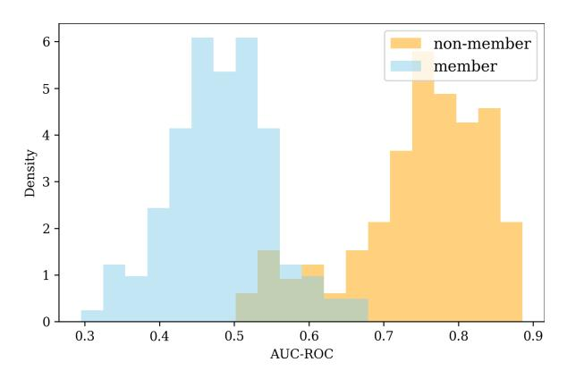
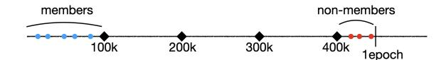
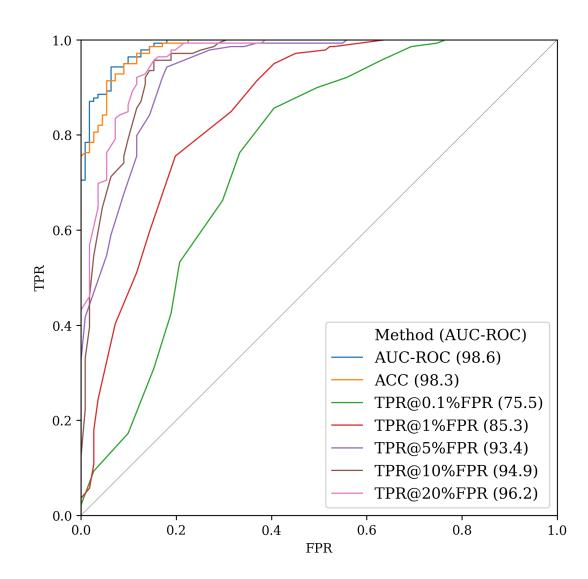
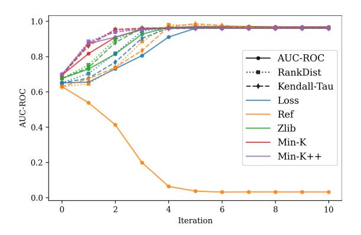

# Detecting Training Data of Large Language Models via Expectation Maximization

Gyuwan Kim<sup>1</sup>\* Yang Li<sup>2</sup> Evangelia Spiliopoulou<sup>2</sup> Jie Ma<sup>2</sup> Miguel Ballesteros<sup>2</sup> William Yang Wang<sup>1</sup>† <sup>1</sup>University of California, Santa Barbara <sup>2</sup>AWS AI Lab gyuwankim@ucsb.edu, william@cs.ucsb.edu {ylizam,spilieva,jieman,ballemig}@amazon.com

## Abstract

The advancement of large language models has grown parallel to the opacity of their training data. Membership inference attacks (MIAs) aim to determine whether specific data was used to train a model. They offer valuable insights into detecting data contamination and ensuring compliance with privacy and copyright standards. However, MIA for LLMs is challenging due to the massive scale of training data and the inherent ambiguity of membership in texts. Moreover, creating realistic MIA evaluation benchmarks is difficult as training and test data distributions are often unknown. We introduce EM-MIA, a novel membership inference method that iteratively refines membership scores and prefix scores via an expectationmaximization algorithm. Our approach leverages the observation that these scores can improve each other: membership scores help identify effective prefixes for detecting training data, while prefix scores help determine membership. As a result, EM-MIA achieves state-of-the-art results on WikiMIA. To enable comprehensive evaluation, we introduce OLMoMIA, a benchmark built from OLMo resources, which allows controlling task difficulty through varying degrees of overlap between training and test data distributions. Our experiments demonstrate EM-MIA is robust across different scenarios while also revealing fundamental limitations of current MIA approaches when member and non-member distributions are nearly identical.

## 1 Introduction

Large language models (LLMs) [\(Brown et al.,](#page-8-0) [2020;](#page-8-0) [Touvron et al.,](#page-10-0) [2023b\)](#page-10-0) have emerged as a groundbreaking development and have had a transformative impact across various domains. Vast and diverse training data are central to their success, which enables LLMs to understand and generate comprehensive language combined with the

ability to generalize to perform in complex tasks. Understanding the composition of training data is crucial for assessing the strengths and limitations of LLMs [\(Gebru et al.,](#page-9-0) [2021\)](#page-9-0), addressing ethical concerns, and mitigating potential biases [\(Bender](#page-8-1) [et al.,](#page-8-1) [2021;](#page-8-1) [Feng et al.,](#page-9-1) [2023\)](#page-9-1) and other risks [\(Bom](#page-8-2)[masani et al.,](#page-8-2) [2021\)](#page-8-2). However, the exact composition of training data is often a secret ingredient of LLMs except recent efforts to make LLMs transparent like OLMo [\(Groeneveld et al.,](#page-9-2) [2024\)](#page-9-2).

Since LLMs are trained on large-scale corpora from diverse sources, including web content, undesirable data such as test datasets [\(Sainz et al.,](#page-10-1) [2023;](#page-10-1) [Oren et al.,](#page-10-2) [2023;](#page-10-2) [Sainz et al.,](#page-10-3) [2024\)](#page-10-3), proprietary contents [\(Chang et al.,](#page-8-3) [2023;](#page-8-3) [Meeus et al.,](#page-10-4) [2024c\)](#page-10-4), or personally identifiable information [\(Mozes et al.,](#page-10-5) [2023\)](#page-10-5) may unintentionally be included, raising serious concerns when deploying LLMs. Membership inference attack (MIA) attempts to determine whether a particular data point has been seen during training a target model [\(Shokri et al.,](#page-10-6) [2017\)](#page-10-6). Using MIA to uncover those potential instances can serve as an effective mechanism in detecting data contamination [\(Magar and Schwartz,](#page-9-3) [2022\)](#page-9-3) for the reliable evaluation of LLMs' ability [\(Zhou et al.,](#page-11-0) [2023\)](#page-11-0) and auditing copyright infringement [\(Duarte](#page-8-4) [et al.,](#page-8-4) [2024\)](#page-8-4) and privacy leakage [\(Staab et al.,](#page-10-7) [2023;](#page-10-7) [Kandpal et al.,](#page-9-4) [2023;](#page-9-4) [Kim et al.,](#page-9-5) [2024\)](#page-9-5) to ensure compliance with regulations such as GDPR [\(Voigt](#page-11-1) [and Von dem Bussche,](#page-11-1) [2017\)](#page-11-1) and CCPA [\(Legis](#page-9-6)[lature,](#page-9-6) [2018\)](#page-9-6). Therefore, MIA has gained huge interest in the LLM community.

Despite increasing demands, MIA for LLMs is challenging [\(Duan et al.,](#page-8-5) [2024\)](#page-8-5) largely due to the large scale of training data and intrinsic ambiguity of membership from the nature of languages. Furthermore, designing a proper evaluation benchmark on MIAs for LLMs that emulates realistic test scenarios is complex. While training data comes from a mix of diverse and unknown sources, test data at inference time could be from any distribution. This

<sup>\*</sup>Work done during an internship at AWS AI Labs

<sup>†</sup>Work done while at AWS AI Labs

motivates us to develop a robust MIA method that works well across varying distributions of members and non-members with minimal assumptions.

In this paper, we propose a novel MIA framework, EM-MIA, which iteratively refines membership scores and prefix scores using an expectationmaximization algorithm. A membership score indicates how likely each data point is a member. A prefix score indicates its effectiveness in distinguishing members from non-members when used as a prefix. We empirically observe a duality between these scores, where improved estimation of one enhances the other. By starting from a reasonable initialization, our iterative approach progressively enhances score predictions until convergence, leading to more accurate membership scores for MIA.

To comprehensively evaluate our method and different MIA approaches, we introduce a new benchmark called OLMoMIA by utilizing OLMo [\(Groen](#page-9-2)[eveld et al.,](#page-9-2) [2024\)](#page-9-2) resources. We control difficulty levels by varying distributional overlaps using clustering techniques. Throughout the extensive experiments, we have shown that EM-MIA is a versatile MIA method and significantly outperforms previous strong baselines, though all methods, including ours, still struggle to surpass random guessing in the most challenging random split setting.

Our main contributions are summarized as follows. To the best of our knowledge, EM-MIA is the first approach that iteratively refines membership and prefix scores to improve MIA for LLMs. We demonstrate that ReCaLL [\(Xie et al.,](#page-11-2) [2024\)](#page-11-2) has an over-reliance on prefix selection, while EM-MIA is designed to work without labeled data or benchmark-specific prior knowledge. EM-MIA remarkably outperforms all existing strong MIA baselines for LLMs, achieving state-of-the-art results on WikiMIA [\(Shi et al.,](#page-10-8) [2023\)](#page-10-8), the most popular benchmark for detecting LLM pre-training data. Experiments on our OLMoMIA highlight EM-MIA's robustness across diverse distributional conditions and underscore the importance of evaluating MIA methods under varied scenarios.

#### 2 Background

#### <span id="page-1-1"></span>2.1 Membership Inference Attack for LLMs

Membership inference attack (MIA) [\(Shokri et al.,](#page-10-6) [2017;](#page-10-6) [Carlini et al.,](#page-8-6) [2022\)](#page-8-6) aims to determine whether specific data was used to train a model: member vs. non-member. Formally, given a target language model M trained on an unknown Dtrain,

MIA predicts a membership label of each instance x in a test dataset Dtest whether x in Dtrain or not, by computing a membership score f(x;M) and applying a threshold. The trade-off between true positive rate and false positive rate is controlled by the threshold. The performance is mainly evaluated with AUC-ROC and TPR@low FPR metrics [\(Car](#page-8-6)[lini et al.,](#page-8-6) [2022;](#page-8-6) [Mireshghallah et al.,](#page-10-9) [2022\)](#page-10-9).

Existing MIA methods are generally based on the assumption that models memorize or overfit their training data. The most basic approach uses the average log-likelihood (or perplexity) of text with respect to the target model, based on the observation that members typically have lower loss [\(Yeom et al.,](#page-11-3) [2018\)](#page-11-3). Likelihood Ratio Attacks (LiRAs) [\(Ye et al.,](#page-11-4) [2022\)](#page-11-4) calibrate difficulty using reference models [\(Carlini et al.,](#page-8-6) [2022\)](#page-8-6), compression methods [\(Carlini et al.,](#page-8-7) [2021\)](#page-8-7), or averaging neighbors [\(Mattern et al.,](#page-9-7) [2023\)](#page-9-7). Min-K% [\(Shi](#page-10-8) [et al.,](#page-10-8) [2023\)](#page-10-8) focuses on tokens with lowest likelihoods, and Min-K%++ [\(Zhang et al.,](#page-11-5) [2024\)](#page-11-5) extends this approach with token-level probability normalization. ReCaLL [\(Xie et al.,](#page-11-2) [2024\)](#page-11-2), which we describe in detail in [§2.4,](#page-2-0) uses the ratio of conditional and unconditional log-likelihoods as the membership score.

#### <span id="page-1-0"></span>2.2 Challenges in MIA for LLMs

MIA for LLMs faces several unique challenges that make it particularly difficult [\(Duan et al.,](#page-8-5) [2024;](#page-8-5) [Meeus et al.,](#page-9-8) [2024b\)](#page-9-8). First, due to the massive training dataset size, each instance is used in training only a few times, often just once [\(Lee et al.,](#page-9-9) [2021\)](#page-9-9), making it harder to leave detectable footprints in the model. Second, there is inherent ambiguity in defining membership for text data. Texts naturally repeat and partially overlap even after decontamination and deduplication efforts [\(Kand](#page-9-10)[pal et al.,](#page-9-10) [2022;](#page-9-10) [Tirumala et al.,](#page-10-10) [2024\)](#page-10-10), and minor variations or paraphrases create fuzzy membership boundaries [\(Shilov et al.,](#page-10-11) [2024;](#page-10-11) [Mattern](#page-9-7) [et al.,](#page-9-7) [2023;](#page-9-7) [Mozaffari and Marathe,](#page-10-12) [2024\)](#page-10-12). Traditional MIA approaches [\(Shokri et al.,](#page-10-6) [2017;](#page-10-6) [Ye](#page-11-4) [et al.,](#page-11-4) [2022;](#page-11-4) [Carlini et al.,](#page-8-6) [2022\)](#page-8-6) that rely on training shadow models are infeasible for LLMs due to prohibitive computational costs, unknown training specifications, and the difficulty of obtaining non-overlapping training data from the same distribution. These constraints have necessitated new approaches specifically designed for LLMs.

#### <span id="page-2-2"></span>2.3 Evaluation Challenges and Benchmarks

Current benchmarks generally fall into two categories. Benchmarks like WikiMIA [\(Shi et al.,](#page-10-8) [2023;](#page-10-8) [Meeus et al.,](#page-9-11) [2024a\)](#page-9-11) use model release dates and time information of documents to determine membership, but this approach may conflate membership inference with distribution shift detection [\(Das](#page-8-8) [et al.,](#page-8-8) [2024;](#page-8-8) [Meeus et al.,](#page-9-8) [2024b;](#page-9-8) [Maini et al.,](#page-9-12) [2024\)](#page-9-12). In contrast, benchmarks like MIMIR [\(Duan et al.,](#page-8-5) [2024\)](#page-8-5) use random splits to create nearly identical distributions between members and non-members. In these cases, no existing methods significantly outperform random guessing.

While training data typically comes from diverse sources, test data at inference time could be from any distribution. This makes it crucial to evaluate the robustness of MIA methods across different distributional scenarios. The practical challenges of benchmark creation are compounded by the limited availability of true non-member data and the difficulty of controlling test conditions. There is a clear need for benchmarks that can simulate various realworld scenarios while maintaining reliable ground truth membership labels [\(Meeus et al.,](#page-9-8) [2024b;](#page-9-8) [Eich](#page-9-13)[ler et al.,](#page-9-13) [2024\)](#page-9-13).

#### <span id="page-2-0"></span>2.4 ReCaLL: Assumptions and Limitations

ReCaLL [\(Xie et al.,](#page-11-2) [2024\)](#page-11-2) uses the ratio between the conditional log-likelihood of a target data point x given a non-member prefix p as a context and the unconditional log-likelihood of x by an LLM M as a membership score, based on the observation that the distribution of ReCaLL scores for members and non-members diverges when p is a non-member prefix: formally, ReCaLLp(x;M) = LL(x|p;M)/LL(x;M) (we may omit M later, for brevity), where LL is the average log-likelihood over tokens and the prefix p [1](#page-2-1) is a concatenation of non-member data points p<sup>i</sup> : p = p1⊕p2⊕· · ·⊕pn. The intuition is that the log-likelihood of members drops a lot when conditioned with non-members from an in-context learning point of view [\(Akyürek](#page-8-9) [et al.,](#page-8-9) [2022\)](#page-8-9), while the log-likelihood of nonmembers does not change much.

ReCaLL significantly outperforms other MIA approaches by a large margin. For instance, Re-CaLL exceeds 90% AUC-ROC on WikiMIA [\(Shi](#page-10-8) [et al.,](#page-10-8) [2023\)](#page-10-8) beating previous state-of-the-art AUC-ROC of about 75% from Min-K%++ [\(Zhang et al.,](#page-11-5)

[2024\)](#page-11-5). However, there is no theoretical analysis of why and when ReCaLL works well.

[Xie et al.](#page-11-2) [\(2024\)](#page-11-2) randomly select non-members p<sup>i</sup> among non-members in a test dataset and exclude them from the test dataset without validation, based on strong assumptions that (1) the ground truth non-members are available and (2) all of them are equally effective as a prefix. However, the heldout ground truth non-members, especially from the same distribution of the test set, may not always be available at inference time. This aligns with the discussion in the previous section [§2.3.](#page-2-2) With recent advancements in computation and availability of crawled data, LLMs are trained on larger data set sizes [\(Hoffmann et al.,](#page-9-14) [2022;](#page-9-14) [Dubey et al.,](#page-8-10) [2024\)](#page-8-10). The determination of non-members is therefore increasingly difficult [\(Villalobos et al.,](#page-11-6) [2022;](#page-11-6) [Muennighoff et al.,](#page-10-13) [2024\)](#page-10-13). [Xie et al.](#page-11-2) [\(2024\)](#page-11-2) generates a synthetic prefix using GPT-4o to secure non-members. However, according to their implementation, this method still relies on non-member test data as seed data.

Selecting non-members from the test dataset makes ReCaLL advantageous but unfair compared to other MIAs that do not utilize any non-member test data. It partially explains why simple random selection reasonably works well. [Xie et al.](#page-11-2) [\(2024\)](#page-11-2) conduct the ablation study to demonstrate the robustness of the random prefix selection, which ironically reveals that ReCaLL's performance can be damaged when we do not have known non-member data points from the test dataset distribution. Using non-members from a different domain (e.g., GitHub vs. Wikipedia) significantly degrades Re-CaLL's performance, sometimes even worse than Min-K%++. In other words, ReCaLL would not generalize well to test data from a distribution different from that of the prefix. The similarity between the prefix and test data also matters. Another ablation study shows a variance between different random selections, implying that random prefix selection is inconsistent and that all data points are not equally effective for the prefix.

## <span id="page-2-3"></span>3 Observation: Finding a Better Prefix

In this section, we rigorously investigate how much ReCaLL's performance is sensitive to the choice of a prefix and particularly how much it can be compromised without given non-member data. We define a prefix score r(p) as the effectiveness of p as a prefix in discriminating memberships, partic-

<span id="page-2-1"></span><sup>1</sup>As an extension from using a single prefix p, averaging the ReCaLL scores on a set of multiple prefixes is possible for an ensemble.

<span id="page-3-0"></span>

Figure 1: Histogram of prefix scores for members and non-members measured by AUC-ROC in the Oracle setting on the WikiMIA dataset [\(Shi et al.,](#page-10-8) [2023\)](#page-10-8) with a length of 128 and Pythia-6.9B [\(Biderman et al.,](#page-8-11) [2023\)](#page-8-11).

ularly when using this prefix for ReCaLL. In the Oracle setting where ground truth labels of all examples in a test dataset Dtest are available, we can calculate a prefix score by measuring the performance of ReCaLL with a prefix p on a test dataset Dtest using ground truth labels and a MIA evaluation metric such as AUC-ROC. While a prefix could be any text, we calculate prefix scores for all examples in a test dataset Dtest by using each data point as a standalone prefix.

As an initial analysis, we conduct experiments using the WikiMIA [\(Shi et al.,](#page-10-8) [2023\)](#page-10-8) dataset with a length of 128 as a target dataset and Pythia-6.9B [\(Biderman et al.,](#page-8-11) [2023\)](#page-8-11) as a target LM. Figure [1](#page-3-0) displays the distribution of prefix scores measured by AUC-ROC for members and nonmembers. Consistent with the results from [\(Xie](#page-11-2) [et al.,](#page-11-2) [2024\)](#page-11-2), ReCaLL works well if a prefix is a non-member and does not work well if a prefix is a member. Prefix scores of members are smaller than 0.7, and most of them are close to 0.5, which is the score of random guessing. Prefix scores of non-members are larger than 0.5, and most of them are larger than 0.7. This clear distinguishability suggests using a negative prefix score as a membership score. Appendix [B](#page-11-7) includes results on using metrics for prefix scores other than AUC-ROC.

Without access to non-members (or data points with high prefix scores), ReCaLL's performance could be significantly lower. Given the wide spectrum of prefix scores for even non-members, the effectiveness of each data point varies, and the choice of data points for a prefix can be crucial, although using a concatenation of multiple data points as a prefix reduces variance. In other words, we can

expect better MIA performance by carefully selecting the prefix. Ultimately, it is desirable to find an optimal prefix p without any information or access to given ground truth non-member data points on the test set.

Contrary to the Oracle setting, labels which are what should be predicted are unknown at inference time, meaning that we cannot directly use labels to calculate prefix scores. In the next section [§4,](#page-3-1) we describe how our method addresses this problem by iteratively updating membership scores and prefix scores based on one another. We propose a new MIA framework that is designed to work robustly on any test dataset with minimal information.

## <span id="page-3-1"></span>4 Proposed Method: EM-MIA

We target the realistic MIA scenario where test data labels are unavailable. We measure a prefix score by how ReCaLL<sup>p</sup> on a test dataset Dtest aligns well with the current estimates of membership scores f on Dtest denoted as S(ReCaLLp, f, Dtest). More accurate membership scores can help compute more accurate prefix scores. Conversely, more accurate prefix scores can help compute more accurate membership scores. Based on this duality, we propose an iterative algorithm to refine membership scores and prefix scores via an Expectation-Maximization algorithm, called EM-MIA, to perform MIA with minimal assumptions on test data ([§2.4\)](#page-2-0).

Algorithm [1](#page-4-0) summarizes the overall procedure of EM-MIA. We begin with an initial assignment of membership scores using any existing off-the-shelf MIA method such as Loss [\(Yeom et al.,](#page-11-3) [2018\)](#page-11-3) or Min-K%++ [\(Zhang et al.,](#page-11-5) [2024\)](#page-11-5) (Line 1). We calculate prefix scores r(p) using membership scores and then update membership scores f(x) using prefix scores. The update rule of prefix scores (Line 3) and membership scores (Line 4) is a design choice. We repeat this process iteratively until convergence (Line 5). Since EM-MIA is a general framework, all components, including initialization, score update rules, datasets (e.g., Appendix [A\)](#page-11-8), and stopping criteria, are subject to modification for further improvement.

Update Rule for Prefix Scores Our observation in [§3](#page-2-3) shows that AUC-ROC is an effective function S to calculate prefix scores given ground truth labels. Because we do not have labels, we can assign membership labels using the current membership scores f and a threshold τ

#### <span id="page-4-0"></span>Algorithm 1 EM-MIA

Input: Target LLM M, Test dataset Dtest

Output: Membership scores f(x) for x ∈ Dtest

- 1: Initialize f(x) with an existing off-the-shelf MIA method
- 2: repeat
- 3: Update prefix scores r(p) = S(ReCaLLp, f, Dtest) for p ∈ Dtest
- 4: Update membership scores f(x) = −r(x) for x ∈ Dtest
- 5: until Convergence (no significant difference in f)

to use them as pseudo labels to calculate prefix scores: AUC-ROC({(ReCaLLp(x), 1f(x)>τ |x ∈ Dtest)}). We can choose τ as a specific percentile (e.g., a median (50% percentile) because a test dataset is usually balanced) in the score distributions to decide the portion of members and nonmembers. Instead of approximating hard labels, we can compare the ranks of ReCaLLp(x) and the ranks of f(x) on Dtest with a measure like the average difference P x∈Dtest ∥rank(ReCaLLp(x)) − rank(f(x))∥ or rank correlation coefficients such as Kendall's tau [\(Kendall,](#page-9-15) [1938\)](#page-9-15) and Spearman's rho [\(Spearman,](#page-10-14) [1961\)](#page-10-14).

Update Rule for Membership Scores Our observation in [§3](#page-2-3) shows that a negative prefix score can be used as a good membership score. Alternatively, we can choose candidates with top-k prefix scores to construct a prefix and calculate membership scores using ReCaLL with this prefix: f(x) = ReCaLLp(x) where p = p1⊕p2⊕· · ·⊕p<sup>n</sup> and p<sup>i</sup> ∈ argtopkx∈Dtest r(x). How to order p<sup>i</sup> in p is also a design choice. Intuitively, we can place them in reverse order of the prefix score since a data point closer to the target text will have a larger impact on the likelihood.

## 5 New Benchmark: OLMoMIA

EM-MIA works well and even performs almost perfectly on some benchmarks such as WikiMIA [\(Shi](#page-10-8) [et al.,](#page-10-8) [2023\)](#page-10-8) ([§7.1\)](#page-6-0), while it does not work well on other datasets such as MIMIR [\(Duan et al.,](#page-8-5) [2024\)](#page-8-5) similar to other methods. We want to know why this is the case and what are the conditions for success. To answer these questions, we develop a new benchmark using OLMo [\(Groeneveld et al.,](#page-9-2) [2024\)](#page-9-2), which is a series of fully open language models pretrained with Dolma [\(Soldaini et al.,](#page-10-15) [2024\)](#page-10-15) dataset. OLMo provides intermediate model checkpoints and an index to get which data has been used for each training step, which are valuable resources to

<span id="page-4-1"></span>

Figure 2: The basic setup of OLMoMIA benchmark. The horizontal line indicates a training step. For any intermediate checkpoint at a specific step, we can consider training data before and after that step as members and non-members, respectively.

construct an MIA benchmark. We will share our implementation and resulting benchmark datasets. Like us, anyone can create their own benchmark on their purpose by modifying our implementation.

Figure [2](#page-4-1) illustrates the basic setup of the OL-MoMIA benchmark. Specifically, we use checkpoints of OLMo-7B trained with 100k, 200k, 300k, and 400k steps as target models (c.f., one epoch is slightly larger than 450k steps). Then, we consider any training data before 100k steps as members and any training data between 400k and 450k steps as non-members. However, we should keep in mind that there could still be some ambiguity in membership despite the effort of deduplication, as discussed in [§2.2.](#page-1-0) Based on this setup, we have multiple settings with different samplings.

The basic setting is *Random*, where we randomly select members and non-members from each interval. This setting is similar to MIMIR [\(Duan](#page-8-5) [et al.,](#page-8-5) [2024\)](#page-8-5), where members and non-members are from the training split and test split of the Pile dataset [\(Gao et al.,](#page-9-16) [2020\)](#page-9-16), respectively. MIMIR is much more challenging than WikiMIA since the training set and test set are randomly split and thus have minimal distribution shifts.

Based on clustering, we control the degree of overlap between the distribution of members and non-members, resulting in different difficulties. First, we sample enough numbers of members and non-members (in our case, 50k each). Next, we map sampled data into embedding vectors. We use NV-Embed-v2 model [\(Lee et al.,](#page-9-17) [2024\)](#page-9-17), which was

the first rank on the MTEB leaderboard [\(Muen](#page-10-16)[nighoff et al.,](#page-10-16) [2022\)](#page-10-16) as of Aug 30, 2024, for the embedding model. Then, we perform K-means clustering [\(Lloyd,](#page-9-18) [1982\)](#page-9-18) for members and non-members separately (in our case, we use K = 50).

To prevent datasets from degeneration that have duplicates with a very minor difference, we remove data points closer than a certain distance threshold with other points within a cluster in a greedy manner to guarantee all data points in the same cluster are not too close to each other. Empirically, we observed that most pair distances measured by cosine distance range from 0.8 to 1.2, so we set 0.6 as the minimum inter-distance for deduplication.

For the *Easy* setting, we pick the farthest pair of a member cluster and a non-member cluster and pick instances farthest from the opposite cluster. For the *Hard* setting, we pick the closest pair of a member cluster and a non-member cluster and pick instances closest to the opposite cluster. For the *Medium* setting, we pick the pair of a member cluster and a non-member cluster with a median distance and randomly sampled instances within each cluster.

Additionally, we merge members from *Random* and non-members from *Hard* to create the *Mix-1* setting and merge members from *Hard* and nonmembers from *Random* to create the *Mix-2* setting. *Mix-1* aims to simulate the case where test data come from a single cluster. Thus, any cluster might be fine, but we choose *Hard* with no specific reason. These settings cover almost all possible inclusion relationships between members and non-members.

We provide formal equations of the above descriptions in Appendix [D.](#page-12-0) For each difficulty level, we have two splits based on the maximum sequence length of 64 and 128. For each dataset, we balance the number of members and non-members to 500 each to make the total size 1000.

#### 6 Experimental Setup

Our implementation and datasets to reproduce our experiments are available at [https://github.com/gyuwankim/em-mia.](https://github.com/gyuwankim/em-mia)

#### 6.1 Datasets and Models

We conduct experiments on WikiMIA ([§7.1\)](#page-6-0) and OLMoMIA ([§7.2\)](#page-6-1) using AUC-ROC and TPR@1%FPR as evaluation metrics. For WikiMIA, we use the original setting with length splits of 32, 64, and 128 as test datasets and use

Mamba 1.4B [\(Gu and Dao,](#page-9-19) [2023\)](#page-9-19), Pythia 6.9B [\(Bi](#page-8-11)[derman et al.,](#page-8-11) [2023\)](#page-8-11), GPT-NeoX 20B [\(Black et al.,](#page-8-12) [2022\)](#page-8-12), LLaMA 13B/30B [\(Touvron et al.,](#page-10-17) [2023a\)](#page-10-17), and OPT 66B [\(Zhang et al.,](#page-11-9) [2022\)](#page-11-9) as target models, following [Xie et al.](#page-11-2) [\(2024\)](#page-11-2) and [\(Zhang et al.,](#page-11-5) [2024\)](#page-11-5). For OLMoMIA, we use six settings of *Easy*, *Medium*, *Hard*, *Random*, *Mix-1*, and *Mix-2* as test datasets and use checkpoints after 100k, 200k, 300k, and 400k training steps as target models. Although EM-MIA requires a baseline sufficiently better than random guessing as an initialization, there is currently no such method for MIMIR [\(Duan et al.,](#page-8-5) [2024\)](#page-8-5). Therefore, we skip experiments on MIMIR, though this is one of the widely used benchmarks on MIA for LLMs.

## 6.2 Baselines

We compare EM-MIA against the following baselines[2](#page-5-0) : Loss [\(Yeom et al.,](#page-11-3) [2018\)](#page-11-3), Ref [\(Carlini et al.,](#page-8-6) [2022\)](#page-8-6), Zlib [\(Carlini et al.,](#page-8-7) [2021\)](#page-8-7), Min-K% [\(Shi](#page-10-8) [et al.,](#page-10-8) [2023\)](#page-10-8), and Min-K%++ [\(Zhang et al.,](#page-11-5) [2024\)](#page-11-5). We use Pythia-70m for WikiMIA and StableLM-Base-Alpha-3B-v2 model [\(Tow,](#page-10-18) [2023\)](#page-10-18) for OLMo-MIA as the reference model of the Ref method, following [Shi et al.](#page-10-8) [\(2023\)](#page-10-8) and [Duan et al.](#page-8-5) [\(2024\)](#page-8-5). We use K = 20 for Min-K% and Min-K%++.

#### 6.3 ReCaLL-based Baselines

We have four options for choosing p<sup>i</sup> : *Rand*, *RandM*, *RandNM*, and *TopPref*. *Rand* randomly selects any data from Dtest. *RandM* randomly selects member data from Dtest. *RandNM* randomly selects non-member data from Dtest. *TopPref* selects data from Dtest with the highest prefix scores calculated with ground truth labels the same as [§3.](#page-2-3) All options except *Rand* partially or entirely use labels in the test dataset. For all methods using a random selection (*Rand*, *RandM*, and, *RandNM*), we execute five times with different random seeds and report the average. We fix n = 12 since it provides a reasonable performance while not too expensive. We report the results from the original ReCaLL paper but explain why this is not a fair comparison in Appendix [C.](#page-11-10)

Additionally, *Avg* and *AvgP* average ReCaLL scores over all data points in Dtest: *Avg*(x) = 1 |Dtest| P p∈Dtest ReCaLLp(x) and *AvgP*(p) = 1 |Dtest| P x∈Dtest ReCaLLp(x). The intuition is av-

<span id="page-5-0"></span><sup>2</sup>Among the commonly used baselines, we omit Neighbor [\(Mattern et al.,](#page-9-7) [2023\)](#page-9-7) because it is not the best in most cases though it requires LLM inference multiple times for neighborhood texts, so it is much more expensive.

eraging will smooth out ReCaLL scores with a non-discriminative prefix while keeping ReCaLL scores with a discriminative prefix without exactly knowing discriminative prefixes.

#### 6.4 EM-MIA

As explained in [§4,](#page-3-1) EM-MIA is a general framework where each component can be tuned for improvement, but we use the following options as defaults based on results from preliminary experiments. Overall, Min-K%++ performs best among baselines without ReCaLL-based approaches, so we use it as a default choice for initialization. Alternatively, we may use ReCaLL-based methods that do not rely on any labels like *Avg*, *AvgP*, or *Rand*. For the update rule for prefix scores, we use AUC-ROC as a default scoring function S. For the update rule for membership scores, we use negative prefix scores as new membership scores. For the stopping criterion, we repeat ten iterations and stop without thresholding by the score difference since we observed that membership scores and prefix scores converge quickly after a few iterations. We also observed that EM-MIA is not sensitive to the choice of the initialization method and the scoring function S and converges to similar results. Ablation study on different initializations and scoring functions can be found in Appendix [F.](#page-13-0) Discussion on computational costs can be found in Appendix [E.](#page-12-1)

## 7 Results and Discussion

## <span id="page-6-0"></span>7.1 WikiMIA

Table [1](#page-7-0) and Table [3](#page-14-0) show the experimental results on WikiMIA, with the metric of AUC-ROC and TPR@1%FPR respectively. EM-MIA achieves state-of-the-art performance on WikiMIA for all different models and length splits, significantly outperforming all baselines, including ReCaLL, even without any given non-member test data. EM-MIA exceeds 96% AUC-ROC in all cases. For the largest model OPT-66B, EM-MIA gets 99% AUC-ROC for length splits 32 and 64, while ReCaLL's performance is lower than 86% AUC-ROC.

All baselines without ReCaLL-based approaches achieve lower than 76% AUC-ROC on average across different models. The relative order between ReCaLL-based baselines is consistent over different settings: *RandM* < *Avg*, *AvgP* < *Rand* < *RandNM* < *TopPref*. This trend clearly shows that ReCaLL is sensitive to the choice of the prefix. Particularly, the large gap between *RandM*and

*Rand* versus *RandNM* shows that ReCaLL is highly dependent on the availability of given nonmembers. *RandNM* is similar to the original Re-CaLL [\(Xie et al.,](#page-11-2) [2024\)](#page-11-2) in most cases except for the OPT-66B model and LLaMA models with sequence length 128, probably because n = 12 is not optimal for these cases. Among these, *Rand* does not use any labels, so it is fair to compare with other baselines, and it performs worse than Min-K%++ on average. This result again shows that ReCaLL is not strong enough without given non-members.

*TopPref* consistently outperforms *RandNM*, indicating that random prefix selection is definitely not sufficiently good and there is room for better MIA performance by prefix optimization [\(Shin](#page-10-19) [et al.,](#page-10-19) [2020;](#page-10-19) [Deng et al.,](#page-8-13) [2022;](#page-8-13) [Guo et al.,](#page-9-20) [2023\)](#page-9-20). Although the search space of the prefix is exponentially large and the calculation of prefix scores without labels is nontrivial, a prefix score could be a good measure to choose data points to construct the prefix. EM-MIA approximates prefix scores and uses them to refine membership scores.

## <span id="page-6-1"></span>7.2 OLMoMIA

Table [2](#page-7-1) and Table [4](#page-14-1) show the experimental results on OLMoMIA[3](#page-6-2) , with the metric of AUC-ROC and TPR@1%FPR respectively. EM-MIA achieves almost perfect scores on *Easy* and *Medium* similar to WikiMIA, gets performance comparable to random guessing performance on *Hard* and *Random* similar to MIMIR, and gets reasonably good scores on *Mix-1* and *Mix-2*, though not perfect as on *Easy* and *Medium*. EM-MIA significantly outperforms all baselines in all settings except *Hard* and *Random*, where distributions of members and non-members heavily overlap to each other and all methods are not sufficiently better than random guessing.

None of the baselines without ReCaLL-based approaches are successful in all settings, which implies that OLMoMIA is a challenging benchmark. The relative order between ReCaLL-based baselines is again consistent over different settings: *RandM* < *Avg*, *AvgP*, *Rand* < *RandNM* < *TopPref*, though all methods that do not use any labels fail to be successful. Interestingly, *RandNM* works reasonably well on *Mix-1* but does not work well on *Mix-2*. This is because nonmembers from *Mix-1* are from the same cluster

<span id="page-6-2"></span><sup>3</sup>We report average scores over four intermediate OLMo checkpoints because there was no significant difference in the MIA performance for different checkpoints different from the expectation that earlier training data will be harder to detect.

<span id="page-7-0"></span>

| Method                                                                                                                     |    | Mamba-1.4B |     |    | Pythia-6.9B                                                                                              |     |    | LLaMA-13B |     |    | NeoX-20B |     |    | LLaMA-30B |     |    | OPT-66B |     |    | Average |     |
|----------------------------------------------------------------------------------------------------------------------------|----|------------|-----|----|----------------------------------------------------------------------------------------------------------|-----|----|-----------|-----|----|----------|-----|----|-----------|-----|----|---------|-----|----|---------|-----|
|                                                                                                                            | 32 | 64         | 128 | 32 | 64                                                                                                       | 128 | 32 | 64        | 128 | 32 | 64       | 128 | 32 | 64        | 128 | 32 | 64      | 128 | 32 | 64      | 128 |
| Loss                                                                                                                       |    |            |     |    | 61.0 58.2 63.3 63.8 60.8 65.1 67.5 63.6 67.7 69.1 66.6 70.8 69.4 66.1 70.3 65.7 62.3 65.5 66.1 62.9 67.1 |     |    |           |     |    |          |     |    |           |     |    |         |     |    |         |     |
| Ref                                                                                                                        |    |            |     |    | 60.3 59.7 59.7 63.2 62.3 63.0 64.0 62.5 64.1 68.2 67.8 68.9 65.1 64.8 66.8 63.9 62.9 62.7 64.1 63.3 64.2 |     |    |           |     |    |          |     |    |           |     |    |         |     |    |         |     |
| Zlib                                                                                                                       |    |            |     |    | 61.9 60.4 65.6 64.3 62.6 67.6 67.8 65.3 69.7 69.3 68.1 72.4 69.8 67.4 71.8 65.8 63.9 67.4 66.5 64.6 69.1 |     |    |           |     |    |          |     |    |           |     |    |         |     |    |         |     |
| Min-K%                                                                                                                     |    |            |     |    | 63.3 61.7 66.7 66.3 65.0 69.5 66.8 66.0 71.5 72.1 72.1 75.7 69.3 68.4 73.7 67.5 66.5 70.6 67.5 66.6 71.3 |     |    |           |     |    |          |     |    |           |     |    |         |     |    |         |     |
| Min-K%++                                                                                                                   |    |            |     |    | 66.4 67.2 67.7 70.2 71.8 69.8 84.4 84.3 83.8 75.1 76.4 75.5 84.3 84.2 82.8 69.7 69.8 71.1 75.0 75.6 75.1 |     |    |           |     |    |          |     |    |           |     |    |         |     |    |         |     |
| Avg                                                                                                                        |    |            |     |    | 70.2 68.3 65.6 69.3 68.2 66.7 77.2 77.3 74.6 71.4 72.0 68.7 79.8 81.0 79.6 64.6 65.6 60.0 72.1 72.1 69.2 |     |    |           |     |    |          |     |    |           |     |    |         |     |    |         |     |
| AvgP                                                                                                                       |    |            |     |    | 64.0 61.8 56.7 62.1 61.0 59.0 63.1 60.3 56.4 63.9 61.8 61.1 60.3 60.0 55.4 86.9 94.3 95.1 66.7 66.5 63.9 |     |    |           |     |    |          |     |    |           |     |    |         |     |    |         |     |
| RandM                                                                                                                      |    |            |     |    | 25.4 25.1 26.2 24.9 26.2 24.6 21.0 14.9 68.6 25.3 28.3 29.8 14.0 15.1 70.4 33.9 40.9 42.9 24.1 25.1 43.8 |     |    |           |     |    |          |     |    |           |     |    |         |     |    |         |     |
| Rand                                                                                                                       |    |            |     |    | 72.7 78.2 64.2 67.0 73.4 68.7 73.9 75.4 68.5 68.2 74.5 67.5 66.9 71.7 70.2 64.5 67.8 58.6 68.9 73.5 66.3 |     |    |           |     |    |          |     |    |           |     |    |         |     |    |         |     |
| RandNM                                                                                                                     |    |            |     |    | 90.7 90.6 88.4 87.3 90.0 88.9 92.1 93.4 68.8 85.9 89.9 86.3 90.6 92.1 71.8 78.7 77.6 67.8 87.5 88.9 78.7 |     |    |           |     |    |          |     |    |           |     |    |         |     |    |         |     |
| TopPref                                                                                                                    |    |            |     |    | 90.6 91.2 88.0 91.3 92.9 90.1 93.5 94.2 71.8 88.4 92.0 90.2 92.9 93.8 74.8 83.6 79.6 72.1 90.0 90.6 81.2 |     |    |           |     |    |          |     |    |           |     |    |         |     |    |         |     |
| Xie et al. (2024) 90.2 91.4 91.2 91.6 93.0 92.6 92.2 95.2 92.5 90.5 93.2 91.7 90.7 94.9 91.2 85.1 79.9 81.0 90.1 91.3 90.0 |    |            |     |    |                                                                                                          |     |    |           |     |    |          |     |    |           |     |    |         |     |    |         |     |
| EM-MIA                                                                                                                     |    |            |     |    | 97.1 97.6 96.8 97.5 97.5 96.4 98.1 98.8 97.0 96.1 97.6 96.3 98.5 98.8 98.5 99.0 99.0 96.7 97.7 98.2 96.9 |     |    |           |     |    |          |     |    |           |     |    |         |     |    |         |     |

<span id="page-7-1"></span>Table 1: AUC-ROC results on WikiMIA benchmark. The second block (grey) is ReCaLL-based baselines. *RandM*, *RandNM*, ReCaLL, and *TopPref* use labels in the test dataset, so comparing them with others is unfair. We report their scores for reference. We borrow the original ReCaLL results from [Xie et al.](#page-11-2) [\(2024\)](#page-11-2) which is also unfair to be compared with ours and other baselines.

| Method   | Easy |      | Medium |      |      | Hard |      | Random |      | Mix-1 | Mix-2 |      |
|----------|------|------|--------|------|------|------|------|--------|------|-------|-------|------|
|          | 64   | 128  | 64     | 128  | 64   | 128  | 64   | 128    | 64   | 128   | 64    | 128  |
| Loss     | 32.5 | 63.3 | 58.9   | 49.0 | 43.3 | 51.5 | 51.2 | 52.3   | 65.7 | 49.0  | 30.8  | 54.7 |
| Ref      | 56.8 | 26.8 | 61.4   | 47.2 | 49.1 | 50.7 | 49.7 | 49.9   | 59.9 | 49.7  | 38.9  | 50.9 |
| Zlib     | 24.0 | 51.8 | 44.8   | 50.7 | 40.5 | 51.1 | 52.3 | 50.5   | 63.2 | 47.2  | 31.5  | 54.3 |
| Min-K%   | 32.4 | 50.0 | 54.0   | 51.9 | 43.0 | 51.2 | 51.7 | 51.0   | 60.8 | 50.4  | 34.9  | 51.7 |
| Min-K%++ | 45.2 | 59.4 | 56.4   | 45.7 | 46.4 | 51.4 | 51.0 | 51.9   | 57.9 | 50.0  | 39.8  | 53.2 |
| Avg      | 61.9 | 53.9 | 52.3   | 57.0 | 47.6 | 51.5 | 50.3 | 48.6   | 63.3 | 56.4  | 35.5  | 44.4 |
| AvgP     | 79.2 | 39.9 | 53.9   | 61.7 | 50.2 | 51.4 | 49.0 | 50.1   | 55.7 | 63.0  | 42.7  | 41.8 |
| RandM    | 32.3 | 22.7 | 39.2   | 30.3 | 45.8 | 50.5 | 48.1 | 48.2   | 49.7 | 48.0  | 29.1  | 28.7 |
| Rand     | 63.7 | 46.3 | 56.0   | 59.4 | 48.9 | 52.1 | 49.7 | 49.1   | 60.6 | 68.0  | 38.0  | 38.6 |
| RandNM   | 87.1 | 75.5 | 71.8   | 81.2 | 50.5 | 53.2 | 50.4 | 50.0   | 66.5 | 73.7  | 49.1  | 48.0 |
| TopPref  | 88.9 | 88.5 | 79.7   | 64.4 | 55.7 | 54.5 | 52.3 | 52.7   | 79.9 | 80.2  | 55.3  | 62.1 |
| EM-MIA   | 99.8 | 97.4 | 98.3   | 99.8 | 47.2 | 50.2 | 51.4 | 50.9   | 88.3 | 80.8  | 88.4  | 77.1 |

Table 2: AUC-ROC results on OLMoMIA benchmark. The second block (grey) is ReCaLL-based baselines. *RandM*, *RandNM*, ReCaLL, and *TopPref* use labels in the test dataset, so comparing them with others is unfair. We report their scores for reference.

while non-members from *Mix-1* are randomly sampled from the entire distribution. On the other hand, *TopPref* notably outperforms *RandNM*, implying that the effectiveness of non-member prefixes for MIA differs.

Because benchmarking MIAs for LLMs is challenging due to the uncertainty of real-world test data distribution at inference time ([§2.3\)](#page-2-2), simulating diverse scenarios, as we did with OLMoMIA, is both beneficial and necessary compared to relying on a fixed benchmark. We encourage MIA developers and practitioners to evaluate their methods under varied conditions, as done in OLMoMIA. While we do not claim that OLMoMIA is inherently more realistic than other benchmarks, it aligns with some possible real-world scenarios, though it does not cover all cases. Our results on OLMo-MIA demonstrate that EM-MIA remains robust across varying levels of distributional overlap between members and non-members in a test dataset.

## 8 Conclusion

We introduce a novel MIA method for LLMs called EM-MIA that iteratively updates membership scores and prefix scores via an Expectation-Maximization algorithm for better membership inference based on the observation of their duality. EM-MIA significantly outperforms ReCaLL even without strong assumptions that ReCaLL relies on and achieves state-of-the-art performance on WikiMIA. EM-MIA is easily tunable with several design choices, including initialization, score update rules, and stopping criteria, allowing the application to MIA in different conditions and providing room for further improvement. We create a new benchmark for detecting pre-training data of LLMs named OLMoMIA to better understand the conditions under which EM-MIA works with a comprehensive evaluation. It turns out that EM-MIA robustly performs well for all settings except when the distributions of members and non-members are

almost identical, resulting in none of the existing methods being better than random guessing.

## Limitations

Our paper focuses on detecting LLMs' pre-training data with the gray-box access where computing the probability of a text from output logits is possible. However, many proprietary LLMs are usually further fine-tuned [\(Ouyang et al.,](#page-10-20) [2022;](#page-10-20) [Chung](#page-8-14) [et al.,](#page-8-14) [2024\)](#page-8-14), and they only provide generation outputs, which is the black-box setting. We left the extension of our approach to MIAs for finetuned LLMs [\(Song and Shmatikov,](#page-10-21) [2019;](#page-10-21) [Jagan](#page-9-21)[natha et al.,](#page-9-21) [2021;](#page-9-21) [Mahloujifar et al.,](#page-9-22) [2021;](#page-9-22) [She](#page-10-22)[jwalkar et al.,](#page-10-22) [2021;](#page-10-22) [Mireshghallah et al.,](#page-10-9) [2022;](#page-10-9) [Tu](#page-10-23) [et al.,](#page-10-23) [2024;](#page-10-23) [Feng et al.,](#page-9-23) [2024\)](#page-9-23) or LLMs with blackbox access [\(Dong et al.,](#page-8-15) [2024;](#page-8-15) [Zhou et al.,](#page-11-11) [2024;](#page-11-11) [Kaneko et al.,](#page-9-24) [2024\)](#page-9-24) as future work.

## References

- <span id="page-8-9"></span>Ekin Akyürek, Dale Schuurmans, Jacob Andreas, Tengyu Ma, and Denny Zhou. 2022. What learning algorithm is in-context learning? investigations with linear models. *arXiv preprint arXiv:2211.15661*.
- <span id="page-8-1"></span>Emily M Bender, Timnit Gebru, Angelina McMillan-Major, and Shmargaret Shmitchell. 2021. On the dangers of stochastic parrots: Can language models be too big? In *Proceedings of the 2021 ACM conference on fairness, accountability, and transparency*, pages 610–623.
- <span id="page-8-11"></span>Stella Biderman, Hailey Schoelkopf, Quentin Gregory Anthony, Herbie Bradley, Kyle O'Brien, Eric Hallahan, Mohammad Aflah Khan, Shivanshu Purohit, USVSN Sai Prashanth, Edward Raff, et al. 2023. Pythia: A suite for analyzing large language models across training and scaling. In *International Conference on Machine Learning*, pages 2397–2430. PMLR.
- <span id="page-8-12"></span>Sid Black, Stella Biderman, Eric Hallahan, Quentin Anthony, Leo Gao, Laurence Golding, Horace He, Connor Leahy, Kyle McDonell, Jason Phang, et al. 2022. Gpt-neox-20b: An open-source autoregressive language model. *arXiv preprint arXiv:2204.06745*.
- <span id="page-8-2"></span>Rishi Bommasani, Drew A Hudson, Ehsan Adeli, Russ Altman, Simran Arora, Sydney von Arx, Michael S Bernstein, Jeannette Bohg, Antoine Bosselut, Emma Brunskill, et al. 2021. On the opportunities and risks of foundation models. *arXiv preprint arXiv:2108.07258*.
- <span id="page-8-0"></span>Tom Brown, Benjamin Mann, Nick Ryder, Melanie Subbiah, Jared D Kaplan, Prafulla Dhariwal, Arvind Neelakantan, Pranav Shyam, Girish Sastry, Amanda Askell, Sandhini Agarwal, Ariel Herbert-Voss,

- Gretchen Krueger, Tom Henighan, Rewon Child, Aditya Ramesh, Daniel Ziegler, Jeffrey Wu, Clemens Winter, Chris Hesse, Mark Chen, Eric Sigler, Mateusz Litwin, Scott Gray, Benjamin Chess, Jack Clark, Christopher Berner, Sam McCandlish, Alec Radford, Ilya Sutskever, and Dario Amodei. 2020. Language models are few-shot learners. In *Advances in Neural Information Processing Systems*, volume 33, pages 1877–1901.
- <span id="page-8-6"></span>Nicholas Carlini, Steve Chien, Milad Nasr, Shuang Song, Andreas Terzis, and Florian Tramer. 2022. Membership inference attacks from first principles. In *2022 IEEE Symposium on Security and Privacy (SP)*, pages 1897–1914. IEEE.
- <span id="page-8-7"></span>Nicholas Carlini, Florian Tramer, Eric Wallace, Matthew Jagielski, Ariel Herbert-Voss, Katherine Lee, Adam Roberts, Tom Brown, Dawn Song, Ulfar Erlingsson, et al. 2021. Extracting training data from large language models. In *30th USENIX Security Symposium (USENIX Security 21)*, pages 2633–2650.
- <span id="page-8-3"></span>Kent K Chang, Mackenzie Cramer, Sandeep Soni, and David Bamman. 2023. Speak, memory: An archaeology of books known to chatgpt/gpt-4. *arXiv preprint arXiv:2305.00118*.
- <span id="page-8-14"></span>Hyung Won Chung, Le Hou, Shayne Longpre, Barret Zoph, Yi Tay, William Fedus, Yunxuan Li, Xuezhi Wang, Mostafa Dehghani, Siddhartha Brahma, et al. 2024. Scaling instruction-finetuned language models. *Journal of Machine Learning Research*, 25(70):1–53.
- <span id="page-8-8"></span>Debeshee Das, Jie Zhang, and Florian Tramèr. 2024. Blind baselines beat membership inference attacks for foundation models. *arXiv preprint arXiv:2406.16201*.
- <span id="page-8-13"></span>Mingkai Deng, Jianyu Wang, Cheng-Ping Hsieh, Yihan Wang, Han Guo, Tianmin Shu, Meng Song, Eric P Xing, and Zhiting Hu. 2022. Rlprompt: Optimizing discrete text prompts with reinforcement learning. *arXiv preprint arXiv:2205.12548*.
- <span id="page-8-15"></span>Yihong Dong, Xue Jiang, Huanyu Liu, Zhi Jin, and Ge Li. 2024. Generalization or memorization: Data contamination and trustworthy evaluation for large language models. *arXiv preprint arXiv:2402.15938*.
- <span id="page-8-5"></span>Michael Duan, Anshuman Suri, Niloofar Mireshghallah, Sewon Min, Weijia Shi, Luke Zettlemoyer, Yulia Tsvetkov, Yejin Choi, David Evans, and Hannaneh Hajishirzi. 2024. Do membership inference attacks work on large language models? In *Conference on Language Modeling (COLM)*.
- <span id="page-8-4"></span>André V Duarte, Xuandong Zhao, Arlindo L Oliveira, and Lei Li. 2024. De-cop: Detecting copyrighted content in language models training data. *arXiv preprint arXiv:2402.09910*.
- <span id="page-8-10"></span>Abhimanyu Dubey, Abhinav Jauhri, Abhinav Pandey, Abhishek Kadian, Ahmad Al-Dahle, Aiesha Letman, Akhil Mathur, Alan Schelten, Amy Yang, Angela Fan, et al. 2024. The llama 3 herd of models. *arXiv preprint arXiv:2407.21783*.

- <span id="page-9-13"></span>Cédric Eichler, Nathan Champeil, Nicolas Anciaux, Alexandra Bensamoun, Heber Hwang Arcolezi, and José Maria De Fuentes. 2024. Nob-mias: Non-biased membership inference attacks assessment on large language models with ex-post dataset construction. *arXiv preprint arXiv:2408.05968*.
- <span id="page-9-23"></span>Qizhang Feng, Siva Rajesh Kasa, Hyokun Yun, Choon Hui Teo, and Sravan Babu Bodapati. 2024. Exposing privacy gaps: Membership inference attack on preference data for llm alignment. *arXiv preprint arXiv:2407.06443*.
- <span id="page-9-1"></span>Shangbin Feng, Chan Young Park, Yuhan Liu, and Yulia Tsvetkov. 2023. From pretraining data to language models to downstream tasks: Tracking the trails of political biases leading to unfair nlp models. *arXiv preprint arXiv:2305.08283*.
- <span id="page-9-16"></span>Leo Gao, Stella Biderman, Sid Black, Laurence Golding, Travis Hoppe, Charles Foster, Jason Phang, Horace He, Anish Thite, Noa Nabeshima, et al. 2020. The pile: An 800gb dataset of diverse text for language modeling. *arXiv preprint arXiv:2101.00027*.
- <span id="page-9-0"></span>Timnit Gebru, Jamie Morgenstern, Briana Vecchione, Jennifer Wortman Vaughan, Hanna Wallach, Hal Daumé Iii, and Kate Crawford. 2021. Datasheets for datasets. *Communications of the ACM*, 64(12):86– 92.
- <span id="page-9-2"></span>Dirk Groeneveld, Iz Beltagy, Pete Walsh, Akshita Bhagia, Rodney Kinney, Oyvind Tafjord, Ananya Harsh Jha, Hamish Ivison, Ian Magnusson, Yizhong Wang, et al. 2024. Olmo: Accelerating the science of language models. *arXiv preprint arXiv:2402.00838*.
- <span id="page-9-19"></span>Albert Gu and Tri Dao. 2023. Mamba: Linear-time sequence modeling with selective state spaces. *arXiv preprint arXiv:2312.00752*.
- <span id="page-9-20"></span>Qingyan Guo, Rui Wang, Junliang Guo, Bei Li, Kaitao Song, Xu Tan, Guoqing Liu, Jiang Bian, and Yujiu Yang. 2023. Connecting large language models with evolutionary algorithms yields powerful prompt optimizers. *arXiv preprint arXiv:2309.08532*.
- <span id="page-9-14"></span>Jordan Hoffmann, Sebastian Borgeaud, Arthur Mensch, E Buchatskaya, T Cai, E Rutherford, DdL Casas, LA Hendricks, J Welbl, A Clark, et al. 2022. Training compute-optimal large language models. arxiv 2022. *arXiv preprint arXiv:2203.15556*, 10.
- <span id="page-9-21"></span>Abhyuday Jagannatha, Bhanu Pratap Singh Rawat, and Hong Yu. 2021. Membership inference attack susceptibility of clinical language models. *arXiv preprint arXiv:2104.08305*.
- <span id="page-9-4"></span>Nikhil Kandpal, Krishna Pillutla, Alina Oprea, Peter Kairouz, Christopher A Choquette-Choo, and Zheng Xu. 2023. User inference attacks on large language models. *arXiv preprint arXiv:2310.09266*.
- <span id="page-9-10"></span>Nikhil Kandpal, Eric Wallace, and Colin Raffel. 2022. Deduplicating training data mitigates privacy risks in language models. In *International Conference on Machine Learning*, pages 10697–10707. PMLR.

- <span id="page-9-24"></span>Masahiro Kaneko, Youmi Ma, Yuki Wata, and Naoaki Okazaki. 2024. Sampling-based pseudo-likelihood for membership inference attacks. *arXiv preprint arXiv:2404.11262*.
- <span id="page-9-15"></span>Maurice G Kendall. 1938. A new measure of rank correlation. *Biometrika*, 30(1-2):81–93.
- <span id="page-9-5"></span>Siwon Kim, Sangdoo Yun, Hwaran Lee, Martin Gubri, Sungroh Yoon, and Seong Joon Oh. 2024. Propile: Probing privacy leakage in large language models. *Advances in Neural Information Processing Systems*, 36.
- <span id="page-9-17"></span>Chankyu Lee, Rajarshi Roy, Mengyao Xu, Jonathan Raiman, Mohammad Shoeybi, Bryan Catanzaro, and Wei Ping. 2024. Nv-embed: Improved techniques for training llms as generalist embedding models. *arXiv preprint arXiv:2405.17428*.
- <span id="page-9-9"></span>Katherine Lee, Daphne Ippolito, Andrew Nystrom, Chiyuan Zhang, Douglas Eck, Chris Callison-Burch, and Nicholas Carlini. 2021. Deduplicating training data makes language models better. *arXiv preprint arXiv:2107.06499*.
- <span id="page-9-6"></span>California State Legislature. 2018. California consumer privacy act (ccpa). [https://oag.ca.gov/](https://oag.ca.gov/privacy/ccpa) [privacy/ccpa](https://oag.ca.gov/privacy/ccpa).
- <span id="page-9-18"></span>Stuart Lloyd. 1982. Least squares quantization in pcm. *IEEE transactions on information theory*, 28(2):129– 137.
- <span id="page-9-3"></span>Inbal Magar and Roy Schwartz. 2022. Data contamination: From memorization to exploitation. *arXiv preprint arXiv:2203.08242*.
- <span id="page-9-22"></span>Saeed Mahloujifar, Huseyin A Inan, Melissa Chase, Esha Ghosh, and Marcello Hasegawa. 2021. Membership inference on word embedding and beyond. *arXiv preprint arXiv:2106.11384*.
- <span id="page-9-12"></span>Pratyush Maini, Hengrui Jia, Nicolas Papernot, and Adam Dziedzic. 2024. Llm dataset inference: Did you train on my dataset? *arXiv preprint arXiv:2406.06443*.
- <span id="page-9-7"></span>Justus Mattern, Fatemehsadat Mireshghallah, Zhijing Jin, Bernhard Schölkopf, Mrinmaya Sachan, and Taylor Berg-Kirkpatrick. 2023. Membership inference attacks against language models via neighbourhood comparison. *arXiv preprint arXiv:2305.18462*.
- <span id="page-9-11"></span>Matthieu Meeus, Shubham Jain, Marek Rei, and Yves-Alexandre de Montjoye. 2024a. Did the neurons read your book? document-level membership inference for large language models. In *33rd USENIX Security Symposium (USENIX Security 24)*, pages 2369–2385.
- <span id="page-9-8"></span>Matthieu Meeus, Shubham Jain, Marek Rei, and Yves-Alexandre de Montjoye. 2024b. Inherent challenges of post-hoc membership inference for large language models. *arXiv preprint arXiv:2406.17975*.

- <span id="page-10-4"></span>Matthieu Meeus, Igor Shilov, Manuel Faysse, and Yves-Alexandre de Montjoye. 2024c. Copyright traps for large language models. *arXiv preprint arXiv:2402.09363*.
- <span id="page-10-9"></span>Fatemehsadat Mireshghallah, Kartik Goyal, Archit Uniyal, Taylor Berg-Kirkpatrick, and Reza Shokri. 2022. Quantifying privacy risks of masked language models using membership inference attacks. *arXiv preprint arXiv:2203.03929*.
- <span id="page-10-12"></span>Hamid Mozaffari and Virendra J Marathe. 2024. Semantic membership inference attack against large language models. *arXiv preprint arXiv:2406.10218*.
- <span id="page-10-5"></span>Maximilian Mozes, Xuanli He, Bennett Kleinberg, and Lewis D Griffin. 2023. Use of llms for illicit purposes: Threats, prevention measures, and vulnerabilities. *arXiv preprint arXiv:2308.12833*.
- <span id="page-10-13"></span>Niklas Muennighoff, Alexander Rush, Boaz Barak, Teven Le Scao, Nouamane Tazi, Aleksandra Piktus, Sampo Pyysalo, Thomas Wolf, and Colin A Raffel. 2024. Scaling data-constrained language models. *Advances in Neural Information Processing Systems*, 36.
- <span id="page-10-16"></span>Niklas Muennighoff, Nouamane Tazi, Loïc Magne, and Nils Reimers. 2022. Mteb: Massive text embedding benchmark. *arXiv preprint arXiv:2210.07316*.
- <span id="page-10-2"></span>Yonatan Oren, Nicole Meister, Niladri Chatterji, Faisal Ladhak, and Tatsunori B Hashimoto. 2023. Proving test set contamination in black box language models. *arXiv preprint arXiv:2310.17623*.
- <span id="page-10-20"></span>Long Ouyang, Jeffrey Wu, Xu Jiang, Diogo Almeida, Carroll Wainwright, Pamela Mishkin, Chong Zhang, Sandhini Agarwal, Katarina Slama, Alex Ray, et al. 2022. Training language models to follow instructions with human feedback. *Advances in neural information processing systems*, 35:27730–27744.
- <span id="page-10-1"></span>Oscar Sainz, Jon Ander Campos, Iker García-Ferrero, Julen Etxaniz, Oier Lopez de Lacalle, and Eneko Agirre. 2023. Nlp evaluation in trouble: On the need to measure llm data contamination for each benchmark. *arXiv preprint arXiv:2310.18018*.
- <span id="page-10-3"></span>Oscar Sainz, Iker García-Ferrero, Alon Jacovi, Jon Ander Campos, Yanai Elazar, Eneko Agirre, Yoav Goldberg, Wei-Lin Chen, Jenny Chim, Leshem Choshen, et al. 2024. Data contamination report from the 2024 conda shared task. *arXiv preprint arXiv:2407.21530*.
- <span id="page-10-22"></span>Virat Shejwalkar, Huseyin A Inan, Amir Houmansadr, and Robert Sim. 2021. Membership inference attacks against nlp classification models. In *NeurIPS 2021 Workshop Privacy in Machine Learning*.
- <span id="page-10-8"></span>Weijia Shi, Anirudh Ajith, Mengzhou Xia, Yangsibo Huang, Daogao Liu, Terra Blevins, Danqi Chen, and Luke Zettlemoyer. 2023. Detecting pretraining data from large language models. *arXiv preprint arXiv:2310.16789*.

- <span id="page-10-11"></span>Igor Shilov, Matthieu Meeus, and Yves-Alexandre de Montjoye. 2024. Mosaic memory: Fuzzy duplication in copyright traps for large language models. *arXiv preprint arXiv:2405.15523*.
- <span id="page-10-19"></span>Taylor Shin, Yasaman Razeghi, Robert L Logan IV, Eric Wallace, and Sameer Singh. 2020. Autoprompt: Eliciting knowledge from language models with automatically generated prompts. *arXiv preprint arXiv:2010.15980*.
- <span id="page-10-6"></span>Reza Shokri, Marco Stronati, Congzheng Song, and Vitaly Shmatikov. 2017. Membership inference attacks against machine learning models. In *2017 IEEE symposium on security and privacy (SP)*, pages 3–18. IEEE.
- <span id="page-10-15"></span>Luca Soldaini, Rodney Kinney, Akshita Bhagia, Dustin Schwenk, David Atkinson, Russell Authur, Ben Bogin, Khyathi Chandu, Jennifer Dumas, Yanai Elazar, et al. 2024. Dolma: An open corpus of three trillion tokens for language model pretraining research. *arXiv preprint arXiv:2402.00159*.
- <span id="page-10-21"></span>Congzheng Song and Vitaly Shmatikov. 2019. Auditing data provenance in text-generation models. In *Proceedings of the 25th ACM SIGKDD International Conference on Knowledge Discovery & Data Mining*, pages 196–206.
- <span id="page-10-14"></span>Charles Spearman. 1961. The proof and measurement of association between two things. *The American Journal of Psychology*.
- <span id="page-10-7"></span>Robin Staab, Mark Vero, Mislav Balunovic, and Martin ´ Vechev. 2023. Beyond memorization: Violating privacy via inference with large language models. *arXiv preprint arXiv:2310.07298*.
- <span id="page-10-10"></span>Kushal Tirumala, Daniel Simig, Armen Aghajanyan, and Ari Morcos. 2024. D4: Improving llm pretraining via document de-duplication and diversification. *Advances in Neural Information Processing Systems*, 36.
- <span id="page-10-17"></span>Hugo Touvron, Thibaut Lavril, Gautier Izacard, Xavier Martinet, Marie-Anne Lachaux, Timothée Lacroix, Baptiste Rozière, Naman Goyal, Eric Hambro, Faisal Azhar, et al. 2023a. Llama: Open and efficient foundation language models. *arXiv preprint arXiv:2302.13971*.
- <span id="page-10-0"></span>Hugo Touvron, Louis Martin, Kevin Stone, Peter Albert, Amjad Almahairi, Yasmine Babaei, Nikolay Bashlykov, Soumya Batra, Prajjwal Bhargava, Shruti Bhosale, et al. 2023b. Llama 2: Open foundation and fine-tuned chat models. *arXiv preprint arXiv:2307.09288*.
- <span id="page-10-18"></span>Jonathan Tow. 2023. [Stablelm alpha v2 models.](https://huggingface.co/stabilityai/stablelm-base-alpha-3b-v2)
- <span id="page-10-23"></span>Shangqing Tu, Kejian Zhu, Yushi Bai, Zijun Yao, Lei Hou, and Juanzi Li. 2024. Dice: Detecting in-distribution contamination in llm's finetuning phase for math reasoning. *arXiv preprint arXiv:2406.04197*.

<span id="page-11-6"></span>Pablo Villalobos, Jaime Sevilla, Lennart Heim, Tamay Besiroglu, Marius Hobbhahn, and Anson Ho. 2022. Will we run out of data? an analysis of the limits of scaling datasets in machine learning. *arXiv preprint arXiv:2211.04325*.

<span id="page-11-1"></span>Paul Voigt and Axel Von dem Bussche. 2017. The eu general data protection regulation (gdpr). *A Practical Guide, 1st Ed., Cham: Springer International Publishing*, 10(3152676):10–5555.

<span id="page-11-2"></span>Roy Xie, Junlin Wang, Ruomin Huang, Minxing Zhang, Rong Ge, Jian Pei, Neil Zhenqiang Gong, and Bhuwan Dhingra. 2024. Recall: Membership inference via relative conditional log-likelihoods. *arXiv preprint arXiv:2406.15968*.

<span id="page-11-4"></span>Jiayuan Ye, Aadyaa Maddi, Sasi Kumar Murakonda, Vincent Bindschaedler, and Reza Shokri. 2022. Enhanced membership inference attacks against machine learning models. In *Proceedings of the 2022 ACM SIGSAC Conference on Computer and Communications Security*, pages 3093–3106.

<span id="page-11-3"></span>Samuel Yeom, Irene Giacomelli, Matt Fredrikson, and Somesh Jha. 2018. Privacy risk in machine learning: Analyzing the connection to overfitting. In *2018 IEEE 31st computer security foundations symposium (CSF)*, pages 268–282. IEEE.

<span id="page-11-5"></span>Jingyang Zhang, Jingwei Sun, Eric Yeats, Yang Ouyang, Martin Kuo, Jianyi Zhang, Hao Yang, and Hai Li. 2024. Min-k%++: Improved baseline for detecting pre-training data from large language models. *arXiv preprint arXiv:2404.02936*.

<span id="page-11-9"></span>Susan Zhang, Stephen Roller, Naman Goyal, Mikel Artetxe, Moya Chen, Shuohui Chen, Christopher Dewan, Mona Diab, Xian Li, Xi Victoria Lin, et al. 2022. Opt: Open pre-trained transformer language models. *arXiv preprint arXiv:2205.01068*.

<span id="page-11-11"></span>Baohang Zhou, Zezhong Wang, Lingzhi Wang, Hongru Wang, Ying Zhang, Kehui Song, Xuhui Sui, and Kam-Fai Wong. 2024. Dpdllm: A black-box framework for detecting pre-training data from large language models. In *Findings of the Association for Computational Linguistics ACL 2024*, pages 644–653.

<span id="page-11-0"></span>Kun Zhou, Yutao Zhu, Zhipeng Chen, Wentong Chen, Wayne Xin Zhao, Xu Chen, Yankai Lin, Ji-Rong Wen, and Jiawei Han. 2023. Don't make your llm an evaluation benchmark cheater. *arXiv preprint arXiv:2311.01964*.

#### <span id="page-11-8"></span>A Using External Data

We may extend the test dataset Dtest by utilizing external data to provide additional signals. Suppose we have a dataset of known members (Dm), a dataset of known non-members (Dnm), and a dataset of instances without any membership information (Dunk). For example, D<sup>m</sup> could be old Wikipedia documents, sharing the common

<span id="page-11-12"></span>

Figure 3: ROC curves of MIA when using the negative prefix score with varying metrics as a membership score in the Oracle setting on the WikiMIA dataset [\(Shi et al.,](#page-10-8) [2023\)](#page-10-8) with a length of 128 and Pythia-6.9B [\(Biderman](#page-8-11) [et al.,](#page-8-11) [2023\)](#page-8-11).

assumption that LLMs are usually trained with Wikipedia. As discussed above, we target the case of Dnm = ϕ, or at least Dnm ∩ Dtest = ϕ. However, we can construct it with completely unnatural texts (e.g., "\*b9qx84;5zln"). Dunk is desirably drawn from the same distribution of Dtest but could be from any corpus when we do not know the test dataset distribution. Finally, we can incorporate all available data for better prediction of membership scores and prefix scores: Dtest ← Dtest ∪ D<sup>m</sup> ∪ Dnm ∪ Dunk.

## <span id="page-11-7"></span>B Metrics for Prefix Scores

Figure [3](#page-11-12) displays ROC curves of MIA when negative prefix scores measured by different metrics are used as membership scores. We use AUC-ROC, Accuracy, and TRP@k%FPR with k ∈ {0.1, 1, 5, 10, 20} as metrics. Using AUC-ROCbased prefix scores as membership scores achieves 98.6% AUC-ROC, which is almost perfect and the highest among other metrics.

#### <span id="page-11-10"></span>C Comparison with ReCaLL

As explained in [§2.4,](#page-2-0) the original ReCaLL [\(Xie](#page-11-2) [et al.,](#page-11-2) [2024\)](#page-11-2) uses labeled data from the test dataset, which is unfair to compare with the above baselines and ours. More precisely, p<sup>i</sup> in the prefix p = p<sup>1</sup> ⊕ p<sup>2</sup> ⊕ · · · ⊕ p<sup>n</sup> are known nonmembers from the test set Dtest, and they are excluded from the test dataset for evaluation, i.e.,

 $\mathcal{D}_{\text{test}}' = \mathcal{D}_{\text{test}} \setminus \{p_1, p_2, \cdots, p_n\}$ . However, we measure the performance of ReCaLL with different prefix selection methods to understand how ReCaLL is sensitive to the prefix choice and use it as a reference instead of a direct fair comparison.

Since changing the test dataset every time for different prefixes does not make sense and makes the comparison even more complicated, we keep them in the test dataset. A language model tends to repeat, so  $LL(p_i|p;\mathcal{M}) \simeq 0$ . Because  $LL(p_i|p;\mathcal{M}) \ll 0$ ,  $ReCaLL_p(p_i;\mathcal{M}) \simeq 0$ . It is likely to  $\operatorname{ReCaLL}_p(p_i; \mathcal{M}) \ll \operatorname{ReCaLL}_p(x; \mathcal{M})$ for  $x \in \mathcal{D}_{\text{test}} \setminus \{p_1, p_2, \cdots, p_n\}$ , meaning that Re-CaLL will classify  $p_i$  as a non-member. The effect would be marginal if  $|\mathcal{D}_{\text{test}}| \gg n$ . Otherwise, we should consider this when we read numbers in the result table.

The original ReCaLL (Xie et al., 2024) is similar to RandNM, except they report the best score after trying all different n values, which is again unfair. The number of shots n is an important hyperparameter determining performance. A larger ngenerally leads to a better MIA performance but increases computational cost with a longer p.

#### <span id="page-12-0"></span>**Formulation of OLMoMIA Settings** D

After the filtering of removing close points, let member clusters as  $C_i^m$  for  $i \in [1, K]$  and nonmember clusters as  $C_i^{nm}$  for  $j \in [1, K]$ . These clusters satisfy d(x, y) > 0.6 for all  $x, y \in C_i^m$ and d(x,y) > 0.6 for all  $x,y \in C_i^{nm}$ . The following equations formalize how we construct different settings of OLMoMIA:

```
• Random: \mathcal{D}_{\mathrm{random}} = \mathcal{D}_{\mathrm{random}}^{\mathrm{m}} \cup \mathcal{D}_{\mathrm{random}}^{\mathrm{nm}}
• Easy:
                                           \mathcal{D}_{\mathrm{easy}}
                                                                                                                                  \bigcup
      \mathcal{D}_{\mathrm{easy}}^{\mathrm{nm}},
                                         where
                                                                         i_{easy}, j_{easy}
      \arg\max_{(i,j)} \mathbb{E}_{x \in C_i, y \in C_j} d(x, y),
                                   = \operatorname{arg} \operatorname{topk}_{x} \mathbb{E}_{y \in C_{j_{easy}}^{nm}} d(x, y),
     and \mathcal{D}_{\text{easy}}^{\text{nm}} = \operatorname{arg} \operatorname{topk}_{y} \mathbb{E}_{x \in C_{i_{easy}^{m}}} d(x, y)
• Hard:
                                                                           =
                                           \mathcal{D}_{\mathrm{hard}}
      \mathcal{D}_{\mathrm{hard}}^{\mathrm{nm}},
                                         where
                                                                        i_{hard}, j_{hard}
      \underset{\text{arg min}_{(i,j)}}{\text{min}} \mathbb{E}_{x \in C_i, y \in C_i} d(x, y), \quad \mathcal{D}_{\text{hard}}^{\text{m}}
     \arg \operatorname{topk}_{x} - \mathbb{E}_{y \in C_{j_{hard}}^{nm}} d(x, y),
                                                                                                                            and
      \begin{array}{l} \mathcal{D}_{\mathrm{hard}}^{\mathrm{nm}} = \arg \operatorname{topk}_y^{J_{hard}} - \mathbb{E}_{x \in C_{i_{hard}}^m} d(x,y) \\ \textit{Medium:} \quad \mathcal{D}_{\mathrm{medium}} = \quad \mathcal{D}_{\mathrm{medium}}^m \end{array} 
• Medium:
      \mathcal{D}_{\mathrm{medium}}^{\mathrm{nm}},
                                         where i_{medium}, j_{medium}
      \operatorname{median}_{(i,j)} \mathbb{E}_{x \in C_i, y \in C_i} d(x,y), \mathcal{D}_{\operatorname{medium}}^{\operatorname{m}} \subset
      C^m_{i_{medium}}, and \mathcal{D}^{nm}_{medium} \subset C^{nm}_{j_{medium}}
```

•  $\textit{Mix-1}: \mathcal{D}_{\text{mix}-1} = \mathcal{D}_{\text{random}}^{\text{m}} \cup \mathcal{D}_{\text{hard}}^{\text{nm}}$ •  $\textit{Mix-2}: \mathcal{D}_{\text{mix}-2} = \mathcal{D}_{\text{hard}}^{\text{m}} \cup \mathcal{D}_{\text{random}}^{\text{nm}}$ 

#### <span id="page-12-1"></span>**Computational Costs**

MIAs for LLMs only do inference without any additional training, so they are usually not too expensive. Therefore, MIA accuracy is typically prioritized over computational costs as long as it is reasonably feasible. Nevertheless, maintaining MIAs' computational costs within a reasonable range is important. Computations on all our experiments with the used datasets (WikiMIA and OLMoMIA) were manageable even in an academic setting. We compare computational complexity between EM-MIA and other baselines (mainly, ReCaLL) and describe how computational costs of EM-MIA can be further reduced below.

EM-MIA is a general framework in that the update rules for prefix scores and membership scores can be designed differently (as described in §4), and they determine the trade-off between MIA accuracy and computational costs. For the design choice described in Algorithm 1 that was used in our experiments, EM-MIA requires a pairwise computation  $LL_p(x)$  for all pairs (x,p) once, where  $x, p \in \mathcal{D}_{\text{test}}$ . These values are reused to calculate the prefix scores in each iteration without recomputation. The iterative process does not require additional LLM inferences. The time complexity of EM-MIA is  $O(D^2L^2)$ , where  $D = |\mathcal{D}_{\text{test}}|$  and L is an average token length of each data on  $\mathcal{D}_{\text{test}}$ , by assuming LLM inference cost is quadratic to the input sequence length due to the Transformer architecture. In this case, EM-MIA does not have other tuning hyperparameters, while Min-K% and Min-K%++ have K and or ReCaLL has n. This is more reasonable since validation data to tune them is not given.

Of course, the baselines other than ReCaLL (Loss, Ref, Zlib, Min-K%, and Min-K%++) only compute a log-likelihood of each target text without computing a conditional log-likelihood with a prefix, so they are the most efficient:  $O(DL^2)$ time complexity. Since ReCaLL uses a long prefix consisting of n non-member data points, its time complexity is  $O(D(nL)^2) = O(n^2DL^2)$ . According to the ReCaLL paper, they sweep nfrom 1 to 12 to find the best n, which means  $O((1^2 + 2^2 + \dots + n^2)DL^2) = O(n^3DL^2)$ . Also, in some cases (Figure 3 and Table 7 in their paper), they used n = 28 to achieve a better result. In theory, it may seem EM-MIA does not scale well with respect to D. Nevertheless, the amount of computation and time for EM-MIA with  $D\sim 1000$  is not

<span id="page-13-1"></span>

Figure 4: Performance of EM-MIA for each iteration with varying baselines for initialization and scoring functions S on the WikiMIA dataset with a length of 128 and Pythia-6.9B model.

significantly larger than ReCaLL, considering the n factor.

Moreover, ReCaLL requires O(n 2 ) times larger memory than others including EM-MIA, so it may not be feasible for hardware with a small memory. In this sense, EM-MIA is more parallelizable, and we make EM-MIA faster with batching. Lastly, there is room to improve the time complexity of our method. We have not explored this yet, but for example, we may compute ReCaLL scores on a subset of the test dataset to calculate prefix scores as an approximation of our algorithm. We left improving the efficiency of EM-MIA as future work.

## <span id="page-13-0"></span>F Ablation Study on Initializations and Scoring Functions

Figure [4](#page-13-1) displays the ablation study of EM-MIA with different combinations of the initialization (Loss, Ref, Zlib, Min-K%, and Min-K%++) and the scoring function S (AUC-ROC, RankDist, and Kendall-Tau) using the WikiMIA dataset with a length of 128 and Pythia-6.9B model. Each curve indicates the change of AUC-ROC calculated from the estimates of membership scores at each iteration during the expectation-maximization algorithm. In most combinations, the algorithm converges to a similar accuracy after 4-5 iterations. In this figure, there is only one case in which AUC-ROC decreases quickly and reaches a value close to 0. It is difficult to know when this happens, but it predicts members and non-members oppositely, meaning that using negative membership scores gives a good AUC-ROC.

## G TPR@1%FPR Results

TPR@low FPR is a useful MIA evaluation metric [\(Carlini et al.,](#page-8-6) [2022\)](#page-8-6) in addition to AUC-ROC (§ [2.1\)](#page-1-1), especially when developing a new MIA and comparing it with other MIAs. Due to the space limitation in the main text, we put TPR@low FPR here: Table [3](#page-14-0) for WikiMIA and Table [4](#page-14-1) for OLMoMIA.

<span id="page-14-0"></span>

| Method                                                                                    | Mamba-1.4B |     | Pythia-6.9B                                                                                              |     |     |              | LLaMA-13B                        |     |              | NeoX-20B                         |     |     | LLaMA-30B |     |              | OPT-66B |     |                   | Average            |     |          |
|-------------------------------------------------------------------------------------------|------------|-----|----------------------------------------------------------------------------------------------------------|-----|-----|--------------|----------------------------------|-----|--------------|----------------------------------|-----|-----|-----------|-----|--------------|---------|-----|-------------------|--------------------|-----|----------|
|                                                                                           | 32         | 64  | 128                                                                                                      | 32  | 64  | 128          | 32                               | 64  | 128          | 32                               | 64  | 128 | 32        | 64  | 128          | 32      | 64  | 128               | 32                 | 64  | 128      |
| Loss                                                                                      | 4.7        | 2.1 | 1.4                                                                                                      | 6.2 | 2.8 | 3.6          | 4.7                              | 4.2 |              | 7.9 10.3 3.5                     |     | 4.3 | 4.1       | 5.3 | 7.2          | 6.5     | 3.5 | 3.6               | 6.1                | 3.6 | 4.7      |
| Ref                                                                                       | 0.5        | 0.7 | 0.7                                                                                                      | 1.6 | 1.1 | 1.4          | 2.3                              | 3.9 | 2.9          | 3.1                              | 2.5 | 1.4 | 1.3       | 2.5 | 3.6          | 1.8     | 1.8 | 0.7               | 1.8                | 2.1 | 1.8      |
| Zlib                                                                                      | 4.1        | 4.9 | 7.2                                                                                                      | 4.9 |     | 6.0 11.5 5.7 |                                  |     | 8.1 12.9 9.3 |                                  | 6.3 | 5.0 | 4.9       |     | 9.5 10.1 5.7 |         |     | 7.0 11.5 5.8      |                    | 7.0 | 9.7      |
| Min-K%                                                                                    | 7.0        | 4.2 | 5.8                                                                                                      | 8.8 | 3.9 | 7.2          | 5.2                              |     |              | 6.0 15.1 10.6 3.9                |     | 7.2 | 4.7       | 7.0 | 5.8          | 9.0     | 7.7 | 8.6               | 7.5                | 5.5 | 8.3      |
| Min-K%++                                                                                  | 4.1        | 7.0 | 1.4                                                                                                      |     |     |              | 5.9 10.6 10.1 10.3 12.0 25.2 6.2 |     |              |                                  | 9.5 | 1.4 | 8.3       | 6.7 | 9.4          |         |     | 3.6 12.0 13.7 6.4 |                    |     | 9.6 10.2 |
| Avg                                                                                       | 3.9        | 0.4 | 5.0                                                                                                      | 8.0 | 1.1 | 7.9          | 3.1                              | 7.0 | 6.5          | 6.2                              | 2.1 | 8.6 | 2.8       | 6.7 | 8.6          | 2.6     | 2.1 | 4.3               | 4.4                | 3.2 | 6.8      |
| AvgP                                                                                      | 0.5        | 0.4 | 0.7                                                                                                      | 1.8 | 0.4 | 0.0          | 0.0                              | 0.7 | 0.0          | 1.3                              | 0.7 | 0.0 | 0.0       | 0.0 | 2.9          |         |     | 2.1 12.3 24.5 0.9 |                    | 2.4 | 4.7      |
| RandM                                                                                     | 0.8        | 0.1 | 0.6                                                                                                      | 0.9 | 0.0 | 1.9          | 0.2                              | 0.4 | 7.6          | 0.5                              | 0.3 | 1.6 | 0.4       | 0.6 | 8.1          | 0.7     | 0.1 | 0.9               | 0.6                | 0.2 | 3.4      |
| Rand                                                                                      | 3.7        | 3.9 | 2.4                                                                                                      | 2.3 | 3.2 | 7.6          | 1.6                              | 2.7 | 7.3          | 4.4                              | 5.0 | 4.7 | 1.6       | 3.2 | 7.9          | 2.1     | 3.2 | 3.2               | 2.6                | 3.5 | 5.5      |
| RandNM                                                                                    |            |     | 19.2 8.3 15.4 12.6 10.5 18.7 18.5 17.2 7.5 12.9 11.6 12.5 13.8 18.7 8.1                                  |     |     |              |                                  |     |              |                                  |     |     |           |     |              | 5.0     | 5.0 |                   | 6.6 13.7 11.9 11.5 |     |          |
| TopPref                                                                                   |            |     | 12.7 4.2 25.2 16.0 1.4 29.5 14.2 9.2                                                                     |     |     |              |                                  |     |              | 7.9 13.4 13.7 20.9 27.1 29.9 8.6 |     |     |           |     |              | 3.9     | 5.6 |                   | 9.4 14.6 10.7 16.9 |     |          |
| Xie et al. (2024) 11.2 11.0 4.0 28.5 20.7 33.3 13.3 30.1 26.3 25.3 6.9 30.3 18.4 18.3 1.0 |            |     |                                                                                                          |     |     |              |                                  |     |              |                                  |     |     |           |     |              | 8.3     | 5.3 |                   | 6.1 17.5 15.4 16.9 |     |          |
| EM-MIA                                                                                    |            |     | 54.0 47.9 51.8 50.4 56.0 47.5 66.4 75.7 58.3 51.4 64.1 59.0 61.5 66.2 71.9 83.5 73.2 39.6 61.2 63.8 54.7 |     |     |              |                                  |     |              |                                  |     |     |           |     |              |         |     |                   |                    |     |          |

Table 3: TPR@1%FPR results on WikiMIA benchmark. The second block (grey) is ReCaLL-based baselines. *RandM*, *RandNM*, ReCaLL, and *TopPref* use labels in the test dataset, so comparing them with others is unfair. We report their scores for reference. We borrow the original ReCaLL results from [Xie et al.](#page-11-2) [\(2024\)](#page-11-2) which is also unfair to be compared with ours and other baselines.

<span id="page-14-1"></span>

| Method   | Easy |      | Medium |      |     | Hard |     | Random | Mix-1 |      | Mix-2 |     |
|----------|------|------|--------|------|-----|------|-----|--------|-------|------|-------|-----|
|          | 64   | 128  | 64     | 128  | 64  | 128  | 64  | 128    | 64    | 128  | 64    | 128 |
| Loss     | 2.8  | 12.8 | 7.2    | 1.4  | 0.1 | 1.2  | 1.3 | 0.7    | 7.2   | 1.7  | 0.0   | 0.7 |
| Ref      | 6.2  | 4.0  | 4.9    | 0.6  | 1.0 | 0.9  | 1.2 | 1.2    | 8.4   | 0.5  | 0.2   | 1.6 |
| Zlib     | 2.0  | 9.8  | 6.7    | 1.1  | 0.2 | 1.6  | 0.9 | 0.7    | 6.4   | 1.7  | 0.0   | 0.7 |
| Min-K%   | 1.3  | 6.5  | 5.8    | 1.4  | 0.1 | 1.3  | 1.1 | 0.7    | 6.1   | 2.0  | 0.0   | 0.7 |
| Min-K%++ | 1.4  | 8.0  | 5.0    | 0.7  | 0.4 | 1.0  | 1.0 | 0.4    | 5.0   | 0.9  | 0.0   | 0.5 |
| Avg      | 4.1  | 11.5 | 4.0    | 1.7  | 0.2 | 2.2  | 1.2 | 0.6    | 6.1   | 2.2  | 0.0   | 0.9 |
| AvgP     | 11.7 | 0.1  | 2.6    | 7.2  | 0.7 | 1.6  | 0.7 | 1.4    | 4.8   | 12.1 | 0.1   | 0.0 |
| RandM    | 3.0  | 4.9  | 2.4    | 1.1  | 0.4 | 2.2  | 0.9 | 0.8    | 7.6   | 1.3  | 0.0   | 0.4 |
| Rand     | 4.3  | 7.8  | 3.7    | 1.7  | 0.4 | 2.7  | 1.0 | 0.8    | 10.6  | 3.0  | 0.0   | 0.7 |
| RandNM   | 16.9 | 14.2 | 5.2    | 1.8  | 0.3 | 1.9  | 1.0 | 0.8    | 9.2   | 2.9  | 0.0   | 1.1 |
| TopPref  | 22.0 | 16.6 | 6.3    | 1.9  | 0.4 | 2.2  | 1.1 | 1.4    | 8.1   | 5.1  | 0.0   | 0.5 |
| EM-MIA   | 95.0 | 52.1 | 79.8   | 96.7 | 1.8 | 1.0  | 1.1 | 1.4    | 12.2  | 3.8  | 14.8  | 4.3 |

Table 4: AUC-ROC results on OLMoMIA benchmark. The second block (grey) is ReCaLL-based baselines. *RandM*, *RandNM*, ReCaLL, and *TopPref* use labels in the test dataset, so comparing them with others is unfair. We report their scores for reference.