# CLaMP 2: Multimodal Music Information Retrieval Across 101 Languages Using Large Language Models

Yuanliang Dong

Yashan Wang

Monan Zhou

Jiafeng Liu

Ruibin Yuan

Jing Chen

Xiaobing Li

Zhancheng Guo

Xuefeng Mu

Feng Yu

Maosong Sun

Details of contributors, correspondence, and affiliations are on Page 9

https://github.com/sanderwood/clamp2

## Abstract

Challenges in managing linguistic diversity and integrating various musical modalities are faced by current music information retrieval systems. These limitations reduce their effectiveness in a global, multimodal music environment. To address these issues, we introduce CLaMP 2, a system compatible with 101 languages that supports both ABC notation (a text-based musical notation format) and MIDI (Musical Instrument Digital Interface) for music information retrieval. CLaMP 2, pre-trained on 1.5 million ABC-MIDI-text triplets, includes a multilingual text encoder and a multimodal music encoder aligned via contrastive learning. By leveraging large language models, we obtain refined and consistent multilingual descriptions at scale, significantly reducing textual noise and balancing language distribution. Our experiments show that CLaMP 2 achieves stateof-the-art results in both multilingual semantic search and music classification across modalities, thus establishing a new standard for inclusive and global music information retrieval.

## 1 Introduction

As a cross-cultural art form that transcends geographical boundaries, music is being accessed globally more than ever, as people seek diverse content to enhance their aesthetic experience. However, current Music Information Retrieval (MIR) systems struggle to meet this demand, particularly in the area of multilingual retrieval. For example, a Japanese user searching for "Brazilian choro music with themes of celebration and carefreeness" in their native language may face significant challenges. Keyword-based retrieval methods might return choro music, but they often fail to capture the specific themes the user is searching for. Meanwhile, existing cross-modal MIR models remain heavily focused on English (Huang et al., 2022; Elizalde et al., 2023; Doh et al., 2023b), making effective multilingual semantic search challenging.

A key limitation in the development of multilingual MIR systems is that most music-text datasets are predominantly in English (Agostinelli et al., 2023; Lanzendörfer et al., 2023; Manco et al., 2023). As a result, MIR models struggle to process text queries in non-English languages. Additionally, textual noise—such as inconsistent metadata and variations in terminology—complicates the task of matching descriptions to the appropriate music. Addressing these challenges requires advanced techniques to manage multilingual data more effectively and reduce noise, allowing MIR systems to bridge linguistic and aesthetic gaps.

Recent Large Language Models (LLMs) (OpenAI, 2023; Meta, 2024; Google, 2024) have demonstrated robust performance in language-related tasks. LLMs have been used in previous crossmodal MIR models and music-text dataset curation to generate coherent descriptions and annotations (Doh et al., 2023a; Wu et al., 2023b; Lu et al., 2023; Melechovský et al., 2024). This has proven effective in improving text quality and enhancing model performance. Since LLMs are typically multilingual, they hold significant potential for generating high-quality music descriptions in multiple languages. This could overcome the limitations of current MIR systems and significantly enhance global music accessibility.

To leverage these advancements, we introduce CLaMP 2, a cross-modal MIR model designed to effectively link multilingual text with diverse music data. The model includes a text encoder (Conneau et al., 2020) and a music encoder (Wu et al., 2023a), which are aligned by contrastive learning (Sohn, 2016; van den Oord et al., 2018). Pre-trained on a substantial dataset of 1.5 million ABC-MIDI-text triplets, CLaMP 2 incorporates LLM-generated text to boost its multilingual processing capabilities. This enables the model to gain a deep understanding of musical concepts and their subtleties across various languages. Notably, CLaMP 2 supports

101 languages and unifies two symbolic music formats—ABC notation and MIDI—with new encoding methods into one framework. By enhancing multilingual semantic search and integrating diverse music data, CLaMP 2 sets a new standard for global MIR, enabling users to access music from a wide range of linguistic and cultural contexts.

The contributions of this paper are as follows:

• We utilized GPT-4 (OpenAI, 2023) to refine the multilingual corpus used for contrastive learning. This reduced noise, balanced language distribution, and improved the overall quality of the pre-training dataset.

• We enhanced an existing music encoder (Wu et al., 2023a) to support both ABC notation and MIDI data using novel encoding techniques for better musical representation. Empirical results prove that joint training on both modalities enhances extracted feature quality.

• CLaMP 2 achieves state-of-the-art results in multiple MIR tasks, showing that LLMgenerated data significantly boosts multilingual retrieval performance.

## 2 Related Work

## 2.1 Multilingual Language Models

Multilingual Language Models (MLMs), trained on text from various languages, play a crucial role in Natural Language Processing (NLP) and related fields. Early MLM research used word embeddings to represent words of different languages in a shared representation space. For instance, fastText (Joulin et al., 2017) provided pre-trained word embeddings for multilingual NLP tasks, enabling the calculation of cross-language similarities.

In recent years, more advanced MLMs based on complex neural network architectures (Vaswani et al., 2017) have been introduced. Examples include mBERT1, mBART (Liu et al., 2020), and mT5 (Xue et al., 2021), all of which evolved from their monolingual counterparts (Devlin et al., 2019; Lewis et al., 2020; Raffel et al., 2020) and are wellsuited to multilingual environments. XLM-R (Conneau et al., 2020) has shown strong performance in low-resource languages, demonstrating the efficacy of large-scale multilingual modeling. In contrast to English-centric models, M2M-100 (Fan et al., 2021) allows direct translation between 100 languages, marking a major step forward in multilingual translation. Additionally, SeamlessM4T (Meta, 2023b) overcomes the limitations of traditional translation models by supporting up to 100 languages and enabling translation between speech and text, as well as within the same modality, all in a unified framework.

Lately, LLMs (Zhipu, 2024; Mistral, 2024; Alibaba, 2024) have become increasingly multilingual to better serve a global audience. By utilizing diverse linguistic data from large training corpora, LLMs have improved both their accessibility and usefulness for users around the world. Similarly, cross-modal MIR systems must evolve to support multilingual queries, enabling more inclusive retrieval and interaction across languages.

## 2.2 Applications of LLMs in Music

Recent advancements in LLMs have greatly influenced the music field. Specifically, many models and datasets now leverage LLM-generated text to improve both music understanding and generation.

MuseCoco (Lu et al., 2023) uses LLMs to translate musical attributes into coherent, detailed descriptions, enabling more precise control over music generation. Similarly, Noise2Music (Huang et al., 2023) leverages pre-trained LLMs to generate musical descriptions paired with audio data, enriching the dataset with semantically rich captions. Beyond generative models, TTMR++ (Doh et al., 2024) enhances text-to-music retrieval by incorporating detailed descriptions from a finetuned LLaMA 2 (Meta, 2023a) model alongside metadata, leading to more relevant and accurate search results. For dataset curation, MidiCaps (Melechovský et al., 2024) provides over 168 thousand MIDI files, each paired with detailed musical attributes like tempo, key, and instrumentation. These attributes are then utilized by Claude 3 Opus (Anthropic, 2024) to generate fluent captions for the MIDI files. LP-MusicCaps (Doh et al., 2023a) employs GPT-3.5 Turbo (Ouyang et al., 2022) to generate music descriptions and explores different instructions to create diverse captions, resulting in 2.2 million captions and 0.5 million audio clips.

Nevertheless, the aforementioned efforts mainly focus on improving text coherence and fluency and are English-exclusive. To the best of our knowledge, CLaMP 2 is the first to leverage the multilingual capabilities of LLMs to improve multilingual performance in the music field.

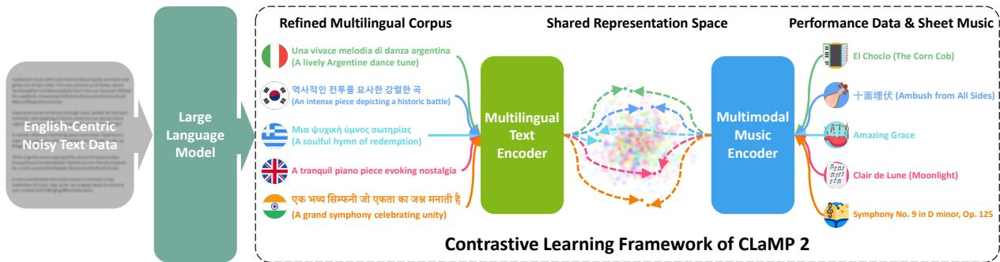  
Figure 1: CLaMP 2 is a cross-modal MIR model that uses contrastive learning to link multilingual text and multimodal music data. It employs GPT-4 to refine the multilingual corpus, reducing noise and achieving a more balanced language distribution. The refined text data is then encoded by a multilingual text encoder. Meanwhile, music data in both ABC notation (sheet music) and MIDI (performance data) formats is processed by a multimodal music encoder. Both encoders project data into a shared representation space to connect text and music.

## 3 CLaMP 2

In this section, we present the CLaMP 2 framework. We begin with an overview of contrastive learning for modality alignment, followed by discussions of the multilingual text and multimodal music encoders. Finally, we introduce the data sources used for pre-training and elaborate on how we leverage GPT-4 to enhance data quality.

## 3.1 Contrastive Learning

Contrastive learning (Sohn, 2016; van den Oord et al., 2018) is a powerful technique in various applications for aligning different modalities (Radford et al., 2021; Girdhar et al., 2023). It minimizes the distance between paired representations and maximizes that for unpaired ones. This effectively maps semantically related features (e.g., an image and its caption) close together in a shared representation space while separating unrelated ones.

As shown in Fig. 1, CLaMP 2 applies contrastive learning to ABC-MIDI-text triplets. The music encoder processes both ABC notation and MIDI data, while the text encoder handles the corresponding text inputs. During each training epoch, either ABC or MIDI data from each triplet is randomly selected for the music encoder, while the text encoder processes either the original metadata or the refined multilingual descriptions generated by GPT-4. Additionally, instrument information is removed from the music data 90% of the time, encouraging the model to focus on broader musical concepts rather than specific instrumentations. Both encoders project data into a shared representation space to learn the underlying connections between music and text. In this space, similar musical and textual concepts are clustered together, while dissimilar ones are kept apart.

## 3.2 Multilingual Text Encoder

CLaMP 2 uses XLM-R-base (Conneau et al., 2020), a multilingual text encoder based on RoBERTa (Liu et al., 2019). With 270 million parameters, it is pretrained on a 2.5TB cleaned CommonCrawl corpus that spans a wide range of languages, enabling it to capture diverse linguistic nuances.

During each training epoch, the input text for each triplet is randomly selected with the following probabilities: 50% for the raw text data, 25% for LLM-generated English descriptions, and 25% for LLM-generated non-English descriptions. This selection ensures a balanced exposure to both realworld and LLM-generated multilingual data. Additionally, we apply text dropout from the original CLaMP framework (Wu et al., 2023a) to the raw text data. It helps the model generalize better by reducing overfitting to specific input patterns.

For computational efficiency, we set the maximum text length to 128. Longer texts are truncated in one of three ways with equal probability: using the first, the last, or randomly selecting a segment of 128 tokens. This minimizes bias that could arise from relying on a single truncation method.

## 3.3 Multimodal Music Encoder

CLaMP 2’s multimodal music encoder supports multi-track music encoding in both ABC notation and MIDI. Although they can be mutually converted, they are different in nature. ABC notation (sheet music), a text-based sheet music representation like stave notation, is theory-oriented and ideal for presenting complex musical concepts to musicians for study and analysis. In contrast, MIDI (performance data) precisely encodes performance information related to timing and dynamics, thus suitable for music production and live performance.

The music encoder of CLaMP 2 is built on M3 (Wu et al., 2023a), a self-supervised model designed for feature extraction from sheet music based on bar patching. This method divides sheet music into bar-like segments, maintaining musical coherence while improving efficiency. M3 has an asymmetric encoder-decoder framework: the patch-level encoder extracts contextualized features from patches, while the char-level decoder then uses these features to autoregressively reconstruct each corresponding bar. During pre-training, 45% of patches are randomly selected and uniformly processed with corresponding probabilities: 80% masked, 10% shuffled, and 10% unchanged. M3 is optimized via cross-entropy loss to predict original patches from noisy input.

Compared to the previous M3 model, we made several important improvements to CLaMP 2’s multimodal music encoder. Notably, it now supports MIDI data. MIDI messages are first read losslessly from the original file using the mido library2 and then converted to the MIDI Text Format (MTF) proposed in this paper. As MTF is a text-based format, each message read from it can be treated as a patch for M3. It offers two main advantages: 1) seamless integration with the M3 framework, enabling the same training methods, and 2) lossless MIDI-to-MTF conversion, which preserves all information and avoids common quantization errors found in existing MIDI representations (Oore et al., 2020; Huang and Yang, 2020; Hsiao et al., 2021).

Another improvement is restructuring ABC notation into a voice-interleaved form. As previous research has verified (Qu et al., 2024), this can significantly reduce the difficulty of modeling multi-track ABC notation and is conducive to training. Importantly, our implementation of interleaved ABC notation adheres to syntax rules, ensuring compatibility with existing ABC notation tools.

The patch-level encoder is expanded to 12 layers to better capture complex musical features, while the char-level decoder remains at 3 layers, both with a hidden size of 768. Each patch can hold up to 64 characters, and with a maximum of 512 patches per input sequence, M3 can support a total input of 32,768 characters. Longer sequences are truncated by randomly selecting 512 patches from the start, middle, or end, with equal probability.

For details on interleaved ABC notation and MTF, please see Appendix A and B, respectively.

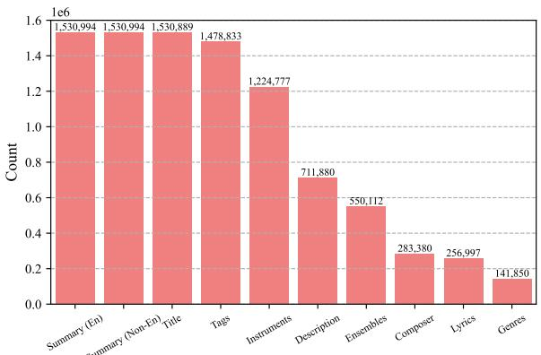  
Figure 2: The distribution of counts for different text types within the LLM-processed pre-training dataset.

## 3.4 Data Sources

The pre-training dataset for both M3 and CLaMP 2 comes from two sources: the Million MIDI Dataset (MMD) (Zeng et al., 2021) and the WebMusicText (WebMT) dataset (Wu et al., 2023a). They cover various music genres, such as popular and classical, from single- to multi-track compositions.

The MMD consists of over 1.5 million MIDI files, compiled by crawling a vast collection of music files and filtering out any malformed or blank entries. On the other hand, the WebMT dataset, comprising 1.4 million music-text pairs, includes formats like MusicXML, LilyPond, and ABC notation. These were standardized into ABC notation following an initial conversion to MusicXML. To prevent information leakage, natural language elements were removed from the ABC files.

To unify the datasets, we convert MMD to ABC, WebMT to MIDI, and merge them to get 3 million ABC-MIDI-text triplets. Admittedly, converting MMD to ABC may lead to the loss of performance details, and converting WebMT to MIDI may result in the loss of certain score-related information. Nevertheless, the key benefit is that it enriches data diversity, thus enhancing the model’s ability to generalize across different musical modalities.

However, variations in text quality pose significant challenges. A substantial amount of nonmusical content in the text data diminishes the effectiveness of pre-training by introducing noise that detracts from relevant musical information. Furthermore, as Fig. 3 shows, the dataset has an imbalanced language distribution (detected by the langid library3): English accounts for two-thirds of the data, while most languages contribute less than 1MB. This imbalance restricts the model’s ability to effectively link music with various languages.

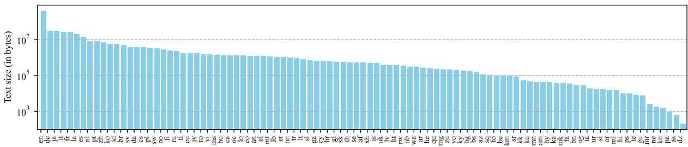  
Figure 3: The amount of data for 97 languages found in the original metadata, displayed in order of magnitude.

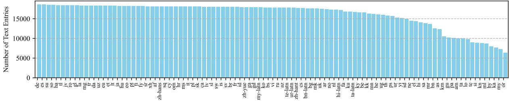  
Figure 4: Count of text entries for 100 non-English languages generated by GPT-4.

## 3.5 LLM-Based Metadata Processing

To improve text quality and mitigate imbalanced language distribution, we employed GPT-4 (OpenAI, 2023) to filter and enrich the text data. The prompt given to GPT-4 consisted of a system instruction along with two examples illustrating the desired outputs, which enhanced its understanding of our requirements. GPT-4 was tasked with identifying relevant music-related elements in each entry, and subsequently generating concise summaries in multiple languages based on these elements.

Entries were excluded for lacking specific musical details, containing vague comments like "this is a good song," or having no significant relation to the music. For valid entries, GPT-4 generated concise summaries in English and a randomly selected non-English language from the 100 languages tokenizable by XLM-R. However, some responses in low-resource languages did not conform to the expected format, resulting in fewer entries for these languages. Nevertheless, as shown in Fig. 4, GPT-4 significantly enhanced language balance, resulting in a total of 1.6 million ABC-MIDI-text triplets.

As our dataset is derived from two sources, duplicate entries may occur. To resolve this, we merged triplets with identical components, resulting in 1.5 million unique triplets—approximately 1.3 million from WebMT and 0.2 million from MMD.

GPT-4 cleaned the pre-training dataset and enriched it with multilingual descriptions in 101 languages. This significantly enhanced CLaMP 2’s multilingual MIR capabilities. Details on the prompt and text examples are in Appendix C.

## 4 Experiments

## 4.1 Settings

We evaluated the proposed models, M3 and CLaMP 2, on music classification and semantic search tasks. Training both models together on 8 NVIDIA H800 GPUs took approximately 800 hours. We split the data, allocating 99% for training and 1% for validation. The models were trained for up to 100 epochs. We adopted mixedprecision acceleration (Micikevicius et al., 2018) to enhance training efficiency. The AdamW optimizer (Loshchilov and Hutter, 2019) was utilized, along with a 1,000-step warm-up (Goyal et al., 2017).

For M3, the batch size was set to 128, and the learning rate was 1e-4. For CLaMP 2, initialized from M3’s patch-level encoder and XLM-R, the batch size was set to 1024, the learning rate was 5e-5, and the logit scale was set to 1.

The ablation study for M3 and CLaMP 2 included several variants. For M3, three configurations were examined to assess the impact of mixing musical modalities on performance: M3-ABC, trained only on ABC data; M3-MIDI, trained only on MIDI data; and full M3, trained on both. For CLaMP 2, five ablations were carried out to understand the contribution of different text data sources: CLaMP 2 (w/o en), excluding LLM-generated English data; CLaMP 2 (w/o nen), excluding LLMgenerated non-English data; CLaMP 2 (w/o meta), excluding the original raw text data; CLaMP 2 (w/o LLM), excluding all LLM-generated data; and the full CLaMP 2 setup, using all available text data.

Table 1: Classification performance for ABC notation and MIDI was assessed across three datasets: WikiMT (1,010 pieces, 8 genres), VGMIDI (204 pieces, 4 emotions), and Pianist8 (411 pieces, 8 composers). Underlined values indicate the top M3 model, while bold values denote the overall best performance among all models.
<table><tr><td rowspan="2">Model</td><td rowspan="2">Modality</td><td colspan="2">WikiMT</td><td colspan="2">VGMIDI</td><td colspan="2">Pianist8</td></tr><tr><td>F1-macro</td><td>Accuracy</td><td>F1-macro</td><td>Accuracy</td><td>F1-macro</td><td>Accuracy</td></tr><tr><td>M3-MIDI</td><td>MIDI</td><td>0.2586</td><td>0.4158</td><td>0.4700</td><td>0.5854</td><td>0.8683</td><td>0.8674</td></tr><tr><td>M3-ABC</td><td>ABC</td><td>0.2416</td><td>0.4010</td><td>0.4955</td><td>0.6098</td><td>0.7339</td><td>0.7470</td></tr><tr><td>M3</td><td>MIDI</td><td>0.2621</td><td>0.4257</td><td>0.5399</td><td>0.6098</td><td>0.9199</td><td>0.9157</td></tr><tr><td>M3</td><td>ABC</td><td>0.2349</td><td>0.4010</td><td>0.6016</td><td>0.6341</td><td>0.7395</td><td>0.7590</td></tr><tr><td>MusicBERT</td><td>MIDI</td><td>0.1746</td><td>0.3219</td><td>0.5127</td><td>0.5850</td><td>0.8379</td><td>0.8413</td></tr><tr><td>CLaMP</td><td>ABC</td><td>0.3452</td><td>0.4267</td><td>0.6453</td><td>0.6866</td><td>0.7067</td><td>0.7152</td></tr><tr><td>CLaMP 2</td><td>MIDI</td><td>0.2898</td><td>0.4455</td><td>0.5246</td><td>0.6585</td><td>0.8927</td><td>0.8916</td></tr><tr><td>CLaMP 2</td><td>ABC</td><td>0.3990</td><td>0.4653</td><td>0.7449</td><td>0.8049</td><td>0.8025</td><td>0.8072</td></tr></table>

## 4.2 Music Classification Across Modalities

This evaluation assesses the classification capabilities of various models across three datasets, each highlighting a specific aspect of music.

• WikiMT (Wu et al., 2023a): It contains 1,010 lead sheets in ABC notation from Wikifonia4, labeled with 8 genre classes according to the relevant Wikipedia entries.

• VGMIDI (Ferreira and Whitehead, 2019): It contains 204 MIDI scores from video game soundtracks, annotated with 4 emotion classes based on valence and arousal levels.

• Pianist8 (Chou et al., 2021): It includes 411 piano performances automatically transcribed from audio to performance MIDI (Kong et al., 2021) and labeled with 8 composer styles.

We evaluated our model against state-of-the-art baselines in symbolic music understanding.

• CLaMP (Wu et al., 2023a): A cross-modal MIR model designed to connect text and sheet music. It is pre-trained on WebMT using bar patching and masked music modeling.

• MusicBERT (Zeng et al., 2021): A selfsupervised MIR model for representation learning, pre-trained on MMD through OctupleMIDI encoding and bar-level masking.

In this evaluation, we utilized only the representations from the music encoder. Given that the text encoder was not involved, the multilingual capabilities were not investigated. As a result, CLaMP 2 under evaluation included all available text data.

Notably, we employed a linear classifier on the top layer of each model to assess the quality of musical representations. We evaluated each benchmark in both MIDI and ABC formats to analyze how the models utilize information from different musical modalities.

The results in Table 1 indicate that mixing musical modalities significantly benefits M3. When trained with both ABC and MIDI, M3 outperformed its single-modality counterparts on all benchmarks. This implies that training with ABC and MIDI together improves its feature extraction capability for both modalities.

Despite being pre-trained on only 0.2 million native MIDI pieces, M3 consistently outperformed MusicBERT in MIDI classification tasks. This performance advantage is attributed to our proposed MTF, which preserves all MIDI information during text conversion. In contrast, MusicBERT’s OctupleMIDI encoding suffers from information loss, which weakens its performance.

Once aligned with text data, CLaMP 2 generally outperforms M3 across benchmarks, though performance varies by modalities. In ABC notation, CLaMP 2 achieves top accuracies of 0.4653 and 0.8049 in WikiMT and VGMIDI, respectively, both of which emphasize score information. However, in Pianist8, which focuses on performance details, CLaMP 2 excels in MIDI with an accuracy of 0.8916, a significant improvement over the original CLaMP. Still, this falls slightly below M3’s 0.9157, likely due to limited performance MIDI data in the pre-training dataset. This shortage may have caused a slight decline after contrastive learning. Despite this, CLaMP 2 remains highly effective across musical modalities, showing its strong potential for music classification.

Table 2: The semantic search performance of CLaMP 2 across the WikiMT and MidiCaps benchmarks under diverse experimental settings. Both datasets contain texts exclusively in English.
<table><tr><td rowspan="2">Setting</td><td colspan="4">WikiMT(1,010 ABC-text pairs)</td><td colspan="4">MidiCaps (1,010 MIDI-text pairs)</td></tr><tr><td>MRR</td><td>HR@1</td><td>HR@10</td><td>HR@100</td><td>MRR</td><td>HR@1</td><td>HR@10</td><td>HR@100</td></tr><tr><td>CLaMP 2</td><td>0.3438</td><td>0.2705</td><td>0.4870</td><td>0.7956</td><td>0.2695</td><td>0.1653</td><td>0.4782</td><td>0.8634</td></tr><tr><td> $C L a M P \ : 2 \ : ( w / o \ : e n )$ </td><td>0.3234</td><td>0.2455</td><td>0.4800</td><td>0.7846</td><td>0.2708</td><td>0.1723</td><td>0.4752</td><td>0.8436</td></tr><tr><td>CLaMP 2 (w/o nen)</td><td>0.3359</td><td>0.2615</td><td>0.4880</td><td>0.7735</td><td>0.2490</td><td>0.1574</td><td>0.4158</td><td>0.8297</td></tr><tr><td>CLaMP 2 (w/o meta)</td><td>0.2856</td><td>0.2104</td><td>0.4218</td><td>0.7585</td><td>0.1940</td><td>0.1050</td><td>0.3713</td><td>0.7901</td></tr><tr><td>CLaMP 2 (w/o LLM)</td><td>0.2797</td><td>0.2094</td><td>0.4068</td><td>0.7375</td><td>0.2772</td><td>0.1762</td><td>0.4822</td><td>0.8614</td></tr><tr><td>CLaMP</td><td>0.2561</td><td>0.1931</td><td>0.3693</td><td>0.7020</td><td>0.1236</td><td>0.0666</td><td>0.2416</td><td>0.6412</td></tr></table>

## 4.3 Semantic Search on Native English Data

Benchmarks in symbolic MIR are relatively scarce. To the best of our knowledge, WikiMT (Wu et al., 2023a) and MidiCaps (Melechovský et al., 2024) are the only two publicly available music-text datasets for symbolic music. WikiMT pairs 1,010 ABC notation pieces with Wikipedia text, focusing on cultural and historical context. MidiCaps, built on the Lakh MIDI dataset (Raffel, 2016), includes 168,407 pairs with descriptions of musical features like tempo and chord progression. These datasets have different focuses: WikiMT emphasizes cultural-context understanding, while Midi-Caps targets musical feature analysis.

As the pre-training data includes the Lakh MIDI dataset (a subset of MMD), we took precautions to prevent data leakage. To this end, we randomly selected 1,010 pieces from the MidiCaps validation set to match the size of WikiMT, which contains only non-training data. CLaMP 2 uses the original formats for testing on these benchmarks. Because the original CLaMP does not support MIDI, we converted the MidiCaps data into ABC notation for its evaluation.

Table 2 shows semantic search results on the WikiMT and MidiCaps benchmarks, using Mean Reciprocal Rank (MRR) and Hit Rate at Top K (HR@K) to assess model performance in retrieving and ranking relevant music-text pairs.

In the WikiMT benchmark, a clear trend is observed: any CLaMP 2 variant using LLMgenerated text, whether in English or non-English, outperforms CLaMP 2 (w/o LLM). For example, CLaMP 2 achieves an MRR of 0.3438. However, when excluding LLM-generated text in CLaMP 2 (w/o LLM), the MRR drops significantly to 0.2797. This indicates that LLM-generated text greatly enhances the CLaMP 2’s ability to capture and convey cultural information.

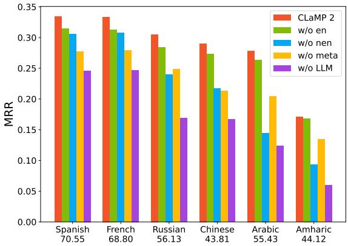  
(a) MRR scores on the WikiMT benchmark.

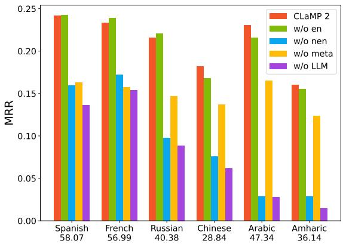  
(b) MRR scores on the MidiCaps benchmark.  
Figure 5: MRR scores across six non-English languages for (a) WikiMT and (b) MidiCaps benchmarks. BLEU scores below each language provide additional context on translation quality.

In the MidiCaps benchmark, CLaMP 2 achieves an MRR of 0.2695, demonstrating strong performance. Notably, all CLaMP 2 variants significantly outperform CLaMP. This improvement arises from their native support for MIDI data, enabling a better capture of performance details. In contrast to the WikiMT results, excluding LLM-generated text does not harm performance, as CLaMP 2 (w/o LLM) achieves the highest MRR of 0.2772. This suggests that LLM-generated text may not enhance the understanding of musical features.

## 4.4 Semantic Search Across Multilingual Data

To address the lack of multilingual music-text benchmarks, we translated English texts from WikiMT and MidiCaps into six languages: Spanish, French, Russian, Chinese, Arabic, and Amharic. Among these languages, Amharic is an extremely low-resource language with limited pre-training data—less than 1GB in XLM-R and only 17KB in CLaMP 2. We used SeamlessM4T (Meta, 2023b) for its broad translation support, allowing evaluation without native multilingual datasets. Given that translation quality directly affects retrieval effectiveness, we used BLEU scores5 to assess the similarity between back-translations and original texts, serving as an indicator of translation quality. This evaluation lacks baselines, as no comparable models support multilingual symbolic MIR.

CLaMP 2’s multilingual retrieval results are presented in Fig. 5. Generally, removing LLMgenerated English texts (w/o en) slightly impacts performance. Although in English, they improve overall text quality by reducing inconsistencies and irrelevancies, thereby enhancing multilingual retrieval performance. In contrast, excluding LLMgenerated non-English texts (w/o nen) notably hinders retrieval for all languages in both benchmarks, especially for low-resource languages like Amharic. Comparing CLaMP 2 (w/o en) with CLaMP 2 (w/o LLM) further confirms the important role of LLMgenerated non-English texts in enhancing multilingual retrieval performance.

Notably, CLaMP 2 (w/o LLM) records the lowest MRR across all languages in both benchmarks, indicating poor multilingual performance when relying solely on the original text data. However, excluding the original text data (w/o meta) results in a significant drop in performance. This indicates that CLaMP 2 can effectively extract authentic musical concepts from English-centric text data, enabling it to transcend language barriers and improve retrieval across different languages and cultures.

In conclusion, the evaluation of CLaMP 2 on WikiMT and MidiCaps reveals that LLM-generated texts, particularly non-English texts, significantly enhance multilingual semantic search. However, relying solely on them is insufficient, as the original data provides authentic details that LLM-generated data may lack. Together, they enable CLaMP 2 to perform better across languages by learning a more comprehensive representation of music semantics.

## 5 Conclusions

CLaMP 2 makes substantial progress in crossmodal MIR by integrating multilingual text and multimodal music data via contrastive learning. Leveraging GPT-4 to refine the multilingual corpus, it overcomes the limitations of existing models that are exclusively trained on English music-text datasets. This facilitates more precise alignment between music and text across 101 languages.

Experimental results demonstrate that CLaMP 2 achieves state-of-the-art performance across a variety of MIR tasks. In music classification tasks, the M3 model, trained on both ABC and MIDI data, demonstrates improved performance and consistently outperforms counterparts trained on a single modality. Building on M3, CLaMP 2 achieves superior performance across diverse benchmarks and modalities. Notably, the incorporation of LLMgenerated text data significantly enhances multilingual semantic search. This enhancement is achieved by reducing textual noise and balancing language distribution, which is particularly beneficial for low-resource languages.

CLaMP 2 establishes a new multilingual MIR standard, enabling users worldwide to access a diverse array of musical content across 101 languages. Future developments may build on CLaMP 2 to connect with audio and visual modalities, facilitating a more comprehensive and culturally rich experience at a global scale.

## 6 Excluded Approaches

In CLaMP 2, several experimental strategies were tested, yet failed to achieve expected improvements and were thus excluded from the final model. It should be noted that these failed attempts are derived from our practice and may not be generalized.

The integration of discretized audio tokens (Dé- fossez et al., 2023) failed to match previous audio models’ performance and was removed. Inspired by MidiCaps (Melechovský et al., 2024) and MuseCoco (Lu et al., 2023), we attempted to include musical attributes in the text data. However, this inclusion negatively impacted performance. Additionally, extending the patch masking pre-training strategy to contrastive learning did not enhance the robustness of CLaMP 2. L2 normalization caused convergence problems and was also excluded. Lastly, a learnable logit scale led to over-scaling and degraded representations, so a fixed logit scale of 1 was used for better stability.

## 7 Limitations

Although CLaMP 2 has made progress, it still has certain limitations.

In CLaMP 2, the contrastive learning framework primarily extracts global semantic features, resulting in a loss of fine-grained temporal information. Consequently, tasks that rely on sequential or timerelated details cannot be effectively executed.

In addition, the absence of multilingual musictext benchmarks complicates the evaluation of CLaMP 2’s performance in non-English languages. To address this, an existing machine translation model (Meta, 2023b) was used to translate English benchmarks into other languages. However, machine translation presents its own challenges. For instance, the BLEU score for MidiCaps translations in Chinese is only 28.84, indicating poor translation quality and significantly hindering retrieval performance. Notably, Arabic—despite having far less training data than Chinese in both XLM-R and CLaMP 2—achieves a higher MRR, with a BLEU score of 47.34. This suggests that translation quality has a significant impact on retrieval performance, outweighing the influence of training data size. Without native, high-quality benchmarks for non-English languages, it remains unclear how well CLaMP 2 will perform in real-world multilingual retrieval tasks.

## Core Contributors

Shangda Wu1, shangda@mail.ccom.edu.cnYashan Wang1, alexis_wang@mail.ccom.edu.cnRuibin Yuan2, ryuanab@connect.ust.hk

## Contributors

Zhancheng Guo1   
Xu Tan3   
Ge Zhang2   
Monan Zhou1   
Jing Chen4   
Xuefeng Mu4   
Yuejie Gao4   
Yuanliang Dong1   
Jiafeng Liu1   
Xiaobing Li1   
Feng Yu1

Correspondence

Maosong Sun1, sms@tsinghua.edu.cn

## Affiliations

1Central Conservatory of Music, China

2Multimodal Art Projection Research Community

3Microsoft Research Asia

4NetEase Cloud Music, China

## Acknowlegdements

This work was supported by the following funding sources: Special Program of National Natural Science Foundation of China (Grant No. T2341003), Advanced Discipline Construction Project of Beijing Universities, Major Program of National Social Science Fund of China (Grant No. 21ZD19), and the National Culture and Tourism Technological Innovation Engineering Project (Research and Application of 3D Music).

In addition, we would like to express our gratitude for the use of icons from flaticon6 in Fig. 1 and Fig. 8.

## References

Andrea Agostinelli, Timo I. Denk, Zalán Borsos, Jesse H. Engel, Mauro Verzetti, Antoine Caillon, Qingqing Huang, Aren Jansen, Adam Roberts, Marco Tagliasacchi, Matthew Sharifi, Neil Zeghidour, and Christian Havnø Frank. 2023. Musiclm: Generating music from text. CoRR, abs/2301.11325.

Alibaba. 2024. Qwen2 technical report. CoRR, abs/2407.10671.

Anthropic. 2024. The claude 3 model family: Opus, sonnet, haiku. Preprint.

Yi-Hui Chou, I-Chun Chen, Chin-Jui Chang, Joann Ching, and Yi-Hsuan Yang. 2021. Midibert-piano: Large-scale pre-training for symbolic music understanding. CoRR, abs/2107.05223.

Alexis Conneau, Kartikay Khandelwal, Naman Goyal, Vishrav Chaudhary, Guillaume Wenzek, Francisco Guzmán, Edouard Grave, Myle Ott, Luke Zettlemoyer, and Veselin Stoyanov. 2020. Unsupervised cross-lingual representation learning at scale. In Proceedings of the 58th Annual Meeting of the Association for Computational Linguistics, ACL 2020, Online, July 5-10, 2020, pages 8440–8451. Association for Computational Linguistics.

Alexandre Défossez, Jade Copet, Gabriel Synnaeve, and Yossi Adi. 2023. High fidelity neural audio compression. Trans. Mach. Learn. Res., 2023.

Jacob Devlin, Ming-Wei Chang, Kenton Lee, and Kristina Toutanova. 2019. BERT: pre-training of

deep bidirectional transformers for language understanding. In Proceedings of the 2019 Conference of the North American Chapter of the Association for Computational Linguistics: Human Language Technologies, NAACL-HLT 2019, Minneapolis, MN, USA, June 2-7, 2019, Volume 1 (Long and Short Papers), pages 4171–4186. Association for Computational Linguistics.

Seungheon Doh, Keunwoo Choi, Jongpil Lee, and Juhan Nam. 2023a. Lp-musiccaps: Llm-based pseudo music captioning. In Proceedings of the 24th International Society for Music Information Retrieval Conference, ISMIR 2023, Milan, Italy, November 5-9, 2023, pages 409–416.

Seungheon Doh, Minhee Lee, Dasaem Jeong, and Juhan Nam. 2024. Enriching music descriptions with A finetuned-llm and metadata for text-to-music retrieval. In IEEE International Conference on Acoustics, Speech and Signal Processing, ICASSP 2024, Seoul, Republic of Korea, April 14-19, 2024, pages 826–830. IEEE.

Seungheon Doh, Minz Won, Keunwoo Choi, and Juhan Nam. 2023b. Toward universal text-to-music retrieval. In IEEE International Conference on Acoustics, Speech and Signal Processing ICASSP 2023, Rhodes Island, Greece, June 4-10, 2023, pages 1–5. IEEE.

Benjamin Elizalde, Soham Deshmukh, Mahmoud Al Ismail, and Huaming Wang. 2023. CLAP learning audio concepts from natural language supervision. In IEEE International Conference on Acoustics, Speech and Signal Processing ICASSP 2023, Rhodes Island, Greece, June 4-10, 2023, pages 1–5. IEEE.

Angela Fan, Shruti Bhosale, Holger Schwenk, Zhiyi Ma, Ahmed El-Kishky, Siddharth Goyal, Mandeep Baines, Onur Celebi, Guillaume Wenzek, Vishrav Chaudhary, Naman Goyal, Tom Birch, Vitaliy Liptchinsky, Sergey Edunov, Michael Auli, and Armand Joulin. 2021. Beyond english-centric multilingual machine translation. J. Mach. Learn. Res., 22:107:1–107:48.

Lucas Ferreira and Jim Whitehead. 2019. Learning to generate music with sentiment. In Proceedings of the 20th International Society for Music Information Retrieval Conference, ISMIR 2019, Delft, The Netherlands, November 4-8, 2019, pages 384–390.

Rohit Girdhar, Alaaeldin El-Nouby, Zhuang Liu, Mannat Singh, Kalyan Vasudev Alwala, Armand Joulin, and Ishan Misra. 2023. Imagebind one embedding space to bind them all. In IEEE/CVF Conference on Computer Vision and Pattern Recognition, CVPR 2023, Vancouver, BC, Canada, June 17-24, 2023, pages 15180–15190. IEEE.

Google. 2024. Gemini 1.5: Unlocking multimodal understanding across millions of tokens of context. CoRR, abs/2403.05530.

Priya Goyal, Piotr Dollár, Ross B. Girshick, Pieter Noordhuis, Lukasz Wesolowski, Aapo Kyrola, Andrew Tulloch, Yangqing Jia, and Kaiming He. 2017. Accurate, large minibatch SGD: training imagenet in 1 hour. CoRR, abs/1706.02677.

Wen-Yi Hsiao, Jen-Yu Liu, Yin-Cheng Yeh, and Yi-Hsuan Yang. 2021. Compound word transformer: Learning to compose full-song music over dynamic directed hypergraphs. In Thirty-Fifth AAAI Conference on Artificial Intelligence, AAAI 2021, Thirty-Third Conference on Innovative Applications of Artificial Intelligence, IAAI 2021, The Eleventh Symposium on Educational Advances in Artificial Intelligence, EAAI 2021, Virtual Event, February 2-9, 2021, pages 178–186. AAAI Press.

Qingqing Huang, Aren Jansen, Joonseok Lee, Ravi Ganti, Judith Yue Li, and Daniel P. W. Ellis. 2022. Mulan: A joint embedding of music audio and natural language. In Proceedings of the 23rd International Society for Music Information Retrieval Conference, ISMIR 2022, Bengaluru, India, December 4-8, 2022, pages 559–566.

Qingqing Huang, Daniel S. Park, Tao Wang, Timo I. Denk, Andy Ly, Nanxin Chen, Zhengdong Zhang, Zhishuai Zhang, Jiahui Yu, Christian Havnø Frank, Jesse H. Engel, Quoc V. Le, William Chan, and Wei Han. 2023. Noise2music: Text-conditioned music generation with diffusion models. CoRR, abs/2302.03917.

Yu-Siang Huang and Yi-Hsuan Yang. 2020. Pop music transformer: Beat-based modeling and generation of expressive pop piano compositions. In MM ’20: The 28th ACM International Conference on Multimedia, Virtual Event / Seattle, WA, USA, October 12-16, 2020, pages 1180–1188. ACM.

Armand Joulin, Edouard Grave, Piotr Bojanowski, and Tomás Mikolov. 2017. Bag of tricks for efficient text classification. In Proceedings of the 15th Conference of the European Chapter of the Association for Computational Linguistics, EACL 2017, Valencia, Spain, April 3-7, 2017, Volume 2: Short Papers, pages 427– 431. Association for Computational Linguistics.

Qiuqiang Kong, Bochen Li, Xuchen Song, Yuan Wan, and Yuxuan Wang. 2021. High-resolution piano transcription with pedals by regressing onset and offset times. IEEE ACM Trans. Audio Speech Lang. Process., 29:3707–3717.

Luca A. Lanzendörfer, Florian Grötschla, Emil Funke, and Roger Wattenhofer. 2023. DISCO-10M: A largescale music dataset. In Advances in Neural Information Processing Systems 36: Annual Conference on Neural Information Processing Systems 2023, NeurIPS 2023, New Orleans, LA, USA, December 10 - 16, 2023.

Mike Lewis, Yinhan Liu, Naman Goyal, Marjan Ghazvininejad, Abdelrahman Mohamed, Omer Levy, Veselin Stoyanov, and Luke Zettlemoyer. 2020.

BART: denoising sequence-to-sequence pre-training for natural language generation, translation, and comprehension. In Proceedings of the 58th Annual Meeting of the Association for Computational Linguistics, ACL 2020, Online, July 5-10, 2020, pages 7871–7880. Association for Computational Linguistics.

Yinhan Liu, Jiatao Gu, Naman Goyal, Xian Li, Sergey Edunov, Marjan Ghazvininejad, Mike Lewis, and Luke Zettlemoyer. 2020. Multilingual denoising pretraining for neural machine translation. Trans. Assoc. Comput. Linguistics, 8:726–742.

Yinhan Liu, Myle Ott, Naman Goyal, Jingfei Du, Mandar Joshi, Danqi Chen, Omer Levy, Mike Lewis, Luke Zettlemoyer, and Veselin Stoyanov. 2019. Roberta: A robustly optimized BERT pretraining approach. CoRR, abs/1907.11692.

Ilya Loshchilov and Frank Hutter. 2019. Decoupled weight decay regularization. In 7th International Conference on Learning Representations, ICLR 2019, New Orleans, LA, USA, May 6-9, 2019. OpenReview.net.

Peiling Lu, Xin Xu, Chenfei Kang, Botao Yu, Chengyi Xing, Xu Tan, and Jiang Bian. 2023. Musecoco: Generating symbolic music from text. CoRR, abs/2306.00110.

Ilaria Manco, Benno Weck, Seungheon Doh, Minz Won, Yixiao Zhang, Dmitry Bogdanov, Yusong Wu, Ke Chen, Philip Tovstogan, Emmanouil Benetos, Elio Quinton, György Fazekas, and Juhan Nam. 2023. The song describer dataset: a corpus of audio captions for music-and-language evaluation. In Machine Learning for Audio Workshop at NeurIPS 2023.

Jan Melechovský, Abhinaba Roy, and Dorien Herremans. 2024. Midicaps - A large-scale MIDI dataset with text captions. CoRR, abs/2406.02255.

Meta. 2023a. Llama 2: Open foundation and fine-tuned chat models. CoRR, abs/2307.09288.

Meta. 2023b. Seamlessm4t-massively multilingual & multimodal machine translation. CoRR, abs/2308.11596.

Meta. 2024. The llama 3 herd of models. Preprint, arXiv:2407.21783.

Paulius Micikevicius, Sharan Narang, Jonah Alben, Gregory F. Diamos, Erich Elsen, David García, Boris Ginsburg, Michael Houston, Oleksii Kuchaiev, Ganesh Venkatesh, and Hao Wu. 2018. Mixed precision training. In 6th International Conference on Learning Representations, ICLR 2018, Vancouver, BC, Canada, April 30 - May 3, 2018, Conference Track Proceedings. OpenReview.net.

Mistral. 2024. Mixtral of experts. CoRR, abs/2401.04088.

Sageev Oore, Ian Simon, Sander Dieleman, Douglas Eck, and Karen Simonyan. 2020. This time with feeling: learning expressive musical performance. Neural Comput. Appl., 32(4):955–967.

OpenAI. 2023. GPT-4 technical report. CoRR, abs/2303.08774.

Long Ouyang, Jeffrey Wu, Xu Jiang, Diogo Almeida, Carroll L. Wainwright, Pamela Mishkin, Chong Zhang, Sandhini Agarwal, Katarina Slama, Alex Ray, John Schulman, Jacob Hilton, Fraser Kelton, Luke Miller, Maddie Simens, Amanda Askell, Peter Welinder, Paul F. Christiano, Jan Leike, and Ryan Lowe. 2022. Training language models to follow instructions with human feedback. In Advances in Neural Information Processing Systems 35: Annual Conference on Neural Information Processing Systems 2022, NeurIPS 2022, New Orleans, LA, USA, November 28 - December 9, 2022.

Xingwei Qu, Yuelin Bai, Yinghao Ma, Ziya Zhou, Ka Man Lo, Jiaheng Liu, Ruibin Yuan, Lejun Min, Xueling Liu, Tianyu Zhang, Xinrun Du, Shuyue Guo, Yiming Liang, Yizhi Li, Shangda Wu, Junting Zhou, Tianyu Zheng, Ziyang Ma, Fengze Han, Wei Xue, Gus Xia, Emmanouil Benetos, Xiang Yue, Chenghua Lin, Xu Tan, Stephen W. Huang, Wenhu Chen, Jie Fu, and Ge Zhang. 2024. Mupt: A generative symbolic music pretrained transformer. CoRR, abs/2404.06393.

Alec Radford, Jong Wook Kim, Chris Hallacy, Aditya Ramesh, Gabriel Goh, Sandhini Agarwal, Girish Sastry, Amanda Askell, Pamela Mishkin, Jack Clark, Gretchen Krueger, and Ilya Sutskever. 2021. Learning transferable visual models from natural language supervision. In Proceedings of the 38th International Conference on Machine Learning, ICML 2021, 18-24 July 2021, Virtual Event, volume 139 of Proceedings of Machine Learning Research, pages 8748–8763. PMLR.

Colin Raffel. 2016. Learning-Based Methods for Comparing Sequences, with Applications to Audioto-MIDI Alignment and Matching. Ph.D. thesis, Columbia University, USA.

Colin Raffel, Noam Shazeer, Adam Roberts, Katherine Lee, Sharan Narang, Michael Matena, Yanqi Zhou, Wei Li, and Peter J. Liu. 2020. Exploring the limits of transfer learning with a unified text-to-text transformer. J. Mach. Learn. Res., 21:140:1–140:67.

Kihyuk Sohn. 2016. Improved deep metric learning with multi-class n-pair loss objective. In Advances in Neural Information Processing Systems 29: Annual Conference on Neural Information Processing Systems 2016, December 5-10, 2016, Barcelona, Spain, pages 1849–1857.

Aäron van den Oord, Yazhe Li, and Oriol Vinyals. 2018. Representation learning with contrastive predictive coding. CoRR, abs/1807.03748.

Ashish Vaswani, Noam Shazeer, Niki Parmar, Jakob Uszkoreit, Llion Jones, Aidan N. Gomez, Lukasz Kaiser, and Illia Polosukhin. 2017. Attention is all you need. In Advances in Neural Information Processing Systems 30: Annual Conference on Neural Information Processing Systems 2017, December 4-9, 2017, Long Beach, CA, USA, pages 5998–6008.

Shangda Wu, Dingyao Yu, Xu Tan, and Maosong Sun. 2023a. Clamp: Contrastive language-music pretraining for cross-modal symbolic music information retrieval. In Proceedings of the 24th International Society for Music Information Retrieval Conference, ISMIR 2023, Milan, Italy, November 5-9, 2023, pages 157–165.

Yusong Wu, Ke Chen, Tianyu Zhang, Yuchen Hui, Taylor Berg-Kirkpatrick, and Shlomo Dubnov. 2023b. Large-scale contrastive language-audio pretraining with feature fusion and keyword-to-caption augmentation. In IEEE International Conference on Acoustics, Speech and Signal Processing ICASSP 2023, Rhodes Island, Greece, June 4-10, 2023, pages 1–5. IEEE.

Linting Xue, Noah Constant, Adam Roberts, Mihir Kale, Rami Al-Rfou, Aditya Siddhant, Aditya Barua, and Colin Raffel. 2021. mt5: A massively multilingual pre-trained text-to-text transformer. In Proceedings of the 2021 Conference of the North American Chapter of the Association for Computational Linguistics: Human Language Technologies, NAACL-HLT 2021, Online, June 6-11, 2021, pages 483–498. Association for Computational Linguistics.

Mingliang Zeng, Xu Tan, Rui Wang, Zeqian Ju, Tao Qin, and Tie-Yan Liu. 2021. Musicbert: Symbolic music understanding with large-scale pre-training. In Findings of the Association for Computational Linguistics: ACL/IJCNLP 2021, Online Event, August 1-6, 2021, volume ACL/IJCNLP 2021 of Findings of ACL, pages 791–800. Association for Computational Linguistics.

Zhipu. 2024. Chatglm: A family of large language models from GLM-130B to GLM-4 all tools. CoRR, abs/2406.12793.

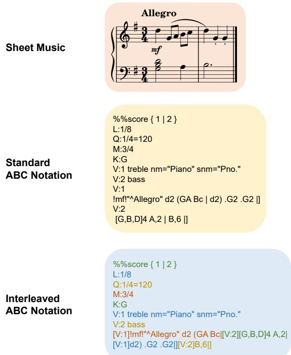  
Figure 6: Comparison between standard and interleaved ABC notation in multi-track piano sheet music. Interleaved ABC notation merges voices and tags them in-line for a compact and synchronized representation. Colors mark patch boundaries for M3 model encoding.

## A Interleaved ABC Notation

Standard ABC notation encodes each voice separately, which often results in corresponding bars being spaced far apart. This separation makes it difficult for models to accurately understand the interactions between voices in sheet music that are meant to align musically.

In contrast, interleaved ABC notation effectively aligns multi-track music by integrating multiple voices of the same bar into a single line, ensuring that all parts remain synchronized. As illustrated in Fig. 6, this format combines voices in-line and tags each bar with its corresponding voice (e.g., [V:1] for treble and [V:2] for bass). By directly aligning related bars, interleaved ABC notation enhances the model’s understanding of how different voices interact within the same bar.

To facilitate this reformatting process, we developed a script for reversible and lossless conversion between standard and interleaved notations, ensuring accuracy without any loss of information. This simplification of multi-track music modeling maintains compatibility with standard ABC syntax, allowing for effective processing in existing tools.

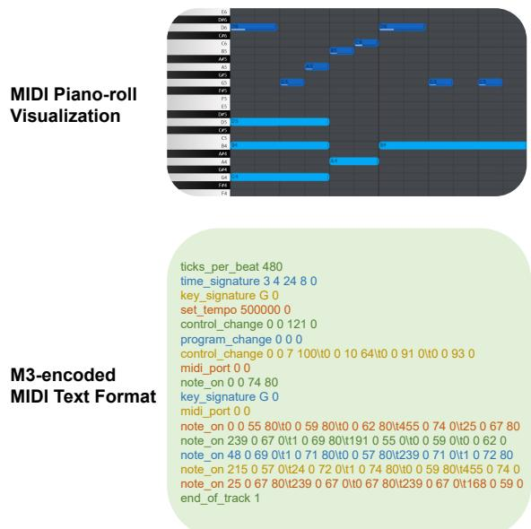  
Figure 7: Illustration of MIDI Text Format (MTF) encoded by M3. In this format, MIDI messages are treated as patches for processing. Consecutive messages of the same type are merged within a patch, with colors indicating the boundaries between patches.

## B MIDI Text Format

The MIDI Text Format (MTF) provides a structured, textual representation of MIDI data that preserves all original information without loss. Each MIDI message is accurately represented, allowing full reconstruction from MTF to ensure no musical nuances are overlooked during conversion.

To generate MTF, the mido library reads raw MIDI messages from MIDI files. As shown in Table 3, the output retains all necessary information but can be lengthy and redundant. To simplify this, we streamline the representation by directly reading parameter values in a fixed order and separating them with spaces. For instance, the raw time signature message, which includes multiple parameters—numerator, denominator, clocks per click, notated 32nd notes per beat, and time—is represented in MTF as time_signature 3 4 24 8 0, as illustrated in Table 4. Other messages, including control changes and note events, are similarly compacted while preserving key musical details.

This approach improves computational performance and maintains precise control of timing and dynamics. Furthermore, when processed by M3, consecutive messages of the same type that fit within a single patch (under 64 characters) are combined into one line, with only the first message containing the type information. This further simplifies representation and improves processing efficiency, as shown in Fig. 7.

Table 3: Raw MIDI messages extracted from a MIDI file using the mido library.  
MetaMessage ( ’ time_signature ’ , attribute ofMIDIobjects in   
numerator =3 , message at the beginning of the MTF representation. message at the beginning 0   
denominator =4 ,   
clocks_per_click =24 ,   
notated_32nd_notes_per_beat =8 , ticks_per_beat 480   
time =0) time_signature 3 4 24 8 0   
MetaMessage ( ’ key_signature ’ , key = ’G ’ , time =0) key_signature G 0   
MetaMessage ( ’ set_tempo ’ , tempo =500000 , time =0) set_tempo 500000 0   
control_change channel =0 control =121 value =0 time =0 control_change 0 0 121 0   
program_change channel =0 program =0 time =0 program_change 0 0 0   
control_change channel =0 control =7 value =100 time =0 control_change 0 0 7 100   
control_change channel =0 control =10 value =64 time =0 control_change 0 0 10 64   
control_change channel =0 control =91 value =0 time =0 control_change 0 0 91 0   
control_change channel =0 control =93 value =0 time =0 control_change 0 0 93 0   
MetaMessage ( ’ midi_port ’ , port =0 , time =0) midi_port 0 0   
note_on channel =0 note =74 velocity =80 time =0 note_on 0 0 74 80   
MetaMessage ( ’ key_signature ’ , key = ’G ’ , time =0) key_signature G 0   
MetaMessage ( ’ midi_port ’ , port =0 , time =0) midi_port 0 0   
note_on channel =0 note =55 velocity =80 time =0 note_on 0 0 55 80   
note_on channel =0 note =59 velocity =80 time =0 note_on 0 0 59 80   
note_on channel =0 note =62 velocity =80 time =0 note_on 0 0 62 80   
note_on channel =0 note =74 velocity =0 time =455 note_on 455 0 74 0   
note_on channel =0 note =67 velocity =80 time =25 note_on 25 0 67 80   
note_on channel =0 note =67 velocity =0 time =239 note_on 239 0 67 0   
note_on channel =0 note =69 velocity =80 time =1 note_on 1 0 69 80   
note_on channel =0 note =55 velocity =0 time =191 note_on 191 0 55 0   
note_on channel =0 note =59 velocity =0 time =0 note_on 0 0 59 0   
note_on channel =0 note =62 velocity =0 time =0 note_on 0 0 62 0   
note_on channel =0 note =69 velocity =0 time =48 note_on 48 0 69 0   
note_on channel =0 note =71 velocity =80 time =1 note_on 1 0 71 80   
note_on channel =0 note =57 velocity =80 time =0 note_on 0 0 57 80   
note_on channel =0 note =71 velocity =0 time =239 note_on 239 0 71 0   
note_on channel =0 note =72 velocity =80 time =1 note_on 1 0 72 80   
note_on channel =0 note =57 velocity =0 time =215 note_on 215 0 57 0   
note_on channel =0 note =72 velocity =0 time =24 note_on 2 4 0 7 2 0   
note_on channel =0 note =74 velocity =80 time =1 note_on 1 0 74 80   
note_on channel =0 note =59 velocity =80 time =0 note_on 0 0 59 80   
note_on channel =0 note =74 velocity =0 time =455 note_on 455 0 74 0   
note_on channel =0 note =67 velocity =80 time =25 note_on 25 0 67 80   
note_on channel =0 note =67 velocity =0 time =239 note_on 239 0 67 0   
note_on channel =0 note =67 velocity =80 time =241 note_on 241 0 67 80   
note_on channel =0 note =67 velocity =0 time =239 note_on 239 0 67 0   
note_on channel =0 note =59 velocity =0 time =168 note_on 168 0 59 0   
MetaMessage ( ’ end_of_track ’ , time =1) end_of_track 1  
Table 4: MTF offers a streamlined textual representation of MIDI messages extracted using the mido library. For simplicity, ticks_per_beat, though originally an attribute of MIDI objects in mido, is included as the first

## C Prompt and Text Examples

To reduce textual noise and balance language distribution in pre-training data, we carefully designed a structured prompt to leverage the capabilities of GPT-4. As illustrated in Fig. 8, the prompt comprises a system instruction and two conversational examples between a user and the assistant. These examples act as in-context learning references, helping GPT-4 understand the desired output format and the types of information it should extract from the provided metadata.

After formulating the prompt, we organized the metadata entries in our pre-training dataset into a structured JSON format. For each entry, GPT-4 generated corresponding summaries in both English and a randomly selected non-English language from the 99 non-English languages supported by XLM-R (Conneau et al., 2020), in addition to Cantonese. Including Cantonese, which is well-represented in the dataset and sharing vocabulary with Mandarin, enables CLaMP 2 to support 101 languages without increasing vocabulary size.

To ensure high-quality outputs, both the English and non-English summaries must strictly adhere to the specified JSON format. We implemented filtering criteria to exclude entries that do not meet these requirements, including those returning None, lacking proper JSON structure, or containing non-English summaries in the wrong language. Inconsistencies and structural errors are more prevalent in low-resource languages, as shown in Fig. 4.

To illustrate the effectiveness of this approach, Fig. 9 provides examples that demonstrate GPT-4’s ability to generate summaries for different musical compositions. Each example adheres to a structured format, including key metadata—such as the title, composer, genres, description, lyrics, and ensemble information—followed by generated summaries in English and a specified non-English language.

In conclusion, our approach effectively uses GPT-4 to generate structured summaries from noisy, English-centric metadata, reducing textual noise and achieving a more balanced distribution of various languages. By applying filtering criteria, we first remove entries that lack musical information, followed by those that are poorly structured or mismatched with the specified non-English language. This method enhances the quality of our pre-training dataset and promotes a multilingual environment to better serve diverse languages.

## System

Your task is to provide a concise, comprehensive, and coherent summary of the music piece using the provided metadata. Please write the summary in English first, and then write an equivalent summary in the specified non-English language from the "nen_language" field. Use this JSON format: {

"summary_en": "Your English summary here.", "summary_nen": {

“language”: “Specified non-English language.",

"summary": "Your non-English summary here."

If there is not enough music-related information, return \`None\` instead.

"title": "Brejeiro", "composer": "Ernesto Nazareth", "genres": ["Choro", "Classical", "Instrumental"], "genres": ["Choro","Classical","Instrumental"], "description": "\"Brejeiro\" is in A major and 2/4 time. A joyful melody begins at bar six, and a lively tango rhythm starts at bar fourteen. It has a D.C. al Fine at bar fiftythree and ends on two quarter notes in bar thirty-seven. The piece, with its vibrant melodies and rhythms, reflects celebration and carefreeness, embodying the spirit of Brazilian music.",

"tags": ["Brazilian", "Choro", "Piano"],

"ensembles": ["Solo Piano", "Small Ensemble"],

"instruments": ["Piano"],

"nen_language": "Japanese"

"summary_en": "Brejeiro, composed by Ernesto Nazareth, is a lively choro piece in A major and 2/4 time. It features a joyful melody that begins at bar six and a vibrant tango rhythm introduced at bar fourteen. The piece includes a D.C. al Fine at bar fifty-three, concluding on two quarter notes in bar thirty-seven. With its themes of celebration and carefreeness, Brejeiro beautifully captures the essence of Brazilian music and is well-suited for solo piano and small ensembles.",

"summary_nen": {

"language": "Japanese",

"summary": "「ブレジェイロ」は、エルネスト・ナザレが作曲した活気あふれるショーロの作品で、イ長調の2/4拍子で書かれています。第6小節から始まる喜びに満ちたメロディーと、第14小節で導入される活気あるタンゴのリズムが特徴です。この曲には、第53小節でのD.C. al Fineが含まれ、また第37小節で二つの四分音符で締めくくられています。「ブレジェイロ」は、お祝いと無邪気さのテーマを持ち、ブラジル音楽の本質を美しく捉えており、ソロピアノや小編成のアンサンブルにぴったりの作品です。"

"title": "Untitled", "composer": "Unknown", "description": "This is a good song.", "nen_language": "Russian"

  
Figure 8: GPT-4 is tasked with generating summaries in English and a selected non-English language. The prompt includes a system instruction and two examples: one shows how to process music metadata—like title, composer, and genre—into clear multilingual summaries, while the other identifies entries lacking sufficient musical information.

"title": "Hard Times Come Again No More",

"composer": "Stephen Foster",

"genres": ["Children's Music", "Folk"],

"description": "\"Hard Times Come Again No More\" (sometimes referred to as \"Hard Times\") is an American parlor song written by Stephen Foster, reflecting themes of sorrow and hope.",

"lyrics": "Let us pause in life's pleasures and count its many tears,\nWhile we all sup sorrow with the poor;\nThere's a song that will linger forever in our ears;\nOh! Hard times come again no more.\n\nChorus:\n'Tis the song, the sigh of the weary,\nHard Times, hard times, come again no more.\nMany days you have lingered around my cabin door;\nOh! Hard times come again no more.\n\nWhile we seek mirth and beauty and music light and gay,\nThere are frail forms fainting at the door;\nThough their voices are silent, their pleading looks will say\nOh! Hard times come again no more.\nChorus\n\nThere's a pale weeping maiden who toils her life away,\nWith a worn heart whose better days are o'er:\nThough her voice would be merry, 'tis sighing all the day,\nOh! Hard times come again no more.\nChorus\n\n'Tis a sigh that is wafted across the troubled wave,\n'Tis a wail that is heard upon the shore\n'Tis a dirge that is murmured around the lowly grave\nOh! Hard times come again no more.\nChorus",

"tags": ["folk", "traditional", "bluegrass", "nostalgic", "heartfelt", "acoustic", "melancholic", "storytelling", "American roots", "resilience"],

"ensembles": ["Folk Ensemble"],

"instruments": ["Vocal", "Violin", "Tin whistle", "Guitar", "Banjo", "Tambourine"],

"summary_en": "\"Hard Times Come Again No More,\" composed by Stephen Foster, is a poignant American parlor song that explores themes of sorrow and hope. The lyrics reflect on the contrast between life's pleasures and its hardships, inviting listeners to acknowledge both joy and suffering. With a heartfelt chorus that repeats the line \"Hard times come again no more,\" the song resonates with nostalgia and resilience. It is often performed by folk ensembles and features a variety of instruments, including vocals, violin, guitar, and banjo, encapsulating the spirit of American roots music.",

"language": "Chinese (Simplified)",

"summary": "《艰难时光再无来临》是斯蒂芬·福斯特创作的一首感人至深的美国小歌厅歌曲，探讨了悲伤与希望的主题。歌词展现了生活的乐趣与艰辛之间的对比，邀请听众去感受快乐与痛苦的交织。歌曲中那句反复吟唱的“艰难时光再无来临”深情地表达了怀旧与坚韧。它常常由民谣乐队演奏，伴随着人声、小提琴、吉他和班卓琴等多种乐器，生动地展现了美国根源音乐的独特魅力。"

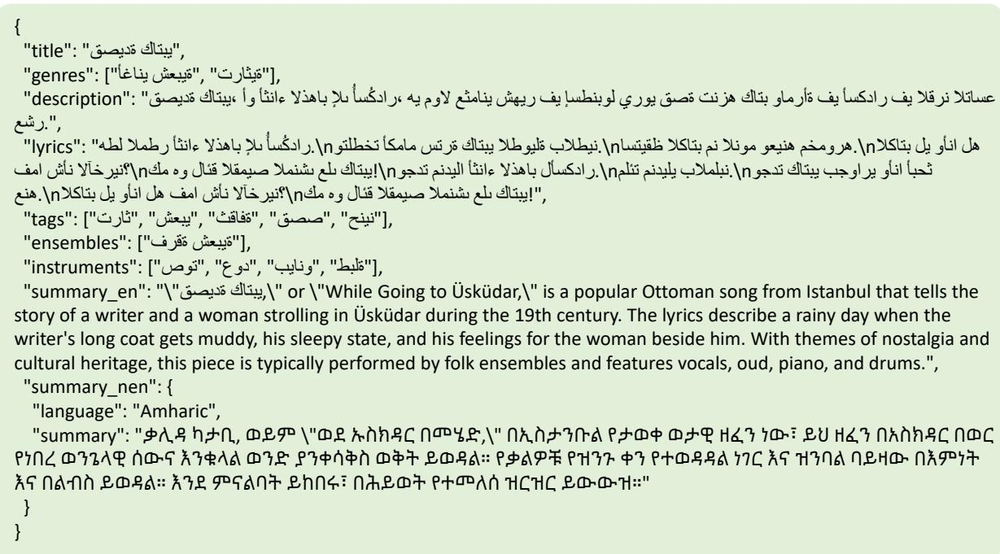  
Figure 9: Two examples of LLM-processed text data presented in JSON format, representing the original metadata and LLM-generated summaries in multiple languages for different music pieces.

## D t-SNE Visualizations of CLaMP 2 Representations

This section presents the t-SNE visualizations of feature representations extracted from CLaMP 2 across three benchmarks: WikiMT, VGMIDI, and Pianist8. These visualizations illustrate the clustering patterns of musical representations and reveal an intriguing alignment between the two data modalities—ABC notation and MIDI—without any fine-tuning of the model.

As demonstrated in Fig. 10, the clarity of clustering correlates with the classification performance from Table 1. Pianist8, which achieves the highest accuracy, displays well-defined and tight clusters, signifying that the model adeptly apprehends the minute stylistic subtleties at the composer level.

A particularly notable finding is the mirrored spatial alignment between ABC and MIDI across all datasets. This implies that, despite their dissimilar musical encodings, CLaMP 2 capture comparable latent structures within the feature space. The alignment indicates that CLaMP 2 extracts modalityinvariant features—resilient patterns that remain consistent across ABC and MIDI formats. These shared representations are likely to reflect profound musical semantics such as harmonic progressions, rhythmic architectures, or stylistic themes.

This symmetry has practical consequences. It suggests that CLaMP 2 could enable cross-modal tasks, for example, retrieving MIDI files based on ABC queries, without requiring specialized adaptation. It also points to the potential for transfer learning between modalities, where a model trained on one format (e.g., ABC) could operate effectively on another (e.g., MIDI). Future work could explore whether introducing explicit alignment techniques, like contrastive learning, could further enhance cross-modal performance between these two modalities.

These results spotlight both the strengths and limitations of CLaMP 2: the model demonstrates strong generalization across datasets, capturing meaningful musical patterns across diverse domains. However, it struggles with tasks involving overlapping or ambiguous genre boundaries, similar to human perception, such as distinguishing between entities like Bethel and Hillsong, which it finds very similar. This suggests that while CLaMP 2 excels at identifying clear stylistic differences, it may have difficulty differentiating between more closely related or subtle variations.

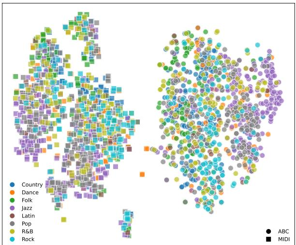  
(a) t-SNE visualizations on the WikiMT benchmark

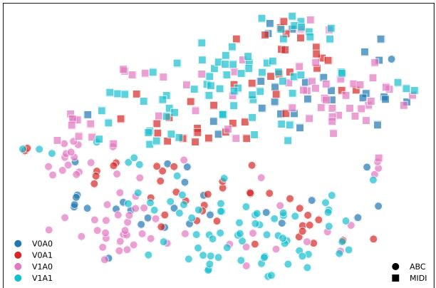  
(b) t-SNE visualizations on the VGMIDI benchmark

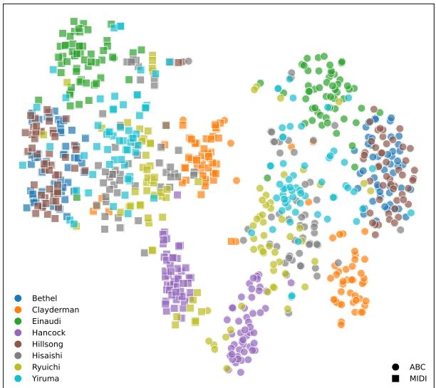  
(c) t-SNE visualizations on the Pianist8 benchmark

Figure 10: t-SNE visualizations of feature representations from CLaMP 2 (without fine-tuning) for three datasets: (a) WikiMT, (b) VGMIDI, and (c) Pianist8. A noteworthy observation is the mirrored spatial alignment of the ABC and MIDI representations, suggesting that CLaMP 2 effectively extracts modality-invariant musical semantics from both formats.