# AutoStep: Locally adaptive involutive MCMC

Tiange Liu 1 Nikola Surjanovic 1 Miguel Biron-Lattes 1 Alexandre Bouchard-Cotˆ e´ 1 Trevor Campbell 1

## Abstract

Many common Markov chain Monte Carlo (MCMC) kernels can be formulated using a deterministic involutive proposal with a step size parameter. Selecting an appropriate step size is often a challenging task in practice; and for complex multiscale targets, there may not be one choice of step size that works well globally. In this work, we address this problem with a novel class of involutive MCMC methods—AutoStep MCMC—that selects an appropriate step size at each iteration adapted to the local geometry of the target distribution. We prove that under mild conditions AutoStep MCMC is π-invariant, irreducible, and aperiodic, and obtain bounds on expected energy jump distance and cost per iteration. Empirical results examine the robustness and efficacy of our proposed step size selection procedure, and show that AutoStep MCMC is competitive with stateof-the-art methods in terms of effective sample size per unit cost on a range of challenging target distributions.

## 1. Introduction

Markov chain Monte Carlo (MCMC) (Metropolis et al., 1953; Hastings, 1970) is an effective tool for approximating integrals arising in Bayesian inference problems. The performance of MCMC is often sensitive to the choice of tuning parameters in the Markov kernel. In particular, methods that propose a new state followed by an accept/reject step— e.g., random-walk Metropolis–Hastings (RWMH) (Hastings, 1970), the Metropolis-adjusted Langevin algorithm (MALA) (Rossky et al., 1978), and Hamiltonian Monte

Carlo (HMC) (Duane et al., 1987; Neal, 1996)—often involve a scalar step size parameter $\theta \geq 0$ that governs the distance of the proposed next state from the current state. Too large a choice of θ results in distant proposals that are often rejected, while too small a choice leads to nearby proposals that do not explore the state space quickly; either case results in slow convergence of the chain. For certain multiscale targets (e.g. Bayesian posteriors with scale priors (Polson & Scott, 2012)) there may not even be a single good choice of step size throughout the whole state space.

Existing methods for selecting step size parameters fall generally into three categories: adaptive MCMC, discrepancy minimization, and locally-adaptive kernels. Adaptive MCMC algorithms (Haario et al., 2001; Atchade´, 2006; Andrieu & Thoms, 2008; Marshall & Roberts, 2012) tune the proposal distribution using previous draws from the chain, often targeting a particular acceptance rate derived from high-dimensional asymptotics (Roberts et al., 1997; Roberts & Rosenthal, 1998). Obtaining theoretical guarantees on estimates produced by adaptive MCMC targeting a distribution π is technically difficult and often requires strict conditions on the adaptation process, such as increasingly infrequent adaptation (Chimisov et al., 2018). Discrepancy minimization (Neklyudov et al., 2018; Coullon et al., 2023) involves tuning using a divergence between the empirical distribution of draws and the target π, which requires multiple MCMC runs to estimate the divergence for each candidate step size. Both approaches also identify only a single step size value, which may not be appropriate for the whole state space.

Locally-adaptive kernels, in contrast, select a value for the step size at each iteration based on the current state. Because the step size depends on the current state, these kernels can adapt to the local shape of the target π; and because they depend only on the current state, they are Markovian and one can use standard tools to prove π-invariance. There are many approaches to locally adaptive step size selection in the literature. Mixture kernels with state-dependent weights (Maire & Vandekerkhove, 2022) and delayed-rejection (Tierney & Mira, 1999; Green & Mira, 2001) are both general approaches, but each requires a prespecified maximum number of step sizes to consider at each iteration. There are also numerous methods specific to certain samplers, e.g., HMC and MALA (Girolami & Calderhead, 2011; Nishimura &

Dunson, 2016; Kleppe, 2016; Modi et al., 2024; Biron-Lattes et al., 2024; Turok et al., 2024), RWMH (see Livingstone, 2021), or slice sampling (Neal, 2003). Of these, the method most related to the present work is autoMALA (Biron-Lattes et al., 2024), which chooses a step size in MALA using a doubling/halving procedure that targets a Metropolis–Hastings acceptance ratio in a randomized range $( a , b ) \subset [ 0 , 1 ]$ . While the method was shown to be π- invariant, it was crucially not shown to be either irreducible or aperiodic. In practice, AutoMALA indeed can get stuck in certain states, especially when the initialization point is far from the mass of the target distribution, as is commonly the case in Bayesian inference; to address this, AutoMALA requires inexact unadjusted steps (see Algorithm 3 in Biron-Lattes et al. (2024)).

In this work, we develop a novel method, AutoStep MCMC, for locally-adaptive step size selection in the broad class of involutive MCMC methods (Tierney, 1998; Andrieu et al., 2020; Neklyudov et al., 2020). We show that these Markov kernels are π-invariant, irreducible, and aperiodic under mild assumptions on the target distribution, thereby substantially generalizing and improving upon AutoMALA. We further provide bounds on energy jump distances and expected cost per iteration, demonstrating the robustness of the method to the setting of an initial step size parameter. Empirical results confirm the theory and demonstrate that AutoStep is stable, reliable, and competitive with other adaptive methods. Proofs of all theoretical results are provided in Appendix A.

Note that concurrent work on Gibbs self-tuning (Bou-Rabee et al., 2024b;a) introduces the same general technique for locally-adaptive involutive MCMC, proves π-invariance, and develops specific adaptation schemes for HMC and NUTS (Neal, 2011; Hoffman & Gelman, 2014). In this work, we provide an analysis of π-invariance, irreducibility, aperiodicity, and expected cost and performance, with a specific focus on involutions parametrized by a step size.

## 2. Background

Let π be a given target probability distribution on an open subset $\mathcal { X } \subset \mathbb { R } ^ { d }$ . With a slight abuse of notation, we assume that π admits a density $\pi ( x )$ with respect to the Lebesgue measure on $\mathbb { R } ^ { d }$ , and that we can evaluate a function $\gamma ( x )$ ∝ $\pi ( x )$ pointwise so that

$$
\pi ( x ) = { \frac { \gamma ( x ) } { \int \gamma ( x ) \mathrm { d } x } } ,
$$

where $\textstyle \int \gamma ( x ) \mathrm { d } x$ is the unknown normalizing constant.

Involutive Markov Chain Monte Carlo (Tierney, 1998; Andrieu et al., 2020; Neklyudov et al., 2020) is an MCMC method that uses involutions, i.e., functions f where $f ^ { - 1 } =$ f, to generate new proposals. While there are many possible variations of involutive MCMC, in this work we use the following formulation. Fix a distribution m on an open subset $\mathcal { Z } \subset \mathbb { R } ^ { p }$ with density $m ( z )$ with respect to the Lebesgue measure, and a family of differentiable involutions $f _ { \theta } : \mathcal { X } \times \mathcal { Z }  \mathcal { X } \times \mathcal { Z }$ parametrized by $\theta \in \Theta$ . Then, starting from a state $x _ { t } .$ , we draw $z _ { t } \sim m$ and the proposal

$$
x _ { t + 1 } ^ { \prime } , z _ { t + 1 } ^ { \prime } = f _ { \theta } ( x _ { t } , z _ { t } ) .\tag{1}
$$

We set the next state to $x _ { t + 1 } = x _ { t + 1 } ^ { \prime }$ with probability

$$
\operatorname* { m i n } \{ 1 , \exp ( \ell ( x _ { t } , z _ { t } , \theta ) ) \} ,\tag{2}
$$

where

$$
\ell ( x _ { t } , z _ { t } , \theta ) = \log \biggr ( \frac { \pi ( x _ { t + 1 } ^ { \prime } ) m ( z _ { t + 1 } ^ { \prime } ) } { \pi ( x _ { t } ) m ( z _ { t } ) } | \nabla f _ { \theta } ( x _ { t } , z _ { t } ) | \biggr ) ,
$$

and otherwise set it to $x _ { t + 1 } ~ = ~ x _ { t }$ . The sequence $x _ { t }$ is a Markov chain and has stationary distribution π if $f _ { \theta }$ is continuously differentiable (Tierney, 1998, Thm. 2).

Choosing different families of involutions $\{ f _ { \theta } \}$ and auxiliary distributions m yields different MCMC algorithms. For example, random walk Metropolis–Hastings (RWMH) (Hastings, 1970) with step size $\theta > 0$ and mass matrix M is obtained by setting

$$
f _ { \theta } ( x , z ) = ( x + \theta M ^ { - 1 } z , - z ) ~ m = N ( 0 , M ) .\tag{3}
$$

The Metropolis-adjusted Langevin algorithm (MALA) (Rossky et al., 1978) with step size $\theta > 0$ and mass matrix M is obtained by setting

$$
f _ { \boldsymbol { \theta } } ( x , z ) = ( x ^ { \prime } , - z ^ { \prime } ) \qquad \quad m = \mathcal { N } ( 0 , M ) ,
$$

where $x ^ { \prime } , z ^ { \prime }$ are computed via the leapfrog map

$$
\begin{array} { l } { { \displaystyle z _ { 1 / 2 } \gets z + \frac { \theta } { 2 } \nabla \log \pi ( x ) } } \\ { { \displaystyle x ^ { \prime } \gets x + \theta M ^ { - 1 } z _ { 1 / 2 } } } \\ { { \displaystyle z ^ { \prime } \gets z _ { 1 / 2 } + \frac { \theta } { 2 } \nabla \log \pi ( x ^ { \prime } ) . } } \end{array}
$$

Finally, Hamiltonian Monte Carlo (HMC) (Duane et al., 1987; Neal, 1996) with step size $\theta > 0$ , mass matrix M , and path length L is obtained by setting

$$
f _ { \boldsymbol { \theta } } ( x , z ) = ( x ^ { \prime } , - z ^ { \prime } ) \qquad \quad m = \mathcal { N } ( 0 , M ) ,
$$

where $x ^ { \prime } , z ^ { \prime }$ are computed via L leapfrogs.

Many involutive MCMC methods—including the above three examples—have a positive scalar tuning parameter $\theta > 0$ that can be interpreted as a form of “step size”: larger values result in more distant proposals, while smaller values result in nearby proposals. Too large a choice of θ results in many rejected proposals, while too small a choice results in proposals that are accepted but explore the state space slowly. Furthermore, there may not be a single choice of θ that applies globally, e.g., in the case of multiscale targets (Polson & Scott, 2012). This work resolves this problem by selecting an appropriate θ at each iteration depending on the local behaviour of the augmented target $\pi \cdot m$

## 3. AutoStep MCMC

In this section, we develop AutoStep MCMC, a family of modified involutive MCMC methods that automatically select appropriate tuning parameter values at each iteration. The key technique in developing AutoStep MCMC is to formulate the sampler on an augmented space that includes the tuning parameter $\theta \in \Theta$ as well as other auxiliary quantities. For a given family of continuously differentiable involutions $\{ f _ { \theta } : \theta \in \Theta \}$ on $\mathcal { X } \times \mathcal { Z } ,$ define the augmented space $s$ as

$$
\mathcal { S } = \mathcal { X } \times \mathcal { Z } \times \Delta \times \Theta ,
$$

where $\mathcal { X } \times \mathcal { Z }$ is the original augmented space for involutive MCMC, $\Delta : = \{ a , b \in ( 0 , 1 ) ^ { 2 } : a < b \}$ is a set of acceptance ratio thresholds $( a , b )$ , and Θ is the set of tuning parameters θ for the involutions. We assume Θ is a standard Borel space, such that $s$ is standard Borel as well. Let ${ \bar { f } } : S \to S$ denote the augmented involution $f _ { \boldsymbol { \theta } } { : }$ for a point $s = ( x , z , a , b , \theta ) \in S$ , define

$$
\begin{array} { r } { \overline { { f } } ( s ) = ( f _ { \theta } ( x , z ) , a , b , \theta ) \quad J ( s ) = | \nabla f _ { \theta } ( x , z ) | . } \end{array}
$$

Note that $\bar { f }$ is itself an involution on S. We then define the augmented target density

$$
\pi ( s ) = 2 \pi ( x ) \cdot m ( z ) \cdot \mathbb { 1 } _ { \Delta } ( a , b ) \cdot \eta ( \theta \mid x , z , a , b ) ,
$$

where we assume that $\pi ( x )$ and $m ( z )$ are with respect to the Lebesgue measure on $\mathcal { X } \times \mathcal { Z }$ , that both m and η admit i.i.d. draws, and that there exists a σ-finite measure dθ on Θ such that for all $x \in \mathcal { X } , z \in \mathcal { Z }$ and $( a , b ) \in \Delta , \eta ( \cdot \mid x , z , a , b )$ is a density with respect to dθ, but otherwise may depend arbitrarily on $x , z , a , b .$ The X -marginal of π¯ is the target of interest, π.

Given this setup, starting from $x _ { t } \in { \mathcal { X } } ,$ , AutoStep MCMC (Algorithm 1) consists of the following steps:

1. Auxiliary refreshment: Draw

$$
z _ { t } \sim m \qquad \mathrm { a n d } \qquad ( a _ { t } , b _ { t } ) \sim \mathrm { U n i f } ( \Delta ) .
$$

2. Tuning parameter refreshment: Draw

$$
\theta _ { t } \sim \eta ( \mathrm { d } \theta \mid x _ { t } , z _ { t } , a _ { t } , b _ { t } ) .
$$

3. Proposal: Set $s _ { t } = \left( x _ { t } , z _ { t } , a _ { t } , b _ { t } , \theta _ { t } \right)$ and

$$
s _ { t + 1 } ^ { \prime } = \bar { f } ( s _ { t } ) = ( x _ { t + 1 } ^ { \prime } , z _ { t + 1 } ^ { \prime } , a _ { t + 1 } ^ { \prime } , b _ { t + 1 } ^ { \prime } , \theta _ { t + 1 } ^ { \prime } ) .
$$

Algorithm 1 One iteration of AutoStep MCMC   
Require: Initial x with $\pi ( x ) > 0 ,$ target π, auxiliary distri  
bution m, step size distribution η, involutions $\{ f _ { \theta } \} _ { \theta \in \Theta }$   
1: $z \sim m$ ▷ auxiliary refreshment   
2: $( a , b ) \sim \mathrm { U n i f } ( \Delta )$ ▷ soft acceptance bounds   
3: $\theta \sim \eta ( \mathrm { d } \theta \mid x , z , a , b )$ ▷ refresh tuning parameter   
4: $\boldsymbol { s } \gets ( x , z , a , b , \theta )$ ▷ augmented state   
5: $s ^ { \prime }  { \bar { f } } ( s )$ ▷ involutive proposal   
6: $U \sim \mathrm { U n i f } [ 0 , 1 ]$   
7: if $\begin{array} { r } { U \leq \operatorname* { m i n } \Bigl \{ 1 , \frac { \overline { { \pi } } ( s ^ { \prime } ) } { \overline { { \pi } } ( s ) } J ( s ) \Bigr \} } \end{array}$ then   
8: return $x ^ { \prime }$ ▷ accept   
9: else   
10: return x ▷ reject   
11: end if

4. Accept: Set $x _ { t + 1 } = x _ { t + 1 } ^ { \prime }$ with probability

$$
\operatorname* { m i n } \biggr \{ 1 , \frac { \overline { { \pi } } ( s _ { t + 1 } ^ { \prime } ) } { \overline { { \pi } } ( s _ { t } ) } J ( s _ { t } ) \biggr \} ,
$$

and otherwise set $x _ { t + 1 } = x _ { t }$

We can recover standard involutive MCMC by setting $\eta ( \mathrm { d } \theta | x , z , a , b ) = \delta _ { \theta _ { 0 } } ( \mathrm { d } \theta )$ for some fixed $\theta _ { 0 } \in \Theta$ . Further, choosing different involution families $\{ f _ { \theta } : \theta \in \Theta \}$ and auxiliary distributions m on Z recovers variants of common algorithms, e.g., RWMH, MALA, and HMC. The major improvement is that the chain may draw the tuning parameter $\theta \in \Theta$ automatically at each step in a manner that depends on the current state $( x _ { t } , z _ { t } , a _ { t } , b _ { t } )$ . The key design choice, then, is to select a conditional tuning refreshment distribution η that yields values of θ that are well-adapted to the local shape of the target π¯. In this work, we focus on the design of the conditional tuning refreshment distribution η in the case where θ is a step size parameter (with $\Theta = \mathbb { R } _ { + } )$ However, the AutoStep MCMC method described previously has the correct stationary distribution for more general parameter spaces Θ (see Proposition 4.2). Note also that the above approach of sampling a tuning parameter θ from a conditional distribution η given the augmented state was also introduced in concurrent work on Gibbs self-tuning (Bou-Rabee et al., 2024b;a), although the design of η in Section 3.1 differs.

## 3.1. Step size selection

We now focus on the design of the tuning refreshment distribution η when θ is a step size parameter with $\Theta = \mathbb { R } _ { + }$ Intuitively, a good choice of θ should yield a proposal for which the acceptance ratio $\exp ( \ell ( x , z , \theta ) )$ of the original involutive method is not too close to either 0 (θ is too large) or 1 (θ is too small). Critically, this should also be true for $\exp ( - \ell ( x , z , \theta ) )$ , which is the acceptance ratio in the

Algorithm 2 Step size selector µ   
Require: state $x , z , a , b ,$ initial step size $\theta _ { 0 }$   
1: $\theta  \theta _ { 0 }$   
2: $\ell \gets \ell ( x , z , \theta )$   
3: v ← 1{|ℓ| < | log b|} − 1{|ℓ| > | log a|}   
4: $j = 0$ ▷ number of doublings/halvings   
5: if v = 0 then   
6: return j   
7: end if   
8: while true do   
9: $j  j + v$   
10: $\theta  \theta _ { 0 } \cdot 2 ^ { j }$   
11: $\ell \gets \ell ( x , z , \theta )$   
12: if $v = 1$ and $| \ell | \geq | \log b |$ then   
13: return j − 1 ▷ Require final halving   
14: else if $v = - 1$ and $| \ell | \leq |$ log a| then   
15: return j   
16: end if   
17: end while

reverse direction

$$
\ell ( f _ { \theta } ( x , z ) , \theta ) = - \ell ( x , z , \theta ) .
$$

To avoid setting arbitrary fixed bounds on ℓ, we use random $a , b$ as thresholds and ensure that |ℓ| roughly tries to fall in the range $( | \log ( b ) | , | \log ( a ) | )$ . More precisely, given a fixed initial step size $\theta _ { 0 } > 0$ , we propose setting the step size θ to

$$
\theta = \theta _ { 0 } \times 2 ^ { \mu ( x , z , a , b ) } ,
$$

where µ is the step size selector function

$$
\begin{array} { r l } & { \mu ( x , z , a , b ) = } \\ & { \left\{ \begin{array} { l l } { \operatorname* { m i n } \{ j \in \mathbb { Z } ^ { + } : | \ell ( x , z , \theta _ { 0 } 2 ^ { j } ) | \ge | \log b | \} - 1 , } & { | \ell _ { 0 } | < | \log b | } \\ { \operatorname* { m a x } \{ j \in \mathbb { Z } ^ { - } : | \ell ( x , z , \theta _ { 0 } 2 ^ { j } ) | \le | \log a | \} , } & { | \ell _ { 0 } | > | \log a | } \\ { 0 , } & { \mathrm { o t h e r w i s e } , } \end{array} \right. } \end{array}
$$

and $\ell _ { 0 } = \ell ( x , z , \theta _ { 0 } )$ . Therefore $\eta ( \mathrm { d } \theta | x , z , a , b )$ is the Dirac measure at $\mu ( x , z , a , b )$ , which has a density with respect to the counting measure on $\{ \theta _ { 0 } \times 2 ^ { j } : j \in \mathbb { Z } \}$

The pseudocode for computing $\mu ( x , z , a , b )$ is given in Algorithm 2. If the initial step size $\theta _ { 0 }$ yields an acceptable $| \ell _ { 0 } |$ the function simply returns $j = 0$ . If the initial step size is too large $( | \ell _ { 0 } | > | \log a | ) , j$ is decreased until $| \ell _ { 0 } | \le$ | log a|. And if the initial step size is too small $( | \ell _ { 0 } | < | \log b | ) , j$ is increased until $| \ell _ { 0 } | > | \log b |$ , and then finally decreased by 1 to avoid poor proposals. Note that this function does not guarantee that $| \log b | \leq | \ell | \leq | \log a |$ precisely, but finds a good trade-off by approximately targeting that range while avoiding the need for expensive methods to find values exactly within the bounds.

The step size refreshment was inspired by that of autoMALA (Biron-Lattes et al., 2024), but has two important differences.

First, we use symmetric thresholds that check $| \log b | \leq$ $| \ell | \leq | \log a |$ , instead of checking log $b \leq \ell \leq \log a$ . This is crucial for ensuring irreducibility of the method (see Section 4), and avoids the sampler getting stuck in the tails or near the mode of the target (see Fig. 1 for empirical results to this effect). Second, we include the step size θ as an augmentation of our state variable, which substantially simplifies theoretical analyses (compare the proof of Proposition 4.2 in Appendix A with the proof of Theorem 3.4 in (Biron-Lattes et al., 2024)).

## 3.2. Round-based tuning

The AutoStep MCMC method has one free parameter: the initial step size $\theta _ { 0 }$ . While the method is insensitive to $\theta _ { 0 }$ in that its performance per unit cost shrinks slowly at a rate of roughly $O ( | \log \theta _ { 0 } | )$ (see Figs. 3 and 4 and Corollary 4.10 for empirical and theoretical evidence to that effect), it is still helpful to tune this parameter to minimize the number of doubling/halving steps. Furthermore, many involutive MCMC methods—e.g., RWMH, MALA, and HMC—have a preconditioner, or mass matrix M that needs to be tuned.

In this work, we use a round-based procedure to tune $\theta _ { 0 }$ and M (Algorithm 3). Each round corresponds to a block of iterations during which parameters are held constant. We use $\theta _ { 0 } = 1$ and $M = I$ for the first round. At the end of each round we update $\theta _ { 0 } \gets \theta _ { 0 } \times 2 ^ { \widehat \mu }$ , where µ is the empirical median of the selected log step sizes $\mu _ { t } = \mu ( x _ { t } , z _ { t } , a _ { t } , b _ { t } )$ from the current round. We also set M to the diagonal of the inverse sample covariance matrix, which is then mixed with the identity as a regularizer to form M in each iteration (Line 8 in Algorithm 3).

## 4. Theoretical Analysis

The marginal sequence $x _ { t }$ on X of AutoStep MCMC is itself a Markov chain because each step redraws $z _ { t } , a _ { t } , b _ { t } , \theta _ { t }$ independently of their previous value conditioned on $x _ { t }$ In this section we establish various properties of the X - marginal Markov chain.

## 4.1. Invariance

First, we show that AutoStep MCMC is π¯-invariant on the augmented space S, and hence π-invariant on X . The result is a straightforward application of Tierney (1998, Theorem 2) on the augmented space S. Note that while this work focuses on step size parameters $\theta \in \mathbb { R } _ { + }$ , Proposition 4.2 below holds for general parameter spaces Θ and tuning refreshment distributions $\eta ( \mathrm { d } \theta | x , z , a , b )$ .

Assumption 4.1. For each $\theta \in \Theta ,$ , fθ is a continuously differentiable involution.

Proposition 4.2. Under Assumption 4.1, AutoStep MCMC is π-invariant, and hence the X -marginal is π-invariant.

```latex
Algorithm 3 Round-based AutoStep MCMC
Require: Initial $x _ { 0 } .$ , number of rounds R, target π, auxil
iary distribution $m ,$ step size distribution η, involutions
$\{ f _ { \theta } \} _ { \theta \in \Theta } .$
1: $\theta _ { 0 }  1 , \widehat { M }  I$
2: m $ \mathcal { N } ( 0 , I _ { d } )$
3: for r in $1 , 2 , \ldots , R$ do
4: $T \gets 2 ^ { r }$ ▷ Number of iterations
5: $\eta \gets \mathrm { D i r a c } ( \theta _ { 0 } \times 2 ^ { \mu ( x , z , a , b ) } ) ( \mathrm { d } \theta )$
6: for t in $1 , 2 , \ldots , T$ do
7: $\begin{array} { r } { \xi \sim \frac { 1 } { 3 } \delta _ { 0 } + \frac { 1 } { 3 } \delta _ { 1 } + \frac { 1 } { 3 } \mathtt { B e t a } ( 1 , 1 ) } \end{array}$
▷ Random mixing of the preconditioner
8: $M _ { i , i } ^ { 1 / 2 }  \xi \widehat { M } _ { i , i } ^ { 1 / 2 } \overset { \cdot } { + } ( 1 - \overset { \cdot } { \xi } )$
9: m $ { \mathcal { N } } ( 0 , M )$
▷ see definition of $\mu _ { t }$ in Section 3.2
10: $x _ { t } , \mu _ { t } \gets \mathtt { A u t o S t e p } ( x _ { t - 1 } , \pi , m , \eta , \{ f _ { \theta } \} _ { \theta \in \Theta } )$
11: end for
12: $\theta _ { 0 }  \theta _ { 0 } \times 2 ^ { \mathrm { m e d i a n } ( \mu _ { 1 } , \dots , \mu _ { T } ) }$
13: $x _ { 0 } \gets x _ { T }$
14: $\widehat { M } \gets \mathrm { d i a g } \Bigg ( \Big [ \mathrm { V a r } [ x _ { t } ^ { ( j ) } ] _ { t = 1 } ^ { T } \Big ] _ { j = 1 } ^ { d } \Bigg ) ^ { - 1 }$
15: end for
16: return $\{ x _ { t } \} _ { t = 1 } ^ { T }$
```

## 4.2. Irreducibility and aperiodicity

Next, we establish that the X -marginal of AutoStep MCMC is π-irreducible and aperiodic (see Roberts & Rosenthal (2004)): intuitively, the chain has a positive probability of eventually visiting any measurable $A \subseteq { \mathcal { X } }$ with $\pi ( A ) > 0$ and it does not visit various sets in a repeating pattern. We will demonstrate π-irreducibility and aperiodicity simultaneously by showing that the X -component of the chain can reach any measurable set $A \subset { \mathcal { X } }$ in a single step with positive probability (one-step irreducibility). The first assumption needed is that for any fixed $\theta \in \Theta$ , the X -marginal kernel $P _ { \theta } ( x , \cdot )$ of the original involutive MCMC algorithm given by Eqs. (1) and (2) can do so as well.

Assumption 4.3. For all $x \in { \mathcal { X } } , \theta \in \Theta$ , and $A \subseteq { \mathcal { X } }$ such that π $\cdot ( A ) > 0 ,$ , the X -marginal kernel $P _ { \theta }$ of involutive MCMC (Eqs. (1) and (2)) satisfies $P _ { \theta } ( x , A ) > 0$

The second assumption needed is that there is a non-null set of parameters $\theta \in \Theta$ that can be selected and result in an accepted move from any point $x , z \in { \mathcal { X } } \times { \mathcal { Z } }$ in the original augmented space of involutive MCMC. We encode this using the positivity of the function

$$
\begin{array} { l } { { \displaystyle \gamma ( x , z , \theta ) = } \ ~ } \\ { { \displaystyle \int \operatorname* { m i n } \{ \eta ( \theta \mid x , z , a , b ) , \eta ( \theta \mid f _ { \theta } ( x , z ) , a , b ) \} \mathbb 1 _ { \Delta } ( \mathrm { d } ( a , b ) ) } . } \end{array}
$$

Assumption 4.4. There exists a $B \subseteq \Theta$ such that $\int _ { B } \mathrm { d } \theta > 0$

and for all $x \in { \mathcal { X } } , m { \cdot } a . e . ~ z \in { \mathcal { Z } } ,$ , and $\theta \in B ,$

$$
\gamma ( x , z , \theta ) > 0 .
$$

These assumptions yield the desired result, which holds for general parameter spaces Θ and distributions η.

Proposition 4.5. If both Assumptions 4.3 and 4.4 hold, then AutoStep MCMC is one-step irreducible, and hence irreducible and aperiodic.

We now apply Proposition 4.5 to the case where θ is a step size parameter and we use η from Section 3.1. In this setting, Assumption 4.4 simplifies substantially.

Corollary 4.6. Suppose $\Theta = ( 0 , \infty )$ , Assumption 4.3 holds, and we use η from Section 3.1. Then, AutoStep MCMC is irreducible and aperiodic if for all $x \in \mathcal { X }$ and $m { \cdot } a . e . \ z \in { \mathcal { Z } } ,$ $| \ell ( x , z , \theta _ { 0 } ) | \not \in \{ 0 , \infty \}$

We show in Lemmas A.1 and A.2 that Assumption 4.3 holds for both RWMH and MALA under weak conditions, and hence the irreducibility and aperiodicity of AutoStep RWMH and MALA follows from $| \ell ( x , z , \theta _ { 0 } ) | \not \in \{ 0 , \infty \}$

## 4.3. Step size selector termination

We now establish that under mild conditions, the step size selector function $\mu$ can be computed in finite time. For starting state $\boldsymbol { s } = ( x , z , a , b )$ and initial step size $\theta _ { 0 } > 0 ,$ let $\tau ( s , \theta _ { 0 } ) \geq 1$ be the number of iterations of the while loop in Algorithm 2. The key condition, Assumption 4.7, is satisfied intuitively when the density $\pi \cdot m$ is continuous and the involution $f _ { \theta }$ becomes the identity as $\theta  0$ and grows without bound as $\theta \to \infty$

Assumption 4.7. For π × m-a.e. $( x , z ) \in \mathcal { X } \times \mathcal { Z } ,$

$$
\operatorname* { l i m } _ { \theta \to 0 ^ { + } } | \ell ( x , z , \theta ) | = 0 \qquad \operatorname* { l i m } _ { \theta \to \infty } | \ell ( x , z , \theta ) | = \infty .
$$

Proposition 4.8. Let $\theta _ { 0 } > 0$ and suppose Assumption 4.7 holds. Then $\tau ( s , \theta _ { 0 } ) < \infty , { \bar { \pi } } \mathbf { - } a . s .$

Note that while Proposition 4.8 guarantees that the Markov chain can be simulated in finite time in practice, the longrun computational cost of the step size adaptation depends on the expected number of doubling/halving iterations in each step, $\mathbb { E } \tau ( s , \theta _ { 0 } )$ for $s \sim { \overline { { \pi } } } .$ . Proposition 4.9 bounds this expectation in terms of $\ell ( x , z , 2 ^ { t } \theta _ { 0 } )$ for $t \in \mathbb { Z }$

Proposition 4.9. For $s = ( x , z , a , b , \theta ) \sim \overline { { \pi } }$ and all $\theta _ { 0 } > 0$

$$
\mathbb { E } \tau ( s , \theta _ { 0 } ) \le \mathbb { E } \sum _ { t = 0 } ^ { \infty } e ^ { - 2 \vert \ell ( x , z , 2 ^ { t } \theta _ { 0 } ) \vert } + \Bigl ( 1 - e ^ { - \vert \ell ( x , z , 2 ^ { - t } \theta _ { 0 } ) \vert } \Bigr ) ^ { 2 } .
$$

The first and second terms in the sum in Proposition 4.9 capture the expected number of doubling and halving steps, respectively. While more detailed bounds on $\mathbb { E } \tau ( s , \theta _ { 0 } )$ require problem-specific analysis that depends on $f _ { \theta } , \pi .$ , and m, both terms will typically decay quickly in t. Corollary 4.10 provides an example of a more detailed result based on Proposition 4.9 in a representative setting when using AutoStep with random walk Metropolis–Hastings.

Corollary 4.10. Let log π(x) be strongly concave with $L i p \mathbf { \nabla } \cdot$ schitz gradients, and set $f _ { \theta }$ as in $E q . \ ( 3 )$ with $M = I .$ . Then

$$
\mathbb { E } \tau ( s , \theta _ { 0 } ) = O ( | \log \theta _ { 0 } | ) \quad a s \quad \theta _ { 0 } \to 0 \quad o r \quad \theta _ { 0 } \to \infty ,
$$

with a dimension-independent leading constant.

Corollary 4.10 shows that the expected number of doublings/halvings—i.e., the long-run average evaluations of $f _ { \theta }$ and ℓ per iteration—is very robust to the initial step size parameter $\theta _ { 0 }$ . This translates to a robust performance per unit cost: in the setting in Corollary 4.10, we expect AutoStep RWMH to exhibit an average jump distance per unit cost to scale like $O \big ( | \log \theta _ { 0 } | ^ { - 1 } \big )$ for small/large $\theta _ { 0 }$ . Contrast this to the significantly worse $\begin{array} { r } { { \cal { \dot { O } } } ( \exp ( - | \log \theta _ { 0 } | ) ) } \end{array}$ decay for fixed step size RWMH. This difference in behaviour is confirmed empirically in Fig. 4.

## 4.4. Energy jump distance

For $s = ( x , z , a , b , \theta ) \sim \pi , s ^ { \prime } = \overline { { f } } ( s ) = ( x ^ { \prime } , z ^ { \prime } , a ^ { \prime } , b ^ { \prime } , \theta ^ { \prime } )$ and $U \sim \mathrm { U n i f } [ 0 , 1 ]$ , define the energy jump distance

$$
D = | \ell ( x , z , \theta ) | \mathbb { 1 } \bigg [ U \leq \frac { \overline { { \pi } } ( s ^ { \prime } ) } { \overline { { \pi } } ( s ) } J ( s ) \bigg ] ,
$$

which we use to encode the change in $\log ( \pi ( x ) m ( z ) )$ ) after one iteration of AutoStep MCMC. Proposition 4.11 shows that any involutive MCMC method—both traditional and AutoStep methods—have an expected energy jump distance bounded above by a simple expression via the tuning parameter proposal density ratio η,

$$
\bar { \eta } = \operatorname { e s s } \operatorname * { s u p } _ { x , z , a , b , \theta } \frac { \eta ( \theta \mid f _ { \theta } ( x , z ) , a , b ) } { \eta ( \theta \mid x , z , a , b ) } \quad ( \mathrm { u n d e r } \bar { \pi } ) .
$$

Proposition 4.11. Under Assumption 4.1,

$$
\mathbb { E } D \le 2 \bar { \eta } \operatorname* { m a x } \{ e ^ { - 1 } , \bar { \eta } \log \bar { \eta } \} .
$$

In particular, for traditional involutive MCMC with a fixed parameter $\theta = \theta _ { 0 }$ , or for AutoStep MCMC with $\sigma ^ { 2 } = 0 .$ , or AutoStep MCMC with a fixed-width uniform distribution for $\eta ,$ we have that $\bar { \eta } \leq 1$ , so

$$
\begin{array} { r } { \mathbb { E } D \le 2 e ^ { - 1 } \approx 0 . 7 3 6 . } \end{array}
$$

The step size selector presented in Section 3.1 is a computationally efficient method to make $| \ell ( x , z , \theta ) |$ fall roughly in

the range $( | \log b | , | \log a | )$ , where $a , b \sim \operatorname { U n i f } ( \Delta )$ . Therefore, as a heuristic, we expect

$$
0 . 5 = \mathbb { E } | \log b | \lesssim \mathbb { E } | \ell ( x , z , \theta ) | \lesssim \mathbb { E } | \log a | = 1 . 5 ,
$$

with departures from exactness arising due to the discrete doubling/halving procedure (as opposed to an exact root finder). In other words, the step size selector in this work creates proposals with mean energy jump distance roughly targeting the maximum $\approx 0 . 7 3 6$ for a broad class of involutive MCMC methods.

## 5. Experiments

In this section we present an empirical evaluation of two AutoStep MCMC variants: RWMH and MALA. We first use synthetic targets with varying tail behaviour to examine the effect of the symmetric termination criterion in Algorithm 2 versus the asymmetric criterion from Biron-Lattes et al. (2024), the efficacy of our proposed tuning procedure for $\theta _ { 0 } ,$ , and the robustness of the performance of our proposed method versus the initial step size $\theta _ { 0 }$ . We then investigate the performance of AutoStep RWMH and AutoStep MALA in comparison to previous adaptive methods.

Throughout, we measure the efficiency of each sampler in terms of effective sample size (ESS) (Flegal et al., 2008) per second. However, we found empirically that standard ESS estimates (Gelman et al., 2013, p. 286-287), (Galin L Jones & Neath, 2006, p. 1539-1541) did not accurately characterize sampler performance. Therefore we instead use a diagnostic (KSESS) outlined in Appendix D that involves the maximum difference between the empirical CDF and target CDF across all dimensions, where the target CDF is approximated using a long run of parallel tempering with Pigeons.jl (Surjanovic et al., 2023).

## 5.1. Symmetric step size selection criterion

We first assess the benefit of using the symmetric step size criterion in Algorithm 2 versus the asymmetric criterion from Biron-Lattes et al. (2024) on three synthetic targets with varying tail behavior: $\mathcal { N } ( 0 , 1 )$ , Laplace(0, 1), and $\mathrm { C a u c h y ( 0 , 1 ) }$ . For each $\| x \| \in \{ 1 0 ^ { - 5 } , 1 0 ^ { - 4 } , \ldots , 1 0 ^ { 2 } \}$ , we simulated $1 0 ^ { 7 }$ draws from the target and renormalized them to the specified value. Then, for each draw, we simulated one step of AutoStep RWMH/MALA $( \theta _ { 0 } = 1 )$ , and recorded the acceptance probability.

The average of these acceptance probabilities is shown in Fig. 1 for AutoStep RWMH, showing that the asymmetric step size selector can get stuck for extended periods near the mode of the target (small $\lVert x \rVert )$ and in the tails (large $\lVert x \rVert )$ . This behavior particularly problematic in practice for Bayesian inference, which is often initialized in the tails. In contrast, the proposed symmetric step size selector is more robust, exhibiting an acceptance probability that is greater than 10% for the entire range of norms from $1 0 ^ { - 5 } ~ \mathrm { t o } ~ 1 0 ^ { 2 }$ . This result aligns with our theoretical results (Proposition 4.5 and Corollary 4.6) on the irreducibility of AutoStep with the symmetric step size selection criterion.

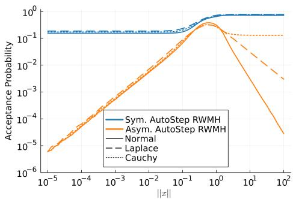  
Figure 1: Comparison of the symmetric (this work, blue) versus asymmetric ((Biron-Lattes et al., 2024), orange) step size criteria in Algorithm 2, in terms of the move acceptance probability of AutoStep RWMH as a function of the state norm ∥x∥. Note that the asymmetric criterion yields very low acceptance probabilities for states near the mode (left side of the plot) and in the tails (right side of the plot).

## 5.2. Tuning the initial step size $\theta _ { 0 }$

Next, we assess the stability and efficacy of the round-based tuning procedure for $\theta _ { 0 }$ in AutoStep RWMH/MALA. For each of the same three synthetic targets as in Section 5.1, we initialize the state $x \sim \mathcal { N } ( 0 , 2 0 ^ { 2 } ) , \theta _ { 0 } \in \{ 1 0 ^ { - 7 } , \dots , 1 0 ^ { 7 } \}$ , and run the Markov chain for $R = 2 0$ doubling rounds $( \approx 2 \times 1 0 ^ { 6 }$ steps total), tuning $\theta _ { 0 }$ per Algorithm 3 after each round. For each trace, we track the value of $\theta _ { 0 }$ as it is tuned, as well as the per iteration cost, measured by the number of evaluations of ℓ in each round. Note that fixed step size MCMC methods call ℓ once per iteration, whereas AutoStep calls ℓ once plus an additional time for each doubling or halving during step size tuning.

Fig. 2 displays the results from this experiment: Fig. 2a shows the tuned values of $\theta _ { 0 }$ as a function of doubling round, while Fig. 2b shows the corresponding average cost per iteration during each round. Both figures together indicate that the proposed tuning procedure is highly effective: despite the initialization of $\theta _ { 0 }$ spanning 14 orders of magnitude, the tuning remains stable and converges to a reasonable value of $\theta _ { 0 } \approx 1$ , while the cost per iteration is quickly minimized and remains stable throughout the rounds.

## 5.3. Robustness to initial step size $\theta _ { 0 }$

Next we examine the robustness of AutoStep RWMH/MALA to the setting of $\theta _ { 0 }$ compared with fixed-step-size RWMH/MALA. In this experiment we do not tune $\theta _ { 0 } .$ , and fix it at values $\theta _ { 0 } \in \{ 1 0 ^ { - 7 } , \dots , 1 0 ^ { 7 } \}$ . For each of the three targets from Section 5.1, and each fixed $\theta _ { 0 }$ we initialized each sampler at a target draw, and collected various metrics over $\mathrm { 1 0 ^ { \bar { 6 } } }$ MCMC steps.

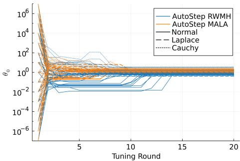

(a) Values of $\theta _ { 0 }$  
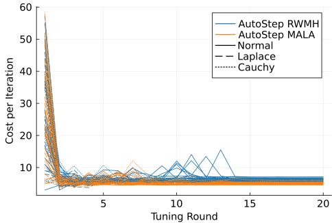  
(b) Cost per iteration  
Figure 2: The effect of tuning $\theta _ { 0 }$ , showing traces of $\theta _ { 0 }$ (Fig. 2a) and cost per iteration (Fig. 2b) versus tuning round when $\theta _ { 0 }$ is initialized in $\{ 1 0 ^ { - 7 } , \ldots , 1 0 ^ { 7 } \}$ . Despite the wide range of initializations, the tuned values and cost per iteration stabilize quickly and reliably.

The results are presented in Figs. 3 and 4. The main comparison is in Fig. 3, which illustrates the difference in KSESS per unit cost for fixed step size vs. AutoStep methods, where one unit cost corresponds to one evaluation of ℓ. For these 1D unimodal targets, standard fixed step size methods perform well when well-tuned. But for poor step size choices, performance decays quickly at a rate of roughly $O ( \exp ( - | \log \theta _ { 0 } | ) )$ . In contrast, AutoStep methods incur a penalty for adaptivity, but the performance is far more robust to $\theta _ { 0 }$ and decays like $O ( | \log \theta _ { 0 } | ^ { - 1 } )$ , which aligns with our theory from Corollary 4.10. This main comparison is supported by additional results in Fig. 4. Fig. 4a demonstrates that AutoStep methods empirically provide a high energy jump distance per iteration across all values of $\theta _ { 0 }$ , which is valuable especially in the context of annealing/tempering methods that depend on the mixing of the energy statistic (Surjanovic et al., 2024). Fig. 4b shows that the acceptance probability of AutoStep robustly remains bounded away from 0 and 1 across all values of $\theta _ { 0 }$ . Finally Fig. 4c confirms the $O ( | \log \theta _ { 0 } | )$ scaling of cost per iteration

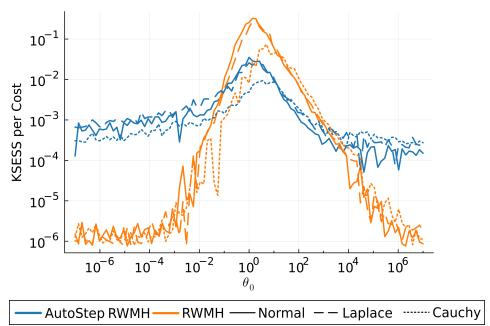  
(a) RWMH

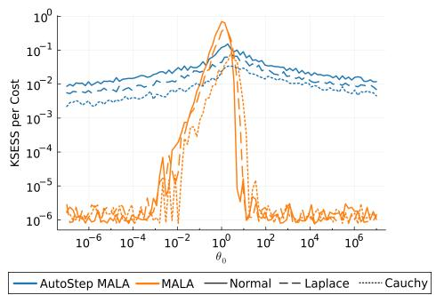  
(b) MALA

Figure 3: KSESS per unit cost for AutoStep (blue) and fixed-step (orange) RWMH (Fig. 3a) and MALA (Fig. 3b).  
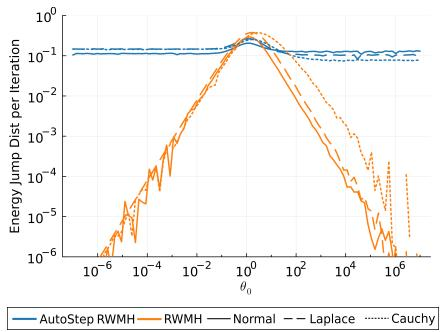  
(a) Energy Jump Distance per Iteration

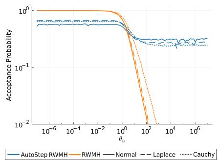  
(b) Acceptance Probability

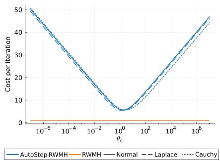  
(c) Cost per Iteration  
Figure 4: Energy jump distance per iteration (Fig. 4a), acceptance probability (Fig. 4b), and cost per iteration (Fig. 4c) for AutoStep and fixed step RWMH versus initial step size θ0.

predicted by Corollary 4.10.

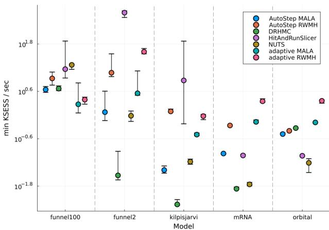  
Figure 5: min KSESS per second for AutoStep and stateof-the-art samplers across five benchmarked models.

## 5.4. Comparison with other adaptive methods

We compare the performance of AutoStep RWMH/MALA against five state-of-the-art adaptive samplers: NUTS (Neal, 2011), the hit-and-run slice sampler (Neal, 2003; Belisle´ et al., 1993), adaptive RWMH (Vihola, 2012), adaptive MALA (Xu et al., 2020), and delayed rejection HMC (Modi et al., 2024). For AutoStep RWMH/MALA, we use roundbased adaptive tuning to adjust the initial step size and diagonal preconditioner. Our benchmarks include two synthetic distributions—Neal’s funnel in 2 and 100 dimensions—and three real Bayesian posteriors: a three-parameter linear regression model for yearly temperatures at Kilpisjarvi, Fin-¨ land (Bales et al., 2019), an orbit-fitting problem (Thompson et al., 2024), and an mRNA transfection model (Ballnus et al., 2017).

Fig. 5 presents the results in terms of minimum KSESS across dimensions per second. This figure demonstrates that AutoStep methods consistently achieve reasonable performance across all five benchmarks, particularly on the challenging funnel targets. AutoStep RWMH shows competitive performance, generally within the range of the other methods. AutoStep MALA shows slightly lower performance in some settings but exhibits better scaling to higher dimensions, as seen in the funnel100 results. Overall, both AutoStep variants demonstrate robust efficiency across diverse model geometries.

## 6. Conclusion

In this paper we presented AutoStep MCMC, a locallyadaptive step size selection method for involutive MCMC. We proved that AutoStep MCMC kernels are π-invariant, irreducible, and aperiodic under mild conditions. We also provided bounds on the mean energy jump distance and expected cost per iteration. We demonstrated empirically that AutoStep MCMC is stable, reliable, and competitive with other adaptive methods. One promising direction for future work is a rigorous theoretical analysis of the sampling efficiency of AutoStep MCMC in terms of expected squared jump distance and asymptotic variance.

## Acknowledgements

ABC and TC acknowledge the support of an NSERC Discovery Grant. TL acknowledges the support of the UBC Advanced Machine Learning Training Network. NS acknowledges the support of a Vanier Canada Graduate Scholarship. We additionally acknowledge use of the ARC Sockeye computing platform from the University of British Columbia.

## Impact Statement

This work presents a new MCMC algorithm; the societal consequences of MCMC need not be discussed in this paper.

## References

Andrieu, C. and Thoms, J. A tutorial on adaptive MCMC. Statistics and Computing, 18(4):343–373, 2008.

Andrieu, C., Lee, A., and Livingstone, S. A general perspective on the Metropolis–Hastings kernel. arXiv:2012.14881, 2020.

Atchade, Y. F. An adaptive version for the Metropolis ad-´ justed Langevin algorithm with a truncated drift. Methodology and Computing in Applied Probability, 8(2):235– 254, 2006.

Bales, B., Pourzanjani, A., Vehtari, A., and Petzold, L. Selecting the metric in hamiltonian monte carlo. arXiv preprint arXiv:1905.11916, 2019.

Ballnus, B., Hug, S., Hatz, K., Gorlitz, L., Hasenauer, J., ¨ and Theis, F. J. Comprehensive benchmarking of Markov chain Monte Carlo methods for dynamical systems. BMC Systems Biology, 2017.

Belisle, C., Romeijn, E., and Smith, R. Hit-and-run algo-´ rithms for generating multivariate distributions. Mathematics of Operations Research, 18(2):255–266, 1993.

Biron-Lattes, M., Surjanovic, N., Syed, S., Campbell, T., and Bouchard-Cotˆ e, A. autoMALA: Locally adaptive ´

Metropolis-adjusted Langevin algorithm. In International Conference on Artificial Intelligence and Statistics, 2024.

Bou-Rabee, N., Carpenter, B., Kleppe, T. S., and Marsden, M. Incorporating local step-size adaptivity into the No-U-Turn Sampler using Gibbs self tuning. arXiv: 2408.08259, 2024a.

Bou-Rabee, N., Carpenter, B., and Marsden, M. GIST: Gibbs self-tuning for locally adaptive Hamiltonian Monte Carlo. arXiv:2404.15253, 2024b.

Chimisov, C., Latuszynski, K., and Roberts, G. Air Markov chain Monte Carlo. arXiv:1801.09309, 2018.

Coullon, J., South, L., and Nemeth, C. Efficient and generalizable tuning strategies for stochastic gradient MCMC. Statistics and Computing, 33(3):66, 2023.

Duane, S., Kennedy, A., Pendleton, B. J., and Roweth, D. Hybrid Monte Carlo. Physics Letters B, 195(2):216–222, 1987.

Flegal, J. M., Haran, M., and Jones, G. L. Markov chain Monte Carlo: Can we trust the third significant figure? Statistical Science, 23(2):250 – 260, 2008.

Galin L Jones, Murali Haran, B. S. C. and Neath, R. Fixedwidth output analysis for Markov chain Monte Carlo. Journal of the American Statistical Association, 101(476): 1537–1547, 2006.

Gelman, A., Carlin, J., Stern, H., Dunson, D., Vehtari, A., and Rubin, D. Bayesian Data Analysis. CRC Press, 3rd edition, 2013.

Geyer, C. J. Practical Markov Chain Monte Carlo. Statistical Science, 7(4):473 – 483, 1992.

Girolami, M. and Calderhead, B. Riemann manifold Langevin and Hamiltonian Monte Carlo methods. Journal of the Royal Statistical Society: Series B (Statistical Methodology), 73(2):123–214, 2011.

Green, P. and Mira, A. Delayed rejection in reversible jump Metropolis–Hastings. Biometrika, 88(4):1035– 1053, 2001.

Haario, H., Saksman, E., and Tamminen, J. An adaptive Metropolis algorithm. Bernoulli, 7(2):223–242, 2001.

Hastings, W. K. Monte Carlo sampling methods using Markov chains and their applications. Biometrika, 57(1): 97–109, 1970.

Hoffman, M. D. and Gelman, A. The No-U-Turn Sampler: Adaptively setting path lengths in Hamiltonian Monte Carlo. The Journal of Machine Learning Research, 15 (1):1593–1623, 2014.

Kleppe, T. S. Adaptive step size selection for Hessian-based manifold Langevin samplers. Scandinavian Journal of Statistics, 43(3):788–805, 2016.

Kolmogorov, A. Sulla determinazione empirica di una legge di distributione. Giornale dell’ Istituto Italiano degli Attuari, 4:83–91, 1933.

Livingstone, S. Geometric ergodicity of the random walk Metropolis with position-dependent proposal covariance. Mathematics, 9(4), 2021.

Maire, F. and Vandekerkhove, P. Markov kernels local aggregation for noise vanishing distribution sampling. SIAM Journal on Mathematics of Data Science, 4(4): 1293–1319, 2022.

Marsaglia, G., Tsang, W. W., and Wang, J. Evaluating Kolmogorov’s distribution. Journal of Statistical Software, 8 (18):1–4, 2003.

Marshall, T. and Roberts, G. An adaptive approach to Langevin MCMC. Statistics and Computing, 22:1041– 1057, 09 2012.

Metropolis, N., Rosenbluth, A. W., Rosenbluth, M. N., Teller, A. H., and Teller, E. Equation of state calculations by fast computing machines. The Journal of Chemical Physics, 21(6):1087–1092, 1953.

Modi, C., Barnett, A., and Carpenter, B. Delayed rejection Hamiltonian Monte Carlo for sampling multiscale distributions. Bayesian Analysis, 2024.

Neal, R. MCMC using Hamiltonian dynamics. In Brooks, S., Gelman, A., Jones, G., and Meng, X.-L. (eds.), Handbook of Markov chain Monte Carlo, chapter 5. CRC Press, 2011.

Neal, R. M. Bayesian Learning for Neural Networks. Springer New York, 1 edition, 1996.

Neal, R. M. Slice sampling. The Annals of Statistics, 31(3): 705–767, 2003.

Neklyudov, K., Shvechikov, P., and Vetrov, D. Metropolis-Hastings view on variational inference and adversarial training. arXiv:1810.07151, 2018.

Neklyudov, K., Welling, M., Egorov, E., and Vetrov, D. Involutive MCMC: A unifying framework. In International Conference on Machine Learning, 2020.

Nishimura, A. and Dunson, D. Variable length trajectory compressible hybrid Monte Carlo. arXiv:1604.00889, 2016.

Polson, N. G. and Scott, J. G. On the half-Cauchy prior for a global scale parameter. Bayesian Analysis, 7(4):887–902, 2012.

Roberts, G. and Rosenthal, J. General state space Markov chains and MCMC algorithms. Probability Surveys, 1: 20–71, 2004.

Roberts, G., Gelman, A., and Gilks, W. Weak convergence and optimal scaling of random walk Metropolis algorithms. Annals of Applied Probability, 7(1):110–120, 1997.

Roberts, G. O. and Rosenthal, J. S. Optimal scaling of discrete approximations to Langevin diffusions. Journal of the Royal Statistical Society. Series B (Statistical Methodology), 60(1):255–268, 1998.

Rossky, P. J., Doll, J. D., and Friedman, H. L. Brownian dynamics as smart Monte Carlo simulation. The Journal of Chemical Physics, 69(10):4628–4633, 1978.

Surjanovic, N., Biron-Lattes, M., Tiede, P., Syed, S., Campbell, T., and Bouchard-Cotˆ e, A. Pigeons.jl: ´ Distributed sampling from intractable distributions. arXiv:2308.09769, 2023.

Surjanovic, N., Syed, S., Bouchard-Cotˆ e, A., and Campbell, ´ T. Uniform ergodicity of parallel tempering with efficient local exploration. arXiv:2405.11384, 2024.

Thompson, W., Lawrence, J., Blakely, D., Marois, C., Wang, J., Giordano, M., Brandt, T., Johnstone, D., Ruffio, J.-B., Ammons, S., Crotts, K., Do O, C., Gonzales, E., and Rice, ´ M. Octofitter: fast, flexible, and accurate orbit modelling to detect exoplanets. The Astronomical Journal, 166(164): 1–20, 2024.

Tierney, L. A note on Metropolis–Hastings kernels for general state spaces. The Annals of Statistics, 8(1):1–9, 1998.

Tierney, L. and Mira, A. Some adaptive Monte Carlo methods for Bayesian inference. Statistics in Medicine, 18 (17-18):2507–2515, 1999.

Turok, G., Modi, C., and Carpenter, B. Sampling from multiscale densities with delayed rejection generalized Hamiltonian Monte Carlo. arXiv:2406.02741, 2024.

Vihola, M. Robust adaptive Metropolis algorithm with coerced acceptance rate. Statistics and Computing, 22(5): 997–1008, 2012.

Xu, K., Ge, H., Tebbutt, W., Tarek, M., Trapp, M., and Ghahramani, Z. AdvancedHMC.jl: A robust, modular and efficient implementation of advanced HMC algorithms. In Proceedings of The 2nd Symposium on Advances in Approximate Bayesian Inference, 2020.

## A. Proofs

Proof of Proposition 4.2. The auxiliary refreshment and tuning parameter refreshment steps in AutoStep MCMC (Steps 1. and 2.) resample $( z , a , b , \theta )$ jointly from their conditional distribution given x under π. This move is well-known to be π¯-invariant, and so it remains only to show that the Metropolis-corrected involutive proposal (Steps 3. and 4.) is π¯-invariant. The kernel for the proposal on the augmented space $s$ is

$$
Q ( s , \mathrm { d } s ^ { \prime } ) = \delta _ { \overline { { f } } ( s ) } ( \mathrm { d } s ^ { \prime } ) ,
$$

and the acceptance probability $\alpha : { \mathcal { S } } ^ { 2 }  \mathbb { R } _ { + }$ is given by

$$
\alpha ( s , s ^ { \prime } ) = \operatorname* { m i n } \biggl \{ 1 , \frac { \overline { { { \pi } } } ( s ^ { \prime } ) } { \overline { { { \pi } } } ( s ) } J ( s ) \biggr \} .
$$

In the notation of Tierney (1998, Theorem 2), define the measure $\mu ( \mathrm { d } s , \mathrm { d } s ^ { \prime } ) = \overline { { \pi } } ( \mathrm { d } s ) \delta _ { \overline { { f } } ( s ) } ( \mathrm { d } s ^ { \prime } )$ ; because $\bar { f }$ is an involution, we have that the symmetric set R and density ratio $r : R \to \mathbb { R } _ { + }$ are given by

$$
R = \{ ( s , s ^ { \prime } ) \in S ^ { 2 } : \bar { f } ( s ) = s ^ { \prime } , \bar { \pi } ( s ) > 0 , \bar { \pi } ( s ^ { \prime } ) > 0 \} , \qquad r ( s , s ^ { \prime } ) = \frac { \overline { { \pi } } ( \mathrm { d } s ) \delta _ { \bar { f } ( s ) } ( \mathrm { d } s ^ { \prime } ) } { \overline { { \pi } } ( \mathrm { d } s ^ { \prime } ) \delta _ { \bar { f } ( s ^ { \prime } ) } ( \mathrm { d } s ) } .
$$

Note that condition (i) of Tierney (1998, Theorem 2) holds by definition of R and $\alpha .$ . Suppose for the moment that $\begin{array} { r } { r ( s , s ^ { \prime } ) = \frac { \overline { \pi } ( s ) } { \overline { \pi } ( s ^ { \prime } ) } J ( s ^ { \prime } ) } \end{array}$ ; then condition (ii)—and hence π-invariance—holds because

$$
\alpha ( s , s ^ { \prime } ) r ( s , s ^ { \prime } ) = \operatorname* { m i n } \biggl \{ 1 , \frac { \overline { { \pi } } ( s ^ { \prime } ) } { \overline { { \pi } } ( s ) } J ( s ) \biggr \} \frac { \overline { { \pi } } ( s ) } { \overline { { \pi } } ( s ^ { \prime } ) } J ( s ^ { \prime } ) = \operatorname* { m i n } \biggl \{ \frac { \overline { { \pi } } ( s ) } { \overline { { \pi } } ( s ^ { \prime } ) } J ( s ^ { \prime } ) , J ( s ^ { \prime } ) J ( s ) \biggr \} = \alpha ( s ^ { \prime } , s ) ,
$$

which follows because $J ( s ) J ( s ^ { \prime } ) = 1 \ \mu { \cdot } \mathrm { a . e }$ . on $R .$ To demonstrate that $r ( s , s ^ { \prime } )$ has the required form, consider a test function $g : S ^ { 2 } \to { \mathbb { R } }$ :

$$
\begin{array} { l } { \displaystyle \int g ( s , s ^ { \prime } ) \overline { { \pi } } ( \mathrm { d } s ) \delta _ { \overline { { f } } ( s ) } ( \mathrm { d } s ^ { \prime } ) = \int g ( s , \bar { f } ( s ) ) \overline { { \pi } } ( \mathrm { d } s ) } \\ { \displaystyle \qquad = \int g ( ( x , z , a , b , \theta ) , ( f _ { \theta } ( x , z ) , a , b , \theta ) ) \overline { { \pi } } ( x , z , a , b , \theta ) \mathrm { d } x \mathrm { d } z \mathrm { d } ( a , b ) \mathrm { d } \theta . } \end{array}
$$

Since $f _ { \theta }$ is a continuously differentiable involution, we can transform variables $x ^ { \prime } , z ^ { \prime } = f _ { \theta } ( x , z )$ by including a Jacobian term $J ( s ) = | \nabla f _ { \theta } ( x , z ) |$ | in the integrand and by noting $x , z = f _ { \theta } ( x ^ { \prime } , z ^ { \prime } )$ :

$$
\begin{array} { r l } & { = \displaystyle \int g ( ( f _ { \theta } ( x ^ { \prime } , z ^ { \prime } ) , a , b , \theta ) , ( x ^ { \prime } , z ^ { \prime } , a , b , \theta ) ) \pi ( f _ { \theta } ( x ^ { \prime } , z ^ { \prime } ) , a , b , \theta ) | \nabla f _ { \theta } ( x ^ { \prime } , z ^ { \prime } ) | \mathrm { d } x ^ { \prime } \mathrm { d } z ^ { \prime } \mathrm { d } ( a , b ) \mathrm { d } \theta } \\ & { = \displaystyle \int g ( \bar { f } ( s ^ { \prime } ) , s ^ { \prime } ) \bar { \pi } ( \bar { f } ( s ^ { \prime } ) ) J ( s ^ { \prime } ) \mathrm { d } s ^ { \prime } } \\ & { = \displaystyle \int g ( \bar { f } ( s ^ { \prime } ) , s ^ { \prime } ) \frac { \bar { \pi } ( \bar { f } ( s ^ { \prime } ) ) } { \bar { \pi } ( s ^ { \prime } ) } J ( s ^ { \prime } ) \bar { \pi } ( \mathrm { d } s ^ { \prime } ) } \\ & { = \displaystyle \int g ( s , s ^ { \prime } ) \frac { \bar { \pi } ( s ) } { \bar { \pi } ( s ^ { \prime } ) } J ( s ^ { \prime } ) \bar { \pi } ( \mathrm { d } s ^ { \prime } ) \delta _ { \bar { f } ( s ^ { \prime } ) } ( \mathrm { d } s ) . } \end{array}
$$

Examining the first and last integral expressions, the density ratio has the form

$$
r ( s , s ^ { \prime } ) = \frac { \overline { { { \pi } } } ( \mathrm { d } s ) \delta _ { \overline { { { f } } } ( s ) } ( \mathrm { d } s ^ { \prime } ) } { \overline { { { \pi } } } ( \mathrm { d } s ^ { \prime } ) \delta _ { \overline { { { f } } } ( s ^ { \prime } ) } ( \mathrm { d } s ) } = \frac { \overline { { { \pi } } } ( s ) } { \overline { { { \pi } } } ( s ^ { \prime } ) } J ( s ^ { \prime } ) .
$$

Proof of Proposition 4.5. Let $K ( x , \cdot )$ denote the Markov kernel for the X -marginal process of AutoStep MCMC. Since for $u , v \geq 0$ , min $\{ 1 , u v \} \geq \operatorname* { m i n } \{ 1 , u \}$ min $\{ 1 , v \}$ , we have that for $\boldsymbol { s } = ( x , z , a , b , \theta )$

$$
\operatorname* { m i n } \biggl \{ 1 , \frac { \overline { { \pi } } ( \bar { f } ( s ) ) } { \overline { { \pi } } ( s ) } J ( s ) \biggr \} \geq \operatorname* { m i n } \Bigl \{ 1 , e ^ { \ell ( x , z , \theta ) } \Bigr \} \operatorname* { m i n } \biggl \{ 1 , \frac { \eta ( \theta \mid f _ { \theta } ( x , z ) , a , b ) } { \eta ( \theta \mid x , z , a , b ) } \Bigr \} .
$$

Therefore

$$
\begin{array} { l } { { \displaystyle { K ( x , A ) \geq \int \mathbb { 1 } \big [ f _ { \theta } ( x , z ) \in A \times \mathcal { Z } \big ] \operatorname* { m i n } \bigg \{ 1 , e ^ { \ell ( x , z , \theta ) } \bigg \} \operatorname* { m i n } \bigg \{ 1 , \frac { \eta ( \theta \mid f _ { \theta } ( x , z ) , a , b ) } { \eta ( \theta \mid x , z , a , b ) } \bigg \} \eta ( \mathrm { d } \theta \mid x , z , a , b ) m ( \mathrm { d } z ) \mathbb { 1 } _ { \Delta } ( \mathrm { d } ( a , b ) ) } } } \\ { { \displaystyle { \qquad = \int \mathbb { 1 } \big [ f _ { \theta } ( x , z ) \in A \times \mathcal { Z } \big ] \operatorname* { m i n } \bigg \{ 1 , e ^ { \ell ( x , z , \theta ) } \bigg \} \gamma ( x , z , \theta ) m ( \mathrm { d } z ) \mathrm { d } \theta , } } } \end{array}
$$

where

$$
\gamma ( x , z , \theta ) = \int \operatorname* { m i n } \{ \eta ( \theta \mid x , z , a , b ) , \eta ( \theta \mid f _ { \theta } ( x , z ) , a , b ) \} \mathbb { 1 } _ { \Delta } ( \mathrm { d } ( a , b ) ) .
$$

By Assumption 4.4, for all $x \in { \mathcal { X } } , m { \mathrm { - a . e . ~ } } z \in { \mathcal { Z } }$ , and for all $\theta \in B$ where $\begin{array} { r } { \int _ { B } \mathrm { d } \theta > 0 , \gamma ( x , z , \theta ) > 0 } \end{array}$ . Therefore

$$
\begin{array} { l } { \displaystyle \int \mathbb { 1 } [ f _ { \theta } ( x , z ) \in A \times \mathcal { Z } ] \operatorname* { m i n } \Bigl \{ 1 , e ^ { \ell ( x , z , \theta ) } \Bigr \} \gamma ( x , z , \theta ) m ( \mathrm { d } z ) \mathbb { 1 } [ \theta \in B ] \mathrm { d } \theta > 0 } \\ { \longleftrightarrow \displaystyle \int \mathbb { 1 } [ f _ { \theta } ( x , z ) \in A \times \mathcal { Z } ] \operatorname* { m i n } \Bigl \{ 1 , e ^ { \ell ( x , z , \theta ) } \Bigr \} m ( \mathrm { d } z ) \mathbb { 1 } [ \theta \in B ] \mathrm { d } \theta > 0 . } \end{array}
$$

The proof concludes by noting that

$$
\int \Im [ f _ { \theta } ( x , z ) \in A \times \mathcal { Z } ] \operatorname* { m i n } \Bigl \{ 1 , e ^ { \ell ( x , z , \theta ) } \Bigr \} m ( \mathrm { d } z ) \Im [ \theta \in B ] \mathrm { d } \theta = \int P _ { \theta } ( x , A ) \Im [ \theta \in B ] \mathrm { d } \theta ,
$$

where $P _ { \theta } ( x , A )$ is the one-step probability of transitioning into A from x for the original involutive chain with parameter $\theta ,$ and then by applying Assumption 4.3. □

Proof of Corollary 4.6. The proof involves verifying Assumption 4.4. Note that dθ is the counting measure on $\{ \theta =$ $\theta _ { 0 } \times 2 ^ { j } : j \in \mathbb { Z } \}$ . Consider setting $B = \left\{ \theta _ { 0 } \right\}$ . Assumption 4.4 holds if for all $x \in \mathcal { X }$ and $m { \cdot } \mathrm { a } . \mathrm { e } . \ z \in { \mathcal { Z } }$ ，

$$
\int \ d \mathbb { 1 } [ \mu ( x , z , a , b ) = \theta _ { 0 } = \mu ( f _ { \theta _ { 0 } } ( x , z ) , a , b ) ] \mathbb { 1 } _ { \Delta } ( \mathrm { d } ( a , b ) ) > 0 .
$$

That ${ \mathrm { i s } } ,$ if there is a nonzero probability of choosing the default parameter $\theta _ { 0 }$ at any point $( x , z )$ . Note that

$$
\begin{array} { r l } & { \mu ( x , z , a , b ) = \theta _ { 0 } = \mu ( f _ { \theta _ { 0 } } ( x , z ) , a , b ) } \\ & { \quad \Longleftrightarrow \log ( a ) < \ell ( x , z , \theta _ { 0 } ) < \log ( b ) \quad \mathrm { o r } \quad \log ( a ) < - \ell ( x , z , \theta _ { 0 } ) < \log ( b ) . } \end{array}
$$

By assumption, for all $x \in \mathcal { X }$ and $m { \cdot } \mathbf { a } . \mathbf { e } . \ z \ \in \ { \mathcal { Z } }$ , we have $\ell ( x , z , \theta _ { 0 } ) \not \in \{ - \infty , 0 , \infty \}$ . If $\ell ( x , z , \theta _ { 0 } ) > 0$ , then when $a < \exp ( - \ell ( x , z , \theta _ { 0 } ) ) < b$ we have the condition hold. This has positive measure under $\mathbb { 1 } _ { \Delta } ( \mathrm { d } ( a , b ) )$ . If $\ell ( x , z , \theta _ { 0 } ) < 0$ then when $a < \exp ( \ell ( x , z , \theta _ { 0 } ) ) < b ,$ , the above condition holds. This set also has positive measure. □

Lemma A.1. For the AutoStep RWMH kernel with any fixed $\theta > 0 , x \in \mathcal { X } _ { }$ , and $A \subset { \mathcal { X } }$ with $\pi ( A ) > 0 ;$ , we have $P _ { \theta } ( x , A ) > 0 ;$ , provided that $\pi ( x ) > 0 .$ for all $x \in { \mathcal { X } } .$

Proof of Lemma A.1. Fix $\theta > 0 , A \subset \mathcal { X }$ with $\pi ( A ) > 0$ and $x \in \mathcal { X }$ . Because $\pi \ll \lambda$ , we have $\lambda ( A ) > 0$ . By translation properties of the Lebesgue measure, for any $x \in \mathbb { R } ^ { d } , \lambda ( A ) = \lambda ( A - x ) > 0 ,$ , where $A - x = \{ { \tilde { x } } - x : { \tilde { x } } \in A \}$ . Here, $( x ^ { \prime } , z ^ { \prime } ) = f _ { \boldsymbol \theta } ( x , z ) = ( x + z , - z )$ and so $| \nabla f _ { \boldsymbol { \theta } } ( x , z ) | = 1$ . Also, since $z \sim m$ where $m = \mathcal { N } ( 0 , I )$ , we have

$$
\ell ( x , z , \theta ) = \log \left( \frac { \pi ( x ^ { \prime } ) } { \pi ( x ) } \right) .
$$

Then,

$$
P _ { \theta } ( x , A ) \geq \int \mathbb { 1 } [ z \in A - x ] \operatorname* { m i n } \biggl \{ 1 , \frac { \pi ( x + z ) } { \pi ( x ) } \biggr \} m ( z ) \lambda ( \mathrm { d } z ) > 0 ,
$$

because for all $x , z$ we have $\lambda ( A - x ) > 0 , m ( z ) > 0$ , and min $\{ 1 , \pi ( x + z ) / \pi ( x ) \} > 0 .$

Lemma A.2. For the AutoStep MALA kernel with any fixed $\theta > 0 , x \in \mathcal { X } _ { \mathrm { ~ \scriptsize ~ . ~ } }$ , differentiable π, positive definite M , and $A \subset { \mathcal { X } }$ with $\pi ( A ) > 0$ , we have $P _ { \theta } ( x , A ) > 0$ , provided that $\pi ( x ) > 0 f o r$ all $x \in \mathcal { X }$

Proof of Lemma A.2. Fix $\theta > 0 , A \subset \mathcal { X }$ with $\pi ( A ) > 0$ and $x \in { \mathcal { X } } .$ . Because $\pi \ll \lambda .$ , we have $\lambda ( A ) > 0$ . As in (Biron-Lattes et al., 2024), we combine the updates on $( x , z )$ into one step, so that $f _ { \theta } ( x , z ) = ( x ^ { \prime } ( \theta ) , z ^ { \prime } ( \theta ) )$ , where

$$
x ^ { \prime } ( \theta ) = x + \theta M ^ { - 1 } z + \frac { \theta ^ { 2 } } { 2 } M ^ { - 1 } \nabla \log \gamma ( x ) , \qquad z ^ { \prime } ( \theta ) = - \left( z + \frac { \theta } { 2 } \nabla \log \gamma ( x ) + \frac { \theta } { 2 } \nabla \log \gamma ( x ^ { \prime } ( \theta ) ) \right) .
$$

Now, $x ^ { \prime } ( \theta ) \in A$ if

$$
z \in A _ { x } : = \bigg \{ \frac { M ( \widetilde { x } - x ) } { \theta } - \frac { \theta } { 2 } \nabla \log \gamma ( x ) : \widetilde { x } \in A \bigg \} .
$$

By translation and scaling properties of the Lebesgue measure, for any $x \in \mathbb { R } ^ { d } , \lambda ( A _ { x } ) > 0$ . It is a standard result that the leapfrog integrator satisfies $| \nabla f _ { \boldsymbol { \theta } } ( x , z ) | = 1$ . We have

$$
\ell ( x , z , \theta ) = \log \biggl ( \frac { \pi ( x ^ { \prime } ) m ( z ^ { \prime } ) } { \pi ( x ) m ( z ) } \biggr ) .
$$

Then,

$$
P _ { \theta } ( x , A ) \geq \int \mathbb { 1 } [ z \in A _ { x } ] \operatorname* { m i n } \Biggl \{ 1 , \frac { \pi ( x ^ { \prime } ) m ( z ^ { \prime } ) } { \pi ( x ) m ( z ) } \Biggr \} m ( z ) \lambda ( \mathrm { d } z ) > 0 .
$$

because for all $x , z$ we have $\lambda ( A _ { x } ) > 0 , m ( z ) > 0$ , and the acceptance ratio is positive.

Proof of Proposition 4.8. We generalize the step size termination proof of Theorem 3.3 by Biron-Lattes et al. (2024). Consider first the case where $v = - 1$ . Since for $\begin{array} { r } { \pi \times m \mathbf { - a . e . \ } x , z , \operatorname* { l i m } _ { \theta  0 ^ { + } } | \ell ( x , z , \theta ) | = 0 } \end{array}$ , and $| \log a | > 0$ almost surely, there exists a $\theta ^ { \prime } > 0$ such that $\forall 0 < \theta < \theta ^ { \prime } , | \ell ( x , z , \theta ) | < | \log a |$ . Therefore there exists a $. j < 0$ such that $2 ^ { j } \theta _ { 0 } < \theta ^ { \prime }$ and the while loop terminates. Next consider the case where $v = 1$ . Since for $\begin{array} { r }  \pi \times m . \mathrm { ~ } \mathrm { ~ } \mathrm { ~ } \mathrm { ~ } \times , \mathrm { ~ } \mathrm { ~ } \times , \mathrm { ~ } \mathrm { ~ } \times , \mathrm { ~ } \times , \mathrm { ~ } \times , \mathrm { ~ } \times , \mathrm { ~ } \times , \mathrm { ~ } \times , \mathrm { ~ } \times , \mathrm { ~ } \times , \mathrm { ~ } \times , \mathrm { ~ } \times , \mathrm { ~ } \times , \mathrm { ~ } \times , \mathrm { ~ } \times , \mathrm { ~ } \times , \mathrm { ~ } \times , \mathrm { ~ } \times , \mathrm { ~ } \times , \mathrm { ~ } \times , \mathrm { ~ } \times , \mathrm { ~ } \times , \mathrm { ~ } \times , \mathrm { ~ } \times , \mathrm { ~ } \times , \mathrm { ~ } \times , \mathrm { ~ } \times , \mathrm { ~ } \times , \mathrm { ~ } \times , \mathrm { ~ } \times , \mathrm { ~ } \times , \mathrm { ~ } \times , \mathrm { ~ } \times , \mathrm { ~ } \times , \mathrm { ~ } \times , \mathrm { ~ } \times , \mathrm { ~ } \times , \mathrm { ~ } \times , \mathrm { ~ } \times , \mathrm { ~ } \times , \mathrm { ~ } \times , \mathrm { ~ } \times , \mathrm { ~ } \times , \mathrm { ~ } \times , \mathrm { ~ } \times , \mathrm { ~ } \times , \mathrm { ~ } \times , \mathrm { ~ } \times , \mathrm { ~ } \times , \mathrm { ~ } \times , \mathrm { ~ } \times , \mathrm { ~ } \times , \mathrm { ~ } \times , \mathrm { ~ } \times , \mathrm { ~ } \times , \mathrm { ~ } \times , \mathrm { ~ } \times , \mathrm { ~ } \times , \mathrm { ~ } \times \mathrm { ~ } \times , \mathrm { ~ } \times \mathrm { ~ } \times , \mathrm { ~ } \times \mathrm { ~ } \times \mathrm { ~ ~ } \mathrm { ~ } \times \mathrm { ~ } \times \mathrm { ~ ~ } \mathrm { ~ } \mathrm { ~ ~ } \mathrm { ~ } \times \mathrm { ~ ~ } \mathrm { ~ } \times \mathrm { ~ ~ } \mathrm { ~ } \times \mathrm { ~ ~ } \mathrm { ~ } \times \mathrm { ~ ~ } \mathrm { ~ ~ } \mathrm \times \times \mathrm { ~ ~ } \mathrm  \mathrm \end{array}$ , and | log b| < ∞ almost surely, there exists a $\theta ^ { \prime } > 0$ such that $\theta > \theta ^ { \prime } , | \ell ( x , z , \theta ) | > | \log b |$ . Therefore there exists a $j > 0$ such that $2 ^ { j } \theta _ { 0 } > \theta ^ { \prime }$ and the while loop terminates.

Proof of Proposition 4.9.

$$
\begin{array} { r l } { \mathbb { E } \tau ( s , \theta _ { 0 } ) = } & { \frac { \sum _ { k = 0 } ^ { \infty } [ \boldsymbol { \wp } ( \tau , \theta _ { 0 } ) ] \times [ \boldsymbol { \wp } ( s , \theta _ { 0 } ) ] } { \mathrm { t o r } } } \\ & { = \frac { \sum _ { k = 0 } ^ { \infty } [ \big ( \underset { s = 0 } { \operatorname* { m a x } } \big [ \boldsymbol { \wp } ( \tau , s , 2 ^ { 2 } \hat { \theta } _ { 0 } ) \big ] < \big | \mathrm { t o g } \hat { s } \big | \big | \ll \frac { \operatorname* { m i n } } { e - \mathrm { t } \cdot \mathrm { E x } ^ { 2 } } \big | \big | \hat { a } ( z , s , 2 ^ { 2 } \hat { \theta } _ { 0 } ) \big | > \big | \log \alpha \big | ) } { \mathrm { t o r } } } \\ & { \leq \frac { \sum _ { k = 0 } ^ { \infty } \bigg [ \big ( \underset { s = 0 } { \operatorname* { m a x } } \big [ \boldsymbol { \wp } ( \tau , z , z ^ { 2 } \hat { \theta } _ { 0 } ) \big ] \times \big | \mathrm { t o g } \hat { s } \big | \bigg ) + \big | \big | \Phi \big ( \tau , \mathrm { r e x } \big | \big | \hat { a } ( x , z , z ^ { 2 } \hat { \theta } _ { 0 } ) \big | > \big | \log \alpha \big | \bigg ) } { \mathrm { t o r } } } \\ & { \leq \frac { \sum _ { k = 0 } ^ { \infty } \big [ \big ( | \boldsymbol { \wp } ( \tau , z , z ^ { 2 } \hat { \theta } _ { 0 } ) \big | < \big | \mathrm { t o g } \hat { s } \big | \big ) + \big | \big | \Phi \big ( \hat { s } \big | \big | \big | \hat { a } ( x , z , z ^ { - 2 } \hat { \theta } _ { 0 } ) \big | > \big | \log \alpha \big | ) } { \mathrm { t o r } } } \\ &  = \frac  \sum _ { k = 0 } ^ { \infty } \big [ \big | \big | \boldsymbol { \wp } ( \tau , z , z ^  \end{array}
$$

Since $a , b$ are uniform on $0 \leq a < b \leq 1$

$$
\mathbb { P } ( a > x ) = ( 1 - x ) ^ { 2 } , \quad \mathrm { a n d } \quad \mathbb { P } ( b < x ) = x ^ { 2 } ,
$$

so

$$
\mathbb { E } \tau ( s , \theta _ { 0 } ) \le \sum _ { t = 0 } ^ { \infty } \mathbb { E } e ^ { - 2 \vert \ell ( x , z , 2 ^ { t } \theta _ { 0 } ) \vert } + \mathbb { E } \bigg [ \bigg ( 1 - e ^ { - \vert \ell ( x , z , 2 ^ { - t } \theta _ { 0 } ) \vert } \bigg ) ^ { 2 } \bigg ] , \quad ( x , z ) \sim \pi \times m .
$$

Fubini’s theorem completes the proof.

Proof of Corollary 4.10. The involution for RWMH with M = I is given by

$$
f _ { \theta } ( x , z ) = ( x + \theta z , - z ) , \quad m = \mathcal { N } ( 0 , I ) .
$$

Therefore,

$$
\ell ( x , z , \theta ) = \log \left( \frac { \pi ( x + \theta z ) , m ( - z ) } { \pi ( x ) m ( z ) } \right) = \log \pi ( x + \theta z ) - \log \pi ( x ) .
$$

Since log π is L-Lipschitz smooth,

$$
| \ell ( x , z , \theta ) | \leq \theta | \nabla \log \pi ( x ) ^ { T } z | + \frac { 1 } { 2 } L \theta ^ { 2 } \| z \| ^ { 2 } .
$$

Therefore,

$$
\begin{array} { r l } {  { \sum _ { t = 0 } ^ { \infty } \Bigl ( 1 - e ^ { - | \ell ( x , z , 2 ^ { - i } \theta _ { 0 } ) | } \Bigr ) ^ { 2 } \leq \sum _ { t = 0 } ^ { \infty } \Bigl ( 1 - e ^ { - 2 ^ { - t } \theta _ { 0 } | \nabla \log \pi ( x ) ^ { T } z | - \frac { 1 } { 2 } L \theta _ { 0 } ^ { 2 } 4 ^ { - t } \| z \| ^ { 2 } } \Bigr ) ^ { 2 } } \quad } & { } \\ & { = \sum _ { t = 0 } ^ { \infty } 1 - 2 e ^ { - 2 ^ { - t } \theta _ { 0 } | \nabla \log \pi ( x ) ^ { T } z | - \frac { 1 } { 2 } L 4 ^ { - t } \theta _ { 0 } ^ { 2 } \| z \| ^ { 2 } } + e ^ { - 2 ^ { - t } \theta _ { 0 } | \nabla \log \pi ( x ) ^ { T } z | - L 4 ^ { - t } \theta _ { 0 } ^ { 2 } \| z \| ^ { 2 } } . } \end{array}
$$

Furthermore, note that $( 1 - e ^ { - x } ) ^ { 2 } \leq \operatorname* { m i n } ( x ^ { 2 } , 1 )$ for $x \geq 0$ . Therefore,

$$
\begin{array} { r l } { \displaystyle \sum _ { t = 0 } ^ { \infty } \Bigl ( 1 - e ^ { - \lvert \ell ( x , z , 2 ^ { - t } \theta _ { 0 } ) \rvert } \Bigr ) ^ { 2 } \leq \displaystyle \sum _ { t = 0 } ^ { \infty } \operatorname* { m i n } \bigl ( \ell ( x , z , 2 ^ { - t } \theta _ { 0 } ) ^ { 2 } , 1 \bigr ) } & { } \\ { \leq \displaystyle \sum _ { t = 0 } ^ { \infty } \operatorname* { m i n } \Biggl ( \Biggl ( 2 ^ { - t } \theta _ { 0 } \lvert \nabla \log \pi ( x ) ^ { T } z \rvert + \frac { 1 } { 2 } L 4 ^ { - t } \theta _ { 0 } ^ { 2 } \lvert \lvert z \rvert | ^ { 2 } \Biggr ) ^ { 2 } , 1 \Biggr ) } & { } \\ { \leq \displaystyle \sum _ { t = 0 } ^ { \infty } \operatorname* { m i n } \Biggl ( 4 ^ { - t } \Bigl ( \theta _ { 0 } \lvert \nabla \log \pi ( x ) ^ { T } z \rvert + \frac { 1 } { 2 } L \theta _ { 0 } ^ { 2 } \| z \| ^ { 2 } \Bigr ) ^ { 2 } , 1 \Biggr ) . } \end{array}
$$

Let $\begin{array} { r } { t _ { 0 } = \lceil \operatorname* { m a x } \{ 0 , ( 3 / 2 ) \log \bigl ( \theta _ { 0 } \vert \nabla \log \pi ( x ) ^ { T } z \vert + \frac { 1 } { 2 } L \theta _ { 0 } ^ { 2 } \| z \| ^ { 2 } \bigr ) \} \rceil } \end{array}$ . Then,

$$
\begin{array} { r l } & { \displaystyle \sum _ { t = 0 } ^ { \infty } \biggl ( 1 - e ^ { - | \ell ( x , z , 2 ^ { - t } \theta _ { 0 } ) | } \biggr ) ^ { 2 } \leq \sum _ { t = 0 } ^ { t _ { 0 } - 1 } 1 + \displaystyle \sum _ { t = t _ { 0 } } ^ { \infty } 4 ^ { - t } \biggl ( \theta _ { 0 } | \nabla \log \pi ( x ) ^ { T } z | + \frac { 1 } { 2 } L \theta _ { 0 } ^ { 2 } \| z \| ^ { 2 } \biggr ) ^ { 2 } } \\ & { \quad \quad \quad = t _ { 0 } + \displaystyle \sum _ { t = 0 } ^ { \infty } 4 ^ { - t } 4 ^ { - t _ { 0 } } \biggl ( \theta _ { 0 } | \nabla \log \pi ( x ) ^ { T } z | + \frac { 1 } { 2 } L \theta _ { 0 } ^ { 2 } \| z \| ^ { 2 } \biggr ) ^ { 2 } } \\ & { \quad \quad \quad \leq t _ { 0 } + \displaystyle \sum _ { t = 0 } ^ { \infty } 4 ^ { - t } \leq t _ { 0 } + 4 / 3 . } \end{array}
$$

Next, since log π is U -strongly log-concave,

$$
\ell ( x , z , \theta ) \leq \theta \nabla \log \pi ( x ) ^ { T } z - \frac { 1 } { 2 } U \theta ^ { 2 } \| z \| ^ { 2 } .
$$

If $\nabla \log \pi ( x ) ^ { T } z \leq 0$ , then

$$
| \ell ( x , z , \theta ) | \geq \theta | \nabla \log \pi ( x ) ^ { T } z | + \frac { 1 } { 2 } U \theta ^ { 2 } \| z \| ^ { 2 } = \frac { 1 } { 2 } U \theta ^ { 2 } \| z \| ^ { 2 } - \theta \nabla \log \pi ( x ) ^ { T } z .
$$

On the other hand, if $7 \log \pi ( x ) ^ { T } z > 0$ , then

$$
| \ell ( x , z , \theta ) | \geq \left\{ \begin{array} { l l } { 0 } & { \theta \leq \frac { 2 \nabla \log \pi ( x ) ^ { T } z } { U \| z \| ^ { 2 } } } \\ { \frac { 1 } { 2 } U \theta ^ { 2 } \| z \| ^ { 2 } - \theta \nabla \log \pi ( x ) ^ { T } z } & { \theta > \frac { 2 \nabla \log \pi ( x ) ^ { T } z } { U \| z \| ^ { 2 } } } \end{array} \right. .
$$

Taken together, for $\theta \ge 0$

$$
\begin{array} { r l } & { | \ell ( x , z , \theta ) | \geq 1 \left[ \theta > \frac { 2 \nabla \log \pi ( x ) ^ { T } z } { U \| z \| ^ { 2 } } \right] \left( \frac { 1 } { 2 } U \theta ^ { 2 } \| z \| ^ { 2 } - \theta \nabla \log \pi ( x ) ^ { T } z \right) } \\ & { \qquad \geq 1 \left[ \theta > \frac { 2 \nabla \log \pi ( x ) ^ { T } z + 1 } { U \| z \| ^ { 2 } } \right] \left( \frac { 1 } { 2 } U \theta ^ { 2 } \| z \| ^ { 2 } - \theta \nabla \log \pi ( x ) ^ { T } z \right) . } \end{array}
$$

$$
\begin{array} { r l } { \displaystyle \sum _ { t = 0 } ^ { \infty } e ^ { - 2 \left| \ell \left( x , z , 2 ^ { t } \theta _ { 0 } \right) \right| } \leq \displaystyle \sum _ { t = 0 } ^ { \infty } e ^ { - 2 \cdot 2 ^ { t } \theta _ { 0 } \mathbb { 1 } \left[ 2 ^ { t } \theta _ { 0 } > \frac { 2 \nabla \log \pi \left( x \right) ^ { T } z + 1 } { U \left\| z \right\| ^ { 2 } } \right] \left( \frac { 1 } { 2 } U 2 ^ { t } \theta _ { 0 } \left\| z \right\| ^ { 2 } - \nabla \log \pi \left( x \right) ^ { T } z \right) } } & { } \\ { \displaystyle \leq \displaystyle \sum _ { t = 0 } ^ { \infty } e ^ { - 2 \cdot 2 ^ { t } \theta _ { 0 } \mathbb { 1 } \left[ 2 ^ { t / 2 } \theta _ { 0 } > 1 , 2 ^ { t } \theta _ { 0 } > \frac { 2 \nabla \log \pi \left( x \right) ^ { T } z + 1 } { U \left\| z \right\| ^ { 2 } } \right] \left( \frac { 1 } { 2 } U 2 ^ { t } \theta _ { 0 } \left\| z \right\| ^ { 2 } - \nabla \log \pi \left( x \right) ^ { T } z \right) } . } & { } \end{array}
$$

Let $\begin{array} { r } { t _ { 0 } ^ { \prime } = \lceil \operatorname* { m a x } \{ 0 , - 3 \log \theta _ { 0 } , ( 3 / 2 ) \log \frac { 2 \nabla \log \pi ( x ) ^ { T } z + 1 } { U \theta _ { 0 } \| z \| ^ { 2 } } \} \rceil } \end{array}$ , where log of a negative number is taken to be $- \infty .$ . Then,

$$
\begin{array} { r l } { \displaystyle \sum _ { i = 0 } ^ { \infty } e ^ { - 2 | \{ ( s - 2 ) ^ { 2 } ( t _ { 0 } ) \} | } \leq \frac { t _ { 0 } ^ { \prime } - 1 } { t _ { 0 } - 1 } + \displaystyle \sum _ { i = 0 } ^ { \infty } e ^ { - 2 2 ^ { s } \theta _ { 0 } [ t _ { i - 1 } ] \left( \frac { 2 \sqrt { 2 } \theta _ { 0 } } { 2 } \theta _ { 0 } \left[ | z | ^ { 2 } - \nabla \log \left( z \right) ^ { T } z _ { 0 } \right] \right) } } & { } \\ { \displaystyle \sum _ { i = 0 } ^ { t _ { 0 } - 1 } \left( - \frac { 2 \sqrt { 2 } \theta _ { 0 } } { t _ { 0 } - 1 } \right) } & { } \\ { \displaystyle \leq \frac { t _ { 0 } ^ { \prime } - 1 } { t _ { 0 } - 1 } + \displaystyle \sum _ { i = 0 } ^ { \infty } e ^ { - 2 t _ { i } ^ { \prime } z _ { 0 } } } \\ { \displaystyle \leq t _ { 0 } ^ { \prime } + \displaystyle \sum _ { i = 0 } ^ { \infty } e ^ { - 2 ( t _ { i } ^ { \prime } + 1 ) z _ { 0 } } } \\ { \displaystyle \leq t _ { 0 } ^ { \prime } + \displaystyle \int _ { 0 } ^ { \infty } e ^ { - 2 t _ { i } ^ { \prime } z _ { 0 } } \mathbb { I } } & { } \\ { \displaystyle \leq t _ { 0 } ^ { \prime } + \displaystyle \sum _ { i = 0 } ^ { \infty } \int _ { 0 } ^ { \infty } e ^ { - 2 t _ { i } ^ { \prime } \theta _ { 0 } } } \\ { \displaystyle = \ t _ { 0 } ^ { \prime } + \displaystyle \frac { 2 } { \log 2 } \int _ { 0 } ^ { \infty } t _ { i } ^ { - 1 } e ^ { - z _ { 0 } } d t } \\ { \displaystyle \leq t _ { 0 } ^ { \prime } + \displaystyle \frac { 3 } { 2 } . } \end{array}
$$

Combining the above two bounds, as well as the bounds $\lceil x \rceil \leq x + 1$ for $x > 0 , u ^ { T } v \leq \| u \| \| v \|$ for vectors $u , v ,$ and ∥∇ log $\pi ( x ) \| \leq L \| x \|$ for an L-Lipschitz smooth function (without loss of generality, assume $\pi ( x )$ reaches its maximum and has ∇ log $\pi ( x ) = 0 \mathrm { a t } x = 0 )$ :

$$
\begin{array} { r l } & { \mathbb { E } \tau ( s , \theta _ { 0 } ) \le \mathbb { E } t _ { 0 } + \mathbb { E } t _ { 0 } ^ { \prime } + \displaystyle \frac { 4 } { 3 } + \displaystyle \frac { 3 } { 4 } } \\ & { \qquad \le 5 + 3 \log \bigl ( 1 + \theta _ { 0 } ^ { - 1 } \bigr ) + \displaystyle \frac { 3 } { 2 } \mathbb { E } \log \biggl ( 1 + \theta _ { 0 } L \| x \| \| z \| + \displaystyle \frac { 1 } { 2 } L \theta _ { 0 } ^ { 2 } \| z \| ^ { 2 } \biggr ) + \displaystyle \frac { 3 } { 2 } \mathbb { E } \log \biggl ( 1 + \displaystyle \frac { 2 L \| x \| \| z \| + 1 } { U \theta _ { 0 } \| z \| ^ { 2 } } \biggr ) . } \end{array}
$$

Jensen’s inequality yields

$$
\mathbb { E } \tau ( s , \theta _ { 0 } ) \leq 5 + 3 \log \Big ( 1 + \theta _ { 0 } ^ { - 1 } \Big ) + \frac { 3 } { 2 } \log \Bigg ( 1 + \theta _ { 0 } L \mathbb { E } \| x \| \mathbb { E } \| z \| + \frac { 1 } { 2 } L \theta _ { 0 } ^ { 2 } \mathbb { E } \| z \| ^ { 2 } \Bigg ) + \frac { 3 } { 2 } \mathbb { E } \log \Bigg ( 1 + \frac { 2 L \| z \| \mathbb { E } \| x \| + 1 } { U \theta _ { 0 } \| z \| ^ { 2 } } \Bigg ) .
$$

Since $z \sim \mathcal { N } ( 0 , I )$ in $\mathbb { R } ^ { d }$

$$
\mathbb { E } \| z \| = \sqrt { 2 } \frac { \Gamma \big ( \frac { d + 1 } { 2 } \big ) } { \Gamma \big ( \frac { d } { 2 } \big ) } \leq ( d + 1 ) ^ { 1 / 2 } , \quad \mathrm { a n d } \quad \mathbb { E } \| z \| ^ { 2 } = d ,
$$

where the bound on $\mathbb { E } { \lVert z \rVert }$ follows from Gautschi’s inequality. Since x has a strongly log-concave and Lipschitz smooth density,

$$
\mathbb { E } \Vert x \Vert = \frac { \int e ^ { \mathrm { i } \log \pi ( x ) } \Vert x \Vert \mathrm { d } x } { \int e ^ { \mathrm { i } \log \pi ( x ) } \mathrm { d } x } \leq \frac { ( 2 \pi U ^ { - 1 } ) ^ { d / 2 } \int \frac { 1 } { ( 2 \pi U ^ { - 1 } ) ^ { d / 2 } } e ^ { - \frac { 1 } { 2 } U \Vert x \Vert ^ { 2 } } \Vert x \Vert \mathrm { d } x } { ( 2 \pi L ^ { - 1 } ) ^ { d / 2 } \int \frac { 1 } { ( 2 \pi L ^ { - 1 } ) ^ { d / 2 } } e ^ { - \frac { 1 } { 2 } L \Vert x \Vert ^ { 2 } } \mathrm { d } x } = \frac { U ^ { - ( d + 1 ) / 2 } \mathbb { E } \Vert z \Vert } { L ^ { - d / 2 } } \leq \frac { L ^ { d / 2 } ( d + 1 ) ^ { 1 / 2 } } { U ^ { ( d + 1 ) / 2 } } .
$$

Finally, for any $a , b > 0$

$$
\begin{array} { r l } { \exp _ { \mathrm { i } } ( \frac { 1 } { 2 } + \frac { 1 } { 2 } ) } & { \ : \ : \ : \eta _ { 1 } + \ : \ : \beta _ { 2 } ^ { \prime } ( 1 - \eta _ { 2 } ^ { \prime } ) + \eta _ { 1 } + \eta _ { 2 } ^ { \prime } ( 1 - \eta _ { 2 } ^ { \prime } ) + \eta _ { 2 } ^ { \prime } ( 1 - \eta _ { 3 } ^ { \prime } ) } \\ { = } & { \ : \ : \ : \eta _ { 1 } + \ : \ : ( \eta _ { 2 } ^ { \prime } - \eta _ { 3 } ^ { \prime } ) - \frac { \eta _ { 1 } ^ { \prime } } { 2 } ( \eta _ { 3 } ^ { \prime } + \eta _ { 3 } ^ { \prime } ) + \eta _ { 3 } ^ { \prime } ( 1 - \eta _ { 2 } ^ { \prime } ) + \eta _ { 1 } ^ { \prime } } \\ & { \ : \ : \ : \ : \eta _ { 1 } + \eta _ { 2 } ^ { \prime } ( 1 - \eta _ { 3 } ^ { \prime } ) + \eta _ { 3 } ^ { \prime } ( 1 - \eta _ { 3 } ^ { \prime } ) - \frac { \eta _ { 1 } ^ { \prime } } { 2 } ( 1 - \eta _ { 3 } ^ { \prime } ) } \\ { = } & { \ : \ : \ : \ : \eta _ { 1 } + \eta _ { 2 } ^ { \prime } ( 1 - \eta _ { 3 } ^ { \prime } ) + \eta _ { 3 } ^ { \prime } ( 1 - \eta _ { 3 } ^ { \prime } ) - \frac { \eta _ { 1 } ^ { \prime } } { 2 } ( 1 - \eta _ { 3 } ^ { \prime } ) } \\ & { \ : \ : \ : \ : \ : \eta _ { 1 } + \eta _ { 3 } ^ { \prime } ( 1 - \eta _ { 2 } ^ { \prime } ) + \eta _ { 3 } ^ { \prime } ( 1 - \eta _ { 3 } ^ { \prime } ) } \\ &  \ : \ : \ : \ : ( \eta _ { 2 } ^ { \prime } + \eta _ { 2 } ^  \end{array}
$$

Therefore, the final bound is

$$
\begin{array} { r l } & { \mathbb { E } _ { T } ( s , \theta _ { 0 } ) \leq 5 + 3 \log \big ( 1 + \theta _ { 0 } ^ { - 1 } \big ) + \frac { 3 } { 2 } \log \bigg ( 1 + \theta _ { 0 } L \frac { L ^ { d / 2 } ( d + 1 ) ^ { 1 / 2 } } { U ( d + 1 ) ^ { 7 / 2 } } ( d + 1 ) ^ { 1 / 2 } + \frac { 1 } { 2 } L \theta _ { 0 } ^ { 2 } d \bigg ) + \frac { 3 } { 2 } \mathbb { E } \log ( 1 + \frac { 2 L \| z \| ^ { L ^ { d / 2 } ( d + 1 ) ^ { 1 / 2 } } } { U \theta _ { 0 } \| z \| ^ { 2 } } + 1 ) } \\ & { \qquad \leq 5 + 3 \log \big ( 1 + \theta _ { 0 } ^ { - 1 } \big ) + \frac { 3 } { 2 } \log \bigg ( 1 + \theta _ { 0 } L \frac { L ^ { d / 2 } ( d + 1 ) } { U ( d + 1 ) / 2 } + \frac { 1 } { 2 } L \theta _ { 0 } ^ { 2 } d \bigg ) } \\ & { \qquad + \frac { 3 } { 2 } \frac { 2 } { 2 d ^ { 2 d / 2 } \Gamma ( d / 2 ) } ( \log ( 1 + \frac { 2 L \frac { L ^ { d / 2 } ( d + 1 ) ^ { 1 / 2 } } { U ( d + 1 ) ^ { 2 } } + 1 } { U \theta _ { 0 } } ) + \frac { 2 } { d } ) + \frac { 3 } { 2 } \log ( 1 + \frac { 2 L \frac { L ^ { d / 2 } ( d + 1 ) } { U ( d + 1 ) ^ { 2 } } + 1 } { U \theta _ { 0 } } ) } \\ &  \qquad \leq 5 + 3 \log \big ( 1 + \theta _ { 0 } ^ { - 1 } \big ) + \frac { 6 } { 2 ^ { d / 2 } } + \frac { 3 } { 2 } \log \bigg ( 1 + \theta _ { 0 } L \frac { L ^ { d / 2 } ( d + 1 ) } { U ( d + 1 ) / 2 } + \frac { 1 } { 2 } L \theta _ { 0 } ^ { 2 } d \bigg ) + \frac { 3 } { 2 } ( \frac { 2 }  2 ^  d / \end{array}
$$

The result follows by inspection of the above bound.

Proof of Proposition 4.11. The expected jump distance is

$$
\mathbb { E } D = \int \big | \ell ( x , z , \theta ) \big | \operatorname* { m i n } \left\{ 1 , e ^ { \ell ( x , z , \theta ) } \frac { \eta ( \theta | f _ { \theta } ( x , z ) , a , b ) } { \eta ( \theta | x , z , a , b ) } \right\} \pi ( \mathrm { d } x ) m ( \mathrm { d } z ) \big ( 2 1 _ { \Delta } ( \mathrm { d } ( a , b ) ) \big ) \eta ( \mathrm { d } \theta \mid x , z , a , b ) .
$$

Let $A _ { \leq } \ = \ \{ x , z , a , b , \theta : \ \exp ( \ell ( x , z , \theta ) ) \ \leq \ \eta ( \theta | x , z , a , b ) / \eta ( \theta | f _ { \theta } ( x , z ) , a , b ) \}$ , and define $A _ { < } , A _ { \geq } , A _ { > }$ similarly by replacing the inequality in the definition. We begin by splitting the integral into regions $A _ { \leq } , A _ { > } \colon$

$$
\begin{array} { l } { \displaystyle \mathbb { E } D = \int _ { A _ { > } } \vert \ell ( x , z , \theta ) \vert \pi ( \mathrm { d } x ) m ( \mathrm { d } z ) ( 2 \mathbb { 1 } _ { \Delta } ( \mathrm { d } ( a , b ) ) ) \eta ( \mathrm { d } \theta \mid x , z , a , b ) } \\ { \displaystyle \ + \int _ { A _ { \leq } } \vert \ell ( x , z , \theta ) \vert e ^ { \ell ( x , z , \theta ) } \eta ( \theta \vert f _ { \theta } ( x , z ) , a , b ) \pi ( \mathrm { d } x ) m ( \mathrm { d } z ) ( 2 \mathbb { 1 } _ { \Delta } ( \mathrm { d } ( a , b ) ) ) \mathrm { d } \theta . } \end{array}
$$

Next we perform the transformation of variables $x ^ { \prime } , z ^ { \prime } = f _ { \theta } ( x , z )$ on the $A _ { > }$ integral. Recall that $\ell ( x , z , \theta )$ satisfies

$$
\ell ( f _ { \theta } ( x , z ) , \theta ) = - \ell ( x , z , \theta ) ,
$$

and note that this transformation yields the integration region $A _ { < }$ , such that

$$
\begin{array} { l } { \displaystyle \mathbb { E } D = \int _ { A _ { < } } | \ell ( x , z , \theta ) | e ^ { \ell ( x , z , \theta ) } \eta ( \theta | f _ { \theta } ( x , z ) , a , b ) \pi ( \mathrm { d } x ) m ( \mathrm { d } z ) ( 2 \mathbb { 1 } _ { \Delta } ( \mathrm { d } ( a , b ) ) ) \mathrm { d } \theta } \\ { \displaystyle \ + \int _ { A _ { \leq } } | \ell ( x , z , \theta ) | e ^ { \ell ( x , z , \theta ) } \eta ( \theta | f _ { \theta } ( x , z ) , a , b ) \pi ( \mathrm { d } x ) m ( \mathrm { d } z ) ( 2 \mathbb { 1 } _ { \Delta } ( \mathrm { d } ( a , b ) ) ) \mathrm { d } \theta . } \end{array}
$$

The upper bound follows by combining the two terms and bounding the η ratio:

$$
\begin{array} { r l } & { \mathbb { E } D \le 2 \displaystyle \int _ { A _ { \le } } | \ell ( x , z , \theta ) | e ^ { \ell ( x , z , \theta ) } \displaystyle \frac { \eta ( \theta | f _ { \theta } ( x , z ) , a , b ) } { \eta ( \theta | x , z , a , b ) } \eta ( \mathrm { d } \theta | x , z , a , b ) \pi ( \mathrm { d } x ) m ( \mathrm { d } z ) ( 2 \mathbb { 1 } _ { \Delta } ( \mathrm { d } ( a , b ) ) ) } \\ & { \quad \le 2 \displaystyle \bar { \eta } \displaystyle \operatorname* { s u p } _ { y \le \log \bar { \eta } } | y | e ^ { \mathcal { I } } \pi ( A _ { \le } ) } \\ & { \quad \le 2 \displaystyle \bar { \eta } \displaystyle \operatorname* { s u p } _ { y \le \log \bar { \eta } } | y | e ^ { \mathcal { I } } } \\ & { \quad = 2 \displaystyle \bar { \eta } \operatorname* { m a x } \left\{ e ^ { - 1 } , \bar { \eta } \log \bar { \eta } \right\} . } \end{array}
$$

<table><tr><td rowspan=1 colspan=1>Model</td><td rowspan=1 colspan=1>Dimension</td><td rowspan=1 colspan=1>α</td></tr><tr><td rowspan=1 colspan=1>mRNA</td><td rowspan=1 colspan=1>5</td><td rowspan=1 colspan=1>5.767</td></tr><tr><td rowspan=1 colspan=1>orbital</td><td rowspan=1 colspan=1>12</td><td rowspan=1 colspan=1>5.389</td></tr><tr><td rowspan=1 colspan=1>kilpisjarvi</td><td rowspan=1 colspan=1>3</td><td rowspan=1 colspan=1>5.9561</td></tr><tr><td rowspan=1 colspan=1>funnel2</td><td rowspan=1 colspan=1>2</td><td rowspan=1 colspan=1>5.960</td></tr><tr><td rowspan=1 colspan=1>funnel100</td><td rowspan=1 colspan=1>100</td><td rowspan=1 colspan=1>72.551</td></tr></table>

Table 1: The scaling constant α for each model, as mentioned in Section 5.

## B. Additional Experimental Details and Results

## B.1. Synthetic and real data models

We present the synthetic and real data models used in Section 5. In the following, ${ \mathcal { N } } ( \mu , \sigma ^ { 2 } )$ represents a normal distribution with mean $\mu$ and variance $\sigma ^ { 2 }$ . We use $\mathcal { N } ( \mu , \sigma ^ { 2 } ; b _ { L } , b _ { U } )$ to denote a truncated normal distribution with bounds $( b _ { L } , b _ { U } )$

• The Neal’s funnel with d dimensions $( d \geq 2 )$ and scale parameter $\tau > 0 .$ , denoted by funnel(d, τ ), is given by

$$
X _ { 1 } \sim { \mathcal { N } } ( 0 , 9 ) , \quad X _ { 2 } , \ldots , X _ { d } \mid X _ { 1 } = x _ { 1 } { \overset { \mathrm { i i d } } { \sim } } { \mathcal { N } } ( 0 , ( \exp ( x _ { 1 } / \tau ) ) ^ { 2 } ) .
$$

For the 2-dimensional funnel we used $\tau = 0 . 6$ , and for the 100-dimensional funnel we used $\tau = 6$

• The mRNA model with N observations, the time $t \in \mathbb { R } ^ { N }$ , and the observed outcomes $\boldsymbol { y } \in \mathbb { R } ^ { N }$ is given by

$$
\log _ { 1 0 } ( t _ { 0 } ) \sim \mathrm { U n i f o r m } ( - 2 , 1 )
$$

$$
\log _ { 1 0 } ( k _ { 0 } ) \sim \mathrm { U n i f o r m } ( - 5 , 5 )
$$

$$
\log _ { 1 0 } ( \beta ) \sim \mathrm { U n i f o r m } ( - 5 , 5 )
$$

$$
\log _ { 1 0 } ( \delta ) \sim \mathrm { U n i f o r m } ( - 5 , 5 )
$$

$$
\log _ { 1 0 } ( \sigma ) \sim \mathrm { U n i f o r m ( - 2 , 2 ) }
$$

$$
\mu _ { i } = \left\{ \begin{array} { l l } { 0 , } & { t _ { i } - t _ { 0 } \leq 0 } \\ { k _ { 0 } \cdot \displaystyle \frac { \exp ( - \beta \cdot ( t _ { i } - t _ { 0 } ) ) - \exp ( - \delta \cdot ( t _ { i } - t _ { 0 } ) ) } { \delta - \beta } , } & { \mathrm { i f } \delta \neq \beta } \\ { k _ { 0 } \cdot ( t _ { i } - t _ { 0 } ) , } & { \mathrm { i f } \delta = \beta } \end{array} \right. , i = 1 , \dots , N
$$

$$
y _ { i } \mid \mu _ { i } , \sigma \sim \mathcal { N } ( \mu _ { i } , \sigma ^ { 2 } ) , \quad i = 1 , \ldots , N .
$$

• The kilpisjarvi model with the predictors $\boldsymbol { x } \in \mathbb { R } ^ { N }$ , the observed responses $\boldsymbol { y } \in \mathbb { R } ^ { N }$ , and additional parameters $\mu _ { \alpha } , \mu _ { \beta } , \sigma _ { \alpha } , \sigma _ { \beta } .$ , is given by

$$
\begin{array} { c } { \alpha \sim \mathcal { N } ( \mu _ { \alpha } , \sigma _ { \alpha } ^ { 2 } ) } \\ { \beta \sim \mathcal { N } ( \mu _ { \beta } , \sigma _ { \beta } ^ { 2 } ) } \\ { \sigma \sim \mathcal { N } ( 0 , 1 ; 0 , \infty ) } \\ { y _ { i } \mid \alpha , \beta , \sigma , x _ { i } \sim \mathcal { N } ( \alpha + \beta x _ { i } , \sigma ^ { 2 } ) , \quad i = 1 , \dots , N . } \end{array}
$$

In our experiments we used µα = 9.313, µβ = 0, σα = 100, and $\sigma _ { \beta } = 0 . 0 3 3 3$

• The orbital model is a model of the multiple system Gliese 229 available in Octofitter.jl (Thompson et al., 2024) at https://github.com/sefffal/OrbitPosteriorDB/blob/main/models/astrom-GL229A.jl.

## B.2. Estimation of scaling factors

We measure the cost of each method by $N _ { \ell } + \alpha N _ { g }$ , where $N _ { \ell }$ and $N _ { g }$ are the number of evaluations of $\log \pi ( \cdot )$ and ∇ log π(·), respectively. We use α as a target-dependent scaling factor to balance the cost of gradient and density evaluations.

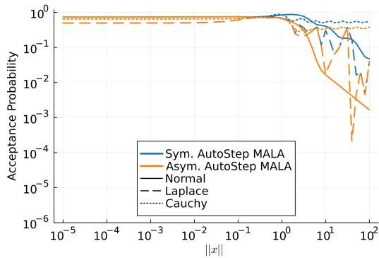  
Figure 6: The same comparison as 1, except for the MALA involution instead of the RWMH involution.

To determine α, we ran three separate Markov chains using Pigeons to obtain draws, benchmarked the time required for gradient computations, and benchmarked the time for log density evaluations. The scaling factor α is then obtained as the ratio of the total time spent on gradient evaluations to the total time spent on log density evaluations. The chains are long enough such that the estimate error (in absolute difference) is within 2%. The α values used in all experiments are presented in Table 1.

There seems to be a positive correlation between α and the dimension of the problems. This correlation is likely due to the auto-differentiation system used to compute gradients. While auto-differentiation avoids the need for manual differentiation, it appears to incur a computational cost that increases with dimensionality.

## B.3. Tuning Paremeters for Algorithms

We provide the detailed tuning parameters for the samplers compared in Section 5.4.

• Adaptive MALA: Step size $\theta _ { 0 } = 0 . 1$

• Delayed Rejection HMC: Step size $\theta _ { 0 } = 0 . 1$ , number of subsequent proposals $k = 2$ , and step size divisor $a = 5 . 0$

• NUTS: Maximum tree depth $L _ { \operatorname* { m a x } } = 5$ and target acceptance ratio $\alpha _ { \mathrm { t a r g e t } } = 0 . 6 5$

## B.4. Additional results

Additional results for the experiments in Sections 5.3 and 5.1 are presented in Figs. 6 to 8. In particular, Fig. 6 shows the same comparison of symmetric and asymmetric step size selectors as in Fig. 1 in the main text, except for the MALA involution. The conclusion here is slightly different for MALA than for RWMH; both asymmetric and symmetric step size selection yields reasonable acceptance probabilities near the mode, while both have decaying acceptance probabilities in the tails. However, despite the decay, the symmetric criterion still yields a substantial increase over the asymmetric criterion, and should still be preferred. Fig. 7 shows the same additional metrics as Fig. 4 when comparing fixed step sizes vs AutoStep (energy jump distance per iteration, acceptance probability, and cost per iteration) but for the MALA involution. The conclusions for MALA drawn here are precisely the same as those for RWMH. Finally, Fig. 8 shows the expected jump distance for fixed and AutoStep RWMH and MALA; these plots show the expected decay of at least $e ^ { - | \log \theta _ { 0 } | }$ for fixed step size methods, and $| \log \theta _ { 0 } | ^ { - 1 }$ for AutoStep methods. It is worth pointing out that the expected jump distance for fixed step size RWMH on very heavy tailed targets (like the Cauchy) can be quite high, but indicates a few very large jumps rather than good mixing behaviour.

We also present additional results in Fig. 9 for the experiments in Section 5.4. The minESS metrics were computed using the method described by Geyer (1992) in Section 3.3, which we found to be more reliable than the default settings in MCMCChains.

## C. Reference pair plots

Figs. 10 to 14 display pair plots of the reference draws for each of the experiments in Section 5.4. Each set of reference draws contains between $1 0 ^ { 6 } – 1 0 ^ { 7 }$ draws. These draws were used for computing the KSESS estimates.

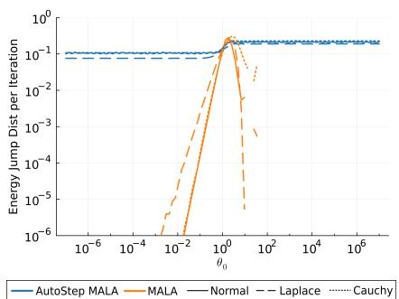  
(a) Energy Jump Distance per Iteration

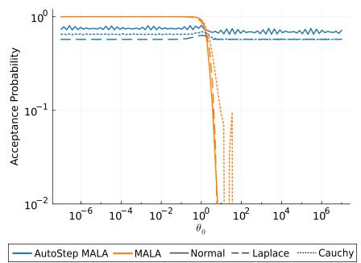  
(b) Acceptance Probability

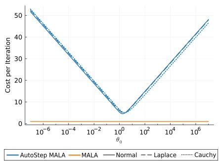  
(c) Cost per Iteration

Figure 7: The same metrics as presented in Fig. 4, except for the MALA involution instead of the RWMH involution.  
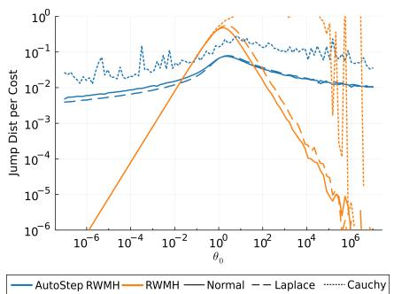  
(a) RWMH

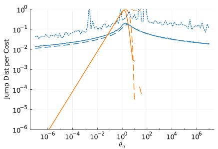  
(b) MALA

Figure 8: The jump distance per iteration for AutoStep and fixed step RWMH (Fig. 8a) and MALA (Fig. 8b) versus initial step size $\theta _ { 0 }$  
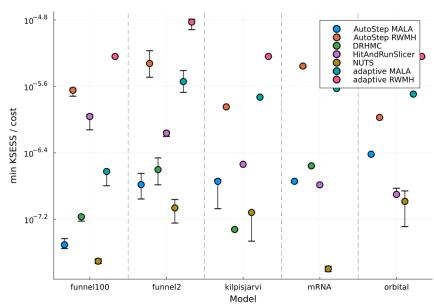  
(a) minKSESS per unitcost

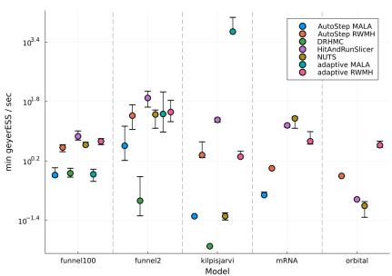  
(b) minESS per second

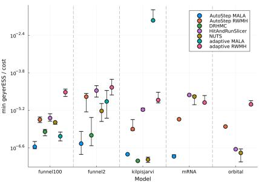  
(c) minESS per unit cost  
Figure 9: The same comparisons as 5, except that we present minKSESS per unit cost (Fig. 9a), minESS per second (Fig. 9b), and minESS per unit cost (Fig. 9c), instead of minKSESS per second.

## D. KSESS diagnostic

Suppose we obtain a collection of i.i.d. draws $( x _ { t } ) _ { t = 1 } ^ { T }$ from a target distribution with known CDF $F ( x )$ (or given a sufficiently large set of draws $( \widetilde { x } _ { t } ) _ { t = 1 } ^ { \widetilde { T } } , \widetilde { T } \gg T$ such that the empirical CDF of $( \widetilde { x } _ { t } ) _ { t = 1 } ^ { \widetilde { T } }$ can be used in place of F ). For any $T \in \mathbb { N }$ , define

$$
D ( ( x _ { t } ) _ { t = 1 } ^ { T } ) = \operatorname* { s u p } _ { x } \lvert F _ { T } ( x ) - F ( x ) \rvert ,
$$

where $F _ { T } ( x )$ is the empirical distribution of $( x _ { t } ) _ { t = 1 } ^ { T }$ . It is known that $\sqrt { T } D ( ( x _ { t } ) _ { t = 1 } ^ { T } ) \stackrel { d } { \to } K$ as $T \to \infty$ where K follows the Kolmogorov distribution (Kolmogorov, 1933) (see also Marsaglia et al. (2003)),

$$
\mathbb { P } ( K \le x ) = \frac { \sqrt { 2 \pi } } { x } \sum _ { k = 1 } ^ { \infty } e ^ { - \frac { ( 2 k - 1 ) ^ { 2 } \pi ^ { 2 } } { 8 x ^ { 2 } } }
$$

$$
\mathbb { E } [ K ] = \log 2 { \sqrt { \frac { \pi } { 2 } } }
$$

$$
\mathrm { V a r } [ K ] = \frac { \pi ^ { 2 } } { 1 2 } - \frac { \pi ( \log 2 ) ^ { 2 } } { 2 } .
$$

Heuristically, given a sample of size $T = N B$ , we have that as $N , B \to \infty$

$$
\frac { 1 } { N } \sum _ { \tau = 0 } ^ { N - 1 } \sqrt { B } D \Big ( ( x _ { t } ) _ { t = \tau B + 1 } ^ { ( \tau + 1 ) B } \Big ) \approx \mathbb { E } [ K ] ,
$$

and hence the sample size T is approximately

$$
T \approx \mathrm { K S E S S } _ { 1 } : = T \left( \frac { \log 2 \sqrt { \frac { \pi } { 2 } } } { \frac { 1 } { N } \sum _ { \tau = 0 } ^ { N - 1 } \sqrt { B } D \Big ( ( x _ { t } ) _ { t = \tau B + 1 } ^ { ( \tau + 1 ) B } \Big ) } \right) ^ { 2 } .
$$

If instead of exact Monte Carlo draws from the target, we obtain draws from a (potentially slowly mixing) Markov chain, we expect the D statistic to follow a convergence law roughly of the form $\sqrt { \alpha T } D ( ( x _ { t } ) _ { t = 1 } ^ { T } ) \stackrel { d } {  } K$ , where αT is the effective sample size. In this case,

$$
\begin{array} { r l } & { \mathrm { K S E S S } _ { 1 } = T \left( \frac { \sqrt { \alpha } \log 2 \sqrt { \frac { \pi } { 2 } } } { \frac { 1 } { N } \sum _ { \tau = 0 } ^ { N - 1 } \sqrt { \alpha B } D \Big ( ( x _ { t } ) _ { t = \tau B + 1 } ^ { ( \tau + 1 ) B } \Big ) } \right) ^ { 2 } } \\ & { \quad \quad \approx T \big ( \sqrt { \alpha } \big ) ^ { 2 } = \alpha T , } \end{array}
$$

as desired. However, this doesn’t measure severe failures well; note that the minimum possible value of $\operatorname { K S E S 1 }$ is $T \big ( \log 2 \sqrt { \frac { \pi } { 2 } } \big ) ^ { 2 } / B$ , which occurs when $D = 1$ for each batch (i.e., when the sampler is working as poorly as possible). Hence we also consider the metric

$$
T \approx \mathrm { { K S E S S } } _ { 2 } = { \left( \frac { \log 2 { \sqrt { \frac { \pi } { 2 } } } } { D ( ( x _ { t } ) _ { t = 1 } ^ { T } ) } \right) } ^ { 2 } ,
$$

which characterizes severe failure, but has too high variance to be useful when the sampler is functioning well. Hence the final KSESS metric we use is

$$
\mathrm { K S E S S } = \left\{ \begin{array} { l l } { \mathrm { K S E S S } _ { 2 } } & { \mathrm { K S E S S } _ { 2 } \leq T \big ( \log 2 \sqrt { \frac \pi 2 } \big ) ^ { 2 } / B } \\ { \mathrm { K S E S S } _ { 1 } } & { \mathrm { o t h e r w i s e } } \end{array} \right.
$$

In our experiments we set $N = 4 0$

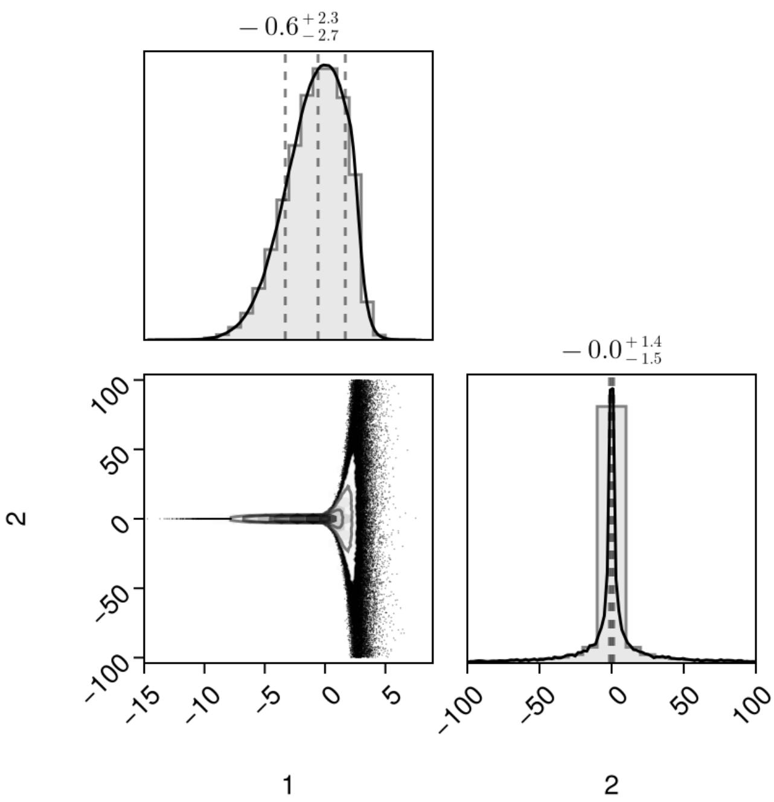  
Figure 10: Reference samples for funnel2.

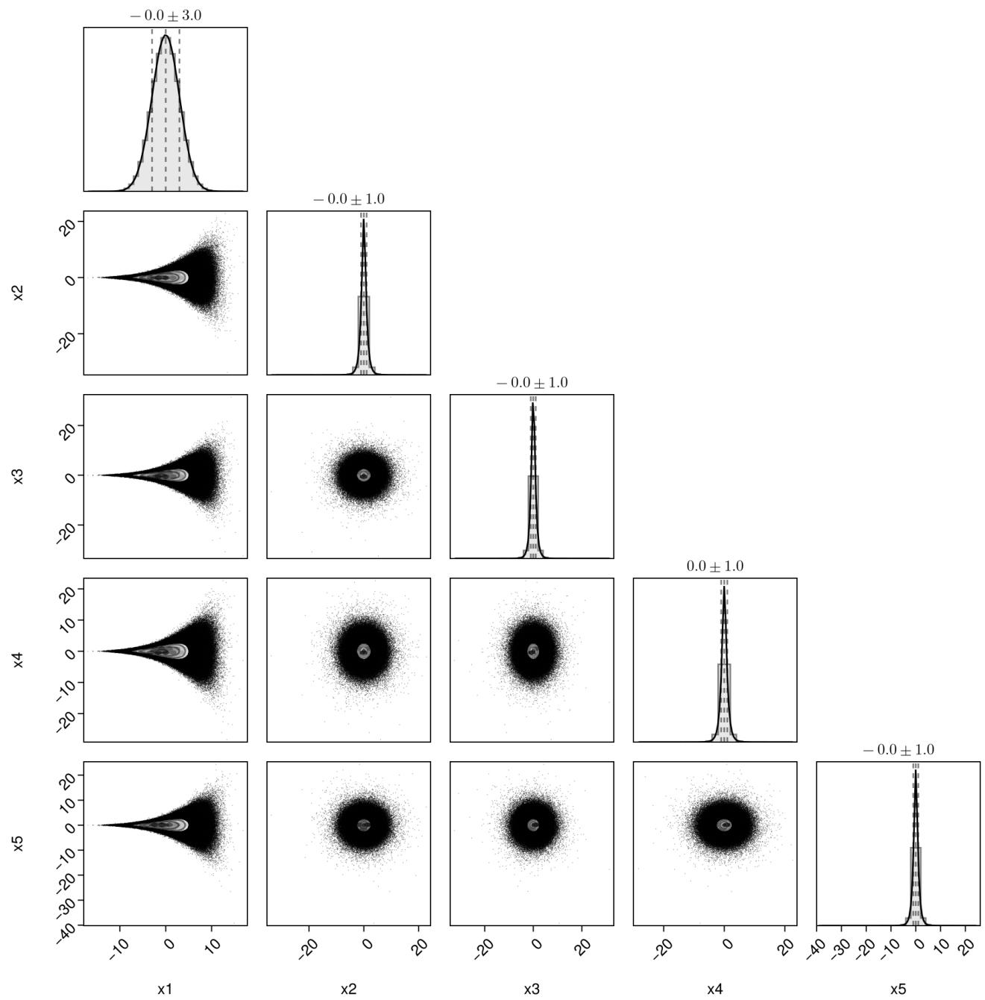  
Figure 11: First 5 dimensions of the reference samples for funnel100

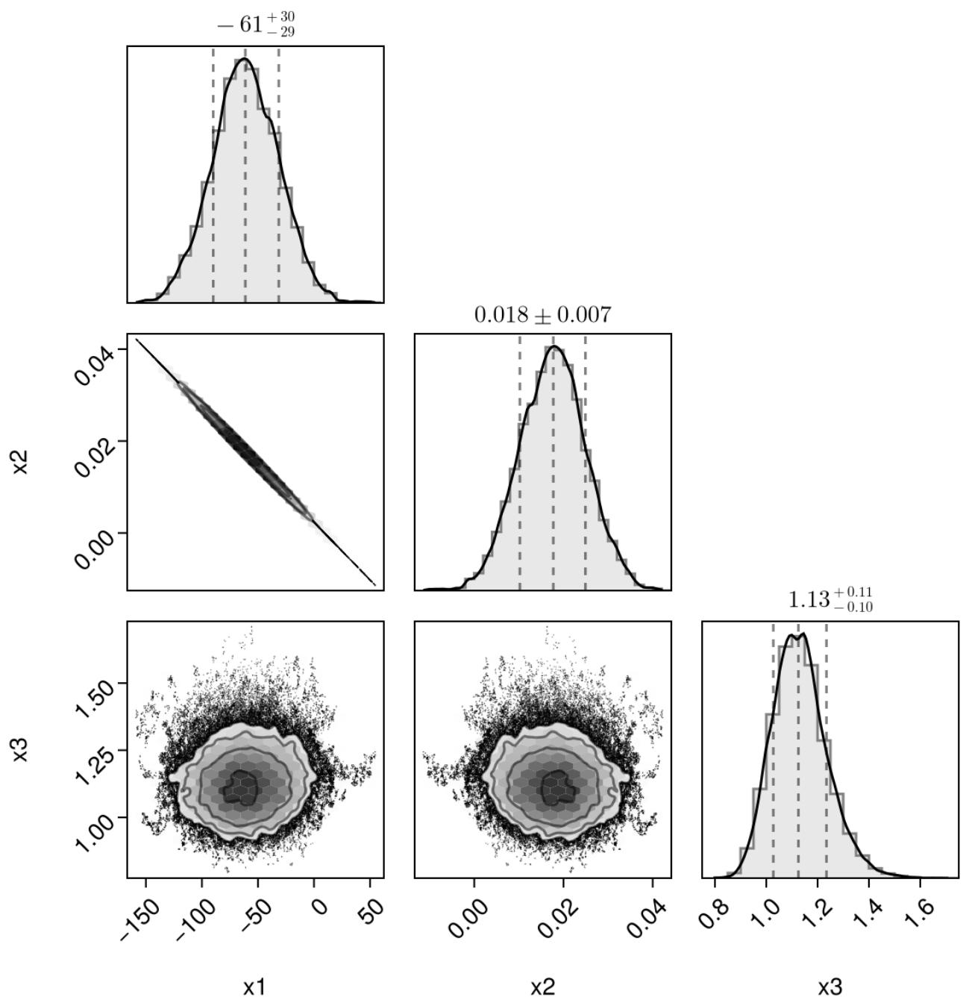  
Figure 12: Reference samples for kilpisjarvi.

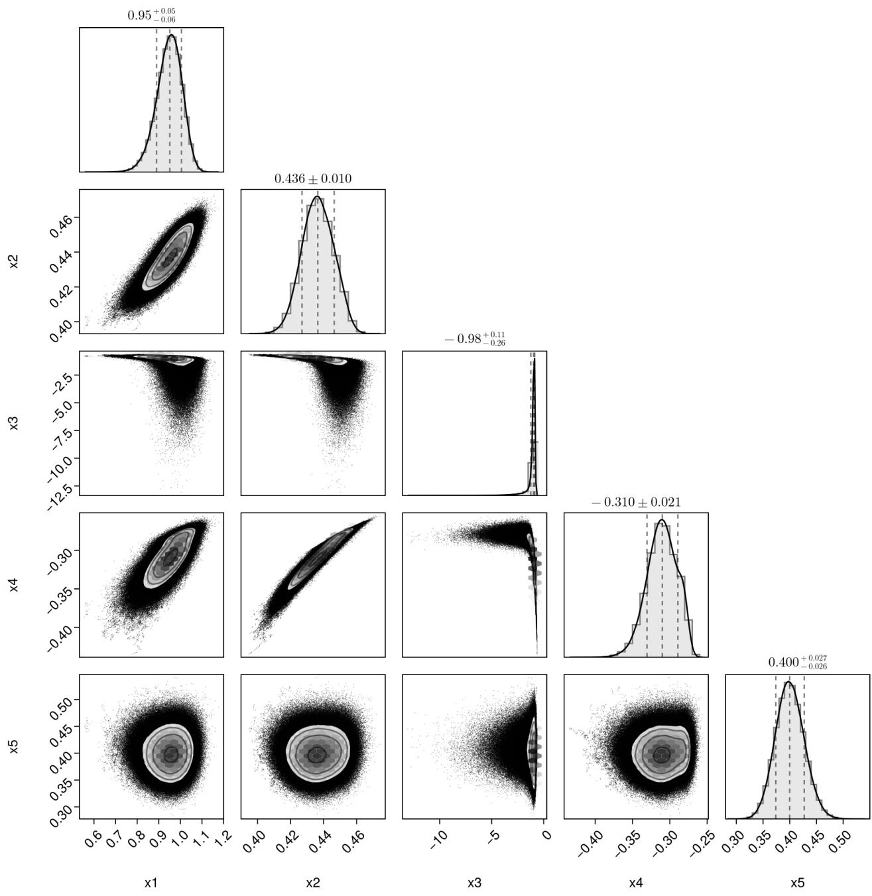  
Figure 13: Reference samples for mRNA.

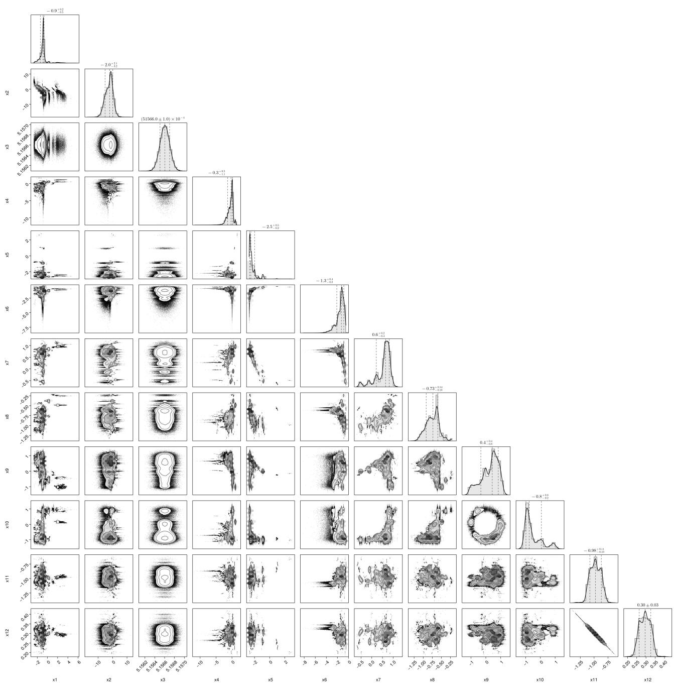  
Figure 14: Reference samples for orbital.