# LUDO: Low-Latency Understanding of Deformable Objects using Point Cloud Occupancy Functions

Pit Henrich1, Franziska Mathis-Ullrich1, and Paul Maria Scheikl1,2

Abstract—Accurately determining the shape of objects and the location of their internal structures within deformable objects is crucial for medical tasks that require precise targeting, such as robotic biopsies. We introduce LUDO, a method for accurate lowlatency understanding of deformable objects. LUDO reconstructs objects in their deformed state, including their internal structures, from a single-view point cloud observation in under 30 ms using occupancy networks. LUDO provides uncertainty estimates for its predictions. Additionally, it provides explainability by highlighting key features in its input observations. Both uncertainty and explainability are important for safety-critical applications such as surgical interventions. We demonstrate LUDO’s abilities for autonomous targeting of internal regions of interest (ROIs) in deformable objects. We evaluate LUDO in real-world robotic experiments, achieving a success rate of 98.9% for puncturing various ROIs inside deformable objects. LUDO demonstrates the potential to interact with deformable objects without the need for deformable registration methods.

Index Terms—Surgical Robotics: Planning;

## I. INTRODUCTION

NFERRING the shape of objects and the location of inter-I nal structures in deformable objects is an important task in medical procedures. Depending on the surgical intervention, different internal structures have to be either targeted or avoided. Examples include targeting tumorous tissue during biopsies and avoiding risk structures such as blood vessels and nerves.

Preoperative imaging can provide shape information and the location of these internal structures before an intervention. However, during interventions, deformations cause significant deviations from the preoperative state. For example, deformations occur when the surgeon applies force to soft tissue by pushing or pulling. Moreover, preoperative imaging modalities are often not available intraoperatively, necessitating a way to determine the location and shape of internal structures from observation modalities that are available during the procedure.

Addressing these challenges, we consider the following setting: Given the surface mesh of a deformable object in its non-deformed state, determine the location and shape of internal structures from a single-view point cloud observation of the object in its deformed state. In a medical scenario, the surface mesh can be derived from preoperative imaging such as segmented Computed Tomography (CT) scans. The point cloud, captured during an intervention, contains only partial information about the visible surface and typically lacks any features of the internal structures.

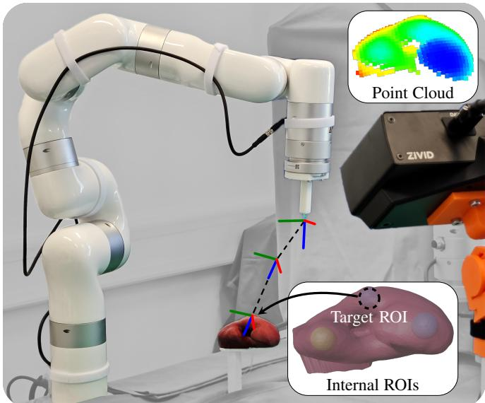  
Fig. 1. Robotic setup used for real-world evaluation. An xArm7 robot (UFactory, China) automatically punctures Regions of Interests (ROIs) inside a deformable organ phantom using a needle instrument. The inset image displays the spherical Internal ROIs, with the middle one marked as the Target ROI for the needle puncture. The Zivid One+ M (Zivid, Norway) is used to capture a surface Point Cloud of the phantom. This Point Cloud is used by our proposed method to estimate the location of all ROIs in under 30 milliseconds, excluding depth image capture time.

For this work, we consider a concrete robotic application: puncturing a Region of Interest (ROI) within a deformable object using a needle, similar to a biopsy procedure. The robotic setup and puncturing task are shown in Figure 1. The task requires accurately localizing the ROI despite the object’s deformation. Additionally, it is not enough to only localize the ROIs as the encompassing object’s surface is needed to plan suitable trajectories. To minimize deformations caused by friction during the puncturing, the needle should traverse as little material as possible before reaching the ROI.

To this end, we propose LUDO, a method that infers structural information of known deformable objects with low latency. Given a single-view point cloud of a deforming object’s surface, LUDO reconstructs a dense point cloud that captures both the object’s shape and its internal structures. This is achieved using an Occupancy Network (ON), which provides an implicit 3D representation conditioned on the single-view point cloud. Instead of attempting to generalize across arbitrary shapes, LUDO learns deformation behaviors for specific prior objects. In a medical context, LUDO is therefore trained using patient-specific data derived from prior medical scans, such as CT scans. Trained on data from deformation simulations, the ON can reconstruct the deformed object, including its internal structures during inference on real-world observations. The simulation requires only a single preoperative surface mesh, such as one obtained from a volume scan. The reconstruction is then used to plan a puncture path to reach the ROI. The process of inferring and planning a trajectory based on a single-view point cloud is illustrated in Figure 2.

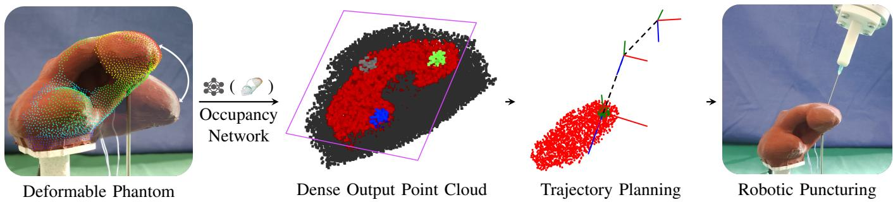  
Fig. 2. Automatic puncturing of a Region of Interest (ROI) inside of a deformable object. A point cloud is captured of a Deformable Phantom. The point cloud is passed to an Occupancy Network as conditioning input. The occupancy network is queried to construct a Dense Output Point Cloud. This Dense Output Point Cloud is used to perform Trajectory Planning. The planned trajectory is executed on a real-world robotic system to puncture the ROI.

The main contributions of this work are as follows:

1) Low-Latency Structural Estimation: We provide an accurate low-latency approach for obtaining structural information of deformable objects using ONs, conditioned on single-view point cloud observations and trained on physics-based simulation data.

2) Robotic Puncturing Experiments: We demonstrate the effectiveness of the proposed method through realworld robotic experiments for autonomous puncturing of targets within three deformable phantoms (i.e., Organ, Cylinder, Slab).

## 3) Uncertainty Estimation and Explainability: We

a) integrate a method for explainability to highlight which key features in the input were used to determine the deformation,

b) integrate methods to compute uncertainty for deformable object understanding,

c) explore the use of probabilities and different uncertainty estimating methods for selecting an optimal puncture target position, and

d) conduct preliminary exploration of estimating a single aggregated uncertainty value to decide whether a planned puncturing target is safe to execute.

4) Robot Calibration: We provide practical considerations for robot calibration to improve the absolute accuracy of industrial robotic arms in high precision applications.

By addressing the challenge of reconstructing structures of deformable objects from partial observations, LUDO has the potential to improve the safety and effectiveness of medical interventions that rely on accurate localization of internal anatomy.

## II. RELATED WORK

a) Deformable Object Registration: Surface-to-pointcloud registration is the process of aligning a surface mesh with a point cloud, commonly through rotations and translations. An optimal solution is found when the points in the point cloud are as close as possible to the mesh surface after registration. For rigid objects, methods such as Iterative Closest Point (ICP) [1] and its derivatives are effective. However, there are many applications, such as medical tasks, where the registration target is deformable. A rigid registration approach will result in increasingly worse results as the amount of deformation increases. Deformable registration methods, in addition to rotations and translations, deform the surface mesh to better fit the point cloud observation. For example, this can be done by estimating an additional deformation field [2], [3]. This deformation field applies forces or translations to the vertices of the surface mesh to deform it.

Jia et al. [4] use neural occupancy functions to improve registration of human liver models. Instead of directly registering a preoperative surface mesh to the intraoperatively observed point cloud, they use the neural occupancy function conditioned on the point cloud as the registration target. Their neural occupancy function provides gradients for each point in 3D space, and this gradient field is used to deform the mesh for registration. Although their approach outperforms rigid registration methods, it is only viable for small deformations, as it requires rigid registration for initialization. Initial rigid registration has inevitable ambiguities under strong deformations. The dependency on an initial registration is common for optimization-based registration approaches, and often limits them to small deformations [5].

In previous work [6], we have shown that using ON-based reconstruction of deformable objects provides an alternative to deformable registration methods. Similar to Jia et al. [4], an ON is conditioned on an input point cloud. However, in contrast to using the ON as a new registration target, we generate an object representation that can be used in place of a registered model. In addition, our approach does not require initialization through a rigid registration step and works for large deformations.

In contrast to our previous work [7], we utilize physicsbased simulation to generate realistic deformations for our training data. Combined with a high-quality depth sensor, our proposed approach is able to accurately reconstruct objects in the real world. To address transparency and safety in high-risk applications such as surgery, we extend the method to provide initial quantitative measures of uncertainty and explainability. We demonstrate our method’s effectiveness through real-world robotic experiments that require accurate reconstruction of internal structures in deformable objects.

b) Deformable Object Manipulation: Interaction with deformable objects is investigated through classical and datadriven model-based methods. These approaches manipulate deformable objects and indirectly achieve the desired shapes of the internal structures for biopsies [8], cryoablation [9], and suturing [10]. However, these approaches assume that the position and shape of the internal structures can be determined intraoperatively from sensor observations, for example through an ultrasound probe. This limits their applicability and further requires complex data processing to locate, segment, and reconstruct the internal structures from the ultrasound images.

Florence et al. [11] learn dense visual descriptors capturing correspondences across different object instances and views. This enables robots to manipulate deformable objects by understanding their visual geometry without explicitly modeling deformations. However, they do not model the internal structures of deformable objects.

Other works investigate deformable object manipulation with the goal of reaching desired deformation states [12]–[14]. However, they are also unable to reason about the deformation state of internal structures, which is essential for medical tasks such as biopsies.

## III. METHOD OVERVIEW

This work consists of two primary components: LUDO itself and the robotic experimental method.

Section IV details our proposed method, LUDO, for lowlatency understanding of deformable objects using point cloud occupancy functions. LUDO estimates both the external and internal structures of deformable objects from single-view point cloud observations.

Section V details our real-world robotic experiments. We describe the robotic system that uses the LUDO-generated reconstructions for targeting and puncturing tasks in deformable objects. This includes an approach to improve the absolute accuracy of industrial robotic systems through Denavit-Hartenberg (DH) parameter optimization.

## IV. LUDO

LUDO provides 3D structural information of deformable objects in the form of a dense output point cloud, see Figure 2. LUDO uses an ON trained on realistic deformation data generated through finite element method (FEM) simulations.

In this section, we first describe how deformable objects can be reconstructed by a trained ON, conditioned on an observation point cloud. We detail how to produce training data for such ON, using a sampling strategy optimized for occupancy learning and a physics based deformation simulation. We describe techniques to provide local uncertainty values for every part of the inferred structures. Additionally, by aggregating the local uncertainty values we can provide a single aggregated uncertainty value. Finally, we provide a masking based explainability approach to identify features in the input point cloud that are decisive during inference.

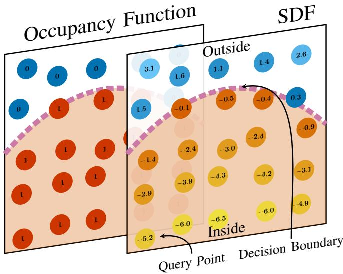  
Fig. 3. Visualization of an Occupancy Function and a Signed Distance Function (SDF). The Occupancy Function only encodes inside and outside of an object using binary values of 1 and 0 respectively. The SDF provides the distance to the Decision Boundary and uses the sign (+ or -) to indicate if the point is inside or outside the object.

## A. Object Reconstruction with Occupancy Networks

An occupancy function

$$
f : q \to s , \quad q \in \mathbb { R } ^ { 3 } , s \in \mathbb { N } _ { 0 }\tag{1}
$$

represents a 3D object, consisting of multiple segments, by mapping Cartesian query points q to scalar values s. Each value of s represents a different segment of the object. Clusters of points with the same value s form the segments. For example, an organ model with a single internal tumor may be represented using $s \in \{ 0 , 1 , 2 \}$ , where points with the values 1 or 2 are inside the organ or tumor, respectively. The value of 0 is reserved for all points outside of the object. A visual example of an occupancy function is shown in Figure 3.

The occupancy function f can also be conditioned on an observation o so that

$$
f : q , o \to s , \quad q \in \mathbb { R } ^ { 3 } , o \in \mathbb { R } ^ { m } , s \in \mathbb { N } _ { 0 }\tag{2}
$$

can represent different objects, different deformation states, or different object poses. Without the observation, the occupancy function can only represent a single object in a single state.

An ON $\mathcal { M } _ { \theta } ( \cdot )$ can be used to approximate $f ,$ where θ represents learnable parameters. The learnable parameters are optimized by minimizing the term:

$$
\operatorname* { m i n } _ { \theta } \sum _ { i } \sum _ { j } \mathcal { L } ^ { c } \big ( f ( q _ { j } , o _ { i } ) , \mathcal { M } _ { \theta } ( q _ { j } , o _ { i } ) \big ) ,\tag{3}
$$

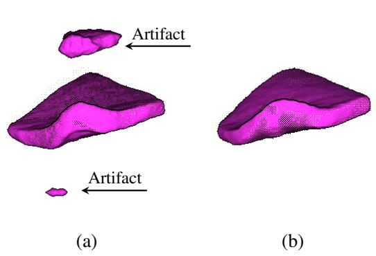  
Fig. 4. Examples of a single deformable slab that was reconstructed by two different occupancy networks in the early stages of training. The network producing (a) only uses a cross-entropy loss during training and shows two floating artifacts. The cross-entropy loss only distinguishes between inside and outside the object and does not indicate how severe a misclassification is. The network producing (b) uses an additional distance loss that ensures that misclassifications far from the main object are strongly discouraged.

where i and $j$ iterate over the observations and query points, respectively. We use a cross entropy loss $\mathcal { L } ^ { c }$

$$
\mathcal { L } ^ { c } = \sum _ { s } - \mathbb { 1 } \left( f ( q , o ) = s \right) \log \left( \mathcal { M } _ { \theta } ( s | q , o ) \right) ,\tag{4}
$$

where $\Im ( \cdot )$ is 1 if the query point q belongs to segment s and 0 otherwise, and $\mathcal { M } _ { \theta } ( s | q , o )$ is the probability that q belongs to the segment s given the observation o. We estimate $\mathcal { M } _ { \theta } ( s | q , o )$ by applying the softmax function to the model output logits.

The ground truth values from f do not provide a signal that indicates how close the estimate of $\mathcal { M } _ { \theta }$ is to the correct label. Points very far from the object of interest should provide a strong training signal if they are incorrectly classified as being inside of the object. This signal is important to instill the concept of the compactness (an object being confined to a specific area) of reconstructions in $\mathcal { M } _ { \theta }$ . It prevents the object from extending infinitely or from having clusters appearing far away from the main object.

The signal can be provided by an additional loss based on the query point distance to the nearest surface [6]. A qualitative example for the effect of using an additional distance loss is shown in Figure 4. A Signed Distance Function (SDF)

$$
d : q , o \to r ^ { \pm } , \quad q \in \mathbb { R } ^ { 3 } , o \in \mathbb { R } ^ { m } , r ^ { \pm } \in \mathbb { R }\tag{5}
$$

provides the distance $r ^ { \pm }$ of a query point q to the nearest object surface.

The sign of the distance indicates if the point is inside or outside of the object, see Figure 3.

$\mathcal { M } _ { \theta } ( \cdot )$ can be trained to approximate $( f \times d ) : \mathbb { R } ^ { 3 } \times \mathbb { R } ^ { m } $ $\mathbb { N } _ { 0 } \times \mathbb { R }$ to model both occupancy and signed distance functions.

For training, we use an L1 loss for the signed distance

$$
\mathcal { L } ^ { \pm } = \left| d ( \boldsymbol { q } , \boldsymbol { o } ) - \mathcal { M } _ { \theta } ( \boldsymbol { q } , \boldsymbol { o } ) \right| .\tag{6}
$$

For readability, we assume that $\mathcal { L } ^ { c }$ uses the class and $\mathcal { L } ^ { \pm }$ uses the signed distance output of $\mathcal { M } _ { \theta }$

We combine $\mathcal { L } ^ { c }$ and $\mathcal { L } ^ { \pm }$ into the final loss function

$$
\mathcal { L } _ { \lambda } = \mathcal { L } ^ { c } + \lambda \mathcal { L } ^ { \pm } ,\tag{7}
$$

where λ is a weighting factor to balance the loss components. The final optimization problem is

$$
\operatorname* { m i n } _ { \theta } \sum _ { i } \sum _ { j } \mathcal { L } _ { \lambda } ( q _ { j } , o _ { i } ) .\tag{8}
$$

Using a point cloud $P ~ = ~ \{ p _ { 0 } , p _ { 1 } , \cdot \cdot \cdot \} ~ \subset ~ \mathbb { R } ^ { 3 }$ as the conditioning observation requires additional considerations. The naive approach of concatenating all points into an observation vector ${ \boldsymbol { o } } = ( p _ { 0 } , p _ { 1 } , \cdot \cdot \cdot )$ results in an order dependent representation, where $( p _ { 0 } , p _ { 1 } , \cdot \cdot \cdot ) \neq ( p _ { 1 } , p _ { 0 } , \cdot \cdot \cdot )$

Point cloud encoders address the issue by distilling a point cloud into a latent vector in an order-invariant manner, often utilizing commutative operations. We therefore use a point cloud encoder $\operatorname { E } _ { \theta _ { 2 } }$ to generate a latent representation of the point cloud observation $P ,$ , and use this latent representation as conditioning o for the point cloud ON:

$$
\mathcal { M } _ { \boldsymbol { \theta } } ( \boldsymbol { q } , o ) = \mathcal { M } _ { \boldsymbol { \theta } } ^ { \mathrm { E } } ( \boldsymbol { q } , P ) = \mathbf { M } \mathbf { L } \mathbf { P } _ { \boldsymbol { \theta } _ { 1 } } ( \boldsymbol { q } , \underbrace { \mathbf { E } _ { \boldsymbol { \theta } _ { 2 } } ( P ) } _ { o } ) ,\tag{9}
$$

where $\operatorname { E } _ { \theta _ { 2 } }$ encodes the point cloud P and the Multilayer Perceptron $( { \mathrm { M L P } } _ { \theta _ { 1 } } )$ estimates the occupancy of the query point q with respect to the encoding. The learnable parameters are $\theta = \left( \theta _ { 1 } , \theta _ { 2 } \right)$

In previous work [6], we have shown the suitability of PointNet++ [15] as the point cloud encoder $\operatorname { E } _ { \theta _ { \le } }$ 2 for 3D reconstruction tasks using conditioned ONs. A fully connected MLP has been shown to be suitable for conditionally mapping query points to segment labels and distances [16], [17].

The density of the input point cloud depends significantly on the sensor’s distance during data acquisition. Closer depth sensors capture more surface points, while farther ones capture fewer. Unlike synthetic data, real-world point clouds often contain holes where depth data could not be estimated. To ensure that the point cloud encoder is robust to varying point cloud densities and incomplete data, we randomly drop points from the input point cloud P during training. For our application, we found that dropping 50% of input points results in no degradation of LUDO’s performance.

We solely use the positional data for P . Incorporating color in the point cloud would require accurate surface textures during training. Prior models, such as ones derived from CT scans, only provide structural information. Additionally, textures complicate the sim-to-real transfer, as the training data would have to be rendered realistically or extensive visual augmentation would have to be used.

Neural networks tend to learn smoothed 3D representations, missing high frequency details [18], [19]. To increase the sensitivity of $\mathcal { M } _ { \theta } ^ { \mathrm { E } }$ to small positional changes in the query points, we use our previously introduced negative-exponent sinusoidal encoding [6]

$$
\begin{array} { r } { \beta ( q ) = \big ( \sin ( 2 ^ { - 4 } \pi q ) , \cos ( 2 ^ { - 4 } \pi q ) , . . . , \quad } \\ { \sin ( 2 ^ { 5 } \pi q ) , \cos ( 2 ^ { 5 } \pi q ) \big ) } \end{array}\tag{10}
$$

to encode all query points $q \in Q$ . Both sin and cos are applied element-wise. Note the addition of the negative exponents which is not used in work such as NeRF [19].

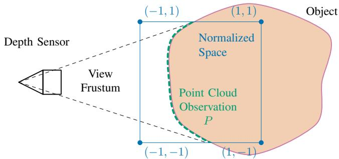  
Fig. 5. 2D example of a scene containing a Depth Sensor and an Object. The depth sensor produces a Point Cloud Observation $P$ within its View Frustum. This observation $P$ is normalized to $[ - 1 , 1 ] ^ { 2 }$ . As $P$ is only a partial observation, the normalized range will not contain the full Object. To reason about regions outside the normalization space, a neural occupancy function must use a positional encoding that can uniquely represent points outside the normalization range.

Because sinusoidal functions are periodic, all queries are performed within a normalized space to ensure that each query point can be uniquely encoded. The observation point cloud $P$ reflects the real-world scale of the captured objects. Since the labeling of $Q$ is done in the coordinates of the point cloud $P ,$ we must normalize $P .$ . We calculate a uniform scaling factor across all dimensions and offset $P$ so that it lies within the range $[ - 1 , 1 ] ^ { 3 }$ . Using negative exponents stretches the periods of the sinusoidal functions in our encoding, ensuring that points outside $[ - 1 , 1 ] ^ { 3 }$ can still be uniquely represented and queried. This is important because the normalization is based on partial observations $P$ of the object, making it necessary to handle queries outside this space to obtain a reconstruction of the full object, see Figure 5.

The architecture of LUDO is illustrated in Figure 6. The used hyperparameters are listed in Table I.

Ground Truth Occupancy Point Cloud: ONs are trained through supervised learning. Each training sample is a tuple $( Q ^ { \mathrm { g t } } , P )$ , where $Q ^ { \mathrm { g t } } \subset \mathbb { R } ^ { 3 } \times \mathbb { N } _ { 0 } \times \mathbb { R }$ is a segment labelled point cloud with distances to the nearest surface, and $P$ is a point cloud observation. $Q ^ { \mathrm { g t } }$ , which we will refer to as an occupancy point cloud, contains ground truth values that are used in place of the function $( f \times d )$ . The performance of the trained ON depends on how the points in $Q ^ { \mathrm { g t } }$ are distributed [6]. Ideally, points in $Q ^ { \mathrm { g t } }$ should be close to the surfaces between segments. Such points help the network to accurately define the boundaries between segments, leading to more precise part segmentation and better surface details.

We use the Improved Sort Sample (ISS) [20] to generate training data. Unlike the original SortSample [6], ISS can produce data for nested objects such as ROIs inside of a larger object. The fundamental idea of ISS is illustrated in Figure 7. Spatial points are uniformly sampled within an extended bounding box of each object segment. For each segment, points are sampled until at least t query points are found that are inside the segment and t points are found that are outside the segment. These two sets of points are then sorted based on the distance to the nearest surface. Only the closest k points to surfaces in both sets are kept. All such sets from each segment are appended to create a ground truth occupancy point cloud $Q ^ { \mathrm { g t } } .$ . The used hyperparameters are listed in Table I.

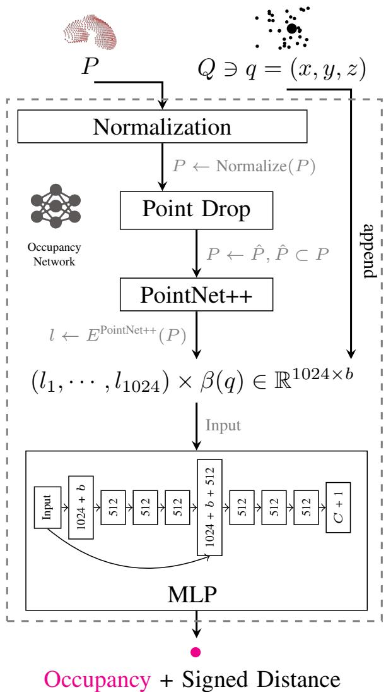  
Fig. 6. The point cloud observation P , obtained from a depth sensor, is normalized to fit inside $[ - 1 , 1 ] ^ { 3 }$ (preserving aspect-ratios). Up to $5 0 \%$ of points from $P$ are dropped randomly by Point Drop and the resulting point cloud is passed to the PointNet++ encoder to distill a latent representation $( l _ { 1 } , \cdots , l _ { 1 0 2 4 } )$ . The query point, taken from $Q ,$ is encoded by β and then appended to the latent. The concatenated vector is passed to the MLP. Additionally, as skip connection from the input to the fifth layer is used. Between each layer, ReLU is used as an activation function. Batch normalization is used for the MLP. The output is the label for the original query point and the signed distance.

## B. Simulation based Data Generation:

Training samples $( Q ^ { \mathrm { g t } } , P )$ are created from simulated deformed states of a prior model. Labelled query points $Q ^ { \mathrm { g t } }$ are sampled through ISS and $P$ is generated with a virtual depth camera. The position of the virtual camera is randomized to allow reconstructions independent of a calibrated camera pose.

We use the FEM physics engine Simulation Open Framework Architecture (SOFA) [21] for deformation simulation. SOFA is an open-source framework for mechanical simulations, designed with a strong emphasis on biomechanics and robotics to allow for modeling of deformations. In addition to our prior experience with SOFA, it is also used for simulating soft-robotic actuators, which also require precise internal deformation modeling [22]–[24]. The physical simto-real gap of modern FEM simulators such as SOFA is narrow enough to enable sim-to-real transfer of deformable object manipulation tasks [25]. Undeformed prior 3D surface meshes of the objects of interest are used to create a sparse, hexahedral FEM topology of the object, including the internal structures. The objects are then deformed by applying forces on interaction regions on the object surface. The deformed states of the objects are then used to create training samples $( Q ^ { \mathrm { g t } } , P )$

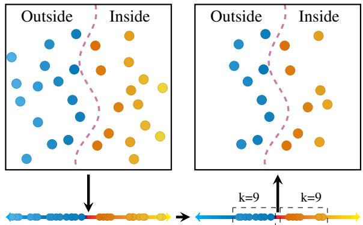  
Fig. 7. Schematic of the Improved SortSample algorithm. a) Sample randomly until at least t points inside and m points outside. b) Sort samples by distance to surface. c) Take nearest k samples on each side of the surface.

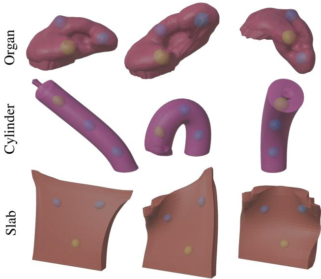  
Fig. 8. Examples for simulated deformations of Organ, Cylinder, and Slab. The deformations are created by applying forces on random (Organ) or predefined regions (Cylinder - Tip, Slab - Corners). The Regions of Interest (ROIs) are represented as deformable spheres inside each object.

Example deformations for our three evaluation objects $O r \mathrm { - }$ gan, Cylinder, and Slab are shown in Figure 8. The Slab and Cylinder allow us to assess LUDO in low-feature scenarios, while the Organ presents a more complex 3D shape. Data generation and training is visualized in Figure 9, and Figure 10 illustrates an example training progress for the Organ object.

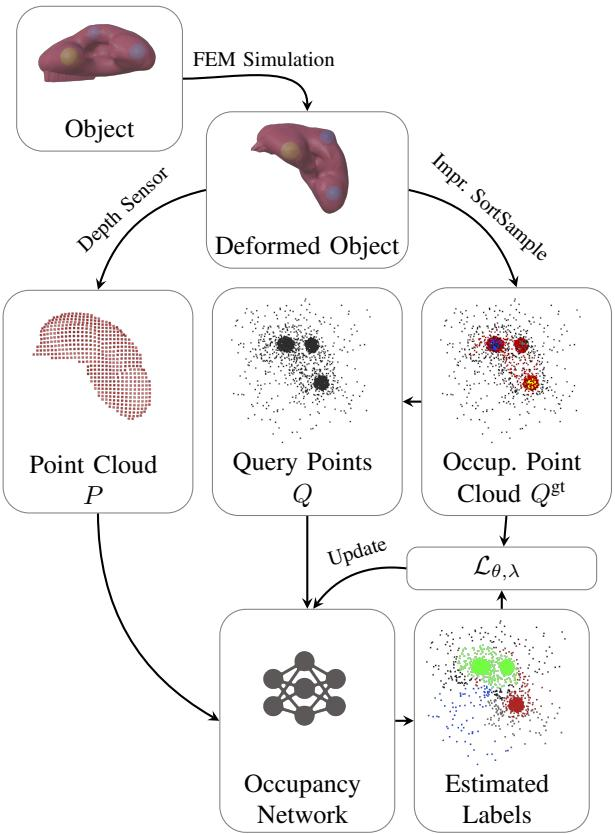  
Fig. 9. The data and training pipeline. Forces are applied to an Object to create a Deformed Object. The improved SortSample is used to obtain a ground-truth Occupancy Point Cloud $\hat { Q } ^ { \mathrm { g t } }$ . Simultaneously, a point cloud observation $P$ from the camera perspective is created. A query point cloud $Q$ is obtained by removing class information from $Q ^ { \mathrm { g t } }$ . The Occupancy Network, conditioned on $P ,$ estimates the labels for all points in Q. The loss is computed with respect to $Q ^ { \mathrm { g t } }$ and used to update the Occupancy Network.

TABLE I  
HYPERPARAMETERS FOR DATA GENERATION AND TRAINING.
<table><tr><td>Hyper Parameter</td><td>Value</td></tr><tr><td>Training samples  $( Q ^ { \mathrm { g t } } , P )$ </td><td>30000</td></tr><tr><td>Batch size</td><td>40</td></tr><tr><td>Epochs</td><td>700</td></tr><tr><td>SortSample</td><td> $t = k = 1 2 8$ </td></tr><tr><td>Optimizer</td><td>Adam</td></tr><tr><td>Learning rate</td><td>0.0005</td></tr><tr><td>Loss function weighting  $( \mathcal { L } _ { \lambda } )$ </td><td> $\lambda = 1 0 0$ </td></tr></table>

The used hyperparameters are listed in Table I.

Inference: The ON, conditioned on a point cloud observation, encodes the shape and positions of all objects implicitly. We query the ON using query points sampled randomly from $[ - 1 . 5 , 1 . 5 ] ^ { 3 }$ , to obtain the relevant spatial information for downstream tasks. The bounding box extends outside the normalization range $[ - 1 , 1 ] ^ { 3 }$ to ensure the full object is reconstructed, see Section IV-A. To focus the samples on relevant parts of this space, we apply a two-stage sampling approach. First, we query the volume using 10 000 query points to obtain a rough bounding box of the objects. This bounding box is enlarged by 20% and then sampled more densely to obtain the final dense output point cloud. Enlarging the bounding box minimizes the possibility of surfaces being cut-off. We experimentally evaluate the number of points required to accurately localize each ROI. A resulting dense 3D point cloud is shown in Figure 2. This explicit dense output point cloud can then be used for downstream tasks, such as targeting specific ROIs in Section VII.

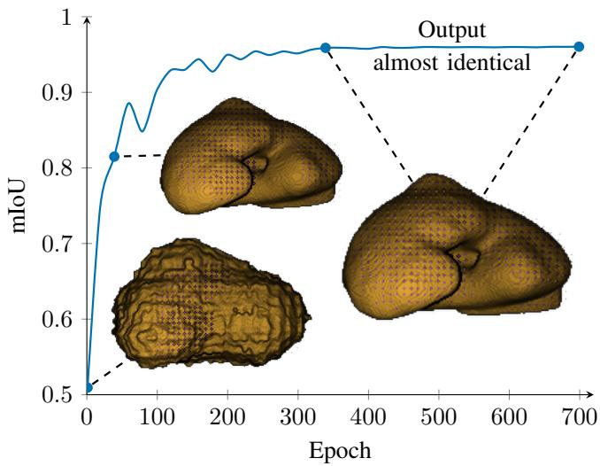  
Fig. 10. Training progress for the Organ scene. A dense reconstruction is performed by querying the occupancy network on an equidistant grid. We show the reconstruction quality, computed on a separate test dataset, as the mean Intersection over Union (mIoU) over 700 epochs. After approximately 300 epochs, the network produces outputs that are almost identical to the final outputs. The input point cloud P is included as pink points in the dense reconstruction. One epoch takes approximately one minute to complete on a single Nvidia RTX 4090 (Nvidia, United States).

## C. Local Per-Point Relative Uncertainty Estimation:

For safety-critical applications such as surgical interventions, we are interested in how certain the ON is about its predictions. For the application of puncturing a ROI inside a deformable object, we speculate that targeting the Cartesian position where the ON is most certain improves the robustness of the puncturing task. We therefore extend ONs to enable the estimation of per-point relative uncertainty.

We consider two methods to compute uncertainty: a naive activation entropy based approach and Monte Carlo Dropout (MCD) [26].

a) Activation Entropy: The activation entropy of the network’s logits, after applying a softmax, can correlate to the model’s confidence about its prediction [27]. Lower entropy in the output layer typically corresponds to higher confidence in predictions, as the model is more certain about the specific classes. Conversely, higher activation entropy suggests higher uncertainty, indicating that the model does not favor any particular class. To this end, we compute the categorical probability distribution

$$
{ \bf p } _ { q } = \left( { \mathcal { M } } _ { \theta } ( 0 | q , o ) , \cdots , { \mathcal { M } } _ { \theta } ( C | q , o ) \right) ,\tag{11}
$$

from the softmax outputs for each query point q given some observation o across $C + 1$ classes. $C$ is the number of

segments and 0 is reserved for points outside of all segments. We then compute the predictive entropy

$$
H ( \mathbf { p } _ { q } ) = - \sum _ { j } \mathbf { p } _ { q } ^ { ( j ) } \log ( \mathbf { p } _ { q } ^ { ( j ) } + \epsilon ) ,\tag{12}
$$

where $\mathbf { p } _ { q } ^ { ( j ) }$ is the probability of point $q$ being of class $j$ and ϵ is a small value added for numerical stability.

b) Monte-Carlo Dropout: MCD is the second approach that we investigate to quantify the uncertainty of neural network predictions [26]. Dropout is normally used during training to improve the generalization performance of the network, and is usually disabled during inference. With MCD, dropout is also enabled during inference. This results in a virtual ensemble of models that can be used for inference. Instead of a single deterministic prediction, we sample the model $m = 3 0$ times with the same input but different random seeds for dropout. We then average the predictions $\mathbf { p } _ { q , i }$ across all random seeds i to obtain the mean predicted probability for each point as

$$
\hat { \mathbf { p } _ { q } } = \frac { 1 } { m } \sum _ { i = 1 } ^ { m } \mathbf { p } _ { q , i } .\tag{13}
$$

Finally, we compute the predictive entropy

$$
H ( \hat { \mathbf { p } _ { q } } ) = - \sum _ { j } \hat { \mathbf { p } } _ { q } ^ { ( j ) } \log ( \hat { \mathbf { p } } _ { q } ^ { ( j ) } + \epsilon )\tag{14}
$$

using the averaged probabilities $\hat { { \bf p } } _ { q } ^ { } .$ , where $\hat { \mathbf { p } } _ { q } ^ { ( j ) }$ is the average probability of class j, and ϵ is a small value for numerical stability.

## D. Aggregated Uncertainty Estimation:

Per-point relative uncertainty estimation provides information about what parts of a reconstruction the ON is most confident about. However, the per-point uncertainties do not provide global information regarding how certain the overall reconstruction is. For safety critical applications, having a single value indicating the confidence or quality of the reconstruction can be important, for example, to prevent a robotic system from performing a task when confidence is lacking or to provide feedback to human operators. We investigate whether the activation entropy and MCD entropy can also be used to obtain such a single aggregated uncertainty value. For this, we aggregate the local per-point uncertainties from a dense output point cloud to obtain a single aggregated uncertainty value. For aggregation, we take the mean of the local per-point uncertainties

$$
H _ { \mathrm { a g g r e g a t e d } } = { \frac { 1 } { | Q | } } \sum _ { q \in Q } H ( \mathbf { p } _ { q } ) ,\tag{15}
$$

where $H _ { \mathrm { a g g r e g a t e d } }$ is the aggregated uncertainty estimate, $Q$ is the query point cloud, and $H ( \mathbf { p } _ { q } )$ is the predictive entropy computed for the query point q. This provides an estimate of the model’s average uncertainty.

## E. Explainability

Uncertainty estimation can provide information about how confident the system is about its predictions. Explainability clarifies how or why a model makes a specific prediction [28]– [30]. In medical applications, autonomous systems are supervised by human experts to ensure the safety of the procedure. In these settings, explainability may increase transparency, build trust, and simplify the identification and correction of biases and errors. We address explainability of our method with a point cloud masking based approach to identify which features in the input point cloud $P$ are most relevant to the prediction, and present the results qualitatively.

Masking-based Explainability: Given an input point cloud P we want to identify the parts of the point cloud that are most important for the ON predictions. For this task we consider the explainability for reconstructing the whole object with all internal structures. To this end, we propose a point cloud masking-based approach. Intuitively, the idea is to remove circular patches of the input point cloud and quantify how much the subsequent reconstruction is affected. The full point cloud P , without any removed patches, serves as the baseline as it contains the maximum amount of information.

We start by sampling 40 000 random points in the extended bounding box $U ^ { 3 } ( - 1 . 5 , 1 . 5 )$ to obtain a query point cloud $Q = \{ q _ { 1 } , \cdot \cdot \cdot , q _ { 4 0 0 0 0 } \} \subset \mathbb { R } ^ { 3 }$ . We then compute the baseline prediction

$$
S ^ { \mathrm { m a x } } = { \mathcal { M } } _ { \theta } ^ { \mathrm { E } } ( Q , P ) .\tag{16}
$$

Additionally, we define the neighborhood function to use for circular patch selection

$$
N _ { P } ( p , r ) = \{ x \in P \mid \| p - x \| _ { 2 } < r \} ,\tag{17}
$$

where r is the radius of the circular patch and p is the point whose neighboring points are to be determined. The patches selected by this function will be removed from P to evaluate how important the contained points are for the reconstruction. We create the masked point clouds $P _ { i }$ by removing patches for each point in the original point cloud $P \colon$

$$
P _ { i } = P \setminus N _ { P } ( p _ { i } , r ) .\tag{18}
$$

Specifically, for every point in $P ,$ we generate a masked point cloud by removing the patch around that point. This process results in as many masked point clouds as there are points in $P _ { \mathrm { { : } } }$ , with each masked point cloud missing a unique patch associated with the neighborhood of a different point.

We then infer dense output point clouds $S _ { i }$ for each masked point cloud $P _ { i }$ :

$$
S _ { i } = { \mathcal { M } } _ { \theta } ^ { \mathrm { E } } ( Q , P _ { i } ) .\tag{19}
$$

Finally, we can compute the similarity between $S _ { i }$ and $S ^ { \mathrm { m a x } }$ . If $S _ { i }$ and $S ^ { \mathrm { m a x } }$ are labelled identically, the missing patch of points is not relevant for reconstruction. As a similarity measure $h ,$ we compute the fraction of points with matching labels. We can visualize the importance of a point $p _ { i }$ through a heatmap colorization, where the scalar value of a point $p _ { i }$ is the corresponding similarity value $h ( S ^ { \mathrm { m a x } } , S _ { i } )$ . The explainability values are affected by the radius r. In preliminary experiments, we found that setting the radius r to 20% of the longest side of the bounding box around the point cloud P yielded good results.

## V. AUTONOMOUS PUNCTURING

This section outlines the methods to perform autonomous puncturing tasks utilizing the structural information provided by LUDO. The goal is to accurately target and puncture ROIs within deformable objects based on a single point cloud observation.

For this, we use a point cloud observation, obtained using our robotic setup, to infer a dense output point cloud. The dense output point cloud is transformed into the robot’s coordinate system, predicting target positions for puncturing, planning the puncture path, and calibrating the robot to improve its absolute positioning accuracy.

## A. Robotic Setup

Our robotic setup consists of a rigid table with a 50×50 mm grid of mounting points to which we attach deformable objects. Additionally, a Zivid One+ M (Zivid, Norway) depth camera and a UFactory xArm 7 (UFactory, China) industrial robot are attached to the table. A needle is attached to the industrial robotic arm, a close up is shown in Figure 2. The Zivid One+ M is mounted approximately 1 m from the deformable objects. The setup is shown in Figure 1.

## B. Physical Phantoms

We create three different silicone phantoms: Organ, Cylinder, and Slab. Each phantom is deformable and contains three spherical ROIs with a diameter of 17 mm that will be the targets for robotic puncturing. Further, the phantoms are reusable and accurately represent the 3D objects used for training. To create our phantoms, we use a silicone molding process with electrically conducting ROIs, see Figure 11. Whether a puncture is successful can be determined by checking for electrical continuity between the needle and a wire connected to the targeted ROI. We first design and 3D print molds with pins to define the negative space for the spherical ROIs. We then mix the silicone (ECOFLEX 0020, Smooth-On, United States) with silicone color pigment (Silc Pig, Smooth-On, United States) with a weight ratio of 100 : 3. The mixture is degassed using a vacuum chamber and poured into the 3D printed mold. The pins that form the negative space for the ROIs are inserted. After the silicone is fully cured, the pins are removed, leaving negative space for three ROIs. Each spherical ROI is formed with extra fine steel wool (grade 0000) using another 3D printed mold. A thin silicone wire is stripped and entangled with the steel wool. The ROIs are then positioned inside the silicone phantom. The wires are threaded through the phantom, such that they exit at the backside of the phantom. The negative spaces with the steel wool ROIs are then filled with silicone. The phantom is then placed into the vacuum chamber to ensure the silicone fully infuses each ROI. After topping up the negative spaces as needed and fully curing the silicone, the excess is removed. Each phantom is then glued onto a rigid 3D base using a primer and cyanoacrylate adhesives. The rigid base allows the phantom to be attached to the table of the experimental setup. Examples how the realworld phantoms can be deformed are shown in Figure 12.

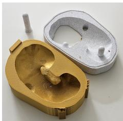  
1. 3D Printed Mold

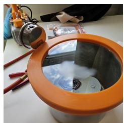  
2. Pour and Vacuum

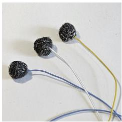

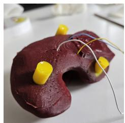

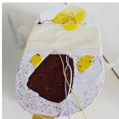  
3. Shaped ROIs

7. Fully Cured  
6. Holes Filled  
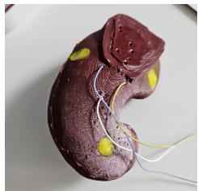  
8. Excess Cut-off

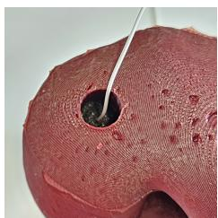  
4. ROIs in Organ

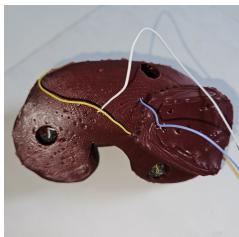

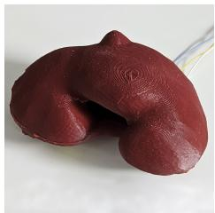  
5. Wires Buried

9. Final Phantom  
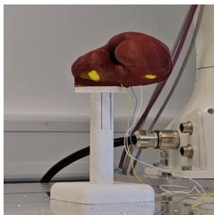  
10. Mounted  
Fig. 11. Visualized process of creating a physical phantom. Each silicone phantom is molded with negative spaces for the Regions of Interests (ROIs). After placing the ROIs in the negative spaces and re-routing their wires through the phantom, the holes are filled with additional silicone. All excess material is removed and the phantom is mounted on to the setup.

## C. Target Position Prediction

To obtain the structural information of the deformable phantom, we first acquire a point cloud of its surface using our depth camera. The phantom surface is segmented from the background by color. From the input surface point cloud, the ON then infers a dense output point cloud that includes both the external shape and internal structures of the deformable phantom. We then transform the dense output point cloud into the robot coordinate system for trajectory planning. The goal position for puncturing is defined as the center of each ROI. The straightforward way of determining the ROI centers is calculating the geometric center of points in the point cloud that are labeled as belonging to the ROI. As an alternative, we further investigate the use of local uncertainties and softmaxprobabilities to weigh the influence of each point when computing the center.

Uncertainty Weighted Centroid (UWC) is the centroid of a set of points, using the prediction uncertainty of each point as a weight. Given a set of points $\{ ( x _ { i } , y _ { i } , z _ { i } , u _ { i } ) \}$ i where $( x _ { i } , y _ { i } , z _ { i } )$ are the coordinates of the i-th point and $u _ { i }$ is the uncertainty of the predicted label, the UWC is a weighted arithmetic mean of the coordinates. To compute the UWC, we

1) normalize the uncertainties

$$
u _ { i } ^ { \prime } = \frac { u _ { i } } { \sum _ { j } u _ { j } } ,
$$

2) convert uncertainties to certainties

$$
c _ { i } = 1 - u _ { i } ^ { \prime } ,
$$

3) normalize certainties

$$
c _ { i } ^ { \prime } = \frac { c _ { i } } { \sum _ { j } c _ { j } } , \mathrm { ~ a n d }
$$

4) compute the UWC

$$
\mathrm { U W C } = \left( \sum _ { i } c _ { i } ^ { \prime } x _ { i } , \sum _ { i } c _ { i } ^ { \prime } y _ { i } , \sum _ { i } c _ { i } ^ { \prime } z _ { i } \right) .
$$

Finally, we consider the Softmax Probability Weighted Centroid (SPWC). The SPWC is the centroid of a set of points, using the softmax probabilities of each point as a weight. For this we consider the per-point softmax probability of the predicted label as a weight, see Equation (11). Similar to the UWC, these weights are normalized over all points with the same label.

## D. Puncture Path Planning

For puncturing a ROI, we use the target position as described in Section V-C. We then locate the point in the dense output point cloud that is closest on the surface of the deformed phantom. The vector between the target point and the corresponding closest point on the surface provides the puncture trajectory. For robotic execution, we first approach the surface point at a distance, to align the robotic needle with the puncture trajectory, and then translate the needle along the trajectory to reach the target point.

## E. Robot Calibration

As the goal of our robotic setup is to puncture ROIs with a diameter of 17 mm, the accuracy of the robotic system is critical. We use an industrial robotic arm with serial kinematics that has a repeatability of ±0.1 mm (i.e., the ability to return to the same position again and again). However the accuracy (i.e., the ability to move to a desired absolute position in space) varies non-linearly in the workspace with average deviations of 5.466 mm and a maximum of 8.752 mm. Therefore, these deviations are comparable to the radius of the ROIs (8.5 mm). To ensure that ROIs can be hit reliably, the accuracy of the robotic arm needs to be improved. For this, we calibrate its DH parameters [31] by learning offsets that minimize the difference between the end-effector positions that were determined by the robot’s internal forward kinematics and reference positions measured by an optical tracking system, see Figure 13.

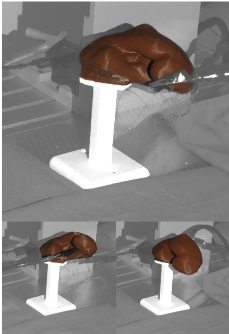  
Organ

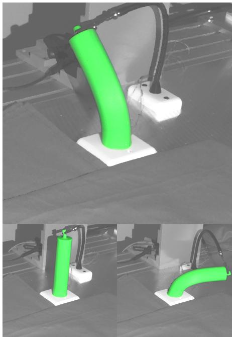  
Cylinder

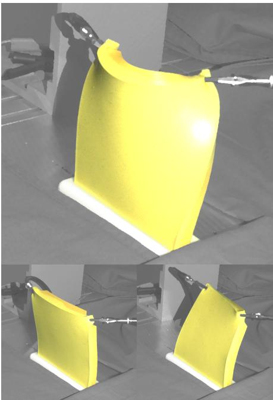  
Slab  
Fig. 12. Example deformations of real-world objects. The images are taken by the depth camera, alongside the actual point clouds used as inference input. Helping hands are used to deform the objects.

We describe the kinematic chain of the 7 Degree of Freedom (DoF) serial robotic arm with one tuple of DH parameters $\omega _ { i } : = ( \theta _ { i } , d _ { i } , \alpha _ { i } , a _ { i } )$ per joint i. Each tuple of DH parameters $\omega _ { i } ~ = \hat { \omega } _ { i } + \Delta \omega _ { i }$ is the sum of manufacturer provided DH parameters $\hat { \omega } _ { i }$ and a calibration offset $\Delta \omega _ { i }$ that we estimate from data. We further use a position vector $p _ { \mathrm { b a s e } } \in \mathbb { R } ^ { 3 }$ and XYZ Euler angles $\phi _ { \mathrm { b a s e } } ~ \in ~ \mathbb { R } ^ { 3 }$ to describe the pose of the robot’s base in relation to a fixed world-reference coordinate system. We optimize $p _ { \mathrm { b a s e } } , \ \phi _ { \mathrm { b a s e } } ,$ and $\Delta \omega _ { i }$ to minimize the error between the robot’s position determined by the manufacturer’s DH parameters $\omega _ { i }$ and its true pose in 3D space. To obtain the true position and rotation of the end-effector, we use an infrared marker based tracking system (OptiTrack PrimeX 13W, NaturalPoint, United States) with a 3D printed marker attachment for the robot. In our setup, the tracking system achieves an accuracy of approximately 0.4 mm. Our calibration dataset consists of triplets (ptracked, qtracked, ξ), where $p _ { \mathrm { t r a c k e d } } ~ \in ~ \mathbb { R } ^ { 3 }$ and $q _ { \mathrm { t r a c k e d } } ~ \in ~ \mathbb { R } ^ { 4 }$ represent the endeffector position and orientation, respectively, as measured by the optical tracker, while $\xi \in \mathbb { R } ^ { 7 }$ contains the joint values recorded from the robot’s encoders. The robot moves along trajectories between 500 randomly generated end-points. The triplets are recorded at static end-points of trajectories after a short pause to minimize settling vibrations.

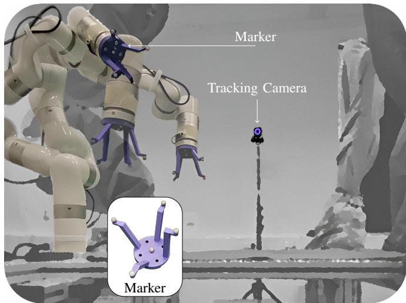  
Fig. 13. Calibration setup used to improve the accuracy of the robotic system. The xArm7 robot (UFactory, China) with an infrared Marker attachment moves around while being tracked by three OptiTrack PrimeX 13W Tracking Cameras (NaturalPoint, United States). The Tracking Cameras are arranged in a triangular configuration around the robotic setup at a distance of approximately 2 m. Only one of the Tracking Cameras is visible in the image.

The complete forward kinematics transformation that describes the pose of the end-effector in relation to the fixed world-reference coordinate system is

$$
T _ { \mathrm { E E } } = T _ { \mathrm { b a s e } } \prod _ { i = 1 } ^ { 7 } T _ { i } ,\tag{20}
$$

where $T _ { i } \in \mathbb { R } ^ { 4 \times 4 }$ is the homogeneous transformation matrix

of the i-th joint for DH parameters $\omega _ { i } ,$ , constructed as

$$
T _ { i } = \left[ s \theta _ { i } \cdot c \alpha _ { i } \quad c \theta _ { i } \cdot c \alpha _ { i } \quad - s \alpha _ { i } \quad - d _ { i } \cdot s \alpha _ { i } \right] ,\tag{21}
$$

with shorthands s and c for sin(·) and $\cos ( \cdot )$ , respectively. $T _ { \mathrm { b a s e } } \in \mathbb { R } ^ { 4 \times 4 }$ is the homogeneous transformation matrix for $p _ { \mathrm { b a s e } }$ and $\phi _ { \mathrm { b a s e } }$ . For optimization, we compute the end-effector position using the forward kinematics with $\theta \ = \ \xi + \Delta \theta .$ where $\xi$ are the joint values from our dataset. The resulting homogeneous matrix $T _ { E E }$ encodes the end-effector position $p _ { \mathrm { f o r w a r d } }$ and end-effector orientation quaternion $q _ { \mathrm { f o r w a r d } } .$ The parameters $p _ { \mathrm { b a s e } } , \phi _ { \mathrm { b a s e } }$ , and $\Delta \omega _ { i }$ are optimized by minimizing a combined loss function

$$
\begin{array} { r } { \mathcal { L } = \mathcal { L } _ { \mathrm { p o s } } + \lambda \mathcal { L } _ { \mathrm { r o t } } , } \end{array}\tag{22}
$$

where λ is a weighting for the rotation loss. We set $\lambda = 1 0 0$ to scale both loss components to the same order of magnitude.

The position loss

$$
\mathcal { L } _ { \mathrm { p o s } } = \frac { 1 } { S } \sum _ { j = 1 } ^ { S } \left\| p _ { \mathrm { t r a c k e d } } ^ { ( j ) } - p _ { \mathrm { f o r w a r d } } ^ { ( j ) } \right\| _ { 2 }\tag{23}
$$

is the mean 2-norm between measured end-effector positions $p _ { \mathrm { t r a c k e d } }$ from the optical tracking system and the predicted position $p _ { \mathrm { f o r w a r d } }$ over $S = 5 0 0$ samples in the dataset.

The rotation loss

$$
\mathcal { L } _ { \mathrm { r o t } } = \frac { 1 } { S } \sum _ { j = 1 } ^ { S } \operatorname* { m i n } \left\{ \left\| q _ { \mathrm { t r a c k e d } } ^ { ( j ) } \pm q _ { \mathrm { f o r w a r d } } ^ { ( j ) } \right\| _ { 2 } \right\}\tag{24}
$$

is the mean over the quaternion difference defined by Huynh [32]. Quaternions can represent the same rotation with either a positive or negative sign. The loss function takes the minimum 2-norm difference between both possibilities to account for this sign ambiguity in quaternion representation. The optimization is performed with stochastic mini-batch gradient descent, using PyTorch’s implementation of the Adam optimizer [33].

## VI. EXPERIMENTS

To evaluate the performance of LUDO in the context of low-latency targeting of internal structures within deformable objects, we conduct a series of experiments designed to assess various aspects of the system. This includes inference speed, prediction accuracy, uncertainty estimation, explainability, robot calibration, and real-world autonomous puncturing. The centroid error metric measures the error between the predicted and ground truth centroid of a ROI. All time measurements were performed using a single Nvidia RTX 4090 (Nvidia, United States). LUDO was trained according to Section IV using the prior 3D surface models, containing the ROIs, of each phantom. The hyperparameters were chosen according to Table I unless stated otherwise.

## A. Inference Time

We measure LUDO’s inference speed by varying the number of query points and observing the trade-off between response time and accuracy in localizing internal structures. The goal is to optimize speed without sacrificing precision.

## B. Uncertainty Estimation

We explore activation-based and MCD-based uncertainty estimation. These experiments are designed to determine whether per-point uncertainty can be used to influence the centroid estimation of the ROIs to improve targeting accuracy. For this, we compare the centroid error of the UWC method with a regular geometric centroid and the SPWC. Additionally, we want to evaluate whether it is possible to obtain a single aggregated uncertainty value. This single value can be used to determine if it is safe to perform a task given the input data. These experiments are performed in simulation, using $N = 5 0$ different deformations for each object.

## C. Explainability

We test the system’s explainability to highlight important regions in the input point cloud. This helps identify which features are most relevant for understanding the objects’ deformations and ensures that the system’s decisions are interpretable.

## D. Robot Calibration

We evaluate the end-effector positioning error, defined as the distance between the end-effector position predicted by the robot’s forward kinematics and the actual position measured by the optical tracker. In addition to the calibration as described in Section V-E, we perform ablative experiments to show the impact of the individual design decisions. The ablations are:

• (∆θ-Only Calibration) Learning only $\Delta \theta ,$ , to determine whether the error stems from incorrectly calibrated zero positions of the rotational joints in the kinematic chain.

• (Fixed $T _ { \mathbf { b a s e } } )$ Using a manually measured fixed transformation between robot base and world-reference $T _ { \mathrm { b a s e } } .$

• (Dynamic Data) Collecting data triplets (ptracked, qtracked, ξ) during the movement between end-points (i.e., not just static end points).

• (Single Joint Movement) Instead of moving along trajectories between end-points in Cartesian space, move the robot in joint space, a single joint at a time.

## E. Comparison to Baseline

We compare LUDO to Volume2SurfaceCNN (V2S) [3]. This comparison requires multiple considerations due to the limitations of current deformable registration approaches. Current deformable registration methods commonly require an initial rigid alignment of the observation to the prior model [5]. V2S is able to perform deformable registration without an initial rigid alignment if the object that is to be registered is fully observable (not just a single view). In cases where only a partial observation of the surface is present, the results depend highly on the initial rigid alignment. Rigid initial alignment approaches, for example using ICP, will inevitably fail once deformations become too strong. Therefore, given single-view or partial observations, the V2S authors propose performing the initial alignment manually. For this evaluation, we ensure the evaluation dataset is already rigidly aligned for V2S. Therefore, the observations are optimally aligned in the world-space of the prior model. Finally, we evaluate V2S using both single-view and full surface observation of the deformed object. Having a full surface observation of the deformable objects is impractical in most applications. We will only provide LUDO with single-view observations and no initial alignment. LUDO is trained from scratch for each object. For inference, LUDO uses 40 000 query points. Similar to LUDO, V2S is a data-driven method. Therefore, we evaluate the benefit of fine tuning it on our data. For evaluation, we train LUDO and V2S on 20 000 deformations of each object for 100 epochs. To compare the approaches, we again use the centroid error. The test dataset consists of 64 deformations for each object. Additionally, we discuss the training time, inference time, and memory requirements.

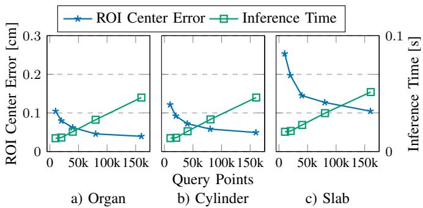  
Fig. 14. Relationship between the number of query points, the inference time (excludes depth image capture time) and the error of the estimated centroid to the ground truth centroid. Measurements taken on a single Nvidia RTX 4090 (Nvidia, United States).

## F. Real-World Robotic Puncturing

In the final set of experiments, we test the overall performance of LUDO in a real-world robotic puncturing scenario. Using deformable silicone phantoms with embedded ROIs, we task the robot to autonomously puncture the ROI centers. Each phantom is deformed N = 10 times, examples are shown in Figure 12. We apply the deformations by pushing or pulling the phantoms using helping hands. Additionally, we ensure that all deformations are visually distinguishable from each-other. After each deformation, each of the three ROIs is targeted for puncture. These experiments simulate scenarios such as robotic biopsies and evaluate the practicality of LUDO on deformed objects for providing structural information to precisely target internal structures.

## VII. RESULTS

## A. Inference Time

The number of query points used for inference linearly increases inference time, but reduces the centroid error, see

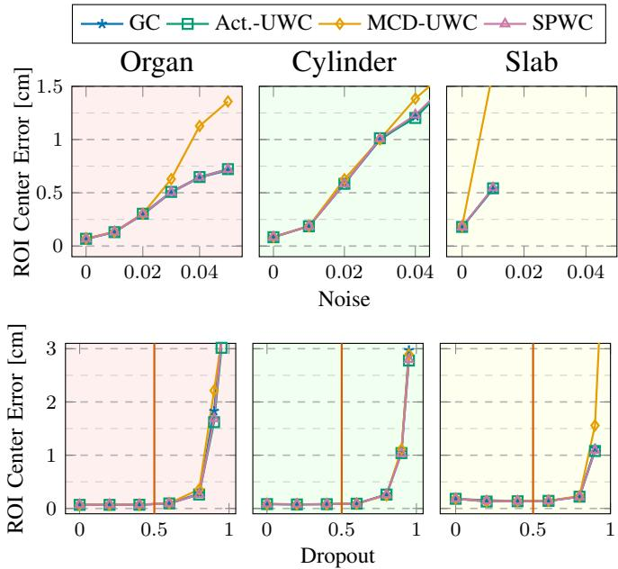  
Fig. 15. The effect of adding noise (as a fraction of the scene size) and dropping a fraction of points from the input point cloud on the accuracy of estimating the center of the Regions of Interest (ROIs) is evaluated. Different centroid estimation methods are considered: geometric centroid (GC), activation-based (Act.-UWC), and Monte-Carlo Dropout (MCD-UWC) based uncertainty-weighted centroid estimation, and finally softmax probabilityweighted (SPWC) centroid estimation. The vertical line at Dropout = 0.5 indicates the maximum proportion of points randomly dropped during training.

Figure 14. Using 20 000 query points achieves centroid errors below 2 mm across all objects, with inference times under 20 ms. Increasing the number of points beyond 80 000 yields only minimal accuracy gains. The most pronounced accuracy improvement relative to additional inference time occurs when increasing the point count from 20 000 to 40 000, maintaining an inference time of less than 30 ms. In comparison to the other objects, Slab shows slower inference times. This is caused by the larger number of points in the input point clouds, resulting in a slower latent distillation. An average input point cloud for Organ and Cylinder contains 500 points, whereas Slab can contain over 2000 points, due to the large flat surface the object.

## B. Uncertainty Estimation

We evaluate the effect of MCD on the model performance by comparing it to models trained without dropout. We found a dropout of 20% in the MLP part of our architecture to have only a minimal effect on the centroid error for all objects. Enabling dropout decreases the accuracy by less than 0.5 mm.

a) Local Per-Point Uncertainty: Using the local perpoint uncertainty and probability values for weighting the centroid estimation results in the same or even decreased accuracy.

Figure 15 shows that UWC with activation entropy and SPWC perform almost identically to the geometric centroid of a ROI. Using MCD uncertainty values results in a strong error increase as noise levels increase or more input point are dropped. The effect of dropping up to 60% of input points has no effect on the centroid error. This roughly coincides with the number of points dropped during training (50%). We did not perform experiments for Slab with noise levels above 0.01 as the ON fails to consistently reconstruct all ROIs.

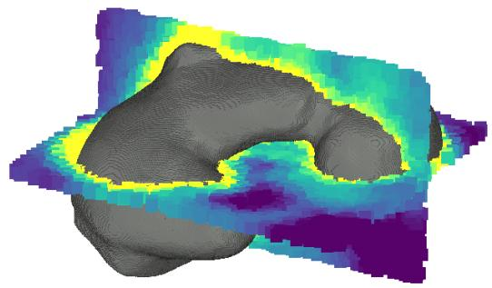  
Mesh-Reconstruction and Uncertainty

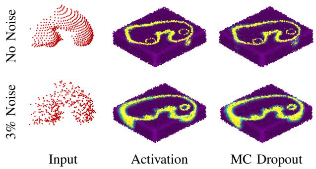  
Fig. 16. Visualization of a sliced dense output point cloud of the organ with uncertainty indicated by color. Both activation entropy and Monte-Carlo Dropout based uncertainty is shown. The uncertainty is visualized for inputs with and without noise added to the input. The areas around the decision boundaries have high uncertainty (yellow). Areas far from the decision boundaries have low uncertainty (purple). Both methods produce very similar uncertainty values.

The visualization in Figure 16 shows that uncertainty is high close to the decision boundaries between segments of the object or between the object and the outside. When adding noise (noise level 0.03) the decision boundaries become more spread out, indicating LUDO is less confident about the true location of the decision boundaries. To quantify this spreading out, we can consider the aggregated uncertainty of the reconstruction.

b) Aggregated Uncertainty: Both activation entropy and MCD-based uncertainty values, when aggregated, can be used to measure a single uncertainty value. Figure 17 shows that, with an exception for Slab, both approaches provide strictly monotonically increasing aggregated uncertainty values as noise or input point drop level increase. The noise level of 0.01, at which the activation entropy-based aggregated uncertainty for Slab suddenly drops, coincides with the point where the ON fails to correctly reconstruct all ROIs.

Additionally, we provide examples of inputs that result in high aggregated uncertainty values for the Cylinder scene without added noise and without input point drop, see Figure 18.

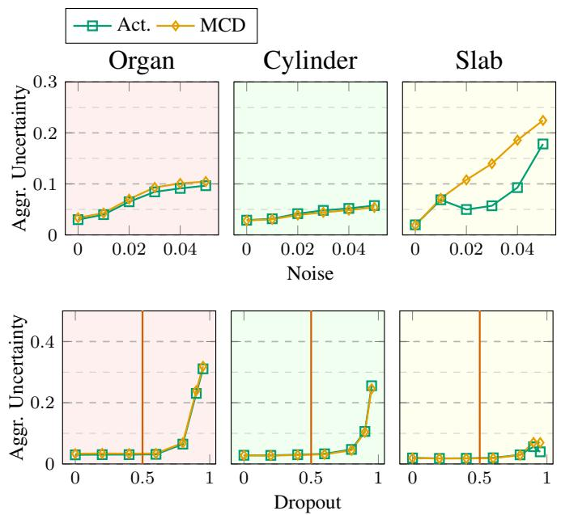  
Fig. 17. The aggregated uncertainty is evaluated as noise is added to the input point cloud (as a fraction of the object size) and as points are dropped from the input point cloud. The evaluation compares different centroid estimation methods: Activation-based (Act.) and Monte-Carlo Dropout (MCD) based uncertainty. The vertical line at Dropout = 0.5 indicates the maximum proportion of points that were randomly dropped during training.

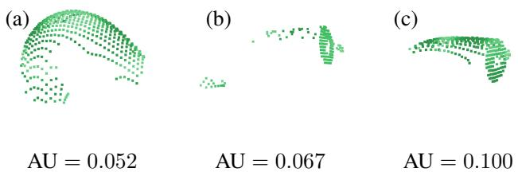  
Fig. 18. Examples of input point clouds P of the Cylinder with activationbased Aggregated Uncertainty (AU) outside the range 0.029 ± 0.014 (mean ± standard deviation). (a) The Cylinder is bent into an inverted U-shape, leading to ambiguity in labeling the outer Regions of Interest (ROIs). (b) A point cloud with large missing regions, caused by self-occlusion, but still capturing both ends. (c) A point cloud containing only the top part of the Cylinder, with the bottom half not visible at all.

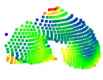  
Organ

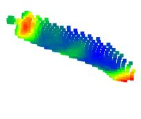

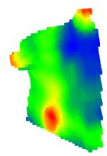  
Cylinder  
Fig. 19. Examples of explainability point clouds for each scene. The red regions are areas that have the biggest impact on estimating the deformation of each object. Highlighted areas include: 1) The bump on the top side of the organ, which is an important feature to locate the underlying ROI. 2) The starting and end-points of the Cylinder. 3) The corners from which the Slab is deformed.

TABLE II  
MEAN CENTROID ERROR (CM) FOR V2S AND LUDO AFTER 100 EPOCHS OF TRAINING ACROSS THE THREE DEFORMABLE OBJECTS. THE ABBREVIATIONS FO AND FT STAND FOR FULL OBSERVATION AND FINE-TUNED. LUDO∗ WAS TRAINED FOR 600 EPOCHS. RIGID ALIGNMENT REPRESENTS THE CENTROID ERROR OF THE RIGIDLY ALIGNED DATA GIVEN TO V2S AS INPUT. THE MEAN ± STANDARD DEVIATION VALUES ARE COMPUTED OVER 64 DIFFERENT DEFORMATIONS FOR EACH OBJECT.
<table><tr><td>Method</td><td>Organ</td><td>Cylinder</td><td>Slab</td></tr><tr><td>Rigid Alignment</td><td> $1 . 2 5 \pm 0 . 8 0$ </td><td> $4 . 4 7 \pm 1 . 4 8$ </td><td> $2 . 4 3 \pm 0 . 8 2$ </td></tr><tr><td>V2S</td><td> $0 . 2 7 \pm 0 . 1 7$ </td><td> $1 . 8 8 \pm 0 . 7 7$ </td><td> $1 . 3 9 \pm 0 . 6 9$ </td></tr><tr><td>V2S+FO</td><td> $0 . 2 4 \pm 0 . 1 6$ </td><td> $1 . 8 4 \pm 0 . 6 9$ </td><td> $0 . 9 9 \pm 0 . 3 7$ </td></tr><tr><td>V2S+FT</td><td> $0 . 1 9 \pm 0 . 1 3$ </td><td> $0 . 3 8 \pm 0 . 1 8$ </td><td> $0 . 5 1 \pm 0 . 2 6$ </td></tr><tr><td>V2S+FT+FO</td><td> $0 . 1 4 \pm 0 . 0 8$ </td><td> $0 . 2 5 \pm 0 . 1 3$ </td><td> $0 . 3 7 \pm 0 . 2 0$ </td></tr><tr><td>LUDO (Ours)</td><td> ${ \bf 0 . 1 4 \pm 0 . 0 5 }$ </td><td> ${ \bf 0 . 1 9 \pm 0 . 0 7 }$ </td><td> ${ \bf 0 . 1 9 \pm 0 . 1 0 }$ </td></tr><tr><td>LUDO* (Ours)</td><td> ${ \bf 0 . 0 7 \pm 0 . 0 3 }$ </td><td> ${ \bf 0 . 0 7 \pm 0 . 0 4 }$ </td><td> $\mathbf { 0 . 1 2 \pm 0 . 0 6 }$ </td></tr></table>

## C. Explainability

We qualitatively present explainability point clouds obtained from each object in Figure 19. LUDO captures features that are important to understanding the deformations of each deformable object. For the Cylinder, the attachment point at the base and the regions of interaction are clearly highlighted. The two interaction regions at the tips of the Slab are also clearly highlighted. For the Organ, the bump at the top is highlighted, identifying it as a strong feature which also indicates the position of the embedded middle ROI.

## D. Robot Calibration

Our robot calibration procedure described in Section V-E decreases the mean positioning error from 5.466 mm to 0.956 mm. The maximum error decreases from 8.752 mm to 2.699 mm. The ablative experiments described in Section VI-D have the following impact on the mean positioning error:

• (∆θ-Only Calibration): +1.677 mm,

$( \mathbf { F i x e d } \ T _ { \mathbf { b a s e } } ) \colon$ +0.035 mm,

• (Dynamic Data): +0.161 mm, and

• (Single Joint Movement): +0.129 mm.

The largest increase in positioning error is a result of limiting the optimization to only ∆θ. This shows the importance of calibrating the complete set of DH parameters in contrast to calibrating only the joint zero positions θ. The low impact of calibrating $T _ { \mathrm { b a s e } }$ indicates a good initial estimate for the global position of the robot base in relation to the world reference frame. The use of dynamically collected data (i.e. using samples $( p _ { \mathrm { t r a c k e d } } , q _ { \mathrm { t r a c k e d } } , \xi )$ collected during the movement between end-points) results in a minor decrease in accuracy. The specific choice of motion to generate the training data has only minor impact on the total accuracy.

## E. Comparison to Baseline

The mean centroid errors of LUDO and V2S are presented in Table II. After training for 100 epochs, LUDO outperforms V2S across all three evaluated objects. Further, the centroid error of LUDO decreases further as more epochs are used for training. We found that the registration quality of V2S, pre-trained on the original V2S dataset, plateaus after approximately 70 to 90 epochs, which aligns with the number of epochs used in the original work. LUDO’s accuracy does not plateau after 100 epochs, the centroid error is reduced further through additional epochs. On the smaller training dataset used for the baseline comparison, LUDO requires between 20 and 40 seconds per training epoch depending on the scene. V2S requires an average of 14 minutes per epoch. Therefore, LUDO can be trained between 21 and 42 times faster on the same hardware. This large difference in training time also correlates with the raw file size of the training data. An average LUDO training dataset is approximately 10 gigabytes in size, whereas the volumetric representation used by V2S results in training datasets of approximately 160 gigabytes for each object. For V2S, the training time is in strong contrast to the inference time. V2S requires only 5 ms whereas LUDO requires approximately 20 ms.

## F. Real-World Robotic Puncturing

For the real-world robotic puncturing we use LUDO with geometric centroids and 40 000 query points. The success rate (i.e., hitting the ROIs with the needle) for the Organ and Slab was 100% for all ROIs. For Cylinder the success rate was 96.67%, with a single failure for the centered ROI. Overall, we attempted 90 ROI punctures and achieved a success rate of 98.9%. The single failure case is discussed in Section VIII-F.

## VIII. DISCUSSION

## A. Inference Time

The inference time of LUDO is an important factor, in particular for real-time applications like robotic surgeries. In our experiments, we find that using approximately 40 000 query points achieves a good balance between speed and accuracy, with inference times consistently below 30 ms. This performance ensures that the system can provide low-latency feedback necessary for dynamic environments where deformations can occur rapidly, such as surgical procedures. LUDO has a constant inference time, regardless of the complexity of the deformation. The only variables that affects inference time are the number of points in the observation, see difference between Slab and Cylinder, as well as the number of points used to query the occupancy network. Both of these variables can be adjusted online to ensure a constant inference time. For example by randomly sub-sampling the point cloud observation, which LUDO is robust to as shown in Figure 17.

## B. Uncertainty Estimation

Both MCD and activation based uncertainty estimation provide very similar outputs. Contrary to our initial expectations, we found that using the uncertainty values provided by both methods for a weighted ROI centroid estimation decreased accuracy. Especially the use of MCD weighting resulted in a strong degradation of accuracy. The use of SPWC seems to also not provide a benefit over using the geometric centroid.

Nevertheless, both uncertainty approaches can be used to estimate a aggregated uncertainty. Intuitively, as the decision boundaries spread out with increased noise, see Figure 16, the aggregated uncertainty values increase, see Figure 17. We found that when LUDO becomes highly uncertain, reaching a point where it fails to reconstruct ROIs, the activation entropy-based aggregated uncertainty estimation unexpectedly exhibits a sudden drop, contrary to the anticipated continuous increase. Activation entropy-based uncertainty estimation uses a single forward pass of the model, and cannot distinguish between confident correct and confident incorrect predictions. In contrast, MCD-based uncertainty estimation aggregates the predictions from multiple forward passes. The disagreements between confident incorrect predictions increase the entropy of the aggregated prediction. Increased entropy reveals uncertainty even when individual models are confident in their incorrect predictions. Thus, MCD-based aggregated uncertainty is better suited for high-risk applications. Nevertheless, the additional computation cost of MCD-based uncertainty needs to be taken into account. The inference time increases linearly with the number m of inferences performed with different dropout seeds. Finally, the amount of increase in aggregated uncertainty is scene dependent. Aggregated uncertainty normalization that is object-independent remains an open problem for future work. We currently use a uniform sampling strategy to query the neural occupancy function within a bounding box, which is first fitted to the normalized observation and then refined to focus on regions likely containing an object. Consequently, the sampling distribution varies and cannot be considered independent and identically distributed. For example, a tighter fitting bounding box, compared to a looser fitting bounding box, yields fewer sampled points outside the object. Nonetheless, our aggregated uncertainty provides a practical indicator for model confidence. If the average entropy increases (i.e., boundaries become more diffuse), it signals lower overall confidence.

Detecting Ambiguities: For strongly deforming objects or objects with symmetries, estimating structures using singleview perspectives can become ambiguous. During training, we found that in instances where the Cylinder forms an upsidedown U (and where the small extrusion at the top is not visible), LUDO will mix the labels for the outer ROIs. As such ambiguities can not be resolved without additional knowledge, it is important to detect ambiguous observations. LUDO can detect ambiguities through the aggregated uncertainty, which intuitively increases noticeably with increasing ambiguity, see Figure 18.

## C. Explainability

We found that our masking-based approach results in interpretable results for deformable object understanding. Areas that provide important information about the object position or deformations are clearly highlighted. Providing information on important features can aid in human-robot collaboration tasks, by providing a human collaborator with reasoning for autonomous decisions. Potential benefits or interpretation risks of such explainability visualizations should be investigated in future work.

## D. Robot Calibration

Our calibration routine improved the manufacturer provided calibration from a mean positioning error of 5.466 mm to 0.956 mm, decreasing the maximum positioning error from 8.752 mm to 2.699 mm. The optimized calibration had a direct impact on the puncturing task, ensuring that the robot could hit the target ROI’s center provided by the ON. We found that without the calibration, the task of accurately puncturing the ROIs (diameter of 17 mm) was not feasible. Even with optimal predictions from LUDO, an inaccurate robotic system could not perform the puncturing task, as it requires precise execution of the planned trajectory. We performed several ablations to the calibration routine and found that limiting the calibration to only ∆θ results in the largest decrease in accuracy. This indicates that the error is only partially caused by incorrectly calibrated zero positions of the rotational joints in the kinematic chain.

## E. Comparison to Baseline

In our experiments, LUDO consistently outperforms all configurations of V2S in accurately localizing internal structures of deformable objects. This is despite V2S being provided with an optimal rigid alignment, full surface observations, and finetuning. Not only does LUDO achieve lower centroid errors, but it also trains orders of magnitude faster on the same hardware. This is an important property when considering patientspecific scenarios. Similarly, the datasets used for LUDO are also orders of magnitude smaller. This is due to the memoryinefficient 3D volumetric representations used by V2S.

Despite the benefits of LUDO, the baseline method V2S has advantages. Its conditioning approach, which also uses a volumetric representation of the prior model as input, allows V2S to register new deformable objects that are similarly shaped to those seen during training. When tested on the Organ object, V2S achieves a centroid localization error of $0 . 2 7 \pm 0 . 1 7$ cm (mean ± standard deviation) without additional fine-tuning, likely because the Organ has a shape similar to objects in V2S’s original training data. By contrast, LUDO is specialized to the single prior model used during training. Moreover, V2S offers a low inference time of around 5 ms, compared to about 20 ms with LUDO. We want to highlight that this time measurement assumes an optimal initial registration has been found for V2S and all observations are already converted to a volumetric representation.

## F. Real-World Robotic Puncturing

Our approach achieved a near-perfect success rate, with 100% accuracy on two of the phantoms and 96.67% on the third. The system effectively handled various strong deformation states. The single failure was due to needle bending, likely caused by friction between the needle and the silicone phantom material, see Figure 20. To address friction-based failure cases in a phantom setup, better entry angles or material choices should be considered. Online replanning could also compensate for deformations during execution and will be explored in future work. Overall, the experiments confirmed that the proposed method is effective for autonomous robotic puncturing.

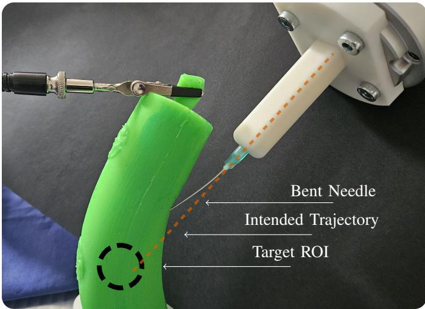  
Fig. 20. Failure case during robotic execution in the Cylinder scene. The Region of Interest (ROI) was missed by the robotically controlled needle. The high friction inside of the silicone phantom caused the needle to bend and miss the ROI. The Intended Trajectory is shown as a dashed line.

## G. Limitations

Our approach has multiple limitations that will be addressed in future work. Trajectory Updates: We do not use live updates of the reconstruction during the puncturing process. But due to the deformable nature of our phantoms, there are noticeable deformations that occur during puncturing. For future applications, updating the trajectory to account for these deformations will be crucial to increase the accuracy and safety. Interaction Points: Our approach requires the generation of training data using a FEM simulation. Although the simulation is physically realistic, we believe a pipeline that does not require the definition of interaction points will be vital for future work. Single-Patch Explainability: Our current masking-based explainability method only addresses ambiguities coming from the removal of a single circular patch. As a simplified example, consider a rigid cylinder of known length L and fixed radius. If the top of the cylinder is masked in the observation, the visible bottom and side allow inference of the full 3D pose, as L determines the missing top’s location. However, if both the top and bottom are masked, the visible side alone cannot resolve the cylinder’s position along its length. It could be shifted up or down while still matching the visible data. Addressing such interdependencies is left for future work. Per-ROI Explainability: LUDO reconstructs the entire deformable object, including its internal structures, leading to entangled input contributions across segments. We can provide per-ROI explainability by computing the $S _ { i }$ only for the respective class and omitting the other classes. Still, the explanation remains influenced by the holistic reconstruction. A more targeted approach, where the network is trained to reconstruct only the ROI given the observation, could improve the interpretability of per-segment input contributions. This approach comes with the limitation that the structural information for the encompassing object is not available for trajectory planning. Disentangling explanations for multi-part object reconstruction remains an open task for future work. Normalization of Aggregated Uncertainty: The aggregated uncertainty values depend on the object, making it unfeasible to establish a single overall uncertainty threshold for determining when the output is unsafe for use. An additional neural network could be used to learn a scene-specific uncertainty normalization. Additionally, strategies should be explored to ensure that no bias is introduced due to the query point sampling strategy. Safety: We wish to emphasize that although LUDO provides explainability and uncertainty estimates, we do not evaluate the overall safety of LUDO. Background Segmentation: Our approach requires the input point cloud to contain only the deformable object of interest. Therefore, a segmentation of the point cloud is needed. As many depth sensors also provide an RGB image, machine learning-based image segmentation approaches should be investigated for background segmentation in future work. Depth Camera: The physical dimensions of our depth sensor constrain its practical use in surgical settings. In minimally invasive surgery, a more compact depth sensor would be necessary. Additionally, the Zivid One+ M achieves high-precision depth estimations through structured light projection. However, projecting structured patterns onto an intraoperative scene could interfere with the surgical workflow. Consequently, the quality of the point cloud observations in our evaluation is likely superior to what can be obtained in real surgical environments, where stereobased microscopic or endoscopic systems are more commonly used. Nevertheless, we currently observe a fast development of accurate machine learning-based monocular and stereo depth estimation methods. Such approaches are quickly becoming competitive and should be considered in future work. Small Segments: As we use dense output point clouds to determine target positions, interacting with very small object segments can be challenging, as they are less likely to be queried using random query points. An approach that better queries areas where structures are likely to be, such as multi-staged hierarchical querying, could improve the inference of very small structures. Controlled Environment: The experimental setup involved a controlled environment, primarily due to precision requirements of the robotic system. The camera and robot are rigidly mounted to the table to ensure accurate positioning, and the organ phantoms are secured to prevent movement during puncturing. This setup does not fully capture realworld conditions with complex backgrounds and soft tissue that moves during puncturing. Addressing these constraints in a dynamic setting will require online re-planning and a robust background segmentation.

## IX. CONCLUSION

This work introduces LUDO, a method for reconstructing and targeting internal structures of deformable objects for robotic applications. LUDO uses neural occupancy networks to infer the full state of deformable objects and their internal structures. The fast inference times of below 30 ms make this approach highly applicable in interactive real-world applications. In contrast to previous approaches for deformable object reconstruction, we generate our training data using SOFA, a state-of-the-art FEM simulation framework. We investigate methods and give experimental insights into local and aggregated uncertainty estimation for occupancy learning. Additionally, we introduce a masking based explainability approach for 3D reconstructions from point clouds. We validate our approach in robotic real-world experiments, where we puncture ROIs in three deformable objects with a total success rate of 98.9%. One notable failure case, where the robotic needle missed the ROI due to bending, emphasizes the importance of low-latency trajectory updates during deformable object interactions. Such updates will be the focus of future investigations to extend the approach for applications requiring online trajectory replanning. We demonstrated LUDO’s advantages compared to V2S, despite providing the baseline with numerous advantages during the evaluation. LUDO is an important step towards practical and safe robotic interaction with deformable objects, as it not only provides rapid structural information, including internal structures hidden from visual observation, but also introduces preliminary methods for quantifying its own uncertainty. LUDO eliminates the need for traditional registration methods and sets a new foundation for future developments in autonomous manipulation of deformable objects.

## REFERENCES

[1] P. J. Besl and N. D. McKay, “Method for registration of 3-d shapes,” in Sensor fusion IV: control paradigms and data structures, vol. 1611. Spie, 1992, pp. 586–606.

[2] M. Pfeiffer, C. Riediger, J. Weitz, and S. Speidel, “Learning soft tissue behavior of organs for surgical navigation with convolutional neural networks,” International journal of computer assisted radiology and surgery, vol. 14, pp. 1147–1155, 2019.

[3] M. Pfeiffer, et al., “Non-rigid volume to surface registration using a data-driven biomechanical model,” in Medical Image Computing and Computer Assisted Intervention–MICCAI 2020: 23rd International Conference, Lima, Peru, October 4–8, 2020, Proceedings, Part IV 23. Springer, 2020, pp. 724–734.

[4] M. Jia and M. Kyan, “Improving intraoperative liver registration in image-guided surgery with learning-based reconstruction,” in ICASSP 2021 - 2021 IEEE International Conference on Acoustics, Speech and Signal Processing (ICASSP), Jun 2021, p. 1230–1234.

[5] B. Deng, Y. Yao, R. M. Dyke, and J. Zhang, “A survey of non-rigid 3d registration,” in Computer Graphics Forum, vol. 41, no. 2. Wiley Online Library, 2022, pp. 559–589.

[6] P. Henrich, B. Gyenes, P. M. Scheikl, G. Neumann, and F. Mathis-Ullrich, “Registered and segmented deformable object reconstruction from a single view point cloud,” in Proceedings of the IEEE/CVF Winter Conference on Applications of Computer Vision, 2024, pp. 3129–3138.

[7] P. Henrich, et al., “Tracking tumors under deformation from partial point clouds using occupancy networks,” 2024. [Online]. Available: https://arxiv.org/abs/2411.02619

[8] M. Afshar, et al., “A Model-Based Multi-Point Tissue Manipulation for Enhancing Breast Brachytherapy,” IEEE Transactions on Medical Robotics and Bionics, vol. 4, no. 4, pp. 1046–1056, Nov. 2022.

[9] F. Alambeigi, Z. Wang, Y.-h. Liu, R. H. Taylor, and M. Armand, “Toward Semi-autonomous Cryoablation of Kidney Tumors via Model-Independent Deformable Tissue Manipulation Technique,” Annals of Biomedical Engineering, vol. 46, no. 10, pp. 1650–1662, Oct. 2018.

[10] F. Zhong, Y. Wang, Z. Wang, and Y.-H. Liu, “Dual-Arm Robotic Needle Insertion With Active Tissue Deformation for Autonomous Suturing,” IEEE Robotics and Automation Letters, vol. 4, no. 3, pp. 2669–2676, July 2019.

[11] P. R. Florence, L. Manuelli, and R. Tedrake, “Dense object nets: Learning dense visual object descriptors by and for robotic manipulation,” arXiv preprint arXiv:1806.08756, 2018.

[12] B. Thach, B. Y. Cho, A. Kuntz, and T. Hermans, “Learning Visual Shape Control of Novel 3D Deformable Objects from Partial-View Point Clouds,” in 2022 International Conference on Robotics and Automation (ICRA), May 2022, pp. 8274–8281.

[13] Y. Ou and M. Tavakoli, “Sim-to-Real Surgical Robot Learning and Autonomous Planning for Internal Tissue Points Manipulation Using Reinforcement Learning,” IEEE Robotics and Automation Letters, vol. 8, no. 5, pp. 2502–2509, May 2023.

[14] P. M. Scheikl, et al., “Movement primitive diffusion: Learning gentle robotic manipulation of deformable objects,” IEEE Robotics and Automation Letters, vol. 9, no. 6, pp. 5338–5345, 2024.

[15] C. R. Qi, L. Yi, H. Su, and L. J. Guibas, “Pointnet++: Deep hierarchical feature learning on point sets in a metric space,” Advances in neural information processing systems, vol. 30, 2017.

[16] L. Mescheder, M. Oechsle, M. Niemeyer, S. Nowozin, and A. Geiger, “Occupancy networks: Learning 3d reconstruction in function space,” in Proceedings of the IEEE/CVF conference on computer vision and pattern recognition, 2019, pp. 4460–4470.

[17] J. J. Park, P. Florence, J. Straub, R. Newcombe, and S. Lovegrove, “Deepsdf: Learning continuous signed distance functions for shape representation,” in Proceedings of the IEEE/CVF conference on computer vision and pattern recognition, 2019, pp. 165–174.

[18] N. Rahaman, et al., “On the spectral bias of neural networks,” in Proceedings of the 36th International Conference on Machine Learning, ser. Proceedings of Machine Learning Research, K. Chaudhuri and R. Salakhutdinov, Eds., vol. 97. PMLR, 09–15 Jun 2019, pp. 5301–5310. [Online]. Available: https://proceedings.mlr.press/v97/ rahaman19a.html

[19] B. Mildenhall, P. P. Srinivasan, M. Tancik, J. T. Barron, R. Ramamoorthi, and R. Ng, “Nerf: Representing scenes as neural radiance fields for view synthesis,” in ECCV, 2020.

[20] P. Henrich and F. Mathis-Ullrich, “Looc: Localizing organs using occupancy networks and body surface depth images,” arXiv preprint arXiv:2406.12407, 2024.

[21] F. Faure, et al., “SOFA: A multi-model framework for interactive physical simulation,” in Soft Tissue Biomechanical Modeling for Computer Assisted Surgery, 2012, vol. 11, pp. 283–321.

[22] S. Tian, B. G. Cangan, S. E. Navarro, A. Beger, C. Duriez, and R. K. Katzschmann, “Multi-tap resistive sensing and fem modeling enables shape and force estimation in soft robots,” IEEE Robotics and Automation Letters, vol. 9, no. 3, pp. 2830–2837, 2024.

[23] J. Lai, T.-A. Ren, W. Yue, S. Su, J. Y. Chan, and H. Ren, “Sim-to-real transfer of soft robotic navigation strategies that learns from the virtual eye-in-hand vision,” IEEE Transactions on Industrial Informatics, 2023.

[24] F. Makiyeh, F. Chaumette, M. Marchal, and A. Krupa, “Shape servoing of a soft object using fourier series and a physics-based model,” in 2023 IEEE/RSJ International Conference on Intelligent Robots and Systems (IROS). IEEE, 2023, pp. 6356–6363.

[25] P. M. Scheikl, et al., “Sim-to-Real Transfer for Visual Reinforcement Learning of Deformable Object Manipulation for Robot-Assisted Surgery,” IEEE Robotics and Automation Letters, vol. 8, no. 2, pp. 560– 567, Feb. 2023.

[26] Y. Gal and Z. Ghahramani, “Dropout as a bayesian approximation: Representing model uncertainty in deep learning,” in Proceedings of The 33rd International Conference on Machine Learning, ser. Proceedings of Machine Learning Research, M. F. Balcan and K. Q. Weinberger, Eds., vol. 48. New York, New York, USA: PMLR, 20–22 Jun 2016, pp. 1050–1059. [Online]. Available: https://proceedings.mlr.press/v48/gal16.html

[27] A. Kendall and Y. Gal, “What uncertainties do we need in bayesian deep learning for computer vision?” Advances in neural information processing systems, vol. 30, 2017.

[28] L. M. Zintgraf, T. S. Cohen, T. Adel, and M. Welling, “Visualizing deep neural network decisions: Prediction difference analysis,” arXiv preprint arXiv:1702.04595, 2017.

[29] R. C. Fong and A. Vedaldi, “Interpretable explanations of black boxes by meaningful perturbation,” in Proceedings of the IEEE international conference on computer vision, 2017, pp. 3429–3437.

[30] R. R. Selvaraju, M. Cogswell, A. Das, R. Vedantam, D. Parikh, and D. Batra, “Grad-cam: Visual explanations from deep networks via gradient-based localization,” in Proceedings of the IEEE international conference on computer vision, 2017, pp. 618–626.

[31] J. Denavit and R. S. Hartenberg, “A kinematic notation for lower-pair mechanisms based on matrices,” 1955.

[32] D. Q. Huynh, “Metrics for 3d rotations: Comparison and analysis,” Journal of Mathematical Imaging and Vision, vol. 35, pp. 155–164, 2009.

[33] D. Kingma and J. Ba, “Adam: A method for stochastic optimization,” in International Conference on Learning Representations (ICLR), San Diega, CA, USA, 2015.