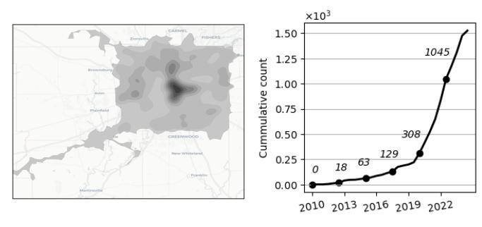
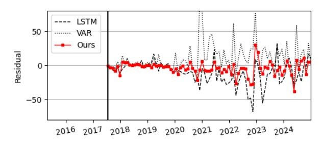
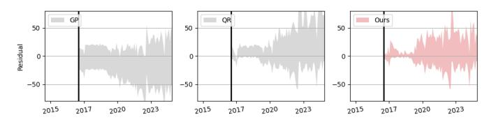
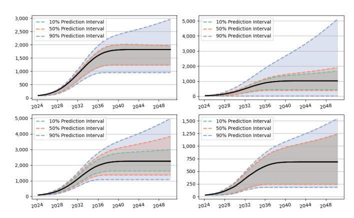
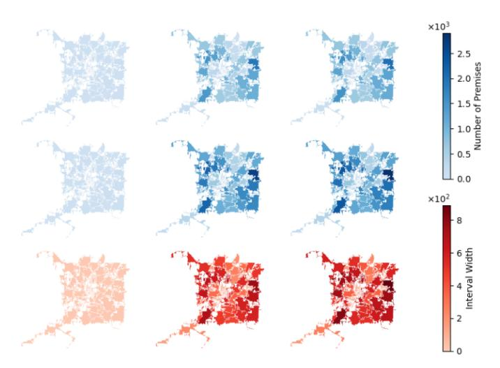

# Hierarchical Spatio-Temporal Uncertainty Quantification for Distributed Energy Adoption

Wenbin Zhou *Carnegie Mellon University* Pittsburgh, PA, USA wenbinz2@andrew.cmu.edu

Shixiang Zhu *Carnegie Mellon University* Pittsburgh, PA, USA shixiangzhu@cmu.edu

Feng Qiu *Argonne National Laboratory* Lemont, IL, USA fqiu@anl.gov

Xuan Wu *AES Indiana* Indianapolis, IN, USA xuan.wu@aes.com

*Abstract*—The rapid deployment of distributed energy resources (DER) has introduced significant spatio-temporal uncertainties in power grid management, necessitating accurate multilevel forecasting methods. However, existing approaches often produce overly conservative uncertainty intervals at individual spatial units and fail to properly capture uncertainties when aggregating predictions across different spatial scales. This paper presents a novel hierarchical spatio-temporal model based on the conformal prediction framework to address these challenges. Our approach generates circuit-level DER growth predictions and efficiently aggregates them to the substation level while maintaining statistical validity through a tailored non-conformity score. Applied to a decade of DER installation data from a local utility network, our method demonstrates superior performance over existing approaches, particularly in reducing prediction interval widths while maintaining coverage.

*Index Terms*—Distributed energy resource, uncertainty quantification, spatio-temporal hierarchical prediction.

## I. INTRODUCTION

In recent years, the global energy landscape has experienced a transformative shift, primarily characterized by an extraordinary increase in renewable energy sources [\[1\]](#page-4-0). One of its primary contributors is *distributed energy resources* (DER), a decentralized approach to power generation that includes a variety of technologies such as solar panels, wind turbines, and small-scale hydroelectric systems [\[2\]](#page-4-1).

While DER deployment has accelerated rapidly, it introduces significant spatio-temporal variability and uncertainties that vary across regions and evolve over time. Understanding these uncertainties is crucial for effective energy management [\[3\]](#page-4-2), facilitating DER integration into existing power grids [\[4\]](#page-4-3), identifying grid enhancement opportunities [\[5\]](#page-4-4), and planning for future energy demands [\[6\]](#page-4-5). More importantly, such uncertainty quantification (UQ) must also be accessible at multiple spatial scales to offer a more comprehensive overview of the future and support their downstream strategic decision-making. For example, granular circuit-level predictions enable precise operational decisions, such as real-time load balancing and resource allocation. Meanwhile, aggregated substation-level forecasts provide the broader perspective needed for long-term infrastructure investments, including capacity enhancement and resilience improvements.

However, achieving multilevel uncertainty quantification presents two main challenges: First, jointly predicting multiple spatial units (*e.g.*, circuits) can result in overly conservative uncertainty intervals, potentially diminishing their practical utility. Excessively wide prediction intervals fail to provide actionable insights for specific operational needs. Second, while aggregating these predictions from circuit to substation level may seem straightforward, doing so without careful adjustment can result in prediction intervals that do not fully capture the true underlying uncertainty at the aggregate level. Simple summation of circuit-level uncertainties often overestimates variability, leading to either inflated risk assessments or misleading confidence in grid performance metrics.

To address these challenges, we propose a hierarchical spatio-temporal model based on conformal prediction [\[7\]](#page-4-6) to predict the spatio-temporal uncertainty in DER growth. Our approach begins by generating circuit-level growth predictions along with corresponding uncertainty measures, and then aggregates these predictions to the substation level based on the grid topology. A key methodological contribution of our method is a novel non-conformity score tailored to this multilevel spatio-temporal predictive task. Our results show that this method maintains both statistical validity and efficiency across multiple spatial levels, ensuring that prediction intervals remain informative and practically useful.

Finally, we apply our method to a real-world dataset containing rooftop solar panel installation records in a major U.S. city over the last decade, collected in collaboration with the local utility. Our findings demonstrate the method's empirical effectiveness and show remarkable improvements over the state-of-the-art approaches, especially in reducing the width of prediction intervals while maintaining coverage. This highlights the utility of our model in providing stakeholders with actionable insights for future strategic decisions.

# II. RELATED WORK

Forecasting demand for DER has gained increased attention in recent years, particularly in predicting power and electricity consumption [\[8\]](#page-4-7). Driven by the high-stakes nature of their downstream operations, a wide range of UQ techniques have been explored, such as probabilistic forecasting [\[9\]](#page-4-8), interval forecasting [\[10\]](#page-4-9), and deep learning approaches [\[11\]](#page-4-10). Due to the unique distributed network topology structure of these renewable energy infrastructures, much work has also explored how these inherent hierarchies can be respected or exploited in various forecasting applications including electricity grid management [12] and power generation forecasts [13].

Our work extends further on these works by incorporating conformal prediction (CP) [7], a distribution-free UQ approach. We consider the distribution shift [14] induced by time series by adopting the line of sequential CP framework [15]. Additionally, our method gained inspiration from the Probabilistic Conformal Prediction [16], [17], allowing our method to tailor to more complex DER forecasting problems by integrating probabilistic models. Our work is also related to hierarchical time series prediction [18].

#### III. PROBLEM SETUP

Consider a utility network consisting of n distribution circuits and m distribution substations. Each substation serves as a "hub", connecting and coordinating multiple circuits within the network. The network topology between circuits and substations is defined by a matrix  $\mathbf{C} := (c_{ij}) \in \{0,1\}^{n \times m}$ , where  $c_{ij} = 1$  indicates circuit  $i \in \mathcal{I}$  is associated with substation  $j \in \mathcal{J}$ , and  $c_{ij} = 0$  otherwise.

For each circuit i at time t, let  $Y_{it} \in \mathbb{Z}_+$  represent the number of DER installations (e.g., rooftop solar panels). Additionally, let  $Z_{it} \in \mathbb{R}^p$  denote a set of demographic covariates associated with circuit i at time t; these covariates may include factors like population density, average income, or degree of urbanization in the circuit's vicinity. To simplify notation, define  $Y_t \coloneqq (Y_{it})_{i=1}^n$  as the vector capturing DER installation counts across all circuits at time t, and  $Z_t \coloneqq (Z_{it})_{i=1}^n$  as the corresponding vector of demographic covariates. Suppose we have a calibration dataset, denoted by  $\mathcal{D} = \{(x_t, y_t)\}_{t=1}^T$ , where  $y_t$  represents the DER installation counts at time t, and  $x_t \coloneqq (\{y_t\}_{\tau < t}, z_{t-1})$  represents all observed predictor variables, including both the historical DER installation counts across circuits up to time t-1 and the demographic covariates  $z_t$  at time t-1.

Our objective is to construct prediction intervals for each circuit at future time T+1, defined by lower bounds  $\widehat{L}:=(\widehat{L}_i)$  and upper bounds  $\widehat{U}:=(\widehat{U}_i)$ . Let  $Y_{T+1}$  represent the DER installation counts across all circuits for the next time step, and  $\mathbf{C}^\top Y_{T+1}$  represent aggregated DER installation counts at the substation level. For a specified confidence level  $1-\alpha$ , we require these prediction intervals to satisfy:

<span id="page-1-0"></span>
$$\mathbb{P}\left(\widehat{L}_{i} \leq Y_{i,T+1} \leq \widehat{U}_{i}\right) \geq 1 - \alpha, \ i \in \mathcal{I},$$

$$\mathbb{P}\left(\left[\mathbf{C}^{\top}\widehat{L}\right]_{j} \leq \left[\mathbf{C}^{\top}Y_{T+1}\right]_{j} \leq \left[\mathbf{C}^{\top}\widehat{U}\right]_{j}\right) \geq 1 - \alpha, \ j \in \mathcal{J},$$
(1)

where  $[\cdot]_j$  denotes the *j*-th element of a vector.

We evaluate our prediction intervals based on two criteria: (i) Validity: Ensuring the intervals meet the coverage requirements specified in (1); (ii) Efficiency: Minimizing the width of the prediction intervals. While wide intervals could trivially achieve the desired coverage, our goal is to produce narrow, informative prediction sets that remain statistically valid and practically useful for decision-making.

## Algorithm 1 HST-Conformal

```
Require: Dataset \mathcal{D}, network topology \mathbf{C}, significance level
      \alpha, sample size K, prediction model \lambda_t^*.
  1: Initialize \mathcal{E}_i = \emptyset for all i = 1, \ldots, n.
  2: Split \mathcal{D} into training set \mathcal{D}_{tr} and calibration set \mathcal{D}_{cal};
  3: Fit model \lambda_t^* on \mathcal{D}_{tr} by maximizing the likelihood;
  4: for t \in \{t_0, \dots, T\} do
          Simulate K outcomes \widehat{y}_t^{(1)}, \dots, \widehat{y}_t^{(K)} \sim \widehat{\lambda}_t^*;
  5:
 6:
          for i \in \{1, ..., n\} do
             Compute \hat{e}_{it} using (2);
  7:
              \mathcal{E}_i \leftarrow \mathcal{E}_i \cup \{\widehat{e}_{it}\};
  8:
  9:
          end for
10: end for
     Compute \alpha-empirical quantile \widehat{q}_i(\alpha) from \mathcal{E}_i for each i;
12: Simulate K outcomes \widehat{y}_{T+1}^{(1)}, \dots, \widehat{y}_{T+1}^{(K)} \sim \widehat{\lambda}_{T+1}^*;
13: Output prediction intervals according to (3).
```

#### IV. PROPOSED METHOD

We propose a novel method called "Hierarchical Spatio-Temporal Conformal Prediction" (HST-Conformal) based on the conformal prediction (CP) framework [7], [14]–[16] to predict the spatio-temporal uncertainty in DER growth. Given a fitted prediction model, the key idea of CP is to construct the uncertainty intervals as a wrapper function around the model's predictions. The size of the interval is calibrated on a separate calibration dataset through the use of a non-conformity score, which measures the deviance of the model from the designated uncertainty quantification objective. CP is completely distribution-free, meaning that no distributional assumptions need to be imposed as part of the algorithmic procedure, and thus has gained broad popularity in application settings where complex statistical interdependencies may be present between prediction variables.

Specifically, our approach begins by dividing the data into two parts: a training set and a calibration set. The training set is used to create a probabilistic model that simulates future scenarios across all circuits, while the calibration set enables us to evaluate prediction errors and fine-tune prediction intervals for each circuit to ensure valid coverage. One key challenge in this process is the hierarchical constraint of substation-level validity, as described in (1). This constraint has not been considered in prior CP literature, making existing non-conformity scores inadequate for achieving (1). To address this, we design a novel non-conformity score that effectively integrates topology network knowledge, ensuring compatibility with this hierarchical structure. This ensures that the resulting prediction intervals achieve statistical validity without compromising much efficiency compared to prior alternative non-conformity score designs.

#### A. Data Splitting and Model Training

We first partition the dataset  $\mathcal{D}$  based on a specified cutoff time index,  $t_0 \in 1, ..., T$ . This separation allows us to use historical data to train a model and use recent data to

<span id="page-2-2"></span>

Fig. 1: DER data overview. Left: Spatial density plot. Right: Cummulative counts by year.

assess and calibrate its predictions. The first part of the dataset, denoted by  $\mathcal{D}_{\mathrm{tr}} \coloneqq \{(x_t,y_t)\}_{t < t_0}$ , is used to fit a probabilistic predition model. The second part of the data, denoted by  $\mathcal{D}_{\mathrm{cal}} = \{(x_t,y_t)\}_{t \geq t_0}$ , is reserved for calibration in the next phase, where we evaluate how well the model's predictions match observed outcomes, and adjust prediction intervals to achieve valid coverage.

In our analysis, we specify the probabilistic prediction model as a multivariate spatio-temporal Hawkes process [19]–[21]. It is a widely used statistical framework for modeling discrete events across space and time, making it well-suited for capturing DER adoption dynamics. Specifically, it is specified by a vector-valued conditional intensity function  $\lambda_t^* := (\lambda_{it}^*)_{i=1}^n$ , where each *i*-th entry represents the likelihood of an installation occurring in circuit *i* at time *t* given the history. Here, the star notation emphasizes its dependence on the observed events in the past. We define it as:

$$\lambda_{it}^* := \gamma_t \left( \mu_i + \sum_{t' < t} \sum_{i'} \alpha_{i,i'} \kappa(t,t') \right),\,$$

where  $\kappa(t,t')=\beta e^{-\beta(t-t')}$  is an exponentially decaying kernel function capturing the self-exciting effect of DER growth, and  $\alpha_{i,i'}$  quantifies the spatial spillover effect between circuits i and i'. These parameters are designed to capture the customer-level triggering effect of DER adoption, which is a phenomenon in which individuals exhibit an increased likelihood of adopting DER equipment after observing their peers do so. This social contagion effect in shaping adoption behaviors has been well-documented in previous empirical studies [22]. The parameter  $\gamma_t$  reflects the decay rate of the intensity function, accounting for the *saturation effect*, which occurs as the penetration rate of DER approaches a population-based limit. Multivariate spatio-temporal Hawkes processes can be fitted by maximizing the likelihood function over observed data [21].

#### B. Calibration

For each data pair  $(x_t, y_t) \in \mathcal{D}_{cal}$ , the calibration procedure operates as follows:

1) Simulate *K* outcomes from the fitted multivariate spatiotemporal Hawkes process via thinning algorithm [23]:

$$\widehat{y}_t^{(1)}, \dots, \widehat{y}_t^{(K)} \sim \widehat{\lambda}_t^*,$$

- where each sample  $\widehat{y}_t^{(k)} \in \mathbb{Z}_+^n$  is one possible joint prediction across all circuits at time t.
- 2) Let  $\mathbf{S} = \mathbf{C}\mathbf{C}^{\top} \in \{0,1\}^{n \times n}$  represent shared substation memberships, where each entry  $s_{ii'} = 1$  if circuit i and i' are assoicated with the same substation, and  $s_{ii'} = 0$  otherwise. The non-conformity score can be written as

<span id="page-2-0"></span>
$$\widehat{e}_{it} = \min_{1 \le k \le K} \|\mathbf{S}_i \odot \left(y_t - \widehat{y}_t^{(k)}\right)\|_{\infty}, \qquad (2)$$

where  $\odot$  is the elementwise product, and  $S_i$  is the *i*th row of S, indicating the indices of circuits that share the same substation with circuit i.

Here, the proposed non-conformity score  $\hat{e}_{it}$  in (2) represents the smallest Substation Maximum Error (SME) for circuit i across all K samples. For each circuit, the SME is computed using the infinity norm to capture the largest prediction error among circuits sharing the same substation, thus quantifying the worst-case deviation within each substation group.

## C. Constructing Prediction Intervals

To construct prediction intervals for each circuit i, we first compute non-conformity scores from the calibration data using (2), creating the set:

$$\mathcal{E}_i := \{\widehat{e}_{it}\}, \text{ for all } i \in \mathcal{I} \text{ and } t : (x_t, y_t) \in \mathcal{D}_{cal}.$$

The prediction intervals for circuit i are then defined as

<span id="page-2-1"></span>
$$\widehat{L}_i := \min_k \widehat{y}_{i,T+1}^{(k)} - \widehat{q}_i(\alpha), \quad \widehat{U}_i := \max_k \widehat{y}_{i,T+1}^{(k)} + \widehat{q}_i(\alpha), \quad (3)$$

where  $\widehat{q}_i(\alpha)$  is the  $\alpha$ -empirical quantile of  $\mathcal{E}_i$ , estimated using quantile regression to account for potential temporal distributional shifts [15]. Substation-level prediction intervals are constructed by aggregating the prediction bounds of associated circuits, given by  $\mathbf{C}^{\top}\widehat{L}$  and  $\mathbf{C}^{\top}\widehat{U}$ . We incorporate standardization for both predictive errors in (2) and estimated quantiles in (3) to further enhance prediction efficiency.

#### V. RESULTS: DER ADOPTION FORECAST

We validate our proposed method using a comprehensive real-world dataset of rooftop solar panel installations from a local utility's network. The dataset spans from 2010 to 2024, consisting of 1,742 installation records distributed across n=245 circuits and m=51 substations. This extensive network coverage not only provides an ideal testbed for validating our

<span id="page-2-3"></span>

Fig. 2: Comparison of out-of-sample point prediction residuals between HST-Conformal and two point prediction baselines. Our method yields residuals with minimal magnitudes.

TABLE I: Compaison of prediction interval evaluation metrics of all methods in out-of-sample prediction task.

<span id="page-3-0"></span>

| Method        | Full      |           |        | Half      |            |        |
|---------------|-----------|-----------|--------|-----------|------------|--------|
|               | Val ↑     | AggVal ↑  | Size ↓ | Val       | AggVal ↑   | Size ↓ |
| LSTM          | No (-)    | No (-)    | -      | No (-)    | No (-)     | -      |
| VAR           | No (56%)  | No (45%)  | 0.37   | No (68%)  | No (79%)   | 0.37   |
| GPR           | No (83%)  | Yes (96%) | 1.24   | No (83%)  | Yes (98%)  | 1.24   |
| QFR           | Yes (93%) | Yes (99%) | 1.09   | Yes (93%) | Yes (100%) | 1.09   |
| HST-Conformal | Yes 99%   | Yes 100%  | 1.06   | Yes 99%   | Yes 95%    | 0.77   |

predictive framework but also enables us to generate actionable insights for system operators. Our analysis delivers valuable decision support for both operational planning and strategic infrastructure management.

In our implementation of HST-Conformal, we set K=10, and the parameters of the Hawkes process are randomly initialized, and trained until convergence for  $10^3$  number of epochs using a learning rate of  $10^{-2}$  learning rate with the Adam gradient descent optimizer.

#### A. Data Description and Preprocessing

In partnership with the local utility, we analyze detailed records of DER installations at the customer level. Each installation record contains geo-location coordinates, application date, and network topology information, including associated pole, circuit, and substation identifiers. The spatial distribution and temporal evolution of these installations over the past decade are visualized in Figure 1.

For our analysis, we aggregate installation data at six-month intervals for each circuit i, where  $y_{it}$  represents the total number of installations within circuit i during time period t. To incorporate socioeconomic factors, we supplement our dataset with five covariates  $z_{it}$  for each circuit i at time t, sourced from both the utility and the US Census Bureau. These variables are key socioeconomic indicators, including the average number of power outages, average electrical load, mean electricity price, average education level, and median household income.

## B. Numerical Evaluation

We conduct a comprehensive numerical experiment on the dataset, benchmarking against four state-of-the-art load/demand forecasting methods: (i) Linear Vector Autoregression (VAR) [24], (ii) Long Short-Term Memory (LSTM) [25] (iii) Gaussian Process (GPR) [26] and (iv) Quantile Regression (QFR) [27]. We use a significance level of 95% uniformly across all methods, and assess the validity and efficiency of constructed prediction intervals by evaluating the circuit-level validity (Val), substation-level validity (AggVal),

<span id="page-3-1"></span>

Fig. 3: Comparison of out-of-sample prediction interval residuals between HST-Conformal and two UQ baselines. Our method yields unbiased and tight prediction intervals.

<span id="page-3-2"></span>

Fig. 4: Prediction intervals of randomly selected four substations from 2024 to 2050.

<span id="page-3-3"></span>

Fig. 5: Prediction results by substation regions. *From left to right*: 2024, 2037 and 2050. *From top to bottom*: lower bound, upper bound, and degree of uncertainty.

and average interval size (Size). To ensure the robustness of our results, the evaluation is performed iteratively by computing one-step ahead monthly prediction intervals in the test set under two trials, wherein the second trial we randomly sample half of its nodes.

As shown in Table I, while our method ensures that both the validity and aggregated validity are satisfied, it also achieves the best efficiency compared to the other baseline methods. Figure 2 and Figure 3 attribute our superior performance at both circuit and substation levels to a robust predictive model configuration combined with a well-designed uncertainty quantification approach, underscoring its practical reliability for deployment within the utility service territory.

### C. Long-Term Forecast and Analysis

To capture the long-term growth trajectory of DER growth, we present forecasts spanning 2024 to 2050 using the proposed HST-Conformal model. Recognizing the influence of regional economic development on energy infrastructure, we enhance our model with additional socioeconomic predictors, including economic indicators, population demographics, and

load usage patterns. Expert insights from the local utility further refine our model to ensure alignment with localized industry trends and infrastructure needs.

As illustrated in Figure [4,](#page-3-2) our forecasts reveal a rapid initial growth phase for DER adoption, which gradually slows as saturation is reached, with a plateau projected around 2036. This trend holds consistently across the base, low, and high forecast scenarios, reflecting a natural adoption limit as market penetration reaches peak capacity within the service area. At the substation level, our analysis identifies significant disparity in growth magnitude and uncertainty. Figure [5](#page-3-3) offers a spatial perspective on this heterogeneity, highlighting that the degree of uncertainty (prediction interval width) is closely tied to each location's base adoption rate. This pattern suggests that highadoption substations are also areas of high forecast uncertainty, a critical insight for grid operators and planners.

These findings underscore the importance of strategic investment and planning in high-demand substations, as these regions are especially susceptible to compounded risks of elevated demand and forecast uncertainty. Our work emphasizes the utility of our method in delivering granular, hierarchical interval forecasts that can support informed decision-making, ensuring resilience in planning for grid infrastructure under variable adoption trajectories.

## VI. CONCLUSION

This paper addresses the critical need for multilevel uncertainty quantification in forecasting DER growth by developing a hierarchical spatio-temporal model. Our method jointly predicts circuit-level growth and aggregates them to the substation level, tackling challenges associated with overly conservative prediction intervals and excessive variability in aggregated forecasts. By tailoring non-conformity scores to the unique demands of spatio-temporal data, we ensured that our method achieves both statistical validity and practical relevance across spatial scales. Applied to the local utility's DER installation data, our model demonstrated improved prediction interval efficiency without sacrificing coverage, offering a robust tool for energy stakeholders navigating the dynamic landscape of DER integration.

# REFERENCES

- <span id="page-4-0"></span>[1] Q. Hassan, S. Algburi, A. Z. Sameen, J. Tariq, A. K. Al-Jiboory, H. M. Salman, B. M. Ali, M. Jaszczur *et al.*, "A comprehensive review of international renewable energy growth," *Energy and Built Environment*, 2024.
- <span id="page-4-1"></span>[2] H. A. Rahman, M. S. Majid, A. R. Jordehi, G. C. Kim, M. Y. Hassan, and S. O. Fadhl, "Operation and control strategies of integrated distributed energy resources: A review," *Renewable and Sustainable Energy Reviews*, vol. 51, pp. 1412–1420, 2015.
- <span id="page-4-2"></span>[3] Y. Zhang, J. Wang, and Z. Li, "Uncertainty modeling of distributed energy resources: techniques and challenges," *Current Sustainable/Renewable Energy Reports*, vol. 6, pp. 42–51, 2019.
- <span id="page-4-3"></span>[4] F. Ren, Z. Wei, and X. Zhai, "A review on the integration and optimization of distributed energy systems," *Renewable and Sustainable Energy Reviews*, vol. 162, p. 112440, 2022.
- <span id="page-4-4"></span>[5] Q. Hassan, C.-Y. Hsu, K. Mounich, S. Algburi, M. Jaszczur, A. A. Telba, P. Viktor, E. M. Awwad, M. Ahsan, B. M. Ali *et al.*, "Enhancing smart grid integrated renewable distributed generation capacities: Implications for sustainable energy transformation," *Sustainable Energy Technologies and Assessments*, vol. 66, p. 103793, 2024.

- <span id="page-4-5"></span>[6] V. Vahidinasab, "Optimal distributed energy resources planning in a competitive electricity market: Multiobjective optimization and probabilistic design," *Renewable energy*, vol. 66, pp. 354–363, 2014.
- <span id="page-4-6"></span>[7] H. Papadopoulos, K. Proedrou, V. Vovk, and A. Gammerman, "Inductive confidence machines for regression," in *Machine learning: ECML 2002: 13th European conference on machine learning Helsinki, Finland, August 19–23, 2002 proceedings 13*. Springer, 2002, pp. 345–356.
- <span id="page-4-7"></span>[8] M. Sharifzadeh, A. Sikinioti-Lock, and N. Shah, "Machine-learning methods for integrated renewable power generation: A comparative study of artificial neural networks, support vector regression, and gaussian process regression," *Renewable and Sustainable Energy Reviews*, vol. 108, pp. 513–538, 2019.
- <span id="page-4-8"></span>[9] D. W. Van der Meer, J. Widen, and J. Munkhammar, "Review on ´ probabilistic forecasting of photovoltaic power production and electricity consumption," *Renewable and Sustainable Energy Reviews*, vol. 81, pp. 1484–1512, 2018.
- <span id="page-4-9"></span>[10] Z. Shi, H. Liang, and V. Dinavahi, "Direct interval forecast of uncertain wind power based on recurrent neural networks," *IEEE Transactions on Sustainable Energy*, vol. 9, no. 3, pp. 1177–1187, 2017.
- <span id="page-4-10"></span>[11] H. Quan, A. Khosravi, D. Yang, and D. Srinivasan, "A survey of computational intelligence techniques for wind power uncertainty quantification in smart grids," *IEEE transactions on neural networks and learning systems*, vol. 31, no. 11, pp. 4582–4599, 2019.
- <span id="page-4-11"></span>[12] V. Almeida, R. Ribeiro, and J. Gama, "Hierarchical time series forecast in electrical grids," in *Information Science and Applications (ICISA) 2016*. Springer, 2016, pp. 995–1005.
- <span id="page-4-12"></span>[13] T. Silveira Gontijo and M. Azevedo Costa, "Forecasting hierarchical time series in power generation," *Energies*, vol. 13, no. 14, 2020.
- <span id="page-4-13"></span>[14] R. J. Tibshirani, R. Foygel Barber, E. Candes, and A. Ramdas, "Conformal prediction under covariate shift," *Advances in neural information processing systems*, vol. 32, 2019.
- <span id="page-4-14"></span>[15] C. Xu and Y. Xie, "Sequential predictive conformal inference for time series," in *International Conference on Machine Learning*. PMLR, 2023, pp. 38 707–38 727.
- <span id="page-4-15"></span>[16] Z. Wang, R. Gao, M. Yin, M. Zhou, and D. Blei, "Probabilistic conformal prediction using conditional random samples," in *International Conference on Artificial Intelligence and Statistics*. PMLR, 2023, pp. 8814–8836.
- <span id="page-4-16"></span>[17] M. Zheng and S. Zhu, "Optimizing probabilistic conformal prediction with vectorized non-conformity scores," *arXiv preprint arXiv:2410.13735*, 2024.
- <span id="page-4-17"></span>[18] R. J. Hyndman, R. A. Ahmed, G. Athanasopoulos, and H. L. Shang, "Optimal combination forecasts for hierarchical time series," *Computational Statistics & Data Analysis*, vol. 55, no. 9, pp. 2579–2589, 2011.
- <span id="page-4-18"></span>[19] Z. Dong, S. Zhu, Y. Xie, J. Mateu, and F. J. Rodr´ıguez-Cortes, "Non- ´ stationary spatio-temporal point process modeling for high-resolution covid-19 data," *Journal of the Royal Statistical Society Series C: Applied Statistics*, vol. 72, no. 2, pp. 368–386, 2023.
- [20] S. Zhu and Y. Xie, "Spatiotemporal-textual point processes for crime linkage detection," *The Annals of Applied Statistics*, vol. 16, no. 2, pp. 1151–1170, 2022.
- <span id="page-4-19"></span>[21] S. Zhu, R. Yao, Y. Xie, F. Qiu, Y. Qiu, and X. Wu, "Quantifying grid resilience against extreme weather using large-scale customer power outage data," *arXiv preprint arXiv:2109.09711*, 2021.
- <span id="page-4-20"></span>[22] B. Bollinger and K. Gillingham, "Peer effects in the diffusion of solar photovoltaic panels," *Marketing Science*, vol. 31, no. 6, pp. 900–912, 2012.
- <span id="page-4-21"></span>[23] Y. Ogata, "On lewis' simulation method for point processes," *IEEE transactions on information theory*, vol. 27, no. 1, pp. 23–31, 1981.
- <span id="page-4-22"></span>[24] A.-H. Jung, D.-H. Lee, J.-Y. Kim, C. K. Kim, H.-G. Kim, and Y.-S. Lee, "Regional photovoltaic power forecasting using vector autoregression model in south korea," *Energies*, vol. 15, no. 21, p. 7853, 2022.
- <span id="page-4-23"></span>[25] K. Wang, X. Qi, and H. Liu, "Photovoltaic power forecasting based lstm-convolutional network," *Energy*, vol. 189, p. 116225, 2019.
- <span id="page-4-24"></span>[26] D. W. Van der Meer, M. Shepero, A. Svensson, J. Widen, and ´ J. Munkhammar, "Probabilistic forecasting of electricity consumption, photovoltaic power generation and net demand of an individual building using gaussian processes," *Applied energy*, vol. 213, pp. 195–207, 2018.
- <span id="page-4-25"></span>[27] P. Lauret, M. David, and H. Pedro, "Probabilistic solar forecasting using quantile regression models," *Energies*, vol. 10, no. 10, 2017.