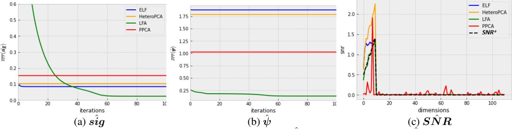
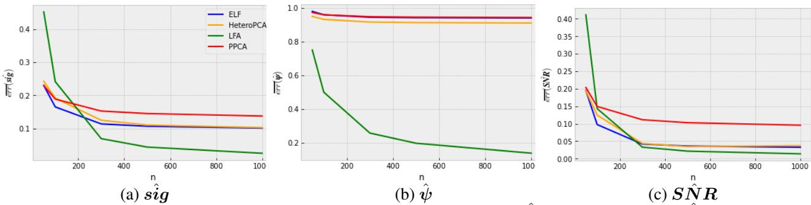
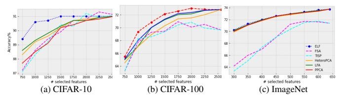

## Feature Selection for Latent Factor Models

Rittwika Kansabanik, Adrian Barbu Department of Statistics, Florida State University

## Abstract

*Feature selection is crucial for pinpointing relevant features in high-dimensional datasets, mitigating the 'curse of dimensionality,' and enhancing machine learning performance. Traditional feature selection methods for classification use data from all classes to select features for each class. This paper explores feature selection methods that select features for each class separately, using class models based on low-rank generative methods and introducing a signal-to-noise ratio (SNR) feature selection criterion. This novel approach has theoretical true feature recovery guarantees under certain assumptions and is shown to outperform some existing feature selection methods on standard classification datasets.*

## 1. Introduction

Features are individual measurable properties of what is being studied. The performance of a classifier depends on the interrelationship between the number of samples and features used. Although adding more features to the dataset can improve accuracy, this happens as long as the signal dominates noise. Beyond that point, the model accuracy reduces, and this phenomenon is known as peaking [\[13\]](#page-8-0). Also, dealing with high-dimensional data poses challenges such as increased training time, algorithmic complexity, storage space, and noise in datasets, collectively known as the 'curse of dimensionality.'

Feature selection is a type of dimensionality reduction that avoids irrelevant data collection, recovers genuine signals with high probability, and provides good prediction results. Feature selection algorithms face several key challenges, including minimizing accuracy loss when selecting a smaller feature set. Simplicity in algorithm design is preferred to reduce overfitting and avoid complex, ad-hoc implementations. Additionally, it is beneficial for algorithms to account for nonlinear feature patterns to capture more complex relationships beyond linear associations [\[6,](#page-8-1) [32\]](#page-8-2).

In a multi-class classification setup, one can perform feature selection through various approaches: filter methods operate independently of learning algorithms, wrapper methods depend on learning algorithms to iteratively improve the quality of selected features, and embedded methods integrate the feature selection phase into the supervised/unsupervised learning algorithms [\[11,](#page-8-3) [20\]](#page-8-4). Usually, these methods are performed by considering all data collectively, without distinguishing between different classes. Therefore, these approaches face scalability issues as the number of data points or classes increases, leading to computational inefficiencies and potential loss of accuracy.

The usual approach is to optimize a margin-maximizing loss function, which scales as O(C) with the number of classes C. Our work emphasizes individual class modeling, independently leveraging a generative model and feature selection for each class. This class-specific modeling sets our method apart from existing feature selection techniques for the following reasons:

- It captures the unique characteristics and distribution by tailoring the model to each class.
- The model for each class is wrapped tightly around the observations of that class, which allows the introduction of new classes without retraining the existing class models and scales as O(1).
- Additionally, preserving learned parameters for each class mitigates the risk of catastrophic forgetting when new data is introduced.

We propose using the signal-to-noise ratio (SNR) as a feature selection criterion, where the signal represents relevant information contributing to accurate predictions, and the noise refers to irrelevant data. SNR quantifies the strength of the signal relative to noise, with higher SNR features being more effective at distinguishing classes. Eliminating low SNR features enhances computational efficiency and model interpretability. In summary, this paper makes the following contributions:

- It introduces an SNR-based feature selection method for latent factor models such as Latent Factor Analysis and Probabilistic PCA.
- It provides theoretical true feature recovery guarantees for the proposed feature selection method under certain assumptions.
- It shows how to apply the proposed feature selection method for multi-class classification, obtaining a class-incremental feature selection method without catas-

trophic forgetting.

- It conducts comprehensive experiments on both simulated data and real-world datasets to validate the efficacy of the proposed method.
- It compares the proposed method with standard linear model-based feature selection methods and evaluates the accuracy loss caused by feature selection. Results show that the proposed method significantly outperforms the classic feature selection methods by a wide margin.

## 2. Related Work

The related work can be divided into three different areas, which will be discussed below.

Feature Selection Methods for PPCA & LFA. In previous studies, low-rank generative models, particularly Principal Component Analysis (PCA), have been extensively used for feature selection and multi-class classification.

The incorporation of feature weights in PCA has been explored in [\[24\]](#page-8-5) to emphasize specific facial regions for facial expression recognition. Our approach extends this idea by using the inverse of the noise covariance as a weight matrix to distinguish features with high unexplained variance from meaningful signals.

Latent factor models have gained significant attention in recent studies for feature selection. The nonparametric variant of the latent factor model introduced in this paper was initially inspired by the Sparse Estimation of Latent Factors (SELF) framework proposed in [\[3\]](#page-8-6). SELF utilizes a low-rank (r) latent factor matrix Γ and an orthogonal sparse transformation matrix W to achieve a sparse representation of the data, X, expressed as ΓWT . While the model does not impose specific assumptions on Γ, it requires that W be element-wise sparse, satisfying the condition ∥W∥0 ≤ q for some constant q. Additionally, it imposes the constraint WT Ψ−1W = Ir, where Ψ is a diagonal matrix containing the corresponding noise variances along its diagonal. In our work, we removed the constraints from W and assumed Γ to be semi-orthogonal,i.e., Γ TΓ = Ir.

Latent factors were also used in [\[1\]](#page-8-7) to extract influential low-dimensional features, such as blood vessel patterns, from retinal images. Mahalanobis distance was used to classify abnormalities in observations. However, given the computational expense of Mahalanobis distance, particularly with a moderate number of features, we propose an alternative based on [\[34\]](#page-8-8) to compute this distance efficiently. Feature Selection For Multi-class Classification. In highdimensional classification, feature selection is a vital preprocessing step to enhance class separation and reduce model complexity. Effective feature evaluation directly impacts classification accuracy by selecting the most discriminative features [\[28\]](#page-8-9). One of the popular feature selection techniques is Correlation Based Feature Subset Selection (CFSS). This method ranks feature subsets by maximizing relevance to the target class while minimizing redundancy among features [\[15\]](#page-8-10). However, it cannot assess individual feature relevance to specific classes.

Another feature selection technique for highdimensional datasets is network pruning. An efficient network pruning method was proposed using an l0 sparsity constraint in [\[10\]](#page-8-11). The imposed constraint allows direct specification of the desired sparsity level and gradually removes parameters or filter channels based on the Feature Selection Annealing(FSA) criteria[\[6\]](#page-8-1). Therefore, the network size reduces iteratively, making it applicable to untrained and pre-trained networks. Another efficient pruning technique is the Thresholding-based Iterative Selection Procedure (TISP)[\[30,](#page-8-12) [31\]](#page-8-13). This approach allows direct control over the sparsity of neural network parameters using a thresholding function denoted as θ. By carefully selecting θ, we can impose L0 or L1 sparsity or a combination of both. We compared the efficiency of feature selection using the FSA and TISP with our proposed approach based on low-rank generative methods. We recorded the classification accuracy at different levels of feature selection and presented the results in Section [5.](#page-5-0)

Supervised PCA, as introduced by [\[35\]](#page-9-0), incorporates class labels into the analysis to identify principal components that capture both high variance and strong class separation, thereby improving feature discrimination for classification. However, this method requires retraining the entire model when a new data class arrives, raising concerns about its efficiency and scalability. Instead, our approach models each class separately using probabilistic PCA (PPCA) or other generative models, allowing class-incremental training for new data without retraining the whole model. PPCA for multi-class classification was also used in [\[34\]](#page-8-8) but without feature selection. Moreover, [\[34\]](#page-8-8) only considered PPCA, while this paper also studies Latent Factor models, which were observed experimentally to obtain a much better accuracy on real datasets.

Previous works have also combined PCA with classification methods, such as the PCA-Logistic regression framework used by [\[37\]](#page-9-1) for facial recognition. However, the reliance on accessing all data for dimension reduction can be computationally costly. In contrast, our approach leverages generative models to compute the SNR and rank features. It reduces storage requirements and enhances interpretability. SNR for Feature Selection. SNR is an important measure that reflects the strength of the desired signal compared to the background noise. However, its application to feature selection has been quite limited.

SNR, in the form SNR = µ1−µ2 σ1+σ2 has been used as a feature screening criterion in [\[12\]](#page-8-14) to select features for binary classification with probabilistic neural networks. Here (µi , σi) is the class i mean and standard deviation of any of the features. The paper has no theoretical feature selection guarantees. The same criterion  $\frac{\mu_1 - \mu_2}{\sigma_1 + \sigma_2}$  has been also used in [22] for a more elaborate feature selection for microarray data that involved clustering genes (i.e. features) and selecting top SNR genes from each cluster. Again, the method has no theoretical feature recovery guarantees. In contrast to these works, our paper uses SNR as a criterion for an LFA model constructed for each class separately, and has true feature recovery guarantees.

SNR has been combined with clustering techniques [22], probabilistic neural networks [12] and used in some other MFMW (Multiple filters-multiple wrapper) approaches to select genes that have been confirmed to be biomarkers associated with various cancer classification problems in the past. In [21], SNR was used in the simulation study as a parameter to vary the level of difficulties for a given task.

# 3. Signal to Noise Ratio (SNR) for Feature Selection

This section introduces a feature selection technique that uses SNR as the feature selection criterion. This method can be used for various low-rank generative models such as Probabilistic PCA and Latent Factor Analysis. First, we describe these methods and their parameter estimation processes. We then use these estimates to calculate the SNRs.

#### 3.1. Notations

We denote matrices by uppercase bold letters such as  $\mathbf{M} \in \mathbb{R}^{p \times q}$ , vectors with lowercase bold letters such as  $\mathbf{v} \in \mathbb{R}^d$  and scalars by lowercase letters, e.g.  $x \in \mathbb{R}$ .  $\mathbf{M}_{ij}, \mathbf{M}_{\cdot j}$  and  $\mathbf{M}_i$ . represent the  $(i,j)^{th}$  element,  $j^{th}$  column and  $i^{th}$  row of  $\mathbf{M}$  respectively.  $\mathbf{v}_i$  and  $\mathbf{v}_{(i)}$  denote  $i^{th}$  element and the  $i^{th}$  largest value of vector  $\mathbf{v}$ . m is used to specify the number of selected features. d and n denote the number of available features and the number of observations, respectively, for a given class.  $\mathrm{diag}(a_1, a_2, \cdots, a_d)$  denotes a  $d \times d$  diagonal matrix with diagonal elements  $\{a_1, a_2, \cdots a_d\}$ .  $D(\mathbf{M})$  denotes a diagonal matrix with the same diagonal elements as  $\mathbf{M}$ . SNR denotes a vector containing the SNR values of all available features.

#### 3.2. Low-rank Generative Models

In this section, we are going to describe the four different methods based on low-rank generative models that are included in this study, namely Probabilistic PCA (PPCA) [33], Latent Factor Analysis (LFA)[7], Heteroskedastic PCA (HeteroPCA) [36] and Estimation of Latent Factors (ELF). We have introduced the last method in this paper, which is a nonparametric version of LFA.

PPCA, LFA, and our newly introduced method, ELF, share the same model structure but have different assumptions associated with their model parameters. The model aims to find a relationship between the observed  $\mathbf{x} \in \mathbb{R}^d$  and a hidden set of variables (latent variables)  $\gamma \in \mathbb{R}^r$  with r << d and assumes the latent factors and noise variables

are independent of each other. It is as follows:

$$\mathbf{x} = \boldsymbol{\mu} + \mathbf{W}\boldsymbol{\gamma} + \boldsymbol{\epsilon}$$
, with  $E(\boldsymbol{\epsilon}) = \mathbf{0}$  and  $var(\boldsymbol{\epsilon}) = \boldsymbol{\Psi}$ . (1)

PPCA and LFA methods assume that  $\gamma \overset{i.i.d}{\sim} \mathcal{N}(\mathbf{0}, \mathbf{I}_r)$  and that the noise variable  $\boldsymbol{\epsilon}^{i.i.d} \mathcal{N}(\mathbf{0}, \boldsymbol{\Psi})$ . It can be easily verified that for these two methods:

$$\mathbf{x}|\boldsymbol{\gamma} \sim \mathcal{N}(\mathbf{W}\boldsymbol{\gamma} + \boldsymbol{\mu}, \boldsymbol{\Psi}), \text{ and by integration,}$$
 (2)

$$\mathbf{x} \sim \mathcal{N}(\boldsymbol{\mu}, \boldsymbol{\Sigma}), \boldsymbol{\Sigma} = \mathbf{W}\mathbf{W}^T + \boldsymbol{\Psi}.$$
 (3)

Conversely, ELF does not make distributional assumptions about the parameters it estimates. ELF assumes  $\Gamma = (\gamma_1, \gamma_2, \cdots, \gamma_n)^T$  to be semi-orthogonal  $(\Gamma^T \Gamma = \mathbf{I}_r)$ . LFA and ELF, while sharing similar goals with PPCA, assume distinct noise variances across dimensions.

$$\Psi = \begin{cases} \sigma^2 \mathbf{I}_d & \text{for PPCA,} \\ \operatorname{diag}(\sigma_1^2, \sigma_2^2, \cdots, \sigma_d^2) & \text{otherwise.} \end{cases}$$

 $\mu$  has been treated as a constant vector in the model (1) and estimated as:  $\mu_{ML} = \frac{1}{n} \sum_{i=1}^{n} \mathbf{x}_{i}$ 

**Parameter estimation for PPCA.** A closed form of the Maximum Likelihood (ML) estimates of the PPCA model parameters  $(\mathbf{W}, \sigma^2)$  was given in [33], as follows:

$$\sigma_{ML}^2 = \frac{1}{d-r} \sum_{j=r+1}^d \lambda_j,\tag{4}$$

$$\mathbf{W}_{ML} = \mathbf{U}_r (\mathbf{S}_r - \sigma_{ML}^2 \mathbf{I}_r)^{0.5} \mathbf{R},\tag{5}$$

where  $\lambda_j$  is the  $j^{th}$  largest eigenvalue and  $\mathbf{U}_r$  consists of the r principal eigenvectors of the sample covariance matrix,  $\hat{\Sigma}$ . The matrix  $\mathbf{S}_r = \mathrm{diag}(\lambda_1, \lambda_2, \cdots, \lambda_r)$ , while  $\mathbf{R}$  is an arbitrary  $r \times r$  orthogonal rotation matrix.

**Parameter estimation for LFA.** LFA parameters  $(\mathbf{W}, \boldsymbol{\Psi})$  can be estimated using an EM algorithm due to [7].

**Theorem 1 (due to [7])** Assume that the data has been properly centralized and let  $\beta = \mathbf{W}^T (\mathbf{\Psi} + \mathbf{W}\mathbf{W}^T)^{-1}$ . The EM updates of  $(\hat{\mathbf{W}}, \hat{\mathbf{\Psi}})$  for LFA are:

• *E-step*: Compute  $E(\gamma|\mathbf{x}_i)$  and  $E(\gamma\gamma^T|\mathbf{x}_i)$  for each data point  $\mathbf{x}_i$  as follows:

$$E(\gamma|\mathbf{x}_i) = \beta \mathbf{x}_i, \ E(\gamma \gamma^T|\mathbf{x}_i) = \mathbf{I}_r - \beta \mathbf{W} + \beta \mathbf{x}_i \mathbf{x}_i^T \beta^T.$$

• M-step Update the LFA parameters as:

$$\mathbf{W}_{new} = \sum_{i=1}^{n} \mathbf{x}_{i} E(\boldsymbol{\gamma} | \mathbf{x}_{i})^{T} (\sum_{i=1}^{n} E(\boldsymbol{\gamma} \boldsymbol{\gamma}^{T} | \mathbf{x}_{i}))^{-1}, \quad (6)$$

$$\mathbf{\Psi}_{new} = \frac{1}{n} D(\sum_{i=1}^{n} \mathbf{x}_{i} \mathbf{x}_{i}^{T} - \mathbf{W}_{new} E(\boldsymbol{\gamma} | \mathbf{x}_{i}) \mathbf{x}_{i}^{T}).$$
 (7)

**Parameter estimation for ELF.** ELF estimates the model parameters( $\Gamma$ , W) by optimizing the following:

$$(\hat{\mathbf{W}}_{ELF}, \hat{\mathbf{\Gamma}}_{ELF}) = \underset{(\mathbf{\Gamma}, \mathbf{W}), \mathbf{\Gamma}^T \mathbf{\Gamma} = \mathbf{I}_r}{\operatorname{argmin}} \| (\mathbf{X} - \mathbf{\Gamma} \mathbf{W}^T) \mathbf{\Psi}^{-\frac{1}{2}} \|_F^2, (8)$$

where  $\mathbf{X} = (\mathbf{x}_1 - \boldsymbol{\mu}_{ML}, \mathbf{x}_2 - \boldsymbol{\mu}_{ML}, \cdots, \mathbf{x}_n - \boldsymbol{\mu}_{ML})^T$ , i.e. properly centralized. We use  $\Psi^{-\frac{1}{2}}$  as feature weights in (8) to reduce the impact of features with significant unexplained noise variance, thereby significantly improving model accuracy. During model training, we estimate:

 $\hat{\sigma}_{j}^{2} = \|\hat{\mathbf{X}}_{.j} - \mathbf{X}_{.j}\|_{2}^{2}/(n-1)$  and employ  $(\hat{\sigma}_{j}^{2})^{-\frac{1}{2}}$  as  $j^{th}$  feature weight for the estimation process. To perform the minimization in (8), in every iteration, we first estimate  $(\hat{\mathbf{W}}, \hat{\mathbf{\Gamma}})$  without the constraint on  $\Gamma$  using Theorem 2 and then adjust the estimated parameters to satisfy the constraint using the Proposition 1 below. The proofs are included in the Supplementary Material.

**Theorem 2** The ELF objective (8) without the constraint  $\Gamma^T \Gamma = \mathbf{I}_r$  is minimized w.r.t  $\Gamma$  and  $\mathbf{W}$  by

 $\hat{\Gamma} = \mathbf{X} \mathbf{\Psi}^{-1} \mathbf{W} (\mathbf{W}^T \mathbf{\Psi}^{-1} \mathbf{W})^{-1}$  and  $\hat{\mathbf{W}} = \mathbf{X}^T \mathbf{\Gamma} (\mathbf{\Gamma}^T \mathbf{\Gamma})^{-1}$  (9) **Proposition 1** If  $\mathbf{U} \mathbf{D} \mathbf{V}^T = \mathbf{\Gamma}$  is the SVD of  $\mathbf{\Gamma}$ , then  $\mathbf{\Gamma}_1 = \mathbf{U}$ , and  $\mathbf{W}_1 = \mathbf{W} \mathbf{V} \mathbf{D}$  satisfy  $\mathbf{\Gamma}_1 \mathbf{W}_1^T = \mathbf{\Gamma} \mathbf{W}^T$  along with  $\mathbf{\Gamma}_1^T \mathbf{\Gamma}_1 = \mathbf{I}_r$ .

The  $\hat{\mathbf{W}}$  produced in (9) does not depend on the feature weights  $\Psi$ . Algorithm 1 summarizes the iterative estimation procedure.

**Algorithm 1:** Parameter Estimation for ELF

**Input:**  $\mathbf{X}_{n \times d}$ , T (number of iterations) and m **Output:**  $\hat{\mathbf{W}}$  and  $\hat{\mathbf{\Psi}}$  **Initialize** 

- feature weight matrix  $\Psi = I_d$
- $\Gamma$  as the first r principal components of X
- ${\bf W}$  as the first r loading vectors from PCA of  ${\bf X}$  for t=1 to T do

Update  $\mathbf{W}$  as  $\mathbf{W} = \mathbf{X}^T \mathbf{\Gamma} (\mathbf{\Gamma}^T \mathbf{\Gamma})^{-1}$ Update  $\mathbf{\Gamma}$  as  $\mathbf{\Gamma} = \mathbf{X} \mathbf{\Psi}^{-1} \mathbf{W} (\mathbf{W}^T \mathbf{\Psi}^{-1} \mathbf{W})^{-1}$ Perform SVD on  $\mathbf{\Gamma}$ ,  $\mathbf{U}_{\mathbf{\Gamma}} \mathbf{D}_{\mathbf{\Gamma}} \mathbf{V}_{\mathbf{\Gamma}}^T = \mathbf{\Gamma}$ Update  $\mathbf{\Gamma} = \mathbf{U}_{\mathbf{\Gamma}}$  and  $\mathbf{W} = \mathbf{W} \mathbf{V}_{\mathbf{\Gamma}} \mathbf{D}_{\mathbf{\Gamma}}$ Update  $\mathbf{\Psi} = \mathrm{diag}(\sigma_1^2, \sigma_2^2, \cdots \sigma_d^2)$  with  $\sigma_i^2 = \mathrm{var}(\mathbf{X}_{\cdot i} - \mathbf{\Gamma} \mathbf{W}_{i \cdot}^T)$ Check for convergence:  $\|\mathbf{X} - \mathbf{\Gamma} \mathbf{W}^T\|_F$  is sufficiently small.

**HeteroPCA.** HeteroPCA [36] addresses the issue of performing PCA when the data  $X_{n\times d}$  has heteroskedastic noise in a spiked covariance model setup. It assumes the following setup:

$$\mathbf{X}_{n \times d} = \mathbf{X}_0 + \boldsymbol{\epsilon}, E(\mathbf{X}_0) = \boldsymbol{\mu}, Cov(\mathbf{X}_0) = \boldsymbol{\Sigma}_0, \quad (10)$$

$$E(\epsilon) = 0, Cov(\epsilon) = \Psi = \operatorname{diag}(\sigma_1^2, \sigma_2^2, \cdots, \sigma_d^2).$$
 (11)

Here,  $\mathbf{X}_0$  is the noise-free version (signal) of the given data matrix  $\mathbf{X}$ , and  $\boldsymbol{\epsilon}$  and  $\mathbf{X}_0$  are independent.  $\boldsymbol{\Sigma}_0$  admits a rank-r (<< d) eigen-decomposition, i.e.  $\boldsymbol{\Sigma}_0 = \mathbf{U}\mathbf{D}\mathbf{U}^T$  with  $\mathbf{U} \in \mathbb{R}^{d \times r}$  and  $\mathbf{D} \in \mathbb{R}^{r \times r}$ . The goal is to estimate  $\mathbf{U}$ .

Though the model is similar to LFA, the objective of Hetero PCA aims to capture the principal components (PCs) (known as  $\hat{\mathbf{U}}$ ) of the signal, accounting for heteroskedasticity. Since  $E(\hat{\mathbf{\Sigma}}) = \mathbf{\Sigma}_0 + \mathbf{\Psi}$ , there will be a significant difference between the principal components of  $E(\hat{\mathbf{\Sigma}})$  and those of  $\mathbf{\Sigma}_0$ . To cope with the bias on the diagonal of  $E(\hat{\mathbf{\Sigma}})$ , HeteroPCA iteratively updates the diagonal entries based on the off-diagonals so that the bias is significantly reduced and a more accurate estimation is achieved.

#### 3.3. Estimation of SNR

The estimated signal-to-noise ratio (SNR) for the available features is computed based on the estimated  $(\hat{\mathbf{W}}, \hat{\mathbf{\Psi}})$  obtained by the different methods. The SNR for the *i*-th feature is defined as:

$$SNR_i = \frac{\sum_{j=1}^{r} \mathbf{W}_{ij}^2}{\sigma_i^2}, i \in \{1, 2, \cdots, d\}.$$
 (12)

Though the SNR can be directly calculated using Eq. (12) for PPCA, LFA, and ELF methods, the same is not valid for HeteroPCA. For HeteroPCA, we obtain the r principal loading vectors  $\hat{\mathbf{U}}$ , corresponding to  $\mathbf{X}_0$ . To evaluate (12) for HeteroPCA, we execute the following steps to obtain  $(\hat{\mathbf{W}}, \hat{\sigma}_1^2, \dots, \hat{\sigma}_d^2)$ :

- Estimation of signal strength: Our initial estimates are:  $\tilde{\Gamma} = \mathbf{X}\hat{\mathbf{U}}$  and  $\tilde{\mathbf{W}} = \hat{\mathbf{U}}$ . Next, we employ Proposition 1 to obtain semi-orthogonal  $\hat{\Gamma}$  and the corresponding  $\hat{\mathbf{W}}$ . Therefore,  $\hat{\mathbf{X}}_0 = \hat{\Gamma}\hat{\mathbf{W}}^T$ .
- Estimation of noise variance: Next, the estimation process of  $(\sigma_i^2, i = 1, 2, \dots, d)$  is as follows:

$$\hat{\sigma_i^2} = \|(\hat{\mathbf{X}}_0)_{i\cdot} - \mathbf{X}_{i\cdot}\|_2^2 / (n-1). \tag{13}$$

The intuition for employing SNRs to identify key features in the latent factor model is based on the assumption that the data originates from a lower-dimensional latent space. The signal is represented as  $\mathbf{W}\gamma$  with the assumption  $\mathbf{\Gamma}^T\mathbf{\Gamma}=\mathbf{I}_r$ . The variance of the corresponding signals is captured by the diagonal elements of  $\mathbf{W}\mathbf{W}^T$  or the row sum of squares of  $\mathbf{W}$ . At the same time, the unexplained noise variance is reflected in the diagonal elements of  $\mathbf{\Psi}$ . Therefore, features with relatively high SNR values are identified as strongly associated with the latent variables, making them prime candidates for representing objects within specific categories. Once we estimate the SNRs, we perform feature selection by employing a simple thresholding technique, as described in Algorithm 2.

#### Algorithm 2: SNR based Feature Selection

Input:  $(\hat{\mathbf{W}}, \hat{\sigma}_1^2, \cdots, \hat{\sigma}_d^2)$ , m Output:  $\mathbb{J}_m$ , the indices of m selected features. Calculate  $SNR_i = \frac{\sum_{j=1}^r \hat{W}_{ij}^2}{\hat{\sigma}_i^2}, i \in \{1, 2, \cdots, d\}$  Sort the SNR values:  $SNR_{(1)} \leq SNR_{(2)} \leq \cdots \leq SNR_{(d)}$  Selected feature indices are:  $\mathbb{J}_m = \{i : SNR_i \geq SNR_{(d-m+1)}\}$ 

#### 3.4. True Feature Recovery Guarantees

Ensuring feature recovery for the proposed SNR-based feature selection criteria is essential. In this section, we prove the convergence of PPCA and LFA model parameters as  $(n,d) \to \infty$ . Specifically, we prove the estimated SNRs  $(S\hat{N}R)$  converge in probability to the true SNRs  $(SNR^*)$  as  $n \to \infty$  with fixed d for both PPCA and LFA. We have considered the following assumptions:

- (A1) The observations,  $(\mathbf{x}_i, i = 1, 2, \dots, n)$  are independently generated from the LFA model (1) with  $\mu = 0$  and  $\epsilon \stackrel{i.i.d}{\sim}$
- (A2) Denote  $\Gamma = (\gamma_1, \gamma_2, \cdots, \gamma_n)^T$ .  $\Gamma_{ij}$  are i.i.d random variables with  $E(\Gamma_{ij}) = 0, Var(\Gamma_{ij}) = 1, E(\Gamma_{ij}^4) < \infty$ , for all  $(i, j) \in \{1, 2, \dots, n\} \times \{1, 2, \dots, r\}$ .
- (A3) There are m true features with indices S $\{s_1, s_2, \cdots, s_m\}$  and (d-m) noisy features in our data. For a positive constant,  $\gamma > 0$ , we have,

 $\min\{SNR_i^*, i \in S\} \ge \max\{SNR_i^*, i \notin S\} + \gamma.$ 

When d is kept fixed, the fact that the eigenvectors of the sample covariance matrix are maximum likelihood estimators of the population eigenvectors has been proved in [8], and their asymptotic distributions have been derived for a multivariate Gaussian data in [2, 9]. For large d, large n $(\frac{d}{n}(=\delta>0))$  as  $n\to\infty$ ), the primary challenge is that the sample covariance matrix becomes a poor estimate. Recent years have seen the establishment of convergence results for sample eigenvalues and eigenvectors [5, 19, 23, 25] within the spiked covariance model, defined in [14].

We now provide the convergence results for the PPCA parameters  $\sigma_{ML}^2$  obtained from Eq. (4). The result is proved in the Supplementary Material.

**Proposition 2** Under the assumptions (A1, A2), if  $\frac{d}{n} \to \delta \in (0,1)$  as  $n \to \infty$ , and  $\Psi = \sigma^{*2}\mathbf{I}_d$  then  $\sigma_{ML}^2 \stackrel{a.s.}{\to} \sigma^{*2}(1+\sqrt{\delta})^2$ . If  $\delta = 0$  then  $\sigma_{ML}^2 \stackrel{a.s.}{\to} \sigma^{*2}$ .

Bai et al. [4] have proved the convergence results for  $(\mathbf{W}, \boldsymbol{\Psi})$  obtained from (6) using the LFA method. Classical inferential theory suggests that when d is fixed and  $n \to \infty$ , the ML estimates of the model parameters are consistent and efficient. They have introduced a set of assumptions on the true parameters to prove the convergence results when  $(n,d) \to \infty$ . Latent factor models are generally non-identifiable without additional constraints. Therefore, additional constraints were introduced in the past literature to ensure full identifiability of the model parameters. However, we only need to focus on the diagonal elements of  $\hat{\mathbf{W}}\hat{\mathbf{W}}^T$  to prove the SNR convergence. Therefore, we have not considered any additional constraints here.

Our main SNR convergence and true feature recovery guarantees are presented in the following theorem, which is proved in the Supplementary Material.

**Theorem 3** *Let* d *be fixed, and let*  $n \to \infty$ *:* 

(C1) Under assumptions (A1,A2), if  $\Psi^* = \sigma^{*2}\mathbf{I}_d$ , then  $\hat{SNR}_i^{PPCA} \stackrel{p}{\to} \hat{SNR}_i^*$ ,

for all  $i \in \{1, 2, ..., d\}$ .

(C2) Under the assumption (A1), if  $\Psi^* = \operatorname{diag}(\sigma_1^{*2}, \sigma_2^{*2}, \dots, \sigma_d^{*2})$  and  $\gamma_i \stackrel{i.i.d}{\sim} \mathcal{N}(\mathbf{0}, \mathbf{I}_r)$  then  $\hat{SNR}_i^{LFA} \stackrel{p}{\rightarrow} SNR_i^*$ , for all  $i \in \{1, 2, \dots, d\}$ .

Furthermore, under the assumption (A3), the probability that the m features with the highest SNRs are the true features converges to 1 as  $n \to \infty$  for both (C1) and (C2).

Here,  $\hat{SNR}^{PPCA}$  and  $\hat{SNR}^{LFA}$  denote the estimated SNRs from PPCA and LFA, respectively.

### 4. Multi-class Classification

We apply the proposed feature selection method for multiclass classification. For that, each class is represented as a PPCA or LFA model, and the parameters are estimated using one of the four methods described in Section 3.2 based solely on the data from that class. Then, feature selection is performed separately for each class using SNR, as described in Algorithm 2.

After selecting the relevant features, the next step involves using these models for multi-class classification.

Assuming that observations belong to C different classes, we will use the Mahalanobis distance:

 $MD(\mathbf{x}, \boldsymbol{\mu}, \boldsymbol{\Sigma}) = (\mathbf{x} - \boldsymbol{\mu})^T \boldsymbol{\Sigma}^{-1} (\mathbf{x} - \boldsymbol{\mu}),$ to compute the distance of an observation to each class and find the nearest class. In high-dimensional scenarios, the Mahalanobis distance is preferred over the Euclidean distance because it considers the covariance structure of the data, enhancing the classification accuracy.

More exactly, to classify an observation x, we perform two steps:

- 1. Calculate the Mahalanobis distance for every class  $j \in$  $\{1,2,\cdots,C\}: MD_j = MD(\mathbf{x}^{(j)},\hat{\boldsymbol{\mu}}_j,\hat{\boldsymbol{\Sigma}}_j), \text{ where the }$ vector  $\mathbf{x}^{(j)}$  contains the values of the selected features for class j, and  $\hat{\boldsymbol{\mu}}_i$  and  $\hat{\boldsymbol{\Sigma}}_j$  are the estimated mean and covariance matrix on the selected features from class j.
- 2. Obtain the predicted class k as the one that has a minimum score,

$$k = \underset{j \in \{1, 2, \cdots, C\}}{\operatorname{argmin}} MD_j. \tag{15}$$

When m is large, computing  $MD_j$  becomes computationally expensive due to the multiplication with a size  $m \times m$ matrix. In such cases, we employ an alternative r-score, first introduced by [34] for PPCA, as described in Proposition 3, and generalized for LFA in Theorem 4 below.

**Proposition 3 (due to [34])** If  $\Sigma$  admits a rank-r eigende-

$$\Sigma = \mathbf{L}\mathbf{D}\mathbf{L}^T + \lambda \mathbf{I}_m. \tag{16}$$

composition of the form:  $\mathbf{\Sigma} = \mathbf{L}\mathbf{D}\mathbf{L}^{T} + \lambda \mathbf{I}_{m}, \qquad (16)$ with  $\mathbf{L} \in \mathbb{R}^{m \times r}$ , diagonal  $\mathbf{D} = \operatorname{diag}(\mathbf{d}) \in \mathbb{R}^{r \times r}$  with positive entries, and  $\lambda > 0$ , the Mahalanobis distance can be computed as:

$$MD(\mathbf{x}, \boldsymbol{\mu}, \boldsymbol{\Sigma}) = r(\mathbf{x}; \boldsymbol{\mu}, \mathbf{L}, \mathbf{D}, \lambda),$$
 (17)

where

where 
$$r(\mathbf{x}; \boldsymbol{\mu}, \mathbf{L}, \mathbf{D}, \lambda) = \|\mathbf{x} - \boldsymbol{\mu}\|_2^2 / \lambda - \|\mathbf{u}(\mathbf{x})\|_2^2 / \lambda$$
, (18) with  $\mathbf{u}(\mathbf{x}) = \operatorname{diag}(\frac{\sqrt{\mathbf{d}}}{\sqrt{\mathbf{d} + \lambda \mathbf{1}_r}}) \mathbf{L}^T (\mathbf{x} - \boldsymbol{\mu})$ , and  $\mathbf{1}_r = (1, 1, \dots, 1)^T$ . The operation  $\frac{\sqrt{\mathbf{d}}}{\sqrt{\mathbf{d} + \lambda \mathbf{1}_r}}$  is performed element-wise.

In this paper, we generalize Proposition 3 to the LFA model, as outlined in Theorem 4, also proved in the Supplementary Material. Here,  $\Psi$  is a diagonal matrix containing the estimated noise variances on its diagonal, corresponding to the selected features.

Figure 1. Estimation error vs. several iterations for (a) the signal variance  $\hat{sig}$ , and (b) the noise variance,  $\hat{\psi}$ , when n=1000 and d=110. (c) The true SNR ( $SNR^*$ ) and the estimated SNRs obtained by the four methods.

Theorem 4 If  $\Sigma = \mathbf{L}\mathbf{D}\mathbf{L}^T + \mathbf{\Psi}.$ with  $\mathbf{L} \in \mathbb{R}^{m \times r}$ , the diagonal matrices  $\mathbf{D} \in \mathbb{R}^{r \times r}$  and  $\mathbf{\Psi} \in$  $\mathbb{R}^{m \times m}$  with positive entries, the Mahalanobis distance can be computed as:

 $MD(\mathbf{x}, \boldsymbol{\mu}, \boldsymbol{\Sigma}) = r(\boldsymbol{\Psi}^{-\frac{1}{2}}\mathbf{x}; \boldsymbol{\Psi}^{-\frac{1}{2}}\boldsymbol{\mu}, \mathbf{L}', \mathbf{D}', 1)$ where  $r(\mathbf{x}; \boldsymbol{\mu}, \mathbf{L}, \mathbf{D}, \lambda)$  is defined in Eq. (18), and  $\mathbf{L}'$  and **D'** are obtained by SVD on  $\Sigma' = \Psi^{-\frac{1}{2}} \Sigma \Psi^{-\frac{1}{2}}$ .

#### 5. Experiments

Experiments include one-class simulations that test the parameter estimation and feature selection capabilities of the different methods discussed in Section 3.2, feature selection evaluation on real multi-class datasets, and comparisons with some existing feature selection methods.

#### 5.1. Simulations

The simulated data,  $\mathbf{X}_{n \times d}$ , is a concatenation of 10 relevant features, and  $d_{noise} = d - 10$  irrelevant (noisy) features.

In our simulation, the true SNR vector is: 
$$\boldsymbol{SNR}_i^* = \begin{cases} \frac{1}{2} + \frac{i-1}{10} & i \in \{1,...,10\} \\ 0 & i > 10 \end{cases}$$
 We generate  $\mathbf{X} = (\mathbf{x}_1, \mathbf{x}_2, \cdots, \mathbf{x}_n)^T, \mathbf{x}_i \in \mathbb{R}^d$  using the

model (1):

el (1):  

$$\mathbf{x}_{i} = \mathbf{W} \boldsymbol{\gamma}_{i} + \boldsymbol{\epsilon}_{i} = \begin{bmatrix} \mathbf{W}_{10 \times r}^{(1)} \\ \mathbf{0}_{dnoise} \times r \end{bmatrix} \boldsymbol{\gamma}_{i} + \boldsymbol{\epsilon}_{i}. \tag{21}$$

$$\mathbf{W}_{i}^{(1) \text{ i.i.d.}} \boldsymbol{\Lambda}(0, 1) \text{ and all the elements except in the selection of the selection of the selection of the selection of the selection of the selection of the selection of the selection of the selection of the selection of the selection of the selection of the selection of the selection of the selection of the selection of the selection of the selection of the selection of the selection of the selection of the selection of the selection of the selection of the selection of the selection of the selection of the selection of the selection of the selection of the selection of the selection of the selection of the selection of the selection of the selection of the selection of the selection of the selection of the selection of the selection of the selection of the selection of the selection of the selection of the selection of the selection of the selection of the selection of the selection of the selection of the selection of the selection of the selection of the selection of the selection of the selection of the selection of the selection of the selection of the selection of the selection of the selection of the selection of the selection of the selection of the selection of the selection of the selection of the selection of the selection of the selection of the selection of the selection of the selection of the selection of the selection of the selection of the selection of the selection of the selection of the selection of the selection of the selection of the selection of the selection of the selection of the selection of the selection of the selection of the selection of the selection of the selection of the selection of the selection of the selection of the selection of the selection of the selection of the selection of the selection of the selection of the selection of the selection of the selection of the selection of the selection of the selection of the selection of$$

Here,  $\mathbf{W}_{ij}^{(1)} \stackrel{\text{i.i.d}}{\sim} \mathcal{N}(0,1)$ , and all the elements except in the first 10 rows are 0. The latent vector,  $\boldsymbol{\gamma}_i \overset{\text{i.i.d}}{\sim} \mathcal{N}(\mathbf{0}, \mathbf{I}_r)$  with r=3. The noise variable,  $\epsilon_i \stackrel{\text{i.i.d}}{\sim} \mathcal{N}(\mathbf{0}, \mathbf{\Psi}^*)$  with  $\mathbf{\Psi}^*=$ 

$$\tau = 3. \text{ The hoise variable, } \boldsymbol{\epsilon}_i \sim \mathcal{N}(\mathbf{0}, \boldsymbol{\Psi}) \text{ with } \boldsymbol{\Psi} = 0$$

$$\operatorname{diag}(\sigma_1^{*2}, \sigma_2^{*2}, \cdots, \sigma_d^{*2}) \text{ and}$$

$$\sigma_i^{*2} = \begin{cases} \frac{\sum_{j=1}^r \mathbf{W}_{ij}^2}{SNR_i^*} & i \in \{1, ..., 10\}, \\ \underset{\sim}{\text{i.i.d}} & Uniform(r/1.4, r/0.5) & i > 10. \end{cases}$$

Smaller SNRs usually correspond to larger error variances. The true SNRs range from 0.5 (small) to 1.4 (large) to make true feature recovery more challenging. The noise variable variances for the irrelevant dimensions are made comparable to those of the signal dimensions using the uniform distribution, as specified above.

Parameter Estimation Evaluation. We evaluate the estimation process for the signal:  $sig_i = \sum_{j=1}^r \mathbf{W}_{ij}^2, i \in$ 

 $\{1, \cdots d\}$ , noise variance:  $\psi = (\sigma_1^2, \cdots, \sigma_d^2)$ , and the SNR within simulated data and using multiple datasets by comparing the estimation error associated with  $(\hat{sig}, \hat{\psi}, \hat{SNR})$  for the employed low-rank generative methods. The corresponding true values of the parameters are  $(sig^*, \psi^*, SNR^*)$ .

An example of the estimation errors vs. the number of iterations for one dataset is shown in Figure 1(a) and (b), and the obtained SNRs, along with the true SNRs, are shown in Figure 1 (c). The estimation errors of the LFA method are the best, given that there are sufficiently many iterations. The performance of ELF and HeteroPCA methods are similar. ELF exhibits slightly superior performance over HeteroPCA in estimating the signal (sig), while HeteroPCA outperforms ELF in estimating  $\psi$ . The PPCA method has the largest estimation error for sig, and the error for  $\psi$  is smaller than the ELF and HeteroPCA methods.

Figure 1(c) displays the estimated SNRs,  $\hat{SNR}$ , alongside the true SNRs,  $SNR^*$ . All methods, except PPCA, estimate close to 0 values for the noisy features (11-110). PPCA often overestimates SNRs for noise, with some signals having near-zero SNRs. LFA provides the most accurate estimates. ELF's  $\hat{SNR}$  values are close to the  $SNR^*$  but marginally less aligned than LFA's. However, HeteroPCA overestimates positive  $SNR^*$  values the most but perfectly captures the pattern.

For a more thorough evaluation, we compute the average of mean absolute deviation (MAD) over R=50 independent runs, defined as

$$\overline{err}(\hat{\boldsymbol{\theta}}) = \frac{1}{R} \sum_{r=1}^{R} \left( \frac{1}{d} \sum_{j=1}^{d} |\boldsymbol{\theta}_{j}^{*r} - \hat{\boldsymbol{\theta}}_{j}^{r}| \right), \tag{22}$$

where  $\hat{\boldsymbol{\theta}}_{i}^{r}$  is the estimate of the true parameter  $\boldsymbol{\theta}_{i}^{*r}$ , where  $\hat{\boldsymbol{\theta}}$ could be one of  $(siq, \psi, SNR)$ .

The average MAD values for data with d = 110 and different sample sizes are shown in Figure 2. From Figure 2, it is clear that the LFA method obtains the smallest estimation errors across all parameters for large n. ELF and HeteroPCA show similar performance, with ELF slightly better for signal estimation and HeteroPCA better for noise. LFA, HeteroPCA, and ELF show comparable performance for SNR estimation. The performance of PPCA lags behind

Figure 2. Estimation error vs. number of observations (n) for (a) the signal variance,  $\hat{sig}$ , (b) the noise variance,  $\hat{\psi}$ , and (c) the SNRs,  $\hat{SNR}$ , when d=110.

Table 1. Feature selection accuracy (%) for simulated data.

| Method    | Noise n | 50   | 100  | 300  | 1000 |
|-----------|---------|------|------|------|------|
| PPCA      | 10      | 71.2 | 82.4 | 88   | 95.6 |
|           | 50      | 55.4 | 72.6 | 79.8 | 91.4 |
|           | 100     | 49   | 62.8 | 82   | 90   |
| LFA       | 10      | 90.6 | 97   | 100  | 100  |
|           | 50      | 70.4 | 91.8 | 100  | 100  |
|           | 100     | 57.4 | 87.4 | 99.4 | 100  |
| ELF       | 10      | 87.6 | 94   | 98   | 100  |
|           | 50      | 73.4 | 92.8 | 98.6 | 99.8 |
|           | 100     | 58   | 87.2 | 99.4 | 99.6 |
| HeteroPCA | 10      | 84.4 | 93   | 98.8 | 99.5 |
|           | 50      | 65.6 | 87   | 94.4 | 99.2 |
|           | 100     | 55.8 | 75.6 | 96.4 | 99   |

in the estimation process as it assumes homoscedastic noise. **Feature Recovery Evaluation.** In this experiment, we consider feature selection accuracy a pivotal aspect of method assessment. To measure how accurate the feature selection process is, we compare the set of indices of the features that are truly relevant(signals), denoted as  $\mathfrak{I}_{true}$  with the ones each method has predicted as relevant, denoted as  $\mathfrak{I}_{pred}$ . The feature selection accuracy is defined as the average percentage of features that are correctly recovered:

$$Acc = E(|\mathfrak{I}_{true} \cap \mathfrak{I}_{pred}|)/|\mathfrak{I}_{true}|, \tag{23}$$

where the expected value is computed over 50 independent runs. We conducted 50 simulations for each n and  $d_{noise}$  combination and recorded the Acc values in Table 1. As  $d_{noise}$  increases, identifying relevant features becomes more challenging across all methods. Adequate data, indicated by a larger n, becomes necessary in such scenarios. LFA consistently identifies the true features, especially for moderate n values like n=300, with ELF performing comparably. Both methods surpass the performance of HeteroPCA and PPCA.

#### 5.2. Real Data Experiments

We evaluate the proposed feature selection for multi-class classification methods on three widely utilized popular image classification datasets: CIFAR-10 [17], CIFAR-100 [18] and ImageNet-1k [29]. CIFAR-10 and CIFAR-100 contain 60,000 color images of size  $32 \times 32$  distributed

across ten categories, whereas ImageNet-1k contains approximately 1.2 million labeled images spread across 1,000 categories.

We employed CLIP (Contrastive Language-Image Pre-Training) [27] as the feature extractor from the image datasets. It is a Convolutional Neural Network (CNN) trained on 400 million image-text pairs sourced from the web through 500,000 text queries. The image CNN component of CLIP incorporates an attention mechanism as its final layer before the classification layer. For our purposes, we used the pre-trained modified ResNet-50 classifier known as RN50x4 from the CLIP GitHub package [26]. The CLIP feature extractor is trained with medium resolution 288 × 288 images. Therefore, input images were resized to 288 × 288 for ImageNet-1k before processing. Images in the others have been resized to  $144 \times 144$ , as they are very small and will be blurry when resized to  $288 \times 288$ , and [34] showed that the  $144 \times 144$  input is the best setting for the CLIP feature extractor for CIFAR-100.

Features of dimension d=640 were extracted after the classifier's attention pooling layer for Imagenet-1k. For CIFAR, average pooling was used since images were resized to  $144\times144$ , obtaining a feature vector with d=2560.

We compare the feature selection efficiency of the proposed methods against two popular methods, Feature Selection with Annealing (FSA) [6] and TISP [31] with soft thresholding (L1 penalty), applied on the same data (features) as the other methods. FSA and TISP were implemented as a fully connected one-layer neural network with cross-entropy loss. The models were trained for 30 epochs using the Adam optimizer[16] (learning rate: 0.001).

Table 2 presents the classification accuracies in percentages achieved by various methods on these datasets, for different feature selection levels. Each column represents the accuracy values for different methods, with the corresponding number of selected features indicated at the top.

On the CIFAR-10 dataset, classification accuracy improves as more features are included, peaking before stabilizing at 91% for the low-rank generative methods. Notably, the ELF method reaches its maximum accuracy of 91% us-

Table 2. Classification accuracy (%) for different methods on real datasets

| Method                                                   | # Selected Features                                                          |      |                       |                                                 |      |      |                        |             |  |
|----------------------------------------------------------|------------------------------------------------------------------------------|------|-----------------------|-------------------------------------------------|------|------|------------------------|-------------|--|
| CIFAR-10, n = 60, 000, d = 2560                          |                                                                              |      |                       |                                                 |      |      |                        |             |  |
|                                                          |                                                                              |      |                       | 2560 2250 2000 1750 1500 1250 1000              |      |      |                        | 750         |  |
| FSA                                                      | 91.1                                                                         | 91.3 | 90.8                  | 90.7                                            | 89.9 | 89.4 | 88.6                   | 87.2        |  |
| TISP                                                     | 91.1                                                                         | 90.9 | 91.2                  | 90.3                                            |      |      | 90.4 89.19 88.28 87.11 |             |  |
| ELF                                                      | 91                                                                           |      |                       | 90.95 90.98 90.97                               | 91   |      | 90.74 90.61 89.41      |             |  |
| HeteroPCA                                                | 91                                                                           |      |                       | 90.89 90.76 90.66 90.21 89.61 89.2 88.33        |      |      |                        |             |  |
| LFA                                                      | 91                                                                           |      |                       | 90.9 90.69 90.68 90.28 89.77 89.34 88.56        |      |      |                        |             |  |
| PPCA                                                     | 91                                                                           |      |                       |                                                 |      |      |                        |             |  |
|                                                          | 90.83 90.68 90.39 90.24 89.1 88.54 87.69 CIFAR-100, n = 60, 000, d = 2560 |      |                       |                                                 |      |      |                        |             |  |
|                                                          |                                                                              |      |                       | 2560 2250 2000 1750 1500 1250 1000              |      |      |                        | 750         |  |
| FSA                                                      |                                                                              |      |                       | 69.63 70.5 70.09 70.92 69.43 69.28 67.72 63.24  |      |      |                        |             |  |
| TISP                                                     |                                                                              |      |                       | 69.63 69.94 70.82 70.42 69.36 68.58 68.29 63.25 |      |      |                        |             |  |
| ELF                                                      |                                                                              |      |                       | 72.81 72.7 72.35 72.18 71.31 70.02 68.01 65.11  |      |      |                        |             |  |
| HeteroPCA 72.81 72.01 71.51 71.36 70.28 68.9 67.06 64.51 |                                                                              |      |                       |                                                 |      |      |                        |             |  |
| LFA                                                      |                                                                              |      |                       | 72.81 72.67 72.14 72.01 71.22                   |      | 70   |                        | 67.09 65.01 |  |
| PPCA                                                     |                                                                              |      |                       | 72.81 72.83 73.01 72.55 72.12 70.83 69.36 65.47 |      |      |                        |             |  |
| ImageNet, n = 1.2 million, d = 640                       |                                                                              |      |                       |                                                 |      |      |                        |             |  |
|                                                          | 640                                                                          | 600  | 550                   | 500                                             | 450  | 400  | 350                    | 300         |  |
| FSA                                                      |                                                                              |      | 71.37 71.6 71.68 71.2 |                                                 | 69   | 67   |                        | 65.98 64.15 |  |
| TISP                                                     |                                                                              |      |                       | 71.37 71.72 71.49 70.34 69.04 67.34 65.06 63.3  |      |      |                        |             |  |
| ELF                                                      |                                                                              |      |                       | 73.73 73.60 73.27 72.95 72.62 71.97 71.3 70.24  |      |      |                        |             |  |
| HeteroPCA 73.73 73.38 73.14 72.8 72.48 71.81 71.06 69.88 |                                                                              |      |                       |                                                 |      |      |                        |             |  |
| LFA                                                      |                                                                              |      |                       | 73.73 73.49 73.23 72.94 72.53 71.94 71.11 70.14 |      |      |                        |             |  |
| PPCA                                                     |                                                                              |      |                       | 73.73 73.42 73.16 72.9 72.57 71.84 71.05        |      |      |                        | 70          |  |

ing only 1,500 features, achieving a 41% reduction in dimensionality. In comparison, FSA attains a slightly higher accuracy of 91.3% with 2,250 features, and TISP achieves 91.2% with 2,000 features. Although FSA and TISP offer marginally better peak accuracies, they rely on significantly more features, making them less effective dimensionality reduction techniques than the ELF.

For the CIFAR-100 dataset, PPCA offers the maximum accuracy of 73.01% using 2,000 features, while FSA and TISP could only achieve 69.63% accuracy using all the 2,560 features. Similarly, on the ImageNet-1k dataset, the highest accuracy of 73.73% is observed when utilizing all 640 features. However, the marginal improvement in accuracy diminishes as the number of features increases. Despite this, ELF performs exceptionally, achieving 70.24% accuracy with just 300 features. The LFA method ranks second, delivering accuracies slightly lower than ELF. Even with all the features, the standard linear projection-based classification methods lag on ImageNet. These trends can also be visualized in Figure [3](#page-7-1) for both datasets.

Experiments were conducted on 11th generation Intel octa-core 2.30 GHz processor. Table [3](#page-7-2) reports the training times for FSA and TISP for different pruning levels. Table [4](#page-7-3) shows the training times for the proposed methods, where the SNRs are computed for each class separately, and features can be selected at any level without retraining.

For CIFAR-10 and CIFAR-100, the low-rank generative

Figure 3. Accuracy vs. number of selected features for CIFAR-10 (left), CIFAR-100(middle) and ImageNet (right). Table 3. Training time (seconds) for FSA and TISP on the datasets evaluated.

| Dataset   | Method | # Selected Features |                    |     |                                        |     |     |         |    |
|-----------|--------|---------------------|--------------------|-----|----------------------------------------|-----|-----|---------|----|
|           |        |                     |                    |     | 2560 2250 2000 1750 1500 1250 1000 750 |     |     |         |    |
| CIFAR-10  | FSA    | 25                  | 21                 | 20  | 19                                     | 18  | 18  | 17      | 16 |
|           | TISP   | 25                  | 20                 | 20  | 20                                     | 19  | 18  | 17      | 15 |
| CIFAR-100 | FSA    | 45                  | 43                 | 41  | 35                                     | 31  | 29  | 27      | 25 |
|           | TISP   | 45                  | 44                 | 42  | 37                                     | 34  | 28  | 26      | 25 |
|           |        | 640                 | 600                | 550 | 500                                    | 450 | 400 | 350 300 |    |
| ImageNet  | FSA    |                     |                    |     | 2293 1335 1329 1176 921                |     | 898 | 819 779 |    |
|           | TISP   |                     | 2293 1236 1022 996 |     |                                        | 877 | 776 | 769 737 |    |

methods, except PPCA, require more time to rank features due to the high computational cost of SVD since the feature dimension is large relative to the sample size. For the ImageNet-1k dataset, FSA and TISP consistently require significantly more time to train the linear model for each feature selection level than the proposed methods' SNR computation time. Although FSA, TISP, and PPCA show similar classification performance on the CIFAR-10 dataset (Figure [3\)](#page-7-1), PPCA is more efficient in feature ranking for CIFAR-100, requiring significantly less time for SNR computation compared to training time needed for the other two methods.

Table 4. Training time (seconds) for low-rank generative methods on the datasets evaluated.

| Dataset   | # Features | Methods |    |         |                        |  |  |
|-----------|------------|---------|----|---------|------------------------|--|--|
|           |            |         |    |         | PPCA LFA ELF HeteroPCA |  |  |
| CIFAR-10  | 2560       | 10      | 30 | 40      | 58                     |  |  |
| CIFAR-100 | 2560       | 12      | 90 | 42      | 200                    |  |  |
| ImageNet  | 640        | 46      |    | 218 248 | 80                     |  |  |

## 6. Conclusion

This paper introduced a feature selection method for multiclass classification that uses latent factors to represent each class and performs feature selection separately for each class based on an SNR. For this reason, this approach can be easily used for class incremental learning with feature selection. The paper also provides theoretical true feature recovery guarantees, which show that the method is not heuristic but theoretically grounded. Experiments on CIFAR and ImageNet-1k show that the proposed methods outperform standard methods for linear models on the same features, such as L1-penalized methods and FSA. These standard methods are more memory-demanding, requiring many passes through all the data until convergence. In the future, we plan to obtain explicit non-asymptotic bounds on true feature recovery rates.

## References

- [1] Syed Tabish Abbas and Jayanthi Sivaswamy. Latent factor model based classification for detecting abnormalities in retinal images. In *ACPR*, pages 411–415, 2015. [2](#page-1-0)
- [2] Theodore Wilbur Anderson. Asymptotic theory for principal component analysis. *Ann. Math. Stat.*, 34(1):122–148, 1963. [5](#page-4-3)
- [3] Rashad Aziz. *Sparse Methods for Latent Class Analysis, Principal Component Analysis and Regression with Missing Data*. PhD thesis, The Florida State University, 2023. [2](#page-1-0)
- [4] Jushan Bai and Kunpeng Li. Statistical analysis of factor models of high dimension. *Ann. Stat.*, pages 436–465, 2012. [5](#page-4-3)
- [5] Jinho Baik and Jack W Silverstein. Eigenvalues of large sample covariance matrices of spiked population models. *Journal of multivariate analysis*, 97(6):1382–1408, 2006. [5](#page-4-3)
- [6] Adrian Barbu, Yiyuan She, Liangjing Ding, and Gary Gramajo. Feature selection with annealing for computer vision and big data learning. *IEEE Trans. on PAMI*, 39(2):272–286, 2017. [1,](#page-0-0) [2,](#page-1-0) [7](#page-6-2)
- [7] Zoubin Ghahramani, Geoffrey E Hinton, et al. The em algorithm for mixtures of factor analyzers. Technical report, CRG-TR-96-1, University of Toronto, 1996. [3](#page-2-5)
- [8] MA Girshick. Principal components. *JASA*, 31(195):519– 528, 1936. [5](#page-4-3)
- [9] MA Girshick. On the sampling theory of roots of determinantal equations. *Ann. Math. Stat.*, 10(3):203–224, 1939. [5](#page-4-3)
- [10] Yangzi Guo, Yiyuan She, and Adrian Barbu. Network pruning via annealing and direct sparsity control. In *IJCNN*, pages 1–8, 2021. [2](#page-1-0)
- [11] Isabelle Guyon and Andre Elisseeff. An introduction to vari- ´ able and feature selection. *JMLR*, 3(3):1157–1182, 2003. [1](#page-0-0)
- [12] Chenn-Jung Huang and Wei-Chen Liao. A comparative study of feature selection methods for probabilistic neural networks in cancer classification. In *Int. Conf. on Tools with AI*, pages 451–458. IEEE, 2003. [2,](#page-1-0) [3](#page-2-5)
- [13] Anil K Jain, Robert P. W. Duin, and Jianchang Mao. Statistical pattern recognition: A review. *IEEE Trans. on PAMI*, 22 (1):4–37, 2000. [1](#page-0-0)
- [14] Iain M Johnstone. On the distribution of the largest eigenvalue in principal components analysis. *Ann. Stat.*, 29(2): 295–327, 2001. [5](#page-4-3)
- [15] Samina Khalid, Tehmina Khalil, and Shamila Nasreen. A survey of feature selection and feature extraction techniques in machine learning. In *Science and information conference*, pages 372–378. IEEE, 2014. [2](#page-1-0)
- [16] Diederik P Kingma and Jimmy Ba. Adam: A method for stochastic optimization. *arXiv preprint arXiv:1412.6980*, 2014. [7](#page-6-2)
- [17] Alex Krizhevsky, Vinod Nair, and Geoffrey Hinton. Cifar-10 (canadian institute for advanced research). Technical report, University of Toronto, 2009. [7](#page-6-2)
- [18] Alex Krizhevsky, Vinod Nair, and Geoffrey Hinton. Cifar-100 (canadian institute for advanced research). Technical report, University of Toronto, 2009. [7](#page-6-2)

- [19] Seunggeun Lee, Fei Zou, and Fred A Wright. Convergence and prediction of principal component scores in highdimensional settings. *Ann. Stat.*, 38(6):3605, 2010. [5](#page-4-3)
- [20] Huan Liu and Hiroshi Motoda. *Computational methods of feature selection*. CRC press, 2007. [1](#page-0-0)
- [21] Rahul Mazumder, Trevor Hastie, and Robert Tibshirani. Spectral regularization algorithms for learning large incomplete matrices. *JMLR*, 11:2287–2322, 2010. [3](#page-2-5)
- [22] Debahuti Mishra and Barnali Sahu. Feature selection for cancer classification: a signal-to-noise ratio approach. *Int. J. of Scientific & Eng. Research*, 2(4):1–7, 2011. [3](#page-2-5)
- [23] Boaz Nadler. Finite sample approximation results for principal component analysis: A matrix perturbation approach. *Ann. Stat.*, pages 2791–2817, 2008. [5](#page-4-3)
- [24] Zhiguo Niu and Xuehong Qiu. Facial expression recognition based on weighted principal component analysis and support vector machines. In *Int. Conf. on Advanced Computer Theory and Engineering*, pages V3–174. IEEE, 2010. [2](#page-1-0)
- [25] Debashis Paul. Asymptotics of sample eigenstructure for a large dimensional spiked covariance model. *Statistica Sinica*, pages 1617–1642, 2007. [5](#page-4-3)
- [26] Alec Radford, Jong Wook Kim, Chris Hallacy, Aditya Ramesh, Gabriel Goh, Sandhini Agarwal, Girish Sastry, Amanda Askell, Pamela Mishkin, Jack Clark, Gretchen Krueger, and Ilya Sutskever. CLIP: Connecting text and images. <https://github.com/openai/CLIP>, 2021. Accessed: ¡2024-05-05¿. [7](#page-6-2)
- [27] Alec Radford, Jong Wook Kim, Chris Hallacy, Aditya Ramesh, Gabriel Goh, Sandhini Agarwal, Girish Sastry, Amanda Askell, Pamela Mishkin, Jack Clark, et al. Learning transferable visual models from natural language supervision. In *ICML*, pages 8748–8763. PMLR, 2021. [7](#page-6-2)
- [28] Vallam Sudhakar Sai Ram, Namrata Kayastha, and Kewei Sha. Ofes: Optimal feature evaluation and selection for multi-class classification. *Data & Knowledge Engineering*, 139:102007, 2022. [2](#page-1-0)
- [29] Olga Russakovsky, Jia Deng, Hao Su, Jonathan Krause, Sanjeev Satheesh, Sean Ma, Zhiheng Huang, Andrej Karpathy, Aditya Khosla, Michael Bernstein, Alexander C. Berg, and Fei-Fei Li. Img.Net Large Scale Visual Recognition Challenge. *IJCV*, 115(3):211–252, 2015. [7](#page-6-2)
- [30] Yiyuan She. Thresholding-based iterative selection procedures for model selection and shrinkage. *Elec. J. of Stat.*, 3: 384–415, 2009. [2](#page-1-0)
- [31] Yiyuan She. An iterative algorithm for fitting nonconvex penalized generalized linear models with grouped predictors. *Computational Statistics & Data Analysis*, 56(10): 2976–2990, 2012. [2,](#page-1-0) [7](#page-6-2)
- [32] Jiliang Tang, Salem Alelyani, and Huan Liu. Feature selection for classification: A review. *Data classification: Algorithms and applications*, page 37, 2014. [1](#page-0-0)
- [33] Michael E Tipping and Christopher M Bishop. Probabilistic principal component analysis. *JRSS B*, 61(3):611–622, 1999. [3](#page-2-5)
- [34] Boshi Wang and Adrian Barbu. Scalable learning with incremental probabilistic pca. In *IEEE Int. Conf. on Big Data*, pages 5615–5622, 2022. [2,](#page-1-0) [5,](#page-4-3) [7](#page-6-2)

- [35] Shipeng Yu, Kai Yu, Volker Tresp, Hans-Peter Kriegel, and Mingrui Wu. Supervised probabilistic principal component analysis. In *SIGKDD*, pages 464–473, 2006. [2](#page-1-0)
- [36] Anru R Zhang, T Tony Cai, and Yihong Wu. Heteroskedastic pca: Algorithm, optimality, and applications. *Ann. Stat.*, 50 (1):53–80, 2022. [3,](#page-2-5) [4](#page-3-6)
- [37] Changjun Zhou, Lan Wang, Qiang Zhang, and Xiaopeng Wei. Face recognition based on pca and logistic regression analysis. *Optik*, 125(20):5916–5919, 2014. [2](#page-1-0)