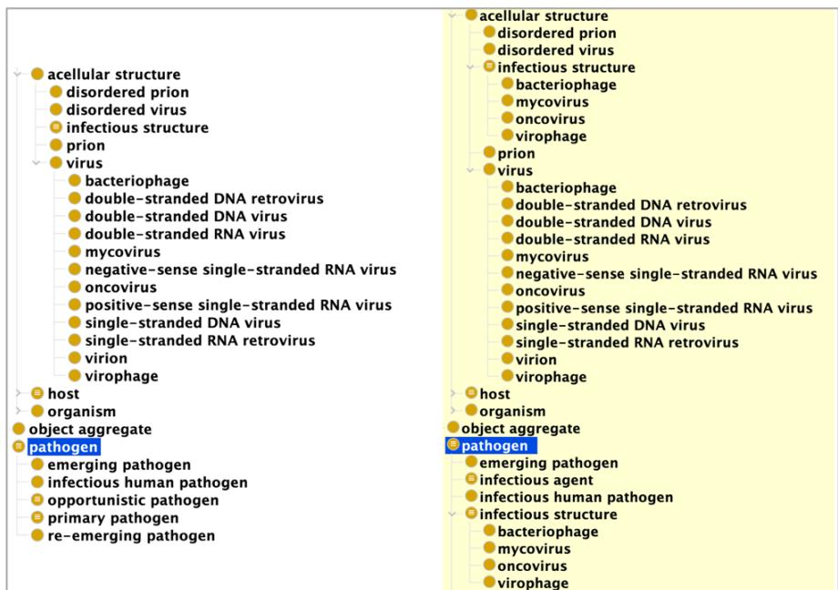
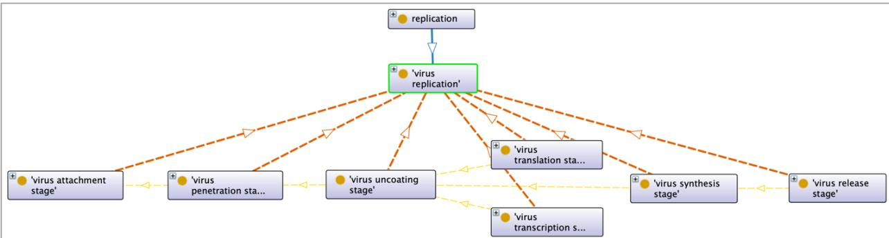
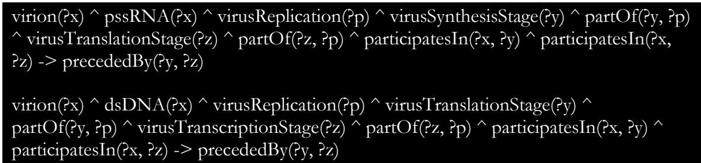
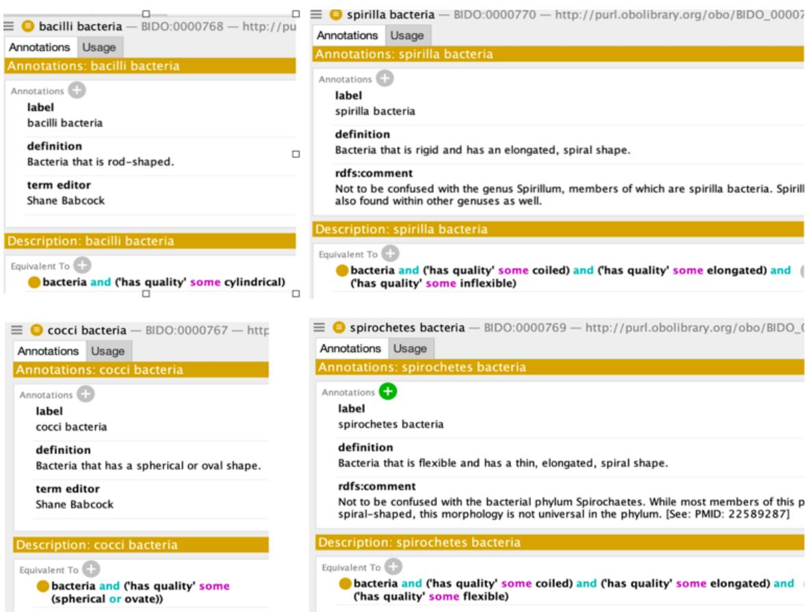
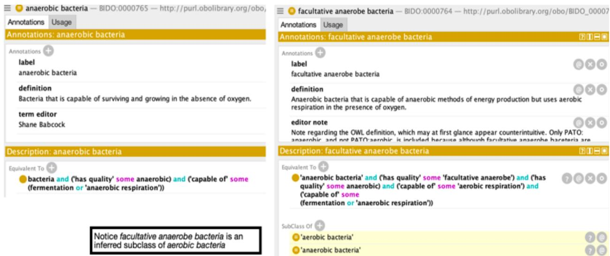
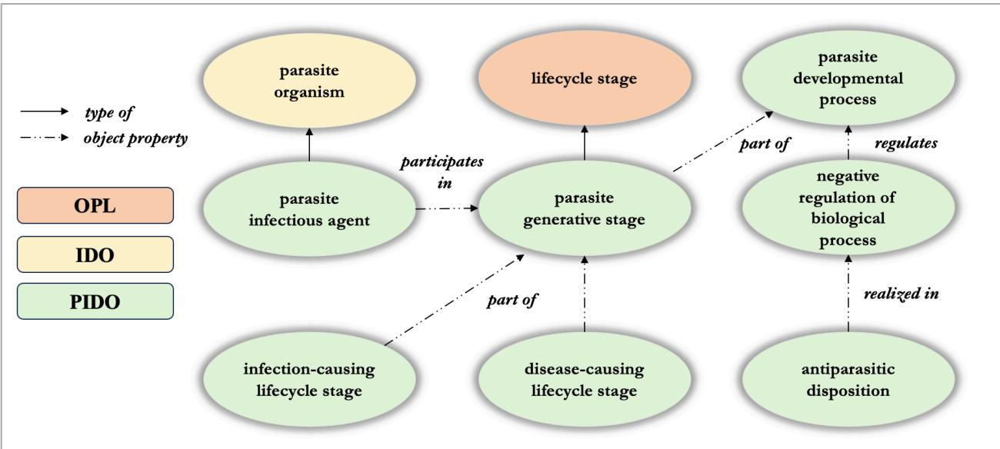

# A Fourfold Pathogen Reference Ontology Suite

Shane Babcock1,2, Carter Benson2,3, Giacomo De Colle2,4 , Sydney Cohen2 , Alexander D. Diehl2,4 , Ram A.N.R. Challa4 , Ray Mavrovich2,4, Joshua Billig2,4, Anthony Huffman5 , Yongqun He5 , and John Beverley2,4\*

1 KadSci LLC, United States

2 National Center for Ontological Research, United States

3 CUBRC, Inc., United States

4 University at Buffalo, State University of New York, United States

5 University of Michigan-Ann Arbor, United States

\*Corresponding Author johnbeve@buffalo.edu

## Abstract

Background: Infectious diseases remain a critical global health challenge, and the integration of standardized ontologies plays a vital role in managing related data. The Infectious Disease Ontology (IDO) and its extensions, such as the Coronavirus Infectious Disease Ontology (CIDO), are essential for organizing and disseminating information related to infectious diseases. The COVID-19 pandemic highlighted the need for updating IDO and its virus-specific extensions. There is an additional need to update IDO extensions specific to bacteria, fungus, and parasite infectious diseases.

Methods: The “hub-and-spoke” methodology is adopted to generate pathogen-specific extensions of IDO: Virus Infectious Disease Ontology (VIDO), Bacteria Infectious Disease Ontology (BIDO), Mycosis Infectious Disease Ontology (MIDO), and Parasite Infectious Disease Ontology (PIDO). Results: Updates to IDO and VIDO) are introduced, before reporting on the scopes, major classes and relations, applications and extensions of BIDO, MIDO, and PIDO.

Conclusions: The creation of pathogen-specific reference ontologies advances modularization and reusability of infectious disease data within the IDO ecosystem. Future work will focus on further refining these ontologies, creating new extensions, and developing application ontologies based on them, in line with ongoing efforts to standardize biological and biomedical terminologies for improved data sharing and analysis.

## Background

Infectious diseases are a persistent and evolving challenge to global health. Research communities produce enormous amounts of data regarding various aspects of infectious diseases. Ontologies – controlled vocabularies of terms and relationships among them - play a critical role in cleaning, disseminating, and coordinating such information by encoding them into standardized machineinterpretable languages [1]. The Open Biological and Biomedical Ontology (OBO) Foundry has long-provided useful guidelines around ontology development among life science researchers [2].

## A Fourfold Pathogen Reference Ontology Suite

Accordingly, numerous infectious disease ontologies have been created and added to the OBO Foundry library (http://obofoundry.org/). Of particular importance is the Infectious Disease Ontology (IDO; https://bioportal.bioontology.org/ontologies/IDO) [3, 4], which serves as a starting point for more specific infectious disease ontologies in the OBO Foundry, such as the Coronavirus Infectious Disease Ontology (CIDO;

The height of the coronavirus pandemic witnessed a need to revisit the curation of IDO and its various extensions. This owed in part to revisions made to the terminological foundation upon which IDO terms and relations are based: the Basic Formal Ontology (BFO; https://bioportal.bioontology.org/ontologies/BFO). BFO is a top-level ontology covering general classes such as material entity, quality, process, and role [1, 8, 9, 10], which provides a common starting point for many OBO Foundry ontologies. Shortly before the pandemic, BFO became the first toplevel ISO/IEC 21838-1 standard (https://www.iso.org/standard/74572.html), with the standardization process resulting in adjustments to its core vocabulary. A handful of terms and relations in IDO were impacted by these upstream adjustments. The pandemic spurred action to update IDO, as well as its infectious disease extensions, with a particular emphasis on those extensions designed to represent viruses. Subsequent updates to IDO [3] and an evaluation of the work needed to align its extensions [11], led to the recognition that many such extension ontologies introduced terms and relations broader than the stated scope of their home ontology. For example, IDOFLU introduced the term antiviral drug1 – “A drug used specifically for treating viral infections” – which is not limited to the domain of influenza, but would indeed be useful for, say,

## A Fourfold Pathogen Reference Ontology Suite

the HIV Ontology (IDOHIV) [12], the Dengue Fever Ontology (IDODEN) [13], the Combined Ontology for Inflammatory Diseases (COID) [14], or the COVID-19 Ontology (CODO) [15].

In the interest of partially addressing such issues, the Virus Infectious Disease Ontology (VIDO; https://bioportal.bioontology.org/ontologies/VIDO) [16] was developed as an reference ontology [1] extension of IDO to the domain of virus-specific infectious diseases; it was intended to provide “guardrails” to researchers so that they may reap the benefits of aligning with more general ontologies like IDO without having to spend time modeling from the “top-down” [17].

In other words, VIDO was designed to provide researchers with vetted ontological representations closer to the relevant virus infectious disease datasets. Subsequent alignment work emerging from the development of VIDO can be seen, for example, in the CIDO [5, 18].

Viruses are not, of course, the only infectious pathogens worthy of ontological representation; many extensions of IDO concern other pathogen types, such as bacteria and parasites. Following the “lattice approach” proposed by initiators of IDO [19], teams of ontology engineers and subject-matter experts have pursued the creation of reference ontology extensions of IDO covering other pathogen types. Inspired by traditional classifications of pathogens, the resulting suite of reference ontologies includes VIDO as discussed, but also three new pathogen infectious disease reference ontologies: the Bacteria Infectious Disease Ontology (BIDO; https://github.com/PhiBabs935/Bacteria-Infectious-Disease-Ontology), the Mycosis Infectious Disease Ontology (MIDO; https://github.com/GraduateRam/MIDO), and the Parasite Infectious Disease Ontology (PIDO; https://github.com/Huffmaar/PIDO). As with VIDO, these reference ontologies will serve as intermediate layers between IDO and its extensions into more specific pathogen representations. Developers of these projects maintain that this layered approach – curating classes and relations common to a range of IDO extensions falling within these pathogen types - will encourage modularity, improve ontology quality, and promote reuse as vetted ontological

## A Fourfold Pathogen Reference Ontology Suite

representations will more clearly connect to actual infectious disease data. In this respect, we take this project to be in the spirit of and compatible with the Core Ontology for Biology and Biomedicine (COB) effort, which has the admirable aim of coordinating well-developed terminologies across the OBO Foundry, for ease of access, reuse, and evaluation [20].

The following section provides an overview of the hub-and-spoke model leveraged by each extension to ensure alignment with IDO, as well as an overview of IDO terms and relations relevant to pathogen-type ontological representations. Subsequent sections introduce each reference ontology of the suite, with discussions of major classes and relations, design patterns, applications and extensions. We close by discussing limitations and future work.

## Methods

OWL, Protégé, and Reasoners. Each ontology is represented in the OWL 2 Web Ontology Language (https://www.w3.org/TR/owl2-overview/). OWL is a decidable fragment of first-order logic, which is to say there exists an algorithm that can determine the truth-value for any statement expressed in the language in a finite number of steps. Restricting expressions to a decidable language allows automated consistency and satisfiability checking. Ontologies in the suite were developed using the Protégé editor (https://protege.stanford.edu/) and tested against automated reasoners such as HermiT [21] and Pellet [22].

Ontology Engineering Best Practices. Each ontology in the suite was designed to align with OBO Foundry best practices, thereby supporting interoperability with existing Foundry ontologies [2]. OBO Foundry design principles require that ontologies use a well-specified syntax, leverage an unambiguous common space of identifiers, be openly available in the public domain, be modularly developed with a specified scope, and import a common set of relations from the Relations Ontology (RO; https://obofoundry.org/ontology/ro.html). Development of each ontology,

## A Fourfold Pathogen Reference Ontology Suite

moreover, follows metadata conventions adopted by many OBO Foundry ontologies [23], such as requiring that any term introduced into the ontology has a unique identifier, textual definition, definition source, designation of term editor(s), and preferred term label.

Ontology developers in this project adopted the “hub and spokes” methodology [1, 3, 16] for ontology development. For example, VIDO would be considered a “spoke” extending from the IDO “hub”. Extensions of IDO covering specific infectious diseases are created, first, by importing needed terms from IDO and other OBO Foundry ontologies, and second, by constructing the domain-specific terms where needed to adequately characterize the relevant domain. Intimately connected with the “hub and spokes” methodology is the adherence to extending definitions from existing ontologies following the “A is a B that C’s” [1, 24] pattern. For example, the IDO class appearance of disorder (A) is defined as a ‘process (B) by which a disorder comes into existence (C)’2 where the BFO class process is the parent class for appearance of disorder, while the remainder of the definition (C) differentiates appearance of disorder from sibling classes falling under process, such as process of establishing an infection, or infectious disease epidemic.

In the interest of coordinating development with existing OBO ontologies, developers imported terms where possible from existing OBO Foundry ontologies, such as the NCI Thesaurus (https://ncithesaurus.nci.nih.gov/ncitbrowser/), the Gene Ontology (GO) [25], the Protein Ontology (PRO) [26], the Ontology for Biomedical Investigations (OBI) [27], and of course IDO. Table 1 highlights important terms leveraged from existing OBO Foundry ontologies, emphasizing content reused from IDO as it is the hub from which reference ontology spokes in the suite extend. Limited overviews for these terms will emerge from the discussion to follow as needed. Interested readers can find further discussion in cited work included in the table.

<table><tr><td rowspan=1 colspan=1>OGMS:disorder [28]</td><td rowspan=1 colspan=1> Material entity that is a clinically abnormal part of an extendedorganism.</td></tr><tr><td rowspan=1 colspan=1>OGMS:disease</td><td rowspan=1 colspan=1>Disposition to undergo pathogenic processes that exists in an Organism because of one or more disorders in that organism.</td></tr><tr><td rowspan=1 colspan=1>OGMS:disease course</td><td rowspan=1 colspan=1> Totality of all processes through which a given disease instance is realized.</td></tr><tr><td rowspan=1 colspan=1> IDO:infectious disorder</td><td rowspan=1 colspan=1>Disorder that is part of an extended organism which has aninfectious pathogen part, that exists as a result of a process of formation of disorder initiated by the infectious pathogen.</td></tr><tr><td rowspan=1 colspan=1> IDO:appearance of disorder</td><td rowspan=1 colspan=1> Process by which a disorder comes into existence.</td></tr><tr><td rowspan=1 colspan=1> IDO:infection</td><td rowspan=1 colspan=1>Material entity that is part of an extended organism that has somepathogen as part, which participates in the formation of the material entity by invading tissues of the organism.</td></tr><tr><td rowspan=1 colspan=1> IDO:process of establishing an infection</td><td rowspan=1 colspan=1> Process by which an infectious agent or infectious structure, established in a host, becomes part of an infection in the host.</td></tr><tr><td rowspan=1 colspan=1> IDO:infectious disease</td><td rowspan=1 colspan=1>Disease whose physical basis is an infectious disorder.</td></tr><tr><td rowspan=1 colspan=1> IDO:opportunistic infectious disposition</td><td rowspan=1 colspan=1> Infectious disposition to become part of a disorder only in organisms whose defenses are compromised.</td></tr><tr><td rowspan=1 colspan=1> IDO:infectious disease course</td><td rowspan=1 colspan=1> Disease course that is the realization of an infectious disease.</td></tr><tr><td rowspan=1 colspan=1> IDO:infectious agent</td><td rowspan=1 colspan=1> An organism that has an infectious disposition.</td></tr><tr><td rowspan=1 colspan=1> IDO:pathogen</td><td rowspan=1 colspan=1> A material entity with a pathogenic disposition.</td></tr><tr><td rowspan=1 colspan=1> IDO:pathogen disposition</td><td rowspan=1 colspan=1>Disposition borne by a material entity to establish localization in, or produce toxins that can be transmitted to, an organism or acellular structure, either of which may form disorder in the entity or immunocompetent members of the entity&#x27;s species.</td></tr><tr><td rowspan=1 colspan=1> IDO:infectious disposition</td><td rowspan=1 colspan=1>Pathogenic disposition borne by a pathogen to be transmitted to a host and then become part of an infection in that host or in immunocompetent members of the same species as the host.</td></tr><tr><td rowspan=1 colspan=1> IDO:parasite</td><td rowspan=1 colspan=1> An organism bearing a parasite role.</td></tr><tr><td rowspan=1 colspan=1> IDO:parasite role</td><td rowspan=1 colspan=1>A symbiont role borne by an organism in virtue of the fact that itderives a growth, survival, or fitness advantage from symbiosis while the other symbiont&#x27;s growth, survival, or fitness is reduced.</td></tr><tr><td rowspan=1 colspan=1> IDO:acellular structure</td><td rowspan=1 colspan=1> Object consisting of an arrangement of interrelated acellular parts forming an acellular biological unit that is able to initiate replicationof the structure in a host.</td></tr><tr><td rowspan=1 colspan=1> IDO:infectious structure</td><td rowspan=1 colspan=1> Acellular structure that bears an infectious disposition.</td></tr><tr><td rowspan=1 colspan=1> IDO:virulence</td><td rowspan=1 colspan=1>Quality that inheres in a pathogen and is the degree to which realizations of associated disease caused by the pathogen become severe or fatal.</td></tr><tr><td rowspan=1 colspan=1> IDO:adhesion factor</td><td rowspan=1 colspan=1> Biological macromolecule that has an adhesion disposition.</td></tr><tr><td rowspan=1 colspan=1> IDO:adhesion disposition</td><td rowspan=1 colspan=1>Disposition borne by a macromolecule that is the disposition to participate in an adhesion process.</td></tr><tr><td rowspan=1 colspan=1> IDO:organism population</td><td rowspan=1 colspan=1>Aggregate of organisms of the same species.</td></tr><tr><td rowspan=1 colspan=1> IDO:antifungal disposition</td><td rowspan=1 colspan=1> Disposition to kill or inhibit the development or reproduction of fungal organisms.</td></tr><tr><td rowspan=1 colspan=1> IDO:resistance to drug</td><td rowspan=1 colspan=1> A protective resistance that mitigates the damaging effects of a drug.</td></tr><tr><td rowspan=1 colspan=1> IDO:protective resistance</td><td rowspan=1 colspan=1> Disposition that inheres in an entity by virtue of it having some part which is disposed to mitigate damage to the entity.</td></tr><tr><td rowspan=1 colspan=1>NCIT:mycosis [29]</td><td rowspan=1 colspan=1> An infection that is caused by a fungus.</td></tr><tr><td rowspan=1 colspan=1> OPL:parasite organism [30]</td><td rowspan=1 colspan=1> An organism living in, with, or on another organism in parasitism.</td></tr><tr><td rowspan=1 colspan=1> OPL:parasite lifecycle stage</td><td rowspan=1 colspan=1> A life cycle stage of a parasite.</td></tr></table>

<table><tr><td rowspan=1 colspan=1>ChEBI:drug [31, 32]</td><td rowspan=1 colspan=1> Any substance which when absorbed into a living organism may modify one or more of its functions.</td></tr><tr><td rowspan=1 colspan=1> GO:negative regulation ofbiological process [25]</td><td rowspan=1 colspan=1> Any process that stops, prevents, Or reduces the frequency, rate or extent of a biological process.</td></tr><tr><td rowspan=1 colspan=1>GO:pathogenesis</td><td rowspan=1 colspan=1> Process that is the realization of a pathogenic disposition inhering in a pathogen or pathogen population, having at least the proper process parts: (1) pathogen transmission, (2) establishment of localization in host, (3) process of establishing an infection, and (4) appearance of disorder.</td></tr><tr><td rowspan=1 colspan=1> FOODON:fungus [33]</td><td rowspan=1 colspan=1> Member of the group of eukaryotic organisms in the kingdom Fungi that includes unicellular microorganisms such as yeasts and molds,as well as multicellular fungi that produce familiar fruiting forms known as mushrooms.</td></tr><tr><td rowspan=1 colspan=1> MONDO:cutaneous mycosis[34]</td><td rowspan=1 colspan=1> Mycosis that involves the integument and its appendages, including hair and nails.</td></tr><tr><td rowspan=1 colspan=1> MONDO:subcutaneous mycosis</td><td rowspan=1 colspan=1>Mycosis that results in infection located in skin or located in subcutaneous tissue,which penetrate the dermis or even deeperduring or after a skin trauma.</td></tr><tr><td rowspan=1 colspan=1> MONDO:superficial mycosis</td><td rowspan=1 colspan=1>Mycosis that is limited to the stratum corneum and essentially elicits no inflammation.</td></tr><tr><td rowspan=1 colspan=1> MONDO:systemic mycosis</td><td rowspan=1 colspan=1> Mycosis that involves the lungs, abdominal viscera, bones and orcentral nervous system.</td></tr></table>

Table 1: Select Classes Reused from the Ontology for General Medical Science (OGMS), the Infectious Disease Ontology (IDO), the National Cancer Institute Thesaurus (NCI Thesaurus), the Ontology for Parasite Life Cycle (OPL), and the Chemical Entities of Biological Interest Ontology (ChEBI)

The Ontobee repository [35] and BioPortal [36] were used to investigate potentially relevant terms for each ontology in the suite.

Each ontology in the suite was rigorously evaluated to ensure scientific accuracy as well as ontological coherence. The inclusion of terminology was derived from extensive reviews of relevant, up-to-date authoritative literature, discussions with subject-matter matters from the relevant domain, and consensus-building exercises aimed to avoiding common modeling pitfalls, such as engagement in verbal disputes over labels. All aspects of ontology development, including addition of new terms, were driven by the needs of researchers investigating relevant domains. Consequently, no member of the suite is viewed as exhaustive of its domain but instead remains sensitive to evolving knowledge [1].

## Results

## A Fourfold Pathogen Reference Ontology Suite

## The Virus Infectious Disease Ontology

The Virus Infectious Disease Ontology (VIDO) serves as an extension of the Infectious Disease Ontology (IDO) Core, designed to represent the entities, processes, and relationships specific to viral infectious diseases. Its scope encompasses the detailed characterization of viruses, including their taxonomy, genetic composition, and replication mechanisms. It also addresses viral diseases, their clinical manifestations, and the biological processes involved in host-virus interactions. VIDO was developed based on virology literature [37, 38, 39, 40, 41]; subject-matter experts were consulted regarding definitions of key terms, such as the definitions for virus type terms that were minted for VIDO.

Major Classes. Table 2 presents major VIDO classes. VIDO’s central class is virus. Instances of virus fall under the IDO class acellular structure, alongside sibling classes such as viroid and prion, which lack cellular parts. Viruses are classified firstly in terms of their material structure, following the Baltimore Classification [37], where virus species are categorized into seven groups based on what steps members of a virus species must take during the viral replication cycle [38, 39, 40, 41]. For example, a positive-sense single-stranded RNA viruses, such as SARS-CoV-2, can be immediately translated into viral proteins upon entry into a cell, while a double-stranded DNA virus, such as Orthopoxvirus variola, must undergo transcription into messenger RNA before translation into viral proteins can proceed. VIDO reuses classes from GO reflecting the viral capsid composition as well as virus tropism [25], as well as terms from PRO to represent viral proteins [26], ChEBI for terms such as DNA and RNA [31, 32], and so on.

<table><tr><td>VIDO Label</td><td>VIDO Definition</td></tr><tr><td>virus</td><td>Acellular self-replicating organic structure characterized by the presence of RNA or DNA genetic material and dependent on a host for replication.</td></tr><tr><td>virion</td><td>Virus that is in its assembled state consisting of genomic material (DNA or RNA) surrounded by coating molecules.</td></tr><tr><td> viral infection</td><td> Infection that has as part some virus.</td></tr></table>

<table><tr><td rowspan=1 colspan=1>viral infectious disorder</td><td rowspan=1 colspan=1> Infectious disorder that has some virus as part, that exists as a result of a process of formation of disorder initiated by the virus.</td></tr><tr><td rowspan=1 colspan=1> viral infectious disease</td><td rowspan=1 colspan=1> Infectious disease caused by a virus participating in a pathological process initiated by the virus within a host organism.</td></tr><tr><td rowspan=1 colspan=1> viral infectious disease course</td><td rowspan=1 colspan=1> Infectious disease course that is the realization of a viral infectious disease.</td></tr><tr><td rowspan=1 colspan=1> viral pathogenesis</td><td rowspan=1 colspan=1> Pathogenesis process realization of a pathogenic disposition inhering in a virus or virus population, having at least the proper process parts: (1) pathogen transmission, (2) establishment of localization in host, (3) process of establishing a viral infection, and (4) appearance of a virus disorder.</td></tr><tr><td rowspan=1 colspan=1> virus replication</td><td rowspan=1 colspan=1> Biological process in which a virus synthesizes its genetic material and proteins within a host cell, resulting in the formation of new virions.</td></tr><tr><td rowspan=1 colspan=1> bacteriophage</td><td rowspan=1 colspan=1> Virus which infects and replicates within or on bacteria or archaea.</td></tr><tr><td rowspan=1 colspan=1> double-stranded DNA virus</td><td rowspan=1 colspan=1> Virus that has its genetic material encoded in double-stranded DNA and replicates using DNA polymerase.</td></tr><tr><td rowspan=1 colspan=1> positive-sense single- stranded RNA virus</td><td rowspan=1 colspan=1> Virus with genetic material encoded in single-stranded RNA that can be translated directly into proteins.</td></tr><tr><td rowspan=1 colspan=1> virus replication</td><td rowspan=1 colspan=1> Replication process in which a virus containing some portion of genetic material inherited from a parent virus is replicated.</td></tr><tr><td rowspan=1 colspan=1> virus generative stage</td><td rowspan=1 colspan=1> Infectious structure generative stage that is a temporal subdivision of a virus developmental process.</td></tr><tr><td rowspan=1 colspan=1> virus attachment stage</td><td rowspan=1 colspan=1> Virus generative stage during which a virion protein binds to molecules on the host surface or host cell surface projection.</td></tr><tr><td rowspan=1 colspan=1> virus uncoating stage</td><td rowspan=1 colspan=1> Virus generative stage during which an incoming virus is disassembled in the host cell to release a replication-competent viral genome.</td></tr><tr><td rowspan=1 colspan=1> negative regulation of virus attachment</td><td rowspan=1 colspan=1> Negative regulation of a virus replication process that stops, prevents, or reduces the frequency of some virus atachment stage.</td></tr><tr><td rowspan=1 colspan=1> negative regulation of virus penetration</td><td rowspan=1 colspan=1> Negative regulation of coronavirus replication that stops, prevents, or reduces the frequency of some virus penetration stage.</td></tr></table>

Table 2: Major VIDO Classes

Though viruses are classified firstly in terms of their material structure, owing to their infectious nature, subclasses are secondarily classed as instances of the IDO class infectious structure, which are disposed to transmit to and become part of an infection in some host. This is captured in the OWL assertion that infectious structure is equivalent to:

acellular structure and has disposition some infectious disposition Where acellular structure is a type of material entity – a broad BFO class that includes any entity that has some matter as part – which does not contain any cell parts. To illustrate infectious disposition: consider that SARS-CoV-2 virions are disposed to be transmitted to hosts via respiration, localize within host cells, leading to infection and disorder. In this respect, they are said

## A Fourfold Pathogen Reference Ontology Suite

to bear some infectious disposition. This highlights the fact that viruses are evolutionarily selected to infect hosts. Moreover, by adopting the distinction between infectious structure from infectious disposition, we disambiguate the infectious potential of viruses from the underlying material basis that grounds that potential. Additionally, we disambiguate the infectious disposition of a given virion from its contribution to any associated viral disease, which in turn ground the viral disease course that is the manifestation of disease in a host. More concretely, SARS-CoV-2 being infectious is in part explained by its being a positive-sense single stranded RNA virus; a host developing the disease COVID-19 is partially explained by SARS-CoV-2 being infectious; a host manifesting various symptoms following infection is partially explained by their having COVID-19.

Infectious disposition provides a link to pathogens more generally, as it is a subclass of pathogenic disposition – borne by entities to localize in and form disorders within a host. The class pathogen is asserted to be equivalent to:

material entity and has disposition some pathogenic disposition From which it follows that infectious structure is a subclass of pathogen, as displayed in the Protégé screenshot in Figure 1.

Additionally, subclasses of virus such as bacteriophage – viruses which infect and replicate within or on bacteria – are equivalent to:

And since virus is a subclass of acellular structure, it follows that bacteriophage is an inferred subclass of infectious structure and pathogen, just as one would expect. These examples reflect the general design strategy underwriting VIDO development: assert the material structure of viruses and its associated dispositions, from which one can infer various plausible classifications of those viruses.

  
Figure 1: Protégé Display of a Portion of Asserted and Inferred VIDO Hierarchies

A core design pattern of VIDO is the representation of the virus replication cycle [38, 42], which encompasses the sequence of stages viruses propagate through to produce new virions within a host organism. The virus replication cycle covers crucial aspects of overall viral pathogenesis, understood as involving virus transmission, localization, establishment of infection, and the appearance of a viral disorder. This cycle begins with the attachment of the virus to specific receptors on the host cell surface, followed by entry into the host cell through processes such as membrane fusion or endocytosis. Following penetration into a cell, a virion initiates replication, which varies considerably based on the type of virus, as characterized in the Baltimore Classification. Ultimately, virus replication must proceed to messenger RNA, which is in turn used to synthesize viral proteins, then assembled into virions and released from the host cell.

  
Figure 2: Virus replication in VIDO

Figure 2 displays how the virus replication life cycle is represented in VIDO. Any instance of virus replication stage is necessarily part of some instance of virus replication process, as illustrated with the red arrows reflecting the part of relationship reused from RO. Similarly, any instance of virus attachment stage precedes any instance of the other stages, as shown by the yellow arrows reflecting the transitive preceded by relation. Virus transcription generally precedes virus translation, with the exception that positive-sense RNA virus genomes act directly as messenger RNA for immediate translation into viral proteins [43]. The Protégé editor from which the figure was generated relies on OWL for diagram generation, but OWL is not amenable to representing such conditional scenarios. For that we leverage SWRL [44] rules within the editor, where “^” reflects logical conjunction and “?” is prepended to variables:

In words, if a virion that is an instance of the class positive-sense single-stranded RNA and participates in synthesis and translation stages of the same replication cycle, then the preceded by relation will be asserted to hold between the synthesis and translation stages. Similarly, if a virion that is an instance of the class double-stranded DNA and participates in translation and

## A Fourfold Pathogen Reference Ontology Suite

transcription stages of the same replication cycle, then the preceded by relation will be asserted to hold between the translation and transcription stages. In this way, VIDO respects the temporal orderings among stages in the virus replication cycle without falsely asserting that virus transcription in every case precedes virus translation.

Unambiguous representation of the virus replication has clear value for development of intervention and treatment strategies in the domain of rational drug design. For example, only host cells with specific features are susceptible to attachment by SARS-CoV-2 [3]. In humans, the standard route for successful infection involves virion attachment to host alveolar epithelial cells through angiotensin-converting enzyme 2 (ACE2) receptors [45, 46], defined in the PRO [26]. These cells may be characterized as bearing an adhesion disposition, defined in IDO as macromolecules disposed to participate in adhesion processes. Following the virus replication cycle, cell penetration often follows attachment, where host cell cleavage is aided by trans-membrane protease serine 2 (TMPRSS2), before SARS-CoV-2 cell membrane fusion [47]. An ontological characterization of the SARS-CoV-2 replication cycle provides machine-readable targets drugs and interventions designed to disrupt that cycle. Such disruptions can, moreover, be represented ontologically by way of extensions of the GO class negative regulation of biological process, defined as any process that stops, prevents, or reduces the frequency, rate or extent of a biological process. Extended to virus replication stages, we thus generate negative regulation of virus attachment and negative regulation of virus penetration, among others.

Extensions. The modular design of VIDO supports its extension into more specific virus domains, ensuring its continued relevance as new challenges in virology emerge. The Coronavirus Infectious Disease Ontology (CIDO) is perhaps the most widely-used extension, having been leveraged in the search for coronavirus interventions, treatment exploration, and basic research [5]. Since the development of VIDO, the VIDO and CIDO teams have worked to bring the latter under the

## A Fourfold Pathogen Reference Ontology Suite

guardrails of the former [16]. Additional extensions of VIDO have emerged since its development, such as the IoT-MIDO project [48] which leverages infectious disease vocabularies based on IDO to explore patient monitoring and risk assessment, clinical management of patients with infectious diseases, as well as epidemic risk analysis and surveillance. From another direction, the Covid19-IBO project aims to integrate virus-specific vocabularies from several ontologies containing terms related to COVID-19 in the interest of gaining insights into the impact this disease had on the banking sector in India; the authors provide a schema to identify similarities and differences across these virus ontologies [49].

Looking ahead, there are several virus-specific extensions of IDO which are within scope of alignment to VIDO. Specifically, the HIV Ontology (IDOHIV) [12], the Influenza Ontology (IDOFLU) [7], and the Dengue Fever Ontology (IDODEN) [13] none of which have been updated since 2017 [3, 11], should be brought into alignment with VIDO. Doing so will have the benefit of aligning each to the updated IDO as well, promoting semantic interoperability among IDO extensions, and encouraging further development of virus-specific ontologies within this ecosystem.

## The Bacteria Infectious Disease Ontology

The Bacteria Infectious Disease Ontology (BIDO) extension of IDO is designed to serve as a reference ontology for bacterial pathogens and bacterial pathogenesis more generally. Its scope encompasses the detailed characterization of bacteria, including their taxonomy, genetic composition, and reproduction mechanisms. It also addresses bacterial diseases, their clinical manifestations, and the biological processes involved in host-bacteria interactions. BIDO was developed based on bacteria literature [53, 54, 55, 56]; subject-matter experts were consulted regarding definitions of key terms, such as the definitions for bacteria type terms that were newly created for BIDO.

Major Classes and Relations. BIDO introduces—as subclasses of the undefined NCIBTaxon term bacteria—new terms for a variety of bacterium types. Figure 3 provides example subclasses, such as bacilli bacteria, spirilla bacteria, cocci bacteria, and spirochetes bacteria, which reflect bacteria classifications determined by cellular morphology.

  
Figure 3: Bacteria Type Vocabulary in BIDO

BIDO provides rich semantics around these terms by importing and additional terms broadly relevant to the bacterial domain from several OBO Foundry ontologies, such as IDO, ChEBI, PRO, and GO. From ChEBI, molecular entity terms are imported that factor in bacterial pathogenesis, such as lipopolysaccharide, capsular polysaccharide, and bacteriocin. PRO provided a source for various bacterial protein terms while GO imports included bacterial cell components such as Gram-positive-bacterium-type cell wall, pilus, capsule, slime layer, and so on, as well as

## A Fourfold Pathogen Reference Ontology Suite

important, cellular process terms such as entry of bacterium into host cell, aerobic respiration, fermentation, and spore dispersal, among others. Additionally, the Ontology of Microbial Phenotypes (OMP) [57] provided phenotype terms characteristic of different bacterium types, such as obligate anaerobe, obligate aerobe, facultative anaerobe, and so on, while the Clinical Measurement Ontology (CMO) [58] provided measurement data terms relating to bacterial infection, such as bacterial infection severity measurement, bacteria count, and bacterial infection severity score. As illustrated in Figure 4, BIDO includes various logical axioms connecting bacterial pathogenicity to key such imported terms, as well as terms from IDO such as toxin, virulence factor, adhesion factor, and invasion factor. Imported terms are used to provide logical definitions for various bacterium types such as aerobic bacteria, anaerobic bacteria, spirilla bacteria, discussed in more detail below.

  
Figure 4: Semantic Enrichment of Existing Bacteria Vocabulary in BIDO

BIDO’s major classes extend directly from terms in either IDO or OGMS, following the “hub-and-spoke” methodology employed in VIDO development [16]. BIDO key terms and definitions are displayed in Table 3.

<table><tr><td>BIDO Label</td><td>BIDO Definition</td></tr></table>

<table><tr><td rowspan=1 colspan=1> spirilla bacteria</td><td rowspan=1 colspan=1> Bacteria that is rigid and has an elongated, spiral shape.</td></tr><tr><td rowspan=1 colspan=1> spirochetes bacteria</td><td rowspan=1 colspan=1> Bacteria that is flexible, and has a thin, elongated, spiral shape.</td></tr><tr><td rowspan=1 colspan=1> bacterial infection</td><td rowspan=1 colspan=1> Infection that has as part some bacteria.</td></tr><tr><td rowspan=1 colspan=1>bacterial toxin disorder</td><td rowspan=1 colspan=1> Disorder the formation of which involves some bacterial toxin.</td></tr><tr><td rowspan=1 colspan=1>bacterial infectious disorder</td><td rowspan=1 colspan=1> Infectious disorder that has some bacteria as part, that exists as a result of a process of formation of disorder initiated by thebacteria.</td></tr><tr><td rowspan=1 colspan=1> bacterial infectious disease</td><td rowspan=1 colspan=1>Infectious disease that has its material basis in some bacterialinfectious disorder.</td></tr><tr><td rowspan=1 colspan=1> bacterial infectious disease course</td><td rowspan=1 colspan=1> Infectious disease course that is the realization of a bacterial infectious disease.</td></tr><tr><td rowspan=1 colspan=1>bacterial pathogenesis</td><td rowspan=1 colspan=1> Pathogenesis process realization of a pathogenic disposition inhering in some bacteria or bacteria population, having at least the proper process parts: (1) toxin biosynthetic process, and (2) appearance of disorder.</td></tr><tr><td rowspan=1 colspan=1> bacterial adhesion disposition</td><td rowspan=1 colspan=1> Adhesion disposition borne by a macromolecule part of some bacteria that is the disposition to participate in the adherence of the bacteria to a host.</td></tr><tr><td rowspan=1 colspan=1>bacterial adhesion factor</td><td rowspan=1 colspan=1>Adhesion factor that is part of some bacteria.</td></tr><tr><td rowspan=1 colspan=1> bacteria population</td><td rowspan=1 colspan=1> Organism population whose members are bacteria.</td></tr><tr><td rowspan=1 colspan=1> bacteria colony</td><td rowspan=1 colspan=1> Colony whose members are bacteria.</td></tr><tr><td rowspan=1 colspan=1> appearance of bacterial infectious disorder</td><td rowspan=1 colspan=1> Appearance of disorder by which a bacterial infectious disordercomes into existence.</td></tr><tr><td rowspan=1 colspan=1> process of establishing a bacterial infection</td><td rowspan=1 colspan=1>Process of establishing an infection in which a bacteriumparticipates.</td></tr><tr><td rowspan=1 colspan=1> bacterial pathogenesis involvinginfection</td><td rowspan=1 colspan=1> Bacterial pathogenesis having at least the proper process parts: (1) establishment of localization in host, (2) process of establishing a bacterial infection, and (3) appearance of bacterial infectiousdisorder.</td></tr></table>

Table 3: Major BIDO Classes

BIDO distinguishes between bacterial toxin disorder and bacterial infectious disorder. Instances of the latter are in every case instances of bacterial infection and serve as the material basis for bacterial infectious disease. In contrast, the class bacterial toxin disorder covers any disorder involving bacterial toxins, whether associated with an infection by the relevant toxinproducing bacteria or not.3 An example to illustrate this distinction concerns the causative agent in food botulism, C. botulinum, a bacterial pathogen that is not infectious. When a person consumes food contaminated by toxins produced by C. botulinum, the ingested toxins often cause disorder in that person, leading to the disease. The disorder is not, however, a bacterial infectious disorder,

## A Fourfold Pathogen Reference Ontology Suite

since the toxin producing bacteria is not disposed to invade or be transmitted to other potential hosts [3, 16]. Of course, some bacterial toxin disorders are instances of infectious disorder as when toxins secreted by bacteria serve as virulence factors aiding infection of a host by, say, helping bacteria bypass innate and adaptive immune responses.

Similarly, some pathogenic bacteria may be infectious while others are not. For example, Yersinia pestis and Vibrio cholerae are disposed to be transmitted and become part of some infection and so count as infectious agents in the creation of bacterial infectious disorders. Even so, bacteria need not be infectious to count as pathogenic; they need only exhibit virulence. That is, any instance of bacteria which bears a virulence quality counts as an instance of pathogen. As pathogens, such bacteria bear instances of pathogenic disposition, and are consequently disposed to establish localization in or produce toxins transmittable to a host to form disorder.

Modeled on VIDO’s viral pathogenesis, BIDO introduces bacterial pathogenesis, which has the subclass axiom:

has part some toxin biosynthetic process and (has participant some bacteria) Which leverages the GO term toxin biosynthetic process, characterizing the formation of toxins by cells or organisms, including bacteria that cause disease in various organisms. Unlike viral pathogenesis, however, we cannot assert that instances of bacterial pathogenesis in every case involve an establishment of localization in host or a process of establishing an infection, as a parts. As discussed above there are examples of bacterial pathogenesis in which bacterial toxins cause disease in a host but are produced by bacteria that never localize in the diseased organism. Additionally, BIDO allows that bacterial pathogenesis may involve infections caused by opportunistic pathogens that do not engage in any pathogen transmission process, such as when bacteria colonizing the surface of a host’s skin realize instances of infectious disposition when that protective barrier is ruptured.

## A Fourfold Pathogen Reference Ontology Suite

BIDO includes newly added axioms, connecting various imported terms to relevant IDO terms. To illustrate, consider the GO term pilus. Pili are the hair-like appendages found on many bacteria which help facilitate the adhesion of pathogenic strains of bacteria to bodily tissues. Pili thereby increase bacteria replication rates, allow bacteria to colonize host cells, and facilitate tissue infection. Pili thus contributes to the virulence of many pathogenic bacteria. BIDO represents this complexity around the term pilus with the following equivalency axiom:

cell projection and part of some bacteria and has role some antigen role and has disposition some bacterial adhesion disposition and has disposition some virulence factor disposition

As logically defined, pilus is an inferred as a subclass of both IDO’s adhesion factor and virulence factor.

Other examples of bacterial virulence factors are represented by terms imported from ChEBI. A capsular polysaccharide is a polysaccharide capsule found on the cell surface of many bacteria that enables both their adhesion to surfaces and their evasion of host immune responses, as well as providing protection from toxins. Lipid A is the lipopolysaccharide portion of the outer membrane of gram-negative bacteria responsible for its endotoxicity. As with pilus, we assert that both capsular polysaccharide and lipid A have a virulence factor disposition, so that both are inferred subclasses of IDO’s virulence factor. In the case of lipid A, instances have some disposition endotoxin disposition, and so it is an inferred subclass of endotoxin. As development BIDO continues, we will add similar axioms to other imported terms from the GO, PRO, and ChEBI.

Extensions. There are currently four existing bacterial infectious disease ontologies extending from IDO which would stand to benefit from refactoring as domain ontology extensions of BIDO:

1. Staphylococcus aureus Infectious Disease Ontology (IDO-Staph) [59]

3. The Meningitis Infectious Disease Ontology (IDOMEN) [61]

4. The Bacterial Clinical Infectious Disease Ontology (BCIDO) [62, 63]

Each requires updating to the most recent versions of IDO and BFO, during which refactoring to support BIDO as a common reference ontology can be conducted. This seems particularly impactful for BCIDO, designed to represent within its scope bacterial infections, bacteria, and antibiotic treatment, excluding those associated with Mycobacteria. Presentations of BCIDO [63] suggest there are many ontology terms that would be included a bacteria infectious disease reference ontology but also suggest that BCIOD is not particularly modular. We maintain that it would thus be in the interest of modularity and reuse, that BIDO and BCIDO communities work towards a division of labor in this domain.

Given the scope of BIDO as a reference ontology, additional potential extensions cover the broad domain of bacterial infectious diseases, and may include ontologies for tuberculosis, infective endocarditis, chlamydia, E. coli infection, and so on.

## The Mycosis Infectious Disease Ontology

The Mycosis Infectious Disease Ontology (MIDO) is an open-source biomedical ontology, built with the purpose of providing standardized human- and computer-interpretable representations of the entities, processes, and relationships specific to fungal infectious diseases. Its scope encompasses the detailed characterization of fungi, including their taxonomy, genetic composition, and reproduction mechanisms. It also addresses fungal diseases, their clinical manifestations, and the processes involved in host-fungi interactions. MIDO aims to bring fungal infectious diseases in conversation with other OBO Foundry ontologies related to infectious diseases and was developed based on fungi literature [44, 65] and engagement with subject-matter experts in the UNITE community [66] which maintains an open-source database for fungal taxonomy and nomenclature.

Major Classes and Relations. Fungi are a diverse set of eukaryotic organisms that play an important role in our ecosystem. Table 4 highlights key classes and definitions introduced by MIDO, which firstly expands the FOODON [33] term fungus by introducing subclasses for yeast, mold, and dimorphic fungus. Additionally, terms for the anatomical structure of fungi are imported from the OBO Foundry Fungal Gross Anatomy Ontology (FAO) [67], such as the general class fungal structure, and subclasses such as hyphal tip, sterigma, and mycorrhiza.

Instances of fungus types may cause hosts to develop fungal infections - captured by the NCIT term mycosis - which vary in severity owing to the host tissues they affect. MIDO reuses terms from the MONDO Disease Ontology [61] relevant to various mycoses, such as the commonly drawn fourfold distinction between superficial mycosis, cutaneous mycosis, subcutaneous mycosis, and systemic mycosis. Mycoses can be initiated via inhalation of fungal spores. For example, the NCIT term histoplasmosis represents an infectious disease involving fungi and accordingly sits under the MIDO class fungal infectious disease. This fungal disease is the result of inhaling spores of Histoplasma capsulatum. Similarly, inhalation of fungal spores may result in the formation of disorder in a host, as reflected by the MIDO class aspergilloma which involves an instance of aspergillus growing in lungs or sinuses.

<table><tr><td rowspan=1 colspan=2>MIDO Label                                            MIDO Definition</td></tr><tr><td rowspan=1 colspan=1>yeast</td><td rowspan=1 colspan=1> Fungus that is unicellular through its development cycle.</td></tr><tr><td rowspan=1 colspan=1>mold</td><td rowspan=1 colspan=1> Fungus that is multicellular through its development cycle, exhibiting mycelium networks.</td></tr><tr><td rowspan=1 colspan=1> dimorphic fungus</td><td rowspan=1 colspan=1> Fungus is unicellular or multicellular through its development cycle depending on environmental conditions.</td></tr><tr><td rowspan=1 colspan=1> fungal infectious disorder</td><td rowspan=1 colspan=1> Infectious disorder that has some fungus as part, that exists as a result of a process of formation of disorder initiated by the fungus.</td></tr><tr><td rowspan=1 colspan=1> aspergilloma</td><td rowspan=1 colspan=1> Fungal disorder which contains as part aspergillus localized in the lungs or sinuses of a host.</td></tr><tr><td rowspan=1 colspan=1> fungal infection</td><td rowspan=1 colspan=1> Infection that has as part some fungus.</td></tr><tr><td rowspan=1 colspan=1> fungal infectious disease</td><td rowspan=1 colspan=1> Infectious disease caused by a fungus participating in a pathological process initiated by the fungus within a host organism.</td></tr></table>

<table><tr><td rowspan=1 colspan=1>fungal infectious disease course</td><td rowspan=1 colspan=1> Infectious disease whose physical basis is a fungal disorder that is clinically abnormal in virtue of the presence of the relevant funguspopulation.</td></tr><tr><td rowspan=1 colspan=1> fungal pathogenesis</td><td rowspan=1 colspan=1> Pathogenesis process realization of a pathogenic disposition inhering in a fungus or fungus population, having at least the proper process parts: (1) establishment of localization in or on host, (2) process of establishing a fungal infection, and (3) appearance of a fungal infectious disorder.</td></tr><tr><td rowspan=1 colspan=1> fungal infectious agent</td><td rowspan=1 colspan=1> Fungus that has an infectious disposition.</td></tr><tr><td rowspan=1 colspan=1> opportunistic fungal pathogen</td><td rowspan=1 colspan=1> Fungus bearing an opportunistic infectious disposition.</td></tr><tr><td rowspan=1 colspan=1>azole</td><td rowspan=1 colspan=1> Antifungal that targets fungal cytochrome P450 enzyme-lanosterol14α-demethylase which converts lanosterol to ergosterol.</td></tr><tr><td rowspan=1 colspan=1> polyene</td><td rowspan=1 colspan=1> Antifungal that directly binds to and removes the ergosterol present in the fungal cell membrane.</td></tr><tr><td rowspan=1 colspan=1> antifungal resistance</td><td rowspan=1 colspan=1> Resistance to drug that mitigates the damaging effects of antifungaltreatments.</td></tr></table>

Table 4: Major MIDO Classes

Following IDO, MIDO adopts that “pathogen” should be understood as indexed to specific species and maturity of potential hosts. For example, Ceratocystis paradoxa is a fungal plant pathogen responsible for significant annual loss of pineapple harvests [68], but which is not considered pathogenic to humans. We, moreover, follow IDO in maintaining that opportunistic pathogens are not simply pathogens owing to an opportunity, but rather pathogens realizing an opportunity. This is an important observation in the presence of fungal infections, since many are caused by such opportunities; in MIDO this is captured by instances of opportunistic fungal pathogen, which is constrained by the logical axiom:

inheres in some fungus and (realized in only (process and has part some establishment of localization in host and has part some transmission process and has part some appearance of disorder and not occurs in some immunocompetent organism))

Indicating that any instance of opportunistic fungal pathogen is disposed to establish localization in a host that is not immunocompetent, following a transmission process, from which a disorder emerges. A common example of an opportunistic fungal pathogen is Candida albicans, a yeast that is commonly found in the human gut flora and often associated with thrush and gastrointestinal infections in immunocompromised human hosts. The alignment of fungal pathogen terminology

## A Fourfold Pathogen Reference Ontology Suite

with that of other infectious diseases, thus allows for exploration of secondary fungal infections. Of value is the identification of patients exhibiting weakened immune systems who may be thereby susceptible to fungal infections.

Diagnosing fungal infections is inherently challenging due to the diverse and complex nature of fungi [69]. For instance, fungal spores can provoke pathogenic responses that are often difficult to differentiate from allergic reactions, such as those caused by pollen inhalation. Compounding these diagnostic challenges is an even more pressing issue: the growing resistance of fungi to antifungal treatments. Despite the identification of antifungal drugs that seem to maintain efficacy after decades of use as treatments, such as Amphotericin B instances of the MIDO class polyene, many antifungal drugs, including those represented in MIDO by the azole class, have shown decreasing efficacy worldwide due to the emergence of antifungal resistance inhering in fungal strains, such as Aspergillus fumigatus [70, 71]. MIDO offers an opportunity to address such challenges issue by providing well-defined representations of the mechanisms of antifungal resistance and the genetic factors contributing to it. Such enhancements will facilitate the study of resistance patterns, aiding the design of more effective treatment plans and the development of next-generation antifungal drugs [72]. Additionally, integrating MIDO with drug discovery databases will enable the identification of novel antifungal compounds. By connecting fungal genes and pathways with existing drug targets, researchers can leverage these links to develop new therapeutic options with greater precision and efficiency [73].

Extensions. Given how recent initiation of MIDO has been, there are currently no ontologies extending from it. Moreover, given pathogen research heavily favoring bacterial and viral pathogens, few OBO ontologies contain fungal infection classes or relations. Nevertheless, there are numerous reasons to take such modeling seriously, not the least of which owes to the considerable amount of data being curated by organizations such as UNITE, which run the risk of creating data silos. MIDO developers envision leveraging this ontology to provide a semantic layer connecting data from the UNITE community to other datasets concerning fungi.

Additionally, MIDO developers envision using MIDO to model incidence and spread of fungal infections, including rare and emerging mycoses, in the interest of supporting outbreak monitoring and response. Ontological characterizations of the complex interrelations of fungal pathogens and their hosts will, moreover, clarify understanding of fungal pathogenesis, perhaps opening new therapeutic research options and infection prevention strategies. MIDO is, however, less developed than either VIDO or BIDO, and so much work remains before it is able to make good on such potential. With that in mind, Table 5 displays critical MIDO updates needed for future ontology development.

<table><tr><td>Ontology Gap</td><td>Description</td><td>Potential Ontology Content</td><td>Potential Reuse</td></tr><tr><td>Environmental and Ecological Context</td><td>Represent fungi&#x27;s roles in ecosystems to capture interactions and ecological significance.</td><td>decomposer, symbiotic fungus, has ecological role</td><td>Environment Ontology (ENVO) [74]</td></tr><tr><td>Epidemiological Modeling</td><td>Incorporate epidemiological data for fungal infection patterns, outbreaks, and transmission dynamics to help in forecasting and monitoring.</td><td>fungal outbreak, fungal infection incidence, fungal infection incidence rate, fungal infection susceptibility</td><td>APOLLO-SV [75]; MONDO</td></tr><tr><td>Novel Therapeutic Approaches</td><td>Represent new antifungal treatments, alternative therapies, and mechanisms to counter antifungal resistance.</td><td>fungal vaccine, antifungal nanoparticle, chitin synthesis inhibitor</td><td>Vaccine Ontology (VO) [76]; FAO</td></tr></table>

Table 5: Planned Updates to MIDO

## The Parasite Infectious Disease Ontology

The Parasite Infectious Disease Ontology (PIDO) extension of IDO is designed to serve as a reference ontology for eukaryotic pathogens and parasitic pathogenesis more generally. Its scope encompasses the detailed characterization of parasites, including their taxonomy, genetic composition, and reproduction mechanisms. It also addresses parasite diseases, their clinical

## A Fourfold Pathogen Reference Ontology Suite

manifestations, and the biological processes involved in host-parasite interactions. PIDO was developed based on contemporary parasite literature [77, 78, 79, 80, 81]; subject-matter experts were, as always, consulted regarding definitions of key terms and relations.

Major Classes and Relations. Historically the term “parasite” refers to pathogens that are neither bacteria nor viruses [77]. In part to avoid classifying, say, prions as parasites, IDO maintains parasites are instances of organism that bear some parasite role, which is itself a subclass of symbiont host role. Instances of the latter are borne by some organism in virtue of the fact that the organism derives growth, survival, or some fitness advantage from symbiosis, while its host’s growth, survival, or fitness is reduced. Such a broad ontological characterization of parasites seems warranted, given their sheer diversity. Human parasites include organisms ranging from helminths (e.g. tape worms and roundworms), protozoans (e.g. amoeba and ciliates), as well as ectoparasites described as parasites that live on the exterior of its host (e.g. fleas and lice).

The primary source for imported terms to PIDO is the Ontology for Parasite Lifecycle (OPL) [78]. OPL distinguishes between a parasite life stage and a parasite organism. The former is a spatiotemporal region – a class in BFO that is the spatial and temporal extent of some process – that encompasses some part of the life cycle of an organism, which is intended to cover the temporal extent over which a parasite is alive. This class is asserted equivalent to:

## life cycle stage and in taxon some parasite organism

Where life cycle stage is imported from UBERON [82], and in taxon is imported from RO, meaning x is in taxon y just in case y is an organism and either x is part of, developmentally preceded by, derives from, secreted by, or expressed y. Building on these imports, PIDO introduces parasite generative stage as representing the processes which occur in the parasite life stage spatiotemporal region, that are the proper targets of rational drug interventions and treatments. We also leverage terms imported by OPL from the Cell Line Ontology (CLO) to specify which tissues are targeted by parasites [83] during parasitic infections.

In many cases, parasites exhibit distinct phenotypes at different life stages. Some examples of terms reused for such representation include plasmodium falciparum gametocyte, plasmodium falciparum gametocyte stage and plasmodium falciparum trophozoite stage. Terms representing parasite diseases were reused from the extensive disease representation found in the Human Disease Ontology (DOID) [84], where appropriate terms exist. Finally, when these were available, we imported terms representing existing drugs and vaccines that target parasites from ChEBI or VO. Examples include malaria, leishmaniasis, toxoplasmosis, chloroquine, and parasite vaccine. The initial parasites represented within PIDO were chosen to reflect those that have vaccines within VO or the associated database VIOLIN (Vaccine Investigative Online Information Network). To represent the parasite life stages for the 23 parasitic eukaryotes were listed in VIOLIN, we created new terms by searching for information on parasite life stages and species through a literature review on PubMed.

<table><tr><td rowspan=1 colspan=2>Label                                                     Definition</td></tr><tr><td rowspan=1 colspan=1> parasite infection</td><td rowspan=1 colspan=1> Infection that has as part some parasite.</td></tr><tr><td rowspan=1 colspan=1>parasite infectious disorder</td><td rowspan=1 colspan=1>Infectious disorder that exists as a result of a process of formation of disorder initiated by a parasite or parasite population.</td></tr><tr><td rowspan=1 colspan=1> parasite infectious disease</td><td rowspan=1 colspan=1> Infectious disease that has material basis in some parasite disorder.</td></tr><tr><td rowspan=1 colspan=1>parasite infectious diseasecourse</td><td rowspan=1 colspan=1>Infectious disease whose physical basis is a parasite disorder that isclinically abnormal in virtue of the presence of the relevant parasitepopulation.</td></tr><tr><td rowspan=1 colspan=1> parasite pathogenesis</td><td rowspan=1 colspan=1> Pathogenesis process realization of a pathogenic disposition inhering in a parasite or parasite population, having at least the proper process parts: (1) pathogen transmission, (2) establishment of localization in host, (3) process of establishing a parasite infection, and (4) appearance of a parasite infectious disorder.</td></tr><tr><td rowspan=1 colspan=1> ectoparasite</td><td rowspan=1 colspan=1> Parasite bearing an ectoparasite role.</td></tr><tr><td rowspan=1 colspan=1>ectoparasite role</td><td rowspan=1 colspan=1> Parasite role whose realization involves attachment to and interactionwith the surface of a host.</td></tr><tr><td rowspan=1 colspan=1> endoparasite</td><td rowspan=1 colspan=1> Parasite bearing an endoparasite role.</td></tr><tr><td rowspan=1 colspan=1>endoparasite role</td><td rowspan=1 colspan=1> Parasite role whose realization involves location within and interaction with the body of a host.</td></tr><tr><td rowspan=1 colspan=1>parasite infectious agent</td><td rowspan=1 colspan=1>Parasite that has an infectious disposition.</td></tr></table>

<table><tr><td rowspan=1 colspan=1> parasite generative stage</td><td rowspan=1 colspan=1>Generative stage that is a temporal subdivision of a parasite developmental process.</td></tr><tr><td rowspan=1 colspan=1> infection-causing parasite life stage</td><td rowspan=1 colspan=1> Parasite life stage that initiates the formation of an infection withinthe host.</td></tr><tr><td rowspan=1 colspan=1> disease-causing parasite life stage</td><td rowspan=1 colspan=1> Parasite organism life stage that initiates the formation of a diseasewithin the host.</td></tr><tr><td rowspan=1 colspan=1> antiparasitic disposition</td><td rowspan=1 colspan=1> Disposition to kill or inhibit the development or reproduction ofparasites.</td></tr></table>

Table 6: Major PIDO Classes

We can divide the terms in PIDO into two main groups. The first focuses on classifying parasite types. The Center for Diseases Control and prevention (CDC) provides a list of parasitic infectious diseases against humans and domesticated animals that covers over 114 different species from 12 different clades. However, within the context of infectious disease, the focus is moved to members of three major polyphyletic categories; parasitic prokaryotes (internal parasite eukaryotic microbe), parasitic helminths (internal parasitic animals), and parasitic arthropods (ectoparasite animals). Instances of parasite role are specified by the location in the host where the parasite role is realized. For example, ectoparasite specifies that the accompanying parasite role is realized when located on a host’s surface. The endoparasite role on the other hand is much broader as it covers instances of parasite that exist within a host’s body, such as lumen, tissues, or internal organs. Core terms from PIDO are presented in Table 6.

The second major division of PIDO terms represent specific life stages within the context of a disease. Instances of parasite life stage are unique insofar as the given parasite can exhibit significant phenotypic differences between the parasite infection and disease states to evade the host immune system. Bilharzia, for example, is a disease caused by the Schistosoma flatworm. Schistosoma migrate and infect human hosts as schistosomiasis cercaricae before maturing as adults. However, bilharzia is caused by the schistomiasis gametes laid by adult Schistosoma [85]. To represent these differences, a distinction is drawn in PIDO between infection-causing parasite

and disease-causing parasite, represented as different life cycle stage types. A similar pattern can also be observed with prokaryotic parasites, such as the malaria parasite, Plasmodium falciparum.

Figure 5 shows the design pattern for PIDO. Using malaria as an example, axiomatization of classes representing parasites, their participation as causative agents in disease, and associated treatment options, follow the pattern: parasite participates in some generative stage which is part of some parasite development process, which is negatively regulated by the realization of some antiparasitic disposition. For example, Plasmodium falciparum participates in some generative and developmental stages associated with its lifecycle, which sometimes lead to hosts exhibiting symptoms of malaria; malaria drugs such as chloroquine – which increases the levels of haeme in host blood to toxic levels for the parasite - are then used to regulate the parasite developmental cycle.

  
Figure 5: Ontology Design Pattern for Parasites in PIDO; the type of relation holds between instances and classes while object property relations hold between instances.

Drugs and vaccines that target parasitic protozoans, such a Plasmodium falciparum, are efficacious only against parasites within specific life cycles. Using a malaria vaccine as an example, we can represent within PIDO that efficacy against P. falciparum:

RTS,S/AS01 immunizes against microbe some P. falciparum erythrocyte Logically connecting the vaccine to immunity provided against malaria in humans. Similarly:

PFS25/28 in Matrix M immunizes against some P. falciparum gametocyte Logically characterizing a malaria vaccine that inhibits transmission of the parasite to its preferred vector.

Extensions. There are currently two existing parasite infectious disease ontologies extending from IDO which would stand to benefit from refactoring as domain ontology extensions of PIDO:

1. Malaria Infectious Disease Ontology (IDOMAL) [86]

2. The Schistosomiasis Ontology (IDOSCHISTO) [87]

Each requires updating to the most recent versions of IDO and BFO, during which refactoring to support PIDO as a common reference ontology can be conducted.

Further extensions of PIDO will be focused on adding information to represent other infectious parasites. First, future endeavors will involve clarifying the internal division of PIDO, possibly splitting its scope between animal parasites and protozoan parasites. Second, we plan to develop PIDO so that it is able to represent more complex use cases. One such example would include scenarios where a parasite functions as a vector for another pathogen, like a tick ectoparasite being a vector for the bacteria that cause Lyme disease. Extending PIDO would involve adding new classes to ontologically represent the relation between a parasite, a parasitic host, and a parasitic vector. The parasitic vector is a complex type of entity to represent ontologically, as the life cycles of instances would presumably be associated with as an additional symbiont stage where the parasite may co-exist in a non-parasitic relationship, such as malaria parasites within mosquitoes. Creating an ontological representation of such a scenario would allow for the semantic modeling of the tripartite relationship, and thus potentially for the discovery of new relations implicit in data collected on various stages of development of parasitic infections.

## Discussion

The ongoing development of IDO and its pathogen-specific extensions represents a critical step in enhancing the organization, interoperability, and accessibility of infectious disease data. As the scope of infectious disease research expands, particularly in response to emerging threats such as the COVID-19 pandemic, the need for well-structured, standardized ontologies becomes even more pressing. The efforts to update IDO, along with the introduction of reference ontologies like the Virus Infectious Disease Ontology (VIDO), Bacteria Infectious Disease Ontology (BIDO), Mycosis Infectious Disease Ontology (MIDO), and Parasite Infectious Disease Ontology (PIDO), address this need by ensuring that ontological representations align more closely with actual infectious disease datasets, thereby improving their utility for research and clinical applications.

The “hub-and-spoke” approach employed in the development of these ontologies supports modularity and reusability by creating reference ontologies that provide guardrails for more specific extensions. This approach enhances the consistency and quality of the data while also allowing for the reuse of terms and relations across different pathogen types. This cross-pollination of terms between ontologies not only saves time but also fosters more efficient data sharing across the research community.

Despite these advancements, several challenges remain. One significant issue is the need for continuous updates to these ontologies as new pathogens emerge and research priorities shift. While the modular structure of these ontologies facilitates ongoing updates, there remains a need for an organized and standardized mechanism to manage these changes across multiple levels of the ontology. This includes ensuring that updates to terms, definitions, and relationships are consistently

## A Fourfold Pathogen Reference Ontology Suite

implemented across all relevant extensions and ensuring that new terms do not conflict with existing ones. Additionally, as new pathogen-specific ontologies continue to be developed, maintaining interoperability between them and with broader ontologies such as IDO will require ongoing efforts in coordination and governance. This is, indeed, not a new challenge; it is in fact the challenge we are attempting to presently address. Steps forward in this direction include having VIDO, BIDO, MIDO, and PIDO integrated into the OBO Foundry, adopting the workflow procedures of the Ontology Development Kit (ODK) [88], and resuscitating the Infectious Disease Extension (https://github.com/infectious-disease-ontology-extensions) GitHub Organization to coordinate updates and curation.

Another challenge is the integration of these ontologies with other bioinformatics tools and resources. While ontologies like IDO and its extensions have great potential to facilitate data integration and knowledge discovery, their adoption depends on how well they are integrated with other systems in the bioinformatics ecosystem. Interoperability with databases, analytical tools, and computational platforms will be essential for ensuring that these ontologies can be effectively used by researchers across various domains.

## Conclusion

The development of pathogen-specific ontologies within the IDO framework represents a significant advancement in the field of infectious disease research. By providing researchers with well-structured, modular ontologies that align with real-world data, these ontologies have the potential to improve data sharing, collaboration, and analysis. Moving forward, continued efforts to refine and expand these ontologies, along with their integration into bioinformatics tools, will be essential for advancing our understanding of infectious diseases and supporting global health research.

## Declarations

Ethics Approval and Consent to Participate: not applicable.

Consent for Publication: not applicable.

Availability of Data and Materials. The artifacts reported in this work can be found on GitHub in the following locations:

VIDO: https://bioportal.bioontology.org/ontologies/VIDO

BIDO: https://github.com/PhiBabs935/Bacteria-Infectious-Disease-Ontology

MIDO: https://github.com/GraduateRam/MIDO

PIDO: https://github.com/Huffmaar/PIDO

Competing Interests: The authors declare that they have no competing interests

Funding: No applicable funding to report.

## References

1. Arp R, Smith B, Spear A. Building Ontologies with Basic Formal Ontology. Cambridge, MA: MIT Press; 2015.

2. Smith B, Ashburner M, Rosse C, Bard J, Bug W, Ceusters W, et al. The OBO Foundry: coordinated evolution of ontologies to support biomedical data integration. Nat Biotechnol. 2007; 25:1251–1255. doi:10.1038/nbt1346.

3. Babcock S, Beverley J, Cowell LG, Smith B. The Infectious Disease Ontology in the age of COVID-19. J Biomed Semantics. 2021 Jul 18;12(1):13. doi: 10.1186/s13326-021-00245-1. PMID: 34275487; PMCID: PMC8286442.

4. Goldfain A, Smith B, Cowell LG. Dispositions and the infectious disease ontology. In: Galton A, Mizoguchi R, editors. Formal Ontology in Information Systems: Proceedings of the 6th International Conference (FOIS 2010). Amsterdam: IOS Press; 2010. p. 400-413.

5. He Y, Yu H, Huffman A, Lin AY, Natale DA, Beverley J, Zheng L, Perl Y, Wang Z, Liu Y, Ong E, Wang Y, Huang P, Tran L, Du J, Shah Z, Shah E, Desai R, Huang HH, Tian Y, Merrell E, Duncan WD, Arabandi S, Schriml LM, Zheng J, Masci AM, Wang L, Liu H, Smaili FZ, Hoehndorf R, Pendlington ZM, Roncaglia P, Ye X, Xie J, Tang YW, Yang X, Peng S, Zhang L, Chen L, Hur J, Omenn GS, Athey B, Smith B. A comprehensive update on CIDO: the community-based coronavirus infectious disease ontology. J Biomed Semantics. 2022 Oct 21;13(1):25. doi: 10.1186/s13326-022-00279-z. PMID: 36271389; PMCID: PMC9585694

6. He, Y. et al. CIDO, a community-based ontology for coronavirus disease knowledge and data integration, sharing, and analysis. Scientific data. 2020. (7):181.

7. Luciano J, Schriml L, Squires B, Scheuermann R. The Influenza Infectious Disease Ontology (I-IDO). The 11th Annual Bio-Ontologies Meeting, ISMB. 2008, 20 July; Toronto, Canada.

8. Smith, B. Classifying Processes: An Essay in Applied Ontology. Ratio.2012. (4):463-488.

9. Smith, B. On Classifying Material Entities in Basic Formal Ontology. Interdisciplinary Ontology: Proceedings of the Third Interdisciplinary Ontology Meeting. Tokyo: Keio University Press. 2012. 1-13.

10. Spear, A., Ceusters, W., Smith, B. Functions in Basic Formal Ontology. Applied Ontology. 2016. (11):103-128.

11. Babcock, S. Cowell, L. Beverley, J. Smith, B. (2020). Supplementary Documentation to [31].

12. Sargeant D, Deverasetty S, Strong CL, Alaniz IJ, Bartlett A, Brandon NR, et al. The HIVToolbox 2 web system integrates sequence, structure, Function and Mutation Analysis. PLOS ONE. 2014;9(6):e98810. https://doi.org/10.1371/journal.pone.0098810.

13. Mitraka E, Topalis P, Dritsou V, Dialynas E, Louis C. Describing the breakbone fever: IDODEN, an ontology for dengue fever. PLoS Negl Trop Dis. 2015;9(2):e0003479. https://doi.org/10.1371/journal.pntd.0003479.

14. Samantha C Pendleton. (2021). sap218/coid: COID v1.0.0 (v1.0.0). Zenodo. https://doi.org/10.5281/zenodo.5524650

15. Astghik Sargsyan, Alpha Tom Kodamullil, Shounak Baksi, Johannes Darms, Sumit Madan, Stephan Gebel, Oliver Keminer, Geena Mariya Jose, Helena Balabin, Lauren Nicole DeLong, Manfred Kohler, Marc Jacobs, Martin

Hofmann-Apitius, The COVID-19 Ontology, Bioinformatics, Volume 36, Issue 24, December 2020, Pages 5703– 5705, https://doi.org/10.1093/bioinformatics/btaa1057

16. Beverley, J., Smith, B., Babcock, S., & Cowell, L. G. (2020, September 13). Coordinating Coronavirus Research: The COVID-19 Infectious Disease Ontology. https://doi.org/10.17605/OSF.IO/7EJ4H

17. Colle, G.D., Hasanzadeh, A., & Beverley, J. (2023). Ontology Development Strategies and the Infectious Disease Ontology Ecosystem. International Conference on Biomedical Ontology.

18. Lin AY, Yamagata Y, Duncan WD, Carmody LC, Kushida T, Masuya H, Beverley J, Biswanath D, DeBellis M, Pendlington ZM, Roncaglia P, He Y. A Community Effort for COVID-19 Ontology Harmonization. The 12th International Conference on Biomedical Ontologies. 2021.

19. Goldfain, A., Cowell, L.G., & Smith, B. (2012). Constructing a Lattice of Infectious Disease Ontologies from a Staphylococcus aureus Isolate Repository. International Conference on Biomedical Ontology.

20. OBO Foundry. (n.d.). Common Ontology of Basic Formal Ontology (COB). Retrieved December 24, 2024, from https://obofoundry.org/COB/

21. Shearer R, Motik B, Horrocks I, editors. HermiT: A Highly-Efficient OWL Reasoner. OWLED; 2008.

22. Evren Sirin BP, Bernardo Grau C, Kalyanpur Aditya, Yarden Katz. Pellet: A practical OWL-DL reasoner Web Semantics: Science, Services and Agents on the World Wide Web. 2007; 5(2):51–3.

23. Schober D, Smith B, Lewis SE, Kusnierczyk W, Lomax J, Mungall C, et al. Survey-based naming conventions for use in OBO Foundry ontology development. BMC Bioinformatics. 2009; 10:125. Epub 2009/04/29. 1471-2105-1

24. Seppala, S., Ruttenberg, A., Schreiber, Y., Smith, B. (2016). Definitions in Ontologies. Cahiers de Lexicologie. 109(2):175- 207.

25. The Gene Ontology Consortium. The Gene Ontology Resource: 20 years and still GOing. Nucleic Acids Res. 2019; 47:D330–D338. doi:10.1093/nar/gky1055.

26. Natale, D. A., Arighi, C. N., Blake, J. A., Bona, J., Chen, C., Chen, S. C., Christie, K. R., Cowart, J., D'Eustachio, P., Diehl, A. D., Drabkin, H. J., Duncan, W. D., Huang, H., Ren, J., Ross, K., Ruttenberg, A., Shamovsky, V., Smith, B., Wang, Q., Zhang, J., … Wu, C. H. (2017). Protein Ontology (PRO): enhancing and scaling up the representation of protein entities. Nucleic acids research, 45(D1), D339–D346. https://doi.org/10.1093/nar/gkw1075

27. Bandrowski A, Brinkman R, Brochhausen M, Brush MH, Bug B, Chibucos MC, et al. (2016) The Ontology for Biomedical Investigations. PLoS ONE 11 (4): e0154556. doi:10.1371/journal.pone.0154556

28. Ceusters, W., & Smith, B. (2010). Foundations for a realist ontology of mental disease. Journal of biomedical semantics, 1(1), 10. https://doi.org/10.1186/2041-1480-1-10

29. OBO Foundry. (n.d.). National Cancer Institute Thesaurus (NCIT). Retrieved December 24, 2024, from https://obofoundry.org/ontology/ncit.html

30. Parikh PP, Zheng J, Logan-Klumpler F, Stoeckert CJ Jr, Louis C, Topalis P, Protasio AV, Sheth AP, Carrington M, Berriman M, Sahoo SS. The Ontology for Parasite Lifecycle (OPL): towards a consistent vocabulary of lifecycle stages in parasitic organisms. J Biomed Semantics. 2012 May 23;3(1):5. doi: 10.1186/2041-1480-3-5. PMID: 22621763; PMCID: PMC3488002.

31. Degtyarenko K, Matos P, Ennis M, et al. ChEBI: a database and ontology for chemical entities of biological interest. Nucleic Acids Res. 2008; 36:D344-D350. doi: 10.1093/nar/ gkm791.

32. Hastings, J. et al. ChEBI in 2016: Improved services and an expanding collection of metabolites. Nucleic acids research 44, D1214-1219, doi:10.1093/nar/gkv1031 (2016).

33. Dooley, D.M., Griffiths, E.J., Gosal, G.S. et al. FoodOn: a harmonized food ontology to increase global food traceability, quality control and data integration. npj Sci Food 2, 23 (2018).

34. Vasilevsky, N.A., Matentzoglu, N.A., Toro, S., Flack, J.E., Hegde, H., Unni, D.R., Alyea, G., Amberger, J.S., Babb, L., Balhoff, J.P., Bingaman, T.I., Burns, G.A., Callahan, T.J., Carmody, L.C., Chan, L.E., Chang, G.S., Dumontier, M., Failla, L.E., Flowers, M.J., Garrett, H.A., Gration, D., Groza, T., Hanauer, M., Harris, N.L., Helbig, I., Hilton, J.A., Himmelstein, D.S., Hoyt, C.T., Kane, M.S., Kohler, S., Lagorce, D., Larralde, M., Lock, A., Lopez Santiago, I., Maglott, D.R., Malheiro, A.J., Meldal, B.H., McMurry, J.A., Muñoz-Torres, M.C., Nelson, T.H., Ochoa, D., & Opre (2022). Mondo: Unifying diseases for the world, by the world. medRxiv.

35. Ong, E., Xiang, Z., Zhao, B., Liu, Y., Lin, Y., Zheng, J., Mungall, C., Courtot, M., Ruttenberg, A., & He, Y. (2017). Ontobee: A linked ontology data server to support ontology term dereferencing, linkage, query and integration. Nucleic acids research, 45(D1), D347–D352. https://doi.org/10.1093/nar/gkw918

36. Musen M, Shah N, Noy N, Dai B, Dorf M, Griffith N, et al. BioPortal: Ontologies and Data Resources with the Click of a Mouse. AMIA Annu Symp Proc. 2008:1223–4. Epub 2008/11/13. PMID: 18999306

37. Baltimore D. (1971). Expression of Animal Virus Genomes. Bacteriological Reviews. 35, 235–41. https://doi.org/10.1128/br.35.3.235-241.1971 PMID: 4329869

38. Bauman, R. (2017). Microbiology with Disease Taxonomy. Pearson Publishing.

39. Claverie, J.M. (2008) Encyclopedia of Virology 3rd Edition

40. Dimmock, N.J., et. al. (2007). Introduction to Modern Virology. 6th edition. Blackwell Publishing.

41. Cann, A. (2016). Principles of Molecular Virology. Academic Press.

42. Chen, Y., Liu, Q. & Guo, D. Emerging coronaviruses: Genome structure, replication, and pathogenesis. J Med Virol 92, 418-423, doi:10.1002/jmv.25681 (2020).

43. Payne S. (2017). Introduction to RNA Viruses. Viruses, 97–105. https://doi.org/10.1016/B978-0-12-803109- 4.00010-6

44. Lan, H. (2004). SWRL : A semantic Web rule language combining OWL and ruleML.

45. Kuba, K. et al. A crucial role of angiotensin converting enzyme 2 (ACE2) in SARS coronavirus-induced lung injury. Nature medicine 11, 875-879, doi:10.1038/nm1267 (2005).

46. Letko, M., Marzi, A. & Munster, V. Functional assessment of cell entry and receptor usage for SARS-CoV-2 and other lineage B betacoronaviruses. Nature microbiology, doi:10.1038/s41564-020-0688-y (2020).

47. Hoffmann, M. et al. SARS-CoV-2 Cell Entry Depends on ACE2 and TMPRSS2 and Is Blocked by a Clinically Proven Protease Inhibitor. Cell 181, 271-280 e278, doi:10.1016/j.cell.2020.02.052 (2020).

48. Lim, S., & Johannesson, P. (2023). An Ontology to Bridge the Clinical Management of Patients and Public Health Responses for Strengthening Infectious Disease Surveillance: Design Science Study. JMIR Formative Research, 8.

49. Patel, A., Debnath, N.C., Mishra, A.K., & Jain, S. (2021). Covid19-IBO: A Covid-19 Impact on Indian Banking Ontology Along with an Efficient Schema Matching Approach. New Generation Computing, 39, 647 - 676.

50. Sargeant D, Deverasetty S, Strong CL, Alaniz IJ, Bartlett A, Brandon NR, et al. The HIVToolbox 2 web system integrates sequence, structure, Function and Mutation Analysis. PLOS ONE. 2014;9(6):e98810. https://doi.org/10.1371/journal.pone.0098810.

51. Luciano J, Schriml L, Squires B, Scheuermann R. The Influenza Infectious Disease Ontology (I-IDO). The 11th Annual Bio-Ontologies Meeting, ISMB. 2008, 20 July; Toronto, Canada.

52. Mitraka E, Topalis P, Dritsou V, Dialynas E, Louis C. Describing the breakbone fever: IDODEN, an ontology for dengue fever. PLoS Negl Trop Dis. 2015;9(2):e0003479. https://doi.org/10.1371/journal.pntd.0003479.

53. Ananthanarayan, R. & Paniker, J. (2005). Textbook of Microbiology. 7th Edition.

54. Mylonakis, E. (2023). Frontiers in bacteriology: Challenges and opportunities. Frontiers in Bacteriology.

55. Whitman, W.B. (2016). Bergey's Manual of Systematics of Archaea and Bacteria.

56. Madigan, M. T., Martinko, J. M., Stahl, D., Clark, D. P. (2016). Brock Biology of Microorganisms (16th Edition). Benjamin Cummings. ISBN: 032164963X

57. Gordon, C. L., Pouch, S., Cowell, L. G., Boland, M. R., Platt, H. L., Goldfain, A., & Weng, C. (2013). Design and evaluation of a bacterial clinical infectious diseases ontology. AMIA. Annual Symposium proceedings. AMIA Symposium, 2013, 502–511.

58. Gordon, C. L., & Weng, C. (2016). Bacterial clinical infectious diseases ontology (BCIDO) dataset. Data in brief, 8, 881–884. https://doi.org/10.1016/j.dib.2016.07.018

59. Staphylococcus aureus Infectious Disease Ontology. https://github.com/awqbi/ido-staph. Accessed 27 Apr 2020.

60. Lin Y, Xiang Z, He Y. Brucellosis ontology (IDOBRU) as an extension of the infectious disease ontology. J Biomed Semant. 2011; doi: 10.1186/2041-1480-2-9.

61. Béré C, Camara G, Malo S, Lo M, Ouaro S. IDOMEN: an extension of Infectious Disease Ontology for MENingitis. In: Ohno-Machado L, Séroussi B, editors. MEDINFO 2019: health and wellbeing e-networks for all. Amsterdam: IOS Press; 2019. p. 313–7. https://pubmed.ncbi.nlm.nih.gov/31437936/

62. Gordon, C. L., Pouch, S., Cowell, L. G., Boland, M. R., Platt, H. L., Goldfain, A., & Weng, C. (2013). Design and evaluation of a bacterial clinical infectious diseases ontology. AMIA. Annual Symposium proceedings. AMIA Symposium, 2013, 502–511.

63. Gordon, C. L., & Weng, C. (2016). Bacterial clinical infectious diseases ontology (BCIDO) dataset. Data in brief, 8, 881–884. https://doi.org/10.1016/j.dib.2016.07.018

64. Kõljalg, U., Nilsson, H. R., Schigel, D., Tedersoo, L., Larsson, K. -H., May, T. W., Taylor, A. F. S., Jeppesen, T. S., Frøslev, T. G., Lindahl, B. D., Põldmaa, K., Saar, I., Suija, A., Savchenko, A., Yatsiuk, I., Adojaan, K., Ivanov, F., Piirmann, T., Pöhönen, R., ... Abarenkov, K. (2020). The Taxon Hypothesis Paradigm—On the Unambiguous Detection and Communication of Taxa. Microorganisms, 8(12), 1910. https://doi.org/10.3390/microorganisms8121910

65. Abarenkov K, Nilsson RH, Larsson K-H, Taylor AFS, May TW, Frøslev TG, Pawlowska J, Lindahl B, Põldmaa K, Truong C, Vu D, Hosoya T, Niskanen T, Piirmann T, Ivanov F, Zirk A, Peterson M, Cheeke TE, Ishigami Y, Jansson AT, Jeppesen TS, Kristiansson E, Mikryukov V, Miller JT, Oono R, Ossandon FJ, Paupério J, Saar I, Schigel D, Suija A, Tedersoo L, Kõljalg U. 2023. The UNITE database for molecular identification and taxonomic communication of fungi and other eukaryotes: sequences, taxa and classifications reconsidered. Nucleic Acids Research, https://doi.org/10.1093/nar/gkad1039

66. Abarenkov, Kessy; Nilsson, R. Henrik; Larsson, Karl-Henrik; Alexander, Ian J.; Eberhardt, Ursula; Erland, Susanne; Høiland, Klaus; Kjøller, Rasmus; Larsson, Ellen; Pennanen, Taina; Sen, Robin; Taylor, Andy F. S.; Tedersoo, Leho; Ursing, Björn M.; Vrålstad, Trude; Liimatainen, Kare; Peintner, Ursula; Kõljalg, Urmas (2010). The UNITE database for molecular identification of fungi - recent updates and future perspectives. New Phytologist, 186(2), 281 - 285

67. OBO Foundry. (n.d.). Fungal anatomy ontology. GitHub. Retrieved December 26, 2024, from https://github.com/obophenotype/fungal-anatomy-ontology

68. Harrington, T.C. (2013). Ceratocystis Diseases.

69. Brown GD, Denning DW, Levitz SM. Tackling human fungal infections. Science. 2012;336(6082):647

70. Wiederhold N. P. (2017). Antifungal resistance: current trends and future strategies to combat. Infection and drug resistance, 10, 249–259. https://doi.org/10.2147/IDR.S124918.

71. Kontoyiannis DP, Lewis RE. Antifungal drug resistance of pathogenic fungi. The Lancet. 2002;359(9312):1135– 1144. doi: 10.1016/S0140-6736(02)08162-X.

72. Perlin DS, Rautemaa-Richardson R, Alastruey-Izquierdo A. The global problem of antifungal resistance: prevalence, mechanisms, and management. Lancet Infect Dis. 2017;17(12):e383-e92.

73. Mathison BA, Sapp SGH. An annotated checklist of the eukaryotic parasites of humans, exclusive of fungi and algae. Zookeys. 2021 Nov 9;1069:1-313. doi: 10.3897/zookeys.1069.67403. PMID: 34819766; PMCID: PMC8595220.

74. Buttigieg, P.L., Morrison, N., Smith, B. et al. The environment ontology: contextualising biological and biomedical entities. J Biomed Semant 4, 43 (2013). https://doi.org/10.1186/2041-1480-4-43

75. Hogan, W.R., Wagner, M.M., Brochhausen, M. et al. The Apollo Structured Vocabulary: an OWL2 ontology of phenomena in infectious disease epidemiology and population biology for use in epidemic simulation. J Biomed Semant 7, 50 (2016). https://doi.org/10.1186/s13326-016-0092-y

76. Ong, E., Sun, P., Berke, K., Zheng, J., Wu, G., & He, Y. (2019). VIO: ontology classification and study of vaccine responses given various experimental and analytical conditions. BMC bioinformatics, 20(Suppl 21), 704. https://doi.org/10.1186/s12859-019-3194-6

77. Mathison BA, Sapp SGH. An annotated checklist of the eukaryotic parasites of humans, exclusive of fungi and algae. Zookeys. 2021 Nov 9;1069:1-313. doi: 10.3897/zookeys.1069.67403. PMID: 34819766; PMCID: PMC8595220.

78. Parikh PP, Zheng J, Logan-Klumpler F, Stoeckert CJ Jr, Louis C, Topalis P, Protasio AV, Sheth AP, Carrington M, Berriman M, Sahoo SS. The Ontology for Parasite Lifecycle (OPL): towards a consistent vocabulary of lifecycle stages in parasitic organisms. J Biomed Semantics. 2012 May 23;3(1):5. doi: 10.1186/2041-1480-3-5. PMID: 22621763; PMCID: PMC3488002.

79. PP, Zheng J, Logan-Klumpler F, Stoeckert CJ Jr, Louis C, Topalis P, Protasio AV, Sheth AP, Carrington M, Berriman M, Sahoo SS. The Ontology for Parasite Lifecycle (OPL): towards a consistent vocabulary of lifecycle stages in parasitic organisms. J Biomed Semantics. 2012 May 23;3(1):5. doi: 10.1186/2041-1480-3-5. PMID: 22621763; PMCID: PMC3488002.

80. DPDx – Laboratory Identification of Parasites of Public Health Concern, accessed 09/26/2024 at https://www.cdc.gov/dpdx/az.html

81. Scheifler M, Ruiz-Rodríguez M, Sanchez-Brosseau S, Magnanou E, Suzuki MT, West N, Duperron S, Desdevises Y. Characterization of ecto- and endoparasite communities of wild Mediterranean teleosts by a metabarcoding approach. PLoS One. 2019 Sep 10;14(9):e0221475. doi: 10.1371/journal.pone.0221475. Erratum in: PLoS One. 2019 Sep 26;14(9):e0223392. PMID: 31504055; PMCID: PMC6736230.

82. Mungall, C.J., Torniai, C., Gkoutos, G.V. et al. Uberon, an integrative multi-species anatomy ontology. Genome Biol 13, R5 (2012). https://doi.org/10.1186/gb-2012-13-1-r5

83. Sarntivijai, S., Lin, Y., Xiang, Z., Meehan, T. F., Diehl, A. D., Vempati, U. D., Schürer, S. C., Pang, C., Malone, J., Parkinson, H., Liu, Y., Takatsuki, T., Saijo, K., Masuya, H., Nakamura, Y., Brush, M. H., Haendel, M. A., Zheng, J., Stoeckert, C. J., Peters, B., … He, Y. (2014). CLO: The cell line ontology. Journal of biomedical semantics, 5, 37. https://doi.org/10.1186/2041-1480-5-37

84. Schriml, L. M., Munro, J. B., Schor, M., Olley, D., McCracken, C., Felix, V., Baron, J. A., Jackson, R., Bello, S. M., Bearer, C., Lichenstein, R., Bisordi, K., Dialo, N. C., Giglio, M., & Greene, C. (2022). The Human Disease Ontology 2022 update. Nucleic acids research, 50(D1), D1255–D1261. https://doi.org/10.1093/nar/gkab1063

85. Nelwan ML. Schistosomiasis: Life Cycle, Diagnosis, and Control. Curr Ther Res Clin Exp. 2019 Jun 22;91:5-9. doi: 10.1016/j.curtheres.2019.06.001. PMID: 31372189; PMCID: PMC6658823.

86. Topalis, P., Mitraka, E., Bujila, I., Deligianni, E., Dialynas, E., Siden-Kiamos, I., Troye-Blomberg, M., & Louis, C. (2010). IDOMAL: an ontology for malaria. Malaria journal, 9, 230. https://doi.org/10.1186/1475-2875-9-230

87. Camara, G., Despres, S., Djedidi, R., & Lo, M. (2013). Design of schistosomiasis ontology (IDOSCHISTO) extending the infectious disease ontology. Studies in health technology and informatics, 192, 466–470.

88. Nicolas Matentzoglu, Damien Goutte-Gattat, Shawn Zheng Kai Tan, James P Balhoff, Seth Carbon, Anita R Caron, William D Duncan, Joe E Flack, Melissa Haendel, Nomi L Harris, William R Hogan, Charles Tapley Hoyt, Rebecca

C Jackson, HyeongSik Kim, Huseyin Kir, Martin Larralde, Julie A McMurry, James A Overton, Bjoern Peters, Clare Pilgrim, Ray Stefancsik, Sofia MC Robb, Sabrina Toro, Nicole A Vasilevsky, Ramona Walls, Christopher J Mungall, David Osumi-Sutherland, Ontology Development Kit: a toolkit for building, maintaining and standardizing biomedical ontologies, Database, Volume 2022, 2022, baac087, https://doi.org/10.1093/database/baac087